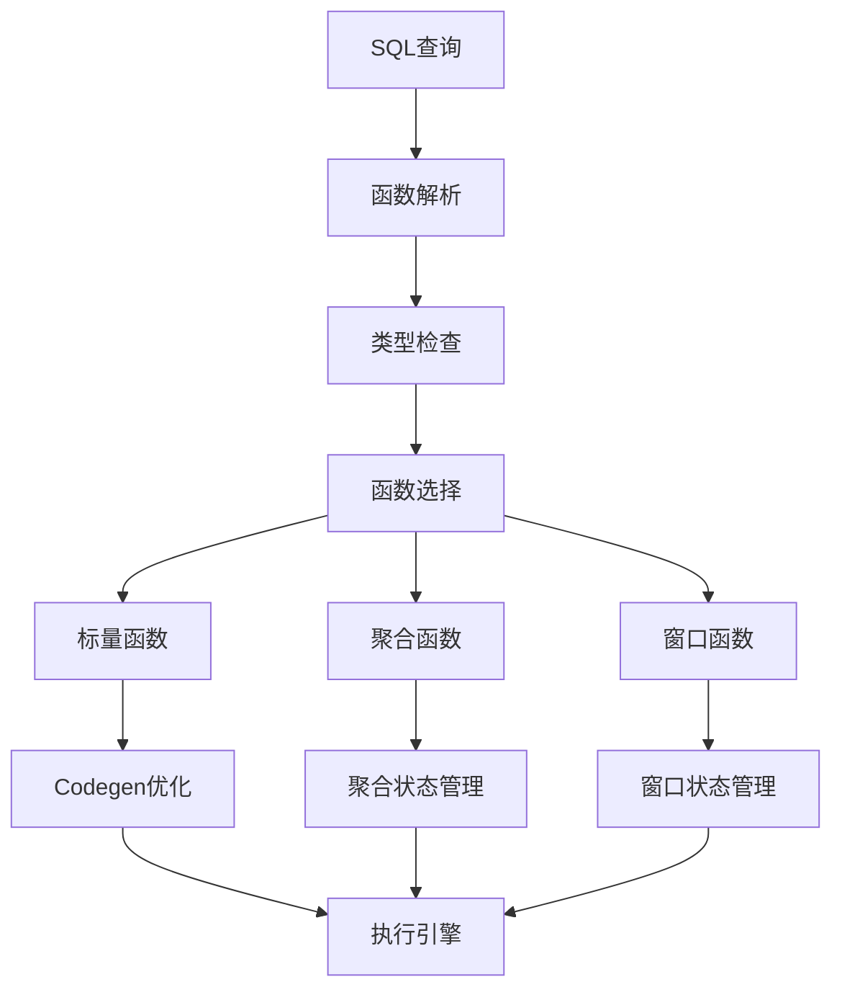
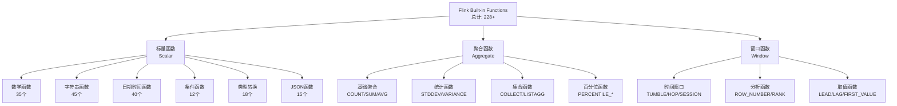
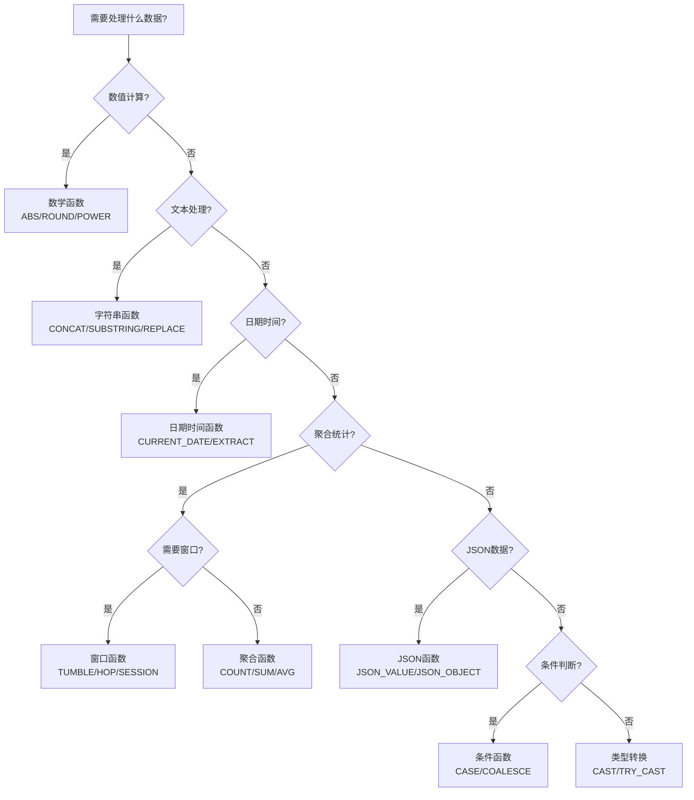
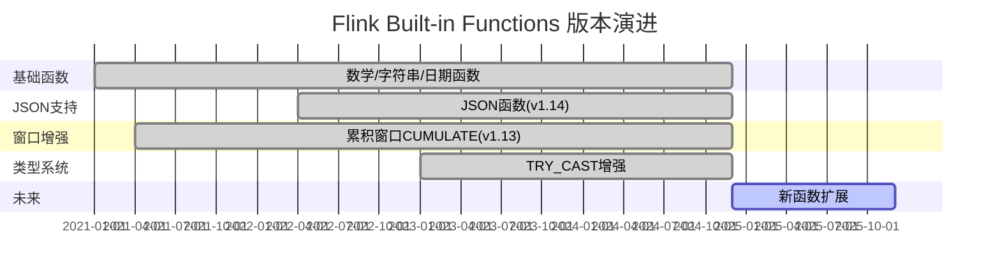

> **状态**: 稳定内容 | **风险等级**: 低 | **最后更新**: 2026-04-20
>
> 本文档基于 Apache Flink 已发布版本进行整理。内容反映当前稳定版本的实现。
>
# Flink Built-in Functions 完整列表

> **所属阶段**: Flink/03-sql-table-api | **前置依赖**: [Flink SQL 概述](../../01-concepts/flink-1.x-vs-2.0-comparison.md) | **形式化等级**: L3 | **版本兼容**: Flink 1.20+

---

## 1. 概念定义 (Definitions)

### Def-F-03-01: 内置函数体系 (Built-in Function System)

Flink SQL 内置函数体系是一个**分层组织的函数集合**，定义为：

$$\mathcal{F}_{builtin} = \langle \mathcal{C}, \mathcal{F}, \Sigma, \mathcal{V} \rangle$$

其中：

- $\mathcal{C}$: 函数类别集合 (数学、字符串、日期时间等)
- $\mathcal{F}$: 函数实例集合，每个函数 $f: \text{Dom}^n \to \text{Cod}$
- $\Sigma$: 函数签名映射 $\sigma: f \mapsto (\text{param\_types}, \text{return\_type})$
- $\mathcal{V}$: 版本兼容性标记 $\mathcal{V}: f \mapsto \{v_{min}, v_{max}, \text{deprecated}\}$

### Def-F-03-02: 函数分类层级

```
Flink Built-in Functions
├── 标量函数 (Scalar Functions)     — 行级转换,1:1映射
│   ├── 数学函数
│   ├── 字符串函数
│   ├── 日期时间函数
│   ├── 条件函数
│   └── 类型转换函数
├── 聚合函数 (Aggregate Functions)  — 多行聚合,N:1映射
├── 窗口函数 (Window Functions)     — 窗口计算
├── JSON函数 (JSON Functions)       — JSON处理
└── 其他函数 (Other Functions)      — 特殊用途
```

---

## 2. 属性推导 (Properties)

### Prop-F-03-01: 函数确定性 (Determinism)

**命题**: Flink内置函数按确定性分为三类：

| 确定性等级 | 函数示例 | 特性 |
|-----------|---------|------|
| **确定性** | `ABS`, `UPPER`, `DATE_FORMAT` | 相同输入必产生相同输出 |
| **非确定性** | `RAND()`, `CURRENT_TIMESTAMP` | 每次调用可能产生不同结果 |
| **动态参数** | `SESSION_USER`, `CURRENT_DATABASE` | 依赖执行上下文 |

### Prop-F-03-02: 空值传播 (Null Propagation)

**命题**: 大多数内置函数遵循 **NULL输入 → NULL输出** 原则：

$$f(\text{NULL}) = \text{NULL}, \quad \forall f \in \mathcal{F}_{scalar} \setminus \mathcal{F}_{null\_handling}$$

例外：空值处理函数 (`COALESCE`, `NULLIF`, `IFNULL`) 显式处理 NULL。

### Prop-F-03-03: 类型推导规则

```
输入类型 → 类型检查 → 隐式转换 → 函数执行 → 输出类型
    ↑___________________________|
          (类型兼容性验证)
```

---

## 3. 关系建立 (Relations)

### 3.1 与SQL标准的关系

Flink内置函数与SQL标准的关系：

| 标准来源 | 覆盖度 | 说明 |
|---------|-------|------|
| ANSI SQL-92 | 95% | 核心函数完全兼容 |
| ANSI SQL:2016 | 80% | JSON函数部分兼容 |
| Apache Calcite | 100% | 基于Calcite SQL解析 |
| 扩展函数 | - | Flink特有函数 |

### 3.2 函数依赖图



---

## 4. 论证过程 (Argumentation)

### 4.1 函数设计决策

**决策1**: 为什么需要 `TRY_CAST`？

- **问题**: `CAST` 在转换失败时抛出异常，中断查询
- **方案**: `TRY_CAST` 返回 NULL 而非异常
- **权衡**: 性能略低（需要异常捕获），但提升容错性

**决策2**: 窗口函数 vs 分组聚合

- **区别**:
  - 分组聚合：输出行数 ≤ 输入行数
  - 窗口函数：输出行数 = 输入行数（每行附加聚合值）

### 4.2 版本兼容性策略

| 版本标记 | 含义 | 处理方式 |
|---------|------|---------|
| 🟢 Stable | 稳定版本 | 可安全使用 |
| 🟡 Experimental | 实验性功能 | 谨慎使用，API可能变更 |
| 🔵 Since 1.x | 版本标记 | 注意最低版本要求 |
| ⚠️ Deprecated | 已弃用 | 规划迁移替代方案 |

---

## 5. 工程论证 (Engineering Argument)

### 5.1 性能考量

**标量函数优化**:

- **Codegen**: 高频函数生成JVM字节码，避免反射开销
- **向量化**: 批量处理减少函数调用次数
- **常量折叠**: 编译期预计算常量表达式

**聚合函数优化**:

- **增量计算**: `SUM`, `COUNT` 等支持增量更新
- **部分聚合**: 先本地聚合再全局聚合，减少数据传输

### 5.2 一致性保证

```
用户定义函数(UDF)
    ↓
内置函数(Built-in)
    ↓
系统函数(System)
    ↓
    信任度递增,优化空间递增
```

---

## 6. 实例验证 (Examples)

### 6.1 函数分类总览

#### 函数类别速查表

| 类别 | 函数数量 | 主要用途 |
|-----|---------|---------|
| 数学函数 | 35+ | 数值计算、统计分析 |
| 字符串函数 | 45+ | 文本处理、模式匹配 |
| 日期时间函数 | 40+ | 时间计算、格式化 |
| 条件函数 | 12+ | 逻辑判断、空值处理 |
| 类型转换函数 | 18+ | 数据类型转换 |
| 聚合函数 | 25+ | 数据统计、汇总 |
| JSON函数 | 15+ | JSON解析、构造 |
| 窗口函数 | 18+ | 流处理窗口计算 |
| 其他函数 | 20+ | 辅助、元数据等 |
| **总计** | **228+** | - |

---

## 7. 函数详细列表

### 7.1 数学函数 (Mathematical Functions) — 35个

> 🔢 **适用版本**: Flink 1.20+ | 🟢 **稳定状态**

#### 基础算术函数

| 函数 | 语法 | 返回值类型 | 描述 | 示例 |
|-----|------|-----------|------|------|
| `ABS` | `ABS(numeric)` | 同输入 | 绝对值 | `ABS(-5)` → `5` |
| `CEIL` | `CEIL(numeric)` | BIGINT/DOUBLE | 向上取整 | `CEIL(4.2)` → `5` |
| `CEILING` | `CEILING(numeric)` | BIGINT/DOUBLE | CEIL别名 | `CEILING(4.2)` → `5` |
| `FLOOR` | `FLOOR(numeric)` | BIGINT/DOUBLE | 向下取整 | `FLOOR(4.8)` → `4` |
| `ROUND` | `ROUND(numeric [, d])` | 同输入 | 四舍五入 | `ROUND(3.14159, 2)` → `3.14` |
| `TRUNCATE` | `TRUNCATE(numeric [, d])` | 同输入 | 截断小数 | `TRUNCATE(3.14159, 2)` → `3.14` |
| `MOD` | `MOD(numeric1, numeric2)` | 同输入 | 取模运算 | `MOD(10, 3)` → `1` |
| `SIGN` | `SIGN(numeric)` | INT | 符号函数 | `SIGN(-5)` → `-1` |
| `PI` | `PI()` | DOUBLE | 圆周率π | `PI()` → `3.14159...` |
| `E` | `E()` | DOUBLE | 自然常数e | `E()` → `2.71828...` |

#### 幂指对数函数

| 函数 | 语法 | 返回值类型 | 描述 | 示例 |
|-----|------|-----------|------|------|
| `POWER` | `POWER(base, exp)` | DOUBLE | 幂运算 | `POWER(2, 3)` → `8.0` |
| `POW` | `POW(base, exp)` | DOUBLE | POWER别名 | `POW(2, 3)` → `8.0` |
| `SQRT` | `SQRT(numeric)` | DOUBLE | 平方根 | `SQRT(16)` → `4.0` |
| `CBRT` | `CBRT(numeric)` | DOUBLE | 立方根 | `CBRT(27)` → `3.0` |
| `EXP` | `EXP(numeric)` | DOUBLE | e的幂 | `EXP(1)` → `2.718...` |
| `LN` | `LN(numeric)` | DOUBLE | 自然对数 | `LN(E())` → `1.0` |
| `LOG` | `LOG(base, value)` | DOUBLE | 指定底对数 | `LOG(2, 8)` → `3.0` |
| `LOG10` | `LOG10(numeric)` | DOUBLE | 常用对数 | `LOG10(100)` → `2.0` |
| `LOG2` | `LOG2(numeric)` | DOUBLE | 以2为底对数 | `LOG2(8)` → `3.0` |

#### 三角函数

| 函数 | 语法 | 返回值类型 | 描述 | 示例 |
|-----|------|-----------|------|------|
| `SIN` | `SIN(numeric)` | DOUBLE | 正弦 | `SIN(PI()/2)` → `1.0` |
| `COS` | `COS(numeric)` | DOUBLE | 余弦 | `COS(0)` → `1.0` |
| `TAN` | `TAN(numeric)` | DOUBLE | 正切 | `TAN(PI()/4)` → `1.0` |
| `COT` | `COT(numeric)` | DOUBLE | 余切 | `COT(PI()/4)` → `1.0` |
| `ASIN` | `ASIN(numeric)` | DOUBLE | 反正弦 | `ASIN(1)` → `1.57...` |
| `ACOS` | `ACOS(numeric)` | DOUBLE | 反余弦 | `ACOS(1)` → `0.0` |
| `ATAN` | `ATAN(numeric)` | DOUBLE | 反正切 | `ATAN(1)` → `0.785...` |
| `ATAN2` | `ATAN2(y, x)` | DOUBLE | 四象限反正切 | `ATAN2(1, 1)` → `0.785...` |
| `SINH` | `SINH(numeric)` | DOUBLE | 双曲正弦 | `SINH(1)` → `1.175...` |
| `COSH` | `COSH(numeric)` | DOUBLE | 双曲余弦 | `COSH(0)` → `1.0` |
| `TANH` | `TANH(numeric)` | DOUBLE | 双曲正切 | `TANH(0)` → `0.0` |
| `DEGREES` | `DEGREES(radians)` | DOUBLE | 弧度转角度 | `DEGREES(PI())` → `180.0` |
| `RADIANS` | `RADIANS(degrees)` | DOUBLE | 角度转弧度 | `RADIANS(180)` → `3.141...` |

#### 随机与位运算函数

| 函数 | 语法 | 返回值类型 | 描述 | 示例 |
|-----|------|-----------|------|------|
| `RAND` | `RAND([seed])` | DOUBLE | 随机数 | `RAND()` → `0.123...` |
| `RAND_INTEGER` | `RAND_INTEGER([seed], bound)` | INT | 随机整数 | `RAND_INTEGER(100)` → `42` |
| `UUID` | `UUID()` | STRING | UUID字符串 | `UUID()` → `'a1b2-c3d4-...'` |
| `BITAND` | `BITAND(n1, n2)` | BIGINT | 按位与 | `BITAND(5, 3)` → `1` |
| `BITOR` | `BITOR(n1, n2)` | BIGINT | 按位或 | `BITOR(5, 3)` → `7` |
| `BITXOR` | `BITXOR(n1, n2)` | BIGINT | 按位异或 | `BITXOR(5, 3)` → `6` |
| `BITNOT` | `BITNOT(n)` | BIGINT | 按位非 | `BITNOT(5)` → `-6` |

---

### 7.2 字符串函数 (String Functions) — 45个

> 📝 **适用版本**: Flink 1.20+ | 🟢 **稳定状态**

#### 连接与分割函数

| 函数 | 语法 | 返回值类型 | 描述 | 示例 |
|-----|------|-----------|------|------|
| `CONCAT` | `CONCAT(string1, ...)` | STRING | 字符串连接 | `CONCAT('a', 'b')` → `'ab'` |
| `CONCAT_WS` | `CONCAT_WS(sep, ...)` | STRING | 带分隔符连接 | `CONCAT_WS('-', 'a', 'b')` → `'a-b'` |
| `SPLIT` | `SPLIT(string, delimiter)` | ARRAY<STRING> | 字符串分割 | `SPLIT('a,b', ',')` → `['a','b']` |

#### 子串提取函数

| 函数 | 语法 | 返回值类型 | 描述 | 示例 |
|-----|------|-----------|------|------|
| `SUBSTRING` | `SUBSTRING(str, pos [, len])` | STRING | 子串提取 | `SUBSTRING('hello', 2, 3)` → `'ell'` |
| `SUBSTR` | `SUBSTR(str, pos [, len])` | STRING | SUBSTRING别名 | `SUBSTR('hello', 2)` → `'ello'` |
| `LEFT` | `LEFT(str, len)` | STRING | 左侧截取 | `LEFT('hello', 3)` → `'hel'` |
| `RIGHT` | `RIGHT(str, len)` | STRING | 右侧截取 | `RIGHT('hello', 3)` → `'llo'` |

#### 修剪与填充函数

| 函数 | 语法 | 返回值类型 | 描述 | 示例 |
|-----|------|-----------|------|------|
| `TRIM` | `TRIM([LEADING/..] [chars] FROM str)` | STRING | 去除字符 | `TRIM('  hello  ')` → `'hello'` |
| `LTRIM` | `LTRIM(string)` | STRING | 左侧去空格 | `LTRIM('  hello')` → `'hello'` |
| `RTRIM` | `RTRIM(string)` | STRING | 右侧去空格 | `RTRIM('hello  ')` → `'hello'` |
| `LPAD` | `LPAD(str, len [, pad])` | STRING | 左侧填充 | `LPAD('hi', 5, 'x')` → `'xxxhi'` |
| `RPAD` | `RPAD(str, len [, pad])` | STRING | 右侧填充 | `RPAD('hi', 5, 'x')` → `'hixxx'` |
| `REPEAT` | `REPEAT(str, count)` | STRING | 重复字符串 | `REPEAT('ab', 3)` → `'ababab'` |
| `SPACE` | `SPACE(n)` | STRING | 空格字符串 | `SPACE(3)` → `'   '` |

#### 大小写转换函数

| 函数 | 语法 | 返回值类型 | 描述 | 示例 |
|-----|------|-----------|------|------|
| `UPPER` | `UPPER(string)` | STRING | 转大写 | `UPPER('hello')` → `'HELLO'` |
| `UCASE` | `UCASE(string)` | STRING | UPPER别名 | `UCASE('hello')` → `'HELLO'` |
| `LOWER` | `LOWER(string)` | STRING | 转小写 | `LOWER('HELLO')` → `'hello'` |
| `LCASE` | `LCASE(string)` | STRING | LOWER别名 | `LCASE('HELLO')` → `'hello'` |
| `INITCAP` | `INITCAP(string)` | STRING | 首字母大写 | `INITCAP('hello world')` → `'Hello World'` |

#### 长度与位置函数

| 函数 | 语法 | 返回值类型 | 描述 | 示例 |
|-----|------|-----------|------|------|
| `LENGTH` | `LENGTH(string)` | INT | 字节长度 | `LENGTH('hello')` → `5` |
| `CHAR_LENGTH` | `CHAR_LENGTH(string)` | INT | 字符长度 | `CHAR_LENGTH('hello')` → `5` |
| `CHARACTER_LENGTH` | `CHARACTER_LENGTH(string)` | INT | CHAR_LENGTH别名 | - |
| `OCTET_LENGTH` | `OCTET_LENGTH(string)` | INT | 字节数 | `OCTET_LENGTH('中')` → `3` |
| `POSITION` | `POSITION(substr IN str)` | INT | 子串位置 | `POSITION('ll' IN 'hello')` → `3` |
| `INSTR` | `INSTR(str, substr)` | INT | 子串位置 | `INSTR('hello', 'll')` → `3` |
| `LOCATE` | `LOCATE(substr, str [, pos])` | INT | 指定位置查找 | `LOCATE('l', 'hello', 4)` → `4` |

#### 替换与正则函数

| 函数 | 语法 | 返回值类型 | 描述 | 示例 |
|-----|------|-----------|------|------|
| `REPLACE` | `REPLACE(str, from, to)` | STRING | 字符串替换 | `REPLACE('hello', 'l', 'x')` → `'hexxo'` |
| `REGEXP_REPLACE` | `REGEXP_REPLACE(str, regex, rep)` | STRING | 正则替换 | `REGEXP_REPLACE('abc123', '[0-9]', 'X')` → `'abcXXX'` |
| `REGEXP_EXTRACT` | `REGEXP_EXTRACT(str, regex [, group])` | STRING | 正则提取 | `REGEXP_EXTRACT('abc', 'a(.)c', 1)` → `'b'` |
| `REGEXP_EXTRACT_ALL` | `REGEXP_EXTRACT_ALL(str, regex)` | ARRAY<STRING> | 提取所有匹配 | - |

#### 编码与其他函数

| 函数 | 语法 | 返回值类型 | 描述 | 示例 |
|-----|------|-----------|------|------|
| `ASCII` | `ASCII(string)` | INT | 首字符ASCII码 | `ASCII('A')` → `65` |
| `CHR` | `CHR(code)` | STRING | ASCII码转字符 | `CHR(65)` → `'A'` |
| `ENCODE` | `ENCODE(str, charset)` | BINARY | 字符串编码 | `ENCODE('hello', 'UTF-8')` |
| `DECODE` | `DECODE(bin, charset)` | STRING | 二进制解码 | `DECODE(bin, 'UTF-8')` |
| `BASE64` | `BASE64(bin)` | STRING | Base64编码 | `BASE64(x'4869')` → `'SGk='` |
| `UNBASE64` | `UNBASE64(str)` | BINARY | Base64解码 | `UNBASE64('SGk=')` → `x'4869'` |
| `URL_ENCODE` | `URL_ENCODE(str)` | STRING | URL编码 | `URL_ENCODE('a b')` → `'a%20b'` |
| `URL_DECODE` | `URL_DECODE(str)` | STRING | URL解码 | `URL_DECODE('a%20b')` → `'a b'` |
| `PARSE_URL` | `PARSE_URL(url, part [, key])` | STRING | URL解析 | `PARSE_URL('http://a/b?c=1', 'QUERY', 'c')` → `'1'` |

---

### 7.3 日期时间函数 (Date/Time Functions) — 40个

> 📅 **适用版本**: Flink 1.20+ | 🟢 **稳定状态**

#### 当前日期时间函数

| 函数 | 语法 | 返回值类型 | 描述 | 确定性 |
|-----|------|-----------|------|-------|
| `CURRENT_DATE` | `CURRENT_DATE` | DATE | 当前日期 | ❌ 非确定性 |
| `CURRENT_TIME` | `CURRENT_TIME` | TIME | 当前时间 | ❌ 非确定性 |
| `CURRENT_TIMESTAMP` | `CURRENT_TIMESTAMP` | TIMESTAMP | 当前时间戳 | ❌ 非确定性 |
| `CURRENT_ROW_TIMESTAMP` | `CURRENT_ROW_TIMESTAMP()` | TIMESTAMP_LTZ | 行处理时间戳 | ❌ 非确定性 |
| `NOW` | `NOW()` | TIMESTAMP | CURRENT_TIMESTAMP别名 | ❌ 非确定性 |
| `LOCALTIME` | `LOCALTIME` | TIME | 本地当前时间 | ❌ 非确定性 |
| `LOCALTIMESTAMP` | `LOCALTIMESTAMP` | TIMESTAMP | 本地当前时间戳 | ❌ 非确定性 |

#### 日期时间构造函数

| 函数 | 语法 | 返回值类型 | 描述 | 示例 |
|-----|------|-----------|------|------|
| `DATE` | `DATE(string)` | DATE | 字符串转日期 | `DATE('2024-01-15')` → `2024-01-15` |
| `TIME` | `TIME(string)` | TIME | 字符串转时间 | `TIME('14:30:00')` → `14:30:00` |
| `TIMESTAMP` | `TIMESTAMP(string)` | TIMESTAMP | 字符串转时间戳 | `TIMESTAMP('2024-01-15 14:30:00')` |
| `TIMESTAMP_LTZ` | `TIMESTAMP_LTZ(string)` | TIMESTAMP_LTZ | 带时区时间戳 | - |
| `MAKE_DATE` | `MAKE_DATE(year, month, day)` | DATE | 构造日期 | `MAKE_DATE(2024, 1, 15)` → `2024-01-15` |
| `MAKE_TIME` | `MAKE_TIME(hour, min, sec)` | TIME | 构造时间 | `MAKE_TIME(14, 30, 0)` → `14:30:00` |
| `MAKE_TIMESTAMP` | `MAKE_TIMESTAMP(y,m,d,h,mi,s)` | TIMESTAMP | 构造时间戳 | - |

#### 格式化与解析函数

| 函数 | 语法 | 返回值类型 | 描述 | 示例 |
|-----|------|-----------|------|------|
| `DATE_FORMAT` | `DATE_FORMAT(timestamp, format)` | STRING | 日期格式化 | `DATE_FORMAT(ts, 'yyyy-MM-dd')` |
| `DATE_PARSE` | `DATE_PARSE(string, format)` | TIMESTAMP | 日期解析 | `DATE_PARSE('2024-01-15', 'yyyy-MM-dd')` |
| `FROM_UNIXTIME` | `FROM_UNIXTIME(unixtime)` | TIMESTAMP | Unix时间戳转日期 | `FROM_UNIXTIME(1705315800)` |
| `UNIX_TIMESTAMP` | `UNIX_TIMESTAMP([string])` | BIGINT | 转Unix时间戳 | `UNIX_TIMESTAMP()` → `1705315800` |
| `TO_TIMESTAMP` | `TO_TIMESTAMP(string [, format])` | TIMESTAMP | 转时间戳 | `TO_TIMESTAMP('2024-01-15')` |
| `TO_DATE` | `TO_DATE(string)` | DATE | 转日期 | `TO_DATE('2024-01-15')` |

#### 时间提取函数

| 函数 | 语法 | 返回值类型 | 描述 | 示例 |
|-----|------|-----------|------|------|
| `YEAR` | `YEAR(date)` | INT | 提取年份 | `YEAR('2024-01-15')` → `2024` |
| `QUARTER` | `QUARTER(date)` | INT | 提取季度 | `QUARTER('2024-03-15')` → `1` |
| `MONTH` | `MONTH(date)` | INT | 提取月份 | `MONTH('2024-01-15')` → `1` |
| `WEEK` | `WEEK(date)` | INT | 提取周数 | `WEEK('2024-01-15')` → `3` |
| `DAYOFWEEK` | `DAYOFWEEK(date)` | INT | 星期几(1-7) | `DAYOFWEEK('2024-01-15')` → `2` |
| `DAYOFMONTH` | `DAYOFMONTH(date)` | INT | 月中第几天 | `DAYOFMONTH('2024-01-15')` → `15` |
| `DAYOFYEAR` | `DAYOFYEAR(date)` | INT | 年中第几天 | `DAYOFYEAR('2024-01-15')` → `15` |
| `DAY` | `DAY(date)` | INT | DAYOFMONTH别名 | - |
| `HOUR` | `HOUR(timestamp)` | INT | 提取小时 | `HOUR('14:30:00')` → `14` |
| `MINUTE` | `MINUTE(timestamp)` | INT | 提取分钟 | `MINUTE('14:30:00')` → `30` |
| `SECOND` | `SECOND(timestamp)` | INT | 提取秒 | `SECOND('14:30:45')` → `45` |
| `MILLISECOND` | `MILLISECOND(timestamp)` | INT | 提取毫秒 | - |
| `EXTRACT` | `EXTRACT(field FROM source)` | INT | 通用提取 | `EXTRACT(YEAR FROM date)` |

#### 时间运算函数

| 函数 | 语法 | 返回值类型 | 描述 | 示例 |
|-----|------|-----------|------|------|
| `DATE_ADD` | `DATE_ADD(date, days)` | DATE | 日期加减 | `DATE_ADD('2024-01-15', 5)` → `2024-01-20` |
| `DATE_SUB` | `DATE_SUB(date, days)` | DATE | 日期减 | `DATE_SUB('2024-01-15', 5)` → `2024-01-10` |
| `ADD_MONTHS` | `ADD_MONTHS(date, months)` | DATE | 加减月份 | `ADD_MONTHS('2024-01-15', 2)` → `2024-03-15` |
| `DATEDIFF` | `DATEDIFF(end, start)` | INT | 日期差天数 | `DATEDIFF('2024-01-20', '2024-01-15')` → `5` |
| `TIMESTAMPDIFF` | `TIMESTAMPDIFF(unit, start, end)` | INT | 时间戳差 | `TIMESTAMPDIFF(HOUR, t1, t2)` |
| `DATE_DIFF` | `DATE_DIFF(end, start)` | INT | DATEDIFF别名 | - |
| `FLOOR` | `FLOOR(timepoint TO unit)` | 同输入 | 时间取整 | `FLOOR(ts TO HOUR)` |
| `CEIL` | `CEIL(timepoint TO unit)` | 同输入 | 时间上取整 | `CEIL(ts TO HOUR)` |

#### 时区函数

| 函数 | 语法 | 返回值类型 | 描述 | 示例 |
|-----|------|-----------|------|------|
| `CONVERT_TZ` | `CONVERT_TZ(dt, from_tz, to_tz)` | TIMESTAMP | 时区转换 | `CONVERT_TZ(ts, 'UTC', 'Asia/Shanghai')` |

---

### 7.4 条件函数 (Conditional Functions) — 12个

> ⚡ **适用版本**: Flink 1.20+ | 🟢 **稳定状态**

#### 条件判断函数

| 函数 | 语法 | 返回值类型 | 描述 | 示例 |
|-----|------|-----------|------|------|
| `CASE` | `CASE WHEN cond THEN ... END` | 推断 | 条件分支 | `CASE WHEN score>90 THEN 'A' ELSE 'B' END` |
| `IF` | `IF(condition, true_value, false_value)` | 推断 | 条件函数 | `IF(score>60, 'PASS', 'FAIL')` |
| `NULLIF` | `NULLIF(expr1, expr2)` | 同输入 | 相等返回NULL | `NULLIF(a, b)` |
| `COALESCE` | `COALESCE(val1, val2, ...)` | 推断 | 返回第一个非NULL | `COALESCE(NULL, NULL, 'default')` → `'default'` |
| `IFNULL` | `IFNULL(expr1, expr2)` | 同输入 | expr1为NULL返回expr2 | `IFNULL(NULL, 'default')` → `'default'` |
| `ISNULL` | `ISNULL(expr)` | BOOLEAN | 是否为NULL | `ISNULL(NULL)` → `TRUE` |
| `NVL` | `NVL(expr1, expr2)` | 同输入 | IFNULL别名 | `NVL(NULL, 'default')` → `'default'` |
| `NVL2` | `NVL2(expr1, expr2, expr3)` | 推断 | expr1非NULL返回expr2 | `NVL2(NULL, 'a', 'b')` → `'b'` |

#### 空值判断谓词

| 谓词 | 语法 | 返回值类型 | 描述 | 示例 |
|-----|------|-----------|------|------|
| `IS NULL` | `expr IS NULL` | BOOLEAN | 空值判断 | `name IS NULL` |
| `IS NOT NULL` | `expr IS NOT NULL` | BOOLEAN | 非空判断 | `name IS NOT NULL` |
| `IS TRUE` | `expr IS TRUE` | BOOLEAN | 为TRUE | `flag IS TRUE` |
| `IS FALSE` | `expr IS FALSE` | BOOLEAN | 为FALSE | `flag IS FALSE` |

---

### 7.5 类型转换函数 (Type Conversion Functions) — 18个

> 🔄 **适用版本**: Flink 1.20+ | 🟢 **稳定状态**

#### 显式转换函数

| 函数 | 语法 | 返回值类型 | 描述 | 示例 |
|-----|------|-----------|------|------|
| `CAST` | `CAST(expr AS type)` | 目标类型 | 类型转换 | `CAST('123' AS INT)` → `123` |
| `TRY_CAST` | `TRY_CAST(expr AS type)` | 目标类型/NULL | 安全转换 | `TRY_CAST('abc' AS INT)` → `NULL` |

#### 日期时间转换

| 函数 | 语法 | 返回值类型 | 描述 | 示例 |
|-----|------|-----------|------|------|
| `TO_DATE` | `TO_DATE(string)` | DATE | 转日期 | `TO_DATE('2024-01-15')` |
| `TO_TIMESTAMP` | `TO_TIMESTAMP(string [, format])` | TIMESTAMP | 转时间戳 | `TO_TIMESTAMP('2024-01-15 14:30:00')` |
| `TO_TIMESTAMP_LTZ` | `TO_TIMESTAMP_LTZ(epoch, precision)` | TIMESTAMP_LTZ | 转带时区时间戳 | `TO_TIMESTAMP_LTZ(1705315800, 0)` |

#### 数值转换

| 函数 | 语法 | 返回值类型 | 描述 | 示例 |
|-----|------|-----------|------|------|
| `BIN` | `BIN(numeric)` | STRING | 转二进制字符串 | `BIN(5)` → `'101'` |
| `HEX` | `HEX(numeric \| string)` | STRING | 转十六进制 | `HEX(255)` → `'FF'` |
| `UNHEX` | `UNHEX(string)` | BINARY | 十六进制转二进制 | `UNHEX('FF')` → `x'FF'` |
| `BINARY` | `BINARY(string)` | BINARY | 转二进制 | `BINARY('hello')` |

#### 其他转换函数

| 函数 | 语法 | 返回值类型 | 描述 | 示例 |
|-----|------|-----------|------|------|
| `TYPEOF` | `TYPEOF(expr)` | STRING | 返回类型名称 | `TYPEOF(123)` → `'INT'` |
| `STRUCT` | `STRUCT(expr1, expr2, ...)` | ROW | 构造结构体 | `STRUCT(1, 'a')` |
| `ARRAY` | `ARRAY(expr1, expr2, ...)` | ARRAY | 构造数组 | `ARRAY(1, 2, 3)` |
| `MAP` | `MAP(key0, value0, ...)` | MAP | 构造映射 | `MAP('a', 1, 'b', 2)` |
| `ROW` | `ROW(expr1, expr2, ...)` | ROW | STRUCT别名 | `ROW(1, 'a')` |

---

### 7.6 聚合函数 (Aggregate Functions) — 25个

> 📊 **适用版本**: Flink 1.20+ | 🟢 **稳定状态**

#### 基础聚合函数

| 函数 | 语法 | 返回值类型 | 描述 | 示例 |
|-----|------|-----------|------|------|
| `COUNT` | `COUNT([DISTINCT] expr)` | BIGINT | 计数 | `COUNT(*)` |
| `COUNT_DISTINCT` | `COUNT(DISTINCT expr)` | BIGINT | 去重计数 | `COUNT(DISTINCT user_id)` |
| `SUM` | `SUM([DISTINCT] expr)` | 同输入 | 求和 | `SUM(amount)` |
| `SUM0` | `SUM0(expr)` | 同输入 | 空返回0而非NULL | `SUM0(amount)` |
| `AVG` | `AVG([DISTINCT] expr)` | DOUBLE/DECIMAL | 平均值 | `AVG(score)` |
| `MAX` | `MAX(expr)` | 同输入 | 最大值 | `MAX(salary)` |
| `MIN` | `MIN(expr)` | 同输入 | 最小值 | `MIN(salary)` |
| `PRODUCT` | `PRODUCT(expr)` | 同输入 | 乘积 | `PRODUCT(values)` |

#### 统计聚合函数

| 函数 | 语法 | 返回值类型 | 描述 | 示例 |
|-----|------|-----------|------|------|
| `STDDEV_POP` | `STDDEV_POP(expr)` | DOUBLE | 总体标准差 | `STDDEV_POP(score)` |
| `STDDEV_SAMP` | `STDDEV_SAMP(expr)` | DOUBLE | 样本标准差 | `STDDEV_SAMP(score)` |
| `STDDEV` | `STDDEV(expr)` | DOUBLE | STDDEV_SAMP别名 | - |
| `VAR_POP` | `VAR_POP(expr)` | DOUBLE | 总体方差 | `VAR_POP(score)` |
| `VAR_SAMP` | `VAR_SAMP(expr)` | DOUBLE | 样本方差 | `VAR_SAMP(score)` |
| `VARIANCE` | `VARIANCE(expr)` | DOUBLE | VAR_SAMP别名 | - |

#### 集合聚合函数

| 函数 | 语法 | 返回值类型 | 描述 | 示例 |
|-----|------|-----------|------|------|
| `COLLECT` | `COLLECT(expr)` | ARRAY | 收集为数组 | `COLLECT(user_id)` |
| `LISTAGG` | `LISTAGG(expr [, sep])` | STRING | 聚合为字符串 | `LISTAGG(name, ',')` |
| `ARRAY_AGG` | `ARRAY_AGG(expr)` | ARRAY | COLLECT别名 | - |

#### 有序集聚合函数

| 函数 | 语法 | 返回值类型 | 描述 | 示例 |
|-----|------|-----------|------|------|
| `PERCENTILE_CONT` | `PERCENTILE_CONT(fraction) WITHIN GROUP (ORDER BY expr)` | DOUBLE | 连续百分位 | - |
| `PERCENTILE_DISC` | `PERCENTILE_DISC(fraction) WITHIN GROUP (ORDER BY expr)` | 同输入 | 离散百分位 | - |

---

### 7.7 窗口函数 (Window Functions) — 18个

> 🪟 **适用版本**: Flink 1.20+ | 🟢 **稳定状态**

#### 时间窗口函数

| 函数 | 语法 | 返回值类型 | 描述 | 示例 |
|-----|------|-----------|------|------|
| `TUMBLE` | `TUMBLE(time_attr, interval)` | TIMESTAMP | 滚动窗口 | `TUMBLE(rowtime, INTERVAL '1' HOUR)` |
| `TUMBLE_START` | `TUMBLE_START(time_attr, interval)` | TIMESTAMP | 窗口开始时间 | - |
| `TUMBLE_END` | `TUMBLE_END(time_attr, interval)` | TIMESTAMP | 窗口结束时间 | - |
| `TUMBLE_ROWTIME` | `TUMBLE_ROWTIME(time_attr, interval)` | TIMESTAMP | 窗口行时间 | - |
| `TUMBLE_PROCTIME` | `TUMBLE_PROCTIME(time_attr, interval)` | TIMESTAMP | 窗口处理时间 | - |
| `HOP` | `HOP(time_attr, slide, size)` | TIMESTAMP | 滑动窗口 | `HOP(rowtime, INTERVAL '5' MINUTE, INTERVAL '1' HOUR)` |
| `HOP_START` | `HOP_START(...)` | TIMESTAMP | 滑动窗口开始 | - |
| `HOP_END` | `HOP_END(...)` | TIMESTAMP | 滑动窗口结束 | - |
| `SESSION` | `SESSION(time_attr, gap)` | TIMESTAMP | 会话窗口 | `SESSION(rowtime, INTERVAL '10' MINUTE)` |
| `SESSION_START` | `SESSION_START(...)` | TIMESTAMP | 会话窗口开始 | - |
| `SESSION_END` | `SESSION_END(...)` | TIMESTAMP | 会话窗口结束 | - |
| `SESSION_ROWTIME` | `SESSION_ROWTIME(...)` | TIMESTAMP | 会话行时间 | - |
| `CUMULATE` | `CUMULATE(time_attr, step, max)` | TIMESTAMP | 累积窗口 | `CUMULATE(rowtime, INTERVAL '10' MINUTE, INTERVAL '1' HOUR)` |
| `CUMULATE_START` | `CUMULATE_START(...)` | TIMESTAMP | 累积窗口开始 | - |
| `CUMULATE_END` | `CUMULATE_END(...)` | TIMESTAMP | 累积窗口结束 | - |

#### 分析窗口函数 (OVER子句)

| 函数 | 语法 | 返回值类型 | 描述 | 示例 |
|-----|------|-----------|------|------|
| `ROW_NUMBER` | `ROW_NUMBER() OVER (...)` | BIGINT | 行号 | - |
| `RANK` | `RANK() OVER (...)` | BIGINT | 排名(跳跃) | - |
| `DENSE_RANK` | `DENSE_RANK() OVER (...)` | BIGINT | 密集排名 | - |
| `LEAD` | `LEAD(expr [, offset [, default]]) OVER (...)` | 同输入 | 后行值 | `LEAD(salary, 1)` |
| `LAG` | `LAG(expr [, offset [, default]]) OVER (...)` | 同输入 | 前行值 | `LAG(salary, 1)` |
| `FIRST_VALUE` | `FIRST_VALUE(expr) OVER (...)` | 同输入 | 窗口首值 | - |
| `LAST_VALUE` | `LAST_VALUE(expr) OVER (...)` | 同输入 | 窗口末值 | - |
| `NTH_VALUE` | `NTH_VALUE(expr, n) OVER (...)` | 同输入 | 窗口第N值 | `NTH_VALUE(salary, 3)` |

---

### 7.8 JSON函数 (JSON Functions) — 15个

> 🗂️ **适用版本**: Flink 1.20+ | 🟢 **稳定状态** | 🔵 Since 1.14

#### JSON存在性检查

| 函数 | 语法 | 返回值类型 | 描述 | 示例 |
|-----|------|-----------|------|------|
| `JSON_EXISTS` | `JSON_EXISTS(json, path)` | BOOLEAN | JSON路径存在检查 | `JSON_EXISTS('{"a":1}', '$.a')` → `TRUE` |

#### JSON值提取

| 函数 | 语法 | 返回值类型 | 描述 | 示例 |
|-----|------|-----------|------|------|
| `JSON_VALUE` | `JSON_VALUE(json, path [RETURNING type])` | 指定类型 | 提取标量值 | `JSON_VALUE('{"a":1}', '$.a')` → `1` |
| `JSON_QUERY` | `JSON_QUERY(json, path)` | STRING | 提取JSON对象/数组 | `JSON_QUERY('{"a":[1,2]}', '$.a')` → `'[1,2]'` |

#### JSON构造

| 函数 | 语法 | 返回值类型 | 描述 | 示例 |
|-----|------|-----------|------|------|
| `JSON_OBJECT` | `JSON_OBJECT([KEY] key VALUE value, ...)` | STRING | 构造JSON对象 | `JSON_OBJECT('name' VALUE 'John')` |
| `JSON_ARRAY` | `JSON_ARRAY(expr1, expr2, ...)` | STRING | 构造JSON数组 | `JSON_ARRAY(1, 2, 3)` → `'[1,2,3]'` |

#### JSON聚合

| 函数 | 语法 | 返回值类型 | 描述 | 示例 |
|-----|------|-----------|------|------|
| `JSON_OBJECTAGG` | `JSON_OBJECTAGG(key, value)` | STRING | 聚合为JSON对象 | - |
| `JSON_ARRAYAGG` | `JSON_ARRAYAGG(expr)` | STRING | 聚合为JSON数组 | - |

#### JSON高级函数

| 函数 | 语法 | 返回值类型 | 描述 | 示例 |
|-----|------|-----------|------|------|
| `JSON_STRING` | `JSON_STRING(value)` | STRING | 值转JSON字符串 | `JSON_STRING(123)` → `'123'` |
| `JSON_TYPE` | `JSON_TYPE(json)` | STRING | 返回JSON类型 | `JSON_TYPE('[1,2]')` → `'ARRAY'` |
| `JSON_DEPTH` | `JSON_DEPTH(json)` | INT | 返回JSON深度 | `JSON_DEPTH('{"a":{"b":1}}')` → `3` |
| `JSON_LENGTH` | `JSON_LENGTH(json [, path])` | INT | 返回JSON元素数 | `JSON_LENGTH('[1,2,3]')` → `3` |
| `JSON_KEYS` | `JSON_KEYS(json [, path])` | ARRAY<STRING> | 返回对象键 | `JSON_KEYS('{"a":1,"b":2}')` → `['a','b']` |
| `JSON_INSERT` | `JSON_INSERT(json, path, val, ...)` | STRING | 插入JSON值 | - |
| `JSON_REPLACE` | `JSON_REPLACE(json, path, val, ...)` | STRING | 替换JSON值 | - |
| `JSON_REMOVE` | `JSON_REMOVE(json, path, ...)` | STRING | 移除JSON值 | - |
| `JSON_MERGE` | `JSON_MERGE(json1, json2, ...)` | STRING | 合并JSON | `JSON_MERGE('{"a":1}', '{"b":2}')` |
| `JSON_PRETTY` | `JSON_PRETTY(json)` | STRING | 格式化JSON | - |

---

### 7.9 其他函数 (Other Functions) — 20个

> 🔧 **适用版本**: Flink 1.20+ | 🟢 **稳定状态**

#### 集合函数

| 函数 | 语法 | 返回值类型 | 描述 | 示例 |
|-----|------|-----------|------|------|
| `CARDINALITY` | `CARDINALITY(array)` | INT | 数组元素数 | `CARDINALITY(ARRAY[1,2,3])` → `3` |
| `ELEMENT` | `ELEMENT(array)` | 元素类型 | 单元素数组取值 | `ELEMENT(ARRAY[1])` → `1` |
| `ARRAY_CONTAINS` | `ARRAY_CONTAINS(array, val)` | BOOLEAN | 数组包含检查 | `ARRAY_CONTAINS(ARRAY[1,2], 1)` → `TRUE` |
| `ARRAY_POSITION` | `ARRAY_POSITION(array, val)` | INT | 元素位置 | `ARRAY_POSITION(ARRAY[1,2], 2)` → `2` |
| `ARRAY_APPEND` | `ARRAY_APPEND(array, val)` | ARRAY | 追加元素 | - |
| `ARRAY_JOIN` | `ARRAY_JOIN(array, sep)` | STRING | 数组连接 | `ARRAY_JOIN(ARRAY['a','b'], ',')` → `'a,b'` |
| `MAP_KEYS` | `MAP_KEYS(map)` | ARRAY | 返回Map键 | - |
| `MAP_VALUES` | `MAP_VALUES(map)` | ARRAY | 返回Map值 | - |
| `MAP_ENTRIES` | `MAP_ENTRIES(map)` | ARRAY<ROW> | 返回Map条目 | - |
| `MAP_FROM_ARRAYS` | `MAP_FROM_ARRAYS(keys, values)` | MAP | 从数组构造Map | - |

#### 系统/元数据函数

| 函数 | 语法 | 返回值类型 | 描述 | 确定性 |
|-----|------|-----------|------|-------|
| `CURRENT_DATABASE` | `CURRENT_DATABASE()` | STRING | 当前数据库 | ❌ |
| `CURRENT_CATALOG` | `CURRENT_CATALOG()` | STRING | 当前Catalog | ❌ |
| `CURRENT_USER` | `CURRENT_USER()` | STRING | 当前用户 | ❌ |
| `SESSION_USER` | `SESSION_USER()` | STRING | 会话用户 | ❌ |
| `SYSTEM_USER` | `SYSTEM_USER()` | STRING | 系统用户 | ❌ |
| `VERSION` | `VERSION()` | STRING | 版本信息 | ✅ |

#### 比较函数

| 函数 | 语法 | 返回值类型 | 描述 | 示例 |
|-----|------|-----------|------|------|
| `GREATEST` | `GREATEST(val1, val2, ...)` | 推断 | 返回最大值 | `GREATEST(1, 5, 3)` → `5` |
| `LEAST` | `LEAST(val1, val2, ...)` | 推断 | 返回最小值 | `LEAST(1, 5, 3)` → `1` |

---

## 8. 快速查找索引

### 8.1 A-Z函数索引

| 字母 | 函数列表 |
|-----|---------|
| **A** | `ABS`, `ACOS`, `ADD_MONTHS`, `ARRAY`, `ARRAY_AGG`, `ARRAY_APPEND`, `ARRAY_CONTAINS`, `ARRAY_JOIN`, `ARRAY_POSITION`, `ASCII`, `ASIN`, `ATAN`, `ATAN2`, `AVG` |
| **B** | `BASE64`, `BIN`, `BINARY`, `BITAND`, `BITNOT`, `BITOR`, `BITXOR` |
| **C** | `CARDINALITY`, `CAST`, `CBRT`, `CEIL`, `CEILING`, `CHAR_LENGTH`, `CHARACTER_LENGTH`, `CHR`, `COALESCE`, `COLLECT`, `CONCAT`, `CONCAT_WS`, `COS`, `COSH`, `COT`, `COUNT`, `COUNT_DISTINCT`, `CURRENT_CATALOG`, `CURRENT_DATABASE`, `CURRENT_DATE`, `CURRENT_ROW_TIMESTAMP`, `CURRENT_TIME`, `CURRENT_TIMESTAMP`, `CURRENT_USER`, `CUMULATE`, `CUMULATE_END`, `CUMULATE_PROCTIME`, `CUMULATE_ROWTIME`, `CUMULATE_START` |
| **D** | `DATE`, `DATE_ADD`, `DATE_DIFF`, `DATE_FORMAT`, `DATE_PARSE`, `DATE_SUB`, `DAY`, `DAYOFMONTH`, `DAYOFWEEK`, `DAYOFYEAR`, `DEGREES`, `DENSE_RANK`, `DIV` |
| **E** | `E`, `ELEMENT`, `ENCODE`, `EXP`, `EXTRACT` |
| **F** | `FIRST_VALUE`, `FLOOR`, `FROM_UNIXTIME` |
| **G** | `GREATEST` |
| **H** | `HEX`, `HOP`, `HOP_END`, `HOP_PROCTIME`, `HOP_ROWTIME`, `HOP_START`, `HOUR` |
| **I** | `IF`, `IFNULL`, `INSTR`, `INITCAP`, `IS NULL`, `IS NOT NULL`, `IS FALSE`, `IS TRUE`, `ISNULL` |
| **J** | `JSON_ARRAY`, `JSON_ARRAYAGG`, `JSON_DEPTH`, `JSON_EXISTS`, `JSON_INSERT`, `JSON_KEYS`, `JSON_LENGTH`, `JSON_MERGE`, `JSON_OBJECT`, `JSON_OBJECTAGG`, `JSON_PRETTY`, `JSON_QUERY`, `JSON_REMOVE`, `JSON_REPLACE`, `JSON_STRING`, `JSON_TYPE`, `JSON_VALUE` |
| **L** | `LAG`, `LAST_VALUE`, `LCASE`, `LEAD`, `LEAST`, `LEFT`, `LENGTH`, `LISTAGG`, `LN`, `LOCALTIME`, `LOCALTIMESTAMP`, `LOCATE`, `LOG`, `LOG10`, `LOG2`, `LOWER`, `LPAD`, `LTRIM` |
| **M** | `MAKE_DATE`, `MAKE_TIME`, `MAKE_TIMESTAMP`, `MAP`, `MAP_ENTRIES`, `MAP_FROM_ARRAYS`, `MAP_KEYS`, `MAP_VALUES`, `MAX`, `MIN`, `MINUTE`, `MOD`, `MONTH` |
| **N** | `NOW`, `NTH_VALUE`, `NULLIF`, `NVL`, `NVL2` |
| **O** | `OCTET_LENGTH`, `OVERLAY` |
| **P** | `PARSE_URL`, `PERCENTILE_CONT`, `PERCENTILE_DISC`, `PI`, `POSITION`, `POW`, `POWER`, `PRODUCT` |
| **Q** | `QUARTER` |
| **R** | `RADIANS`, `RAND`, `RAND_INTEGER`, `RANK`, `REGEXP_EXTRACT`, `REGEXP_EXTRACT_ALL`, `REGEXP_REPLACE`, `REPEAT`, `REPLACE`, `REVERSE`, `RIGHT`, `ROUND`, `ROW`, `ROW_NUMBER`, `RPAD`, `RTRIM` |
| **S** | `SECOND`, `SESSION`, `SESSION_END`, `SESSION_PROCTIME`, `SESSION_ROWTIME`, `SESSION_START`, `SESSION_USER`, `SIGN`, `SIN`, `SINH`, `SPLIT`, `SPACE`, `SQRT`, `STDDEV`, `STDDEV_POP`, `STDDEV_SAMP`, `STRUCT`, `SUBSTR`, `SUBSTRING`, `SUM`, `SUM0`, `SYSTEM_USER` |
| **T** | `TAN`, `TANH`, `TIME`, `TIMESTAMP`, `TIMESTAMP_LTZ`, `TIMESTAMPDIFF`, `TO_DATE`, `TO_TIMESTAMP`, `TO_TIMESTAMP_LTZ`, `TRIM`, `TRUNCATE`, `TRY_CAST`, `TUMBLE`, `TUMBLE_END`, `TUMBLE_PROCTIME`, `TUMBLE_ROWTIME`, `TUMBLE_START`, `TYPEOF` |
| **U** | `UCASE`, `UNBASE64`, `UNHEX`, `UPPER`, `URL_DECODE`, `URL_ENCODE`, `UUID` |
| **V** | `VAR_POP`, `VAR_SAMP`, `VARIANCE`, `VERSION` |
| **W** | `WEEK` |
| **X** | `XOR` |
| **Y** | `YEAR` |

### 8.2 按类别快速查找表

| 类别 | 函数数量 | 主要用途 | 常用函数 |
|-----|---------|---------|---------|
| **数学函数** | 35 | 数值计算 | `ABS`, `ROUND`, `POWER`, `LOG10` |
| **字符串函数** | 45 | 文本处理 | `CONCAT`, `SUBSTRING`, `UPPER`, `TRIM` |
| **日期时间函数** | 40 | 时间计算 | `CURRENT_TIMESTAMP`, `DATE_ADD`, `EXTRACT` |
| **条件函数** | 12 | 逻辑判断 | `CASE`, `COALESCE`, `NULLIF` |
| **类型转换** | 18 | 类型转换 | `CAST`, `TRY_CAST`, `TO_TIMESTAMP` |
| **聚合函数** | 25 | 数据统计 | `COUNT`, `SUM`, `AVG`, `MAX` |
| **窗口函数** | 18 | 流计算 | `TUMBLE`, `HOP`, `SESSION`, `LAG`, `LEAD` |
| **JSON函数** | 15 | JSON处理 | `JSON_VALUE`, `JSON_OBJECT`, `JSON_ARRAY` |
| **其他函数** | 20 | 辅助功能 | `ARRAY_CONTAINS`, `CARDINALITY` |

---

## 9. 可视化 (Visualizations)

### 9.1 函数分类层次图



### 9.2 函数选择决策树



### 9.3 版本兼容性时间线



---

## 10. 引用参考 (References)


---

## 附录: 函数速查卡

### 最常用的20个函数

| 排名 | 函数 | 类别 | 用途 |
|-----|------|------|------|
| 1 | `COUNT(*)` | 聚合 | 行数统计 |
| 2 | `SUM(column)` | 聚合 | 求和 |
| 3 | `AVG(column)` | 聚合 | 平均值 |
| 4 | `MAX(column)` | 聚合 | 最大值 |
| 5 | `MIN(column)` | 聚合 | 最小值 |
| 6 | `CURRENT_TIMESTAMP` | 日期时间 | 当前时间 |
| 7 | `DATE_FORMAT(ts, fmt)` | 日期时间 | 时间格式化 |
| 8 | `CAST(expr AS type)` | 类型转换 | 类型转换 |
| 9 | `COALESCE(a, b, ...)` | 条件 | 空值处理 |
| 10 | `CASE WHEN ... END` | 条件 | 条件分支 |
| 11 | `CONCAT(s1, s2)` | 字符串 | 字符串连接 |
| 12 | `SUBSTRING(str, pos, len)` | 字符串 | 子串提取 |
| 13 | `UPPER(str)` | 字符串 | 转大写 |
| 14 | `TRIM(str)` | 字符串 | 去空格 |
| 15 | `ABS(num)` | 数学 | 绝对值 |
| 16 | `ROUND(num, d)` | 数学 | 四舍五入 |
| 17 | `TUMBLE(ts, interval)` | 窗口 | 滚动窗口 |
| 18 | `LAG(col, n)` | 窗口 | 前n行值 |
| 19 | `LEAD(col, n)` | 窗口 | 后n行值 |
| 20 | `JSON_VALUE(json, path)` | JSON | JSON提取 |

---

> 📌 **文档版本**: v1.0 | **更新日期**: 2026-04-04 | **兼容版本**: Flink 1.20+
