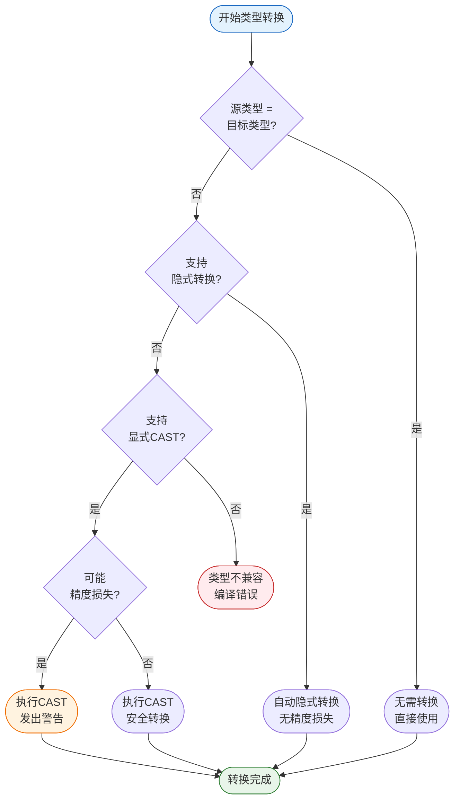
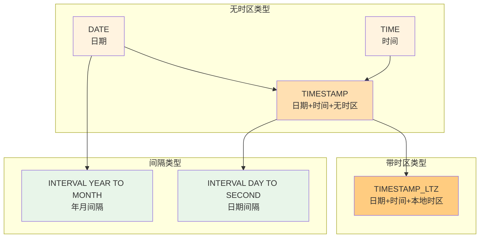

# Flink Data Types 完整参考

> 所属阶段: Flink | 前置依赖: [01-基础架构概述](../../01-concepts/deployment-architectures.md) | 形式化等级: L4

## 1. 概念定义 (Definitions)

### Def-F-03-01: 数据类型 (Data Type)

数据类型是SQL/Table API中对值的分类系统，定义了值的存储格式、有效范围、可执行操作以及与其他类型的关系。

**形式化定义：**

$$\text{DataType} = (L, P, D, O, C)$$

其中：

- $L$: 逻辑类型 (Logical Type) - 语义层面的类型定义
- $P$: 物理类型 (Physical Type) - 运行时的具体表示
- $D$: 域 (Domain) - 该类型所有可能取值的集合
- $O$: 操作集 (Operations) - 支持的操作符和函数
- $C$: 转换规则 (Conversion Rules) - 与其他类型的转换关系

### Def-F-03-02: 逻辑类型 vs 物理类型

**逻辑类型 (Logical Type)** 是SQL层面的抽象类型定义，不依赖于具体实现语言：

$$\text{LogicalType} \in \{\text{STRING}, \text{INT}, \text{BIGINT}, \text{DECIMAL}, \text{ARRAY}, \text{MAP}, \text{ROW}, ...\}$$

**物理类型 (Physical Type)** 是逻辑类型在具体编程语言中的实现：

$$\text{PhysicalType}: \text{LogicalType} \times \text{Language} \rightarrow \text{Type}_{\text{lang}}$$

| 逻辑类型 | Java物理类型 | Scala物理类型 |
|---------|-------------|---------------|
| STRING | `String` | `String` |
| INT | `Integer` | `Int` |
| BIGINT | `Long` | `Long` |
| DECIMAL | `BigDecimal` | `BigDecimal` |
| BOOLEAN | `Boolean` | `Boolean` |

### Def-F-03-03: 类型系统层次结构

$$\text{TypeSystem} = \text{AtomicTypes} \cup \text{CompositeTypes} \cup \text{TimeTypes}$$

```
Flink Type System
├── Atomic Types (原子类型)
│   ├── String Types: CHAR, VARCHAR, STRING
│   ├── Numeric Types: TINYINT, SMALLINT, INT, BIGINT, DECIMAL, NUMERIC, FLOAT, DOUBLE
│   ├── Boolean Type: BOOLEAN
│   └── Binary Types: BINARY, VARBINARY, BYTES
├── Composite Types (复合类型)
│   ├── ARRAY<T>
│   ├── MAP<K, V>
│   └── ROW<...>
└── Time Types (时间类型)
    ├── DATE
    ├── TIME
    ├── TIMESTAMP
    ├── TIMESTAMP_LTZ
    └── INTERVAL
```

## 2. 属性推导 (Properties)

### Lemma-F-03-01: 类型完备性

Flink SQL类型系统满足**类型完备性**：对于任意原子数据值 $v$，存在唯一的逻辑类型 $T$ 使得 $v \in \text{Domain}(T)$。

**证明：**

1. 字符串值 $\rightarrow$ STRING/VARCHAR/CHAR
2. 整数值 $\rightarrow$ 根据范围选择 TINYINT/SMALLINT/INT/BIGINT
3. 小数值 $\rightarrow$ DECIMAL/FLOAT/DOUBLE
4. 布尔值 $\rightarrow$ BOOLEAN
5. 二进制值 $\rightarrow$ BYTES/BINARY/VARBINARY

### Lemma-F-03-02: 类型可比较性

对于任意两个类型 $T_1, T_2$，以下关系恰好满足其一：

- $T_1 \equiv T_2$ (类型等价)
- $T_1 \prec T_2$ 或 $T_2 \prec T_1$ (可隐式转换)
- $T_1 \perp T_2$ (不兼容，需显式转换)

### Prop-F-03-01: 嵌套类型深度限制

复合类型支持任意深度嵌套，但受以下约束：

$$\text{Depth}(T) \leq 100$$

其中嵌套深度定义为：
$$\text{Depth}(T) = \begin{cases}
0 & \text{if } T \text{ is atomic} \\
1 + \max(\text{Depth}(T_i)) & \text{if } T = \text{ARRAY}<T_1> \text{ or } \text{MAP}<T_1,T_2> \\
1 + \max(\text{Depth}(F_i)) & \text{if } T = \text{ROW}<F_1, ..., F_n>
\end{cases}$$

## 3. 原子类型详解 (Atomic Types)

### 3.1 字符串类型

#### Def-F-03-04: STRING

**定义：** 可变长度Unicode字符串，最大长度2GB。

```sql
STRING          -- 无限制长度
STRING(100)     -- 限制最大长度100字符
```

| 属性 | 值 |
|------|-----|
| 存储格式 | UTF-8编码字节数组 |
| 最大长度 | 2,147,483,647字符 |
| 默认长度 | 无限制 |
| NULL表示 | SQL NULL |

#### Def-F-03-05: VARCHAR

**定义：** 指定最大长度的可变字符串。

```sql
VARCHAR         -- 同STRING，无限制
VARCHAR(n)      -- 最大n字符
```

| 属性 | VARCHAR(n) | STRING |
|------|-----------|--------|
| 长度限制 | n字符 | 无限制 |
| 存储优化 | 定长分配 | 动态分配 |
| 使用场景 | 已知最大长度 | 长度变化大 |

#### Def-F-03-06: CHAR

**定义：** 固定长度字符串，不足时右补空格。

```sql
CHAR(n)         -- 固定n字符
```

**行为特性：**
- 存储时右补空格至长度 $n$
- 比较时忽略尾随空格（SQL标准行为）
- 插入超长字符串会截断或报错（取决于配置）

### 3.2 数值类型

#### Def-F-03-07: 整数类型族

| 类型 | 字节 | 范围 | Java映射 |
|------|------|------|----------|
| TINYINT | 1 | $-128$ ~ $127$ | `byte` / `Byte` |
| SMALLINT | 2 | $-32768$ ~ $32767$ | `short` / `Short` |
| INT | 4 | $-2^{31}$ ~ $2^{31}-1$ | `int` / `Integer` |
| BIGINT | 8 | $-2^{63}$ ~ $2^{63}-1$ | `long` / `Long` |

#### Def-F-03-08: DECIMAL/NUMERIC

**定义：** 精确小数类型，指定精度和标度。

$$\text{DECIMAL}(p, s) \text{ 表示 } p \text{位有效数字，其中 } s \text{位小数}$$

```sql
DECIMAL(10, 2)   -- 8位整数 + 2位小数，如12345678.90
DECIMAL(38, 18)  -- 最大精度
```

**约束：**
- 精度 $p$: $1 \leq p \leq 38$
- 标度 $s$: $0 \leq s \leq p$
- 存储使用 `BigDecimal` 保证精度

#### Def-F-03-09: 浮点类型

| 类型 | 字节 | 精度 | Java映射 | 使用场景 |
|------|------|------|----------|----------|
| FLOAT | 4 | ~7位 | `float` / `Float` | 科学计算 |
| DOUBLE | 8 | ~15位 | `double` / `Double` | 高精度科学计算 |

**注意：** 浮点类型存在精度损失，金融计算应使用DECIMAL。

### 3.3 布尔类型

#### Def-F-03-10: BOOLEAN

```sql
BOOLEAN    -- true / false / NULL
```

| 值 | 表示 |
|----|------|
| TRUE | 真 |
| FALSE | 假 |
| NULL | 未知 |

### 3.4 二进制类型

#### Def-F-03-11: 二进制类型族

| 类型 | 定义 | 行为 |
|------|------|------|
| BYTES | 无限制字节数组 | 可变长度 |
| BINARY(n) | 固定n字节 | 右补0x00 |
| VARBINARY(n) | 最大n字节 | 可变长度 |

## 4. 复合类型详解 (Composite Types)

### 4.1 ARRAY类型

#### Def-F-03-12: ARRAY

**定义：** 同类型元素的有序集合。

$$\text{ARRAY}<T> = \{e_1, e_2, ..., e_n \mid e_i \in \text{Domain}(T)\}$$

```sql
-- 声明
ARRAY<INT>
ARRAY<STRING>
ARRAY<ROW<id INT, name STRING>>

-- 构造
ARRAY[1, 2, 3]
ARRAY['a', 'b', 'c']
```

**特性：**
- 元素类型必须一致（或可隐式转换）
- 支持嵌套：`ARRAY<ARRAY<INT>>`
- 1-based索引（SQL标准）
- 通过 `element[i]` 访问

### 4.2 MAP类型

#### Def-F-03-13: MAP

**定义：** 键值对的集合，键唯一。

$$\text{MAP}<K, V> = \{ (k_1, v_1), (k_2, v_2), ..., (k_n, v_n) \mid k_i \neq k_j \text{ for } i \neq j \}$$

```sql
-- 声明
MAP<STRING, INT>
MAP<STRING, ROW<...>>

-- 构造
MAP['a', 1, 'b', 2]           -- 键: 'a', 'b'; 值: 1, 2
```

**约束：**
- 键类型 $K$ 必须可哈希（不能是复合类型）
- 常用键类型：STRING, INT, BIGINT
- 通过 `map[key]` 访问值

### 4.3 ROW类型

#### Def-F-03-14: ROW

**定义：** 命名字段的记录类型。

$$\text{ROW}<f_1\ T_1, f_2\ T_2, ..., f_n\ T_n>$$

```sql
-- 声明
ROW<id INT, name STRING, age INT>

-- 构造
ROW(1, 'Alice', 30)

-- 字段访问
row.id
row.name
```

**特性：**
- 字段可命名或匿名
- 支持任意嵌套深度
- 是表的基本行类型
- 可通过 `CAST` 进行行类型转换

#### Lemma-F-03-03: 嵌套类型限制

1. **MAP键限制**：MAP的键类型不能是ARRAY, MAP, 或ROW
2. **深度限制**：默认最大嵌套深度为100
3. **循环引用**：禁止类型之间的循环引用

## 5. 时间类型详解 (Time Types)

### 5.1 DATE类型

#### Def-F-03-15: DATE

**定义：** 日历日期，不包含时间信息。

$$\text{DATE} = \{ (Y, M, D) \mid Y \in [1, 9999], M \in [1, 12], D \in [1, 31] \}$$

```sql
DATE
DATE '2024-01-15'
```

| 属性 | 值 |
|------|-----|
| 存储 | 4字节（自1970-01-01的天数） |
| 范围 | 0001-01-01 到 9999-12-31 |
| 格式 | 'YYYY-MM-DD' |

### 5.2 TIME类型

#### Def-F-03-16: TIME

**定义：** 一天中的时间，不包含日期。

$$\text{TIME}(p) \text{ 其中 } p \text{ 是小数秒精度 (0-9)}$$

```sql
TIME                    -- TIME(0)，无小数秒
TIME(3)                 -- 毫秒精度
TIME '14:30:00.123'
```

| 属性 | 值 |
|------|-----|
| 存储 | 4-8字节（取决于精度） |
| 范围 | 00:00:00 到 23:59:59.999999999 |
| 精度 | p ∈ [0, 9] |

### 5.3 TIMESTAMP类型

#### Def-F-03-17: TIMESTAMP

**定义：** 不带时区的日期时间。

$$\text{TIMESTAMP}(p) = \text{DATE} \times \text{TIME}(p)$$

```sql
TIMESTAMP               -- TIMESTAMP(6)
TIMESTAMP(3)            -- 毫秒精度
TIMESTAMP '2024-01-15 14:30:00.123'
```

**特点：**
- 语义上是本地时间（墙上时钟时间）
- 不携带时区信息
- 比较和计算不考虑时区差异

### 5.4 TIMESTAMP_LTZ类型

#### Def-F-03-18: TIMESTAMP WITH LOCAL TIME ZONE

**定义：** 带本地时区的日期时间，内部以UTC存储。

$$\text{TIMESTAMP\_LTZ}(p) = \text{UTC时间戳} + \text{会话时区}$$

```sql
TIMESTAMP_LTZ(3)
TO_TIMESTAMP_LTZ(epochMillis, 3)
```

**特点：**
- 内部存储为UTC时间戳
- 显示时转换为会话时区
- 跨时区数据一致性的首选

| 特性 | TIMESTAMP | TIMESTAMP_LTZ |
|------|-----------|---------------|
| 存储 | 本地时间 | UTC时间戳 |
| 时区感知 | 否 | 是 |
| 跨时区一致性 | 需外部处理 | 自动处理 |
| 使用场景 | 固定时区应用 | 多时区应用 |

### 5.5 INTERVAL类型

#### Def-F-03-19: INTERVAL

**定义：** 时间差值，分为年月间隔和日期间隔。

```sql
-- 年月间隔
INTERVAL YEAR TO MONTH
INTERVAL '2-6' YEAR TO MONTH    -- 2年6个月

-- 日期间隔
INTERVAL DAY TO SECOND
INTERVAL '10 08:30:00.123' DAY TO SECOND(3)  -- 10天8小时30分0.123秒
```

| 类型 | 范围 | 使用场景 |
|------|------|----------|
| INTERVAL YEAR | 年 | 年龄、工作年限 |
| INTERVAL MONTH | 月 | 月度统计 |
| INTERVAL DAY | 日 | 日期差值 |
| INTERVAL HOUR | 时 | 时间跨度 |
| INTERVAL MINUTE | 分 | 精确分钟 |
| INTERVAL SECOND | 秒 | 精确到秒 |
| INTERVAL YEAR TO MONTH | 年月 | 综合年月计算 |
| INTERVAL DAY TO SECOND | 日时分秒 | 综合时间计算 |

## 6. 类型转换 (Type Conversion)

### 6.1 隐式转换规则

#### Def-F-03-20: 隐式类型转换

当操作涉及不同类型时，Flink自动将较低精度类型提升为较高精度类型。

**数值类型提升链：**

$$\text{TINYINT} \prec \text{SMALLINT} \prec \text{INT} \prec \text{BIGINT} \prec \text{DECIMAL} \prec \text{FLOAT} \prec \text{DOUBLE}$$

**隐式转换规则表：**

| 源类型 | 目标类型 | 是否隐式转换 | 说明 |
|--------|----------|-------------|------|
| TINYINT | SMALLINT | ✓ | 数值提升 |
| TINYINT | INT | ✓ | 数值提升 |
| INT | BIGINT | ✓ | 数值提升 |
| INT | DECIMAL | ✓ | 精确转换 |
| INT | FLOAT | ✓ | 可能精度损失 |
| FLOAT | DOUBLE | ✓ | 数值提升 |
| VARCHAR | STRING | ✓ | 等价类型 |
| CHAR(n) | VARCHAR(m) | ✓ | 去除尾随空格 |
| DATE | TIMESTAMP | ✓ | 时间部分补0 |
| TIMESTAMP | TIMESTAMP_LTZ | ✓ | 添加时区信息 |

### 6.2 显式CAST转换

#### Def-F-03-21: CAST表达式

```sql
CAST(expression AS type)
expression::type        -- Flink扩展语法
```

**显式转换示例：**

```sql
-- 数值转换
CAST('123' AS INT)
CAST(123 AS STRING)
CAST(3.14 AS DECIMAL(10, 2))

-- 时间转换
CAST('2024-01-15' AS DATE)
CAST(DATE '2024-01-15' AS TIMESTAMP)
CAST(TIMESTAMP '2024-01-15 10:00:00' AS TIMESTAMP_LTZ)

-- 复杂类型
CAST(ARRAY[1, 2, 3] AS ARRAY<STRING>)  -- 元素类型转换
```

### 6.3 类型兼容性矩阵

|  | TINYINT | SMALLINT | INT | BIGINT | DECIMAL | FLOAT | DOUBLE | STRING | BOOLEAN | DATE | TIMESTAMP |
|--|:-------:|:--------:|:---:|:------:|:-------:|:-----:|:------:|:------:|:-------:|:----:|:---------:|
| **TINYINT** | = | ✓ | ✓ | ✓ | ✓ | ✓ | ✓ | ✓ | ✗ | ✗ | ✗ |
| **SMALLINT** | ✓ | = | ✓ | ✓ | ✓ | ✓ | ✓ | ✓ | ✗ | ✗ | ✗ |
| **INT** | ✓ | ✓ | = | ✓ | ✓ | ✓ | ✓ | ✓ | ✗ | ✗ | ✗ |
| **BIGINT** | ✓ | ✓ | ✓ | = | ✓ | ✓ | ✓ | ✓ | ✗ | ✗ | ✗ |
| **DECIMAL** | ✓ | ✓ | ✓ | ✓ | = | ✓ | ✓ | ✓ | ✗ | ✗ | ✗ |
| **FLOAT** | ✗ | ✗ | ✗ | ✗ | ✗ | = | ✓ | ✓ | ✗ | ✗ | ✗ |
| **DOUBLE** | ✗ | ✗ | ✗ | ✗ | ✗ | ✓ | = | ✓ | ✗ | ✗ | ✗ |
| **STRING** | ✓ | ✓ | ✓ | ✓ | ✓ | ✓ | ✓ | = | ✓ | ✓ | ✓ |
| **BOOLEAN** | ✗ | ✗ | ✗ | ✗ | ✗ | ✗ | ✗ | ✓ | = | ✗ | ✗ |
| **DATE** | ✗ | ✗ | ✗ | ✗ | ✗ | ✗ | ✗ | ✓ | ✗ | = | ✓ |
| **TIMESTAMP** | ✗ | ✗ | ✗ | ✗ | ✗ | ✗ | ✗ | ✓ | ✗ | ✓ | = |

**图例：**
- `=` : 类型相同
- `✓` : 支持隐式转换
- `✗` : 不支持隐式转换，需显式CAST

### Prop-F-03-02: 转换安全级别

$$\text{SafetyLevel}(T_1 \rightarrow T_2) = \begin{cases}
\text{SAFE} & \text{无信息损失} \\
\text{WARNING} & \text{可能精度损失} \\
\text{UNSAFE} & \text{可能值域溢出} \\
\text{ERROR} & \text{不兼容类型}
\end{cases}$$

## 7. 与Java/Scala类型映射

### 7.1 SQL到Java类型映射

| SQL类型 | Java类型 | 包装类型 | 备注 |
|---------|----------|----------|------|
| CHAR(n) | String | String | 定长处理 |
| VARCHAR(n) | String | String | - |
| STRING | String | String | - |
| BOOLEAN | boolean | Boolean | - |
| TINYINT | byte | Byte | - |
| SMALLINT | short | Short | - |
| INT | int | Integer | - |
| BIGINT | long | Long | - |
| DECIMAL(p,s) | BigDecimal | BigDecimal | 精确计算 |
| FLOAT | float | Float | - |
| DOUBLE | double | Double | - |
| DATE | LocalDate | LocalDate | Java 8日期 |
| TIME(p) | LocalTime | LocalTime | Java 8时间 |
| TIMESTAMP(p) | LocalDateTime | LocalDateTime | 无时区 |
| TIMESTAMP_LTZ(p) | Instant | Instant | UTC存储 |
| ARRAY<T> | T[] | List<T> | 两种形式 |
| MAP<K,V> | - | Map<K,V> | 仅包装类型 |
| ROW<...> | Row | Row | Flink专用类 |

### 7.2 SQL到Scala类型映射

| SQL类型 | Scala类型 | 备注 |
|---------|-----------|------|
| CHAR(n) | String | - |
| VARCHAR(n) | String | - |
| STRING | String | - |
| BOOLEAN | Boolean | - |
| TINYINT | Byte | - |
| SMALLINT | Short | - |
| INT | Int | - |
| BIGINT | Long | - |
| DECIMAL(p,s) | java.math.BigDecimal | - |
| FLOAT | Float | - |
| DOUBLE | Double | - |
| DATE | java.time.LocalDate | - |
| TIME(p) | java.time.LocalTime | - |
| TIMESTAMP(p) | java.time.LocalDateTime | - |
| TIMESTAMP_LTZ(p) | java.time.Instant | - |
| ARRAY<T> | Array[T] / Seq[T] / List[T] | 多种集合类型 |
| MAP<K,V> | Map[K,V] | - |
| ROW<...> | org.apache.flink.types.Row | - |

### 7.3 DataType API使用

#### Java API

```java
import org.apache.flink.table.api.DataTypes;
import org.apache.flink.table.types.DataType;

import org.apache.flink.api.common.typeinfo.Types;


// 定义字段类型
DataType stringType = DataTypes.STRING();
DataType intType = DataTypes.INT();
DataType decimalType = DataTypes.DECIMAL(10, 2);

// 复合类型
DataType arrayType = DataTypes.ARRAY(DataTypes.INT());
DataType mapType = DataTypes.MAP(DataTypes.STRING(), DataTypes.INT());
DataType rowType = DataTypes.ROW(
    DataTypes.FIELD("id", DataTypes.INT()),
    DataTypes.FIELD("name", DataTypes.STRING()),
    DataTypes.FIELD("score", DataTypes.DOUBLE())
);

// 时间类型
DataType dateType = DataTypes.DATE();
DataType timestampType = DataTypes.TIMESTAMP(3);
DataType timestampLtzType = DataTypes.TIMESTAMP_LTZ(3);
```

#### Scala API

```scala
import org.apache.flink.table.api.DataTypes

// 基本类型
val stringType = DataTypes.STRING()
val intType = DataTypes.INT()
val decimalType = DataTypes.DECIMAL(10, 2)

// 复合类型
val arrayType = DataTypes.ARRAY(DataTypes.INT())
val mapType = DataTypes.MAP(DataTypes.STRING(), DataTypes.INT())
val rowType = DataTypes.ROW(
    DataTypes.FIELD("id", DataTypes.INT()),
    DataTypes.FIELD("name", DataTypes.STRING()),
    DataTypes.FIELD("score", DataTypes.DOUBLE())
)
```

### 7.4 序列化/反序列化

Flink使用TypeSerializer进行类型序列化：

```java

import org.apache.flink.api.common.typeinfo.Types;

// 获取类型的序列化器
DataType dataType = DataTypes.INT();
TypeSerializer<Integer> serializer = dataType.getLogicalType()
    .accept(new TypeSerializerVisitor());

// 序列化
byte[] serialized = serializer.serializeToBinary(value);

// 反序列化
Integer value = serializer.deserializeFromBinary(serialized);
```

**常见类型的序列化格式：**

| 类型 | 序列化格式 | 说明 |
|------|-----------|------|
| STRING | 长度(4字节) + UTF-8字节 | 可变长度 |
| INT | 4字节小端序 | 固定长度 |
| BIGINT | 8字节小端序 | 固定长度 |
| DECIMAL | 整数部分 + 小数部分 | 变长编码 |
| ARRAY | 长度 + 元素序列 | 递归序列化 |
| MAP | 条目数 + (键,值)对 | 递归序列化 |
| ROW | 字段数 + 各字段值 | 按定义顺序 |

## 8. 实例验证 (Examples)

### 8.1 完整表定义示例

```sql
CREATE TABLE user_events (
    -- 主键
    user_id BIGINT NOT NULL,
    event_id STRING NOT NULL,

    -- 字符串类型
    user_name VARCHAR(100),
    country_code CHAR(2),
    description STRING,

    -- 数值类型
    age INT,
    score DECIMAL(10, 2),
    temperature FLOAT,

    -- 布尔类型
    is_active BOOLEAN,

    -- 二进制类型
    avatar_bytes BYTES,

    -- 时间类型
    birth_date DATE,
    event_time TIMESTAMP(3),
    process_time TIMESTAMP_LTZ(3),
    duration INTERVAL DAY TO SECOND,

    -- 复合类型
    tags ARRAY<STRING>,
    attributes MAP<STRING, STRING>,
    address ROW<
        street STRING,
        city STRING,
        zipcode STRING,
        coordinates ROW<lat DOUBLE, lon DOUBLE>
    >,

    -- 水位线和主键
    WATERMARK FOR event_time AS event_time - INTERVAL '5' SECOND,
    PRIMARY KEY (user_id, event_id) NOT ENFORCED
) WITH (
    'connector' = 'kafka',
    'topic' = 'user-events',
    'format' = 'json'
);
```

### 8.2 类型转换示例

```sql
-- 隐式转换（自动发生）
SELECT
    1 + 2.5 AS result,           -- INT + DOUBLE → DOUBLE
    CONCAT('ID:', 123) AS id     -- 123隐式转为STRING
FROM my_table;

-- 显式CAST转换
SELECT
    CAST('2024-01-15' AS DATE) AS date_val,
    CAST(123.456 AS DECIMAL(10, 2)) AS decimal_val,
    CAST(true AS STRING) AS bool_str
FROM my_table;

-- 复杂类型转换
SELECT
    CAST(ARRAY['1', '2', '3'] AS ARRAY<INT>) AS int_array,
    CAST(ROW(1, 'test') AS ROW<id INT, name STRING>) AS typed_row
FROM my_table;
```

### 8.3 Table API类型操作

```java

import org.apache.flink.table.api.TableEnvironment;

TableEnvironment tEnv = TableEnvironment.create(...);

// 定义带类型的表
tEnv.executeSql("""
    CREATE TABLE typed_table (
        id INT,
        name STRING,
        scores ARRAY<INT>,
        metadata MAP<STRING, STRING>,
        created_at TIMESTAMP(3)
    ) WITH (...)
""");

// 类型安全的数据处理
Table result = tEnv.from("typed_table")
    .select(
        $("id"),
        $("name"),
        $("scores").cardinality().as("score_count"),
        $("metadata").at("source").as("data_source"),
        $("created_at").plus(1, TimeIntervalUnit.DAY).as("next_day")
    );
```

## 9. 可视化 (Visualizations)

### 9.1 Flink SQL类型层次图

```mermaid
graph TB
    Root[Flink SQL Type System]

    Root --> Atomic[Atomic Types<br/>原子类型]
    Root --> Composite[Composite Types<br/>复合类型]
    Root --> Time[Time Types<br/>时间类型]
    Root --> Special[Special Types<br/>特殊类型]

    Atomic --> String[String Types]
    Atomic --> Numeric[Numeric Types]
    Atomic --> Boolean[BOOLEAN]
    Atomic --> Binary[Binary Types]

    String --> CHAR[CHAR(n)<br/>固定长度]
    String --> VARCHAR[VARCHAR(n)<br/>可变长度]
    String --> STRING[STRING<br/>无限制]

    Numeric --> Integer[Integers]
    Numeric --> Decimal[DECIMAL(p,s)<br/>精确小数]
    Numeric --> Float[FLOAT<br/>单精度浮点]
    Numeric --> Double[DOUBLE<br/>双精度浮点]

    Integer --> TINYINT[TINYINT<br/>1字节]
    Integer --> SMALLINT[SMALLINT<br/>2字节]
    Integer --> INT[INT<br/>4字节]
    Integer --> BIGINT[BIGINT<br/>8字节]

    Binary --> BINARY[BINARY(n)]
    Binary --> VARBINARY[VARBINARY(n)]
    Binary --> BYTES[BYTES]

    Composite --> ARRAY[ARRAY&lt;T&gt;<br/>数组]
    Composite --> MAP[MAP&lt;K,V&gt;<br/>映射]
    Composite --> ROW[ROW&lt;...&gt;<br/>行类型]

    Time --> DATE[DATE<br/>日期]
    Time --> TIME[TIME(p)<br/>时间]
    Time --> TIMESTAMP[TIMESTAMP(p)<br/>无时区时间戳]
    Time --> TIMESTAMP_LTZ[TIMESTAMP_LTZ(p)<br/>带本地时区时间戳]
    Time --> INTERVAL[INTERVAL<br/>时间间隔]

    Special --> NULL[NULL]
    Special --> ANY[ANY&lt;T&gt;]
    Special --> SYMBOL[SYMBOL]

    style Root fill:#e1f5ff,stroke:#01579b,stroke-width:3px
    style Atomic fill:#f3e5f5,stroke:#4a148c
    style Composite fill:#e8f5e9,stroke:#1b5e20
    style Time fill:#fff3e0,stroke:#e65100
```

### 9.2 类型转换决策树



### 9.3 数值类型精度层级图

```mermaid
graph LR
    TINYINT[TINYINT<br/>-128 ~ 127<br/>1字节] --> SMALLINT
    SMALLINT[SMALLINT<br/>-32768 ~ 32767<br/>2字节] --> INT
    INT[INT<br/>-2^31 ~ 2^31-1<br/>4字节] --> BIGINT
    BIGINT[BIGINT<br/>-2^63 ~ 2^63-1<br/>8字节] --> DECIMAL
    DECIMAL[DECIMAL(p,s)<br/>p:1-38<br/>可变精度] --> FLOAT
    FLOAT[FLOAT<br/>~7位精度<br/>4字节] --> DOUBLE
    DOUBLE[DOUBLE<br/>~15位精度<br/>8字节]

    style TINYINT fill:#e3f2fd
    style SMALLINT fill:#bbdefb
    style INT fill:#90caf9
    style BIGINT fill:#64b5f6
    style DECIMAL fill:#42a5f5
    style FLOAT fill:#2196f3
    style DOUBLE fill:#1e88e5
```

### 9.4 时间类型关系图



## 10. 引用参考 (References)

[^1]: Apache Flink Documentation, "Data Types", 2025. https://nightlies.apache.org/flink/flink-docs-stable/docs/dev/table/types/

[^2]: Apache Flink Documentation, "Time Attributes", 2025. https://nightlies.apache.org/flink/flink-docs-stable/docs/dev/table/concepts/time_attributes/

[^3]: SQL:2016 Standard (ISO/IEC 9075-2:2016), "Data Types"

[^4]: Apache Calcite Documentation, "SQL Language Reference", https://calcite.apache.org/docs/reference.html

[^5]: M. Kleppmann, "Designing Data-Intensive Applications", O'Reilly Media, 2017. Chapter 2: Data Models and Query Languages

[^6]: Java SE 8 Documentation, "java.time Package", https://docs.oracle.com/javase/8/docs/api/java/time/package-summary.html

[^7]: Apache Flink Documentation, "Table API & SQL", 2025. https://nightlies.apache.org/flink/flink-docs-stable/docs/dev/table/tableApi/

[^8]: Apache Flink Documentation, "Built-in Functions", 2025. https://nightlies.apache.org/flink/flink-docs-stable/docs/dev/table/functions/systemFunctions/
