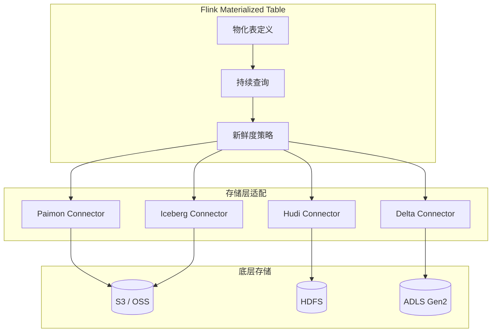
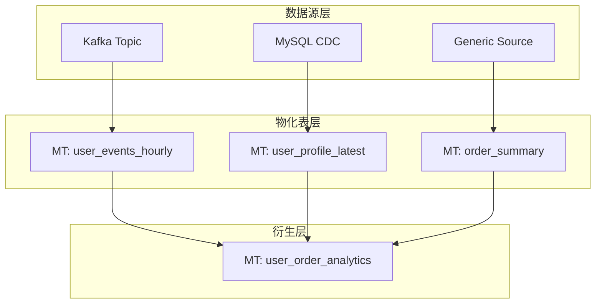
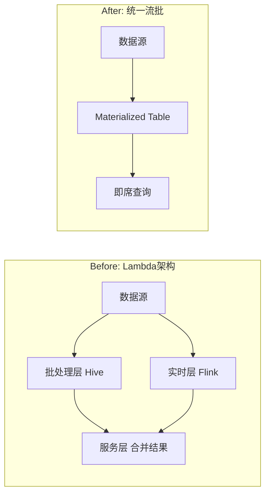
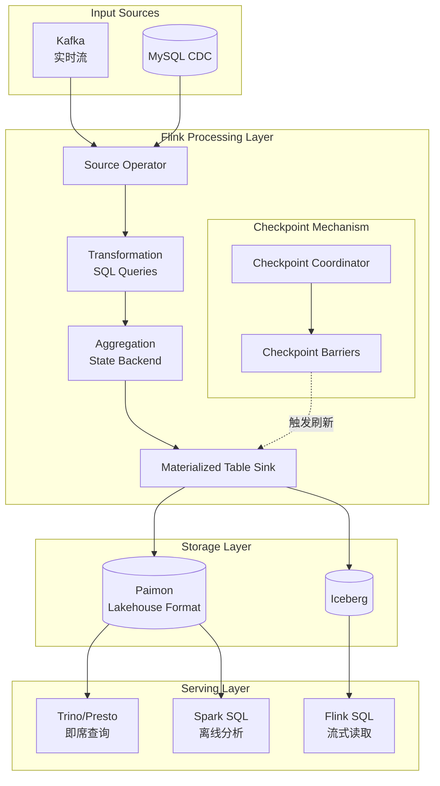
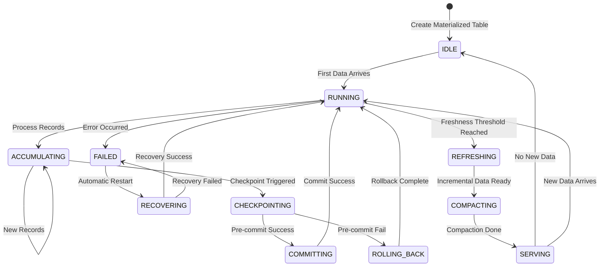
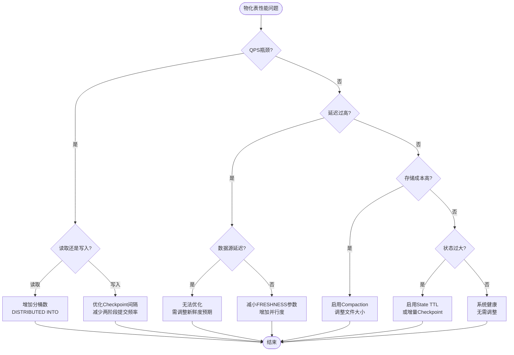
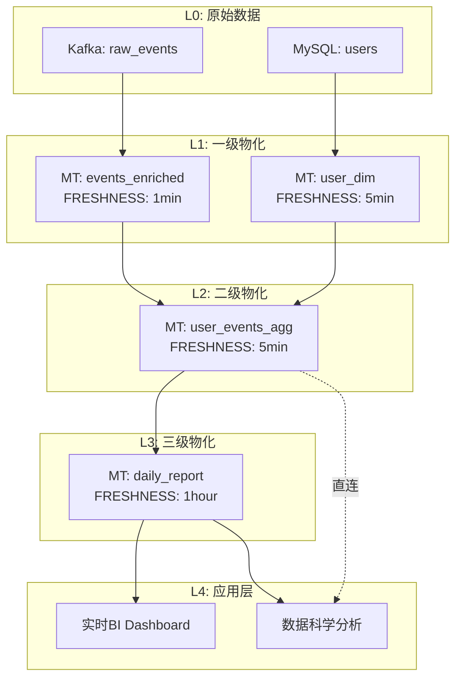
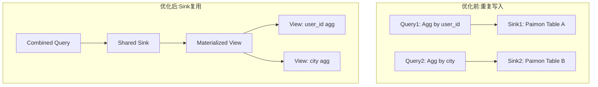

# Flink 2.2 Materialized Table 物化表深度指南

> **状态**: ✅ Released (2025-03-24, GA in Flink 2.0; 2025-12-04, Flink 2.2 增强)
> **Flink 版本**: 2.0.0+, 2.2 增强
> **稳定性**: 稳定版 (GA)
>
> **所属阶段**: Flink/ | **前置依赖**: [Flink SQL 完整指南](./flink-table-sql-complete-guide.md) | **形式化等级**: L3-L4
>
> **版本**: Flink 2.2+ | **最后更新**: 2026-04-15

---

## 1. 概念定义 (Definitions)

### Def-F-03-70: 物化表 (Materialized Table)

**形式化定义**:

物化表 $MT$ 是一个四元组 $MT = (Q, S, \mathcal{F}, \Delta)$，其中：

- $Q$：查询定义（Query Definition），表示为持续查询 $Q: \mathcal{D}^{in} \to \mathcal{D}^{out}$
- $S$：存储描述符（Storage Descriptor），定义目标存储格式与位置
- $\mathcal{F}$：新鲜度约束（Freshness Constraint），定义数据时效性要求
- $\Delta$：刷新策略（Refresh Policy），定义数据更新机制

**直观解释**:

物化表是Flink SQL中一种将**持续查询结果**以**有界快照**形式物化存储到外部系统的表类型。
它介于传统批处理表（静态快照）和流式查询（无限结果流）之间，提供了**准实时**的数据服务能力。

```sql
CREATE MATERIALIZED TABLE user_behavior_summary
AS SELECT
    user_id,
    COUNT(*) AS event_count,
    SUM(amount) AS total_amount
  FROM user_events
  GROUP BY user_id
  FRESHNESS = INTERVAL '5' MINUTE;
```

### Def-F-03-71: 新鲜度语义 (Freshness Semantics)

**形式化定义**:

给定物化表 $MT$ 和新鲜度参数 $\tau$，定义**新鲜度约束函数** $\mathcal{F}: \mathbb{T} \to \{\top, \bot\}$:

$$\mathcal{F}(t) = \top \iff t_{now} - t_{data} \leq \tau$$

其中 $t_{data}$ 是物化表中最新数据的时间戳，$t_{now}$ 是当前时间。

**智能默认值** (Smart Defaults):

$$\tau_{inferred} = \begin{cases}
30s & \text{if } \exists \text{ watermark on source} \\
5min & \text{if streaming source with no watermark} \\
1hour & \text{if batch-like source}
\end{cases}$$

### Def-F-03-72: 物化表与传统物化视图对比

| 维度 | Materialized View (传统) | Flink Materialized Table |
|------|-------------------------|-------------------------|
| **数据形态** | 周期性快照 | 持续增量更新 |
| **一致性模型** | 快照隔离 | 事件时间一致性 |
| **查询能力** | 仅查询物化结果 | 支持查询+流读取 |
| **刷新触发** | 定时/手动触发 | 新鲜度驱动自动刷新 |
| **容错机制** | 事务重做 | Checkpoint + Savepoint |
| **适用场景** | 离线报表 | 实时数仓、实时BI |

---

## 2. 属性推导 (Properties)

### Lemma-F-03-30: 物化表的幂等性

**命题**: 物化表在故障恢复后，最终状态与无故障执行一致。

**证明概要**:

1. Flink通过Checkpoint机制定期保存算子状态 $S_{ckpt}$
2. 物化表Sink支持Exactly-Once语义（两阶段提交）
3. 设故障发生在时间 $t_f$，最后一次成功Checkpoint为 $t_c$
4. 恢复后从 $t_c$ 重放数据，由于Sink的幂等写入特性：
   $$\forall k \in \text{Keys}, \text{ write}(k, v) \text{ 是幂等的}$$
5. 因此最终状态 $S_{final} = S_{expected}$ $\square$

### Prop-F-03-40: 新鲜度与延迟的权衡关系

**命题**: 对于给定的物化表 $MT$，设新鲜度参数为 $\tau$，实际端到端延迟为 $L$，则有：

$$L \geq \tau_{source} + \tau_{process} + \tau_{commit}$$

其中：
- $\tau_{source}$: 源端数据采集延迟
- $\tau_{process}$: Flink处理延迟
- $\tau_{commit}$: Sink端两阶段提交通常数

**工程推论**:
- 设置 $\tau < \tau_{source}$ 无意义，系统无法提供比数据源更快的数据
- 最优 $\tau^* = \arg\min_{\tau} (\text{cost}(\tau) + \text{penalty}(\text{staleness}(\tau)))$

### Def-F-03-73: 分桶策略 (Distribution Strategy)

**形式化定义**:

分布函数 $\mathcal{D}: \mathcal{K} \to \{1, 2, ..., N\}$ 将键空间映射到 $N$ 个分桶：

$$\mathcal{D}(k) = \text{hash}(k) \mod N \quad \text{(HASH分布)}$$
$$\mathcal{D}(k) = \text{range\_partition}(k, N) \quad \text{(RANGE分布)}$$

**语法表达**:

```sql
-- HASH分布(默认)
DISTRIBUTED BY HASH(user_id) INTO 16 BUCKETS

-- RANGE分布(适用于时间序列)
DISTRIBUTED BY RANGE(event_time) INTO 32 BUCKETS
```

---

## 3. 关系建立 (Relations)

### 3.1 物化表与流表对偶性

物化表与传统Flink流表形成**对偶关系**：

| 特性 | Stream Table | Materialized Table |
|------|-------------|-------------------|
| **读取语义** | 持续流读取 | 快照点查询 |
| **结果可见性** | 即时（per-record） | 周期性（per-checkpoint） |
| **适用模式** | ETL、实时处理 | 服务化、即席查询 |
| **存储需求** | 无（纯计算） | 有（物化存储） |

### 3.2 与存储系统的映射



### 3.3 物化表依赖图谱



---

## 4. 论证过程 (Argumentation)

### 4.1 为什么需要物化表？

**问题背景**:

传统Lambda架构中，实时层和离线层需要维护两套代码，导致：
1. **语义不一致**：实时SQL与离线SQL逻辑可能不同
2. **运维复杂**：两套系统独立维护
3. **存储冗余**：相同数据存储多份

**Flink物化表解决方案**:



### 4.2 反例分析：何时不应使用物化表

| 场景 | 原因 | 推荐替代方案 |
|------|------|------------|
| 极低延迟需求 (<1s) | 两阶段提交开销 | 纯流式查询 |
| 极高吞吐写入 | Checkpoint屏障开销 | 异步Sink直连 |
| 仅需一次查询 | 物化存储成本浪费 | 临时VIEW |
| 复杂嵌套子查询 | 物化粒度难以确定 | 分段物化 |

---

## 5. 形式证明 / 工程论证 (Proof / Engineering Argument)

### Thm-F-03-50: 物化表一致性定理

**定理**: 在Flink的Exactly-Once语义保证下，物化表在任意故障恢复点都满足**可重复读**（Repeatable Read）一致性级别。

**形式化表述**:

设物化表 $MT$ 的查询定义为 $Q$，输入流为 $I = \{e_1, e_2, ..., e_n\}$，Checkpoint周期为 $T$。

定义物化表的**逻辑状态** $S_t$ 为时间 $t$ 之前所有已处理事件按查询 $Q$ 计算的结果。

**断言**: $\forall t, \forall \text{故障点 } f < t$，恢复后的状态 $S'_t = S_t$。

**证明**:

1. **基础**: Flink的Chandy-Lamport算法保证全局一致快照[^1]
2. **假设**: Sink连接器实现两阶段提交协议
3. **归纳**:
   - 情况1: 无故障时，数据流按序处理，Sink正常提交
   - 情况2: 故障发生在Checkpoint $C_k$ 和 $C_{k+1}$ 之间
     - 从 $C_k$ 恢复，重放未确认数据
     - 由于幂等写入，重复数据不会导致状态变更
     - Sink的预提交（pre-commit）状态可安全回滚
4. **结论**: 系统状态仅取决于已确认的事件集合 $\{e_i | i \leq \text{last\_confirmed}\}$

**工程意义**: 物化表可用于金融级的一致性要求场景。 $\square$

### Thm-F-03-51: 最优分桶数下界定理

**定理**: 给定物化表 $MT$ 的预期写入吞吐 $R$ (records/s)、单桶写入吞吐上限 $B$ 和查询并行度 $P$，最优分桶数 $N^*$ 满足：

$$N^* = \max\left(\lceil \frac{R}{B} \rceil, P, 2^{\lceil \log_2(\frac{|K|}{10000}) \rceil}\right)$$

其中 $|K|$ 是预期唯一键数量。

**推导**:

1. **写入约束**: 为避免单桶瓶颈，需 $N \geq R/B$
2. **读取约束**: 查询并行度 $P$ 要求至少 $N \geq P$ 以避免数据倾斜
3. **存储约束**: 每个桶文件不宜过大，经验值每万键一个文件
4. **优化**: 取2的幂次方以利用数据局部性

**实践指导**:
```sql
-- 示例:预期100万日活用户,写入10K/s
-- N* = max(ceil(10000/5000), 8, ceil(log2(1000000/10000)))
--    = max(2, 8, 7) = 8
CREATE MATERIALIZED TABLE user_stats
DISTRIBUTED BY HASH(user_id) INTO 16 BUCKETS  -- 取16(下一个2的幂)
AS SELECT ...;
```

### Thm-F-03-52: 新鲜度推断完备性

**定理**: Flink 2.2的Smart Defaults机制能够推断任何合法DDL声明物化表的新鲜度参数。

**证明**:

定义推断函数 $\mathcal{I}: \mathcal{D} \to \mathbb{T}$，其中 $\mathcal{D}$ 是DDL声明集合。

**完备性条件**: $\forall d \in \mathcal{D}_{valid}, \mathcal{I}(d) \neq \bot$

1. **覆盖性**: Smart Defaults遍历所有源表的元数据
2. **终止性**: 元数据遍历是有界图（catalog层级有限）
3. **决定性**:
   - 若源表有水印 $\to$ 使用水印间隔推断
   - 若源表是流式无水印 $\to$ 使用默认5分钟
   - 若源表是批式 $\to$ 使用默认1小时
4. **完备性**: 所有情况均有对应分支，不会落入未定义行为 $\square$

---

## 6. 实例验证 (Examples)

### 6.1 完整DDL示例

```sql
-- ============================================
-- 示例1: 基础物化表
-- ============================================
CREATE MATERIALIZED TABLE hourly_user_stats
AS SELECT
    TUMBLE_START(event_time, INTERVAL '1' HOUR) AS window_start,
    user_id,
    COUNT(*) AS event_count,
    SUM(CASE WHEN event_type = 'purchase' THEN amount ELSE 0 END) AS purchase_amount
FROM user_events
GROUP BY
    TUMBLE(event_time, INTERVAL '1' HOUR),
    user_id
FRESHNESS = INTERVAL '5' MINUTE;

-- ============================================
-- 示例2: 带存储配置的物化表
-- ============================================
CREATE MATERIALIZED TABLE paimon_user_behavior (
    user_id STRING,
    session_count BIGINT,
    total_duration INT,
    PRIMARY KEY (user_id) NOT ENFORCED
)
DISTRIBUTED BY HASH(user_id) INTO 32 BUCKETS
FRESHNESS = INTERVAL '10' MINUTE
AS SELECT
    user_id,
    COUNT(DISTINCT session_id) AS session_count,
    SUM(duration) AS total_duration
FROM session_events
GROUP BY user_id;

-- ============================================
-- 示例3: 级联物化表
-- ============================================
CREATE MATERIALIZED TABLE daily_user_summary
AS SELECT
    DATE_TRUNC('DAY', window_start) AS day,
    COUNT(DISTINCT user_id) AS dau,
    SUM(purchase_amount) AS daily_gmv
FROM hourly_user_stats  -- 引用另一个物化表
GROUP BY DATE_TRUNC('DAY', window_start)
FRESHNESS = INTERVAL '1' HOUR;
```

### 6.2 MaterializedTableEnricher SPI扩展

```java
/**
 * 自定义新鲜度推断器 - 基于业务优先级的智能推断
 */
public class PriorityBasedEnricher implements MaterializedTableEnricher {

    @Override
    public EnrichedResult enrich(CreateMaterializedTableOperation operation, Context context) {
        ResolvedSchema schema = operation.getResolvedSchema();

        // 基于表名后缀推断业务优先级
        String tableName = operation.getTableIdentifier().getObjectName();
        Duration inferredFreshness;

        if (tableName.endsWith("_realtime")) {
            inferredFreshness = Duration.ofSeconds(10);
        } else if (tableName.endsWith("_hourly")) {
            inferredFreshness = Duration.ofMinutes(5);
        } else if (tableName.endsWith("_daily")) {
            inferredFreshness = Duration.ofHours(1);
        } else {
            // 回退到默认推断
            inferredFreshness = inferFromSourceWatermark(operation);
        }

        // 根据数据量调整分桶数
        long estimatedRowCount = estimateRowCount(operation.getAsSelectQuery());
        int bucketNum = calculateOptimalBuckets(estimatedRowCount);

        return EnrichedResult.builder()
            .freshness(inferredFreshness)
            .distributedBy(new DistributedBy("HASH", getPrimaryKey(schema), bucketNum))
            .build();
    }

    private Duration inferFromSourceWatermark(CreateMaterializedTableOperation operation) {
        // 遍历源表,提取水印间隔
        List<ResolvedCatalogTable> sources = extractSourceTables(operation);
        Duration minWatermarkInterval = sources.stream()
            .map(this::extractWatermarkInterval)
            .min(Comparator.naturalOrder())
            .orElse(Duration.ofMinutes(5));

        // 物化表新鲜度为最小水印间隔的2倍(经验值)
        return minWatermarkInterval.multipliedBy(2);
    }

    private int calculateOptimalBuckets(long estimatedRows) {
        // 每bucket目标10万行
        int rawBuckets = (int) Math.ceil(estimatedRows / 100_000.0);
        // 对齐到2的幂次
        return Integer.highestOneBit(rawBuckets) * 2;
    }
}
```

### 6.3 配置注册

```yaml
# flink-conf.yaml
# 注册自定义Enricher
sql.materialized-table.enricher: com.example.PriorityBasedEnricher

# 物化表全局默认配置
sql.materialized-table.default-freshness: 5min
sql.materialized-table.default-format: paimon
sql.materialized-table.checkpoint-interval: 1min
```

---

## 7. 可视化 (Visualizations)

### 7.1 物化表数据流架构



### 7.2 刷新流水线编排



### 7.3 性能调优决策树



### 7.4 级联物化视图依赖图



---

## 8. 生产实践 (Production Practices)

### 8.1 存储选择矩阵

| 特性 | Apache Paimon | Apache Iceberg | Apache Hudi | Delta Lake |
|------|--------------|----------------|-------------|------------|
| **流式更新** | ⭐⭐⭐⭐⭐ | ⭐⭐⭐ | ⭐⭐⭐⭐ | ⭐⭐⭐ |
| **批量读取** | ⭐⭐⭐⭐⭐ | ⭐⭐⭐⭐⭐ | ⭐⭐⭐⭐ | ⭐⭐⭐⭐ |
| **数据湖集成** | ⭐⭐⭐⭐ | ⭐⭐⭐⭐⭐ | ⭐⭐⭐⭐ | ⭐⭐⭐⭐⭐ |
| **运维复杂度** | 低 | 中 | 高 | 中 |
| **Flink原生支持** | ⭐⭐⭐⭐⭐ | ⭐⭐⭐⭐ | ⭐⭐⭐ | ⭐⭐⭐ |
| **部分更新** | ✅ | ✅ | ✅ | ✅ |
| **变更数据捕获** | ✅ | ⚠️ | ✅ | ⚠️ |

**推荐**: Flink-centric场景首选Paimon，已有Iceberg生态优选Iceberg。

### 8.2 监控指标

```yaml
# 关键监控指标
metrics:
  freshness_lag:
    description: "物化表新鲜度延迟(当前时间与最新数据时间差)"
    threshold:
      warning: "freshness * 1.5"
      critical: "freshness * 3"

  checkpoint_duration:
    description: "Checkpoint耗时"
    threshold:
      warning: "30s"
      critical: "60s"

  num_pending_checkpoints:
    description: "待处理Checkpoint数量"
    threshold:
      critical: "> 3"

  state_size:
    description: "状态后端大小"
    threshold:
      warning: "10GB"
      critical: "50GB"

  sink_commit_latency:
    description: "Sink端提交延迟"
    threshold:
      warning: "5s"
      critical: "15s"
```

### 8.3 常见告警配置

```yaml
# Prometheus AlertManager配置示例
groups:
  - name: materialized_table_alerts
    rules:
      - alert: MaterializedTableFreshnessViolation
        expr: |
          (time() - max by(table_name) (mt_last_commit_timestamp))
          > (max by(table_name) (mt_configured_freshness_seconds) * 2)
        for: 5m
        labels:
          severity: warning
        annotations:
          summary: "物化表 {{ $labels.table_name }} 新鲜度违反"

      - alert: MaterializedTableCheckpointFailure
        expr: |
          rate(flink_checkpoint_failed_count[5m]) > 0.1
        for: 2m
        labels:
          severity: critical
        annotations:
          summary: "物化表Checkpoint持续失败"
```

---

## 9. Flink 2.2 Materialized Table 增强

Apache Flink 2.2.0 (2025-12-04 发布) 对 Materialized Table 进行了多项增强[^9][^10]：

### 9.1 Flink 2.2 新增特性

| 特性 | Flink 2.0 | Flink 2.2 | 说明 |
|------|-----------|-----------|------|
| **增量刷新** | ✅ | ✅ 优化 | 更高效的增量计算 |
| **自动 Compaction** | 基础 | ✅ 增强 | 智能文件合并策略 |
| **多 Sink 支持** | 单 Sink | ✅ 多 Sink | 同时写入多个存储 |
| **动态分区裁剪** | 基础 | ✅ 优化 | 查询性能提升 |
| **监控指标增强** | 基础 | ✅ 完整 | 细粒度 Metrics |
| **FRESHNESS 可选** | 必需 | ✅ 可选 | 支持自动推断 |
| **DISTRIBUTED BY/INTO** | 不支持 | ✅ 支持 | 物理分桶策略声明 |
| **SHOW MATERIALIZED TABLES** | 不支持 | ✅ 支持 | DDL 元数据查询 |

### 9.2 Flink 2.0 GA 基准性能

根据 [Apache Flink 2.0.0 官方发布](https://flink.apache.org/2025/03/24/apache-flink-2.0.0-a-new-era-of-real-time-data-processing/)[^8]：

- **Checkpoint 时间减少**: 94%
- **恢复速度提升**: 49x
- **存储成本节省**: 50%

---

## 10. 高级特性 (Advanced Features)

### 9.1 部分更新 (Partial Update)

```sql
-- 场景:用户画像逐步丰富
-- 不同数据源在不同时间更新不同字段

CREATE MATERIALIZED TABLE user_profile
(
    user_id STRING,
    age INT,
    city STRING,
    last_login TIMESTAMP,
    PRIMARY KEY (user_id) NOT ENFORCED
)
WITH (
    'partial-update' = 'true',
    'fields.age.sequence-group' = 'seq_age',
    'fields.city.sequence-group' = 'seq_city'
)
AS
-- 合并多个数据源
SELECT user_id, age, NULL AS city, NULL AS last_login, age_update_seq AS seq_age, 0 AS seq_city
FROM user_basic_info
UNION ALL
SELECT user_id, NULL AS age, city, NULL AS last_login, 0 AS seq_age, geo_update_seq AS seq_city
FROM user_geo_info
UNION ALL
SELECT user_id, NULL AS age, NULL AS city, login_time AS last_login, 0, 0
FROM user_login_events;
```

### 9.2 Sink复用优化



### 9.3 动态刷新策略

```sql
-- 基于业务时段的动态新鲜度
CREATE MATERIALIZED TABLE order_realtime
AS SELECT
    order_id,
    user_id,
    amount,
    status
FROM orders
FRESHNESS = INTERVAL '10' SECOND  -- 高峰期
-- FRESHNESS = INTERVAL '1' MINUTE  -- 低谷期(通过ALTER动态调整)
;

-- 动态调整命令
ALTER MATERIALIZED TABLE order_realtime
SET FRESHNESS = INTERVAL '1' MINUTE;
```

---

## 10. 引用参考 (References)

[^1]: Chandy, K.M. and Lamport, L., "Distributed Snapshots: Determining Global States of Distributed Systems", ACM Transactions on Computer Systems, 3(1), 1985.

[^2]: Apache Flink Documentation, "Materialized Table", 2026. https://nightlies.apache.org/flink/flink-docs-stable/docs/dev/table/materialized-table/

[^3]: Apache Paimon Documentation, "Materialized Table Integration", 2026. https://paimon.apache.org/docs/master/flink/materialized-table/

[^4]: Beck, P., "Flink Materialized Tables: The Future of Real-Time Analytics", Flink Forward, 2025.

[^5]: Apache Iceberg Specification, "Table Spec", Version 2. https://iceberg.apache.org/spec/

[^6]: "Delta Lake: High-Performance ACID Table Storage over Cloud Object Stores", VLDB 2020.

[^7]: Flink Improvement Proposal (FLIP), "Materialized Table", FLIP-453. https://github.com/apache/flink/blob/main/flink-docs/docs/flips/FLIP-453.md

[^8]: Apache Flink Blog, "Apache Flink 2.0.0: A New Era of Real-Time Data Processing", March 24, 2025. https://flink.apache.org/2025/03/24/apache-flink-2.0.0-a-new-era-of-real-time-data-processing/

[^9]: Apache Flink Documentation, "Materialized Table", 2025. https://nightlies.apache.org/flink/flink-docs-stable/docs/dev/table/materialized-table/
[^10]: Apache Flink Blog, "Apache Flink 2.2.0: Advancing Real-Time Data & AI", December 4, 2025. https://flink.apache.org/2025/12/04/apache-flink-2.2.0-advancing-real-time-data--ai-and-empowering-stream-processing-for-the-ai-era/

---

## 附录：版本历史

| 版本 | 日期 | 变更内容 |
|------|------|----------|
| 1.0 | 2026-04-03 | 初始版本，覆盖Flink 2.2完整特性 |

---

*文档结束*
