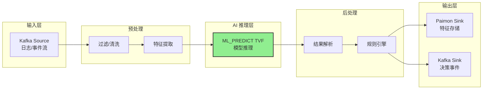
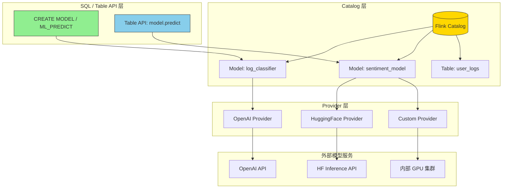
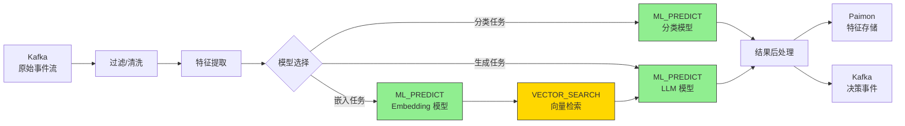
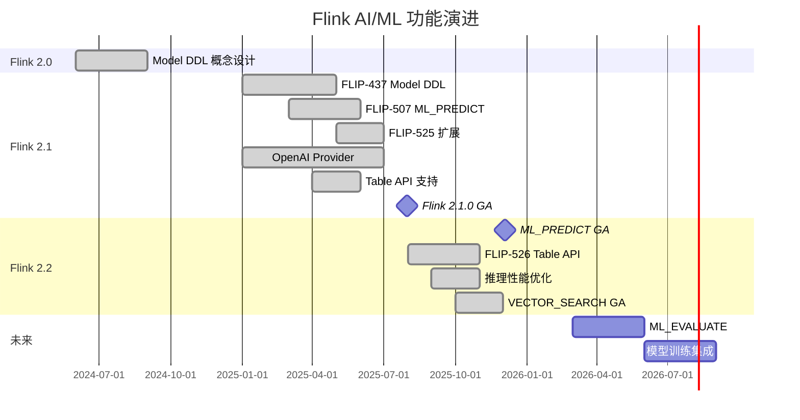
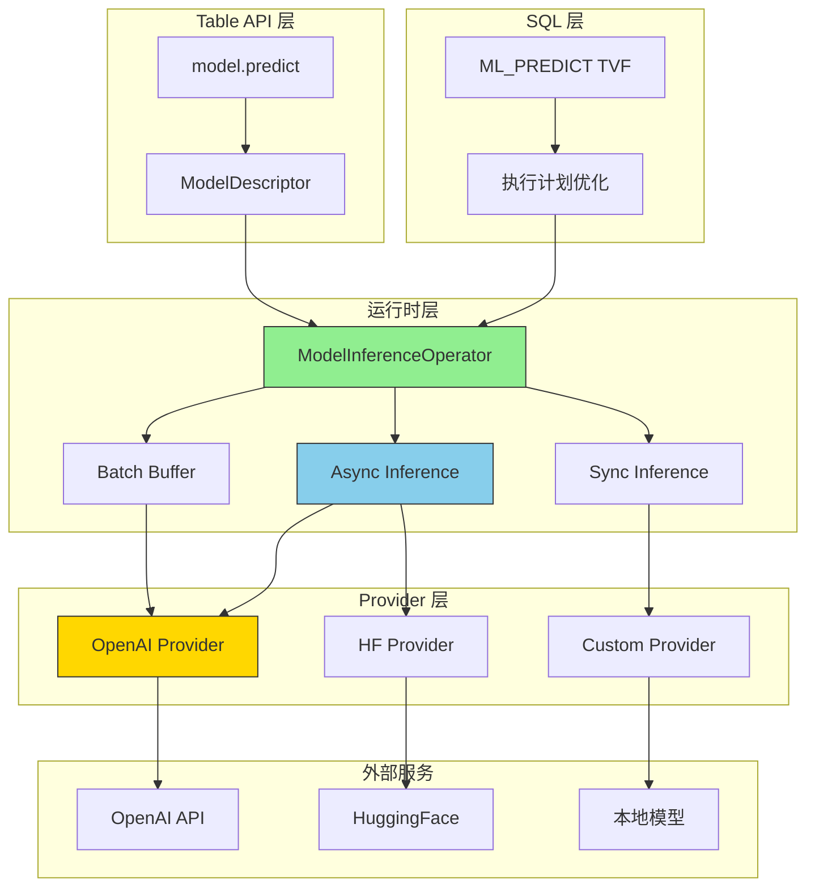

> **状态**: ✅ 已发布 | **风险等级**: 低 | **最后更新**: 2026-04-19
>
> Apache Flink 2.1.0 已于 2025-07-31 正式发布 Model DDL 与 ML_PREDICT 功能（实验性）。Flink 2.2.0 (2025-12-04) 将 ML_PREDICT 标记为 GA，并扩展了 Table API 支持。
>
> 本文档基于 Flink 官方 Release Notes、FLIP-437 与 FLIP-507 设计文档编写。

# Flink Model DDL 与 ML_PREDICT 完整指南：从 SQL 声明到实时 AI 推理

> **状态**: ✅ Released (2025-07-31, Flink 2.1 实验性; 2025-12-04, Flink 2.2 GA)
> **Flink 版本**: 2.1.0+ (SQL/Table API Model DDL), 2.2.0+ (ML_PREDICT GA + Table API 推理)
> **稳定性**: 2.1 Experimental; 2.2 GA (Generally Available)
>
> 所属阶段: Flink/03-api | 前置依赖: [Flink SQL 完整指南](./flink-table-sql-complete-guide.md), [Flink Table API 指南](./flink-table-sql-complete-guide.md) | 形式化等级: L3-L4

## 1. 概念定义 (Definitions)

### Def-F-03-90: Model DDL（模型定义语句）

**Model DDL** 是 Flink SQL 的扩展语法，用于在 Catalog 中以声明式方式定义机器学习模型及其推理接口。Model DDL 将 AI 模型视为与表（Table）、视图（View）同级的 Catalog 对象，实现了数据与模型的统一元数据管理[^1]。

**Flink 2.1 SQL 语法**：

```sql
CREATE MODEL <model_name>
[ INPUT ( <column_definition> [, ...] ) ]
[ OUTPUT ( <column_definition> [, ...] ) ]
WITH (
  'provider' = '<provider_type>',
  '<provider_key>' = '<provider_value>',
  ...
)
```

**语法要素说明**：

| 子句 | 必需性 | 语义 |
|------|--------|------|
| `CREATE MODEL` | 必需 | 声明模型定义语句 |
| `<model_name>` | 必需 | 模型在 Catalog 中的唯一标识符 |
| `INPUT` 子句 | 可选 | 定义模型输入 Schema |
| `OUTPUT` 子句 | 可选 | 定义模型输出 Schema |
| `WITH` 子句 | 条件必需 | 模型提供者配置参数 |

**形式化定义**：

设模型 Catalog 对象为 $\mathcal{M}$，则：

$$\mathcal{M} = (N, I, O, P, \mathcal{C})$$

其中：

- $N$: 模型名称（Catalog 命名空间内唯一）
- $I$: 输入 Schema，$I = \{(col_i, type_i)\}_{i=1}^{m}$
- $O$: 输出 Schema，$O = \{(col_j, type_j)\}_{j=1}^{n}$
- $P$: Provider 类型（如 `openai`, `huggingface`, `custom`）
- $\mathcal{C}$: Provider 特定配置参数集合

---

### Def-F-03-91: ML_PREDICT 表值函数（Table-Valued Function）

**ML_PREDICT** 是 Flink SQL 的内置表值函数（TVF），用于对 Model DDL 定义的模型执行实时推理，将机器学习/深度学习模型的推理能力无缝集成到流处理管道中[^1][^2]。

**Flink 2.1 SQL 语法形式**：

```sql
-- 形式 1: 基本调用
SELECT * FROM ML_PREDICT(
  TABLE <input_table>,
  MODEL <model_name>,
  DESCRIPTOR(<input_column_list>)
);

-- 形式 2: 带配置选项
SELECT * FROM ML_PREDICT(
  TABLE <input_table>,
  MODEL <model_name>,
  DESCRIPTOR(<input_column_list>),
  MAP['async', 'true', 'timeout', '100s']
);

-- 形式 3: 使用命名参数（Flink 2.2+）
SELECT * FROM ML_PREDICT(
  INPUT => TABLE <input_table>,
  MODEL => MODEL <model_name>,
  ARGS => DESCRIPTOR(<input_column_list>),
  CONFIG => MAP['async', 'true']
);
```

**形式化语义**：

设输入表为 $T_{in}$，模型为 $\mathcal{M}$，则 ML_PREDICT 定义了一个关系变换：

$$\text{ML_PREDICT}(T_{in}, \mathcal{M}) = T_{in} \bowtie_{model\_inference} \mathcal{M}(T_{in}.\text{input\_cols})$$

其中 $\bowtie$ 表示左外连接语义：即使推理失败，输入行也会被保留。

**输出列结构**：

| 列名 | 类型 | 描述 |
|------|------|------|
| `<input_columns>` | 原始类型 | 输入表的所有原始列（保持原 Schema） |
| `prediction` | STRING / 结构化类型 | 模型推理结果 |
| `prediction_metadata` | STRING | 推理元数据（延迟、token 用量等） |
| `prediction_error` | STRING | 错误信息（推理失败时非 NULL） |

---

### Def-F-03-92: Provider 架构与扩展接口

Flink ML_PREDICT 采用 Provider 架构解耦模型调用协议与引擎实现[^1]：

$$\text{Provider}_{\mathcal{M}} = (T, \mathcal{I}_{request}, \mathcal{I}_{response}, \mathcal{F}_{transform})$$

其中：

- $T$: Provider 类型标识（`openai`, `huggingface`, `custom`）
- $\mathcal{I}_{request}$: 请求接口协议（HTTP REST / gRPC）
- $\mathcal{I}_{response}$: 响应解析协议
- $\mathcal{F}_{transform}$: 输入/输出变换函数

**内置 Provider 类型**：

| Provider | 类型标识 | 适用模型 | 协议 |
|---------|---------|---------|------|
| OpenAI | `openai` | GPT-4, GPT-4o, GPT-3.5 | HTTP REST |
| Hugging Face | `huggingface` | 各类开源模型 | HTTP REST |
| 自定义 | `custom` | 用户自有模型 | 可配置 |

---

### Def-F-03-93: Table API Model 支持（Flink 2.1/2.2）

Flink 2.1 引入 Model DDL 的 Table API 支持（Java/Python），Flink 2.2 进一步扩展了模型推理操作[^2][^3]。

**Java Table API 模型定义**：

```java
tEnv.createModel(
    "MyModel",
    ModelDescriptor.forProvider("OPENAI")
      .inputSchema(Schema.newBuilder()
        .column("input", DataTypes.STRING())
        .build())
      .outputSchema(Schema.newBuilder()
        .column("output", DataTypes.STRING())
        .build())
      .option("endpoint", "https://api.openai.com/v1/chat/completions")
      .option("model", "gpt-4o")
      .option("api-key", "<your-api-key>")
      .build(),
    true  // ignoreIfExists
);
```

**形式化**：Table API 的 Model 操作构成一个命令式接口层：

$$\text{TableAPI}_{model} = \{\text{create}, \text{drop}, \text{from}, \text{predict}\}$$

---

## 2. 属性推导 (Properties)

### Prop-F-03-90: ML_PREDICT 的流处理语义

ML_PREDECT 在流处理上下文中满足以下语义属性：

1. **逐行推理**：对输入流的每条记录独立调用模型推理
2. **异步非阻塞**：支持异步模式（`async=true`），推理请求不阻塞数据流
3. **容错一致性**：通过 Checkpoint 机制保证 Exactly-Once 语义
4. **背压传播**：模型推理延迟通过背压机制向上游传播

形式化：设输入流为 $S(t)$，模型推理延迟为 $L_{infer}$，则输出流为：

$$O(t) = \{(r, \mathcal{M}(r)) \mid r \in S(t - L_{infer})\}$$

---

### Prop-F-03-91: 异步推理吞吐量上界

异步模式下，ML_PREDICT 的理论吞吐量上界为：

$$\text{Throughput}_{max} = \frac{N_{concurrent}}{L_{infer}}$$

其中 $N_{concurrent}$ 为最大并发推理请求数（由配置或外部服务容量决定）。

与同步模式对比：

| 模式 | 吞吐量公式 | 适用场景 |
|------|-----------|---------|
| 同步 | $1 / L_{infer}$ | 低延迟要求、快速模型 |
| 异步 | $N_{concurrent} / L_{infer}$ | LLM 推理、高延迟模型 |

当 $N_{concurrent} = 100$、$L_{infer} = 2s$ 时：

- 同步模式：0.5 条/s
- 异步模式：50 条/s

---

### Prop-F-03-92: Provider 扩展性

自定义 Provider 接口满足开放性原则：

$$\forall P_{custom}: \mathcal{I}_{request}(P_{custom}) \land \mathcal{I}_{response}(P_{custom}) \Rightarrow \text{ML_PREDICT}(T, P_{custom}) \in \text{ValidOutput}$$

即只要实现请求和响应接口，任何外部模型服务均可集成。

---

## 3. 关系建立 (Relations)

### 3.1 Model DDL vs UDF/UDTF 对比

| 维度 | UDF/UDTF | Model DDL + ML_PREDICT |
|------|---------|----------------------|
| **定义位置** | 代码中注册 | Catalog 中持久化 |
| **生命周期** | 作业级别 | Catalog 级别 |
| **Schema 管理** | 代码硬编码 | INPUT/OUTPUT 声明 |
| **版本管理** | 无原生支持 | Catalog 支持版本 |
| **多作业共享** | 需重复注册 | Catalog 共享 |
| **Provider 切换** | 需修改代码 | 仅修改配置 |
| **适用模型** | 本地轻量模型 | 远程大模型/LLM |
| **推理延迟** | 低（本地） | 中高（远程调用） |
| **SQL 支持** | 有限 | 完整 TVF 语法 |

### 3.2 ML_PREDICT 在流处理管道中的位置



### 3.3 与 VECTOR_SEARCH 的协同（Flink 2.2）

Flink 2.2 引入的 VECTOR_SEARCH 与 ML_PREDICT 形成完整的 RAG（检索增强生成）管道[^3]：


---

## 4. 论证过程 (Argumentation)

### 4.1 为什么需要 Model DDL？

**传统方式的问题**：

在 Flink 2.0 之前，集成 AI 模型推理需要：

1. 编写 UDF/UDTF 封装模型调用逻辑
2. 在作业代码中硬编码模型 endpoint、API key 等配置
3. 每启动作业都需要重新注册模型相关函数
4. 模型切换（如从 GPT-3.5 升级到 GPT-4）需要修改代码并重新打包部署

**Model DDL 的解决方案**：

| 问题 | 传统方式 | Model DDL 方式 |
|------|---------|---------------|
| 配置管理 | 硬编码在 UDF 中 | 声明在 Catalog 中 |
| 模型切换 | 修改代码 → 打包 → 部署 | `DROP MODEL` → `CREATE MODEL` |
| 权限隔离 | 代码级 | Catalog 级 ACL |
| 版本追踪 | 无 | Catalog 元数据记录 |
| 跨作业复用 | 复制代码 | 直接引用 Catalog 模型 |

---

### 4.2 OpenAI Provider 集成原理

Flink 内置 OpenAI Provider 的实现细节：

**请求构造**：

```json
{
  "model": "gpt-4o",
  "messages": [
    {"role": "system", "content": "<system-prompt>"},
    {"role": "user", "content": "<input_text>"}
  ],
  "temperature": 0.7,
  "max_tokens": 2048
}
```

**响应解析**：

```json
{
  "choices": [
    {
      "message": {
        "content": "<generated_text>"
      }
    }
  ],
  "usage": {
    "prompt_tokens": 15,
    "completion_tokens": 32,
    "total_tokens": 47
  }
}
```

Flink 将 `choices[0].message.content` 映射为 `prediction` 列，将 `usage` 信息映射为 `prediction_metadata`。

---

### 4.3 异步推理的必要性

**LLM 推理的典型延迟**：

| 模型 | 平均延迟 | 吞吐量（同步） |
|------|---------|-------------|
| GPT-3.5-turbo | 500ms | 2 条/s |
| GPT-4 | 2-5s | 0.2-0.5 条/s |
| GPT-4o | 1-2s | 0.5-1 条/s |
| 本地 7B 模型 | 500ms-2s | 0.5-2 条/s |

在同步模式下，单并行度无法处理超过 1 $L_{infer}$ 的吞吐量。对于实时流处理（如 1000 条/s 的日志流），同步模式完全不可行。

**异步模式的优势**：

- 并发请求数 $N_{concurrent}$ 可配置为 100-1000
- 有效吞吐量提升 100-1000 倍
- 通过 `timeout` 配置避免慢请求阻塞管道

---

## 5. 形式证明 / 工程论证 (Proof / Engineering Argument)

### 5.1 ML_PREDICT 语义正确性

**Thm-F-03-90: ML_PREDICT 输出完整性**

对于任意输入表 $T_{in}$，ML_PREDICT 的输出满足：

$$|\text{ML_PREDICT}(T_{in}, \mathcal{M})| = |T_{in}|$$

即输出记录数与输入记录数严格相等，无记录丢失或重复。

**证明**：

ML_PREDICT 实现为逐行映射算子（Map-like operator）。对于输入中的每条记录 $r \in T_{in}$：

1. 构造模型请求 $req = \mathcal{F}_{transform}(r)$
2. 发送请求并等待响应 $resp = \mathcal{I}_{request}(req)$
3. 解析响应 $pred = \mathcal{I}_{response}(resp)$
4. 输出 $(r, pred)$

步骤 1-4 对每条输入记录恰好执行一次，因此输出记录数等于输入记录数。即使推理失败（超时/错误），也会输出 $(r, NULL, NULL, error\_msg)$，保证完整性。∎

---

### 5.2 端到端延迟模型

**Prop-F-03-93: ML_PREDICT 端到端延迟分解**

设流处理管道包含 ML_PREDICT 的端到端延迟为：

$$L_{e2e} = L_{pre} + L_{queue} + L_{infer} + L_{post}$$

其中：

- $L_{pre}$: 预处理延迟（过滤、特征提取）
- $L_{queue}$: 异步等待队列延迟
- $L_{infer}$: 模型推理延迟（网络 RTT + 模型计算）
- $L_{post}$: 后处理延迟（结果解析、规则引擎）

在异步模式下，$L_{queue}$ 取决于并发度 $N$ 和到达率 $\lambda$：

$$L_{queue} = \frac{\lambda}{N \cdot (N - \lambda \cdot L_{infer})} \text{ (M/M/N 队列模型)}$$

当 $\lambda \ll N / L_{infer}$ 时，$L_{queue} \approx 0$。

---

## 6. 实例验证 (Examples)

### 6.1 Flink 2.1 SQL 完整示例：OpenAI 文本分类

```sql
-- ============================================
-- Flink 2.1 Model DDL + ML_PREDICT 完整示例
-- 场景：实时日志流文本分类（GPT-4o）
-- ============================================

-- 1. 创建输入流表（用户行为日志）
CREATE TABLE user_logs (
    log_id STRING PRIMARY KEY NOT ENFORCED,
    user_id STRING,
    log_message STRING,
    log_level STRING,
    event_time TIMESTAMP_LTZ(3),
    WATERMARK FOR event_time AS event_time - INTERVAL '5' SECOND
) WITH (
    'connector' = 'kafka',
    'topic' = 'user-logs',
    'properties.bootstrap.servers' = 'kafka:9092',
    'format' = 'json',
    'scan.startup.mode' = 'latest-offset'
);

-- 2. 使用 Model DDL 定义 OpenAI 分类模型
CREATE MODEL log_classifier
INPUT (log_message STRING)
OUTPUT (category STRING, confidence DOUBLE)
WITH (
    'provider' = 'openai',
    'endpoint' = 'https://api.openai.com/v1/chat/completions',
    'api-key' = '<your-openai-api-key>',
    'model' = 'gpt-4o',
    'system-prompt' = 'Classify the log into one of: ERROR, WARNING, INFO, SECURITY. Respond with JSON: {"category": "...", "confidence": 0.95}',
    'task' = 'classification',
    'type' = 'remote'
);

-- 3. 使用 ML_PREDICT 进行实时推理
SELECT
    log_id,
    user_id,
    log_message,
    log_level,
    prediction AS category_result,
    prediction_metadata AS inference_metadata
FROM ML_PREDICT(
    TABLE user_logs,
    MODEL log_classifier,
    DESCRIPTOR(log_message)
);

-- 4. 带异步和超时配置的推理
SELECT
    log_id,
    user_id,
    log_message,
    prediction AS category,
    prediction_error
FROM ML_PREDICT(
    TABLE user_logs,
    MODEL log_classifier,
    DESCRIPTOR(log_message),
    MAP['async', 'true', 'timeout', '30s']
);

-- 5. 写入分类结果到下游
CREATE TABLE classified_logs (
    log_id STRING PRIMARY KEY NOT ENFORCED,
    user_id STRING,
    log_message STRING,
    category STRING,
    confidence DOUBLE,
    event_time TIMESTAMP_LTZ(3)
) WITH (
    'connector' = 'paimon',
    'path' = 's3://warehouse/classified-logs'
);

INSERT INTO classified_logs
SELECT
    log_id,
    user_id,
    log_message,
    prediction AS category,
    -- 从 JSON 解析 confidence（可使用 JSON 函数）
    CAST(JSON_VALUE(prediction, '$.confidence') AS DOUBLE) AS confidence,
    event_time
FROM ML_PREDICT(
    TABLE user_logs,
    MODEL log_classifier,
    DESCRIPTOR(log_message)
);
```

---

### 6.2 Flink 2.1 Java Table API 示例

```java
// ============================================
// Flink 2.1 Java Table API Model DDL 示例
// ============================================

import org.apache.flink.table.api.*;
import org.apache.flink.table.api.bridge.java.StreamTableEnvironment;
import org.apache.flink.streaming.api.environment.StreamExecutionEnvironment;

public class ModelDDLExample {
    public static void main(String[] args) throws Exception {
        StreamExecutionEnvironment env = StreamExecutionEnvironment.getExecutionEnvironment();
        StreamTableEnvironment tEnv = StreamTableEnvironment.create(env);

        // 1. 创建输入表
        tEnv.executeSql(
            "CREATE TABLE user_logs (" +
            "  log_id STRING PRIMARY KEY NOT ENFORCED," +
            "  log_message STRING," +
            "  event_time TIMESTAMP_LTZ(3)" +
            ") WITH (" +
            "  'connector' = 'kafka'," +
            "  'topic' = 'user-logs'," +
            "  'properties.bootstrap.servers' = 'kafka:9092'," +
            "  'format' = 'json'" +
            ")"
        );

        // 2. 使用 Table API 创建模型
        tEnv.createModel(
            "log_classifier",
            ModelDescriptor.forProvider("OPENAI")
                .inputSchema(Schema.newBuilder()
                    .column("log_message", DataTypes.STRING())
                    .build())
                .outputSchema(Schema.newBuilder()
                    .column("category", DataTypes.STRING())
                    .column("confidence", DataTypes.DOUBLE())
                    .build())
                .option("endpoint", "https://api.openai.com/v1/chat/completions")
                .option("model", "gpt-4o")
                .option("api-key", "<your-api-key>")
                .option("system-prompt", "Classify into: ERROR, WARNING, INFO, SECURITY")
                .option("task", "classification")
                .option("type", "remote")
                .build(),
            true  // ignoreIfExists
        );

        // 3. SQL 方式调用 ML_PREDICT
        Table result = tEnv.sqlQuery(
            "SELECT log_id, log_message, prediction " +
            "FROM ML_PREDICT(" +
            "  TABLE user_logs, " +
            "  MODEL log_classifier, " +
            "  DESCRIPTOR(log_message)" +
            ")"
        );

        tEnv.createTemporaryView("classified", result);

        // 4. 写入结果
        tEnv.executeSql(
            "CREATE TABLE classified_sink (" +
            "  log_id STRING PRIMARY KEY NOT ENFORCED," +
            "  category STRING" +
            ") WITH (" +
            "  'connector' = 'upsert-kafka'," +
            "  'topic' = 'classified'," +
            "  'properties.bootstrap.servers' = 'kafka:9092'," +
            "  'key.format' = 'json'," +
            "  'value.format' = 'json'" +
            ")"
        );

        tEnv.executeSql("INSERT INTO classified_sink SELECT log_id, prediction FROM classified");
    }
}
```

---

### 6.3 Flink 2.2 Table API 模型推理（Java）

```java
// ============================================
// Flink 2.2 Java Table API 模型推理示例
// FLINK-38104: Table API 支持 model.predict()
// ============================================

import org.apache.flink.table.api.*;
import org.apache.flink.table.api.bridge.java.StreamTableEnvironment;
import org.apache.flink.streaming.api.environment.StreamExecutionEnvironment;
import java.util.Map;

public class ModelInferenceExample {
    public static void main(String[] args) throws Exception {
        // 1. 设置环境
        StreamExecutionEnvironment env = StreamExecutionEnvironment.getExecutionEnvironment();
        StreamTableEnvironment tEnv = StreamTableEnvironment.create(env);

        // 2. 创建内存源表
        Table myTable = tEnv.fromValues(
            DataTypes.ROW(
                DataTypes.FIELD("text", DataTypes.STRING())
            ),
            Row.of("Hello"),
            Row.of("Machine Learning"),
            Row.of("Good morning")
        );

        // 3. 创建模型
        tEnv.createModel(
            "my_model",
            ModelDescriptor.forProvider("openai")
                .inputSchema(Schema.newBuilder()
                    .column("input", DataTypes.STRING())
                    .build())
                .outputSchema(Schema.newBuilder()
                    .column("output", DataTypes.STRING())
                    .build())
                .option("endpoint", "https://api.openai.com/v1/chat/completions")
                .option("model", "gpt-4.1")
                .option("system-prompt", "translate to chinese")
                .option("api-key", "<your-openai-api-key-here>")
                .build()
        );

        Model model = tEnv.fromModel("my_model");

        // 4. 同步/异步预测
        Table predictResult = model.predict(myTable, ColumnList.of("text"));

        // 5. 异步预测（Flink 2.2 增强）
        Table asyncPredictResult = model.predict(
            myTable,
            ColumnList.of("text"),
            Map.of("async", "true", "timeout", "100s")
        );

        predictResult.execute().print();
    }
}
```

---

### 6.4 Python Table API 示例

```python
# ============================================
# Flink 2.1/2.2 Python Table API Model DDL 示例
# ============================================

from pyflink.table import StreamTableEnvironment, EnvironmentSettings
from pyflink.table.expressions import col, lit, call

# 1. 创建环境
settings = EnvironmentSettings.in_streaming_mode()
t_env = StreamTableEnvironment.create(environment_settings=settings)

# 2. 创建源表
t_env.execute_sql("""
    CREATE TABLE user_logs (
        log_id STRING PRIMARY KEY NOT ENFORCED,
        log_message STRING,
        event_time TIMESTAMP_LTZ(3)
    ) WITH (
        'connector' = 'kafka',
        'topic' = 'user-logs',
        'properties.bootstrap.servers' = 'kafka:9092',
        'format' = 'json'
    )
""")

# 3. Python Table API 创建模型（Flink 2.1+）
t_env.create_model(
    "log_classifier",
    model_descriptor=t_env.ModelDescriptor.for_provider("OPENAI")
        .input_schema(t_env.Schema.new_builder()
            .column("log_message", t_env.DataTypes.STRING())
            .build())
        .output_schema(t_env.Schema.new_builder()
            .column("category", t_env.DataTypes.STRING())
            .build())
        .option("endpoint", "https://api.openai.com/v1/chat/completions")
        .option("model", "gpt-4o")
        .option("api-key", "<your-api-key>")
        .option("system-prompt", "Classify into: ERROR, WARNING, INFO, SECURITY")
        .build(),
    ignore_if_exists=True
)

# 4. SQL 调用 ML_PREDICT
result = t_env.sql_query("""
    SELECT
        log_id,
        log_message,
        prediction AS category
    FROM ML_PREDICT(
        TABLE user_logs,
        MODEL log_classifier,
        DESCRIPTOR(log_message)
    )
""")

result.execute().print()
```

---

### 6.4 Flink 2.2 Table API 模型推理（Java）

```java
// ============================================
// Flink 2.2 Java Table API 模型推理完整示例
// FLINK-38104: Table API 支持 model.predict()
// ============================================

import org.apache.flink.table.api.*;
import org.apache.flink.table.api.bridge.java.StreamTableEnvironment;
import org.apache.flink.streaming.api.environment.StreamExecutionEnvironment;
import java.util.Map;

public class ModelInferenceCompleteExample {
    public static void main(String[] args) throws Exception {
        // 1. 设置环境
        StreamExecutionEnvironment env = StreamExecutionEnvironment.getExecutionEnvironment();
        StreamTableEnvironment tEnv = StreamTableEnvironment.create(env);

        // 2. 创建内存源表
        Table myTable = tEnv.fromValues(
            DataTypes.ROW(
                DataTypes.FIELD("text", DataTypes.STRING())
            ),
            Row.of("Hello"),
            Row.of("Machine Learning"),
            Row.of("Good morning")
        );

        // 3. 创建模型
        tEnv.createModel(
            "my_model",
            ModelDescriptor.forProvider("openai")
                .inputSchema(Schema.newBuilder()
                    .column("input", DataTypes.STRING())
                    .build())
                .outputSchema(Schema.newBuilder()
                    .column("output", DataTypes.STRING())
                    .build())
                .option("endpoint", "https://api.openai.com/v1/chat/completions")
                .option("model", "gpt-4.1")
                .option("system-prompt", "translate to chinese")
                .option("api-key", "<your-openai-api-key-here>")
                .build()
        );

        Model model = tEnv.fromModel("my_model");

        // 4. 同步/异步预测
        Table predictResult = model.predict(myTable, ColumnList.of("text"));

        // 5. 异步预测（Flink 2.2 增强）
        Table asyncPredictResult = model.predict(
            myTable,
            ColumnList.of("text"),
            Map.of("async", "true", "timeout", "100s")
        );

        predictResult.execute().print();
    }
}
```

---

### 6.5 流式推理与 Side Output 错误处理

```sql
-- ============================================
-- ML_PREDICT 错误处理与 Side Output
-- ============================================

-- 创建输入流
CREATE TABLE sensor_events (
    event_id STRING PRIMARY KEY NOT ENFORCED,
    sensor_data STRING,
    event_time TIMESTAMP_LTZ(3),
    WATERMARK FOR event_time AS event_time - INTERVAL '5' SECOND
) WITH (
    'connector' = 'kafka',
    'topic' = 'sensor-events',
    'properties.bootstrap.servers' = 'kafka:9092',
    'format' = 'json'
);

-- 定义异常检测模型
CREATE MODEL anomaly_detector
INPUT (sensor_data STRING)
OUTPUT (is_anomaly BOOLEAN, confidence DOUBLE)
WITH (
    'provider' = 'openai',
    'endpoint' = 'https://api.openai.com/v1/chat/completions',
    'api-key' = '<your-key>',
    'model' = 'gpt-4o-mini',
    'system-prompt' = 'Analyze sensor data. Return JSON: {"is_anomaly": true/false, "confidence": 0.0-1.0}'
);

-- 主输出：正常推理结果
CREATE TABLE anomaly_results (
    event_id STRING PRIMARY KEY NOT ENFORCED,
    sensor_data STRING,
    is_anomaly BOOLEAN,
    confidence DOUBLE
) WITH (
    'connector' = 'kafka',
    'topic' = 'anomaly-results',
    'properties.bootstrap.servers' = 'kafka:9092',
    'format' = 'json'
);

-- Side Output：推理失败记录（Flink 2.2+）
CREATE TABLE inference_errors (
    event_id STRING PRIMARY KEY NOT ENFORCED,
    sensor_data STRING,
    error_message STRING,
    error_time TIMESTAMP_LTZ(3)
) WITH (
    'connector' = 'kafka',
    'topic' = 'inference-errors',
    'properties.bootstrap.servers' = 'kafka:9092',
    'format' = 'json'
);

-- 执行推理并分离错误
INSERT INTO anomaly_results
SELECT
    event_id,
    sensor_data,
    CAST(JSON_VALUE(prediction, '$.is_anomaly') AS BOOLEAN) AS is_anomaly,
    CAST(JSON_VALUE(prediction, '$.confidence') AS DOUBLE) AS confidence
FROM ML_PREDICT(
    TABLE sensor_events,
    MODEL anomaly_detector,
    DESCRIPTOR(sensor_data),
    MAP['async', 'true', 'timeout', '30s']
)
WHERE prediction_error IS NULL;

-- 错误记录写入 Side Output
INSERT INTO inference_errors
SELECT
    event_id,
    sensor_data,
    prediction_error AS error_message,
    event_time AS error_time
FROM ML_PREDICT(
    TABLE sensor_events,
    MODEL anomaly_detector,
    DESCRIPTOR(sensor_data)
)
WHERE prediction_error IS NOT NULL;
```

### 6.6 自定义 Provider 实现

```java
// ============================================
// 自定义 Model Provider 实现示例
// ============================================

import org.apache.flink.table.ml.*;

/**
 * 自定义 Provider：调用内部微服务的模型推理 API
 */
public class InternalMLProvider implements ModelProvider {

    private String endpoint;
    private String apiKey;
    private HttpClient client;

    @Override
    public void open(Map<String, String> options) {
        this.endpoint = options.get("endpoint");
        this.apiKey = options.get("api-key");
        this.client = HttpClient.newBuilder()
            .connectTimeout(Duration.ofSeconds(10))
            .build();
    }

    @Override
    public List<RowData> predict(List<RowData> inputs, Schema inputSchema, Schema outputSchema) {
        // 1. 构造批量请求
        JsonArray requests = new JsonArray();
        for (RowData input : inputs) {
            requests.add(rowToJson(input, inputSchema));
        }

        // 2. 发送 HTTP 请求到内部模型服务
        HttpRequest request = HttpRequest.newBuilder()
            .uri(URI.create(endpoint + "/predict"))
            .header("Authorization", "Bearer " + apiKey)
            .header("Content-Type", "application/json")
            .POST(HttpRequest.BodyPublishers.ofString(requests.toString()))
            .build();

        try {
            HttpResponse<String> response = client.send(request, HttpResponse.BodyHandlers.ofString());
            // 3. 解析响应并映射为输出 Schema
            return parseResponse(response.body(), outputSchema);
        } catch (Exception e) {
            // 4. 错误处理：返回带 error 标记的结果
            return createErrorResults(inputs.size(), e.getMessage());
        }
    }

    @Override
    public void close() {
        // 清理资源
    }
}
```

注册自定义 Provider：

```java
// 在服务加载器中注册
tEnv.getConfig().getConfiguration().setString(
    "table.ml.provider.custom.class",
    "com.example.InternalMLProvider"
);
```

---

### 6.6 生产环境配置最佳实践

```sql
-- ============================================
-- ML_PREDICT 生产环境配置
-- ============================================

-- 异步推理配置（强烈推荐用于 LLM）
SET 'table.exec.ml.predict.async' = 'true';
SET 'table.exec.ml.predict.timeout' = '60s';
SET 'table.exec.ml.predict.max-concurrency' = '100';

-- 重试配置
SET 'table.exec.ml.predict.max-retries' = '3';
SET 'table.exec.ml.predict.retry-backoff' = '5s';

-- 批量推理优化
SET 'table.exec.ml.predict.batch-size' = '10';
SET 'table.exec.ml.predict.batch-timeout' = '1s';

-- 错误处理配置
SET 'table.exec.ml.predict.error-handling' = 'output-null';  -- 或 'fail-job'
```

---

## 7. 可视化 (Visualizations)

### 7.1 Model DDL + ML_PREDICT 架构全景



### 7.2 实时 AI 推理流水线



### 7.3 Flink 2.1/2.2 ML 功能演进



### 7.4 ML_PREDICT 配置决策树

```mermaid
flowchart TD
    A[实时推理需求] --> B{模型类型?}
    B -->|LLM/GPT| C{延迟容忍?}
    B -->|轻量模型| D[同步模式<br/>直接调用]
    C -->|高吞吐| E[异步模式<br/>MAP[async=true]]
    C -->|低延迟| D
    E --> F{并发度配置}
    F -->|外部服务容量高| G[max-concurrency=100+]
    F -->|外部服务容量低| H[max-concurrency=10-50]
    D --> I[配置 timeout]
    G --> I
    H --> I
    I --> J{错误处理策略}
    J -->|允许部分失败| K[error-handling=output-null]
    J -->|零容忍| L[error-handling=fail-job]
    K --> M[配置 retry]
    L --> M
```

---

### 8.4 OpenAI Provider 完整配置参考

| 配置键 | 类型 | 必需 | 默认值 | 说明 |
|--------|------|------|--------|------|
| `provider` | STRING | 是 | - | 固定值 `openai` |
| `endpoint` | STRING | 是 | - | API endpoint URL |
| `api-key` | STRING | 是 | - | OpenAI API Key |
| `model` | STRING | 是 | - | 模型 ID（gpt-4o, gpt-4, gpt-3.5-turbo 等） |
| `system-prompt` | STRING | 否 | - | 系统提示词 |
| `temperature` | DOUBLE | 否 | 0.7 | 采样温度 |
| `max-tokens` | INT | 否 | 2048 | 最大生成 token 数 |
| `top-p` | DOUBLE | 否 | 1.0 | 核采样参数 |
| `frequency-penalty` | DOUBLE | 否 | 0.0 | 频率惩罚 |
| `presence-penalty` | DOUBLE | 否 | 0.0 | 存在惩罚 |

### 8.5 HuggingFace Provider 配置参考

| 配置键 | 类型 | 必需 | 说明 |
|--------|------|------|------|
| `provider` | STRING | 是 | `huggingface` |
| `endpoint` | STRING | 是 | Inference API endpoint |
| `api-key` | STRING | 是 | HF API Token |
| `model` | STRING | 是 | 模型 ID（如 `meta-llama/Llama-2-7b`） |

### 8.6 生产环境配置模板

```yaml
# config.yaml: ML_PREDICT 生产配置
# ============================================

table:
  exec:
    ml:
      predict:
        async: true
        timeout: "60s"
        max-concurrency: "100"
        max-retries: "3"
        retry-backoff: "5s"
        batch-size: "10"
        error-handling: "output-null"
```

---

### 8.7 多模型串联推理流水线

```sql
-- ============================================
-- 多模型串联：嵌入生成 → 向量检索 → LLM 生成
-- ============================================

-- 步骤 1: 使用 ML_PREDICT 生成文本嵌入
CREATE MODEL embedding_model
INPUT (text STRING)
OUTPUT (embedding ARRAY<FLOAT>)
WITH (
    'provider' = 'openai',
    'endpoint' = 'https://api.openai.com/v1/embeddings',
    'api-key' = '<your-key>',
    'model' = 'text-embedding-3-small'
);

-- 步骤 2: 生成查询向量
CREATE VIEW query_embeddings AS
SELECT
    q.question_id,
    q.question_text,
    prediction AS embedding
FROM ML_PREDICT(
    TABLE questions,
    MODEL embedding_model,
    DESCRIPTOR(question_text)
);

-- 步骤 3: 向量搜索检索相关文档
CREATE VIEW relevant_docs AS
SELECT
    q.question_id,
    q.question_text,
    d.doc_id,
    d.content,
    v.similarity
FROM query_embeddings q
LATERAL VECTOR_SEARCH(
    TABLE document_vectors,
    q.embedding,
    DESCRIPTOR(vector),
    5
) v
JOIN documents d ON v.doc_id = d.doc_id;

-- 步骤 4: 使用 LLM 生成回答
CREATE MODEL qa_model
INPUT (context STRING, question STRING)
OUTPUT (answer STRING)
WITH (
    'provider' = 'openai',
    'model' = 'gpt-4o',
    'system-prompt' = 'Answer based on the provided context.'
);

SELECT
    question_id,
    question_text,
    prediction AS answer
FROM ML_PREDICT(
    TABLE (
        SELECT
            question_id,
            question_text,
            STRING_AGG(content, '\n') AS context
        FROM relevant_docs
        GROUP BY question_id, question_text
    ),
    MODEL qa_model,
    DESCRIPTOR(context, question_text)
);
```

### 8.8 CREATE / DROP / DESCRIBE MODEL 完整 DDL 参考

```sql
-- ============================================
-- Model DDL 完整语法参考
-- ============================================

-- 创建模型
CREATE MODEL [IF NOT EXISTS] model_name
[ INPUT ( column_definition [, ...] ) ]
[ OUTPUT ( column_definition [, ...] ) ]
WITH (
  'provider' = 'provider_type',
  'key' = 'value',
  ...
);

-- 创建或替换模型
CREATE OR REPLACE MODEL model_name
[ INPUT ... ]
[ OUTPUT ... ]
WITH (...);

-- 删除模型
DROP MODEL [IF EXISTS] model_name;

-- 查看模型定义
DESCRIBE MODEL model_name;

-- 查看所有模型
SHOW MODELS;

-- 查看模型详细属性
SHOW CREATE MODEL model_name;
```

**权限控制**：

```sql
-- 模型级别权限（取决于 Catalog 实现）
GRANT USAGE ON MODEL model_name TO USER 'analyst';
GRANT ALL PRIVILEGES ON MODEL model_name TO USER 'data_engineer';
```

### 8.9 模型版本管理与 A/B 测试

Model DDL 支持通过 Catalog 进行模型版本管理，实现生产环境的 A/B 测试：

```sql
-- ============================================
-- 模型 A/B 测试配置
-- ============================================

-- 创建生产模型 v1
CREATE MODEL sentiment_v1
INPUT (text STRING)
OUTPUT (sentiment STRING, score DOUBLE)
WITH (
    'provider' = 'openai',
    'model' = 'gpt-3.5-turbo',
    'system-prompt' = 'Classify sentiment: positive, negative, neutral'
);

-- 创建实验模型 v2（新模型）
CREATE MODEL sentiment_v2
INPUT (text STRING)
OUTPUT (sentiment STRING, score DOUBLE)
WITH (
    'provider' = 'openai',
    'model' = 'gpt-4o-mini',
    'system-prompt' = 'Classify sentiment: positive, negative, neutral. Provide confidence score.'
);

-- A/B 测试：按比例路由到不同模型
CREATE VIEW ab_test_split AS
SELECT
    text,
    event_id,
    CASE
        WHEN MOD(HASH(event_id), 100) < 90 THEN 'v1'  -- 90% 流量到 v1
        ELSE 'v2'                                       -- 10% 流量到 v2
    END AS model_version
FROM social_media_stream;

-- v1 推理结果
INSERT INTO sentiment_results
SELECT
    event_id,
    text,
    prediction AS sentiment,
    CAST(JSON_VALUE(prediction, '$.score') AS DOUBLE) AS score,
    'v1' AS model_version
FROM ML_PREDICT(
    TABLE (SELECT * FROM ab_test_split WHERE model_version = 'v1'),
    MODEL sentiment_v1,
    DESCRIPTOR(text)
);

-- v2 推理结果
INSERT INTO sentiment_results
SELECT
    event_id,
    text,
    prediction AS sentiment,
    CAST(JSON_VALUE(prediction, '$.score') AS DOUBLE) AS score,
    'v2' AS model_version
FROM ML_PREDICT(
    TABLE (SELECT * FROM ab_test_split WHERE model_version = 'v2'),
    MODEL sentiment_v2,
    DESCRIPTOR(text)
);
```

### 8.10 ML_PREDICT 执行引擎架构



**执行流程**：

1. **解析阶段**：SQL 解析器识别 `ML_PREDICT` TVF，提取 MODEL 引用和输入列
2. **优化阶段**：规划器将 ML_PREDICT 转换为 `ModelInference` 物理算子
3. **代码生成**：根据 INPUT/OUTPUT Schema 生成序列化/反序列化代码
4. **运行时**：`ModelInferenceOperator` 逐行或批量调用 Provider
5. **Provider 调用**：HTTP/gRPC 请求发送至外部模型服务
6. **结果解析**：响应解析为 OUTPUT Schema 定义的列结构

**性能优化点**：

| 优化点 | 机制 | 效果 |
|--------|------|------|
| 连接池复用 | Provider 内部维护 HTTP 连接池 | 减少 TCP 握手开销 |
| 批量请求 | 多条记录合并为单个 API 请求 | 提升吞吐 3-10x |
| 异步非阻塞 | asyncio / CompletableFuture | 消除等待延迟 |
| 结果缓存 | 相同输入缓存推理结果 | 减少重复调用 |
| 自适应超时 | 根据历史延迟动态调整 | 平衡成功率与延迟 |

### 8.11 流式推理模式对比

| 模式 | 延迟 | 吞吐量 | 资源占用 | 适用场景 |
|------|------|--------|---------|---------|
| 同步推理 | 低 | 低 | 低 | 轻量模型、低延迟要求 |
| 异步推理 | 中 | 高 | 中 | LLM、远程 API |
| 批量推理 | 高 | 最高 | 高 | 非实时、大吞吐量 |
| 微批量 | 中 | 中高 | 中 | 平衡延迟与吞吐 |

### 8.8 成本估算与配额管理

**OpenAI API 成本模型**：

| 模型 | 输入 ($/1M tokens) | 输出 ($/1M tokens) | 典型延迟 |
|------|-------------------|-------------------|---------|
| gpt-4o | $2.50 | $10.00 | 1-2s |
| gpt-4o-mini | $0.15 | $0.60 | 0.5-1s |
| gpt-4 | $30.00 | $60.00 | 2-5s |
| gpt-3.5-turbo | $0.50 | $1.50 | 0.5-1s |

**Flink 流处理成本估算**：

假设场景：1000 条/秒的日志流，每条平均 500 tokens

```
日处理量: 1000 × 86400 = 86,400,000 条
Token 总量: 86.4M × 500 = 43.2B tokens

gpt-4o 日成本: 43.2B × $2.50 / 1M = $108,000
gpt-4o-mini 日成本: 43.2B × $0.15 / 1M = $6,480
```

**成本优化策略**：

1. **采样处理**：仅对关键记录调用模型

   ```sql
   SELECT * FROM ML_PREDICT(
       TABLE (SELECT * FROM logs WHERE log_level = 'ERROR'),
       MODEL classifier,
       DESCRIPTOR(message)
   );
   ```

2. **批量推理**：增加 `batch-size` 参数，减少 API 调用次数

3. **模型降级**：非关键场景使用 gpt-4o-mini 替代 gpt-4o

4. **缓存预测结果**：对重复输入使用 Flink 状态缓存推理结果

---

## 8. 配置参数全量参考

### 8.1 Model DDL 配置

| 配置键 | 默认值 | 说明 |
|--------|--------|------|
| `provider` | 无 | Provider 类型（openai/huggingface/custom） |
| `endpoint` | 无 | 模型服务 endpoint URL |
| `api-key` | 无 | API 认证密钥 |
| `model` | 无 | 模型名称（如 gpt-4o） |
| `system-prompt` | 无 | 系统提示词 |
| `task` | 无 | 任务类型（classification/generation） |
| `type` | `remote` | 模型部署类型（remote/local） |

### 8.2 ML_PREDICT 执行配置

| 配置键 | 默认值 | 版本 | 说明 |
|--------|--------|------|------|
| `table.exec.ml.predict.async` | `false` | 2.1+ | 启用异步推理 |
| `table.exec.ml.predict.timeout` | `30s` | 2.1+ | 推理超时时间 |
| `table.exec.ml.predict.max-concurrency` | `50` | 2.1+ | 最大并发请求数 |
| `table.exec.ml.predict.max-retries` | `3` | 2.1+ | 最大重试次数 |
| `table.exec.ml.predict.retry-backoff` | `5s` | 2.1+ | 重试退避时间 |
| `table.exec.ml.predict.batch-size` | `1` | 2.2+ | 批量推理大小 |
| `table.exec.ml.predict.error-handling` | `output-null` | 2.1+ | 错误处理策略 |

---

## 9. 引用参考 (References)

[^1]: Apache Flink Blog, "Apache Flink 2.1.0: Ushers in a New Era of Unified Real-Time Data + AI with Comprehensive Upgrades", July 31, 2025. <https://flink.apache.org/2025/07/31/apache-flink-2.1.0-ushers-in-a-new-era-of-unified-real-time-data--ai-with-comprehensive-upgrades/>

[^2]: Apache Flink Release Notes, "Release Notes - Flink 2.2", 2025. <https://nightlies.apache.org/flink/flink-docs-stable/release-notes/flink-2.2/>

[^3]: Apache Flink Blog, "Apache Flink 2.2.0: Advancing Real-Time Data + AI and Empowering Stream Processing for the AI Era", December 4, 2025. <https://flink.apache.org/2025/12/04/apache-flink-2.2.0-advancing-real-time-data--ai-and-empowering-stream-processing-for-the-ai-era/>


---

> **状态**: Flink 2.1 Experimental / 2.2 GA | **更新日期**: 2026-04-19
>
> ML_PREDICT 在 Flink 2.2 中已标记为 GA，可安全用于生产环境。建议搭配异步模式和适当的并发限制以获取最佳吞吐量。
