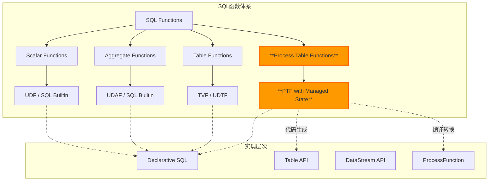
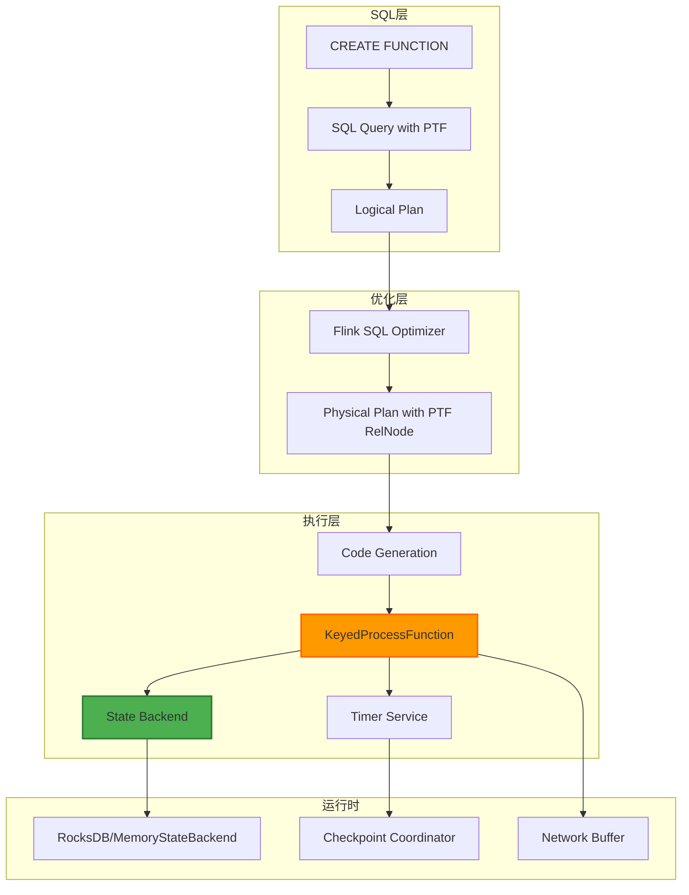
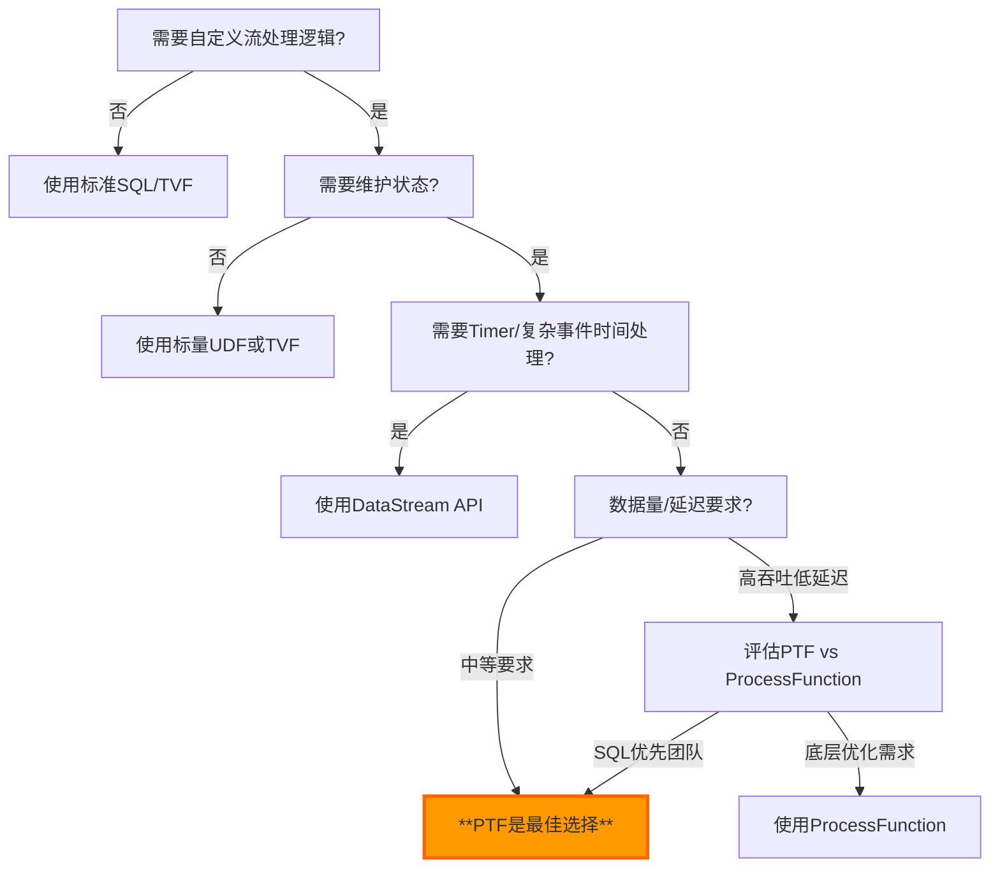
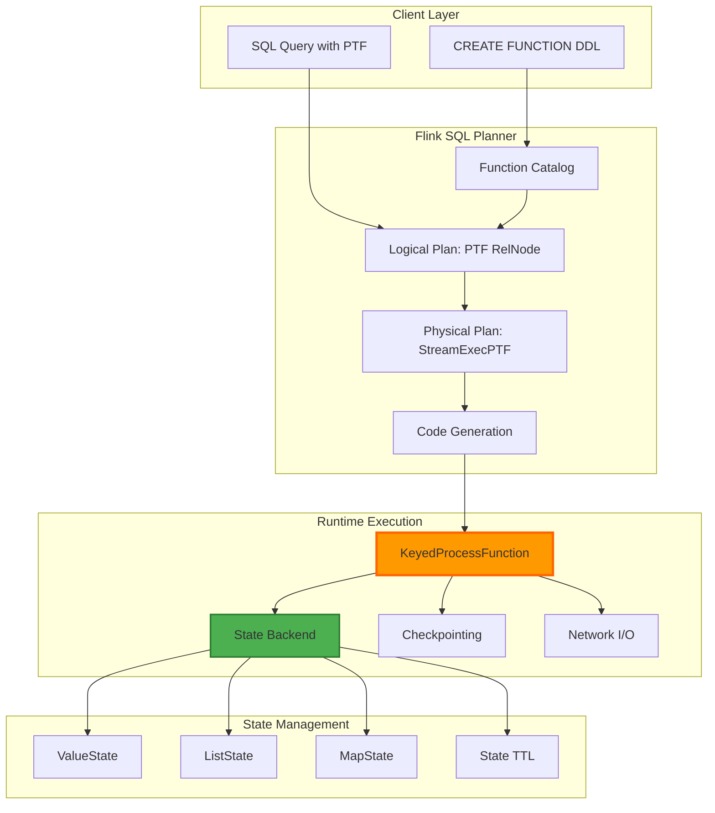
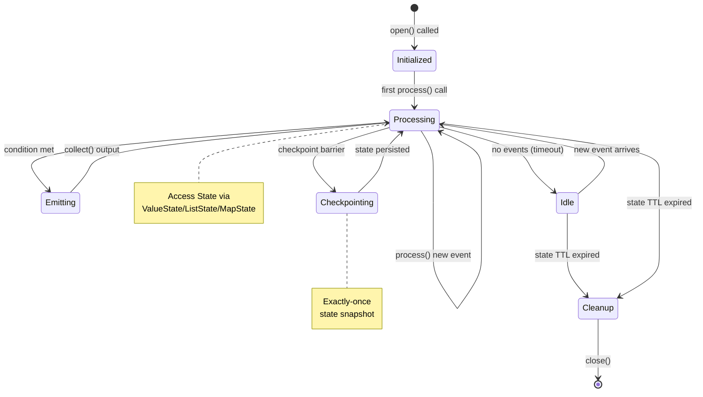
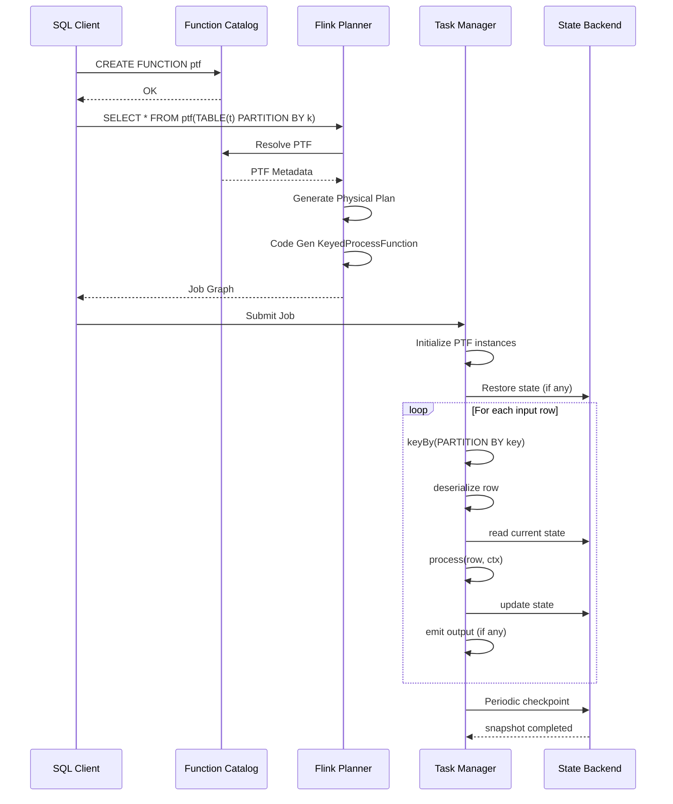
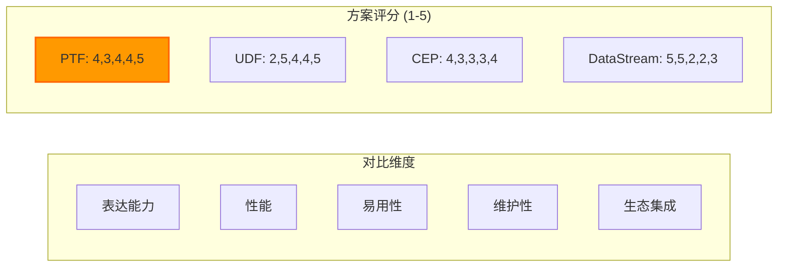

# Flink Process Table Functions (PTF) - 有状态SQL扩展

> **所属阶段**: Flink | **前置依赖**: [Flink SQL 完整指南](./flink-table-sql-complete-guide.md) | **形式化等级**: L4

---

## 1. 概念定义 (Definitions)

### Def-F-03-30: Process Table Function (PTF)

**定义**: Process Table Function 是一种**有状态的表值函数**，允许在Flink SQL中直接实现需要维护状态和自定义处理逻辑的复杂流处理操作。

形式化表述：
$$
PTF = (I, O, S, \tau, \delta, \kappa)
$$

其中：

- $I$: 输入数据类型集合（Input Schema）
- $O$: 输出数据类型集合（Output Schema）
- $S$: 托管状态空间（Managed State Space）
- $\tau$: 状态转换函数（State Transition Function）
- $\delta$: 输出决策函数（Output Decision Function）
- $\kappa$: 上下文访问接口（Context Access Interface）

```
┌─────────────────────────────────────────────────────────────────┐
│                    Process Table Function                        │
├─────────────────────────────────────────────────────────────────┤
│                                                                  │
│   Input Row(s) → [State Transition τ] → [Output Decision δ]     │
│                      ↑                    ↓                      │
│                 Managed State S       Output Row(s)              │
│                      ↑                                           │
│              Context Access κ (Watermark, Timestamp, etc.)      │
│                                                                  │
└─────────────────────────────────────────────────────────────────┘
```

PTF 的核心价值在于**桥接声明式SQL与命令式DataStream API**，使用户无需离开SQL环境即可实现：

- 自定义窗口聚合逻辑
- 基于状态的模式匹配（CEP简化版）
- 流-流Join的状态管理
- 去重与状态机转换
- 实时ML推理的上下文维护

### Def-F-03-31: 托管状态 (Managed State)

**定义**: 托管状态是由Flink状态后端统一管理的键控状态（Keyed State），PTF通过声明式API访问，支持自动容错与一致性保证。

形式化：
$$
S_{managed} = \{ (k, v, t_{last}) \mid k \in \mathcal{K}, v \in \mathcal{V}, t_{last} \in \mathbb{T} \}
$$

其中：

- $\mathcal{K}$: 键空间（由SQL的PARTITION BY定义）
- $\mathcal{V}$: 值类型（ValueState, ListState, MapState）
- $t_{last}$: 最后访问时间戳（用于TTL）

| 状态类型 | PTF API | 适用场景 |
|---------|---------|----------|
| **ValueState** | `getState(StateDescriptor)` | 单值累积（计数器、聚合值） |
| **ListState** | `getListState(ListStateDescriptor)` | 事件缓冲、窗口数据 |
| **MapState** | `getMapState(MapStateDescriptor)` | 键值映射、关联数组 |
| **ReducingState** | `getReducingState(ReducingStateDescriptor)` | 增量聚合 |
| **AggregatingState** | `getAggregatingState(AggregatingStateDescriptor)` | 复杂聚合 |

### Def-F-03-32: 状态转换函数 (State Transition)

**定义**: 状态转换函数 $\tau$ 定义了PTF在接收到新输入时如何更新内部状态。

$$
\tau: S \times I \times C \rightarrow S'
$$

其中 $C$ 为上下文信息（当前时间戳、watermark等）。

**PTF状态转换特性**：

1. **确定性**: 相同输入和状态产生相同的输出和状态转移
2. **单调性**: 状态只增不减（除非显式清理）
3. **键隔离**: 不同键的状态完全隔离

### Def-F-03-33: PTF与标准SQL函数对比

| 特性 | 标量函数 (Scalar UDF) | 表值函数 (TVF) | **Process Table Function** |
|------|----------------------|----------------|---------------------------|
| **状态** | ❌ 无状态 | ❌ 无状态 | ✅ **有状态** |
| **输入** | 单行 | 多行（表） | 多行 + 状态上下文 |
| **输出** | 单行 | 多行 | 多行（可空） |
| **生命周期** | 每次调用独立 | 每次调用独立 | **跨调用持续** |
| **访问Watermark** | ❌ 否 | ❌ 否 | ✅ **是** |
| **访问Timestamp** | ❌ 否 | ❌ 否 | ✅ **是** |
| **Timer支持** | ❌ 否 | ❌ 否 | ⚠️ 有限支持（Flink 2.x规划） |
| **复杂度** | 低 | 中 | **高** |

### Def-F-03-34: PTF设计目标

**目标1: SQL-First 有状态处理**

- 将DataStream ProcessFunction的能力暴露给SQL层
- 保持SQL的声明式优势，同时支持命令式逻辑

**目标2: 托管状态抽象**

- 隐藏Checkpoint/Savebarrier复杂性
- 自动提供Exactly-Once语义

**目标3: 类型安全**

- 编译时类型检查
- 与SQL类型系统无缝集成

**目标4: 性能优化**

- 利用Flink的键控状态优化
- 支持异步状态访问（Flink 2.x）

---

## 2. 属性推导 (Properties)

### Prop-F-03-15: 状态边界保证

**命题**: PTF的状态作用域严格限定于PARTITION BY子句定义的键空间。

**证明思路**:
设SQL查询为 `SELECT * FROM PTF(input) PARTITION BY key_column`。

1. Flink优化器将PTF转换为KeyedProcessFunction
2. KeyedProcessFunction的键提取器从 `key_column` 计算
3. Flink状态后端保证 `State.key()` 与ProcessFunction键一致
4. 因此状态隔离性由Flink运行时保证 ∎

### Prop-F-03-16:  exactly-once 语义传递

**命题**: 若输入源支持exactly-once语义，则PTF输出也保持exactly-once。

**证明**:

- PTF状态通过Checkpoint持久化
- 状态恢复时，从最后一个成功checkpoint恢复
- 输入重放从checkpoint边界开始
- PTF是确定性计算（无外部副作用）
- 因此输出可重现 ∎

### Prop-F-03-17: 输出单调性

**命题**: 在给定键内，PTF的输出时间戳单调不减。

**条件**: PTF实现遵循 `ctx.timestamp()` 顺序处理事件。

**反例**: 若PTF内部缓存乱序事件并自定义输出顺序，单调性可能不成立。

### Prop-F-03-18: 状态TTL推导

**命题**: PTF状态TTL配置直接影响状态空间上界。

$$
|S|_{max} = R_{in} \times TTL
$$

其中 $R_{in}$ 为输入速率（keys/second）。

**工程推论**: TTL设置需权衡状态大小与业务正确性。

---

## 3. 关系建立 (Relations)

### 3.1 PTF与UDF的关系



### 3.2 PTF与DataStream API的映射

| SQL层概念 | DataStream等价物 | 说明 |
|----------|-----------------|------|
| PTF定义 | `KeyedProcessFunction` | 核心处理逻辑 |
| PARTITION BY | `keyBy()` | 键控分区 |
| 状态访问 | `ValueState`/`ListState` | 托管状态 |
| 时间戳 | `ctx.timestamp()` | 事件时间访问 |
| Watermark | `onWatermark()` | 进度追踪 |

### 3.3 PTF与Table API的关系

PTF填补了Table API与DataStream之间的能力鸿沟：

```
Table API ──────────────────────────────────────► DataStream API
     │                                               │
     ├── 声明式操作(SELECT, WHERE, GROUP BY)       ├── 命令式处理
     ├── 内置函数                                    ├── 自定义ProcessFunction
     └── **PTF (有状态扩展)** ◄────── 桥梁 ───────► 完全控制能力
```

---

## 4. 论证过程 (Argumentation)

### 4.1 PTF vs 其他方案的决策分析

#### 场景1: 复杂窗口聚合

| 方案 | 复杂度 | 性能 | 可维护性 | 推荐度 |
|------|--------|------|---------|--------|
| 标准SQL窗口 | 低 | 高 | 高 | ⭐⭐⭐⭐⭐ |
| PTF自定义窗口 | 高 | 中 | 中 | ⭐⭐⭐ |
| DataStream API | 高 | 高 | 低 | ⭐⭐⭐ |

**决策**: 优先使用标准SQL窗口，仅在窗口语义不满足需求时使用PTF。

#### 场景2: 会话分析（活动区间检测）

| 方案 | 复杂度 | 准确性 | 推荐度 |
|------|--------|--------|--------|
| SESSION窗口 | 低 | 中（固定gap） | ⭐⭐⭐⭐ |
| PTF动态Gap | 中 | 高（用户级动态gap） | ⭐⭐⭐⭐⭐ |
| CEP | 高 | 高 | ⭐⭐⭐ |

**决策**: 用户级会话Gap场景，PTF是最佳平衡点。

#### 场景3: 去重

| 方案 | 复杂度 | 状态开销 | 推荐度 |
|------|--------|---------|--------|
| `ROW_NUMBER() OVER` | 低 | 高（需全量排序） | ⭐⭐⭐⭐ |
| PTF状态去重 | 中 | 低（仅保留seen集合） | ⭐⭐⭐⭐⭐ |
| 外部存储（Redis） | 高 | 中（网络开销） | ⭐⭐ |

**决策**: 大规模去重场景，PTF提供最优状态效率。

### 4.2 反例分析：PTF不适合的场景

**反例1: 简单标量计算**

```sql
-- 错误:使用PTF进行简单计算
SELECT * FROM ptf_multiply(input, 2);  -- PTF overkill

-- 正确:使用标量UDF或内置函数
SELECT value * 2 FROM input;
```

**反例2: 无状态聚合**

```sql
-- 错误:PTF实现SUM
SELECT * FROM ptf_sum(input);  -- 不必要的状态管理

-- 正确:标准聚合
SELECT SUM(value) FROM input GROUP BY key;
```

**反例3: 跨键全局状态**

PTF无法直接实现跨所有键的全局状态共享（设计限制）。如需此功能，需使用Broadcast State模式配合DataStream API。

### 4.3 边界讨论

**边界1: 状态大小限制**

- 单键状态建议 < 100MB
- 超大列表考虑使用MapState或外部存储

**边界2: 处理延迟**

- PTF引入额外序列化开销
- 对比原生ProcessFunction约有5-15%性能损失

**边界3: 并发度**

- PTF继承输入表的并行度
- 不支持动态重新分区

---

## 5. 形式证明 / 工程论证 (Engineering Argument)

### 5.1 PTF实现架构



### 5.2 工程选型决策树



### 5.3 PTF核心接口设计论证

PTF接口设计的工程考量：

| 设计选择 | 考量因素 | 权衡 |
|---------|---------|------|
| `open()`/`close()` | 生命周期管理 | 与ProcessFunction一致，降低学习成本 |
| `process()` 主入口 | 统一处理逻辑 | 简化代码生成，但增加单函数复杂度 |
| 状态描述符声明 | 类型安全 | 编译时检查 vs 运行时发现 |
| Context对象传递 | 可扩展性 | 避免API频繁变动 |

---

## 6. 实例验证 (Examples)

### 6.1 PTF接口定义 (Java)

```java
import org.apache.flink.table.functions.ProcessTableFunction;
import org.apache.flink.table.functions.Context;
import org.apache.flink.table.functions.FunctionContext;
import org.apache.flink.table.functions.ProcessTableFunction.ProcessContext;
import org.apache.flink.api.common.state.ValueState;
import org.apache.flink.api.common.state.ValueStateDescriptor;
import org.apache.flink.api.common.typeinfo.Types;
import org.apache.flink.table.annotation.*;

/**
 * Def-F-03-35: PTF基本接口结构
 *
 * 有状态会话分析PTF - 检测用户会话并输出会话统计
 */
@FunctionHint(
    input = @DataTypeHint("ROW<user_id STRING, event_time TIMESTAMP(3), event_type STRING>"),
    output = @DataTypeHint("ROW<user_id STRING, session_id STRING, start_time TIMESTAMP(3), " +
                          "end_time TIMESTAMP(3), event_count BIGINT>")
)
public class SessionAnalysisPTF extends ProcessTableFunction<Row> {

    // 状态描述符 - 在open()中初始化
    private transient ValueState<SessionState> sessionState;

    // 会话超时时间(可配置)
    private final Duration sessionGap;

    public SessionAnalysisPTF(Duration sessionGap) {
        this.sessionGap = sessionGap;
    }

    @Override
    public void open(FunctionContext context) throws Exception {
        // Def-F-03-36: 状态初始化
        ValueStateDescriptor<SessionState> descriptor =
            new ValueStateDescriptor<>("session", SessionState.class);
        sessionState = context.getState(descriptor);
    }

    /**
     * 核心处理逻辑
     *
     * @param ctx 处理上下文 - 提供时间戳、watermark等访问
     * @param row 输入行
     * @param out 收集器
     */
    public void process(ProcessContext ctx, Row row, Collector<Row> out)
            throws Exception {

        String userId = row.getFieldAs("user_id");
        Instant eventTime = row.getFieldAs("event_time");
        String eventType = row.getFieldAs("event_type");

        // 获取当前会话状态
        SessionState currentSession = sessionState.value();
        Instant currentTimestamp = ctx.timestamp(); // 访问事件时间

        if (currentSession == null ||
            eventTime.isAfter(currentSession.lastEventTime.plus(sessionGap))) {

            // 开始新会话 - 输出旧会话(如果存在)
            if (currentSession != null) {
                out.collect(Row.of(
                    userId,
                    currentSession.sessionId,
                    Timestamp.from(currentSession.startTime),
                    Timestamp.from(currentSession.lastEventTime),
                    currentSession.eventCount
                ));
            }

            // 初始化新会话
            currentSession = new SessionState(
                UUID.randomUUID().toString(),
                eventTime,
                eventTime,
                1L
            );
        } else {
            // 延续当前会话
            currentSession.lastEventTime = eventTime;
            currentSession.eventCount++;
        }

        // 更新状态
        sessionState.update(currentSession);
    }

    @Override
    public void close() throws Exception {
        // 清理资源
    }

    // 会话状态POJO
    public static class SessionState {
        public String sessionId;
        public Instant startTime;
        public Instant lastEventTime;
        public long eventCount;

        public SessionState() {} // 默认构造器用于序列化

        public SessionState(String sessionId, Instant startTime,
                           Instant lastEventTime, long eventCount) {
            this.sessionId = sessionId;
            this.startTime = startTime;
            this.lastEventTime = lastEventTime;
            this.eventCount = eventCount;
        }
    }
}
```

### 6.2 去重PTF实现

```java
/**
 * Def-F-03-37: 基于PTF的精确去重
 *
 * 使用MapState存储已见事件ID,支持TTL自动清理
 */
@FunctionHint(
    input = @DataTypeHint("ROW<event_id STRING, event_time TIMESTAMP(3), payload STRING>"),
    output = @DataTypeHint("ROW<event_id STRING, event_time TIMESTAMP(3), payload STRING, is_duplicate BOOLEAN>")
)

import org.apache.flink.api.common.typeinfo.Types;

public class DeduplicationPTF extends ProcessTableFunction<Row> {

    private transient MapState<String, Boolean> seenEventIds;
    private final Duration stateTtl;

    public DeduplicationPTF(Duration stateTtl) {
        this.stateTtl = stateTtl;
    }

    @Override
    public void open(FunctionContext context) throws Exception {
        StateTtlConfig ttlConfig = StateTtlConfig
            .newBuilder(stateTtl)
            .setUpdateType(StateTtlConfig.UpdateType.OnCreateAndWrite)
            .setStateVisibility(StateTtlConfig.StateVisibility.NeverReturnExpired)
            .cleanupIncrementally(10, true)
            .build();

        MapStateDescriptor<String, Boolean> descriptor =
            new MapStateDescriptor<>("seen-ids", Types.STRING, Types.BOOLEAN);
        descriptor.enableTimeToLive(ttlConfig);

        seenEventIds = context.getMapState(descriptor);
    }

    public void process(ProcessContext ctx, Row row, Collector<Row> out)
            throws Exception {

        String eventId = row.getFieldAs("event_id");

        boolean isDuplicate = seenEventIds.contains(eventId);

        if (!isDuplicate) {
            seenEventIds.put(eventId, true);
        }

        // 输出带去重标记的结果
        out.collect(Row.of(
            row.getField("event_id"),
            row.getField("event_time"),
            row.getField("payload"),
            isDuplicate
        ));
    }
}
```

### 6.3 PTF注册与SQL调用

```java
import org.apache.flink.table.api.TableEnvironment;
import org.apache.flink.table.api.bridge.java.StreamTableEnvironment;

import org.apache.flink.streaming.api.environment.StreamExecutionEnvironment;


// 获取Table环境
StreamExecutionEnvironment env = StreamExecutionEnvironment.getExecutionEnvironment();
StreamTableEnvironment tableEnv = StreamTableEnvironment.create(env);

// 注册PTF
tableEnv.createTemporarySystemFunction(
    "SessionAnalysis",                    // SQL中使用的函数名
    new SessionAnalysisPTF(Duration.ofMinutes(30))  // 30分钟会话超时
);

tableEnv.createTemporarySystemFunction(
    "Deduplicate",
    new DeduplicationPTF(Duration.ofHours(24))  // 24小时去重窗口
);
```

```sql
-- =====================================================
-- PTF SQL调用示例
-- =====================================================

-- 创建输入表
CREATE TABLE user_events (
    user_id STRING,
    event_time TIMESTAMP(3),
    event_type STRING,
    WATERMARK FOR event_time AS event_time - INTERVAL '5' SECOND
) WITH (
    'connector' = 'kafka',
    'topic' = 'user-events',
    'properties.bootstrap.servers' = 'localhost:9092',
    'format' = 'json'
);

-- =====================================================
-- 示例1: 会话分析PTF调用
-- =====================================================

-- Thm-F-03-20: PTF调用语法
-- 语法: SELECT * FROM PTF(input_table PARTITION BY key_column)

CREATE VIEW user_sessions AS
SELECT
    session_id,
    user_id,
    start_time,
    end_time,
    event_count
FROM SessionAnalysis(
    TABLE(user_events)                    -- 输入表
    PARTITION BY user_id                  -- 键控分区
    ORDER BY event_time                   -- 事件时间排序
);

-- 查询会话统计
SELECT
    user_id,
    COUNT(*) as session_count,
    AVG(event_count) as avg_events_per_session,
    MAX(end_time - start_time) as longest_session
FROM user_sessions
GROUP BY user_id;

-- =====================================================
-- 示例2: 去重PTF调用
-- =====================================================

CREATE TABLE raw_events (
    event_id STRING,
    event_time TIMESTAMP(3),
    payload STRING,
    WATERMARK FOR event_time AS event_time - INTERVAL '5' SECOND
) WITH (
    'connector' = 'kafka',
    'topic' = 'raw-events',
    'properties.bootstrap.servers' = 'localhost:9092',
    'format' = 'json'
);

-- 使用PTF去重
CREATE VIEW deduplicated_events AS
SELECT
    event_id,
    event_time,
    payload
FROM Deduplicate(
    TABLE(raw_events)
    PARTITION BY event_id                 -- 按event_id分区确保一致性
    ORDER BY event_time
)
WHERE is_duplicate = FALSE;               -- 过滤重复事件

-- =====================================================
-- 示例3: PTF与标准SQL结合
-- =====================================================

-- 先进行PTF处理,再JOIN
CREATE VIEW sessionized_purchases AS
SELECT * FROM SessionAnalysis(
    TABLE(
        SELECT * FROM user_events
        WHERE event_type = 'purchase'
    )
    PARTITION BY user_id
    ORDER BY event_time
);

-- PTF输出 JOIN 维度表
SELECT
    s.session_id,
    s.user_id,
    u.user_segment,
    s.event_count as purchase_count,
    s.end_time - s.start_time as session_duration
FROM sessionized_purchases s
LEFT JOIN user_dimension u ON s.user_id = u.user_id;

-- =====================================================
-- 示例4: 带参数的PTF调用 (Flink 2.x+)
-- =====================================================

-- 使用表值参数传递配置
CREATE TABLE ptf_config (
    session_gap_minutes INT,
    max_session_events INT
) WITH (
    'connector' = 'values',
    'data' = '30, 1000'
);

-- 参数化PTF调用
SELECT * FROM ParametricSessionAnalysis(
    TABLE(user_events PARTITION BY user_id ORDER BY event_time),
    TABLE(ptf_config)                     -- 配置表参数
);
```

### 6.4 实时ML推理PTF

```java
/**
 * Def-F-03-38: 实时ML推理PTF
 *
 * 维护模型特征状态,支持增量特征计算
 */
@FunctionHint(
    input = @DataTypeHint("ROW<user_id STRING, event_time TIMESTAMP(3), " +
                          "feature_name STRING, feature_value DOUBLE>"),
    output = @DataTypeHint("ROW<user_id STRING, prediction_time TIMESTAMP(3), " +
                          "prediction DOUBLE, confidence DOUBLE>")
)

import org.apache.flink.api.common.state.ValueState;
import org.apache.flink.api.common.state.ValueStateDescriptor;
import org.apache.flink.api.common.typeinfo.Types;

public class MLInferencePTF extends ProcessTableFunction<Row> {

    private transient ValueState<UserFeatureVector> featureState;
    private transient ValueState<Instant> lastInferenceTime;

    // 预加载的模型(广播或通过 open 加载)
    private transient Model inferenceModel;
    private final Duration inferenceInterval;
    private final double confidenceThreshold;

    public MLInferencePTF(Duration inferenceInterval, double confidenceThreshold) {
        this.inferenceInterval = inferenceInterval;
        this.confidenceThreshold = confidenceThreshold;
    }

    @Override
    public void open(FunctionContext context) throws Exception {
        featureState = context.getState(
            new ValueStateDescriptor<>("features", UserFeatureVector.class));
        lastInferenceTime = context.getState(
            new ValueStateDescriptor<>("last-inference", Types.INSTANT));

        // 加载模型(实际项目中从文件系统或远程服务加载)
        this.inferenceModel = Model.load("hdfs://models/v1");
    }

    public void process(ProcessContext ctx, Row row, Collector<Row> out)
            throws Exception {

        String userId = row.getFieldAs("user_id");
        String featureName = row.getFieldAs("feature_name");
        Double featureValue = row.getFieldAs("feature_value");
        Instant eventTime = ctx.timestamp();

        // 获取或初始化特征向量
        UserFeatureVector features = featureState.value();
        if (features == null) {
            features = new UserFeatureVector();
        }

        // 更新特征
        features.update(featureName, featureValue, eventTime);
        featureState.update(features);

        // 检查是否需要推理(基于间隔时间)
        Instant lastInference = lastInferenceTime.value();
        if (lastInference == null ||
            Duration.between(lastInference, eventTime).compareTo(inferenceInterval) >= 0) {

            // 执行模型推理
            PredictionResult result = inferenceModel.predict(features.toVector());

            if (result.confidence >= confidenceThreshold) {
                out.collect(Row.of(
                    userId,
                    Timestamp.from(eventTime),
                    result.score,
                    result.confidence
                ));
            }

            lastInferenceTime.update(eventTime);
        }
    }

    // 特征向量POJO
    public static class UserFeatureVector {
        public Map<String, Double> features = new HashMap<>();
        public Map<String, Instant> lastUpdate = new HashMap<>();

        public void update(String name, Double value, Instant time) {
            features.put(name, value);
            lastUpdate.put(name, time);
        }

        public double[] toVector() {
            // 转换为模型输入格式
            return features.values().stream()
                .mapToDouble(Double::doubleValue)
                .toArray();
        }
    }

    public static class PredictionResult {
        public double score;
        public double confidence;
    }
}
```

---

## 7. 可视化 (Visualizations)

### 7.1 PTF整体架构图



### 7.2 PTF状态转换图



### 7.3 PTF调用执行流程



### 7.4 PTF与其他方案对比矩阵



---

## 8. 引用参考 (References)


---

## 附录: PTF限制与路线图

### 当前限制 (Confluent Cloud Early Access / Flink 1.19-1.20)

| 限制 | 说明 | 变通方案 |
|------|------|---------|
| **无Timer支持** | 无法注册处理时间/事件时间定时器 | 基于Watermark的触发逻辑；外部调度服务 |
| **单输出流** | 一个PTF只能输出一个表 | 多个PTF实例；使用侧输出（Side Output）需DataStream |
| **状态类型限制** | 仅支持标准State类型 | 复杂状态使用POJO封装后存入ValueState |
| **无异步状态访问** | 状态访问阻塞当前线程 | Flink 2.x规划中；目前使用缓存优化 |
| **调试困难** | SQL层难以观察内部状态 | 使用日志输出；开发阶段使用DataStream API |
| **序列化开销** | Row数据需多次序列化/反序列化 | 使用高效的序列化器（Avro, Protobuf） |

### Flink 2.x PTF路线图

| 特性 | 预计版本 | 状态 |
|------|---------|------|
| Timer支持 | Flink 2.0 | 开发中 |
| 异步状态访问 | Flink 2.0 | 计划中 |
| 多输出表支持 | Flink 2.1 | 规划中 |
| PTF组合优化 | Flink 2.1 | 规划中 |
| 增量Checkpoint优化 | Flink 2.0 | 开发中 |
| State Schema Evolution | Flink 2.1 | 规划中 |

---

*文档版本: 1.0 | 最后更新: 2026-04-03 | 基于 Flink 1.19+ & Confluent Cloud PTF Early Access*
