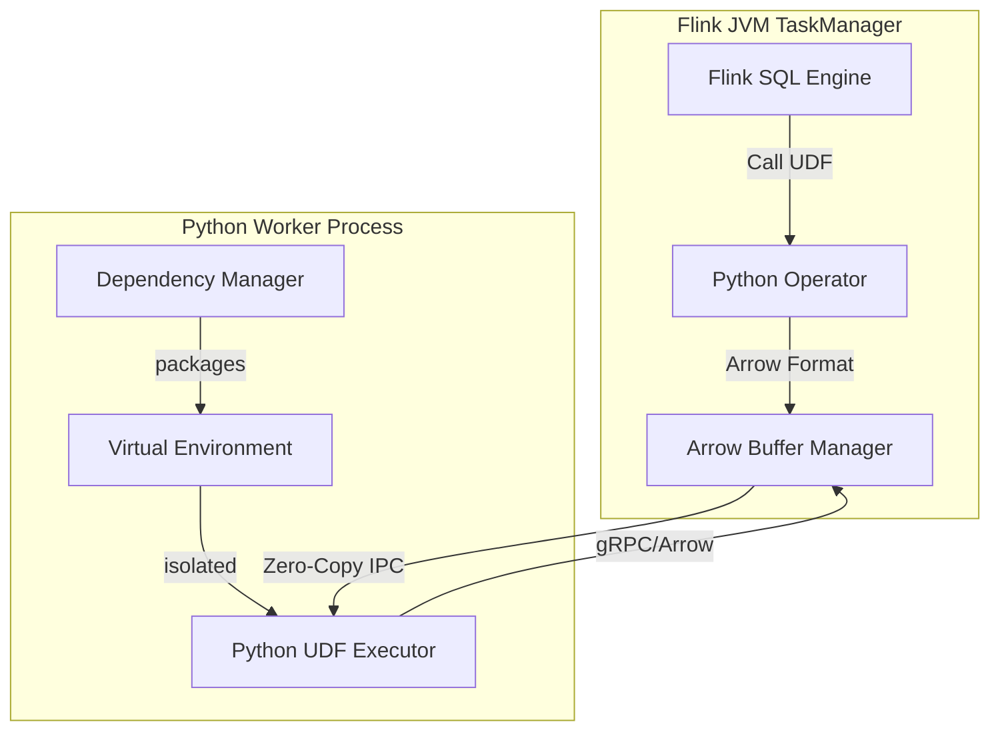
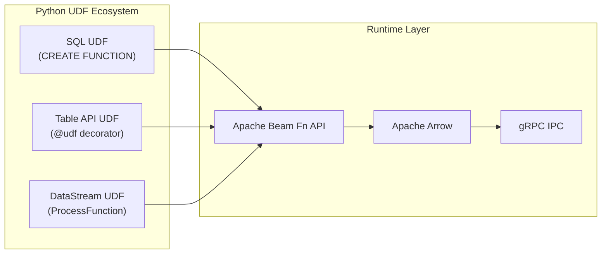
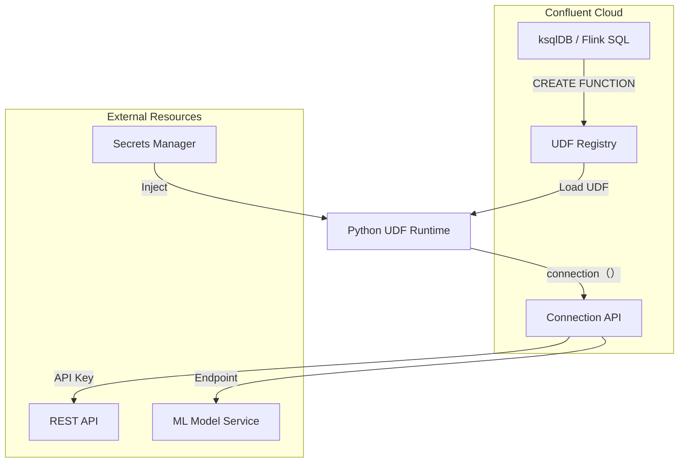
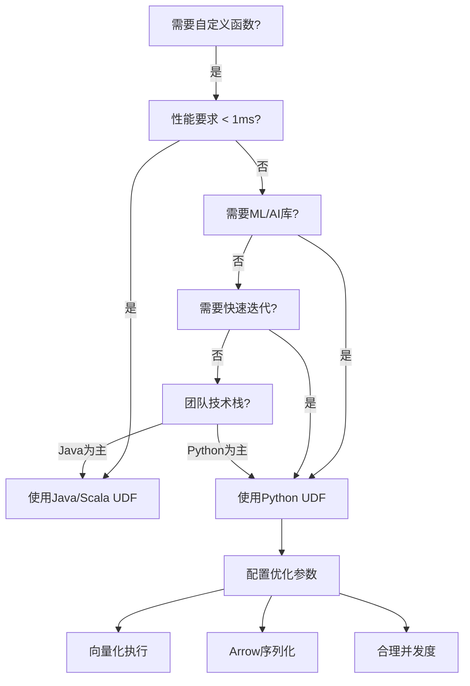
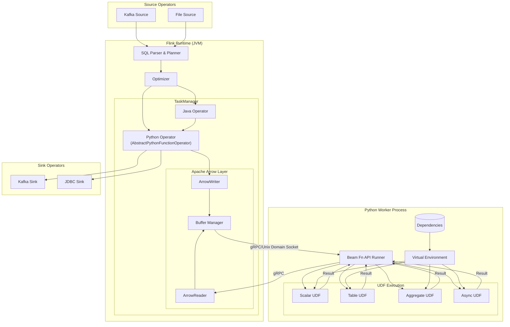
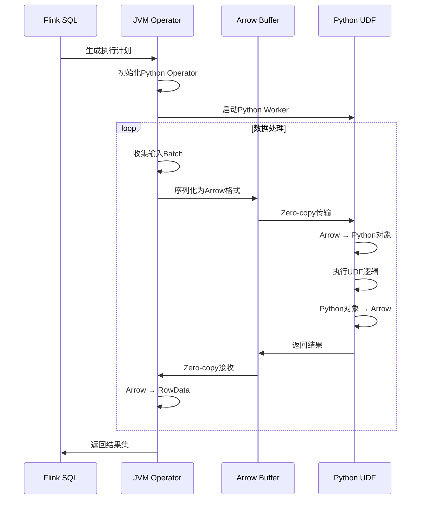
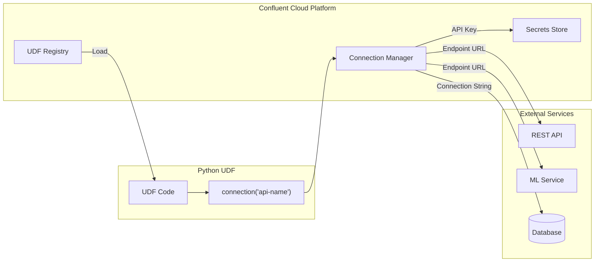

# Flink Python User-Defined Functions (UDF)

> 所属阶段: Flink/03-sql-table-api | 前置依赖: [Flink SQL 完整指南](./flink-table-sql-complete-guide.md), [Python API](../09-language-foundations/02-python-api.md) | 形式化等级: L4

---

## 1. 概念定义 (Definitions)

### 1.1 Python UDF 形式化定义

**Def-F-03-20** (Python UDF): 设 $\mathcal{D}$ 为Flink分布式执行环境，$P$ 为Python运行时进程，则Python UDF是一个四元组 $\mathcal{U}_{py} = (F, \tau, \Sigma, \Pi)$，其中：

- $F: \text{Dom}_P \rightarrow \text{Cod}_P$ 为用户定义的Python函数
- $\tau: T_{SQL} \leftrightarrow T_{Python}$ 为类型映射函数
- $\Sigma = \{\sigma_1, \sigma_2, ..., \sigma_n\}$ 为序列化配置集合
- $\Pi = (\pi_{in}, \pi_{out})$ 为进程间通信管道对

**Def-F-03-21** (UDF类型分类): Python UDF根据输入输出基数划分为：

| 类型 | 符号 | 输入基数 | 输出基数 | 函数签名 |
|------|------|----------|----------|----------|
| 标量函数 | $\mathcal{S}$ | 1 | 1 | $f: Row \rightarrow Value$ |
| 表值函数 | $\mathcal{T}$ | 1 | $0..n$ | $f: Row \rightarrow \{Row\}$ |
| 聚合函数 | $\mathcal{A}$ | $0..n$ | 1 | $f: \{Row\} \rightarrow Value$ |
| 异步函数 | $\mathcal{F}_{async}$ | 1 | 1 (Future) | $f: Row \rightarrow Promise[Value]$ |

### 1.2 与Java/Scala UDF对比

**Def-F-03-22** (UDF执行模型差异): 设 $\mathcal{U}_{java}$ 为Java UDF，$\mathcal{U}_{py}$ 为Python UDF，则两者执行模型差异可定义为：

$$
\Delta_{exec}(\mathcal{U}_{java}, \mathcal{U}_{py}) = \begin{cases}
\text{In-JVM} & \text{if } \mathcal{U} = \mathcal{U}_{java} \\
\text{IPC-based} & \text{if } \mathcal{U} = \mathcal{U}_{py}
\end{cases}
$$

其中IPC通信引入的序列化开销为 $O_{serde} = t_{serialize} + t_{deserialize} + t_{network}$

### 1.3 Python UDF执行架构



---

## 2. 属性推导 (Properties)

### 2.1 性能边界定理

**Lemma-F-03-07** (Python UDF性能上界): 设 $T_{java}$ 为同功能Java UDF执行时间，$T_{py}$ 为Python UDF执行时间，则存在常数 $k > 1$ 使得：

$$
T_{py} \leq k \cdot T_{java} + O_{ipc}
$$

其中 $O_{ipc}$ 包含数据序列化、跨进程通信、GIL竞争等开销。

**Proof Sketch**: Python UDF执行路径包含：

1. 数据序列化为Arrow格式：$t_s$
2. IPC传输到Python进程：$t_{ipc}$
3. Python函数执行（含GIL）：$t_{exec}$
4. 结果反序列化：$t_d$

总时间 $T_{py} = t_s + t_{ipc} + t_{exec} + t_d$，由于 $t_{exec}$ 在CPython中受GIL约束，且存在额外的进程间通信开销，故性能上界如上所述。 $\square$

### 2.2 类型安全定理

**Lemma-F-03-08** (类型一致性): 对于任意Python UDF $\mathcal{U}_{py}$，若输入类型满足 $\Gamma \vdash e : \tau$，则输出类型满足：

$$
\Gamma \vdash \mathcal{U}_{py}(e) : \tau' \quad \text{where} \quad \tau' = \text{codomain}(F)
$$

**Proof**: 由Def-F-03-20，类型映射函数 $\tau$ 在编译期建立Flink SQL类型与Python类型的双射关系，运行时通过Arrow类型系统强制保证一致性。 $\square$

### 2.3 类型映射表

| Flink SQL Type | Python Type | Arrow Type | 说明 |
|----------------|-------------|------------|------|
| `BOOLEAN` | `bool` | `bool_` | - |
| `TINYINT` | `int` | `int8` | -128 to 127 |
| `SMALLINT` | `int` | `int16` | -32768 to 32767 |
| `INT` | `int` | `int32` | 32-bit signed |
| `BIGINT` | `int` | `int64` | 64-bit signed |
| `FLOAT` | `float` | `float32` | IEEE 754 single |
| `DOUBLE` | `float` | `float64` | IEEE 754 double |
| `VARCHAR(n)` | `str` | `string` | UTF-8 encoded |
| `VARBINARY(n)` | `bytes` | `binary` | Raw bytes |
| `DECIMAL(p,s)` | `Decimal` | `decimal128` | Precision p, Scale s |
| `DATE` | `date` | `date32` | Days since epoch |
| `TIME(n)` | `time` | `time64` | Nanoseconds |
| `TIMESTAMP(n)` | `datetime` | `timestamp` | With/without TZ |
| `ARRAY<t>` | `list` | `list` | Homogeneous array |
| `MAP<k,v>` | `dict` | `map` | Key-value pairs |
| `ROW<...>` | `Row` / `tuple` | `struct` | Named fields |

---

## 3. 关系建立 (Relations)

### 3.1 Python UDF与PyFlink关系



### 3.2 UDF类型适用场景映射

| UDF类型 | 适用场景 | 输入输出 | 状态需求 | 性能特征 |
|---------|----------|----------|----------|----------|
| Scalar | 字段转换、掩码、计算 | 1→1 | 无状态 | 高吞吐 |
| Table | 数据展开、Explode、Parse | 1→N | 无状态 | 中等吞吐 |
| Aggregate | 分组统计、自定义聚合 | N→1 | 有状态 | 受状态大小影响 |
| Async | IO密集型、外部API调用 | 1→1 | 可配置 | 受并发度限制 |

### 3.3 与Confluent Cloud集成关系



---

## 4. 论证过程 (Argumentation)

### 4.1 Python UDF适用场景论证

**Prop-F-03-07** (Python UDF选型准则): 对于给定的计算任务 $Task$，选择Python UDF的充分条件为：

$$
Task \in PythonUDF \iff \begin{cases}
\exists lib \in PyPI : lib \models Task & \text{(生态依赖)} \\
\lor \quad \mathcal{C}_{ml}(Task) = True & \text{(ML集成)} \\
\lor \quad \mathcal{C}_{prototyping}(Task) = True & \text{(快速原型)} \\
\land \quad L_{latency}(Task) \geq \theta & \text{(延迟容忍)}
\end{cases}
$$

其中：

- $\mathcal{C}_{ml}$: 任务是否需要ML框架（PyTorch/TensorFlow/scikit-learn）
- $\mathcal{C}_{prototyping}$: 是否需要快速迭代
- $L_{latency}$: 任务延迟要求
- $\theta$: Python UDF最小可行延迟阈值（通常 > 10ms）

### 4.2 反例分析

**Counter-Example 4.1** (高频率标量计算): 对于简单数学运算如 $f(x) = x^2 + 1$，若每条记录处理延迟要求 < 1μs，则Python UDF由于IPC开销（约1-10ms）不适合。

**Counter-Example 4.2** (低延迟事件处理): 实时风控场景要求p99延迟 < 5ms，Python UDF的序列化和进程通信开销将违反SLA。

### 4.3 边界讨论

| 维度 | 边界值 | 超出边界的影响 |
|------|--------|----------------|
| 并发度 | 单个Python进程 | GIL限制真并行 |
| 内存 | 受TaskManager内存限制 | OOM导致Task失败 |
| 依赖大小 | 通常 < 500MB | 启动时间过长 |
| 网络超时 | 默认 30s | 需显式配置重试 |

---

## 5. 工程论证 (Proof / Engineering Argument)

### 5.1 性能优化策略论证

**Thm-F-03-15** (Python UDF性能优化定理): 对于Python UDF执行时间 $T_{total}$，通过以下优化策略可将性能提升 $2\times$ 至 $10\times$：

1. **向量化执行**: 使用 `@udf(result_type=..., func_type="pandas")` 批量处理，减少IPC往返
2. **Arrow格式**: 启用Arrow序列化，避免Pickle开销
3. **资源隔离**: 配置 `python.fn-execution.bundle.size` 平衡延迟与吞吐
4. **缓存优化**: 对重复计算结果启用本地缓存

**Proof**:

设原始逐行处理时间为：
$$T_{row} = n \times (t_{ipc} + t_{exec} + t_{overhead})$$

向量化处理后（batch size = $B$）：
$$T_{vectorized} = \frac{n}{B} \times t_{ipc} + n \times t_{exec} + \frac{n}{B} \times t_{overhead}$$

性能提升比：
$$\frac{T_{row}}{T_{vectorized}} = \frac{B \times (t_{ipc} + t_{exec} + t_{overhead})}{t_{ipc} + B \times t_{exec} + t_{overhead}} \approx B \quad \text{当} \quad t_{exec} \ll t_{ipc}$$

因此，通过增大Batch Size可线性减少IPC开销占比。 $\square$

### 5.2 选型决策矩阵



### 5.3 生产环境权衡

| 权衡维度 | 选项A | 选项B | 决策依据 |
|----------|-------|-------|----------|
| 启动时间 | 预加载UDF | 按需加载 | 调用频率 |
| 资源分配 | 共享进程 | 独立进程 | 隔离要求 |
| 错误处理 | Fail Fast | 降级处理 | 数据重要性 |
| 状态管理 | 外部存储 | 本地缓存 | 一致性要求 |

---

## 6. 实例验证 (Examples)

### 6.1 标量函数实现

```python
# scalar_udf_example.py from pyflink.table import DataTypes
from pyflink.table.udf import udf
import hashlib

# 定义标量函数:计算字符串的SHA256哈希 @udf(result_type=DataTypes.STRING(),
     func_type='general')  # 'general' 或 'pandas'
def sha256_hash(input_str: str) -> str:
    """
    计算输入字符串的SHA256哈希值

    Args:
        input_str: 输入字符串

    Returns:
        SHA256哈希值的十六进制表示
    """
    if input_str is None:
        return None
    return hashlib.sha256(input_str.encode('utf-8')).hexdigest()

# 向量化版本(性能更优)
import pandas as pd

@udf(result_type=DataTypes.STRING(),
     func_type='pandas')
def sha256_hash_vectorized(input_series: pd.Series) -> pd.Series:
    """向量化版本的SHA256哈希函数"""
    return input_series.apply(
        lambda x: hashlib.sha256(x.encode('utf-8')).hexdigest()
        if x is not None else None
    )
```

### 6.2 表值函数实现

```python
# table_udf_example.py from pyflink.table import DataTypes
from pyflink.table.udf import udtf, TableFunction
from pyflink.table.types import Row

class ParseJsonArray(TableFunction):
    """
    表值函数:将JSON数组字符串展开为多行

    示例输入: '["a", "b", "c"]'
    示例输出: 三行,分别为 "a", "b", "c"
    """

    def __init__(self):
        import json
        self.json = json

    def eval(self, json_array_str: str):
        if json_array_str is None:
            return

        try:
            array = self.json.loads(json_array_str)
            if isinstance(array, list):
                for item in array:
                    yield Row(str(item))
        except self.json.JSONDecodeError:
            # 返回空或记录错误
            pass

# 注册使用
# parse_json = udtf(ParseJsonArray(),
#                   result_types=[DataTypes.STRING()])
```

### 6.3 聚合函数实现

```python
# aggregate_udf_example.py from pyflink.table import DataTypes
from pyflink.table.udf import udaf, AggregateFunction

class WeightedAverage(AggregateFunction):
    """
    自定义聚合函数:计算加权平均值

    累加器结构: (sum_value * weight, sum_weight)
    """

    def create_accumulator(self):
        # 初始化累加器: (weighted_sum, total_weight)
        return (0.0, 0.0)

    def accumulate(self, accumulator, value, weight):
        if value is not None and weight is not None:
            weighted_sum, total_weight = accumulator
            weighted_sum += value * weight
            total_weight += weight
            return (weighted_sum, total_weight)
        return accumulator

    def retract(self, accumulator, value, weight):
        # 用于Retract流处理
        if value is not None and weight is not None:
            weighted_sum, total_weight = accumulator
            weighted_sum -= value * weight
            total_weight -= weight
            return (weighted_sum, total_weight)
        return accumulator

    def merge(self, accumulator, accumulators):
        # 合并多个累加器
        final_weighted_sum, final_total_weight = accumulator
        for acc in accumulators:
            weighted_sum, total_weight = acc
            final_weighted_sum += weighted_sum
            final_total_weight += total_weight
        return (final_weighted_sum, final_total_weight)

    def get_value(self, accumulator):
        weighted_sum, total_weight = accumulator
        if total_weight == 0:
            return None
        return weighted_sum / total_weight

    def get_result_type(self):
        return DataTypes.DOUBLE()

    def get_accumulator_type(self):
        return DataTypes.ROW([
            DataTypes.FIELD("weighted_sum", DataTypes.DOUBLE()),
            DataTypes.FIELD("total_weight", DataTypes.DOUBLE())
        ])

# weighted_avg = udaf(WeightedAverage())
```

### 6.4 异步函数实现 (Confluent Cloud特性)

```python
# async_udf_example.py from pyflink.table import DataTypes
from pyflink.table.udf import udf
import aiohttp
import asyncio

# Confluent Cloud Connection 对象示例
# 用于调用外部REST API(如ML推理服务)

@udf(result_type=DataTypes.ROW([
    DataTypes.FIELD("sentiment", DataTypes.STRING()),
    DataTypes.FIELD("confidence", DataTypes.DOUBLE())
]), func_type='async')
async def sentiment_analysis(text: str, context) -> dict:
    """
    异步调用外部情感分析API

    Args:
        text: 待分析文本
        context: UDF执行上下文,包含connection对象

    Returns:
        包含sentiment和confidence的Row
    """
    if not text:
        return {"sentiment": None, "confidence": 0.0}

    # 从Confluent Cloud Connection获取配置
    # connection = context.get_connection("sentiment-api")
    # api_url = connection.get_property("endpoint")
    # api_key = connection.get_secret("api_key")

    api_url = "https://api.example.com/sentiment"

    async with aiohttp.ClientSession() as session:
        try:
            async with session.post(
                api_url,
                json={"text": text},
                timeout=aiohttp.ClientTimeout(total=5)
            ) as response:
                if response.status == 200:
                    result = await response.json()
                    return {
                        "sentiment": result.get("sentiment"),
                        "confidence": result.get("confidence", 0.0)
                    }
                else:
                    return {"sentiment": "ERROR", "confidence": 0.0}
        except asyncio.TimeoutError:
            return {"sentiment": "TIMEOUT", "confidence": 0.0}
        except Exception as e:
            return {"sentiment": f"ERROR: {str(e)}", "confidence": 0.0}
```

### 6.5 SQL中注册与调用

```sql
-- 注册Python UDF (Flink SQL)

-- 1. 使用CREATE FUNCTION语法
CREATE FUNCTION sha256_hash
AS 'scalar_udf_example.sha256_hash'
LANGUAGE PYTHON;

-- 2. 带依赖的UDF注册
CREATE FUNCTION ml_predict
AS 'ml_udf.predict'
LANGUAGE PYTHON
WITH (
    'python.archives' = 'hdfs:///libs/ml_env.zip',
    'python.requirements' = 'hdfs:///requirements.txt',
    'python.executable' = 'python3'
);

-- 3. 使用UDF进行查询
SELECT
    user_id,
    sha256_hash(email) as email_hash,
    ml_predict(features) as prediction
FROM user_events
WHERE event_time > TIMESTAMP '2025-01-01';

-- 4. 表值函数使用(需配合LATERAL TABLE)
SELECT
    order_id,
    item
FROM orders,
LATERAL TABLE(parse_json_array(items_json)) AS T(item);

-- 5. 聚合函数使用
SELECT
    category,
    weighted_average(price, quantity) as avg_price
FROM sales
GROUP BY category;
```

### 6.6 依赖管理与虚拟环境

```text
# requirements.txt 示例
# Flink Python UDF依赖文件

# 核心依赖(通常由Flink提供)
pyflink==1.20.0
apache-beam==2.50.0
pyarrow==14.0.0

# 常用数据处理 pandas==2.1.4
numpy==1.26.0

# ML/AI库(按需添加)
scikit-learn==1.3.0
torch==2.1.0
transformers==4.35.0

# HTTP客户端(用于Async UDF)
aiohttp==3.9.0
requests==2.31.0

# 工具库 python-dateutil==2.8.2
pydantic==2.5.0
```

```bash
#!/bin/bash
# 创建Python虚拟环境并打包(用于Flink UDF部署)

VENV_NAME="flink_udf_env"
PYTHON_VERSION="3.11"

# 1. 创建虚拟环境 conda create -n $VENV_NAME python=$PYTHON_VERSION -y
source activate $VENV_NAME

# 2. 安装依赖 pip install -r requirements.txt

# 3. 打包虚拟环境(用于上传到Flink)
zip -r ${VENV_NAME}.zip $CONDA_PREFIX/lib/python${PYTHON_VERSION}/site-packages/

# 4. 上传到HDFS/S3(Flink可访问的存储)
hdfs dfs -put ${VENV_NAME}.zip /flink/python-envs/
```

---

## 7. 可视化 (Visualizations)

### 7.1 Python UDF执行架构详图



### 7.2 类型映射与序列化流程



### 7.3 Confluent Cloud Connection管理



---

## 8. 生产实践指南

### 8.1 错误处理与重试

```python
# robust_udf_example.py from pyflink.table import DataTypes
from pyflink.table.udf import udf
import logging
from functools import wraps

# 配置日志 logger = logging.getLogger('flink_udf')

def retry_on_exception(max_retries=3, exceptions=(Exception,)):
    """UDF重试装饰器"""
    def decorator(func):
        @wraps(func)
        def wrapper(*args, **kwargs):
            for attempt in range(max_retries):
                try:
                    return func(*args, **kwargs)
                except exceptions as e:
                    logger.warning(f"Attempt {attempt + 1} failed: {e}")
                    if attempt == max_retries - 1:
                        # 最后一次重试失败,返回默认值或抛出
                        return None
            return None
        return wrapper
    return decorator

@udf(result_type=DataTypes.STRING())
@retry_on_exception(max_retries=3, exceptions=(TimeoutError, ConnectionError))
def robust_external_call(input_data: str) -> str:
    """
    带重试机制的外部调用UDF
    """
    import requests

    response = requests.post(
        "https://api.example.com/process",
        json={"data": input_data},
        timeout=5
    )
    response.raise_for_status()
    return response.json().get("result")
```

### 8.2 监控与调试配置

```yaml
# flink-conf.yaml Python UDF相关配置

# Python Worker配置 python.fn-execution.bundle.size: 10000          # 批处理大小
python.fn-execution.bundle.time: 1000           # 批处理超时(ms)
python.fn-execution.memory.managed: true        # 使用托管内存

# Arrow配置 python.fn-execution.arrow.batch.size: 10000     # Arrow批大小
python.fn-execution.streaming.enabled: true     # 启用流式传输

# 日志配置 python.log.level: INFO
python.log.redirect-to-sysout: true

# 故障恢复 python.fn-execution.max-retries: 3
python.fn-execution.retry-delay: 1000
```

### 8.3 安全配置

```python
# secure_udf_example.py import os
from pyflink.table import DataTypes
from pyflink.table.udf import udf

class SecureUDF:
    """
    安全UDF最佳实践示例
    """

    def __init__(self):
        # 从环境变量或密钥管理服务获取敏感信息
        self.api_key = os.environ.get('EXTERNAL_API_KEY')
        if not self.api_key:
            raise ValueError("API key not configured")

    def validate_input(self, data):
        """输入验证"""
        if not isinstance(data, str):
            raise TypeError(f"Expected string, got {type(data)}")
        if len(data) > 10000:  # 限制输入大小
            raise ValueError("Input too large")
        return data

    def sanitize_output(self, result):
        """输出清理"""
        if result is None:
            return ""
        # 移除潜在危险字符
        return str(result).replace('\x00', '')

@udf(result_type=DataTypes.STRING())
def secure_process(input_data: str) -> str:
    processor = SecureUDF()
    validated = processor.validate_input(input_data)

    # 处理逻辑...
    result = validated.upper()  # 示例处理

    return processor.sanitize_output(result)
```

---

## 9. 引用参考 (References)


---

*文档版本: v1.0 | 最后更新: 2026-04-03 | 状态: Draft*
