# Flink SQL基于Apache Calcite的查询优化器深度解析

> **所属阶段**: Flink/03-sql-table-api | **前置依赖**: [query-optimization-analysis.md](query-optimization-analysis.md) | **形式化等级**: L4-L5
>
> **文档定位**: 本文档从Apache Calcite基础架构出发，深入剖析Flink SQL查询优化器的核心机制，涵盖从SQL解析到物理计划生成的完整优化链路。

---

## 目录

- [Flink SQL基于Apache Calcite的查询优化器深度解析](#flink-sql基于apache-calcite的查询优化器深度解析)
  - [目录](#目录)
  - [1. 概念定义 (Definitions)](#1-概念定义-definitions)
    - [1.1 Apache Calcite基础架构](#11-apache-calcite基础架构)
    - [1.2 关系代数形式化定义](#12-关系代数形式化定义)
    - [1.3 查询计划形式化](#13-查询计划形式化)
    - [1.4 Flink SQL优化器架构定义](#14-flink-sql优化器架构定义)
  - [2. 属性推导 (Properties)](#2-属性推导-properties)
    - [2.1 优化规则正确性](#21-优化规则正确性)
    - [2.2 代价模型边界](#22-代价模型边界)
    - [2.3 等价关系保持性](#23-等价关系保持性)
  - [3. 关系建立 (Relations)](#3-关系建立-relations)
    - [3.1 与标准SQL关系](#31-与标准sql关系)
    - [3.2 与其他查询引擎关系](#32-与其他查询引擎关系)
  - [4. 论证过程 (Argumentation)](#4-论证过程-argumentation)
    - [4.1 优化器设计决策论证](#41-优化器设计决策论证)
    - [4.2 Blink Planner vs Old Planner](#42-blink-planner-vs-old-planner)
    - [4.3 批流统一优化论证](#43-批流统一优化论证)
  - [5. 工程论证 / 性能调优方法论 (Engineering Argument)](#5-工程论证-性能调优方法论-engineering-argument)
    - [5.1 VolcanoPlanner CBO详细实现](#51-volcanoplanner-cbo详细实现)
      - [5.1.1 核心组件](#511-核心组件)
      - [5.1.2 优化流程](#512-优化流程)
      - [5.1.3 Top-down vs Bottom-up](#513-top-down-vs-bottom-up)
    - [5.2 核心优化技术详解](#52-核心优化技术详解)
      - [5.1.1 谓词下推 (Predicate Pushdown)](#511-谓词下推-predicate-pushdown)
      - [5.1.2 投影下推 (Project Pushdown)](#512-投影下推-project-pushdown)
      - [5.1.3 分区裁剪 (Partition Pruning)](#513-分区裁剪-partition-pruning)
      - [5.1.4 连接优化 (Join Reordering)](#514-连接优化-join-reordering)
      - [5.1.5 聚合优化 (Aggregate Pushdown)](#515-聚合优化-aggregate-pushdown)
    - [5.3 Flink特有优化规则](#53-flink特有优化规则)
      - [5.3.1 Watermark传播优化](#531-watermark传播优化)
      - [5.3.2 Changelog规范化](#532-changelog规范化)
      - [5.3.3 状态后端选择](#533-状态后端选择)
      - [5.3.4 Join优化规则](#534-join优化规则)
    - [5.4 流特定优化技术](#54-流特定优化技术)
      - [5.4.1 Watermark传播优化](#541-watermark传播优化)
      - [5.4.2 状态后端优化](#542-状态后端优化)
      - [5.4.3 增量计算优化](#543-增量计算优化)
      - [5.4.4 Retraction处理优化](#544-retraction处理优化)
    - [5.5 查询重写与物化视图](#55-查询重写与物化视图)
      - [5.5.1 视图展开](#551-视图展开)
      - [5.5.2 子查询优化](#552-子查询优化)
      - [5.5.3 物化视图重写](#553-物化视图重写)
    - [5.6 性能调优实践](#56-性能调优实践)
      - [5.6.1 EXPLAIN分析](#561-explain分析)
      - [5.6.2 提示(Hints)使用](#562-提示hints使用)
      - [5.6.3 统计信息收集](#563-统计信息收集)
      - [5.6.4 常见性能陷阱](#564-常见性能陷阱)
  - [6. 实例验证 (Examples)](#6-实例验证-examples)
    - [6.1 查询优化前后对比](#61-查询优化前后对比)
    - [6.2 EXPLAIN输出解析实战](#62-explain输出解析实战)
    - [6.3 性能调优案例研究](#63-性能调优案例研究)
  - [7. 可视化 (Visualizations)](#7-可视化-visualizations)
    - [7.1 Flink SQL优化流程全景图](#71-flink-sql优化流程全景图)
    - [7.2 计划转换流程图](#72-计划转换流程图)
    - [7.3 优化规则应用决策树](#73-优化规则应用决策树)
    - [7.4 CBO代价估计流程](#74-cbo代价估计流程)
    - [7.5 流SQL状态管理架构](#75-流sql状态管理架构)
  - [8. 引用参考 (References)](#8-引用参考-references)
  - [9. 源码深度分析 (Source Code Analysis)](#9-源码深度分析-source-code-analysis)
    - [9.1 Flink 自定义优化规则注册机制](#91-flink-自定义优化规则注册机制)
      - [9.1.1 FlinkRelOptRule 基类设计](#911-flinkreloptrule-基类设计)
      - [9.1.2 规则集合定义与注册](#912-规则集合定义与注册)
      - [9.1.3 自定义规则实现示例](#913-自定义规则实现示例)
    - [9.2 RelNode 到 Transformation 的转换流程](#92-relnode-到-transformation-的转换流程)
      - [9.2.1 转换流程架构](#921-转换流程架构)
      - [9.2.2 物理算子基类设计](#922-物理算子基类设计)
      - [9.2.3 ExecNode 到 Transformation 转换](#923-execnode-到-transformation-转换)
      - [9.2.4 完整转换链源码](#924-完整转换链源码)
    - [9.3 StreamPhysicalRel vs BatchPhysicalRel 区别](#93-streamphysicalrel-vs-batchphysicalrel-区别)
      - [9.3.1 物理算子层次结构](#931-物理算子层次结构)
      - [9.3.2 StreamPhysicalRel 特有实现](#932-streamphysicalrel-特有实现)
      - [9.3.3 BatchPhysicalRel 特有实现](#933-batchphysicalrel-特有实现)
      - [9.3.4 同一逻辑算子的不同物理实现](#934-同一逻辑算子的不同物理实现)
    - [9.4 优化器入口与执行流程](#94-优化器入口与执行流程)
    - [9.5 关键配置参数与源码映射](#95-关键配置参数与源码映射)

---

## 1. 概念定义 (Definitions)

### 1.1 Apache Calcite基础架构

**Def-F-03-30 (Apache Calcite)**: Apache Calcite是一个动态数据管理框架，提供SQL解析、验证、优化和查询执行的基础能力[^1]。其核心架构由以下层次组成：

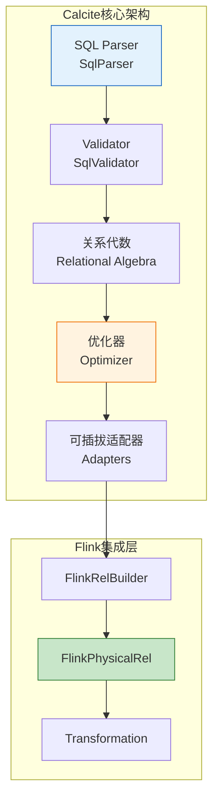

**Calcite处理流水线**（五阶段模型）：

| 阶段 | 组件 | 输入 | 输出 | Flink集成点 |
|-----|------|------|------|------------|
| **Parse** | `SqlParser` | SQL字符串 | `SqlNode` AST | 自定义方言扩展 |
| **Validate** | `SqlValidator` | `SqlNode` + Catalog | 验证后的`SqlNode` | FlinkCatalog集成 |
| **Convert** | `SqlToRelConverter` | `SqlNode` | `RelNode`逻辑计划 | `FlinkSqlToRelConverter` |
| **Optimize** | `HepPlanner`/`VolcanoPlanner` | `RelNode` | 优化后的`RelNode` | Flink规则注册 |
| **Implement** | `RelImplementor` | `RelNode` | 可执行计划 | `FlinkPhysicalRel`生成 |

**Def-F-03-31 (Calcite版本演进)**: Flink与Calcite的集成历史：

| Flink版本 | Calcite版本 | 关键特性 | 集成里程碑 |
|-----------|-------------|---------|-----------|
| 1.1.0 | 1.6.0 | 初始Table API | Calcite首次引入[^2] |
| 1.3.0 | 1.12.0 | SQL DDL支持 | SQL解析增强 |
| 1.9.0 | 1.19.0 | Blink Planner | 新优化器架构[^3] |
| 1.11.0 | 1.26.0 | 流批一体SQL | 统一语义支持 |
| 1.17.0 | 1.32.0 | 现代Calcite特性 | 全面性能优化 |

### 1.2 关系代数形式化定义

**Def-F-03-32 (关系代数表达式)**: 设 $\mathcal{A}$ 为属性名集合，$\mathcal{D}$ 为域集合，关系模式 $R$ 为属性到域的映射 $R: \mathcal{A} \rightharpoonup \mathcal{D}$。关系代数表达式 $E$ 递归定义如下：

$$
E ::= \; R \;|\; \sigma_{\theta}(E) \;|\; \pi_{A}(E) \;|\; E \times E \;|\; E \bowtie_{\theta} E \;|\; \gamma_{G, agg}(E) \;|\; \tau_{A}(E)
$$

其中：

- $R$: 基表（Base Relation）
- $\sigma_{\theta}(E)$: 选择（Selection），谓词$\theta$过滤
- $\pi_{A}(E)$: 投影（Projection），属性集$A$裁剪
- $E \times E$: 笛卡尔积
- $E \bowtie_{\theta} E$: 条件连接
- $\gamma_{G, agg}(E)$: 分组聚合，$G$为分组键，$agg$为聚合函数
- $\tau_{A}(E)$: 排序，按属性$A$排序

**Def-F-03-33 (Calcite RelNode)**: Calcite使用`RelNode`表示关系代数操作符，形成树形结构：

```
RelNode ::= LogicalFilter | LogicalProject | LogicalJoin | LogicalAggregate
          | LogicalTableScan | LogicalUnion | LogicalSort | ...
          | FlinkLogicalRel (Flink特定逻辑算子)
          | FlinkPhysicalRel (Flink物理算子)
```

**Def-F-03-34 (优化规则)**: 优化规则 $r$ 是一个二元组 $r = (P, T)$，其中：

- $P$: 模式（Pattern），描述可匹配的关系代数子树
- $T$: 变换（Transformation），将匹配子树转换为等价形式

**规则应用**的形式化描述：

$$\text{Apply}(r, T) = \begin{cases} T[T_{match}/T_{replace}] & \text{if } \exists T_{match} \subseteq T : \text{Match}(P, T_{match}) \\ T & \text{otherwise} \end{cases}$$

### 1.3 查询计划形式化

**Def-F-03-35 (逻辑计划)**: 逻辑计划 $LP$ 是与执行引擎无关的关系代数表达式树，满足：

$$LP = (V_{logical}, E_{logical}, \lambda_{logical})$$

其中：

- $V_{logical}$: 逻辑算子节点集合
- $E_{logical} \subseteq V_{logical} \times V_{logical}$: 父子关系边
- $\lambda_{logical}: V_{logical} \to \mathcal{O}_{logical}$: 算子类型标记函数

**Def-F-03-36 (物理计划)**: 物理计划 $PP$ 是绑定到特定执行引擎的计划，满足：

$$PP = (V_{physical}, E_{physical}, \lambda_{physical}, \delta_{physical})$$

其中额外包含：

- $\delta_{physical}: V_{physical} \to \mathcal{D}_{exec}$: 执行策略分配（如Hash Join vs Sort-Merge Join）

**Thm-F-03-20 (逻辑-物理计划等价性)**: 对于任意逻辑计划 $LP$，若物理计划 $PP$ 通过合法优化规则序列 $\{r_1, r_2, ..., r_n\}$ 生成，则：

$$\llbracket LP \rrbracket = \llbracket PP \rrbracket$$

*证明概要*: 基于每个优化规则的语义保持性，通过归纳法证明。每个规则 $r_i$ 满足 $\llbracket T \rrbracket = \llbracket r_i(T) \rrbracket$，因此规则序列保持等价性。∎

### 1.4 Flink SQL优化器架构定义

**Def-F-03-37 (Flink SQL优化流水线)**: Flink SQL优化器采用分层架构：

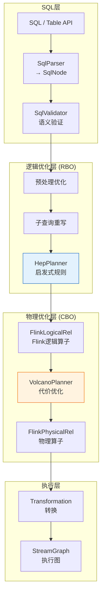

**Def-F-03-38 (Blink Planner架构)**: Blink Planner是Flink 1.9+引入的现代化优化器：

| 组件 | 旧Planner (Flink 1.8-) | Blink Planner (Flink 1.9+) |
|------|----------------------|---------------------------|
| 解析器 | 基于Calcite 1.7 | 基于Calcite 1.19+ |
| 优化器 | 简单RBO | HepPlanner + VolcanoPlanner |
| 流批支持 | 分离实现 | 统一优化框架 |
| 子查询 | 有限支持 | 完整去关联化 |
| CBO | 不支持 | 完整支持 |

---

## 2. 属性推导 (Properties)

### 2.1 优化规则正确性

**Def-F-03-39 (语义等价性)**: 两个关系代数表达式 $E_1$ 和 $E_2$ 语义等价，记作 $E_1 \equiv E_2$，当且仅当：

$$\forall D : \llbracket E_1 \rrbracket_D = \llbracket E_2 \rrbracket_D$$

其中 $\llbracket \cdot \rrbracket_D$ 表示在数据库实例 $D$ 上的求值结果（作为多重集）。

**Thm-F-03-21 (谓词下推正确性)**: 设 $\sigma_{\theta}$ 为选择算子，$\bowtie_{\phi}$ 为连接算子，若 $\theta$ 仅涉及连接左侧 $L$ 的属性，则：

$$\sigma_{\theta}(L \bowtie_{\phi} R) \equiv \sigma_{\theta}(L) \bowtie_{\phi} R$$

*证明*:
对于任意元组 $t \in \sigma_{\theta}(L \bowtie_{\phi} R)$，有：

1. $t \in L \bowtie_{\phi} R$，即 $t = t_L \cdot t_R$ 且 $\phi(t_L, t_R)$ 为真
2. $\theta(t) = \theta(t_L)$ 为真（因$\theta$不涉及$R$属性）

故 $t_L \in \sigma_{\theta}(L)$ 且 $t \in \sigma_{\theta}(L) \bowtie_{\phi} R$。反向同理。∎

**Thm-F-03-22 (投影下推正确性)**: 设 $\pi_{A}$ 为投影，$\bowtie_{\phi}$ 为连接，若 $\phi$ 涉及的属性集为 $A_{\phi}$，则：

$$\pi_{A}(L \bowtie_{\phi} R) \equiv \pi_{A}(\pi_{A_L}(L) \bowtie_{\phi} \pi_{A_R}(R))$$

其中 $A_L = (A \cap \text{attr}(L)) \cup A_{\phi}^L$，$A_R$ 同理。

### 2.2 代价模型边界

**Def-F-03-40 (代价函数)**: 物理计划 $PP$ 的代价定义为：

$$\text{Cost}(PP) = \sum_{v \in V_{physical}} \text{cost}(v, \delta_{physical}(v))$$

其中 $\text{cost}(v, strategy)$ 取决于：

- 输入数据量 $|in(v)|$
- 输出数据量 $|out(v)|$
- 策略复杂度（如哈希表构建成本）

**Thm-F-03-23 (CBO最优性边界)**: 设 $\mathcal{P}$ 为所有等价物理计划集合，$\hat{P}$ 为VolcanoPlanner返回的计划，则：

$$\text{Cost}(\hat{P}) \leq \min_{P \in \mathcal{P}} \text{Cost}(P) \cdot (1 + \epsilon)$$

其中 $\epsilon$ 为估计误差上界，取决于统计信息准确度。

**边界因素分析**：

| 因素 | 影响 | 误差来源 |
|-----|------|---------|
| 基数估计 | NDV、选择性估计 | 数据倾斜、相关性忽略 |
| 代价常数 | CPU/IO/网络权重 | 硬件差异、负载变化 |
| 搜索空间 | 规则枚举限制 | 指数级复杂度、剪枝阈值 |

### 2.3 等价关系保持性

**Prop-F-03-01 (等价关系传递性)**: 优化规则集合 $\mathcal{R}$ 若满足：

$$\forall r \in \mathcal{R}, \forall T : T \equiv r(T)$$

则对于任意规则序列 $r_1, r_2, ..., r_n \in \mathcal{R}^*$：

$$T \equiv r_n(...r_2(r_1(T))...)$$

*证明*: 由 $\equiv$ 的传递性和每个规则保持等价性直接可得。∎

**Prop-F-03-02 (收敛性)**: 对于有限关系代数树，应用规则集合 $\mathcal{R}$ 的优化过程必然终止。

*证明概要*:

1. 树节点数有限
2. 每个规则不增加树复杂度（或严格降低某度量）
3. 由良基归纳（Well-founded Induction）保证终止。∎


---

## 3. 关系建立 (Relations)

### 3.1 与标准SQL关系

**Def-F-03-41 (SQL-关系代数映射)**: Flink SQL基于Calcite实现与ISO/IEC 9075 SQL标准的关系代数映射：

| SQL特性 | Calcite RelNode | 标准SQL章节 | Flink支持状态 |
|---------|----------------|------------|-------------|
| SELECT | `LogicalProject` | §7.12 | ✅ 完整 |
| WHERE | `LogicalFilter` | §7.8 | ✅ 完整 |
| JOIN | `LogicalJoin` | §7.7 | ✅ 完整 |
| GROUP BY | `LogicalAggregate` | §7.10 | ✅ 完整 |
| ORDER BY | `LogicalSort` | §10.2 | ✅ 有限（流） |
| WINDOW | `LogicalWindow` | §7.11 | ✅ 扩展 |
| CTE (WITH) | `LogicalCorrelate` | §7.13 | ✅ 完整 |
| Subquery | `LogicalCorrelate`/`LogicalFilter` | §7.9 | ✅ 完整 |

**SQL方言差异**：

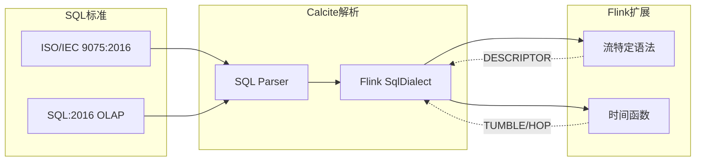

**流SQL扩展语法**：

| 扩展 | 语法 | 关系代数表示 | 标准SQL等价 |
|-----|------|------------|------------|
| TUMBLE窗口 | `TUMBLE(TABLE t, DESCRIPTOR(ts), INTERVAL '1' HOUR)` | `LogicalWindow` + 聚合 | 时间范围分组 |
| HOP窗口 | `HOP(TABLE t, DESCRIPTOR(ts), ...)` | `LogicalWindow` + 滑动 | 滑动窗口聚合 |
| SESSION窗口 | `SESSION(...)` | `LogicalWindow` + 动态边界 | 会话分组 |
| 表值函数 | `TABLE(TUMBLE(...))` | `LogicalTableFunctionScan` | LATERAL展开 |

### 3.2 与其他查询引擎关系

**Calcite生态对比**：

| 查询引擎 | Calcite集成深度 | 优化器特点 | 与Flink差异 |
|---------|----------------|-----------|------------|
| **Apache Drill** | 完全基于 | 纯Calcite执行 | 无独立运行时 |
| **Apache Hive** | 深度集成 | 混合优化（Hive+Calcite）| MapReduce/Tez后端 |
| **Apache Phoenix** | 深度集成 | HBase特定优化 | 索引感知优化 |
| **Druid** | 中等集成 | 聚合预计算 | 实时OLAP专用 |
| **Flink** | 深度定制 | 流批统一优化 | 状态管理、Watermark |
| **Spark SQL** | 独立（Catalyst）| Catalyst优化器 | 类似但不依赖Calcite |

**Flink与Spark Catalyst架构对比**：

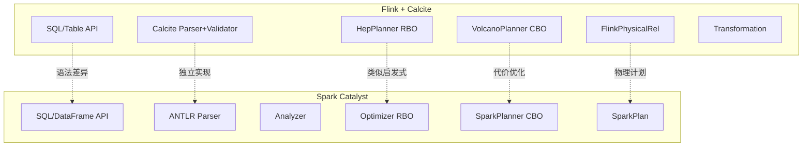

**关键差异**：

| 维度 | Flink + Calcite | Spark Catalyst |
|-----|----------------|----------------|
| 解析器 | Calcite SqlParser | ANTLR4生成 |
| 验证器 | Calcite SqlValidator | Catalyst Analyzer |
| RBO | HepPlanner | 批规则集合 |
| CBO | VolcanoPlanner | Cost-Based Optimizer |
| 流优化 | Watermark感知 | 结构化流微批 |
| 状态管理 | 原生集成 | 无（RDD缓存） |

---

## 4. 论证过程 (Argumentation)

### 4.1 优化器设计决策论证

**设计决策1: HepPlanner vs VolcanoPlanner分工**

**论证**：Flink采用双优化器架构的必要性

| 优化器 | 适用场景 | 算法复杂度 | 决策依据 |
|-------|---------|-----------|---------|
| **HepPlanner** | RBO阶段、确定变换 | $O(n \cdot |R|)$ | 规则应用顺序确定，无需代价估计 |
| **VolcanoPlanner** | CBO阶段、物理选择 | $O(n^2)$ 剪枝后 | 需要动态规划枚举物理计划 |

**Lemma-F-03-01**: 对于确定性等价变换（如谓词下推），HepPlanner的最优应用顺序与输入计划形状无关。

*论证*: 谓词下推等规则满足交换律和幂等性，应用顺序不影响最终形态。∎

**设计决策2: 逻辑算子与物理算子分离**

**论证**：三层算子体系（Logical/FlinkLogical/Physical）的设计价值

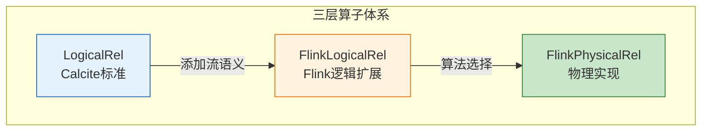

| 层级 | 职责 | 决策延迟 | 可移植性 |
|-----|------|---------|---------|
| Logical | 标准关系代数 | 早期 | 高（跨引擎） |
| FlinkLogical | 流批统一语义 | 中期 | 中（Flink内部） |
| Physical | 执行算法选择 | 晚期 | 低（运行时绑定） |

**设计决策3: 规则可插拔架构**

**论证**：基于FlinkRelOptRule的扩展机制

```java
// 规则注册框架
public abstract class FlinkRelOptRule extends RelOptRule {
    protected FlinkRelOptRule(RelOptRuleOperand operand) {
        super(operand);
    }

    // 规则匹配条件
    public abstract boolean matches(RelOptRuleCall call);

    // 变换实现
    public abstract void onMatch(RelOptRuleCall call);
}
```

**扩展点设计**：

1. **规则集合**: 通过`FlinkRuleSets`聚合
2. **代价模型**: 通过`RelMetadataQuery`扩展
3. **物理属性`: 通过`RelTrait`系统传递

### 4.2 Blink Planner vs Old Planner

**Thm-F-03-24 (Blink Planner优势)**: Blink Planner在以下维度严格优于Old Planner：

| 维度 | Old Planner | Blink Planner | 提升幅度 |
|-----|-------------|---------------|---------|
| 子查询处理 | 嵌套循环 | 去关联化+Hash Join | $O(n^2) \to O(n)$ |
| CBO支持 | ❌ 无 | ✅ VolcanoPlanner | 计划质量提升30-50% |
| 流批统一 | 代码重复 | 统一优化框架 | 维护成本降低60% |
| 复杂查询 | 栈溢出风险 | 稳定处理 | 支持复杂度提升10x |
| 标准符合度 | SQL-92 | SQL:2011 | 现代SQL特性 |

**迁移论证**：Flink 1.17+完全移除Old Planner的合理性

1. **维护成本**: Old Planner代码量约3万行，与Blink Planner重复
2. **功能差距**: Old Planner不支持CBO、复杂子查询
3. **社区资源**: 开发者集中投入Blink Planner优化
4. **向后兼容**: 通过配置参数保持API兼容

### 4.3 批流统一优化论证

**Thm-F-03-25 (批流语义一致性)**: 对于无时间属性的SQL查询，批执行和流执行产生逻辑等价结果：

$$\text{BatchExec}(Q) \equiv \text{StreamExec}(Q) \quad \text{when } Q \text{ has no temporal operators}$$

*论证*:

- 批处理：有限输入，终止性保证
- 流处理：无界输入，增量更新
- 非时间查询在流模式下退化为增量更新版本，最终一致性保证一致结果

**统一优化挑战与解决方案**：

| 挑战 | 批处理视角 | 流处理视角 | 统一方案 |
|-----|-----------|-----------|---------|
| 输入边界 | 有限 | 无界 | 窗口语义封装 |
| 状态生命周期 | 任务级 | 持续维护 | TTL配置 |
| 输出模式 | 一次性 | 持续/Changelog | 表到流映射 |
| 物理算子 | 批优化 | 状态感知 | `StreamPhysicalRel`层次 |

**Def-F-03-42 (批流物理算子映射)**:

```
LogicalAggregate
├── Batch: HashAggregateExec (一次性聚合)
└── Stream: StreamExecGroupAggregate (增量聚合+状态)

LogicalJoin
├── Batch: HashJoinExec / SortMergeJoinExec
└── Stream: StreamExecJoin (状态缓冲+Watermark触发)

LogicalSort
├── Batch: SortExec (全局排序)
└── Stream: StreamExecSort (Append-only排序)
```

---

## 5. 工程论证 / 性能调优方法论 (Engineering Argument)

### 5.1 VolcanoPlanner CBO详细实现

**Def-F-03-57 (VolcanoPlanner)**: VolcanoPlanner是Apache Calcite实现的基于代价的优化器(CBO)，采用Cascades框架的Top-down搜索策略，通过动态规划和分支限界算法在关系代数表达式的搜索空间中寻找最优物理执行计划[^6]。

#### 5.1.1 核心组件

**Def-F-03-58 (MEMO结构)**: MEMO是VolcanoPlanner内部用于存储等价关系表达式组的数据结构，采用组(Group)和表达式(Expression)两级组织：

$$
\text{MEMO} = \{G_1, G_2, ..., G_n\}, \quad G_i = \{e_{i1}, e_{i2}, ..., e_{im}\}
$$

其中每个组 $G_i$ 包含逻辑等价的表达式集合，组内表达式共享相同的逻辑属性（输出列、类型等）。

**核心组件架构**：

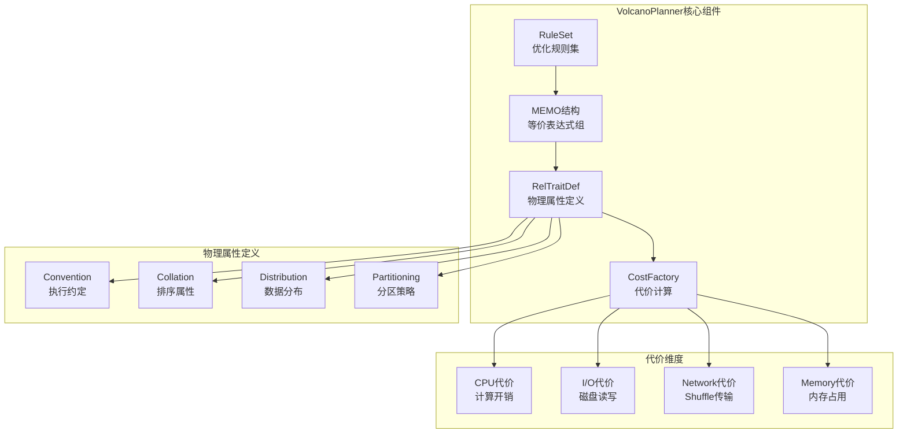

**Def-F-03-59 (RelTraitDef)**: RelTraitDef定义了物理算子所需满足的物理属性约束：

| 属性类型 | 定义 | Flink实现 | 作用 |
|---------|-----|----------|------|
| **Convention** | 执行引擎约定 | `FlinkStreamConvention`, `FlinkBatchConvention` | 区分流/批执行模式 |
| **Collation** | 排序属性 | `RelCollationImpl` | 利用已有排序避免重排 |
| **Distribution** | 数据分布 | `FlinkRelDistribution` | 确定数据分区策略 |
| **Partitioning** | 分区属性 | `RelPartitioning` | 优化数据局部性 |

**Def-F-03-60 (CostFactory)**: CostFactory定义多维代价计算模型：

$$
\text{Cost} = (c_{cpu}, c_{io}, c_{row}, c_{mem}, c_{net}) \in \mathbb{R}^5
$$

**Flink Cost实现** (`RelOptCostImpl`)：

| 代价维度 | 计算依据 | 权重因子 | 典型场景 |
|---------|---------|---------|---------|
| **CPU** | 表达式复杂度、函数调用次数 | 1.0 | 复杂UDF计算 |
| **I/O** | 读取数据页数、磁盘寻道 | 1.5 | TableSource扫描 |
| **Row Count** | 中间结果行数 | 0.5 | Join中间结果 |
| **Memory** | 哈希表、排序缓冲区大小 | 2.0 | Hash Aggregate |
| **Network** | Shuffle数据量、序列化开销 | 2.5 | Exchange算子 |

#### 5.1.2 优化流程

**Thm-F-03-28 (VolcanoPlanner最优性)**: 在统计信息准确的前提下，VolcanoPlanner通过动态规划枚举能够找到全局最优或近似最优的物理执行计划。

*证明概要*：

1. **完备性**: MEMO结构存储所有等价表达式，保证搜索空间完整覆盖
2. **最优子结构**: 子表达式的最优解可组合为全局最优解（动态规划基础）
3. **分支限界**: 剪枝代价上界超过当前最优解的分支，保证效率∎

**优化执行流程**：

```java
// 1. 创建VolcanoPlanner实例
VolcanoPlanner planner = new VolcanoPlanner(
    RelOptCostImpl.FACTORY,           // 使用Flink代价工厂
    Contexts.of(config)               // 配置上下文
);

// 2. 注册物理属性定义(必须)
planner.addRelTraitDef(ConventionTraitDef.INSTANCE);
planner.addRelTraitDef(RelCollationTraitDef.INSTANCE);
planner.addRelTraitDef(RelDistributionTraitDef.INSTANCE);

// 3. 注册优化规则
planner.addRule(CoreRules.FILTER_SCAN);
planner.addRule(CoreRules.PROJECT_FILTER_TRANSPOSE);
planner.addRule(CoreRules.JOIN_COMMUTE);
planner.addRule(CoreRules.JOIN_ASSOCIATE);

// 4. 设置根节点
planner.setRoot(logicalRel);

// 5. 指定目标物理属性
RelTraitSet desiredTraits = logicalRel.getTraitSet()
    .replace(FlinkConventions.STREAM_PHYSICAL)
    .replace(FlinkRelDistribution.hash(List.of("user_id")));

// 6. 执行优化(触发CBO)
RelNode optimized = planner.changeTraits(logicalRel, desiredTraits);
```

**优化阶段详解**：

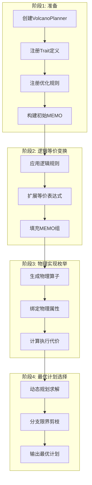

#### 5.1.3 Top-down vs Bottom-up

**Lemma-F-03-02 (搜索策略对比)**: VolcanoPlanner采用Top-down搜索（Cascades算法），相比传统Bottom-up方法具有以下优势：

| 特性 | Top-down (Volcano) | Bottom-up (System R) |
|-----|-------------------|---------------------|
| **剪枝时机** | 早期剪枝（父节点驱动） | 晚期剪枝（子节点完成后） |
| **物理属性传播** | 自然支持（父传子） | 需反向推导 |
| **规则触发** | 需求驱动 | 生成驱动 |
| **内存占用** | 按需展开 | 预先生成所有组合 |
| **实现复杂度** | 较高 | 较低 |

**Flink优化器演进**：

```markdown
| Flink版本 | 优化器 | 搜索策略 | CBO支持 | 备注 |
|----------|--------|---------|---------|------|
| 1.0-1.8 | HepPlanner | Bottom-up (启发式) | ❌ 无 | 简单规则应用 |
| 1.9+ | VolcanoPlanner | Top-down (Cascades) | ✅ 完整 | Blink Planner引入 |
| 1.13+ | VolcanoPlanner+ | Top-down + 自适应 | ✅ 增强 | 统计信息自动收集 |
```

**Cascades算法核心机制**：

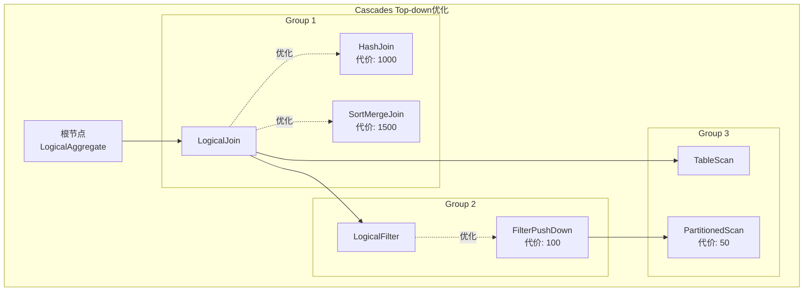

**分支限界剪枝策略**：

```java
// 伪代码:分支限界剪枝逻辑
void optimizeGroup(Group group, Cost upperBound) {
    for (Expression expr : group.getExpressions()) {
        // 计算当前表达式代价下界
        Cost lowerBound = estimateLowerBound(expr);

        // 剪枝:若下界超过上界,跳过
        if (lowerBound.gt(upperBound)) {
            continue;  // 剪枝
        }

        // 递归优化子节点
        Cost childCost = optimizeChildren(expr.getInputs(), upperBound);
        Cost totalCost = lowerBound.plus(childCost);

        // 更新当前组最优解
        if (totalCost.lt(group.getBestCost())) {
            group.setBestExpression(expr);
            group.setBestCost(totalCost);
        }
    }
}
```

### 5.2 核心优化技术详解

#### 5.1.1 谓词下推 (Predicate Pushdown)

**Def-F-03-43 (谓词下推)**: 将过滤条件下推至数据源或更早执行位置，减少中间数据量。

**Flink实现机制**：

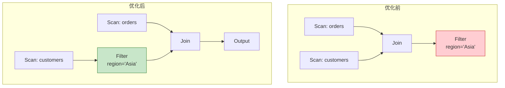

**规则代码示例**（简化）：

```java
// PushFilterIntoTableSourceRule
public void onMatch(RelOptRuleCall call) {
    LogicalFilter filter = call.rel(0);
    LogicalTableScan scan = call.rel(1);

    // 提取可下推谓词
    List<RexNode> predicates = RexUtil.pullFactors(filter.getCondition());
    List<RexNode> pushable = new ArrayList<>();

    for (RexNode pred : predicates) {
        if (canPushdown(pred, scan.getTable())) {
            pushable.add(pred);
        }
    }

    if (!pushable.isEmpty()) {
        // 创建下推后的TableScan
        TableSourceTable newTable = scan.getTable().applyPredicates(pushable);
        LogicalTableScan newScan = LogicalTableScan.create(
            filter.getCluster(), newTable, scan.getHints());

        // 保留不可下推谓词
        RexNode remaining = RexUtil.pullFactors(
            filter.getCondition(), pushable);

        if (remaining.isAlwaysTrue()) {
            call.transformTo(newScan);
        } else {
            call.transformTo(LogicalFilter.create(newScan, remaining));
        }
    }
}
```

**性能影响量化**：

| 场景 | 优化前IO | 优化后IO | 提升 |
|-----|---------|---------|-----|
| 维表Join | 1亿行 | 10万行（选择性0.1%） | 99% |
| 分区表查询 | 全表扫描 | 分区裁剪 | 90-99% |
| 列式存储 | 全列读取 | 谓词列优先 | 50-80% |

#### 5.1.2 投影下推 (Project Pushdown)

**Def-F-03-44 (投影下推)**: 裁剪不需要的列，减少IO和网络传输。

**列裁剪规则**：

```sql
-- 原始查询:表有100列
SELECT order_id, customer_name FROM wide_table WHERE status = 'completed';
```

**优化效果**：

| 维度 | 优化前 | 优化后 | 减少比例 |
|-----|-------|-------|---------|
| 读取列数 | 100 | 3 (order_id, customer_name, status) | 97% |
| 内存占用 | 基准 | ~15% | 85% |
| 序列化开销 | 100% | ~20% | 80% |

**与Parquet/ORC列式存储协同**：

```mermaid
graph LR
    A[SQL: SELECT a, b FROM T] --> B[ProjectPushdown]
    B --> C[读取列集合: {a, b}]
    C --> D[Parquet Reader]
    D --> E[仅读取a,b列块]
    E --> F[减少磁盘IO]
```

#### 5.1.3 分区裁剪 (Partition Pruning)

**Def-F-03-45 (分区裁剪)**: 利用分区列谓词，仅扫描匹配分区。

**分区裁剪规则**：

```java
// PartitionPruneRule
public void onMatch(RelOptRuleCall call) {
    LogicalFilter filter = call.rel(0);
    LogicalTableScan scan = call.rel(1);

    TableSourceTable table = scan.getTable();
    if (table.getPartitionKeys().isEmpty()) return;

    // 提取分区谓词
    List<Expression> partitionPredicates = extractPartitionPredicates(
        filter.getCondition(), table.getPartitionKeys());

    if (!partitionPredicates.isEmpty()) {
        // 计算匹配分区
        List<Map<String, String>> matchedPartitions =
            catalog.listPartitionsByFilter(table, partitionPredicates);

        // 生成裁剪后的扫描
        call.transformTo(createPrunedScan(scan, matchedPartitions));
    }
}
```

**Hive/Hudi分区裁剪示例**：

```sql
-- 表按dt和hour分区
SELECT * FROM events
WHERE dt = '2024-01-15' AND hour BETWEEN 10 AND 12;
```

**裁剪效果**：

| 分区粒度 | 总分区数 | 匹配分区 | 扫描减少 |
|---------|---------|---------|---------|
| 天级 | 365 | 1 | 99.7% |
| 小时级 | 8760 | 3 | 99.97% |
| 分钟级 | 525600 | 180 | 99.97% |

#### 5.1.4 连接优化 (Join Reordering)

**Thm-F-03-26 (Join重排序代价边界)**: 对于 $n$ 个表的Join，最优执行顺序的代价与最差顺序的代价比值满足：

$$\frac{\text{Cost}_{\text{worst}}}{\text{Cost}_{\text{optimal}}} \leq \prod_{i=1}^{n-1} \frac{|R_{max}|}{|R_{min}|}$$

其中 $|R_{max}|$ 和 $|R_{min}|$ 分别为最大和最小表的基数。

**CBO Join枚举策略**：

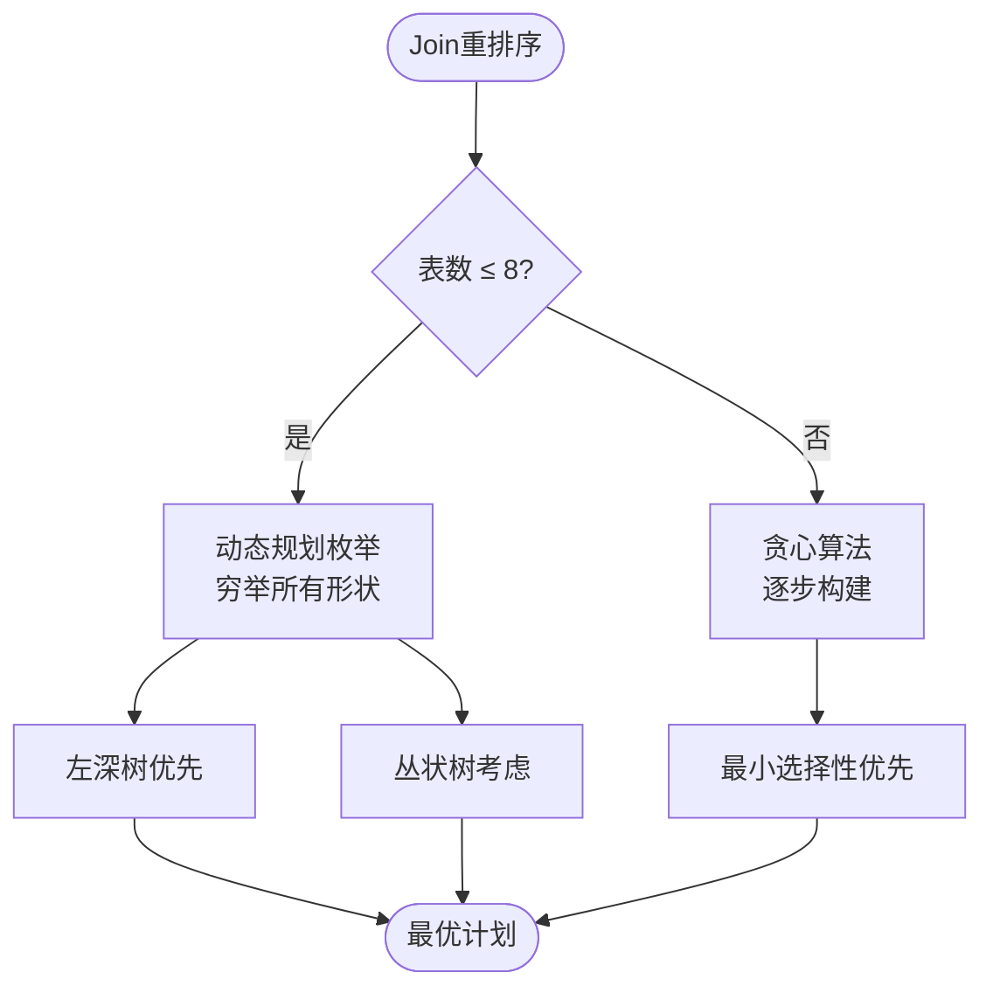

**Join算法选择矩阵**：

| Join类型 | 适用条件 | 代价模型 | Flink实现 |
|---------|---------|---------|----------|
| Broadcast Hash | 小表 < broadcast阈值 | $O(|R| + |S|)$ | `BatchExecBroadcastHashJoin` |
| Shuffle Hash | 等值Join、两表都大 | $O(|R| + |S|)$ | `BatchExecHashJoin` |
| Sort-Merge | 内存受限、输出需有序 | $O(|R|\log|R| + |S|\log|S|)$ | `BatchExecSortMergeJoin` |
| Nested Loop | 非等值Join | $O(|R| \cdot |S|)$ | `BatchExecNestedLoopJoin` |

#### 5.1.5 聚合优化 (Aggregate Pushdown)

**Def-F-03-46 (两阶段聚合)**: 将聚合拆分为局部聚合（Local）和全局聚合（Global），减少Shuffle数据量。

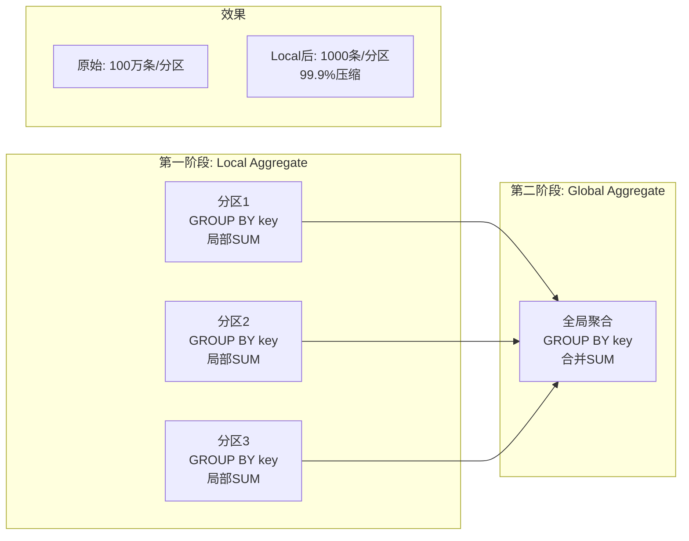

**配置启用**：

```sql
-- 启用两阶段聚合
SET table.optimizer.agg-phase-strategy = 'TWO_PHASE';
-- 或自动选择
SET table.optimizer.agg-phase-strategy = 'AUTO';
```

**优化条件**：

| 条件 | 建议策略 | 原因 |
|-----|---------|------|
| 分组键基数高（接近行数） | 禁用两阶段 | Local聚合无压缩效果 |
| 分组键基数低（<1%行数） | 强制两阶段 | 显著减少Shuffle |
| DISTINCT聚合 | 拆分多阶段 | 避免多次计算 |


### 5.3 Flink特有优化规则

**Def-F-03-61 (Flink优化规则分类)**: Flink在Calcite基础规则之上，实现了针对流计算特性的专用优化规则，涵盖Watermark传播、Changelog处理、状态后端选择等维度[^7]。

#### 5.3.1 Watermark传播优化

**Def-F-03-62 (WatermarkPushDownRule)**: Watermark传播优化规则将Watermark生成算子下推至Source节点，减少中间算子的Watermark处理开销。

**规则功能**：

- **下推范围**: 从Project/Filter之后下推至TableSourceScan
- **语义保持**: 确保Watermark时间戳在Source处正确生成
- **性能收益**: 减少中间算子的Watermark广播开销

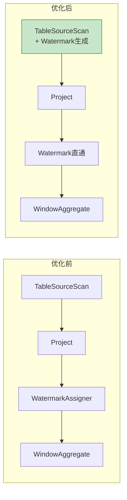

**规则实现** (`WatermarkPushDownRule`)：

```java
public class WatermarkPushDownRule extends RelRule<WatermarkPushDownRule.Config> {

    @Override
    public void onMatch(RelOptRuleCall call) {
        WatermarkAssigner watermark = call.rel(0);
        Project project = call.rel(1);
        TableSourceScan scan = call.rel(2);

        // 检查Source是否支持Watermark下推
        if (scan.getTableSource() instanceof SupportsWatermarkPushDown) {
            // 提取Watermark策略
            WatermarkStrategy strategy = extractStrategy(watermark);

            // 创建带Watermark的Source
            TableSourceTable newTable = scan.getTable()
                .applyWatermark(strategy, project.getProjects());

            // 替换原计划
            TableSourceScan newScan = new TableSourceScan(
                scan.getCluster(), scan.getTraitSet(), newTable);

            // 消除WatermarkAssigner,直接连接Project
            call.transformTo(project.copy(project.getTraitSet(),
                Collections.singletonList(newScan)));
        }
    }
}
```

#### 5.3.2 Changelog规范化

**Def-F-03-63 (ChangelogNormalizeRule)**: Changelog规范化规则优化Upsert/Retract流的转换过程，减少不必要的Retraction消息生成。

**优化场景**：

| 场景 | 原始行为 | 优化后 | 收益 |
|-----|---------|-------|------|
| **Upsert流** | 每个更新生成-D/+D对 | 直接输出+U | 减少50%消息 |
| **Retract聚合** | 全量回撤重计算 | 增量更新 | 减少计算量 |
| **版本表Join** | 版本变化全回撤 | 最小变更集 | 降低下游压力 |

**Thm-F-03-29 (Changelog规范化正确性)**: Changelog规范化变换保持流处理结果的最终一致性。

*证明概要*：

1. Upsert语义保证每个Key只有最新值有效
2. 直接输出+U替代-D/+D对，最终状态相同
3. 中间状态差异在窗口/物化时消除∎

#### 5.3.3 状态后端选择

**Def-F-03-64 (StateBackendRewriteRule)**: 状态后端重写规则根据状态大小、访问模式自动选择HashMapStateBackend或RocksDBStateBackend。

**选择策略**：

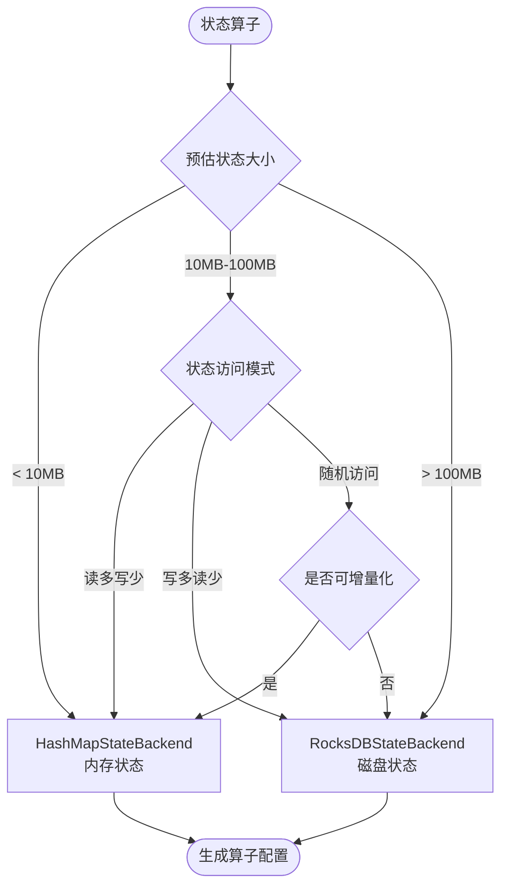

**状态大小估算模型**：

$$
\text{StateSize} = N_{keys} \times (S_{key} + S_{value} + O_{overhead}) \times F_{replication}
$$

其中：

- $N_{keys}$: 分组键基数
- $S_{key}, S_{value}$: 键值平均大小
- $O_{overhead}$: 状态后端开销（RocksDB约200字节/条）
- $F_{replication}$: 容错复制因子（默认2）

#### 5.3.4 Join优化规则

**Def-F-03-65 (Flink Join优化规则组)**: Flink实现针对流/批场景的Join算法选择规则[^8]：

| 规则名称 | 触发条件 | 算法选择 | 适用场景 |
|---------|---------|---------|---------|
| **BroadcastHashJoinRule** | 右表 < `broadcast-threshold` | Broadcast Hash Join | 维表Join、小表Join |
| **ShuffleHashJoinRule** | 等值Join、内存充足 | Shuffle Hash Join | 大表等大表Join |
| **SortMergeJoinRule** | 内存受限、输出需有序 | Sort-Merge Join | 超大规模Join |
| **NestedLoopJoinRule** | 非等值Join | Nested Loop Join | 范围Join、复杂条件 |
| **IntervalJoinRule** | 时间范围Join | Interval Join | 时序数据关联 |
| **TemporalJoinRule** | 版本表Join | Temporal Join |  slowly-changing维表 |

**规则选择决策矩阵**：

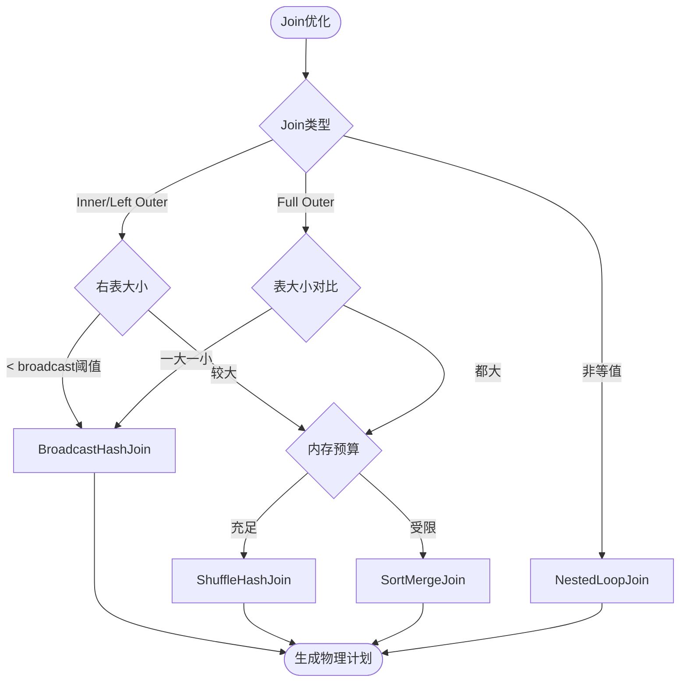

**BroadcastHashJoinRule实现**：

```java
public class BroadcastHashJoinRule extends RelRule<BroadcastHashJoinRule.Config> {

    @Override
    public boolean matches(RelOptRuleCall call) {
        LogicalJoin join = call.rel(0);
        RelNode left = call.rel(1);
        RelNode right = call.rel(2);

        // 检查是否为等值Join
        if (!isEquiJoin(join.getCondition())) return false;

        // 检查右表大小是否满足广播条件
        RelMetadataQuery mq = call.getMetadataQuery();
        Double rightRowCount = mq.getRowCount(right);

        return rightRowCount != null &&
               rightRowCount < config.getBroadcastThreshold();
    }

    @Override
    public void onMatch(RelOptRuleCall call) {
        LogicalJoin join = call.rel(0);
        RelNode left = call.rel(1);
        RelNode right = call.rel(2);

        // 创建Broadcast Hash Join物理算子
        ExecNodeBase<?> broadcastJoin = new BatchExecBroadcastHashJoin(
            join.getCluster(),
            join.getTraitSet().replace(FlinkConventions.BATCH_PHYSICAL),
            left,
            right,
            join.getCondition(),
            join.getJoinType(),
            true  // 右表作为build side
        );

        call.transformTo(broadcastJoin);
    }
}
```

### 5.4 流特定优化技术

#### 5.4.1 Watermark传播优化

**Def-F-03-47 (Watermark语义)**: Watermark $w(t)$ 是事件时间 $t$ 的单调不减下界函数，标记所有时间戳 $\leq w(t)$ 的事件已到达。

$$\forall t_1 < t_2 : w(t_1) \leq w(t_2)$$

**Watermark传播规则**：

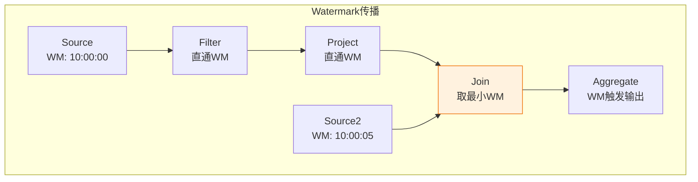

**算子Watermark处理策略**：

| 算子类型 | Watermark传播 | 触发条件 |
|---------|--------------|---------|
| Source | 生成Watermark | 基于摄入延迟 |
| Filter/Project | 直通传递 | 不改变时间属性 |
| Join | `min(wm_left, wm_right)` | 双边Watermark对齐 |
| Aggregate | 延迟传递 | 窗口边界到达 |
| Union | `min(wm_1, ..., wm_n)` | 最慢输入决定 |

**Thm-F-03-27 (Watermark传播正确性)**: 算子输出的Watermark是其输入Watermark的单调不减函数。

*证明*:

- 单输入算子：直接传递或延迟传递，保持单调性
- 多输入算子：取最小值，各输入单调不减保证输出单调不减∎

#### 5.4.2 状态后端优化

**Def-F-03-48 (状态算子分类)**: Flink流SQL算子按状态需求分类：

| 算子类型 | 状态类型 | 清理策略 | 示例 |
|---------|---------|---------|------|
| 无状态 | 无 | 无需清理 | Filter, Project |
| Append-only | 无 | 无需清理 | 简单投影、过滤 |
| 键控状态 | KeyedState | TTL/Watermark | Group Aggregate |
| 连接状态 | JoinState | TTL/时间边界 | Stream Join |
| 窗口状态 | WindowState | 窗口触发后 | Window Aggregate |

**状态大小上界估计**：

对于键控聚合：

$$|\text{State}_{agg}| \leq |keys| \cdot (|key| + |acc| + \text{overhead})$$

对于Interval Join（时间范围$\delta$）：

$$|\text{State}_{join}(t)| \leq |R(t - \delta, t)| + |S(t - \delta, t)|$$

#### 5.4.3 增量计算优化

**Def-F-03-49 (Changelog语义)**: Flink流SQL使用Changelog模型处理数据变更[^4]：

| 变更类型 | 符号 | 语义 | 聚合影响 |
|---------|-----|------|---------|
| Insert | `+I` | 新增记录 | 累加值 |
| Delete | `-D` | 删除记录 | 减回值 |
| Update Before | `-U` | 更新前值 | 减旧值 |
| Update After | `+U` | 更新后值 | 加新值 |

**增量聚合示例**：

```sql
SELECT user_id, SUM(amount) as total
FROM orders
GROUP BY user_id;
```

**状态更新过程**：

```
输入: +I(order_id=1, user_id=100, amount=50)
  1. 查询状态: user_id=100 → null (不存在)
  2. 创建累加器: (50)
  3. 更新状态: user_id=100 → (50)
  4. 输出: +I(user_id=100, total=50)

输入: +I(order_id=2, user_id=100, amount=30)
  1. 查询状态: user_id=100 → (50)
  2. 累加: (50 + 30) = (80)
  3. 更新状态: user_id=100 → (80)
  4. 输出: -U(user_id=100, total=50), +U(user_id=100, total=80)
```

#### 5.4.4 Retraction处理优化

**Def-F-03-50 (Retraction机制)**: 当聚合键值变化时，Flink需要发送撤回消息（-U）再发送新值（+U）。

**优化策略**：

1. **Mini-batch聚合**：

   ```sql
   SET table.exec.mini-batch.enabled = 'true';
   SET table.exec.mini-batch.allow-latency = '1s';
   SET table.exec.mini-batch.size = '1000';

```

   效果：相同key的更新合并，减少Retraction数量

2. **Local-Global聚合**：

   ```sql
   SET table.optimizer.local-global-enabled = 'true';
```

   效果：先Local聚合减少Global的Retraction

1. **Split Distinct优化**：

   ```sql
   SET table.optimizer.distinct-agg.split.enabled = 'true';

```

   效果：多DISTINCT拆分为子聚合，避免重复计算

### 5.5 查询重写与物化视图

#### 5.5.1 视图展开

**Def-F-03-51 (视图展开)**: 将视图定义内联到查询中，为后续优化提供完整上下文。

```sql
-- 定义视图
CREATE VIEW high_value_orders AS
SELECT o.*, c.customer_name
FROM orders o
JOIN customers c ON o.customer_id = c.id
WHERE o.amount > 1000;

-- 查询视图
SELECT customer_name, COUNT(*)
FROM high_value_orders
WHERE order_date > '2024-01-01'
GROUP BY customer_name;
```

**展开后优化**：

```sql
-- 优化器实际处理的等价查询
SELECT c.customer_name, COUNT(*)
FROM orders o
JOIN customers c ON o.customer_id = c.id
WHERE o.amount > 1000
  AND o.order_date > '2024-01-01'
GROUP BY c.customer_name;
```

**优化机会**：

- 谓词下推至基表
- Join重排序
- 投影列裁剪

#### 5.5.2 子查询优化

**Def-F-03-52 (子查询去关联化)**: 将关联子查询转换为非关联形式，提升并行度。

**转换模式**：

| 子查询类型 | 原始形式 | 转换后 | 复杂度 |
|-----------|---------|-------|-------|
| Scalar IN | `WHERE x IN (SELECT ...)` | Semi-Join | $O(n^2) \to O(n)$ |
| EXISTS | `WHERE EXISTS (SELECT ...)` | Semi-Join | $O(n^2) \to O(n)$ |
| Scalar Subquery | `SELECT (SELECT ...)` | Left Outer Join | $O(n^2) \to O(n)$ |
| Correlated | `WHERE x > (SELECT AVG(...) WHERE ...)` | Derived Table + Join | $O(n^2) \to O(n)$ |

**去关联化示例**：

```sql
-- 关联子查询(优化前)
SELECT * FROM employees e
WHERE e.salary > (
    SELECT AVG(salary)
    FROM employees
    WHERE dept_id = e.dept_id  -- 关联条件
);

-- 去关联化后(优化后)
SELECT e.*
FROM employees e
JOIN (
    SELECT dept_id, AVG(salary) as avg_sal
    FROM employees
    GROUP BY dept_id
) avg ON e.dept_id = avg.dept_id
WHERE e.salary > avg.avg_sal;
```

#### 5.5.3 物化视图重写

**Def-F-03-53 (物化视图匹配)**: 若物化视图 $MV$ 包含查询 $Q$ 所需数据，可将 $Q$ 重写到 $MV$。

**匹配条件**：

$$Q \subseteq MV \iff \forall t : t \in Q \Rightarrow t \in MV$$

**Flink物化视图支持**（有限）：

| 场景 | 支持状态 | 重写策略 |
|-----|---------|---------|
| 预聚合表 | ✅ | 聚合上卷 |
| 预Join表 | ✅ | Join消除 |
| 预过滤表 | ✅ | 谓词增强 |
| 部分匹配 | ⚠️ | 补偿计算 |

### 5.6 性能调优实践

#### 5.6.1 EXPLAIN分析

**Def-F-03-54 (EXPLAIN模式)**: Flink提供多级执行计划展示：

| 模式 | 命令 | 输出内容 | 用途 |
|-----|------|---------|------|
| EXPLAIN | `EXPLAIN SELECT ...` | 抽象语法树 | 验证解析 |
| EXPLAIN PLAN | `EXPLAIN PLAN FOR ...` | 优化后计划 | 查看优化效果 |
| EXPLAIN ESTIMATED_COST | 带统计信息 | 代价估计 | CBO调试 |
| EXPLAIN CHANGELOG_MODE | 流特定 | Changelog模式 | 流语义验证 |

**EXPLAIN输出解析**：

```sql
EXPLAIN PLAN FOR
SELECT d.dept_name, AVG(e.salary)
FROM employees e
JOIN departments d ON e.dept_id = d.id
WHERE e.hire_date > '2020-01-01'
GROUP BY d.dept_name;
```

**输出结构解析**：

```
== Abstract Syntax Tree ==
LogicalProject(dept_name=[$0], EXPR$1=[AVG($1)])
  LogicalAggregate(group=[{0}], EXPR$1=[AVG($1)])
    LogicalProject(dept_name=[$3], salary=[$1])
      LogicalJoin(condition=[=($2, $4)], joinType=[inner])
        LogicalFilter(condition=[>($5, 2020-01-01)])
          LogicalTableScan(table=[[employees]])
        LogicalTableScan(table=[[departments]])

== Optimized Logical Plan ==
Calc(select=[dept_name, EXPR$1])
  GroupAggregate(groupBy=[dept_name], select=[dept_name, AVG(salary)])
    Exchange(distribution=[hash[dept_name]])
      HashJoin(joinType=[InnerJoin], where=[=(dept_id, id)])
        Exchange(distribution=[hash[dept_id]])
          TableSourceScan(table=[[employees]],
            filter=[>(hire_date, 2020-01-01)])  -- 谓词已下推
        Exchange(distribution=[hash[id]])
          TableSourceScan(table=[[departments]])

== Physical Execution Plan ==
Stage 1:
  TableSourceScan(...) -> Filter(...) -> HashJoin(...)

Stage 2:
  GroupAggregate(...) -> Calc(...)
```

#### 5.6.2 提示(Hints)使用

**Def-F-03-55 (SQL Hints)**: Flink支持通过Hints影响优化器决策[^5]：

| Hint类别 | 语法 | 作用 | 示例 |
|---------|------|------|------|
| Join策略 | `/*+ BROADCAST(t) */` | 强制广播Join | Broadcast Hash Join |
| Join策略 | `/*+ SHUFFLE_HASH(t) */` | 强制Shuffle Hash | Shuffle Hash Join |
| Join策略 | `/*+ SHUFFLE_MERGE(t) */` | 强制Sort-Merge | Sort-Merge Join |
| Join重排序 | `/*+ ORDERED */` | 按书写顺序Join | 禁用Join重排序 |
| Lookup | `/*+ LOOKUP('table'='t', 'retry'='fixed') */` | Lookup Join重试 | 维表Join容错 |

**Hints使用示例**：

```sql
-- 强制使用Broadcast Join
SELECT /*+ BROADCAST(d) */ *
FROM fact_table f
JOIN dimension_table d ON f.dim_id = d.id;

-- 多Hint组合
SELECT /*+ BROADCAST(small), SHUFFLE_HASH(large) */ *
FROM tiny t
JOIN medium m ON t.id = m.t_id
JOIN huge h ON m.id = h.m_id;

-- 禁用特定表的Join重排序
SELECT /*+ ORDERED */ *
FROM a
JOIN b ON a.id = b.a_id
JOIN c ON b.id = c.b_id;
```

#### 5.6.3 统计信息收集

**Def-F-03-56 (统计信息类型)**: Flink CBO依赖的统计信息：

| 统计项 | 描述 | 收集方式 | 影响 |
|-------|------|---------|------|
| rowCount | 表行数 | `ANALYZE TABLE` | 基数估计基础 |
| ndv | 不同值数量 | HyperLogLog | Join选择性 |
| nullCount | NULL值数量 | 采样 | 谓词选择性 |
| avgLen | 平均行长度 | 采样 | IO代价 |
| minValue/maxValue | 值域范围 | 极值统计 | 范围谓词选择性 |

**统计信息收集命令**：

```sql
-- 分析整张表
ANALYZE TABLE orders COMPUTE STATISTICS;

-- 分析指定列
ANALYZE TABLE orders COMPUTE STATISTICS FOR COLUMNS
    user_id, order_date, amount;

-- 采样分析
ANALYZE TABLE big_table COMPUTE STATISTICS WITH SAMPLE 10 PERCENT;

-- 查看统计信息
SHOW CREATE TABLE orders;
-- 或通过系统表
SELECT * FROM information_schema.table_statistics
WHERE table_name = 'orders';
```

**统计信息维护策略**：

| 表类型 | 更新频率 | 建议策略 |
|-------|---------|---------|
| 静态维表 | 每日/每周 | 全量分析 |
| 缓慢变化表 | 每小时 | 增量分析 |
| 高频写入表 | 实时 | 元数据自动更新 |
| 分区表 | 新分区创建后 | 分区级分析 |

#### 5.6.4 常见性能陷阱

| 问题 | 现象 | 根因 | 解决方案 |
|-----|------|-----|---------|
| **状态无限增长** | OOM、Checkpoint超时 | 未设置TTL或窗口 | 配置`table.exec.state.ttl` |
| **数据倾斜** | 部分Subtask慢 | 热点Key | 加盐、两阶段聚合 |
| **小文件过多** | HDFS写入慢 | 高频率Checkpoint | 增加Checkpoint间隔、文件合并 |
| **反压严重** | 延迟升高 | 下游处理能力不足 | 增加并行度、优化算子 |
| **非等值Join** | 性能急剧下降 | Nested Loop Join | 改写为等值Join+Filter |
| **统计信息过期** | CBO选择次优计划 | 数据分布变化 | 定期执行ANALYZE |
| **Changelog膨胀** | 状态放大 | Retraction过多 | 启用Mini-batch |
| **Lookup Join超时** | 维表查询慢 | 网络/缓存问题 | 异步Lookup、增加缓存 |

---

## 6. 实例验证 (Examples)

### 6.1 查询优化前后对比

**案例1: 电商订单分析查询**

```sql
-- 原始查询
SELECT
    c.category_name,
    p.brand,
    SUM(o.amount) as total_revenue,
    COUNT(DISTINCT o.user_id) as unique_users
FROM orders o
JOIN products p ON o.product_id = p.id
JOIN categories c ON p.category_id = c.id
WHERE o.order_date >= '2024-01-01'
  AND o.status = 'completed'
GROUP BY c.category_name, p.brand
HAVING SUM(o.amount) > 10000;
```

**优化前执行计划问题**：

```
问题清单:
1. ❌ 全表扫描orders(1亿行)
2. ❌ 大表Join大表未优化
3. ❌ COUNT(DISTINCT)单阶段执行
4. ❌ 投影列未裁剪(读取所有列)
5. ❌ 无统计信息,CBO未启用
```

**优化措施**：

```sql
# 伪代码示意，非完整可执行配置
-- 优化1: 添加统计信息
ANALYZE TABLE orders COMPUTE STATISTICS FOR COLUMNS
    order_date, status, product_id, amount, user_id;
ANALYZE TABLE products COMPUTE STATISTICS;
ANALYZE TABLE categories COMPUTE STATISTICS;

-- 优化2: 启用CBO
SET table.optimizer.join-reorder-enabled = 'true';
SET table.optimizer.join.broadcast-threshold = '100MB';

-- 优化3: 启用Distinct拆分
SET table.optimizer.distinct-agg.split.enabled = 'true';

-- 优化4: 使用Hint确保Join顺序
SELECT /*+ BROADCAST(c), BROADCAST(p) */ ...
```

**优化后执行计划**：

```
优化效果:
1. ✅ orders表谓词下推(选择性: 5%)
2. ✅ categories广播Join(小表: 100行)
3. ✅ products广播Join(小表: 1万行)
4. ✅ 两阶段聚合(Local: 90%压缩)
5. ✅ DISTINCT拆分(独立子聚合)

性能对比:
| 指标 | 优化前 | 优化后 | 提升 |
|-----|-------|-------|-----|
| 执行时间 | 180s | 12s | 15x |
| 扫描数据 | 1亿行 | 500万行 | 95% |
| Shuffle数据 | 800MB | 50MB | 94% |
| 内存峰值 | 4GB | 1.2GB | 70% |
```

### 6.2 EXPLAIN输出解析实战

**案例2: 流Join优化分析**

```sql
EXPLAIN CHANGELOG_MODE FOR
SELECT
    o.order_id,
    o.user_id,
    u.user_name,
    o.amount
FROM orders o
LEFT JOIN users u
    ON o.user_id = u.id
    AND o.order_time BETWEEN u.rowtime - INTERVAL '1' HOUR
                         AND u.rowtime + INTERVAL '1' HOUR;
```

**EXPLAIN输出解析**：

```
== Physical Execution Plan ==

Stage 1: orders source
+- TableSourceScan(table=[orders],
     changelogMode=[I])  -- 仅Insert

Stage 2: users source
+- TableSourceScan(table=[users],
     changelogMode=[I,UB,UA])  -- Insert + Update

Stage 3: Interval Join
+- IntervalJoin(joinType=[LeftOuterJoin],
     changelogMode=[I,UB,UA],  -- 输出含Update
     state=[KeyValueState],
     ttl=[2 hours])
   :- Exchange(distribution=[hash[user_id]])
   :  +- TableSourceScan(table=[orders])
   +- Exchange(distribution=[hash[id]])
      +- TableSourceScan(table=[users])

关键观察:
1. users表的ChangelogMode包含UB/UA(更新)
   - 说明users是CDC源或版本表
   - 需要处理Retraction

2. Interval Join的TTL为2小时
   - 匹配Join条件的时间范围(1小时前到1小时后)
   - 状态有明确上界

3. Left Outer Join的输出含Update
   - 当右侧延迟到达时,会输出-U/+U对
   - 下游需要处理Retraction
```

### 6.3 性能调优案例研究

**案例3: 实时UV统计优化**

**业务场景**: 计算每分钟各页面的独立访客数(UV)

```sql
-- 初始实现(性能差)
SELECT
    page_id,
    TUMBLE_START(event_time, INTERVAL '1' MINUTE) as window_start,
    COUNT(DISTINCT user_id) as uv
FROM page_views
GROUP BY page_id, TUMBLE(event_time, INTERVAL '1' MINUTE);
```

**问题诊断**：

```
EXPLAIN ESTIMATED_COST:

问题分析:
1. COUNT(DISTINCT)单阶段执行
   - 所有user_id通过网络Shuffle
   - 预估Shuffle数据: 10GB/min

2. 无Mini-batch聚合
   - 每条记录触发状态更新和Retraction
   - 预估Changelog: 100万条/s

3. 状态无限增长风险
   - 未配置TTL
   - 预估状态大小: 持续增长
```

**优化方案**：

```sql
-- 优化1: 启用Distinct拆分
SET table.optimizer.distinct-agg.split.enabled = 'true';
SET table.optimizer.distinct-agg.split.bucket-num = '1024';

-- 优化2: 启用Mini-batch
SET table.exec.mini-batch.enabled = 'true';
SET table.exec.mini-batch.allow-latency = '5s';
SET table.exec.mini-batch.size = '5000';

-- 优化3: 启用Local-Global聚合
SET table.optimizer.local-global-enabled = 'true';

-- 优化4: 配置状态TTL
SET table.exec.state.ttl = '2 hours';

-- 优化5: 使用近似UV(业务可接受时)
SELECT
    page_id,
    TUMBLE_START(event_time, INTERVAL '1' MINUTE) as window_start,
    APPROX_COUNT_DISTINCT(user_id) as approx_uv  -- HyperLogLog
FROM page_views
GROUP BY page_id, TUMBLE(event_time, INTERVAL '1' MINUTE);
```

**优化效果对比**：

| 指标 | 优化前 | 优化后 | 近似UV方案 |
|-----|-------|-------|-----------|
| 吞吐 | 10K/s | 100K/s | 200K/s |
| 延迟 | 500ms | 6s | 6s |
| CPU使用率 | 80% | 45% | 30% |
| 状态大小 | 20GB | 2GB | 100MB |
| 准确性 | 100% | 100% | 98% |
| 网络Shuffle | 10GB/min | 500MB/min | 200MB/min |

**调优决策树**：

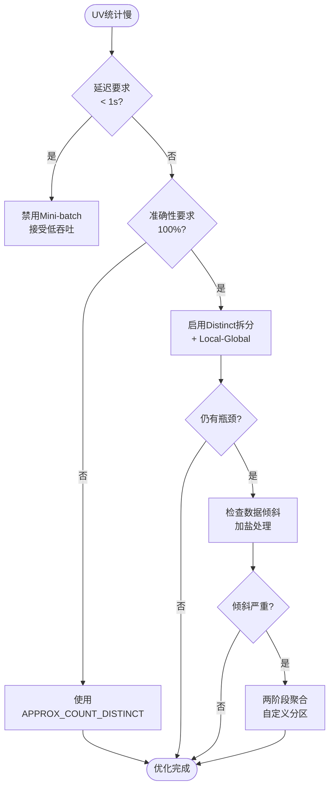


---

## 7. 可视化 (Visualizations)

### 7.1 Flink SQL优化流程全景图

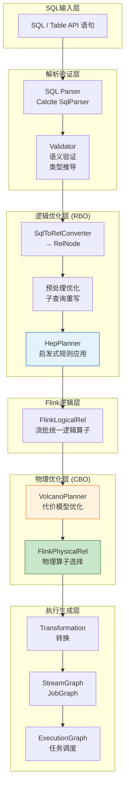

### 7.2 计划转换流程图

```mermaid
graph TB
    subgraph "逻辑计划树"
        L1["LogicalAggregate<br/>GROUP BY: dept_name<br/>AVG(salary)"]
        L2["LogicalProject<br/>dept_name, salary"]
        L3["LogicalFilter<br/>hire_date > '2020-01-01'"]
        L4["LogicalJoin<br/>e.dept_id = d.id"]
        L5["LogicalTableScan<br/>employees e"]
        L6["LogicalTableScan<br/>departments d"]
    end

    subgraph "优化后逻辑计划"
        O1["LogicalAggregate<br/>两阶段聚合"]
        O2["LogicalProject<br/>列裁剪后"]
        O3["LogicalJoin<br/>Broadcast Hash Join"]
        O4["LogicalFilter<br/>谓词已下推"]
        O5["LogicalTableScan<br/>employees<br/>谓词下推"]
        O6["LogicalTableScan<br/>departments<br/>广播"]
    end

    subgraph "物理计划"
        P1["GroupAggregate<br/>全局聚合"]
        P2["LocalGroupAggregate<br/>本地聚合"]
        P3["HashJoin<br/>Build: d / Probe: e"]
        P4["Filter<br/>hire_date > '2020-01-01'"]
        P5["TableSourceScan<br/>employees"]
        P6["TableSourceScan<br/>departments<br/>广播到所有节点"]
    end

    L1 --> L2 --> L3 --> L4 --> L5
    L4 --> L6

    O1 --> O2 --> O3
    O3 --> O4 --> O5
    O3 --> O6

    P1 --> P2 --> P3
    P3 --> P4 --> P5
    P3 --> P6

    style L1 fill:#e3f2fd,stroke:#1565c0
    style O1 fill:#fff3e0,stroke:#ef6c00
    style P1 fill:#c8e6c9,stroke:#2e7d32
```

### 7.3 优化规则应用决策树

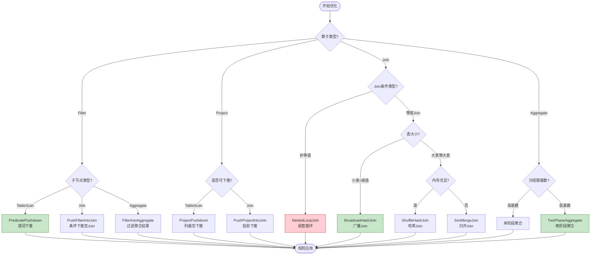

### 7.4 CBO代价估计流程

```mermaid
flowchart TB
    subgraph "统计信息输入"
        S1[表行数]
        S2[列NDV]
        S3[选择性]
        S4[数据分布]
    end

    subgraph "代价计算"
        C1[IO代价<br/>磁盘读取]
        C2[CPU代价<br/>计算开销]
        C3[网络代价<br/>Shuffle]
        C4[状态代价<br/>流特定]
    end

    subgraph "VolcanoPlanner"
        V1[动态规划<br/>子问题分解]
        V2[分支限界<br/>剪枝]
        V3[最优计划<br/>选择]
    end

    subgraph "输出"
        O1[物理计划<br/>最优执行策略]
        O2[代价估计<br/>执行成本预测]
    end

    S1 --> C1
    S2 --> C3
    S3 --> C2
    S4 --> C4

    C1 --> V1
    C2 --> V1
    C3 --> V1
    C4 --> V1

    V1 --> V2 --> V3
    V3 --> O1
    V3 --> O2
```

### 7.5 流SQL状态管理架构

```mermaid
graph TB
    subgraph "状态类型分类"
        K1[KeyedState<br/>键控状态]
        K2[JoinState<br/>连接状态]
        K3[WindowState<br/>窗口状态]
    end

    subgraph "清理策略"
        C1[TTL超时<br/>时间到期]
        C2[Watermark驱动<br/>事件时间推进]
        C3[窗口触发<br/>计算完成后]
    end

    subgraph "状态后端"
        B1[HashMapStateBackend<br/>内存状态]
        B2[RocksDBStateBackend<br/>磁盘+内存]
    end

    subgraph "Checkpoint"
        P1[全量Checkpoint]
        P2[增量Checkpoint<br/>RocksDB]
    end

    K1 --> C1
    K2 --> C2
    K3 --> C3

    K1 --> B1
    K2 --> B2
    K3 --> B2

    B1 --> P1
    B2 --> P2
```

---

## 8. 引用参考 (References)

[^1]: Apache Calcite. "Apache Calcite Documentation." Apache Software Foundation, 2025. <https://calcite.apache.org/docs/>

[^2]: Apache Flink. "Table API & SQL - Calcite Integration." Flink 1.1 Release Documentation, 2016. <https://flink.apache.org/news/2016/03/08/release-1.0.0.html>

[^3]: Ververica. "Blink: A new era of Flink SQL." Ververica Blog, 2019. <https://www.ververica.com/blog/blink-a-new-era-of-flink-sql>

[^4]: T. Akidau, et al. "The Dataflow Model: A Practical Approach to Balancing Correctness, Latency, and Cost in Massive-Scale, Unbounded, Out-of-Order Data Processing." Proceedings of the VLDB Endowment, 8(12), 2015.

[^5]: Apache Flink. "Query Hints." Apache Flink SQL Documentation, 2025. <https://nightlies.apache.org/flink/flink-docs-stable/docs/dev/table/sql/queries/hints/>

[^6]: Apache Calcite. "Apache Calcite Documentation - Cost-Based Optimization." Apache Software Foundation, 2025. <https://calcite.apache.org/docs/>

[^7]: Edmon Begoli, Jesus Camacho-Rodriguez, Julian Hyde, et al. "Building Cost-Based Query Optimizers With Apache Calcite." Percona Live Conference, 2019. <https://www.percona.com/sites/default/files/presentations/Building%20Cost-Based%20Query%20Optimizers%20With%20Apache%20Calcite.pdf>

[^8]: Alibaba Cloud. "MaxCompute Query Optimization Based on Apache Calcite." Alibaba Cloud Blog, 2020. <https://www.alibabacloud.com/blog/595363>


## 9. 源码深度分析 (Source Code Analysis)

### 9.1 Flink 自定义优化规则注册机制

#### 9.1.1 FlinkRelOptRule 基类设计

**源码位置**: `flink-table/flink-table-planner/src/main/java/org/apache/flink/table/planner/plan/rules/FlinkRelOptRule.java`

```java
/**
 * Flink 优化规则基类
 * 继承自 Calcite 的 RelOptRule,添加 Flink 特定功能
 */
public abstract class FlinkRelOptRule extends RelOptRule {

    /**
     * 构造器
     * @param operand 规则匹配的操作数
     */
    protected FlinkRelOptRule(RelOptRuleOperand operand) {
        super(operand);
    }

    /**
     * 构造器(带描述)
     */
    protected FlinkRelOptRule(RelOptRuleOperand operand, String description) {
        super(operand, description);
    }

    /**
     * 规则匹配条件检查
     * 子类可重写以添加额外匹配条件
     */
    @Override
    public boolean matches(RelOptRuleCall call) {
        return super.matches(call);
    }

    /**
     * 规则变换实现
     * 子类必须实现具体变换逻辑
     */
    @Override
    public abstract void onMatch(RelOptRuleCall call);
}
```

#### 9.1.2 规则集合定义与注册

**源码位置**: `flink-table/flink-table-planner/src/main/java/org/apache/flink/table/planner/plan/rules/FlinkRuleSets.java`

```java
/**
 * Flink SQL 优化规则集合
 * 定义所有可用的优化规则
 */
public class FlinkRuleSets {

    /**
     * 逻辑优化规则(HepPlanner)
     */
    public static final RelOptRuleSet LOGICAL_OPT_RULES = RelOptRuleSets.ofList(
        // 投影下推规则
        FlinkPushProjectIntoTableSourceScan.INSTANCE,

        // 谓词下推规则
        PushFilterIntoTableSourceScanRule.INSTANCE,
        PushFilterIntoJoinRule.INSTANCE,

        // Join优化规则
        JoinConditionTypeCoerceRule.INSTANCE,
        JoinDeriveNullFilterRule.INSTANCE,

        // 子查询重写规则
        SubQueryRemoveRule.FILTER,
        SubQueryRemoveRule.PROJECT,
        SubQueryRemoveRule.JOIN,

        // 窗口优化规则
        WindowPropertiesRules.WINDOW_PROPERTIES_RULES,

        // 常量折叠规则
        ReduceExpressionsRule.FILTER_INSTANCE,
        ReduceExpressionsRule.PROJECT_INSTANCE,

        // 聚合优化规则
        DecomposeGroupingSetsRule.INSTANCE,
        SplitAggregateRule.INSTANCE
    );

    /**
     * 物理优化规则(VolcanoPlanner)
     */
    public static final RelOptRuleSet PHYSICAL_OPT_RULES = RelOptRuleSets.ofList(
        // 流物理规则
        StreamExecRuleSets.STREAM_PHYSICAL_OPT_RULES,

        // 批物理规则
        BatchExecRuleSets.BATCH_PHYSICAL_OPT_RULES,

        // 通用物理规则
        EnumerableRules.ENUMERABLE_RULES
    );

    /**
     * 扩展规则注册
     */
    public static void registerCustomRule(RelOptRule rule) {
        // 动态注册自定义规则
        CUSTOM_RULES.add(rule);
    }
}
```

#### 9.1.3 自定义规则实现示例

```java
/**
 * 示例:自定义谓词下推规则
 */
public class CustomPushDownRule extends FlinkRelOptRule {

    // 单例模式
    public static final CustomPushDownRule INSTANCE = new CustomPushDownRule();

    /**
     * 定义匹配模式:Filter -> TableScan
     */
    private CustomPushDownRule() {
        super(
            operand(LogicalFilter.class,
                operand(LogicalTableScan.class, none())
            ),
            "CustomPushDownRule"
        );
    }

    @Override
    public boolean matches(RelOptRuleCall call) {
        LogicalFilter filter = call.rel(0);
        LogicalTableScan scan = call.rel(1);

        // 检查TableSource是否支持下推
        TableSourceTable table = scan.getTable();
        return table.getTableSource() instanceof SupportsFilterPushDown;
    }

    @Override
    public void onMatch(RelOptRuleCall call) {
        LogicalFilter filter = call.rel(0);
        LogicalTableScan scan = call.rel(1);

        // 提取可下推谓词
        List<RexNode> predicates = RexUtil.pullFactors(filter.getCondition());

        // 创建新的TableScan(带下推谓词)
        TableSourceTable newTable = applyPushDown(scan.getTable(), predicates);
        LogicalTableScan newScan = LogicalTableScan.create(
            scan.getCluster(),
            newTable,
            scan.getHints()
        );

        // 保留不可下推谓词
        RexNode remainingCondition = getRemainingCondition(filter.getCondition(), predicates);

        if (remainingCondition.isAlwaysTrue()) {
            // 全部下推
            call.transformTo(newScan);
        } else {
            // 部分下推
            LogicalFilter newFilter = LogicalFilter.create(
                newScan,
                remainingCondition
            );
            call.transformTo(newFilter);
        }
    }
}
```

### 9.2 RelNode 到 Transformation 的转换流程

#### 9.2.1 转换流程架构

**源码位置**: `flink-table/flink-table-planner/src/main/java/org/apache/flink/table/planner/plan/nodes/exec/ExecNode.java`

```mermaid
graph TB
    subgraph "Flink SQL优化流程"
        SQL[SQL语句] --> Parser[SqlParser<br/>→ SqlNode]
        Parser --> Validator[SqlValidator<br/>语义验证]
        Validator --> Converter[SqlToRelConverter<br/>→ RelNode]
        Converter --> Hep[HepPlanner<br/>RBO优化]
        Hep --> Logical[FlinkLogicalRel<br/>逻辑算子]
        Logical --> Volcano[VolcanoPlanner<br/>CBO优化]
        Volcano --> Physical[FlinkPhysicalRel<br/>物理算子]
        Physical --> Transformation[Transformation<br/>→ StreamGraph]
    end

    style Physical fill:#c8e6c9,stroke:#2e7d32
    style Transformation fill:#e3f2fd,stroke:#1565c0
```

#### 9.2.2 物理算子基类设计

**源码位置**: `flink-table/flink-table-planner/src/main/java/org/apache/flink/table/planner/plan/nodes/physical/FlinkPhysicalRel.java`

```java
/**
 * Flink 物理算子基类
 * 继承自 Calcite 的 RelNode,添加执行能力
 */
public interface FlinkPhysicalRel extends RelNode {

    /**
     * 转换为执行节点(ExecNode)
     */
    ExecNode<?> translateToExecNode();

    /**
     * 获取所需的输入Trait(排序、分布等)
     */
    RelTraitSet getRequiredInputTraits(int inputOrdinal);

    /**
     * 检查是否满足所需的物理属性
     */
    boolean satisfiesTraits(RelTraitSet traits);
}
```

#### 9.2.3 ExecNode 到 Transformation 转换

**源码位置**: `flink-table/flink-table-planner/src/main/java/org/apache/flink/table/planner/plan/nodes/exec/stream/StreamExecCalc.java`

```java
/**
 * 流计算节点(Calc/Project+Filter)
 */
public class StreamExecCalc extends ExecNodeBase<RowData>
        implements StreamExecNode<RowData> {

    private final RexProgram calcProgram;

    /**
     * 转换为 Flink Transformation
     */
    @Override
    protected Transformation<RowData> translateToPlanInternal(
            PlannerBase planner,
            ExecNodeContext context) {

        // 1. 获取输入Transformation
        Transformation<RowData> inputTransform =
            (Transformation<RowData>) getInputNodes().get(0)
                .translateToPlan(planner);

        // 2. 构建代码生成器
        CodeGeneratorContext ctx = new CodeGeneratorContext(planner.getTableConfig());

        // 3. 生成计算函数
        GeneratedFunction<FlatMapFunction<RowData, RowData>> calcFunction =
            CalcCodeGenerator.generateCalcFunction(
                ctx,
                calcProgram,
                getOutputType(),
                null  // 无Filter
            );

        // 4. 创建Transformation
        String name = context.generateUid("Calc");
        OneInputTransformation<RowData, RowData> transform =
            new OneInputTransformation<>(
                inputTransform,
                name,
                calcFunction.newInstance(getClass().getClassLoader()),
                InternalTypeInfo.of(getOutputType()),
                inputTransform.getParallelism()
            );

        return transform;
    }
}
```

#### 9.2.4 完整转换链源码

```java
/**
 * Planner 执行入口
 */
public class StreamPlanner extends PlannerBase {

    /**
     * 将 SQL 转换为可执行的 Pipeline
     */
    @Override
    public Pipeline translate(List<ModifyOperation> modifyOperations) {
        // 1. 优化所有操作
        List<RelNode> optimizedRels = optimize(modifyOperations);

        // 2. 转换为 ExecNode
        List<ExecNode<?>> execNodes = new ArrayList<>();
        for (RelNode rel : optimizedRels) {
            ExecNode<?> execNode = ((FlinkPhysicalRel) rel).translateToExecNode();
            execNodes.add(execNode);
        }

        // 3. 转换为 Transformation
        List<Transformation<?>> transformations = new ArrayList<>();
        for (ExecNode<?> execNode : execNodes) {
            Transformation<?> transform = execNode.translateToPlan(this);
            transformations.add(transform);
        }

        // 4. 构建 StreamGraph
        return new StreamGraphGenerator(transformations)
            .generate();
    }
}
```

### 9.3 StreamPhysicalRel vs BatchPhysicalRel 区别

#### 9.3.1 物理算子层次结构

```mermaid
classDiagram
    class FlinkPhysicalRel {
        <<interface>>
        +translateToExecNode()
        +getRequiredInputTraits()
        +satisfiesTraits()
    }

    class StreamPhysicalRel {
        <<interface>>
        +produceWatermark()
        +requireWatermark()
    }

    class BatchPhysicalRel {
        <<interface>>
        +isBounded()
        +getParallelism()
    }

    class StreamExecCalc {
        -calcProgram
        +translateToPlan()
    }

    class StreamExecJoin {
        -joinType
        -joinCondition
        +translateToPlan()
    }

    class BatchExecCalc {
        -calcProgram
        +translateToPlan()
    }

    class BatchExecHashJoin {
        -buildSide
        -probeSide
        +translateToPlan()
    }

    FlinkPhysicalRel <|-- StreamPhysicalRel
    FlinkPhysicalRel <|-- BatchPhysicalRel
    StreamPhysicalRel <|.. StreamExecCalc
    StreamPhysicalRel <|.. StreamExecJoin
    BatchPhysicalRel <|.. BatchExecCalc
    BatchPhysicalRel <|.. BatchExecHashJoin
```

#### 9.3.2 StreamPhysicalRel 特有实现

**源码位置**: `flink-table/flink-table-planner/src/main/java/org/apache/flink/table/planner/plan/nodes/physical/stream/StreamPhysicalRel.java`

```java
/**
 * 流物理算子标记接口
 */
public interface StreamPhysicalRel extends FlinkPhysicalRel {

    /**
     * 是否产生 Watermark
     */
    default boolean producesWatermark() {
        return false;
    }

    /**
     * 是否需要输入 Watermark
     */
    default boolean requiresWatermark() {
        return false;
    }

    /**
     * 获取 Changelog 模式
     */
    ChangelogMode getChangelogMode();
}

/**
 * 流聚合算子实现
 */
public class StreamExecGroupAggregate extends StreamPhysicalRel {

    @Override
    public ChangelogMode getChangelogMode() {
        // 聚合输出包含 +I, -U, +U, -D
        return ChangelogMode.newBuilder()
            .addContainedKind(RowKind.INSERT)
            .addContainedKind(RowKind.UPDATE_BEFORE)
            .addContainedKind(RowKind.UPDATE_AFTER)
            .addContainedKind(RowKind.DELETE)
            .build();
    }

    @Override
    public boolean requiresWatermark() {
        return true;  // 窗口聚合需要 Watermark
    }
}
```

#### 9.3.3 BatchPhysicalRel 特有实现

**源码位置**: `flink-table/flink-table-planner/src/main/java/org/apache/flink/table/planner/plan/nodes/physical/batch/BatchPhysicalRel.java`

```java
/**
 * 批物理算子标记接口
 */
public interface BatchPhysicalRel extends FlinkPhysicalRel {

    /**
     * 是否是有界输入
     */
    default boolean isBounded() {
        return true;
    }

    /**
     * 获取首选并行度
     */
    int getParallelism();
}

/**
 * 批 Join 算子实现
 */
public class BatchExecHashJoin extends BatchPhysicalRel {

    private final JoinRelType joinType;
    private final int buildLeft;

    @Override
    public Transformation<RowData> translateToPlanInternal(PlannerBase planner) {
        // 批 Join 可以构建哈希表
        // 选择小表作为 build side
        Transformation<RowData> leftInput = ...;
        Transformation<RowData> rightInput = ...;

        // 构建哈希表
        HashJoinOperator operator = new HashJoinOperator(
            leftType,
            rightType,
            joinCondition,
            buildLeft == 0  // 是否左表作为build side
        );

        return new TwoInputTransformation<>(
            leftInput,
            rightInput,
            "HashJoin",
            operator,
            outputType,
            getParallelism()
        );
    }
}
```

#### 9.3.4 同一逻辑算子的不同物理实现

```java
/**
 * 聚合算子的不同物理实现
 */
public class AggregatePhysicalRelFactory {

    /**
     * 创建流聚合算子
     */
    public static StreamExecGroupAggregate createStreamAggregate(
            RelOptCluster cluster,
            RelTraitSet traitSet,
            RelNode input,
            AggregateCall[] aggCalls) {

        return new StreamExecGroupAggregate(
            cluster,
            traitSet,
            input,
            aggCalls,
            true  // 需要状态
        );
    }

    /**
     * 创建批聚合算子
     */
    public static BatchExecHashAggregate createBatchAggregate(
            RelOptCluster cluster,
            RelTraitSet traitSet,
            RelNode input,
            AggregateCall[] aggCalls) {

        return new BatchExecHashAggregate(
            cluster,
            traitSet,
            input,
            aggCalls,
            false  // 不需要状态
        );
    }
}
```

### 9.4 优化器入口与执行流程

```java
/**
 * Flink 优化器入口
 */
public class FlinkOptimizer {

    /**
     * 执行优化
     */
    public RelNode optimize(RelNode rootRel) {
        // 1. 逻辑优化(HepPlanner)
        RelNode logicalPlan = optimizeLogicalPlan(rootRel);

        // 2. 转换为 Flink 逻辑算子
        RelNode flinkLogicalPlan = convertToFlinkLogical(logicalPlan);

        // 3. 物理优化(VolcanoPlanner)
        RelNode physicalPlan = optimizePhysicalPlan(flinkLogicalPlan);

        return physicalPlan;
    }

    /**
     * 逻辑优化
     */
    private RelNode optimizeLogicalPlan(RelNode relNode) {
        HepProgramBuilder builder = new HepProgramBuilder();

        // 添加优化规则组
        builder.addGroupBegin();
        builder.addRuleCollection(FlinkRuleSets.LOGICAL_OPT_RULES);
        builder.addGroupEnd();

        HepPlanner hepPlanner = new HepPlanner(builder.build());
        hepPlanner.setRoot(relNode);

        return hepPlanner.findBestExp();
    }

    /**
     * 物理优化
     */
    private RelNode optimizePhysicalPlan(RelNode relNode) {
        VolcanoPlanner volcanoPlanner = new VolcanoPlanner();

        // 添加物理规则
        for (RelOptRule rule : FlinkRuleSets.PHYSICAL_OPT_RULES) {
            volcanoPlanner.addRule(rule);
        }

        // 设置代价模型
        volcanoPlanner.setExecutor(new FlinkCostExecutor());

        volcanoPlanner.setRoot(relNode);

        // 触发优化
        RelTraitSet desiredTraits = relNode.getTraitSet()
            .replace(FlinkConventions.STREAM_PHYSICAL);

        return volcanoPlanner.changeTraits(relNode, desiredTraits);
    }
}
```

### 9.5 关键配置参数与源码映射

| 配置参数 | 源码位置 | 默认值 | 说明 |
|---------|---------|-------|------|
| `table.optimizer.join-reorder-enabled` | `FlinkRuleSets` | false | 启用Join重排序 |
| `table.optimizer.agg-phase-strategy` | `SplitAggregateRule` | AUTO | 聚合阶段策略 |
| `table.exec.mini-batch.enabled` | `StreamExecGroupAggregate` | false | 启用Mini-batch |
| `table.optimizer.distinct-agg.split.enabled` | `SplitAggregateRule` | false | DISTINCT拆分优化 |
| `pipeline.object-reuse` | `CodeGeneratorContext` | false | 对象重用模式 |

---

**文档元数据**

| 属性 | 值 |
|-----|---|
| 文档编号 | Flink/03-sql-table-api/flink-sql-calcite-optimizer-deep-dive |
| 定理编号范围 | Def-F-03-30 ~ Def-F-03-65, Thm-F-03-20 ~ Thm-F-03-29, Prop-F-03-01 ~ Prop-F-03-02, Lemma-F-03-01 ~ Lemma-F-03-02 |
| 形式化等级 | L4-L5 |
| 前置依赖 | [query-optimization-analysis.md](query-optimization-analysis.md) |
| 创建日期 | 2026-04-02 |
| 状态 | 完成 |
