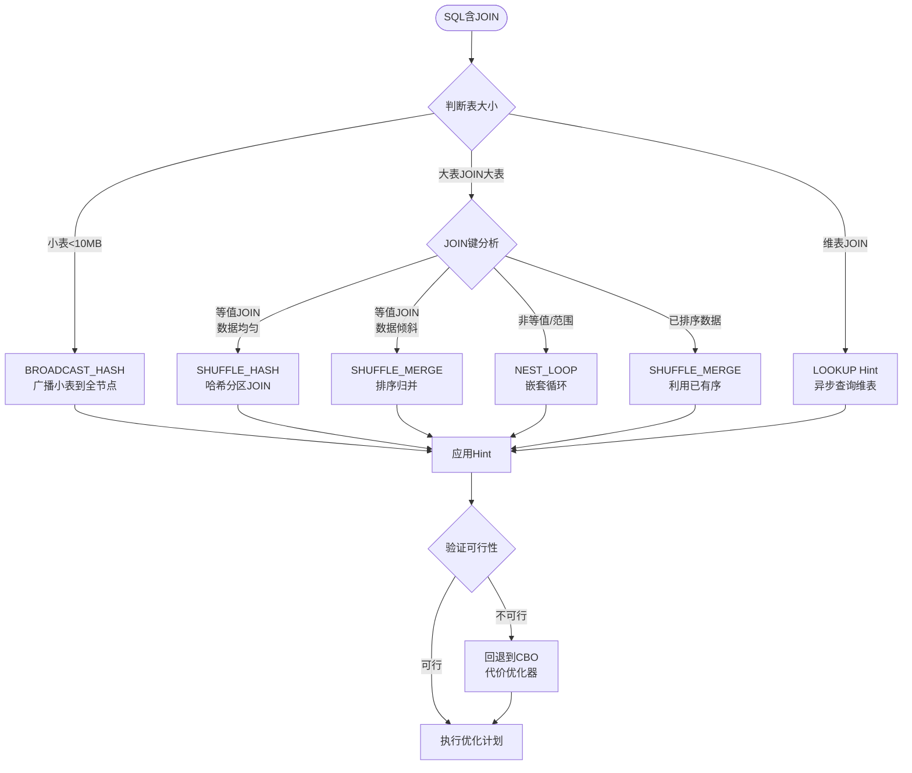
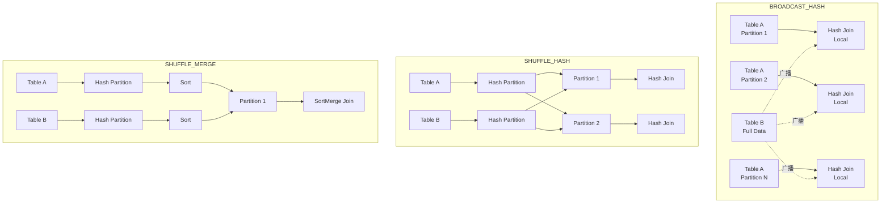
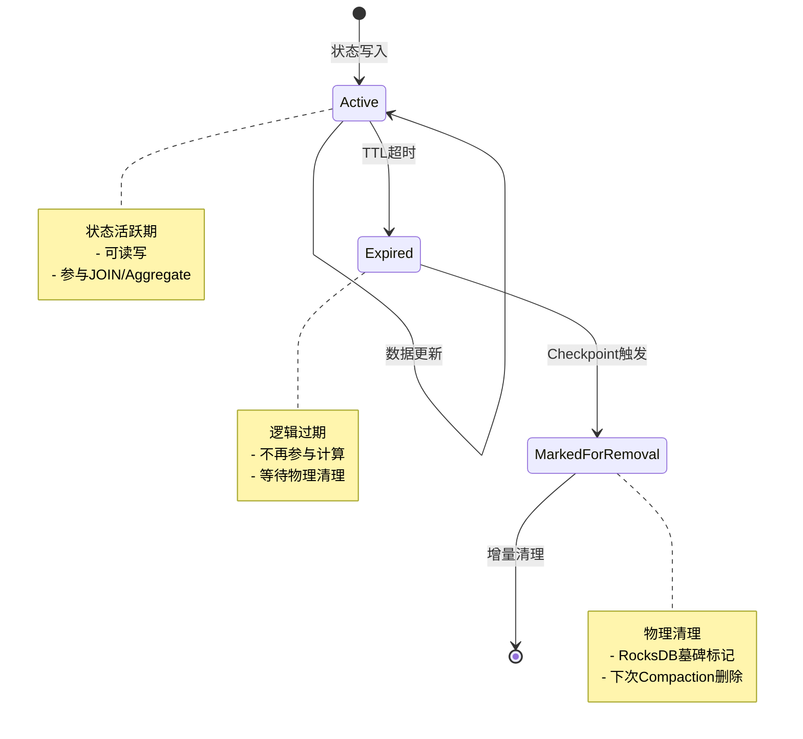
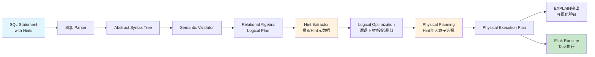
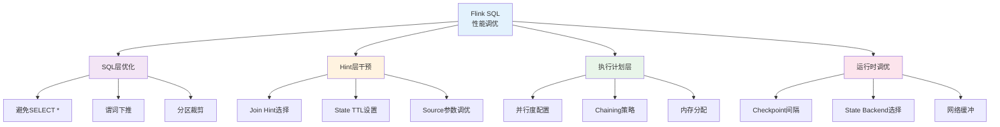

# Flink SQL Hints 查询优化与执行计划调优

> 所属阶段: Flink Stage 3 | 前置依赖: [Flink SQL 完整指南](./flink-table-sql-complete-guide.md), [流批一体统一](../../08-roadmap/08.01-flink-24/flink-25-stream-batch-unification.md) | 形式化等级: L3

## 1. 概念定义 (Definitions)

### Def-F-03-90: SQL Hint

**SQL Hint** 是一种嵌入在SQL语句中的元数据指令，用于向查询优化器提供显式的执行策略建议，覆盖默认的基于代价的优化决策。

形式化定义：

```
Hint ::= '/*+' hintContent '*/'
hintContent ::= hintName ['(' option [, option]* ')']
option ::= key '=' value | key
```

### Def-F-03-91: Flink SQL Hint 分类体系

Flink SQL Hints 按功能域划分为：

| 类别 | Hint前缀 | 作用范围 | Flink版本 |
|------|----------|----------|-----------|
| Join Hints | `BROADCAST_HASH`/`SHUFFLE_HASH`/`SHUFFLE_MERGE`/`NEST_LOOP` | JOIN子句 | 1.12+ |
| Lookup Hints | `LOOKUP` | 维表JOIN | 1.14+ |
| State Hints | `STATE_TTL` | 有状态算子 | 1.17+ |
| Source Hints | `OPTIONS` | 表扫描配置 | 1.12+ |
| Aggregation Hints | `MINIBATCH` | 聚合优化 | 1.12+ |

### Def-F-03-92: Join Hint 语义

**Def-F-03-92a**: `BROADCAST_HASH` - 将小表广播到所有并行实例，在内存中构建哈希表进行本地JOIN，消除网络Shuffle。

**Def-F-03-92b**: `SHUFFLE_HASH` - 对两表按JOIN键哈希分区，在每个分区内部构建哈希表进行JOIN。

**Def-F-03-92c**: `SHUFFLE_MERGE` - 对两表按JOIN键哈希分区，在每个分区内部进行排序归并JOIN。

**Def-F-03-92d**: `NEST_LOOP` - 笛卡尔积遍历方式，适用于一方数据量极小（通常<100条）的场景。

### Def-F-03-93: State Hint 语义

**STATE_TTL Hint** 用于显式声明状态保留时间：

```sql
SELECT /*+ STATE_TTL('t1'='1h', 't2'='30min') */ *
FROM t1 JOIN t2 ON t1.key = t2.key
```

其中TTL(Time-To-Live)定义了状态在最后一次更新后保留的时长，过期状态将被清理。

### Def-F-03-94: JSON函数族（Flink 2.2增强）

**Def-F-03-94a**: `JSON_PATH(json, path)` - 使用JSONPath表达式从JSON字符串中提取值。

**Def-F-03-94b**: `JSON_ARRAYAGG([DISTINCT] value [ORDER BY ...])` - 聚合函数，将多行聚合成JSON数组。

**Def-F-03-94c**: `JSON_OBJECTAGG(key, value)` - 聚合函数，将键值对聚合成JSON对象。

**Def-F-03-94d**: `JSON_EXISTS(json, path)` - 检查JSONPath路径是否存在。

### Def-F-03-95: 执行计划（Execution Plan）

**物理执行计划**是逻辑计划经过优化器转换后的可执行表示，形式化为有向无环图 $G = (V, E)$，其中：

- $V$ 表示算子集合（Source、Sink、Join、Aggregate等）
- $E$ 表示数据流边
- 每个算子 $v \in V$ 关联并行度 $p(v)$ 和资源配置 $r(v)$

## 2. 属性推导 (Properties)

### Lemma-F-03-70: Join Hint优先级

**Lemma-F-03-70a**: 当多个Join Hints冲突时，Flink采用**就近优先**原则，即最接近JOIN子句的Hint生效。

**Lemma-F-03-70b**: 若Hint指定的策略不可行（如Broadcast大表导致OOM），优化器将回退到代价模型选择，并记录警告日志。

### Lemma-F-03-71: State TTL与Checkpoint关系

给定状态TTL为 $T_{ttl}$，Checkpoint间隔为 $T_{cp}$：

- 实际状态清理发生在Checkpoint边界
- 有效状态保留时间范围：$[T_{ttl}, T_{ttl} + T_{cp})$
- 增量Checkpoint下，过期状态延迟清理不超过 $T_{cp}$

### Lemma-F-03-72: JSON函数性能特征

**Lemma-F-03-72a**: `JSON_PATH` 解析代价为 $O(n)$，其中 $n$ 为JSON字符串长度，单次查询可能触发多次解析。

**Lemma-F-03-72b**: `JSON_ARRAYAGG`/`JSON_OBJECTAGG` 需维护聚合缓冲区，内存复杂度为 $O(m)$，$m$ 为聚合组大小。

## 3. 关系建立 (Relations)

### 3.1 Hint与查询优化器的交互

Flink SQL优化器遵循**Volcano/Cascades**框架，Hints在以下阶段介入：

1. **SQL解析** → 识别并提取Hint元数据
2. **逻辑计划生成** → 将Hint附加到对应RelNode
3. **逻辑优化** → Hint参与规则匹配与代价计算
4. **物理计划生成** → Hint覆盖物理算子选择
5. **执行计划生成** → Hint转换为运行时配置

### 3.2 Join Hint与执行策略映射

| Join Hint | 物理算子 | 网络Shuffle | 内存要求 | 适用场景 |
|-----------|----------|-------------|----------|----------|
| BROADCAST_HASH | HashJoin (Broadcast) | 无 | 小表全量 | 大表JOIN小表 |
| SHUFFLE_HASH | HashJoin (Shuffle) | 双边 | 分区数据量 | 等值JOIN，数据分布均匀 |
| SHUFFLE_MERGE | SortMergeJoin | 双边 | 低 | 有序数据，非等值JOIN |
| NEST_LOOP | NestedLoopJoin | 可能 | 极低 | 极小表JOIN |

### 3.3 与Apache Calcite的关系

Flink SQL基于Apache Calcite实现：

- **解析层**: Calcite SQL Parser + Flink扩展
- **验证层**: Calcite Validator + FlinkCatalog
- **优化层**: Calcite优化规则 + Flink定制规则（含Hint处理）
- **执行层**: Flink Table API → DataStream API

## 4. 论证过程 (Argumentation)

### 4.1 Join Hint选择决策树

**场景分析**: 流JOIN vs 批JOIN

**流处理场景**（无界数据）：

- 维表JOIN → 首选 `LOOKUP('RETRY'='FIXED_DELAY')`
- 双流JOIN → 首选 `SHUFFLE_HASH`（状态可控）
- 避免 `BROADCAST_HASH`（维表变化需全量重广播）

**批处理场景**（有界数据）：

- 大表JOIN小表 → `BROADCAST_HASH`
- 等值JOIN且数据倾斜 → `SHUFFLE_HASH` + 自动倾斜优化
- 范围JOIN或复杂条件 → `SHUFFLE_MERGE`

### 4.2 State Hint的副作用边界

**风险案例**: 过短TTL导致数据不一致

```sql
-- 问题案例：TTL < 业务时间窗口
SELECT /*+ STATE_TTL('orders'='5min', 'shipments'='5min') */ *
FROM orders JOIN shipments
ON orders.id = shipments.order_id
WHERE orders.event_time BETWEEN shipments.event_time - INTERVAL '10' MINUTE
  AND shipments.event_time
```

**分析**: 若订单与发货事件间隔超过5分钟，状态已清理导致JOIN失败。

### 4.3 JSON函数性能瓶颈

**反模式**: JSON字段在WHERE条件中使用

```sql
-- 低效：每行都解析JSON
SELECT * FROM events
WHERE JSON_VALUE(payload, '$.status') = 'completed'

-- 高效：预提取到结构化字段
SELECT * FROM events
WHERE status = 'completed'  -- 使用预计算字段或投影下推
```

## 5. 形式证明 / 工程论证 (Proof / Engineering Argument)

### Thm-F-03-70: Broadcast Join可行性条件

**定理**: 对于JOIN操作 $R \bowtie_{\theta} S$，Broadcast Hash Join可行的充要条件：

$$|S| \times \text{rowSize}(S) \leq M_{tm} \times \alpha$$

其中：

- $|S|$：小表记录数
- $\text{rowSize}(S)$：单条记录序列化大小
- $M_{tm}$：TaskManager可用内存
- $\alpha$：安全系数（通常取0.3~0.5，预留GC和状态空间）

**工程证明**:

1. **内存需求分析**: Hash表负载因子通常0.75，需约 $1.33 \times$ 原始数据空间
2. **序列化开销**: Flink序列化增加约10-20%额外元数据
3. **并发安全**: 广播数据为只读，无锁访问，内存共享
4. **实践阈值**: 经验值建议广播表<10MB（序列化后），超过需SHUFFLE_HASH

### Thm-F-03-71: State TTL与结果正确性

**定理**: 对于时间窗口JOIN，设置TTL $\geq$ 最大事件时间差可保证结果完整性。

**形式化**: 设事件流 $A$, $B$，时间属性分别为 $t_A$, $t_B$，若JOIN条件包含时间约束 $|t_A - t_B| \leq \Delta t$，则：

$$TTL \geq \Delta t + T_{max\_delay}$$

其中 $T_{max\_delay}$ 为最大乱序延迟（Watermark策略相关）。

**证明要点**:

- 状态存储时间覆盖事件可能匹配的时间窗口
- 考虑乱序数据，Watermark延迟需叠加
- 增量清理保证最终一致性，但可能延迟输出

### Thm-F-03-72: JSON聚合函数内存上界

**定理**: `JSON_ARRAYAGG`在GROUP BY查询中的内存消耗上界为：

$$M_{json} \leq \sum_{g \in G} \left( O(1) + \sum_{r \in g} |\text{serialize}(r)| \right)$$

其中 $G$ 为分组集合，每个分组维护独立的JSON构建缓冲区。

**工程论证**:

- 无界流需配合窗口或Emit策略防止OOM
- 批处理场景受限于分组基数，可通过两阶段聚合优化
- Flink 2.2引入JSON序列化流式写入，降低峰值内存

## 6. 实例验证 (Examples)

### 6.1 Join Hints实战

#### 示例1: Broadcast Hash Join

```sql
-- 大表订单JOIN小表用户
SELECT /*+ BROADCAST_HASH(u) */
    o.order_id, o.amount, u.user_name, u.region
FROM orders o
JOIN users u ON o.user_id = u.user_id
```

**适用条件**: users表<100万条，单条<100字节

#### 示例2: Lookup Join with Retry

```sql
-- 维表JOIN，网络抖动容错
SELECT /*+ LOOKUP('RETRY'='FIXED_DELAY',
                   'FIXED_DELAY'='100ms',
                   'MAX_RETRY'='3') */
    o.*, d.department_name
FROM orders o
LEFT JOIN departments FOR SYSTEM_TIME AS OF o.proc_time AS d
ON o.dept_id = d.dept_id
```

#### 示例3: Multi-Way Join Hints

```sql
-- 多表JOIN，每个JOIN独立指定策略
SELECT /*+ BROADCAST_HASH(c), SHUFFLE_HASH(o) */
    c.city, p.product_name, SUM(o.amount) as total
FROM customers c
JOIN orders o ON c.customer_id = o.customer_id
JOIN products p ON o.product_id = p.product_id
GROUP BY c.city, p.product_name
```

### 6.2 State Hints配置

#### 示例: 双流JOIN状态管理

```sql
-- 订单流JOIN支付流，状态保留24小时
SELECT /*+ STATE_TTL('o'='24h', 'p'='24h') */
    o.order_id, o.order_time, p.pay_time, p.amount
FROM orders o
JOIN payments p ON o.order_id = p.order_id
AND p.pay_time BETWEEN o.order_time - INTERVAL '5' MINUTE
                  AND o.order_time + INTERVAL '1' HOUR
```

#### 示例: 增量Checkpoint配置

```sql
SET 'state.backend.incremental' = 'true';
SET 'state.backend.incremental.checkpoint-storage' = 'rocksdb';
SET 'execution.checkpointing.interval' = '30s';

-- 配合TTL使用
SELECT /*+ STATE_TTL('s1'='1h', 's2'='2h') */ *
FROM stream1 s1 JOIN stream2 s2 ON s1.key = s2.key
```

### 6.3 JSON函数应用（Flink 2.2）

#### 示例1: JSON_PATH提取

```sql
-- 从事件日志提取嵌套字段
SELECT
    event_id,
    JSON_PATH(payload, '$.user.id') as user_id,
    JSON_PATH(payload, '$.user.profile.name') as user_name,
    JSON_PATH(payload, '$.metadata.tags[0]') as first_tag
FROM user_events
WHERE JSON_EXISTS(payload, '$.user.id')
```

#### 示例2: JSON聚合

```sql
-- 按用户聚合订单为JSON数组
SELECT
    user_id,
    JSON_ARRAYAGG(
        JSON_OBJECT(
            'order_id' VALUE order_id,
            'amount' VALUE amount,
            'items' VALUE JSON_ARRAYAGG(
                JSON_OBJECT('sku' VALUE sku, 'qty' VALUE quantity)
            )
        ) ORDER BY order_time DESC
    ) as order_history
FROM orders
GROUP BY user_id
```

#### 示例3: 与Table API结合

```java
// Table API中使用JSON函数
tableEnv.createTemporaryFunction("ExtractJson", JsonPathFunction.class);

Table result = tableEnv.sqlQuery(
    "SELECT ExtractJson(log_data, '$.error.code') as error_code, COUNT(*) " +
    "FROM application_logs " +
    "GROUP BY ExtractJson(log_data, '$.error.code')"
);
```

### 6.4 执行计划分析

#### EXPLAIN语句详解

```sql
-- 基础执行计划
EXPLAIN PLAN FOR
SELECT /*+ BROADCAST_HASH(c) */ *
FROM orders o JOIN customers c ON o.cust_id = c.id;

-- 详细执行计划（含优化器决策）
EXPLAIN ESTIMATED_COST, CHANGELOG_MODE, EXECUTION_PLAN, JSON_EXECUTION_PLAN
SELECT /*+ SHUFFLE_HASH(o) */ *
FROM orders o JOIN shipments s ON o.id = s.order_id;
```

#### 输出解析示例

```
== Abstract Syntax Tree ==
LogicalProject(...)
+- LogicalJoin(condition=[=($0, $2)], joinType=[inner])
   :- LogicalTableScan(table=[[default_catalog, default_database, orders]])
   +- LogicalTableScan(table=[[default_catalog, default_database, customers]])

== Optimized Physical Plan ==
HashJoin(joinType=[InnerJoin], where=[=(cust_id, id)], select=[...], isBroadcast=[true])
:- TableSourceScan(table=[[orders]], fields=[order_id, cust_id, amount])
+- Exchange(distribution=[broadcast])
   +- TableSourceScan(table=[[customers]], fields=[id, name, region])

== Optimized Execution Plan ==
Calc(select=[order_id, cust_id, amount, name, region])
+- HashJoin(joinType=[InnerJoin], where=[=(cust_id, id)])
   :- LegacyTableSourceScan(table=[orders], fields=[order_id, cust_id, amount])
   +- BroadcastExchange
      +- LegacyTableSourceScan(table=[customers], fields=[id, name, region])
```

## 7. 可视化 (Visualizations)

### 7.1 SQL Hint决策流程图

Hint决策流程：根据表大小、数据分布和业务场景选择合适的Join策略。



### 7.2 Join Hint执行架构对比

不同Join策略的执行架构差异：Broadcast、Shuffle Hash和Shuffle Merge各有不同的数据传输和计算模式。



### 7.3 状态管理Hints交互图

State TTL与Checkpoint机制协同工作，确保状态一致性清理。



### 7.4 执行计划优化流程

从SQL到物理执行计划的完整优化链路。



### 7.5 性能调优层次图

Flink SQL性能调优的多层次策略。



## 8. 引用参考 (References)
