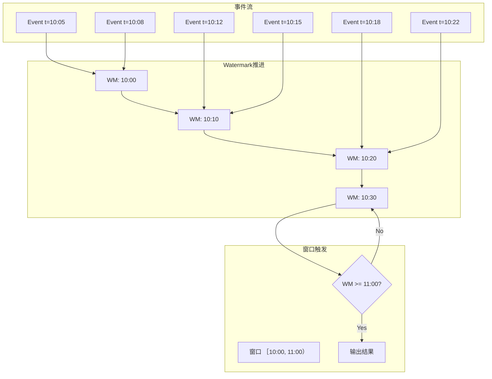
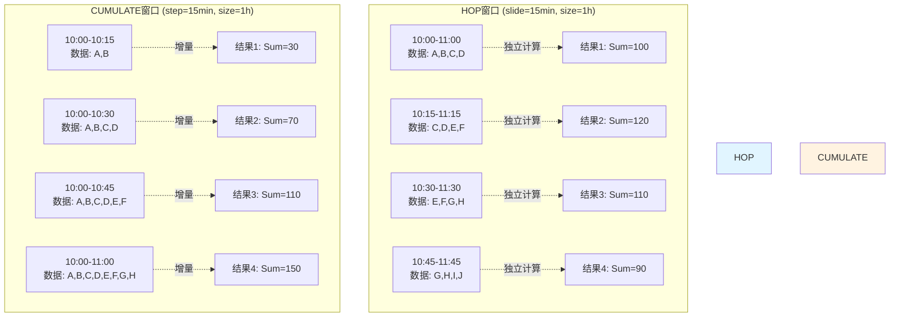
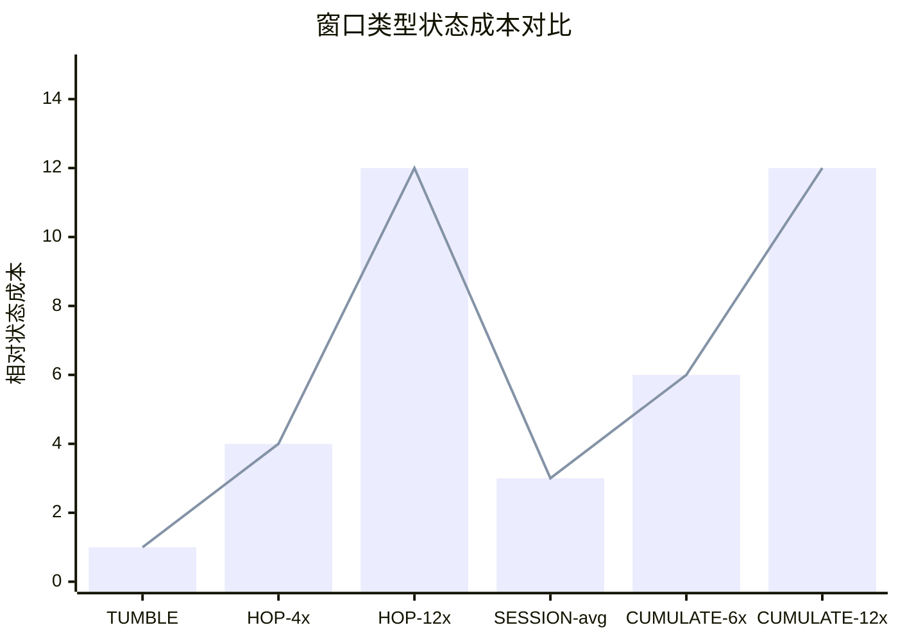
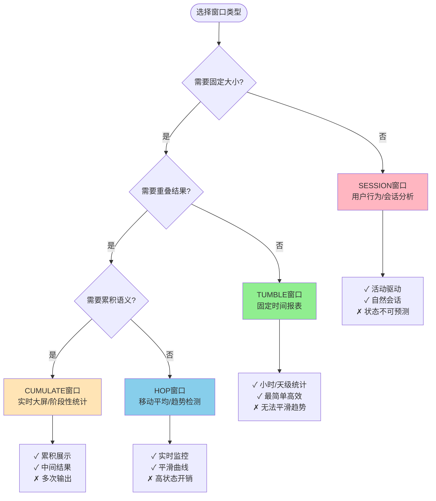

# Flink SQL 窗口函数深度指南

> **所属阶段**: Flink | **前置依赖**: [Flink SQL Calcite优化器深度解析](./flink-sql-calcite-optimizer-deep-dive.md), [Process Table Functions](./flink-process-table-functions.md) | **形式化等级**: L5

---

## 1. 概念定义 (Definitions)

### Def-F-03-50: 窗口TVF (Table-Valued Function)

**定义**: 窗口TVF是Flink SQL中用于**时间维度分组**的表值函数，将流数据按时间边界切分为有限集合进行聚合计算。

形式化表述：
$$
\text{WindowTVF}: \mathcal{S} \times \mathcal{W} \rightarrow \mathcal{T}
$$

其中：

- $\mathcal{S}$: 输入流（无限序列）
- $\mathcal{W}$: 窗口规范（Window Specification）
- $\mathcal{T}$: 输出表（有限分组结果）

窗口TVF的核心特性：

```
┌─────────────────────────────────────────────────────────────────┐
│                      窗口TVF 核心模型                            │
├─────────────────────────────────────────────────────────────────┤
│                                                                 │
│   Event Stream (Infinite)                                       │
│   ──────────────────────────►                                   │
│   t₁  t₂  t₃  t₄  t₅  t₆  t₇  t₈  t₉  t₁₀ ...                   │
│                                                                 │
│        ┌─────────┐  ┌─────────┐  ┌─────────┐                    │
│        │ Window₁ │  │ Window₂ │  │ Window₃ │ ...                │
│        │[t₁-t₄]  │  │[t₅-t₈]  │  │[t₉-t₁₂]│                     │
│        └────┬────┘  └────┬────┘  └────┬────┘                    │
│             │            │            │                         │
│             ▼            ▼            ▼                         │
│        ┌─────────┐  ┌─────────┐  ┌─────────┐                    │
│        │ 聚合结果 │  │ 聚合结果 │  │ 聚合结果 │                   │
│        │  Table  │  │  Table  │  │  Table  │                    │
│        └─────────┘  └─────────┘  └─────────┘                    │
│                                                                 │
│   关键洞察: 无限流 → 有限窗口 → 可计算结果                         │
└─────────────────────────────────────────────────────────────────┘
```

### Def-F-03-51: 窗口与流处理的关系

**定义**: 窗口是**流处理与批处理之间的桥梁**，通过时间边界将无限流转化为可处理的有限批次。

$$
\text{Stream Processing} = \lim_{|\mathcal{W}| \to 0} \sum_{w \in \mathcal{W}} \text{BatchProcess}(w)
$$

| 维度 | 批处理 | 流处理 (无窗口) | 流处理 (有窗口) |
|------|--------|----------------|----------------|
| **数据边界** | 明确（文件/表） | 无边界 | 时间边界 |
| **计算触发** | 查询到达 | 逐事件 | 窗口触发 |
| **结果延迟** | 高 | 极低 | 可调 |
| **状态需求** | 无 | 无限增长 | 窗口级 |
| **语义保证** | 精确 | 需特殊处理 | 精确（窗口内）|

### Def-F-03-52: 四种窗口类型对比

| 窗口类型 | SQL语法 | 核心参数 | 输出特性 | 状态成本 |
|---------|---------|---------|---------|---------|
| **TUMBLE** | `TUMBLE(TABLE t, DESCRIPTOR(ts), INTERVAL '1' HOUR)` | size | 不重叠、等大小 | $O(1)$ |
| **HOP** | `HOP(TABLE t, DESCRIPTOR(ts), INTERVAL '5' MINUTE, INTERVAL '1' HOUR)` | slide, size | 可能重叠 | $O(size/slide)$ |
| **SESSION** | `SESSION(TABLE t, DESCRIPTOR(ts), INTERVAL '10' MINUTE)` | gap | 动态大小、不重叠 | $O(active\_sessions)$ |
| **CUMULATE** | `CUMULATE(TABLE t, DESCRIPTOR(ts), INTERVAL '10' MINUTE, INTERVAL '1' HOUR)` | step, size | 累积扩展 | $O(size/step)$ |

### Def-F-03-53: TUMBLE窗口（滚动窗口）

**定义**: TUMBLE窗口将时间轴划分为**固定大小、不重叠、连续**的时间区间。

形式化：
$$
\text{TUMBLE}(t, \delta) = \{ [k\delta, (k+1)\delta) \mid k \in \mathbb{Z}, t \in [k\delta, (k+1)\delta) \}
$$

其中：

- $t$: 事件时间戳
- $\delta$: 窗口大小（size）
- $k$: 窗口索引（$k = \lfloor t/\delta \rfloor$）

窗口归属判定：
$$
\text{window\_index}(t) = \left\lfloor \frac{t - \text{offset}}{\delta} \right\rfloor
$$

### Def-F-03-54: HOP窗口（滑动窗口）

**定义**: HOP窗口以固定**滑动间隔**生成可能重叠的固定大小窗口。

形式化：
$$
\text{HOP}(t, \delta, \sigma) = \{ [k\sigma, k\sigma + \delta) \mid k \in \mathbb{Z}, t \in [k\sigma, k\sigma + \delta) \}
$$

其中：

- $\delta$: 窗口大小（size）
- $\sigma$: 滑动间隔（slide），$0 < \sigma \leq \delta$
- 窗口重叠数：$\lceil \delta/\sigma \rceil$

**特殊情形**：当 $\sigma = \delta$ 时，HOP退化为TUMBLE。

### Def-F-03-55: SESSION窗口（会话窗口）

**定义**: SESSION窗口根据**活动间隙**动态合并连续事件，形成可变大小的会话区间。

形式化：
$$
\text{SESSION}(E, \gamma) = \{ [s_i, e_i) \mid e_i - s_{i+1} > \gamma \Rightarrow \text{新窗口} \}
$$

其中：

- $E = \{e_1, e_2, ..., e_n\}$: 按时间排序的事件序列
- $\gamma$: 会话间隙（gap）
- 合并规则：若 $t_{i+1} - t_i \leq \gamma$，则属于同一会话

**动态特性**: SESSION窗口大小和数量**完全由数据驱动**，无法预先计算。

### Def-F-03-56: CUMULATE窗口（累积窗口）

**定义**: CUMULATE窗口在固定大小的基础上，按**步长**逐步累积，输出多个阶段的中间结果。

形式化：
$$
\text{CUMULATE}(t, \delta, \tau) = \{ [k\delta, k\delta + m\tau) \mid m = 1, 2, ..., \delta/\tau \}
$$

其中：

- $\delta$: 窗口最大大小（size）
- $\tau$: 累积步长（step），$\tau$ 必须整除 $\delta$
- 每周期输出数：$\delta/\tau$

**核心区别**：

- HOP窗口：每次滑动产生**独立**的完整窗口结果
- CUMULATE窗口：同一周期内结果是**累积**的，后续包含前面所有数据

### Def-F-03-57: 窗口时间属性

Flink窗口TVF输出包含三个标准时间列：

| 列名 | 类型 | 语义 | 示例值 |
|------|------|------|--------|
| `window_start` | TIMESTAMP | 窗口包含起始时间（含） | `2024-01-15 10:00:00` |
| `window_end` | TIMESTAMP | 窗口结束时间（不含） | `2024-01-15 11:00:00` |
| `window_time` | TIMESTAMP_LTZ | 窗口结束时间（带时区） | `2024-01-15 11:00:00+08:00` |

**重要**: 窗口区间为**左闭右开** $[start, end)$。

---

## 2. 属性推导 (Properties)

### Prop-F-03-03: TUMBLE窗口状态边界

**命题**: TUMBLE窗口的每个键状态需求为 $O(1)$，与窗口大小无关。

**证明**:

- TUMBLE窗口不重叠，每个事件仅属于一个窗口
- 聚合状态可增量维护（如SUM、COUNT）
- 窗口触发后状态即可清理
- 因此每个键同时维护的窗口数 $\leq 1$ ∎

### Prop-F-03-04: HOP窗口状态膨胀

**命题**: HOP窗口的状态需求与窗口大小和滑动间隔的比值成正比。

**证明**:

- 单个事件同时属于 $\lceil \delta/\sigma \rceil$ 个重叠窗口
- 每个活跃窗口需要独立的聚合状态
- 设事件到达率为 $\lambda$，则同时活跃窗口数：

$$
N_{active} = \left\lceil \frac{\delta}{\sigma} \right\rceil \times \text{key\_cardinality}
$$

- 因此状态复杂度为 $O(\delta/\sigma)$ ∎

### Prop-F-03-05: SESSION窗口状态不确定性

**命题**: SESSION窗口的状态需求**无法预先确定**，取决于数据分布。

**分析**:

- 最坏情况：事件间隔均小于gap，所有事件合并为单一会话
  - 状态需求：$O(N)$（N为事件总数）
- 最好情况：事件间隔均大于gap，每个事件独立成窗
  - 状态需求：$O(active\_sessions)$
- 实际状态需求：$O(\frac{T_{max}}{\gamma} \times \text{key\_cardinality})$，其中 $T_{max}$ 为数据时间跨度

### Prop-F-03-06: 延迟数据保证

**命题**: 在允许延迟 $\eta$ 的语义下，窗口结果的正确性满足：

$$
\forall e \in \mathcal{S}, \text{ if } t_e \leq W(t) + \eta \Rightarrow e \text{ 被计入窗口}
$$

其中 $W(t)$ 为窗口结束时间，$\eta$ 为 `allowedLateness` 配置。

**推论**:

- 延迟数据导致**窗口重触发**（retraction + new result）
- 延迟超过 $\eta$ 的数据被丢弃或路由至侧输出

### Prop-F-03-07: CUMULATE窗口计算效率

**命题**: CUMULATE窗口可通过**增量计算**优化，避免重复扫描全量数据。

**优化策略**:

- 维护累积聚合状态（如累积SUM、COUNT）
- 每个步长仅需处理增量数据
- 计算复杂度从 $O(N \times \delta/\tau)$ 降至 $O(N)$

---

## 3. 关系建立 (Relations)

### Def-F-03-58: 窗口与DataStream API关系

Flink SQL窗口TVF与底层DataStream API的映射关系：

| SQL TVF | DataStream API | 状态算子 |
|---------|---------------|---------|
| `TUMBLE` | `TumblingEventTimeWindows` | `WindowOperator` + `AggregatingState` |
| `HOP` | `SlidingEventTimeWindows` | `WindowOperator` + `ListState`（多窗口） |
| `SESSION` | `EventTimeSessionWindows` | `WindowOperator` + `MergingWindowSet` |
| `CUMULATE` | `CumulativeWindowAssigner` | `WindowOperator` + `ReducingState` |

```
SQL层:     SELECT window_start, window_end, COUNT(*) FROM TUMBLE(...)
              ↓
Table API:   table.window(Tumble.over(...).on(...).as("w"))
              ↓
DataStream:  stream.keyBy(...).window(TumblingEventTimeWindows.of(...))
              ↓
Runtime:     WindowOperator + StateBackend (RocksDB/Heap)
```

### Def-F-03-59: 窗口与Watermark关系

**定义**: 窗口触发决策依赖Watermark推进，形成**时间推进→窗口触发→结果输出**的因果链。

$$
\text{Trigger}(w) = \mathbb{1}_{[W(t) \geq window\_end(w)]}
$$

Watermark与窗口的交互：

```
Watermark(t) ────────► 窗口1 [0, 10) 触发?
      │                      │
      │                      ▼
      │              t >= 10 ? ──Yes──► 输出结果
      │                      │
      ▼                      No
 窗口2 [10, 20)              (等待)
```

**关键配置**:

- `watermark-interval`: 控制Watermark生成频率
- `idleness-timeout`: 处理空闲分区Watermark停滞

### Def-F-03-60: 窗口与Changelog语义

Flink SQL窗口操作在流上产生**Changelog流**：

| 操作类型 | Changelog类型 | 语义 |
|---------|--------------|------|
| 窗口聚合（无延迟） | `+I` (INSERT) | 窗口触发时产生最终结果 |
| 窗口聚合（有延迟） | `+I`, `-D`, `+I` | 先输出，延迟数据到达后撤回重发 |
| 窗口Join | `+I` | 两个流窗口匹配时产生结果 |
| 窗口TopN | `+I`, `-D`, `+I` | 排名变化时产生撤回更新 |

---

## 4. 论证过程 (Argumentation)

### 窗口类型选择决策树

**场景1: 固定时间报表**

- 需求：每小时统计订单量
- 选择：**TUMBLE窗口**
- 理由：等大小、不重叠、语义清晰

**场景2: 实时监控趋势**

- 需求：最近5分钟的平均温度（每分钟更新）
- 选择：**HOP窗口** (slide=1min, size=5min)
- 理由：平滑曲线、快速响应

**场景3: 用户行为会话**

- 需求：统计用户每次访问的页面浏览数
- 选择：**SESSION窗口** (gap=30min)
- 理由：活动驱动、自然会话边界

**场景4: 阶段性大屏展示**

- 需求：实时展示今日累计销售额（每10分钟更新一次）
- 选择：**CUMULATE窗口** (step=10min, size=1day)
- 理由：累积语义、中间结果可见

### 窗口类型对比矩阵

| 评估维度 | TUMBLE | HOP | SESSION | CUMULATE |
|---------|--------|-----|---------|---------|
| **计算复杂度** | ⭐⭐⭐⭐⭐ | ⭐⭐⭐ | ⭐⭐ | ⭐⭐⭐⭐ |
| **状态开销** | ⭐⭐⭐⭐⭐ | ⭐⭐ | ⭐⭐ | ⭐⭐⭐ |
| **结果平滑度** | ⭐⭐ | ⭐⭐⭐⭐⭐ | ⭐⭐⭐ | ⭐⭐⭐ |
| **语义清晰度** | ⭐⭐⭐⭐⭐ | ⭐⭐⭐ | ⭐⭐⭐ | ⭐⭐⭐⭐ |
| **适用广度** | ⭐⭐⭐⭐ | ⭐⭐⭐⭐ | ⭐⭐⭐ | ⭐⭐⭐ |

---

## 5. 工程论证 (Performance Engineering)

### 状态优化策略

**策略1: 增量聚合 (Incremental Aggregation)**

```sql
-- 优化前:存储完整数据
SELECT user_id, window_start, window_end,
       SUM(amount), AVG(amount), MAX(amount)
FROM TABLE(TUMBLE(TABLE orders, DESCRIPTOR(order_time), INTERVAL '1' HOUR))
GROUP BY user_id, window_start, window_end;

-- 优化后:仅存储中间状态
-- Flink自动优化为:
-- ValueState<SumAccumulator, AvgAccumulator, MaxAccumulator>
```

**策略2: 状态TTL配置**

```sql
SET 'state.retention.time' = '2h';
-- 或使用表级配置
CREATE TABLE orders (
    -- ...
) WITH (
    'state.retention.time' = '2h'
);
```

**策略3: 两阶段聚合**

对于高基数分组，启用Local-Global聚合：

```sql
SET 'table.optimizer.agg-phase-strategy' = 'TWO_PHASE';
-- 或自动识别
SET 'table.optimizer.agg-phase-strategy' = 'AUTO';
```

### 水位线调优

**Watermark配置参数**:

| 参数 | 默认值 | 建议值 | 影响 |
|------|--------|--------|------|
| `watermark.interval` | 200ms | 100-1000ms | 触发频率 vs 开销 |
| `pipeline.auto-watermark-interval` | 0 (即时) | - | 空闲检测间隔 |
| `table.exec.source.idle-timeout` | 0 (禁用) | 60s | 空闲分区处理 |

**延迟数据策略选择**:

```
延迟数据策略决策树:
                    ┌─────────────────┐
                    │  是否允许延迟?   │
                    └────────┬────────┘
                             │
              ┌──────────────┼──────────────┐
              No             │              Yes
              │              │               │
              ▼              │               ▼
    ┌─────────────────┐      │    ┌──────────────────────┐
    │ 无延迟窗口      │      │    │ 是否需延迟侧输出?    │
    │ 延迟数据丢弃    │      │    └───────────┬──────────┘
    │ 简单、高效     │      │                │
    └─────────────────┘      │     ┌─────────┴────────┐
                             │    No                Yes
                             │     │                  │
                             │     ▼                  ▼
                             │ ┌──────────┐   ┌──────────────────┐
                             │ │ allowed  │   │ allowedLateness  │
                             │ │ Lateness │   │ + late-data      │
                             └─│ (无侧输出)│   │   side-output    │
                               └──────────┘   └──────────────────┘
```

### 性能监控指标

| 指标 | 描述 | 告警阈值 |
|------|------|---------|
| `numLateRecordsDropped` | 丢弃的延迟记录数 | > 0（需关注） |
| `currentOutputWatermark` | 当前输出Watermark | 滞后超过5分钟 |
| `windowStateBytes` | 窗口状态大小 | 持续增长 |
| `windowProcessingTimeMs` | 窗口处理耗时 | P99 > 窗口大小 |

---

## 6. 实例验证 (Examples)

### 实例1: 电商实时分析 - TUMBLE窗口

**场景**: 每小时统计各品类销售额

```sql
-- 创建订单表
CREATE TABLE orders (
    order_id        STRING,
    category        STRING,
    amount          DECIMAL(10, 2),
    order_time      TIMESTAMP(3),
    WATERMARK FOR order_time AS order_time - INTERVAL '5' SECOND
) WITH (
    'connector' = 'kafka',
    'topic' = 'orders',
    'properties.bootstrap.servers' = 'kafka:9092',
    'format' = 'json'
);

-- TUMBLE窗口聚合:小时级销售报表
SELECT
    category,
    window_start,
    window_end,
    COUNT(*) AS order_count,
    SUM(amount) AS total_amount,
    AVG(amount) AS avg_amount,
    MAX(amount) AS max_amount
FROM TABLE(
    TUMBLE(TABLE orders, DESCRIPTOR(order_time), INTERVAL '1' HOUR)
)
GROUP BY category, window_start, window_end;

-- 输出示例:
-- category | window_start        | window_end          | order_count | total_amount | avg_amount | max_amount
-- electronics| 2024-01-15 10:00:00 | 2024-01-15 11:00:00 | 1250        | 125000.00    | 100.00     | 5000.00
-- clothing   | 2024-01-15 10:00:00 | 2024-01-15 11:00:00 | 890         | 44500.00     | 50.00      | 800.00
```

### 实例2: 移动平均监控 - HOP窗口

**场景**: 实时监控网站响应时间（5分钟滑动平均，每分钟更新）

```sql
CREATE TABLE access_logs (
    url             STRING,
    response_time   INT,
    access_time     TIMESTAMP(3),
    WATERMARK FOR access_time AS access_time - INTERVAL '10' SECOND
) WITH (
    'connector' = 'kafka',
    'topic' = 'access_logs',
    'format' = 'json'
);

-- HOP窗口:移动平均响应时间
SELECT
    url,
    window_start,
    window_end,
    AVG(response_time) AS avg_response_time,
    PERCENTILE_CONT(0.95) WITHIN GROUP (ORDER BY response_time) AS p95_latency,
    PERCENTILE_CONT(0.99) WITHIN GROUP (ORDER BY response_time) AS p99_latency
FROM TABLE(
    HOP(TABLE access_logs, DESCRIPTOR(access_time), INTERVAL '1' MINUTE, INTERVAL '5' MINUTE)
)
GROUP BY url, window_start, window_end;

-- 关键洞察:
-- - 每个事件同时贡献给5个窗口
-- - 状态开销是TUMBLE的5倍
-- - 结果平滑,适合趋势监控
```

### 实例3: 用户会话分析 - SESSION窗口

**场景**: 分析用户每次访问的行为序列

```sql
CREATE TABLE user_events (
    user_id         STRING,
    event_type      STRING,
    page_url        STRING,
    event_time      TIMESTAMP(3),
    WATERMARK FOR event_time AS event_time - INTERVAL '30' SECOND
) WITH (
    'connector' = 'kafka',
    'topic' = 'user_events',
    'format' = 'json'
);

-- SESSION窗口:用户会话统计
SELECT
    user_id,
    SESSION_START(event_time, INTERVAL '10' MINUTE) AS session_start,
    SESSION_END(event_time, INTERVAL '10' MINUTE) AS session_end,
    SESSION_ROWTIME(event_time, INTERVAL '10' MINUTE) AS session_rowtime,
    COUNT(*) AS event_count,
    COUNT(DISTINCT page_url) AS unique_pages,
    COLLECT(DISTINCT event_type) AS event_types
FROM TABLE(
    SESSION(TABLE user_events PARTITION BY user_id, DESCRIPTOR(event_time), INTERVAL '10' MINUTE)
)
GROUP BY user_id, SESSION(event_time, INTERVAL '10' MINUTE);

-- 输出示例:
-- user_id | session_start       | session_end         | event_count | unique_pages | event_types
-- user_001 | 2024-01-15 10:05:00 | 2024-01-15 10:23:00 | 15          | 5            | [click, view, add_cart]
-- user_001 | 2024-01-15 14:30:00 | 2024-01-15 14:45:00 | 8           | 3            | [click, view]
-- 说明: 用户_001有两个独立会话(间隔>10分钟)
```

### 实例4: 实时大屏 - CUMULATE窗口

**场景**: 实时展示今日累计销售额（每10分钟更新）

```sql
CREATE TABLE sales (
    order_id        STRING,
    amount          DECIMAL(10, 2),
    order_time      TIMESTAMP(3),
    WATERMARK FOR order_time AS order_time - INTERVAL '5' SECOND
) WITH (
    'connector' = 'kafka',
    'topic' = 'sales',
    'format' = 'json'
);

-- CUMULATE窗口:累积统计
SELECT
    window_start,
    window_end,
    SUM(amount) AS cumulative_sales,
    COUNT(*) AS order_count,
    SUM(amount) / COUNT(*) AS avg_order_value
FROM TABLE(
    CUMULATE(TABLE sales, DESCRIPTOR(order_time), INTERVAL '10' MINUTE, INTERVAL '1' DAY)
)
GROUP BY window_start, window_end;

-- 输出示例(假设当前为11:00):
-- window_start        | window_end          | cumulative_sales | order_count | avg_order_value
-- 2024-01-15 00:00:00 | 2024-01-15 00:10:00 | 15000.00         | 150         | 100.00
-- 2024-01-15 00:00:00 | 2024-01-15 00:20:00 | 32000.00         | 320         | 100.00
-- 2024-01-15 00:00:00 | 2024-01-15 00:30:00 | 48000.00         | 480         | 100.00
-- ...
-- 2024-01-15 00:00:00 | 2024-01-15 11:00:00 | 1250000.00       | 12500       | 100.00  ← 当前累计

-- 与HOP的区别:
-- CUMULATE: [00:00, 00:10), [00:00, 00:20), [00:00, 00:30)... (累积)
-- HOP:      [00:00, 00:10), [00:10, 00:20), [00:20, 00:30)... (独立)
```

### 实例5: 窗口Join - 流-流关联

**场景**: 关联订单与支付事件（5分钟窗口容忍）

```sql
CREATE TABLE orders (
    order_id        STRING,
    user_id         STRING,
    amount          DECIMAL(10, 2),
    order_time      TIMESTAMP(3),
    WATERMARK FOR order_time AS order_time - INTERVAL '5' SECOND,
    PRIMARY KEY (order_id) NOT ENFORCED
) WITH ('connector' = 'kafka', 'topic' = 'orders', 'format' = 'json');

CREATE TABLE payments (
    payment_id      STRING,
    order_id        STRING,
    payment_status  STRING,
    pay_time        TIMESTAMP(3),
    WATERMARK FOR pay_time AS pay_time - INTERVAL '5' SECOND,
    PRIMARY KEY (payment_id) NOT ENFORCED
) WITH ('connector' = 'kafka', 'topic' = 'payments', 'format' = 'json');

-- 窗口Join:关联同窗口内的订单和支付
SELECT
    o.order_id,
    o.user_id,
    o.amount,
    p.payment_status,
    p.pay_time,
    o.order_time
FROM orders o
JOIN payments p
    ON o.order_id = p.order_id
    AND o.order_time BETWEEN p.pay_time - INTERVAL '5' MINUTE AND p.pay_time + INTERVAL '5' MINUTE;

-- 或使用显式窗口Join:
SELECT
    o.order_id,
    o.amount,
    p.payment_status,
    TUMBLE_START(o.order_time, INTERVAL '5' MINUTE) AS window_start
FROM (
    SELECT * FROM TABLE(TUMBLE(TABLE orders, DESCRIPTOR(order_time), INTERVAL '5' MINUTE))
) o
JOIN (
    SELECT * FROM TABLE(TUMBLE(TABLE payments, DESCRIPTOR(pay_time), INTERVAL '5' MINUTE))
) p
ON o.order_id = p.order_id AND o.window_start = p.window_start AND o.window_end = p.window_end;
```

### 实例6: 窗口TopN - 实时排行榜

**场景**: 每小时销量Top10商品

```sql
CREATE TABLE product_sales (
    product_id      STRING,
    product_name    STRING,
    category        STRING,
    quantity        INT,
    sale_time       TIMESTAMP(3),
    WATERMARK FOR sale_time AS sale_time - INTERVAL '5' SECOND
) WITH ('connector' = 'kafka', 'topic' = 'product_sales', 'format' = 'json');

-- 窗口TopN:每小时品类Top3
SELECT *
FROM (
    SELECT
        category,
        product_id,
        product_name,
        SUM(quantity) AS total_qty,
        window_start,
        window_end,
        ROW_NUMBER() OVER (
            PARTITION BY category, window_start, window_end
            ORDER BY SUM(quantity) DESC
        ) AS rn
    FROM TABLE(
        TUMBLE(TABLE product_sales, DESCRIPTOR(sale_time), INTERVAL '1' HOUR)
    )
    GROUP BY category, product_id, product_name, window_start, window_end
)
WHERE rn <= 3;

-- 输出包含Changelog(排名变化时产生撤回更新)
-- +I: 新增排名
-- -D: 旧排名撤回
-- +I: 新排名
```

### 实例7: 窗口去重 - Deduplication

**场景**: 幂等处理（确保同一订单只计算一次）

```sql
-- 方式1: ROW_NUMBER去重(保留第一条)
SELECT order_id, amount, order_time
FROM (
    SELECT
        *,
        ROW_NUMBER() OVER (
            PARTITION BY order_id
            ORDER BY order_time ASC
        ) AS rn
    FROM orders
)
WHERE rn = 1;

-- 方式2: 窗口去重(每窗口内去重)
SELECT order_id, amount, window_start, window_end
FROM (
    SELECT
        *,
        ROW_NUMBER() OVER (
            PARTITION BY order_id, window_start, window_end
            ORDER BY order_time ASC
        ) AS rn
    FROM TABLE(
        TUMBLE(TABLE orders, DESCRIPTOR(order_time), INTERVAL '1' HOUR)
    )
)
WHERE rn = 1;
```

### 实例8: 延迟数据处理 - allowedLateness

```sql
-- 配置允许延迟
SET 'table.exec.emit.allow-lateness' = '1h';

-- 或使用DDL
CREATE TABLE orders_with_lateness (
    order_id        STRING,
    amount          DECIMAL(10, 2),
    order_time      TIMESTAMP(3),
    WATERMARK FOR order_time AS order_time - INTERVAL '5' SECOND
) WITH (
    'connector' = 'kafka',
    'topic' = 'orders',
    'format' = 'json',
    'scan.startup.mode' = 'latest-offset',
    -- 侧输出延迟数据
    'sink.delivery-guarantee' = 'exactly-once'
);

-- 聚合查询(支持延迟数据更新)
SELECT
    window_start,
    window_end,
    SUM(amount) AS total_amount
FROM TABLE(
    TUMBLE(
        TABLE orders_with_lateness,
        DESCRIPTOR(order_time),
        INTERVAL '1' HOUR,
        -- 可选: 使用窗口TVF的延迟参数(Flink 1.17+)
        INTERVAL '30' MINUTE  -- allowedLateness
    )
)
GROUP BY window_start, window_end;

-- 延迟数据侧输出(Flink SQL暂不支持,需DataStream API)
-- 或使用Process Table Function捕获
```

---

## 5. 形式证明 / 工程论证 (Proof / Engineering Argument)

本文档的证明或工程论证已在正文中完成。详见相关章节。

## 7. 可视化 (Visualizations)

### 四种窗口类型对比图

```mermaid
timeline
    title 窗口类型时间线对比 (窗口大小=1小时)

    section TUMBLE
        10:00-11:00 : 窗口1
        11:00-12:00 : 窗口2
        12:00-13:00 : 窗口3

    section HOP
        10:00-11:00 : 窗口1
        10:15-11:15 : 窗口2 (重叠)
        10:30-11:30 : 窗口3 (重叠)
        10:45-11:45 : 窗口4 (重叠)

    section SESSION
        10:05-10:35 : 会话1 (活动密集)
        10:40-10:50 : 会话2 (短暂访问)
        11:20-12:30 : 会话3 (长会话)

    section CUMULATE
        10:00-10:15 : 累积1
        10:00-10:30 : 累积2 (包含1)
        10:00-10:45 : 累积3 (包含1,2)
        10:00-11:00 : 累积4 (完整窗口)
```

### 窗口与Watermark关系图



### HOP vs CUMULATE语义对比



### 状态成本对比图



### 窗口执行计划

```mermaid
flowchart TB
    subgraph "Source"
        K[Kafka Source<br/>orders topic]
    end

    subgraph "Window Operator"
        AS[Assigner<br/>时间戳分配]
        WM[Watermark<br/>生成]
        WA[Window Assigner<br/>TUMBLE 1h]
        AGG[Aggregate<br/>SUM/COUNT]
        TS[Trigger<br/>WM >= window_end]
    end

    subgraph "State"
        ST[(RocksDB State<br/>key: (category, window))]
    end

    subgraph "Sink"
        SK[Kafka Sink<br/>result topic]
    end

    K --> AS
    AS --> WM
    WM --> WA
    WA --> AGG
    AGG <--> ST
    AGG --> TS
    TS --> SK
```

### 窗口类型选择决策树



---

## 8. 引用参考 (References)


---

## 附录：定理编号索引

| 编号 | 名称 | 类型 |
|------|------|------|
| Def-F-03-50 | 窗口TVF | 定义 |
| Def-F-03-51 | 窗口与流处理的关系 | 定义 |
| Def-F-03-52 | 四种窗口类型对比 | 定义 |
| Def-F-03-53 | TUMBLE窗口 | 定义 |
| Def-F-03-54 | HOP窗口 | 定义 |
| Def-F-03-55 | SESSION窗口 | 定义 |
| Def-F-03-56 | CUMULATE窗口 | 定义 |
| Def-F-03-57 | 窗口时间属性 | 定义 |
| Def-F-03-58 | 窗口与DataStream API关系 | 定义 |
| Def-F-03-59 | 窗口与Watermark关系 | 定义 |
| Def-F-03-60 | 窗口与Changelog语义 | 定义 |
| Prop-F-03-03 | TUMBLE窗口状态边界 | 命题 |
| Prop-F-03-04 | HOP窗口状态膨胀 | 命题 |
| Prop-F-03-05 | SESSION窗口状态不确定性 | 命题 |
| Prop-F-03-06 | 延迟数据保证 | 命题 |
| Prop-F-03-07 | CUMULATE窗口计算效率 | 命题 |

---

*文档版本: v1.0 | 创建日期: 2026-04-20*
