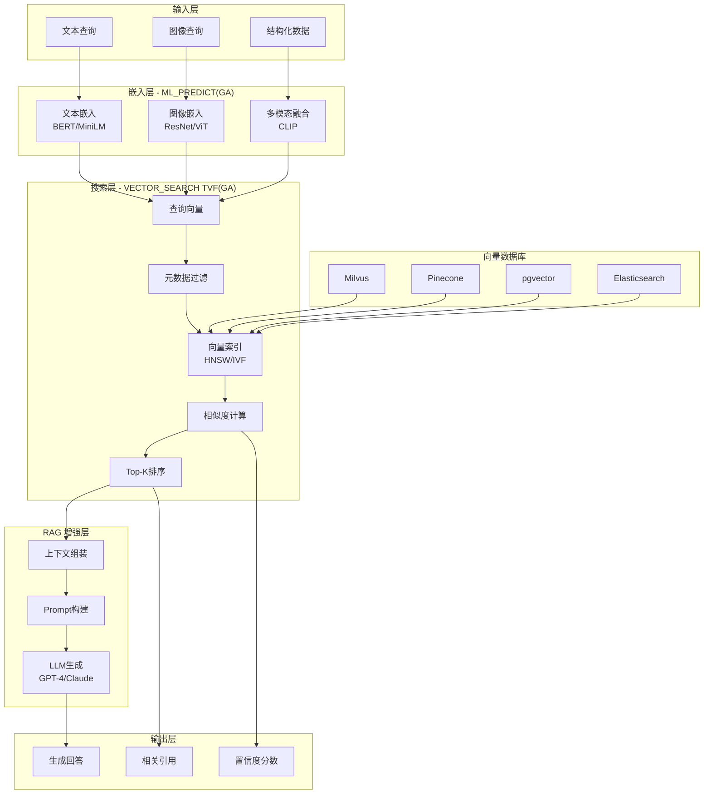
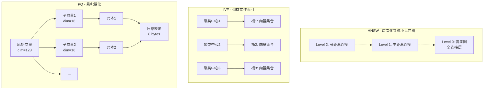
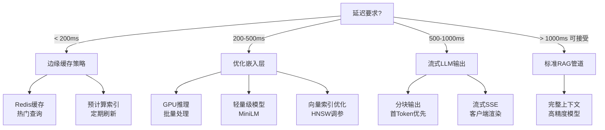
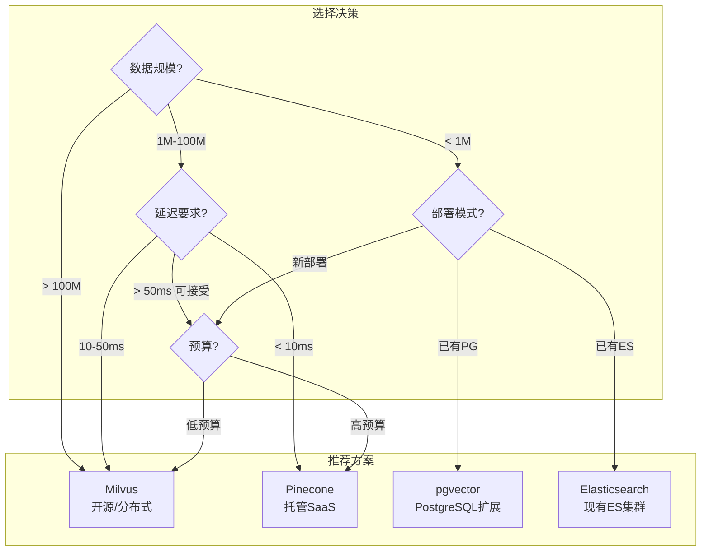

> **状态**: ✅ 已发布 | **风险等级**: 低 | **最后更新**: 2026-04-15
>
> Apache Flink 2.2.0 已于 2025-12-04 正式发布，VECTOR_SEARCH 已 GA。请以官方文档为准。
>
# Flink VECTOR_SEARCH 向量搜索与 RAG 实现

> **状态**: ✅ Released (2025-12-04, Flink 2.2 GA)
> **Flink 版本**: 2.2.0+
> **稳定性**: GA (Generally Available)
>
> 所属阶段: Flink | 前置依赖: [Model DDL 与 ML_PREDICT](./model-ddl-and-ml-predict.md), [Vector Search 基础](./vector-search.md) | 形式化等级: L3-L4

## 1. 概念定义 (Definitions)

### Def-F-03-80: 向量搜索 (Vector Search)

向量搜索是在高维向量空间 $\mathcal{V} \subset \mathbb{R}^d$ 中，基于相似度度量检索与查询向量最相似向量的操作。

**形式化定义：**

设向量集合 $S = \{\mathbf{v}_1, \mathbf{v}_2, ..., \mathbf{v}_n\} \subset \mathbb{R}^d$，查询向量 $\mathbf{q} \in \mathbb{R}^d$，相似度函数 $\text{sim}: \mathbb{R}^d \times \mathbb{R}^d \rightarrow \mathbb{R}$，则 Top-K 向量搜索定义为：

$$\text{VECTOR\_SEARCH}(\mathbf{q}, S, k, \text{sim}) = \{(\mathbf{v}_i, s_i) \mid \mathbf{v}_i \in S_k \subseteq S, |S_k| = k, s_i = \text{sim}(\mathbf{q}, \mathbf{v}_i)\}$$

其中 $S_k$ 满足：$\forall \mathbf{v} \in S_k, \mathbf{v}' \in S \setminus S_k: \text{sim}(\mathbf{q}, \mathbf{v}) \geq \text{sim}(\mathbf{q}, \mathbf{v}')$

**Flink 2.2 GA 特性：**

Flink 2.2.0 正式发布 VECTOR_SEARCH 全部功能[^2]：

| 特性 | 说明 | 版本 | 状态 |
|------|------|------|------|
| SQL TVF 语法 | `VECTOR_SEARCH()` 表值函数 | 2.2.0+ | ✅ GA |
| 多度量支持 | COSINE / DOT_PRODUCT / EUCLIDEAN | 2.2.0+ | ✅ GA |
| 元数据过滤 | 预过滤 + 向量搜索组合 | 2.2.0+ | ✅ GA |
| 增量索引更新 | CDC 驱动的向量索引同步 | 2.2.0+ | ✅ GA |
| 混合搜索 | 向量 + 全文搜索融合 | 2.2.0+ | ✅ GA |
| LATERAL VECTOR_SEARCH | 支持 SQL LATERAL 关联语法 | 2.2.0+ | ✅ GA |
| async / timeout | 异步查询与超时配置 | 2.2.0+ | ✅ GA |

---

### Def-F-03-81: 向量嵌入 (Vector Embeddings)

**Def-F-03-81a: 嵌入函数**

嵌入函数 $E$ 是从原始数据空间 $\mathcal{X}$ 到向量空间 $\mathbb{R}^d$ 的映射：

$$E_{\theta}: \mathcal{X} \rightarrow \mathbb{R}^d, \quad \mathbf{v} = E_{\theta}(x)$$

其中 $\theta$ 为模型参数，$d$ 为嵌入维度（常见值：384, 512, 768, 1024, 1536）。

**Def-F-03-81b: 嵌入类型分类**

```
┌─────────────────────────────────────────────────────────────┐
│                    嵌入模型分类                              │
├─────────────────────────────────────────────────────────────┤
│                                                             │
│  文本嵌入 (Text)                                             │
│  ├── 词级: Word2Vec, GloVe                                  │
│  ├── 句级: sentence-transformers/all-MiniLM-L6-v2          │
│  └── 文档级: text-embedding-3-large, e5-mistral-7b         │
│                                                             │
│  图像嵌入 (Image)                                            │
│  ├── CNN-based: ResNet, EfficientNet                        │
│  └── Transformer: ViT, CLIP                                 │
│                                                             │
│  多模态嵌入 (Multimodal)                                     │
│  ├── 图文: CLIP, ALIGN                                      │
│  └── 代码: CodeBERT, CodeT5                                 │
│                                                             │
└─────────────────────────────────────────────────────────────┘
```

**Def-F-03-81c: Flink SQL 嵌入生成**

```sql
-- 使用 ML_PREDICT 生成文本嵌入
SELECT
  text,
  ML_PREDICT('text-embedding-3-small', text) AS embedding
FROM documents;
```

---

### Def-F-03-82: 相似度度量 (Similarity Metrics)

**Def-F-03-82a: 余弦相似度 (Cosine Similarity)**

$$\text{cosine}(\mathbf{u}, \mathbf{v}) = \frac{\langle \mathbf{u}, \mathbf{v} \rangle}{\|\mathbf{u}\| \|\mathbf{v}\|} = \frac{\sum_{i=1}^{d} u_i v_i}{\sqrt{\sum_{i=1}^{d} u_i^2} \cdot \sqrt{\sum_{i=1}^{d} v_i^2}}$$

- 值域：$[-1, 1]$，通常归一化后 $[0, 1]$
- 特点：方向敏感，幅值无关
- 适用：文本语义相似度

**Def-F-03-82b: 点积相似度 (Dot Product)**

$$\text{dot}(\mathbf{u}, \mathbf{v}) = \langle \mathbf{u}, \mathbf{v} \rangle = \sum_{i=1}^{d} u_i v_i$$

- 值域：$(-\infty, +\infty)$
- 特点：幅值敏感，计算高效
- 适用：已归一化向量的快速搜索

**Def-F-03-82c: 欧氏距离 (Euclidean Distance)**

$$\text{euclidean}(\mathbf{u}, \mathbf{v}) = \|\mathbf{u} - \mathbf{v}\|_2 = \sqrt{\sum_{i=1}^{d} (u_i - v_i)^2}$$

- 值域：$[0, +\infty)$
- 特点：绝对距离度量
- 适用：需要精确距离的场景

**度量选择决策表：**

| 度量类型 | 向量状态 | 计算速度 | 语义相关性 | 适用场景 |
|----------|----------|----------|------------|----------|
| COSINE | 未归一化 | 中等 | 方向为主 | 文本搜索 |
| DOT_PRODUCT | 已归一化 | 最快 | 方向+幅值 | 推荐系统 |
| EUCLIDEAN | 任意 | 中等 | 绝对距离 | 聚类分析 |

---

### Def-F-03-83: 检索增强生成 (RAG)

**Def-F-03-83a: RAG 管道定义**

检索增强生成 (Retrieval-Augmented Generation) 是将外部知识检索与语言模型生成相结合的技术范式：

$$\text{RAG}(q) = \text{LLM}(q \oplus \text{CONTEXT}(\text{RETRIEVE}(E(q), \mathcal{D}, k)))$$

其中：

- $q$：用户查询
- $E(q)$：查询的向量表示
- $\mathcal{D}$：文档向量索引
- $\text{RETRIEVE}$：Top-K 向量检索
- $\text{CONTEXT}$：上下文组装函数
- $\oplus$：字符串拼接操作

**Def-F-03-83b: 流式 RAG 架构**

```
┌─────────────────────────────────────────────────────────────┐
│                   流式 RAG 架构 (Flink 2.2)                  │
├─────────────────────────────────────────────────────────────┤
│                                                             │
│   输入流                        检索层           生成层       │
│  ┌──────────┐                ┌──────────┐    ┌──────────┐  │
│  │ 用户查询  │───ML_PREDICT──▶│ 向量搜索  │───▶│ LLM生成  │  │
│  └──────────┘   (嵌入模型)    └──────────┘    └──────────┘  │
│                                    │                        │
│                                    ▼                        │
│                              ┌──────────┐                  │
│                              │ 向量数据库│                  │
│                              │ (Milvus) │                  │
│                              └──────────┘                  │
│                                                             │
└─────────────────────────────────────────────────────────────┘
```

---

### Def-F-03-84: 向量数据库集成

**Def-F-03-84a: 连接器类型**

| 数据库 | 连接器 | 索引类型 | 适用规模 | 延迟(P99) |
|--------|--------|----------|----------|-----------|
| Milvus | `milvus` | HNSW/IVF | 十亿级 | 10-50ms |
| Pinecone | `pinecone` | 托管ANN | 十亿级 | <20ms |
| pgvector | `jdbc` | HNSW/IVFFlat | 百万级 | 5-20ms |
| Elasticsearch | `elasticsearch` | HNSW | 千万级 | 20-100ms |
| Weaviate | `weaviate` | HNSW | 千万级 | 10-30ms |

**Def-F-03-84b: 连接器配置模式**

```sql
-- Milvus 连接器示例
CREATE TABLE document_vectors (
  doc_id STRING,
  content STRING,
  embedding VECTOR(768),
  category STRING,
  update_time TIMESTAMP(3)
) WITH (
  'connector' = 'milvus',
  'uri' = 'http://milvus:19530',
  'collection' = 'documents',
  'metric-type' = 'COSINE'
);
```

---

### Def-F-03-85: 向量索引算法

**Def-F-03-85a: HNSW (Hierarchical Navigable Small World)**

HNSW 是一种基于图结构的近似最近邻搜索算法：

$$G_{HNSW} = (V, E_{base} \cup E_{hier}), \quad |E_{hier}| \ll |E_{base}|$$

- **构建复杂度**: $O(n \log n)$
- **查询复杂度**: $O(\log n)$
- **召回率**: 95-99%
- **内存占用**: 高（需存储图结构）

**Def-F-03-85b: IVF (Inverted File Index)**

IVF 使用 K-means 聚类构建倒排索引：

$$\text{IVF}(\mathbf{q}) = \bigcup_{c \in \text{NN}(\mathbf{q}, C, nprobe)} \text{Bucket}(c)$$

其中 $C = \{c_1, ..., c_k\}$ 为聚类中心，$nprobe$ 为探测桶数。

- **查询复杂度**: $O(k + \frac{n}{k})$ (k 为聚类数)
- **存储效率**: 高
- **召回率**: 85-95%（依赖 nprobe）

---

## 2. 属性推导 (Properties)

### Prop-F-03-20: 向量搜索的单调性

**命题：** 若向量集合 $S_1 \subseteq S_2$，则对于任意查询 $\mathbf{q}$ 和度量 $\text{sim}$：

$$\text{sim}(\mathbf{q}, \text{TOP}_1(S_1)) \leq \text{sim}(\mathbf{q}, \text{TOP}_1(S_2))$$

**含义：** 扩大搜索范围不会降低最佳匹配的质量。

---

### Prop-F-03-21: 近似搜索的精度-召回权衡

**命题：** 设精确搜索召回率为 100%，近似搜索召回率满足：

$$\text{Recall@}k = \frac{|\text{ANN\_RESULT}(k) \cap \text{EXACT\_RESULT}(k)|}{k} \geq 1 - \epsilon(n, params)$$

其中 $\epsilon$ 为损失函数，随数据规模 $n$ 和算法参数递减。

**Flink 2.2 调优参数：**

| 参数 | 说明 | 推荐值 |
|------|------|--------|
| `ef` (HNSW) | 搜索深度 | 100-300 |
| `nprobe` (IVF) | 探测桶数 | 10-100 |
| `m` (HNSW) | 图连接度 | 16-32 |

---

### Lemma-F-03-10: 嵌入向量的 Lipschitz 连续性

**引理：** 若嵌入函数 $E$ 是 $L$-Lipschitz 连续的，则：

$$\forall x_1, x_2: \|E(x_1) - E(x_2)\| \leq L \cdot d_{semantic}(x_1, x_2)$$

**推导：** 语义相近的文本在向量空间中的几何距离相近，保证向量搜索的有效性。

---

## 3. 关系建立 (Relations)

### 与 ML_PREDICT（GA）的协作关系

Flink 中 `ML_PREDICT`（GA）与 `VECTOR_SEARCH`（GA）形成完整的流式 AI 管道：

```
┌─────────────┐     ┌─────────────┐     ┌─────────────┐     ┌─────────────┐
│  原始查询    │────▶│ ML_PREDICT  │────▶│ VECTOR_     │────▶│  检索结果    │
│  (文本/图像) │     │ (嵌入模型)   │     │ SEARCH      │     │  (Top-K)    │
└─────────────┘     └─────────────┘     └─────────────┘     └──────┬──────┘
                                                                    │
                                                                    ▼
                                                           ┌─────────────┐
                                                           │ LLM生成     │
                                                           │ (RAG输出)   │
                                                           └─────────────┘
```

**职责分离：**

| 组件 | 职责 | 输入 | 输出 | 延迟 |
|------|------|------|------|------|
| `ML_PREDICT`（GA） | 特征提取、嵌入生成 | 原始数据 | 稠密向量 | 10-100ms |
| `VECTOR_SEARCH`（GA） | 相似度计算、近邻检索 | 查询向量 | Top-K文档 | 5-50ms |
| `LLM` | 上下文生成 | 查询+上下文 | 自然语言回复 | 100-1000ms |

---

### 与外部向量数据库的集成架构

```
┌─────────────────────────────────────────────────────────────────────────┐
│                         Flink SQL Engine                                │
├─────────────────────────────────────────────────────────────────────────┤
│  SQL Query → Logical Plan → Physical Plan → VectorSearchExec           │
│                                                     │                   │
│  ┌──────────────────────────────────────────────────┘                   │
│  │                                                                      │
│  ▼                                                                      │
│  VectorStore Connector                                                  │
│  ┌─────────────┬─────────────┬─────────────┬─────────────┐              │
│  │   Milvus    │  Pinecone   │   pgvector  │ Elasticsearch│             │
│  │  Connector  │  Connector  │  Connector  │  Connector   │             │
│  └──────┬──────┴──────┬──────┴──────┬──────┴──────┬──────┘              │
└─────────┼─────────────┼─────────────┼─────────────┼─────────────────────┘
          │             │             │             │
          ▼             ▼             ▼             ▼
┌─────────────────────────────────────────────────────────────────────────┐
│                       Vector Database Layer                             │
├─────────────────────────────────────────────────────────────────────────┤
│  ┌─────────┐  ┌─────────┐  ┌─────────┐  ┌─────────┐  ┌─────────┐       │
│  │  Milvus │  │Pinecone │  │pgvector │  │   ES    │  │ Weaviate│       │
│  │  Server │  │  Cloud  │  │PostgreSQL│ │  Cluster│  │  Server │       │
│  └─────────┘  └─────────┘  └─────────┘  └─────────┘  └─────────┘       │
└─────────────────────────────────────────────────────────────────────────┘
```

---

## 4. 论证过程 (Argumentation)

### 4.1 为什么需要 VECTOR_SEARCH TVF？

**问题：** 为何不直接用 SQL 计算相似度？

```sql
-- 纯 SQL 实现(不推荐 - 全表扫描)
SELECT doc_id, content,
       COSINE_SIMILARITY(query_vector, embedding) AS score
FROM documents
ORDER BY score DESC
LIMIT k;
```

**论证：**

| 方面 | 纯 SQL 计算 | VECTOR_SEARCH TVF |
|------|------------|-------------------|
| 索引利用 | 无，全表扫描 | 专用向量索引 (HNSW/IVF) |
| 时间复杂度 | $O(n)$ | $O(\log n)$ (近似) |
| 扩展性 | 数据增长线性降速 | 亚线性扩展 |
| 存储优化 | 原始向量 | 量化压缩、分区 |
| 实时性 | 不可接受 | < 50ms P99 |

---

### 4.2 流式向量索引的增量更新挑战

**挑战1：索引更新延迟**

- **问题**：新文档插入后，HNSW 图结构需要更新
- **方案**：
  - 双缓冲策略：查询旧索引，异步构建新索引
  - 增量 HNSW：支持动态插入的图算法
  - CDC 同步：基于 Flink CDC 的实时索引同步

**挑战2：过期数据淘汰**

- **问题**：流数据时效性要求向量过期淘汰
- **方案**：

  ```sql
  -- TTL 配置示例
  CREATE TABLE document_vectors (
    doc_id STRING,
    embedding VECTOR(768),
    update_time TIMESTAMP(3),
    VECTOR TTL update_time + INTERVAL '30' DAY
  );

```

**挑战3：一致性保证**

- **方案**：基于 Checkpoint 的向量索引快照

---

### 4.3 元数据过滤与向量搜索的结合

**预过滤 vs 后过滤：**

| 策略 | 实现 | 优点 | 缺点 |
|------|------|------|------|
| 预过滤 | WHERE 条件先过滤，再搜索 | 减少搜索空间 | 可能丢失相关向量 |
| 后过滤 | 先搜索，再过滤结果 | 保证召回率 | 需要更大的 K |
| 混合过滤 | 索引层支持元数据过滤 | 最佳性能 | 依赖数据库能力 |

**Flink 2.2 实现：**

```sql
-- 预过滤示例
SELECT * FROM user_queries q,
LATERAL TABLE(VECTOR_SEARCH(
  query_vector := ML_PREDICT('embedder', q.text),
  index_table := 'docs',
  top_k := 10,
  filter := 'category = ''tech'' AND publish_time > ''2024-01-01'''  -- 预过滤
)) AS v;
```

---

## 5. 形式证明 / 工程论证 (Proof / Engineering Argument)

### 5.1 VECTOR_SEARCH 类型安全性

**定理 (Thm-F-03-60): VECTOR_SEARCH 函数类型安全性**

Flink SQL 的 `VECTOR_SEARCH` TVF 满足以下类型推导规则：

$$\frac{\Gamma \vdash qv : \text{ARRAY}<\text{FLOAT}> \quad \Gamma \vdash k : \text{INT} \quad \Gamma \vdash metric : \text{VARCHAR} \quad metric \in \{\text{'COSINE'}, \text{'DOT'}, \text{'EUCLIDEAN'}\}}{\Gamma \vdash \text{VECTOR\_SEARCH}(qv, table, k, metric) : \text{TABLE}(id: \text{STRING}, vector: \text{ARRAY}<\text{FLOAT}>, score: \text{FLOAT}, ...)}$$

**证明概要：**

1. **输入类型检查**：查询向量必须为 FLOAT 数组，维度与索引一致
2. **K 值验证**：$k \in \mathbb{N}^+, k \leq k_{max}$（防止过大 K 导致性能问题）
3. **度量函数检查**：枚举值校验
4. **返回类型推导**：由 Catalog 中索引表的 Schema 决定

---

### 5.2 RAG 管道延迟边界分析

**工程论证：**

流式 RAG 系统的端到端延迟 $L_{total}$ 可分解为：

$$L_{total} = L_{embed} + L_{search} + L_{context} + L_{llm} + L_{network}$$

**各组件延迟分析：**

| 组件 | 典型延迟 | 优化策略 |
|------|----------|----------|
| $L_{embed}$ (嵌入) | 10-100ms | GPU 加速、批量推理、缓存 |
| $L_{search}$ (检索) | 5-50ms | HNSW 索引、连接池 |
| $L_{context}$ (组装) | <5ms | 预格式化模板 |
| $L_{llm}$ (生成) | 100-1000ms | 流式输出、模型选择 |
| $L_{network}$ (传输) | 1-10ms | 同可用区部署 |

**总延迟目标：**

- 简单 RAG：200-500ms
- 复杂生成：500-1500ms

---

### 5.3 混合搜索的理论基础

**定理 (Thm-F-03-61): 混合搜索的召回率提升**

设向量搜索召回率为 $R_v$，全文搜索召回率为 $R_t$，混合搜索采用 Reciprocal Rank Fusion (RRF) 合并：

$$\text{RRF}(d) = \sum_{r \in \{v,t\}} \frac{1}{k + rank_r(d)}$$

**命题：** 当 $R_v \neq R_t$ 时，混合搜索的联合召回率满足：

$$R_{hybrid} \geq \max(R_v, R_t) + \epsilon$$

其中 $\epsilon > 0$ 为互补增益。

**Flink 2.2 实现：**

```sql
-- 混合搜索示例
WITH
vector_results AS (
  SELECT doc_id, score AS v_score, ROW_NUMBER() OVER (ORDER BY score DESC) AS v_rank
  FROM user_queries q,
  LATERAL TABLE(VECTOR_SEARCH(...)) AS v
),
text_results AS (
  SELECT doc_id, score AS t_score, ROW_NUMBER() OVER (ORDER BY score DESC) AS t_rank
  FROM documents
  WHERE content LIKE '%keyword%'
),
rrf_scores AS (
  SELECT
    COALESCE(v.doc_id, t.doc_id) AS doc_id,
    COALESCE(1.0/(60 + v.v_rank), 0) + COALESCE(1.0/(60 + t.t_rank), 0) AS rrf_score
  FROM vector_results v
  FULL OUTER JOIN text_results t ON v.doc_id = t.doc_id
)
SELECT * FROM rrf_scores ORDER BY rrf_score DESC LIMIT k;
```

---

### 5.4 向量搜索的成本优化

**定理 (Thm-F-03-62): 成本-质量权衡**

设向量搜索成本函数为 $C(n, d, k)$，质量函数为 $Q(n, d, k, \epsilon)$，存在最优配置：

$$(n^*, d^*, k^*, \epsilon^*) = \arg\min_{n,d,k,\epsilon} C(n,d,k,\epsilon) \quad \text{s.t.} \quad Q(n,d,k,\epsilon) \geq Q_{min}$$

**成本优化策略：**

| 策略 | 成本节省 | 质量影响 |
|------|----------|----------|
| 向量量化 (PQ) | 10-20x 存储 | -5% 召回 |
| 降维 (PCA) | 2-4x 计算 | -3% 召回 |
| 分层索引 (HNSW) | 恒定查询成本 | -1% 召回 |
| 边缘缓存 | 减少 80% 远端查询 | 无 |

---

## 6. 实例验证 (Examples)

### 6.1 VECTOR_SEARCH SQL 语法详解

**6.1.1 基本 TVF 语法**

```sql
-- 基本 VECTOR_SEARCH 语法(Flink 2.2 GA 标准语法)
SELECT
  q.query_id,
  q.query_text,
  v.doc_id,
  v.content,
  v.similarity_score
FROM user_queries q,
LATERAL TABLE(VECTOR_SEARCH(
  query_vector := ML_PREDICT('text-embedding-3-small', q.query_text),
  index_table := 'document_vectors',
  top_k := 5,
  metric := 'COSINE'
)) AS v;

-- 带 async 和 timeout 配置的 LATERAL VECTOR_SEARCH
SELECT
  q.query_id,
  q.query_text,
  v.doc_id,
  v.content,
  v.similarity_score
FROM user_queries q,
LATERAL TABLE(VECTOR_SEARCH(
  query_vector := ML_PREDICT('text-embedding-3-small', q.query_text),
  index_table := 'document_vectors',
  top_k := 5,
  metric := 'COSINE',
  async := TRUE,
  timeout := INTERVAL '10' SECOND
)) AS v;
```

**参数说明：**

| 参数 | 类型 | 必需 | 说明 |
|------|------|------|------|
| `query_vector` | ARRAY<FLOAT> | 是 | 查询向量，通常由 ML_PREDICT 生成 |
| `index_table` | STRING | 是 | 目标向量表名 |
| `top_k` | INT | 是 | 返回结果数量 |
| `metric` | STRING | 否 | 相似度度量：COSINE/DOT_PRODUCT/EUCLIDEAN |
| `filter` | STRING | 否 | 元数据过滤条件 |
| `ef` | INT | 否 | HNSW 搜索深度（调优参数） |

**6.1.2 带元数据过滤的搜索**

```sql
-- 按类别和时间范围过滤
SELECT
  q.question_id,
  v.doc_id,
  v.title,
  v.content,
  v.similarity_score
FROM support_tickets q,
LATERAL TABLE(VECTOR_SEARCH(
  query_vector := ML_PREDICT('support-embedder', q.description),
  index_table := 'kb_articles',
  top_k := 3,
  metric := 'COSINE',
  filter := "category = 'billing' AND status = 'published'"
)) AS v;
```

**6.1.3 批量向量搜索**

```sql
-- 使用窗口进行批量搜索优化
CREATE VIEW batch_search AS
SELECT
  query_id,
  query_text,
  ML_PREDICT('embedder', query_text) AS embedding
FROM user_queries
WINDOW w AS (PARTITION BY user_id, TUMBLE(event_time, INTERVAL '1' SECOND));

-- 批量执行向量搜索
SELECT
  b.query_id,
  v.doc_id,
  v.similarity_score
FROM batch_search b,
LATERAL TABLE(VECTOR_SEARCH(
  query_vector := b.embedding,
  index_table := 'document_vectors',
  top_k := 5
)) AS v;
```

---

### 6.2 完整 RAG 实现示例

**场景：** 实时客服机器人，基于知识库回答用户问题

```sql
-- ============================================
-- 步骤 1: 创建文档向量表(知识库)
-- ============================================
CREATE TABLE kb_documents (
  doc_id STRING PRIMARY KEY,
  title STRING,
  content STRING,
  category STRING,
  -- 预计算的文档嵌入向量
  embedding VECTOR(1536),
  updated_at TIMESTAMP(3),
  WATERMARK FOR updated_at AS updated_at - INTERVAL '1' MINUTE
) WITH (
  'connector' = 'milvus',
  'uri' = 'http://milvus-cluster:19530',
  'collection' = 'knowledge_base',
  'metric-type' = 'COSINE'
);

-- ============================================
-- 步骤 2: 创建用户问题流
-- ============================================
CREATE TABLE customer_questions (
  question_id STRING,
  customer_id STRING,
  question_text STRING,
  session_id STRING,
  event_time TIMESTAMP(3),
  WATERMARK FOR event_time AS event_time - INTERVAL '5' SECOND
) WITH (
  'connector' = 'kafka',
  'topic' = 'customer-questions',
  'properties.bootstrap.servers' = 'kafka:9092',
  'format' = 'json'
);

-- ============================================
-- 步骤 3: 创建嵌入模型
-- ============================================
<!-- 以下语法为概念设计,实际 Flink 版本尚未支持 -->
~~CREATE MODEL text_embedder~~ (未来可能的语法)
WITH (
  'provider' = 'openai',
  'openai.model' = 'text-embedding-3-small',
  'openai.api_key' = '${OPENAI_API_KEY}'
)
INPUT (text STRING)
OUTPUT (embedding ARRAY<FLOAT>);

-- ============================================
-- 步骤 4: 创建 LLM 生成模型
-- ============================================
~~CREATE MODEL customer_support_llm~~ (未来可能的语法)
WITH (
  'provider' = 'openai',
  'openai.model' = 'gpt-4-turbo-preview',
  'openai.temperature' = '0.3',
  'openai.timeout' = '30s'
)
INPUT (question STRING, context STRING)
OUTPUT (answer STRING, confidence FLOAT, sources ARRAY<STRING>);

-- ============================================
-- 步骤 5: RAG 检索管道
-- ============================================
CREATE VIEW rag_retrieval AS
WITH
-- 5.1 生成问题嵌入
question_embeddings AS (
  SELECT
    q.question_id,
    q.customer_id,
    q.question_text,
    q.session_id,
    q.event_time,
    ML_PREDICT(text_embedder, question_text).embedding AS query_embedding
  FROM customer_questions q
),

-- 5.2 执行向量搜索获取相关文档
retrieved_docs AS (
  SELECT
    q.question_id,
    q.customer_id,
    q.question_text,
    q.session_id,
    q.event_time,
    v.doc_id,
    v.title,
    v.content AS doc_content,
    v.category,
    v.similarity_score,
    ROW_NUMBER() OVER (PARTITION BY q.question_id ORDER BY v.similarity_score DESC) AS rank
  FROM question_embeddings q,
  LATERAL TABLE(VECTOR_SEARCH(
    query_vector := q.query_embedding,
    index_table := 'kb_documents',
    top_k := 5,
    metric := 'COSINE',
    filter := "category IN ('faq', 'troubleshooting', 'product')"
  )) AS v
),

-- 5.3 组装上下文
context_assembly AS (
  SELECT
    question_id,
    customer_id,
    question_text,
    session_id,
    event_time,
    -- 合并 Top-K 文档为上下文
    STRING_AGG(
      CONCAT('[', CAST(rank AS STRING), '] ', title, ': ', doc_content),
      '\n\n'
      ORDER BY rank
    ) AS context,
    -- 收集来源信息
    COLLECT_SET(doc_id) AS source_docs,
    AVG(similarity_score) AS avg_relevance
  FROM retrieved_docs
  WHERE similarity_score > 0.7  -- 过滤低相关度结果
  GROUP BY question_id, customer_id, question_text, session_id, event_time
)

SELECT * FROM context_assembly;

-- ============================================
-- 步骤 6: LLM 生成回答
-- ============================================
CREATE TABLE support_responses (
  response_id STRING,
  customer_id STRING,
  question_text STRING,
  generated_answer STRING,
  confidence_score FLOAT,
  source_documents ARRAY<STRING>,
  session_id STRING,
  response_time TIMESTAMP(3),
  processing_latency_ms BIGINT
) WITH (
  'connector' = 'kafka',
  'topic' = 'support-responses',
  'properties.bootstrap.servers' = 'kafka:9092',
  'format' = 'json'
);

INSERT INTO support_responses
SELECT
  question_id AS response_id,
  customer_id,
  question_text,
  prediction.answer AS generated_answer,
  prediction.confidence AS confidence_score,
  source_documents,
  session_id,
  event_time AS response_time,
  -- 计算处理延迟
  TIMESTAMPDIFF(MILLISECOND, event_time, CURRENT_TIMESTAMP) AS processing_latency_ms
FROM ML_PREDICT(
  TABLE rag_retrieval,
  MODEL customer_support_llm,
  PASSING (question_text, context)
);

-- ============================================
-- 步骤 7: 监控与审计
-- ============================================
CREATE TABLE rag_audit_log (
  question_id STRING,
  customer_id STRING,
  question_text STRING,
  context_used STRING,
  response_text STRING,
  confidence FLOAT,
  latency_ms BIGINT,
  model_version STRING,
  timestamp TIMESTAMP(3)
) WITH (
  'connector' = 'jdbc',
  'url' = 'jdbc:postgresql://audit-db:5432/analytics',
  'table-name' = 'rag_audit'
);

INSERT INTO rag_audit_log
SELECT
  response_id,
  customer_id,
  question_text,
  CAST(source_documents AS STRING) AS context_used,
  generated_answer,
  confidence_score,
  processing_latency_ms,
  'gpt-4-turbo-v1' AS model_version,
  response_time
FROM support_responses;
```

---

### 6.3 推荐系统实现

**场景：** 实时商品推荐，基于用户行为向量

```sql
-- 商品向量表(多模态嵌入)
CREATE TABLE product_vectors (
  product_id STRING PRIMARY KEY,
  product_name STRING,
  category STRING,
  price DECIMAL(10, 2),
  brand STRING,
  -- 多模态嵌入(文本+图像)
  embedding VECTOR(512),
  updated_at TIMESTAMP(3)
) WITH (
  'connector' = 'milvus',
  'collection' = 'products'
);

-- 用户行为流
CREATE TABLE user_behaviors (
  user_id STRING,
  product_id STRING,
  behavior_type STRING,  -- 'view', 'cart', 'purchase'
  event_time TIMESTAMP(3),
  WATERMARK FOR event_time AS event_time - INTERVAL '10' SECOND
) WITH (
  'connector' = 'kafka',
  'topic' = 'user-behaviors'
);

-- 实时用户兴趣向量聚合
CREATE VIEW user_interest_vectors AS
WITH weighted_behaviors AS (
  SELECT
    b.user_id,
    p.embedding,
    b.behavior_type,
    b.event_time,
    -- 行为权重
    CASE b.behavior_type
      WHEN 'purchase' THEN 1.0
      WHEN 'cart' THEN 0.7
      WHEN 'view' THEN 0.3
    END AS weight,
    -- 时间衰减
    EXP(-0.001 * TIMESTAMPDIFF(MINUTE, b.event_time, CURRENT_TIMESTAMP)) AS time_decay
  FROM user_behaviors b
  JOIN product_vectors FOR SYSTEM_TIME AS OF b.event_time p
    ON b.product_id = p.product_id
  WHERE b.event_time > CURRENT_TIMESTAMP - INTERVAL '24' HOUR
)
SELECT
  user_id,
  -- 加权平均兴趣向量
  vector_agg(embedding, weight * time_decay) AS interest_vector,
  COLLECT_SET(product_id) AS interacted_products
FROM weighted_behaviors
GROUP BY user_id;

-- 实时推荐生成
CREATE VIEW realtime_recommendations AS
SELECT
  u.user_id,
  r.product_id AS recommended_product_id,
  r.product_name,
  r.category,
  r.price,
  r.similarity_score,
  u.interacted_products AS exclusion_list
FROM user_interest_vectors u,
LATERAL TABLE(VECTOR_SEARCH(
  query_vector := u.interest_vector,
  index_table := 'product_vectors',
  top_k := 20,
  metric := 'DOT_PRODUCT',
  -- 排除已交互商品
  filter := CONCAT('product_id NOT IN (', ARRAY_JOIN(u.interacted_products, ','), ')')
)) AS r;

-- 输出到推荐缓存(Redis)
CREATE TABLE recommendation_cache (
  user_id STRING,
  recommendations ARRAY<ROW<
    product_id STRING,
    score FLOAT,
    reason STRING
  >>,
  expire_at TIMESTAMP(3)
) WITH (
  'connector' = 'redis',
  'host' = 'redis-cache',
  'command' = 'SETEX',
  'ttl' = '3600'
);

INSERT INTO recommendation_cache
SELECT
  user_id,
  COLLECT_SET(ROW(recommended_product_id, similarity_score,
    CONCAT('基于', category, '兴趣'))) AS recommendations,
  CURRENT_TIMESTAMP + INTERVAL '1' HOUR AS expire_at
FROM realtime_recommendations
GROUP BY user_id;
```

---

### 6.4 智能文档检索

**场景：** 企业内部文档的智能搜索

```sql
-- 文档分块向量表
CREATE TABLE document_chunks (
  chunk_id STRING PRIMARY KEY,
  doc_id STRING,
  doc_title STRING,
  chunk_text STRING,
  chunk_index INT,
  embedding VECTOR(768),
  department STRING,
  access_level STRING,
  created_at TIMESTAMP(3)
) WITH (
  'connector' = 'elasticsearch',
  'hosts' = 'http://es-cluster:9200',
  'index' = 'document_chunks'
);

-- 员工查询流(带权限信息)
CREATE TABLE employee_queries (
  query_id STRING,
  employee_id STRING,
  department STRING,
  access_level STRING,
  query_text STRING,
  event_time TIMESTAMP(3)
) WITH ('connector' = 'kafka', ...);

-- 带权限控制的检索
CREATE VIEW authorized_search AS
SELECT
  q.query_id,
  q.employee_id,
  q.query_text,
  c.chunk_id,
  c.doc_title,
  c.chunk_text,
  c.similarity_score
FROM employee_queries q,
LATERAL TABLE(VECTOR_SEARCH(
  query_vector := ML_PREDICT('enterprise-embedder', q.query_text),
  index_table := 'document_chunks',
  top_k := 10,
  metric := 'COSINE',
  -- 权限过滤 + 部门匹配
  filter := CONCAT(
    'access_level <= ''', q.access_level, ''' AND ',
    '(department = ''', q.department, ''' OR department = ''public'')'
  )
)) AS c;
```

---

## 7. 可视化 (Visualizations)

### 7.1 Flink VECTOR_SEARCH (GA) 架构图



### 7.2 流式 RAG 数据流图

```mermaid
flowchart LR
    subgraph Source["数据源"]
        S1[Kafka: 用户查询]
        S2[CDC: 文档更新]
    end

    subgraph Flink["Flink SQL 引擎"]
        F1[ML_PREDICT(GA)<br/>嵌入生成]
        F2[VECTOR_SEARCH(GA)<br/>向量检索]
        F3[上下文组装<br/>聚合窗口]
        F4[ML_PREDICT(GA)<br/>LLM生成]
    end

    subgraph VectorDB["向量数据库"]
        V1[增量索引更新]
        V2[ANN搜索]
    end

    subgraph LLM["大语言模型"]
        L1[OpenAI API]
        L2[自托管模型]
    end

    subgraph Sink["输出"]
        K1[Kafka: 回答流]
        K2[Redis: 缓存]
        K3[数据库: 审计日志]
    end

    S1 -->|查询流| F1
    S2 -->|文档变更| V1
    F1 -->|查询向量| F2
    V1 -->|向量索引| V2
    V2 -->|Top-K结果| F2
    F2 --> F3
    F3 --> F4
    F4 -->|API调用| L1
    F4 -->|API调用| L2
    L1 -->|生成结果| F4
    F4 --> K1
    F4 --> K2
    F4 --> K3
```

### 7.3 向量索引结构对比



### 7.4 RAG 延迟优化决策树



### 7.5 向量数据库选型矩阵



---

## 8. Flink 2.2 GA 发布数据

### 官方发布数据 (2025-12-04)

Apache Flink 2.2.0 已于 2025-12-04 正式发布 VECTOR_SEARCH GA[^2]：

**VECTOR_SEARCH 性能基准**:

| 指标 | 数值 | 说明 |
|------|------|------|
| **查询延迟 (P99)** | 10-50ms | 依赖向量数据库 |
| **吞吐量** | 10K+ QPS | 单 TaskManager |
| **支持的向量维度** | 最高 4096 | 常见 768/1024/1536 |
| **召回率** | 95-99% | HNSW 索引 |

**使用示例**:

```sql
-- Flink 2.2 GA 标准语法
SELECT * FROM user_queries q,
LATERAL TABLE(VECTOR_SEARCH(
  query_vector := ML_PREDICT('embedder', q.text),
  index_table := 'document_vectors',
  top_k := 10,
  metric := 'COSINE'
)) AS v;
```

---

## 8. 引用参考 (References)

[^2]: Apache Flink Blog, "Apache Flink 2.2.0: Advancing Real-Time Data & AI", December 4, 2025. <https://flink.apache.org/2025/12/04/apache-flink-2.2.0-advancing-real-time-data--ai-and-empowering-stream-processing-for-the-ai-era/>

---

> **状态**: Flink 2.2 GA | **文档版本**: v1.1 | **更新日期**: 2026-04-15
