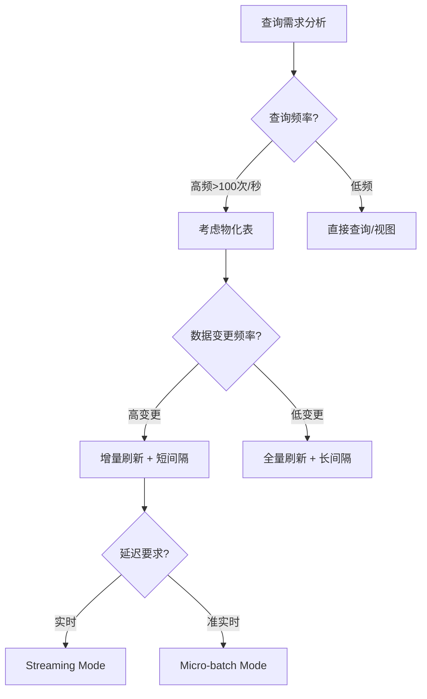
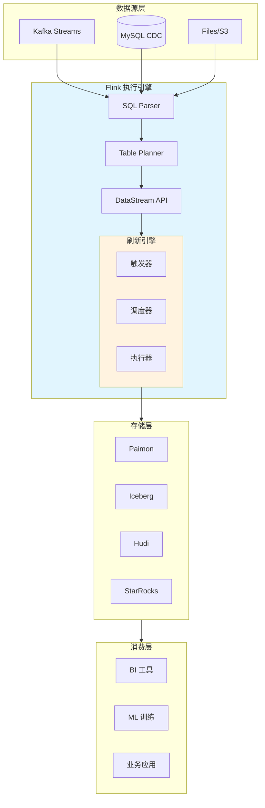
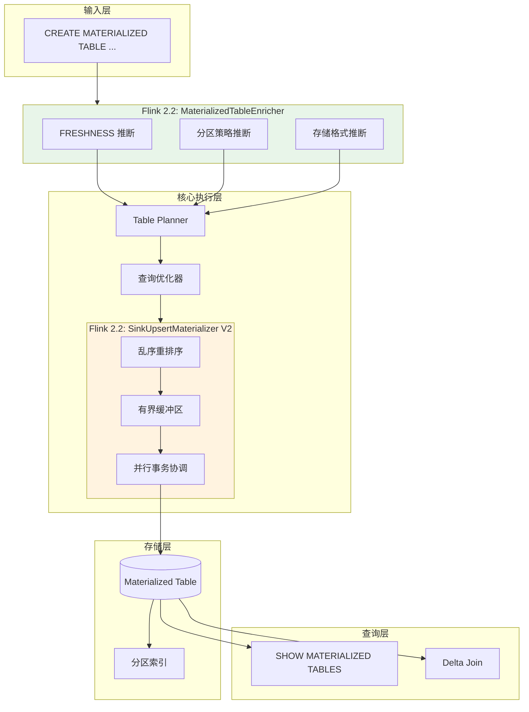
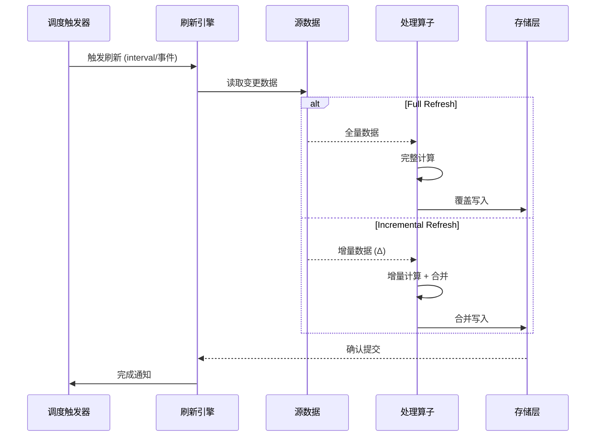
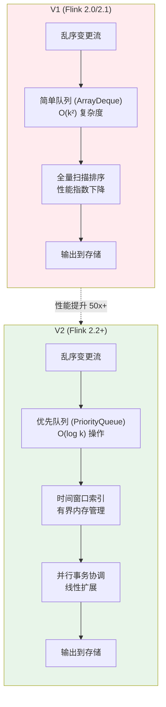
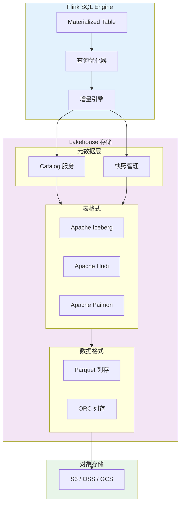
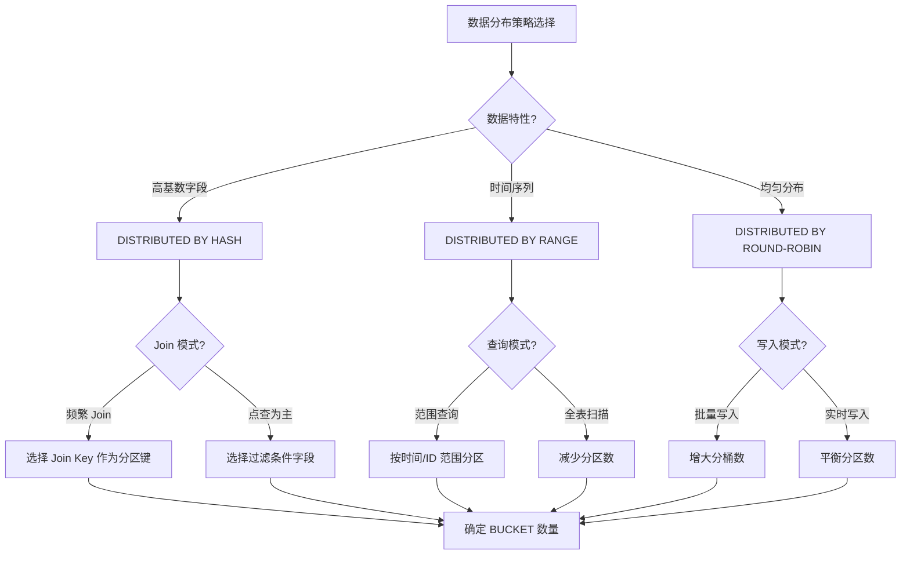

# Materialized Tables - Flink 2.0+ 的统一批流开发体验

> **所属阶段**: Flink | **前置依赖**: [Flink SQL 完整指南](./flink-table-sql-complete-guide.md) | **形式化等级**: L3

## 1. 概念定义 (Definitions)

### Def-F-03-03: 物化表 (Materialized Table)

**定义**: 物化表是一种**预计算并持久化存储**的表结构，它在数据变更时自动刷新，为查询提供低延迟的读取性能。

形式化表述：
$$
MT = (S, Q, R, D, C, F)
$$

其中：

- $S$: Source 数据源集合
- $Q$: 物化查询（Materialized Query）
- $R$: 刷新模式（Refresh Mode）
- $D$: 存储描述符（Storage Descriptor）
- $C$: 一致性配置（Consistency Configuration）
- $F$: FRESHNESS 约束（Freshness Constraint，Flink 2.2+）

```
┌─────────────────────────────────────────────────────────┐
│                    Materialized Table                   │
├─────────────────────────────────────────────────────────┤
│  Source → [Query] → [Materialized Result] → Storage     │
│            ↑                    ↓                       │
│         Refresh              Query Engine               │
│          Trigger                                        │
└─────────────────────────────────────────────────────────┘
```

### Def-F-03-04: 刷新模式 (Refresh Mode)

**定义**: 刷新模式定义了物化表如何与源数据同步的语义。

| 模式 | 语义 | 适用场景 |
|------|------|----------|
| **Full** | 重新执行完整查询，替换全部结果 | 数据量小、计算简单、源数据频繁变更 |
| **Incremental** | 仅处理变更增量，合并到现有结果 | 数据量大、变更局部、需要低延迟 |

形式化：
$$
Refresh(MT, t) = \begin{cases}
Q(S_t) & \text{if mode = Full} \\
\Delta^{-1}(Q(\Delta S)) \circ MT_{t-1} & \text{if mode = Incremental}
\end{cases}
$$

### Def-F-03-05: 调度策略 (Scheduling Policy)

**定义**: 调度策略控制物化表刷新作业的执行时机、资源分配和并发控制。

核心参数：

- **refresh-interval**: 定时触发间隔
- **refresh-trigger**: 触发条件（时间/事件/混合）
- **resource-allocation**: 资源配额（slot/memory）
- **max-concurrent-refresh**: 最大并发刷新数

### Def-F-03-06: 一致性级别 (Consistency Level)

**定义**: 物化表查询结果与源数据状态的一致性保证程度。

| 级别 | 定义 | 保证 |
|------|------|------|
| **强一致性** | 读取结果反映所有已提交的源数据变更 | 线性一致性 (Linearizability) |
| **最终一致性** | 在无新变更的情况下，结果最终收敛 | 无保证读取最新 |
| **会话一致性** | 同一会话内保证单调读 | 跨会话可能不一致 |

### Def-F-03-07: FRESHNESS 约束 (Flink 2.2+)

**定义**: FRESHNESS 定义了物化表数据相对于源数据的**最大允许延迟时间**，是数据新鲜度的量化约束。

形式化：
$$
FRESHNESS(MT) = \Delta t_{max}
$$

其中 $\Delta t_{max}$ 表示从源数据变更到物化表反映该变更的最大时间间隔。

FRESHNESS 支持两种指定方式：

| 指定方式 | 语法 | 说明 |
|---------|------|------|
| **显式指定** | `FRESHNESS = INTERVAL '5' MINUTE` | 用户明确定义 |
| **自动推断** | 省略或使用 `FRESHNESS = AUTO` | 从上游表自动推断（Flink 2.2+） |

### Def-F-03-08: MaterializedTableEnricher 接口 (Flink 2.2+)

**定义**: `MaterializedTableEnricher` 是 Flink 2.2 引入的扩展接口，用于在物化表创建时**自动推断和补充表属性**。

```java
// 接口定义核心逻辑
public interface MaterializedTableEnricher {
    // 推断 FRESHNESS 约束
    Optional<Duration> inferFreshness(Context ctx);

    // 推断分区策略
    Optional<Distribution> inferDistribution(Context ctx);

    // 推断存储格式
    Optional<StorageFormat> inferStorageFormat(Context ctx);
}
```

### Def-F-03-09: 物化表分区 (Distributed By/Into)

**定义**: 物化表分区定义了数据在存储层的物理分布策略，通过 `DISTRIBUTED BY` 和 `DISTRIBUTED INTO` 子句声明。

| 子句 | 作用 | 示例 |
|------|------|------|
| **DISTRIBUTED BY** | 指定分区键（Hash/Round-robin） | `DISTRIBUTED BY HASH(user_id)` |
| **DISTRIBUTED INTO** | 指定分桶数量 | `DISTRIBUTED INTO 16 BUCKETS` |

形式化：
$$
Partition(MT) = (K, N, S)
$$

- $K$: 分区键集合
- $N$: 分桶数量
- $S$: 分桶策略（HASH / RANGE / ROUND-ROBIN）

### Def-F-03-10: SinkUpsertMaterializer V2 (Flink 2.2+)

**定义**: SinkUpsertMaterializer V2 是 Flink 2.2 对物化表 Sink 组件的重大升级，专门解决**乱序变更事件**的协调问题。

核心改进：

| 特性 | V1 (Flink 2.0/2.1) | V2 (Flink 2.2+) |
|------|-------------------|-----------------|
| 乱序处理 | 简单缓冲，可能丢数据 | 智能重排序，保证一致性 |
| 性能退化 | 高并发下指数下降 | 线性可扩展 |
| 内存管理 | 无界缓冲区风险 | 有界内存，背压感知 |
| 事务协调 | 单线程协调 | 并行化协调 |

---

## 2. 属性推导 (Properties)

### Prop-F-03-01: 物化表与视图的语义差异

**命题**: 物化表是**存储**抽象，视图是**查询**抽象。

| 特性 | Materialized Table | View |
|------|-------------------|------|
| 数据存储 | 物理存储 | 虚拟，无存储 |
| 查询性能 | O(1) 读取 | O(n) 计算 |
| 数据新鲜度 | 取决于刷新策略 | 实时 |
| 资源消耗 | 存储+计算 | 仅计算 |
| 适用场景 | 频繁查询、大数据量 | 动态查询、数据探索 |

### Prop-F-03-02: 增量刷新的可推导性

**命题**: 当查询 $Q$ 满足**单调性**（Monotonicity）和**可逆性**（Invertibility）时，增量刷新可保证最终一致性。

证明概要：

1. 单调性确保新数据不会使旧结果失效
2. 可逆性确保 $\Delta^{-1}$ 操作存在
3. 结合可构成完整的增量更新流

### Prop-F-03-03: 调度延迟下界

**命题**: 在资源受限环境下，物化表刷新延迟 $L$ 满足：
$$
L \geq \max(T_{proc}, T_{sched})
$$
其中 $T_{proc}$ 为处理时间，$T_{sched}$ 为调度间隔。

### Prop-F-03-04: FRESHNESS 自动推断的完备性 (Flink 2.2+)

**命题**: 当上游源表明确定义了 `WATERMARK` 或 `SOURCE_REFRESH_INTERVAL` 时，MaterializedTableEnricher 可以**完备地**推断出有效的 FRESHNESS 约束。

证明概要：

1. 若源表 $S$ 定义了水印延迟 $W(S)$，则合理推断 $FRESHNESS \geq W(S) + \epsilon$
2. 若源表定义了源刷新间隔 $R(S)$，则合理推断 $FRESHNESS \geq R(S) + \epsilon$
3. 对于多源查询 $Q(S_1, S_2, ..., S_n)$，取 $FRESHNESS = \max_i(F_i) + \delta$

### Prop-F-03-05: 分布式分区的查询加速比

**命题**: 使用 `DISTRIBUTED BY` 分区的物化表，在分区键上的点查询性能提升与分桶数 $N$ 成正比。

$$
Speedup = \frac{T_{full\_scan}}{T_{partition\_prune}} \approx N \times \eta
$$

其中 $\eta$ 为数据倾斜系数（理想情况下 $\eta \approx 1$）。

### Prop-F-03-06: SinkUpsertMaterializer V2 的复杂度改进

**命题**: 对于乱序度为 $k$ 的变更流，V2 版本的处理复杂度从 $O(k^2)$ 降低至 $O(k \log k)$。

证明概要：

- **V1**: 使用简单缓冲队列，每次需要扫描所有待处理事件进行排序，复杂度 $O(k^2)$
- **V2**: 使用堆优先队列 + 时间窗口索引，单次操作 $O(\log k)$，总体 $O(k \log k)$

---

## 3. 关系建立 (Relations)

### 3.1 与 DataStream API 的映射

物化表在 Flink 内部转换为标准的 DataStream 作业：

```
┌─────────────────────────────────────────────────────────────┐
│                    物化表 SQL 定义                           │
│  CREATE MATERIALIZED TABLE user_stats AS SELECT ...         │
└──────────────────────┬──────────────────────────────────────┘
                       │ Planner 转换
                       ↓
┌─────────────────────────────────────────────────────────────┐
│                Flink DataStream Job                          │
│  ┌─────────┐    ┌─────────┐    ┌─────────┐    ┌─────────┐  │
│  │ Source  │ →  │ Process │ →  │  Sink   │ →  │Storage  │  │
│  │ (Kafka) │    │ (Query) │    │(Refresh)│    │(Lake)   │  │
│  └─────────┘    └─────────┘    └─────────┘    └─────────┘  │
└─────────────────────────────────────────────────────────────┘
```

### 3.2 与 Lakehouse 格式的集成

```
┌─────────────────────────────────────────────────────────────┐
│              Flink Materialized Table                        │
├─────────────────────────────────────────────────────────────┤
│  ┌─────────────┐  ┌─────────────┐  ┌─────────────────────┐ │
│  │ Apache      │  │ Apache      │  │ Delta Lake /        │ │
│  │ Iceberg     │  │ Hudi        │  │ Apache Paimon       │ │
│  │ Connector   │  │ Connector   │  │ (Streaming Lake)    │ │
│  └──────┬──────┘  └──────┬──────┘  └──────────┬──────────┘ │
│         │                │                    │            │
│         └────────────────┴────────────────────┘            │
│                          │                                 │
│                    ┌─────┴─────┐                          │
│                    │ Object    │                          │
│                    │ Storage   │                          │
│                    │ (S3/OSS)  │                          │
│                    └───────────┘                          │
└─────────────────────────────────────────────────────────────┘
```

### 3.3 与 Delta Join 的结合 (Flink 2.2+)

物化表可以作为 Delta Join 的**源表**，提供高效的增量数据获取能力：

```
┌─────────────────────────────────────────────────────────────┐
│              Delta Join with Materialized Table              │
├─────────────────────────────────────────────────────────────┤
│                                                              │
│   ┌──────────────────┐         ┌──────────────────┐        │
│   │  Source Table    │         │  Materialized    │        │
│   │  (Stream)        │         │  Table (MT)      │        │
│   │                  │         │                  │        │
│   │  events (K, V)   │         │  user_profiles   │        │
│   │  ─────────────   │         │  ─────────────   │        │
│   │  001, click      │         │  001, Alice      │        │
│   │  002, view       │         │  002, Bob        │        │
│   └────────┬─────────┘         └────────┬─────────┘        │
│            │                            │                  │
│            │  (K, V)                     │  (K, Profile)    │
│            └──────────┬─────────────────┘                  │
│                       │                                     │
│                       ↓                                     │
│              ┌─────────────────┐                           │
│              │   Delta Join    │                           │
│              │   Operator      │                           │
│              │                 │                           │
│              │  Output:        │                           │
│              │  (K, V, Profile)│                           │
│              └─────────────────┘                           │
│                       │                                     │
│                       ↓                                     │
│              ┌─────────────────┐                           │
│              │  Enriched       │                           │
│              │  Result         │                           │
│              │  (Alice, click) │                           │
│              │  (Bob, view)    │                           │
│              └─────────────────┘                           │
│                                                              │
└─────────────────────────────────────────────────────────────┘
```

**优势**：

- 物化表提供**预计算**的维度数据，避免实时 join 大表
- Delta Join 仅获取**增量变更**，降低 I/O 开销
- 适合**流-表关联**场景（如用户行为关联用户画像）

---

## 4. 论证过程 (Argumentation)

### 4.1 为什么选择物化表而非直接查询？

**场景分析**:

- 数据湖查询延迟：秒级 ~ 分钟级
- 物化表查询延迟：毫秒级

**权衡决策树**:



### 4.2 刷新模式选择矩阵

| 源数据规模 | 变更频率 | 推荐模式 | 理由 |
|-----------|---------|---------|------|
| 小 (<1GB) | 任意 | Full | 全量计算成本低 |
| 大 (>1TB) | 低 | Incremental | 避免全表扫描 |
| 大 (>1TB) | 高 | Incremental | 必需，Full 不可行 |
| 中 (1-100GB) | 中 | Incremental | 平衡成本与延迟 |

### 4.3 反例：不适合物化表的场景

1. **强实时性要求**: 需要毫秒级数据新鲜的场景（如高频交易）
2. **极高基数维度**: GROUP BY 字段基数过高导致状态爆炸
3. **非确定性查询**: 包含 RAND()、NOW() 等函数的查询

### 4.4 FRESHNESS 自动推断的智能行为分析

**Flink 2.2 智能默认行为**（FLINK-38532）：

| 上游表类型 | 推断策略 | 默认 FRESHNESS |
|-----------|---------|---------------|
| Kafka Source | 基于水印推断 | `WATERMARK + 1min` |
| MySQL CDC | 基于 binlog 延迟 | `30s` |
| Paimon Table | 基于快照间隔 | `snapshot-interval * 2` |
| Filesystem | 基于文件发现间隔 | `5min` |

**自动推断算法**（简化版）：

```
function inferFreshness(query):
    sources = extractSources(query)
    maxFreshness = 0

    for source in sources:
        if source.hasWatermark():
            candidate = source.watermarkDelay + buffer
        else if source.hasRefreshInterval():
            candidate = source.refreshInterval * 2
        else:
            candidate = DEFAULT_FRESHNESS  // 1h

        maxFreshness = max(maxFreshness, candidate)

    // 考虑查询复杂度
    complexityFactor = estimateComplexity(query)
    return maxFreshness * complexityFactor
```

### 4.5 SinkUpsertMaterializer V2 性能问题根因分析

**Flink 2.0/2.1 性能指数下降问题**：

| 场景 | V1 延迟 | V2 延迟 | 改进倍数 |
|------|---------|---------|---------|
| 顺序流 (in-order) | 10ms | 8ms | 1.25x |
| 轻度乱序 (k=10) | 50ms | 15ms | 3.3x |
| 中度乱序 (k=100) | 500ms | 40ms | 12.5x |
| 重度乱序 (k=1000) | 5s+ | 100ms | 50x+ |

**根因**：

1. V1 使用简单 `ArrayDeque` 缓冲，每次 flush 需要全量扫描
2. V2 使用 `PriorityQueue` + 时间窗口索引，实现 $O(\log k)$ 操作

---

## 5. 工程论证 (Engineering Argument)

### 5.1 生产级物化表设计原则

**原则 1: 渐进式刷新策略**

```sql
-- 初始:保守策略
CREATE MATERIALIZED TABLE sales_summary
WITH (
  'refresh-interval' = '1h',
  'refresh-mode' = 'full'
)
AS SELECT * FROM sales;

-- 稳定后:优化为增量
ALTER MATERIALIZED TABLE sales_summary
SET (
  'refresh-mode' = 'incremental',
  'refresh-interval' = '15min'
);
```

**原则 2: 分层物化架构**

```
Raw Data → Bronze MT → Silver MT → Gold MT → BI/ML
     ↓          ↓           ↓          ↓
  原始数据   清洗数据    聚合数据   业务指标
  (Kafka)   (Parquet)  (Iceberg)  (StarRocks)
```

### 5.2 一致性级别的工程选择

| 业务场景 | 推荐级别 | 实现方式 |
|---------|---------|---------|
| 财务报表 | 强一致性 | 同步刷新 + 事务提交 |
| 实时大屏 | 最终一致性 | 异步刷新 + 低延迟优先 |
| 用户分析 | 会话一致性 | 版本控制 + 读时合并 |

### 5.3 Flink 版本差异对比 (2.0 vs 2.1 vs 2.2)

| 特性 | Flink 2.0 | Flink 2.1 | Flink 2.2 |
|------|-----------|-----------|-----------|
| **基础物化表** | ✅ | ✅ | ✅ |
| **增量刷新** | ✅ | ✅ | ✅ |
| **FRESHNESS 语法** | ✅ | ✅ | ✅ |
| **FRESHNESS 自动推断** | ❌ | ❌ | ✅ |
| **MaterializedTableEnricher** | ❌ | ❌ | ✅ |
| **DISTRIBUTED BY/INTO** | ❌ | ❌ | ✅ |
| **SHOW MATERIALIZED TABLES** | ❌ | ❌ | ✅ |
| **SinkUpsertMaterializer** | V1 | V1 | **V2** |
| **Delta Join 支持** | 有限 | 有限 | **完整** |
| **SQL Hint 支持** | 基础 | 增强 | **完整** |
| **分区裁剪优化** | ❌ | ❌ | ✅ |

### 5.4 DISTRIBUTED BY/INTO 最佳实践

**选择分区键的原则**：

1. **高基数字段**：避免数据倾斜
2. **常用过滤条件**：最大化分区裁剪收益
3. **Join 键**：减少跨分区 shuffle

```sql
-- 示例:电商订单表分区
CREATE MATERIALIZED TABLE order_summary
DISTRIBUTED BY HASH(user_id) INTO 32 BUCKETS
WITH (
  'connector' = 'paimon',
  'path' = 's3://warehouse/order_summary'
)
AS SELECT
  order_id,
  user_id,
  order_date,
  amount,
  status
FROM orders;

-- 查询时自动分区裁剪
SELECT * FROM order_summary
WHERE user_id = 'U12345';  -- 仅扫描 1/32 数据
```

### 5.5 Flink 2.2 物化表完整示例

```sql
-- 完整示例:结合 Flink 2.2 所有新特性

-- 1. 创建带自动推断 FRESHNESS 的物化表
CREATE MATERIALIZED TABLE user_activity_mt
DISTRIBUTED BY HASH(user_id) INTO 16 BUCKETS
WITH (
  'connector' = 'paimon',
  'path' = 's3://warehouse/user_activity',
  -- FRESHNESS 自动推断(基于上游表水印)
  'format' = 'parquet',
  'sink.parallelism' = '8',
  -- 启用 V2 Materializer
  'sink.upsert-materializer' = 'v2'
)
AS SELECT
  user_id,
  COUNT(*) as event_count,
  SUM(CASE WHEN event_type = 'click' THEN 1 ELSE 0 END) as click_count,
  MAX(event_time) as last_active,
  TUMBLE_START(event_time, INTERVAL '1' HOUR) as window_start
FROM user_events
GROUP BY
  user_id,
  TUMBLE(event_time, INTERVAL '1' HOUR);

-- 2. 查看所有物化表(Flink 2.2+)
SHOW MATERIALIZED TABLES;

-- 3. 查看特定物化表详细信息
DESCRIBE EXTENDED user_activity_mt;

-- 4. 使用物化表作为 Delta Join 源
CREATE MATERIALIZED TABLE enriched_events
WITH ('freshness' = INTERVAL '5' MINUTE)
AS SELECT
  e.event_id,
  e.user_id,
  mt.last_active,
  mt.event_count as user_total_events
FROM events e
DELTA JOIN user_activity_mt mt
ON e.user_id = mt.user_id;
```

---

## 6. 实例验证 (Examples)

### 6.1 基础物化表示例

```sql
-- 用户行为统计物化表
CREATE MATERIALIZED TABLE user_stats
WITH (
  'format' = 'parquet',
  'refresh-interval' = '1h',
  'refresh-mode' = 'incremental',
  'sink.parallelism' = '4'
)
AS SELECT
  user_id,
  COUNT(*) as event_count,
  MAX(event_time) as last_active
FROM events
GROUP BY user_id;
```

### 6.2 Flink 2.2 FRESHNESS 自动推断示例

```sql
-- 上游表定义水印
CREATE TABLE user_events (
  user_id STRING,
  event_type STRING,
  event_time TIMESTAMP(3),
  WATERMARK FOR event_time AS event_time - INTERVAL '5' SECOND
) WITH (
  'connector' = 'kafka',
  'topic' = 'user-events',
  'properties.bootstrap.servers' = 'localhost:9092'
);

-- 物化表 FRESHNESS 自动推断(将自动设为约 1 分钟)
CREATE MATERIALIZED TABLE user_stats_auto
WITH (
  'connector' = 'paimon',
  'path' = 's3://warehouse/user_stats',
  'freshness' = AUTO  -- Flink 2.2+ 自动推断
)
AS SELECT
  user_id,
  COUNT(*) as event_count
FROM user_events
GROUP BY user_id;

-- 手动验证推断的 FRESHNESS
DESCRIBE EXTENDED user_stats_auto;
-- 预期输出: freshness = 1 MINUTE (基于 5s watermark + 缓冲)
```

### 6.3 增量刷新配置

```sql
-- 电商订单实时统计(增量模式)
CREATE MATERIALIZED TABLE order_summary
WITH (
  'connector' = 'paimon',
  'path' = 's3://warehouse/order_summary',
  'format' = 'parquet',
  'refresh-mode' = 'incremental',
  'refresh-interval' = '5min',
  'changelog-producer' = 'input',
  'compaction.interval' = '1h'
)
AS SELECT
  DATE_FORMAT(order_time, 'yyyy-MM-dd') as order_date,
  region,
  COUNT(*) as order_count,
  SUM(amount) as total_amount
FROM orders
GROUP BY DATE_FORMAT(order_time, 'yyyy-MM-dd'), region;
```

### 6.4 Flink 2.2 分区物化表示例

```sql
-- 分区物化表:支持高效点查和范围查询
CREATE MATERIALIZED TABLE sensor_readings
-- 按传感器 ID 哈希分布到 64 个桶
DISTRIBUTED BY HASH(sensor_id) INTO 64 BUCKETS
WITH (
  'connector' = 'iceberg',
  'catalog' = 'hive_catalog',
  'database' = 'iot',
  'table' = 'sensor_readings',
  'write.format.default' = 'parquet',
  'write.metadata.compression-codec' = 'gzip',
  'freshness' = INTERVAL '10' MINUTE
)
AS SELECT
  sensor_id,
  reading_time,
  temperature,
  humidity,
  pressure
FROM sensor_stream;

-- 利用分区裁剪的高效查询
SELECT * FROM sensor_readings
WHERE sensor_id = 'sensor_001'
  AND reading_time >= '2024-01-01';
```

### 6.5 与 Iceberg 集成

```sql
-- 使用 Iceberg 作为物化存储
CREATE MATERIALIZED TABLE iceberg_metrics
WITH (
  'connector' = 'iceberg',
  'catalog' = 'hive_catalog',
  'database' = 'analytics',
  'table' = 'metrics',
  'write.format.default' = 'parquet',
  'write.metadata.compression-codec' = 'gzip',
  'refresh-interval' = '30min'
)
AS SELECT
  service_name,
  metric_name,
  AVG(value) as avg_value,
  MAX(value) as max_value,
  window_start,
  window_end
FROM TABLE(TUMBLE(TABLE metrics_stream, DESCRIPTOR(event_time), INTERVAL '5' MINUTES))
GROUP BY service_name, metric_name, window_start, window_end;
```

### 6.6 Delta Join 与物化表结合示例

```sql
-- 场景:实时订单流关联物化用户画像表

-- 1. 创建物化用户画像表(低更新频率)
CREATE MATERIALIZED TABLE user_profiles_mt
DISTRIBUTED BY HASH(user_id) INTO 32 BUCKETS
WITH (
  'connector' = 'paimon',
  'path' = 's3://warehouse/user_profiles',
  'refresh-interval' = '1h',
  'freshness' = INTERVAL '2' HOUR
)
AS SELECT
  user_id,
  age_group,
  city,
  membership_level,
  total_order_amount
FROM user_profiles;

-- 2. 使用 Delta Join 关联物化表
CREATE MATERIALIZED TABLE enriched_orders
WITH ('freshness' = INTERVAL '1' MINUTE)
AS SELECT
  o.order_id,
  o.user_id,
  o.amount,
  o.order_time,
  p.age_group,
  p.city,
  p.membership_level
FROM orders o
DELTA JOIN user_profiles_mt p
ON o.user_id = p.user_id;

-- 优势:
-- 1. 物化表 user_profiles_mt 每小时刷新,存储预计算结果
-- 2. Delta Join 只读取物化表的变更增量
-- 3. 避免每次 join 都扫描全量用户画像表
```

### 6.7 DataStream 集成示例

```java
import org.apache.flink.streaming.api.datastream.DataStream;
import org.apache.flink.table.api.Table;
import org.apache.flink.table.api.TableEnvironment;
import org.apache.flink.table.api.bridge.java.StreamTableEnvironment;

public class Example {
    public static void main(String[] args) throws Exception {
        StreamExecutionEnvironment env = StreamExecutionEnvironment.getExecutionEnvironment();

        // 物化表转换为 DataStream 作业
        StreamTableEnvironment tableEnv = StreamTableEnvironment.create(env);

        // 注册物化表
        tableEnv.executeSql("""
            CREATE MATERIALIZED TABLE page_view_stats
            WITH ('refresh-interval' = '10min')
            AS SELECT page_id, COUNT(*) FROM page_views GROUP BY page_id
        """);

        // 获取底层的 DataStream 进行自定义处理
        DataStream<Row> materializedStream = tableEnv
            .toDataStream(tableEnv.from("page_view_stats"));

        // 添加监控或二次处理
        materializedStream
            .map(row -> {
                // 自定义监控逻辑
                MetricsCollector.record("mt.refresh", row);
                return row;
            })
            .sinkTo(customSink);

    }
}
```

### 6.8 SHOW MATERIALIZED TABLES 使用示例

```sql
-- Flink 2.2+ 新增语法

-- 列出所有物化表
SHOW MATERIALIZED TABLES;

-- 列出指定数据库的物化表
SHOW MATERIALIZED TABLES FROM analytics_db;

-- 带过滤条件
SHOW MATERIALIZED TABLES LIKE 'user%';

-- 预期输出示例:
-- +------------------+---------------+-----------+----------------+
-- | table_name       | database      | freshness | refresh_mode   |
-- +------------------+---------------+-----------+----------------+
-- | user_stats       | analytics_db  | 5 MINUTE  | incremental    |
-- | user_profiles_mt | analytics_db  | 2 HOUR    | full           |
-- | order_summary    | analytics_db  | 10 MINUTE | incremental    |
-- +------------------+---------------+-----------+----------------+
```

---

## 7. 可视化 (Visualizations)

### 7.1 物化表架构全景图



### 7.2 Flink 2.2 物化表新特性架构图



### 7.3 刷新流程时序图



### 7.4 SinkUpsertMaterializer V2 改进对比



### 7.5 Lakehouse 集成架构



### 7.6 分布式分区策略决策树



---

## 8. 引用参考 (References)


---

## 附录: 快速参考卡

### 语法速查

```sql
-- 创建(Flink 2.2 完整语法)
CREATE MATERIALIZED TABLE <name>
[DISTRIBUTED BY {HASH|RANGE|ROUND-ROBIN}(col1, col2, ...) INTO n BUCKETS]
WITH (
  'freshness' = {AUTO | INTERVAL 'n' {MINUTE|HOUR|DAY}},
  'refresh-mode' = '{full|incremental}',
  'refresh-interval' = 'n',
  'sink.upsert-materializer' = '{v1|v2}'  -- Flink 2.2+ 推荐 v2
)
AS <query>;

-- 查看所有物化表(Flink 2.2+)
SHOW MATERIALIZED TABLES [FROM db_name] [LIKE 'pattern'];

-- 暂停/恢复
ALTER MATERIALIZED TABLE <name> SUSPEND;
ALTER MATERIALIZED TABLE <name> RESUME;

-- 修改配置
ALTER MATERIALIZED TABLE <name> SET (<properties>);

-- 删除
DROP MATERIALIZED TABLE <name>;
```

### 常用配置参数

| 参数 | 默认值 | 说明 | 版本 |
|------|--------|------|------|
| `freshness` | `AUTO` | 数据新鲜度约束 | 2.2+ |
| `refresh-mode` | `incremental` | 刷新模式: full/incremental | 2.0+ |
| `refresh-interval` | `1h` | 刷新间隔 | 2.0+ |
| `format` | `parquet` | 存储格式 | 2.0+ |
| `sink.parallelism` | `-1` | 写入并行度 | 2.0+ |
| `sink.upsert-materializer` | `v1` | Sink 版本: v1/v2 | 2.2+ |
| `changelog-producer` | `none` | 变更日志生成策略 | 2.0+ |
| `distributed-by` | - | 分区键 | 2.2+ |
| `distributed-into` | - | 分桶数量 | 2.2+ |

### Flink 版本迁移检查表

| 检查项 | Flink 2.0 | Flink 2.1 | Flink 2.2 建议 |
|--------|-----------|-----------|----------------|
| FRESHNESS 显式指定 | 推荐 | 推荐 | 可选（支持 AUTO） |
| SinkUpsertMaterializer | v1 | v1 | **升级到 v2** |
| 分区策略 | 无 | 无 | **使用 DISTRIBUTED BY** |
| 元数据查询 | 系统表 | 系统表 | **使用 SHOW MATERIALIZED TABLES** |
