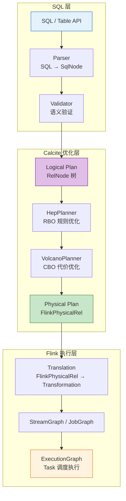
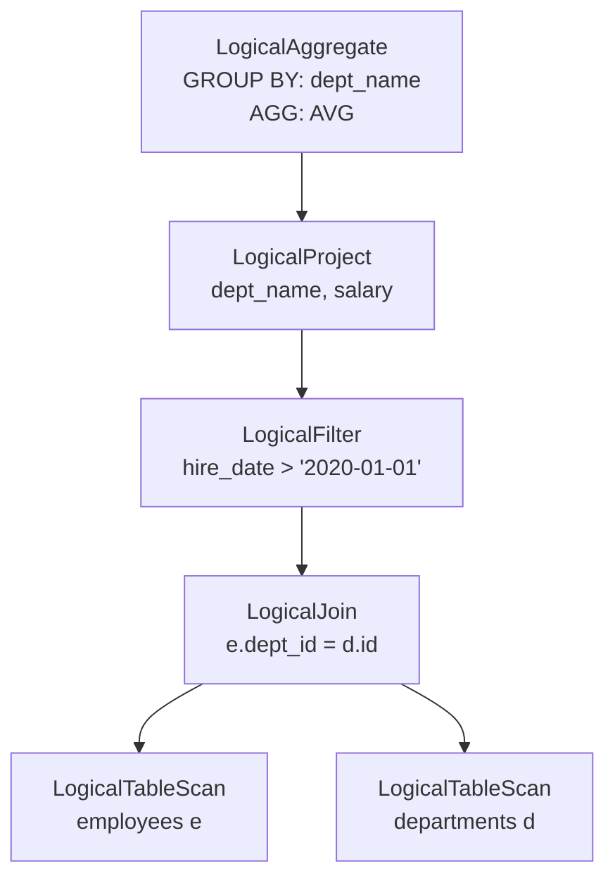
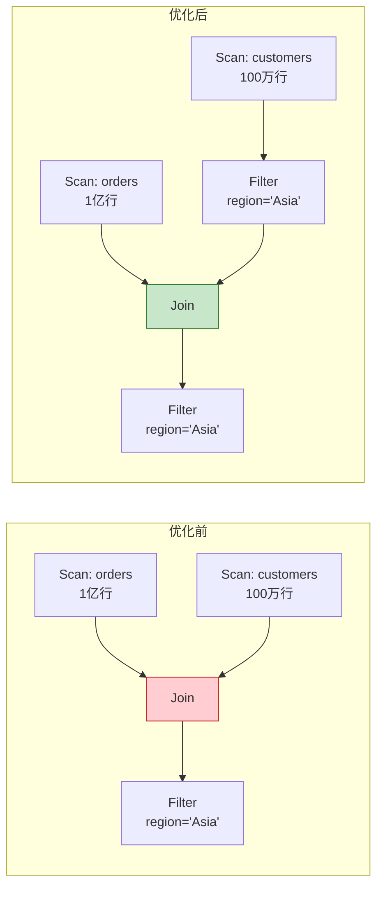
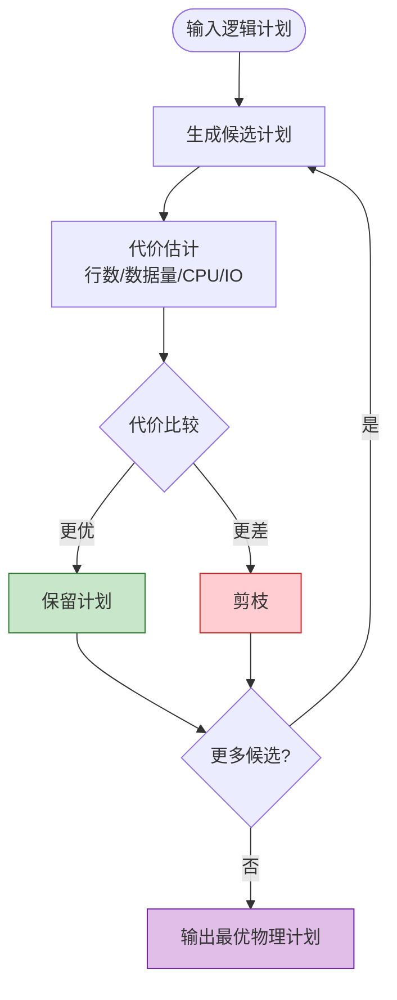
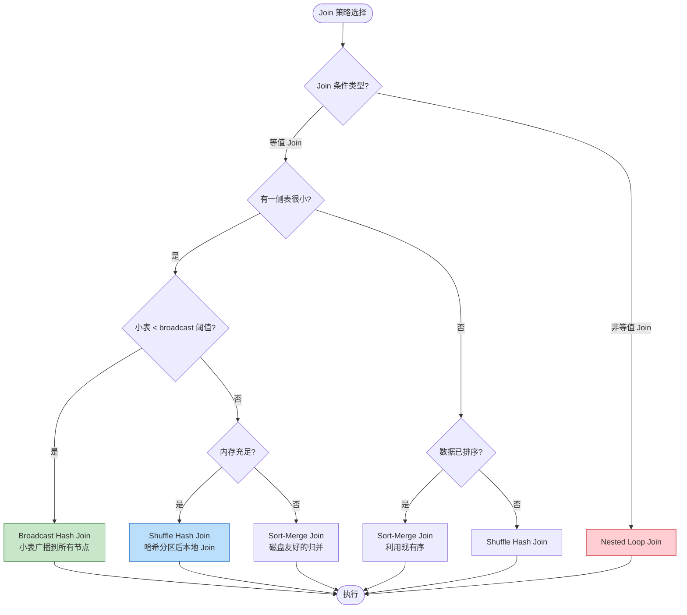
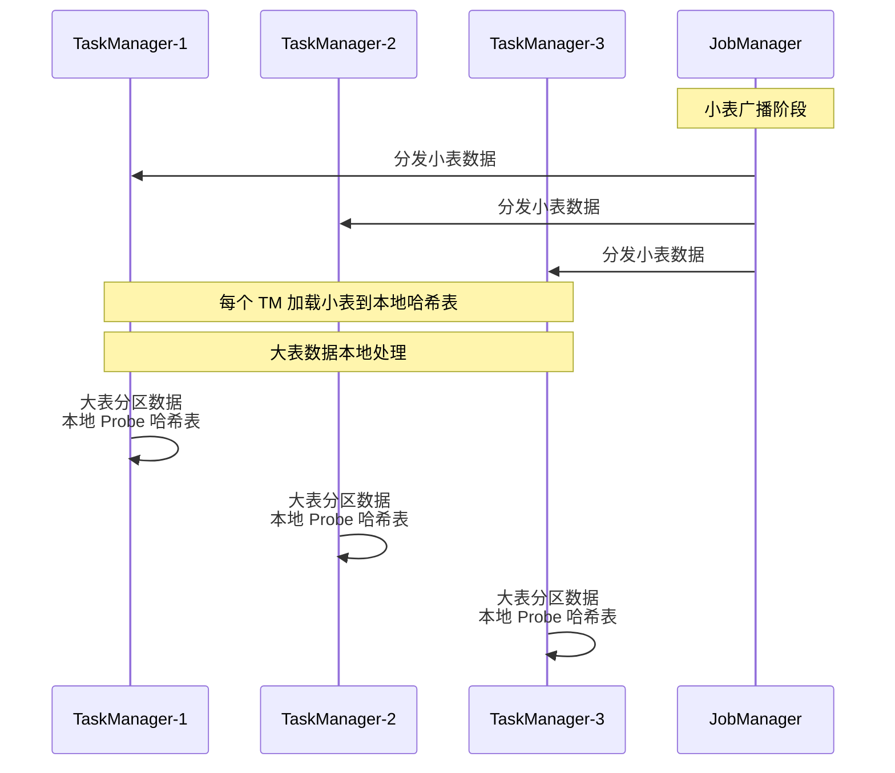
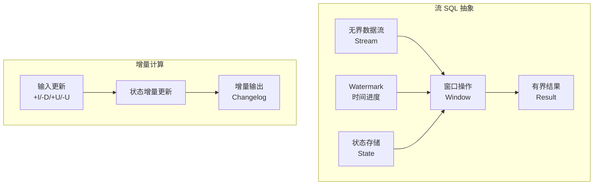
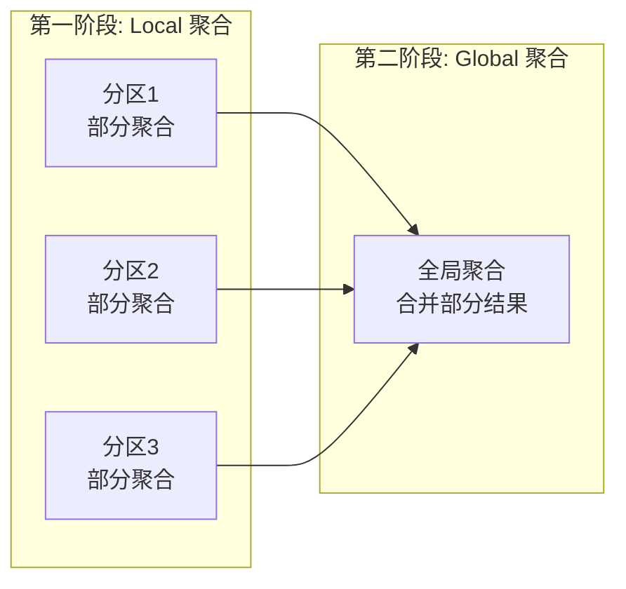

# Flink SQL 查询优化分析 (Flink SQL Query Optimization Analysis)

> **文档定位**: 本文档系统分析 Flink SQL/Table API 查询优化器的核心机制，涵盖架构设计、优化策略、Join 算法选择与流计算增量优化。
>
> **前置知识**: [Dataflow 模型形式化](../../../Struct/01-foundation/01.04-dataflow-model-formalization.md)、[Apache Calcite 优化框架](https://calcite.apache.org/docs/)

---

## 目录

- [Flink SQL 查询优化分析 (Flink SQL Query Optimization Analysis)](#flink-sql-查询优化分析-flink-sql-query-optimization-analysis)
  - [目录](#目录)
  - [1. Flink SQL 架构概述](#1-flink-sql-架构概述)
    - [1.1 整体架构](#11-整体架构)
    - [1.2 Planner 组件详解](#12-planner-组件详解)
    - [1.3 逻辑计划与物理计划](#13-逻辑计划与物理计划)
  - [2. 规则优化 (RBO - Rule-Based Optimization)](#2-规则优化-rbo-rule-based-optimization)
    - [2.1 RBO 概述](#21-rbo-概述)
    - [2.2 核心优化规则分类](#22-核心优化规则分类)
    - [2.3 谓词下推 (Predicate Pushdown)](#23-谓词下推-predicate-pushdown)
    - [2.4 投影下推 (Projection Pushdown)](#24-投影下推-projection-pushdown)
    - [2.5 子查询去关联化](#25-子查询去关联化)
  - [3. 代价优化 (CBO - Cost-Based Optimization)](#3-代价优化-cbo-cost-based-optimization)
    - [3.1 CBO 概述](#31-cbo-概述)
    - [3.2 成本模型 (Cost Model)](#32-成本模型-cost-model)
    - [3.3 统计信息与基数估计](#33-统计信息与基数估计)
    - [3.4 Join 重排序 (Join Reordering)](#34-join-重排序-join-reordering)
  - [4. Join 优化策略](#4-join-优化策略)
    - [4.1 Join 算法对比](#41-join-算法对比)
    - [4.2 Join 策略选择决策树](#42-join-策略选择决策树)
    - [4.3 Broadcast Hash Join](#43-broadcast-hash-join)
    - [4.4 Shuffle Hash Join](#44-shuffle-hash-join)
    - [4.5 Sort-Merge Join](#45-sort-merge-join)
  - [5. 流 SQL 增量计算优化](#5-流-sql-增量计算优化)
    - [5.1 流计算模型](#51-流计算模型)
    - [5.2 Changelog 语义](#52-changelog-语义)
    - [5.3 窗口聚合优化](#53-窗口聚合优化)
    - [5.4 状态 TTL 与清理策略](#54-状态-ttl-与清理策略)
  - [6. 优化规则分类表](#6-优化规则分类表)
    - [6.1 完整优化规则分类](#61-完整优化规则分类)
    - [6.2 规则启用配置](#62-规则启用配置)
  - [7. 调优建议与最佳实践](#7-调优建议与最佳实践)
    - [7.1 统计信息维护](#71-统计信息维护)
    - [7.2 Join 调优指南](#72-join-调优指南)
    - [7.3 流作业状态优化](#73-流作业状态优化)
    - [7.4 常见性能陷阱](#74-常见性能陷阱)
    - [7.5 性能诊断清单](#75-性能诊断清单)
  - [8. 总结](#8-总结)
    - [8.1 关键要点回顾](#81-关键要点回顾)
    - [8.2 参考资源](#82-参考资源)
  - [参考文献](#参考文献)

## 1. Flink SQL 架构概述

### 1.1 整体架构

Flink SQL 查询处理遵循经典的编译器架构，分为解析、验证、优化和执行四个阶段[^1]。其核心组件包括：



**图说明**：

- **Parser**: 基于 Apache Calcite 的 SQL 解析器，将 SQL 文本转换为抽象语法树 (AST)
- **Validator**: 执行语义验证，包括表/列存在性检查、类型推导、权限验证
- **Logical Plan**: 与执行引擎无关的关系代数表示，包含 `LogicalFilter`, `LogicalJoin`, `LogicalAggregate` 等算子
- **Physical Plan**: 绑定到 Flink 执行引擎的具体实现，选择特定的算法和数据结构

### 1.2 Planner 组件详解

Flink SQL 的 Planner 是连接 SQL 声明式语义与 Flink 执行模型的桥梁：

| 组件 | 职责 | 输入 | 输出 |
|-----|------|------|------|
| **SqlParser** | SQL 词法/语法分析 | SQL String | SqlNode AST |
| **SqlValidator** | 语义验证、类型推导 | SqlNode + Catalog | 验证后的 SqlNode |
| **SqlToRelConverter** | 转换为关系代数 | SqlNode | RelNode 树 |
| **HepPlanner** | 启发式规则优化 | RelNode | 优化后的 RelNode |
| **VolcanoPlanner** | 代价模型优化 | RelNode + Statistics | 最优 Physical RelNode |
| **RelNodeToFlinkTranslator** | 转换为执行图 | FlinkPhysicalRel | Transformation 链 |

**Planner 类型演进**[^2]：

- **Flink 1.9 之前**: 使用 `FlinkPlannerImpl`，基于 Calcite 1.7
- **Flink 1.9-1.16**: 引入 Blink Planner，成为默认 Planner
- **Flink 1.17+**: Blink Planner 完全替代旧 Planner，支持更完善的流批一体语义

### 1.3 逻辑计划与物理计划

**逻辑计划 (Logical Plan)** 是查询的关系代数表示，与执行引擎无关：

```sql
-- 示例 SQL
SELECT d.dept_name, AVG(e.salary) as avg_salary
FROM employees e
JOIN departments d ON e.dept_id = d.id
WHERE e.hire_date > '2020-01-01'
GROUP BY d.dept_name
```

对应的逻辑计划树：



**物理计划 (Physical Plan)** 将逻辑算子映射到 Flink 特定的实现：

| 逻辑算子 | 可能的物理实现 | 选择依据 |
|---------|--------------|---------|
| `LogicalJoin` | `HashJoin`, `SortMergeJoin`, `NestedLoopJoin`, `BroadcastHashJoin` | 数据大小、统计信息、并行度 |
| `LogicalAggregate` | `HashAggregate`, `SortAggregate`, `IncrementalAggregate` | 分组键基数、内存限制、流/批模式 |
| `LogicalSort` | `SortOperator`, `LimitOperator` | Top-N 优化、偏移量 |
| `LogicalFilter` | 谓词下推至 Source、算子内过滤 | 源系统能力、选择性 |

---

## 2. 规则优化 (RBO - Rule-Based Optimization)

### 2.1 RBO 概述

规则优化 (RBO) 基于预定义的启发式规则对查询计划进行重写，不依赖统计信息。Flink 使用 Calcite 的 **HepPlanner** 执行 RBO，按固定顺序应用规则集合[^3]。

**RBO 的核心特性**：

- **确定性**: 相同输入总是产生相同输出
- **无状态**: 不依赖表的统计信息
- **高效性**: 规则应用开销低，适合快速优化
- **安全性**: 规则保持语义等价性

### 2.2 核心优化规则分类

| 类别 | 规则名称 | 描述 | 适用场景 |
|-----|---------|------|---------|
| **谓词优化** | PredicatePushdown | 将过滤条件下推至数据源 | 减少中间数据量 |
| | ConstantFolding | 常量表达式预计算 | `1 + 2` → `3` |
| | SimplifyFilter | 简化布尔表达式 | `NOT (a > 5)` → `a <= 5` |
| **投影优化** | ProjectPushdown | 列裁剪下推 | 只读取需要的列 |
| | ProjectMerge | 合并相邻投影 | 减少算子数量 |
| **Join 优化** | JoinReorder | 多表 Join 顺序重排 | 最小化中间结果 |
| | FilterIntoJoin | 谓词下推至 Join 内部 | 提前过滤 |
| **聚合优化** | AggregateProjectMerge | 聚合与投影合并 | 减少冗余计算 |
| | DistinctAggSplit | DISTINCT 聚合拆分 | 优化多 DISTINCT |
| **子查询优化** | SubQueryRemove | 子查询去关联化 | 转换为 Join |
| | Decorrelate | 关联子查询展开 | 提升并行度 |

### 2.3 谓词下推 (Predicate Pushdown)

谓词下推是 RBO 中最重要、最有效的规则之一：

**形式化定义**[^4]:

对于关系 $R$ 和 $S$，可分解谓词 $\theta = \theta_R \land \theta_S$（其中 $\theta_R$ 仅涉及 $R$ 的属性，$\theta_S$ 仅涉及 $S$ 的属性）：

$$\sigma_\theta(R \bowtie S) \equiv \sigma_{\theta_R}(R) \bowtie \sigma_{\theta_S}(S)$$

**执行效果对比**：



**优化效果量化**：

假设 `customers` 表中 `region='Asia'` 的选择性为 10%：

- 优化前：Join 输入 = 1亿 + 100万 = 1.01亿行
- 优化后：Join 输入 = 1亿 + 10万 = 1.001亿行
- **减少数据扫描 99%**

### 2.4 投影下推 (Projection Pushdown)

投影下推裁剪不需要的列，减少 IO 和网络传输：

**示例**：

```sql
-- 原始表有 100 列
SELECT order_id, customer_name FROM wide_table;
```

**优化效果**：

| 维度 | 优化前 | 优化后 | 优化比例 |
|------|-------|-------|---------|
| 读取列数 | 100 | 2 | 98% |
| 网络传输 | 100% | ~10% | 90% |
| 内存占用 | 基准 | ~15% | 85% |
| 序列化开销 | 100% | ~20% | 80% |

### 2.5 子查询去关联化

关联子查询是性能杀手，RBO 将其转换为等价的 Join：

```sql
-- 关联子查询(优化前)
SELECT * FROM employees e
WHERE e.salary > (SELECT AVG(salary) FROM employees WHERE dept_id = e.dept_id);

-- 去关联化后(优化后)
SELECT e.*
FROM employees e
JOIN (
    SELECT dept_id, AVG(salary) as avg_sal
    FROM employees
    GROUP BY dept_id
) avg ON e.dept_id = avg.dept_id
WHERE e.salary > avg.avg_sal;
```

**性能提升**：关联子查询的时间复杂度为 $O(n^2)$，去关联化后通过 Hash Join 降为 $O(n)$。

---

## 3. 代价优化 (CBO - Cost-Based Optimization)

### 3.1 CBO 概述

代价优化 (CBO) 基于统计信息估计不同执行计划的代价，选择最优方案。Flink 使用 Calcite 的 **VolcanoPlanner** 实现 CBO，采用动态规划和分支限界算法[^5]。

**CBO 的核心流程**：



### 3.2 成本模型 (Cost Model)

CBO 的成本模型将物理计划映射为非负实数，量化执行开销：

$$Cost(PP) = \alpha \cdot CPU(PP) + \beta \cdot IO(PP) + \gamma \cdot Network(PP) + \delta \cdot State(PP)$$

其中：

| 成本项 | 描述 | 影响因素 |
|-------|------|---------|
| $CPU$ | CPU 计算开销 | 算子复杂度、数据量 |
| $IO$ | 磁盘 IO 开销 | 状态后端、Checkpoint 频率 |
| $Network$ | 网络传输开销 | Shuffle 数据量、分区策略 |
| $State$ | 状态存储开销 | 状态大小、访问模式 |

**流计算的特殊考量**：

对于流 SQL，状态成本 $State(PP)$ 至关重要。无限增长的状态会导致 OOM，因此 CBO 必须考虑：

- 窗口类型（Tumble/Hop/Session）
- TTL 配置
- Watermark 延迟

### 3.3 统计信息与基数估计

准确的统计信息是 CBO 有效性的前提：

**支持的统计信息**[^6]：

| 统计项 | 描述 | 计算方式 |
|-------|------|---------|
| `rowCount` | 表行数 | `ANALYZE TABLE` 或元数据 |
| `ndv` (distinct values) | 列基数 | HyperLogLog 近似 |
| `nullCount` | NULL 值数量 | 直方图统计 |
| `avgLen` | 平均行长度 | 采样统计 |
| `maxLen` | 最大行长度 | 极值统计 |
| `minValue` / `maxValue` | 值域范围 | 边界统计 |

**基数估计公式**：

对于 Join 操作，CBO 使用以下公式估计结果集大小：

$$|R \bowtie S| = \frac{|R| \cdot |S|}{\max(V(R, A), V(S, B))}$$

其中 $V(R, A)$ 表示关系 $R$ 在属性 $A$ 上的不同值数量 (NDV)。

### 3.4 Join 重排序 (Join Reordering)

多表 Join 的执行顺序对性能影响巨大。对于 $n$ 个表的 Join，可能的执行计划数为 Catalan 数：

$$|\mathcal{T}(n)| \leq \text{Catalan}(n-1) \cdot (n-1)! = \frac{(2n-2)!}{(n-1)!}$$

**示例**（4 表 Join）：

```sql
SELECT * FROM A, B, C, D
WHERE A.id = B.a_id AND B.id = C.b_id AND C.id = D.c_id;
```

可能的 Join 树形状：

| 形状 | 描述 | 中间结果风险 |
|-----|------|-------------|
| 左深树 | `(((A⋈B)⋈C)⋈D)` | 可能产生大中间结果 |
| 右深树 | `(A⋈(B⋈(C⋈D)))` | 取决于数据分布 |
| 丛状树 | `(A⋈B)⋈(C⋈D)` | 通常更均衡 |

**CBO 决策示例**：

| 表 | 行数 | 参与 Join 后的选择性 |
|-----|------|---------------------|
| A | 1000 | 1.0 |
| B | 10000 | 0.1 (与 A Join 后) |
| C | 100000 | 0.01 (与 B Join 后) |
| D | 1000 | 1.0 |

**最优顺序**：$((A \bowtie D) \bowtie B) \bowtie C$，优先 Join 小表减少中间结果。

---

## 4. Join 优化策略

### 4.1 Join 算法对比

Flink SQL 支持多种 Join 算法，CBO 根据统计信息自动选择：

| Join 类型 | 适用条件 | 时间复杂度 | 空间复杂度 | 网络开销 |
|----------|---------|-----------|-----------|---------|
| **Broadcast Hash Join** | 一侧表 < broadcast 阈值 | $O(|R| + |S|)$ | $O(|S|)$ | 小表全量广播 |
| **Shuffle Hash Join** | 两表都较大，等值 Join | $O(|R| + |S|)$ | $O(\min(|R|, |S|))$ | 双方 Shuffle |
| **Sort-Merge Join** | 数据有序或超大表 | $O(|R| \log |R| + |S| \log |S|)$ | $O(1)$ | 双方 Shuffle |
| **Nested Loop Join** | 非等值 Join 或小表 | $O(|R| \cdot |S|)$ | $O(1)$ |  Cartesian 积 |

### 4.2 Join 策略选择决策树



### 4.3 Broadcast Hash Join

Broadcast Hash Join 将小表广播到所有 TaskManager，避免大数据量的 Shuffle：

**适用场景**：

- 维表 Join（dimension table）
- 小表与大表 Join（如配置表 < 1GB）
- 静态数据 Join 流数据

**执行流程**：



**配置参数**[^7]：

```sql
-- 方法 1: SQL Hint
SELECT /*+ BROADCAST(d) */ *
FROM fact_table f
JOIN dimension_table d ON f.dim_id = d.id;

-- 方法 2: Table Config
SET table.optimizer.join.broadcast-threshold = '10MB';
```

### 4.4 Shuffle Hash Join

当两表都较大时，使用 Shuffle Hash Join 将相同 key 的数据分区到同一节点：

```mermaid
graph LR
    subgraph "上游"
        A1[Table A<br/>Partition 1]
        A2[Table A<br/>Partition 2]
        B1[Table B<br/>Partition 1]
        B2[Table B<br/>Partition 2]
    end

    subgraph "Shuffle 阶段"
        S1[Hash(Key) % 2 = 0]
        S2[Hash(Key) % 2 = 1]
    end

    subgraph "Join 阶段"
        J1[Join Task 1<br/>Build: B / Probe: A]
        J2[Join Task 2<br/>Build: B / Probe: A]
    end

    A1 --> S1
    A1 --> S2
    A2 --> S1
    A2 --> S2
    B1 --> S1
    B1 --> S2
    B2 --> S1
    B2 --> S2

    S1 --> J1
    S2 --> J2
```

**优化要点**：

- **Build 侧选择**: 将小表作为 Build 侧构建哈希表
- **内存管理**: 使用 RocksDB 状态后端处理超大数据
- **数据倾斜处理**: 使用 SALT key 或两阶段聚合

### 4.5 Sort-Merge Join

Sort-Merge Join 适用于以下场景：

1. 数据已经有序（如按主键排序的表）
2. 内存受限，无法容纳哈希表
3. 流 Join 需要保留历史状态

**复杂度分析**：

| 阶段 | 操作 | 复杂度 |
|-----|------|-------|
| Sort | 若未排序 | $O(n \log n)$ |
| Merge | 双指针遍历 | $O(n + m)$ |
| 总计 | - | $O(n \log n + m \log m)$ |

---

## 5. 流 SQL 增量计算优化

### 5.1 流计算模型

流 SQL 的核心挑战是在无界数据流上产生有界结果[^8]。Flink 通过以下机制实现：



### 5.2 Changelog 语义

流 SQL 使用 Changelog 模型处理数据变更：

| 变更类型 | 符号 | 描述 | 示例 |
|---------|-----|------|------|
| Insert | `+I` | 新增记录 | 新订单到达 |
| Delete | `-D` | 删除记录 | 订单取消 |
| Update Before | `-U` | 更新前的值 | 订单修改前的状态 |
| Update After | `+U` | 更新后的值 | 订单修改后的状态 |

**增量聚合示例**：

```sql
-- 计算每个用户的实时订单金额
SELECT user_id, SUM(amount) as total_amount
FROM orders
GROUP BY user_id;
```

当新订单到达时 (`+I`)：

1. 查询当前用户的聚合值（状态查找）
2. 计算新聚合值：`new_total = old_total + amount`
3. 更新状态存储
4. 输出 `+U` 或 `+I` 到下游

### 5.3 窗口聚合优化

Flink SQL 支持多种窗口类型，优化器自动选择最高效的实现：

| 窗口类型 | 语义 | 状态大小 | 适用场景 |
|---------|------|---------|---------|
| **TUMBLE** | 固定大小、不重叠 | $O(keys \cdot window\_size)$ | 每小时统计 |
| **HOP** | 滑动窗口、可重叠 | $O(keys \cdot windows\_per\_key)$ | 近5分钟每30秒 |
| **SESSION** | 活动会话、动态大小 | $O(active\_sessions)$ | 用户行为分析 |
| **CUMULATE** | 累积窗口 | $O(keys)$ | 累计PV |
| **INTERVAL** | 行时间间隔 | $O(keys \cdot interval)$ | IoT 数据关联 |

**两阶段聚合优化**：

对于高基数的 Group By，使用 Local-Global 聚合减少网络 Shuffle：



**配置启用**[^9]：

```sql
SET table.optimizer.agg-phase-strategy = 'TWO_PHASE';
```

### 5.4 状态 TTL 与清理策略

流 Join 和聚合需要显式管理状态大小，防止 OOM：

**状态清理策略对比**：

| 策略 | 触发条件 | 优点 | 缺点 |
|-----|---------|------|------|
| **TTL (Time-To-Live)** | 状态持续时间 | 简单可控 | 可能误删有效状态 |
| **Watermark 驱动** | Watermark 推进 | 精确、事件时间语义 | 延迟敏感 |
| **Size 限制** | 状态大小阈值 | 防止 OOM | 非确定性清理 |

**Interval Join 状态边界**[^10]：

对于时间范围 Join `|r.t - s.t| < δ`，状态大小有上界：

$$|State_{join}(t)| \leq |R(t) - R(t - 2\delta - lateness)| + |S(t) - S(t - 2\delta - lateness)|$$

**TTL 配置示例**：

```sql
-- 方式 1: SQL 级别
SET table.exec.state.ttl = '1 hour';

-- 方式 2: Table API
Table result = tableEnv
    .sqlQuery("SELECT * FROM A JOIN B ON A.id = B.id")
    .withIdleStateRetention(Duration.ofHours(1));
```

---

## 6. 优化规则分类表

### 6.1 完整优化规则分类

| 类别 | 规则名称 | 阶段 | 默认启用 | 流/批 | 描述 |
|-----|---------|------|---------|-------|------|
| **谓词优化** | PredicatePushDown | RBO | ✅ | 两者 | 谓词下推至数据源 |
| | FilterIntoJoin | RBO | ✅ | 两者 | 过滤条件下推至 Join |
| | SimplifyFilter | RBO | ✅ | 两者 | 简化布尔表达式 |
| | ConstantFolding | RBO | ✅ | 两者 | 常量折叠 |
| **投影优化** | ProjectPushDown | RBO | ✅ | 两者 | 列裁剪下推 |
| | ProjectMerge | RBO | ✅ | 两者 | 合并相邻投影 |
| | ProjectRemove | RBO | ✅ | 两者 | 移除冗余投影 |
| **Join 优化** | ReorderJoin | CBO | ❌ | 两者 | Join 重排序[^11] |
| | JoinToMultiJoin | RBO | ✅ | 批 | 多 Join 展开 |
| | FilterIntoJoinRule | RBO | ✅ | 两者 | Join 条件优化 |
| **聚合优化** | AggregateProjectMerge | RBO | ✅ | 两者 | 聚合投影合并 |
| | DistinctAggSplit | RBO | ❌ | 两者 | DISTINCT 拆分 |
| | TwoPhaseAgg | RBO | ✅ | 两者 | 两阶段聚合 |
| | SplitAggregateRule | RBO | ❌ | 流 | 增量聚合拆分 |
| **窗口优化** | WindowGroupReorder | RBO | ✅ | 流 | 窗口分组重排 |
| | WindowJoinTranspose | RBO | ✅ | 流 | 窗口 Join 转置 |
| **子查询优化** | SubQueryRemove | RBO | ✅ | 两者 | 子查询去关联 |
| | Decorrelate | RBO | ✅ | 两者 | 关联查询展开 |
| **计算下推** | PushProjectIntoSource | RBO | ✅ | 两者 | 投影下推至 Source |
| | PushFilterIntoSource | RBO | ✅ | 两者 | 过滤下推至 Source |
| **物化优化** | MaterializedViewRewrite | CBO | ❌ | 批 | 物化视图重写 |

### 6.2 规则启用配置

```sql
-- 启用 CBO Join 重排序
SET table.optimizer.join-reorder-enabled = 'true';

-- 启用 DISTINCT 聚合拆分
SET table.optimizer.distinct-agg.split.enabled = 'true';

-- 设置广播 Join 阈值
SET table.optimizer.join.broadcast-threshold = '1MB';

-- 设置 CBO 计划枚举限制
SET table.optimizer.cbo.max-enum-candidates = '10000';
```

---

## 7. 调优建议与最佳实践

### 7.1 统计信息维护

**定期分析表**：

```sql
-- 分析整张表
ANALYZE TABLE orders COMPUTE STATISTICS;

-- 分析指定列
ANALYZE TABLE orders COMPUTE STATISTICS FOR COLUMNS user_id, amount;

-- 采样分析(大数据表)
ANALYZE TABLE big_table COMPUTE STATISTICS WITH SAMPLE 10 PERCENT;
```

**统计信息检查**：

```sql
-- 查看表统计信息
SHOW CREATE TABLE orders;

-- 通过 EXPLAIN 查看优化器使用的统计
EXPLAIN PLAN FOR SELECT * FROM orders WHERE user_id = 123;
```

### 7.2 Join 调优指南

| 场景 | 推荐策略 | 配置/HINT |
|-----|---------|----------|
| 大表 Join 小表 (< 1MB) | Broadcast Hash Join | `/*+ BROADCAST(small_table) */` |
| 大表 Join 大表 | Shuffle Hash Join | 确保等值条件，启用 CBO |
| 超大表 Join | Sort-Merge Join | 内存受限时使用 |
| 数据倾斜 | SALT Key 优化 | 加盐后两阶段聚合 |
| 流维表 Join | Lookup Join | 使用异步 Lookup |

**数据倾斜处理**：

```sql
-- 加盐处理数据倾斜
WITH salted AS (
    SELECT
        user_id,
        -- 生成 0-9 的盐值
        CONCAT(CAST(user_id AS STRING), '_', CAST(RAND() * 10 AS INT)) as salt_key,
        amount
    FROM orders
)
SELECT
    o.user_id,
    SUM(o.amount) as total
FROM salted o
JOIN users u ON o.salt_key = CONCAT(CAST(u.id AS STRING), '_', CAST(RAND() * 10 AS INT))
GROUP BY o.user_id;
```

### 7.3 流作业状态优化

**状态大小控制**：

```sql
-- 1. 设置合理的状态 TTL
SET table.exec.state.ttl = '24 hours';

-- 2. 使用 RocksDB 状态后端(大状态)
SET state.backend = 'rocksdb';
SET state.backend.incremental = 'true';

-- 3. 配置增量 Checkpoint
SET execution.checkpointing.interval = '5 minutes';
SET execution.checkpointing.max-concurrent-checkpoints = '1';
```

**窗口优化建议**：

| 窗口类型 | 建议 | 原因 |
|---------|------|------|
| TUMBLE | 首选 | 状态清理最及时 |
| HOP | 控制窗口重叠度 | 重叠度高导致状态膨胀 |
| SESSION | 设置 gap 阈值 | 防止长时间不关闭 |
| CUMULATE | 使用增量计算 | 避免重复计算 |

### 7.4 常见性能陷阱

| 问题 | 现象 | 解决方案 |
|-----|------|---------|
| **状态无限增长** | OOM、Checkpoint 超时 | 设置 TTL，使用窗口代替 Regular Join |
| **数据倾斜** | 部分 Subtask 处理缓慢 | 加盐、两阶段聚合 |
| **小文件过多** | 写入 HDFS/S3 性能差 | 使用 FileSink 的 compaction |
| **反压严重** | 延迟升高、吞吐量下降 | 优化算子逻辑，增加并行度 |
| **统计信息过期** | CBO 选择次优计划 | 定期执行 ANALYZE TABLE |
| **非等值 Join** | 性能急剧下降 | 改写查询，使用窗口关联 |

### 7.5 性能诊断清单

**查询执行前检查**：

- [ ] 表统计信息是否最新？
- [ ] 是否有合适的分区/分桶？
- [ ] Join 条件是否可下推？
- [ ] 是否使用了 SELECT *？（改为明确列）
- [ ] 流作业是否设置了状态 TTL？

**查询执行中监控**：

- [ ] 检查 Web UI 的 Backpressure 状态
- [ ] 观察各 Subtask 的 Records Received/Sent 是否均衡
- [ ] 监控 Checkpoint 持续时间
- [ ] 检查 RocksDB 状态大小增长趋势

**查询执行后复盘**：

- [ ] 对比 EXPLAIN 计划与实际执行
- [ ] 分析热点算子耗时
- [ ] 评估是否需要调整并行度

---

## 8. 总结

### 8.1 关键要点回顾

1. **架构分层**: Flink SQL 采用 Parser → Logical Plan → RBO → CBO → Physical Plan → Execution 的标准编译器架构

2. **RBO 核心**: 谓词下推、投影下推、子查询去关联化是性能优化的基础

3. **CBO 价值**: Join 重排序、物理算子选择依赖准确的统计信息和成本模型

4. **Join 策略**: Broadcast Join 适合小表，Shuffle Hash Join 适合大表等值 Join，Sort-Merge Join 适合内存受限场景

5. **流计算特性**: 状态管理是流 SQL 的核心挑战，TTL、Watermark、窗口是控制状态的关键机制

### 8.2 参考资源

- [Apache Flink SQL 文档](https://nightlies.apache.org/flink/flink-docs-stable/docs/dev/table/sql/)
- [Apache Calcite 优化器文档](https://calcite.apache.org/docs/)
- [Flink SQL 性能调优指南](https://nightlies.apache.org/flink/flink-docs-stable/docs/dev/table/tuning/)

---

## 参考文献

[^1]: Apache Flink. "Apache Flink SQL Query Engine." Apache Flink Documentation. <https://nightlies.apache.org/flink/flink-docs-stable/docs/dev/table/>

[^2]: Apache Flink. "Blink Planner Migration." Flink 1.9 Release Notes. <https://flink.apache.org/news/2019/08/22/release-1.9.0.html>

[^3]: Apache Calcite. "HepPlanner - Heuristic Planner." Calcite Source Code. <https://github.com/apache/calcite/blob/main/core/src/main/java/org/apache/calcite/plan/hep/HepPlanner.java>

[^4]: Graefe, G. "The Cascades Framework for Query Optimization." IEEE Data Engineering Bulletin, 1995.

[^5]: Graefe, G., & McKenna, W. "The Volcano Optimizer Generator: Extensibility and Efficient Search." ICDE 1993.

[^6]: Apache Flink. "Table API & SQL - Statistics." Flink Documentation. <https://nightlies.apache.org/flink/flink-docs-stable/docs/dev/table/stats/>

[^7]: Apache Flink. "Broadcast State Pattern." Flink Documentation. <https://nightlies.apache.org/flink/flink-docs-stable/docs/dev/datastream/fault-tolerance/broadcast_state/>

[^8]: Akidau, T., et al. "The Dataflow Model: A Practical Approach to Balancing Correctness, Latency, and Cost in Massive-Scale, Unbounded, Out-of-Order Data Processing." Proceedings of the VLDB Endowment, 2015.

[^9]: Apache Flink. "Aggregate Optimization." Flink Table API Documentation. <https://nightlies.apache.org/flink/flink-docs-stable/docs/dev/table/tuning/>

[^10]: Apache Flink. "Interval Join." Flink SQL Documentation. <https://nightlies.apache.org/flink/flink-docs-stable/docs/dev/table/sql/queries/joins/>

[^11]: Apache Flink. "CBO (Cost-Based Optimizer)." Flink Configuration. <https://nightlies.apache.org/flink/flink-docs-stable/docs/dev/table/config/>
