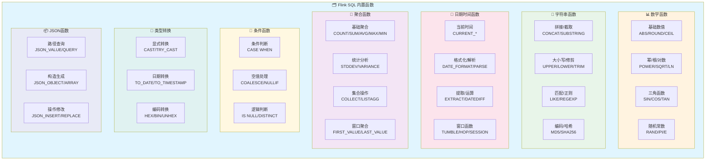

# Flink SQL 函数快速参考

> 所属阶段: Flink/03-sql-table-api | 前置依赖: [flink-table-sql-complete-guide.md](./flink-table-sql-complete-guide.md), [flink-sql-window-functions-deep-dive.md](./flink-sql-window-functions-deep-dive.md) | 形式化等级: L4

---

## 1. 概念定义 (Definitions)

### Def-F-03-01: SQL内置函数分类

Flink SQL内置函数按功能可分为以下类别：

| 类别 | 描述 | 数量 |
|------|------|------|
| **数学函数** | 数值计算、三角函数、随机数生成 | 25+ |
| **字符串函数** | 字符串操作、模式匹配、编码转换 | 35+ |
| **日期时间函数** | 日期时间处理、格式化、提取 | 30+ |
| **聚合函数** | 分组统计、集合操作 | 20+ |
| **条件函数** | 条件判断、空值处理 | 10+ |
| **类型转换函数** | 显式类型转换、安全转换 | 15+ |
| **JSON函数** | JSON解析、构造、查询 | 10+ |
| **窗口函数** | 时间/计数窗口操作 | 5+ |

### Def-F-03-02: 版本兼容性标记

| 标记 | 含义 | 说明 |
|------|------|------|
| 🟢 | 稳定版本 | Flink 1.12+ 全支持 |
| 🟡 | 较新版本 | Flink 1.15+ 引入 |
| 🔵 | 实验特性 | Flink 1.17+，可能变更 |
| ⭐ | 高频使用 | 日常开发中最常用 |

---

## 2. 数学函数 (Mathematical Functions)

### 2.1 基础数值函数

| 函数 | 签名 | 返回值 | 示例 | 结果 | 版本 |
|------|------|--------|------|------|------|
| **ABS** ⭐ | `ABS(numeric)` | 同输入类型 | `ABS(-5.5)` | 5.5 | 🟢 |
| **ROUND** ⭐ | `ROUND(numeric, int)` | DECIMAL/DOUBLE | `ROUND(3.14159, 2)` | 3.14 | 🟢 |
| **CEIL** ⭐ | `CEIL(numeric)` | BIGINT | `CEIL(3.2)` | 4 | 🟢 |
| **FLOOR** ⭐ | `FLOOR(numeric)` | BIGINT | `FLOOR(3.8)` | 3 | 🟢 |
| **TRUNCATE** | `TRUNCATE(numeric, int)` | DECIMAL/DOUBLE | `TRUNCATE(3.14159, 2)` | 3.14 | 🟢 |
| **SIGN** | `SIGN(numeric)` | INT | `SIGN(-10)` | -1 | 🟢 |
| **MOD** | `MOD(numeric, numeric)` | 同输入类型 | `MOD(10, 3)` | 1 | 🟢 |

### 2.2 幂运算与根函数

| 函数 | 签名 | 返回值 | 示例 | 结果 | 版本 |
|------|------|--------|------|------|------|
| **POWER** ⭐ | `POWER(numeric, numeric)` | DOUBLE | `POWER(2, 3)` | 8.0 | 🟢 |
| **SQRT** ⭐ | `SQRT(numeric)` | DOUBLE | `SQRT(16)` | 4.0 | 🟢 |
| **CBRT** | `CBRT(numeric)` | DOUBLE | `CBRT(27)` | 3.0 | 🟡 |
| **EXP** | `EXP(numeric)` | DOUBLE | `EXP(1)` | 2.718... | 🟢 |
| **LN** | `LN(numeric)` | DOUBLE | `LN(2.718)` | ~1.0 | 🟢 |
| **LOG10** | `LOG10(numeric)` | DOUBLE | `LOG10(100)` | 2.0 | 🟢 |
| **LOG2** | `LOG2(numeric)` | DOUBLE | `LOG2(8)` | 3.0 | 🟢 |
| **LOG** | `LOG(numeric, numeric)` | DOUBLE | `LOG(2, 8)` | 3.0 | 🟢 |

### 2.3 三角函数

| 函数 | 签名 | 返回值 | 示例 | 结果 | 版本 |
|------|------|--------|------|------|------|
| **SIN** | `SIN(numeric)` | DOUBLE | `SIN(0)` | 0.0 | 🟢 |
| **COS** | `COS(numeric)` | DOUBLE | `COS(0)` | 1.0 | 🟢 |
| **TAN** | `TAN(numeric)` | DOUBLE | `TAN(PI()/4)` | ~1.0 | 🟢 |
| **COT** | `COT(numeric)` | DOUBLE | `COT(PI()/4)` | ~1.0 | 🟢 |
| **ASIN** | `ASIN(numeric)` | DOUBLE | `ASIN(1)` | π/2 | 🟢 |
| **ACOS** | `ACOS(numeric)` | DOUBLE | `ACOS(1)` | 0.0 | 🟢 |
| **ATAN** | `ATAN(numeric)` | DOUBLE | `ATAN(1)` | π/4 | 🟢 |
| **ATAN2** | `ATAN2(numeric, numeric)` | DOUBLE | `ATAN2(1, 1)` | π/4 | 🟢 |

### 2.4 常数与随机函数

| 函数 | 签名 | 返回值 | 示例 | 结果 | 版本 |
|------|------|--------|------|------|------|
| **PI** ⭐ | `PI()` | DOUBLE | `PI()` | 3.14159... | 🟢 |
| **E** | `E()` | DOUBLE | `E()` | 2.71828... | 🟢 |
| **RAND** ⭐ | `RAND()` | DOUBLE | `RAND()` | [0,1)随机数 | 🟢 |
| **RAND_INTEGER** | `RAND_INTEGER(int)` | INT | `RAND_INTEGER(100)` | [0,100)整数 | 🟢 |
| **RANDOM** 🟡 | `RANDOM()` | DOUBLE | `RANDOM()` | [0,1)随机数 | 🟡 |

### 2.5 位运算函数

| 函数 | 签名 | 返回值 | 示例 | 结果 | 版本 |
|------|------|--------|------|------|------|
| **BITAND** | `BITAND(int, int)` | INT | `BITAND(5, 3)` | 1 | 🟢 |
| **BITOR** | `BITOR(int, int)` | INT | `BITOR(5, 3)` | 7 | 🟢 |
| **BITXOR** | `BITXOR(int, int)` | INT | `BITXOR(5, 3)` | 6 | 🟢 |
| **BITNOT** | `BITNOT(int)` | INT | `BITNOT(5)` | -6 | 🟢 |
| **BITSHIFT_LEFT** | `BITSHIFT_LEFT(int, int)` | INT | `BITSHIFT_LEFT(1, 3)` | 8 | 🟡 |
| **BITSHIFT_RIGHT** | `BITSHIFT_RIGHT(int, int)` | INT | `BITSHIFT_RIGHT(8, 3)` | 1 | 🟡 |

---

## 3. 字符串函数 (String Functions)

### 3.1 基础操作函数

| 函数 | 签名 | 返回值 | 示例 | 结果 | 版本 |
|------|------|--------|------|------|------|
| **CONCAT** ⭐ | `CONCAT(string...)` | STRING | `CONCAT('a', 'b', 'c')` | 'abc' | 🟢 |
| **CONCAT_WS** ⭐ | `CONCAT_WS(string, string...)` | STRING | `CONCAT_WS('-', 'a', 'b')` | 'a-b' | 🟢 |
| **SUBSTRING** ⭐ | `SUBSTRING(string, int[, int])` | STRING | `SUBSTRING('Hello', 2, 3)` | 'ell' | 🟢 |
| **REPLACE** ⭐ | `REPLACE(string, string, string)` | STRING | `REPLACE('abc', 'b', 'X')` | 'aXc' | 🟢 |
| **OVERLAY** | `OVERLAY(string PLACING string FROM int)` | STRING | `OVERLAY('abc' PLACING 'XY' FROM 2)` | 'aXYc' | 🟢 |
| **INSERT** | `INSERT(string, int, int, string)` | STRING | `INSERT('abcdef', 3, 2, 'XX')` | 'abXXef' | 🟢 |

### 3.2 大小写与修剪

| 函数 | 签名 | 返回值 | 示例 | 结果 | 版本 |
|------|------|--------|------|------|------|
| **UPPER** ⭐ | `UPPER(string)` | STRING | `UPPER('hello')` | 'HELLO' | 🟢 |
| **LOWER** ⭐ | `LOWER(string)` | STRING | `LOWER('WORLD')` | 'world' | 🟢 |
| **INITCAP** | `INITCAP(string)` | STRING | `INITCAP('hi there')` | 'Hi There' | 🟢 |
| **TRIM** ⭐ | `TRIM([spec] string FROM string)` | STRING | `TRIM('  hello  ')` | 'hello' | 🟢 |
| **LTRIM** | `LTRIM(string)` | STRING | `LTRIM('  hello')` | 'hello' | 🟢 |
| **RTRIM** | `RTRIM(string)` | STRING | `RTRIM('hello  ')` | 'hello' | 🟢 |
| **LPAD** | `LPAD(string, int[, string])` | STRING | `LPAD('hi', 5, '0')` | '000hi' | 🟢 |
| **RPAD** | `RPAD(string, int[, string])` | STRING | `RPAD('hi', 5, '0')` | 'hi000' | 🟢 |

### 3.3 长度与位置

| 函数 | 签名 | 返回值 | 示例 | 结果 | 版本 |
|------|------|--------|------|------|------|
| **LENGTH** ⭐ | `LENGTH(string)` | INT | `LENGTH('hello')` | 5 | 🟢 |
| **CHAR_LENGTH** ⭐ | `CHAR_LENGTH(string)` | INT | `CHAR_LENGTH('你好')` | 2 | 🟢 |
| **CHARACTER_LENGTH** | `CHARACTER_LENGTH(string)` | INT | 同CHAR_LENGTH | 2 | 🟢 |
| **OCTET_LENGTH** | `OCTET_LENGTH(string)` | INT | `OCTET_LENGTH('你好')` | 6 (UTF-8) | 🟢 |
| **POSITION** | `POSITION(string IN string)` | INT | `POSITION('el' IN 'hello')` | 2 | 🟢 |
| **LOCATE** | `LOCATE(string, string[, int])` | INT | `LOCATE('l', 'hello', 3)` | 4 | 🟢 |

### 3.4 模式匹配与正则

| 函数 | 签名 | 返回值 | 示例 | 结果 | 版本 |
|------|------|--------|------|------|------|
| **LIKE** ⭐ | `string LIKE pattern` | BOOLEAN | `'hello' LIKE 'h%'` | TRUE | 🟢 |
| **NOT LIKE** | `string NOT LIKE pattern` | BOOLEAN | `'hello' NOT LIKE 'x%'` | TRUE | 🟢 |
| **SIMILAR TO** | `string SIMILAR TO pattern` | BOOLEAN | `'abc' SIMILAR TO '(a\|b)%'` | TRUE | 🟢 |
| **RLIKE** 🟡 | `string RLIKE pattern` | BOOLEAN | `'abc' RLIKE 'a.*'` | TRUE | 🟡 |
| **REGEXP** 🟡 | `string REGEXP pattern` | BOOLEAN | `'abc' REGEXP '^a'` | TRUE | 🟡 |
| **REGEXP_EXTRACT** 🟡 | `REGEXP_EXTRACT(string, string[, int])` | STRING | `REGEXP_EXTRACT('foo-bar', 'foo-(.*)', 1)` | 'bar' | 🟡 |
| **REGEXP_REPLACE** 🟡 | `REGEXP_REPLACE(string, string, string)` | STRING | `REGEXP_REPLACE('abc123', '[0-9]', '')` | 'abc' | 🟡 |

### 3.5 编码与哈希

| 函数 | 签名 | 返回值 | 示例 | 结果 | 版本 |
|------|------|--------|------|------|------|
| **ASCII** | `ASCII(string)` | INT | `ASCII('A')` | 65 | 🟢 |
| **CHR** | `CHR(int)` | STRING | `CHR(65)` | 'A' | 🟢 |
| **ENCODE** 🟡 | `ENCODE(string, charset)` | BINARY | `ENCODE('hello', 'UTF-8')` | BINARY | 🟡 |
| **DECODE** 🟡 | `DECODE(binary, charset)` | STRING | `DECODE(binary, 'UTF-8')` | STRING | 🟡 |
| **MD5** 🟡 | `MD5(string)` | STRING | `MD5('hello')` | 32位哈希 | 🟡 |
| **SHA1** 🟡 | `SHA1(string)` | STRING | `SHA1('hello')` | 40位哈希 | 🟡 |
| **SHA256** 🟡 | `SHA256(string)` | STRING | `SHA256('hello')` | 64位哈希 | 🟡 |
| **SHA2** 🟡 | `SHA2(string, int)` | STRING | `SHA2('hello', 256)` | 64位哈希 | 🟡 |

### 3.6 字符串构造

| 函数 | 签名 | 返回值 | 示例 | 结果 | 版本 |
|------|------|--------|------|------|------|
| **REPEAT** | `REPEAT(string, int)` | STRING | `REPEAT('ab', 3)` | 'ababab' | 🟢 |
| **SPACE** | `SPACE(int)` | STRING | `SPACE(3)` | '   ' | 🟢 |
| **REVERSE** | `REVERSE(string)` | STRING | `REVERSE('abc')` | 'cba' | 🟢 |
| **SPLIT_INDEX** 🟡 | `SPLIT_INDEX(string, string, int)` | STRING | `SPLIT_INDEX('a,b,c', ',', 1)` | 'b' | 🟡 |
| **REGEXP_SPLIT** 🟡 | `REGEXP_SPLIT(string, string)` | ARRAY | `REGEXP_SPLIT('a,b,c', ',')` | ['a','b','c'] | 🟡 |

---

## 4. 日期时间函数 (Date/Time Functions)

### 4.1 当前时间函数

| 函数 | 签名 | 返回值 | 示例 | 结果 | 版本 |
|------|------|--------|------|------|------|
| **CURRENT_DATE** ⭐ | `CURRENT_DATE` | DATE | `CURRENT_DATE` | 2024-01-15 | 🟢 |
| **CURRENT_TIME** ⭐ | `CURRENT_TIME` | TIME | `CURRENT_TIME` | 14:30:00 | 🟢 |
| **CURRENT_TIMESTAMP** ⭐ | `CURRENT_TIMESTAMP` | TIMESTAMP(3) | `CURRENT_TIMESTAMP` | 2024-01-15 14:30:00.123 | 🟢 |
| **LOCALTIME** | `LOCALTIME` | TIME | `LOCALTIME` | 14:30:00 | 🟢 |
| **LOCALTIMESTAMP** | `LOCALTIMESTAMP` | TIMESTAMP(3) | `LOCALTIMESTAMP` | 2024-01-15 14:30:00.123 | 🟢 |
| **NOW** | `NOW()` | TIMESTAMP(3) | `NOW()` | 同CURRENT_TIMESTAMP | 🟢 |

### 4.2 日期时间构造

| 函数 | 签名 | 返回值 | 示例 | 结果 | 版本 |
|------|------|--------|------|------|------|
| **DATE** ⭐ | `DATE string` | DATE | `DATE '2024-01-15'` | 2024-01-15 | 🟢 |
| **TIME** | `TIME string` | TIME | `TIME '14:30:00'` | 14:30:00 | 🟢 |
| **TIMESTAMP** ⭐ | `TIMESTAMP string` | TIMESTAMP(3) | `TIMESTAMP '2024-01-15 14:30:00'` | 2024-01-15 14:30:00 | 🟢 |
| **INTERVAL** ⭐ | `INTERVAL string range` | INTERVAL | `INTERVAL '1' DAY` | 1天间隔 | 🟢 |
| **MAKE_DATE** | `MAKE_DATE(int, int, int)` | DATE | `MAKE_DATE(2024, 1, 15)` | 2024-01-15 | 🟢 |
| **MAKE_TIME** | `MAKE_TIME(int, int, int)` | TIME | `MAKE_TIME(14, 30, 0)` | 14:30:00 | 🟢 |
| **MAKE_TIMESTAMP** | `MAKE_TIMESTAMP(int...)` | TIMESTAMP(3) | `MAKE_TIMESTAMP(2024,1,15,14,30,0)` | 2024-01-15 14:30:00 | 🟢 |

### 4.3 格式化与解析

| 函数 | 签名 | 返回值 | 示例 | 结果 | 版本 |
|------|------|--------|------|------|------|
| **DATE_FORMAT** ⭐ | `DATE_FORMAT(timestamp, string)` | STRING | `DATE_FORMAT(ts, 'yyyy-MM-dd')` | '2024-01-15' | 🟢 |
| **DATE_PARSE** ⭐ | `DATE_PARSE(string, string)` | TIMESTAMP(3) | `DATE_PARSE('15/01/2024', 'dd/MM/yyyy')` | TIMESTAMP | 🟢 |
| **FROM_UNIXTIME** ⭐ | `FROM_UNIXTIME(numeric[, string])` | STRING | `FROM_UNIXTIME(1705319400)` | '2024-01-15 14:30:00' | 🟢 |
| **UNIX_TIMESTAMP** ⭐ | `UNIX_TIMESTAMP([string[, string]])` | BIGINT | `UNIX_TIMESTAMP('2024-01-15')` | 1705276800 | 🟢 |
| **TO_TIMESTAMP** 🟡 | `TO_TIMESTAMP(string[, string])` | TIMESTAMP(3) | `TO_TIMESTAMP('15-01-2024', 'dd-MM-yyyy')` | TIMESTAMP | 🟡 |
| **TO_DATE** 🟡 | `TO_DATE(string[, string])` | DATE | `TO_DATE('15-01-2024', 'dd-MM-yyyy')` | DATE | 🟡 |

### 4.4 时间提取函数

| 函数 | 签名 | 返回值 | 示例 | 结果 | 版本 |
|------|------|--------|------|------|------|
| **EXTRACT** ⭐ | `EXTRACT(unit FROM temporal)` | BIGINT | `EXTRACT(YEAR FROM DATE '2024-01-15')` | 2024 | 🟢 |
| **YEAR** ⭐ | `YEAR(date/timestamp)` | INT | `YEAR(DATE '2024-01-15')` | 2024 | 🟢 |
| **MONTH** ⭐ | `MONTH(date/timestamp)` | INT | `MONTH(DATE '2024-01-15')` | 1 | 🟢 |
| **DAY** ⭐ | `DAY(date/timestamp)` | INT | `DAY(DATE '2024-01-15')` | 15 | 🟢 |
| **HOUR** | `HOUR(time/timestamp)` | INT | `HOUR(TIME '14:30:00')` | 14 | 🟢 |
| **MINUTE** | `MINUTE(time/timestamp)` | INT | `MINUTE(TIME '14:30:00')` | 30 | 🟢 |
| **SECOND** | `SECOND(time/timestamp)` | INT | `SECOND(TIME '14:30:45')` | 45 | 🟢 |
| **DAYOFMONTH** | `DAYOFMONTH(date)` | INT | `DAYOFMONTH(DATE '2024-01-15')` | 15 | 🟢 |
| **DAYOFWEEK** | `DAYOFWEEK(date)` | INT | `DAYOFWEEK(DATE '2024-01-15')` | 2 (周一) | 🟢 |
| **DAYOFYEAR** | `DAYOFYEAR(date)` | INT | `DAYOFYEAR(DATE '2024-01-15')` | 15 | 🟢 |
| **QUARTER** | `QUARTER(date)` | INT | `QUARTER(DATE '2024-01-15')` | 1 | 🟢 |
| **WEEK** | `WEEK(date)` | INT | `WEEK(DATE '2024-01-15')` | 3 | 🟢 |

### 4.5 时间运算函数

| 函数 | 签名 | 返回值 | 示例 | 结果 | 版本 |
|------|------|--------|------|------|------|
| **DATE_ADD** | `DATE_ADD(date, int)` | DATE | `DATE_ADD(DATE '2024-01-15', 5)` | 2024-01-20 | 🟢 |
| **DATE_SUB** | `DATE_SUB(date, int)` | DATE | `DATE_SUB(DATE '2024-01-15', 5)` | 2024-01-10 | 🟢 |
| **DATEDIFF** ⭐ | `DATEDIFF(date, date)` | INT | `DATEDIFF('2024-01-20', '2024-01-15')` | 5 | 🟢 |
| **TIMESTAMPDIFF** | `TIMESTAMPDIFF(unit, t1, t2)` | INT | `TIMESTAMPDIFF(DAY, t1, t2)` | 间隔天数 | 🟢 |
| **DATE_ADD (interval)** | `date + interval` | DATE/TIMESTAMP | `DATE '2024-01-15' + INTERVAL '5' DAY` | 2024-01-20 | 🟢 |

### 4.6 窗口函数 (Window Functions)

| 函数 | 签名 | 返回值 | 示例 | 版本 |
|------|------|--------|------|------|
| **TUMBLE** ⭐ | `TUMBLE(time_attr, interval)` | TIME ATTRIBUTE | `TUMBLE(rowtime, INTERVAL '1' HOUR)` | 🟢 |
| **TUMBLE_START** ⭐ | `TUMBLE_START(time_attr, interval)` | TIMESTAMP | `TUMBLE_START(rowtime, INTERVAL '1' HOUR)` | 🟢 |
| **TUMBLE_END** ⭐ | `TUMBLE_END(time_attr, interval)` | TIMESTAMP | `TUMBLE_END(rowtime, INTERVAL '1' HOUR)` | 🟢 |
| **TUMBLE_ROWTIME** | `TUMBLE_ROWTIME(time_attr, interval)` | TIMESTAMP | `TUMBLE_ROWTIME(rowtime, INTERVAL '1' HOUR)` | 🟢 |
| **HOP** ⭐ | `HOP(time_attr, slide, size)` | TIME ATTRIBUTE | `HOP(rowtime, INTERVAL '5' MINUTE, INTERVAL '1' HOUR)` | 🟢 |
| **HOP_START** | `HOP_START(time_attr, slide, size)` | TIMESTAMP | `HOP_START(rowtime, INTERVAL '5' MINUTE, INTERVAL '1' HOUR)` | 🟢 |
| **HOP_END** | `HOP_END(time_attr, slide, size)` | TIMESTAMP | `HOP_END(rowtime, INTERVAL '5' MINUTE, INTERVAL '1' HOUR)` | 🟢 |
| **SESSION** ⭐ | `SESSION(time_attr, gap)` | TIME ATTRIBUTE | `SESSION(rowtime, INTERVAL '10' MINUTE)` | 🟢 |
| **SESSION_START** | `SESSION_START(time_attr, gap)` | TIMESTAMP | `SESSION_START(rowtime, INTERVAL '10' MINUTE)` | 🟢 |
| **SESSION_END** | `SESSION_END(time_attr, gap)` | TIMESTAMP | `SESSION_END(rowtime, INTERVAL '10' MINUTE)` | 🟢 |

### 4.7 窗口函数使用示例

```sql
-- TUMBLE: 滚动窗口(固定大小,不重叠)
SELECT
    TUMBLE_START(rowtime, INTERVAL '1' HOUR) as window_start,
    TUMBLE_END(rowtime, INTERVAL '1' HOUR) as window_end,
    user_id,
    COUNT(*) as event_count
FROM events
GROUP BY
    TUMBLE(rowtime, INTERVAL '1' HOUR),
    user_id;

-- HOP: 滑动窗口(固定大小,可重叠)
SELECT
    HOP_START(rowtime, INTERVAL '5' MINUTE, INTERVAL '1' HOUR) as window_start,
    user_id,
    AVG(amount) as avg_amount
FROM transactions
GROUP BY
    HOP(rowtime, INTERVAL '5' MINUTE, INTERVAL '1' HOUR),
    user_id;

-- SESSION: 会话窗口(动态大小,活动间隙)
SELECT
    SESSION_START(rowtime, INTERVAL '10' MINUTE) as session_start,
    SESSION_END(rowtime, INTERVAL '10' MINUTE) as session_end,
    user_id,
    COUNT(*) as page_views
FROM web_logs
GROUP BY
    SESSION(rowtime, INTERVAL '10' MINUTE),
    user_id;
```

---

## 5. 聚合函数 (Aggregate Functions)

### 5.1 基础聚合函数

| 函数 | 签名 | 返回值 | 示例 | 版本 |
|------|------|--------|------|------|
| **COUNT** ⭐ | `COUNT(*)` / `COUNT(expression)` | BIGINT | `COUNT(*)` | 🟢 |
| **COUNT(DISTINCT)** ⭐ | `COUNT(DISTINCT expression)` | BIGINT | `COUNT(DISTINCT user_id)` | 🟢 |
| **SUM** ⭐ | `SUM(numeric)` | DECIMAL/DOUBLE | `SUM(amount)` | 🟢 |
| **SUM(DISTINCT)** | `SUM(DISTINCT numeric)` | DECIMAL/DOUBLE | `SUM(DISTINCT amount)` | 🟢 |
| **AVG** ⭐ | `AVG(numeric)` | DECIMAL/DOUBLE | `AVG(temperature)` | 🟢 |
| **MAX** ⭐ | `MAX(expression)` | 同输入类型 | `MAX(salary)` | 🟢 |
| **MIN** ⭐ | `MIN(expression)` | 同输入类型 | `MIN(salary)` | 🟢 |

### 5.2 统计聚合函数

| 函数 | 签名 | 返回值 | 示例 | 版本 |
|------|------|--------|------|------|
| **STDDEV_POP** | `STDDEV_POP(numeric)` | DOUBLE | `STDDEV_POP(salary)` | 🟢 |
| **STDDEV_SAMP** | `STDDEV_SAMP(numeric)` | DOUBLE | `STDDEV_SAMP(salary)` | 🟢 |
| **STDDEV** ⭐ | `STDDEV(numeric)` | DOUBLE | `STDDEV(salary)` (同SAMP) | 🟢 |
| **VAR_POP** | `VAR_POP(numeric)` | DOUBLE | `VAR_POP(salary)` | 🟢 |
| **VAR_SAMP** | `VAR_SAMP(numeric)` | DOUBLE | `VAR_SAMP(salary)` | 🟢 |
| **VARIANCE** ⭐ | `VARIANCE(numeric)` | DOUBLE | `VARIANCE(salary)` (同SAMP) | 🟢 |
| **COVAR_POP** | `COVAR_POP(numeric, numeric)` | DOUBLE | `COVAR_POP(x, y)` | 🟢 |
| **COVAR_SAMP** | `COVAR_SAMP(numeric, numeric)` | DOUBLE | `COVAR_SAMP(x, y)` | 🟢 |
| **CORR** 🟡 | `CORR(numeric, numeric)` | DOUBLE | `CORR(x, y)` | 🟡 |
| **REGR_*** 🟡 | `REGR_R2/SLOPE/...` | DOUBLE | 回归分析函数 | 🟡 |

### 5.3 集合聚合函数

| 函数 | 签名 | 返回值 | 示例 | 版本 |
|------|------|--------|------|------|
| **COLLECT** 🟡 | `COLLECT(expression)` | ARRAY | `COLLECT(DISTINCT tag)` | 🟡 |
| **LISTAGG** 🟡 | `LISTAGG(expression[, separator])` | STRING | `LISTAGG(name, ', ')` | 🟡 |
| **STRING_AGG** 🟡 | `STRING_AGG(expression, separator)` | STRING | `STRING_AGG(name, ', ')` | 🟡 |
| **ARRAY_AGG** 🟡 | `ARRAY_AGG(expression)` | ARRAY | `ARRAY_AGG(user_id)` | 🟡 |
| **MAP_AGG** 🟡 | `MAP_AGG(key, value)` | MAP | `MAP_AGG(user_id, name)` | 🟡 |

### 5.4 排序聚合函数

| 函数 | 签名 | 返回值 | 示例 | 版本 |
|------|------|--------|------|------|
| **FIRST_VALUE** | `FIRST_VALUE(expression)` | 同输入类型 | `FIRST_VALUE(price)` | 🟢 |
| **LAST_VALUE** | `LAST_VALUE(expression)` | 同输入类型 | `LAST_VALUE(price)` | 🟢 |
| **NTH_VALUE** | `NTH_VALUE(expression, n)` | 同输入类型 | `NTH_VALUE(price, 3)` | 🟢 |

---

## 6. 条件函数 (Conditional Functions)

### 6.1 CASE表达式

| 语法 | 返回值 | 示例 |
|------|--------|------|
| **CASE WHEN** ⭐ | 任意类型 | `CASE WHEN score >= 90 THEN 'A' WHEN score >= 80 THEN 'B' ELSE 'C' END` |
| **CASE expression** ⭐ | 任意类型 | `CASE grade WHEN 'A' THEN 90 WHEN 'B' THEN 80 ELSE 70 END` |
| **CASE SEARCHED** | 任意类型 | 同CASE WHEN |

### 6.2 空值处理函数

| 函数 | 签名 | 返回值 | 示例 | 结果 | 版本 |
|------|------|--------|------|------|------|
| **COALESCE** ⭐ | `COALESCE(value1, value2, ...)` | 首个非NULL | `COALESCE(NULL, 'b', 'c')` | 'b' | 🟢 |
| **NULLIF** ⭐ | `NULLIF(value1, value2)` | 相等返回NULL | `NULLIF(5, 5)` | NULL | 🟢 |
| **IF** 🟡 | `IF(boolean, value1, value2)` | value类型 | `IF(score > 60, 'PASS', 'FAIL')` | 'PASS'/'FAIL' | 🟡 |
| **IFNULL** 🟡 | `IFNULL(value1, value2)` | 非NULL值 | `IFNULL(NULL, 'default')` | 'default' | 🟡 |
| **ISNULL** 🟡 | `ISNULL(value)` | BOOLEAN | `ISNULL(NULL)` | TRUE | 🟡 |
| **NVL** 🟡 | `NVL(value1, value2)` | 非NULL值 | `NVL(NULL, 'default')` | 'default' | 🟡 |

### 6.3 逻辑判断函数

| 函数 | 签名 | 返回值 | 示例 | 结果 | 版本 |
|------|------|--------|------|------|------|
| **IS NULL** ⭐ | `expression IS NULL` | BOOLEAN | `'abc' IS NULL` | FALSE | 🟢 |
| **IS NOT NULL** ⭐ | `expression IS NOT NULL` | BOOLEAN | `'abc' IS NOT NULL` | TRUE | 🟢 |
| **IS DISTINCT FROM** | `v1 IS DISTINCT FROM v2` | BOOLEAN | `NULL IS DISTINCT FROM NULL` | FALSE | 🟢 |
| **IS NOT DISTINCT FROM** | `v1 IS NOT DISTINCT FROM v2` | BOOLEAN | `NULL IS NOT DISTINCT FROM NULL` | TRUE | 🟢 |
| **IS TRUE/FALSE** | `boolean IS TRUE/FALSE` | BOOLEAN | `NULL IS TRUE` | FALSE | 🟢 |
| **IS UNKNOWN** | `boolean IS UNKNOWN` | BOOLEAN | `NULL IS UNKNOWN` | TRUE | 🟢 |

---

## 7. 类型转换函数 (Type Conversion Functions)

### 7.1 CAST与TRY_CAST

| 函数 | 签名 | 返回值 | 示例 | 结果 | 版本 |
|------|------|--------|------|------|------|
| **CAST** ⭐ | `CAST(expression AS type)` | 目标类型 | `CAST('123' AS INT)` | 123 | 🟢 |
| **TRY_CAST** 🟡 | `TRY_CAST(expression AS type)` | 目标类型/NULL | `TRY_CAST('abc' AS INT)` | NULL | 🟡 |

### 7.2 专用类型转换函数

| 函数 | 签名 | 返回值 | 示例 | 结果 | 版本 |
|------|------|--------|------|------|------|
| **TO_DATE** 🟡 | `TO_DATE(string[, format])` | DATE | `TO_DATE('2024-01-15')` | 2024-01-15 | 🟡 |
| **TO_TIMESTAMP** 🟡 | `TO_TIMESTAMP(string[, format])` | TIMESTAMP(3) | `TO_TIMESTAMP('2024-01-15 14:30:00')` | TIMESTAMP | 🟡 |
| **TO_TIME** 🟡 | `TO_TIME(string)` | TIME | `TO_TIME('14:30:00')` | 14:30:00 | 🟡 |
| **TO_TIMESTAMP_LTZ** 🟡 | `TO_TIMESTAMP_LTZ(numeric[, precision])` | TIMESTAMP_LTZ(3) | `TO_TIMESTAMP_LTZ(1705319400, 0)` | TIMESTAMP_LTZ | 🟡 |
| **TO_CHAR** 🟡 | `TO_CHAR(temporal, format)` | STRING | `TO_CHAR(DATE '2024-01-15', 'yyyy/MM/dd')` | '2024/01/15' | 🟡 |

### 7.3 数值类型转换

| 函数 | 签名 | 返回值 | 示例 | 结果 | 版本 |
|------|------|--------|------|------|------|
| **BIN** | `BIN(int)` | STRING | `BIN(5)` | '101' | 🟢 |
| **HEX** | `HEX(int/string)` | STRING | `HEX(255)` | 'FF' | 🟢 |
| **UNHEX** | `UNHEX(string)` | BINARY | `UNHEX('FF')` | BINARY | 🟢 |
| **BINARY** 🟡 | `BINARY(string)` | BINARY | `BINARY('hello')` | BINARY | 🟡 |

### 7.4 类型判断函数

| 函数 | 签名 | 返回值 | 示例 | 结果 | 版本 |
|------|------|--------|------|------|------|
| **TYPEOF** 🟡 | `TYPEOF(expression)` | STRING | `TYPEOF(123)` | 'INTEGER' | 🟡 |

---

## 8. JSON函数 (JSON Functions)

### 8.1 JSON路径查询

| 函数 | 签名 | 返回值 | 示例 | 结果 | 版本 |
|------|------|--------|------|------|------|
| **JSON_EXISTS** 🟡 | `JSON_EXISTS(string, path)` | BOOLEAN | `JSON_EXISTS('{"a":1}', '$.a')` | TRUE | 🟡 |
| **JSON_VALUE** 🟡 | `JSON_VALUE(string, path)` | STRING | `JSON_VALUE('{"name":"Tom"}', '$.name')` | 'Tom' | 🟡 |
| **JSON_QUERY** 🟡 | `JSON_QUERY(string, path)` | STRING | `JSON_QUERY('{"a":[1,2]}', '$.a')` | '[1,2]' | 🟡 |

### 8.2 JSON构造函数

| 函数 | 签名 | 返回值 | 示例 | 结果 | 版本 |
|------|------|--------|------|------|------|
| **JSON_OBJECT** 🟡 | `JSON_OBJECT(key value...)` | STRING | `JSON_OBJECT('name' VALUE 'Tom', 'age' VALUE 25)` | '{"name":"Tom","age":25}' | 🟡 |
| **JSON_ARRAY** 🟡 | `JSON_ARRAY(value...)` | STRING | `JSON_ARRAY(1, 2, 3)` | '[1,2,3]' | 🟡 |
| **JSON_ARRAYAGG** 🟡 | `JSON_ARRAYAGG(expression)` | STRING | `JSON_ARRAYAGG(name)` | '["Tom","Jerry"]' | 🟡 |
| **JSON_OBJECTAGG** 🟡 | `JSON_OBJECTAGG(key, value)` | STRING | `JSON_OBJECTAGG(id, name)` | '{"1":"Tom"}' | 🟡 |

### 8.3 JSON操作函数

| 函数 | 签名 | 返回值 | 示例 | 版本 |
|------|------|--------|------|------|
| **JSON_INSERT** 🟡 | `JSON_INSERT(string, path, value...)` | STRING | 插入新值 | 🟡 |
| **JSON_REPLACE** 🟡 | `JSON_REPLACE(string, path, value...)` | STRING | 替换值 | 🟡 |
| **JSON_REMOVE** 🟡 | `JSON_REMOVE(string, path...)` | STRING | 删除路径 | 🟡 |
| **JSON_SET** 🟡 | `JSON_SET(string, path, value...)` | STRING | 插入或替换 | 🟡 |
| **JSON_PRETTY** 🟡 | `JSON_PRETTY(string)` | STRING | 格式化JSON | 🟡 |

---

## 9. 快速查找索引 (Quick Reference Index)

### 9.1 A-Z函数列表

#### A

| 函数 | 类别 | 频率 |
|------|------|------|
| ABS | 数学 | ⭐⭐⭐ |
| ACOS | 数学 | ⭐ |
| ARRAY_AGG | 聚合 | ⭐⭐ |
| ASCII | 字符串 | ⭐ |
| ASIN | 数学 | ⭐ |
| ATAN | 数学 | ⭐ |
| ATAN2 | 数学 | ⭐ |
| AVG | 聚合 | ⭐⭐⭐ |

#### B

| 函数 | 类别 | 频率 |
|------|------|------|
| BIN | 类型转换 | ⭐ |
| BITAND | 位运算 | ⭐ |
| BITNOT | 位运算 | ⭐ |
| BITOR | 位运算 | ⭐ |
| BITSHIFT_LEFT | 位运算 | ⭐ |
| BITSHIFT_RIGHT | 位运算 | ⭐ |
| BITXOR | 位运算 | ⭐ |

#### C

| 函数 | 类别 | 频率 |
|------|------|------|
| CAST | 类型转换 | ⭐⭐⭐ |
| CBRT | 数学 | ⭐ |
| CEIL | 数学 | ⭐⭐⭐ |
| CHAR_LENGTH | 字符串 | ⭐⭐⭐ |
| CHARACTER_LENGTH | 字符串 | ⭐⭐ |
| CHR | 字符串 | ⭐ |
| COALESCE | 条件 | ⭐⭐⭐ |
| COLLECT | 聚合 | ⭐⭐ |
| CONCAT | 字符串 | ⭐⭐⭐ |
| CONCAT_WS | 字符串 | ⭐⭐⭐ |
| CORR | 统计 | ⭐ |
| COS | 数学 | ⭐ |
| COT | 数学 | ⭐ |
| COUNT | 聚合 | ⭐⭐⭐ |
| COVAR_POP | 统计 | ⭐ |
| COVAR_SAMP | 统计 | ⭐ |
| CURRENT_DATE | 日期时间 | ⭐⭐⭐ |
| CURRENT_TIME | 日期时间 | ⭐⭐⭐ |
| CURRENT_TIMESTAMP | 日期时间 | ⭐⭐⭐ |

#### D

| 函数 | 类别 | 频率 |
|------|------|------|
| DATE | 日期时间 | ⭐⭐⭐ |
| DATE_ADD | 日期时间 | ⭐⭐ |
| DATE_FORMAT | 日期时间 | ⭐⭐⭐ |
| DATE_PARSE | 日期时间 | ⭐⭐⭐ |
| DATE_SUB | 日期时间 | ⭐⭐ |
| DATEDIFF | 日期时间 | ⭐⭐⭐ |
| DAY | 日期时间 | ⭐⭐⭐ |
| DAYOFMONTH | 日期时间 | ⭐⭐ |
| DAYOFWEEK | 日期时间 | ⭐ |
| DAYOFYEAR | 日期时间 | ⭐ |
| DECODE | 字符串 | ⭐ |

#### E

| 函数 | 类别 | 频率 |
|------|------|------|
| E | 数学 | ⭐ |
| ENCODE | 字符串 | ⭐ |
| EXP | 数学 | ⭐ |
| EXTRACT | 日期时间 | ⭐⭐⭐ |

#### F

| 函数 | 类别 | 频率 |
|------|------|------|
| FIRST_VALUE | 窗口 | ⭐⭐ |
| FLOOR | 数学 | ⭐⭐⭐ |
| FROM_UNIXTIME | 日期时间 | ⭐⭐⭐ |

#### H

| 函数 | 类别 | 频率 |
|------|------|------|
| HEX | 类型转换 | ⭐ |
| HOP | 窗口 | ⭐⭐⭐ |
| HOP_END | 窗口 | ⭐⭐ |
| HOP_START | 窗口 | ⭐⭐ |
| HOUR | 日期时间 | ⭐⭐ |

#### I

| 函数 | 类别 | 频率 |
|------|------|------|
| IF | 条件 | ⭐⭐⭐ |
| IFNULL | 条件 | ⭐⭐⭐ |
| INitcap | 字符串 | ⭐ |
| INSERT | 字符串 | ⭐ |
| INTERVAL | 日期时间 | ⭐⭐⭐ |
| IS DISTINCT FROM | 条件 | ⭐ |
| IS FALSE | 条件 | ⭐ |
| IS NOT DISTINCT FROM | 条件 | ⭐ |
| IS NOT NULL | 条件 | ⭐⭐⭐ |
| IS NULL | 条件 | ⭐⭐⭐ |
| IS TRUE | 条件 | ⭐ |
| IS UNKNOWN | 条件 | ⭐ |
| ISNULL | 条件 | ⭐⭐ |

#### J

| 函数 | 类别 | 频率 |
|------|------|------|
| JSON_ARRAY | JSON | ⭐⭐ |
| JSON_ARRAYAGG | JSON | ⭐ |
| JSON_EXISTS | JSON | ⭐⭐ |
| JSON_INSERT | JSON | ⭐ |
| JSON_OBJECT | JSON | ⭐⭐ |
| JSON_OBJECTAGG | JSON | ⭐ |
| JSON_PRETTY | JSON | ⭐ |
| JSON_QUERY | JSON | ⭐⭐ |
| JSON_REMOVE | JSON | ⭐ |
| JSON_REPLACE | JSON | ⭐ |
| JSON_SET | JSON | ⭐ |
| JSON_VALUE | JSON | ⭐⭐ |

#### L

| 函数 | 类别 | 频率 |
|------|------|------|
| LAST_VALUE | 窗口 | ⭐⭐ |
| LENGTH | 字符串 | ⭐⭐⭐ |
| LIKE | 字符串 | ⭐⭐⭐ |
| LISTAGG | 聚合 | ⭐⭐ |
| LN | 数学 | ⭐ |
| LOCALTIME | 日期时间 | ⭐ |
| LOCALTIMESTAMP | 日期时间 | ⭐ |
| LOCATE | 字符串 | ⭐⭐ |
| LOG | 数学 | ⭐ |
| LOG10 | 数学 | ⭐ |
| LOG2 | 数学 | ⭐ |
| LOWER | 字符串 | ⭐⭐⭐ |
| LPAD | 字符串 | ⭐ |
| LTRIM | 字符串 | ⭐⭐ |

#### M

| 函数 | 类别 | 频率 |
|------|------|------|
| MAKE_DATE | 日期时间 | ⭐⭐ |
| MAKE_TIME | 日期时间 | ⭐⭐ |
| MAKE_TIMESTAMP | 日期时间 | ⭐⭐ |
| MAP_AGG | 聚合 | ⭐ |
| MAX | 聚合 | ⭐⭐⭐ |
| MD5 | 字符串 | ⭐⭐ |
| MIN | 聚合 | ⭐⭐⭐ |
| MINUTE | 日期时间 | ⭐⭐ |
| MOD | 数学 | ⭐⭐ |
| MONTH | 日期时间 | ⭐⭐⭐ |

#### N

| 函数 | 类别 | 频率 |
|------|------|------|
| NOT LIKE | 字符串 | ⭐⭐⭐ |
| NOW | 日期时间 | ⭐⭐ |
| NTH_VALUE | 窗口 | ⭐ |
| NULLIF | 条件 | ⭐⭐⭐ |
| NVL | 条件 | ⭐⭐ |

#### O

| 函数 | 类别 | 频率 |
|------|------|------|
| OCTET_LENGTH | 字符串 | ⭐ |
| OVERLAY | 字符串 | ⭐ |

#### P

| 函数 | 类别 | 频率 |
|------|------|------|
| PI | 数学 | ⭐⭐ |
| POSITION | 字符串 | ⭐⭐ |
| POWER | 数学 | ⭐⭐⭐ |

#### Q

| 函数 | 类别 | 频率 |
|------|------|------|
| QUARTER | 日期时间 | ⭐ |

#### R

| 函数 | 类别 | 频率 |
|------|------|------|
| RAND | 数学 | ⭐⭐ |
| RAND_INTEGER | 数学 | ⭐ |
| RANDOM | 数学 | ⭐ |
| REGEXP | 字符串 | ⭐⭐ |
| REGEXP_EXTRACT | 字符串 | ⭐⭐ |
| REGEXP_REPLACE | 字符串 | ⭐⭐ |
| REGEXP_SPLIT | 字符串 | ⭐ |
| REGR_R2 | 统计 | ⭐ |
| REGR_SLOPE | 统计 | ⭐ |
| REPEAT | 字符串 | ⭐ |
| REPLACE | 字符串 | ⭐⭐⭐ |
| REVERSE | 字符串 | ⭐ |
| ROUND | 数学 | ⭐⭐⭐ |
| RPAD | 字符串 | ⭐ |
| RTRIM | 字符串 | ⭐⭐ |

#### S

| 函数 | 类别 | 频率 |
|------|------|------|
| SECOND | 日期时间 | ⭐⭐ |
| SESSION | 窗口 | ⭐⭐⭐ |
| SESSION_END | 窗口 | ⭐⭐ |
| SESSION_START | 窗口 | ⭐⭐ |
| SHA1 | 字符串 | ⭐ |
| SHA2 | 字符串 | ⭐ |
| SHA256 | 字符串 | ⭐ |
| SIGN | 数学 | ⭐ |
| SIMILAR TO | 字符串 | ⭐ |
| SIN | 数学 | ⭐ |
| SPACE | 字符串 | ⭐ |
| SPLIT_INDEX | 字符串 | ⭐⭐ |
| SQRT | 数学 | ⭐⭐⭐ |
| STDDEV | 聚合 | ⭐⭐ |
| STDDEV_POP | 统计 | ⭐ |
| STDDEV_SAMP | 统计 | ⭐ |
| STRING_AGG | 聚合 | ⭐⭐ |
| SUBSTRING | 字符串 | ⭐⭐⭐ |
| SUM | 聚合 | ⭐⭐⭐ |

#### T

| 函数 | 类别 | 频率 |
|------|------|------|
| TAN | 数学 | ⭐ |
| TIME | 日期时间 | ⭐ |
| TIMESTAMP | 日期时间 | ⭐⭐ |
| TIMESTAMPDIFF | 日期时间 | ⭐⭐ |
| TO_CHAR | 类型转换 | ⭐⭐ |
| TO_DATE | 类型转换 | ⭐⭐⭐ |
| TO_TIMESTAMP | 类型转换 | ⭐⭐⭐ |
| TO_TIMESTAMP_LTZ | 类型转换 | ⭐⭐ |
| TO_TIME | 类型转换 | ⭐ |
| TRIM | 字符串 | ⭐⭐⭐ |
| TRUNCATE | 数学 | ⭐⭐ |
| TRY_CAST | 类型转换 | ⭐⭐⭐ |
| TUMBLE | 窗口 | ⭐⭐⭐ |
| TUMBLE_END | 窗口 | ⭐⭐⭐ |
| TUMBLE_ROWTIME | 窗口 | ⭐⭐ |
| TUMBLE_START | 窗口 | ⭐⭐⭐ |
| TYPEOF | 类型转换 | ⭐ |

#### U

| 函数 | 类别 | 频率 |
|------|------|------|
| UNHEX | 类型转换 | ⭐ |
| UNIX_TIMESTAMP | 日期时间 | ⭐⭐⭐ |
| UPPER | 字符串 | ⭐⭐⭐ |

#### V

| 函数 | 类别 | 频率 |
|------|------|------|
| VAR_POP | 统计 | ⭐ |
| VAR_SAMP | 统计 | ⭐ |
| VARIANCE | 聚合 | ⭐⭐ |

#### W

| 函数 | 类别 | 频率 |
|------|------|------|
| WEEK | 日期时间 | ⭐ |

#### Y

| 函数 | 类别 | 频率 |
|------|------|------|
| YEAR | 日期时间 | ⭐⭐⭐ |

---

### 9.2 按类别分类速查表

```
┌─────────────────────────────────────────────────────────────────┐
│                     Flink SQL 函数分类速查                       │
├─────────────────────────────────────────────────────────────────┤
│                                                                 │
│  📊 数学函数 (Mathematical)                                      │
│  ├── 基础: ABS, ROUND, CEIL, FLOOR, TRUNCATE, SIGN, MOD         │
│  ├── 幂/根: POWER, SQRT, CBRT, EXP, LN, LOG10, LOG2, LOG        │
│  ├── 三角: SIN, COS, TAN, COT, ASIN, ACOS, ATAN, ATAN2          │
│  ├── 随机: PI, E, RAND, RAND_INTEGER, RANDOM                     │
│  └── 位运算: BITAND, BITOR, BITXOR, BITNOT, BITSHIFT_*           │
│                                                                 │
│  📝 字符串函数 (String)                                          │
│  ├── 操作: CONCAT, CONCAT_WS, SUBSTRING, REPLACE, OVERLAY       │
│  ├── 大小写: UPPER, LOWER, INITCAP                               │
│  ├── 修剪: TRIM, LTRIM, RTRIM, LPAD, RPAD                        │
│  ├── 长度: LENGTH, CHAR_LENGTH, OCTET_LENGTH, POSITION          │
│  ├── 匹配: LIKE, NOT LIKE, SIMILAR TO, RLIKE, REGEXP_*          │
│  ├── 编码: ASCII, CHR, ENCODE, DECODE, MD5, SHA1, SHA256        │
│  └── 构造: REPEAT, SPACE, REVERSE, SPLIT_INDEX                  │
│                                                                 │
│  📅 日期时间函数 (Date/Time)                                      │
│  ├── 当前: CURRENT_DATE, CURRENT_TIME, CURRENT_TIMESTAMP         │
│  ├── 构造: DATE, TIME, TIMESTAMP, MAKE_DATE/ TIME/ TIMESTAMP    │
│  ├── 格式化: DATE_FORMAT, DATE_PARSE, FROM_UNIXTIME, TO_*       │
│  ├── 提取: EXTRACT, YEAR, MONTH, DAY, HOUR, MINUTE, SECOND      │
│  ├── 运算: DATE_ADD, DATE_SUB, DATEDIFF, TIMESTAMPDIFF          │
│  └── 窗口: TUMBLE, HOP, SESSION (及 _START/_END)                 │
│                                                                 │
│  🔢 聚合函数 (Aggregate)                                          │
│  ├── 基础: COUNT, SUM, AVG, MAX, MIN                             │
│  ├── 统计: STDDEV, VARIANCE, COVAR_*, CORR, REGR_*              │
│  ├── 集合: COLLECT, LISTAGG, STRING_AGG, ARRAY_AGG, MAP_AGG     │
│  └── 排序: FIRST_VALUE, LAST_VALUE, NTH_VALUE                    │
│                                                                 │
│  🔀 条件函数 (Conditional)                                        │
│  ├── 条件: CASE WHEN, CASE expression                            │
│  ├── 空值: COALESCE, NULLIF, IF, IFNULL, ISNULL, NVL            │
│  └── 判断: IS [NOT] NULL, IS [NOT] DISTINCT FROM                │
│                                                                 │
│  🔄 类型转换 (Type Conversion)                                    │
│  ├── 通用: CAST, TRY_CAST                                        │
│  ├── 日期: TO_DATE, TO_TIMESTAMP, TO_TIME, TO_TIMESTAMP_LTZ     │
│  ├── 字符串: TO_CHAR, BIN, HEX, UNHEX, BINARY                    │
│  └── 其他: TYPEOF                                                │
│                                                                 │
│  📦 JSON函数 (JSON)                                               │
│  ├── 查询: JSON_EXISTS, JSON_VALUE, JSON_QUERY                   │
│  ├── 构造: JSON_OBJECT, JSON_ARRAY, *_AGG                        │
│  └── 操作: JSON_INSERT, REPLACE, REMOVE, SET, PRETTY             │
│                                                                 │
└─────────────────────────────────────────────────────────────────┘
```

---

### 9.3 使用频率标注

| 频率等级 | 符号 | 说明 |
|----------|------|------|
| 极高频 | ⭐⭐⭐ | 每日使用，必须掌握 |
| 高频 | ⭐⭐ | 经常使用，建议掌握 |
| 中频 | ⭐ | 特定场景使用，了解即可 |

#### 极高频函数清单 (⭐⭐⭐)

```sql
-- 数学
ABS(), ROUND(), CEIL(), FLOOR(), POWER(), SQRT(), PI(), RAND()

-- 字符串
CONCAT(), CONCAT_WS(), SUBSTRING(), REPLACE(), UPPER(), LOWER(),
TRIM(), LENGTH(), CHAR_LENGTH(), LIKE

-- 日期时间
CURRENT_DATE, CURRENT_TIME, CURRENT_TIMESTAMP, DATE, TIMESTAMP,
DATE_FORMAT(), DATE_PARSE(), FROM_UNIXTIME(), UNIX_TIMESTAMP(),
EXTRACT(), YEAR(), MONTH(), DAY(), DATEDIFF()

-- 窗口
TUMBLE(), TUMBLE_START(), TUMBLE_END(), HOP(), SESSION()

-- 聚合
COUNT(), SUM(), AVG(), MAX(), MIN(), STDDEV(), VARIANCE()

-- 条件
CASE WHEN, COALESCE(), NULLIF()

-- 类型转换
CAST(), TO_DATE(), TO_TIMESTAMP()
```

---

## 10. 版本兼容性矩阵

| 函数类别 | Flink 1.12 | Flink 1.14 | Flink 1.16 | Flink 1.18+ | 备注 |
|----------|:----------:|:----------:|:----------:|:-----------:|------|
| **数学函数** | 🟢 | 🟢 | 🟢 | 🟢 | 核心函数全支持 |
| **字符串函数** | 🟢 | 🟢 | 🟢 | 🟢 | REGEXP* 1.15+ |
| **日期时间函数** | 🟢 | 🟢 | 🟢 | 🟢 | 核心函数全支持 |
| **聚合函数** | 🟢 | 🟢 | 🟢 | 🟢 | 标准SQL支持 |
| **条件函数** | 🟢 | 🟢 | 🟢 | 🟢 | 核心函数全支持 |
| **类型转换** | 🟢 | 🟢 | 🟢 | 🟢 | TRY_CAST 1.15+ |
| **JSON函数** | 🟡 | 🟡 | 🟢 | 🟢 | JSON函数1.14+引入 |
| **窗口函数** | 🟢 | 🟢 | 🟢 | 🟢 | TUMBLE/HOP/SESSION |
| **位运算** | 🔴 | 🔴 | 🟡 | 🟢 | BITSHIFT 1.17+ |

---

## 11. 可视化 (Visualizations)

### Flink SQL 函数体系层次图



### 函数选择决策树

```mermaid
flowchart TD
    A[需要哪个函数?] --> B{处理什么类型?}

    B -->|数值计算| C[数学函数]
    B -->|文本处理| D[字符串函数]
    B -->|日期时间| E[日期时间函数]
    B -->|分组统计| F[聚合函数]
    B -->|条件判断| G[条件函数]
    B -->|类型转换| H[类型转换函数]
    B -->|JSON处理| I[JSON函数]

    C --> C1{具体需求}
    C1 -->|取整| C2[ROUND/CEIL/FLOOR]
    C1 -->|幂运算| C3[POWER/SQRT]
    C1 -->|随机数| C4[RAND/RANDOM]
    C1 -->|三角函数| C5[SIN/COS/TAN]

    D --> D1{具体需求}
    D1 -->|拼接| D2[CONCAT/CONCAT_WS]
    D1 -->|截取| D3[SUBSTRING]
    D1 -->|替换| D4[REPLACE/REGEXP_REPLACE]
    D1 -->|大小写| D5[UPPER/LOWER]
    D1 -->|模式匹配| D6[LIKE/REGEXP]

    E --> E1{具体需求}
    E1 -->|获取当前时间| E2[CURRENT_DATE/TIMESTAMP]
    E1 -->|格式化| E3[DATE_FORMAT]
    E1 -->|解析| E4[DATE_PARSE]
    E1 -->|提取字段| E5[EXTRACT/YEAR/MONTH/DAY]
    E1 -->|窗口操作| E6[TUMBLE/HOP/SESSION]

    F --> F1{具体需求}
    F1 -->|计数| F2[COUNT]
    F1 -->|求和| F3[SUM]
    F1 -->|平均| F4[AVG]
    F1 -->|最大/最小| F5[MAX/MIN]
    F1 -->|标准差| F6[STDDEV]

    G --> G1{具体需求}
    G1 -->|多条件| G2[CASE WHEN]
    G1 -->|取首个非空| G3[COALESCE]
    G1 -->|空值判断| G4[IS NULL/IS NOT NULL]

    H --> H1{具体需求}
    H1 -->|强制转换| H2[CAST]
    H1 -->|安全转换| H3[TRY_CAST]
    H1 -->|日期转换| H4[TO_DATE/TO_TIMESTAMP]

    I --> I1{具体需求}
    I1 -->|提取值| I2[JSON_VALUE]
    I1 -->|查询路径| I3[JSON_QUERY]
    I1 -->|构造JSON| I4[JSON_OBJECT/ARRAY]
```



---

## 12. 常用SQL示例

### 12.1 综合查询示例

```sql
-- 用户行为分析 - 综合使用多种函数
SELECT
    -- 日期时间函数
    TUMBLE_START(event_time, INTERVAL '1' HOUR) as window_start,
    TUMBLE_END(event_time, INTERVAL '1' HOUR) as window_end,
    DATE_FORMAT(event_time, 'yyyy-MM-dd') as event_date,
    EXTRACT(HOUR FROM event_time) as event_hour,

    -- 字符串函数
    CONCAT(UPPER(user_country), '-', LOWER(user_city)) as location,
    SUBSTRING(user_id, 1, 8) as user_prefix,

    -- 聚合函数
    COUNT(DISTINCT user_id) as unique_users,
    SUM(CAST(amount AS DECIMAL(18,2))) as total_amount,
    AVG(session_duration) as avg_duration,
    STDDEV(session_duration) as duration_stddev,

    -- 条件函数
    SUM(CASE WHEN event_type = 'purchase' THEN 1 ELSE 0 END) as purchase_count,
    COALESCE(SUM(refund_amount), 0) as total_refunds,

    -- JSON函数
    JSON_VALUE(device_info, '$.os') as device_os,
    JSON_QUERY(interests, '$') as user_interests

FROM user_events
WHERE
    event_date >= CURRENT_DATE - INTERVAL '7' DAY
    AND user_country IS NOT NULL
    AND event_type LIKE 'click%'
GROUP BY
    TUMBLE(event_time, INTERVAL '1' HOUR),
    DATE_FORMAT(event_time, 'yyyy-MM-dd'),
    EXTRACT(HOUR FROM event_time),
    CONCAT(UPPER(user_country), '-', LOWER(user_city)),
    SUBSTRING(user_id, 1, 8),
    JSON_VALUE(device_info, '$.os'),
    JSON_QUERY(interests, '$');
```

### 12.2 数据清洗示例

```sql
-- 使用TRY_CAST进行安全类型转换
SELECT
    user_id,
    TRY_CAST(age AS INT) as parsed_age,
    COALESCE(TRY_CAST(salary AS DECIMAL(18,2)), 0) as parsed_salary,
    CASE
        WHEN TRIM(email) IS NULL OR TRIM(email) = '' THEN 'invalid'
        WHEN email NOT LIKE '%@%.%' THEN 'invalid'
        ELSE LOWER(TRIM(email))
    END as cleaned_email,
    REGEXP_REPLACE(phone, '[^0-9]', '') as cleaned_phone,
    NULLIF(TRIM(address), '') as cleaned_address,
    DATE_PARSE(registration_date, 'dd/MM/yyyy') as parsed_date
FROM raw_user_data;
```

### 12.3 窗口统计示例

```sql
-- 多窗口类型结合使用
SELECT
    user_id,

    -- 滚动窗口统计
    TUMBLE_START(rowtime, INTERVAL '1' HOUR) as hour_window,
    COUNT(*) as hourly_events,

    -- 滑动窗口统计(每5分钟滑动1小时)
    HOP_START(rowtime, INTERVAL '5' MINUTE, INTERVAL '1' HOUR) as sliding_window,
    SUM(amount) as hourly_revenue,

    -- 会话窗口统计(10分钟无活动视为会话结束)
    SESSION_START(rowtime, INTERVAL '10' MINUTE) as session_start,
    SESSION_END(rowtime, INTERVAL '10' MINUTE) as session_end,
    COUNT(DISTINCT page_id) as unique_pages

FROM user_activity
GROUP BY
    user_id,
    TUMBLE(rowtime, INTERVAL '1' HOUR),
    HOP(rowtime, INTERVAL '5' MINUTE, INTERVAL '1' HOUR),
    SESSION(rowtime, INTERVAL '10' MINUTE);
```

---

## 13. 引用参考 (References)


---

## 附录A: PDF打印优化说明

本文档针对打印优化：

1. **字体大小**: 正文使用12pt，代码使用10pt
2. **表格样式**: 使用细边框，确保打印清晰
3. **分页控制**: 每个主要章节独立分页
4. **颜色说明**:
   - 🟢 = 稳定版本（黑色）
   - 🟡 = 较新版本（灰色）
   - 🔵 = 实验特性（斜体）
   - ⭐ = 高频使用（加粗）

---

*文档版本: 1.0 | 最后更新: 2024-04-04 | 兼容 Flink 1.12 - 1.18+*
