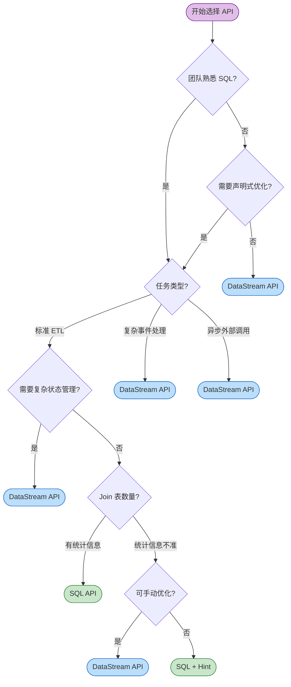
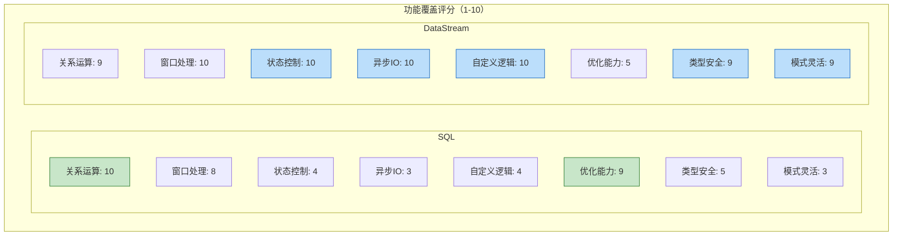
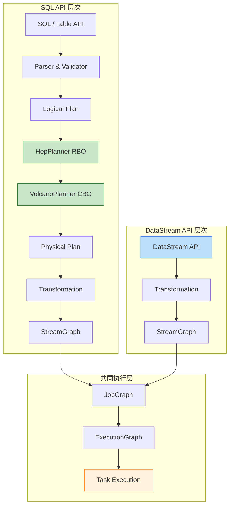
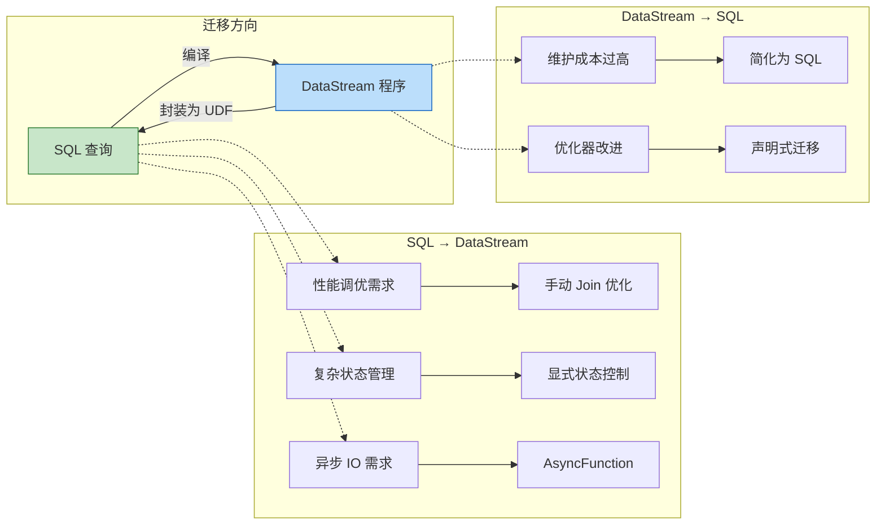

# Flink SQL vs DataStream API 对比 (SQL vs DataStream Comparison)

> **所属阶段**: Flink/03-sql-table-api | **前置依赖**: [Flink SQL 查询优化分析](./query-optimization-analysis.md), [DataStream V2 API 语义分析](../01-architecture/datastream-v2-semantics.md) | **形式化等级**: L4

---

## 目录

- [Flink SQL vs DataStream API 对比 (SQL vs DataStream Comparison)](#flink-sql-vs-datastream-api-对比-sql-vs-datastream-comparison)
  - [目录](#目录)
  - [1. 概念定义 (Definitions)](#1-概念定义-definitions)
    - [Def-F-03-01 (SQL API 抽象)](#def-f-03-01-sql-api-抽象)
    - [Def-F-03-02 (DataStream API 抽象)](#def-f-03-02-datastream-api-抽象)
    - [Def-F-03-03 (表达力关系)](#def-f-03-03-表达力关系)
  - [2. 属性推导 (Properties)](#2-属性推导-properties)
    - [Lemma-F-03-01 (SQL 优化的全局性)](#lemma-f-03-01-sql-优化的全局性)
    - [Lemma-F-03-02 (DataStream 状态控制精确性)](#lemma-f-03-02-datastream-状态控制精确性)
    - [Prop-F-03-01 (表达力-优化权衡)](#prop-f-03-01-表达力-优化权衡)
  - [3. 关系建立 (Relations)](#3-关系建立-relations)
    - [关系 1: SQL API `↦` DataStream API (编码关系)](#关系-1-sql-api--datastream-api-编码关系)
    - [关系 2: SQL 计划空间 `⊂` DataStream 计划空间](#关系-2-sql-计划空间--datastream-计划空间)
  - [4. 论证过程 (Argumentation)](#4-论证过程-argumentation)
    - [4.1 八维度详细对比表](#41-八维度详细对比表)
    - [4.2 性能特征对比](#42-性能特征对比)
    - [4.3 使用场景决策矩阵](#43-使用场景决策矩阵)
  - [5. 形式证明 / 工程论证 (Proof / Engineering Argument)](#5-形式证明--工程论证-proof--engineering-argument)
    - [Thm-F-03-01 (API 选择性能影响可量化)](#thm-f-03-01-api-选择性能影响可量化)
    - [工程论证：API 选型决策框架](#工程论证api-选型决策框架)
  - [6. 实例验证 (Examples)](#6-实例验证-examples)
    - [6.1 窗口聚合对比](#61-窗口聚合对比)
    - [6.2 双流 Join 对比](#62-双流-join-对比)
    - [6.3 DataStream 特有：异步 IO](#63-datastream-特有异步-io)
    - [6.4 混合使用示例](#64-混合使用示例)
  - [7. 可视化 (Visualizations)](#7-可视化-visualizations)
    - [7.1 API 选择决策树](#71-api-选择决策树)
    - [7.2 功能覆盖雷达图（概念性）](#72-功能覆盖雷达图概念性)
    - [7.3 API 层次架构对比](#73-api-层次架构对比)
    - [7.4 迁移路径图](#74-迁移路径图)
  - [8. 引用参考 (References)](#8-引用参考-references)

## 1. 概念定义 (Definitions)

### Def-F-03-01 (SQL API 抽象)

**Flink SQL API** 是基于声明式关系代数的流批统一查询接口：

$$
\text{SQL API} = \langle \mathcal{Q}_{SQL}, \mathcal{C}_{Calcite}, \mathcal{P}_{opt}, \mathcal{T}_{plan} \rangle
$$

| 符号 | 语义 |
|------|------|
| $\mathcal{Q}_{SQL}$ | SQL 查询语句集合 |
| $\mathcal{C}_{Calcite}$ | Apache Calcite 优化框架（RBO + CBO） |
| $\mathcal{P}_{opt}$ | 物理计划空间（Broadcast/Shuffle/Sort-Merge Join） |
| $\mathcal{T}_{plan}$ | 计划转换器（Physical Plan → StreamGraph） |

**直观解释**：SQL API 让开发者用声明式语法描述"要什么结果"，优化器自动选择执行策略[^1]。

---

### Def-F-03-02 (DataStream API 抽象)

**Flink DataStream API** 是基于函数式数据流编程的命令式接口：

$$
\text{DataStream API} = \langle \mathcal{D}_{stream}, \mathcal{F}_{trans}, \mathcal{S}_{state}, \mathcal{O}_{op} \rangle
$$

| 符号 | 语义 |
|------|------|
| $\mathcal{D}_{stream}$ | 类型化数据流 `DataStream<T>` |
| $\mathcal{F}_{trans}$ | 转换函数（map/filter/keyBy/window/process） |
| $\mathcal{S}_{state}$ | 显式状态管理（ValueState/ListState/MapState） |
| $\mathcal{O}_{op}$ | 算子级控制（并行度、Chaining、Slot Sharing） |

**直观解释**：DataStream API 精确控制计算逻辑、状态维护和并行分布[^2]。

---

### Def-F-03-03 (表达力关系)

**关键性质**：$\mathcal{E}_{SQL} \subset \mathcal{E}_{DS}$（SQL 是 DataStream 的真子集）

- 任何 SQL 查询都可编译为 DataStream 程序
- 存在 DataStream 程序无法被 SQL 直接表达（如自定义 ProcessFunction、异步 IO）[^3]

---

## 2. 属性推导 (Properties)

### Lemma-F-03-01 (SQL 优化的全局性)

**陈述**：多表 Join 时，SQL 优化器可考虑全局最优执行顺序，DataStream 程序通常采用固定顺序。

**推导**：

1. SQL `SELECT * FROM A JOIN B JOIN C` 不指定 Join 顺序
2. CBO 可枚举 Catalan 数级别的计划空间
3. DataStream `a.join(b).join(c)` 固定左深树结构 `((A⋈B)⋈C)`
4. SQL 在多表 Join 场景具有全局优化优势[^4]

---

### Lemma-F-03-02 (DataStream 状态控制精确性)

**陈述**：DataStream 允许精确控制状态访问模式，SQL 状态管理由优化器隐式决定。

**推导**：

1. DataStream 通过 `ValueState<T>`、`MapState<K,V>` 显式声明状态
2. 可自定义 TTL、状态后端、增量 Checkpoint
3. SQL 状态由 Planner 自动推导，可能不是最优[^5]

---

### Prop-F-03-01 (表达力-优化权衡)

**陈述**：表达力越高的 API（DataStream），优化难度越大；表达力受限的 API（SQL），可优化空间越大。

**推导**：

1. SQL 受限语法可映射到关系代数，优化器可安全应用等价变换
2. DataStream 的图灵完备语言包含不可判定等价性的程序
3. 存在反比关系：$|\mathcal{E}| \uparrow \Rightarrow |\mathcal{O}| \downarrow$ [^6]

---

## 3. 关系建立 (Relations)

### 关系 1: SQL API `↦` DataStream API (编码关系)

**关系类型**：满射但非单射

**论证**：

- SQL 通过 Calcite 编译为 `RelNode` → `Transformation` → `StreamGraph`
- 存在编码函数 $encode: \mathcal{Q}_{SQL} \rightarrow \text{Program}_{DS}$
- 不同的 DataStream 程序可能对应同一 SQL 查询的等价实现

**推断 [Model→Implementation]**：SQL 声明式语义 ⟹ DataStream 命令式执行。优化器将声明式意图翻译为高效的命令式实现。

---

### 关系 2: SQL 计划空间 `⊂` DataStream 计划空间

**论证**：

- SQL 算子（Filter/Project/Join/Aggregate）是 DataStream API 子集
- DataStream 支持 `ProcessFunction`、`AsyncFunction`、`CoProcessFunction` 等底层算子
- 这些模式无法被 SQL 直接表达[^7]

---

## 4. 论证过程 (Argumentation)

### 4.1 八维度详细对比表

| 维度 | Flink SQL | DataStream API | 推荐选择 |
|------|-----------|----------------|----------|
| **抽象层级** | 声明式（What） | 命令式（How） | 根据团队背景 |
| **表达力** | 受限（关系代数子集） | 完整（图灵完备） | 复杂逻辑选 DataStream |
| **优化能力** | 全局优化（CBO + RBO） | 局部优化（仅 Chaining） | 复杂查询选 SQL |
| **状态控制** | 隐式（优化器管理） | 显式（开发者控制） | 大状态选 DataStream |
| **学习曲线** | 平缓（SQL 普及度高） | 陡峭（需流计算概念） | 快速上手选 SQL |
| **调试难度** | 中等（EXPLAIN 计划） | 较高（需理解算子） | 调优频繁选 SQL |
| **类型安全** | 运行时检查 | 编译期检查 | 强类型需求选 DataStream |
| **模式演变** | 需要 DDL 变更 | Schema-on-Read | 模式多变选 DataStream |

---

### 4.2 性能特征对比

| 场景 | SQL | DataStream | 差异分析 |
|------|-----|------------|----------|
| 简单过滤 | ~5-10ms | ~5-10ms | 无显著差异 |
| 窗口聚合 | 取决于 Watermark | 取决于 Watermark | 取决于配置 |
| 多表 Join | 优化器选择 | 手动选择算法 | DataStream 更可控 |
| 异步 IO | Lookup Join | AsyncFunction | DataStream 更灵活 [^8] |

---

### 4.3 使用场景决策矩阵

| 场景 | 推荐 API | 理由 |
|------|----------|------|
| 简单 ETL | SQL | 代码量少，自动优化 |
| 复杂事件处理（CEP） | DataStream | SQL 无法表达模式匹配 |
| 实时报表/仪表盘 | SQL | 快速迭代，易于维护 |
| 异步外部数据丰富 | DataStream | AsyncFunction 更灵活 |
| 机器学习推理 | DataStream | 需自定义状态管理 |
| 模式频繁变化 | DataStream | Schema-on-Read [^9] |

---

## 5. 形式证明 / 工程论证 (Proof / Engineering Argument)

### Thm-F-03-01 (API 选择性能影响可量化)

**陈述**：对于任务 $T$，不存在 universally 更优的 API：

$$
\exists T: Perf_{SQL}(T) > Perf_{DS}(T) \land \exists T': Perf_{DS}(T') > Perf_{SQL}(T')
$$

**证明**：

**情况 1：SQL 优于 DataStream（$T$ = 多表 Join）**

1. SQL 优化器考虑的计划空间为 $O(Catalan(n-1) \cdot n!)$
2. DataStream 固定 Join 顺序，计划空间为 1
3. CBO 统计信息准确时，SQL 选择最优计划概率 $\approx 1$

**情况 2：DataStream 优于 SQL（$T'$ = 复杂事件处理）**

1. SQL 无法直接表达"A 发生后 5 分钟内出现 B 且不出现 C"
2. DataStream `ProcessFunction` 可精确实现 NFA 模式匹配

**结论**：两种 API 有各自的适用域。∎

---

### 工程论证：API 选型决策框架

```
ShouldUseSQL(task) ≡ (
    IsRelationalAlgebraExpressible(task) ∧
    HasAccurateStatistics(task) ∧
    NeedsRapidIteration(task)
)

ShouldUseDataStream(task) ≡ (
    NeedsCustomStateManagement(task) ∨
    NeedsAsyncIO(task) ∨
    NeedsComplexEventProcessing(task) ∨
    OptimizerMakesSuboptimalChoice(task)
)
```

**综合推荐**：

- **SQL 优先**：新项目、团队熟悉 SQL、标准 ETL
- **DataStream 优先**：复杂事件处理、大状态管理、优化器选择不佳
- **混合使用**：SQL 为主，DataStream UDF 补充复杂逻辑

---

## 6. 实例验证 (Examples)

### 6.1 窗口聚合对比

**SQL**：

```sql
SELECT
    user_id,
    TUMBLE_START(event_time, INTERVAL '5' MINUTES) as window_start,
    SUM(amount) as total_amount
FROM orders
GROUP BY
    user_id,
    TUMBLE(event_time, INTERVAL '5' MINUTES);
```

**DataStream**：

```java
orders
    .assignTimestampsAndWatermarks(
        WatermarkStrategy.<Order>forBoundedOutOfOrderness(Duration.ofSeconds(30))
            .withTimestampAssigner((order, ts) -> order.getEventTime())
    )
    .keyBy(Order::getUserId)
    .window(TumblingEventTimeWindows.of(Time.minutes(5)))
    .aggregate(new OrderAggregateFunction())
    .print();
```

**对比**：SQL 7 行 vs DataStream ~20 行；SQL 自动两阶段优化，DataStream 需手动实现[^10]。

---

### 6.2 双流 Join 对比

**SQL**：

```sql
SELECT o.*, p.payment_status
FROM orders o
JOIN payments p
    ON o.order_id = p.order_id
    AND o.event_time BETWEEN p.event_time - INTERVAL '5' MINUTE
                         AND p.event_time + INTERVAL '5' MINUTE;
```

**DataStream**：

```java
orders
    .keyBy(Order::getOrderId)
    .intervalJoin(payments.keyBy(Payment::getOrderId))
    .between(Time.minutes(-5), Time.minutes(5))
    .process(new ProcessJoinFunction<>() {
        @Override
        public void processElement(Order o, Payment p, Context ctx, Collector<Result> out) {
            out.collect(new Result(o, p));
        }
    });
```

---

### 6.3 DataStream 特有：异步 IO

**场景**：异步查询用户信息服务进行数据丰富。

```java
public class AsyncUserEnrichment extends AsyncFunction<Order, EnrichedOrder> {
    private transient AsyncHttpClient httpClient;

    @Override
    public void open(Configuration parameters) {
        httpClient = AsyncHttpClient.create().setMaxConnections(1000);
    }

    @Override
    public void asyncInvoke(Order order, ResultFuture<EnrichedOrder> resultFuture) {
        httpClient.get("/users/" + order.getUserId())
            .thenApply(resp -> new EnrichedOrder(order, resp.getUserLevel()))
            .whenComplete((result, err) -> {
                if (err != null) resultFuture.completeExceptionally(err);
                else resultFuture.complete(Collections.singletonList(result));
            });
    }
}

DataStream<EnrichedOrder> enriched = AsyncDataStream.unorderedWait(
    orders, new AsyncUserEnrichment(), 1000, TimeUnit.MILLISECONDS, 100
);
```

**关键优势**：`AsyncFunction` 允许等待外部响应时释放计算线程，避免背压[^11]。

---

### 6.4 混合使用示例

```java
// 注册 DataStream 为 SQL 表
tableEnv.createTemporaryView("orders", orderStream);

// 注册 DataStream UDF
tableEnv.createTemporarySystemFunction("CalculateScore", new CalculateScoreUDF());

// SQL 处理主要逻辑
Table result = tableEnv.sqlQuery(
    "SELECT userId, SUM(amount) as total, CalculateScore(userId, SUM(amount)) as score " +
    "FROM orders GROUP BY userId, TUMBLE(eventTime, INTERVAL '5' MINUTES)"
);

// 转回 DataStream
tableEnv.toDataStream(result).addSink(new CustomSink());
```

---

## 7. 可视化 (Visualizations)

### 7.1 API 选择决策树



---

### 7.2 功能覆盖雷达图（概念性）



| 维度 | SQL | DataStream | 说明 |
|------|-----|------------|------|
| 关系运算 | 10 | 9 | SQL 原生优势 |
| 窗口处理 | 8 | 10 | DataStream 支持自定义窗口 |
| 状态控制 | 4 | 10 | DataStream 显式精细控制 |
| 异步 IO | 3 | 10 | DataStream 原生 AsyncFunction |
| 自定义逻辑 | 4 | 10 | DataStream 完全自定义 |
| 优化能力 | 9 | 5 | SQL 全局 CBO |
| 类型安全 | 5 | 9 | DataStream 编译期检查 |
| 模式灵活 | 3 | 9 | DataStream Schema-on-Read |

---

### 7.3 API 层次架构对比



---

### 7.4 迁移路径图



---

## 8. 引用参考 (References)

[^1]: Apache Flink. "Apache Flink SQL Query Engine." <https://nightlies.apache.org/flink/flink-docs-stable/docs/dev/table/>

[^2]: Apache Flink. "DataStream API." <https://nightlies.apache.org/flink/flink-docs-stable/docs/dev/datastream/overview/>

[^3]: Carbone, P., et al. "Apache Flink: Stream and Batch Processing in a Single Engine." *IEEE Data Eng. Bull.*, 38(4), 2015.

[^4]: Graefe, G. "The Cascades Framework for Query Optimization." *IEEE Data Eng. Bull.*, 18(3), 1995.

[^5]: Apache Flink. "State Backends." <https://nightlies.apache.org/flink/flink-docs-stable/docs/ops/state/state_backends/>

[^6]: Selinger, P. G., et al. "Access Path Selection in a Relational Database Management System." *SIGMOD*, 1979.

[^7]: Apache Flink. "Table API & SQL." <https://nightlies.apache.org/flink/flink-docs-stable/docs/dev/table/common/>

[^8]: Apache Flink. "Asynchronous I/O." <https://nightlies.apache.org/flink/flink-docs-stable/docs/dev/datastream/operators/asyncio/>

[^9]: Kleppmann, M. *Designing Data-Intensive Applications*. O'Reilly, 2017.

[^10]: Apache Flink. "Aggregate Optimization." <https://nightlies.apache.org/flink/flink-docs-stable/docs/dev/table/tuning/>

[^11]: Akidau, T., et al. "The Dataflow Model." *PVLDB*, 8(12), 2015.

---

*文档版本: v1.0 | 更新日期: 2026-04-02 | 规范遵循: AGENTS.md 六段式模板*
