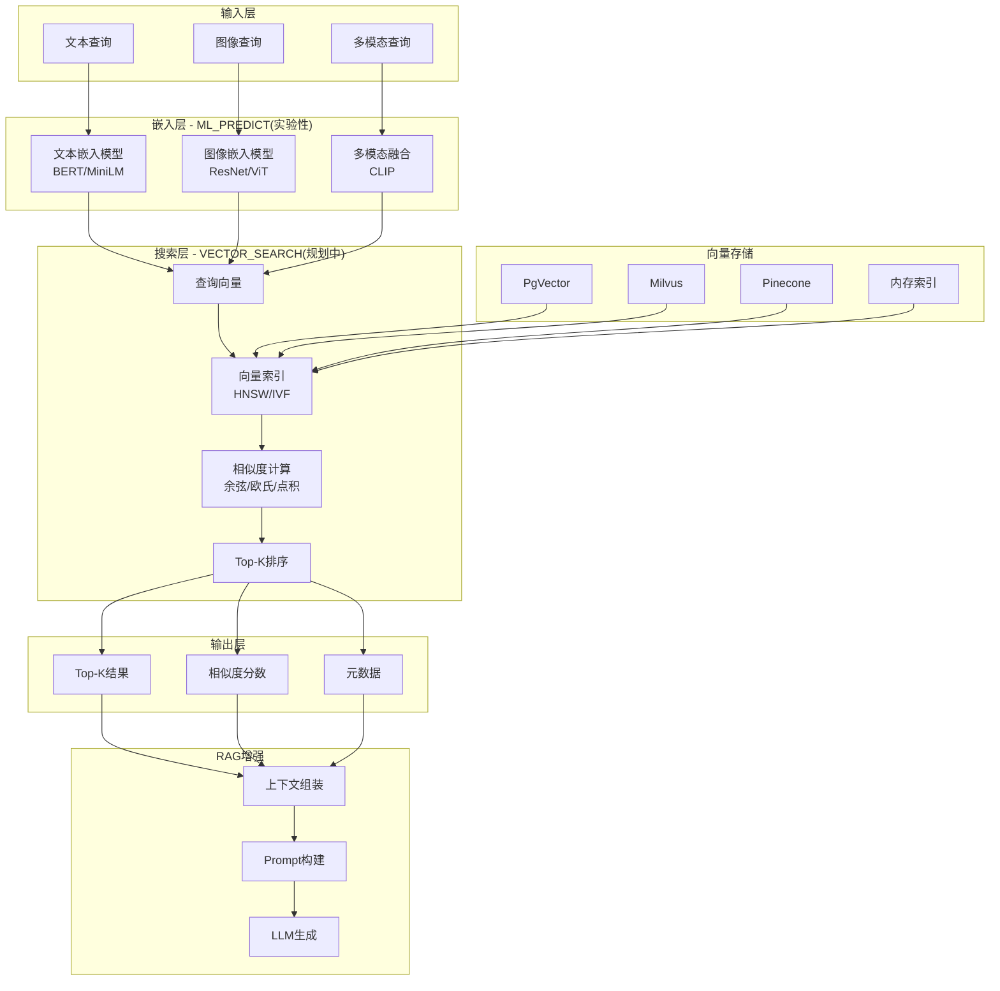
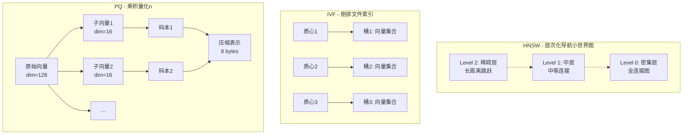
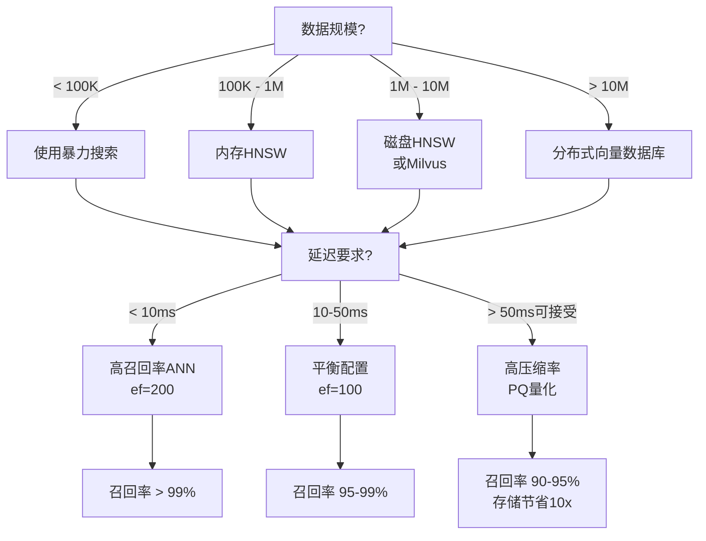

# Flink VECTOR_SEARCH - 流式向量相似度搜索（规划中）

> 所属阶段: Flink | 前置依赖: [MODEL DDL与ML_PREDICT](./model-ddl-and-ml-predict.md) | 形式化等级: L3

## 1. 概念定义 (Definitions)

### Def-F-03-19: 向量搜索语义 (Vector Search Semantics)

向量搜索是在高维向量空间中，基于相似度度量检索与查询向量最相似的向量子集的操作。

**形式化定义：**

给定：

- 向量空间 $\mathcal{V} \subset \mathbb{R}^d$，维度 $d$ 为嵌入维度
- 向量集合 $S = \{\mathbf{v}_1, \mathbf{v}_2, ..., \mathbf{v}_n\} \subset \mathcal{V}$
- 查询向量 $\mathbf{q} \in \mathcal{V}$
- 相似度函数 $\text{sim}: \mathcal{V} \times \mathcal{V} \rightarrow \mathbb{R}$
- 正整数 $k \in \mathbb{N}^+$

**Def-F-03-19a: Top-K 向量搜索**

$$\text{VECTOR\_SEARCH}(\mathbf{q}, S, k, \text{sim}) = \underset{T \subseteq S, |T|=k}{\arg\max} \sum_{\mathbf{v} \in T} \text{sim}(\mathbf{q}, \mathbf{v})$$
<!-- 注: VECTOR_SEARCH 为向量搜索功能（规划中），尚未正式发布 -->

**Def-F-03-19b: 流式向量搜索**

设输入流为 $D_{in}(t) = \{(\mathbf{q}_i, \tau_i)\}$，其中 $\mathbf{q}_i$ 为查询向量，$\tau_i$ 为事件时间戳。流式向量搜索定义为：

$$\text{STREAM\_VECTOR\_SEARCH}(D_{in}, S, k) = \{ (\mathbf{q}_i, R_i, \tau_i) \mid R_i = \text{VECTOR\_SEARCH}(\mathbf{q}_i, S_{\tau_i}, k) \}$$

其中 $S_{\tau_i}$ 表示在 $\tau_i$ 时刻可用的向量集合（考虑流的时变性）。

**直观解释：**

向量搜索将语义相似性问题转化为几何近邻问题。在自然语言处理中，语义相近的词、句子或文档在向量空间中距离较近；在推荐系统中，用户偏好和物品特征被编码为向量，相似向量代表潜在匹配。

---

### Def-F-03-20: 嵌入模型与向量空间 (Embedding Model and Vector Space)

**Def-F-03-20a: 嵌入模型**

嵌入模型 $E$ 是从原始数据空间 $\mathcal{X}$ 到向量空间 $\mathcal{V}$ 的映射函数：

$$E: \mathcal{X} \rightarrow \mathcal{V}, \quad \mathbf{v} = E(x), \quad x \in \mathcal{X}, \mathbf{v} \in \mathcal{V} \subset \mathbb{R}^d$$

根据输入域 $\mathcal{X}$ 的不同：

- 文本嵌入：$E_{text}: \text{String} \rightarrow \mathbb{R}^d$
- 图像嵌入：$E_{image}: \text{Image} \rightarrow \mathbb{R}^d$
- 多模态嵌入：$E_{multi}: (\text{Text} \times \text{Image}) \rightarrow \mathbb{R}^d$

**Def-F-03-20b: 向量空间属性**

向量空间 $\mathcal{V}$ 具备以下代数结构：

- **内积空间**：定义内积 $\langle \mathbf{u}, \mathbf{v} \rangle = \sum_{i=1}^{d} u_i v_i$
- **诱导范数**：$\|\mathbf{v}\| = \sqrt{\langle \mathbf{v}, \mathbf{v} \rangle}$
- **诱导距离**：$d(\mathbf{u}, \mathbf{v}) = \|\mathbf{u} - \mathbf{v}\|$

**Def-F-03-20c: 相似度度量**

| 相似度度量 | 公式 | 适用场景 |
|-----------|------|----------|
| 余弦相似度 | $\cos(\theta) = \frac{\langle \mathbf{u}, \mathbf{v} \rangle}{\|\mathbf{u}\| \|\mathbf{v}\|}$ | 方向比幅值重要 |
| 欧氏距离 | $d_{L2} = \sqrt{\sum_{i}(u_i - v_i)^2}$ | 绝对距离重要 |
| 点积相似度 | $\langle \mathbf{u}, \mathbf{v} \rangle$ | 已归一化向量 |

---

### Def-F-03-21: 实时上下文检索 (Real-time Contextual Retrieval)

**Def-F-03-21a: 上下文窗口**

设实时查询流为 $Q(t)$，历史文档集合为 $D$，上下文窗口 $W_t$ 定义为：

$$W_t = \{ (d, \mathbf{v}_d) \mid d \in D \land \text{VECTOR\_SEARCH}(E(q_t), \{\mathbf{v}_d\}, k) \subseteq \text{top}_k \}$$

**Def-F-03-21b: 流式 RAG 检索**

实时检索增强生成 (Streaming RAG) 的检索阶段定义为：

$$\text{Retrieve}(q_t, t) = \text{VECTOR\_SEARCH}(E(q_t), \mathcal{V}_t, k) \circ \text{ReRank}(\cdot, \theta_t)$$

其中：

- $\mathcal{V}_t$：时刻 $t$ 可用的向量索引
- $\text{ReRank}$：可选的重排序函数
- $\theta_t$：时刻 $t$ 的上下文参数

**直观解释：**

实时上下文检索使 AI 系统能够基于最新的数据状态回答问题。与传统批处理检索不同，流式检索要求向量索引支持增量更新，并保证查询结果反映最新数据状态。

---

## 2. 属性推导 (Properties)

### Prop-F-03-05: 向量搜索的单调性

**命题：** 若向量集合 $S_1 \subseteq S_2$，则对于任意查询向量 $\mathbf{q}$：

$$\forall \mathbf{v} \in \text{VECTOR\_SEARCH}(\mathbf{q}, S_1, k), \exists \mathbf{v}' \in \text{VECTOR\_SEARCH}(\mathbf{q}, S_2, k) : \text{sim}(\mathbf{q}, \mathbf{v}) \leq \text{sim}(\mathbf{q}, \mathbf{v}')$$

**含义：** 扩大向量集合不会降低搜索结果的质量（可能找到更相似的向量）。

---

### Prop-F-03-06: 近似搜索的精度-延迟权衡

**命题：** 设精确搜索延迟为 $T_{exact}(n) = O(d \cdot n)$，近似搜索（ANN）延迟为 $T_{approx}(n) = O(d \cdot \log n)$，则有：

$$\lim_{n \rightarrow \infty} \frac{T_{approx}(n)}{T_{exact}(n)} = 0$$

**代价：** 近似搜索引入召回率损失 $\epsilon$，满足：

$$\text{Recall@}k = \frac{|\text{ANN\_RESULT}(k) \cap \text{EXACT\_RESULT}(k)|}{k} \geq 1 - \epsilon$$

---

### Lemma-F-03-04: 嵌入模型的 Lipschitz 连续性

**引理：** 若嵌入模型 $E$ 是 $L$-Lipschitz 连续的，则：

$$\forall x_1, x_2 \in \mathcal{X}: \|E(x_1) - E(x_2)\| \leq L \cdot d_{\mathcal{X}}(x_1, x_2)$$

**推导：** 语义相似的数据在向量空间中几何距离相近，保证向量搜索的语义有效性。

---

## 3. 关系建立 (Relations)

### 与 ML_PREDICT 的协作关系

Flink `ML_PREDICT`（实验性）和 `VECTOR_SEARCH`（规划中）形成完整的流式 ML 推理管道：

```
原始数据 → ML_PREDICT(嵌入模型) → 向量表示 → VECTOR_SEARCH → 相似结果
     ↑                                                        ↓
     └──────────── 实时 RAG 管道 ← 检索结果增强 ←──────────────┘
```

**职责分离：**

| 函数 | 职责 | 输出 | 计算复杂度 |
|------|------|------|-----------|
| `ML_PREDICT`（实验性） | 特征提取、嵌入生成 | 稠密向量 | $O(d_{model})$ |
| `VECTOR_SEARCH`（规划中） | 相似度计算、近邻检索 | Top-K 向量ID | $O(\log n)$ (近似) |

**组合实现实时 RAG：**

```sql
-- 步骤1: 使用 ML_PREDICT(实验性)生成查询向量
WITH query_embedding AS (
  SELECT
    query_id,
    ML_PREDICT(text_embedding_model, query_text) AS query_vector
  FROM user_queries
),

-- 步骤2: 使用 VECTOR_SEARCH(规划中)执行检索
retrieved_docs AS (
  SELECT
    q.query_id,
    v.document_id,
    v.content,
    v.similarity_score
  FROM query_embedding q,
  LATERAL TABLE(VECTOR_SEARCH(
    query_vector := q.query_vector,
    index_table := 'document_vectors',
    top_k := 5,
    metric := 'COSINE'
  )) AS v
)
SELECT * FROM retrieved_docs;
```

---

### 与外部向量数据库的集成关系

```
┌─────────────────────────────────────────────────────────────────┐
│                     Flink SQL Engine                            │
├─────────────────────────────────────────────────────────────────┤
│  SQL Query → Logical Plan → Physical Plan → VectorSearchExec    │
└─────────────────────────────────────────────────────────────────┘
                              │
                              ▼
┌─────────────────────────────────────────────────────────────────┐
│                  Vector Store Connector                         │
├─────────────────────────────────────────────────────────────────┤
│  PgVector Connector │ Milvus Connector │ Pinecone Connector     │
└─────────────────────────────────────────────────────────────────┘
                              │
                              ▼
┌─────────────────────────────────────────────────────────────────┐
│                    Vector Database Layer                        │
├─────────────────────────────────────────────────────────────────┤
│  PostgreSQL+PgVector │ Milvus │ Pinecone │ Weaviate │ Qdrant    │
└─────────────────────────────────────────────────────────────────┘
```

---

## 4. 论证过程 (Argumentation)

### 4.1 为什么需要专用的 VECTOR_SEARCH 函数？

**问题：** 为何不直接用 SQL 的相似度计算？

```sql
-- 纯 SQL 实现(低效)
SELECT document_id, content,
       cosine_similarity(query_vector, doc_vector) AS score
FROM documents
ORDER BY score DESC
LIMIT k;
```

**论证：**

| 方面 | 纯 SQL 实现 | VECTOR_SEARCH 函数 |
|------|------------|-------------------|
| 索引支持 | 无，全表扫描 | 专用向量索引 (HNSW, IVF) |
| 计算优化 | 逐行计算 | 批量相似度计算 |
| 扩展性 | $O(n)$ 复杂度 | $O(\log n)$ (近似) |
| 存储效率 | 全量向量存储 | 量化压缩、分区策略 |
| 实时性 | 延迟随数据增长 | 近似恒定延迟 |

---

### 4.2 向量索引算法对比

**层次化导航小世界图 (HNSW)：**

- **原理：** 构建多层图结构，上层稀疏、下层密集
- **查询：** 从顶层开始贪心搜索，逐层下沉
- **复杂度：** 建图 $O(n \log n)$，查询 $O(\log n)$
- **适用：** 高召回率要求、中等数据规模

**倒排文件索引 (IVF)：**

- **原理：** K-means 聚类后建立倒排索引
- **查询：** 定位最近质心，搜索该桶内向量
- **复杂度：** 查询 $O(\sqrt{n})$ ~ $O(n^{1/3})$
- **适用：** 大规模数据、可接受较低召回率

**乘积量化 (PQ)：**

- **原理：** 向量分解为子向量，分别量化
- **优势：** 内存占用减少 10-20 倍
- **代价：** 精度损失约 5-10%

---

### 4.3 流式向量的增量更新挑战

**挑战1：索引更新延迟**

- 问题：新向量插入后，HNSW 图结构需要重建
- 方案：
  - 双缓冲策略：查询旧索引，异步构建新索引
  - 增量 HNSW：支持动态插入的图算法

**挑战2：过期向量淘汰**

- 问题：流数据具有时效性，旧向量需淘汰
- 方案：
  - TTL (Time-To-Live) 机制
  - 滑动窗口向量集合

**挑战3：一致性保证**

- 问题：向量索引与源表状态可能不一致
- 方案：
  - 基于 Checkpoint 的同步
  - 最终一致性模型

---

## 5. 形式证明 / 工程论证 (Proof / Engineering Argument)

### 5.1 VECTOR_SEARCH 函数的语法规范

**定理 (Thm-F-03-02): VECTOR_SEARCH 函数类型安全性**

Flink SQL 的 `VECTOR_SEARCH` 函数满足以下类型规则：

$$\frac{\Gamma \vdash q : \text{ARRAY}<\text{FLOAT}> \quad \Gamma \vdash k : \text{INT} \quad \Gamma \vdash \text{metric} : \text{VARCHAR}}{\Gamma \vdash \text{VECTOR\_SEARCH}(q, \text{table}, k, \text{metric}) : \text{TABLE}(\text{id}: \text{STRING}, \text{vector}: \text{ARRAY}<\text{FLOAT}>, \text{score}: \text{FLOAT})}$$

**证明概要：**

1. 查询向量类型检查：必须是浮点数组
2. Top-K 参数检查：正整数
3. 度量函数检查：必须是预定义值之一
4. 返回表类型由函数签名唯一确定

---

### 5.2 流式 RAG 的延迟边界分析

**工程论证：**

流式 RAG 系统的端到端延迟 $L_{total}$ 可分解为：

$$L_{total} = L_{embed} + L_{search} + L_{generate} + L_{network}$$

其中：

- $L_{embed}$：嵌入生成延迟（ML_PREDICT）
  - CPU 推理：50-200ms
  - GPU 推理：5-20ms
- $L_{search}$：向量搜索延迟
  - 精确搜索：与数据规模线性增长
  - HNSW 近似：10-50ms（P99）
- $L_{generate}$：生成模型延迟（外部 LLM）
  - 通常 100-1000ms，由模型决定
- $L_{network}$：网络传输延迟
  - 向量数据库 < 10ms（同可用区）

**优化策略：**

1. **嵌入缓存**：热门查询结果缓存，$L_{embed} \approx 0$
2. **预计算索引**：离线构建 HNSW，$L_{search} = O(\log n)$
3. **异步流水线**：ML_PREDICT 与 VECTOR_SEARCH 流水化执行

---

### 5.3 相似度计算的数值稳定性

**论证：** 余弦相似度的数值边界

对于任意非零向量 $\mathbf{u}, \mathbf{v} \in \mathbb{R}^d$：

$$-1 \leq \frac{\langle \mathbf{u}, \mathbf{v} \rangle}{\|\mathbf{u}\| \|\mathbf{v}\|} \leq 1$$

**数值问题：**

- 当 $\|\mathbf{u}\|$ 或 $\|\mathbf{v}\|$ 极小时，除法不稳定
- 解决方案：预归一化向量 + 点积计算

```sql
-- 推荐:使用预归一化向量存储
CREATE TABLE document_vectors (
  doc_id STRING,
  vector ARRAY<FLOAT>,      -- 原始向量
  norm_vector ARRAY<FLOAT>, -- L2归一化向量
  PRIMARY KEY (doc_id)
);

-- 查询时使用点积代替余弦
SELECT doc_id, dot_product(query_vector, norm_vector) AS cosine_sim
FROM document_vectors
ORDER BY cosine_sim DESC;
```

---

## 6. 实例验证 (Examples)

### 6.1 实时文档检索 Pipeline

**场景：** 构建实时客服问答系统，根据用户问题检索相关知识库文档。

```sql
# 伪代码示意,非完整可执行配置
-- ============================================
-- 步骤1: 创建文档向量表(向量存储)
-- ============================================
CREATE TABLE kb_document_vectors (
  doc_id STRING PRIMARY KEY,
  content STRING,
  -- 文档嵌入向量,维度768(如BERT-base)
  embedding VECTOR(768),
  -- 文档元数据
  category STRING,
  update_time TIMESTAMP(3),
  WATERMARK FOR update_time AS update_time - INTERVAL '1' MINUTE
) WITH (
  'connector' = 'jdbc',
  'url' = 'jdbc:postgresql://localhost:5432/vectordb',
  'table-name' = 'document_vectors'
);

-- ============================================
-- 步骤2: 用户查询流
-- ============================================
CREATE TABLE user_questions (
  question_id STRING PRIMARY KEY,
  question_text STRING,
  user_id STRING,
  event_time TIMESTAMP(3),
  WATERMARK FOR event_time AS event_time - INTERVAL '5' SECOND
) WITH (
  'connector' = 'kafka',
  'topic' = 'user-questions',
  'properties.bootstrap.servers' = 'localhost:9092',
  'format' = 'json'
);

-- ============================================
-- 步骤3: 实时检索管道
-- ============================================
CREATE VIEW realtime_retrieval AS
WITH
-- 3.1 生成查询向量
query_embeddings AS (
  SELECT
    question_id,
    user_id,
    question_text,
    -- 使用ML_PREDICT生成文本嵌入
    ML_PREDICT('sentence-transformers/all-MiniLM-L6-v2', question_text)
      AS query_vector,
    event_time
  FROM user_questions
),

-- 3.2 执行向量搜索
retrieved_results AS (
  SELECT
    q.question_id,
    q.user_id,
    q.question_text,
    v.doc_id,
    v.content AS doc_content,
    v.category,
    v.similarity_score,
    q.event_time
  FROM query_embeddings q,
  LATERAL TABLE(VECTOR_SEARCH(
    -- 查询向量
    query_vector := q.query_vector,
    -- 目标向量表
    index_table := 'kb_document_vectors',
    -- 检索Top-3相关文档
    top_k := 3,
    -- 使用余弦相似度
    metric := 'COSINE',
    -- 可选:按类别过滤
    filter := CONCAT('category = ''', 'faq', '''')
  )) AS v
)

SELECT * FROM retrieved_results;

-- ============================================
-- 步骤4: 输出到下游LLM服务
-- ============================================
CREATE TABLE llm_prompts (
  request_id STRING,
  prompt STRING,
  context_docs ARRAY<ROW<doc_id STRING, content STRING, score FLOAT>>,
  timestamp TIMESTAMP(3)
) WITH (
  'connector' = 'kafka',
  'topic' = 'llm-requests',
  'properties.bootstrap.servers' = 'localhost:9092',
  'format' = 'json'
);

INSERT INTO llm_prompts
SELECT
  question_id AS request_id,
  CONCAT(
    '基于以下参考文档回答问题:\n',
    STRING_AGG(doc_content, '\n---\n'),
    '\n\n用户问题:', question_text
  ) AS prompt,
  COLLECT_SET(ROW(doc_id, doc_content, similarity_score)) AS context_docs,
  event_time AS timestamp
FROM realtime_retrieval
GROUP BY question_id, question_text, event_time;
```

---

### 6.2 流式商品推荐

**场景：** 电商平台实时商品推荐，根据用户实时行为推荐相似商品。

```sql
-- ============================================
-- 步骤1: 商品向量表
-- ============================================
CREATE TABLE product_vectors (
  product_id STRING PRIMARY KEY,
  product_name STRING,
  category STRING,
  price DECIMAL(10, 2),
  -- 多模态嵌入:结合文本+图像特征
  embedding VECTOR(512),
  update_time TIMESTAMP(3)
) WITH (
  'connector' = 'milvus',
  'uri' = 'http://localhost:19530',
  'collection' = 'products'
);

-- ============================================
-- 步骤2: 用户行为流
-- ============================================
CREATE TABLE user_behaviors (
  user_id STRING,
  product_id STRING,
  behavior_type STRING,  -- 'click', 'cart', 'purchase'
  event_time TIMESTAMP(3),
  WATERMARK FOR event_time AS event_time - INTERVAL '10' SECOND
) WITH (
  'connector' = 'kafka',
  'topic' = 'user-behaviors',
  'properties.bootstrap.servers' = 'localhost:9092',
  'format' = 'json'
);

-- ============================================
-- 步骤3: 实时推荐生成
-- ============================================
CREATE VIEW realtime_recommendations AS
WITH
-- 3.1 获取用户最近浏览商品的向量
user_interest_vectors AS (
  SELECT
    b.user_id,
    p.embedding AS interest_vector,
    b.behavior_type,
    b.event_time,
    -- 行为权重:purchase > cart > click
    CASE b.behavior_type
      WHEN 'purchase' THEN 1.0
      WHEN 'cart' THEN 0.7
      WHEN 'click' THEN 0.3
    END AS weight
  FROM user_behaviors b
  JOIN product_vectors FOR SYSTEM_TIME AS OF b.event_time p
    ON b.product_id = p.product_id
  WHERE b.event_time > NOW() - INTERVAL '1' HOUR
),

-- 3.2 聚合用户兴趣向量(加权平均)
user_profile AS (
  SELECT
    user_id,
    -- 加权平均兴趣向量
    vector_agg(interest_vector, weight) AS profile_vector,
    MAX(event_time) AS last_interaction_time
  FROM user_interest_vectors
  GROUP BY user_id
),

-- 3.3 排除已交互商品
excluded_products AS (
  SELECT
    user_id,
    COLLECT_SET(product_id) AS seen_products
  FROM user_behaviors
  WHERE event_time > NOW() - INTERVAL '24' HOUR
  GROUP BY user_id
)

-- 3.4 执行向量搜索获取推荐
SELECT
  p.user_id,
  r.product_id AS recommended_product_id,
  r.product_name,
  r.category,
  r.price,
  r.similarity_score,
  p.last_interaction_time AS recommend_time
FROM user_profile p
JOIN excluded_products e ON p.user_id = e.user_id,
LATERAL TABLE(VECTOR_SEARCH(
  query_vector := p.profile_vector,
  index_table := 'product_vectors',
  top_k := 10,
  metric := 'COSINE',
  -- 排除已浏览商品
  exclude_ids := e.seen_products
)) AS r;

-- ============================================
-- 步骤4: 输出推荐结果
-- ============================================
CREATE TABLE recommendation_output (
  user_id STRING,
  recommendations ARRAY<ROW<
    product_id STRING,
    product_name STRING,
    score FLOAT
  >>,
  generate_time TIMESTAMP(3)
) WITH (
  'connector' = 'redis',
  'host' = 'localhost',
  'port' = '6379',
  'command' = 'SET'
);

INSERT INTO recommendation_output
SELECT
  user_id,
  COLLECT_SET(ROW(recommended_product_id, product_name, similarity_score))
    AS recommendations,
  recommend_time AS generate_time
FROM realtime_recommendations
GROUP BY user_id, recommend_time;
```

---

## 7. 可视化 (Visualizations)

### 7.1 流式向量搜索架构图



### 7.2 流式 RAG 数据流图

```mermaid
flowchart LR
    subgraph Source["数据源"]
        S1[Kafka: 用户查询]
        S2[CDC: 文档更新]
    end

    subgraph Flink["Flink SQL 引擎"]
        F1[ML_PREDICT(实验性)<br/>嵌入生成]
        F2[VECTOR_SEARCH(规划中)<br/>相似检索]
        F3[窗口聚合]
        F4[结果增强]
    end

    subgraph VectorDB["向量数据库"]
        V1[增量索引更新]
        V2[近似最近邻搜索]
    end

    subgraph Sink["输出"]
        K1[Kafka: LLM请求]
        K2[Redis: 推荐缓存]
        K3[JDBC: 审计日志]
    end

    S1 -->|查询流| F1
    S2 -->|文档流| V1
    F1 -->|查询向量| F2
    V1 -->|向量索引| V2
    V2 -->|Top-K结果| F2
    F2 --> F3
    F3 --> F4
    F4 --> K1
    F4 --> K2
    F4 --> K3
```

### 7.3 向量索引结构对比



### 7.4 延迟与召回率权衡决策树



---

## 8. 引用参考 (References)
