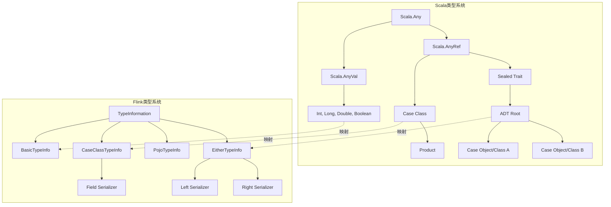
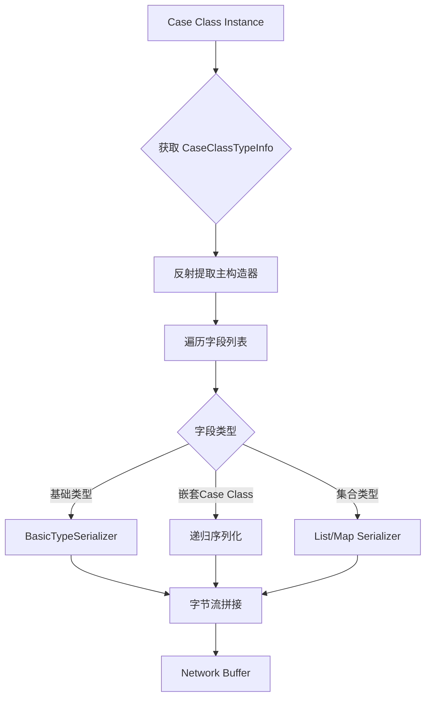
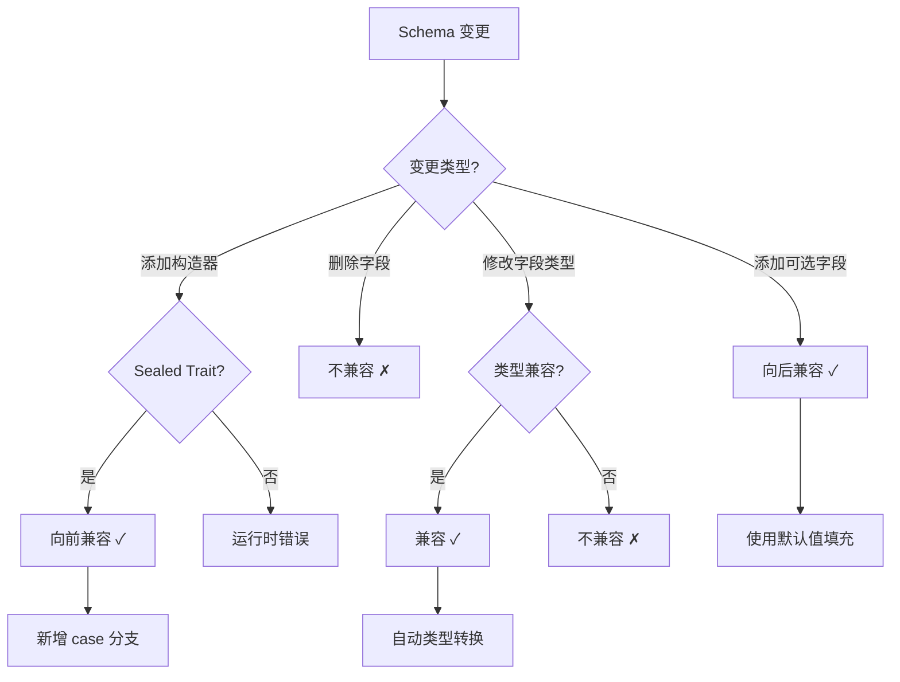
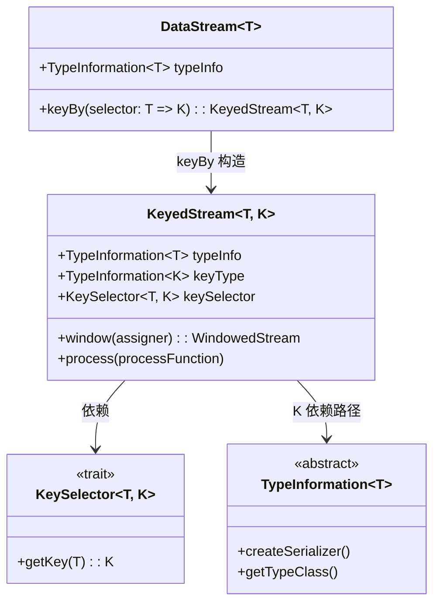

# Scala 类型系统 for Flink 流计算

> 所属阶段: Flink/ | 前置依赖: [Struct/01-foundation/01.04-dataflow-model-formalization.md](../../Struct/01-foundation/01.04-dataflow-model-formalization.md) | 形式化等级: L4

---

## 目录

- [Scala 类型系统 for Flink 流计算](#scala-类型系统-for-flink-流计算)
  - [目录](#目录)
  - [1. 概念定义 (Definitions)](#1-概念定义-definitions)
    - [Def-F-09-01: Scala Case Class 作为 DataType](#def-f-09-01-scala-case-class-作为-datatype)
    - [Def-F-09-02: 代数数据类型 (ADT) in Flink](#def-f-09-02-代数数据类型-adt-in-flink)
    - [Def-F-09-03: 路径依赖类型与 KeyedStream](#def-f-09-03-路径依赖类型与-keyedstream)
  - [2. 属性推导 (Properties)](#2-属性推导-properties)
    - [Lemma-F-09-01: Case Class 的序列化友好性](#lemma-f-09-01-case-class-的序列化友好性)
    - [Lemma-F-09-02: ADT 的 Schema 演进支持](#lemma-f-09-02-adt-的-schema-演进支持)
  - [3. 关系建立 (Relations)](#3-关系建立-relations)
    - [3.1 与 Dataflow 模型的类型映射](#31-与-dataflow-模型的类型映射)
    - [3.2 与 pDOT 路径依赖类型的关联](#32-与-pdot-路径依赖类型的关联)
  - [4. 论证过程 (Argumentation)](#4-论证过程-argumentation)
    - [4.1 类型安全的流处理管道](#41-类型安全的流处理管道)
    - [4.2 Scala 与 Java API 的类型表达能力对比](#42-scala-与-java-api-的类型表达能力对比)
  - [5. 形式证明 / 工程论证 (Proof / Engineering Argument)](#5-形式证明-工程论证-proof-engineering-argument)
    - [定理: Case Class 在 Flink 中构成完备的数据类型范畴](#定理-case-class-在-flink-中构成完备的数据类型范畴)
    - [工程论证: Schema 演进的成本分析](#工程论证-schema-演进的成本分析)
  - [6. 实例验证 (Examples)](#6-实例验证-examples)
    - [6.1 官方 Java API 方式：Java POJO + Scala 调用](#61-官方-java-api-方式java-pojo-scala-调用)
    - [6.2 社区 flink-scala-api 方式：纯 Scala Case Class](#62-社区-flink-scala-api-方式纯-scala-case-class)
    - [6.3 两种方案对比矩阵](#63-两种方案对比矩阵)
  - [7. 可视化 (Visualizations)](#7-可视化-visualizations)
    - [7.1 Scala 类型层次与 Flink 类型系统映射](#71-scala-类型层次与-flink-类型系统映射)
    - [7.2 Case Class 序列化流程](#72-case-class-序列化流程)
    - [7.3 ADT Schema 演进决策树](#73-adt-schema-演进决策树)
    - [7.4 KeyedStream 路径依赖类型关系](#74-keyedstream-路径依赖类型关系)
  - [8. 引用参考 (References)](#8-引用参考-references)

## 1. 概念定义 (Definitions)

### Def-F-09-01: Scala Case Class 作为 DataType

**定义 (L4 形式化)**:

设 $\mathcal{S}$ 为 Scala 类型系统，$C \in \mathcal{S}$ 是一个 **Case Class**，当且仅当满足：

1. **结构不可变性**: 所有字段 $f_i: T_i$ 默认为 `val`，即 $\forall i. \frac{\partial f_i}{\partial t} = 0$
2. **模式匹配分解性**: 存在提取函数 $\text{unapply}: C \rightarrow (T_1, \ldots, T_n)$ 使得:
   $$\forall c \in C. \text{unapply}(c) = (c.f_1, \ldots, c.f_n)$$
3. **自动派生实例**: 编译器自动生成 `equals`, `hashCode`, `toString`, `copy`

**Flink 语义映射**:

Case Class 到 Flink TypeInformation 的编码映射:

$$\llbracket C \rrbracket_{Flink} = \text{TypeInformation.of}(C) \cong \text{CaseClassTypeInfo}(\llbracket T_1 \rrbracket, \ldots, \llbracket T_n \rrbracket)$$

**直观解释**: Scala Case Class 在 Flink 中充当强类型的结构化数据容器，其不可变性和自动派生的序列化支持使其成为流计算中的理想 DataType。

---

### Def-F-09-02: 代数数据类型 (ADT) in Flink

**定义 (L4 形式化)**:

ADT 是 **和类型 (Sum Type)** 与 **积类型 (Product Type)** 的组合闭包:

$$\text{ADT} ::= T_1 + T_2 \mid T_1 \times T_2 \mid \mu X. F(X)$$

其中:

- **和类型** $T_1 + T_2$ 对应 Scala 的 `sealed trait` + `case class/object`
- **积类型** $T_1 \times T_2$ 对应元组/Case Class 的字段乘积
- **递归类型** $\mu X. F(X)$ 对应嵌套数据结构

**Flink 中的 ADT 约束**:

设 $D$ 为 ADT，Flink 类型系统要求:

$$\text{Serializable}(D) \Leftrightarrow \forall c \in \text{constructors}(D). \forall f \in \text{fields}(c). \text{Serializable}(\text{type}(f))$$

**直观解释**: ADT 通过 sealed trait 实现类型安全的变体表示，Flink 的类型推导器递归检查所有构造器的字段可序列化性。

---

### Def-F-09-03: 路径依赖类型与 KeyedStream

**定义 (L4 形式化)**:

设 $S$ 为流类型，$K$ 为键类型，**KeyedStream** 是依赖路径 $\pi$ 的类型构造:

$$\text{KeyedStream}[S, K] = \{ (k, \{e \in S \mid \text{key}(e) = k\}) \mid k \in K \}$$

**Scala 路径依赖类型表示**:

```scala
type KeyedStream[S, K] = S#GroupBy { type Key = K }
```

键提取函数的类型签名:

$$\text{keyBy}: \text{DataStream}[T] \rightarrow (T \rightarrow K) \rightarrow \text{KeyedStream}[T, K]$$

**pDOT 编码**:

在 pDOT (path-dependent DOT) 演算中，KeyedStream 的键类型是 **值依赖的**:

$$\Gamma \vdash \text{ks}: \text{KeyedStream}[T, \{k: K \mid \text{key}(k) = x\}]$$

**直观解释**: KeyedStream 的键类型依赖于运行时键提取函数的结果，这种依赖关系在 Scala 的类型系统中通过类型成员路径来表达。

---

## 2. 属性推导 (Properties)

### Lemma-F-09-01: Case Class 的序列化友好性

**引理**: 对于任意 Case Class $C$，若所有字段类型 $T_i \in \{\text{Int}, \text{Long}, \text{String}, \text{Boolean}, \text{Array}[\_], \text{Other Case Class}\}$，则:

$$\text{TypeInfo}(C) \Rightarrow \text{EfficientSerializer}(C)$$

**证明概要**:

1. Flink 的 `CaseClassTypeInfo` 通过 Scala 反射获取主构造器参数
2. 每个参数类型 $T_i$ 映射到对应的 `TypeInformation`:
   - 原始类型 $\rightarrow$ `BasicTypeInfo`
   - Case Class $\rightarrow$ 递归 `CaseClassTypeInfo`
   - 集合类型 $\rightarrow$ `ListTypeInfo` / `MapTypeInfo`
3. 生成的 `TypeSerializer` 采用 **字段顺序序列化**，避免反射开销

$$\text{serialize}(c) = \bigoplus_{i=1}^{n} \text{serialize}_i(c.f_i)$$

其中 $\oplus$ 表示字节流的拼接操作。

---

### Lemma-F-09-02: ADT 的 Schema 演进支持

**引理**: 设 $D = C_1 + C_2 + \ldots + C_n$ 为 sealed trait 定义的 ADT，Schema 演进满足 **向后兼容性** 当:

$$\forall C_i^{(v_1)} \in D^{(v_1)}. \exists C_i^{(v_2)} \in D^{(v_2)}. \text{fields}(C_i^{(v_1)}) \subseteq \text{fields}(C_i^{(v_2)})$$

**推论**: 新增 case class 构造器保持 **向前兼容性**，删除构造器破坏兼容性。

**Flink 序列化层面的保障**:

| 演进类型 | 兼容性 | Flink 支持 |
|---------|-------|-----------|
| 添加可选字段 | 向后兼容 | ✓ (默认值) |
| 删除字段 | 不兼容 | ✗ |
| 重命名字段 | 不兼容 | ✗ (需自定义) |
| 添加 case class | 向前兼容 | ✓ (sealed trait) |

---

## 3. 关系建立 (Relations)

### 3.1 与 Dataflow 模型的类型映射

来自 [Struct/01-foundation/01.04-dataflow-model-formalization.md](../../Struct/01-foundation/01.04-dataflow-model-formalization.md) 的 Dataflow 类型 $T_{DF}$ 到 Scala/Flink 的映射:

| Dataflow 类型 | Scala 表示 | Flink TypeInfo |
|--------------|-----------|----------------|
| $T_{base}$ (基础值) | `Int`, `Long`, `String` | `BasicTypeInfo` |
| $T_{record}$ (记录) | `case class Record(...)` | `CaseClassTypeInfo` |
| $T_{sum}$ (和类型) | `sealed trait Event; case class Click(...); case class View(...)` | `EitherTypeInfo` / `PolymorphicTypeInfo` |
| $T_{stream}$ (流) | `DataStream[T]` | `StreamRecordSerializer` |

**形式化映射**:

$$\Phi: \mathcal{T}_{Dataflow} \rightarrow \mathcal{T}_{Scala}$$

$$\Phi(T_{record}(f_1: \tau_1, \ldots, f_n: \tau_n)) = \text{case class}(f_1: \Phi(\tau_1), \ldots, f_n: \Phi(\tau_n))$$

### 3.2 与 pDOT 路径依赖类型的关联

**类型成员路径**:

在 pDOT 中，KeyedStream 的键类型是依赖值的。Scala 中对应的表达:

```scala
trait KeyedStream { type E; type K; val keySelector: E => K }
```

**子类型关系**:

$$\frac{\Gamma \vdash k_1 <: k_2}{\Gamma \vdash \text{KeyedStream}[E, k_1] <: \text{KeyedStream}[E, k_2]}$$

这表明键类型的子类型关系会传导到 KeyedStream 层面。

---

## 4. 论证过程 (Argumentation)

### 4.1 类型安全的流处理管道

考虑一个典型的 Flink 流处理管道，类型系统如何保证安全:

```
Source[Event] → map[Event, EnrichedEvent] → keyBy[userId] → window[TimeWindow] → aggregate → Sink[Result]
```

**类型检查点**:

1. **Source 输出类型** = `map` 输入类型
2. **keyBy 的键提取器** $E \rightarrow K$ 必须在编译期可验证
3. **Window 聚合函数** 的输入类型匹配窗口内的元素类型
4. **Sink 输入类型** = 聚合输出类型

**反例分析** (类型不安全的情况):

```scala
// 错误: 类型不匹配，但在运行时才暴露
dataStream.map(_.toString).keyBy(_.userId) // _.userId 在 String 上不存在
```

### 4.2 Scala 与 Java API 的类型表达能力对比

| 特性 | Java API | Scala API |
|-----|----------|-----------|
| 类型推导 | 有限 (需显式声明) | 完整 (局部类型推导) |
| 泛型保留 | 类型擦除 | TypeTag 保留完整类型信息 |
| 函数式接口 | 单一抽象方法 (SAM) | 一等函数值 |
| Case Class 支持 | POJO 约定 | 原生支持 |
| ADT 表达 | 类层次 + instanceof | sealed trait + 模式匹配 |

**结论**: Scala API 在类型表达力和简洁性上优于 Java API，但社区 flink-scala-api 项目需要额外依赖。

---

## 5. 形式证明 / 工程论证 (Proof / Engineering Argument)

### 定理: Case Class 在 Flink 中构成完备的数据类型范畴

**Thm-F-09-01**: 设 $\mathcal{C}$ 为 Scala Case Class 构成的范畴，$\mathcal{F}$ 为 Flink 可序列化类型的范畴，则存在 **完全忠实的函子** $F: \mathcal{C} \rightarrow \mathcal{F}$。

**证明**:

**Step 1: 对象映射**

对于每个 Case Class $C$，定义:

$$F(C) = \text{CaseClassTypeInfo}(C) \in \text{Ob}(\mathcal{F})$$

**Step 2: 态射映射**

对于 Case Class 的变换函数 $f: C_1 \rightarrow C_2$，定义:

$$F(f) = \text{MapFunction}C_1, C_2 \in \text{Hom}_{\mathcal{F}}(F(C_1), F(C_2))$$

**Step 3: 函子律验证**

- **恒等律**: $F(\text{id}_C) = \text{IdentityMap}[C] = \text{id}_{F(C)}$ ✓
- **复合律**: $F(g \circ f) = F(g) \circ F(f)$ ✓ (由 Flink DataStream API 的组合保证)

**Step 4: 完全忠实性**

- **忠实**: $F(f) = F(g) \Rightarrow f = g$ (TypeInfo 编码唯一)
- **完全**: $\forall \phi: F(C_1) \rightarrow F(C_2). \exists f: C_1 \rightarrow C_2. F(f) = \phi$ (TypeInformation 可解码)

**∎**

---

### 工程论证: Schema 演进的成本分析

**命题**: 在流计算系统中，ADT 的 Schema 演进成本低于非结构化数据。

**论证**:

设演进成本函数 $Cost(evolution)$ 包含:

- $C_{compat}$: 兼容性检查成本
- $C_{migrate}$: 数据迁移成本
- $C_{validate}$: 验证成本

**Case Class (结构化)**:

$$Cost_{CC} = C_{compat}^{compiler} + C_{migrate}^{default} + C_{validate}^{typecheck}$$

- 兼容性检查: 编译期通过 sealed trait 完备性检查
- 数据迁移: 默认值自动填充
- 验证: 类型系统静态保证

**Map[String, Any] (非结构化)**:

$$Cost_{Map} = C_{compat}^{runtime} + C_{migrate}^{manual} + C_{validate}^{test}$$

- 兼容性检查: 运行期通过尝试-失败模式
- 数据迁移: 手动编写转换逻辑
- 验证: 依赖测试覆盖

**结论**: $Cost_{CC} \ll Cost_{Map}$，特别是在大规模流处理场景下。

---

## 6. 实例验证 (Examples)

### 6.1 官方 Java API 方式：Java POJO + Scala 调用

```scala
import org.apache.flink.streaming.api.scala._
import org.apache.flink.api.common.typeinfo.TypeInformation

// Java POJO 定义 (需要遵循 Java Bean 约定)
/*
public class UserEvent {
    private String userId;
    private Long timestamp;
    private Double value;

    // 必须提供无参构造器
    public UserEvent() {}

    // Getters 和 Setters...
    public String getUserId() { return userId; }
    public void setUserId(String userId) { this.userId = userId; }
    // ... 其他 getter/setter
}
*/

// Scala 调用层
object FlinkJavaPojoExample {
  def main(args: Array[String]): Unit = {
    val env = StreamExecutionEnvironment.getExecutionEnvironment

    // 使用 Java POJO，需要显式 TypeInformation
    val stream: DataStream[UserEvent] = env
      .fromElements(
        new UserEvent("user1", System.currentTimeMillis(), 100.0),
        new UserEvent("user2", System.currentTimeMillis(), 200.0)
      )
      .returns(TypeInformation.of(classOf[UserEvent]))

    // 聚合操作 - 需要显式指定键提取器类型
    val keyedStream = stream
      .keyBy(new KeySelector[UserEvent, String] {
        override def getKey(event: UserEvent): String = event.getUserId
      })

    // 窗口聚合
    val result = keyedStream
      .window(TumblingEventTimeWindows.of(Time.minutes(5)))
      .aggregate(new AverageAggregate())

    result.print()
    env.execute("Java POJO Example")
  }
}

// 自定义聚合函数
class AverageAggregate extends AggregateFunction[UserEvent, (Double, Long), Double] {
  override def createAccumulator(): (Double, Long) = (0.0, 0L)

  override def add(event: UserEvent, acc: (Double, Long)): (Double, Long) =
    (acc._1 + event.getValue, acc._2 + 1)

  override def getResult(acc: (Double, Long)): Double = acc._1 / acc._2

  override def merge(acc1: (Double, Long), acc2: (Double, Long)): (Double, Long) =
    (acc1._1 + acc2._1, acc1._2 + acc2._2)
}
```

**特点分析**:

- ✅ 官方原生支持，无需额外依赖
- ✅ Flink 的 POJO 序列化器优化良好
- ❌ Java POJO 样板代码多 (getter/setter)
- ❌ Scala 调用层类型推导受限
- ❌ 需要显式 TypeInformation

---

### 6.2 社区 flink-scala-api 方式：纯 Scala Case Class

```scala
import org.apache.flinkx.api._
import org.apache.flinkx.api.serializers._

// Scala Case Class 定义 - 简洁、不可变、天然序列化友好
case class UserEvent(
  userId: String,
  timestamp: Long,
  value: Double,
  metadata: Option[EventMetadata] = None
)

case class EventMetadata(
  source: String,
  version: Int
)

// ADT 定义 - 类型安全的事件变体
sealed trait Event
case class ClickEvent(userId: String, url: String, timestamp: Long) extends Event
case class PurchaseEvent(userId: String, amount: Double, itemId: String) extends Event
case class LoginEvent(userId: String, ip: String, timestamp: Long) extends Event

// 带路径依赖类型的 KeyedStream 示例
case class EnrichedEvent[T <: Event](
  original: T,
  processedAt: Long,
  partitionKey: String
)

object FlinkScalaApiExample {
  def main(args: Array[String]): Unit = {
    val env = StreamExecutionEnvironment.getExecutionEnvironment

    // Case Class 自动派生 TypeInformation - 无需显式声明
    val stream: DataStream[UserEvent] = env.fromElements(
      UserEvent("user1", System.currentTimeMillis(), 100.0),
      UserEvent("user2", System.currentTimeMillis(), 200.0, Some(EventMetadata("mobile", 2)))
    )

    // 简洁的函数式 API - 完整类型推导
    val enrichedStream = stream
      .map(e => EnrichedEvent(e, System.currentTimeMillis(), e.userId.take(2)))
      .filter(_.original.value > 50.0)

    // keyBy 使用函数字面量，类型自动推导
    val keyedByUser: KeyedStream[EnrichedEvent[UserEvent], String] = enrichedStream
      .keyBy(_.original.userId)

    // 模式匹配处理 ADT
    val eventStream: DataStream[Event] = env.fromElements(
      ClickEvent("user1", "/home", System.currentTimeMillis()),
      PurchaseEvent("user2", 99.99, "SKU-123"),
      LoginEvent("user3", "192.168.1.1", System.currentTimeMillis())
    )

    val processedEvents = eventStream.map {
      case ClickEvent(uid, url, ts) =>
        s"User $uid clicked $url at $ts"
      case PurchaseEvent(uid, amt, item) =>
        s"User $uid purchased $item for $$amt"
      case LoginEvent(uid, ip, ts) =>
        s"User $uid logged in from $ip"
    }

    // 使用 case class 的 copy 方法进行不可变更新
    val updatedStream = stream.map { e =>
      e.copy(value = e.value * 1.1, metadata = e.metadata.orElse(Some(EventMetadata("default", 1))))
    }

    // 聚合操作 - 类型安全的窗口函数
    val aggregated = keyedByUser
      .window(TumblingEventTimeWindows.of(Time.minutes(5)))
      .aggregate((acc: Double, e: EnrichedEvent[UserEvent], _: TimeWindow) => {
        acc + e.original.value
      })

    processedEvents.print()
    aggregated.print()
    env.execute("Scala Case Class Example")
  }
}
```

**特点分析**:

- ✅ 纯 Scala 表达，无需 Java POJO 样板代码
- ✅ 自动 TypeInformation 派生，完整类型推导
- ✅ 原生支持 ADT 和模式匹配
- ✅ 不可变数据，函数式转换
- ⚠️ 需要社区库 `flink-scala-api` 依赖
- ⚠️ 与 Flink 官方版本兼容性需关注

---

### 6.3 两种方案对比矩阵

| 维度 | Java POJO + Scala | 纯 Scala Case Class |
|-----|-------------------|---------------------|
| **代码量** | 中 (POJO 样板代码) | 低 (Case Class 简洁) |
| **类型推导** | 有限 | 完整 |
| **序列化性能** | 优 (Kryo/POJO Serializer) | 优 (自动 CaseClassSerializer) |
| **ADT 支持** | 弱 (需手动 instanceof) | 强 (sealed trait + 模式匹配) |
| **Schema 演进** | 手动处理 | 默认值 + copy 方法 |
| **官方支持** | ✅ 完全支持 | ⚠️ 社区维护 |
| **依赖复杂度** | 低 | 中 (额外库) |
| **IDE 支持** | 优 | 优 |

---

## 7. 可视化 (Visualizations)

### 7.1 Scala 类型层次与 Flink 类型系统映射



### 7.2 Case Class 序列化流程



### 7.3 ADT Schema 演进决策树



### 7.4 KeyedStream 路径依赖类型关系



---

## 8. 引用参考 (References)


---

*文档版本: v1.0 | 创建日期: 2026-04-02 | 状态: Complete*
