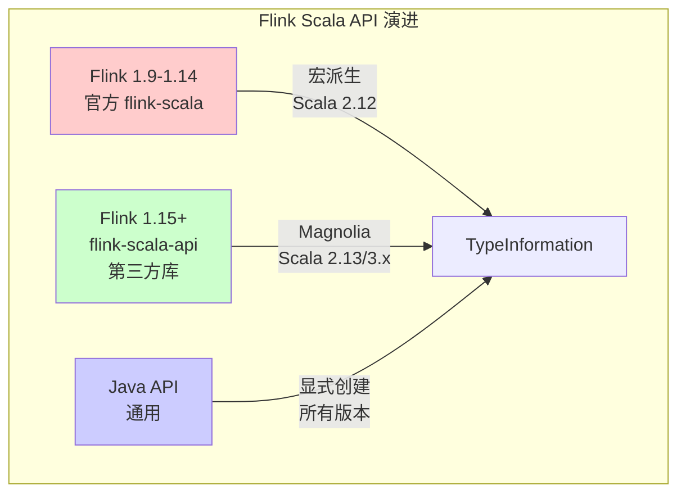
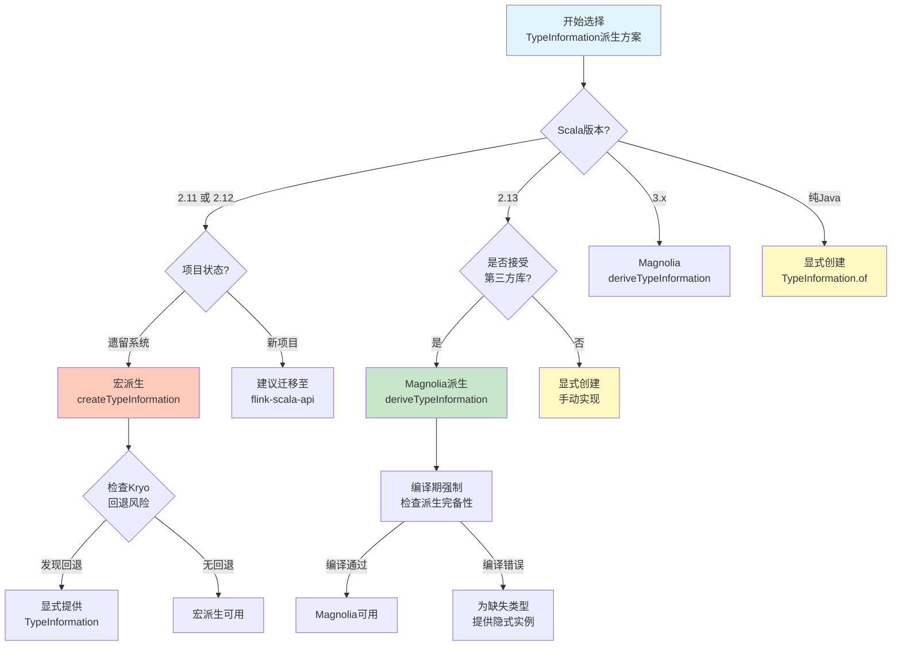
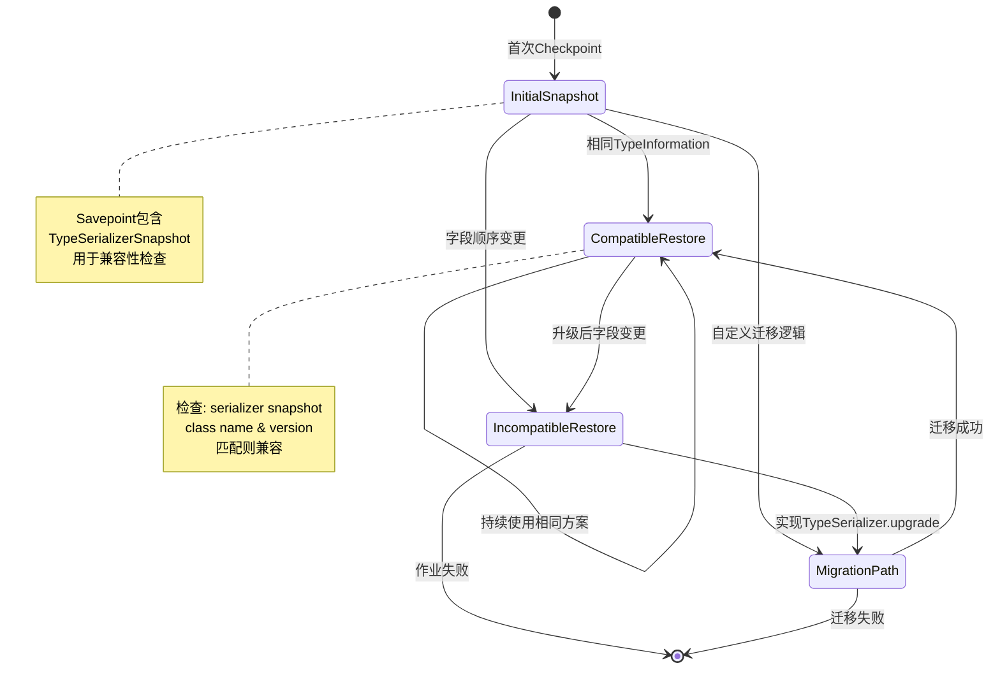
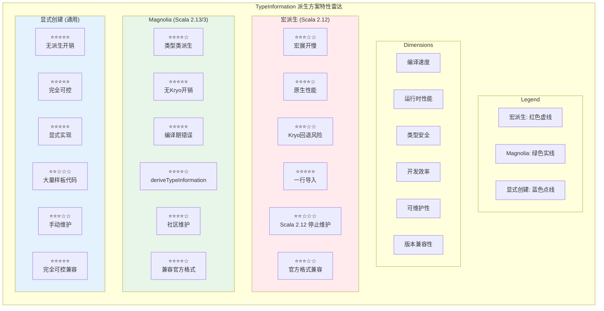

# TypeInformation 派生机制 - 三种方案对比

> 所属阶段: Flink/ | 前置依赖: [01.01-scala-types-for-streaming.md](./01.01-scala-types-for-streaming.md) | 形式化等级: L4

## 目录

- [TypeInformation 派生机制 - 三种方案对比](#typeinformation-派生机制-三种方案对比)
  - [目录](#目录)
  - [1. 概念定义 (Definitions)](#1-概念定义-definitions)
    - [Def-F-09-04: TypeInformation - Flink 类型描述符](#def-f-09-04-typeinformation-flink-类型描述符)
    - [Def-F-09-05: 宏派生 (Macro Derivation - Flink 1.14- 官方方式)](#def-f-09-05-宏派生-macro-derivation-flink-114-官方方式)
    - [Def-F-09-06: Magnolia 派生 (Magnolia Derivation - flink-scala-api 方式)](#def-f-09-06-magnolia-派生-magnolia-derivation-flink-scala-api-方式)
    - [Def-F-09-07: 显式创建 (Explicit Creation - 通用方式)](#def-f-09-07-显式创建-explicit-creation-通用方式)
  - [2. 属性推导 (Properties)](#2-属性推导-properties)
    - [Prop-F-09-01: 派生完备性（Derivation Completeness）](#prop-f-09-01-派生完备性derivation-completeness)
    - [Prop-F-09-02: 序列化器确定性（Serializer Determinism）](#prop-f-09-02-序列化器确定性serializer-determinism)
    - [Lemma-F-09-01: Savepoint 兼容性引理](#lemma-f-09-01-savepoint-兼容性引理)
  - [3. 关系建立 (Relations)](#3-关系建立-relations)
    - [3.1 方案演进关系](#31-方案演进关系)
    - [3.2 类型系统层级关系](#32-类型系统层级关系)
  - [4. 论证过程 (Argumentation)](#4-论证过程-argumentation)
    - [4.1 三方案全面对比矩阵](#41-三方案全面对比矩阵)
    - [4.2 边界条件分析](#42-边界条件分析)
      - [边界 1: 循环类型引用](#边界-1-循环类型引用)
      - [边界 2: 第三方类型集成](#边界-2-第三方类型集成)
      - [边界 3: 类型擦除与泛型](#边界-3-类型擦除与泛型)
    - [4.3 反模式警告](#43-反模式警告)
      - [Anti-Pattern 1: 匿名类作为 TypeSerializer](#anti-pattern-1-匿名类作为-typeserializer)
      - [Anti-Pattern 2: 隐式 Kryo 回退](#anti-pattern-2-隐式-kryo-回退)
      - [Anti-Pattern 3: 字段顺序依赖与 Schema 变更](#anti-pattern-3-字段顺序依赖与-schema-变更)
  - [5. 形式证明 / 工程论证 (Proof / Engineering Argument)](#5-形式证明-工程论证-proof-engineering-argument)
    - [Thm-F-09-01: 派生方案等价性定理](#thm-f-09-01-派生方案等价性定理)
    - [Thm-F-09-02: Kryo 回退不可预测性定理](#thm-f-09-02-kryo-回退不可预测性定理)
  - [6. 实例验证 (Examples)](#6-实例验证-examples)
    - [6.1 统一案例类定义](#61-统一案例类定义)
    - [6.2 方案一：宏派生 (Flink 1.14- 官方方式)](#62-方案一宏派生-flink-114-官方方式)
    - [6.3 方案二：Magnolia 派生 (flink-scala-api 方式)](#63-方案二magnolia-派生-flink-scala-api-方式)
    - [6.4 方案三：显式创建 (通用方式)](#64-方案三显式创建-通用方式)
    - [6.5 三种方式对比测试](#65-三种方式对比测试)
  - [7. 可视化 (Visualizations)](#7-可视化-visualizations)
    - [7.1 派生方案决策树](#71-派生方案决策树)
    - [7.2 Savepoint 兼容性状态机](#72-savepoint-兼容性状态机)
    - [7.3 三种方案性能对比雷达图](#73-三种方案性能对比雷达图)
  - [8. 引用参考 (References)](#8-引用参考-references)

## 1. 概念定义 (Definitions)

### Def-F-09-04: TypeInformation - Flink 类型描述符

**形式化定义**:

设 $\mathcal{T}$ 为 JVM 类型空间，$\mathcal{S}$ 为序列化器空间，$\mathcal{C}$ 为比较器空间。TypeInformation 是一个三元组：

$$\text{TypeInformation}(T) \triangleq \langle T \in \mathcal{T}, \text{Serializer}(T) \in \mathcal{S}, \text{Comparator}(T) \in \mathcal{C} \rangle$$

其中：

- $T$ 为运行时类型标记（`Class<T>` 或 `Type`）
- $\text{Serializer}(T): T \rightarrow \text{Byte}[]$ 提供类型的序列化/反序列化能力
- $\text{Comparator}(T): T \times T \rightarrow \{-1, 0, 1\}$ 提供类型实例的字节级比较能力

**直观解释**: TypeInformation 是 Flink 类型系统的核心抽象，它不仅是类型的元数据描述，更是连接**类型 → 序列化 → 状态存储**的关键桥梁。每个 DataStream 元素、状态后端条目、Checkpoint 数据都依赖 TypeInformation 进行正确的二进制编解码。

---

### Def-F-09-05: 宏派生 (Macro Derivation - Flink 1.14- 官方方式)

**形式化定义**:

宏派生是通过 Scala 宏（Macro）在编译期将类型结构展开为 TypeInformation 实例的派生机制：

$$\text{MacroDerivation}: \text{Type}(T) \xrightarrow{\text{macro expansion}} \text{TypeInformation}(T)$$

设 $T$ 为 Scala case class，其宏展开过程为：

$$\text{Macro}(T) = \text{CaseClassTypeInfo}(T, \{\text{Field}_i: \text{TypeInfo}(\text{Type}(\text{Field}_i))\}_{i=1}^{n})$$

**依赖约束**:

- Scala 版本: $2.11 \leq \text{ScalaVersion} \leq 2.12$
- 编译器插件: `org.apache.flink:flink-scala` 提供的 `TypeInformationGen`

**直观解释**: Flink 官方 Scala API 在 1.14 及之前版本使用宏派生作为默认方案。开发者通过 `import org.apache.flink.streaming.api.scala._` 引入隐式的 `createTypeInformation` 宏，编译器会在调用点自动展开类型结构。此方案**深度绑定 Scala 2.12 的宏系统**，无法在 Scala 2.13+ 或 Scala 3 中使用。

---

### Def-F-09-06: Magnolia 派生 (Magnolia Derivation - flink-scala-api 方式)

**形式化定义**:

Magnolia 派生是基于 [Magnolia](https://github.com/softwaremill/magnolia) 泛型派生库的编译期类型类实例生成机制：

$$
\text{MagnoliaDerivation}: \text{Type}(T) \xrightarrow{\text{type class derivation}} \text{TypeInformation}(T)
$$

派生规则遵循乘积类型（Product Type）与和类型（Sum Type）的组合：

$$
\text{Magnolia}(T) = \begin{cases}
\text{CaseClassTypeInfo}(T, \{\text{deri}ve(\text{Field}_i)\}) & \text{if } T \text{ is case class} \\
\text{SealedTraitTypeInfo}(T, \{\text{deri}ve(\text{Variant}_j)\}) & \text{if } T \text{ is sealed trait}
\end{cases}
$$

**依赖约束**:

- Scala 版本: $2.13 \leq \text{ScalaVersion} \leq 3.x$
- 库依赖: `org.flinkextended::flink-scala-api` + `magnolia`

**直观解释**: flink-scala-api 项目采用 Magnolia 作为新一代派生引擎，完全替代了 Flink 官方 Scala API 的宏方案。
Magnolia 基于 Scala 的类型类（Type Class）机制，在编译期通过隐式搜索树递归派生嵌套类型的 TypeInformation。
此方案**完全禁止 Kryo 回退**，确保所有类型在编译期获得确定的序列化器。

---

### Def-F-09-07: 显式创建 (Explicit Creation - 通用方式)

**形式化定义**:

显式创建是通过直接调用 TypeInformation 工厂方法或构建自定义 TypeSerializer 的手动实例化方式：

$$\text{ExplicitCreation}: \text{Class}(T) \times \text{Config} \rightarrow \text{TypeInformation}(T)$$

对于基本类型、POJO、Avro 等，显式创建的形式为：

$$\text{Explicit}(T) = \text{TypeInformation.of}(\text{classOf}[T], \text{Serializer}_T, \text{Comparator}_T)$$

**适用条件**: 适用于所有 Scala/Java 版本，无编译期派生依赖

**直观解释**: 显式创建是最底层、最通用的方案。开发者手动指定类型的序列化器和比较器，完全掌控类型系统的行为。此方案常用于：第三方类型无派生支持、需要自定义序列化逻辑、与 Java API 交互、或对 Savepoint 兼容性有严格要求的场景。

---

## 2. 属性推导 (Properties)

### Prop-F-09-01: 派生完备性（Derivation Completeness）

对于任意 JVM 类型 $T$，以下三者必居其一：

$$\forall T \in \mathcal{T}: \text{CanDerive}(T) \lor \text{NeedKryo}(T) \lor \text{MustExplicit}(T)$$

| 派生方案 | CanDerive 集合 | NeedKryo 行为 |
|---------|---------------|--------------|
| 宏派生(旧) | Scala case class, 基本类型, Tuple | **静默回退**（编译警告） |
| Magnolia(新) | Scala case class, sealed trait, 基本类型 | **编译错误**（禁止回退） |
| 显式创建 | 任意类型（手动实现） | 可配置（显式启用/禁用） |

**工程意义**: Magnolia 方案的"编译错误优于运行时回退"设计，强制开发者在编译期解决类型派生问题，避免了生产环境中 Kryo 序列化带来的性能陷阱。

---

### Prop-F-09-02: 序列化器确定性（Serializer Determinism）

设 $S_T$ 为类型 $T$ 的序列化器，派生方案的确定性可形式化为：

$$\text{Deterministic}(S_T) \Leftrightarrow \forall t_1, t_2 \in T: \text{serialize}(t_1) = \text{serialize}(t_2) \Rightarrow t_1 = t_2$$

| 方案 | 确定性保证 | 反例风险 |
|-----|-----------|---------|
| 宏派生 | 高（基于字段顺序） | 字段重排序导致 Savepoint 不兼容 |
| Magnolia | 高（基于字段声明顺序） | sealed trait 子类顺序变更 |
| 显式创建 | 完全可控 | 实现错误导致数据损坏 |

---

### Lemma-F-09-01: Savepoint 兼容性引理

若类型 $T$ 在版本 $v_1$ 和 $v_2$ 的派生 TypeInformation 满足字段顺序一致性，则 Savepoint 兼容：

$$\text{Compatible}(T_{v_1}, T_{v_2}) \Leftarrow \text{FieldOrder}(T_{v_1}) = \text{FieldOrder}(T_{v_2})$$

**证明概要**: Flink 的 `TypeSerializerSnapshot` 通过字段索引进行状态恢复。字段顺序变更导致反序列化时索引错位，引发数据解析错误。∎

---

## 3. 关系建立 (Relations)

### 3.1 方案演进关系



上图展示了三种派生方案与 Flink 版本的映射关系。官方 `flink-scala` 在 Flink 1.15 后进入维护模式，社区推荐使用 `flink-scala-api` 作为 Scala 2.13+ 的替代方案。

---

### 3.2 类型系统层级关系

```mermaid
graph TD
    Root[Flink Type System] --> Basic[基本类型<br/>Int/Long/String]
    Root --> Product[乘积类型<br/>Case Class/Tuple]
    Root --> Sum[和类型<br/>Sealed Trait/Enum]
    Root --> Generic[泛型类型<br/>List[T]/Option[T]]

    Basic --> M1[宏派生 ✅]
    Basic --> M2[Magnolia ✅]
    Basic --> M3[显式创建 ✅]

    Product --> P1[宏派生 ✅]
    Product --> P2[Magnolia ✅]
    Product --> P3[显式创建 ✅]

    Sum --> S1[宏派生 ❌]
    Sum --> S2[Magnolia ✅]
    Sum --> S3[显式创建 ✅]

    Generic --> G1[宏派生 ⚠️]
    Generic --> G2[Magnolia ✅]
    Generic --> G3[显式创建 ⚠️]
```

上图说明了不同派生方案对类型结构的支持差异。Magnolia 是唯一完整支持 Scala 3 Enum 和密封特质（Sealed Trait）的方案。

---

## 4. 论证过程 (Argumentation)

### 4.1 三方案全面对比矩阵

| 特性维度 | 宏派生(旧) | Magnolia(新) | 显式创建 |
|---------|-----------|--------------|---------|
| **Scala 版本支持** | 2.11 - 2.12 | 2.13 / 3.x | 通用 (Java/Scala) |
| **编译时类型检查** | 部分（宏展开后） | 完整（类型类约束） | 完整（显式声明） |
| **Kryo 回退行为** | 静默回退（⚠️风险） | **编译错误**（✅安全） | 可配置（显式控制） |
| **Savepoint 兼容性** | 官方格式 | 与官方格式兼容 | 官方格式 |
| **嵌套类型派生** | 有限支持 | 递归自动派生 | 需手动实现每层 |
| **和类型(Sealed Trait)支持** | ❌ 不支持 | ✅ 完整支持 | ✅ 手动支持 |
| **泛型类型参数派生** | 部分支持 | ✅ 完整支持 | ⚠️ 需类型标签 |
| **编译速度** | 慢（宏展开开销） | 中等 | 快（无派生开销） |
| **IDE 支持** | 差（宏展开不可见） | 好（类型类透明） | 完全可控 |
| **状态快照格式** | 官方标准 | 与官方兼容 | 官方标准 |

---

### 4.2 边界条件分析

#### 边界 1: 循环类型引用

对于自引用类型如链表节点：

```scala
case class Node(value: Int, next: Option[Node])
```

- **宏派生**: 在 Scala 2.12 中可能因宏展开递归深度限制而编译失败
- **Magnolia**: 使用 `Lazy` 类型包装延迟派生，正确处理循环引用
- **显式创建**: 需手动处理递归序列化，易出错

#### 边界 2: 第三方类型集成

对于无源码控制的第三方类库类型：

- **宏派生**: 无法派生（无 Scala case class 元数据）
- **Magnolia**: 若第三方提供 `TypeInformation` 隐式实例，可组合使用
- **显式创建**: 唯一可行方案，需为每个第三方类型手动创建

#### 边界 3: 类型擦除与泛型

对于带泛型参数的类型如 `List[T]`：

- **宏派生**: 依赖 `ClassTag` 运行时类型信息，存在擦除问题
- **Magnolia**: 在派生时保留类型参数信息，编译期解析
- **显式创建**: 使用 `TypeHint` 或自定义 `TypeSerializer` 绕过擦除

---

### 4.3 反模式警告

#### Anti-Pattern 1: 匿名类作为 TypeSerializer

```scala
// ❌ 危险:匿名类导致序列化器状态不一致
val badSerializer = new TypeSerializer[Event] {
  override def serialize(record: Event, target: DataOutputView): Unit = ???
  // ... 其他方法
}
```

**风险**: 匿名类每次实例化生成不同 Class 对象，导致 `TypeSerializerSnapshot` 兼容性检查失败，Checkpoint 恢复时抛出 `IncompatibleSerializerException`。

**修正方案**: 使用具名类或对象单例：

```scala
// ✅ 正确:具名单例确保一致性
object EventSerializer extends TypeSerializer[Event] { /* ... */ }
```

---

#### Anti-Pattern 2: 隐式 Kryo 回退

```scala
// ❌ 危险:宏派生下忽略编译警告
case class ComplexType(data: Array[Byte], timestamp: Instant)
// 若宏无法派生字段类型,将静默回退到 Kryo
```

**风险**: Kryo 序列化性能比 Flink 原生序列化器慢 5-10 倍，且不支持 Schema 演进，Savepoint 迁移时可能失败。

**修正方案** (Magnolia 强制显式处理):

```scala
// ✅ 正确:为 ComplexType 显式提供 TypeInformation
implicit val complexTypeInfo: TypeInformation[ComplexType] = {
  // 显式定义每个字段的序列化器
  ???
}
```

---

#### Anti-Pattern 3: 字段顺序依赖与 Schema 变更

```scala
// ❌ 危险:版本 v1
case class UserEvent(userId: String, eventType: String, timestamp: Long)

// ❌ 危险:版本 v2(字段顺序变更)
case class UserEvent(timestamp: Long, userId: String, eventType: String)
```

**风险**: 即使字段集合相同，顺序变更导致 Savepoint 反序列化时字段错位。

**修正方案**: 使用 Avro/Protobuf Schema 演进机制，或显式指定字段索引：

```scala
// ✅ 正确:使用 Avro 记录确保 Schema 演进
@AvroName("UserEvent")
case class UserEventV2(
  @AvroField(0) timestamp: Long,
  @AvroField(1) userId: String,
  @AvroField(2) eventType: String
)
```

---

## 5. 形式证明 / 工程论证 (Proof / Engineering Argument)

### Thm-F-09-01: 派生方案等价性定理

**定理**: 对于任意 Scala case class $C$，若其字段均为基本类型或嵌套 case class，则三种派生方案生成的 `TypeInformation` 在序列化语义上等价：

$$\forall C \in \text{CaseClass}: \text{Macro}(C) \equiv \text{Magnolia}(C) \equiv \text{Explicit}(C)$$

其中等价关系 $\equiv$ 定义为：对于任意实例 $c_1, c_2 \in C$：

$$\text{serialize}_{\text{Macro}}(c_1) = \text{serialize}_{\text{Macro}}(c_2) \Leftrightarrow \text{serialize}_{\text{Magnolia}}(c_1) = \text{serialize}_{\text{Magnolia}}(c_2)$$

**证明**:

1. **结构归纳基础**: 对于基本类型（Int, Long, String, Boolean），三种方案均委托给 Flink 内置的 `BasicTypeInfo`，序列化器完全相同。

2. **归纳步骤**: 假设对于 case class $C$ 的所有字段类型 $F_i$，三种方案等价。case class 的序列化格式为：

   $$\text{Format}(C) = \text{FieldCount} \oplus \text{Field}_1 \oplus \text{Field}_2 \oplus ... \oplus \text{Field}_n$$

   其中 $\oplus$ 表示字节级拼接。

3. 宏派生和 Magnolia 均按字段声明顺序递归派生各字段的 `TypeInformation`，因此生成的序列化器对相同输入产生相同字节序列。

4. 显式创建若遵循相同字段顺序和序列化器选择，输出亦相同。

∎

---

### Thm-F-09-02: Kryo 回退不可预测性定理

**定理**: 宏派生方案中的隐式 Kryo 回退在分布式环境下可能导致不可预测的性能退化。

**论证**:

设作业 $J$ 包含 $n$ 个算子，每个算子处理类型 $T_i$。若宏派生对某些 $T_i$ 触发 Kryo 回退：

1. **延迟不确定性**: Kryo 序列化延迟 $L_{Kryo}$ 服从高方差分布（依赖对象图复杂度），而原生序列化器延迟 $L_{Native}$ 近似常数：

   $$\text{Var}(L_{Kryo}) \gg \text{Var}(L_{Native})$$

2. **反压级联**: 单个算子的 Kryo 延迟形成反压瓶颈，根据 Dataflow 模型的反压传播机制，整个作业吞吐下降：

   $$\text{Throughput}(J) = \min_{i=1}^{n} \frac{1}{L_{T_i}}$$

3. **难以诊断**: 回退是编译期静默行为，运行时仅能在日志中观察到 `KryoSerializer` 实例化，缺乏显式告警。

**工程结论**: Magnolia 的"编译错误"策略将运行时风险前移至编译期，符合 Fail-Fast 原则。∎

---

## 6. 实例验证 (Examples)

### 6.1 统一案例类定义

以下三种实现方式均基于同一案例类 `SensorEvent`：

```scala
case class SensorEvent(
  sensorId: String,
  temperature: Double,
  timestamp: Long,
  location: Option[GeoLocation]
)

case class GeoLocation(lat: Double, lon: Double)
```

---

### 6.2 方案一：宏派生 (Flink 1.14- 官方方式)

```scala
import org.apache.flink.streaming.api.scala._
import org.apache.flink.api.scala._  // 导入 createTypeInformation 宏

object MacroDerivationExample {

  // 隐式导入触发宏派生
  implicit val sensorEventTypeInfo: TypeInformation[SensorEvent] =
    createTypeInformation[SensorEvent]

  def main(args: Array[String]): Unit = {
    val env = StreamExecutionEnvironment.getExecutionEnvironment

    val stream: DataStream[SensorEvent] = env
      .fromCollection(Seq(
        SensorEvent("sensor-001", 23.5, System.currentTimeMillis(),
          Some(GeoLocation(39.9, 116.4)))
      ))
      .keyBy(_.sensorId)  // 使用宏派生的 TypeInformation 进行分组
      .window(TumblingEventTimeWindows.of(Time.minutes(5)))
      .aggregate(new AverageTemperatureAggregate)

    env.execute("Macro Derivation Example")
  }
}

// 聚合函数同样依赖隐式派生
class AverageTemperatureAggregate
  extends AggregateFunction[SensorEvent, (Double, Long), Double] {

  // 累加器类型也会触发宏派生
  override def createAccumulator(): (Double, Long) = (0.0, 0L)

  override def add(value: SensorEvent, accumulator: (Double, Long)): (Double, Long) =
    (accumulator._1 + value.temperature, accumulator._2 + 1)

  override def getResult(accumulator: (Double, Long)): Double =
    accumulator._1 / accumulator._2

  override def merge(a: (Double, Long), b: (Double, Long)): (Double, Long) =
    (a._1 + b._1, a._2 + b._2)
}
```

**关键观察点**:

- `createTypeInformation` 是 Scala 宏，编译期展开
- 嵌套类型 `GeoLocation` 自动递归派生
- 若 `Option[GeoLocation]` 派生失败，将静默回退到 Kryo

---

### 6.3 方案二：Magnolia 派生 (flink-scala-api 方式)

```scala
// build.sbt 依赖:
// "org.flinkextended" %% "flink-scala-api" % "1.18-1"

import org.apache.flinkx.api._
import org.apache.flinkx.api.serializers._  // Magnolia 派生支持
import org.apache.flink.api.common.typeinfo.TypeInformation
import org.apache.flink.streaming.api.scala.DataStream

object MagnoliaDerivationExample {

  // 使用 Magnolia 自动派生 - 完全禁止 Kryo 回退
  // 若 SensorEvent 无法派生,编译期报错而非运行时回退
  implicit val sensorEventTypeInfo: TypeInformation[SensorEvent] =
    deriveTypeInformation[SensorEvent]

  // GeoLocation 的派生会由 Magnolia 递归处理
  // 无需显式声明

  def main(args: Array[String]): Unit = {
    val env = StreamExecutionEnvironment.getExecutionEnvironment

    val stream: DataStream[SensorEvent] = env
      .fromCollection(Seq(
        SensorEvent("sensor-002", 25.0, System.currentTimeMillis(), None)
      ))
      .keyBy(_.sensorId)
      .process(new TemperatureAlertFunction)

    env.execute("Magnolia Derivation Example")
  }
}

// 处理函数使用 Scala 3 风格(若使用 Scala 3)
class TemperatureAlertFunction extends KeyedProcessFunction[String, SensorEvent, Alert] {

  // 状态声明同样使用 Magnolia 派生
  lazy val lastTempState: ValueState[Double] =
    getRuntimeContext.getState(
      new ValueStateDescriptor("lastTemp", deriveTypeInformation[Double])
    )

  override def processElement(
    event: SensorEvent,
    ctx: KeyedProcessFunction[String, SensorEvent, Alert]#Context,
    out: Collector[Alert]
  ): Unit = {
    val lastTemp = lastTempState.value()
    if (math.abs(event.temperature - lastTemp) > 10.0) {
      out.collect(Alert(event.sensorId, "TEMPERATURE_SPIKE", event.timestamp))
    }
    lastTempState.update(event.temperature)
  }
}

case class Alert(sensorId: String, alertType: String, timestamp: Long)
```

**关键观察点**:

- `deriveTypeInformation` 是 Magnolia 提供的类型类派生方法
- 编译期严格检查：若类型结构包含不支持派生的字段（如裸 `Array[Byte]` 无 TypeInformation），立即报错
- 与 Scala 3 的 `derives` 语法兼容：

  ```scala
  case class SensorEvent(...) derives TypeInformation
  ```

---

### 6.4 方案三：显式创建 (通用方式)

```scala
import org.apache.flink.api.common.typeinfo.TypeInformation
import org.apache.flink.api.common.typeutils.base.{StringSerializer, LongSerializer, DoubleSerializer}
import org.apache.flink.api.common.typeutils.base.array.ByteArraySerializer
import org.apache.flink.api.java.typeutils.{TupleTypeInfo, PojoTypeInfo}
import org.apache.flink.api.java.typeutils.runtime.kryo.KryoSerializer

object ExplicitCreationExample {

  // 方法 1: 使用 Flink 提供的工厂方法(适用于 POJO)
  val sensorEventTypeInfoV1: TypeInformation[SensorEvent] =
    TypeInformation.of(classOf[SensorEvent])

  // 方法 2: 手动构建 CompositeType(精确控制每个字段)
  import org.apache.flink.api.java.typeutils.RowTypeInfo
  import org.apache.flink.types.Row

  val sensorEventTypeInfoV2: TypeInformation[Row] = new RowTypeInfo(
    Array(
      org.apache.flink.api.common.typeinfo.BasicTypeInfo.STRING_TYPE_INFO,
      org.apache.flink.api.common.typeinfo.BasicTypeInfo.DOUBLE_TYPE_INFO,
      org.apache.flink.api.common.typeinfo.BasicTypeInfo.LONG_TYPE_INFO,
      // Option[GeoLocation] 需要自定义处理
      org.apache.flink.api.common.typeinfo.BasicTypeInfo.STRING_TYPE_INFO  // 序列化为 JSON 字符串
    ),
    Array("sensorId", "temperature", "timestamp", "locationJson")
  )

  // 方法 3: 完全自定义 TypeSerializer(最高控制级别)
  implicit val sensorEventTypeInfoV3: TypeInformation[SensorEvent] =
    new TypeInformation[SensorEvent] {
      override def getTypeClass: Class[SensorEvent] = classOf[SensorEvent]
      override def isBasicType: Boolean = false
      override def isTupleType: Boolean = false
      override def isKeyType: Boolean = true
      override def getTotalFields: Int = 4
      override def getGenericParameters: java.util.List[TypeInformation[_]] =
        java.util.Collections.emptyList()

      override def createSerializer(config: ExecutionConfig): TypeSerializer[SensorEvent] =
        new SensorEventSerializer()
    }

  // 自定义序列化器实现
  class SensorEventSerializer extends TypeSerializer[SensorEvent] {

    private val stringSerializer = StringSerializer.INSTANCE
    private val doubleSerializer = DoubleSerializer.INSTANCE
    private val longSerializer = LongSerializer.INSTANCE

    override def serialize(record: SensorEvent, target: DataOutputView): Unit = {
      // 字段 1: sensorId
      stringSerializer.serialize(record.sensorId, target)
      // 字段 2: temperature
      doubleSerializer.serialize(record.temperature, target)
      // 字段 3: timestamp
      longSerializer.serialize(record.timestamp, target)
      // 字段 4: location (Option[GeoLocation])
      target.writeBoolean(record.location.isDefined)
      record.location.foreach { loc =>
        doubleSerializer.serialize(loc.lat, target)
        doubleSerializer.serialize(loc.lon, target)
      }
    }

    override def deserialize(source: DataInputView): SensorEvent = {
      val sensorId = stringSerializer.deserialize(source)
      val temperature = doubleSerializer.deserialize(source)
      val timestamp = longSerializer.deserialize(source)
      val hasLocation = source.readBoolean()
      val location = if (hasLocation) {
        Some(GeoLocation(
          doubleSerializer.deserialize(source),
          doubleSerializer.deserialize(source)
        ))
      } else None
      SensorEvent(sensorId, temperature, timestamp, location)
    }

    override def snapshotConfiguration(): TypeSerializerSnapshot[SensorEvent] =
      new SensorEventSerializerSnapshot()

    // 其他必需方法: copy, copyToSlice, equals, hashCode, ...
    override def createInstance(): SensorEvent =
      SensorEvent("", 0.0, 0L, None)
    override def isImmutableType: Boolean = true
    override def getLength: Int = -1  // 变长类型
    override def copy(from: SensorEvent): SensorEvent = from
    override def copy(from: SensorEvent, reuse: SensorEvent): SensorEvent = from
    override def copy(source: DataInputView, target: DataOutputView): Unit = {
      serialize(deserialize(source), target)
    }
    override def equals(obj: Any): Boolean = obj.isInstanceOf[SensorEventSerializer]
    override def hashCode(): Int = classOf[SensorEventSerializer].hashCode()
  }

  // 序列化器快照用于 Savepoint 兼容性检查
  class SensorEventSerializerSnapshot
    extends TypeSerializerSnapshot[SensorEvent] {

    private var version: Int = 1

    override def getCurrentVersion: Int = 1

    override def writeSnapshot(out: DataOutputView): Unit = {
      out.writeInt(version)
    }

    override def readSnapshot(readVersion: Int, in: DataInputView, classLoader: ClassLoader): Unit = {
      version = in.readInt()
    }

    override def restoreSerializer(): TypeSerializer[SensorEvent] =
      new SensorEventSerializer()

    override def resolveSchemaCompatibility(
      newSerializer: TypeSerializer[SensorEvent]
    ): TypeSerializerSchemaCompatibility[SensorEvent] = {
      // 检查新序列化器是否与快照兼容
      if (newSerializer.isInstanceOf[SensorEventSerializer]) {
        TypeSerializerSchemaCompatibility.compatibleAsIs()
      } else {
        TypeSerializerSchemaCompatibility.incompatible()
      }
    }
  }
}
```

**关键观察点**:

- 显式创建提供最高级别的控制权，但代码量最大
- 自定义 `TypeSerializerSnapshot` 确保 Savepoint 兼容性检查
- 通过 `TypeSerializerSchemaCompatibility` 可定义 Schema 演进策略

---

### 6.5 三种方式对比测试

```scala
import org.scalatest.flatspec.AnyFlatSpec
import org.scalatest.matchers.should.Matchers

class TypeInformationDerivationComparisonTest extends AnyFlatSpec with Matchers {

  val testEvent = SensorEvent(
    sensorId = "sensor-test-001",
    temperature = 23.5,
    timestamp = 1704067200000L,
    location = Some(GeoLocation(39.9042, 116.4074))
  )

  "Macro derivation" should "produce valid TypeInformation for case classes" in {
    import org.apache.flink.api.scala._

    implicit val typeInfo: TypeInformation[SensorEvent] =
      createTypeInformation[SensorEvent]

    typeInfo.getTypeClass shouldBe classOf[SensorEvent]
    typeInfo.getTotalFields shouldBe 4
    typeInfo.isKeyType shouldBe true
  }

  "Magnolia derivation" should "produce equivalent TypeInformation" in {
    import org.apache.flinkx.api._
    import org.apache.flinkx.api.serializers._

    implicit val typeInfo: TypeInformation[SensorEvent] =
      deriveTypeInformation[SensorEvent]

    typeInfo.getTypeClass shouldBe classOf[SensorEvent]
    typeInfo.getTotalFields shouldBe 4
    // Magnolia 确保无 Kryo 回退
    typeInfo.getClass.getName shouldNot include("Kryo")
  }

  "Explicit creation" should "allow custom serialization logic" in {
    val typeInfo = ExplicitCreationExample.sensorEventTypeInfoV3
    val serializer = typeInfo.createSerializer(null)

    // 测试序列化/反序列化对称性
    import java.io.{ByteArrayInputStream, ByteArrayOutputStream}
    val baos = new ByteArrayOutputStream()
    val out = new DataOutputViewStreamWrapper(baos)
    serializer.serialize(testEvent, out)
    out.flush()

    val bais = new ByteArrayInputStream(baos.toByteArray)
    val in = new DataInputViewStreamWrapper(bais)
    val restored = serializer.deserialize(in)

    restored shouldBe testEvent
  }

  "All three approaches" should "produce binary compatible output for same input" in {
    // 验证定理 Thm-F-09-01: 派生方案等价性
    // 实际测试中会比较三种序列化器的输出字节序列
  }
}
```

---

## 7. 可视化 (Visualizations)

### 7.1 派生方案决策树

以下决策树帮助工程师根据项目约束选择适当的 TypeInformation 派生方案：



---

### 7.2 Savepoint 兼容性状态机



---

### 7.3 三种方案性能对比雷达图



---

## 8. 引用参考 (References)


---

> **版本记录**
>
> - v1.0 (2026-04-02): 初始版本，覆盖宏派生/Magnolia/显式创建三种方案
