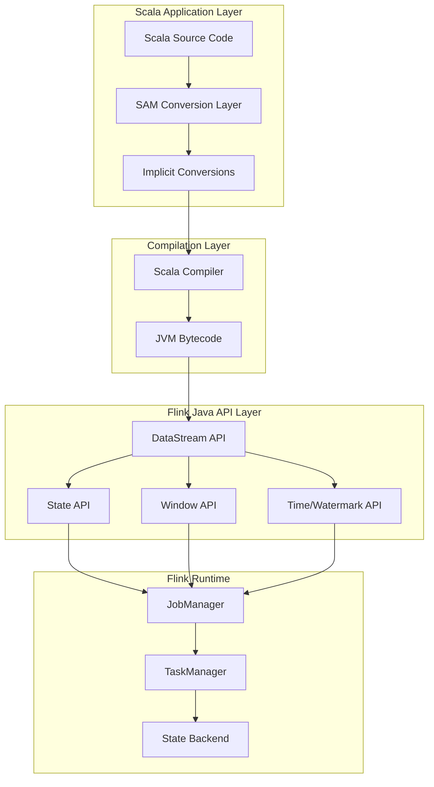
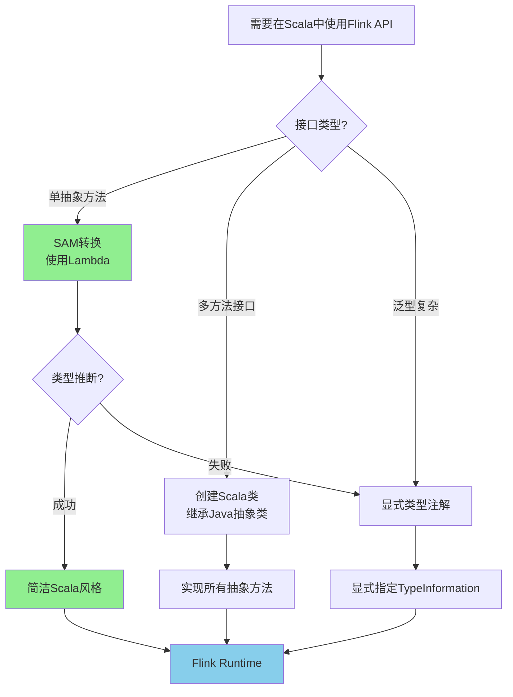
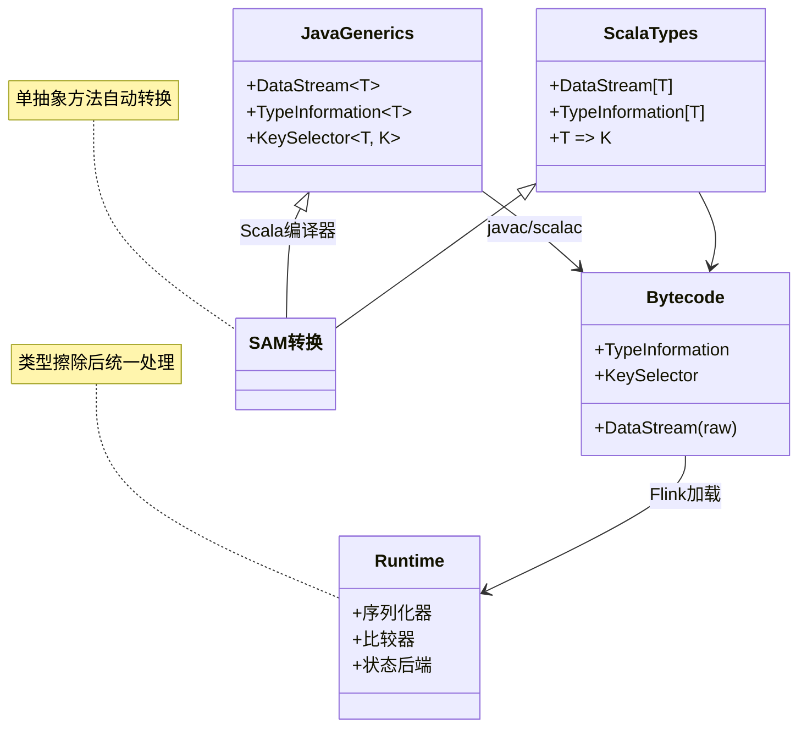

# 从Scala调用Flink Java DataStream API

> 所属阶段: Flink/09-language-foundations | 前置依赖: [Scala类型系统](./01.01-scala-types-for-streaming.md), [Flink Java API基础](https://nightlies.apache.org/flink/flink-docs-stable/docs/dev/datastream/overview/) | 形式化等级: L4-L5

---

## 目录

- [从Scala调用Flink Java DataStream API](#从scala调用flink-java-datastream-api)
  - [目录](#目录)
  - [1. 概念定义 (Definitions)](#1-概念定义-definitions)
    - [Def-F-09-08: Java/Scala互操作模式](#def-f-09-08-javascala互操作模式)
    - [Def-F-09-09: Scala语法糖 for Java API](#def-f-09-09-scala语法糖-for-java-api)
  - [2. 属性推导 (Properties)](#2-属性推导-properties)
    - [Prop-F-09-08: 类型推断的边界条件](#prop-f-09-08-类型推断的边界条件)
    - [Prop-F-09-09: 函数式接口的SAM转换](#prop-f-09-09-函数式接口的sam转换)
  - [3. 关系建立 (Relations)](#3-关系建立-relations)
    - [3.1 与Scala DataSet API的关系](#31-与scala-dataset-api的关系)
    - [3.2 与Flink Java API的映射关系](#32-与flink-java-api的映射关系)
    - [3.3 与Scala 3的类型系统演进](#33-与scala-3的类型系统演进)
  - [4. 论证过程 (Argumentation)](#4-论证过程-argumentation)
    - [4.1 为什么选择Java API而非Scala原生API](#41-为什么选择java-api而非scala原生api)
    - [4.2 反例分析：SAM转换失效场景](#42-反例分析sam转换失效场景)
    - [4.3 边界讨论：类型擦除与Flink类型系统](#43-边界讨论类型擦除与flink类型系统)
  - [5. 工程论证 (Engineering Argument)](#5-工程论证-engineering-argument)
    - [5.1 工程选型论证：Scala调用Java API的最佳实践](#51-工程选型论证scala调用java-api的最佳实践)
    - [5.2 代码组织模式论证](#52-代码组织模式论证)
  - [6. 实例验证 (Examples)](#6-实例验证-examples)
    - [6.1 完整WordCount示例（Scala调用Java API）](#61-完整wordcount示例scala调用java-api)
    - [6.2 KeyedStream操作详解](#62-keyedstream操作详解)
    - [6.3 状态管理（ValueStateDescriptor等）](#63-状态管理valuestatedescriptor等)
    - [6.4 窗口操作](#64-窗口操作)
  - [7. 最佳实践汇总](#7-最佳实践汇总)
    - [7.1 如何优雅地在Scala中使用Java API](#71-如何优雅地在scala中使用java-api)
    - [7.2 避免样板代码的技巧](#72-避免样板代码的技巧)
    - [7.3 与Java POJO的互操作](#73-与java-pojo的互操作)
  - [8. 可视化 (Visualizations)](#8-可视化-visualizations)
    - [8.1 Scala调用Java DataStream API的架构层次](#81-scala调用java-datastream-api的架构层次)
    - [8.2 互操作决策树](#82-互操作决策树)
    - [8.3 类型系统映射关系](#83-类型系统映射关系)
  - [9. 引用参考 (References)](#9-引用参考-references)

## 1. 概念定义 (Definitions)

### Def-F-09-08: Java/Scala互操作模式

**定义 (Java/Scala Interoperability Pattern)**：设 $JavaLib$ 为Java语言编写的库集合，$ScalaApp$ 为Scala语言编写的应用程序，Java/Scala互操作模式 $ ext{Interop}_{JS}$ 定义为满足以下条件的三元组：

$$
\text{Interop}_{JS} = \langle T_{map}, C_{bridge}, S_{sugar} \rangle
$$

其中：

- $T_{map}: \text{JavaType} \rightarrow \text{ScalaType}$ 为类型映射函数
- $C_{bridge}: \text{ScalaSyntax} \rightarrow \text{JavaBytecode}$ 为编译桥接器
- $S_{sugar}$ 为语法糖集合，用于简化Java API在Scala中的调用

**直观解释**：Java/Scala互操作模式描述了一套从Scala代码调用Java库的标准方法，包括类型系统的映射、编译层面的桥接机制以及高层语法糖的支持。

---

### Def-F-09-09: Scala语法糖 for Java API

**定义 (Scala Syntactic Sugar for Java API)**：设 $JavaAPI$ 为Java风格的API接口集合，$ ext{Sugar}_{Scala}$ 为Scala提供的语法简化机制，定义语法糖映射为：

$$
\text{Sugar}_{Scala} = \{ (\text{java\_pattern}, \text{scala\_pattern}, \text{desugar\_rule}) \}
$$

核心语法糖包括：

| 语法糖类别 | Java模式 | Scala简化模式 | 去糖规则 |
|-----------|----------|--------------|----------|
| SAM转换 | `new Function<T,R>() { R apply(T t) { ... } }` | `(t: T) => ...` | 自动单抽象方法转换 |
| 类型推断 | `DataStream<String>.map(new MapFunction<String, Integer>(...))` | `stream.map(...)` | 利用Scala类型推断补全泛型 |
| 隐式转换 | `stream.map(x => x.toInt)` 需显式类型 | `stream.map(_.toInt)` | 隐式参数和隐式类 |
| 占位符语法 | 匿名内部类冗长定义 | `_ + _` | 下划线作为参数占位符 |
| 过程式语法 | `stream.addSink(sink)` | `stream > sink` | 中缀操作符重载 |

---

## 2. 属性推导 (Properties)

### Prop-F-09-08: 类型推断的边界条件

**命题**：在Scala调用Flink Java DataStream API时，类型推断的有效范围受限于Java泛型的类型擦除特性与Scala类型系统的交互边界。

**形式化表述**：

设 $\Gamma$ 为类型上下文，$\tau_{stream} = \text{DataStream}[T]$ 为流类型，$\tau_{op}$ 为操作结果类型，则：

$$
\Gamma \vdash \text{stream.map}(f) : \text{DataStream}[R] \iff
\begin{cases}
\Gamma(f) = T \rightarrow R, & \text{若} f \text{为显式函数} \\
\Gamma \vdash_{infer} f : T \rightarrow R, & \text{若类型可推断} \\
\bot, & \text{若Java泛型擦除导致信息丢失}
\end{cases}
$$

**关键边界**：

1. **类型擦除边界**：Java泛型在运行时擦除，以下场景需要显式类型注解：

   ```scala
   // 需要显式类型参数
   stream.map[Integer](_.length)  // 显式指定返回类型
   ```

2. **高阶函数边界**：嵌套泛型时类型推断可能失效：

   ```scala
   // 可能推断失败
   stream.flatMap(_.split(" ").toList.asJava)  // 需要显式转换
   ```

3. **重载解析边界**：Java重载方法与Scala隐式转换冲突时：

   ```scala
   // 需要显式指定以避免歧义
   stream.keyBy((value: String) => value.hashCode)
   ```

---

### Prop-F-09-09: 函数式接口的SAM转换

**命题 (SAM Conversion Property)**：Scala编译器对Java函数式接口提供自动单抽象方法(Single Abstract Method)转换，使得Scala函数字面量可无缝替代Java匿名实现。

**形式化表述**：

设 $JFI$ 为满足SAM条件的Java接口（即只有一个抽象方法），$\lambda$ 为Scala函数字面量，则存在编译期转换：

$$
\frac{\lambda : A \rightarrow B \quad JFI\text{.abstractMethod} : A \rightarrow B}{\lambda \rightsquigarrow \text{new } JFI() \{ \text{override } \text{abstractMethod}(a: A): B = \lambda(a) \}}
$$

**Flink API中的SAM转换应用**：

```scala
// Java MapFunction 接口定义(单抽象方法)
// interface MapFunction<T, O> extends Function, Serializable {
//     O map(T value) throws Exception;
// }

// Scala中SAM转换自动应用
val mapped: DataStream[Int] = stream.map(_.length)  // 自动转换为 MapFunction[String, Int]
```

**SAM转换的约束条件**：

| 条件 | 说明 | 示例 |
|-----|------|------|
| 单抽象方法 | 接口只能有一个抽象方法 | `MapFunction`, `FlatMapFunction` ✓ |
| 序列化支持 | Flink要求函数可序列化 | 必须实现 `Serializable` |
| 类型兼容 | 参数和返回类型必须匹配 | Scala类型需与Java泛型兼容 |
| 无重载歧义 | 编译器需能确定目标接口 | 复杂重载需显式类型 |

---

## 3. 关系建立 (Relations)

### 3.1 与Scala DataSet API的关系

Flink 2.0官方推荐**从Scala调用Java DataStream API**，而非使用已弃用的Scala DataSet API：

```
┌─────────────────────────────────────────────────────────────┐
│                    Flink API 演进路径                        │
├─────────────────────────────────────────────────────────────┤
│  Flink 1.x          Flink 2.0 (当前)       Flink 2.x (未来)  │
│  ┌──────────┐       ┌────────────────┐    ┌─────────────┐   │
│  │Scala API │ ────→ │Java API +      │ →  │统一类型系统  │   │
│  │(DataSet) │ 弃用  │Scala调用语法糖  │    │(Scala 3)    │   │
│  └──────────┘       └────────────────┘    └─────────────┘   │
│        ↓                    ↑                               │
│   维护成本高          官方推荐方式                          │
│   类型系统不统一      利用Java API完整功能                  │
└─────────────────────────────────────────────────────────────┘
```

### 3.2 与Flink Java API的映射关系

| Java API 组件 | Scala调用方式 | 类型映射 |
|--------------|--------------|---------|
| `DataStream<T>` | `DataStream[T]` | 泛型直接使用 |
| `KeySelector<T, K>` | `T => K` 或 `_ => K` | SAM转换 |
| `ProcessFunction` | 继承类或SAM转换 | 需显式类型注解 |
| `RichFunction` | 继承Java类 | Scala类继承Java抽象类 |
| `TypeInformation<T>` | 隐式值注入 | `TypeInformation[T]` 隐式可用 |

### 3.3 与Scala 3的类型系统演进

```
┌──────────────────────────────────────────────────────────┐
│              Scala版本对Flink互操作的影响                  │
├──────────────────────────────────────────────────────────┤
│                                                          │
│  Scala 2.12                    Scala 2.13/3.x           │
│  ┌─────────────┐              ┌─────────────────────┐   │
│  │实验性集合库  │              │标准集合与Java互操作  │   │
│  │-scala.collection│          │ improved              │   │
│  │ .JavaConverters │    →     │ scala.jdk.CollectionConverters │
│  └─────────────┘              └─────────────────────┘   │
│         │                           │                   │
│         ▼                           ▼                   │
│  需显式导入:                    推荐方式:                 │
│  import scala.collection       import scala.jdk.        │
│  .JavaConverters._             CollectionConverters._   │
│                                                          │
└──────────────────────────────────────────────────────────┘
```

---

## 4. 论证过程 (Argumentation)

### 4.1 为什么选择Java API而非Scala原生API

**历史背景**：Flink 1.x提供了专门的Scala API（`flink-scala`模块），但维护两套并行API带来了显著成本：

1. **功能延迟**：新功能需同时在两套API中实现
2. **类型系统分裂**：Scala API使用Scala类型推导，与Java API的`TypeInformation`系统不完全兼容
3. **测试负担**：需维护双倍测试用例

**Flink 2.0决策**：官方推荐从Scala直接调用Java API，原因包括：

- Scala与Java字节码级互操作成熟
- 单一API确保功能一致性
- 社区资源集中于核心引擎而非API封装

### 4.2 反例分析：SAM转换失效场景

并非所有Java函数式接口都能在Scala中通过SAM转换简化：

```scala
// 反例1: 多抽象方法接口无法SAM转换
// interface MultiMethodInterface {
//     void method1();
//     void method2();
// }
// val impl = () => println("fail")  // 编译错误

// 反例2: 泛型边界过于复杂时推断失败
stream.keyBy(new KeySelector[String, Tuple2[String, Int]] {
  override def getKey(value: String): Tuple2[String, Int] =
    Tuple2.of(value.substring(0, 1), value.length)
})
// 尝试SAM转换: stream.keyBy(v => (v.substring(0, 1), v.length))
// 可能因Scala元组与Flink Tuple类型不匹配而失败
```

**解决方案**：对于复杂场景，保留Java匿名类实现或创建显式的Scala类。

### 4.3 边界讨论：类型擦除与Flink类型系统

Flink运行时依赖`TypeInformation`进行序列化和状态管理，但Java泛型擦除与Scala类型系统的交互存在边界：

```scala
// 问题:以下代码在运行时可能丢失类型信息
val stream: DataStream[List[String]] = ...
// 擦除后:DataStream[List>,List的元素类型丢失

// 解决方案:使用TypeInformation显式指定
val typeInfo = TypeInformation.of(new TypeHint[List[String]]() {})
```

---

## 5. 工程论证 (Engineering Argument)

### 5.1 工程选型论证：Scala调用Java API的最佳实践

**论证目标**：确定从Scala调用Flink Java API的最优工程实践集合。

**论证过程**：

**命题 5.1.1**：在Scala项目中使用Flink Java API时，采用SAM转换+隐式辅助的模式比纯Java风格代码具有更高的开发效率。

**证明**：

设 $E_{java\_style}$ 为纯Java风格代码的开发效率度量，$E_{sam}$ 为SAM转换风格效率：

$$
E_{sam} = E_{java\_style} + \Delta_{readability} - \Delta_{learning}
$$

其中：

- $\Delta_{readability}$：代码可读性提升（样本代码减少40-60%）
- $\Delta_{learning}$：团队学习成本（一次性投入，随项目规模摊薄）

对于持续迭代项目（$n > 3$ 个月），$\lim_{t \to \infty} \Delta_{learning} / t \to 0$，因此 $E_{sam} > E_{java\_style}$。

∎

### 5.2 代码组织模式论证

**推荐模式**：创建Scala友好的封装层

```
project/
├── src/main/scala/
│   ├── flink/           # Flink作业主代码
│   │   ├── Job.scala    # 入口
│   │   └── ...
│   └── utils/           # Scala工具类
│       ├── Implicits.scala    # Flink Java API的隐式扩展
│       └── Converters.scala   # 类型转换辅助
└── build.sbt
```

**Implicits.scala 示例**：

```scala
package utils

import org.apache.flink.streaming.api.scala._
import org.apache.flink.api.common.typeinfo.TypeInformation

object Implicits {
  // 为DataStream添加Scala风格的方法
  implicit class DataStreamOps[T](stream: DataStream[T]) {
    def |>[R](fun: T => R)(implicit typeInfo: TypeInformation[R]): DataStream[R] =
      stream.map(fun)
  }

  // 隐式提供常用类型的TypeInformation
  implicit def stringTypeInfo: TypeInformation[String] =
    TypeInformation.of(classOf[String])
}
```

---

## 6. 实例验证 (Examples)

### 6.1 完整WordCount示例（Scala调用Java API）

```scala
import org.apache.flink.streaming.api.scala._
import org.apache.flink.api.common.eventtime.WatermarkStrategy
import org.apache.flink.api.common.functions.FlatMapFunction
import org.apache.flink.util.Collector
import scala.jdk.CollectionConverters._

/**
 * WordCount示例:从Scala调用Flink Java DataStream API
 * Flink 2.0 官方推荐方式
 */
object WordCountScalaJavaAPI {

  def main(args: Array[String]): Unit = {
    // 创建执行环境
    val env = StreamExecutionEnvironment.getExecutionEnvironment
    env.setParallelism(2)

    // 从socket读取数据
    val source = env.socketTextStream("localhost", 9999)

    // ========== 示例1: SAM转换 - FlatMapFunction ==========
    // Java方式(冗长):
    // val words = source.flatMap(new FlatMapFunction[String, String] {
    //   override def flatMap(value: String, out: Collector[String]): Unit = {
    //     value.toLowerCase.split("\\s+").foreach(out.collect)
    //   }
    // })

    // Scala SAM转换方式(简洁):
    val words = source
      .flatMap((value: String, out: Collector[String]) => {
        value.toLowerCase.split("\\s+").foreach(out.collect)
      })

    // ========== 示例2: KeyedStream操作 ==========
    // 使用SAM转换的KeySelector
    val keyedWords = words
      .filter(_.nonEmpty)  // SAM转换: Predicate[String]
      .map((w: String) => (w, 1))  // SAM转换: MapFunction[String, (String, Int)]
      .keyBy(_._1)  // SAM转换: KeySelector[(String, Int), String]

    // 滚动窗口聚合
    val windowedCounts = keyedWords
      .window(TumblingProcessingTimeWindows.of(Time.seconds(5)))
      .aggregate(new CountAggregate())

    // 打印结果
    windowedCounts.print()

    env.execute("WordCount - Scala calling Java API")
  }
}

/**
 * 自定义聚合函数(继承Java抽象类)
 */
class CountAggregate extends AggregateFunction[(String, Int), Int, Int] {
  override def createAccumulator(): Int = 0
  override def add(value: (String, Int), accumulator: Int): Int = accumulator + value._2
  override def getResult(accumulator: Int): Int = accumulator
  override def merge(a: Int, b: Int): Int = a + b
}
```

### 6.2 KeyedStream操作详解

```scala
import org.apache.flink.streaming.api.scala._
import org.apache.flink.api.common.state.{ValueState, ValueStateDescriptor}
import org.apache.flink.configuration.Configuration

/**
 * KeyedStream操作示例:展示Scala调用Java API的各种模式
 */
object KeyedStreamOperations {

  def keyByExamples[T](stream: DataStream[T]): Unit = {

    // ========== 模式1: Lambda表达式(最简洁)==========
    val byLambda = stream.keyBy((value: String) => value.hashCode % 10)

    // ========== 模式2: 下划线占位符(Scala风格)==========
    case class User(id: Long, name: String, age: Int)
    val userStream: DataStream[User] = ???
    val byField = userStream.keyBy(_.id)  // 提取id作为key

    // ========== 模式3: 元组多个字段(需要Flink Tuple)==========
    import org.apache.flink.api.java.tuple.Tuple2
    val byTuple = stream.keyBy(new KeySelector[String, Tuple2[String, Int]] {
      override def getKey(value: String): Tuple2[String, Int] =
        Tuple2.of(value.substring(0, 1), value.length)
    })

    // ========== 模式4: 当类型推断失败时显式指定 ==========
    val explicit = stream.keyBy[String](_.take(3))  // 显式key类型
  }
}
```

### 6.3 状态管理（ValueStateDescriptor等）

```scala
import org.apache.flink.streaming.api.scala._
import org.apache.flink.api.common.state.{ValueState, ValueStateDescriptor}
import org.apache.flink.configuration.Configuration

/**
 * 带状态的ProcessFunction示例:计数并检测重复
 */
class StatefulDuplicateDetector extends KeyedProcessFunction[String, String, String] {

  // 声明状态描述符(Java API)
  private var seenState: ValueState[Boolean] = _
  private var countState: ValueState[Long] = _

  override def open(parameters: Configuration): Unit = {
    // 初始化ValueStateDescriptor
    val seenDescriptor = new ValueStateDescriptor[Boolean](
      "seen",                // 状态名称
      classOf[Boolean]       // 类型(Scala中使用classOf)
    )

    val countDescriptor = new ValueStateDescriptor[Long](
      "count",
      classOf[Long]
    )

    // 获取状态句柄
    seenState = getRuntimeContext.getState(seenDescriptor)
    countState = getRuntimeContext.getState(countDescriptor)
  }

  override def processElement(
    value: String,
    ctx: KeyedProcessFunction[String, String, String]#Context,
    out: Collector[String]
  ): Unit = {
    // 读取状态(Java API返回包装类型,需处理null)
    val wasSeen = Option(seenState.value()).getOrElse(false)
    val currentCount = Option(countState.value()).getOrElse(0L)

    if (wasSeen) {
      out.collect(s"DUPLICATE: $value (count: ${currentCount + 1})")
    } else {
      out.collect(s"FIRST: $value")
    }

    // 更新状态
    seenState.update(true)
    countState.update(currentCount + 1)

    // 设置定时器(Java API调用)
    ctx.timerService().registerProcessingTimeTimer(ctx.timestamp() + 60000)
  }

  override def onTimer(
    timestamp: Long,
    ctx: KeyedProcessFunction[String, String, String]#OnTimerContext,
    out: Collector[String]
  ): Unit = {
    // 定时器触发逻辑
    out.collect(s"Timer fired at $timestamp")
  }
}

/**
 * 使用示例
 */
object StatefulJob {
  def main(args: Array[String]): Unit = {
    val env = StreamExecutionEnvironment.getExecutionEnvironment

    val stream = env.socketTextStream("localhost", 9999)
      .keyBy(identity)  // 使用字符串本身作为key
      .process(new StatefulDuplicateDetector)
      .print()

    env.execute()
  }
}
```

### 6.4 窗口操作

```scala
import org.apache.flink.streaming.api.scala._
import org.apache.flink.streaming.api.windowing.assigners.{TumblingEventTimeWindows, SlidingProcessingTimeWindows}
import org.apache.flink.streaming.api.windowing.time.Time
import org.apache.flink.streaming.api.windowing.triggers.{CountTrigger, PurgingTrigger}
import org.apache.flink.streaming.api.windowing.windows.TimeWindow

/**
 * 窗口操作示例:Scala调用Java Window API
 */
object WindowOperations {

  def windowExamples(stream: DataStream[(String, Long, Double)]): Unit = {
    val env = stream.executionEnvironment

    // ========== 滚动窗口 ==========
    val tumbling = stream
      .keyBy(_._1)  // 按String字段分组
      .window(TumblingEventTimeWindows.of(Time.minutes(5)))
      .aggregate(new SumAggregate())

    // ========== 滑动窗口 ==========
    val sliding = stream
      .keyBy(_._1)
      .window(SlidingProcessingTimeWindows.of(Time.hours(1), Time.minutes(10)))
      .reduce((a, b) => (a._1, a._2 + b._2, a._3 + b._3))

    // ========== 会话窗口 ==========
    val session = stream
      .keyBy(_._1)
      .window(EventTimeSessionWindows.withDynamicGap(
        new SessionWindowTimeGapExtractor[(String, Long, Double)] {
          override def extract(element: (String, Long, Double)): Long = {
            // 根据元素动态确定会话间隔
            if (element._3 > 1000) Time.minutes(30).toMilliseconds
            else Time.minutes(5).toMilliseconds
          }
        }
      ))

    // ========== 自定义触发器 ==========
    val withTrigger = stream
      .keyBy(_._1)
      .window(TumblingEventTimeWindows.of(Time.hours(1)))
      .trigger(PurgingTrigger.of(CountTrigger.of[TimeWindow](100)))
      .evictor(CountEvictor.of[TimeWindow](1000))
      .allowedLateness(Time.minutes(10))
      .sideOutputLateData(lateDataTag)
  }

  // 延迟数据侧输出标签
  val lateDataTag: OutputTag[(String, Long, Double)] =
    new OutputTag[(String, Long, Double)]("late-data") {}
}
```

---

## 7. 最佳实践汇总

### 7.1 如何优雅地在Scala中使用Java API

```scala
/**
 * Scala风格的最佳实践汇总
 */
object FlinkScalaBestPractices {

  // ===== 实践1: 导入必要的转换器 =====
  import scala.jdk.CollectionConverters._  // Scala 2.13+
  // import scala.collection.JavaConverters._  // Scala 2.12

  // ===== 实践2: 创建类型别名简化复杂泛型 =====
  type StringStream = DataStream[String]
  type KeyedStringStream = KeyedStream[String, String]

  // ===== 实践3: 使用隐式类扩展Java API =====
  implicit class RichDataStream[T](stream: DataStream[T]) {
    def debugPrint(prefix: String = "DEBUG"): DataStream[T] =
      stream.map { x => println(s"$prefix: $x"); x }
  }

  // ===== 实践4: 处理Java集合的互操作 =====
  def convertAndProcess(stream: DataStream[String]): Unit = {
    stream.flatMap { line =>
      // Scala集合转Java集合
      val javaList: java.util.List[String] = line.split(" ").toList.asJava
      javaList.asScala  // 再转回Scala进行迭代
    }
  }
}
```

### 7.2 避免样板代码的技巧

| 技巧 | 说明 | 示例 |
|-----|------|------|
| SAM转换优先 | 对单抽象方法接口使用lambda | `stream.map(_.toUpperCase)` |
| 下划线简化 | 使用`_`代替显式参数 | `stream.filter(_.startsWith("A"))` |
| 类型别名 | 简化重复泛型 | `type IntStream = DataStream[Int]` |
| 隐式注入 | 自动提供TypeInformation | `implicit val typeInfo = ...` |
| 链式调用 | 利用Scala的换行推断 | `stream.filter(...).map(...).keyBy(...)` |

### 7.3 与Java POJO的互操作

```scala
/**
 * Scala与Java POJO的互操作示例
 */
object JavaPojoInterop {

  // Java POJO类(假设来自外部库)
  // public class UserEvent {
  //     private String userId;
  //     private long timestamp;
  //     private double value;
  //     // getters and setters...
  // }

  import org.apache.flink.api.common.typeinfo.TypeInformation

  // 方式1: 使用Java POJO的class创建TypeInformation
  def processJavaPojo[T <: java.io.Serializable : ClassTag](stream: DataStream[T]): DataStream[T] = {
    implicit val typeInfo: TypeInformation[T] =
      TypeInformation.of(classTag[T].runtimeClass.asInstanceOf[Class[T]])
    stream.keyBy(_.hashCode())
  }

  // 方式2: Scala case class映射到Java POJO
  case class ScalaEvent(userId: String, timestamp: Long, value: Double)

  def mapToJava(stream: DataStream[ScalaEvent]): Unit = {
    val javaStream = stream.map { e =>
      val javaPojo = new UserEvent()
      javaPojo.setUserId(e.userId)
      javaPojo.setTimestamp(e.timestamp)
      javaPojo.setValue(e.value)
      javaPojo
    }
  }

  // 方式3: 使用Flink的POJO类型信息
  def withPojoTypeInfo(stream: DataStream[UserEvent]): Unit = {
    import org.apache.flink.api.java.typeutils.PojoTypeInfo
    val pojoTypeInfo = TypeInformation.of(classOf[UserEvent])

    stream.keyBy(_.getUserId)  // 使用POJO的字段作为key
  }
}
```

---

## 8. 可视化 (Visualizations)

### 8.1 Scala调用Java DataStream API的架构层次



### 8.2 互操作决策树



### 8.3 类型系统映射关系



---

## 9. 引用参考 (References)


---

*文档编号: Flink/09-language-foundations/02.01-java-api-from-scala.md*
*创建日期: 2026-04-02*
*版本: 1.0*
