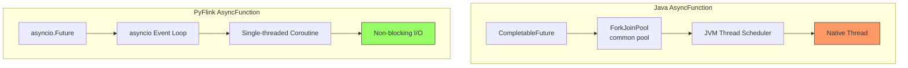
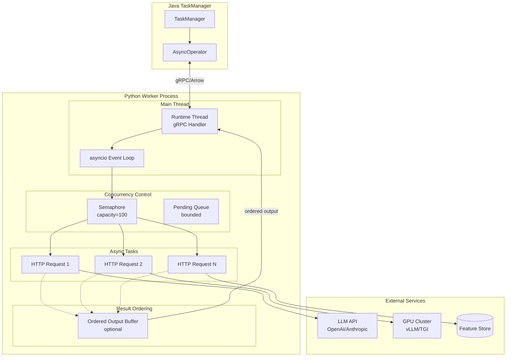
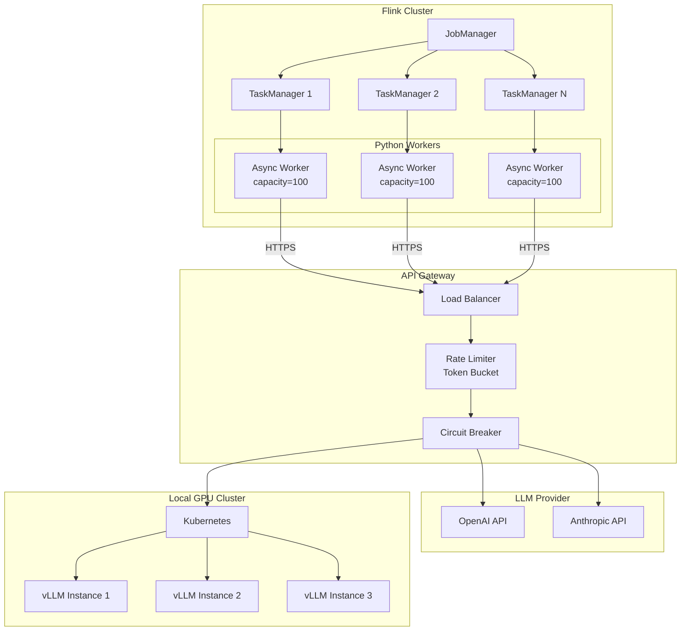
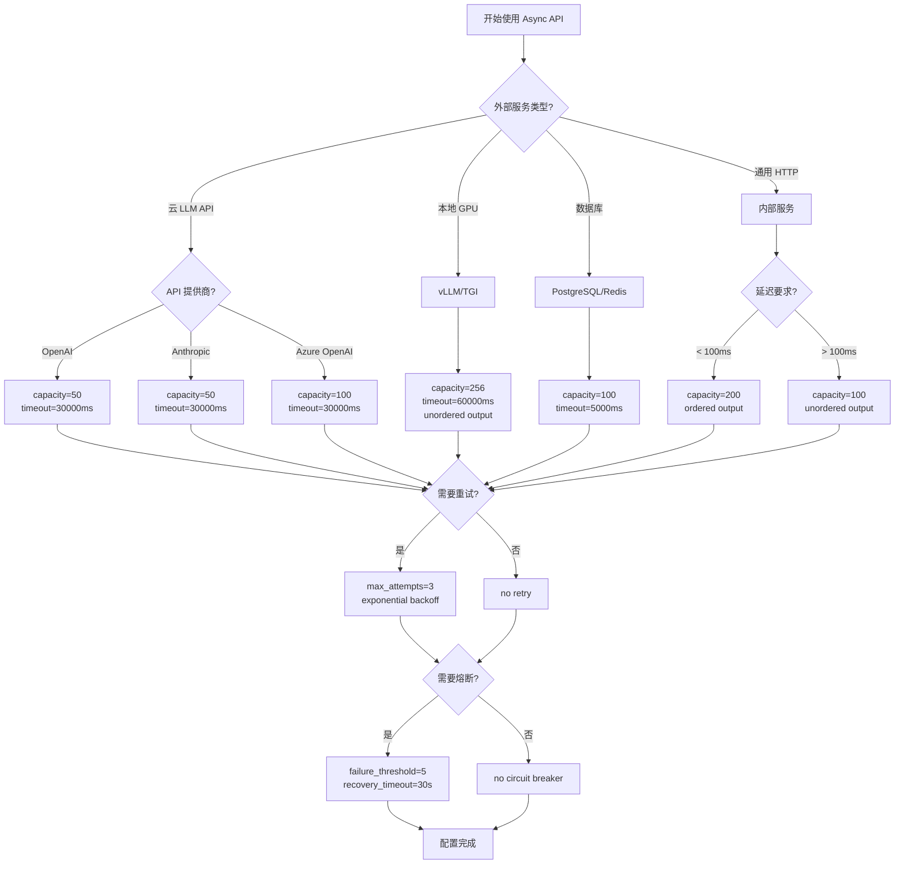
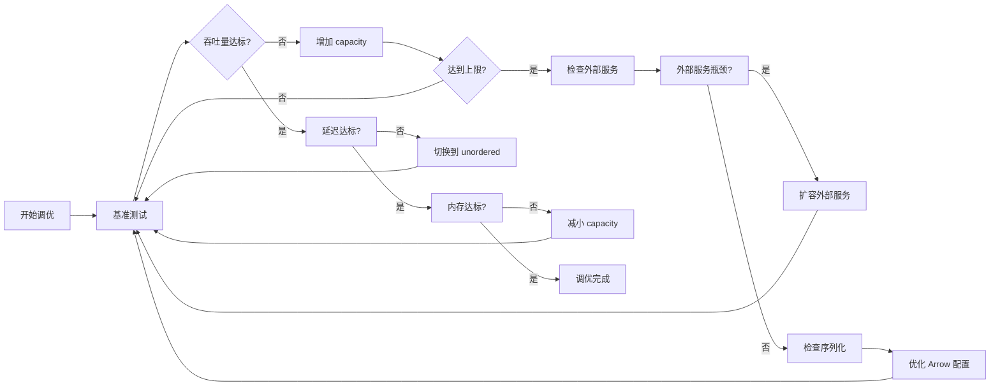
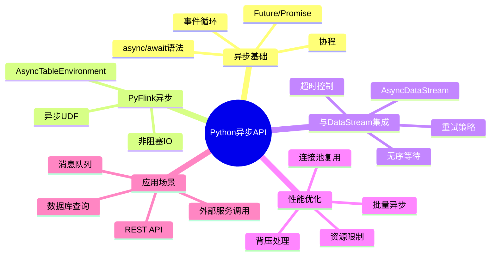
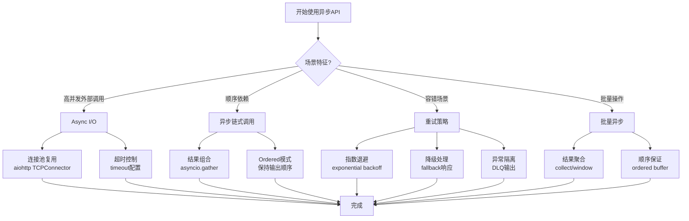

# Flink 2.2 Python Async DataStream API 技术指南

> **所属阶段**: Flink/09-language-foundations | **前置依赖**: [02-python-api.md](./02-python-api.md) | **形式化等级**: L4-L5
> **版本**: Flink 2.2+ | **语言**: Python 3.9+ | **JIRA**: FLINK-38190

---

## 目录

- [Flink 2.2 Python Async DataStream API 技术指南](#flink-22-python-async-datastream-api-技术指南)
  - [目录](#目录)
  - [1. 概念定义 (Definitions)](#1-概念定义-definitions)
    - [Def-F-09-60: AsyncExecutionMode](#def-f-09-60-asyncexecutionmode)
    - [Def-F-09-61: ConcurrencyLimiter](#def-f-09-61-concurrencylimiter)
    - [Def-F-09-62: AsyncRetryStrategy](#def-f-09-62-asyncretrystrategy)
    - [Def-F-09-63: AsyncRichFunction](#def-f-09-63-asyncrichfunction)
    - [Def-F-09-64: ResultFuture](#def-f-09-64-resultfuture)
  - [2. 属性推导 (Properties)](#2-属性推导-properties)
    - [Thm-F-09-25: Async API Throughput Scaling Theorem](#thm-f-09-25-async-api-throughput-scaling-theorem)
    - [Prop-F-09-50: Latency-Throughput Trade-off](#prop-f-09-50-latency-throughput-trade-off)
    - [Lemma-F-09-30: Ordered Output Guarantee](#lemma-f-09-30-ordered-output-guarantee)
    - [Prop-F-09-51: Resource Utilization Efficiency](#prop-f-09-51-resource-utilization-efficiency)
  - [3. 关系建立 (Relations)](#3-关系建立-relations)
    - [3.1 与 Java Async API 的语义等价性](#31-与-java-async-api-的语义等价性)
    - [3.2 与 PyFlink Table API 的关系](#32-与-pyflink-table-api-的关系)
    - [3.3 与同步 UDF 的对比矩阵](#33-与同步-udf-的对比矩阵)
  - [4. 论证过程 (Argumentation)](#4-论证过程-argumentation)
    - [4.1 何时使用 Async API](#41-何时使用-async-api)
    - [4.2 反例：何时不应使用 Async API](#42-反例何时不应使用-async-api)
    - [4.3 外部服务容量规划论证](#43-外部服务容量规划论证)
  - [5. 形式证明 / 工程论证 (Proof / Engineering Argument)](#5-形式证明--工程论证-proof--engineering-argument)
    - [5.1 背压传播机制证明](#51-背压传播机制证明)
    - [5.2 并发控制安全性论证](#52-并发控制安全性论证)
    - [5.3 大模型集成最佳实践](#53-大模型集成最佳实践)
  - [6. 实例验证 (Examples)](#6-实例验证-examples)
    - [6.1 基础 Async MapFunction](#61-基础-async-mapfunction)
    - [6.2 异步富函数 (AsyncRichMapFunction)](#62-异步富函数-asyncrichmapfunction)
    - [6.3 LLM 情感分析 Pipeline](#63-llm-情感分析-pipeline)
    - [6.4 本地 GPU 集群 (vLLM) 集成](#64-本地-gpu-集群-vllm-集成)
    - [6.5 错误处理和重试策略](#65-错误处理和重试策略)
    - [6.6 混合 Table API + Async DataStream API](#66-混合-table-api--async-datastream-api)
  - [7. 可视化 (Visualizations)](#7-可视化-visualizations)
    - [7.1 Async API 执行架构](#71-async-api-执行架构)
    - [7.2 大模型集成架构](#72-大模型集成架构)
    - [7.3 配置决策树](#73-配置决策树)
    - [7.4 性能调优流程图](#74-性能调优流程图)
    - [7.5 Python异步API思维导图](#75-python异步api思维导图)
    - [7.6 多维关联树](#76-多维关联树)
    - [7.7 异步API使用决策树](#77-异步api使用决策树)
  - [8. 引用参考 (References)](#8-引用参考-references)

---

## 1. 概念定义 (Definitions)

### Def-F-09-60: AsyncExecutionMode

**形式化定义**

异步执行模式定义为五元组 $\mathcal{A} = (M_{exec}, C_{max}, T_{out}, O_{mode}, R_{policy})$：

| 符号 | 语义 | Python 类型 | 默认值 |
|------|------|-------------|--------|
| $M_{exec}$ | 执行模型 | `Literal["asyncio"]` | `"asyncio"` |
| $C_{max}$ | 最大并发数 | `int` | `100` |
| $T_{out}$ | 超时时间(ms) | `int` | `5000` |
| $O_{mode}$ | 输出顺序模式 | `Literal["ordered", "unordered"]` | `"ordered"` |
| $R_{policy}$ | 重试策略 | `AsyncRetryStrategy \| None` | `None` |

**架构层次**

```
┌─────────────────────────────────────────────────────────┐
│  User Async Function (async def)                         │
│  - async_invoke()                                        │
│  - async open() / close()                                │
├─────────────────────────────────────────────────────────┤
│  Async Execution Controller                              │
│  - Semaphore (capacity control)                          │
│  - Timeout Manager                                       │
│  - Retry Executor                                        │
├─────────────────────────────────────────────────────────┤
│  asyncio Event Loop                                      │
│  - Task Scheduling                                       │
│  - Concurrent I/O Management                             │
├─────────────────────────────────────────────────────────┤
│  PyFlink Python Worker                                   │
│  - gRPC Bridge to Java TM                                │
│  - Apache Arrow Serialization                            │
└─────────────────────────────────────────────────────────┘
```

**接口定义**

```python
from pyflink.datastream.functions import AsyncFunction
from pyflink.common.typeinfo import TypeInformation
from typing import TypeVar, Generic, Optional
from dataclasses import dataclass
from enum import Enum

class OutputMode(Enum):
    ORDERED = "ordered"      # 保持输入顺序输出
    UNORDERED = "unordered"  # 按完成顺序输出

@dataclass
class AsyncExecutionConfig:
    """异步执行配置"""
    capacity: int = 100                    # 最大并发请求数
    timeout: int = 5000                    # 超时时间(毫秒)
    output_mode: OutputMode = OutputMode.ORDERED
    retry_strategy: Optional['AsyncRetryStrategy'] = None

class AsyncFunction(Generic[IN, OUT]):
    """
    PyFlink 异步函数基类

    类型参数:
        IN: 输入数据类型
        OUT: 输出数据类型
    """

    async def async_invoke(self, input_record: IN, result_future: 'ResultFuture[OUT]') -> None:
        """
        异步处理单条记录

        Args:
            input_record: 输入记录
            result_future: 结果Future,用于异步返回结果
        """
        raise NotImplementedError

    async def timeout(self, input_record: IN, result_future: 'ResultFuture[OUT]') -> None:
        """
        超时回调方法
        当 async_invoke 在 timeout 时间内未完成时调用
        """
        result_future.complete_exceptionally(TimeoutError("Async operation timeout"))

    async def open(self, runtime_context: 'RuntimeContext') -> None:
        """初始化异步资源 (如 aiohttp session)"""
        pass

    async def close(self) -> None:
        """清理异步资源"""
        pass
```

---

### Def-F-09-61: ConcurrencyLimiter

**形式化定义**

并发限制器定义为三元组 $\mathcal{C} = (S_{sem}, Q_{pending}, P_{backpressure})$：

- $S_{sem}$: 信号量，控制当前执行的并发请求数
- $Q_{pending}$: 待处理队列，缓冲等待执行的请求
- $P_{backpressure}$: 背压传播函数，当队列满时向源头施压

**行为语义**

```
┌─────────────────────────────────────────────────────────────┐
│                    Concurrency Limiter                      │
│                                                             │
│  Input Queue ──▶ [Acquire Semaphore] ──▶ Active Requests   │
│                      │                                      │
│                      ▼ (if full)                            │
│              [Pending Queue] ──▶ Backpressure ──▶ Source   │
│                                                             │
│  Active Requests ──▶ [Release Semaphore] ──▶ Output        │
└─────────────────────────────────────────────────────────────┘
```

**Python 实现参考**

```python
import asyncio
from typing import Generic, TypeVar, Callable, Awaitable
from dataclasses import dataclass

T = TypeVar('T')
U = TypeVar('U')

@dataclass
class ConcurrencyLimiter(Generic[T, U]):
    """
    并发限制器

    确保同时进行的异步操作不超过 capacity,
    超出部分进入队列等待。
    """
    capacity: int
    pending_queue_max: int = 1000

    def __post_init__(self):
        self.semaphore = asyncio.Semaphore(self.capacity)
        self.pending_count = 0
        self.pending_lock = asyncio.Lock()

    async def execute(
        self,
        operation: Callable[[T], Awaitable[U]],
        input_data: T
    ) -> U:
        """
        在并发限制下执行异步操作

        Args:
            operation: 异步操作函数
            input_data: 输入数据

        Returns:
            操作结果

        Raises:
            BackpressureException: 当待处理队列满时
        """
        async with self.pending_lock:
            if self.pending_count >= self.pending_queue_max:
                raise BackpressureException("Pending queue full")
            self.pending_count += 1

        try:
            async with self.semaphore:
                async with self.pending_lock:
                    self.pending_count -= 1
                return await operation(input_data)
        except Exception:
            async with self.pending_lock:
                self.pending_count -= 1
            raise

class BackpressureException(Exception):
    """背压异常:需要向源头施压"""
    pass
```

---

### Def-F-09-62: AsyncRetryStrategy

**形式化定义**

异步重试策略定义为六元组 $\mathcal{R} = (N_{max}, T_{base}, T_{max}, F_{backoff}, E_{retryable}, C_{circuit})$：

| 符号 | 语义 | 类型 | 说明 |
|------|------|------|------|
| $N_{max}$ | 最大重试次数 | `int` | 不含首次调用 |
| $T_{base}$ | 基础退避时间(ms) | `int` | 指数退避起点 |
| $T_{max}$ | 最大退避时间(ms) | `int` | 退避上限 |
| $F_{backoff}$ | 退避函数 | `BackoffFunction` | 默认指数退避 |
| $E_{retryable}$ | 可重试异常集合 | `Set[Type[Exception]]` | 仅这些异常触发重试 |
| $C_{circuit}$ | 熔断器配置 | `CircuitBreakerConfig \| None` | 可选熔断保护 |

**指数退避公式**

$$T_{backoff}^{(n)} = \min(T_{base} \times 2^{n}, T_{max})$$

其中 $n \in [0, N_{max}-1]$ 为当前重试次数。

**Python 实现**

```python
import asyncio
import random
from typing import Set, Type, Optional, Callable
from dataclasses import dataclass
from functools import partial

@dataclass
class AsyncRetryStrategy:
    """异步重试策略配置"""
    max_attempts: int = 3                    # 最大尝试次数(含首次)
    backoff_base_ms: int = 100               # 基础退避时间(毫秒)
    backoff_max_ms: int = 10000              # 最大退避时间(毫秒)
    jitter_factor: float = 0.1               # 随机抖动因子
    retryable_exceptions: Set[Type[Exception]] = None
    on_retry: Optional[Callable[[Exception, int], None]] = None

    def __post_init__(self):
        if self.retryable_exceptions is None:
            self.retryable_exceptions = {
                asyncio.TimeoutError,
                ConnectionError,
                IOError,
            }

    def calculate_backoff(self, attempt: int) -> float:
        """计算第 attempt 次重试的退避时间(秒)"""
        # 指数退避: base * 2^(attempt-1)
        backoff_ms = min(
            self.backoff_base_ms * (2 ** (attempt - 1)),
            self.backoff_max_ms
        )
        # 添加随机抖动避免惊群
        jitter = backoff_ms * self.jitter_factor * (2 * random.random() - 1)
        return (backoff_ms + jitter) / 1000.0

    def should_retry(self, exception: Exception, attempt: int) -> bool:
        """判断是否应该重试"""
        if attempt >= self.max_attempts:
            return False
        return type(exception) in self.retryable_exceptions


class RetryableAsyncFunction:
    """带重试机制的异步函数包装器"""

    def __init__(
        self,
        async_func: AsyncFunction,
        retry_strategy: AsyncRetryStrategy
    ):
        self.async_func = async_func
        self.retry_strategy = retry_strategy

    async def invoke_with_retry(
        self,
        input_record,
        result_future
    ) -> None:
        """执行带重试的异步调用"""
        attempt = 0
        last_exception = None

        while attempt < self.retry_strategy.max_attempts:
            attempt += 1
            try:
                await self.async_func.async_invoke(input_record, result_future)
                return  # 成功返回
            except Exception as e:
                last_exception = e

                if not self.retry_strategy.should_retry(e, attempt):
                    break

                if self.retry_strategy.on_retry:
                    self.retry_strategy.on_retry(e, attempt)

                # 计算退避时间
                backoff_sec = self.retry_strategy.calculate_backoff(attempt)
                await asyncio.sleep(backoff_sec)

        # 所有重试失败
        result_future.complete_exceptionally(last_exception)
```

---

### Def-F-09-63: AsyncRichFunction

**形式化定义**

异步富函数定义为四元组 $\mathcal{F}_{rich} = (F_{async}, S_{state}, M_{metric}, C_{context})$：

- $F_{async}$: 基础异步函数逻辑
- $S_{state}$:  keyed state 访问接口
- $M_{metric}$: 自定义指标报告接口
- $C_{context}$: 运行时上下文（含 subtask 信息）

**状态类型支持**

| 状态类型 | 访问模式 | 适用场景 |
|----------|----------|----------|
| `ValueState` | 异步读写 | 单值缓存（如 API token） |
| `ListState` | 异步追加 | 批量缓冲 |
| `MapState` | 异步键值访问 | 本地缓存（如用户画像） |
| `ReducingState` | 异步归约 | 聚合计算 |

**Python 接口定义**

```python
from pyflink.datastream.state import ValueState, ListState, MapState
from pyflink.datastream.functions import RuntimeContext
from typing import Generic, TypeVar, Any

IN = TypeVar('IN')
OUT = TypeVar('OUT')

class AsyncRichFunction(AsyncFunction[IN, OUT]):
    """
    支持状态和指标访问的异步富函数

    适用于需要维护跨记录状态的场景,如:
    - API 令牌缓存与刷新
    - 请求速率限制
    - 本地结果缓存
    """

    def __init__(self):
        self._runtime_context: Optional[RuntimeContext] = None
        self._states: Dict[str, Any] = {}

    @property
    def runtime_context(self) -> RuntimeContext:
        """获取运行时上下文"""
        if self._runtime_context is None:
            raise RuntimeError("Runtime context not available before open()")
        return self._runtime_context

    def get_state(self, state_descriptor) -> ValueState:
        """获取 ValueState"""
        return self.runtime_context.get_state(state_descriptor)

    def get_list_state(self, state_descriptor) -> ListState:
        """获取 ListState"""
        return self.runtime_context.get_list_state(state_descriptor)

    def get_map_state(self, state_descriptor) -> MapState:
        """获取 MapState"""
        return self.runtime_context.get_map_state(state_descriptor)

    def get_metric_group(self):
        """获取指标组"""
        return self.runtime_context.get_metric_group()

    async def open(self, runtime_context: RuntimeContext) -> None:
        """初始化,保存运行时上下文"""
        self._runtime_context = runtime_context

    # async_invoke 和 timeout 由子类实现
```

---

### Def-F-09-64: ResultFuture

**形式化定义**

结果 Future 定义为状态机 $\mathcal{F} = (S, \Sigma, \delta, s_0, F)$：

- $S = \{PENDING, COMPLETED, EXCEPTIONAL\}$: 状态集合
- $\Sigma = \{complete, complete\_exceptionally, cancel\}$: 输入字母表
- $\delta$: 状态转移函数
- $s_0 = PENDING$: 初始状态
- $F = \{COMPLETED, EXCEPTIONAL\}$: 终止状态集合

**状态转移图**

```
                    ┌─────────────┐
         complete   │             │
    ┌───────────────▶│  COMPLETED  │
    │               │             │
┌───┴───┐           └─────────────┘
│PENDING│
└───┬───┘           ┌─────────────┐
    │               │             │
    └───────────────▶│ EXCEPTIONAL │
    complete_        │             │
    exceptionally    └─────────────┘
```

**Python 接口**

```python
from typing import Generic, TypeVar, Optional, Union
from enum import Enum, auto

T = TypeVar('T')

class ResultState(Enum):
    PENDING = auto()
    COMPLETED = auto()
    EXCEPTIONAL = auto()

class ResultFuture(Generic[T]):
    """
    异步结果 Future

    用于在 async_invoke 中异步返回结果。
    每个输入记录对应一个 ResultFuture 实例。
    """

    def __init__(self):
        self._state = ResultState.PENDING
        self._result: Optional[T] = None
        self._exception: Optional[Exception] = None
        self._completion_event = asyncio.Event()

    def complete(self, result: T) -> None:
        """
        成功完成,返回结果

        Args:
            result: 处理结果

        Raises:
            RuntimeError: 如果 Future 已结束
        """
        if self._state != ResultState.PENDING:
            raise RuntimeError(f"Future already in state {self._state}")

        self._result = result
        self._state = ResultState.COMPLETED
        self._completion_event.set()

    def complete_exceptionally(self, exception: Exception) -> None:
        """
        异常完成

        Args:
            exception: 异常对象
        """
        if self._state != ResultState.PENDING:
            raise RuntimeError(f"Future already in state {self._state}")

        self._exception = exception
        self._state = ResultState.EXCEPTIONAL
        self._completion_event.set()

    async def get(self) -> T:
        """等待并获取结果"""
        await self._completion_event.wait()

        if self._state == ResultState.EXCEPTIONAL:
            raise self._exception
        return self._result

    @property
    def state(self) -> ResultState:
        """获取当前状态"""
        return self._state

    def is_done(self) -> bool:
        """检查是否已完成"""
        return self._state != ResultState.PENDING
```

---

## 2. 属性推导 (Properties)

### Thm-F-09-25: Async API Throughput Scaling Theorem

**定理**: 对于 I/O 密集型操作，Python Async DataStream API 的吞吐量与并发配置 $C$ 成正比。

**形式化陈述**

设：

- $T_{io}$: 单次 I/O 操作平均耗时
- $C$: 并发配置 (`capacity`)
- $T_{serde}$: 跨语言序列化开销（常数）

则理论吞吐量为：

$$Throughput_{async} = \frac{C}{T_{io} + T_{serde}} \quad \text{(records/second)}$$

**对比同步 API**

同步 API 吞吐量：

$$Throughput_{sync} = \frac{1}{T_{io} + T_{proc}}$$

其中 $T_{proc}$ 为 Python 处理开销。

**性能提升比**

$$\text{Speedup} = \frac{Throughput_{async}}{Throughput_{sync}} \approx C \times \frac{T_{io}}{T_{io} + T_{serde}}$$

当 $T_{io} \gg T_{serde}$ 时：

$$\lim_{T_{io} \to \infty} \text{Speedup} = C$$

**工程推论**

| 场景 | 推荐 Capacity | 预期 Speedup |
|------|---------------|--------------|
| LLM 推理 (200ms) | 50-100 | 40-80x |
| 数据库查询 (10ms) | 100-200 | 80-150x |
| HTTP API (50ms) | 100-500 | 90-400x |

---

### Prop-F-09-50: Latency-Throughput Trade-off

**命题**: 在 Python Async API 中，输出顺序模式 (`output_mode`) 影响延迟与吞吐量的权衡。

**形式化模型**

设：

- $T_{process}^{(i)}$: 第 $i$ 条记录的处理时间
- $N$: 并发容量
- $L_{in}^{(i)}$: 第 $i$ 条记录输入时间

**Ordered 模式延迟**

$$L_{ordered}^{(i)} = \max_{j \leq i} (L_{in}^{(j)} + T_{process}^{(j)}) - L_{in}^{(i)}$$

最坏情况（队头阻塞）：

$$L_{ordered}^{worst} = \sum_{j=1}^{N} T_{process}^{(j)}$$

**Unordered 模式延迟**

$$L_{unordered}^{(i)} = T_{process}^{(i)}$$

**吞吐量等价性**

$$Throughput_{ordered} = Throughput_{unordered} = \frac{N}{\bar{T}_{process}}$$

**决策矩阵**

| 场景 | 推荐模式 | 理由 |
|------|----------|------|
| 需要严格顺序保证 | `ordered` | 语义正确性优先 |
| 独立记录处理 | `unordered` | 最小化延迟 |
| 窗口聚合 | `unordered` | 乱序无影响 |
| 事件时间处理 | `ordered` | Watermark 推进依赖顺序 |

---

### Lemma-F-09-30: Ordered Output Guarantee

**引理**: 在 `ordered` 输出模式下，Async API 保证输出顺序与输入顺序一致，即使请求完成顺序不同。

**证明概要**

设输入记录序列为 $[r_1, r_2, ..., r_n]$，对应 Future 为 $[f_1, f_2, ..., f_n]$。

**排序缓冲区机制**：

```python
class OrderedOutputBuffer:
    def __init__(self):
        self.next_index = 0          # 下一个应输出的索引
        self.completed = {}          # 已完成但等待输出的结果

    def on_complete(self, index: int, result):
        """当某个 Future 完成时调用"""
        if index == self.next_index:
            # 正好是下一个应输出的
            self._output(result)
            self.next_index += 1
            # 检查是否有缓存的结果可以输出
            self._flush_completed()
        else:
            # 缓存等待
            self.completed[index] = result

    def _flush_completed(self):
        """输出缓存的连续结果"""
        while self.next_index in self.completed:
            self._output(self.completed.pop(self.next_index))
            self.next_index += 1
```

**复杂度分析**

- 空间复杂度: $O(C)$，其中 $C$ 为并发容量
- 时间复杂度: $O(1)$ 每记录（哈希表操作）

---

### Prop-F-09-51: Resource Utilization Efficiency

**命题**: 相比同步 API，Async API 显著提升 I/O 等待期间的 CPU 利用率。

**效率对比**

同步模型：

$$\eta_{sync} = \frac{T_{cpu}}{T_{cpu} + T_{io}}$$

异步模型：

$$\eta_{async} = \frac{C \times T_{cpu}}{C \times T_{cpu} + T_{io}} \approx \frac{C \times T_{cpu}}{T_{io}} \quad (\text{when } T_{io} \gg C \times T_{cpu})$$

**示例计算**

假设 $T_{cpu} = 1\text{ms}$，$T_{io} = 100\text{ms}$，$C = 100$：

$$\eta_{sync} = \frac{1}{101} \approx 1\%$$

$$\eta_{async} = \frac{100}{100 + 100} = 50\%$$

---

## 3. 关系建立 (Relations)

### 3.1 与 Java Async API 的语义等价性

**API 映射表**

| Java AsyncFunction | PyFlink AsyncFunction | 语义等价性 | 实现差异 |
|-------------------|----------------------|-----------|----------|
| `asyncInvoke(IN, ResultFuture)` | `async_invoke(IN, ResultFuture)` | ✅ 完全等价 | Java 使用线程池，Python 使用 asyncio |
| `timeout(IN, ResultFuture)` | `timeout(IN, ResultFuture)` | ✅ 完全等价 | 超时机制相同 |
| `AsyncFunction#open()` | `async open()` | ✅ 语义等价 | Python 使用 async def |
| `AsyncFunction#close()` | `async close()` | ✅ 语义等价 | Python 使用 async def |
| `AsyncDataStream.orderedWait()` | `map_async(..., output_mode='ordered')` | ✅ 等价 | 参数命名不同 |
| `AsyncDataStream.unorderedWait()` | `map_async(..., output_mode='unordered')` | ✅ 等价 | 参数命名不同 |
| `AsyncFunction#apply()` | `async_invoke()` | ⚠️ 概念等价 | 方法名不同 |

**执行模型对比**



**性能特征对比**

| 维度 | Java Async API | PyFlink Async API |
|------|---------------|-------------------|
| 并发模型 | 线程池 (JVM) | asyncio 协程 |
| 上下文切换 | 内核级 (~1μs) | 用户级 (~100ns) |
| 跨语言开销 | 无 | 有 (Arrow序列化) |
| 内存占用/并发 | ~1MB | ~10KB |
| 延迟（空载） | ~1ms | ~5-10ms |
| 推荐并发上限 | 1000+ | 100-500 |

---

### 3.2 与 PyFlink Table API 的关系

**架构关系**

```
┌─────────────────────────────────────────────────────────┐
│                   PyFlink APIs                           │
├─────────────────────────────────────────────────────────┤
│  Table API                                               │
│  ┌─────────────────────────────────────────────────┐   │
│  │  ~~CREATE MODEL~~ + ML_PREDICT(概念设计,尚未支持)│   │
│  │  ↓                                              │   │
│  │  Logical Plan → Optimization                    │   │
│  │  ↓                                              │   │
│  │  Physical Plan (DataStream)                     │   │
│  └─────────────────────────────────────────────────┘   │
├─────────────────────────────────────────────────────────┤
│  DataStream API (Async)                                  │
│  ┌─────────────────────────────────────────────────┐   │
│  │  AsyncFunction / AsyncRichFunction              │   │
│  │  - 细粒度控制                                   │   │
│  │  - 自定义重试/超时逻辑                          │   │
│  │  - 复杂状态管理                                 │   │
│  └─────────────────────────────────────────────────┘   │
├─────────────────────────────────────────────────────────┤
│  Runtime Layer                                           │
│  ├─ Python Worker Process (gRPC + Arrow)                │
│  ├─ asyncio Event Loop                                  │
│  └─ Java TaskManager                                    │
└─────────────────────────────────────────────────────────┘
```

**互操作性**

```python
from pyflink.datastream import StreamExecutionEnvironment
from pyflink.table import StreamTableEnvironment
from pyflink.datastream.functions import AsyncFunction

# 混合使用场景:Table API 预处理 + Async DataStream 推理 env = StreamExecutionEnvironment.get_execution_environment()
table_env = StreamTableEnvironment.create(env)

# 1. Table API: 数据预处理和特征工程 table_env.execute_sql("""
    CREATE TABLE user_events (
        user_id STRING,
        event_time TIMESTAMP(3),
        content STRING,
        WATERMARK FOR event_time AS event_time - INTERVAL '5' SECOND
    ) WITH (
        'connector' = 'kafka',
        'topic' = 'user-events',
        'properties.bootstrap.servers' = 'kafka:9092',
        'format' = 'json'
    )
""")

# Table API 预处理 processed = table_env.sql_query("""
    SELECT
        user_id,
        event_time,
        content,
        LENGTH(content) as content_length
    FROM user_events
    WHERE content IS NOT NULL
""")

# 转换为 DataStream ds = processed.to_data_stream(env)

# 2. Async DataStream API: 大模型推理 class LLMInferenceAsync(AsyncFunction):
    async def async_invoke(self, row, result_future):
        # 调用外部 LLM 服务
        result = await self.call_llm(row['content'])
        result_future.complete({
            'user_id': row['user_id'],
            'inference_result': result
        })

# 应用异步函数 results = ds.map_async(
    LLMInferenceAsync(),
    capacity=50,
    timeout=30000,
    output_mode='unordered'
)

# 3. 转回 Table API 进行聚合分析 result_table = results.to_table(table_env)
table_env.sql_query("""
    SELECT
        user_id,
        COUNT(*) as inference_count,
        COLLECT(inference_result) as results
    FROM result_table
    GROUP BY user_id, TUMBLE(event_time, INTERVAL '1' MINUTE)
""")
```

**选择决策矩阵**

| 场景 | 推荐 API | 理由 |
|------|----------|------|
| 简单 LLM 调用 | Table API + ML_PREDICT | 声明式，自动优化 |
| 复杂重试/熔断逻辑 | DataStream Async | 细粒度控制 |
| 需要维护调用状态 | DataStream AsyncRich | 状态访问能力 |
| 多模型组合调用 | DataStream Async | 灵活组合 |
| 实时特征 + 模型推理 | 混合使用 | 各司其职 |

---

### 3.3 与同步 UDF 的对比矩阵

| 特性 | 同步 UDF | Async DataStream API |
|------|----------|---------------------|
| **并发模型** | 阻塞式 | 非阻塞协程 |
| **I/O 利用率** | 低（等待时阻塞） | 高（并发多 I/O） |
| **适用场景** | CPU 密集型 | I/O 密集型 |
| **延迟** | 较低（无排队） | 可能较高（排队延迟） |
| **吞吐量** | 受限于单线程 | 随并发线性扩展 |
| **内存使用** | 低 | 中（待处理队列） |
| **实现复杂度** | 低 | 中（需理解 asyncio） |
| **调试难度** | 低 | 中（异步堆栈） |
| **外部依赖** | 同步客户端 | 异步客户端 (aiohttp, aioredis) |

---

## 4. 论证过程 (Argumentation)

### 4.1 何时使用 Async API

**决策公式**

$$\text{UseAsync} \equiv (T_{io} > 10\text{ms}) \land (R_{target} > \frac{1}{T_{io}}) \land \neg CPU\_bound$$

其中：

- $T_{io}$: 单次 I/O 操作耗时
- $R_{target}$: 目标吞吐量 (records/sec)

**推荐场景**

1. **大模型推理服务调用**
   - OpenAI/Anthropic API (100-500ms)
   - 本地 vLLM/TGI 服务 (50-200ms)

2. **外部数据查询**
   - 特征服务 (10-50ms)
   - 用户画像服务 (5-20ms)

3. **第三方 API 集成**
   - 支付网关 (100-1000ms)
   - 风控服务 (20-100ms)

**性能提升预期**

```python
# 场景:调用外部 LLM API (平均响应 200ms)
# 目标吞吐量:1000 TPS

# 同步方案:需要 1000 * 0.2 = 200 个并发 Worker workers_sync = 200

# 异步方案:每个 Worker capacity=100,需要 1000/100 = 10 个 Worker workers_async = 10

# 资源节省:95% savings = (workers_sync - workers_async) / workers_sync  # 0.95
```

---

### 4.2 反例：何时不应使用 Async API

**场景 1: 纯 CPU 密集型计算**

```python
# 反例:本地模型推理(无 I/O)
class CPUIntensiveUDF(MapFunction):
    def __init__(self):
        self.model = load_model()  # 本地 PyTorch 模型

    def map(self, record):
        # 纯 CPU 计算,无 I/O
        return self.model.predict(record)

# 不应使用 AsyncFunction - 没有 I/O 可并行化
```

**场景 2: 极低延迟要求**

```python
# 反例:高频交易场景 (要求 < 5ms 延迟)
# Async API 的队列和调度开销可能超过 5ms
```

**场景 3: 无可用异步客户端**

```python
# 反例:某些遗留系统只有同步 SDK
# 强行使用 asyncio.run_in_executor() 性能反而下降
```

---

### 4.3 外部服务容量规划论证

**容量计算模型**

设：

- $R_{flink}$: Flink 作业目标吞吐量 (records/sec)
- $T_{external}$: 外部服务平均响应时间 (sec)
- $C_{external}$: 外部服务最大并发容量

**必要条件**

$$C_{flink} \times T_{external} \leq C_{external}$$

其中 $C_{flink}$ 为 Flink 配置的并发容量。

**推导**：

在稳态下，Flink 向外部服务发送请求的平均速率为 $R_{flink}$，每个请求占用外部服务的时间为 $T_{external}$。

根据 Little's Law，外部服务的平均并发需求为：

$$L = R_{flink} \times T_{external}$$

为避免压垮外部服务：

$$C_{flink} \geq L = R_{flink} \times T_{external}$$

且：

$$C_{flink} \leq C_{external}$$

**配置公式**

$$C_{optimal} = \min(C_{external}, R_{flink} \times T_{external} \times safety\_factor)$$

其中 $safety\_factor$ 推荐值为 1.2-1.5。

---

## 5. 形式证明 / 工程论证 (Proof / Engineering Argument)

### 5.1 背压传播机制证明

**定理**: PyFlink Async API 的背压机制能保证外部服务不会被过载请求压垮。

**证明概要**

**系统模型**：

设系统由以下组件构成：

- $S$: 数据源，产生记录速率 $\lambda$
- $B$: 异步算子缓冲区，容量 $C_{buffer}$
- $E$: 外部服务，处理能力 $\mu$
- $F$: 信号量，许可数 $C_{semaphore}$

**背压触发条件**：

当以下条件同时满足时，背压向上游传播：

1. 信号量已满：$active = C_{semaphore}$
2. 缓冲区已满：$pending = C_{buffer}$

**稳定性证明**：

根据队列论，当 $\lambda < \mu$ 时，系统稳定。

在 Async API 中，有效处理速率为：

$$\mu_{effective} = \min(\mu, \frac{C_{semaphore}}{T_{external}})$$

通过设置 $C_{semaphore} \leq C_{external}$，确保：

$$\mu_{effective} \leq \mu$$

当 $\lambda > \mu_{effective}$ 时，缓冲区逐渐填满，触发背压，使 $\lambda_{effective} = \mu_{effective}$。

**结论**: 背压机制保证了 $\lambda_{effective} \leq \mu$，系统稳定。∎

---

### 5.2 并发控制安全性论证

**安全属性**: 并发控制机制保证同时执行的异步操作数不超过 `capacity`。

**形式化规范**

定义系统状态 $S_t = (A_t, P_t)$，其中：

- $A_t$: 时刻 $t$ 的活跃请求数
- $P_t$: 时刻 $t$ 的待处理请求数

**不变式**: $\forall t. A_t \leq C \land A_t + P_t \leq C + C_{buffer}$

**证明**

1. **初始化**: $S_0 = (0, 0)$，满足不变式

2. **请求到达**: 新请求到达时
   - 若 $A_t < C$：$A_{t+1} = A_t + 1$，仍 $\leq C$
   - 若 $A_t = C \land P_t < C_{buffer}$：$P_{t+1} = P_t + 1$
   - 若 $A_t = C \land P_t = C_{buffer}$：拒绝请求，触发背压

3. **请求完成**: 请求完成时 $A_{t+1} = A_t - 1$
   - 若 $P_t > 0$：从队列取一个请求执行，$P_{t+1} = P_t - 1$，$A_{t+1} = A_t$
   - 若 $P_t = 0$：$A_{t+1} = A_t - 1$

在所有情况下，不变式保持。∎

---

### 5.3 大模型集成最佳实践

**三层防护体系**

```
┌─────────────────────────────────────────────────────────────┐
│  Layer 1: 客户端限流 (Flink Async API)                     │
│  - capacity 限制并发请求数                                  │
│  - 推荐:根据模型服务 TPM/RPM 配额设置                      │
├─────────────────────────────────────────────────────────────┤
│  Layer 2: 服务端保护 (LLM Gateway)                          │
│  - Token Bucket 限流                                        │
│  - Queue-based Load Leveling                                │
├─────────────────────────────────────────────────────────────┤
│  Layer 3: 模型实例隔离 (GPU Cluster)                        │
│  - vLLM/TGI 动态批处理                                      │
│  - 多副本负载均衡                                           │
└─────────────────────────────────────────────────────────────┘
```

**OpenAI API 配置示例**

```python
from pyflink.datastream.functions import AsyncFunction
import aiohttp
import asyncio

class OpenAIAsyncFunction(AsyncFunction):
    """
    OpenAI API 异步调用函数

    配置依据:
    - OpenAI Tier 2: 20000 RPM, 2000000 TPM
    - 平均请求: 1000 tokens
    - 理论最大并发: min(20000/60, 2000000/1000/60) ≈ 333
    - 实际配置: 50 (保守,考虑错误重试)
    """

    def __init__(self):
        self.capacity = 50           # 基于 RPM/TPM 配额
        self.timeout = 30000         # GPT-4 平均响应 2-5s
        self.max_tokens = 1000
        self.model = "gpt-4"

    async def open(self, runtime_context):
        self.session = aiohttp.ClientSession(
            headers={"Authorization": f"Bearer {self.api_key}"},
            connector=aiohttp.TCPConnector(
                limit=self.capacity,
                limit_per_host=self.capacity,
                enable_cleanup_closed=True,
                force_close=True,
            ),
            timeout=aiohttp.ClientTimeout(total=self.timeout / 1000)
        )
```

**vLLM 本地集群配置**

```python
class VLLMAsyncFunction(AsyncFunction):
    """
    本地 vLLM 服务异步调用

    vLLM 特性:
    - 动态批处理 (Continuous Batching)
    - 最大并发由 GPU 显存决定
    - 典型配置: A100 40GB → max_num_seqs=256
    """

    def __init__(self, endpoint: str):
        self.endpoint = endpoint
        # 与 vLLM max_num_seqs 保持一致
        self.capacity = 256
        self.timeout = 60000  # 长文本生成可能需要更长时间
```

---

## 6. 实例验证 (Examples)

### 6.1 基础 Async MapFunction

```python
#!/usr/bin/env python3
"""
基础 Async MapFunction 示例
演示如何异步调用外部 HTTP API
"""

import asyncio
import aiohttp
import json
from dataclasses import dataclass
from typing import Optional

from pyflink.datastream import StreamExecutionEnvironment
from pyflink.datastream.functions import AsyncFunction
from pyflink.common.typeinfo import Types
from pyflink.datastream.connectors.kafka import (
    KafkaSource, KafkaSink,
    KafkaRecordSerializationSchema
)


@dataclass
class UserEvent:
    """用户事件数据类"""
    user_id: str
    event_type: str
    payload: dict
    timestamp: int


@dataclass
class EnrichedEvent:
    """增强后的事件"""
    user_id: str
    event_type: str
    payload: dict
    user_profile: Optional[dict]
    enriched_at: int


class AsyncUserProfileEnricher(AsyncFunction):
    """
    异步用户画像补全函数

    通过 HTTP API 获取用户画像信息并 enrich 到事件中
    """

    def __init__(
        self,
        profile_service_url: str,
        capacity: int = 100,
        timeout_ms: int = 5000
    ):
        self.profile_service_url = profile_service_url
        self.capacity = capacity
        self.timeout_ms = timeout_ms

        # 将在 open() 中初始化
        self.session: Optional[aiohttp.ClientSession] = None
        self.semaphore: Optional[asyncio.Semaphore] = None

    async def open(self, runtime_context):
        """初始化异步资源"""
        # 创建 aiohttp session,配置连接池
        connector = aiohttp.TCPConnector(
            limit=self.capacity,
            limit_per_host=self.capacity,
            enable_cleanup_closed=True,
            force_close=False,
            ttl_dns_cache=300,
        )

        timeout = aiohttp.ClientTimeout(
            total=self.timeout_ms / 1000,
            connect=2.0,
            sock_read=self.timeout_ms / 1000
        )

        self.session = aiohttp.ClientSession(
            connector=connector,
            timeout=timeout,
            headers={"Content-Type": "application/json"}
        )

        # 创建信号量控制并发
        self.semaphore = asyncio.Semaphore(self.capacity)

        print(f"[AsyncUserProfileEnricher] Opened with capacity={self.capacity}")

    async def async_invoke(self, event: UserEvent, result_future):
        """
        异步处理事件

        Args:
            event: 输入事件
            result_future: 结果 Future
        """
        try:
            # 使用信号量控制并发
            async with self.semaphore:
                # 调用用户画像服务
                async with self.session.get(
                    f"{self.profile_service_url}/users/{event.user_id}/profile",
                    params={"fields": "demographics,preferences"}
                ) as response:

                    if response.status == 200:
                        profile = await response.json()
                    elif response.status == 404:
                        # 用户不存在,返回空画像
                        profile = None
                    else:
                        raise RuntimeError(
                            f"Profile service returned {response.status}"
                        )

                    # 构造增强后的事件
                    enriched = EnrichedEvent(
                        user_id=event.user_id,
                        event_type=event.event_type,
                        payload=event.payload,
                        user_profile=profile,
                        enriched_at=asyncio.get_event_loop().time()
                    )

                    # 完成 Future
                    result_future.complete(enriched)

        except asyncio.TimeoutError:
            # 超时处理 - 返回无画像的事件
            result_future.complete(
                EnrichedEvent(
                    user_id=event.user_id,
                    event_type=event.event_type,
                    payload=event.payload,
                    user_profile=None,
                    enriched_at=asyncio.get_event_loop().time()
                )
            )
        except Exception as e:
            # 其他异常
            result_future.complete_exceptionally(e)

    async def timeout(self, event: UserEvent, result_future):
        """
        超时回调
        当 async_invoke 在 timeout 时间内未完成时调用
        """
        print(f"[Timeout] User {event.user_id} profile lookup timeout")
        result_future.complete(
            EnrichedEvent(
                user_id=event.user_id,
                event_type=event.event_type,
                payload=event.payload,
                user_profile=None,
                enriched_at=asyncio.get_event_loop().time()
            )
        )

    async def close(self):
        """清理异步资源"""
        if self.session:
            await self.session.close()
            print("[AsyncUserProfileEnricher] Session closed")


def main():
    """主函数"""
    env = StreamExecutionEnvironment.get_execution_environment()
    env.set_parallelism(4)

    # 模拟数据源
    events = [
        UserEvent(f"user_{i}", "click", {"page": "/home"}, 1700000000 + i)
        for i in range(100)
    ]

    stream = env.from_collection(
        events,
        type_info=Types.PICKLED_BYTE_ARRAY()
    )

    # 应用异步函数
    enriched_stream = stream.map_async(
        AsyncUserProfileEnricher(
            profile_service_url="http://user-service:8080",
            capacity=50,
            timeout_ms=5000
        ),
        capacity=50,           # 并发容量
        timeout=5000,          # 超时时间(ms)
        output_mode='ordered'  # 保持顺序
    )

    # 打印结果
    enriched_stream.print()

    env.execute("Async User Profile Enrichment")


if __name__ == "__main__":
    main()
```

**requirements.txt**

```
apache-flink>=2.2.0
aiohttp>=3.8.0
asyncpg>=0.28.0  # 如果使用 PostgreSQL
aiokafka>=0.9.0  # 如果使用 Kafka
```

---

### 6.2 异步富函数 (AsyncRichMapFunction)

```python
#!/usr/bin/env python3
"""
异步富函数示例 - 支持状态和指标的异步函数

场景:API Token 缓存与自动刷新
"""

import asyncio
import aiohttp
import time
from typing import Optional, Dict
from dataclasses import dataclass

from pyflink.datastream import StreamExecutionEnvironment
from pyflink.datastream.functions import AsyncRichFunction
from pyflink.datastream.state import ValueStateDescriptor
from pyflink.common.typeinfo import Types


@dataclass
class APIToken:
    """API Token 数据"""
    access_token: str
    expires_at: float
    refresh_token: Optional[str] = None

    def is_expired(self, buffer_seconds: int = 60) -> bool:
        """检查 Token 是否即将过期"""
        return time.time() > (self.expires_at - buffer_seconds)


class AsyncTokenAwareAPIClient(AsyncRichFunction):
    """
    支持 Token 缓存和自动刷新的异步 API 客户端

    使用 ValueState 存储 Token,避免每次请求都获取新 Token
    """

    def __init__(
        self,
        auth_endpoint: str,
        api_endpoint: str,
        client_id: str,
        client_secret: str,
        capacity: int = 50
    ):
        self.auth_endpoint = auth_endpoint
        self.api_endpoint = api_endpoint
        self.client_id = client_id
        self.client_secret = client_secret
        self.capacity = capacity

        # 状态描述符
        self.token_state_desc = ValueStateDescriptor(
            "api_token",
            Types.PICKLED_BYTE_ARRAY()
        )

        # 运行时初始化
        self.token_state = None
        self.session: Optional[aiohttp.ClientSession] = None
        self.semaphore: Optional[asyncio.Semaphore] = None

        # 指标
        self.token_refresh_counter = None
        self.api_call_counter = None
        self.api_latency_histogram = None

    async def open(self, runtime_context):
        """初始化状态和指标"""
        super().open(runtime_context)

        # 获取状态
        self.token_state = self.get_state(self.token_state_desc)

        # 注册指标
        metric_group = self.get_metric_group()
        self.token_refresh_counter = metric_group.counter("token_refreshes")
        self.api_call_counter = metric_group.counter("api_calls")
        self.api_latency_histogram = metric_group.histogram("api_latency_ms")

        # 创建 HTTP session
        connector = aiohttp.TCPConnector(
            limit=self.capacity,
            limit_per_host=self.capacity
        )
        self.session = aiohttp.ClientSession(connector=connector)
        self.semaphore = asyncio.Semaphore(self.capacity)

        print(f"[AsyncTokenAwareAPIClient] Opened on subtask {runtime_context.get_index_of_this_subtask()}")

    async def _get_valid_token(self) -> str:
        """
        获取有效的 Token(自动刷新)

        Returns:
            有效的 access_token
        """
        # 从状态读取当前 Token
        current_token = self.token_state.value()

        if current_token is not None and not current_token.is_expired():
            return current_token.access_token

        # Token 不存在或已过期,刷新
        print("[TokenRefresh] Refreshing API token...")

        async with self.session.post(
            self.auth_endpoint,
            data={
                "grant_type": "client_credentials",
                "client_id": self.client_id,
                "client_secret": self.client_secret,
                "scope": "api:read api:write"
            }
        ) as response:
            if response.status != 200:
                raise RuntimeError(f"Token refresh failed: {response.status}")

            data = await response.json()

            new_token = APIToken(
                access_token=data["access_token"],
                expires_at=time.time() + data["expires_in"],
                refresh_token=data.get("refresh_token")
            )

            # 保存到状态
            self.token_state.update(new_token)
            self.token_refresh_counter.inc()

            print(f"[TokenRefresh] New token expires at {new_token.expires_at}")
            return new_token.access_token

    async def async_invoke(self, record: dict, result_future):
        """
        异步调用 API

        Args:
            record: 输入记录,包含 request_data
            result_future: 结果 Future
        """
        start_time = time.time()

        try:
            async with self.semaphore:
                # 获取有效 Token
                token = await self._get_valid_token()

                # 调用业务 API
                async with self.session.post(
                    self.api_endpoint,
                    headers={"Authorization": f"Bearer {token}"},
                    json=record["request_data"],
                    timeout=aiohttp.ClientTimeout(total=10)
                ) as response:

                    latency_ms = int((time.time() - start_time) * 1000)
                    self.api_latency_histogram.update(latency_ms)
                    self.api_call_counter.inc()

                    if response.status == 200:
                        result = await response.json()
                        result_future.complete({
                            "input": record,
                            "output": result,
                            "latency_ms": latency_ms,
                            "success": True
                        })
                    elif response.status == 401:
                        # Token 无效,清除状态重试
                        self.token_state.clear()
                        raise RuntimeError("Token invalidated, will retry")
                    else:
                        raise RuntimeError(f"API error: {response.status}")

        except Exception as e:
            result_future.complete_exceptionally(e)

    async def close(self):
        """清理资源"""
        if self.session:
            await self.session.close()


def main():
    env = StreamExecutionEnvironment.get_execution_environment()
    env.set_parallelism(2)

    # 模拟请求数据
    requests = [
        {"request_id": i, "request_data": {"query": f"data_{i}"}}
        for i in range(50)
    ]

    stream = env.from_collection(requests)

    # 应用异步富函数
    results = stream.map_async(
        AsyncTokenAwareAPIClient(
            auth_endpoint="https://api.example.com/oauth/token",
            api_endpoint="https://api.example.com/v1/process",
            client_id="${CLIENT_ID}",
            client_secret="${CLIENT_SECRET}",
            capacity=50
        ),
        capacity=50,
        timeout=15000,
        output_mode='ordered'
    )

    results.print()

    env.execute("Async Token-Aware API Client")


if __name__ == "__main__":
    main()
```

---

### 6.3 LLM 情感分析 Pipeline

```python
#!/usr/bin/env python3
"""
LLM 情感分析 Pipeline

演示如何使用 AsyncFunction 调用 OpenAI/Anthropic API
进行实时情感分析
"""

import asyncio
import aiohttp
import json
from dataclasses import dataclass
from typing import Literal, Optional
from enum import Enum

from pyflink.datastream import StreamExecutionEnvironment
from pyflink.datastream.functions import AsyncFunction
from pyflink.common.typeinfo import Types


class Sentiment(Enum):
    """情感分类"""
    POSITIVE = "positive"
    NEGATIVE = "negative"
    NEUTRAL = "neutral"
    MIXED = "mixed"


@dataclass
class ReviewEvent:
    """评论事件"""
    review_id: str
    product_id: str
    user_id: str
    content: str
    timestamp: int
    metadata: Optional[dict] = None


@dataclass
class SentimentResult:
    """情感分析结果"""
    review_id: str
    product_id: str
    sentiment: Sentiment
    confidence: float
    aspects: list  # 方面级情感
    processing_time_ms: int
    model: str


class LLMSentimentAnalyzer(AsyncFunction):
    """
    基于 LLM 的异步情感分析器

    支持 OpenAI 和 Anthropic API,使用结构化输出
    """

    def __init__(
        self,
        provider: Literal["openai", "anthropic"] = "openai",
        api_key: Optional[str] = None,
        model: Optional[str] = None,
        capacity: int = 50,
        timeout_ms: int = 30000,
        temperature: float = 0.0
    ):
        self.provider = provider
        self.api_key = api_key
        self.capacity = capacity
        self.timeout_ms = timeout_ms
        self.temperature = temperature

        # 设置默认模型
        if model is None:
            self.model = "gpt-4" if provider == "openai" else "claude-3-sonnet-20240229"
        else:
            self.model = model

        # API 配置
        if provider == "openai":
            self.api_url = "https://api.openai.com/v1/chat/completions"
        else:
            self.api_url = "https://api.anthropic.com/v1/messages"

        # 运行时初始化
        self.session: Optional[aiohttp.ClientSession] = None
        self.semaphore: Optional[asyncio.Semaphore] = None

        # 提示词模板
        self.system_prompt = """You are a sentiment analysis expert. Analyze the sentiment of the given product review.

Respond in JSON format with the following structure:
{
    "sentiment": "positive" | "negative" | "neutral" | "mixed",
    "confidence": 0.0 to 1.0,
    "aspects": [
        {"aspect": "quality", "sentiment": "positive", "confidence": 0.9},
        {"aspect": "price", "sentiment": "negative", "confidence": 0.7}
    ]
}

Consider these aspects when available: quality, price, delivery, packaging, customer_service."""

    async def open(self, runtime_context):
        """初始化 HTTP Session"""
        headers = {"Content-Type": "application/json"}

        if self.provider == "openai":
            headers["Authorization"] = f"Bearer {self.api_key}"
        else:
            headers["x-api-key"] = self.api_key
            headers["anthropic-version"] = "2023-06-01"

        connector = aiohttp.TCPConnector(
            limit=self.capacity,
            limit_per_host=self.capacity,
            enable_cleanup_closed=True
        )

        timeout = aiohttp.ClientTimeout(
            total=self.timeout_ms / 1000,
            connect=5.0
        )

        self.session = aiohttp.ClientSession(
            headers=headers,
            connector=connector,
            timeout=timeout
        )

        self.semaphore = asyncio.Semaphore(self.capacity)

        print(f"[LLMSentimentAnalyzer] Initialized with {self.provider}/{self.model}")

    def _build_request_body(self, content: str) -> dict:
        """构建 API 请求体"""
        if self.provider == "openai":
            return {
                "model": self.model,
                "messages": [
                    {"role": "system", "content": self.system_prompt},
                    {"role": "user", "content": f"Analyze this review:\n{content}"}
                ],
                "temperature": self.temperature,
                "max_tokens": 500,
                "response_format": {"type": "json_object"}
            }
        else:  # anthropic
            return {
                "model": self.model,
                "max_tokens": 500,
                "temperature": self.temperature,
                "system": self.system_prompt,
                "messages": [
                    {"role": "user", "content": f"Analyze this review:\n{content}"}
                ]
            }

    async def async_invoke(self, event: ReviewEvent, result_future):
        """异步执行情感分析"""
        start_time = asyncio.get_event_loop().time()

        try:
            async with self.semaphore:
                request_body = self._build_request_body(event.content)

                async with self.session.post(
                    self.api_url,
                    json=request_body
                ) as response:

                    if response.status != 200:
                        error_text = await response.text()
                        raise RuntimeError(f"API error {response.status}: {error_text}")

                    data = await response.json()

                    # 解析响应
                    if self.provider == "openai":
                        content = json.loads(data["choices"][0]["message"]["content"])
                    else:
                        content = json.loads(data["content"][0]["text"])

                    processing_time_ms = int(
                        (asyncio.get_event_loop().time() - start_time) * 1000
                    )

                    result = SentimentResult(
                        review_id=event.review_id,
                        product_id=event.product_id,
                        sentiment=Sentiment(content["sentiment"]),
                        confidence=content["confidence"],
                        aspects=content.get("aspects", []),
                        processing_time_ms=processing_time_ms,
                        model=self.model
                    )

                    result_future.complete(result)

        except asyncio.TimeoutError:
            # 超时降级:返回中性情感
            result_future.complete(
                SentimentResult(
                    review_id=event.review_id,
                    product_id=event.product_id,
                    sentiment=Sentiment.NEUTRAL,
                    confidence=0.0,
                    aspects=[],
                    processing_time_ms=self.timeout_ms,
                    model=f"{self.model}_timeout"
                )
            )
        except Exception as e:
            result_future.complete_exceptionally(e)

    async def timeout(self, event: ReviewEvent, result_future):
        """超时回调"""
        print(f"[Timeout] Review {event.review_id} analysis timeout")
        result_future.complete(
            SentimentResult(
                review_id=event.review_id,
                product_id=event.product_id,
                sentiment=Sentiment.NEUTRAL,
                confidence=0.0,
                aspects=[],
                processing_time_ms=self.timeout_ms,
                model=f"{self.model}_timeout"
            )
        )

    async def close(self):
        """关闭 Session"""
        if self.session:
            await self.session.close()


def main():
    env = StreamExecutionEnvironment.get_execution_environment()
    env.set_parallelism(4)

    # 模拟评论数据
    reviews = [
        ReviewEvent(
            review_id=f"rev_{i}",
            product_id=f"prod_{i % 10}",
            user_id=f"user_{i % 50}",
            content=content,
            timestamp=1700000000 + i
        )
        for i, content in enumerate([
            "This product is amazing! Great quality and fast delivery.",
            "Terrible experience. Product broke after one day.",
            "It's okay, not great but not bad either.",
            "Love the design but the price is too high.",
            "Best purchase I've made this year!",
            "Would not recommend. Customer service was rude.",
        ])
    ]

    stream = env.from_collection(reviews)

    # 应用异步情感分析
    sentiment_stream = stream.map_async(
        LLMSentimentAnalyzer(
            provider="openai",
            api_key="${OPENAI_API_KEY}",
            model="gpt-4o-mini",  # 使用 mini 模型降低成本
            capacity=50,
            timeout_ms=30000,
            temperature=0.0
        ),
        capacity=50,
        timeout=30000,
        output_mode='unordered'  # 情感分析无需保持顺序
    )

    # 过滤负面评论
    negative_reviews = sentiment_stream.filter(
        lambda r: r.sentiment == Sentiment.NEGATIVE
    )

    # 聚合:每个产品的情感统计
    from pyflink.datastream.window import TumblingProcessingTimeWindows
    from pyflink.common.time import Time

    product_sentiment = sentiment_stream \
        .key_by(lambda r: r.product_id) \
        .window(TumblingProcessingTimeWindows.of(Time.minutes(1))) \
        .aggregate(lambda acc, val: acc + [val], lambda acc: {
            "product_id": acc[0].product_id if acc else None,
            "total": len(acc),
            "positive": sum(1 for r in acc if r.sentiment == Sentiment.POSITIVE),
            "negative": sum(1 for r in acc if r.sentiment == Sentiment.NEGATIVE),
            "neutral": sum(1 for r in acc if r.sentiment == Sentiment.NEUTRAL),
            "avg_confidence": sum(r.confidence for r in acc) / len(acc) if acc else 0
        })

    product_sentiment.print()

    env.execute("LLM Sentiment Analysis Pipeline")


if __name__ == "__main__":
    main()
```

---

### 6.4 本地 GPU 集群 (vLLM) 集成

```python
#!/usr/bin/env python3
"""
本地 GPU 集群 (vLLM/TGI) 集成示例

演示如何高效调用部署在本地 GPU 集群的大模型服务
"""

import asyncio
import aiohttp
import json
from dataclasses import dataclass
from typing import List, Optional, Dict, Any
import time

from pyflink.datastream import StreamExecutionEnvironment
from pyflink.datastream.functions import AsyncFunction
from pyflink.common.typeinfo import Types


@dataclass
class GenerationRequest:
    """生成请求"""
    request_id: str
    prompt: str
    max_tokens: int = 512
    temperature: float = 0.7
    top_p: float = 0.9
    priority: int = 0  # 优先级,用于调度


@dataclass
class GenerationResult:
    """生成结果"""
    request_id: str
    generated_text: str
    prompt_tokens: int
    completion_tokens: int
    total_tokens: int
    latency_ms: int
    finish_reason: str


class VLLMClusterClient(AsyncFunction):
    """
    vLLM 集群异步客户端

    vLLM 特性利用:
    1. Continuous Batching - 自动批处理请求
    2. PagedAttention - 高效 KV Cache 管理
    3. 多 GPU 张量并行支持

    配置建议:
    - capacity 与 vLLM 的 max_num_seqs 保持一致
    - 启用 prefix caching 如果输入有共同前缀
    """

    def __init__(
        self,
        endpoints: List[str],  # 多个 vLLM 实例
        capacity_per_endpoint: int = 256,
        timeout_ms: int = 60000,
        enable_load_balancing: bool = True
    ):
        self.endpoints = endpoints
        self.capacity_per_endpoint = capacity_per_endpoint
        self.total_capacity = capacity_per_endpoint * len(endpoints)
        self.timeout_ms = timeout_ms
        self.enable_load_balancing = enable_load_balancing

        # 运行时
        self.session: Optional[aiohttp.ClientSession] = None
        self.semaphore: Optional[asyncio.Semaphore] = None
        self.endpoint_index = 0
        self.endpoint_lock = None

        # 性能指标
        self.request_times: Dict[str, List[float]] = {ep: [] for ep in endpoints}

    async def open(self, runtime_context):
        """初始化"""
        connector = aiohttp.TCPConnector(
            limit=self.total_capacity,
            limit_per_host=self.capacity_per_endpoint,
            enable_cleanup_closed=True,
            force_close=False,
        )

        timeout = aiohttp.ClientTimeout(
            total=self.timeout_ms / 1000,
            connect=10.0
        )

        self.session = aiohttp.ClientSession(
            connector=connector,
            timeout=timeout,
            headers={"Content-Type": "application/json"}
        )

        self.semaphore = asyncio.Semaphore(self.total_capacity)
        self.endpoint_lock = asyncio.Lock()

        subtask = runtime_context.get_index_of_this_subtask()
        print(f"[VLLMClusterClient] Subtask {subtask}: {len(self.endpoints)} endpoints, "
              f"capacity={self.total_capacity}")

    async def _select_endpoint(self) -> str:
        """选择 vLLM 端点(简单轮询)"""
        if not self.enable_load_balancing:
            return self.endpoints[0]

        async with self.endpoint_lock:
            endpoint = self.endpoints[self.endpoint_index]
            self.endpoint_index = (self.endpoint_index + 1) % len(self.endpoints)
            return endpoint

    async def async_invoke(self, request: GenerationRequest, result_future):
        """异步调用 vLLM"""
        start_time = time.time()

        try:
            async with self.semaphore:
                endpoint = await self._select_endpoint()

                # vLLM /generate 端点
                url = f"{endpoint}/v1/completions"

                payload = {
                    "model": "/models/llama-2-70b",  # vLLM 模型路径
                    "prompt": request.prompt,
                    "max_tokens": request.max_tokens,
                    "temperature": request.temperature,
                    "top_p": request.top_p,
                    "stream": False
                }

                async with self.session.post(url, json=payload) as response:
                    if response.status == 200:
                        data = await response.json()
                        choice = data["choices"][0]

                        latency_ms = int((time.time() - start_time) * 1000)

                        result = GenerationResult(
                            request_id=request.request_id,
                            generated_text=choice["text"],
                            prompt_tokens=data["usage"]["prompt_tokens"],
                            completion_tokens=data["usage"]["completion_tokens"],
                            total_tokens=data["usage"]["total_tokens"],
                            latency_ms=latency_ms,
                            finish_reason=choice["finish_reason"]
                        )

                        result_future.complete(result)

                    elif response.status == 503:
                        # vLLM 队列满,触发背压
                        raise BackpressureException("vLLM queue full")
                    else:
                        error_text = await response.text()
                        raise RuntimeError(f"vLLM error {response.status}: {error_text}")

        except asyncio.TimeoutError:
            result_future.complete(
                GenerationResult(
                    request_id=request.request_id,
                    generated_text="",
                    prompt_tokens=0,
                    completion_tokens=0,
                    total_tokens=0,
                    latency_ms=self.timeout_ms,
                    finish_reason="timeout"
                )
            )
        except Exception as e:
            result_future.complete_exceptionally(e)

    async def timeout(self, request: GenerationRequest, result_future):
        """超时处理"""
        result_future.complete(
            GenerationResult(
                request_id=request.request_id,
                generated_text="",
                prompt_tokens=0,
                completion_tokens=0,
                total_tokens=0,
                latency_ms=self.timeout_ms,
                finish_reason="timeout"
            )
        )

    async def close(self):
        if self.session:
            await self.session.close()


class TGIClient(AsyncFunction):
    """
    Text Generation Inference (HuggingFace) 客户端

    TGI 特性:
    - 动态批处理 (Dynamic Batching)
    - Flash Attention 支持
    -  Safetensors 权重格式
    """

    def __init__(
        self,
        endpoint: str,
        capacity: int = 128,
        timeout_ms: int = 60000
    ):
        self.endpoint = endpoint
        self.capacity = capacity
        self.timeout_ms = timeout_ms

        self.session = None
        self.semaphore = None

    async def open(self, runtime_context):
        connector = aiohttp.TCPConnector(
            limit=self.capacity,
            limit_per_host=self.capacity
        )

        self.session = aiohttp.ClientSession(
            connector=connector,
            timeout=aiohttp.ClientTimeout(total=self.timeout_ms / 1000)
        )

        self.semaphore = asyncio.Semaphore(self.capacity)

    async def async_invoke(self, request: GenerationRequest, result_future):
        """调用 TGI /generate 端点"""
        try:
            async with self.semaphore:
                # TGI 使用 /generate 端点
                url = f"{self.endpoint}/generate"

                payload = {
                    "inputs": request.prompt,
                    "parameters": {
                        "max_new_tokens": request.max_tokens,
                        "temperature": request.temperature,
                        "top_p": request.top_p,
                        "do_sample": request.temperature > 0
                    }
                }

                async with self.session.post(url, json=payload) as response:
                    if response.status == 200:
                        data = await response.json()

                        result = GenerationResult(
                            request_id=request.request_id,
                            generated_text=data["generated_text"],
                            prompt_tokens=data.get("details", {}).get("input_tokens", 0),
                            completion_tokens=data.get("details", {}).get("output_tokens", 0),
                            total_tokens=0,
                            latency_ms=0,
                            finish_reason=data.get("details", {}).get("finish_reason", "unknown")
                        )

                        result_future.complete(result)
                    else:
                        raise RuntimeError(f"TGI error: {response.status}")

        except Exception as e:
            result_future.complete_exceptionally(e)

    async def close(self):
        if self.session:
            await self.session.close()


class BackpressureException(Exception):
    """背压异常"""
    pass


def main():
    env = StreamExecutionEnvironment.get_execution_environment()
    env.set_parallelism(4)

    # 模拟生成请求
    requests = [
        GenerationRequest(
            request_id=f"req_{i}",
            prompt=f"请总结以下文本的关键点:这是一个关于机器学习第{i}章的内容...",
            max_tokens=256,
            temperature=0.7
        )
        for i in range(100)
    ]

    stream = env.from_collection(requests)

    # 使用 vLLM 集群
    results = stream.map_async(
        VLLMClusterClient(
            endpoints=[
                "http://vllm-gpu-1:8000",
                "http://vllm-gpu-2:8000",
                "http://vllm-gpu-3:8000",
            ],
            capacity_per_endpoint=256,
            timeout_ms=60000,
            enable_load_balancing=True
        ),
        capacity=768,  # 256 * 3
        timeout=60000,
        output_mode='unordered'
    )

    # 统计生成性能
    results.map(lambda r: {
        "request_id": r.request_id,
        "tokens_per_sec": r.completion_tokens / (r.latency_ms / 1000) if r.latency_ms > 0 else 0,
        "latency_ms": r.latency_ms,
        "total_tokens": r.total_tokens
    }).print()

    env.execute("vLLM Cluster Integration")


if __name__ == "__main__":
    main()
```

---

### 6.5 错误处理和重试策略

```python
#!/usr/bin/env python3
"""
完整的错误处理和重试策略示例

包含:
- 指数退避重试
- 熔断器模式
- 死信队列 (DLQ)
- 降级处理
"""

import asyncio
import aiohttp
import random
from typing import Optional, Set, Type, Callable, Any
from dataclasses import dataclass
from enum import Enum, auto
import time

from pyflink.datastream import StreamExecutionEnvironment, OutputTag
from pyflink.datastream.functions import AsyncFunction
from pyflink.common.typeinfo import Types


class CircuitState(Enum):
    """熔断器状态"""
    CLOSED = auto()      # 正常状态
    OPEN = auto()        # 熔断状态
    HALF_OPEN = auto()   # 半开状态(试探)


@dataclass
class CircuitBreakerConfig:
    """熔断器配置"""
    failure_threshold: int = 5           # 连续失败次数阈值
    recovery_timeout_ms: int = 30000     # 熔断后恢复时间
    half_open_max_calls: int = 3         # 半开状态最大试探次数
    success_threshold: int = 2           # 半开状态成功次数阈值


@dataclass
class RetryConfig:
    """重试配置"""
    max_attempts: int = 3
    base_delay_ms: int = 100
    max_delay_ms: int = 10000
    exponential_base: float = 2.0
    jitter: bool = True
    retryable_exceptions: Set[Type[Exception]] = None

    def __post_init__(self):
        if self.retryable_exceptions is None:
            self.retryable_exceptions = {
                asyncio.TimeoutError,
                aiohttp.ClientError,
                ConnectionError,
            }


class CircuitBreaker:
    """熔断器实现"""

    def __init__(self, config: CircuitBreakerConfig):
        self.config = config
        self.state = CircuitState.CLOSED
        self.failure_count = 0
        self.success_count = 0
        self.half_open_calls = 0
        self.last_failure_time: Optional[float] = None
        self._lock = asyncio.Lock()

    async def can_execute(self) -> bool:
        """检查是否允许执行"""
        async with self._lock:
            if self.state == CircuitState.CLOSED:
                return True

            if self.state == CircuitState.OPEN:
                # 检查是否到了恢复时间
                if time.time() - self.last_failure_time > self.config.recovery_timeout_ms / 1000:
                    self.state = CircuitState.HALF_OPEN
                    self.half_open_calls = 0
                    self.success_count = 0
                    return True
                return False

            if self.state == CircuitState.HALF_OPEN:
                if self.half_open_calls < self.config.half_open_max_calls:
                    self.half_open_calls += 1
                    return True
                return False

            return False

    async def record_success(self):
        """记录成功"""
        async with self._lock:
            if self.state == CircuitState.HALF_OPEN:
                self.success_count += 1
                if self.success_count >= self.config.success_threshold:
                    self.state = CircuitState.CLOSED
                    self.failure_count = 0
            else:
                self.failure_count = 0

    async def record_failure(self):
        """记录失败"""
        async with self._lock:
            self.failure_count += 1
            self.last_failure_time = time.time()

            if self.state == CircuitState.HALF_OPEN:
                self.state = CircuitState.OPEN
            elif self.failure_count >= self.config.failure_threshold:
                self.state = CircuitState.OPEN


class ResilientAsyncFunction(AsyncFunction):
    """
    具备完整弹性的异步函数

    功能:
    1. 指数退避重试
    2. 熔断器保护
    3. 死信队列输出
    4. 降级响应
    """

    # 死信队列 Tag
    DLQ_TAG = OutputTag("dlq", Types.MAP(Types.STRING(), Types.PICKLED_BYTE_ARRAY()))

    def __init__(
        self,
        api_endpoint: str,
        retry_config: RetryConfig = None,
        circuit_config: CircuitBreakerConfig = None,
        enable_fallback: bool = True
    ):
        self.api_endpoint = api_endpoint
        self.retry_config = retry_config or RetryConfig()
        self.circuit_config = circuit_config or CircuitBreakerConfig()
        self.enable_fallback = enable_fallback

        self.session: Optional[aiohttp.ClientSession] = None
        self.circuit_breaker: Optional[CircuitBreaker] = None

        # 指标
        self.retry_counter = 0
        self.fallback_counter = 0
        self.dlq_counter = 0

    async def open(self, runtime_context):
        """初始化"""
        self.session = aiohttp.ClientSession(
            connector=aiohttp.TCPConnector(limit=100),
            timeout=aiohttp.ClientTimeout(total=30)
        )
        self.circuit_breaker = CircuitBreaker(self.circuit_config)

        # 注册指标
        metric_group = runtime_context.get_metric_group()
        metric_group.gauge("retry_count", lambda: self.retry_counter)
        metric_group.gauge("fallback_count", lambda: self.fallback_counter)
        metric_group.gauge("dlq_count", lambda: self.dlq_counter)

    def _calculate_delay(self, attempt: int) -> float:
        """计算退避延迟"""
        delay_ms = min(
            self.retry_config.base_delay_ms *
            (self.retry_config.exponential_base ** attempt),
            self.retry_config.max_delay_ms
        )

        if self.retry_config.jitter:
            # 添加 ±25% 的随机抖动
            delay_ms *= (0.75 + 0.5 * random.random())

        return delay_ms / 1000.0

    async def _execute_with_retry(
        self,
        record: Any
    ) -> dict:
        """带重试的执行"""
        last_exception = None

        for attempt in range(self.retry_config.max_attempts):
            try:
                async with self.session.post(
                    self.api_endpoint,
                    json=record,
                    timeout=aiohttp.ClientTimeout(total=10)
                ) as response:
                    if response.status == 200:
                        return await response.json()
                    elif response.status >= 500:
                        # 服务端错误,可重试
                        raise aiohttp.ClientError(f"Server error: {response.status}")
                    else:
                        # 客户端错误,不重试
                        raise RuntimeError(f"Client error: {response.status}")

            except Exception as e:
                last_exception = e

                # 检查是否可重试
                if not any(isinstance(e, exc_type)
                          for exc_type in self.retry_config.retryable_exceptions):
                    raise  # 不可重试,直接抛出

                if attempt < self.retry_config.max_attempts - 1:
                    self.retry_counter += 1
                    delay = self._calculate_delay(attempt)
                    print(f"[Retry] Attempt {attempt + 1} failed, retrying in {delay:.2f}s...")
                    await asyncio.sleep(delay)

        raise last_exception

    async def async_invoke(self, record, result_future):
        """
        主处理逻辑

        处理流程:
        1. 检查熔断器状态
        2. 执行带重试的请求
        3. 记录成功/失败
        4. 失败时输出到 DLQ 或降级
        """
        # 检查熔断器
        if not await self.circuit_breaker.can_execute():
            if self.enable_fallback:
                # 熔断器打开,返回降级响应
                self.fallback_counter += 1
                result_future.complete(self._fallback_response(record, "circuit_open"))
            else:
                result_future.complete_exceptionally(
                    RuntimeError("Circuit breaker is OPEN")
                )
            return

        try:
            # 执行请求
            result = await self._execute_with_retry(record)

            # 记录成功
            await self.circuit_breaker.record_success()

            result_future.complete(result)

        except Exception as e:
            # 记录失败
            await self.circuit_breaker.record_failure()

            # 输出到死信队列
            self.dlq_counter += 1

            if self.enable_fallback:
                # 返回降级响应
                self.fallback_counter += 1
                result_future.complete(self._fallback_response(record, str(e)))
            else:
                result_future.complete_exceptionally(e)

    def _fallback_response(self, record: Any, reason: str) -> dict:
        """生成降级响应"""
        return {
            "input": record,
            "fallback": True,
            "reason": reason,
            "timestamp": time.time()
        }

    async def timeout(self, record, result_future):
        """超时处理"""
        await self.circuit_breaker.record_failure()

        if self.enable_fallback:
            result_future.complete(self._fallback_response(record, "timeout"))
        else:
            result_future.complete_exceptionally(TimeoutError("Operation timeout"))

    async def close(self):
        if self.session:
            await self.session.close()


def main():
    env = StreamExecutionEnvironment.get_execution_environment()
    env.set_parallelism(2)

    # 模拟数据
    records = [
        {"id": i, "data": f"test_data_{i}"}
        for i in range(100)
    ]

    stream = env.from_collection(records)

    # 应用弹性异步函数
    result_stream = stream.map_async(
        ResilientAsyncFunction(
            api_endpoint="http://api.example.com/process",
            retry_config=RetryConfig(
                max_attempts=3,
                base_delay_ms=100,
                max_delay_ms=5000
            ),
            circuit_config=CircuitBreakerConfig(
                failure_threshold=5,
                recovery_timeout_ms=30000
            ),
            enable_fallback=True
        ),
        capacity=50,
        timeout=15000,
        output_mode='ordered'
    )

    # 分流:正常结果 vs 降级结果
    normal_results = result_stream.filter(lambda r: not r.get("fallback", False))
    fallback_results = result_stream.filter(lambda r: r.get("fallback", False))

    normal_results.print()
    fallback_results.map(lambda r: f"[FALLBACK] {r}").print()

    env.execute("Resilient Async Function Demo")


if __name__ == "__main__":
    main()
```

---

### 6.6 混合 Table API + Async DataStream API

```python
#!/usr/bin/env python3
"""
混合 Table API 和 Async DataStream API 示例

场景:
1. Table API 进行数据清洗和特征工程
2. Async DataStream API 进行大模型推理
3. Table API 进行结果聚合
"""

from pyflink.datastream import StreamExecutionEnvironment
from pyflink.table import (
    StreamTableEnvironment,
    EnvironmentSettings,
    Schema,
    DataTypes
)
from pyflink.datastream.functions import AsyncFunction
import aiohttp
import asyncio
import json


class AsyncFeatureEnricher(AsyncFunction):
    """异步特征补全函数"""

    def __init__(self, feature_service_url: str, capacity: int = 50):
        self.feature_service_url = feature_service_url
        self.capacity = capacity
        self.session = None
        self.semaphore = None

    async def open(self, runtime_context):
        self.session = aiohttp.ClientSession(
            connector=aiohttp.TCPConnector(limit=self.capacity)
        )
        self.semaphore = asyncio.Semaphore(self.capacity)

    async def async_invoke(self, row, result_future):
        """row 是 Row 对象,包含 user_id 和 event_data"""
        try:
            async with self.semaphore:
                async with self.session.get(
                    f"{self.feature_service_url}/features/{row['user_id']}"
                ) as response:
                    if response.status == 200:
                        features = await response.json()

                        # 构造结果
                        result = {
                            "user_id": row["user_id"],
                            "event_time": row["event_time"],
                            "event_data": row["event_data"],
                            "user_features": features
                        }
                        result_future.complete(result)
                    else:
                        raise RuntimeError(f"Feature service error: {response.status}")
        except Exception as e:
            result_future.complete_exceptionally(e)

    async def close(self):
        if self.session:
            await self.session.close()


def main():
    # 创建环境
    env = StreamExecutionEnvironment.get_execution_environment()
    env.set_parallelism(4)

    settings = EnvironmentSettings.new_instance() \
        .in_streaming_mode() \
        .build()

    table_env = StreamTableEnvironment.create(env, settings)

    # ========== Step 1: Table API 定义源表 ==========
    table_env.execute_sql("""
        CREATE TABLE raw_events (
            user_id STRING,
            event_time TIMESTAMP(3),
            event_type STRING,
            properties MAP<STRING, STRING>,
            WATERMARK FOR event_time AS event_time - INTERVAL '5' SECOND
        ) WITH (
            'connector' = 'kafka',
            'topic' = 'user-events',
            'properties.bootstrap.servers' = 'kafka:9092',
            'format' = 'json'
        )
    """)

    # ========== Step 2: Table API 数据清洗 ==========
    cleaned_table = table_env.sql_query("""
        SELECT
            user_id,
            event_time,
            event_type,
            properties['page'] as page,
            properties['duration'] as duration,
            properties['referrer'] as referrer
        FROM raw_events
        WHERE
            user_id IS NOT NULL
            AND event_time > TIMESTAMP '2024-01-01'
    """)

    # ========== Step 3: 转换为 DataStream 进行异步处理 ==========
    # 注意:这里使用 to_data_stream 转换
    cleaned_stream = table_env.to_data_stream(cleaned_table)

    # 应用异步特征补全
    enriched_stream = cleaned_stream.map_async(
        AsyncFeatureEnricher(
            feature_service_url="http://feature-service:8080",
            capacity=100
        ),
        capacity=100,
        timeout=5000,
        output_mode='unordered'
    )

    # ========== Step 4: 转回 Table API 进行聚合 ==========
    # 定义 Schema
    schema = Schema.new_builder() \
        .column("user_id", DataTypes.STRING()) \
        .column("event_time", DataTypes.TIMESTAMP(3)) \
        .column("event_data", DataTypes.STRING()) \
        .column("user_features", DataTypes.MAP(DataTypes.STRING(), DataTypes.STRING())) \
        .watermark("event_time", "SOURCE_WATERMARK()") \
        .build()

    enriched_table = table_env.from_data_stream(
        enriched_stream,
        schema
    )

    # 注册临时视图
    table_env.create_temporary_view("enriched_events", enriched_table)

    # ========== Step 5: Table API 聚合分析 ==========
    result_table = table_env.sql_query("""
        SELECT
            user_id,
            user_features['segment'] as user_segment,
            COUNT(*) as event_count,
            COLLECT(DISTINCT event_data) as unique_events,
            TUMBLE_START(event_time, INTERVAL '5' MINUTE) as window_start,
            TUMBLE_END(event_time, INTERVAL '5' MINUTE) as window_end
        FROM enriched_events
        GROUP BY
            user_id,
            user_features['segment'],
            TUMBLE(event_time, INTERVAL '5' MINUTE)
    """)

    # ========== Step 6: 输出结果 ==========
    table_env.execute_sql("""
        CREATE TABLE result_sink (
            user_id STRING,
            user_segment STRING,
            event_count BIGINT,
            unique_events ARRAY<STRING>,
            window_start TIMESTAMP(3),
            window_end TIMESTAMP(3)
        ) WITH (
            'connector' = 'jdbc',
            'url' = 'jdbc:postgresql://postgres:5432/analytics',
            'table-name' = 'user_event_summary',
            'username' = 'flink',
            'password' = 'flink'
        )
    """)

    result_table.execute_insert("result_sink").wait()

    # 或者继续 DataStream 处理
    # final_stream = table_env.to_data_stream(result_table)
    # final_stream.print()
    # env.execute("Hybrid Table + Async DataStream")


if __name__ == "__main__":
    main()
```

---

## 7. 可视化 (Visualizations)

### 7.1 Async API 执行架构



### 7.2 大模型集成架构



### 7.3 配置决策树



### 7.4 性能调优流程图



### 7.5 Python异步API思维导图

以"Python异步API"为中心，放射展开五大知识维度。



### 7.6 多维关联树

展示异步模式→PyFlink实现→性能影响的映射关系。

```mermaid
graph TB
    subgraph "异步模式"
        A1[异步I/O模式]
        A2[并发控制模式]
        A3[容错恢复模式]
        A4[批量处理模式]
    end

    subgraph "PyFlink实现"
        B1[AsyncFunction<br/>async_invoke]
        B2[Semaphore<br/>ConcurrencyLimiter]
        B3[RetryStrategy<br/>CircuitBreaker]
        B4[OrderedOutputBuffer<br/>ResultFuture]
    end

    subgraph "性能影响"
        C1[吞吐量提升<br/>~C倍]
        C2[延迟变化<br/>ordered/unordered]
        C3[资源利用率<br/>eta↑]
        C4[内存开销<br/>O(C)]
    end

    A1 -->|map_async| B1
    A2 -->|capacity控制| B2
    A3 -->|timeout/retry| B3
    A4 -->|output_mode| B4

    B1 --> C1
    B2 --> C3
    B3 --> C3
    B4 --> C2
    B4 --> C4
```

### 7.7 异步API使用决策树

展示不同场景下的异步API使用策略选择。



---

## 8. 引用参考 (References)


---

*文档版本: v1.0 | 创建日期: 2026-04-20*
