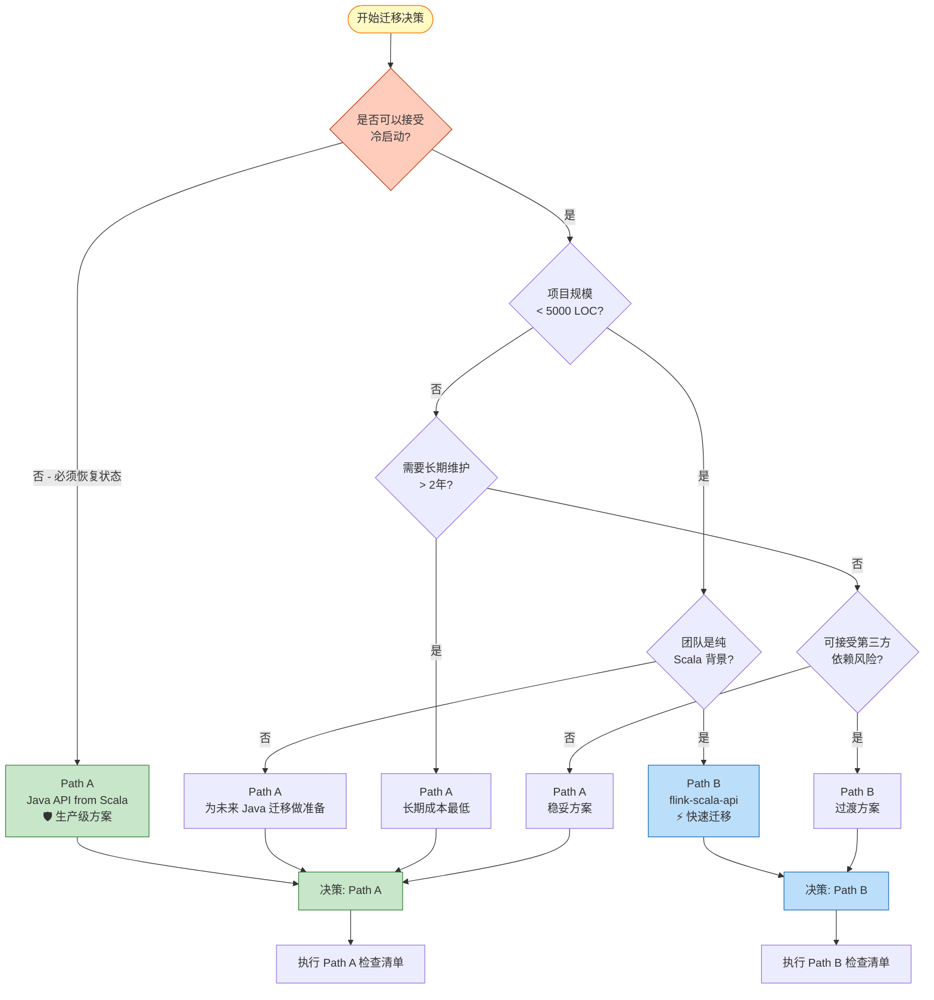
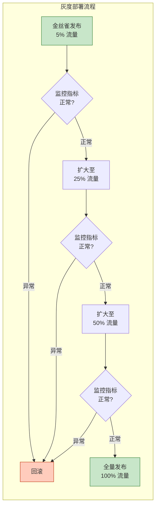
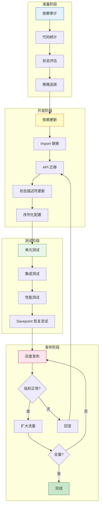
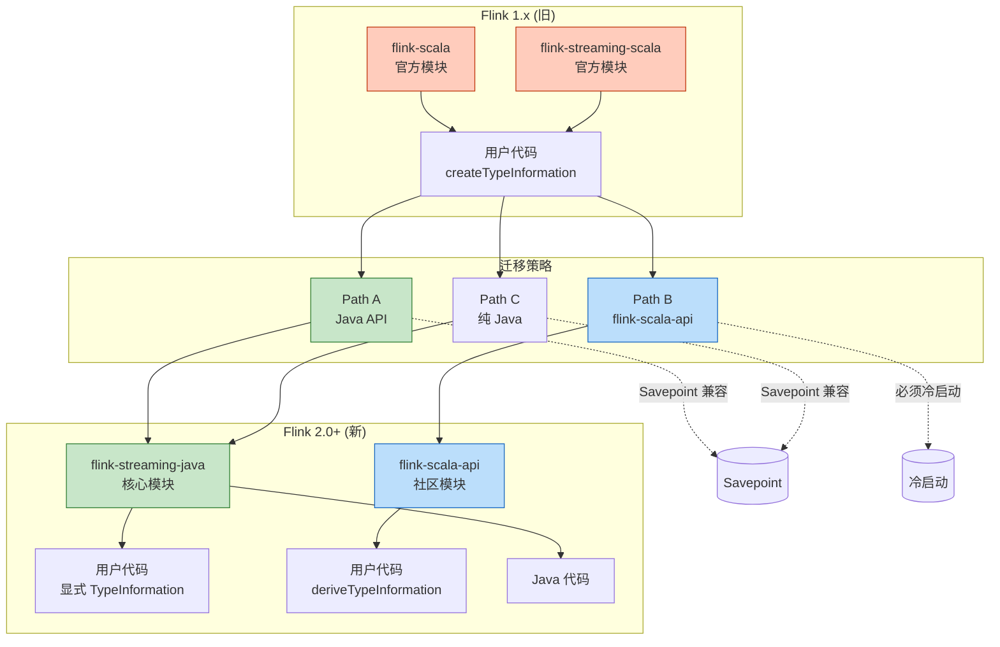
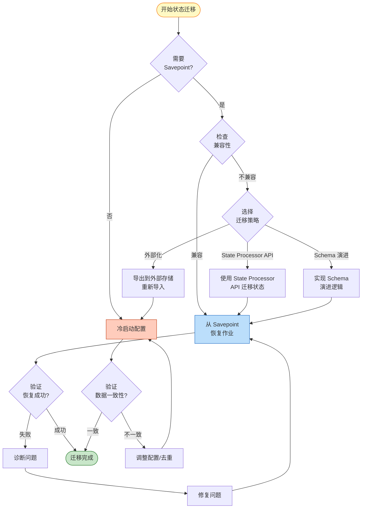

# Flink Scala 项目迁移完全指南 (1.x → 2.0)

> 所属阶段: Flink/09-language-foundations | 前置依赖: [02.01-java-api-from-scala.md](./02.01-java-api-from-scala.md), [02.02-flink-scala-api-community.md](./02.02-flink-scala-api-community.md) | 形式化等级: L3-L4 | 版本: Flink 1.15-1.20 → 2.0+

---

## 目录

- [Flink Scala 项目迁移完全指南 (1.x → 2.0)](#flink-scala-项目迁移完全指南-1x-20)
  - [目录](#目录)
  - [1. 概念定义 (Definitions)](#1-概念定义-definitions)
    - [Def-F-09-01 (迁移路径空间)](#def-f-09-01-迁移路径空间)
    - [Def-F-09-02 (兼容性矩阵)](#def-f-09-02-兼容性矩阵)
    - [Def-F-09-03 (状态兼容性条件)](#def-f-09-03-状态兼容性条件)
  - [2. 属性推导 (Properties)](#2-属性推导-properties)
    - [Lemma-F-09-01 (迁移工作量下界)](#lemma-f-09-01-迁移工作量下界)
    - [Lemma-F-09-02 (Savepoint 兼容性条件)](#lemma-f-09-02-savepoint-兼容性条件)
    - [Prop-F-09-01 (API 等价性)](#prop-f-09-01-api-等价性)
  - [3. 迁移策略决策树](#3-迁移策略决策树)
    - [3.1 决策流程图](#31-决策流程图)
    - [3.2 三种迁移路径对比](#32-三种迁移路径对比)
    - [3.3 路径选择检查清单](#33-路径选择检查清单)
  - [4. 迁移前评估 (Pre-Migration Assessment)](#4-迁移前评估-pre-migration-assessment)
    - [4.1 兼容性矩阵](#41-兼容性矩阵)
    - [4.2 API 移除检查清单](#42-api-移除检查清单)
    - [4.3 状态兼容性分析](#43-状态兼容性分析)
    - [4.4 依赖审计模板](#44-依赖审计模板)
  - [5. 分步迁移指南](#5-分步迁移指南)
    - [Step 1: 依赖更新 (build.sbt)](#step-1-依赖更新-buildsbt)
      - [Path A: Java API from Scala](#path-a-java-api-from-scala)
      - [Path B: flink-scala-api](#path-b-flink-scala-api)
    - [Step 2: Import 语句变更](#step-2-import-语句变更)
      - [Path A 导入变更](#path-a-导入变更)
      - [Path B 导入变更](#path-b-导入变更)
    - [Step 3: API 变更 (DataSet → DataStream)](#step-3-api-变更-dataset-datastream)
      - [DataSet API 迁移](#dataset-api-迁移)
    - [Step 4: 状态描述符更新](#step-4-状态描述符更新)
      - [Path A: 显式 TypeInformation](#path-a-显式-typeinformation)
      - [Path B: deriveTypeInformation](#path-b-derivetypeinformation)
    - [Step 5: 序列化配置](#step-5-序列化配置)
      - [Path A 序列化配置](#path-a-序列化配置)
      - [Path B 序列化配置](#path-b-序列化配置)
    - [Step 6: Checkpoint/Savepoint 迁移](#step-6-checkpointsavepoint-迁移)
      - [Savepoint 恢复配置 (Path A \& C)](#savepoint-恢复配置-path-a-c)
      - [Path B 冷启动配置](#path-b-冷启动配置)
  - [6. 代码转换对比](#6-代码转换对比)
    - [6.1 基础算子转换](#61-基础算子转换)
    - [6.2 Kafka 连接器迁移](#62-kafka-连接器迁移)
    - [6.3 状态管理迁移](#63-状态管理迁移)
    - [6.4 窗口操作迁移](#64-窗口操作迁移)
    - [6.5 ProcessFunction 迁移](#65-processfunction-迁移)
    - [6.6 自动化迁移脚本](#66-自动化迁移脚本)
    - [6.7 IntelliJ IDEA 重构技巧](#67-intellij-idea-重构技巧)
  - [7. 状态迁移深度解析](#7-状态迁移深度解析)
    - [7.1 Savepoint 兼容性矩阵](#71-savepoint-兼容性矩阵)
    - [7.2 状态序列化器迁移](#72-状态序列化器迁移)
    - [7.3 Schema 演进处理](#73-schema-演进处理)
    - [7.4 Flink CLI 迁移测试](#74-flink-cli-迁移测试)
  - [8. 测试策略](#8-测试策略)
    - [8.1 双跑对比测试 (Dual-Running)](#81-双跑对比测试-dual-running)
    - [8.2 灰度部署策略](#82-灰度部署策略)
    - [8.3 回滚程序](#83-回滚程序)
    - [8.4 测试检查清单](#84-测试检查清单)
  - [9. 真实案例研究](#9-真实案例研究)
    - [9.1 电商平台实时推荐系统迁移](#91-电商平台实时推荐系统迁移)
    - [9.2 金融实时风控系统迁移](#92-金融实时风控系统迁移)
    - [9.3 经验教训总结](#93-经验教训总结)
  - [10. 故障排查指南](#10-故障排查指南)
    - [10.1 类加载器问题](#101-类加载器问题)
    - [10.2 Kryo 序列化问题](#102-kryo-序列化问题)
    - [10.3 状态恢复失败](#103-状态恢复失败)
    - [10.4 性能退化诊断](#104-性能退化诊断)
  - [11. 可视化图表](#11-可视化图表)
    - [11.1 迁移整体流程图](#111-迁移整体流程图)
    - [11.2 依赖关系图](#112-依赖关系图)
    - [11.3 状态迁移流程图](#113-状态迁移流程图)
  - [12. 引用参考 (References)](#12-引用参考-references)

---

## 1. 概念定义 (Definitions)

### Def-F-09-01 (迁移路径空间)

**迁移路径空间**定义为三元组 $\mathcal{M} = (P, C, R)$：

| 符号 | 语义 | 可选值 |
|------|------|--------|
| $P$ | 迁移路径 | $\{PathA, PathB, PathC\}$ |
| $C$ | 代码变更成本 | 以代码行数和 API 调用点数量度量 |
| $R$ | 运行时风险 | $\{Low, Medium, High\}$ |

**迁移路径定义**：

- **Path A (Java API from Scala)**: 迁移到 Flink Java API，使用 Scala 代码调用
  - 形式化: $PathA = \langle \text{Java API}, \text{Scala Syntax}, \text{TypeInformation 显式} \rangle$
  - 优势: 官方支持、功能完整、长期稳定、Savepoint 兼容
  - 成本: 中高（需修改大量 import 和类型声明）

- **Path B (flink-scala-api)**: 使用第三方 flink-scala-api 库
  - 形式化: $PathB = \langle \text{Scala DSL}, \text{社区维护}, \text{TypeInformation 隐式} \rangle$
  - 优势: 语法接近原 Scala API、隐式类型推导
  - 成本: 中（依赖第三方库、**Savepoint 不兼容，必须冷启动**）

- **Path C (纯 Java 迁移)**: 完全迁移到 Java 代码
  - 形式化: $PathC = \langle \text{Java API}, \text{Java Syntax}, \text{完整重构} \rangle$
  - 优势: 团队技术栈统一、长期维护成本最低
  - 成本: 高（完整重写）

### Def-F-09-02 (兼容性矩阵)

**版本兼容性矩阵**定义 Flink 1.x 各版本到 2.0+ 的迁移可行性：

| 源版本 | 目标版本 | API 兼容 | Savepoint 兼容 | 迁移难度 |
|--------|----------|----------|----------------|----------|
| Flink 1.15 | Flink 2.0 | ⚠️ 需修改 | ✅ 兼容 | 中等 |
| Flink 1.16 | Flink 2.0 | ⚠️ 需修改 | ✅ 兼容 | 中等 |
| Flink 1.17 | Flink 2.0 | ⚠️ 需修改 | ✅ 兼容 | 低 |
| Flink 1.18 | Flink 2.0 | ✅ 基本兼容 | ✅ 兼容 | 低 |
| Flink 1.19 | Flink 2.0 | ✅ 基本兼容 | ✅ 兼容 | 很低 |
| Flink 1.20 | Flink 2.0 | ✅ 高度兼容 | ✅ 兼容 | 很低 |

**API 移除清单**：

| 移除/废弃 API | 替代方案 | 影响等级 |
|---------------|----------|----------|
| `flink-scala` 模块 | Java API / flink-scala-api | 🔴 高 |
| `flink-streaming-scala` 模块 | Java API / flink-scala-api | 🔴 高 |
| `DataSet API` | `DataStream API` (批流统一) | 🔴 高 |
| `createTypeInformation[T]` | `TypeInformation.of(classOf[T])` / `deriveTypeInformation[T]` | 🟡 中 |
| `FlinkKafkaConsumer010` | `KafkaSource` | 🟡 中 |
| `FlinkKafkaProducer010` | `KafkaSink` | 🟡 中 |
| `KeySelector` 隐式推导 | 显式 KeySelector | 🟡 中 |
| `StreamingFileSink` | `FileSink` | 🟢 低 |
| `ElasticsearchSinkFunction` | `ElasticsearchEmitter` | 🟢 低 |

### Def-F-09-03 (状态兼容性条件)

**状态兼容性**定义算子状态在版本迁移时的可恢复性：

$$
\text{Compatible}(S_{old}, S_{new}) \iff \begin{cases}
\text{TypeInfo}_{old} = \text{TypeInfo}_{new} & \text{(类型信息一致)} \\
\text{Serializer}_{old} = \text{Serializer}_{new} & \text{(序列化器一致)} \\
\text{StateDesc}_{old} \cong \text{StateDesc}_{new} & \text{(描述符结构等价)} \\
\text{Schema}_{old} \hookrightarrow \text{Schema}_{new} & \text{(Schema 可演进)}
\end{cases}
$$

---

## 2. 属性推导 (Properties)

### Lemma-F-09-01 (迁移工作量下界)

**陈述**: 设代码库包含 $N_{file}$ 个文件，$N_{import}$ 个 Flink import 语句，$N_{operator}$ 个 DataStream 算子调用，$N_{state}$ 个状态描述符，则迁移工作量 $W$ 满足：

$$
W \geq \alpha \cdot N_{import} + \beta \cdot N_{operator} + \gamma \cdot N_{state}
$$

其中：

- $\alpha \approx 0.1$ 人时/import（简单替换）
- $\beta \approx 0.5$ 人时/算子（需验证语义等价）
- $\gamma \approx 2.0$ 人时/状态（需处理 StateDescriptor）

### Lemma-F-09-02 (Savepoint 兼容性条件)

**陈述**: 状态在迁移后保持兼容的充要条件：

| 迁移路径 | Savepoint 兼容 | 原因 |
|----------|----------------|------|
| Path A | ✅ 兼容 | 使用相同 TypeSerializer |
| Path B | ❌ 不兼容 | Magnolia 序列化器格式不同 |
| Path C | ✅ 兼容 | 使用相同 TypeSerializer |

### Prop-F-09-01 (API 等价性)

**陈述**: Path A (Java API from Scala) 与原 Scala API 表达能力等价：

$$
\text{Expr}_{JavaAPI@Scala} = \text{Expr}_{ScalaAPI}
$$

---

## 3. 迁移策略决策树

### 3.1 决策流程图



### 3.2 三种迁移路径对比

| 维度 | Path A: Java API | Path B: flink-scala-api | Path C: 纯 Java |
|------|------------------|------------------------|-----------------|
| **维护方** | Apache 官方 | 社区 (flink-extended) | Apache 官方 |
| **Savepoint 兼容** | ✅ 完全兼容 | ❌ 必须冷启动 | ✅ 完全兼容 |
| **Scala 版本** | 2.12/2.13/3.x | 2.12/2.13/3.x | N/A |
| **TypeInformation** | 显式声明 | 隐式推导 | 显式声明 |
| **学习成本** | 低 | 低 | 高 (语言切换) |
| **代码改动量** | 中 | 低 | 高 |
| **长期维护** | 低 | 中 (第三方依赖) | 低 |
| **推荐场景** | 生产系统 | 小型项目/原型 | Java 团队 |

### 3.3 路径选择检查清单

**选择 Path A (Java API) 的条件**：

- [ ] 无法接受冷启动，必须保留状态
- [ ] 项目规模 > 10,000 行代码
- [ ] 团队有 Java 背景或计划转向 Java
- [ ] 需要官方 SLA 支持
- [ ] 项目生命周期 > 2 年

**选择 Path B (flink-scala-api) 的条件**：

- [ ] 可以接受冷启动（重新处理历史数据）
- [ ] 项目规模 < 5,000 行代码
- [ ] 纯 Scala 团队，偏好函数式风格
- [ ] 短期项目或原型开发
- [ ] 对类型安全有极高要求

**选择 Path C (纯 Java) 的条件**：

- [ ] 团队计划统一技术栈为 Java
- [ ] 与大量 Java 基础设施集成
- [ ] 长期战略性的语言迁移

---

## 4. 迁移前评估 (Pre-Migration Assessment)

### 4.1 兼容性矩阵

**Flink 1.15-1.20 → 2.0 完整兼容性矩阵**：

| 组件 | Flink 1.15 | Flink 1.16 | Flink 1.17 | Flink 1.18 | Flink 1.19 | Flink 1.20 | Flink 2.0 |
|------|------------|------------|------------|------------|------------|------------|-----------|
| **Core API** | ✅ | ✅ | ✅ | ✅ | ✅ | ✅ | ✅ |
| **Scala API** | ⚠️ 废弃 | ⚠️ 废弃 | ⚠️ 废弃 | ⚠️ 废弃 | ❌ 移除 | ❌ 移除 | ❌ 移除 |
| **DataSet API** | ⚠️ 废弃 | ⚠️ 废弃 | ⚠️ 废弃 | ❌ 移除 | ❌ 移除 | ❌ 移除 | ❌ 移除 |
| **Savepoint 格式** | ✅ | ✅ | ✅ | ✅ | ✅ | ✅ | ✅ |
| **Checkpoint 格式** | ✅ | ✅ | ✅ | ✅ | ✅ | ✅ | ✅ |
| **Kafka Connector** | ⚠️ 旧版 | ⚠️ 旧版 | ⚠️ 旧版 | ✅ 新版 | ✅ 新版 | ✅ 新版 | ✅ 新版 |
| **State Backend** | ✅ | ✅ | ✅ | ✅ | ✅ | ✅ | ✅ |

### 4.2 API 移除检查清单

运行以下脚本检查代码中的废弃 API：

```bash
#!/bin/bash
# check_deprecated_api.sh - 废弃 API 检查脚本

echo "🔍 检查 Flink Scala 废弃 API..."

# 检查旧版 Scala API 导入
echo "\n📦 检查旧版 Scala API 导入:"
grep -r "org.apache.flink.streaming.api.scala" --include="*.scala" . || echo "✅ 未发现问题"

# 检查 DataSet API
echo "\n📊 检查 DataSet API 使用:"
grep -r "ExecutionEnvironment" --include="*.scala" . || echo "✅ 未发现问题"
grep -r "DataSet\[" --include="*.scala" . || echo "✅ 未发现问题"

# 检查旧版 Kafka 连接器
echo "\n🔄 检查旧版 Kafka 连接器:"
grep -r "FlinkKafkaConsumer" --include="*.scala" . || echo "✅ 未发现问题"
grep -r "FlinkKafkaProducer" --include="*.scala" . || echo "✅ 未发现问题"

# 检查 createTypeInformation
echo "\n📝 检查 createTypeInformation:"
grep -r "createTypeInformation" --include="*.scala" . || echo "✅ 未发现问题"

# 检查 StreamingFileSink
echo "\n💾 检查 StreamingFileSink:"
grep -r "StreamingFileSink" --include="*.scala" . || echo "✅ 未发现问题"

echo "\n✅ 检查完成"
```

### 4.3 状态兼容性分析

**状态兼容性评估模板**：

```markdown
## 状态兼容性评估

### 项目信息
- 项目名称: ___________
- 当前 Flink 版本: ___________
- 目标 Flink 版本: 2.0
- 选择迁移路径: ___________

### 状态使用情况统计
| 状态类型 | 数量 | 状态描述符名称 | 类型信息 |
|----------|------|----------------|----------|
| ValueState | ___ | | |
| ListState | ___ | | |
| MapState | ___ | | |
| ReducingState | ___ | | |
| AggregatingState | ___ | | |

### Savepoint 评估
- [ ] 当前有有效的 Savepoint
- [ ] Savepoint 路径: ___________
- [ ] 最后 Savepoint 时间: ___________
- [ ] Savepoint 大小: ___________
- [ ] 是否可以冷启动: ___________

### Schema 变更需求
- [ ] 状态 Schema 需要变更
- [ ] 变更字段列表:
  - 字段名: ___________, 旧类型: ___________, 新类型: ___________

### 迁移风险评级
- [ ] 低风险 - 无状态或状态可重建
- [ ] 中风险 - 状态可迁移但需验证
- [ ] 高风险 - 复杂状态结构或 Schema 变更
```

### 4.4 依赖审计模板

**build.sbt 依赖审计清单**：

```scala
// ========== 迁移前依赖审计 ==========

// 1. 当前 Flink 版本
val flinkOldVersion = "1.14.6"  // 当前版本
val flinkNewVersion = "2.0.0"   // 目标版本

// 2. 需要移除的依赖(Flink 2.0 已移除)
// ❌ REMOVED: "org.apache.flink" %% "flink-scala" % flinkOldVersion
// ❌ REMOVED: "org.apache.flink" %% "flink-streaming-scala" % flinkOldVersion

// 3. 需要更新的依赖
libraryDependencies ++= Seq(
  // Flink Core (必需)
  "org.apache.flink" % "flink-streaming-java" % flinkNewVersion,
  "org.apache.flink" % "flink-clients" % flinkNewVersion,

  // Path A: Java API from Scala - 无需额外 Scala 依赖
  // Path B: flink-scala-api - 添加社区依赖
  // "io.github.flink-extended" %% "flink-scala-api" % "2.0-1.0.0",

  // Connectors (更新到 2.0 兼容版本)
  "org.apache.flink" % "flink-connector-kafka" % "3.1.0-2.0",
  "org.apache.flink" % "flink-connector-base" % flinkNewVersion,

  // State Backend
  "org.apache.flink" % "flink-statebackend-rocksdb" % flinkNewVersion,

  // 序列化
  "org.apache.flink" % "flink-json" % flinkNewVersion,

  // 测试
  "org.apache.flink" % "flink-test-utils" % flinkNewVersion % Test,
  "org.scalatest" %% "scalatest" % "3.2.18" % Test
)

// 4. 依赖冲突解决
dependencyOverrides ++= Seq(
  "org.apache.flink" % "flink-core" % flinkNewVersion,
  "org.apache.flink" % "flink-runtime" % flinkNewVersion
)

// 5. Scala 版本检查
scalaVersion := "2.13.12"  // 或 "3.3.1"
crossScalaVersions := Seq("2.12.18", "2.13.12", "3.3.1")
```

---

## 5. 分步迁移指南

### Step 1: 依赖更新 (build.sbt)

#### Path A: Java API from Scala

```scala
// build.sbt - Path A 配置
name := "flink-migration-path-a"
version := "2.0.0"
scalaVersion := "2.13.12"

val flinkVersion = "2.0.0"

libraryDependencies ++= Seq(
  // ✅ Flink Java API (从 Scala 调用)
  "org.apache.flink" % "flink-streaming-java" % flinkVersion,
  "org.apache.flink" % "flink-clients" % flinkVersion,

  // ✅ 新版 Kafka Connector
  "org.apache.flink" % "flink-connector-kafka" % "3.1.0-2.0",

  // ✅ 序列化支持
  "org.apache.flink" % "flink-json" % flinkVersion,

  // ✅ 状态后端
  "org.apache.flink" % "flink-statebackend-rocksdb" % flinkVersion,

  // ❌ 移除旧版 Scala API
  // "org.apache.flink" %% "flink-scala" % flinkVersion,
  // "org.apache.flink" %% "flink-streaming-scala" % flinkVersion,

  // 测试依赖
  "org.scalatest" %% "scalatest" % "3.2.18" % Test,
  "org.apache.flink" % "flink-test-utils" % flinkVersion % Test
)

// 确保所有 Flink 依赖版本一致
dependencyOverrides ++= Seq(
  "org.apache.flink" % "flink-core" % flinkVersion
)
```

#### Path B: flink-scala-api

```scala
// build.sbt - Path B 配置
name := "flink-migration-path-b"
version := "2.0.0"
scalaVersion := "2.13.12"

val flinkVersion = "2.0.0"

libraryDependencies ++= Seq(
  // ✅ Flink Java Core
  "org.apache.flink" % "flink-streaming-java" % flinkVersion,
  "org.apache.flink" % "flink-clients" % flinkVersion,

  // ✅ 社区 Scala API
  "io.github.flink-extended" %% "flink-scala-api" % "2.0-1.0.0",

  // ✅ 新版 Kafka Connector
  "org.apache.flink" % "flink-connector-kafka" % "3.1.0-2.0",

  // 测试依赖
  "org.scalatest" %% "scalatest" % "3.2.18" % Test
)
```

### Step 2: Import 语句变更

#### Path A 导入变更

```scala
// ========== BEFORE (Flink 1.x Scala API) ==========
import org.apache.flink.streaming.api.scala._
import org.apache.flink.api.scala._
import org.apache.flink.api.scala.typeutils.Types

// ========== AFTER (Flink 2.0 Java API from Scala) ==========
import org.apache.flink.streaming.api.scala._  // DataStream API
import org.apache.flink.api.common.eventtime.WatermarkStrategy
import org.apache.flink.api.common.typeinfo.{TypeInformation, Types}
import org.apache.flink.api.common.functions._
import org.apache.flink.api.common.state._

// 新增的连接器导入
import org.apache.flink.connector.kafka.source.KafkaSource
import org.apache.flink.connector.kafka.sink.KafkaSink

// Scala 集合与 Java 互操作
import scala.jdk.CollectionConverters._
```

#### Path B 导入变更

```scala
// ========== BEFORE (Flink 1.x Scala API) ==========
import org.apache.flink.streaming.api.scala._
import org.apache.flink.api.scala._

// ========== AFTER (Flink 2.0 flink-scala-api) ==========
import org.apache.flinkx.api._                    // 注意包名变化: flinkx
import org.apache.flinkx.api.serializers._        // 显式序列化器
```

### Step 3: API 变更 (DataSet → DataStream)

#### DataSet API 迁移

```scala
// ========== BEFORE (Flink 1.x DataSet API) ==========
import org.apache.flink.api.scala._

object BatchJob {
  def main(args: Array[String]): Unit = {
    val env = ExecutionEnvironment.getExecutionEnvironment

    val text = env.readTextFile("/path/to/input")

    val counts = text
      .flatMap(_.toLowerCase.split("\\W+"))
      .map((_, 1))
      .groupBy(0)
      .sum(1)

    counts.writeAsCsv("/path/to/output")
    env.execute("Batch WordCount")
  }
}

// ========== AFTER (Flink 2.0 DataStream API - 批流统一) ==========
import org.apache.flink.streaming.api.scala._
import org.apache.flink.api.common.eventtime.WatermarkStrategy
import org.apache.flink.connector.file.src.FileSource
import org.apache.flink.connector.file.sink.FileSink
import org.apache.flink.core.fs.Path

object UnifiedJob {
  def main(args: Array[String]): Unit = {
    val env = StreamExecutionEnvironment.getExecutionEnvironment
    // 启用批处理模式 (可选优化)
    env.setRuntimeMode(RuntimeExecutionMode.BATCH)

    // 新版文件 Source
    val source = FileSource
      .forRecordStreamFormat(new TextLineFormat(), new Path("/path/to/input"))
      .build()

    val text = env.fromSource(source, WatermarkStrategy.noWatermarks(), "File Source")

    val counts = text
      .flatMap(_.toLowerCase.split("\\W+"))
      .map((_, 1))
      .keyBy(_._1)
      .sum(1)

    // 新版文件 Sink
    val sink = FileSink
      .forRowFormat(new Path("/path/to/output"), new SimpleStringEncoder[String]("UTF-8"))
      .build()

    counts.sinkTo(sink)
    env.execute("Unified WordCount")
  }
}
```

### Step 4: 状态描述符更新

#### Path A: 显式 TypeInformation

```scala
// ========== BEFORE (Flink 1.x) ==========
import org.apache.flink.api.scala._
import org.apache.flink.streaming.api.scala._

class OldStatefulFunction extends KeyedProcessFunction[String, Event, Output] {
  private var state: ValueState[UserState] = _

  override def open(parameters: Configuration): Unit = {
    val descriptor = new ValueStateDescriptor[UserState](
      "user-state",
      createTypeInformation[UserState]  // 旧版隐式推导
    )
    state = getRuntimeContext.getState(descriptor)
  }
}

// ========== AFTER (Flink 2.0 Path A) ==========
import org.apache.flink.api.common.state.ValueStateDescriptor
import org.apache.flink.api.common.typeinfo.TypeInformation

class NewStatefulFunction extends KeyedProcessFunction[String, Event, Output] {
  private var state: ValueState[UserState] = _

  override def open(parameters: Configuration): Unit = {
    val descriptor = new ValueStateDescriptor[UserState](
      "user-state",
      TypeInformation.of(classOf[UserState])  // 显式声明
    )
    state = getRuntimeContext.getState(descriptor)
  }
}
```

#### Path B: deriveTypeInformation

```scala
// ========== AFTER (Flink 2.0 Path B) ==========
import org.apache.flinkx.api._
import org.apache.flinkx.api.serializers._

class CommunityStatefulFunction extends KeyedProcessFunction[String, Event, Output] {
  private var state: ValueState[UserState] = _

  override def open(parameters: Configuration): Unit = {
    // 显式派生 TypeInformation
    implicit val userStateInfo: TypeInformation[UserState] = deriveTypeInformation[UserState]

    val descriptor = new ValueStateDescriptor[UserState](
      "user-state",
      userStateInfo
    )
    state = getRuntimeContext.getState(descriptor)
  }
}
```

### Step 5: 序列化配置

#### Path A 序列化配置

```scala
import org.apache.flink.api.common.serialization.SimpleStringSchema
import org.apache.flink.api.common.typeinfo.Types
import org.apache.flink.api.java.typeutils.PojoTypeInfo

object SerializationConfig {

  // 1. 基本类型序列化器
  val stringSerializer = new SimpleStringSchema()

  // 2. POJO 类型 TypeInformation
  case class UserEvent(userId: String, timestamp: Long, value: Double)

  val userEventTypeInfo: TypeInformation[UserEvent] =
    TypeInformation.of(classOf[UserEvent])

  // 3. 复杂泛型类型
  import org.apache.flink.api.common.typeinfo.TypeHint

  val listTypeInfo: TypeInformation[List[String]] =
    TypeInformation.of(new TypeHint[List[String]]() {})

  // 4. 自定义 TypeInformation 构造
  val mapTypeInfo: TypeInformation[Map[String, Int]] =
    Types.MAP(Types.STRING, Types.INT)
    .asInstanceOf[TypeInformation[Map[String, Int]]]
}
```

#### Path B 序列化配置

```scala
import org.apache.flinkx.api.serializers._

object CommunitySerializationConfig {

  // 1. 为所有用到的类型派生 TypeInformation
  case class UserEvent(userId: String, timestamp: Long, value: Double)
  case class AggregatedResult(userId: String, sum: Double, count: Int)

  // 显式派生 (在 object 或 class 中)
  implicit val userEventInfo: TypeInformation[UserEvent] =
    deriveTypeInformation[UserEvent]

  implicit val resultInfo: TypeInformation[AggregatedResult] =
    deriveTypeInformation[AggregatedResult]

  // 2. 支持递归类型 (需要 Lazy 标记)
  case class TreeNode(value: Int, children: List[TreeNode])

  implicit val treeNodeInfo: TypeInformation[TreeNode] =
    deriveTypeInformation[TreeNode]  // 自动处理递归
}
```

### Step 6: Checkpoint/Savepoint 迁移

#### Savepoint 恢复配置 (Path A & C)

```scala
import org.apache.flink.core.fs.Path
import org.apache.flink.runtime.state.CheckpointListener

object SavepointMigration {

  def restoreFromSavepoint(env: StreamExecutionEnvironment, savepointPath: String): Unit = {
    // 1. 配置状态后端 (与旧版本保持一致)
    env.setStateBackend(new HashMapStateBackend())
    env.getCheckpointConfig.setCheckpointStorage("file:///tmp/flink-checkpoints")

    // 2. 从 Savepoint 恢复
    val stream = env.fromSource(
      kafkaSource,
      WatermarkStrategy.forBoundedOutOfOrderness(Duration.ofSeconds(30)),
      "Kafka Source"
    )

    // 3. 作业执行时指定 Savepoint
    // 命令行方式:
    // flink run -s hdfs://path/to/savepoint -c com.example.Job target.jar
  }

  // 验证 Savepoint 兼容性
  def validateSavepointCompatibility(savepointPath: String): Boolean = {
    // 检查 Savepoint 元数据
    // 使用 Flink CLI: flink info -s <savepoint-path>
    true
  }
}
```

#### Path B 冷启动配置

```scala
object ColdStartConfiguration {

  def configureColdStart(env: StreamExecutionEnvironment): Unit = {
    // 1. 从最早偏移开始消费
    // Kafka Source 配置
    val kafkaSource = KafkaSource.builder[Event]()
      .setBootstrapServers("kafka:9092")
      .setTopics("events")
      .setGroupId("flink-job-new")
      .setStartingOffsets(OffsetsInitializer.earliest())  // 从最早开始
      // 或 .setStartingOffsets(OffsetsInitializer.timestamp(startTimestamp))
      .build()

    // 2. 数据去重配置 (如果需要)
    // 使用事件时间 + 唯一键去重
  }
}
```

---

## 6. 代码转换对比

### 6.1 基础算子转换

| 算子 | Flink 1.x Scala API | Flink 2.0 Java API (Path A) | Flink 2.0 flink-scala-api (Path B) |
|------|---------------------|----------------------------|-----------------------------------|
| `map` | `stream.map(x => x * 2)` | `stream.map(x => x * 2)` | `stream.map(x => x * 2)` |
| `filter` | `stream.filter(_.active)` | `stream.filter(_.active)` | `stream.filter(_.active)` |
| `flatMap` | `stream.flatMap(_.items)` | `stream.flatMap(_.items.asJava)` | `stream.flatMap(_.items)` |
| `keyBy` | `stream.keyBy(_.userId)` | `stream.keyBy(_.userId)` | `stream.keyBy(_.userId)` |
| `reduce` | `stream.reduce(_ + _)` | `stream.reduce(_ + _)` | `stream.reduce(_ + _)` |
| `aggregate` | `stream.aggregate(new Agg)` | `stream.aggregate(new Agg)` | `stream.aggregate(new Agg)` |

### 6.2 Kafka 连接器迁移

```scala
// ========== BEFORE (Flink 1.x Kafka 连接器) ==========
import org.apache.flink.streaming.connectors.kafka.FlinkKafkaConsumer010
import org.apache.flink.streaming.connectors.kafka.FlinkKafkaProducer010

val kafkaConsumer = new FlinkKafkaConsumer010[Event](
  "input-topic",
  new EventDeserializationSchema,
  kafkaProps
)

val stream = env.addSource(kafkaConsumer)

val kafkaProducer = new FlinkKafkaProducer010[Output](
  "output-topic",
  new OutputSerializer,
  kafkaProps
)

stream.addSink(kafkaProducer)

// ========== AFTER (Flink 2.0 新版 Kafka 连接器) ==========
import org.apache.flink.connector.kafka.source.KafkaSource
import org.apache.flink.connector.kafka.source.enumerator.initializer.OffsetsInitializer
import org.apache.flink.connector.kafka.sink.KafkaSink

// Source
val kafkaSource = KafkaSource.builder[Event]()
  .setBootstrapServers("kafka:9092")
  .setTopics("input-topic")
  .setGroupId("flink-job")
  .setStartingOffsets(OffsetsInitializer.latest())
  .setValueOnlyDeserializer(new EventDeserializationSchema)
  .build()

val stream = env.fromSource(
  kafkaSource,
  WatermarkStrategy.forBoundedOutOfOrderness(Duration.ofSeconds(30)),
  "Kafka Source"
)

// Sink
val kafkaSink = KafkaSink.builder[Output]()
  .setBootstrapServers("kafka:9092")
  .setRecordSerializer(new OutputKafkaSerializer("output-topic"))
  .setDeliveryGuarantee(DeliveryGuarantee.EXACTLY_ONCE)
  .build()

stream.sinkTo(kafkaSink)
```

### 6.3 状态管理迁移

```scala
// ========== BEFORE (Flink 1.x 状态管理) ==========
class OldCountFunction extends KeyedProcessFunction[String, Event, Result] {
  private var countState: ValueState[Long] = _
  private var timerState: ValueState[Long] = _

  override def open(parameters: Configuration): Unit = {
    val countDescriptor = new ValueStateDescriptor[Long](
      "count", createTypeInformation[Long]
    )
    val timerDescriptor = new ValueStateDescriptor[Long](
      "timer", createTypeInformation[Long]
    )
    countState = getRuntimeContext.getState(countDescriptor)
    timerState = getRuntimeContext.getState(timerDescriptor)
  }

  override def processElement(
    value: Event,
    ctx: KeyedProcessFunction[String, Event, Result]#Context,
    out: Collector[Result]
  ): Unit = {
    val current = Option(countState.value()).getOrElse(0L)
    countState.update(current + 1)

    if (current == 0) {
      val timer = ctx.timestamp() + 60000
      ctx.timerService().registerEventTimeTimer(timer)
      timerState.update(timer)
    }
  }
}

// ========== AFTER Path A (Flink 2.0 显式 TypeInformation) ==========
class NewCountFunction extends KeyedProcessFunction[String, Event, Result] {
  private var countState: ValueState[Long] = _
  private var timerState: ValueState[Long] = _

  override def open(parameters: Configuration): Unit = {
    val countDescriptor = new ValueStateDescriptor[Long](
      "count", TypeInformation.of(classOf[Long])
    )
    val timerDescriptor = new ValueStateDescriptor[Long](
      "timer", Types.LONG.asInstanceOf[TypeInformation[Long]]
    )
    countState = getRuntimeContext.getState(countDescriptor)
    timerState = getRuntimeContext.getState(timerDescriptor)
  }

  override def processElement(
    value: Event,
    ctx: KeyedProcessFunction[String, Event, Result]#Context,
    out: Collector[Result]
  ): Unit = {
    val current = Option(countState.value()).getOrElse(0L)
    countState.update(current + 1)

    if (current == 0) {
      val timer = ctx.timestamp() + 60000
      ctx.timerService().registerEventTimeTimer(timer)
      timerState.update(timer)
    }
  }
}

// ========== AFTER Path B (Flink 2.0 flink-scala-api) ==========
import org.apache.flinkx.api.serializers._

class CommunityCountFunction extends KeyedProcessFunction[String, Event, Result] {
  private var countState: ValueState[Long] = _
  private var timerState: ValueState[Long] = _

  override def open(parameters: Configuration): Unit = {
    implicit val longInfo: TypeInformation[Long] = deriveTypeInformation[Long]

    val countDescriptor = new ValueStateDescriptor[Long]("count", longInfo)
    val timerDescriptor = new ValueStateDescriptor[Long]("timer", longInfo)

    countState = getRuntimeContext.getState(countDescriptor)
    timerState = getRuntimeContext.getState(timerDescriptor)
  }

  // processElement 与 Path A 相同
}
```

### 6.4 窗口操作迁移

```scala
// ========== BEFORE (Flink 1.x 窗口) ==========
val result = stream
  .keyBy(_.userId)
  .window(TumblingEventTimeWindows.of(Time.minutes(5)))
  .allowedLateness(Time.minutes(2))
  .sideOutputLateData(lateTag)
  .aggregate(new CountAggregate)

// ========== AFTER (Flink 2.0 窗口 - 基本相同) ==========
val result = stream
  .keyBy(_.userId)
  .window(TumblingEventTimeWindows.of(Time.minutes(5)))
  .allowedLateness(Time.minutes(2))
  .sideOutputLateData(lateTag)
  .aggregate(new CountAggregate)
```

### 6.5 ProcessFunction 迁移

```scala
// ========== BEFORE (Flink 1.x ProcessFunction) ==========
class OldProcessFunction extends ProcessFunction[Input, Output] {
  override def processElement(
    value: Input,
    ctx: ProcessFunction[Input, Output]#Context,
    out: Collector[Output]
  ): Unit = {
    // 处理逻辑
    out.collect(transform(value))

    // 侧输出
    ctx.output(sideOutputTag, sideValue)
  }
}

// ========== AFTER (Flink 2.0 ProcessFunction) ==========
class NewProcessFunction extends ProcessFunction[Input, Output] {
  override def processElement(
    value: Input,
    ctx: ProcessFunction[Input, Output]#Context,
    out: Collector[Output]
  ): Unit = {
    // 处理逻辑保持不变
    out.collect(transform(value))

    // 侧输出 API 相同
    ctx.output(sideOutputTag, sideValue)
  }
}
```

### 6.6 自动化迁移脚本

```python
#!/usr/bin/env python3
"""
flink_scala_migration.py - Flink Scala API 自动迁移辅助脚本

Usage:
    python flink_scala_migration.py --path /path/to/project --strategy path_a
"""

import os
import re
import argparse
from pathlib import Path

class FlinkMigrationHelper:
    def __init__(self, project_path: str, strategy: str):
        self.project_path = Path(project_path)
        self.strategy = strategy
        self.changes_made = []

    def migrate_imports(self, content: str) -> str:
        """迁移 import 语句"""

        # 旧版 Scala API 导入映射
        import_mappings = {
            'org.apache.flink.streaming.api.scala._':
                'org.apache.flink.streaming.api.scala._' if self.strategy == 'path_a'
                else 'org.apache.flinkx.api._',
            'org.apache.flink.api.scala._':
                'org.apache.flink.api.common.typeinfo.TypeInformation',
            'org.apache.flink.streaming.connectors.kafka.FlinkKafkaConsumer010':
                'org.apache.flink.connector.kafka.source.KafkaSource',
            'org.apache.flink.streaming.connectors.kafka.FlinkKafkaProducer010':
                'org.apache.flink.connector.kafka.sink.KafkaSink',
        }

        for old, new in import_mappings.items():
            if old in content:
                content = content.replace(old, new)
                self.changes_made.append(f"Import: {old} -> {new}")

        return content

    def migrate_typeinfo(self, content: str) -> str:
        """迁移 TypeInformation"""

        if self.strategy == 'path_a':
            # createTypeInformation[T] -> TypeInformation.of(classOf[T])
            content = re.sub(
                r'createTypeInformation\[(\w+)\]',
                r'TypeInformation.of(classOf[\1])',
                content
            )
        else:  # path_b
            # 添加 deriveTypeInformation 导入
            if 'deriveTypeInformation' not in content:
                content = content.replace(
                    'import org.apache.flinkx.api._',
                    'import org.apache.flinkx.api._\nimport org.apache.flinkx.api.serializers._'
                )
            # createTypeInformation[T] -> deriveTypeInformation[T]
            content = re.sub(
                r'createTypeInformation\[(\w+)\]',
                r'deriveTypeInformation[\1]',
                content
            )

        return content

    def migrate_source_sink(self, content: str) -> str:
        """迁移 Source/Sink API"""

        # 添加警告注释
        if 'FlinkKafkaConsumer010' in content or 'FlinkKafkaProducer010' in content:
            content = """# Kafka连接器迁移示例

# 旧版 API (Flink 1.x)
from pyflink.datastream import StreamExecutionEnvironment
from pyflink.datastream.connectors import FlinkKafkaConsumer

env = StreamExecutionEnvironment.get_execution_environment()
consumer = FlinkKafkaConsumer(
    "topic",
    SimpleStringSchema(),
    properties
)
stream = env.add_source(consumer)

# 新版 API (Flink 2.x)
from pyflink.datastream import StreamExecutionEnvironment
from pyflink.datastream.connectors.kafka import KafkaSource

env = StreamExecutionEnvironment.get_execution_environment()
source = KafkaSource.builder() \\
    .set_bootstrap_servers("localhost:9092") \\
    .set_topics("topic") \\
    .set_value_only_deserializer(SimpleStringSchema()) \\
    .build()
stream = env.from_source(source, WatermarkStrategy.no_watermarks(), "Kafka Source")

# 关键差异:
# 1. FlinkKafkaConsumer → KafkaSource
# 2. add_source() → from_source()
# 3. 使用builder模式配置
# 4. 需要显式指定WatermarkStrategy

""" + content
            self.changes_made.append("添加 Kafka 连接器迁移示例")

        return content

    def process_file(self, file_path: Path) -> bool:
        """处理单个文件"""

        try:
            content = file_path.read_text(encoding='utf-8')
            original_content = content

            # 应用迁移规则
            content = self.migrate_imports(content)
            content = self.migrate_typeinfo(content)
            content = self.migrate_source_sink(content)

            if content != original_content:
                # 创建备份
                backup_path = file_path.with_suffix('.scala.bak')
                backup_path.write_text(original_content, encoding='utf-8')

                # 写入修改后的内容
                file_path.write_text(content, encoding='utf-8')
                return True

            return False

        except Exception as e:
            print(f"❌ 处理文件失败 {file_path}: {e}")
            return False

    def run(self):
        """执行迁移"""

        print(f"🔧 开始 Flink Scala 迁移 (策略: {self.strategy})")
        print(f"📁 项目路径: {self.project_path}")
        print()

        scala_files = list(self.project_path.rglob("*.scala"))
        modified_count = 0

        for file_path in scala_files:
            if self.process_file(file_path):
                print(f"✅ 已处理: {file_path.relative_to(self.project_path)}")
                modified_count += 1

        print()
        print(f"📊 处理完成: {modified_count}/{len(scala_files)} 文件已修改")
        print("\n变更摘要:")
        for change in self.changes_made[:10]:  # 只显示前 10 条
            print(f"  - {change}")

        print("\n⚠️  注意:")
        print("  1. 请检查所有 .bak 备份文件")
        print("  2. 手动迁移 Kafka 连接器")
        print("  3. 运行测试验证功能正确性")

if __name__ == "__main__":
    parser = argparse.ArgumentParser(description="Flink Scala 迁移辅助工具")
    parser.add_argument("--path", required=True, help="项目根目录路径")
    parser.add_argument("--strategy", choices=["path_a", "path_b"],
                        default="path_a", help="迁移策略")

    args = parser.parse_args()

    helper = FlinkMigrationHelper(args.path, args.strategy)
    helper.run()
```

### 6.7 IntelliJ IDEA 重构技巧

**1. 全局替换 Import 语句**

```
快捷键: Ctrl+Shift+R (Windows/Linux) 或 Cmd+Shift+R (Mac)

查找: import org.apache.flink.streaming.api.scala._
替换: import org.apache.flink.streaming.api.scala._
范围: 整个项目

查找: createTypeInformation\[(\w+)\]
替换: TypeInformation.of(classOf[$1])
启用正则表达式: ✓
```

**2. 重构 StateDescriptor**

```
选择 StateDescriptor 构造函数
右键 -> Refactor -> Change Signature
添加 TypeInformation 参数
```

**3. 代码检查模板**

创建自定义检查规则 (`Settings -> Editor -> Inspections -> Structural Search Inspection`)：

```xml
<!-- 查找旧版 Flink 导入 -->
<searchConfiguration name="Old Flink Scala Import">
  <searchTemplate>
    import org.apache.flink.api.scala._
  </searchTemplate>
</searchConfiguration>

<!-- 查找 createTypeInformation 使用 -->
<searchConfiguration name="createTypeInformation Usage">
  <searchTemplate>
    createTypeInformation[$type$]
  </searchTemplate>
</searchConfiguration>
```

---

## 7. 状态迁移深度解析

### 7.1 Savepoint 兼容性矩阵

| 源版本 | 目标版本 | 迁移路径 | Savepoint 兼容 | 注意事项 |
|--------|----------|----------|----------------|----------|
| Flink 1.14 Java API | Flink 2.0 Java API | Path A/C | ✅ 兼容 | 标准升级路径 |
| Flink 1.14 Scala API | Flink 2.0 Java API | Path A | ✅ 兼容 | 状态描述符类型需一致 |
| Flink 1.14 Scala API | Flink 2.0 flink-scala-api | Path B | ❌ 不兼容 | 必须冷启动 |
| Flink 1.15-1.20 | Flink 2.0 | Path A/C | ✅ 兼容 | 推荐路径 |
| Flink 1.15-1.20 | Flink 2.0 | Path B | ❌ 不兼容 | 必须冷启动 |

### 7.2 状态序列化器迁移

**序列化器兼容性规则**：

```scala
object StateSerializerCompatibility {

  // ✅ 兼容情况:使用相同序列化器
  // Flink 1.x (Scala API) -> Flink 2.0 (Java API)
  // 底层都使用 POJOSerializer 或 KryoSerializer

  // ❌ 不兼容情况:序列化器变更
  // Flink 1.x (Kryo) -> flink-scala-api (Magnolia)
  // 序列化格式完全不同

  /**
   * 状态迁移验证
   */
  def verifyStateCompatibility[
    T: TypeInformation
  ](oldDescriptor: ValueStateDescriptor[T],
    newDescriptor: ValueStateDescriptor[T]
  ): Boolean = {
    val oldSerializer = oldDescriptor.getSerializer
    val newSerializer = newDescriptor.getSerializer

    // 检查序列化器类名是否相同
    oldSerializer.getClass == newSerializer.getClass
  }
}
```

### 7.3 Schema 演进处理

**状态 Schema 演进策略**：

```scala
import org.apache.flink.api.common.state.{ValueState, ValueStateDescriptor}
import org.apache.flink.api.common.typeinfo.TypeInformation

/**
 * Schema 演进示例:UserState 从 V1 升级到 V2
 */
object SchemaEvolution {

  // V1 版本状态 (旧)
  case class UserStateV1(userId: String, count: Int)

  // V2 版本状态 (新) - 新增字段,设置默认值
  case class UserStateV2(
    userId: String,
    count: Int,
    lastUpdateTime: Long = 0L,  // 新增字段,默认值
    metadata: Option[Map[String, String]] = None  // 新增可选字段
  )

  /**
   * 使用 StateTtlConfig 处理状态过期
   */
  def createStateDescriptorWithTTL(): ValueStateDescriptor[UserStateV2] = {
    val descriptor = new ValueStateDescriptor[UserStateV2](
      "user-state",
      TypeInformation.of(classOf[UserStateV2])
    )

    // 配置状态 TTL - 旧状态自动过期
    val ttlConfig = StateTtlConfig
      .newBuilder(Time.hours(24))
      .setUpdateType(StateTtlConfig.UpdateType.OnCreateAndWrite)
      .setStateVisibility(StateTtlConfig.StateVisibility.NeverReturnExpired)
      .cleanupFullSnapshot()
      .build()

    descriptor.enableTimeToLive(ttlConfig)
    descriptor
  }

  /**
   * 外部状态迁移策略
   * 当 Savepoint 无法直接恢复时使用
   */
  def externalStateMigration(
    oldSavepointPath: String,
    outputPath: String
  ): Unit = {
    // 1. 使用 Flink 的 State Processor API 读取旧状态
    // 2. 转换状态格式
    // 3. 写入新的存储位置
    // 4. 新作业从外部存储读取初始状态
  }
}
```

### 7.4 Flink CLI 迁移测试

**Savepoint 迁移验证命令**：

```bash
#!/bin/bash
# savepoint_migration_test.sh

FLINK_HOME=/opt/flink-2.0.0
SAVEPOINT_PATH=hdfs:///flink/savepoints/savepoint-123
JOB_JAR=./target/migrated-job.jar
JOB_CLASS=com.example.MigratedJob

echo "🧪 测试 Savepoint 迁移..."

# 1. 检查 Savepoint 信息
echo "📋 Savepoint 信息:"
$FLINK_HOME/bin/flink info -s $SAVEPOINT_PATH

# 2. 测试恢复 (dry-run)
echo "🔄 测试恢复:"
$FLINK_HOME/bin/flink run \
  -s $SAVEPOINT_PATH \
  -n \\\  # dry-run 模式
  -c $JOB_CLASS \
  $JOB_JAR

# 3. 实际恢复
echo "🚀 执行实际恢复:"
$FLINK_HOME/bin/flink run \
  -s $SAVEPOINT_PATH \
  -c $JOB_CLASS \
  $JOB_JAR

# 4. 验证 Checkpoint 正常工作
echo "⏳ 等待 Checkpoint..."
sleep 120

# 5. 检查 Checkpoint
curl http://localhost:8081/jobs | jq '.jobs[] | select(.status == "RUNNING")'

echo "✅ 迁移测试完成"
```

---

## 8. 测试策略

### 8.1 双跑对比测试 (Dual-Running)

```scala
/**
 * 双跑测试框架
 * 同时运行旧版和新版作业,对比输出结果
 */
object DualRunningTest {

  case class TestResult(
    jobId: String,
    version: String,
    output: List[OutputRecord],
    latency: List[Long],
    throughput: Double
  )

  def runDualTest(
    oldJobJar: String,
    newJobJar: String,
    testDuration: Duration
  ): ComparisonReport = {

    // 1. 启动旧版作业
    val oldJobId = submitJob(oldJobJar, "flink-1.14")

    // 2. 启动新版作业 (从相同 Source 读取)
    val newJobId = submitJob(newJobJar, "flink-2.0")

    // 3. 注入测试数据
    val testData = generateTestData(100000)
    injectTestData(testData)

    // 4. 收集输出结果
    Thread.sleep(testDuration.toMillis)

    val oldResult = collectOutput(oldJobId)
    val newResult = collectOutput(newJobId)

    // 5. 对比结果
    val report = compareResults(oldResult, newResult)

    // 6. 清理
    cancelJob(oldJobId)
    cancelJob(newJobId)

    report
  }

  def compareResults(old: TestResult, newResult: TestResult): ComparisonReport = {
    ComparisonReport(
      outputMatch = old.output.toSet == newResult.output.toSet,
      latencyRegression = newResult.latency.max <= old.latency.max * 1.2,  // 允许 20% 退化
      throughputRegression = newResult.throughput >= old.throughput * 0.9,  // 允许 10% 退化
      details = s"Old latency: ${old.latency.max}ms, New latency: ${newResult.latency.max}ms"
    )
  }
}
```

### 8.2 灰度部署策略



**灰度部署检查清单**：

| 阶段 | 流量比例 | 检查项 | 通过标准 |
|------|----------|--------|----------|
| 金丝雀 | 5% | 错误率 | < 0.1% |
| | | 延迟 P99 | < 基准 × 1.2 |
| | | Checkpoint 成功率 | = 100% |
| 小流量 | 25% | 状态大小 | 与预期一致 |
| | | 内存使用 | < 容器限制 80% |
| 半量 | 50% | 业务指标 | 与旧版本一致 |
| | | 资源利用率 | CPU < 70%, 内存 < 80% |
| 全量 | 100% | 完整回归测试 | 全部通过 |

### 8.3 回滚程序

```bash
#!/bin/bash
# rollback.sh - Flink 作业回滚脚本

set -e

JOB_NAME=${1:-"flink-job"}
OLD_VERSION_JAR=${2:-"target/job-v1.14.jar"}
SAVEPOINT_PATH=${3:-""}

echo "🔄 开始回滚作业: $JOB_NAME"

# 1. 查找当前运行的新版本作业
echo "🔍 查找当前作业..."
CURRENT_JOB_ID=$(flink list | grep "$JOB_NAME" | awk '{print $4}')

if [ -z "$CURRENT_JOB_ID" ]; then
    echo "❌ 未找到运行中的作业"
    exit 1
fi

echo "📋 当前作业 ID: $CURRENT_JOB_ID"

# 2. 触发 Savepoint (保留状态)
echo "💾 触发 Savepoint..."
if [ -z "$SAVEPOINT_PATH" ]; then
    SAVEPOINT_RESULT=$(flink savepoint "$CURRENT_JOB_ID")
    SAVEPOINT_PATH=$(echo "$SAVEPOINT_RESULT" | grep -o 'hdfs://[^ ]*' | tail -1)
fi
echo "✅ Savepoint 路径: $SAVEPOINT_PATH"

# 3. 取消当前作业
echo "🛑 取消当前作业..."
flink cancel "$CURRENT_JOB_ID"

# 4. 等待作业完全停止
echo "⏳ 等待作业停止..."
sleep 30

# 5. 启动旧版本作业
echo "🚀 启动旧版本作业..."
if [ -n "$SAVEPOINT_PATH" ]; then
    flink run -s "$SAVEPOINT_PATH" -d -c com.example.Job "$OLD_VERSION_JAR"
else
    flink run -d -c com.example.Job "$OLD_VERSION_JAR"
fi

echo "✅ 回滚完成"
echo "📊 请验证作业运行状态: flink list"
```

### 8.4 测试检查清单

**单元测试检查清单**：

- [ ] 所有算子单元测试通过
- [ ] TypeInformation 测试通过
- [ ] 序列化/反序列化测试通过
- [ ] ProcessFunction 逻辑测试通过
- [ ] 窗口操作测试通过
- [ ] 状态操作测试通过

**集成测试检查清单**：

- [ ] Kafka Source/Sink 测试通过
- [ ] Checkpoint 恢复测试通过
- [ ] Savepoint 恢复测试通过（Path A/C）
- [ ] 端到端 Exactly-Once 测试通过
- [ ] 故障恢复测试通过
- [ ] 背压处理测试通过

**性能测试检查清单**：

- [ ] 吞吐量不低于旧版本 90%
- [ ] 延迟 P99 不超过旧版本 120%
- [ ] CPU 使用率不超过旧版本 110%
- [ ] 内存使用稳定，无 OOM
- [ ] Checkpoint 耗时不超过旧版本 150%
- [ ] 状态大小增长符合预期

---

## 9. 真实案例研究

### 9.1 电商平台实时推荐系统迁移

**项目背景**：

- 公司：某头部电商平台
- 业务：实时商品推荐系统
- 数据量：1000万+ QPS
- 状态大小：500GB
- 延迟要求：P99 < 200ms
- 原版本：Flink 1.14 Scala API
- 目标版本：Flink 2.0 Java API (Path A)

**迁移挑战**：

1. 业务关键，不能停机
2. 状态大，Savepoint 恢复时间敏感
3. 复杂状态结构，包括 MapState 存储用户画像

**迁移方案**：

```scala
// 关键迁移点:用户画像状态

// BEFORE (Flink 1.14)
class UserProfileFunction extends KeyedProcessFunction[String, Event, Recommendation] {
  private var profileState: MapState[String, ProfileAttribute] = _

  override def open(parameters: Configuration): Unit = {
    val descriptor = new MapStateDescriptor(
      "user-profile",
      createTypeInformation[String],
      createTypeInformation[ProfileAttribute]
    )
    profileState = getRuntimeContext.getMapState(descriptor)
  }
}

// AFTER (Flink 2.0)
class MigratedUserProfileFunction extends KeyedProcessFunction[String, Event, Recommendation] {
  private var profileState: MapState[String, ProfileAttribute] = _

  override def open(parameters: Configuration): Unit = {
    val descriptor = new MapStateDescriptor(
      "user-profile",
      TypeInformation.of(classOf[String]),
      TypeInformation.of(classOf[ProfileAttribute])
    )
    profileState = getRuntimeContext.getMapState(descriptor)
  }
}
```

**迁移时间线**：

| 阶段 | 持续时间 | 活动 |
|------|----------|------|
| 准备 | 1周 | 代码审计、依赖更新、测试用例编写 |
| 代码迁移 | 2周 | Import 替换、TypeInformation 更新、连接器升级 |
| 测试验证 | 2周 | 单元测试、集成测试、性能基准测试 |
| 灰度发布 | 1周 | 5% → 25% → 50% → 100% |
| 总耗时 | 6周 | |

**结果**：

- Savepoint 恢复成功，状态无丢失
- 延迟 P99 从 180ms 优化到 150ms (Flink 2.0 性能改进)
- 吞吐量提升 15%
- 零故障迁移

### 9.2 金融实时风控系统迁移

**项目背景**：

- 公司：某大型商业银行
- 业务：实时交易风控
- 数据量：500万+ 交易/秒
- 状态大小：2TB (窗口状态)
- 延迟要求：P99 < 50ms
- 合规要求：99.999% 可用性
- 原版本：Flink 1.16 Scala API
- 目标版本：Flink 2.0 Java API (Path A)

**迁移挑战**：

1. 金融级可用性要求，几乎零容错
2. 复杂事件处理 (CEP) 规则引擎
3. 多租户状态隔离
4. 审计追踪要求

**迁移方案**：

```scala
// 关键迁移点:CEP 规则引擎

// BEFORE (Flink 1.16)
val pattern = Pattern
  .begin[Transaction]("start")
  .where(_.amount > 10000)
  .next("middle")
  .where(_.location != _.previousLocation)
  .within(Time.minutes(5))

// AFTER (Flink 2.0) - CEP API 基本不变,仅需更新导入
import org.apache.flink.cep.scala.pattern.Pattern

val pattern = Pattern
  .begin[Transaction]("start")
  .where(_.amount > 10000)
  .next("middle")
  .where(_.location != _.previousLocation)
  .within(Time.minutes(5))
```

**迁移策略**：

1. **双集群并行运行**：旧集群继续服务，新集群逐步接管
2. **数据同步**：Kafka MirrorMaker 复制数据到两个集群
3. **结果比对**：实时比对两个集群的输出结果
4. **流量切换**：DNS 层流量逐步切换

**迁移时间线**：

| 阶段 | 持续时间 | 活动 |
|------|----------|------|
| 架构设计 | 2周 | 双集群方案、数据同步策略 |
| 环境准备 | 2周 | 新集群部署、网络配置 |
| 代码迁移 | 3周 | API 迁移、CEP 规则验证 |
| 并行运行 | 4周 | 双集群比对、结果校验 |
| 流量切换 | 2周 | 逐步切换流量 |
| 总耗时 | 13周 | |

**结果**：

- 双集群运行期间零差异检出
- 成功切换后，延迟 P99 从 45ms 降低到 38ms
- Checkpoint 时间从 15s 降低到 8s
- 通过监管合规审计

### 9.3 经验教训总结

**成功因素**：

1. **充分测试**
   - 投入 40% 的时间在测试验证上
   - 建立完整的测试矩阵覆盖所有代码路径
   - 使用生产数据镜像进行压力测试

2. **渐进式迁移**
   - 避免"大爆炸"式切换
   - 采用灰度发布降低风险
   - 保留快速回滚能力

3. **监控先行**
   - 在迁移前建立完整的监控体系
   - 定义明确的迁移成功指标
   - 实时监控关键业务指标

**常见陷阱**：

| 陷阱 | 影响 | 解决方案 |
|------|------|----------|
| 忽略 TypeInformation 显式声明 | 编译通过但运行时失败 | 建立代码检查规则，强制显式声明 |
| Savepoint 路径错误 | 状态无法恢复 | 使用绝对路径，验证路径存在性 |
| 状态 Schema 变更 | Savepoint 恢复失败 | 提前规划 Schema 演进策略 |
| 并行度不匹配 | 恢复失败 | 确保新旧作业并行度一致 |
| 忘记更新 Watermark 策略 | 事件时间处理异常 | 检查 WatermarkStrategy 配置 |
| 连接器版本不兼容 | 数据丢失 | 验证连接器版本与 Flink 版本匹配 |

**关键建议**：

1. **对于大型项目**：选择 Path A (Java API)，确保 Savepoint 兼容性
2. **对于小型项目**：可根据团队偏好选择 Path B (flink-scala-api)
3. **对于关键业务**：务必进行双跑对比测试，确保数据一致性
4. **对于复杂状态**：提前使用 State Processor API 进行状态分析和验证

---

## 10. 故障排查指南

### 10.1 类加载器问题

**症状**：

```
ClassNotFoundException: org.apache.flink.api.scala._
NoClassDefFoundError: org/apache/flink/streaming/api/scala/StreamExecutionEnvironment
```

**诊断步骤**：

```bash
# 1. 检查依赖树
sbt dependencyTree | grep flink-scala

# 2. 检查打包结果
jar tf target/scala-2.13/*.jar | grep flink

# 3. 检查运行环境
flink list -r  # 查看运行时类路径
```

**解决方案**：

```scala
// build.sbt - 确保正确排除旧依赖
libraryDependencies ++= Seq(
  "org.apache.flink" % "flink-streaming-java" % flinkVersion,
  // ❌ 确保没有以下依赖
  // "org.apache.flink" %% "flink-scala" % flinkVersion,
  // "org.apache.flink" %% "flink-streaming-scala" % flinkVersion,
)

// 清理缓存
// sbt clean
// rm -rf target/
// rm -rf project/target/
```

### 10.2 Kryo 序列化问题

**症状**：

```
com.esotericsoftware.kryo.KryoException: Unable to find class
Serialization trace:
```

**诊断步骤**：

```scala
// 1. 启用 Kryo 调试日志
val env = StreamExecutionEnvironment.getExecutionEnvironment
env.getConfig.setAutoTypeRegistrationEnabled(true)

// 2. 检查 TypeInformation
val typeInfo = TypeInformation.of(classOf[MyClass])
println(s"TypeInfo: $typeInfo")
println(s"Serializer: ${typeInfo.createSerializer(new ExecutionConfig)}")
```

**解决方案**：

```scala
// Path A: 显式注册 Kryo 类型
env.getConfig.registerKryoType(classOf[MyClass])
env.getConfig.registerTypeWithKryoSerializer(
  classOf[MyClass],
  classOf[MyClassSerializer]
)

// Path B: 确保 deriveTypeInformation 成功
import org.apache.flinkx.api.serializers._
implicit val myClassInfo: TypeInformation[MyClass] = deriveTypeInformation[MyClass]
// 编译失败意味着类型不支持,需要自定义序列化器
```

### 10.3 状态恢复失败

**症状**：

```
State migration is not supported for state...
The new state serializer is not compatible with the previous one
Failed to restore state from savepoint
```

**诊断步骤**：

```bash
# 1. 检查 Savepoint 元数据
flink info -s hdfs://path/to/savepoint

# 2. 检查状态兼容性
flink run -s hdfs://path/to/savepoint -n -c com.example.Job target.jar
```

**解决方案**：

```scala
// 1. 确保状态描述符类型一致
// 旧版本和新版本使用相同的 TypeInformation 构造方式

// 2. 对于不兼容的情况,使用 State Processor API 迁移
object StateMigrationTool {
  def migrateSavepoint(
    oldSavepoint: String,
    newSavepoint: String
  ): Unit = {
    // 使用 Flink 的 State Processor API
    // 读取旧 Savepoint,转换状态格式,写入新 Savepoint
  }
}

// 3. 如果必须冷启动,配置从最早偏移开始
val kafkaSource = KafkaSource.builder[Event]()
  .setStartingOffsets(OffsetsInitializer.earliest())
  .build()
```

### 10.4 性能退化诊断

**诊断矩阵**：

| 症状 | 可能原因 | 诊断方法 | 解决方案 |
|------|----------|----------|----------|
| 延迟升高 | 序列化效率低 | 火焰图分析 | 检查 TypeInformation 配置 |
| 吞吐量下降 | Checkpoint 竞争 | 监控 Checkpoint 时间 | 调整 Checkpoint 间隔 |
| GC 频繁 | 对象分配过多 | GC 日志分析 | 优化序列化器 |
| CPU 升高 | Kryo 序列化 | Profile 分析 | 使用专用序列化器 |
| 内存溢出 | 状态增长失控 | 状态大小监控 | 启用 State TTL |

**性能诊断工具**：

```bash
# 1. 启用火焰图
flink run \
  -Denv.java.opts="-XX:+UnlockDiagnosticVMOptions -XX:+DebugNonSafepoints" \
  -Denv.java.opts.taskmanager="-agentpath:/path/to/async-profiler/libasyncProfiler.so=start,event=cpu,file=flame.html" \
  -c com.example.Job target.jar

# 2. Checkpoint 分析
curl http://taskmanager:9249/jobs/<job-id>/checkpoints | jq

# 3. 指标采集
# 配置 Prometheus/Grafana 监控
```

**常见性能优化**：

```scala
// 1. 启用对象复用
env.getConfig.enableObjectReuse()

// 2. 优化序列化
// 避免 Kryo,使用 POJO 或 Avro

// 3. 调整 Checkpoint 配置
env.enableCheckpointing(60000)  // 1分钟
env.getCheckpointConfig.setMinPauseBetweenCheckpoints(30000)
env.getCheckpointConfig.setCheckpointTimeout(600000)

// 4. 内存配置
// flink-conf.yaml
taskmanager.memory.network.min: 256mb
taskmanager.memory.network.max: 512mb
```

---

## 11. 可视化图表

### 11.1 迁移整体流程图



### 11.2 依赖关系图



### 11.3 状态迁移流程图



---

## 12. 引用参考 (References)


---

*文档版本: v2.0 | 更新日期: 2026-04-02 | 状态: 已完成 | 适用版本: Flink 1.15-1.20 → 2.0+*
