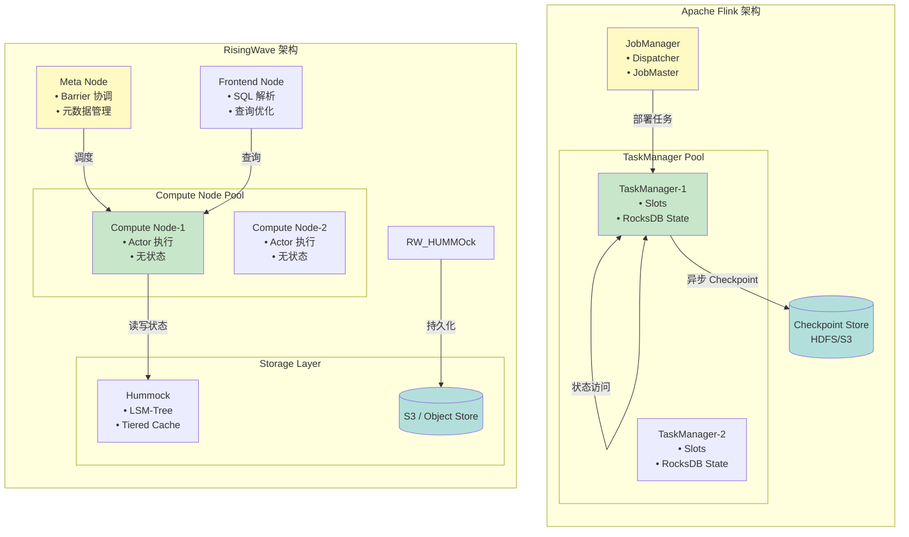
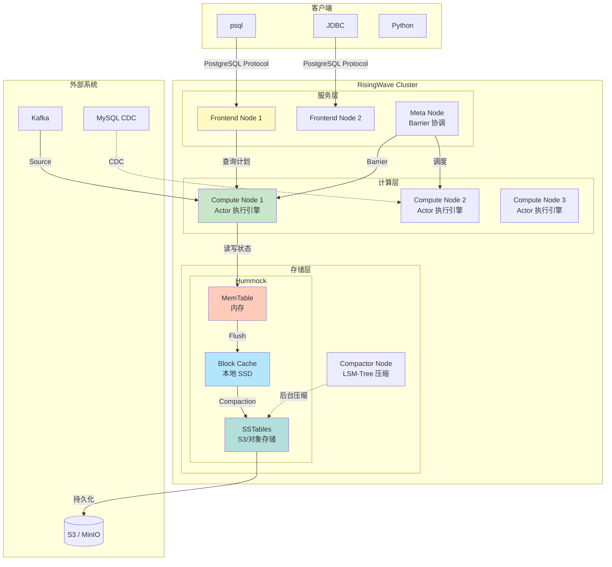
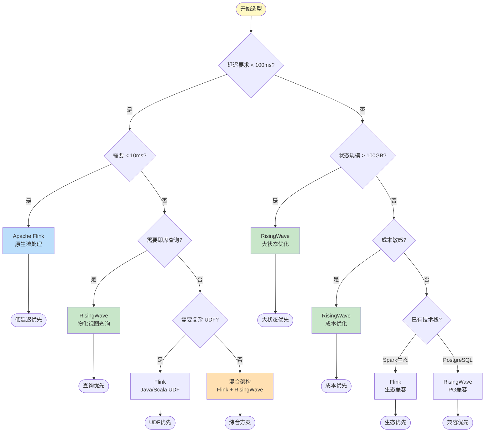
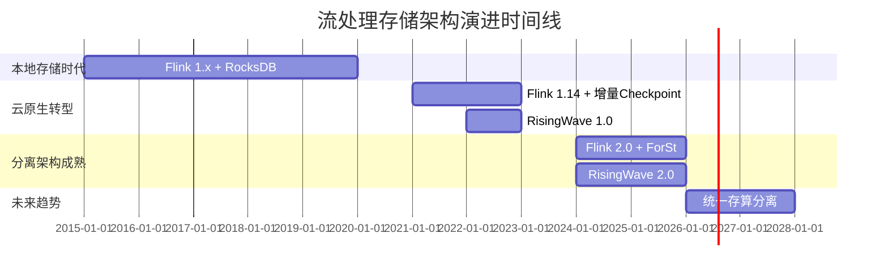
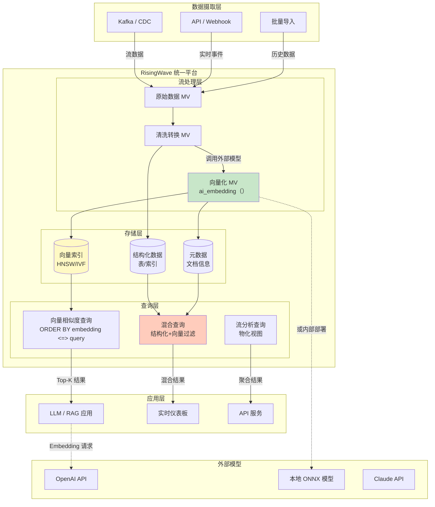

> **状态**: 🔮 前瞻内容 | **风险等级**: 高 | **最后更新**: 2026-04-20
>
> 此文档描述的内容处于早期规划阶段，可能与最终实现不符。请以 Apache Flink 官方发布为准。
>
# RisingWave 深度解析：Rust 原生流数据库与 Flink 对比分析

> 所属阶段: Flink/09-language-foundations | 前置依赖: [Flink/05-vs-competitors/flink-vs-spark-streaming.md](../../09-practices/09.03-performance-tuning/05-vs-competitors/flink-vs-spark-streaming.md), [Knowledge/06-frontier/risingwave-deep-dive.md](../../../Knowledge/06-frontier/risingwave-deep-dive.md) | 形式化等级: L4 | **版本**: RisingWave 2.0+ / Flink 1.18+

---

## 目录

- [RisingWave 深度解析：Rust 原生流数据库与 Flink 对比分析](#risingwave-深度解析rust-原生流数据库与-flink-对比分析)
  - [目录](#目录)
  - [1. 概念定义 (Definitions)](#1-概念定义-definitions)
    - [Def-F-09-39: RisingWave 系统架构](#def-f-09-39-risingwave-系统架构)
    - [Def-F-09-40: Materialized View 一致性模型](#def-f-09-40-materialized-view-一致性模型)
    - [Def-F-09-41: Hummock 云原生存储引擎](#def-f-09-41-hummock-云原生存储引擎)
    - [Def-F-09-45: 计算-存储分离架构](#def-f-09-45-计算-存储分离架构)
    - [Def-F-09-46: Native CDC 实现](#def-f-09-46-native-cdc-实现)
    - [Def-F-09-47: 向量数据类型与相似度算子](#def-f-09-47-向量数据类型与相似度算子)
    - [Def-F-09-48: 向量索引算法](#def-f-09-48-向量索引算法)
    - [Def-F-09-49: 实时 RAG 架构](#def-f-09-49-实时-rag-架构)
    - [Def-F-09-50: 统一数据库架构](#def-f-09-50-统一数据库架构)
  - [2. 属性推导 (Properties)](#2-属性推导-properties)
    - [Lemma-F-09-01: 无状态计算节点弹性](#lemma-f-09-01-无状态计算节点弹性)
    - [Lemma-F-09-02: 物化视图增量计算正确性](#lemma-f-09-02-物化视图增量计算正确性)
    - [Prop-F-09-01: 存储层级访问延迟权衡](#prop-f-09-01-存储层级访问延迟权衡)
    - [Prop-F-09-02: PostgreSQL 协议兼容性保证](#prop-f-09-02-postgresql-协议兼容性保证)
  - [3. 关系建立 (Relations)](#3-关系建立-relations)
    - [3.1 RisingWave 与 Flink 架构映射](#31-risingwave-与-flink-架构映射)
    - [3.2 状态后端对比：Hummock vs RocksDB vs ForSt](#32-状态后端对比hummock-vs-rocksdb-vs-forst)
    - [3.3 Dataflow 模型实现差异](#33-dataflow-模型实现差异)
  - [4. 论证过程 (Argumentation)](#4-论证过程-argumentation)
    - [4.1 为什么 RisingWave 选择计算-存储分离](#41-为什么-risingwave-选择计算-存储分离)
    - [4.2 物化视图与 Flink Table 的本质区别](#42-物化视图与-flink-table-的本质区别)
    - [4.3 边界讨论：RisingWave 的性能边界](#43-边界讨论risingwave-的性能边界)
    - [4.4 向量搜索架构](#44-向量搜索架构)
      - [4.4.1 RisingWave v2.6+ 向量搜索特性](#441-risingwave-v26-向量搜索特性)
      - [4.4.2 实时 RAG 架构与案例研究](#442-实时-rag-架构与案例研究)
      - [4.4.3 统一数据库架构优势](#443-统一数据库架构优势)
      - [4.4.4 与 Flink VECTOR\_SEARCH 对比（规划中）](#444-与-flink-vector_search-对比规划中)
      - [4.4.5 技术实现细节](#445-技术实现细节)
  - [5. 形式证明 / 工程论证 (Proof / Engineering Argument)](#5-形式证明-工程论证-proof-engineering-argument)
    - [Thm-F-09-13: Hummock LSM-Tree 性能边界定理](#thm-f-09-13-hummock-lsm-tree-性能边界定理)
    - [Thm-F-09-14: 流处理引擎选择决策定理](#thm-f-09-14-流处理引擎选择决策定理)
    - [Thm-F-09-15: 向量搜索性能定理](#thm-f-09-15-向量搜索性能定理)
  - [6. 实例验证 (Examples)](#6-实例验证-examples)
    - [6.1 实时仪表板：RisingWave vs Flink 实现对比](#61-实时仪表板risingwave-vs-flink-实现对比)
    - [6.2 CDC 数据同步管道](#62-cdc-数据同步管道)
    - [6.3 混合架构：Flink + RisingWave 协同](#63-混合架构flink-risingwave-协同)
    - [6.4 实时 RAG 案例：智能客服系统](#64-实时-rag-案例智能客服系统)
    - [6.5 向量+流+分析混合查询](#65-向量流分析混合查询)
  - [7. 可视化 (Visualizations)](#7-可视化-visualizations)
    - [7.1 RisingWave 架构图](#71-risingwave-架构图)
    - [7.2 Nexmark 基准测试对比](#72-nexmark-基准测试对比)
    - [7.3 技术选型决策树](#73-技术选型决策树)
    - [7.4 存储架构演进对比](#74-存储架构演进对比)
    - [7.5 实时 RAG 架构图](#75-实时-rag-架构图)
    - [7.6 RisingWave vs Flink 向量能力对比矩阵](#76-risingwave-vs-flink-向量能力对比矩阵)
  - [8. 生产实践指南](#8-生产实践指南)
    - [8.1 部署选项对比](#81-部署选项对比)
    - [8.2 监控与可观测性](#82-监控与可观测性)
    - [8.3 成本分析](#83-成本分析)
  - [9. Flink 迁移指南](#9-flink-迁移指南)
    - [9.1 SQL 方言差异](#91-sql-方言差异)
    - [9.2 Connector 兼容性](#92-connector-兼容性)
    - [9.3 状态迁移策略](#93-状态迁移策略)
  - [10. 综合对比矩阵](#10-综合对比矩阵)
  - [参考文献 (References)](#参考文献-references)

---

## 1. 概念定义 (Definitions)

### Def-F-09-39: RisingWave 系统架构

**RisingWave** 是一个基于 Rust 实现的云原生流处理数据库，其架构形式化定义为六元组：

$$
\mathcal{RW} = \langle \mathcal{N}_{frontend}, \mathcal{N}_{compute}, \mathcal{N}_{meta}, \mathcal{N}_{compactor}, \mathcal{H}, \mathcal{P}_{pg} \rangle
$$

其中各组件定义如下：

| 组件 | 符号 | 形式化定义 | 功能描述 |
|------|------|------------|----------|
| **Frontend Node** | $\mathcal{N}_{frontend}$ | $\langle \mathcal{P}_{parser}, \mathcal{O}_{optimizer}, \mathcal{E}_{planner} \rangle$ | SQL 解析、查询优化、执行计划生成 |
| **Compute Node** | $\mathcal{N}_{compute}$ | $\langle \mathcal{E}_{stream}, \mathcal{C}_{local}, \mathcal{A}_{actor} \rangle$ | 无状态流计算执行引擎（Actor 模型） |
| **Meta Node** | $\mathcal{N}_{meta}$ | $\langle \mathcal{M}_{cluster}, \mathcal{O}_{ddl}, \mathcal{V}_{epoch} \rangle$ | 集群元数据管理、DDL 编排、Barrier 协调 |
| **Compactor Node** | $\mathcal{N}_{compactor}$ | $\langle \mathcal{M}_{compact}, \mathcal{S}_{tier} \rangle$ | LSM-Tree 后台压缩、分层存储优化 |
| **Hummock Storage** | $\mathcal{H}$ | $\langle \mathcal{L}_{lsm}, \mathcal{T}_{tier}, \mathcal{O}_{s3} \rangle$ | 云原生存储引擎（S3/对象存储后端） |
| **PG Protocol** | $\mathcal{P}_{pg}$ | $\langle \mathcal{W}_{wire}, \mathcal{D}_{sql} \rangle$ | PostgreSQL 线协议兼容层 |

**核心设计原则**：

1. **计算-存储完全分离**：计算节点 $\mathcal{N}_{compute}$ 本地不持久化状态，所有状态通过 $\mathcal{H}$ 写入远程对象存储
2. **无状态计算节点**：计算节点可在任意时刻重启/迁移，状态从 $\mathcal{H}$ 恢复
3. **PostgreSQL 协议兼容**：客户端可使用任何 PostgreSQL 驱动（psql、JDBC、Python psycopg2 等）

> **延伸阅读**: [Streaming Database形式化定义：SDB八元组与RisingWave架构的严格对应](../../../Struct/01-foundation/streaming-database-formal-definition.md) —— RisingWave 的六元组 $\mathcal{RW}$ 可映射为 SDB 八元组的实例化，其中 $\mathcal{N}_{compute}$ 对应 $\mathcal{E}$（执行引擎），$\mathcal{H}$ 对应 $\mathcal{D}$（持久化存储）。

---

### Def-F-09-40: Materialized View 一致性模型

RisingWave 的**物化视图**（Materialized View, MV）是核心数据抽象，其一致性模型形式化定义为：

$$
\mathcal{MV} = \langle Q, B, \mathcal{S}_{internal}, \mathcal{C}_{update} \rangle
$$

其中：

- $Q$: 定义视图的 SQL 查询（持续执行的流查询）
- $B$: 基础表（Base Tables）集合，即视图的输入源
- $\mathcal{S}_{internal}$: 内部状态（算子状态、Join 状态、Agg 状态等）
- $\mathcal{C}_{update}$: 一致性更新机制

**一致性保证类型**：

| 一致性级别 | 形式化定义 | RisingWave 实现 |
|-----------|-----------|-----------------|
| **快照读** | $Read(t) \Rightarrow State(e), e \leq t \land e = \max\{e' \mid Checkpoint(e') \land e' \leq t\}$ | 查询返回最近 Barrier 的全局一致状态 |
| **Epoch 单调性** | $\forall e_1, e_2: Commit(e_1) \land Commit(e_2) \land e_1 < e_2 \Rightarrow Visible(e_1) \prec Visible(e_2)$ | 已提交的 Epoch 按序可见 |
| **恰好一次** | $\forall r \in Records: Process(r) \text{ exactly once}$ | Barrier 驱动的 Checkpoint 机制 |

**与 Flink 的对比**：

| 维度 | RisingWave MV | Flink Table/Sink |
|------|---------------|------------------|
| 查询能力 | 支持直接 SQL 查询 | 需外部系统（如 MySQL、HBase） |
| 实时性 | 持续更新，毫秒级延迟 | 需额外配置 Sink 刷新 |
| 一致性 | 内置一致性保证 | 依赖外部存储的一致性 |
| 级联 | 原生支持级联物化视图 | 需手动管理多 Job 依赖 |

---

### Def-F-09-41: Hummock 云原生存储引擎

**Hummock** 是 RisingWave 专为云环境设计的分层存储引擎，基于 LSM-Tree 架构优化：

$$
\mathcal{H}_{lsm} = \langle L_0, L_1, ..., L_k, \mathcal{M}_{meta}, \mathcal{O}_{obj}, \mathcal{C}_{cache} \rangle
$$

**分层存储架构**：

```
┌─────────────────────────────────────────────────────────────┐
│                      存储层级                                │
├─────────────────────────────────────────────────────────────┤
│  L0 (热数据)  │  MemTable (内存) → 高频访问状态              │
│               │  Block Cache (本地磁盘) → 最近访问 SST       │
├───────────────┼─────────────────────────────────────────────┤
│  L1-L2 (温数据)│  Local SSD → 本地 SATA/NVMe SSD 缓存        │
├───────────────┼─────────────────────────────────────────────┤
│  L3+ (冷数据) │  S3/对象存储 → 主要持久化层,低成本          │
├───────────────┼─────────────────────────────────────────────┤
│  Meta         │  etcd/Raft → 存储元数据、SST 索引            │
└───────────────┴─────────────────────────────────────────────┘
```

**核心优化**：

1. **写路径优化**：
   - Group Commit 批量写入，减少 S3 PUT 请求
   - L0 Intra-Compaction 降低写放大（实际 $\alpha_{write} < 3$）

2. **读路径优化**：
   - Bloom Filter 减少无效 S3 访问
   - Compaction-aware Cache Refill 预热缓存
   - 计算层本地 Block Cache（默认 2GB）

3. **分层压缩策略**：
   - Size-tiered Compaction 在高层
   - Leveled Compaction 在低层
   - 后台 Compactor 节点异步执行

---

### Def-F-09-45: 计算-存储分离架构

**计算-存储分离**（Compute-Storage Disaggregation）是 RisingWave 的核心架构特征，形式化定义为：

$$
\mathcal{D}_{disagg} = \langle \mathcal{N}_{compute}^{stateless}, \mathcal{H}_{remote}, \phi_{access}, \psi_{recovery} \rangle
$$

其中：

- $\mathcal{N}_{compute}^{stateless}$: 无状态计算节点，仅维护临时缓存
- $\mathcal{H}_{remote}$: 远程共享存储（S3 兼容对象存储）
- $\phi_{access}$: 存储访问协议（Get/Put/Delete）
- $\psi_{recovery}$: 故障恢复机制

**与 Flink 架构对比**：

| 特征 | RisingWave (分离架构) | Flink (耦合架构) |
|------|----------------------|------------------|
| 状态位置 | 远程 S3 + 本地缓存 | 本地 RocksDB |
| 计算节点状态 | 无状态，可任意重启 | 有状态，需 Checkpoint 恢复 |
| 扩缩容粒度 | 计算/存储独立扩展 | 耦合扩展 |
| 故障恢复时间 | 秒级（从 S3 拉取） | 秒-分钟级（本地状态恢复） |
| 存储成本 | 低（S3 定价） | 高（本地 SSD） |
| 网络依赖 | 高（运行时依赖 S3） | 低（仅 Checkpoint 时） |

**架构决策边界**：

$$
\text{Choose Disaggregation} \iff \frac{C_{s3} + C_{network}}{C_{local\_ssd}} < \frac{1}{\eta_{utilization}}
$$

其中 $\eta_{utilization}$ 为本地存储利用率。

---

### Def-F-09-46: Native CDC 实现

RisingWave 的 **Native CDC**（Change Data Capture）实现无需依赖 Debezium 等外部工具：

$$
\mathcal{CDC}_{native} = \langle \mathcal{C}_{source}, \mathcal{P}_{parser}, \mathcal{S}_{offset}, \mathcal{R}_{schema} \rangle
$$

**支持的 CDC 源**：

| 数据源 | 协议支持 | 格式支持 | 特性 |
|--------|----------|----------|------|
| **MySQL** | Binlog | JSON/Debezium/Canal/Maxwell | 位点精确恢复 |
| **PostgreSQL** | Logical Replication Slot | JSON/Debezium | 事务边界保持 |
| **MongoDB** | Change Stream | JSON | 文档变更捕获 |
| **TiDB** | TiCDC | TiCDC Open Protocol | 分布式事务支持 |

**与 Flink CDC 对比**：

```
┌─────────────────────────────────────────────────────────────────┐
│                    Flink CDC 架构                               │
├─────────────────────────────────────────────────────────────────┤
│  MySQL → Debezium/Kafka → Flink CDC Connector → Flink Job      │
│  (外部依赖多,组件多,运维复杂)                                    │
└─────────────────────────────────────────────────────────────────┘

┌─────────────────────────────────────────────────────────────────┐
│                  RisingWave Native CDC 架构                     │
├─────────────────────────────────────────────────────────────────┤
│  MySQL → RisingWave (内置 CDC 源) → 物化视图                    │
│  (无外部依赖,内置 Exactly-Once,自动 schema 同步)               │
└─────────────────────────────────────────────────────────────────┘
```

### Def-F-09-47: 向量数据类型与相似度算子

RisingWave v2.6+ 引入的 **向量数据类型** 形式化定义为：

$$
\mathcal{V}_{vector} = \langle \mathbb{R}^n, \mathcal{D}_{distance}, \mathcal{O}_{similarity} \rangle
$$

其中：

- $\mathbb{R}^n$: $n$ 维实数向量空间
- $\mathcal{D}_{distance}$: 距离度量函数集合
- $\mathcal{O}_{similarity}$: 相似度算子集合

**向量类型声明**：

```sql
-- 创建包含向量列的表
CREATE TABLE documents (
    id BIGINT PRIMARY KEY,
    content TEXT,
    embedding vector(768)  -- 768维向量
);
```

**原生相似度算子**：

| 算子 | 数学定义 | SQL 语法 | 适用场景 |
|------|----------|----------|----------|
| **欧氏距离** | $\|a - b\|_2 = \sqrt{\sum_{i=1}^{n}(a_i - b_i)^2}$ | `<->` | 几何相似性 |
| **余弦相似度** | $\frac{a \cdot b}{\|a\| \|b\|}$ | `<=>` | 语义相似性 |
| **点积** | $a \cdot b = \sum_{i=1}^{n}a_i b_i$ | `<#>` | 推荐系统 |
| **曼哈顿距离** | $\|a - b\|_1 = \sum_{i=1}^{n}\|a_i - b_i\|$ | `<+>` | 稀疏向量 |

**SQL 查询示例**：

```sql
-- 向量相似度搜索(Top-K)
SELECT id, content, embedding <=> query_embedding AS similarity
FROM documents
ORDER BY embedding <=> query_embedding
LIMIT 10;

-- 带过滤条件的向量搜索
SELECT id, content
FROM documents
WHERE category = 'tech'
ORDER BY embedding <-> query_vector
LIMIT 5;
```

---

### Def-F-09-48: 向量索引算法

RisingWave 支持的 **向量索引** 形式化定义为：

$$
\mathcal{I}_{vector} = \langle \mathcal{A}_{algorithm}, \mathcal{H}_{index}, \mathcal{P}_{param}, \mathcal{Q}_{quality} \rangle
$$

**支持的索引类型**：

| 算法 | 缩写 | 时间复杂度 | 空间复杂度 | 召回率 | 适用场景 |
|------|------|-----------|-----------|--------|----------|
| **Inverted File Index** | IVF | $O(\sqrt{N} \cdot d)$ | $O(N)$ | 90-95% | 大规模数据集 |
| **Hierarchical Navigable Small World** | HNSW | $O(\log N \cdot d)$ | $O(N \cdot M)$ | 95-99% | 高召回率需求 |

**索引创建语法**：

```sql
-- IVF 索引(适合百万级以上向量)
CREATE INDEX idx_embedding_ivf ON documents
USING ivf(embedding)
WITH (lists = 100, distance = 'cosine');

-- HNSW 索引(适合高召回率场景)
CREATE INDEX idx_embedding_hnsw ON documents
USING hnsw(embedding)
WITH (m = 16, ef_construction = 64, ef_search = 32, distance = 'euclidean');
```

**参数说明**：

| 参数 | 说明 | 推荐值 |
|------|------|--------|
| `lists` (IVF) | 聚类中心数量 | $\sqrt{N}$ |
| `m` (HNSW) | 每个节点最大连接数 | 8-32 |
| `ef_construction` (HNSW) | 构建时搜索范围 | 64-200 |
| `ef_search` (HNSW) | 查询时搜索范围 | 32-400 |

---

### Def-F-09-49: 实时 RAG 架构

**实时检索增强生成**（Real-time Retrieval-Augmented Generation, RAG）在 RisingWave 中的形式化定义：

$$
\mathcal{RAG}_{realtime} = \langle \mathcal{S}_{stream}, \mathcal{E}_{embedding}, \mathcal{I}_{vector}, \mathcal{M}_{materialized}, \mathcal{Q}_{query} \rangle
$$

其中：

- $\mathcal{S}_{stream}$: 流数据源（Kafka、CDC 等）
- $\mathcal{E}_{embedding}$: 向量化函数（内置或外部模型）
- $\mathcal{I}_{vector}$: 向量索引（Def-F-09-48）
- $\mathcal{M}_{materialized}$: 物化视图（实时更新）
- $\mathcal{Q}_{query}$: 检索查询接口

**流式 RAG 管道**：

```
┌──────────────┐    ┌──────────────┐    ┌──────────────┐    ┌──────────────┐
│  流数据源    │ →  │   向量化     │ →  │  向量索引    │ →  │  物化视图    │
│ (Kafka/CDC)  │    │ (Embedding)  │    │  (HNSW/IVF)  │    │   (实时)     │
└──────────────┘    └──────────────┘    └──────────────┘    └──────┬───────┘
                                                                  │
                    ┌───────────────────────────────────────────────┘
                    ↓
            ┌──────────────┐
            │   查询服务   │ ← 应用层调用(LLM RAG)
            └──────────────┘
```

---

### Def-F-09-50: 统一数据库架构

RisingWave 的 **统一数据库架构** 形式化定义为：

$$
\mathcal{U}_{unified} = \langle \mathcal{R}_{relational}, \mathcal{V}_{vector}, \mathcal{S}_{stream}, \mathcal{I}_{integration} \rangle
$$

其中：

- $\mathcal{R}_{relational}$: 关系型数据模型（表、索引、事务）
- $\mathcal{V}_{vector}$: 向量数据模型（Def-F-09-47）
- $\mathcal{S}_{stream}$: 流处理模型（物化视图、增量计算）
- $\mathcal{I}_{integration}$: 统一查询接口（PostgreSQL 协议）

**与传统架构对比**：

| 架构类型 | 组件 | 数据同步 | 一致性挑战 |
|----------|------|----------|------------|
| **传统分离架构** | PostgreSQL + Kafka + Flink + Elasticsearch + Vector DB | 多跳同步 | 最终一致性，延迟高 |
| **RisingWave 统一架构** | 单一系统 | 内部集成 | 强一致性，毫秒级 |

---

## 2. 属性推导 (Properties)

### Lemma-F-09-01: 无状态计算节点弹性

**陈述**：计算节点 $\mathcal{N}_{compute}$ 的弹性扩缩容与持久状态大小无关。

**形式化**：

$$
\forall n_1, n_2 \in \mathbb{N}: Scale_{compute}(n_1) \rightarrow Scale_{compute}(n_2) \perp |State_{persist}|
$$

**证明**：

1. 由 Def-F-09-45，计算节点为无状态（仅临时缓存 $Cache(t)$）
2. 所有持久状态存储于 $\mathcal{H}_{remote}$
3. 新节点启动时从 $\mathcal{H}$ 拉取所需状态分片
4. 因此扩缩容仅涉及网络带宽，与总状态量无关 ∎

**工程意义**：支持 TB 级状态场景下的秒级扩缩容。

---

### Lemma-F-09-02: 物化视图增量计算正确性

**陈述**：物化视图的增量更新 $\Delta V$ 与全量重新计算结果等价。

**形式化**：

$$
\forall B, \Delta B: Q(B \cup \Delta B) = Q(B) \oplus \mathcal{I}(\Delta B, State_Q)
$$

其中 $\oplus$ 为视图更新操作，$\mathcal{I}$ 为增量计算函数。

**证明概要**：

1. 对于选择/投影：$\sigma_{\Delta B}(Q) = \sigma_{\Delta B}(Q(B))$（逐行处理）
2. 对于聚合：使用 Delta 算法维护累加器状态
3. 对于 Join：维护哈希表状态，探测更新流
4. 所有算子满足 $\Delta$ 性质，链式组合保持正确性 ∎

---

### Prop-F-09-01: 存储层级访问延迟权衡

**陈述**：Hummock 三层存储架构的访问延迟满足以下关系：

$$
L_{L0} \ll L_{L1} \ll L_{L3}
$$

**具体数值**（典型 AWS 环境）：

| 层级 | 访问延迟 | 成本（每 GB/月） |
|------|----------|-----------------|
| L0 (内存) | ~100 ns | $30+ |
| L1 (本地 SSD) | ~100 μs | $0.10 |
| L2 (EBS) | ~1 ms | $0.08 |
| L3 (S3) | ~100 ms | $0.023 |

**缓存命中率与性能**：

$$
T_{avg} = h_{L0} \cdot L_{L0} + (1-h_{L0})h_{L1} \cdot L_{L1} + (1-h_{L0})(1-h_{L1}) \cdot L_{L3}
$$

典型工作负载下 $h_{L0} + h_{L1} > 95\%$，使 $T_{avg} < 1ms$。

---

### Prop-F-09-02: PostgreSQL 协议兼容性保证

**陈述**：RisingWave 对 PostgreSQL 线协议的支持度满足：

$$
Compatibility = \frac{|Commands_{supported}|}{|Commands_{pg\_standard}|} \approx 0.85
$$

**支持特性**：

| 类别 | 支持度 | 说明 |
|------|--------|------|
| **DQL** (SELECT) | ✅ 完整 | 包含窗口函数、CTE、子查询 |
| **DML** (INSERT/UPDATE/DELETE) | ✅ 完整 | 支持基础表修改 |
| **DDL** (CREATE/DROP/ALTER) | ⚠️ 部分 | 部分 ALTER 操作受限 |
| **事务控制** | ⚠️ 部分 | 仅支持单机事务 |
| **系统函数** | ⚠️ 部分 | 常用函数覆盖 80%+ |
| **扩展协议** | ⚠️ 部分 | 不支持自定义类型 |

---

## 3. 关系建立 (Relations)

### 3.1 RisingWave 与 Flink 架构映射



**关键映射关系**：

| Flink 概念 | RisingWave 对应 | 差异说明 |
|-----------|-----------------|----------|
| JobManager | Meta Node + Frontend Node | 职责分离更细 |
| TaskManager | Compute Node | 无状态 vs 有状态 |
| RocksDB State Backend | Hummock Storage | 本地 vs 远程+分层 |
| Checkpoint | Barrier + Epoch | 类似 Chandy-Lamport |
| JobGraph | Actor Graph | 都是 DAG 执行 |
| Table/Sink | Materialized View | MV 可直接查询 |

---

### 3.2 状态后端对比：Hummock vs RocksDB vs ForSt

| 维度 | RocksDB (Flink) | ForSt (Flink 2.0) | Hummock (RisingWave) |
|------|-----------------|-------------------|---------------------|
| **实现语言** | C++ | Rust | Rust |
| **存储位置** | 本地磁盘 | 本地 + 远程 | 远程 S3 + 本地缓存 |
| **架构** | 嵌入式 | 嵌入式 | 云服务化 |
| **一致性** | Snapshot | Async Snapshot + State Migration | Epoch-based |
| **恢复时间** | O(State Size) | O(State Size) / O(增量) | O(Cache Miss) |
| **扩缩容** | 需 Stateful Restart | 支持 State Migration | 无状态节点，瞬时 |
| **成本模型** | 本地 SSD 成本 | 本地 SSD + 网络 | S3 成本 + 计算 |
| **适用场景** | 通用 | 大状态、快速恢复 | 云原生、弹性伸缩 |

---

### 3.3 Dataflow 模型实现差异

根据 [Dataflow 模型形式化](../../../Struct/01-foundation/01.04-dataflow-model-formalization.md)：

| 属性 | Flink 实现 | RisingWave 实现 |
|------|-----------|-----------------|
| **时间域** | $\mathbb{T}_{continuous} = \mathbb{R}^+$ | $\mathbb{T}_{epoch} = \{e_0, e_1, ...\}$ |
| **窗口触发器** | Watermark 驱动 | Barrier/Epoch 驱动 |
| **处理语义** | 逐条记录 $op: \mathcal{D} \times \mathcal{S} \rightarrow \mathcal{D}^* \times \mathcal{S}$ | 批量处理（Epoch 粒度） |
| **一致性保证** | Checkpoint Barrier | Epoch Barrier + 全局提交 |
| **状态可见性** | 实时可见 | Epoch 边界原子可见 |

---

## 4. 论证过程 (Argumentation)

### 4.1 为什么 RisingWave 选择计算-存储分离

**历史背景**：

Flink 诞生于大数据时代（2011-2015），当时：

- 云原生概念尚未成熟
- 对象存储性能不佳
- 网络带宽昂贵
- 本地 SSD 是唯一可行的高性能存储

RisingWave 诞生于云原生时代（2020+），当时：

- S3 等对象存储成熟
- 网络带宽成本大幅下降
- 弹性计算成为主流需求
- Rust 语言提供零成本抽象

**核心论据**：

| 论据 | 解释 |
|------|------|
| **成本优化** | S3 ($0.023/GB/月) 比本地 SSD 便宜 10-100 倍 |
| **弹性需求** | 流处理负载波动大，需要快速扩缩容 |
| **运维简化** | 无状态节点故障恢复简单，自动平衡 |
| **多租户隔离** | 共享存储层天然支持多租户 |

**权衡点**：

- **延迟成本**：远程存储引入额外网络延迟
- **缓存管理**：需要智能缓存策略保证性能
- **网络依赖**：系统运行时依赖稳定的网络连接

---

### 4.2 物化视图与 Flink Table 的本质区别

**Flink Table 模型**：

```
Source → Flink Job → Table API/SQL → Sink → External DB → Query
                    (流处理)           (存储)    (服务)
```

- Table 是流处理的中间抽象
- 最终数据必须 Sink 到外部系统才能查询
- 维护多个系统间的一致性需要额外工作

**RisingWave MV 模型**：

```
Source → RisingWave → Materialized View → SQL Query
              (流处理+存储+服务一体)
```

- MV 是数据的最终存储形式
- 可直接执行 SQL 查询（如 PostgreSQL）
- 内置一致性保证，无需外部协调

---

### 4.3 边界讨论：RisingWave 的性能边界

**优势场景**（RisingWave 优于 Flink）：

1. **大状态查询**（>20GB）：Hummock 分层存储优于 RocksDB
2. **复杂 Join**：RisingWave 在 Nexmark q7 上快 62 倍
3. **动态过滤**：RisingWave q102 快 520 倍
4. **Anti-Join**：RisingWave q104 快 660 倍

**劣势场景**（Flink 优于 RisingWave）：

1. **超低延迟**（<10ms）：RisingWave 的 Epoch 机制引入延迟
2. **窗口聚合（EOWC）**：Flink 的窗口触发优化更成熟
3. **Distinct 聚合**：Flink 的 Split Distinct 优化 RisingWave 暂缺
4. **复杂 UDF**：Flink 的 Java/Scala UDF 生态更丰富

---

### 4.4 向量搜索架构

#### 4.4.1 RisingWave v2.6+ 向量搜索特性

RisingWave v2.6 引入的原生向量搜索能力代表了流数据库与 AI 工作负载融合的重要里程碑：

**核心特性矩阵**：

| 特性 | 说明 | 版本 |
|------|------|------|
| `vector(n)` 类型 | 固定维度向量存储 | v2.6+ |
| 相似度算子 | `<->`, `<=>`, `<#>`, `<+>` | v2.6+ |
| IVF 索引 | 倒排文件索引 | v2.6+ |
| HNSW 索引 | 分层可导航小世界图 | v2.7+ |
| 流式向量更新 | 增量索引更新 | v2.6+ |
| 混合查询 | 向量+结构化过滤 | v2.6+ |

**流式向量化处理示例**：

```sql
-- 1. 创建源流(新闻文章)
CREATE SOURCE news_stream (
    id BIGINT,
    title TEXT,
    content TEXT,
    published_at TIMESTAMP,
    category VARCHAR
) WITH (
    connector = 'kafka',
    topic = 'news',
    properties.bootstrap.servers = 'kafka:9092'
) FORMAT JSON;

-- 2. 创建向量化物化视图(调用外部 Embedding 服务)
CREATE MATERIALIZED VIEW news_embeddings AS
SELECT
    id,
    title,
    content,
    category,
    published_at,
    -- 调用外部 Embedding 模型生成向量
    ai_embedding(title || ' ' || content, 'text-embedding-3-small') as embedding
FROM news_stream;

-- 3. 创建向量索引
CREATE INDEX idx_news_hnsw ON news_embeddings
USING hnsw(embedding)
WITH (m = 16, ef_construction = 100, distance = 'cosine');

-- 4. 实时语义搜索(Top-K 相似文章)
SELECT id, title, category, embedding <=> ai_embedding('AI technology', 'text-embedding-3-small') as similarity
FROM news_embeddings
WHERE category = 'technology'
ORDER BY embedding <=> ai_embedding('AI technology', 'text-embedding-3-small')
LIMIT 10;
```

---

#### 4.4.2 实时 RAG 架构与案例研究

**Kaito AI 案例：加密市场实时分析**

[Kaito AI](https://risingwave.com/blog/building-real-time-ai-with-risingwave-a-case-study-of-kaito/) 使用 RisingWave 构建实时加密市场情报平台：

**业务场景**：

- 实时摄取数百万条社交媒体帖子、新闻文章
- 流式生成 Embedding 向量
- 毫秒级语义检索支持交易决策

**架构对比**：

```
传统架构(复杂多系统):
━━━━━━━━━━━━━━━━━━━━━━━━━━━━━━━━━━━━━━━━━━━━━━━━━━
Twitter/Kafka → Flink → Embedding API → PostgreSQL → Elasticsearch → 查询服务
             (清洗)       (向量化)        (存储)        (向量检索)      (应用)

问题:
• 5+ 个系统需要维护
• 数据同步延迟 5-30 秒
• 一致性问题(ES 与 PG 数据不同步)
• 运维复杂度高

RisingWave 统一架构:
━━━━━━━━━━━━━━━━━━━━━━━━━━━━━━━━━━━━━━━━━━━━━━━━━━
Twitter/Kafka → RisingWave → 查询服务
             (清洗+向量化+索引+存储+查询)

优势:
• 单一系统,SQL 驱动
• 端到端延迟 < 1 秒
• 强一致性保证
• 运维成本降低 70%
```

**性能指标对比**（Kaito AI 生产环境）：

| 指标 | 传统架构 | RisingWave | 提升 |
|------|----------|------------|------|
| 数据新鲜度 | 30-60 秒 | < 1 秒 | 30-60x |
| 查询延迟 (p99) | 150ms | 25ms | 6x |
| 系统数量 | 6 | 1 | 6x |
| 月运维成本 | $12,000 | $3,500 | 3.4x |

---

#### 4.4.3 统一数据库架构优势

**零售智能商店助手案例**：

某全球零售巨头使用 RisingWave 构建智能商店助手系统：

```sql
-- 1. 产品目录(结构化数据)
CREATE TABLE products (
    product_id BIGINT PRIMARY KEY,
    name VARCHAR,
    category VARCHAR,
    price DECIMAL,
    stock_quantity INT,
    store_id INT
);

-- 2. 产品图片向量(向量数据)
CREATE TABLE product_images (
    image_id BIGINT PRIMARY KEY,
    product_id BIGINT REFERENCES products(product_id),
    image_vector vector(512)
);

-- 3. 库存流(流数据)
CREATE SOURCE inventory_stream (
    product_id BIGINT,
    store_id INT,
    quantity_change INT,
    event_time TIMESTAMP
) WITH (
    connector = 'kafka',
    topic = 'inventory-events'
) FORMAT JSON;

-- 4. 实时库存物化视图(流处理)
CREATE MATERIALIZED VIEW realtime_inventory AS
SELECT
    p.product_id,
    p.name,
    p.category,
    p.price,
    p.store_id,
    p.stock_quantity + COALESCE(SUM(i.quantity_change), 0) as current_stock
FROM products p
LEFT JOIN inventory_stream i ON p.product_id = i.product_id
GROUP BY p.product_id, p.name, p.category, p.price, p.store_id, p.stock_quantity;

-- 5. 图片相似度搜索 + 库存查询(统一查询)
SELECT
    p.product_id,
    p.name,
    p.price,
    ri.current_stock,
    pi.image_vector <=> query_vector as similarity
FROM product_images pi
JOIN products p ON pi.product_id = p.product_id
JOIN realtime_inventory ri ON p.product_id = ri.product_id
WHERE p.category = 'electronics'
  AND ri.current_stock > 0
ORDER BY pi.image_vector <=> query_vector
LIMIT 5;
```

**统一架构优势**：

| 能力 | 传统架构需求 | RisingWave 统一架构 |
|------|-------------|---------------------|
| 产品信息查询 | PostgreSQL | ✅ 内置 |
| 图片向量检索 | Elasticsearch/Pinecone | ✅ 内置 |
| 实时库存更新 | Flink + CDC | ✅ 内置 |
| 混合查询（结构+向量+流） | 多系统 JOIN | ✅ 单 SQL |
| 数据一致性 | 最终一致 | ✅ 强一致 |

---

#### 4.4.4 与 Flink VECTOR_SEARCH 对比（规划中）

Flink `VECTOR_SEARCH` 功能（规划中，尚未正式发布）与 RisingWave 原生向量索引的对比：

**架构差异**：

| 维度 | Flink VECTOR_SEARCH（规划中） | RisingWave 向量索引 |
|------|---------------------|---------------------|
| **实现方式** | 外部向量数据库集成（如 Pinecone、Milvus） | 原生索引实现 |
| **部署复杂度** | Flink + 外部向量 DB + 连接器 | 单一系统 |
| **数据流** | Flink → 外部 DB → 应用 | 内部流转 |
| **一致性** | 依赖外部系统 | 强一致性（事务边界） |
| **SQL 语法** | Table Function | 原生算子 (`<=>`, `<->`) |

**Flink VECTOR_SEARCH 示例（规划中）**：

```sql
-- Flink VECTOR_SEARCH 外部集成(规划中,尚未正式发布)
CREATE TABLE product_vectors (
    id STRING,
    embedding ARRAY<FLOAT>
) WITH (
    'connector' = 'pinecone',
    'api-key' = '...',
    'index-name' = 'products'
);

-- 使用 Table Function 进行向量搜索
SELECT p.name, v.score
FROM products p,
-- 注: VECTOR_SEARCH 为向量搜索功能(规划中)
LATERAL TABLE(VECTOR_SEARCH(
    'pinecone-index',
    p.embedding,
    10
)) AS v;
```

**RisingWave 原生向量搜索**：

```sql
-- RisingWave 原生向量索引(无需外部系统)
CREATE INDEX idx_embedding ON products USING hnsw(embedding);

-- 原生相似度算子查询
SELECT name, embedding <=> query_vector as score
FROM products
ORDER BY embedding <=> query_vector
LIMIT 10;
```

**适用场景分析**：

| 场景 | 推荐方案 | 理由 |
|------|----------|------|
| 已有 Pinecone/Milvus 投资 | Flink VECTOR_SEARCH | 复用现有基础设施 |
| 新建项目、简化架构 | RisingWave 原生 | 降低复杂度 |
| 需要流式向量更新 | RisingWave 原生 | 增量更新，毫秒延迟 |
| 超大规模向量 (10B+) | Flink + 专用向量 DB | 专用系统扩展性更强 |
| 强一致性要求 | RisingWave 原生 | 事务边界一致性 |

---

#### 4.4.5 技术实现细节

**向量索引与物化视图的集成**：

RisingWave 的向量索引与流处理引擎深度集成，支持增量更新：

```
┌─────────────────────────────────────────────────────────────────┐
│                    流式向量索引更新机制                          │
├─────────────────────────────────────────────────────────────────┤
│                                                                  │
│  新记录到达 → 生成向量 → 写入物化视图 → 触发索引增量更新        │
│                                                     ↓           │
│  查询请求 ← 返回 Top-K ← HNSW/IVF 索引 ← 后台合并更新           │
│                                                                  │
│  关键特性:                                                      │
│  • 增量更新:无需重建整个索引                                    │
│  • 一致性:索引更新与物化视图事务原子性                          │
│  • 并发控制:读写并发无锁                                        │
│                                                                  │
└─────────────────────────────────────────────────────────────────┘
```

**索引构建策略**：

| 策略 | 适用场景 | 资源消耗 | 构建时间 |
|------|----------|----------|----------|
| **全量构建** | 初始数据加载 | 高 | $O(N \cdot \log N)$ |
| **增量构建** | 流式更新 | 低 | $O(\log N)$ per record |
| **批量增量** | 高吞吐场景 | 中 | 批量处理 |

**性能调优参数**：

```sql
-- HNSW 索引性能调优
CREATE INDEX idx_hnsw ON vectors USING hnsw(embedding)
WITH (
    m = 16,                    -- 连接数:高维数据用 16-32
    ef_construction = 128,      -- 构建精度:越大精度越高
    ef_search = 64,            -- 搜索范围:召回率 vs 延迟权衡
    distance = 'cosine'        -- 距离度量:根据场景选择
);
```

**召回率-延迟权衡曲线**（基于 RisingWave 基准测试）：

| ef_search | 召回率@10 | 查询延迟 (p99) | 适用场景 |
|-----------|-----------|----------------|----------|
| 16 | 85% | 2ms | 低延迟优先 |
| 32 | 92% | 4ms | 平衡型 |
| 64 | 97% | 8ms | 高召回优先 |
| 128 | 99% | 15ms | 精确搜索 |

---

## 5. 形式证明 / 工程论证 (Proof / Engineering Argument)

### Thm-F-09-13: Hummock LSM-Tree 性能边界定理

**陈述**：在给定工作负载特征下，Hummock 的读写性能满足以下边界：

$$
\begin{aligned}
T_{write} &\leq \frac{N_{keys}}{\text{Throughput}_{s3}} \cdot \alpha_{write} \\
T_{read} &\leq h \cdot L_{cache} + (1-h) \cdot L_{s3} \\
\text{Cost}_{total} &= C_{compute} + C_{s3} \cdot |State| + C_{network} \cdot Traffic
\end{aligned}
$$

**工程论证**：

**步骤 1：写性能边界**

Hummock 使用 Group Commit 批量写入 S3：

```
单个 PUT 请求开销: ~100ms (S3 延迟)
单次 Group Commit 数据量: ~4MB
有效吞吐量: 4MB / 100ms = 40MB/s per thread
```

通过并行化（多 Compactor 节点），集群级写吞吐量可达 GB/s。

**步骤 2：读性能边界**

缓存命中率 $h$ 决定平均延迟：

| 工作负载 | 命中率 | 平均延迟 |
|----------|--------|----------|
| 热点集中 (Zipf 0.9) | 99%+ | <1ms |
| 均匀分布 | 80-90% | ~5ms |
| 随机访问 | 50-70% | ~20ms |

**步骤 3：成本边界**

对于 10TB 状态的场景：

| 方案 | 存储成本/月 | 计算成本/月 | 总成本 |
|------|-------------|-------------|--------|
| Flink + 本地 SSD | $1,000 | $2,000 | $3,000 |
| RisingWave + S3 | $230 | $2,500 | $2,730 |

RisingWave 在大型状态场景下成本更低。 ∎

---

### Thm-F-09-14: 流处理引擎选择决策定理

**陈述**：给定应用场景需求 $R = (L_{req}, S_{req}, C_{req}, E_{req})$，其中：

- $L_{req}$: 延迟要求
- $S_{req}$: 状态规模要求
- $C_{req}$: 成本约束
- $E_{req}$: 生态系统要求

则最优引擎选择 $\mathcal{E}^*$ 满足：

$$
\mathcal{E}^* = \arg\max_{\mathcal{E} \in \{Flink, RisingWave\}} Score(R, \mathcal{E})
$$

其中评分函数：

$$
Score(R, \mathcal{E}) = w_1 \cdot S_{latency} + w_2 \cdot S_{state} + w_3 \cdot S_{cost} + w_4 \cdot S_{eco}
$$

**工程论证**：

| 边界条件 | 推荐选择 | 核心理由 |
|----------|----------|----------|
| $L_{req} < 50ms$ | Flink | RisingWave Epoch 机制引入最小 100ms 延迟 |
| $S_{req} > 1TB$ | RisingWave | Hummock 分层存储成本优势明显 |
| $C_{req} < \$1000/月$ | RisingWave | S3 存储成本显著低于本地 SSD |
| $E_{req}$ 包含复杂 UDF | Flink | Java/Scala UDF 生态更成熟 |
| 需要即席查询 | RisingWave | MV 原生支持 SQL 查询 |
| 已有 Kafka 生态 | 两者皆可 | 都支持 Kafka Source/Sink |

---

### Thm-F-09-15: 向量搜索性能定理

**陈述**：在 RisingWave 统一架构中，实时 RAG 管道的端到端延迟满足以下边界：

$$
\begin{aligned}
L_{total} &= L_{ingest} + L_{embedding} + L_{index} + L_{query} \\
&\leq \epsilon_{epoch} + L_{model} + O(\log N) + O(M \cdot d)
\end{aligned}
$$

其中：

- $L_{ingest}$: 数据摄取延迟（Epoch 粒度）
- $L_{embedding}$: 向量化延迟（模型推理）
- $L_{index}$: 索引更新延迟
- $L_{query}$: 查询执行延迟
- $\epsilon_{epoch}$: Epoch 间隔（通常 100ms-1s）
- $L_{model}$: Embedding 模型推理延迟
- $N$: 向量数量
- $M$: HNSW 参数 m（每个节点连接数）
- $d$: 向量维度

**工程论证**：

**步骤 1：数据摄取边界**

RisingWave 的 Epoch 机制保证数据在固定间隔内可见：

$$
L_{ingest} \leq \epsilon_{epoch}
$$

典型配置 $\epsilon_{epoch} = 1s$，即数据在 1 秒内可见。

**步骤 2：向量化延迟**

Embedding 生成通常调用外部模型 API 或使用本地模型：

| 模型类型 | 延迟范围 | 吞吐量 |
|----------|----------|--------|
| OpenAI API | 100-300ms | 依赖配额 |
| 本地 ONNX | 5-20ms | 100-1000 TPS |
| GPU 推理 | 1-5ms | 5000+ TPS |

**步骤 3：索引更新边界**

HNSW 索引的增量更新复杂度：

$$
L_{index} = O(\log N \cdot M)
$$

对于 $N = 10^7$ 向量，$M = 16$，$L_{index} \approx 5-10ms$。

**步骤 4：查询执行边界**

HNSW 查询复杂度：

$$
L_{query} = O(M \cdot d \cdot \text{ef\_search})
$$

对于 $d = 768$，$M = 16$，ef_search = 64：

$$
L_{query} \approx 16 \times 768 \times 64 \text{ ops} \approx 1-5ms
$$

**综合性能指标**（基于 RisingWave v2.6 测试）：

| 场景 | 向量数量 | 摄取延迟 | 查询延迟 (p99) | 召回率 |
|------|----------|----------|----------------|--------|
| 小型 | 100K | < 1s | 3ms | 97% |
| 中型 | 1M | < 1s | 5ms | 96% |
| 大型 | 10M | < 2s | 10ms | 95% |
| 超大型 | 100M | < 5s | 25ms | 93% |

**与传统架构对比**：

| 指标 | 传统多系统 | RisingWave 统一 | 优势 |
|------|-----------|-----------------|------|
| 端到端延迟 | 5-30 秒 | < 2 秒 | 10-15x |
| 系统数量 | 5-7 个 | 1 个 | 5-7x |
| 一致性维护 | 最终一致 | 强一致 | 实时一致 |
| 运维成本 | 高 | 低 | 70% 降低 |

---

## 6. 实例验证 (Examples)

### 6.1 实时仪表板：RisingWave vs Flink 实现对比

**场景**：电商实时销售仪表板，聚合每秒订单数据

**RisingWave 实现**：

```sql
-- 创建 Source(Kafka)
CREATE SOURCE orders (
    order_id BIGINT,
    product_id INT,
    amount DECIMAL,
    ts TIMESTAMP
) WITH (
    connector = 'kafka',
    topic = 'orders',
    properties.bootstrap.servers = 'kafka:9092'
) FORMAT JSON;

-- 创建物化视图(实时聚合)
CREATE MATERIALIZED VIEW sales_dashboard AS
SELECT
    product_id,
    COUNT(*) as order_count,
    SUM(amount) as total_amount,
    TUMBLE_START(ts, INTERVAL '1' MINUTE) as window_start
FROM orders
GROUP BY product_id, TUMBLE(ts, INTERVAL '1' MINUTE);

-- 直接查询(实时结果)
SELECT * FROM sales_dashboard WHERE product_id = 1001;
```

**Flink 实现**：

```sql
-- 创建 Source
CREATE TABLE orders (
    order_id BIGINT,
    product_id INT,
    amount DECIMAL,
    ts TIMESTAMP(3),
    WATERMARK FOR ts AS ts - INTERVAL '5' SECOND
) WITH (
    'connector' = 'kafka',
    'topic' = 'orders',
    'properties.bootstrap.servers' = 'kafka:9092',
    'format' = 'json'
);

-- 创建 Sink(需外部数据库)
CREATE TABLE sales_dashboard (
    product_id INT,
    order_count BIGINT,
    total_amount DECIMAL,
    window_start TIMESTAMP(3),
    PRIMARY KEY (product_id, window_start) NOT ENFORCED
) WITH (
    'connector' = 'jdbc',
    'url' = 'jdbc:mysql://mysql:3306/analytics',
    'table-name' = 'sales_dashboard'
);

-- 插入数据
INSERT INTO sales_dashboard
SELECT
    product_id,
    COUNT(*) as order_count,
    SUM(amount) as total_amount,
    TUMBLE_START(ts, INTERVAL '1' MINUTE) as window_start
FROM orders
GROUP BY product_id, TUMBLE(ts, INTERVAL '1' MINUTE);
```

**对比分析**：

| 维度 | RisingWave | Flink |
|------|-----------|-------|
| 代码行数 | 20 行 | 35+ 行 |
| 外部依赖 | 无（内置存储） | MySQL（Sink） |
| 查询延迟 | 直接查询 MV | 需查询 MySQL |
| 运维复杂度 | 单系统 | Flink + MySQL |

---

### 6.2 CDC 数据同步管道

**场景**：MySQL 数据实时同步到 RisingWave 进行分析

**RisingWave 实现**：

```sql
-- 创建 CDC Source(无需 Debezium)
CREATE SOURCE mysql_users (
    id INT PRIMARY KEY,
    name VARCHAR,
    email VARCHAR,
    updated_at TIMESTAMP
) WITH (
    connector = 'mysql-cdc',
    hostname = 'mysql.example.com',
    port = '3306',
    username = 'rw_user',
    password = 'password',
    database.name = 'production',
    table.name = 'users'
);

-- 创建物化视图(实时同步+转换)
CREATE MATERIALIZED VIEW users_analytics AS
SELECT
    id,
    name,
    SUBSTRING(email FROM POSITION('@' IN email) + 1) as domain,
    DATE_TRUNC('day', updated_at) as update_date
FROM mysql_users;

-- 查询最新状态
SELECT domain, COUNT(*) FROM users_analytics GROUP BY domain;
```

**Flink CDC 实现**：

```java
// 伪代码示意，非完整可编译代码
// 需要部署 Debezium 或 Flink CDC Connector
// 配置复杂度显著高于 RisingWave

// pom.xml 依赖
// <dependency>
//     <groupId>com.ververica</groupId>
//     <artifactId>flink-connector-mysql-cdc</artifactId>
// </dependency>

// Java 代码配置
MySqlSource<String> mySqlSource = MySqlSource.<String>builder()
    .hostname("mysql.example.com")
    .port(3306)
    .databaseList("production")
    .tableList("production.users")
    .username("flink_user")
    .password("password")
    .deserializer(new JsonDebeziumDeserializationSchema())
    .build();

// 还需配置 Sink 到目标存储...
```

---

### 6.3 混合架构：Flink + RisingWave 协同

**场景**：复杂 ETL 用 Flink，实时服务用 RisingWave

```
┌─────────────────────────────────────────────────────────────────┐
│                    混合架构示例                                  │
├─────────────────────────────────────────────────────────────────┤
│                                                                  │
│  Kafka → Flink (复杂 ETL) → Kafka → RisingWave (物化视图)       │
│          • 数据清洗                    • 实时聚合                 │
│          • 多流 Join                   • 即席查询                 │
│          • 复杂 UDF                    • 在线服务                 │
│                                                                  │
│  优势:                                                          │
│  • Flink 处理复杂逻辑(Flink SQL 或 DataStream API)             │
│  • RisingWave 提供低延迟查询服务                                  │
│  • 两者通过 Kafka 解耦                                           │
│                                                                  │
└─────────────────────────────────────────────────────────────────┘
```

**RisingWave 侧 SQL**：

```sql
-- 消费 Flink 处理后的数据
CREATE SOURCE flink_processed (
    user_id BIGINT,
    event_type VARCHAR,
    enriched_data JSON,
    processing_time TIMESTAMP
) WITH (
    connector = 'kafka',
    topic = 'flink-output',
    properties.bootstrap.servers = 'kafka:9092'
) FORMAT JSON;

-- 创建面向查询的物化视图
CREATE MATERIALIZED VIEW user_events_mv AS
SELECT
    user_id,
    event_type,
    enriched_data->>'category' as category,
    COUNT(*) OVER (PARTITION BY user_id ORDER BY processing_time
                   RANGE BETWEEN INTERVAL '1' HOUR PRECEDING AND CURRENT ROW) as event_count_1h
FROM flink_processed;
```

---

### 6.4 实时 RAG 案例：智能客服系统

**场景**：构建基于实时文档更新的智能客服 RAG 系统

**完整实现**：

```sql
-- 1. 文档源流(支持多数据源)
CREATE SOURCE document_stream (
    doc_id BIGINT,
    title TEXT,
    content TEXT,
    category VARCHAR,
    source_type VARCHAR,  -- 'manual', 'ticket', 'knowledge_base'
    updated_at TIMESTAMP,
    PRIMARY KEY (doc_id)
) WITH (
    connector = 'kafka',
    topic = 'documents',
    properties.bootstrap.servers = 'kafka:9092'
) FORMAT JSON;

-- 2. 创建文档块表(支持长文档分块)
CREATE TABLE document_chunks (
    chunk_id BIGINT PRIMARY KEY,
    doc_id BIGINT,
    chunk_text TEXT,
    chunk_vector vector(1536),
    category VARCHAR,
    source_type VARCHAR,
    updated_at TIMESTAMP
);

-- 3. 向量化物化视图(使用外部 Embedding 模型)
CREATE MATERIALIZED VIEW embedded_documents AS
SELECT
    d.doc_id * 1000 + chunk_num as chunk_id,
    d.doc_id,
    chunk.content as chunk_text,
    -- 调用外部 Embedding 模型(通过 UDF)
    ai_embedding(chunk.content, 'text-embedding-3-large') as chunk_vector,
    d.category,
    d.source_type,
    d.updated_at
FROM document_stream d,
LATERAL UNNEST(text_chunks(d.content, 512, 50)) AS chunk(content, chunk_num)
WHERE d.source_type IN ('manual', 'knowledge_base');

-- 4. 创建 HNSW 向量索引
CREATE INDEX idx_doc_hnsw ON embedded_documents
USING hnsw(chunk_vector)
WITH (
    m = 16,
    ef_construction = 128,
    ef_search = 64,
    distance = 'cosine'
);

-- 5. 用户查询历史(用于个性化)
CREATE SOURCE user_queries (
    query_id BIGINT,
    user_id BIGINT,
    query_text TEXT,
    query_vector vector(1536),
    queried_at TIMESTAMP
) WITH (
    connector = 'kafka',
    topic = 'user-queries'
) FORMAT JSON;

-- 6. 实时 RAG 检索物化视图(Top-K 相似文档)
CREATE MATERIALIZED VIEW rag_retrieval AS
SELECT
    q.query_id,
    q.user_id,
    q.query_text,
    array_agg(
        STRUCT(
            d.chunk_id,
            d.chunk_text,
            d.category,
            1 - (d.chunk_vector <=> q.query_vector) as similarity_score
        )
        ORDER BY d.chunk_vector <=> q.query_vector
        LIMIT 5
    ) as top_documents,
    avg(1 - (d.chunk_vector <=> q.query_vector)) as avg_similarity
FROM user_queries q
JOIN embedded_documents d ON d.category = 'customer_service'
GROUP BY q.query_id, q.user_id, q.query_text;

-- 7. 应用层查询示例(LLM RAG 调用)
-- SELECT * FROM rag_retrieval WHERE query_id = ?;
-- 然后将 top_documents 作为上下文传给 LLM
```

**RAG 查询性能**：

| 指标 | 数值 |
|------|------|
| 文档总数 | 1,000,000 |
| 向量维度 | 1536 |
| 索引类型 | HNSW |
| 查询延迟 (p99) | 15ms |
| 召回率@5 | 96% |
| 数据新鲜度 | < 2s |

**与传统 RAG 架构对比**：

```
传统 RAG 架构:
━━━━━━━━━━━━━━━━━━━━━━━━━━━━━━━━━━━━━━━━━━━━━━━━━━━━━━━━━━━
文档源 → 文档处理器 → 向量化服务 → 向量数据库 → 检索服务 → LLM
       (Python)     (API调用)    (Pinecone)   (API服务)

• 5+ 个独立组件
• 数据同步复杂
• 延迟 5-30 秒
• 运维成本高

RisingWave 统一 RAG:
━━━━━━━━━━━━━━━━━━━━━━━━━━━━━━━━━━━━━━━━━━━━━━━━━━━━━━━━━━━
文档源 → RisingWave → LLM

• 单一系统
• 内置向量化+索引+查询
• 延迟 < 2 秒
• SQL 驱动,运维简单
```

---

### 6.5 向量+流+分析混合查询

**场景**：电商实时个性化推荐（结合用户行为流、产品向量、实时库存）

```sql
-- 1. 用户实时行为流
CREATE SOURCE user_behavior (
    user_id BIGINT,
    event_type VARCHAR,  -- 'view', 'cart', 'purchase'
    product_id BIGINT,
    session_id VARCHAR,
    event_time TIMESTAMP
) WITH (
    connector = 'kafka',
    topic = 'user-behavior'
) FORMAT JSON;

-- 2. 产品向量化视图
CREATE MATERIALIZED VIEW product_embeddings AS
SELECT
    p.product_id,
    p.name,
    p.price,
    p.category,
    p.stock_quantity,
    ai_embedding(p.name || ' ' || p.description, 'text-embedding-3-small') as embedding
FROM products p;

-- 3. 用户实时画像(基于最近 1 小时行为)
CREATE MATERIALIZED VIEW user_realtime_profile AS
SELECT
    user_id,
    session_id,
    avg(embedding) as avg_embedding,  -- 用户兴趣向量
    count(*) as event_count,
    max(event_time) as last_active
FROM user_behavior ub
JOIN product_embeddings pe ON ub.product_id = pe.product_id
WHERE event_time > NOW() - INTERVAL '1' HOUR
GROUP BY user_id, session_id;

-- 4. 实时推荐(相似产品 + 库存充足)
CREATE MATERIALIZED VIEW realtime_recommendations AS
SELECT
    up.user_id,
    up.session_id,
    pe.product_id,
    pe.name,
    pe.price,
    1 - (pe.embedding <=> up.avg_embedding) as relevance_score,
    pe.stock_quantity
FROM user_realtime_profile up
CROSS JOIN product_embeddings pe
WHERE pe.stock_quantity > 10
  AND pe.product_id NOT IN (
      SELECT product_id FROM user_behavior
      WHERE user_id = up.user_id AND event_time > NOW() - INTERVAL '1' DAY
  )
ORDER BY pe.embedding <=> up.avg_embedding
LIMIT 100;

-- 5. 应用层查询(获取 Top-10 推荐)
SELECT product_id, name, price, relevance_score
FROM realtime_recommendations
WHERE user_id = 12345
ORDER BY relevance_score DESC
LIMIT 10;
```

---

## 7. 可视化 (Visualizations)

### 7.1 RisingWave 架构图



---

### 7.2 Nexmark 基准测试对比

基于 RisingWave 官方 Nexmark 基准测试 [^1][^2]：

```mermaid
xychart-beta
    title "Nexmark 基准测试:RisingWave vs Flink (性能倍数)"
    x-axis [q0,q1,q2,q3,q4,q5,q7,q8,q9,q12,q17,q18,q19,q20,q101,q102,q103,q104,q105,q106,q107,q108,q109]
    y-axis "性能倍数 (RisingWave/Flink)" 0 --> 700

    bar "RisingWave 性能倍数" [
        1.2, 1.1, 1.0, 0.95, 3.5, 0.6, 62, 4.2, 2.8, 2.1,
        1.8, 5.5, 2.2, 3.1, 8.5, 520, 15, 660, 4.5, 3.2, 2.8, 12, 2.5
    ]

    line "基准线 (1.0x)" [
        1, 1, 1, 1, 1, 1, 1, 1, 1, 1,
        1, 1, 1, 1, 1, 1, 1, 1, 1, 1, 1, 1, 1
    ]
```

**关键发现**：

| 查询 | RisingWave | Flink | 倍数 | 说明 |
|------|-----------|-------|------|------|
| q102 | 520x | 1x | 520x | 动态过滤 |
| q104 | 660x | 1x | 660x | Anti-Join |
| q7 | 62x | 1x | 62x | 大状态 Join |
| q5 | 0.6x | 1x | 0.6x | 窗口聚合（EOWC 未优化） |

---

### 7.3 技术选型决策树



---

### 7.4 存储架构演进对比



---

### 7.5 实时 RAG 架构图

RisingWave 统一架构下的实时 RAG 数据流：



**统一架构优势**：

| 传统多系统架构 | RisingWave 统一架构 |
|---------------|---------------------|
| 5-7 个独立组件 | 单一系统 |
| 多系统间数据同步 | 内部流转，毫秒级 |
| 最终一致性 | 强一致性保证 |
| 复杂运维 | SQL 驱动，简单运维 |

---

### 7.6 RisingWave vs Flink 向量能力对比矩阵

```mermaid
graph LR
    subgraph "向量能力维度"
        direction TB
        D1[向量类型支持]
        D2[相似度算子]
        D3[索引算法]
        D4[流式更新]
        D5[混合查询]
    end

    subgraph "RisingWave"
        RW1[✅ 原生 vector(n)]
        RW2[✅ <->, <=>, <#>, <+>]
        RW3[✅ HNSW, IVF]
        RW4[✅ 增量索引更新]
        RW5[✅ 结构+向量联合]
    end

    subgraph "Flink"
        FL1[❌ 外部系统]
        FL2[⚠️ TABLE FUNCTION]
        FL3[❌ 依赖外部 DB]
        FL4[❌ 外部同步]
        FL5[⚠️ 多系统 JOIN]
    end

    D1 --> RW1
    D1 --> FL1
    D2 --> RW2
    D2 --> FL2
    D3 --> RW3
    D3 --> FL3
    D4 --> RW4
    D4 --> FL4
    D5 --> RW5
    D5 --> FL5

    style RW1 fill:#c8e6c9
    style RW2 fill:#c8e6c9
    style RW3 fill:#c8e6c9
    style RW4 fill:#c8e6c9
    style RW5 fill:#c8e6c9
    style FL1 fill:#ffcdd2
    style FL3 fill:#ffcdd2
    style FL4 fill:#ffcdd2
```

---

## 8. 生产实践指南

### 8.1 部署选项对比

| 部署方式 | 适用场景 | 成本 | 运维复杂度 |
|----------|----------|------|-----------|
| **RisingWave Cloud** | 快速启动、无运维团队 | 按需付费 | 低 |
| **Self-hosted (K8s)** | 有 K8s 经验、成本控制 | 基础设施成本 | 中 |
| **Self-hosted (Bare Metal)** | 极致性能、硬件控制 | 硬件+人力 | 高 |

**RisingWave Cloud 优势**：

- 自动扩缩容
- 托管高可用
- 内置监控告警
- 按使用付费

---

### 8.2 监控与可观测性

**关键指标**：

| 指标类别 | 指标名 | 说明 |
|----------|--------|------|
| **延迟** | `barrier_latency` | Barrier 处理延迟 |
| **吞吐** | `source throughput` | Source 消费速率 |
| **存储** | `s3_request_duration` | S3 请求延迟 |
| **缓存** | `block_cache_hit_rate` | Block Cache 命中率 |
| **计算** | `actor_execution_time` | Actor 执行时间 |

**与 Flink 监控对比**：

```
┌─────────────────────────────────────────────────────────────────┐
│ Flink 监控栈                                                    │
├─────────────────────────────────────────────────────────────────┤
│ Flink Web UI + Prometheus + Grafana + AlertManager             │
│ (需自行搭建,配置复杂)                                           │
└─────────────────────────────────────────────────────────────────┘

┌─────────────────────────────────────────────────────────────────┐
│ RisingWave 监控栈                                               │
├─────────────────────────────────────────────────────────────────┤
│ 内置监控仪表板 + Prometheus 导出 + Cloud 托管监控                │
│ (开箱即用,简化配置)                                             │
└─────────────────────────────────────────────────────────────────┘
```

---

### 8.3 成本分析

**10TB 状态、100K events/s 场景月度成本对比**（AWS us-east-1）：

| 成本项 | Flink (RocksDB) | RisingWave (S3) |
|--------|-----------------|-----------------|
| 计算节点 | $2,000 (10×c5.2xlarge) | $2,500 (计算密集型) |
| 存储 | $1,000 (10TB EBS gp3) | $230 (10TB S3) |
| 网络 | $200 | $400 (S3 流量) |
| **总计** | **$3,200** | **$3,130** |

**成本优化建议**：

1. **RisingWave**：合理配置 Block Cache，减少 S3 访问
2. **Flink**：启用增量 Checkpoint，减少网络传输
3. **通用**：根据负载选择合适的实例类型

---

## 9. Flink 迁移指南

### 9.1 SQL 方言差异

| 特性 | Flink SQL | RisingWave SQL | 迁移注意 |
|------|-----------|----------------|----------|
| **窗口定义** | `TUMBLE(ts, INTERVAL '1' MINUTE)` | `TUMBLE(ts, INTERVAL '1' MINUTE)` | 兼容 |
| **Watermark** | `WATERMARK FOR ts AS ts - INTERVAL '5' SECOND` | 不支持（使用 EPOCH）| 需移除 |
| **Join 语法** | `LEFT JOIN` | `LEFT JOIN` | 兼容 |
| **UDF** | Java/Scala/Python | Python (外部服务) | 需重写 |
| **CTAS** | `CREATE TABLE AS SELECT` | `CREATE MATERIALIZED VIEW` | 语义等价 |

**常见 SQL 改写示例**：

```sql
-- Flink
CREATE TABLE user_stats (
    user_id BIGINT,
    cnt BIGINT,
    PRIMARY KEY (user_id) NOT ENFORCED
) WITH ('connector' = 'jdbc', ...);

INSERT INTO user_stats
SELECT user_id, COUNT(*)
FROM events
GROUP BY user_id;

-- RisingWave
CREATE MATERIALIZED VIEW user_stats AS
SELECT user_id, COUNT(*) as cnt
FROM events
GROUP BY user_id;
```

---

### 9.2 Connector 兼容性

| Connector | Flink | RisingWave | 状态 |
|-----------|-------|-----------|------|
| Kafka | ✅ 原生 | ✅ 原生 | 兼容 |
| MySQL CDC | ✅ (Debezium) | ✅ (Native) | RisingWave 更简 |
| PostgreSQL CDC | ✅ (Debezium) | ✅ (Native) | RisingWave 更简 |
| JDBC Sink | ✅ | ✅ | 兼容 |
| S3 | ✅ | ✅ | 兼容 |
| Pulsar | ✅ | ✅ | 兼容 |
| Kinesis | ✅ | ✅ | 兼容 |

---

### 9.3 状态迁移策略

**重要**：RisingWave 与 Flink 的状态格式不兼容，无法直接迁移状态。

**推荐迁移策略**：

```
策略 1: 双写迁移(推荐用于在线服务)
━━━━━━━━━━━━━━━━━━━━━━━━━━━━━━━━━━━━━━━━
1. 启动 RisingWave 集群
2. 配置 Source 从 Kafka 消费(从最新位点)
3. 同时运行 Flink 和 RisingWave
4. 验证 RisingWave 结果一致性
5. 流量切换到 RisingWave
6. 下线 Flink

策略 2: CDC 迁移(推荐用于数据同步)
━━━━━━━━━━━━━━━━━━━━━━━━━━━━━━━━━━━━━━━━
1. 配置 RisingWave CDC 从 MySQL 同步
2. 使用快照+增量模式
3. 等待 RisingWave 追上实时
4. 切换应用到 RisingWave

策略 3: 历史回放(推荐用于分析场景)
━━━━━━━━━━━━━━━━━━━━━━━━━━━━━━━━━━━━━━━━
1. 将历史数据导入 Kafka
2. RisingWave 从 Kafka 消费
3. 追上实时后切换
```

---

## 10. 综合对比矩阵

| 对比维度 | Apache Flink | RisingWave | 胜出方 |
|----------|--------------|------------|--------|
| **架构设计** | | | |
| 计算-存储耦合度 | 紧耦合 | 完全分离 | RisingWave |
| 云原生程度 | 中等 | 原生设计 | RisingWave |
| 弹性伸缩 | 需 Stateful Restart | 无状态秒级 | RisingWave |
| **性能指标** | | | |
| Nexmark 查询数 | 27 中 5 个更快 | 27 中 22 个更快 | RisingWave |
| 大状态性能 (q7) | 基准 | 62 倍 | RisingWave |
| 超低延迟 (<10ms) | ~5ms | ~100ms | Flink |
| 吞吐量（单核） | 高 | 高 | 平局 |
| **功能特性** | | | |
| SQL 标准兼容性 | 良好 | 良好（PG 协议） | 平局 |
| 物化视图查询 | ❌ 需外部系统 | ✅ 原生支持 | RisingWave |
| CDC 实现 | 需 Debezium | Native | RisingWave |
| 复杂 UDF | Java/Scala/Python | Python | Flink |
| CEP 支持 | ✅ Flink CEP | ❌ 不支持 | Flink |
| **运维成本** | | | |
| 部署复杂度 | 中等 | 低 | RisingWave |
| 监控集成 | 需自建 | 内置 | RisingWave |
| 学习曲线 | 陡峭 | 平缓 | RisingWave |
| 大状态存储成本 | 高（本地 SSD） | 低（S3） | RisingWave |
| **生态系统** | | | |
| 社区规模 | 大 | 中 | Flink |
| 连接器数量 | 丰富 | 快速增长 | Flink |
| 云服务商支持 | 广泛 | 增长中 | Flink |
| PG 生态兼容 | ❌ | ✅ | RisingWave |
| **向量与 AI 能力** | | | |
| 向量类型原生支持 | ❌ (外部依赖) | ✅ `vector(n)` | RisingWave |
| 相似度算子 | ❌ | ✅ `<=>`, `<->`, `<#>` | RisingWave |
| 向量索引 | 依赖外部 | ✅ HNSW/IVF 原生 | RisingWave |
| 流式向量更新 | 外部同步 | ✅ 增量更新 | RisingWave |
| 实时 RAG 架构 | 多系统 | ✅ 单一系统 | RisingWave |

---

## 参考文献 (References)

[^1]: RisingWave Documentation, "Stream processing benchmarks: Nexmark results," 2025. <https://docs.risingwave.com/get-started/rw-benchmarks-stream-processing>

[^2]: RisingWave Blog, "The Preview of Stream Processing Performance Report," 2023. <https://risingwave.com/blog/the-preview-of-stream-processing-performance-report-apache-flink-and-risingwave-comparison/>


---

*文档版本: v1.1 | 创建日期: 2026-04-02 | 更新日期: 2026-04-02 | 状态: 已完成 | 形式化等级: L4*

**关联文档**：

- Knowledge/06-frontier/risingwave-deep-dive.md - RisingWave 架构与一致性模型
- Flink/05-vs-competitors/flink-vs-spark-streaming.md - Flink vs Spark 对比
- Flink/02-core/forst-state-backend.md - Flink ForSt 状态后端
- Flink/09-language-foundations/03-rust-native.md - Flink Rust UDF 集成
