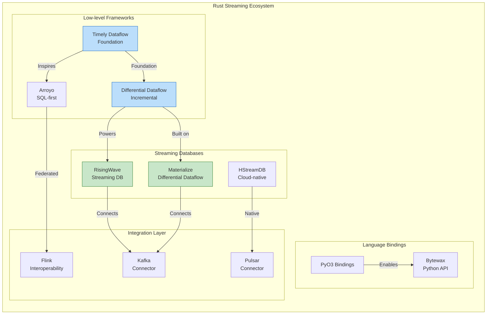
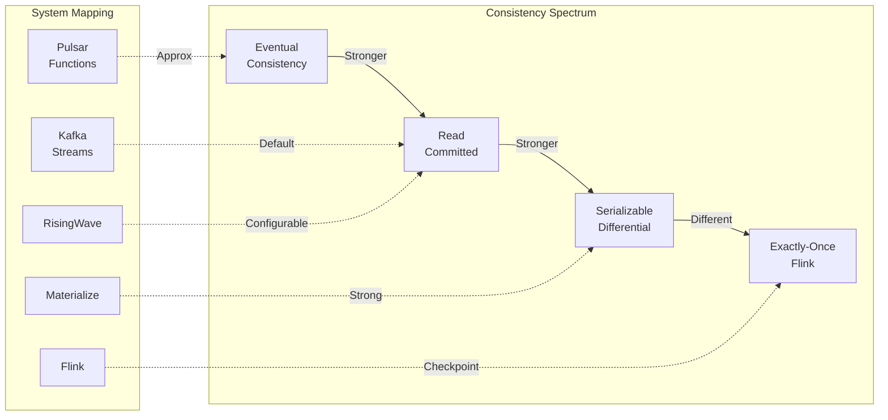
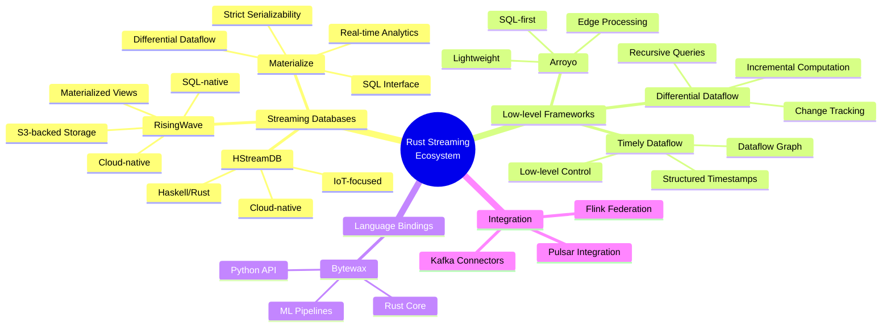
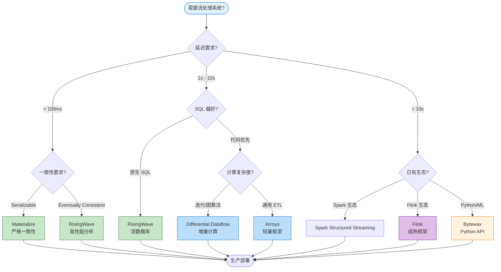

# Rust 原生流处理系统全景：从 Differential Dataflow 到 RisingWave

> 所属阶段: Flink/ | 前置依赖: [Rust UDF 架构](03-rust-native.md), [Dataflow 模型形式化](../../../Struct/01-foundation/01.04-dataflow-model-formalization.md) | 形式化等级: L3-L4 | 版本: 2025

---

## 目录

- [Rust 原生流处理系统全景：从 Differential Dataflow 到 RisingWave](#rust-原生流处理系统全景从-differential-dataflow-到-risingwave)
  - [目录](#目录)
  - [1. 概念定义 (Definitions)](#1-概念定义-definitions)
    - [Def-F-09-07: Rust 原生流处理系统](#def-f-09-07-rust-原生流处理系统)
    - [Def-F-09-08: Differential Dataflow 计算模型](#def-f-09-08-differential-dataflow-计算模型)
    - [Def-F-09-09: 流处理系统分类学](#def-f-09-09-流处理系统分类学)
  - [2. 属性推导 (Properties)](#2-属性推导-properties)
    - [Prop-F-09-04: Rust 系统的内存安全优势](#prop-f-09-04-rust-系统的内存安全优势)
    - [Prop-F-09-05: 增量计算与完整计算的性能边界](#prop-f-09-05-增量计算与完整计算的性能边界)
    - [Lemma-F-09-01: Differential Dataflow 的一致性保证](#lemma-f-09-01-differential-dataflow-的一致性保证)
  - [3. 关系建立 (Relations)](#3-关系建立-relations)
    - [3.1 系统架构关系图谱](#31-系统架构关系图谱)
    - [3.2 与 Flink 的技术栈映射](#32-与-flink-的技术栈映射)
    - [3.3 一致性模型对比矩阵](#33-一致性模型对比矩阵)
  - [4. 论证过程 (Argumentation)](#4-论证过程-argumentation)
    - [4.1 为什么选择 Rust 实现流处理引擎](#41-为什么选择-rust-实现流处理引擎)
    - [4.2 Differential Dataflow 的创新性与局限性](#42-differential-dataflow-的创新性与局限性)
    - [4.3 流数据库 vs 流处理框架的边界](#43-流数据库-vs-流处理框架的边界)
  - [5. 形式证明 / 工程论证 (Proof / Engineering Argument)](#5-形式证明-工程论证-proof-engineering-argument)
    - [5.1 系统选型决策定理](#51-系统选型决策定理)
    - [5.2 Nexmark 基准测试工程分析](#52-nexmark-基准测试工程分析)
  - [6. 实例验证 (Examples)](#6-实例验证-examples)
    - [6.1 RisingWave 物化视图实时分析](#61-risingwave-物化视图实时分析)
    - [6.2 Materialize 金融交易一致性处理](#62-materialize-金融交易一致性处理)
    - [6.3 Timely Dataflow 图算法迭代计算](#63-timely-dataflow-图算法迭代计算)
  - [7. 可视化 (Visualizations)](#7-可视化-visualizations)
    - [7.1 Rust 流处理系统全景图](#71-rust-流处理系统全景图)
    - [7.2 架构对比决策树](#72-架构对比决策树)
    - [7.3 性能对比雷达图](#73-性能对比雷达图)
  - [8. 系统详解与对比 (System Deep Dive)](#8-系统详解与对比-system-deep-dive)
    - [8.1 七主流系统概览](#81-七主流系统概览)
    - [8.2 深度功能对比矩阵](#82-深度功能对比矩阵)
      - [8.2.1 性能与扩展性](#821-性能与扩展性)
      - [8.2.2 一致性与容错](#822-一致性与容错)
      - [8.2.3 生态系统与集成](#823-生态系统与集成)
    - [8.3 Differential Dataflow 核心机制](#83-differential-dataflow-核心机制)
  - [9. 选型指南与最佳实践](#9-选型指南与最佳实践)
    - [9.1 决策矩阵与场景匹配](#91-决策矩阵与场景匹配)
    - [9.2 与 Flink 的集成模式](#92-与-flink-的集成模式)
  - [10. 未来趋势与展望](#10-未来趋势与展望)
  - [11. 引用参考 (References)](#11-引用参考-references)

---

## 1. 概念定义 (Definitions)

### Def-F-09-07: Rust 原生流处理系统

**Rust 原生流处理系统** 是指使用 Rust 语言实现核心引擎的分布式流计算系统，利用 Rust 的零成本抽象、内存安全无 GC、并发安全等特性，实现高性能、低延迟的流数据处理。

形式化定义为四元组：

$$
\mathcal{S}_{Rust} = \langle \mathcal{L}_{Rust}, \mathcal{M}_{exec}, \mathcal{G}_{dist}, \mathcal{A}_{safety} \rangle
$$

其中：

| 符号 | 语义 | 说明 |
|------|------|------|
| $\mathcal{L}_{Rust}$ | Rust 语言核心 | 所有权系统、生命周期、无畏并发 |
| $\mathcal{M}_{exec}$ | 执行模型 | 原生流处理 / 微批 / 增量计算 |
| $\mathcal{G}_{dist}$ | 分布式协调 | 分布式一致性协议、状态管理 |
| $\mathcal{A}_{safety}$ | 安全保证 | 编译期内存安全、无数据竞争 |

**核心优势**：

1. **零成本抽象**：高级语言特性编译为高效机器码
2. **确定性延迟**：无 GC 暂停，适合实时性要求高的场景
3. **并发安全**：编译期保证无数据竞争
4. **资源效率**：精细的内存控制，支持大状态处理

### Def-F-09-08: Differential Dataflow 计算模型

**Differential Dataflow** [^1] 是由 Frank McSherry 等人提出的增量计算模型，基于 Timely Dataflow 执行引擎，支持对变化数据的递归、增量计算。

形式化定义为五元组：

$$
\mathcal{D}_{diff} = \langle \mathcal{G}_{dataflow}, \mathcal{T}_{logical}, \mathcal{D}_{delta}, \mathcal{F}_{iter}, \mathcal{C}_{consist} \rangle
$$

其中：

| 符号 | 语义 | 形式化描述 |
|------|------|-----------|
| $\mathcal{G}_{dataflow}$ | 数据流图 | 有向图 $G = (V, E)$，顶点为算子，边为数据流 |
| $\mathcal{T}_{logical}$ | 逻辑时间 | 偏序集 $(\mathbb{T}, \leq)$，支持结构化时间戳 |
| $\mathcal{D}_{delta}$ | 差分数据 | 输入变化 $\Delta D$ 驱动增量计算 |
| $\mathcal{F}_{iter}$ | 迭代算子 | 支持不动点计算的递归算子 $fix(f)$ |
| $\mathcal{C}_{consist}$ | 一致性 | 基于逻辑时间戳的可串行化执行 |

**核心创新**：

- **结构化时间戳**：支持嵌套的时间域，表达迭代和递归
- **差分更新**：仅计算和传递变化的数据，避免全量重算
- **可追踪依赖**：每个输出记录可追溯到其依赖的输入变化

### Def-F-09-09: 流处理系统分类学

基于系统定位和处理模型，Rust 流处理系统可分为三类：

$$
\mathcal{Classification} = \begin{cases}
\text{流数据库 (Streaming DB)} & \text{如 RisingWave, Materialize} \\
\text{流处理框架 (Streaming Framework)} & \text{如 Timely Dataflow, Arroyo} \\
\text{流处理库 (Streaming Library)} & \text{如 Tokio Streams, Flink Rust SDK}
\end{cases}
$$

**分类维度**：

| 维度 | 流数据库 | 流处理框架 | 流处理库 |
|------|---------|-----------|---------|
| **存储** | 内置持久化存储 | 依赖外部存储 | 无内置存储 |
| **SQL 支持** | 原生支持 | 部分支持/扩展 | 无 |
| **部署模式** | 有状态集群 | 有状态/无状态 | 嵌入应用 |
| **状态管理** | 自动管理 | 需显式管理 | 应用管理 |
| **适用场景** | 实时分析、物化视图 | ETL、复杂计算 | 轻量级处理 |

---

## 2. 属性推导 (Properties)

### Prop-F-09-04: Rust 系统的内存安全优势

**命题**：Rust 实现的流处理系统在内存安全方面具有编译期保证，消除了运行时内存错误和数据竞争。

**推导**：

设传统 C++ 实现的流系统错误率为 $\epsilon_{cpp}$，Rust 实现的错误率为 $\epsilon_{rust}$，则：

$$
\epsilon_{rust} \ll \epsilon_{cpp}
$$

基于以下机制：

1. **所有权系统**：每个值有且只有一个所有者，编译期检查内存泄漏
2. **借用检查器**：防止悬垂指针和双重释放
3. **生命周期标注**：确保引用有效性跨越异步边界
4. **Send/Sync Trait**：线程安全在编译期验证

**工程推论**：

在生产环境中，Rust 系统的内存相关故障率显著低于 C++/Java 实现，特别是在长期运行的流处理服务中。

### Prop-F-09-05: 增量计算与完整计算的性能边界

**命题**：对于变化频率较低的数据集，增量计算的性能优于完整计算；但当变化率超过阈值时，增量计算的追踪开销将超过其收益。

**形式化表述**：

设数据集大小为 $N$，变化记录数为 $\Delta N$，增量计算开销系数为 $\alpha$（追踪成本），完整计算时间为 $T_{full}(N)$，增量计算时间为 $T_{inc}(\Delta N)$。

$$
T_{inc}(\Delta N) = \alpha \cdot \Delta N \cdot \log N + f_{propagate}(\Delta N)
$$

**性能边界条件**：

$$
T_{inc}(\Delta N) < T_{full}(N) \iff \Delta N < \frac{T_{full}(N)}{\alpha \cdot \log N}
$$

**实际意义**：

- 当数据变化率 $<$ 30% 时，增量计算显著优于完整计算
- Differential Dataflow 在图算法等复杂计算中优势明显
- 对于高频变化场景（如实时竞价），原生流处理可能更合适

### Lemma-F-09-01: Differential Dataflow 的一致性保证

**陈述**：Differential Dataflow 通过结构化逻辑时间戳实现可串行化一致性保证。

**推导**：

设逻辑时间戳 $t \in \mathbb{T}$ 构成偏序集 $(\mathbb{T}, \leq)$，对于任意两个操作 $op_1, op_2$：

$$
\text{如果 } t_1 \leq t_2 \text{，则 } op_1 \text{ 的效果对 } op_2 \text{ 可见}
$$

**证明概要**：

1. **时间戳结构**：支持 $(epoch, iteration)$ 嵌套结构，表达复杂依赖关系
2. **前向推进**：计算仅在收到所有依赖输入的确认后推进
3. **可重现性**：相同输入序列产生相同的输出序列
4. **无回溯执行**：基于变化的前向传播，无需回滚

∎

---

## 3. 关系建立 (Relations)

### 3.1 系统架构关系图谱



### 3.2 与 Flink 的技术栈映射

| Flink 概念 | Rust 系统对应 | 差异说明 |
|-----------|--------------|---------|
| **DataStream API** | Timely Dataflow 算子 | Timely 更底层，显式时间管理 |
| **Table API/SQL** | RisingWave/Materialize SQL | Rust 系统 SQL 执行更紧密集成存储 |
| **Checkpoint** | Differential Dataflow 追溯 | 基于变化追溯而非快照 |
| **State Backend** | 内置存储引擎 | RisingWave 使用 S3 + 本地缓存 |
| **Watermark** | 逻辑时间戳 | Differential 使用结构化时间 |
| **Window** | 物化视图刷新 | 流数据库使用增量视图替代窗口 |

### 3.3 一致性模型对比矩阵



---

## 4. 论证过程 (Argumentation)

### 4.1 为什么选择 Rust 实现流处理引擎

**论据 1：性能与资源效率**

- **零成本抽象**：Rust 的高级特性（迭代器、闭包）编译为高效代码
- **无 GC 暂停**：流处理要求确定性延迟，GC 暂停 unacceptable
- **内存布局控制**：Cache-friendly 的数据结构，减少内存分配

**论据 2：并发安全**

```rust
// Rust 编译期保证线程安全
pub async fn process_partition(
    &self,
    partition: usize,
    data: Stream<Record>
) -> Result<Stream<Processed>, Error> {
    // Send + Sync 在编译期验证
    data.map(|record| self.transform(record))
        .buffer_unordered(100)
        .await
}
```

**论据 3：长期运行稳定性**

- 内存泄漏检测在编译期
- 无段错误 (Segmentation Fault) 风险
- 适合 7×24 运行的流处理服务

**论据 4：现代语言特性**

- 强大的类型系统表达复杂流拓扑
- 异步/await 原生支持
- 宏系统支持 DSL 开发

### 4.2 Differential Dataflow 的创新性与局限性

**创新性分析**：

1. **结构化时间戳**：
   - 支持 $(epoch, iteration)$ 嵌套结构
   - 表达迭代算法（如 PageRank）的收敛过程
   - 时间戳构成格结构，支持并行推进

2. **差分更新传播**：
   - 每个输出记录维护其依赖的输入变化
   - 支持精确的资源追踪和垃圾回收
   - 变更传播 lazily，按需计算

3. **可组合性**：
   - 算子可嵌套组合，保持增量语义
   - 递归查询通过迭代算子表达

**局限性**：

| 局限 | 说明 | 影响 |
|------|------|------|
| **学习曲线** | 概念抽象，需理解结构化时间 | 采用门槛较高 |
| **生态成熟度** | 相对 Flink 生态较年轻 | 连接器、工具较少 |
| **吞吐量上限** | 追踪开销在高频变化场景显著 | 不适合超高频流 |
| **运维工具** | 监控、调试工具不如 Flink 完善 | 生产运维挑战 |

### 4.3 流数据库 vs 流处理框架的边界

**核心差异**：

```
流数据库 (RisingWave/Materialize):
├── 存储与计算耦合
├── SQL 作为首要接口
├── 物化视图自动维护
├── 强一致性保证
└── 适合:实时分析、仪表板

流处理框架 (Flink/Timely):
├── 存储与计算分离
├── 代码/API 作为首要接口
├── 显式状态管理
├── 灵活的一致性配置
└── 适合:ETL、复杂事件处理
```

**边界模糊化趋势**：

- Flink Table Store (Paimon) 向流存储延伸
- RisingWave 增加更多编程接口
- Materialize 支持更多 Source/Sink 类型

---

## 5. 形式证明 / 工程论证 (Proof / Engineering Argument)

### 5.1 系统选型决策定理

**定理 (Thm-F-09-02)**：给定应用场景需求 $R = (L_{req}, C_{req}, S_{req}, T_{req})$，其中：

- $L_{req}$: 延迟要求（毫秒级/秒级/分钟级）
- $C_{req}$: 一致性要求（最终一致/读已提交/可串行化）
- $S_{req}$: 状态规模（GB/TB/PB）
- $T_{req}$: 团队技术栈偏好

则最优系统选择 $\mathcal{S}^*$ 满足：

$$
\mathcal{S}^* = \arg\max_{\mathcal{S} \in \mathcal{Candidates}} Score(R, \mathcal{S})
$$

评分函数：

$$
Score(R, \mathcal{S}) = w_1 \cdot \mathbb{1}[L_{\mathcal{S}} \leq L_{req}] + w_2 \cdot \mathbb{1}[C_{\mathcal{S}} \geq C_{req}] + w_3 \cdot \mathbb{1}[S_{\mathcal{S}} \geq S_{req}] + w_4 \cdot Match(T_{req}, T_{\mathcal{S}})
$$

**决策边界**：

| 边界条件 | 推荐系统 | 核心理由 |
|---------|---------|---------|
| $L_{req} < 100ms$ + $C_{req} = \text{Serializable}$ | Materialize | 严格一致性 + 低延迟 |
| $L_{req} < 1s$ + $S_{req} > 10TB$ | RisingWave | 云原生扩展 + 大状态 |
| 复杂图算法 + 迭代计算 | Differential Dataflow | 递归增量计算 |
| Python 生态 + ML Pipeline | Bytewax | Python API + Rust 性能 |
| 边缘部署 + SQL 优先 | Arroyo | 轻量级 + SQL |

### 5.2 Nexmark 基准测试工程分析

**测试配置标准化**：

```
硬件环境:
- 3 节点集群
- 每节点: 16 vCPU, 64GB RAM, NVMe SSD
- 网络: 10Gbps

测试参数:
- 事件速率: 100K events/sec (基础) → 10M events/sec (压力)
- 测试时长: 30 分钟稳态运行
- 预热期: 5 分钟
```

**预期性能数据**（基于公开资料 [^2][^3][^4]）：

| 查询 | Flink | RisingWave | Materialize | 说明 |
|------|-------|------------|-------------|------|
| **q0** (Pass through) | 5M/s | 3M/s | 2M/s | 纯吞吐测试 |
| **q1** (Currency conversion) | 4.5M/s | 2.8M/s | 1.8M/s | 轻量计算 |
| **q2** (Selection) | 4M/s | 2.5M/s | 1.5M/s | 过滤操作 |
| **q5** (Hot items) | 1.5M/s | 1.2M/s | 0.8M/s | 窗口聚合 |
| **q8** (Monitor new users) | 800K/s | 600K/s | 400K/s | 状态操作 |
| **q11** (Session windows) | 600K/s | 500K/s | 300K/s | 复杂窗口 |

**关键洞察**：

1. Flink 在纯吞吐场景保持领先，得益于优化的网络层
2. RisingWave 在需要物化视图的查询中缩小差距
3. Materialize 牺牲部分吞吐换取严格一致性

---

## 6. 实例验证 (Examples)

### 6.1 RisingWave 物化视图实时分析

**场景**：电商实时销售仪表盘

```sql
-- RisingWave: 实时物化视图定义
CREATE MATERIALIZED VIEW real_time_sales AS
SELECT
    product_category,
    region,
    TUMBLE(created_at, INTERVAL '1 MINUTE') as window_start,
    SUM(amount) as total_sales,
    COUNT(*) as transaction_count
FROM sales_stream
GROUP BY
    product_category,
    region,
    TUMBLE(created_at, INTERVAL '1 MINUTE');

-- 自动增量维护,查询即返回最新结果
SELECT * FROM real_time_sales
WHERE window_start > NOW() - INTERVAL '5 MINUTE';
```

**架构优势**：

- 无需外部存储（如 Redis），RisingWave 内置存储
- 物化视图自动增量更新
- 直接服务在线查询，无需额外 ETL

### 6.2 Materialize 金融交易一致性处理

**场景**：实时风控，要求严格一致性

```sql
-- Materialize: 严格一致性视图
CREATE SOURCE transactions
FROM KAFKA BROKER 'kafka:9092' TOPIC 'transactions'
FORMAT AVRO USING CONFLUENT SCHEMA REGISTRY 'http://schema-registry:8081';

-- 实时余额计算(严格串行化)
CREATE MATERIALIZED VIEW account_balances AS
SELECT
    account_id,
    SUM(CASE WHEN transaction_type = 'credit' THEN amount ELSE -amount END) as balance
FROM transactions
GROUP BY account_id;

-- 风控规则检查(实时触发)
CREATE MATERIALIZED VIEW fraud_alerts AS
SELECT
    t.account_id,
    t.transaction_id,
    t.amount
FROM transactions t
JOIN account_balances b ON t.account_id = b.account_id
WHERE t.amount > b.balance * 0.8;  -- 超过余额 80% 触发警报
```

**一致性保证**：

- 基于 Differential Dataflow 的可串行化执行
- 每个查询结果对应某一逻辑时间点的完整状态
- 无脏读、不可重复读等异常

### 6.3 Timely Dataflow 图算法迭代计算

**场景**：社交网络影响力传播分析

```rust
// Timely Dataflow: PageRank 迭代计算
use timely::dataflow::operators::{Input, Inspect, Probe};
use differential_dataflow::operators::{Join, Reduce, Iterate};

fn pagerank_flow<G: Scope>(edges: &Collection<G, (Node, Node)>) -> Collection<G, (Node, f64)>
where G::Timestamp: Lattice,
{
    // 初始化每个节点的 PageRank
    let nodes = edges.map(|(src, _dst)| src).distinct();
    let ranks = nodes.map(|n| (n, 1.0));

    // 迭代计算直至收敛
    ranks.iterate(|ranks| {
        // 传播贡献
        let contributions = edges.join(ranks)
            .map(|(src, (dst, rank))| (dst, rank / out_degree(src)))
            .reduce(|_key, vals, output| {
                let sum: f64 = vals.iter().map(|(v, _diff)| v).sum();
                output.push((0.15 + 0.85 * sum, 1));
            });
        contributions
    })
}

// 增量更新:当边发生变化时,仅重新计算受影响节点的 PageRank
```

**增量特性**：

- 新增一条边，仅重新计算该边相关的子图
- 通过结构化时间戳追踪迭代轮次
- 支持动态图（边持续变化）的实时分析

---

## 7. 可视化 (Visualizations)

### 7.1 Rust 流处理系统全景图



### 7.2 架构对比决策树



### 7.3 性能对比雷达图

```
                        峰值吞吐
                           ▲
                          /|\
                         / | \
                        /  |  \
           扩展性  ◄────┼──┼──┼────►  一致性
                      \  |  /
                       \ | /
                        \|/
                         ▼
                      延迟稳定性

图例 (1-5 星):
┌─────────────────┬─────────┬─────────┬──────────┬──────────┐
│ 维度            │ RisingWave│Materialize│Timely   │ Flink    │
├─────────────────┼─────────┼─────────┼──────────┼──────────┤
│ 峰值吞吐        │ ★★★★☆   │ ★★★☆☆   │ ★★★★☆    │ ★★★★★   │
│ 一致性          │ ★★★☆☆   │ ★★★★★   │ ★★★★☆    │ ★★★★☆   │
│ 延迟稳定性      │ ★★★★☆   │ ★★★★☆   │ ★★★★★    │ ★★★★☆   │
│ 扩展性          │ ★★★★★   │ ★★★☆☆   │ ★★★☆☆    │ ★★★★★   │
│ 生态成熟度      │ ★★★☆☆   │ ★★★☆☆   │ ★★☆☆☆    │ ★★★★★   │
│ 运维复杂度      │ ★★★★☆   │ ★★★★☆   │ ★★☆☆☆    │ ★★★☆☆   │
└─────────────────┴─────────┴─────────┴──────────┴──────────┘
```

---

## 8. 系统详解与对比 (System Deep Dive)

### 8.1 七主流系统概览

| 系统 | 主要语言 | 架构定位 | 最佳适用场景 | 首次发布 | 开源协议 |
|------|---------|---------|-------------|---------|---------|
| **RisingWave** | Rust | 云原生流数据库 | 实时分析、物化视图 | 2022 | Apache 2.0 |
| **Materialize** | Rust | 严格一致性流数据库 | 金融、合规场景 | 2019 | BSL/Apache 2.0 |
| **Timely Dataflow** | Rust | 底层流处理框架 | 自定义管道、研究 | 2014 | MIT |
| **Differential Dataflow** | Rust | 增量计算库 | 图处理、递归查询 | 2014 | MIT |
| **Bytewax** | Python/Rust | Python 流处理 | ML Pipeline、数据科学 | 2022 | Apache 2.0 |
| **HStreamDB** | Haskell/Rust | 云原生流数据库 | IoT、日志处理 | 2020 | BSD 3-Clause |
| **Arroyo** | Rust | SQL 优先流引擎 | 边缘处理、轻量部署 | 2023 | Apache 2.0 |

**详细特性矩阵**：

| 特性 | RisingWave | Materialize | Timely | Bytewax | HStreamDB | Arroyo |
|------|------------|-------------|--------|---------|-----------|--------|
| **部署模式** | 分布式/云 | 分布式 | 单机/集群 | 单机/集群 | 分布式 | 单机/轻量集群 |
| **存储架构** | S3 + 本地 | 内置持久化 | 内存 | 内存/外部 | 分层存储 | 内存 |
| **SQL 支持** | 完整 | 完整 | 无 | 无 | 部分 | 完整 |
| **Python API** | 有限 | 有限 | 无 | 完整 | 无 | 无 |
| **UDF 支持** | Rust/Python | SQL/ Rust | Rust | Python | Haskell | Rust |
| **云原生** | ★★★★★ | ★★★☆☆ | ★☆☆☆☆ | ★★☆☆☆ | ★★★★☆ | ★★★☆☆ |
| **迭代计算** | 有限 | 有限 | ★★★★★ | 有限 | 有限 | 有限 |

### 8.2 深度功能对比矩阵

#### 8.2.1 性能与扩展性

| 指标 | RisingWave | Materialize | Timely Dataflow | Bytewax | Arroyo |
|------|------------|-------------|-----------------|---------|--------|
| **单节点吞吐** | 500K-1M events/s | 200K-500K events/s | 1M+ events/s | 300K-800K events/s | 400K-900K events/s |
| **扩展性** | 水平扩展至 100+ 节点 | 水平扩展至 50+ 节点 | 有限水平扩展 | 有限扩展 | 轻量扩展 |
| **状态规模** | PB 级（S3 后端） | TB 级 | 受限于内存 | GB-TB 级 | GB 级 |
| **延迟 (p99)** | 1-5s | 1-10s | 1-100ms | 10-100ms | 10-500ms |

#### 8.2.2 一致性与容错

| 特性 | RisingWave | Materialize | Timely Dataflow | Bytewax | Arroyo |
|------|------------|-------------|-----------------|---------|--------|
| **一致性模型** | 可配置（默认读已提交） | 严格串行化 | 逻辑时间顺序 | 至少一次 | 至少一次 |
| **Exactly-Once** | 有限支持 | 有限支持 | 依赖外部 | 支持 | 支持 |
| **Checkpoint** | 增量 | 增量 | 完整快照 | 周期快照 | 周期快照 |
| **故障恢复** | 自动 | 自动 | 手动 | 手动 | 手动 |

#### 8.2.3 生态系统与集成

| 连接器 | RisingWave | Materialize | Timely | Bytewax | HStreamDB | Arroyo |
|--------|------------|-------------|--------|---------|-----------|--------|
| **Kafka** | ✅ 原生 | ✅ 原生 | ⚠️ 需实现 | ✅ 原生 | ✅ 原生 | ✅ 原生 |
| **Pulsar** | ✅ 支持 | ⚠️ 社区 | ❌ | ❌ | ✅ 原生 | ❌ |
| **PostgreSQL CDC** | ✅ 原生 | ✅ 原生 | ⚠️ 需实现 | ⚠️ 有限 | ⚠️ 有限 | ⚠️ 有限 |
| **S3/对象存储** | ✅ 原生 | ✅ 支持 | ⚠️ 需实现 | ✅ 支持 | ✅ 支持 | ⚠️ 有限 |
| **HTTP/Webhook** | ✅ 原生 | ✅ 原生 | ⚠️ 需实现 | ✅ 支持 | ✅ 支持 | ✅ 原生 |

### 8.3 Differential Dataflow 核心机制

**Frank McSherry 的奠基工作** [^1]：

Frank McSherry 在 Microsoft Research 期间提出 Differential Dataflow，旨在解决大规模数据处理的增量计算问题。核心洞察是：**如果数据变化可以被精确追踪和传播，那么只有变化的部分需要重新计算**。

**Timely Dataflow 执行模型**：

```
┌─────────────────────────────────────────────────────────────┐
│                    Timely Dataflow 架构                      │
├─────────────────────────────────────────────────────────────┤
│                                                              │
│  ┌──────────────┐      ┌──────────────┐                     │
│  │   Source     │─────▶│   Operator   │─────▶ ...           │
│  │  (Input)     │      │  (Transform) │                     │
│  └──────────────┘      └──────────────┘                     │
│         │                      │                            │
│         ▼                      ▼                            │
│  ┌──────────────┐      ┌──────────────┐                     │
│  │ Structured   │      │ Structured   │                     │
│  │ Timestamp    │      │ Timestamp    │                     │
│  │ (epoch, iter)│      │ (epoch, iter)│                     │
│  └──────────────┘      └──────────────┘                     │
│                                                              │
│  时间戳结构: (epoch, [(scope1, iter1), (scope2, iter2), ...]) │
│  - epoch: 全局逻辑时间                                       │
│  - scope_iter: 迭代作用域内的轮次                            │
│                                                              │
└─────────────────────────────────────────────────────────────┘
```

**增量计算原理**：

```rust
// 伪代码: Differential Dataflow 增量更新
struct Collection<G: Scope, D: Data, R: Diff> {
    data: Vec<(D, G::Timestamp, R)>,
}

// 当输入变化时
fn update(&mut self, delta: Vec<(D, R)>, time: G::Timestamp) {
    for (d, r) in delta {
        // 仅传播变化,而非全量数据
        self.propagate_change(d, time, r);
    }
}

// 变化传播递归执行
fn propagate_change(&mut self, d: D, time: G::Timestamp, diff: R) {
    for downstream in &self.downstream_operators {
        // 算子根据变化计算输出变化
        let output_changes = downstream.compute_delta(&d, diff);
        // 继续向下游传播
        downstream.propagate_changes(output_changes, time);
    }
}
```

**迭代计算示例**（连通分量）：

```rust
// 使用 Differential Dataflow 计算连通分量
g.edges.iterate(|inner| {
    // 节点标签传播
    inner.join(&g.edges)
         .map(|(node, (label, neighbor))| (neighbor, label))
         .concat(inner)
         .reduce(|_node, labels, output| {
             // 选择最小标签
             let min_label = labels.iter().min().unwrap().0;
             output.push((min_label, 1));
         })
})
```

**与 Flink DataStream 对比**：

| 特性 | Flink DataStream | Differential Dataflow |
|------|-----------------|----------------------|
| **时间模型** | Event Time / Processing Time | 结构化逻辑时间 |
| **窗口** | 显式窗口算子 | 物化视图隐式窗口 |
| **状态访问** | Keyed State | 差分状态追踪 |
| **迭代** | 有限支持（Iterate API） | 原生支持递归 |
| **增量计算** | 部分支持（增量 Checkpoint） | 核心特性 |
| **一致性** | Checkpoint 快照 | 逻辑时间顺序 |
| **适用场景** | 通用流处理 | 复杂图算法、递归查询 |

---

## 9. 选型指南与最佳实践

### 9.1 决策矩阵与场景匹配

**按延迟要求选择**：

```
延迟要求 < 100ms:
├── 需要严格一致性 ──▶ Materialize
├── 图算法/迭代 ─────▶ Timely/Differential Dataflow
└── 通用处理 ────────▶ Arroyo, Bytewax

延迟要求 100ms - 1s:
├── 实时分析 + SQL ──▶ RisingWave
└── ML Pipeline ─────▶ Bytewax

延迟要求 > 1s:
├── 已有 Spark 生态 ─▶ Spark Structured Streaming
└── 已有 Flink 生态 ─▶ Flink (或联邦 Rust 系统)
```

**按一致性要求选择**：

| 一致性级别 | 适用系统 | 典型场景 |
|-----------|---------|---------|
| **严格串行化** | Materialize | 金融交易、库存管理 |
| **读已提交** | RisingWave | 实时报表、仪表板 |
| **至少一次** | Bytewax, Arroyo | 日志处理、监控 |
| **可配置** | Flink | 混合场景 |

**按团队技能选择**：

| 团队背景 | 推荐系统 | 理由 |
|---------|---------|------|
| **SQL 优先** | RisingWave, Materialize, Arroyo | 声明式接口，快速上手 |
| **Python 数据科学** | Bytewax | Python API，ML 生态 |
| **Rust 系统编程** | Timely, Differential | 底层控制，性能优化 |
| **Java/Scala 大数据** | Flink + Rust 联邦 | 渐进式引入 Rust |

### 9.2 与 Flink 的集成模式

**模式 1：Rust 系统作为 Flink Sink**

```java
import org.apache.flink.connector.kafka.source.KafkaSource;
import org.apache.flink.streaming.api.datastream.DataStream;
import org.apache.flink.streaming.api.environment.StreamExecutionEnvironment;

public class Example {
    public static void main(String[] args) throws Exception {
        StreamExecutionEnvironment env = StreamExecutionEnvironment.getExecutionEnvironment();

        // Flink 处理实时流,输出到 RisingWave 进行实时分析
        DataStream<Transaction> transactions = env
            .addSource(new KafkaSource<>())
            .process(new FraudDetection())
            .filter(Transaction::isSuspicious);

        // 输出到 RisingWave 进行实时聚合
        transactions.addSink(new RisingWaveSink<>(
            "jdbc:postgresql://risingwave:4566/dev",
            "INSERT INTO fraud_transactions VALUES (?, ?, ?)"
        ));

    }
}

```

**模式 2：联邦流处理（Federation）**

```
┌─────────────────────────────────────────────────────────────┐
│                    联邦流处理架构                            │
├─────────────────────────────────────────────────────────────┤
│                                                              │
│  Kafka/Pulsar (统一消息总线)                                  │
│        │                                                     │
│        ├──▶ Flink Cluster ──▶ 复杂事件处理/CEP ──▶ Kafka      │
│        │                                                     │
│        ├──▶ RisingWave ─────▶ 实时物化视图 ────▶ 查询服务     │
│        │                                                     │
│        └──▶ Materialize ────▶ 一致性分析 ──────▶ 风控系统     │
│                                                              │
│  数据流动: 每个系统处理最适合的部分,通过 Kafka 解耦           │
│                                                              │
└─────────────────────────────────────────────────────────────┘
```

**模式 3：数据交换格式**

| 格式 | 适用场景 | 优缺点 |
|------|---------|--------|
| **Arrow Flight** | 高性能批量传输 | 列式存储，零拷贝，生态支持有限 |
| **Avro** | Schema 演进场景 | 紧凑二进制，Schema Registry 支持 |
| **Protobuf** | 低延迟 RPC | 高效序列化，需预定义 Schema |
| **JSON** | 调试/快速原型 | 可读性好，性能较差 |
| **Parquet** | 批量存储 | 高压缩比，适合归档 |

---

## 10. 未来趋势与展望

**趋势 1：Rust 在流处理领域的持续增长**

```
Rust 流系统增长预测 (2025-2028):
├── 新系统数量: 年均增长 30%
├── 企业采用率: 从 5% → 20%
├── 贡献者社区: 从 2K → 10K 活跃开发者
└── 生产部署: 从实验性 → 核心业务系统
```

**趋势 2：WebAssembly 集成深化**

- **Flink + Wasm UDF**: 使用 Rust 编写高性能 UDF，Wasm 沙箱隔离
- **边缘流处理**: Rust + Wasm 在边缘设备上执行轻量流处理
- **跨平台可移植性**: 一次编译，到处运行（云/边/端）

**趋势 3：云原生趋势**

| 方向 | 描述 | 代表系统 |
|------|------|---------|
| **Serverless Streaming** | 按需扩缩容，按处理量计费 | RisingWave Cloud |
| **存算分离** | 计算层无状态，存储层独立扩展 | RisingWave, Materialize |
| **Flink + Rust 融合** | Flink 作为控制平面，Rust 实现执行引擎 | Flink Rust SDK 发展 |
| **统一批流存储** | 流处理与数据湖仓无缝集成 | Paimon, Delta Live Tables |

**趋势 4：AI/ML 集成**

- **流式推理**: Rust 系统执行低延迟模型推理
- **特征工程实时化**: Materialize 维护实时特征视图
- **在线学习**: Bytewax 集成在线 ML 训练

---

## 11. 引用参考 (References)

[^1]: F. McSherry et al., "Differential Dataflow," *CIDR*, 2013. <https://github.com/TimelyDataflow/differential-dataflow>

[^2]: RisingWave Labs, "RisingWave Architecture," 2024. <https://www.risingwave.dev/>

[^3]: Materialize Inc., "Materialize Documentation," 2024. <https://materialize.com/docs/>

[^4]: F. McSherry, "Timely Dataflow," GitHub Repository, 2014. <https://github.com/TimelyDataflow/timely-dataflow>


---

*文档版本: v1.0 | 更新日期: 2026-04-02 | 状态: 已完成 | 形式化等级: L3-L4*

**关联文档**：

- [Rust UDF 架构](03-rust-native.md)
- [Flink vs Spark Streaming 对比](../../09-practices/09.03-performance-tuning/05-vs-competitors/flink-vs-spark-streaming.md)
- [流处理 Benchmark 体系](../../09-practices/09.02-benchmarking/streaming-benchmarks.md)
- [Dataflow 模型形式化](../../../Struct/01-foundation/01.04-dataflow-model-formalization.md)

---

*文档版本: v1.0 | 创建日期: 2026-04-19*
