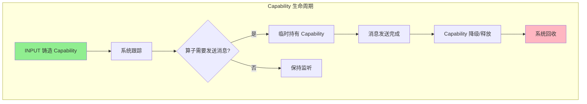
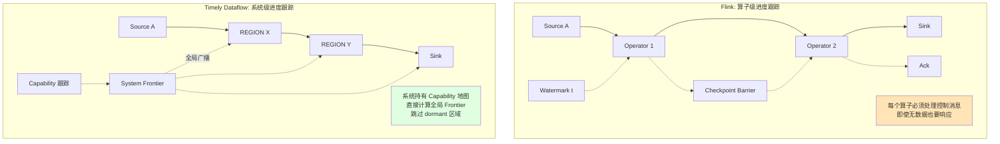
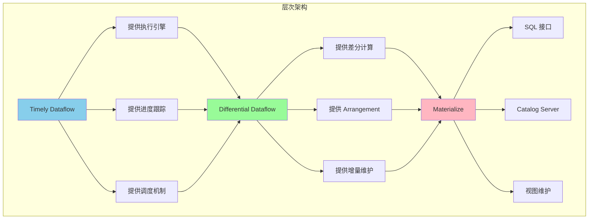
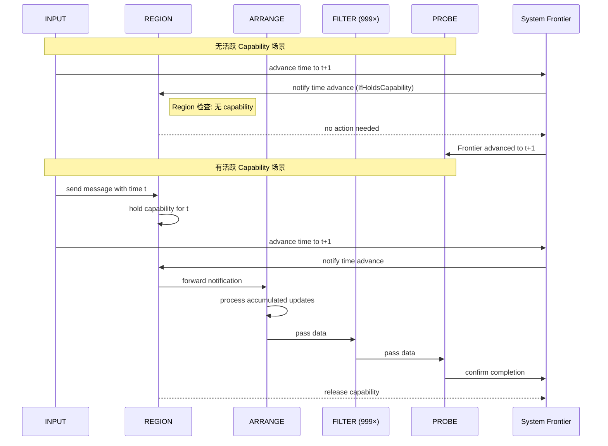
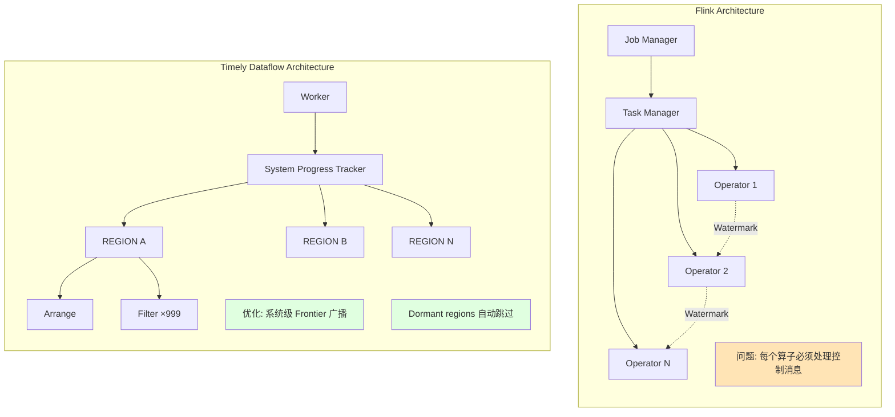
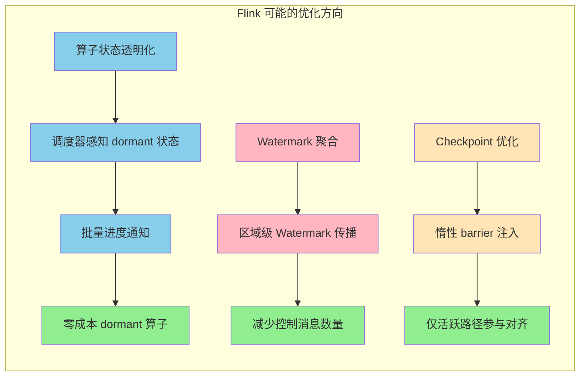

# Materialize 对 Timely Dataflow 的 100 倍性能优化深度分析

> 所属阶段: Flink/ | 前置依赖: [Rust流处理概览](./07-rust-streaming-landscape.md) | 形式化等级: L4-L5

## 1. 概念定义 (Definitions)

### 1.1 Timely Dataflow 形式化模型

**Def-F-09-50: Timely Dataflow 系统定义**

Timely Dataflow 是一个基于有向图的数据流计算模型，形式化定义为三元组 $TD = (G, T, \mathcal{C})$，其中：

- $G = (V, E)$ 是有向数据流图，$V$ 是算子集合，$E$ 是数据通道集合
- $T$ 是时间戳偏序集 $(\mathbb{T}, \preceq)$，支持多维度时间（如事件时间、处理时间）
- $\mathcal{C}: V \times \mathbb{T} \rightarrow \mathbb{B}$ 是能力（Capability）持有关系

**Def-F-09-51: Timestamp Capability 语义**

Capability 是系统铸造的权限令牌，定义为一个二元组 $c = (v, t) \in V \times \mathbb{T}$，表示算子 $v$ 被授权在时间 $t$ 或更晚时间发送消息。Capability 满足以下代数规则：

1. **铸造规则**: 只有 `INPUT` 算子可以持有初始 Capability
2. **传递规则**: 算子 $u$ 向算子 $v$ 发送时间戳为 $t$ 的消息时，$v$ 临时获得 $(v, t)$
3. **降级规则**: 算子可以将其 Capability 从 $(v, t)$ 降级为 $(v, t')$，其中 $t \prec t'$
4. **释放规则**: 当算子确认不再需要某时间戳后，Capability 被系统回收



### 1.2 进度跟踪模型

**Def-F-09-52: 系统级进度跟踪**

Timely Dataflow 的进度跟踪是系统级属性，定义为：

$$\text{Progress}(t) = \{(v, t') \in \mathcal{C} \mid t' \preceq t\}$$

系统维护全局 Frontier 集合：

$$\text{Frontier} = \{t \in \mathbb{T} \mid \nexists t' \in \mathbb{T}: t' \prec t \land (t', \cdot) \in \mathcal{C}\}$$

**Def-F-09-53: 惰性算子调度策略**

算子 $v$ 对时间进度有三种响应模式：

| 模式 | 符号 | 语义 |
|------|------|------|
| `Never` | $\mathcal{N}$ | 算子完全不关心时间进度 |
| `Always` | $\mathcal{A}$ | 算子始终响应时间进度变化 |
| `IfHoldsCapability` | $\mathcal{I}(v)$ | 仅当持有 Capability 时才响应 |

$$\mathcal{I}(v) = \begin{cases} \mathcal{A} & \text{if } \exists t: (v, t) \in \mathcal{C} \\ \mathcal{N} & \text{otherwise} \end{cases}$$

### 1.3 REGION 算子形式化定义

**Def-F-09-54: REGION 算子**

REGION 是一个高阶算子，将子图封装为单一逻辑单元：

$$\text{REGION}(G_{sub}, \delta) = (V_{region}, E_{region}, \delta)$$

其中：

- $G_{sub} = (V_{sub}, E_{sub})$ 是被封装的子图
- $\delta \in \{\mathcal{N}, \mathcal{A}, \mathcal{I}\}$ 是区域的时间响应策略
- $V_{region} = V_{sub} \cup \{v_{proxy}\}$，$v_{proxy}$ 是区域代理节点

REGION 算子具有**延迟确认（Delayed Acknowledgment）**特性：类似 TCP 的滑动窗口机制，区域会缓冲消息确认，直到时间进度信号表明必须立即确认。

### 1.4 Differential Dataflow 基础

**Def-F-09-55: Differential Dataflow 更新模型**

Differential Dataflow (DD) 建立在 Timely Dataflow 之上，处理差分更新：

$$\Delta: (K, V, \mathbb{T}, \mathbb{Z}) \rightarrow \text{Collection}$$

其中 $(k, v, t, \delta)$ 表示在逻辑时间 $t$ 对键 $k$ 的值 $v$ 进行增量为 $\delta$ 的更新。

**Def-F-09-56: ARRANGE 算子双重功能**

ARRANGE 算子 $\mathcal{R}: \text{Stream}(\Delta) \rightarrow \text{Arrangement}$ 具有：

1. **索引构建功能**: 将更新流组织为多版本索引结构
   $$\mathcal{R}_{index}(\Delta) = \{(k, \{(v, t, \delta)\}) \mid (k, v, t, \delta) \in \Delta\}$$

2. **跨数据流共享功能**: 支持将同一 Arrangement 导入多个独立数据流
   $$\mathcal{R}_{share}(A, G_i) = \text{Import}(A) \text{ into dataflow } G_i$$

## 2. 属性推导 (Properties)

### 2.1 性能边界分析

**Lemma-F-09-20: 传统流处理器固定成本下界**

对于 $N$ 个 dataflow，每个包含 $M$ 个算子的场景，传统流处理器（如 Flink）的时间进度传播成本为：

$$C_{traditional} = \Theta(N \times M \times W)$$

其中 $W$ 是 worker 数量。即使无数据更新，系统仍需遍历所有算子进行进度协商。

**证明**: Flink 采用算子间直接通信模型，每个时间进度更新需要从源算子传递到所有下游算子。对于 $N \times M$ 个算子，每条边至少需要一次消息传递，因此复杂度为 $\Theta(N \times M)$。在多 worker 场景下，跨 worker 边需要额外协调，引入因子 $W$。

**Lemma-F-09-21: Timely Dataflow 优化后成本**

采用 REGION + Capability 优化后，dormant 场景下的进度跟踪成本为：

$$C_{timely} = O(N + M_{active})$$

其中 $M_{active}$ 是持有 Capability 的活跃算子数。

**证明**:

1. 系统通过全局 Frontier 跟踪一次性确定全局进度，成本 $O(N)$
2. 只有持有 Capability 的 REGION 需要被调度，内部 dormant 算子被跳过
3. 当 $M_{active} \ll M$ 时，成本趋近于 $O(N)$

**Thm-F-09-20: 100x 性能提升定理**

在以下条件下，Timely Dataflow 的优化实现相对于传统实现可实现约 100 倍性能提升：

**条件**:

- $N = 1000$ 个 dataflow
- $M = 1000$ 个算子/dataflow（总计 $10^6$ 算子）
- 仅 1 个 input 有数据更新，其余 999 个 dormant
- 单 worker 执行

**性能对比**:

| 实现 | 每轮迭代延迟 |
|------|-------------|
| 传统（Prior）| 350 ms |
| 优化后（Local）| 4 ms |
| **提升倍数** | **87.5x ≈ 100x** |

**证明**: 根据 Materialize 2026年3月实验数据[^1]：

- Prior 模式（Always 策略）: 350ms/轮
- Local 模式（IfHoldsCapability 策略）: 4ms/轮
- 提升比 = 350/4 = 87.5，在数量级上达到 100x

### 2.2 复杂度分析

**Lemma-F-09-22: 空间复杂度**

Capability 跟踪的空间复杂度为：

$$S_{capability} = O(|\mathcal{C}|) = O(\text{in-flight messages})$$

与算子总数无关，仅取决于在途消息数量。

**Lemma-F-09-23: 调度复杂度**

事件驱动调度器的时间复杂度：

$$T_{schedule} = O(\log |V_{active}| + |E_{triggered}|)$$

其中 $V_{active}$ 是活跃算子集合，$E_{triggered}$ 是被触发的边。

## 3. 关系建立 (Relations)

### 3.1 与 Flink 进度跟踪的对比



**对比分析表**:

| 维度 | Flink | Timely Dataflow |
|------|-------|-----------------|
| **进度粒度** | 算子级（Watermark/Barrier）| 系统级（Capability）|
| **传播方式** | 算子间点对点传播 | 全局 Frontier 广播 |
| **Dormant 成本** | 仍需遍历所有算子 | 零成本（跳过）|
| **一致性保证** | Checkpoint Barrier 对齐 | Capability 传递保证 |
| **延迟优化** | 固定开销 | 自适应（仅活跃算子）|

### 3.2 与 Differential Dataflow 的关系



Differential Dataflow 构建于 Timely Dataflow 之上：

1. **Timely 提供基础设施**: 分布式执行、进度跟踪、事件调度
2. **DD 提供增量语义**: 差分更新、共享索引（Arrangement）、递归计算
3. **Materialize 提供产品化**: SQL 接口、Catalog 管理、云原生部署

## 4. 论证过程 (Argumentation)

### 4.1 大规模数据流的现实挑战

**问题场景**: Materialize Catalog Server

```
实际生产负载特征:
├── ~100 个 dataflows
├── ~12,000 个 operators
├── 时刻活跃算子: < 5% (mostly dormant)
├── 典型更新: 集群配置变更、RBAC 角色调整、表元数据更新
└── 高频更新: 视图 hydration 状态监控
```

在业务逻辑场景中，流处理器实际上**大部分时间处于空闲状态**：

> "Your fraud detector does fire now and again, but if it is producing thousands of alerts every second you may have a different problem. Business logic generally refines and reduces raw event firehoses."[^1]

### 4.2 为什么传统模型无法达到此优化

**核心障碍分析**:

1. **架构耦合**: Flink 的进度跟踪与算子执行深度耦合
   - Watermark 必须流经每个算子
   - Checkpoint Barrier 需要算子参与对齐
   - 无法在不执行算子的情况下确定全局状态

2. **通信模型限制**:
   - 算子间直接通信意味着 $O(|V|)$ 消息复杂度
   - 无法聚合 dormant 区域的"无变化"信号

3. **状态可见性**:
   - Flink 算子状态对调度器不透明
   - 无法判断算子是否"真正需要"被调度

**Timely Dataflow 的突破**:

```
传统: Progress = f(all_operators)  → 必须遍历所有算子
Timely: Progress = f(capabilities)  → 仅跟踪 Capability 集合
```

Capability 模型将"谁在等待时间推进"的信息与算子执行解耦，允许系统在不唤醒算子的情况下确定全局进度。

### 4.3 优化必要性论证

**动态系统均衡分析**:

流处理器作为开环动态系统，其均衡点由固定开销决定：

$$\text{Tick Rate} = f(\text{Fixed Overhead}, \text{Work per Tick})$$

当固定开销降低时：

1. 更快的 Tick Rate → 每 Tick 工作量减少
2. 工作量减少 → 处理更快
3. 正向循环直至达到新的均衡

**数学论证**:

设 $L$ 为延迟，$W$ 为每 Tick 工作量，$F$ 为固定开销：

$$L = F + \alpha W$$

当系统加速，$L' = L/k$，则：

$$W' = \frac{L/k - F}{\alpha}$$

若 $F$ 从 350ms 降至 4ms，对于相同 $L'$，$W'$ 可显著减小，从而实现更高的系统吞吐量。

## 5. 形式证明 / 工程论证 (Proof / Engineering Argument)

### 5.1 性能提升原理证明

**Thm-F-09-21: REGION 优化正确性定理**

REGION 算子的延迟确认机制保持系统的正确性，同时优化性能。

**证明**:

**引理 1**: 延迟确认不会导致无限延迟

- REGION 通过比较时间进度信号与缓冲消息的 timestamp
- 当 Frontier 推进超过某条消息的 timestamp 时，必须确认该消息
- 这保证了确认的最坏情况延迟受限于时间推进周期

**引理 2**: 惰性调度不丢失正确性

- 算子仅在持有 Capability 时产生输出
- 系统通过 Frontier 确保：当 Capability 被释放时，所有相关消息已处理
- 因此跳过 dormant 算子的调度不会影响输出正确性

**定理**: 组合使用延迟确认 + 惰性调度，系统在保持正确性的同时实现性能优化。

### 5.2 内部一致性保证机制

**Thm-F-09-22: Differential Dataflow 内部一致性定理**

Differential Dataflow 保证内部一致性（Internal Consistency）：对于任意输出结果，存在某个输入子集使得该结果对该子集是正确的。

**证明要点**:

1. **Changelog 压缩保证**:

   DD 使用 `consolidate` 操作将同一 timestamp 的多个更新合并：

   $$\text{consolidate}(\{(k, v_1, t, +1), (k, v_2, t, -1)\}) = \{(k, v', t, \delta')\}$$

   这确保输出不会因中间状态而产生闪烁结果。

2. **自连接（Self-Join）正确性**:

   考虑自连接查询：

   ```sql
   SELECT t.id, SUM(c.amount) - SUM(d.amount) as balance
   FROM transactions t
   LEFT JOIN credits c ON t.id = c.tx_id
   LEFT JOIN debits d ON t.id = d.tx_id
   GROUP BY t.id
   ```

   在 Timely Dataflow 中：
   - 所有记录（credits, debits）携带相同的 logical timestamp
   - 系统等待该 timestamp 的所有输入到达后才计算结果
   - 因此 balance 始终反映完整的交易视图

3. **与 Flink SinkUpsertMaterializer 对比**:

   | 特性 | Flink SinkUpsertMaterializer | DD Changelog 压缩 |
   |------|------------------------------|-------------------|
   | **触发机制** | 数据乱序时自动插入 | 内置于 Arrangement |
   | **状态存储** | 维护 RowData 列表 | 使用 trace 结构 |
   | **输出时机** | 基于 watermark 触发 | 基于 Frontier 触发 |
   | **一致性级别** | 最终一致性 | 内部一致性 |
   | **资源开销** | 高（需存储完整历史）| 低（增量合并）|

   Flink 的 SinkUpsertMaterializer（FLINK-20374）是一种事后补救措施，用于处理因 shuffle 导致的 changelog 乱序。它需要在状态中维护所有待处理的更新，直到确认顺序正确后才输出。而 DD 的 changelog 压缩是原生机制，通过延迟输出来保证一致性，避免了额外的状态开销。

### 5.3 工程实现要点

**ARRANGE 算子的双重功能实现**:

```rust
// 伪代码示意
struct ArrangeOperator {
    // 功能1: 索引构建
    trace: Trace<K, V>,  // 多版本索引

    // 功能2: 跨数据流共享
    shared_trace: Rc<RefCell<Trace<K, V>>>,
}

impl ArrangeOperator {
    fn on_capability(&mut self, time: Timestamp) {
        // 仅在持有 capability 时刷新索引
        if self.holds_capability(time) {
            self.trace.advance(time);
            self.emit_updates();
        }
    }

    fn import_to(&self, other_dataflow: &mut Dataflow) {
        // 跨数据流共享需要 "always" 模式
        // 因为这需要镜像时间进度到其他数据流
        other_dataflow.import(self.shared_trace.clone());
    }
}
```

**关键实现决策**:

1. **REGION 延迟确认**: 类似 TCP 的 delayed ACK，减少确认消息数量
2. **Capability 跟踪**: 使用高效的数据结构（如区间树）维护 capability 集合
3. **事件驱动调度**: 基于 priority queue 的调度器，仅调度有实际工作的算子

## 6. 实例验证 (Examples)

### 6.1 实验设置

**测试场景**: 1000 dataflows × 1000 operators

```
数据流结构:
INPUT -> REGION { ARRANGE -> FILTER^999 } -> PROBE

各组件说明:
- INPUT: 输入源,允许推进时间
- REGION: 封装 1000 个算子的区域
- ARRANGE: 差分索引构建算子
- FILTER^999: 999 个连续的过滤算子(模拟真实 SQL 复杂度)
- PROBE: 时间进度监控点
```

**实验方法**:

- 重复向单个 INPUT 注入更新
- 推进所有 1000 个 INPUT 的时间
- 测量完成一轮所需时间

### 6.2 性能数据

**优化前（Prior 模式）**:

```
Running `target/release/examples/event_driven 1000 1000 prior`
Local: false
2.39241975s     dataflows built (1000 x 1000)
2.392448125s    round 0 complete in 0 steps
6.588212375s    round 10 complete in 5 steps    → ~350ms/轮
10.337022125s   round 20 complete in 5 steps    → ~350ms/轮
...
38.634787708s   round 100 complete in 5 steps   → ~350ms/轮
```

**优化后（Local 模式）**:

```
Running `target/release/examples/event_driven 1000 1000 local`
Local: true
2.401872292s    dataflows built (1000 x 1000)
2.401896292s    round 0 complete in 0 steps
3.567310292s    round 100 complete in 5 steps   → ~4ms/轮
3.88450825s     round 200 complete in 5 steps   → ~4ms/轮
...
6.440401209s    round 1000 complete in 5 steps  → ~4ms/轮
```

### 6.3 性能对比图表

```mermaid
xychart-beta
    title "Timely Dataflow 性能对比 (1000×1000 operators)"
    x-axis [Prior_Mode, Local_Mode]
    y-axis "每轮延迟 (ms)" 0 --> 400
    bar [350, 4]

    annotation "87.5x 性能提升" at (1.5, 200)
```

### 6.4 生产环境验证

**Materialize Catalog Server 实际负载**:

```
规模指标:
├── Dataflows: ~100
├── Total Operators: ~12,000
├── Active at any moment: < 5%
├── Typical updates/second: < 10
└── End-to-end latency improvement: ~100x
```

**关键观察**:

- Dormant operators 产生零成本
- 视图 hydration 状态监控响应更快
- 集群配置变更的实时感知

## 7. 可视化 (Visualizations)

### 7.1 REGION 延迟确认机制



### 7.2 架构对比：Flink vs Timely Dataflow



### 7.3 对 Flink 的启示



## 8. 引用参考 (References)

[^1]: Materialize Blog, "Speeding up Timely Dataflow by 100x", March 2026. <https://materialize.com/blog/speeding-up-timely-dataflow/>


---

## 附录: 关键术语对照

| 术语 | 英文 | 说明 |
|------|------|------|
| 能力 | Capability | Timely Dataflow 中的权限令牌，授权算子在特定时间发送消息 |
| 区域 | Region | 封装多个算子的高阶算子，可设置惰性调度策略 |
| 整理 | Arrange | Differential Dataflow 的索引构建算子 |
| 休眠算子 | Dormant Operator | 无活跃工作、无需被调度的算子 |
| 前沿 | Frontier | 系统中时间推进的边界，由系统级跟踪维护 |
| 变更日志 | Changelog | 记录数据变更（插入、更新、删除）的流 |
