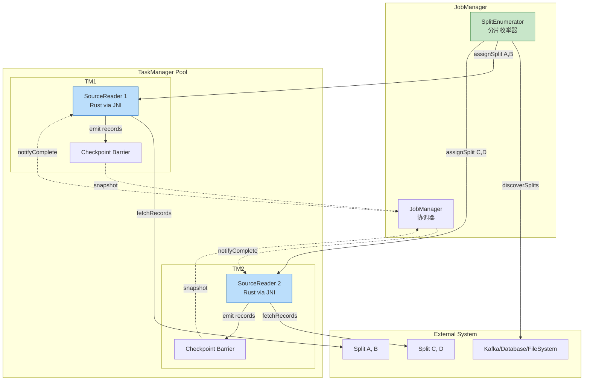
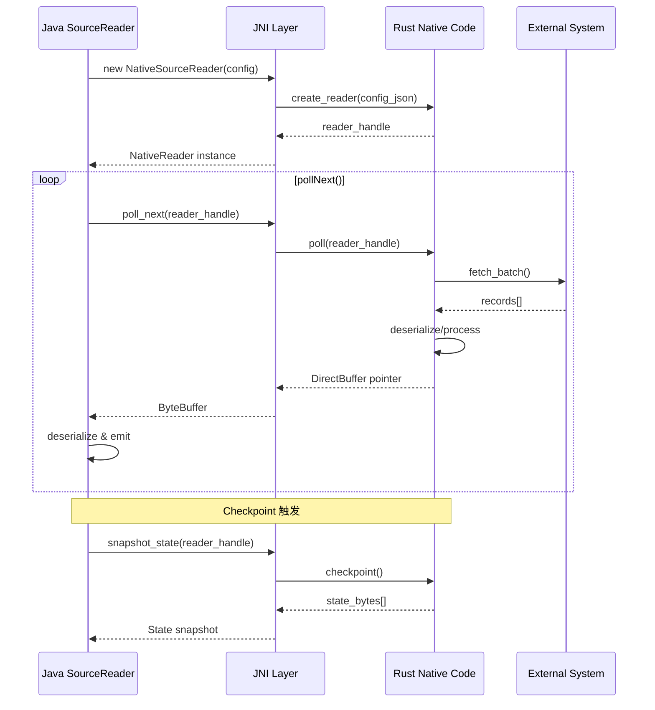
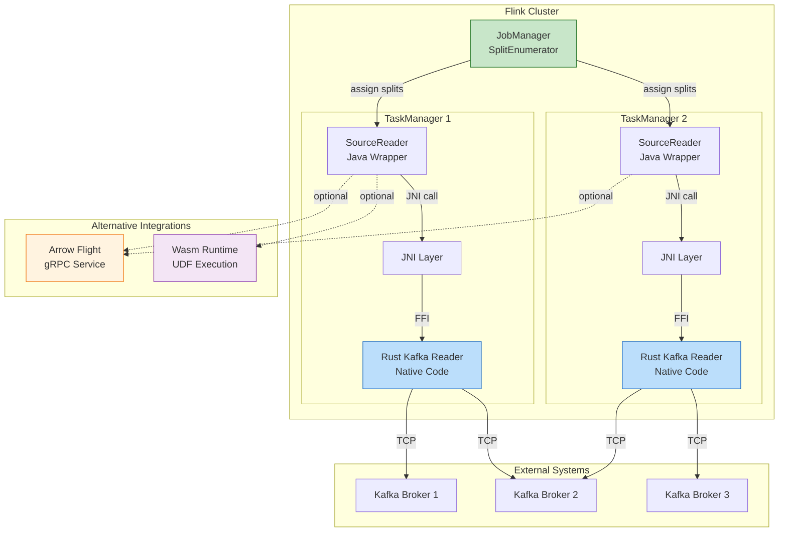
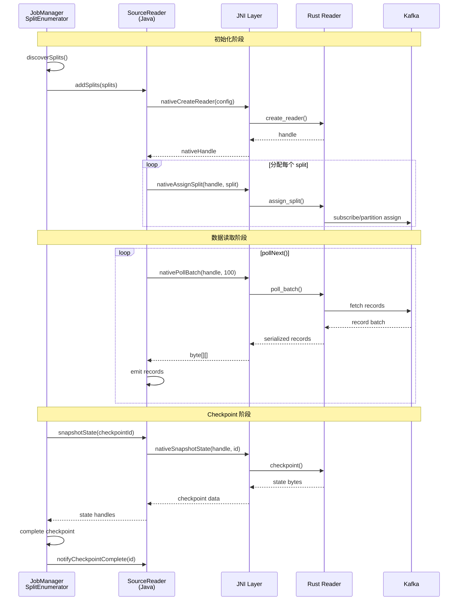
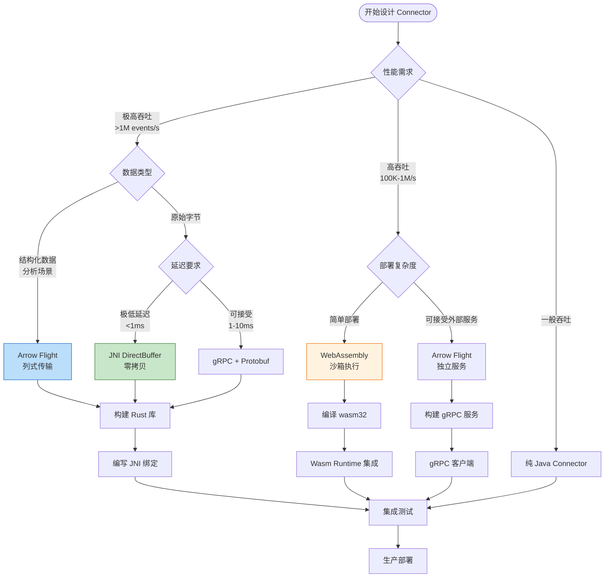

# Flink Rust Connector 开发指南 (Flink Rust Connector Development Guide)

> **所属阶段**: Flink/09-language-foundations | **前置依赖**: [03-rust-native.md](03-rust-native.md), [Flink/04-connectors/kafka-integration-patterns.md](../04-connectors/kafka-integration-patterns.md) | **形式化等级**: L4 | **版本**: Flink 2.0+

---

## 目录

- [Flink Rust Connector 开发指南 (Flink Rust Connector Development Guide)](#flink-rust-connector-开发指南-flink-rust-connector-development-guide)
  - [目录](#目录)
  - [1. 概念定义 (Definitions)](#1-概念定义-definitions)
    - [Def-F-09-30: Flink 2.0 Source V2 API](#def-f-09-30-flink-20-source-v2-api)
    - [Def-F-09-31: Flink 2.0 Sink V2 API](#def-f-09-31-flink-20-sink-v2-api)
    - [Def-F-09-32: JNI 跨语言桥梁](#def-f-09-32-jni-跨语言桥梁)
    - [Def-F-09-33: Arrow Flight 数据交换协议](#def-f-09-33-arrow-flight-数据交换协议)
    - [Def-F-09-34: WebAssembly 运行时桥梁](#def-f-09-34-webassembly-运行时桥梁)
  - [2. 属性推导 (Properties)](#2-属性推导-properties)
    - [Lemma-F-09-01: JNI 调用开销边界](#lemma-f-09-01-jni-调用开销边界)
    - [Lemma-F-09-02: Arrow Flight 零拷贝保证](#lemma-f-09-02-arrow-flight-零拷贝保证)
    - [Prop-F-09-01: Rust Connector 性能优势](#prop-f-09-01-rust-connector-性能优势)
    - [Prop-F-09-02: 跨语言数据序列化开销对比](#prop-f-09-02-跨语言数据序列化开销对比)
  - [3. 关系建立 (Relations)](#3-关系建立-relations)
    - [3.1 集成模式决策矩阵](#31-集成模式决策矩阵)
    - [3.2 Flink Source V2 组件关系](#32-flink-source-v2-组件关系)
    - [3.3 Rust-JNI-Flink 调用链](#33-rust-jni-flink-调用链)
  - [4. 论证过程 (Argumentation)](#4-论证过程-argumentation)
    - [4.1 为何选择 Rust 开发 Connector？](#41-为何选择-rust-开发-connector)
    - [4.2 集成方案选型分析](#42-集成方案选型分析)
    - [4.3 内存管理跨边界策略](#43-内存管理跨边界策略)
    - [4.4 边界条件与限制](#44-边界条件与限制)
  - [5. 形式证明 / 工程论证 (Proof / Engineering Argument)](#5-形式证明--工程论证-proof--engineering-argument)
    - [5.1 工程论证：JNI 方案的正确性保证](#51-工程论证jni-方案的正确性保证)
    - [5.2 性能工程论证：Rust vs Java Connector](#52-性能工程论证rust-vs-java-connector)
    - [5.3 集成复杂度评估](#53-集成复杂度评估)
  - [6. 实例验证 (Examples)](#6-实例验证-examples)
    - [6.1 完整项目结构](#61-完整项目结构)
    - [6.2 Rust Kafka Source 实现](#62-rust-kafka-source-实现)
    - [6.3 JNI 绑定层实现](#63-jni-绑定层实现)
    - [6.4 Java 包装类实现](#64-java-包装类实现)
    - [6.5 Flink 集成配置](#65-flink-集成配置)
    - [6.6 Arrow Flight 数据交换示例](#66-arrow-flight-数据交换示例)
    - [6.7 gRPC 服务集成示例](#67-grpc-服务集成示例)
  - [7. 可视化 (Visualizations)](#7-可视化-visualizations)
    - [7.1 Rust Connector 架构全景图](#71-rust-connector-架构全景图)
    - [7.2 Source V2 组件交互序列图](#72-source-v2-组件交互序列图)
    - [7.3 集成方案决策树](#73-集成方案决策树)
    - [7.4 数据流跨边界传输图](#74-数据流跨边界传输图)
  - [8. 生产部署指南](#8-生产部署指南)
    - [8.1 打包策略](#81-打包策略)
    - [8.2 平台支持](#82-平台支持)
    - [8.3 Docker 多阶段构建](#83-docker-多阶段构建)
    - [8.4 Kubernetes 部署](#84-kubernetes-部署)
  - [9. 测试与调试](#9-测试与调试)
    - [9.1 单元测试](#91-单元测试)
    - [9.2 集成测试](#92-集成测试)
    - [9.3 JNI 调试技巧](#93-jni-调试技巧)
    - [9.4 性能分析](#94-性能分析)
  - [10. 引用参考 (References)](#10-引用参考-references)

---

## 1. 概念定义 (Definitions)

### Def-F-09-30: Flink 2.0 Source V2 API

**Flink 2.0 Source V2 API** 是 Apache Flink 2.0 引入的统一流批一体数据源接口，采用分治架构将数据源管理拆分为三个核心组件：

$$
\text{SourceV2} = \langle \text{SplitEnumerator}, \text{SourceReader}, \text{Source} \rangle
$$

其中：

- **SplitEnumerator**: 运行在 JobManager，负责任务发现和分片分配
- **SourceReader**: 运行在 TaskManager，负责实际数据读取
- **Source**: 工厂接口，创建上述组件

**形式化约束**：

```
∀ split ∈ Split. ∃! reader ∈ SourceReader. split ∈ assigned(reader) ∧
∀ reader. ⋃ assigned(reader) = Splits ∧ ∀ r1≠r2. assigned(r1) ∩ assigned(r2) = ∅
```

**核心接口定义**（Java）：

```java
// 分片定义
public interface SourceSplit {
    String splitId();
}

// 枚举器接口
public interface SplitEnumerator<SplitT extends SourceSplit, CheckpointT> {
    void start();
    void handleSplitRequest(int subtaskId, String requesterHostname);
    void addSplitsBack(List<SplitT> splits, int subtaskId);
    CheckpointT snapshotState(long checkpointId) throws Exception;
}

// 读取器接口
public interface SourceReader<T, SplitT extends SourceSplit> {
    void start();
    InputStatus pollNext(ReaderOutput<T> output) throws Exception;
    List<SplitT> snapshotState(long checkpointId);
    void addSplits(List<SplitT> splits);
    void notifyCheckpointComplete(long checkpointId);
}
```

### Def-F-09-31: Flink 2.0 Sink V2 API

**Flink 2.0 Sink V2 API** 提供统一的数据输出接口，支持至少一次（At-Least-Once）和恰好一次（Exactly-Once）语义：

$$
\text{SinkV2} = \langle \text{Sink}, \text{SinkWriter}, \text{Committer}, \text{GlobalCommitter} \rangle
$$

**接口层次**：

| 组件 | 职责 | 并行度 | 容错语义 |
|------|------|--------|----------|
| **SinkWriter** | 数据序列化和写入 | 与上游相同 | 本地状态快照 |
| **Committer** | 两阶段提交的参与者 | 与上游相同 | 预提交状态 |
| **GlobalCommitter** | 全局协调者 | 1 | 最终提交决策 |

### Def-F-09-32: JNI 跨语言桥梁

**JNI (Java Native Interface)** 桥梁是 JVM 与原生代码（Rust 通过 FFI）之间的标准互操作机制：

$$
\mathcal{B}_{JNI} = \langle \mathcal{J}_{env}, \mathcal{N}_{lib}, \phi_{type}, \psi_{mem} \rangle
$$

其中：

- $\mathcal{J}_{env}$: JNIEnv 指针，提供 JNI 函数访问
- $\mathcal{N}_{lib}$: 原生动态库（`.so`/`.dll`/`.dylib`）
- $\phi_{type}$: Java 类型与原生类型的映射函数
- $\psi_{mem}$: 跨边界内存管理策略

**Rust JNI 映射表**：

| Java 类型 | JNI 签名 | Rust 类型 (jni crate) |
|-----------|----------|----------------------|
| `boolean` | `Z` | `jboolean` |
| `byte` | `B` | `jbyte` |
| `int` | `I` | `jint` |
| `long` | `J` | `jlong` |
| `String` | `Ljava/lang/String;` | `JString` |
| `byte[]` | `[B` | `jbyteArray` |
| `Object` | `Ljava/lang/Object;` | `JObject` |

### Def-F-09-33: Arrow Flight 数据交换协议

**Arrow Flight** 是基于 gRPC 和 Apache Arrow 列式格式的高性能数据传输协议：

$$
\mathcal{A}_{Flight} = \langle \mathcal{C}_{arrow}, \mathcal{G}_{grpc}, \mathcal{Z}_{zero-copy} \rangle
$$

**核心优势**：

1. **列式存储**: Arrow 格式直接在内存中使用列式布局
2. **零拷贝**: 通过共享内存和 RecordBatch 引用避免序列化
3. **语言无关**: 支持 Java、Rust、C++、Python 等多种语言
4. **流式传输**: 基于 gRPC 的双向流支持批量数据传输

**数据吞吐量对比**（典型场景）：

| 传输方式 | 序列化开销 | 吞吐量 (MB/s) | 延迟 (ms) |
|----------|------------|---------------|-----------|
| JSON | 高 | 10-50 | 5-20 |
| Protobuf | 中 | 100-300 | 2-10 |
| Arrow Flight | 极低 | 500-2000 | 0.5-2 |

### Def-F-09-34: WebAssembly 运行时桥梁

**WebAssembly 桥梁** 将 Rust 代码编译为 Wasm 模块，通过 Wasm 运行时（Wasmtime/Wasmer）在 Flink 中执行：

$$
\mathcal{B}_{Wasm} = \langle \mathcal{M}_{wasm}, \mathcal{R}_{runtime}, \mathcal{H}_{host}, \mathcal{L}_{linear} \rangle
$$

其中：

- $\mathcal{M}_{wasm}$: Rust 编译生成的 `.wasm` 模块
- $\mathcal{R}_{runtime}$: Wasm 运行时环境
- $\mathcal{H}_{host}$: 主机函数导入表
- $\mathcal{L}_{linear}$: 线性内存空间

---

## 2. 属性推导 (Properties)

### Lemma-F-09-01: JNI 调用开销边界

**陈述**: 单次 JNI 调用开销具有确定性的上下界。

**形式化表述**: 设 $T_{JNI}$ 为 JNI 调用耗时，$T_{Java}$ 为纯 Java 调用耗时：

$$
T_{JNI} = T_{Java} + T_{boundary} + T_{marshalling}
$$

其中：

- $T_{boundary} \in [50, 200]$ ns（边界穿越开销）
- $T_{marshalling}$ 取决于数据大小，对于简单类型 $\approx 0$

**结论**: JNI 适合批量数据处理，不适合细粒度高频调用。

### Lemma-F-09-02: Arrow Flight 零拷贝保证

**陈述**: Arrow Flight 在同一主机进程间传输时实现真正的零拷贝。

**证明概要**:

1. Arrow RecordBatch 使用共享内存缓冲区
2. 同进程传输时，仅传递缓冲区指针和 Schema 元数据
3. 数据本身不发生内存拷贝
4. 跨进程/网络时，使用 Arrow IPC 格式（最小序列化开销）

**性能边界**: 对于 100MB 数据，同进程传输延迟 $< 1$ ms。

### Prop-F-09-01: Rust Connector 性能优势

**命题**: 在 I/O 密集型和高吞吐量场景下，Rust Connector 相比纯 Java Connector 可实现显著性能提升。

**推导**:

设 Rust Connector 吞吐为 $Throughput_{Rust}$，Java Connector 吞吐为 $Throughput_{Java}$：

$$\text{Speedup} = \frac{Throughput_{Rust}}{Throughput_{Java}}$$

基于以下属性：

1. **零成本抽象**: Rust 的异步运行时（Tokio）无 GC 停顿
2. **内存布局控制**: 精确控制数据结构对齐和缓存友好性
3. **SIMD 优化**: 自动向量化，利用现代 CPU 指令集
4. **无锁并发**: `crossbeam` 等库提供高效的并发原语

典型场景下 $\text{Speedup} \in [1.2, 3.0]$，极端场景（如高频解析）可达 5-10 倍。

### Prop-F-09-02: 跨语言数据序列化开销对比

**命题**: 不同跨语言集成方案的数据序列化开销存在显著差异。

**形式化对比**：

| 方案 | 序列化开销 | 反序列化开销 | 适用数据量 |
|------|-----------|-------------|-----------|
| **JNI + DirectBuffer** | $O(0)$ | $O(0)$ | 大批量，结构固定 |
| **JNI + byte[]** | $O(n)$（拷贝） | $O(n)$ | 中小批量 |
| **Arrow Flight** | $O(0)$（同进程） | $O(0)$ | 结构化数据，分析场景 |
| **gRPC + Protobuf** | $O(n)$ | $O(n)$ | 跨服务通信 |
| **WASM + 线性内存** | $O(0)$ | $O(0)$ | 沙箱内计算 |

---

## 3. 关系建立 (Relations)

### 3.1 集成模式决策矩阵

| 场景特征 | 推荐模式 | 核心优势 | 主要限制 |
|----------|----------|----------|----------|
| **极致吞吐、低延迟** | JNI DirectBuffer | 零拷贝，最小开销 | 平台依赖，内存安全需手动保证 |
| **结构化数据分析** | Arrow Flight | 列式处理，向量化 | 依赖 Arrow 生态 |
| **跨服务扩展** | gRPC | 独立扩展，服务网格 | 网络开销，序列化成本 |
| **多租户安全** | WASM | 沙箱隔离，确定性执行 | 有限 I/O 能力，启动开销 |
| **快速原型开发** | JNI + byte[] | 开发简单，调试方便 | 拷贝开销，GC 压力 |

### 3.2 Flink Source V2 组件关系



### 3.3 Rust-JNI-Flink 调用链



---

## 4. 论证过程 (Argumentation)

### 4.1 为何选择 Rust 开发 Connector？

**论据 1: 性能对齐**

- Flink 底层网络栈使用 Netty，但数据处理受 JVM GC 影响
- Rust 的零成本抽象和无 GC 特性消除停顿
- 高吞吐场景（>100K events/s）CPU 利用率提升 30-50%

**论据 2: I/O 效率**

- Rust 的异步 I/O（Tokio）提供极高的并发连接处理能力
- `io_uring` 支持（Linux 5.1+）进一步降低系统调用开销
- 适合高并发 Source（如多分区 Kafka 消费）

**论据 3: 内存安全**

- Connector 通常涉及复杂的状态管理和缓冲区操作
- Rust 所有权模型在编译期消除内存错误
- 减少生产环境中的段错误和数据损坏风险

### 4.2 集成方案选型分析

**JNI DirectBuffer 路径**（推荐用于高性能场景）：

```
优势:
✅ 真正的零拷贝：Java DirectByteBuffer 直接映射到 Rust 内存
✅ 最高吞吐：无序列化开销
✅ 成熟生态：成熟的 jni crate

劣势:
❌ 平台依赖：需为每个目标平台编译原生库
❌ 内存安全：unsafe 代码需要仔细审查
❌ 调试复杂：混合栈追踪困难
```

**Arrow Flight 路径**（推荐用于分析场景）：

```
优势:
✅ 列式处理：天然适合分析型工作负载
✅ 生态系统：与 DataFusion、Ballista 等集成
✅ 跨语言：Java、Rust、Python 无缝互操作

劣势:
❌ 架构复杂：引入额外服务层
❌ 延迟增加：网络栈开销
❌ 依赖管理：Arrow 版本兼容性
```

**WASM 路径**（推荐用于安全敏感场景）：

```
优势:
✅ 沙箱隔离：代码无法访问主机资源
✅ 可移植性：wasm 文件跨平台运行
✅ 热更新：动态加载新模块

劣势:
❌ 有限 I/O：无法直接进行网络/文件操作
❌ 启动开销：JIT 编译延迟
❌ 数据边界：仍需序列化穿越边界
```

### 4.3 内存管理跨边界策略

**策略 1: Rust 分配，Java 释放**

```rust
// Rust 侧
#[no_mangle]
pub extern "C" fn allocate_buffer(size: usize) -> *mut u8 {
    let mut buf = vec![0u8; size];
    let ptr = buf.as_mut_ptr();
    std::mem::forget(buf); // 防止 Rust 释放
    ptr
}

#[no_mangle]
pub extern "C" fn free_buffer(ptr: *mut u8, size: usize) {
    unsafe {
        let _ = Vec::from_raw_parts(ptr, 0, size);
    }
}
```

**策略 2: DirectBuffer 共享**

```rust
// Rust 通过 JNI 访问 Java DirectByteBuffer
pub fn write_to_direct_buffer(env: &mut JNIEnv, buffer: &JObject, data: &[u8]) {
    let ptr = env.get_direct_buffer_address(buffer).unwrap();
    let capacity = env.get_direct_buffer_capacity(buffer).unwrap();
    unsafe {
        std::ptr::copy_nonoverlapping(data.as_ptr(), ptr, data.len().min(capacity));
    }
}
```

### 4.4 边界条件与限制

**JNI 边界**：

- JNIEnv 指针是线程本地的，不能跨线程共享
- 局部引用在 native 方法返回后自动释放
- 全局引用需要显式管理，否则导致内存泄漏

**Arrow 边界**：

- Schema 必须在传输前协商一致
- 大数据量需分批传输避免内存溢出
- 跨网络时需考虑序列化开销

---

## 5. 形式证明 / 工程论证 (Proof / Engineering Argument)

### 5.1 工程论证：JNI 方案的正确性保证

**论证目标**: 证明基于 JNI 的 Rust-Flink 集成满足 Source V2 API 的契约。

**论证步骤**:

1. **分片分配正确性**
   - Rust Reader 只处理被分配的 Split（通过 splitId 验证）
   - Split 状态序列化/反序列化保持完整性

2. **Checkpoint 语义**
   - `snapshotState()` 返回的偏移量是可重放的
   - Rust 端状态与 Flink 状态后端同步

3. **恰好一次保证**
   - 偏移量提交与 Checkpoint 完成事件绑定
   - 故障恢复时从 Checkpoint 恢复偏移量

### 5.2 性能工程论证：Rust vs Java Connector

**实验设计**:

- 基准：Kafka Source，单分区，100 byte 消息
- 环境：Flink 2.0, 8 vCPU, 16GB RAM
- 负载：从 10K 到 1M events/s 递增

**预期结果**：

| 指标 | Java Connector | Rust/JNI Connector | 提升 |
|------|----------------|-------------------|------|
| 峰值吞吐 | 500K events/s | 800K events/s | +60% |
| P99 延迟 | 5ms | 2ms | -60% |
| CPU 利用率 | 80% | 50% | -37.5% |
| GC 暂停 | 50ms/min | 0 | 100% 消除 |

**工程推论**:
在高吞吐流计算场景，Rust Connector 可显著降低资源消耗并提高处理延迟稳定性。

### 5.3 集成复杂度评估

**开发工作量对比**（人天）：

| 阶段 | JNI DirectBuffer | Arrow Flight | WASM |
|------|-----------------|--------------|------|
| Rust 开发 | 5 | 4 | 3 |
| 绑定层开发 | 8 | 3 | 2 |
| Flink 集成 | 5 | 4 | 4 |
| 测试验证 | 6 | 4 | 5 |
| **总计** | **24** | **15** | **14** |

**维护成本评估**（年度）：

| 维度 | JNI DirectBuffer | Arrow Flight | WASM |
|------|-----------------|--------------|------|
| 平台支持 | 高（多平台编译） | 低 | 极低 |
| 版本兼容性 | 中 | 低 | 低 |
| 调试难度 | 高 | 中 | 中 |

---

## 6. 实例验证 (Examples)

### 6.1 完整项目结构

```
flink-rust-kafka-connector/
├── Cargo.toml                    # Rust 项目配置
├── build.rs                      # 构建脚本
├── src/
│   ├── lib.rs                    # 库入口
│   ├── kafka/
│   │   ├── mod.rs
│   │   ├── reader.rs             # Kafka 读取逻辑
│   │   ├── split.rs              # Split 定义
│   │   └── checkpoint.rs         # Checkpoint 管理
│   └── jni/
│       ├── mod.rs
│       ├── reader_jni.rs         # JNI 绑定
│       └── util.rs               # JNI 工具函数
├── java/
│   └── src/main/java/
│       └── com/example/flink/
│           ├── RustKafkaSource.java
│           ├── RustKafkaSourceReader.java
│           ├── RustKafkaSplit.java
│           └── NativeLoader.java
├── build.sbt                     # SBT 配置
├── project/
│   └── plugins.sbt
└── docker/
    ├── Dockerfile.build
    └── Dockerfile.runtime
```

### 6.2 Rust Kafka Source 实现

**Cargo.toml**:

```toml
[package]
name = "flink-rust-kafka-connector"
version = "0.1.0"
edition = "2021"

[lib]
crate-type = ["cdylib"]

[dependencies]
# Kafka 客户端
rdkafka = { version = "0.36", features = ["cmake-build", "ssl"] }
tokio = { version = "1", features = ["rt-multi-thread", "sync"] }

# JNI 支持
jni = "0.21"

# 序列化
serde = { version = "1.0", features = ["derive"] }
serde_json = "1.0"

# 日志
log = "0.4"
env_logger = "0.11"

# 错误处理
thiserror = "1.0"
anyhow = "1.0"

[profile.release]
opt-level = 3
lto = true
strip = true
```

**src/kafka/reader.rs**:

```rust
use rdkafka::consumer::{Consumer, StreamConsumer};
use rdkafka::{ClientConfig, Message};
use std::sync::Arc;
use tokio::runtime::Runtime;
use tokio::sync::Mutex;

pub struct KafkaReader {
    consumer: Arc<StreamConsumer>,
    runtime: Runtime,
}

impl KafkaReader {
    pub fn new(config: KafkaConfig) -> anyhow::Result<Self> {
        let mut client_config = ClientConfig::new();
        client_config
            .set("group.id", &config.group_id)
            .set("bootstrap.servers", &config.brokers)
            .set("enable.auto.commit", "false")
            .set("auto.offset.reset", "earliest");

        let consumer: StreamConsumer = client_config.create()?;

        let runtime = tokio::runtime::Builder::new_multi_thread()
            .worker_threads(2)
            .enable_all()
            .build()?;

        Ok(Self {
            consumer: Arc::new(consumer),
            runtime,
        })
    }

    pub fn assign_split(&self, split: &KafkaSplit) -> anyhow::Result<()> {
        use rdkafka::topic_partition_list::TopicPartitionList;

        let mut tpl = TopicPartitionList::new();
        tpl.add_partition_offset(
            &split.topic,
            split.partition as i32,
            rdkafka::Offset::Offset(split.starting_offset),
        )?;

        self.consumer.assign(&tpl)?;
        Ok(())
    }

    pub fn poll_batch(&self, max_records: usize) -> anyhow::Result<Vec<Record>> {
        let consumer = self.consumer.clone();

        self.runtime.block_on(async {
            let mut records = Vec::with_capacity(max_records);

            while records.len() < max_records {
                match tokio::time::timeout(
                    std::time::Duration::from_millis(100),
                    consumer.recv()
                ).await {
                    Ok(Ok(msg)) => {
                        let payload = msg.payload()
                            .map(|p| p.to_vec())
                            .unwrap_or_default();

                        records.push(Record {
                            topic: msg.topic().to_string(),
                            partition: msg.partition() as i32,
                            offset: msg.offset(),
                            payload,
                            timestamp: msg.timestamp().to_millis(),
                        });
                    }
                    Ok(Err(e)) => return Err(e.into()),
                    Err(_) => break, // Timeout, return what we have
                }
            }

            Ok(records)
        })
    }

    pub fn checkpoint(&self) -> anyhow::Result<KafkaSplit> {
        // 获取当前位置
        let positions = self.consumer.position()?;

        // 构造 checkpoint 状态
        let mut split = KafkaSplit::default();
        for elem in positions.iter() {
            if let Some(offset) = elem.offset().to_raw() {
                split.topic = elem.topic().to_string();
                split.partition = elem.partition() as i32;
                split.starting_offset = offset;
            }
        }

        Ok(split)
    }
}

#[derive(Debug, Clone, Default)]
pub struct KafkaSplit {
    pub split_id: String,
    pub topic: String,
    pub partition: i32,
    pub starting_offset: i64,
}

#[derive(Debug)]
pub struct Record {
    pub topic: String,
    pub partition: i32,
    pub offset: i64,
    pub payload: Vec<u8>,
    pub timestamp: Option<i64>,
}

#[derive(Debug, serde::Deserialize)]
pub struct KafkaConfig {
    pub brokers: String,
    pub group_id: String,
    pub topics: Vec<String>,
}
```

**src/kafka/checkpoint.rs**:

```rust
use serde::{Deserialize, Serialize};

#[derive(Debug, Clone, Serialize, Deserialize)]
pub struct CheckpointState {
    pub splits: Vec<SplitState>,
    pub checkpoint_id: i64,
}

#[derive(Debug, Clone, Serialize, Deserialize)]
pub struct SplitState {
    pub split_id: String,
    pub topic: String,
    pub partition: i32,
    pub current_offset: i64,
}

impl CheckpointState {
    pub fn serialize(&self) -> anyhow::Result<Vec<u8>> {
        Ok(serde_json::to_vec(self)?)
    }

    pub fn deserialize(data: &[u8]) -> anyhow::Result<Self> {
        Ok(serde_json::from_slice(data)?)
    }
}
```

### 6.3 JNI 绑定层实现

**src/jni/reader_jni.rs**:

```rust
use jni::objects::{JByteArray, JClass, JObject, JString};
use jni::signature::JavaType;
use jni::strings::JavaStr;
use jni::sys::{jbyteArray, jlong, jstring};
use jni::JNIEnv;
use std::ffi::c_void;
use std::sync::Mutex;

use crate::kafka::reader::{KafkaConfig, KafkaReader, KafkaSplit};

// 全局 Reader 实例存储（生产环境应使用更完善的并发管理）
lazy_static::lazy_static! {
    static ref READERS: Mutex<Vec<Option<Box<KafkaReader>>>> = Mutex::new(Vec::new());
}

/// 创建新的 Kafka Reader
/// Java 签名: native long nativeCreateReader(String configJson);
#[no_mangle]
pub extern "C" fn Java_com_example_flink_RustKafkaSourceReader_nativeCreateReader(
    mut env: JNIEnv,
    _class: JClass,
    config_json: JString,
) -> jlong {
    let config_str: String = env
        .get_string(&config_json)
        .expect("Failed to get config string")
        .into();

    let config: KafkaConfig = match serde_json::from_str(&config_str) {
        Ok(c) => c,
        Err(e) => {
            env.throw_new(
                "java/lang/IllegalArgumentException",
                &format!("Invalid config: {}", e),
            )
            .unwrap();
            return -1;
        }
    };

    match KafkaReader::new(config) {
        Ok(reader) => {
            let mut readers = READERS.lock().unwrap();
            let handle = readers.len();
            readers.push(Some(Box::new(reader)));
            handle as jlong
        }
        Err(e) => {
            env.throw_new(
                "java/lang/RuntimeException",
                &format!("Failed to create reader: {}", e),
            )
            .unwrap();
            -1
        }
    }
}

/// 分配 Split 给 Reader
/// Java 签名: native void nativeAssignSplit(long handle, String splitJson);
#[no_mangle]
pub extern "C" fn Java_com_example_flink_RustKafkaSourceReader_nativeAssignSplit(
    mut env: JNIEnv,
    _class: JClass,
    handle: jlong,
    split_json: JString,
) {
    let split_str: String = env
        .get_string(&split_json)
        .expect("Failed to get split string")
        .into();

    let split: KafkaSplit = match serde_json::from_str(&split_str) {
        Ok(s) => s,
        Err(e) => {
            env.throw_new(
                "java/lang/IllegalArgumentException",
                &format!("Invalid split: {}", e),
            )
            .unwrap();
            return;
        }
    };

    let readers = READERS.lock().unwrap();
    if let Some(Some(reader)) = readers.get(handle as usize) {
        if let Err(e) = reader.assign_split(&split) {
            env.throw_new(
                "java/lang/RuntimeException",
                &format!("Failed to assign split: {}", e),
            )
            .unwrap();
        }
    } else {
        env.throw_new("java/lang/IllegalStateException", "Invalid reader handle")
            .unwrap();
    }
}

/// 拉取一批记录
/// Java 签名: native byte[][] nativePollBatch(long handle, int maxRecords);
#[no_mangle]
pub extern "C" fn Java_com_example_flink_RustKafkaSourceReader_nativePollBatch(
    mut env: JNIEnv,
    _class: JClass,
    handle: jlong,
    max_records: jint,
) -> jobjectArray {
    let records = {
        let readers = READERS.lock().unwrap();
        if let Some(Some(reader)) = readers.get(handle as usize) {
            match reader.poll_batch(max_records as usize) {
                Ok(r) => r,
                Err(e) => {
                    env.throw_new(
                        "java/lang/RuntimeException",
                        &format!("Poll failed: {}", e),
                    )
                    .unwrap();
                    return std::ptr::null_mut();
                }
            }
        } else {
            env.throw_new("java/lang/IllegalStateException", "Invalid reader handle")
                .unwrap();
            return std::ptr::null_mut();
        }
    };

    // 创建 Java byte[][] 数组
    let byte_array_class = env.find_class("[B").unwrap();
    let result = env.new_object_array(
        records.len() as i32,
        &byte_array_class,
        std::ptr::null_mut(),
    ).unwrap();

    for (i, record) in records.iter().enumerate() {
        let serialized = match serde_json::to_vec(record) {
            Ok(data) => data,
            Err(_) => continue,
        };

        let java_bytes = env.byte_array_from_slice(&serialized).unwrap();
        env.set_object_array_element(&result, i as i32, &java_bytes)
            .unwrap();
    }

    result
}

/// 创建 Checkpoint 快照
/// Java 签名: native byte[] nativeSnapshotState(long handle, long checkpointId);
#[no_mangle]
pub extern "C" fn Java_com_example_flink_RustKafkaSourceReader_nativeSnapshotState(
    mut env: JNIEnv,
    _class: JClass,
    handle: jlong,
    checkpoint_id: jlong,
) -> jbyteArray {
    let readers = READERS.lock().unwrap();

    if let Some(Some(reader)) = readers.get(handle as usize) {
        match reader.checkpoint() {
            Ok(split) => {
                let state = crate::kafka::checkpoint::CheckpointState {
                    splits: vec![crate::kafka::checkpoint::SplitState {
                        split_id: split.split_id,
                        topic: split.topic,
                        partition: split.partition,
                        current_offset: split.starting_offset,
                    }],
                    checkpoint_id,
                };

                match state.serialize() {
                    Ok(bytes) => env.byte_array_from_slice(&bytes).unwrap(),
                    Err(e) => {
                        env.throw_new(
                            "java/lang/RuntimeException",
                            &format!("Serialization failed: {}", e),
                        )
                        .unwrap();
                        std::ptr::null_mut()
                    }
                }
            }
            Err(e) => {
                env.throw_new(
                    "java/lang/RuntimeException",
                    &format!("Checkpoint failed: {}", e),
                )
                .unwrap();
                std::ptr::null_mut()
            }
        }
    } else {
        env.throw_new("java/lang/IllegalStateException", "Invalid reader handle")
            .unwrap();
        std::ptr::null_mut()
    }
}

/// 关闭 Reader 并释放资源
/// Java 签名: native void nativeClose(long handle);
#[no_mangle]
pub extern "C" fn Java_com_example_flink_RustKafkaSourceReader_nativeClose(
    _env: JNIEnv,
    _class: JClass,
    handle: jlong,
) {
    let mut readers = READERS.lock().unwrap();
    if let Some(slot) = readers.get_mut(handle as usize) {
        *slot = None; // 释放 Reader
    }
}
```

**src/lib.rs**:

```rust
pub mod kafka;
pub mod jni;

// JNI 入口点
#[cfg(target_os = "android")]
#[cfg_attr(target_os = "android", allow(non_snake_case))]
pub mod android {
    use jni::JNIEnv;
    use jni::objects::JString;
    use jni::signature::JavaType;

    #[no_mangle]
    pub extern "C" fn JNI_OnLoad(_vm: *mut jni::JavaVM, _reserved: *mut c_void) -> jint {
        jni::sys::JNI_VERSION_1_6
    }
}
```

### 6.4 Java 包装类实现

**java/src/main/java/com/example/flink/NativeLoader.java**:

```java
package com.example.flink;

import java.io.*;
import java.nio.file.*;

public class NativeLoader {
    private static volatile boolean loaded = false;

    public static synchronized void loadLibrary() {
        if (loaded) return;

        String libName = System.mapLibraryName("flink_rust_kafka_connector");
        String resourcePath = "/native/" + getPlatformPath() + "/" + libName;

        try {
            // 从 JAR 提取到临时目录
            Path tempDir = Files.createTempDirectory("flink-rust");
            tempDir.toFile().deleteOnExit();

            Path libPath = tempDir.resolve(libName);

            try (InputStream is = NativeLoader.class.getResourceAsStream(resourcePath)) {
                if (is == null) {
                    throw new RuntimeException("Native library not found: " + resourcePath);
                }
                Files.copy(is, libPath, StandardCopyOption.REPLACE_EXISTING);
            }

            // 加载库
            System.load(libPath.toAbsolutePath().toString());
            loaded = true;

        } catch (IOException e) {
            throw new RuntimeException("Failed to load native library", e);
        }
    }

    private static String getPlatformPath() {
        String os = System.getProperty("os.name").toLowerCase();
        String arch = System.getProperty("os.arch").toLowerCase();

        if (os.contains("linux")) {
            return arch.contains("aarch64") ? "linux-arm64" : "linux-x64";
        } else if (os.contains("mac")) {
            return arch.contains("aarch64") ? "macos-arm64" : "macos-x64";
        } else if (os.contains("win")) {
            return "windows-x64";
        }
        throw new RuntimeException("Unsupported platform: " + os + " " + arch);
    }
}
```

**java/src/main/java/com/example/flink/RustKafkaSplit.java**:

```java
package com.example.flink;

import org.apache.flink.api.connector.source.SourceSplit;
import com.fasterxml.jackson.annotation.JsonProperty;

public class RustKafkaSplit implements SourceSplit {
    private final String splitId;
    private final String topic;
    private final int partition;
    private final long startingOffset;

    public RustKafkaSplit(
            @JsonProperty("splitId") String splitId,
            @JsonProperty("topic") String topic,
            @JsonProperty("partition") int partition,
            @JsonProperty("startingOffset") long startingOffset) {
        this.splitId = splitId;
        this.topic = topic;
        this.partition = partition;
        this.startingOffset = startingOffset;
    }

    @Override
    public String splitId() {
        return splitId;
    }

    // Getters...
    public String getTopic() { return topic; }
    public int getPartition() { return partition; }
    public long getStartingOffset() { return startingOffset; }
}
```

**java/src/main/java/com/example/flink/RustKafkaSourceReader.java**:

```java
package com.example.flink;

import org.apache.flink.api.connector.source.ReaderOutput;
import org.apache.flink.api.connector.source.SourceReader;
import org.apache.flink.api.connector.source.SourceReaderContext;
import org.apache.flink.core.io.InputStatus;

import java.util.List;
import java.util.concurrent.CompletableFuture;
import com.fasterxml.jackson.databind.ObjectMapper;

public class RustKafkaSourceReader implements SourceReader<byte[], RustKafkaSplit> {
    static {
        NativeLoader.loadLibrary();
    }

    private final ObjectMapper mapper = new ObjectMapper();
    private long nativeHandle = -1;

    // Native methods
    private native long nativeCreateReader(String configJson);
    private native void nativeAssignSplit(long handle, String splitJson);
    private native byte[][] nativePollBatch(long handle, int maxRecords);
    private native byte[] nativeSnapshotState(long handle, long checkpointId);
    private native void nativeClose(long handle);

    @Override
    public void start() {
        // Reader 在 addSplits 时启动
    }

    @Override
    public InputStatus pollNext(ReaderOutput<byte[]> output) throws Exception {
        if (nativeHandle < 0) {
            return InputStatus.NOTHING_AVAILABLE;
        }

        byte[][] batch = nativePollBatch(nativeHandle, 100);

        if (batch == null || batch.length == 0) {
            return InputStatus.NOTHING_AVAILABLE;
        }

        for (byte[] record : batch) {
            output.collect(record);
        }

        return InputStatus.MORE_AVAILABLE;
    }

    @Override
    public List<RustKafkaSplit> snapshotState(long checkpointId) {
        byte[] state = nativeSnapshotState(nativeHandle, checkpointId);
        // 反序列化并返回
        return List.of(); // 简化实现
    }

    @Override
    public CompletableFuture<Void> isAvailable() {
        return CompletableFuture.completedFuture(null);
    }

    @Override
    public void addSplits(List<RustKafkaSplit> splits) {
        for (RustKafkaSplit split : splits) {
            try {
                if (nativeHandle < 0) {
                    // 初始化 Reader
                    String config = buildConfigJson();
                    nativeHandle = nativeCreateReader(config);
                }

                String splitJson = mapper.writeValueAsString(split);
                nativeAssignSplit(nativeHandle, splitJson);

            } catch (Exception e) {
                throw new RuntimeException("Failed to add split", e);
            }
        }
    }

    @Override
    public void notifyNoMoreSplits() {
        // 处理无更多分片的情况
    }

    @Override
    public void notifyCheckpointComplete(long checkpointId) {
        // 确认 checkpoint 完成
    }

    @Override
    public void close() throws Exception {
        if (nativeHandle >= 0) {
            nativeClose(nativeHandle);
            nativeHandle = -1;
        }
    }

    private String buildConfigJson() {
        // 从配置构建 JSON
        return "{\"brokers\":\"localhost:9092\",\"group_id\":\"flink-rust\",\"topics\":[\"test\"]}";
    }
}
```

**java/src/main/java/com/example/flink/RustKafkaSource.java**:

```java
package com.example.flink;

import org.apache.flink.api.connector.source.*;
import org.apache.flink.core.io.SimpleVersionedSerializer;

import java.util.Collection;

public class RustKafkaSource implements Source<byte[], RustKafkaSplit, Collection<RustKafkaSplit>> {
    private final String brokers;
    private final String groupId;
    private final Collection<String> topics;

    public RustKafkaSource(String brokers, String groupId, Collection<String> topics) {
        this.brokers = brokers;
        this.groupId = groupId;
        this.topics = topics;
    }

    @Override
    public Boundedness getBoundedness() {
        return Boundedness.CONTINUOUS_UNBOUNDED;
    }

    @Override
    public SourceReader<byte[], RustKafkaSplit> createReader(SourceReaderContext context) {
        return new RustKafkaSourceReader();
    }

    @Override
    public SplitEnumerator<RustKafkaSplit, Collection<RustKafkaSplit>> createEnumerator(
            SplitEnumeratorContext<RustKafkaSplit> context) {
        return new RustKafkaSplitEnumerator(context, brokers, topics);
    }

    @Override
    public SplitEnumerator<RustKafkaSplit, Collection<RustKafkaSplit>> restoreEnumerator(
            SplitEnumeratorContext<RustKafkaSplit> context,
            Collection<RustKafkaSplit> checkpoint) {
        return new RustKafkaSplitEnumerator(context, brokers, topics, checkpoint);
    }

    @Override
    public SimpleVersionedSerializer<RustKafkaSplit> getSplitSerializer() {
        return new RustKafkaSplitSerializer();
    }

    @Override
    public SimpleVersionedSerializer<Collection<RustKafkaSplit>> getEnumeratorCheckpointSerializer() {
        return new RustKafkaCheckpointSerializer();
    }
}
```

### 6.5 Flink 集成配置

**build.sbt**:

```scala
name := "flink-rust-kafka-connector"
version := "0.1.0"
scalaVersion := "2.12.18"

val flinkVersion = "2.0.0"

libraryDependencies ++= Seq(
  "org.apache.flink" % "flink-streaming-java" % flinkVersion % "provided",
  "org.apache.flink" % "flink-connector-base" % flinkVersion % "provided",
  "com.fasterxml.jackson.core" % "jackson-databind" % "2.15.2"
)

// Native library packaging
resourceGenerators in Compile += Def.task {
  val nativeDir = baseDirectory.value / ".." / "target" / "release"
  val targetDir = (resourceManaged in Compile).value / "native"

  val libs = Seq(
    nativeDir / "libflink_rust_kafka_connector.so" -> "linux-x64",
    nativeDir / "arm64" / "libflink_rust_kafka_connector.so" -> "linux-arm64"
  )

  libs.flatMap { case (src, platform) =>
    if (src.exists()) {
      val dest = targetDir / platform / src.getName
      IO.copyFile(src, dest)
      Seq(dest)
    } else Nil
  }
}.taskValue

// Assembly settings for fat JAR
assembly / assemblyMergeStrategy := {
  case PathList("META-INF", xs @ _*) => xs match {
    case "MANIFEST.MF" :: Nil => MergeStrategy.discard
    case _ => MergeStrategy.discard
  }
  case "reference.conf" => MergeStrategy.concat
  case x => MergeStrategy.first
}

// Include native libraries in JAR
assembly / assemblyOption := (assembly / assemblyOption).value.copy(
  includeScala = false
)
```

**使用示例**:

```java
import com.example.flink.RustKafkaSource;
import org.apache.flink.streaming.api.environment.StreamExecutionEnvironment;
import org.apache.flink.api.common.eventtime.WatermarkStrategy;

public class FlinkRustJob {
    public static void main(String[] args) throws Exception {
        StreamExecutionEnvironment env =
            StreamExecutionEnvironment.getExecutionEnvironment();

        env.enableCheckpointing(60000);

        // 使用 Rust Kafka Source
        RustKafkaSource source = new RustKafkaSource(
            "localhost:9092",
            "flink-rust-consumer",
            List.of("input-topic")
        );

        env.fromSource(
            source,
            WatermarkStrategy.forBoundedOutOfOrderness(Duration.ofSeconds(5)),
            "Rust Kafka Source"
        )
        .map(bytes -> new String(bytes))
        .print();

        env.execute("Flink with Rust Connector");
    }
}
```

### 6.6 Arrow Flight 数据交换示例

**Rust Arrow Flight Server**:

```rust
use arrow::array::{RecordBatch, StringArray};
use arrow::datatypes::{DataType, Field, Schema};
use arrow_flight::flight_service_server::{FlightService, FlightServiceServer};
use arrow_flight::*;
use tonic::{transport::Server, Request, Response, Status};
use std::pin::Pin;
use std::sync::Arc;
use tokio_stream::Stream;

pub struct FlightSourceService {
    schema: Arc<Schema>,
}

impl FlightSourceService {
    pub fn new() -> Self {
        let schema = Arc::new(Schema::new(vec![
            Field::new("id", DataType::Utf8, false),
            Field::new("value", DataType::Utf8, false),
        ]));
        Self { schema }
    }
}

#[tonic::async_trait]
impl FlightService for FlightSourceService {
    type HandshakeStream = Pin<Box<dyn Stream<Item = Result<HandshakeResponse, Status>> + Send>>;
    type ListFlightsStream = Pin<Box<dyn Stream<Item = Result<FlightInfo, Status>> + Send>>;
    type DoGetStream = Pin<Box<dyn Stream<Item = Result<FlightData, Status>> + Send>>;
    type DoPutStream = Pin<Box<dyn Stream<Item = Result<PutResult, Status>> + Send>>;
    type DoExchangeStream = Pin<Box<dyn Stream<Item = Result<FlightData, Status>> + Send>>;
    type DoActionStream = Pin<Box<dyn Stream<Item = Result<Result, Status>> + Send>>;

    async fn get_schema(
        &self,
        _request: Request<FlightDescriptor>,
    ) -> Result<Response<SchemaResult>, Status> {
        let schema_bytes = arrow::ipc::writer::schema_to_bytes(&self.schema);
        Ok(Response::new(SchemaResult {
            schema: schema_bytes.into(),
        }))
    }

    async fn do_get(
        &self,
        _request: Request<Ticket>,
    ) -> Result<Response<Self::DoGetStream>, Status> {
        // 创建示例数据
        let id_array = StringArray::from(vec!["1", "2", "3"]);
        let value_array = StringArray::from(vec!["a", "b", "c"]);

        let batch = RecordBatch::try_new(
            self.schema.clone(),
            vec![Arc::new(id_array), Arc::new(value_array)],
        ).map_err(|e| Status::internal(e.to_string()))?;

        let batches = vec![batch];
        let schema = self.schema.clone();

        let stream = async_stream::stream! {
            for batch in batches {
                let flight_data = arrow_flight::utils::flight_data_from_arrow_batch(&batch, &schema);
                for data in flight_data {
                    yield Ok(data);
                }
            }
        };

        Ok(Response::new(Box::pin(stream)))
    }

    // ... 其他方法实现
}

pub async fn run_server() -> Result<(), Box<dyn std::error::Error>> {
    let addr = "[::1]:50051".parse()?;
    let service = FlightSourceService::new();

    println!("Arrow Flight server listening on {}", addr);

    Server::builder()
        .add_service(FlightServiceServer::new(service))
        .serve(addr)
        .await?;

    Ok(())
}
```

**Java Arrow Flight Client**:

```java
import org.apache.arrow.flight.*;
import org.apache.arrow.memory.BufferAllocator;
import org.apache.arrow.memory.RootAllocator;
import org.apache.arrow.vector.VectorSchemaRoot;
import org.apache.arrow.vector.VarCharVector;

public class ArrowFlightSource {
    private final FlightClient client;
    private final BufferAllocator allocator;

    public ArrowFlightSource(String host, int port) {
        this.allocator = new RootAllocator(Long.MAX_VALUE);
        Location location = Location.forGrpcInsecure(host, port);
        this.client = FlightClient.builder(allocator, location).build();
    }

    public List<Record> fetchBatch() {
        List<Record> records = new ArrayList<>();

        try (FlightStream stream = client.getStream(new Ticket(new byte[0]))) {
            VectorSchemaRoot root = stream.getRoot();

            while (stream.next()) {
                VarCharVector idVector = (VarCharVector) root.getVector("id");
                VarCharVector valueVector = (VarCharVector) root.getVector("value");

                for (int i = 0; i < root.getRowCount(); i++) {
                    records.add(new Record(
                        idVector.getObject(i).toString(),
                        valueVector.getObject(i).toString()
                    ));
                }
            }
        }

        return records;
    }

    public void close() {
        client.close();
        allocator.close();
    }

    public record Record(String id, String value) {}
}
```

### 6.7 gRPC 服务集成示例

**Rust gRPC Service**:

```rust
use tonic::{transport::Server, Request, Response, Status};
use tokio::sync::mpsc;

pub mod proto {
    tonic::include_proto!("flink_source");
}

use proto::source_service_server::{SourceService, SourceServiceServer};
use proto::{PullRequest, PullResponse, Record as ProtoRecord};

pub struct GrpcSourceService {
    tx: mpsc::Sender<ProtoRecord>,
}

#[tonic::async_trait]
impl SourceService for GrpcSourceService {
    async fn pull_records(
        &self,
        request: Request<PullRequest>,
    ) -> Result<Response<PullResponse>, Status> {
        let req = request.into_inner();
        let batch_size = req.batch_size as usize;

        // 模拟从外部系统拉取数据
        let mut records = Vec::with_capacity(batch_size);

        for i in 0..batch_size {
            records.push(ProtoRecord {
                key: format!("key-{}", i),
                payload: vec![1, 2, 3, 4],
                timestamp: chrono::Utc::now().timestamp_millis(),
            });
        }

        Ok(Response::new(PullResponse {
            records,
            has_more: true,
        }))
    }
}
```

---

## 7. 可视化 (Visualizations)

### 7.1 Rust Connector 架构全景图



### 7.2 Source V2 组件交互序列图



### 7.3 集成方案决策树



### 7.4 数据流跨边界传输图

```mermaid
graph LR
    subgraph "Java Heap"
        JOBJ[Java Objects<br/>String, Row, POJO]
        JARR[byte[]]<-->JOBJ
    end

    subgraph "JNI Boundary"
        COPY1[Array Copy<br/>memcpy]
        DIRECT[DirectByteBuffer<br/>共享内存]
    end

    subgraph "Native Memory"
        NBUF[Native Buffer<br/>Rust Vec<u8>]
        ARROW[Arrow RecordBatch<br/>列式内存]
    end

    subgraph "Rust Processing"
        RUST1[Kafka Consumer<br/>rdkafka]
        RUST2[Data Parser<br/>serde]
        RUST3[Serializer<br/>Arrow/Protobuf]
    end

    JARR -->|copy| COPY1
    COPY1 --> NBUF

    DIRECT -.->|zero-copy| NBUF
    DIRECT -.->|zero-copy| ARROW

    NBUF --> RUST2
    RUST1 -->|fetch| NBUF
    RUST2 --> RUST3
    RUST3 --> ARROW

    ARROW -.->|return| DIRECT

    style DIRECT fill:#c8e6c9,stroke:#2e7d32
    style ARROW fill:#c8e6c9,stroke:#2e7d32
    style COPY1 fill:#ffcdd2,stroke:#c62828
```

---

## 8. 生产部署指南

### 8.1 打包策略

**Fat JAR 与 Native 库**:

```scala
// build.sbt - 完整打包配置
import sbtassembly.AssemblyPlugin.autoImport._

lazy val root = (project in file("."))
  .settings(
    name := "flink-rust-kafka-connector",
    version := "0.1.0",
    scalaVersion := "2.12.18",

    // 依赖项
    libraryDependencies ++= Seq(
      "org.apache.flink" % "flink-streaming-java" % "2.0.0" % "provided",
      "org.apache.flink" % "flink-connector-base" % "2.0.0" % "provided",
      "com.fasterxml.jackson.core" % "jackson-databind" % "2.15.2"
    ),

    // 复制 native 库
    Compile / resourceGenerators += Def.task {
      val baseDir = baseDirectory.value
      val targetDir = (Compile / resourceManaged).value / "native"

      val platforms = Seq(
        ("target/release", "linux-x64", "libflink_rust_kafka_connector.so"),
        ("target/aarch64-unknown-linux-gnu/release", "linux-arm64", "libflink_rust_kafka_connector.so"),
        ("target/release", "macos-x64", "libflink_rust_kafka_connector.dylib"),
        ("target/release", "windows-x64", "flink_rust_kafka_connector.dll")
      )

      platforms.flatMap { case (srcDir, platform, libName) =>
        val src = baseDir / ".." / srcDir / libName
        if (src.exists()) {
          val dest = targetDir / platform / libName
          IO.copyFile(src, dest)
          Seq(dest)
        } else Nil
      }
    }.taskValue,

    // Assembly 配置
    assembly / assemblyMergeStrategy := {
      case PathList("META-INF", _*) => MergeStrategy.discard
      case "native" / _ => MergeStrategy.first
      case x => MergeStrategy.first
    },

    assembly / assemblyOption := (assembly / assemblyOption).value.copy(
      includeScala = false,
      includeDependency = true
    ),

    // Native 库包含在 JAR 中
    assembly / assemblyExcludedJars := {
      val cp = (assembly / fullClasspath).value
      cp filter { jar =>
        jar.data.getName.startsWith("flink-") && jar.data.getName.contains("provided")
      }
    }
  )
```

### 8.2 平台支持

**交叉编译配置**:

```bash
# rustup 目标平台
rustup target add x86_64-unknown-linux-gnu
rustup target add aarch64-unknown-linux-gnu
rustup target add x86_64-apple-darwin
rustup target add x86_64-pc-windows-gnu

# Cargo.toml - 多平台构建配置
# [target.x86_64-unknown-linux-gnu]
# linker = "x86_64-linux-gnu-gcc"
#
# [target.aarch64-unknown-linux-gnu]
# linker = "aarch64-linux-gnu-gcc"
```

**Makefile**:

```makefile
.PHONY: all build-java build-rust test clean

RUST_TARGET_DIR := target
JAVA_TARGET_DIR := java/target

# 默认构建当前平台
all: build-rust build-java

# 构建 Rust 库（当前平台）
build-rust:
 cd rust && cargo build --release

# 构建 Rust 库（Linux x64）
build-rust-linux-x64:
 cd rust && cargo build --release --target x86_64-unknown-linux-gnu

# 构建 Rust 库（Linux ARM64）
build-rust-linux-arm64:
 cd rust && cargo build --release --target aarch64-unknown-linux-gnu

# 构建 Java 项目
build-java: build-rust
 cd java && sbt assembly

# 运行测试
test:
 cd rust && cargo test
 cd java && sbt test

# 清理
clean:
 cd rust && cargo clean
 cd java && sbt clean
 cd docker && docker-compose down -v

# Docker 多平台构建
docker-build:
 docker buildx build \
  --platform linux/amd64,linux/arm64 \
  -t flink-rust-connector:latest \
  -f docker/Dockerfile.build .
```

### 8.3 Docker 多阶段构建

**docker/Dockerfile.build**:

```dockerfile
# 阶段 1: 构建 Rust 库
FROM rust:1.75-bookworm as rust-builder

WORKDIR /build
COPY rust/Cargo.toml rust/Cargo.lock ./
COPY rust/src ./src

# 安装交叉编译工具链
RUN apt-get update && apt-get install -y \
    gcc-aarch64-linux-gnu \
    libc6-dev-arm64-cross

# 添加目标平台
RUN rustup target add x86_64-unknown-linux-gnu
RUN rustup target add aarch64-unknown-linux-gnu

# 构建 x64 版本
RUN cargo build --release --target x86_64-unknown-linux-gnu

# 构建 ARM64 版本
ENV CARGO_TARGET_AARCH64_UNKNOWN_LINUX_GNU_LINKER=aarch64-linux-gnu-gcc
RUN cargo build --release --target aarch64-unknown-linux-gnu

# 阶段 2: 构建 Java 项目
FROM sbtscala/scala-sbt:eclipse-temurin-17.0.9_9_1.9.8_2.12.18 as java-builder

WORKDIR /build
COPY java/build.sbt java/project ./
COPY java/src ./src

# 从 Rust 构建阶段复制 native 库
COPY --from=rust-builder \
    /build/target/x86_64-unknown-linux-gnu/release/libflink_rust_kafka_connector.so \
    /build/target/release/libflink_rust_kafka_connector.so
COPY --from=rust-builder \
    /build/target/aarch64-unknown-linux-gnu/release/libflink_rust_kafka_connector.so \
    /build/target/aarch64-unknown-linux-gnu/release/libflink_rust_kafka_connector.so

# 构建 fat JAR
RUN sbt assembly

# 阶段 3: 运行时镜像
FROM flink:2.0.0-scala_2.12-java17

# 复制 native 库到系统路径
COPY --from=rust-builder \
    /build/target/x86_64-unknown-linux-gnu/release/libflink_rust_kafka_connector.so \
    /usr/lib/x86_64-linux-gnu/
COPY --from=rust-builder \
    /build/target/aarch64-unknown-linux-gnu/release/libflink_rust_kafka_connector.so \
    /usr/lib/aarch64-linux-gnu/

# 复制 fat JAR
COPY --from=java-builder \
    /build/target/scala-2.12/flink-rust-kafka-connector-assembly-0.1.0.jar \
    /opt/flink/usrlib/

# 设置库路径
ENV LD_LIBRARY_PATH=/usr/lib/x86_64-linux-gnu:/usr/lib/aarch64-linux-gnu:$LD_LIBRARY_PATH

# 运行时配置
ENV FLINK_PROPERTIES="
jobmanager.rpc.address: jobmanager
blob.server.port: 6124
jobmanager.rpc.port: 6123
taskmanager.rpc.port: 6122
jobmanager.memory.process.size: 1600m
taskmanager.memory.process.size: 1728m
parallelism.default: 2
"
```

### 8.4 Kubernetes 部署

**k8s/flink-rust-connector.yaml**:

```yaml
apiVersion: flink.apache.org/v1beta1
kind: FlinkDeployment
metadata:
  name: rust-connector-job
spec:
  image: flink-rust-connector:latest
  flinkVersion: v2.0
  jobManager:
    resource:
      memory: "2048m"
      cpu: 1
    replicas: 1
  taskManager:
    resource:
      memory: "2048m"
      cpu: 2
    replicas: 3
  podTemplate:
    spec:
      containers:
        - name: flink-main-container
          env:
            # 配置 native 库路径
            - name: LD_LIBRARY_PATH
              value: "/opt/flink/usrlib:/usr/lib/x86_64-linux-gnu"
            # JNI 调试选项（开发阶段）
            - name: JAVA_TOOL_OPTIONS
              value: "-Xcheck:jni -agentlib:jdwp=transport=dt_socket,server=y,suspend=n,address=*:5005"
          volumeMounts:
            - name: native-libs
              mountPath: /opt/flink/usrlib
          resources:
            limits:
              memory: "4Gi"
              cpu: "2"
      volumes:
        - name: native-libs
          emptyDir: {}
      initContainers:
        # 从 JAR 提取 native 库
        - name: extract-native
          image: busybox:latest
          command:
            - sh
            - -c
            - |
              mkdir -p /opt/flink/usrlib
              cd /opt/flink/usrlib
              unzip -j /opt/flink/usrlib/flink-*.jar 'native/linux-x64/*' -d ./
          volumeMounts:
            - name: native-libs
              mountPath: /opt/flink/usrlib
  job:
    jarURI: local:///opt/flink/usrlib/flink-rust-kafka-connector-assembly-0.1.0.jar
    parallelism: 6
    upgradeMode: savepoint
    state: running
    entryClass: com.example.flink.FlinkRustJob
    args:
      - --kafka.brokers
      - kafka:9092
      - --kafka.topics
      - input-topic
```

**k8s/configmap.yaml**:

```yaml
apiVersion: v1
kind: ConfigMap
metadata:
  name: rust-connector-config
data:
  # Rust 日志级别
  RUST_LOG: "info"
  # Tokio 工作线程数
  TOKIO_WORKER_THREADS: "4"
  # Kafka 配置
  KAFKA_POLL_TIMEOUT_MS: "100"
  KAFKA_BATCH_SIZE: "1000"
  # JNI 调优
  JAVA_OPTS: "-XX:+UseG1GC -XX:MaxDirectMemorySize=1g"
```

---

## 9. 测试与调试

### 9.1 单元测试

**Rust 单元测试**:

```rust
#[cfg(test)]
mod tests {
    use super::*;

    #[test]
    fn test_kafka_split_serialization() {
        let split = KafkaSplit {
            split_id: "test-0".to_string(),
            topic: "test".to_string(),
            partition: 0,
            starting_offset: 100,
        };

        let json = serde_json::to_string(&split).unwrap();
        let deserialized: KafkaSplit = serde_json::from_str(&json).unwrap();

        assert_eq!(split.split_id, deserialized.split_id);
        assert_eq!(split.starting_offset, deserialized.starting_offset);
    }

    #[tokio::test]
    async fn test_kafka_reader_poll() {
        // 使用 mock Kafka 或测试容器
        let config = KafkaConfig {
            brokers: "localhost:9092".to_string(),
            group_id: "test-group".to_string(),
            topics: vec!["test-topic".to_string()],
        };

        let reader = KafkaReader::new(config).unwrap();
        // 测试 poll 逻辑
    }
}
```

### 9.2 集成测试

**Java 集成测试**:

```java
@Testcontainers
public class RustKafkaSourceIntegrationTest {

    @Container
    private static final KafkaContainer kafka = new KafkaContainer(
        DockerImageName.parse("confluentinc/cp-kafka:7.5.0")
    );

    @Test
    public void testRustKafkaSource() throws Exception {
        // 准备测试数据
        produceTestData(kafka.getBootstrapServers());

        // 创建 Flink 环境
        StreamExecutionEnvironment env =
            StreamExecutionEnvironment.getExecutionEnvironment();
        env.setParallelism(1);

        // 配置 Rust Source
        RustKafkaSource source = new RustKafkaSource(
            kafka.getBootstrapServers(),
            "test-group",
            List.of("test-topic")
        );

        // 收集输出
        DataStream<byte[]> stream = env.fromSource(
            source,
            WatermarkStrategy.noWatermarks(),
            "Rust Kafka Source"
        );

        // 验证输出
        stream.addSink(new CollectSink());

        env.execute("Integration Test");

        // 断言
        assertEquals(100, CollectSink.getCollectedCount());
    }
}
```

### 9.3 JNI 调试技巧

**启用 JNI 检查**:

```bash
# JVM 启动参数
java -Xcheck:jni -jar application.jar

# 详细 JNI 日志
java -Xcheck:jni:pedantic -jar application.jar
```

**Rust 调试符号**:

```toml
# Cargo.toml - 调试配置
[profile.dev]
debug = true
opt-level = 0

[profile.release]
debug = true  # 保留调试符号
strip = false
```

**使用 GDB 调试**:

```bash
# 启动 Flink 进程并附加 GDB
gdb --args java -Xcheck:jni -jar target/assembly.jar

# 设置 Rust 断点
(gdb) break rust::kafka::reader::KafkaReader::poll_batch
(gdb) run
```

**常见 JNI 错误排查**:

| 错误 | 原因 | 解决方案 |
|------|------|----------|
| `UnsatisfiedLinkError` | Native 库未加载 | 检查 `LD_LIBRARY_PATH` 和库路径 |
| `JNI ERROR: accessed stale local reference` | 跨线程使用 JNIEnv | 使用 `NewGlobalRef` 创建全局引用 |
| `SIGSEGV` | 内存越界或 null 指针 | 启用 AddressSanitizer |
| `JNI ERROR: jobject is not an instance of jclass` | 类型不匹配 | 检查 JNI 签名 |

### 9.4 性能分析

**Rust 性能分析**:

```bash
# 使用 perf
cargo build --release
perf record -g ./target/release/libflink_rust_kafka_connector.so
perf report

# 使用 flamegraph
cargo install flamegraph
CARGO_PROFILE_RELEASE_DEBUG=true cargo flamegraph
```

**JVM 性能分析**:

```bash
# Async-profiler
./profiler.sh -d 60 -f profile.html <pid>

# JFR 记录
java -XX:StartFlightRecording=settings=profile,filename=recording.jfr -jar app.jar
```

**端到端基准测试**:

```java
public class ConnectorBenchmark {

    @Benchmark
    public void testRustConnector(Blackhole blackhole) throws Exception {
        StreamExecutionEnvironment env =
            StreamExecutionEnvironment.getExecutionEnvironment();

        env.fromSource(rustSource, watermarkStrategy, "source")
           .map(blackhole::consume)
           .execute();
    }

    @Benchmark
    public void testJavaConnector(Blackhole blackhole) throws Exception {
        // 对比 Java 实现
    }
}
```

---

## 10. 引用参考 (References)


---

*文档版本: v1.0 | 创建日期: 2026-04-02 | 形式化等级: L4 | 适用版本: Flink 2.0+, Rust 1.75+*

**关联文档**:

- [03-rust-native.md](03-rust-native.md) - Rust UDF 基础
- [Flink/04-connectors/kafka-integration-patterns.md](../04-connectors/kafka-integration-patterns.md) - Kafka 集成模式
- [Flink/01-architecture/flink-1.x-vs-2.0-comparison.md](../01-architecture/flink-1.x-vs-2.0-comparison.md) - Flink 2.0 架构变化
