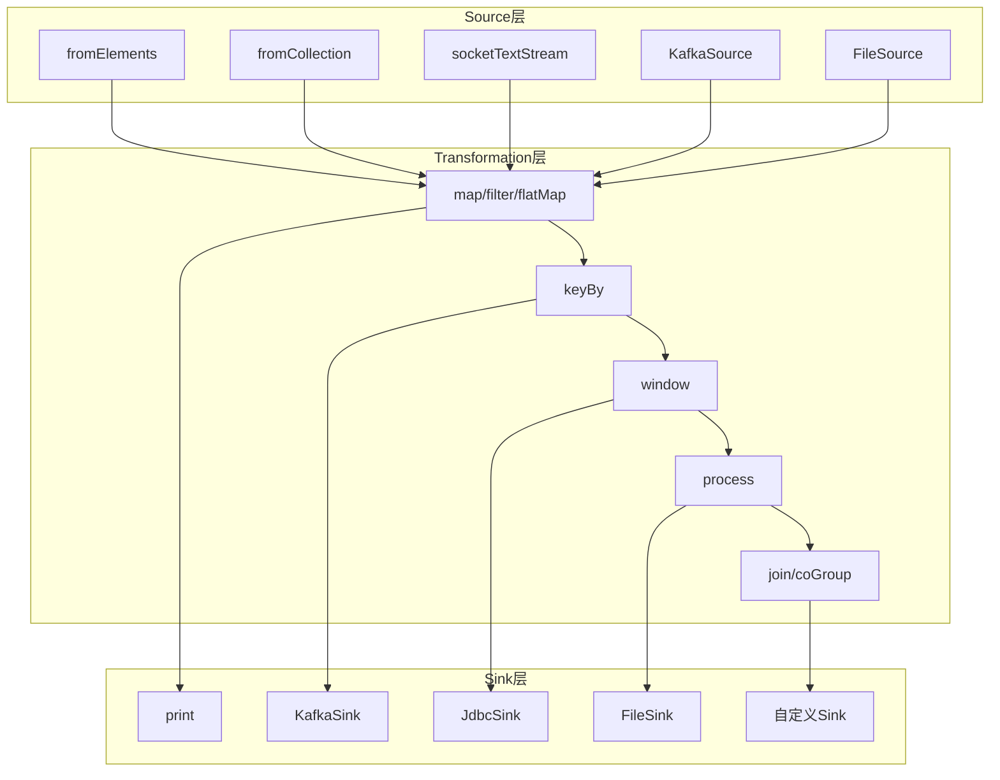
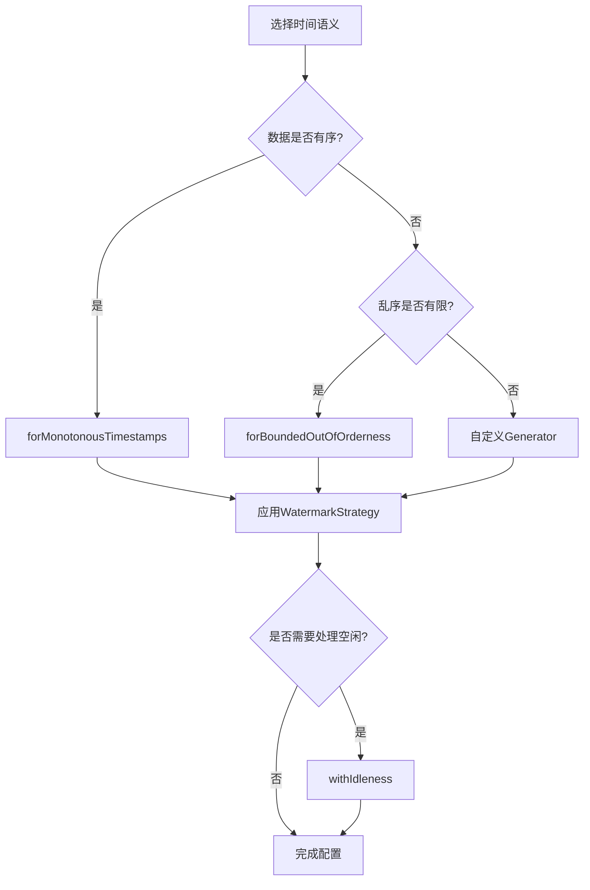
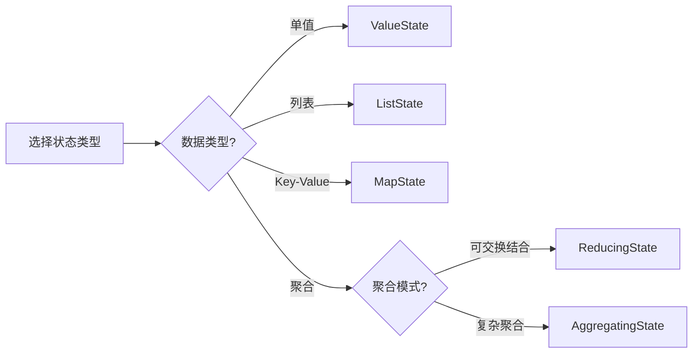

# DataStream API 快速参考速查表

> 所属阶段: Flink/09-language-foundations
> 前置依赖: [DataStream API完整指南](flink-datastream-api-complete-guide.md)
> 形式化等级: L4 (API参考)
> 适用版本: Flink 1.17 - 2.0

---

## 快速导航

| 章节 | 内容 | 页码参考 |
|------|------|----------|
| §1 | Source操作速查 | 从数据源创建流 |
| §2 | Transformation速查 | 转换算子大全 |
| §3 | Sink操作速查 | 数据输出目标 |
| §4 | 时间语义速查 | Event Time与Watermark |
| §5 | 状态操作速查 | State API使用 |
| §6 | 快速查找表格 | 分类速查与参数 |

---

## 1. Source操作速查

### 1.1 基础Source算子

| 算子 | Java API | Scala API | 用途 | 版本 |
|------|----------|-----------|------|------|
| `fromElements` | `env.fromElements(T... data)` | `env.fromElements(data: T*)` | 从有限元素创建流 | 1.0+ |
| `fromCollection` | `env.fromCollection(Collection)` | `env.fromCollection(Iterable)` | 从集合创建流 | 1.0+ |
| `fromParallelCollection` | `env.fromParallelCollection(SplittableIterator)` | `env.fromParallelCollection(iterator)` | 并行集合源 | 1.0+ |
| `socketTextStream` | `env.socketTextStream(host, port)` | `env.socketTextStream(host, port)` | Socket文本流 | 1.0+ |
| `readTextFile` | `env.readTextFile(path)` | `env.readTextFile(path)` | 读取文本文件 | 1.0+ |
| `readFile` | `env.readFile(format, path)` | `env.readFile(format, path)` | 通用文件读取 | 1.0+ |

### 1.2 代码示例

```java

import org.apache.flink.streaming.api.datastream.DataStream;

// Java: fromElements
DataStream<Integer> numbers = env.fromElements(1, 2, 3, 4, 5);

// Java: fromCollection
List<String> list = Arrays.asList("a", "b", "c");
DataStream<String> stream = env.fromCollection(list);

// Java: socketTextStream
DataStream<String> socketStream = env
    .socketTextStream("localhost", 9999);

// Java: 文件读取
DataStream<String> fileStream = env
    .readTextFile("/path/to/file.txt");
```

```scala
// Scala: fromElements
val numbers: DataStream[Int] = env.fromElements(1, 2, 3, 4, 5)

// Scala: fromCollection
val stream: DataStream[String] = env.fromCollection(List("a", "b", "c"))

// Scala: socketTextStream
val socketStream = env.socketTextStream("localhost", 9999)
```

### 1.3 连接器Source (addSource)

| 连接器 | Maven依赖 | Source类 | 版本兼容性 |
|--------|-----------|----------|------------|
| **Kafka** | `flink-connector-kafka` | `FlinkKafkaConsumer` | 1.17-2.0 |
| **Kafka (新)** | `flink-connector-kafka` | `KafkaSource` | 1.15+ 推荐 |
| **RabbitMQ** | `flink-connector-rabbitmq` | `RMQSource` | 1.17-1.18 |
| **Pulsar** | `flink-connector-pulsar` | `PulsarSource` | 1.15+ |
| **Kinesis** | `flink-connector-aws-kinesis-streams` | `KinesisStreamsSource` | 1.15+ |
| **JDBC** | `flink-connector-jdbc` | `JdbcSource` | 1.17+ |
| **MongoDB** | `flink-connector-mongodb` | `MongoSource` | 1.17+ |

### 1.4 Kafka Source示例

```java

import org.apache.flink.streaming.api.datastream.DataStream;

// Java: 新版KafkaSource (推荐)
KafkaSource<String> source = KafkaSource.<String>builder()
    .setBootstrapServers("kafka:9092")
    .setTopics("input-topic")
    .setGroupId("flink-group")
    .setStartingOffsets(OffsetsInitializer.earliest())
    .setValueOnlyDeserializer(new SimpleStringSchema())
    .build();

DataStream<String> stream = env.fromSource(
    source,
    WatermarkStrategy.noWatermarks(),
    "Kafka Source"
);
```

```scala
// Scala: 新版KafkaSource
val source = KafkaSource.builder[String]()
  .setBootstrapServers("kafka:9092")
  .setTopics("input-topic")
  .setGroupId("flink-group")
  .setStartingOffsets(OffsetsInitializer.earliest())
  .setValueOnlyDeserializer(new SimpleStringSchema())
  .build()

val stream = env.fromSource(source, WatermarkStrategy.noWatermarks(), "Kafka Source")
```

---

## 2. Transformation速查

### 2.1 基础转换算子

| 算子 | 签名 | 输出类型 | 并行度 | 示例 |
|------|------|----------|--------|------|
| `map` | `MapFunction<T,R>` | `DataStream<R>` | 继承 | 一对一转换 |
| `filter` | `FilterFunction<T>` | `DataStream<T>` | 继承 | 条件过滤 |
| `flatMap` | `FlatMapFunction<T,R>` | `DataStream<R>` | 继承 | 一对多展开 |

```java

import org.apache.flink.streaming.api.datastream.DataStream;

// Java示例
DataStream<Integer> mapped = stream.map(x -> x * 2);
DataStream<Integer> filtered = stream.filter(x -> x > 0);
DataStream<String> flatMapped = stream.flatMap(
    (Integer x, Collector<String> out) -> {
        out.collect("val:" + x);
        out.collect("square:" + x*x);
    }
);
```

### 2.2 KeyedStream操作

| 算子 | 输入 | 输出 | 关键特性 | 版本 |
|------|------|------|----------|------|
| `keyBy` | `DataStream<T>` | `KeyedStream<T,K>` | 按Key分区 | 1.0+ |
| `reduce` | `KeyedStream<T>` | `DataStream<T>` | 增量聚合 | 1.0+ |
| `aggregate` | `KeyedStream<T>` | `DataStream<R>` | 灵活聚合 | 1.0+ |
| `process` | `KeyedStream<T>` | `DataStream<R>` | 处理函数 | 1.2+ |

```java

import org.apache.flink.streaming.api.datastream.DataStream;

// Java: KeyedStream操作
KeyedStream<Event, String> keyed = stream
    .keyBy(event -> event.getUserId());

// Reduce: 累加计数
DataStream<CountResult> reduced = keyed.reduce(
    (a, b) -> new CountResult(a.key, a.count + b.count)
);

// Aggregate: 平均值计算
DataStream<Double> aggregated = keyed.aggregate(
    new AverageAggregate()
);
```

### 2.3 Window操作大全

| 窗口类型 | 分配器 | 触发条件 | 适用场景 |
|----------|--------|----------|----------|
| **滚动窗口** | `TumblingEventTimeWindows.of(Time.minutes(5))` | 固定间隔 | 固定周期统计 |
| **滑动窗口** | `SlidingEventTimeWindows.of(Time.hours(1), Time.minutes(10))` | 滑动间隔 | 移动平均 |
| **会话窗口** | `EventTimeSessionWindows.withGap(Time.minutes(30))` | 活动间隙 | 用户会话 |
| **全局窗口** | `GlobalWindows.create()` | 自定义触发器 | 自定义逻辑 |

```java

import org.apache.flink.streaming.api.datastream.DataStream;
import org.apache.flink.api.common.functions.AggregateFunction;
import org.apache.flink.streaming.api.windowing.time.Time;

// Java: Window操作示例

// 滚动窗口 - 5分钟固定窗口
DataStream<Result> tumbling = keyed
    .window(TumblingEventTimeWindows.of(Time.minutes(5)))
    .aggregate(new MyAggregateFunction());

// 滑动窗口 - 1小时窗口，10分钟滑动
DataStream<Result> sliding = keyed
    .window(SlidingEventTimeWindows.of(Time.hours(1), Time.minutes(10)))
    .aggregate(new MyAggregateFunction());

// 会话窗口 - 30分钟无活动间隙
DataStream<Result> session = keyed
    .window(EventTimeSessionWindows.withGap(Time.minutes(30)))
    .aggregate(new MyAggregateFunction());

// 增量聚合 + 全窗口函数
DataStream<Result> combined = keyed
    .window(TumblingEventTimeWindows.of(Time.minutes(5)))
    .aggregate(new IncrementalAgg(), new WindowFunction());
```

### 2.4 Window函数对比

| 函数类型 | 接口 | 内存使用 | 延迟 | 适用场景 |
|----------|------|----------|------|----------|
| `ReduceFunction` | `(T,T)→T` | 低 | 低 | 可交换结合操作 |
| `AggregateFunction` | 增量ACC→R | 低 | 低 | 复杂增量聚合 |
| `ProcessWindowFunction` | `Iterable<T>, Context→R` | 高 | 高 | 需全窗口数据 |
| 增量+全窗口 | `Aggregate+Process` | 中 | 中 | 平衡方案 |

### 2.5 Join操作

| Join类型 | 方法 | 时间语义 | 版本 |
|----------|------|----------|------|
| **Window Join** | `stream1.join(stream2).where(k1).equalTo(k2).window(...)` | Event/Proc | 1.0+ |
| **Interval Join** | `stream1.keyBy(k1).intervalJoin(stream2.keyBy(k2))` | Event Time | 1.6+ |
| **CoGroup** | `stream1.coGroup(stream2).where(k1).equalTo(k2)` | Event/Proc | 1.0+ |

```java

import org.apache.flink.streaming.api.datastream.DataStream;
import org.apache.flink.streaming.api.windowing.time.Time;

// Java: Window Join
DataStream<Result> joined = stream1
    .join(stream2)
    .where(Event::getUserId)
    .equalTo(Click::getUserId)
    .window(TumblingEventTimeWindows.of(Time.minutes(5)))
    .apply((e1, e2) -> new Result(e1, e2));

// Java: Interval Join
DataStream<Result> intervalJoined = keyedStream1
    .intervalJoin(keyedStream2)
    .between(Time.minutes(-10), Time.minutes(10))
    .process(new ProcessJoinFunction<>() {
        @Override
        public void processElement(Event left, Click right, Context ctx, Collector<Result> out) {
            out.collect(new Result(left, right));
        }
    });
```

### 2.6 Process函数

| Process函数 | 输入 | 访问能力 | 主要用途 |
|-------------|------|----------|----------|
| `ProcessFunction` | `DataStream` | 侧输出、Timer | 基础处理 |
| `KeyedProcessFunction` | `KeyedStream` | KeyedState、Timer | Keyed处理 |
| `CoProcessFunction` | `ConnectedStreams` | 两条流State | 双流处理 |
| `ProcessWindowFunction` | `WindowedStream` | 全窗口Context | 窗口处理 |
| `ProcessAllWindowFunction` | `AllWindowedStream` | 非Key窗口 | 全局窗口 |

```java
import org.apache.flink.streaming.api.functions.KeyedProcessFunction;

import org.apache.flink.api.common.state.ValueState;
import org.apache.flink.api.common.state.ValueStateDescriptor;
import org.apache.flink.streaming.api.windowing.time.Time;


// Java: KeyedProcessFunction示例
class CountWithTimeout extends KeyedProcessFunction<String, Event, Result> {

    private ValueState<CountState> state;

    @Override
    public void open(Configuration parameters) {
        state = getRuntimeContext().getState(
            new ValueStateDescriptor<>("count", CountState.class)
        );
    }

    @Override
    public void processElement(Event event, Context ctx, Collector<Result> out)
            throws Exception {
        CountState current = state.value();
        if (current == null) {
            current = new CountState();
            current.key = event.getKey();
        }
        current.count++;
        state.update(current);

        // 注册Timer
        ctx.timerService().registerEventTimeTimer(
            ctx.timestamp() + Time.minutes(5).toMilliseconds()
        );
    }

    @Override
    public void onTimer(long timestamp, OnTimerContext ctx, Collector<Result> out)
            throws Exception {
        out.collect(new Result(state.value()));
        state.clear();
    }
}
```

---

## 3. Sink操作速查

### 3.1 基础Sink算子

| 算子 | API | 用途 | 版本 |
|------|-----|------|------|
| `print` | `stream.print()` | 控制台输出(开发) | 1.0+ |
| `printToErr` | `stream.printToErr()` | 错误流输出 | 1.0+ |
| `addSink` | `stream.addSink(SinkFunction)` | 自定义Sink | 1.0+ |
| `sinkTo` | `stream.sinkTo(Sink)` | 新版Sink API | 1.15+ |

```java
// Java: 基础Sink
stream.print();                           // 输出到stdout
stream.printToErr();                      // 输出到stderr
stream.addSink(new MySinkFunction());     // 自定义Sink

// 带前缀的print
stream.print("DEBUG-OUTPUT");
```

### 3.2 连接器Sink

| 连接器 | Sink类 | 语义保证 | 版本 |
|--------|--------|----------|------|
| **Kafka** | `KafkaSink` | Exactly-Once | 1.15+ |
| **JDBC** | `JdbcSink.sink(...)` | At-Least-Once | 1.11+ |
| **Elasticsearch** | `ElasticsearchSink` | At-Least-Once | 1.0+ |
| **FileSystem** | `FileSink` | Exactly-Once | 1.12+ |
| **RabbitMQ** | `RMQSink` | At-Least-Once | 1.0+ |
| **Redis** | `RedisSink` | At-Least-Once | 社区 |
| **MongoDB** | `MongoSink` | At-Least-Once | 1.17+ |

### 3.3 Sink示例代码

```java
// Java: Kafka Sink (新版API - 推荐)
KafkaSink<String> sink = KafkaSink.<String>builder()
    .setBootstrapServers("kafka:9092")
    .setRecordSerializer(KafkaRecordSerializationSchema.builder()
        .setTopic("output-topic")
        .setValueSerializationSchema(new SimpleStringSchema())
        .build())
    .setDeliveryGuarantee(DeliveryGuarantee.EXACTLY_ONCE)
    .build();

stream.sinkTo(sink);

// Java: JDBC Sink
String sql = "INSERT INTO events (id, data) VALUES (?, ?)";
JdbcSink.sink(
    sql,
    (ps, event) -> {
        ps.setLong(1, event.getId());
        ps.setString(2, event.getData());
    },
    JdbcExecutionOptions.builder()
        .withBatchSize(100)
        .withBatchIntervalMs(200)
        .build(),
    new JdbcConnectionOptions.JdbcConnectionOptionsBuilder()
        .withUrl("jdbc:mysql://localhost:3306/db")
        .withDriverName("com.mysql.cj.jdbc.Driver")
        .withUsername("user")
        .withPassword("pass")
        .build()
);

// Java: File Sink (Exactly-Once)
FileSink<String> fileSink = FileSink
    .forRowFormat(
        new Path("/output/path"),
        new SimpleStringEncoder<String>("UTF-8")
    )
    .withRollingPolicy(
        DefaultRollingPolicy.builder()
            .withRolloverInterval(Duration.ofMinutes(15))
            .withInactivityInterval(Duration.ofMinutes(5))
            .withMaxPartSize(MemorySize.ofMebiBytes(128))
            .build()
    )
    .build();

stream.sinkTo(fileSink);
```

---

## 4. 时间语义速查

### 4.1 时间语义配置

| 时间语义 | 配置方法 | 适用场景 | 版本 |
|----------|----------|----------|------|
| **Event Time** | `env.setStreamTimeCharacteristic(TimeCharacteristic.EventTime)` | 乱序数据处理 | 1.0+ |
| **Processing Time** | `env.setStreamTimeCharacteristic(TimeCharacteristic.ProcessingTime)` | 低延迟处理 | 1.0+ |
| **Ingestion Time** | `env.setStreamTimeCharacteristic(TimeCharacteristic.IngestionTime)` | 无需Watermark | 1.0+ |

```java

import org.apache.flink.streaming.api.environment.StreamExecutionEnvironment;

// Java: 时间语义配置 (Flink 1.12+ 默认Event Time)
StreamExecutionEnvironment env =
    StreamExecutionEnvironment.getExecutionEnvironment();

// 显式设置Event Time (Flink 1.12前需要)
// 使用WatermarkStrategy替代已弃用的setStreamTimeCharacteristic
env.getConfig().setAutoWatermarkInterval(200);
// Flink 1.12+ 推荐方式
// 使用WatermarkStrategy替代已弃用的setStreamTimeCharacteristic
env.getConfig().setAutoWatermarkInterval(200);
```

### 4.2 Watermark生成策略

| 策略 | API | 延迟容忍 | 适用场景 |
|------|-----|----------|----------|
| **固定延迟** | `WatermarkStrategy.forBoundedOutOfOrderness(Duration)` | 有界 | 乱序但有限 |
| **无延迟** | `WatermarkStrategy.forMonotonousTimestamps()` | 0 | 有序数据 |
| **自定义** | `WatermarkStrategy.forGenerator(ctx -> new Generator())` | 自定义 | 特殊需求 |
| **空闲Source** | `.withIdleness(Duration)` | - | 处理空闲分区 |

```java

import org.apache.flink.streaming.api.datastream.DataStream;

// Java: Watermark策略

// 1. 有序数据 (无乱序)
WatermarkStrategy.<Event>forMonotonousTimestamps()
    .withIdleness(Duration.ofMinutes(5));

// 2. 固定延迟 (5秒乱序容忍)
WatermarkStrategy.<Event>forBoundedOutOfOrderness(Duration.ofSeconds(5))
    .withIdleness(Duration.ofMinutes(5));

// 3. 自定义Watermark生成
WatermarkStrategy.<Event>forGenerator(ctx -> new WatermarkGenerator<Event>() {
    private long maxTimestamp = Long.MIN_VALUE;
    private final long outOfOrdernessMillis = 5000;

    @Override
    public void onEvent(Event event, long eventTimestamp, WatermarkOutput output) {
        maxTimestamp = Math.max(maxTimestamp, eventTimestamp);
    }

    @Override
    public void onPeriodicEmit(WatermarkOutput output) {
        output.emitWatermark(new Watermark(maxTimestamp - outOfOrdernessMillis - 1));
    }
});

// 应用Watermark策略
DataStream<Event> withTimestamps = stream
    .assignTimestampsAndWatermarks(
        WatermarkStrategy.<Event>forBoundedOutOfOrderness(Duration.ofSeconds(5))
            .withTimestampAssigner((event, timestamp) -> event.getEventTime())
    );
```

### 4.3 窗口分配器速查

| 分配器 | 创建方法 | 窗口对齐 | 重叠 |
|--------|----------|----------|------|
| **滚动事件时间** | `TumblingEventTimeWindows.of(Time)` | 时间戳 | 无 |
| **滚动处理时间** | `TumblingProcessingTimeWindows.of(Time)` | 机器时间 | 无 |
| **滑动事件时间** | `SlidingEventTimeWindows.of(size, slide)` | 时间戳 | 有 |
| **滑动处理时间** | `SlidingProcessingTimeWindows.of(size, slide)` | 机器时间 | 有 |
| **会话事件时间** | `EventTimeSessionWindows.withGap(Time)` | 活动间隙 | 动态合并 |
| **会话处理时间** | `ProcessingTimeSessionWindows.withGap(Time)` | 活动间隙 | 动态合并 |
| **全局窗口** | `GlobalWindows.create()` | 全局 | 单个 |

```java

import org.apache.flink.streaming.api.windowing.time.Time;

// Java: 窗口分配器示例

// 滚动窗口 - 按Event Time
.window(TumblingEventTimeWindows.of(Time.minutes(5)))

// 滚动窗口 - 按Processing Time
.window(TumblingProcessingTimeWindows.of(Time.minutes(5)))

// 滑动窗口
.window(SlidingEventTimeWindows.of(Time.hours(1), Time.minutes(10)))

// 会话窗口
.window(EventTimeSessionWindows.withDynamicGap(
    (element) -> Time.minutes(element.getSessionTimeout())
))

// 带偏移的窗口 (对齐到指定时间)
.window(TumblingEventTimeWindows.of(Time.days(1), Time.hours(-8))) // UTC+8
```

### 4.4 触发器与驱逐器

| 组件 | 作用 | 常用实现 |
|------|------|----------|
| **Trigger** | 决定何时触发窗口计算 | `EventTimeTrigger`, `ProcessingTimeTrigger`, `CountTrigger` |
| **Evictor** | 触发前/后移除元素 | `CountEvictor`, `TimeEvictor` |
| **AllowedLateness** | 允许迟到数据处理 | `.allowedLateness(Time.minutes(10))` |

```java

import org.apache.flink.streaming.api.windowing.time.Time;

// Java: 触发器与延迟处理
stream
    .keyBy(Event::getUserId)
    .window(TumblingEventTimeWindows.of(Time.minutes(5)))
    .trigger(CountTrigger.of(100))                    // 100条触发
    .evictor(CountEvictor.of(50))                     // 保留最新50条
    .allowedLateness(Time.minutes(10))                // 允许10分钟迟到
    .sideOutputLateData(lateDataTag)                  // 迟到数据侧输出
    .aggregate(new MyAggregate());
```

---

## 5. 状态操作速查

### 5.1 状态类型对比

| 状态类型 | 描述 | 适用场景 | 版本 |
|----------|------|----------|------|
| **ValueState<T>** | 单值状态 | 计数器、最新值 | 1.0+ |
| **ListState<T>** | 列表状态 | 历史记录收集 | 1.0+ |
| **MapState<UK,UV>** | Map结构 | Key-Value存储 | 1.1+ |
| **ReducingState<T>** | 用于Reduce | 增量聚合 | 1.1+ |
| **AggregatingState<IN,OUT>** | 用于Aggregate | 灵活聚合 | 1.1+ |

### 5.2 状态声明与使用

```java
// Java: 状态声明

import org.apache.flink.api.common.state.ValueState;
import org.apache.flink.api.common.state.ValueStateDescriptor;
import org.apache.flink.api.common.typeinfo.Types;

public class StatefulFunction extends KeyedProcessFunction<String, Event, Result> {

    // ValueState - 单值
    private ValueState<Long> countState;

    // ListState - 列表
    private ListState<Event> eventListState;

    // MapState - Map结构
    private MapState<String, Integer> keyCountState;

    // ReducingState - 增量Reduce
    private ReducingState<Long> sumState;

    // AggregatingState - 增量Aggregate
    private AggregatingState<Event, AverageResult> avgState;

    @Override
    public void open(Configuration parameters) {
        // ValueState描述符
        ValueStateDescriptor<Long> countDescriptor =
            new ValueStateDescriptor<>("count", Types.LONG);
        countState = getRuntimeContext().getState(countDescriptor);

        // ListState描述符
        ListStateDescriptor<Event> listDescriptor =
            new ListStateDescriptor<>("events", Event.class);
        eventListState = getRuntimeContext().getListState(listDescriptor);

        // MapState描述符
        MapStateDescriptor<String, Integer> mapDescriptor =
            new MapStateDescriptor<>("keyCounts", Types.STRING, Types.INT);
        keyCountState = getRuntimeContext().getMapState(mapDescriptor);

        // ReducingState描述符
        ReducingStateDescriptor<Long> reducingDescriptor =
            new ReducingStateDescriptor<>("sum", Long::sum, Types.LONG);
        sumState = getRuntimeContext().getReducingState(reducingDescriptor);

        // AggregatingState描述符
        AggregatingStateDescriptor<Event, Accumulator, AverageResult> aggDescriptor =
            new AggregatingStateDescriptor<>("avg", new AverageAgg(), Accumulator.class);
        avgState = getRuntimeContext().getAggregatingState(aggDescriptor);
    }

    @Override
    public void processElement(Event event, Context ctx, Collector<Result> out)
            throws Exception {
        // ValueState使用
        Long current = countState.value();
        if (current == null) current = 0L;
        countState.update(current + 1);

        // ListState使用
        eventListState.add(event);

        // MapState使用
        keyCountState.put(event.getType(),
            keyCountState.getOrDefault(event.getType(), 0) + 1);

        // ReducingState使用
        sumState.add(event.getValue());

        // AggregatingState使用
        avgState.add(event);
    }
}
```

### 5.3 状态TTL配置

| 参数 | 作用 | 默认值 | 推荐值 |
|------|------|--------|--------|
| `setUpdateType` | 更新时机 | OnCreateAndWrite | OnReadAndWrite |
| `setStateVisibility` | 过期可见性 | ReturnExpiredIfNotCleanedUp | NeverReturnExpired |
| `setTtlDuration` | TTL时长 | 必须设置 | 业务相关 |
| `cleanupIncrementally` | 增量清理 | - | 小状态 |
| `cleanupFullSnapshot` | 快照清理 | - | 小状态 |
| `cleanupInRocksdbCompactFilter` | RocksDB清理 | - | 大状态 |

```java

import org.apache.flink.streaming.api.windowing.time.Time;

// Java: 状态TTL配置
StateTtlConfig ttlConfig = StateTtlConfig
    .newBuilder(Time.hours(24))                       // 24小时TTL
    .setUpdateType(StateTtlConfig.UpdateType.OnCreateAndWrite)
    .setStateVisibility(StateTtlConfig.StateVisibility.NeverReturnExpired)
    .cleanupIncrementally(10, true)                   // 增量清理
    // .cleanupInRocksdbCompactFilter(1000)           // RocksDB专用
    .build();

ValueStateDescriptor<MyState> descriptor =
    new ValueStateDescriptor<>("myState", MyState.class);
descriptor.enableTimeToLive(ttlConfig);
```

### 5.4 广播状态 (Broadcast State)

```java

import org.apache.flink.streaming.api.datastream.DataStream;
import org.apache.flink.api.common.typeinfo.Types;

// Java: 广播状态模式
MapStateDescriptor<String, Rule> ruleStateDescriptor =
    new MapStateDescriptor<>("rules", Types.STRING, Types.POJO(Rule.class));

BroadcastStream<Rule> broadcastRules = ruleStream.broadcast(ruleStateDescriptor);

DataStream<Alert> alerts = eventStream
    .connect(broadcastRules)
    .process(new KeyedBroadcastProcessFunction<String, Event, Rule, Alert>() {

        @Override
        public void processElement(Event event, ReadOnlyContext ctx, Collector<Alert> out) {
            ReadOnlyBroadcastState<String, Rule> rules = ctx.getBroadcastState(ruleStateDescriptor);
            Rule rule = rules.get(event.getRuleId());
            if (rule != null && rule.matches(event)) {
                out.collect(new Alert(event, rule));
            }
        }

        @Override
        public void processBroadcastElement(Rule rule, Context ctx, Collector<Alert> out) {
            BroadcastState<String, Rule> rules = ctx.getBroadcastState(ruleStateDescriptor);
            rules.put(rule.getId(), rule);
        }
    });
```

---

## 6. 快速查找表格

### 6.1 操作符分类表

| 分类 | 算子 | 状态 | 并行度 | Keyed |
|------|------|------|--------|-------|
| **基本转换** | map, filter, flatMap | 无 | 继承 | 可选 |
| **Keyed操作** | keyBy, reduce, aggregate | 有 | 按Key | 是 |
| **窗口操作** | window, apply, aggregate | 有 | 按Key | 是 |
| **多流操作** | union, connect, join, coGroup | 视具体 | 可配置 | 视具体 |
| **分区操作** | keyBy, rebalance, rescale, shuffle, broadcast, global | 无 | 可改变 | 视具体 |
| **Sink操作** | addSink, print | 无 | 可配置 | 否 |

### 6.2 参数速查表

| 参数类别 | 配置项 | 方法 | 示例值 |
|----------|--------|------|--------|
| **并行度** | 全局并行度 | `env.setParallelism(n)` | 4 |
| | 算子并行度 | `.setParallelism(n)` | 8 |
| **Checkpoint** | 间隔 | `env.enableCheckpointing(ms)` | 60000 |
| | 模式 | `.setCheckpointingMode(EXACTLY_ONCE)` | 精确一次 |
| | 超时 | `.setCheckpointTimeout(ms)` | 600000 |
| **重启策略** | 固定延迟 | `env.setRestartStrategy(fixedDelayRestart(3, 10000))` | 3次,10秒 |
| | 指数退避 | `env.setRestartStrategy(exponentialDelayRestart())` | 动态延迟 |
| **状态后端** | MemoryStateBackend | `env.setStateBackend(new MemoryStateBackend())` | 小状态 |
| | FsStateBackend | `env.setStateBackend(new FsStateBackend("hdfs://..."))` | 大状态 |
| | RocksDBStateBackend | `env.setStateBackend(new RocksDBStateBackend("..."))` | 超大状态 |

### 6.3 异常处理速查

| 异常类型 | 原因 | 解决方案 |
|----------|------|----------|
| **TimeoutException** | Checkpoint超时 | 增加超时时间，优化反压 |
| **DeclinedCheckpointException** | Task未就绪 | 检查资源，减少并发Checkpoint |
| **StateBackendException** | 状态访问失败 | 检查磁盘/网络，切换后端 |
| **WatermarkDelay** | Watermark滞后 | 调整延迟容忍，检查空闲Source |
| **LateDataDrop** | 迟到数据被丢弃 | 增加allowedLateness |
| **SerializationException** | 序列化失败 | 检查Kryo/Avro配置 |

```java

import org.apache.flink.streaming.api.CheckpointingMode;
import org.apache.flink.streaming.api.windowing.time.Time;

// Java: 异常处理配置

// Checkpoint配置
env.enableCheckpointing(60000);
env.getCheckpointConfig().setCheckpointingMode(CheckpointingMode.EXACTLY_ONCE);
env.getCheckpointConfig().setCheckpointTimeout(600000);
env.getCheckpointConfig().setMaxConcurrentCheckpoints(1);
env.getCheckpointConfig().setMinPauseBetweenCheckpoints(30000);

// 重启策略 - 固定延迟
env.setRestartStrategy(RestartStrategies.fixedDelayRestart(
    3,                    // 最大重启次数
    Time.of(10, TimeUnit.SECONDS)  // 延迟
));

// 重启策略 - 指数退避
env.setRestartStrategy(RestartStrategies.exponentialDelayRestart(
    Time.milliseconds(100),   // 初始延迟
    Time.milliseconds(1000),  // 最大延迟
    1.5,                      // 指数倍数
    Time.milliseconds(2000),  // 重置延迟
    0.1                       // 抖动因子
));

// 状态后端配置 (Flink 1.13+)
EmbeddedRocksDBStateBackend rocksDbBackend = new EmbeddedRocksDBStateBackend(true);
env.setStateBackend(rocksDbBackend);
env.getCheckpointConfig().setCheckpointStorage("file:///checkpoint/dir");
```

### 6.4 版本兼容性矩阵

| 特性 | Flink 1.14 | 1.15 | 1.16 | 1.17 | 1.18 | 2.0 |
|------|:----------:|:----:|:----:|:----:|:----:|:---:|
| `KafkaSource` (新API) | ⚠️ | ✅ | ✅ | ✅ | ✅ | ✅ |
| `KafkaSink` (新API) | ⚠️ | ✅ | ✅ | ✅ | ✅ | ✅ |
| `fromSource` API | ✅ | ✅ | ✅ | ✅ | ✅ | ✅ |
| `sinkTo` API | ✅ | ✅ | ✅ | ✅ | ✅ | ✅ |
| DataStream V2 API | ❌ | ❌ | ❌ | ⚠️ | ✅ | ✅ |
| 声明式资源管理 | ❌ | ❌ | ❌ | ⚠️ | ✅ | ✅ |
| SQL/Table Store 统一 | ❌ | ⚠️ | ✅ | ✅ | ✅ | ✅ |
| Python DataStream API | ✅ | ✅ | ✅ | ✅ | ✅ | ✅ |
| Native Kubernetes | ✅ | ✅ | ✅ | ✅ | ✅ | ✅ |

图例: ✅ 完整支持 | ⚠️ 部分支持/实验性 | ❌ 不支持

### 6.5 开发环境快速配置

```java
import org.apache.flink.streaming.api.environment.StreamExecutionEnvironment;

import org.apache.flink.streaming.api.datastream.DataStream;
import org.apache.flink.streaming.api.CheckpointingMode;
import org.apache.flink.streaming.api.windowing.time.Time;


// Java: 标准开发模板
public class FlinkJob {

    public static void main(String[] args) throws Exception {
        // 1. 创建环境
        final StreamExecutionEnvironment env =
            StreamExecutionEnvironment.getExecutionEnvironment();

        // 2. 基础配置
        env.setParallelism(4);
        // 使用WatermarkStrategy替代已弃用的setStreamTimeCharacteristic
env.getConfig().setAutoWatermarkInterval(200);
        // 3. Checkpoint配置
        env.enableCheckpointing(60000);
        env.getCheckpointConfig().setCheckpointingMode(
            CheckpointingMode.EXACTLY_ONCE
        );

        // 4. 重启策略
        env.setRestartStrategy(RestartStrategies.fixedDelayRestart(3, 10000));

        // 5. 状态后端 (生产环境推荐RocksDB)
        // env.setStateBackend(new EmbeddedRocksDBStateBackend(true));

        // 6. 构建DataStream
        DataStream<Event> stream = env
            .fromSource(
                createKafkaSource(),
                WatermarkStrategy.forBoundedOutOfOrderness(Duration.ofSeconds(5)),
                "Kafka Source"
            )
            .setParallelism(4);

        // 7. 处理逻辑
        DataStream<Result> result = stream
            .keyBy(Event::getKey)
            .window(TumblingEventTimeWindows.of(Time.minutes(5)))
            .aggregate(new MyAggregate());

        // 8. 输出
        result.sinkTo(createKafkaSink());

        // 9. 执行
        env.execute("Flink Job");
    }
}
```

---

## 7. 可打印PDF格式说明

### 7.1 PDF生成方法

```bash
# 使用pandoc生成PDF (需要安装pandoc和LaTeX)
pandoc datastream-api-cheatsheet.md \
  -o datastream-api-cheatsheet.pdf \
  --pdf-engine=xelatex \
  -V geometry:margin=1.5cm \
  -V fontsize=9pt \
  --toc \
  --toc-depth=2

# 或使用Chrome打印 (推荐)
# 1. 在浏览器中打开此Markdown文件
# 2. 使用Markdown渲染插件 (如Markdown Viewer)
# 3. Ctrl+P -> 另存为PDF
# 4. 设置: 边距窄, 背景图形, 页眉页脚
```

### 7.2 打印优化提示

| 设置项 | 推荐值 | 说明 |
|--------|--------|------|
| 纸张大小 | A4 或 Letter | 标准打印尺寸 |
| 页边距 | 窄 (0.5英寸) | 最大化内容区域 |
| 字体大小 | 8-10pt | 代码清晰可读 |
| 方向 | 横向 | 宽表格显示更好 |
| 页眉 | 包含章节标题 | 便于快速定位 |
| 页脚 | 包含页码 | 方便引用 |
| 背景图形 | 启用 | 代码高亮保留 |

---

## 8. 参考与引用

### 8.1 官方文档链接

| 主题 | 链接 |
|------|------|
| DataStream API官方文档 | <https://nightlies.apache.org/flink/flink-docs-stable/docs/dev/datastream/overview/> |
| 时间语义详解 | <https://nightlies.apache.org/flink/flink-docs-stable/docs/dev/datastream/event-time/> |
| 状态管理指南 | <https://nightlies.apache.org/flink/flink-docs-stable/docs/dev/datastream/state//> |
| Kafka连接器 | <https://nightlies.apache.org/flink/flink-docs-stable/docs/connectors/datastream/kafka/> |
| Checkpoint配置 | <https://nightlies.apache.org/flink/flink-docs-stable/docs/dev/datastream/fault-tolerance/checkpointing/> |

### 8.2 版本发布说明

| 版本 | 重要变更 | 发布日期 |
|------|----------|----------|
| Flink 1.15 | 新Kafka Source/Sink API GA | 2022-05 |
| Flink 1.16 | Table Store独立发布 | 2022-10 |
| Flink 1.17 | 声明式资源管理预览 | 2023-03 |
| Flink 1.18 | DataStream V2 API预览 | 2023-10 |
| Flink 2.0 | 架构重构，移除旧API | 2024 (预计) |

---

## 9. 可视化速查

### 9.1 DataStream API层次结构



### 9.2 时间语义决策树



### 9.3 状态类型选择指南



---

## 10. 附录：常用代码片段

### 10.1 完整Job模板

```java
import org.apache.flink.api.common.eventtime.WatermarkStrategy;
import org.apache.flink.api.common.functions.AggregateFunction;
import org.apache.flink.api.common.restartstrategy.RestartStrategies;
import org.apache.flink.api.common.serialization.SimpleStringSchema;
import org.apache.flink.api.common.time.Time;
import org.apache.flink.connector.base.DeliveryGuarantee;
import org.apache.flink.connector.kafka.sink.KafkaRecordSerializationSchema;
import org.apache.flink.connector.kafka.sink.KafkaSink;
import org.apache.flink.connector.kafka.source.KafkaSource;
import org.apache.flink.connector.kafka.source.enumerator.initializer.OffsetsInitializer;
import org.apache.flink.streaming.api.datastream.DataStream;
import org.apache.flink.streaming.api.environment.StreamExecutionEnvironment;
import org.apache.flink.streaming.api.windowing.assigners.TumblingEventTimeWindows;

import java.time.Duration;

import org.apache.flink.streaming.api.windowing.time.Time;


public class QuickStartJob {

    public static void main(String[] args) throws Exception {
        StreamExecutionEnvironment env =
            StreamExecutionEnvironment.getExecutionEnvironment();

        // 配置
        env.setParallelism(4);
        env.setRestartStrategy(RestartStrategies.fixedDelayRestart(3, Time.seconds(10)));
        env.enableCheckpointing(60000);

        // Source
        KafkaSource<String> source = KafkaSource.<String>builder()
            .setBootstrapServers("localhost:9092")
            .setTopics("input")
            .setGroupId("flink-group")
            .setStartingOffsets(OffsetsInitializer.latest())
            .setValueOnlyDeserializer(new SimpleStringSchema())
            .build();

        DataStream<String> stream = env.fromSource(
            source,
            WatermarkStrategy.forBoundedOutOfOrderness(Duration.ofSeconds(5)),
            "Kafka Source"
        );

        // Transform
        DataStream<Metric> metrics = stream
            .map(QuickStartJob::parse)
            .filter(m -> m.getValue() > 0)
            .keyBy(Metric::getKey)
            .window(TumblingEventTimeWindows.of(Time.minutes(1)))
            .aggregate(new AverageAggregate());

        // Sink
        KafkaSink<Metric> sink = KafkaSink.<Metric>builder()
            .setBootstrapServers("localhost:9092")
            .setRecordSerializer(KafkaRecordSerializationSchema.builder()
                .setTopic("output")
                .setValueSerializationSchema(new MetricSerializer())
                .build())
            .setDeliveryGuarantee(DeliveryGuarantee.AT_LEAST_ONCE)
            .build();

        metrics.sinkTo(sink);

        env.execute("QuickStartJob");
    }

    static Metric parse(String line) { /* ... */ return null; }

    static class AverageAggregate implements AggregateFunction<Metric, AverageAccumulator, Metric> {
        @Override
        public AverageAccumulator createAccumulator() { return new AverageAccumulator(); }

        @Override
        public AverageAccumulator add(Metric value, AverageAccumulator accumulator) {
            accumulator.sum += value.getValue();
            accumulator.count++;
            return accumulator;
        }

        @Override
        public Metric getResult(AverageAccumulator accumulator) {
            return new Metric("avg", accumulator.sum / accumulator.count);
        }

        @Override
        public AverageAccumulator merge(AverageAccumulator a, AverageAccumulator b) {
            a.sum += b.sum;
            a.count += b.count;
            return a;
        }
    }

    static class AverageAccumulator {
        double sum;
        int count;
    }
}
```

---

*本文档遵循AGENTS.md规范创建，适用于Flink 1.17-2.0版本*
