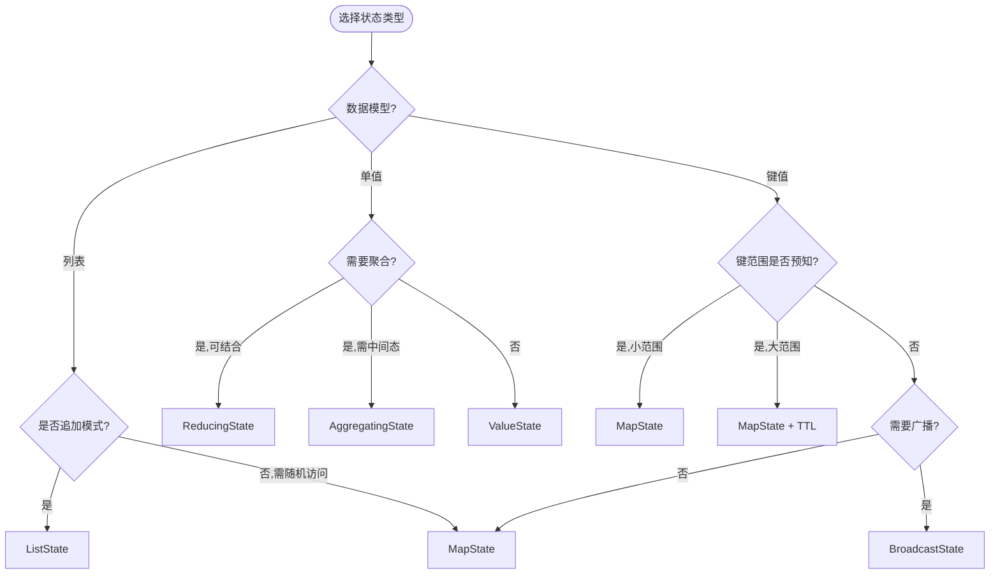
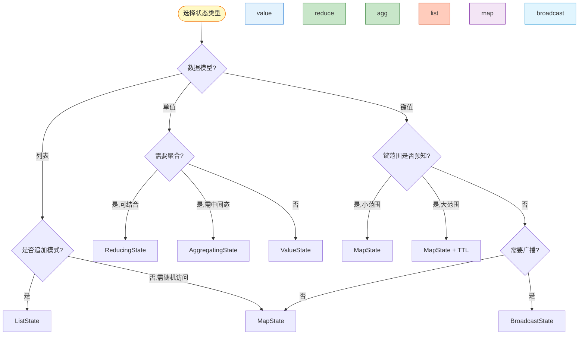
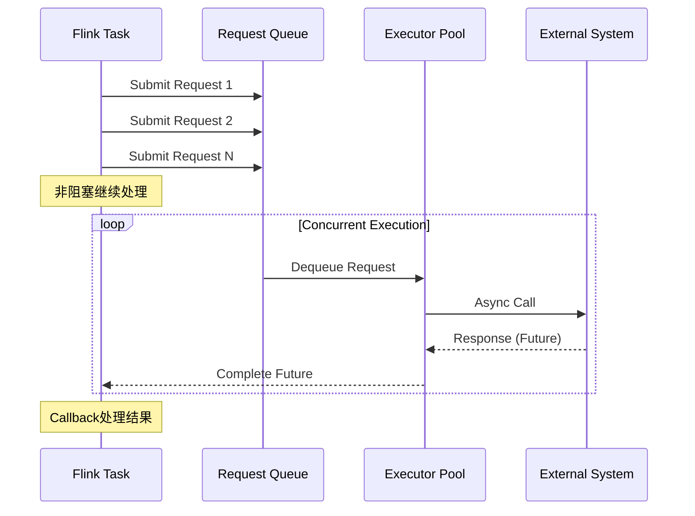
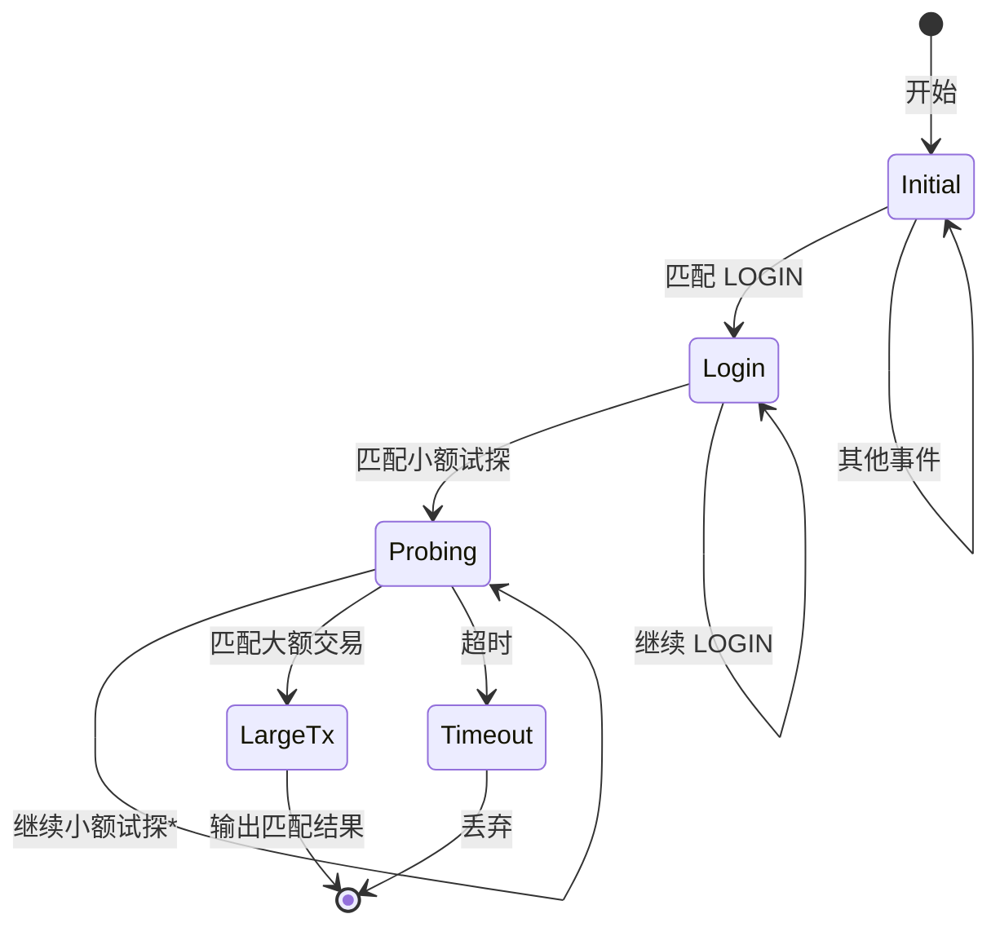

> **状态**: 稳定内容 | **风险等级**: 低 | **最后更新**: 2026-04-20
>
> 本文档基于 Apache Flink 1.17+ / 2.0+ 已发布版本的 DataStream API 进行完整特性梳理。内容反映当前稳定版本的实现。
>
# Flink DataStream API 完整特性指南

> **所属阶段**: Flink/09-language-foundations | **前置依赖**: [DataStream V2 API](./05-datastream-v2-api.md), [流处理语义形式化](../../../Struct/01-foundation/stream-processing-semantics-formalization.md) | **形式化等级**: L3-L4
> **版本**: Flink 1.17+ / 2.0+ | **语言**: Java 11+ / Scala 2.12+ / Scala 3.3+

---

## 目录

- [Flink DataStream API 完整特性指南](#flink-datastream-api-完整特性指南)
  - [目录](#目录)
  - [1. 概念定义 (Definitions)](#1-概念定义-definitions)
    - [Def-F-09-65: DataStream 类型层次](#def-f-09-65-datastream-类型层次)
    - [Def-F-09-66: 转换算子 (Transformations)](#def-f-09-66-转换算子-transformations)
    - [Def-F-09-67: 键控流 (KeyedStream)](#def-f-09-67-键控流-keyedstream)
    - [Def-F-09-68: 状态原语 (State Primitives)](#def-f-09-68-状态原语-state-primitives)
    - [Def-F-09-69: 时间语义 (Time Semantics)](#def-f-09-69-时间语义-time-semantics)
    - [Def-F-09-70: Watermark 机制](#def-f-09-70-watermark-机制)
    - [Def-F-09-71: 异步 I/O](#def-f-09-71-异步-io)
    - [Def-F-09-72: ProcessFunction 家族](#def-f-09-72-processfunction-家族)
    - [Def-F-09-73: CEP 复杂事件处理](#def-f-09-73-cep-复杂事件处理)
    - [Def-F-09-74: 广播状态模式](#def-f-09-74-广播状态模式)
    - [Def-F-09-75: 可查询状态](#def-f-09-75-可查询状态)
  - [2. 属性推导 (Properties)](#2-属性推导-properties)
    - [Thm-F-09-30: 算子链优化定理](#thm-f-09-30-算子链优化定理)
    - [Prop-F-09-31: 状态访问局部性](#prop-f-09-31-状态访问局部性)
    - [Lemma-F-09-32: Watermark 传播单调性](#lemma-f-09-32-watermark-传播单调性)
  - [3. 关系建立 (Relations)](#3-关系建立-relations)
    - [3.1 算子分类与选择矩阵](#31-算子分类与选择矩阵)
    - [3.2 状态类型选择决策树](#32-状态类型选择决策树)
    - [3.3 时间语义对比表](#33-时间语义对比表)
    - [3.4 DataStream API 与 Table API 互操作](#34-datastream-api-与-table-api-互操作)
  - [4. 论证过程 (Argumentation)](#4-论证过程-argumentation)
    - [4.1 算子并行度与分区策略](#41-算子并行度与分区策略)
    - [4.2 状态后端选择论证](#42-状态后端选择论证)
    - [4.3 异步 I/O 性能边界](#43-异步-io-性能边界)
    - [4.4 CEP 模式复杂度分析](#44-cep-模式复杂度分析)
  - [5. 形式证明 / 工程论证 (Proof / Engineering Argument)]()
    - [5.1 Exactly-Once 语义保证](#51-exactly-once-语义保证)
    - [5.2 异步状态访问一致性论证](#52-异步状态访问一致性论证)
  - [6. 实例验证 (Examples)](#6-实例验证-examples)
    - [6.1 基础转换算子示例](#61-基础转换算子示例)
    - [6.2 KeyedStream 与状态管理](#62-keyedstream-与状态管理)
    - [6.3 窗口操作完整示例](#63-窗口操作完整示例)
    - [6.4 双流 Join 与 CoGroup](#64-双流-join-与-cogroup)
    - [6.5 异步 I/O 实践](#65-异步-io-实践)
    - [6.6 ProcessFunction 高级应用](#66-processfunction-高级应用)
    - [6.7 CEP 模式匹配示例](#67-cep-模式匹配示例)
    - [6.8 广播状态模式](#68-广播状态模式)
  - [7. 可视化 (Visualizations)](#7-可视化-visualizations)
    - [7.1 DataStream API 层次架构](#71-datastream-api-层次架构)
    - [7.2 状态类型决策树](#72-状态类型决策树)
    - [7.3 Watermark 传播示意图](#73-watermark-传播示意图)
    - [7.4 异步 I/O 执行模型](#74-异步-io-执行模型)
    - [7.5 CEP NFA 执行流程](#75-cep-nfa-执行流程)
  - [8. 引用参考 (References)](#8-引用参考-references)

---

## 1. 概念定义 (Definitions)

### Def-F-09-65: DataStream 类型层次

**定义 (L3 形式化)**:

DataStream API 是 Flink 提供的**类型安全**流处理编程接口，基于泛型构建完整的类型层次结构。

```
DataStream<T> 类型层次:
├─ DataStream<T>                    # 基础无键流
│  ├─ SingleOutputStreamOperator<T>  # 单输出算子结果
│  │  ├─ FilteredDataStream<T>       # 过滤结果
│  │  └─ TimedDataStream<T>          # 时间分配后
│  └─ ConnectedStreams<T1, T2>       # 双流连接
│     └─ BroadcastConnectedStream<T1,T2> # 广播连接
│
├─ KeyedStream<T, K>                # 键控流(分区)
│  ├─ WindowedStream<T, K, W>        # 窗口流
│  │  └─ AllWindowedStream<T, W>     # 全窗口流
│  └─ IterativeStream<T>             # 迭代流
│
├─ SplitStream<T>                   # 分流结果 (deprecated)
└─ BroadcastStream<T>               # 广播流
```

**Java 类型签名**:

```java
// 核心类型参数

import org.apache.flink.streaming.api.environment.StreamExecutionEnvironment;
import org.apache.flink.streaming.api.datastream.DataStream;

public class DataStream<T> {
    private final StreamExecutionEnvironment environment;
    private final Transformation<T> transformation;

    // 类型信息在运行时保留
    private final TypeInformation<T> typeInfo;
}

// 键控流增加键类型参数
public class KeyedStream<T, K> extends DataStream<T> {
    private final KeySelector<T, K> keySelector;
    private final TypeInformation<K> keyType;
}
```

**Scala 类型签名** (Scala 3):

```scala
// 使用路径依赖类型确保键一致性
trait DataStream[+T]:
  type ElementType = T

  def keyBy[K: TypeInformation](selector: T => K): KeyedStream[T, K]
  def map[R: TypeInformation](f: T => R): DataStream[R]
  def filter(pred: T => Boolean): DataStream[T]

trait KeyedStream[T, K] extends DataStream[T]:
  type KeyType = K

  def process[R: TypeInformation](
    function: KeyedProcessFunction[K, T, R]
  ): DataStream[R]
```

**版本兼容性**:

| API 版本 | 类型系统 | 支持的 Scala 版本 | 状态 |
|----------|----------|-------------------|------|
| DataStream V1 | 运行时类型擦除 | 2.11, 2.12 | Stable (1.x) |
| DataStream V1 | 运行时类型擦除 | 2.12 | Stable (2.0) |
| DataStream V2 | 编译期类型安全 | 3.3+ | Experimental (2.0+) |

---

### Def-F-09-66: 转换算子 (Transformations)

**定义 (L3 形式化)**:

转换算子是将输入流 `DataStream<T>` 映射为输出流 `DataStream<R>` 的高阶函数，保持流的无界性特征。

**算子代数**:

$$
\text{Transformation}\langle T, R \rangle = \begin{cases}
\text{Map}: (T \rightarrow R) \times \text{DataStream}\langle T \rangle \rightarrow \text{DataStream}\langle R \rangle \\
\text{Filter}: (T \rightarrow \text{Boolean}) \times \text{DataStream}\langle T \rangle \rightarrow \text{DataStream}\langle T \rangle \\
\text{FlatMap}: (T \rightarrow \text{Iterator}\langle R \rangle) \times \text{DataStream}\langle T \rangle \rightarrow \text{DataStream}\langle R \rangle \\
\text{KeyBy}: (T \rightarrow K) \times \text{DataStream}\langle T \rangle \rightarrow \text{KeyedStream}\langle T, K \rangle
\end{cases}
$$

**基础转换算子详表**:

| 算子 | 签名 | 语义 | 并行度 | 状态需求 |
|------|------|------|--------|----------|
| `map` | `T → R` | 一对一元素映射 | 继承输入 | 无状态 |
| `filter` | `T → Boolean` | 条件过滤 | 继承输入 | 无状态 |
| `flatMap` | `T → Iterable<R>` | 一对多展开 | 继承输入 | 无状态 |
| `keyBy` | `T → K` | 逻辑分区 | 重新分区 | 无状态 |
| `reduce` | `(T, T) → T` | 增量聚合 | 同 KeyedStream | 有状态 |
| `fold` | `(ACC, T) → ACC` | 折叠聚合 (deprecated) | 同 KeyedStream | 有状态 |
| `aggregate` | `(ACC, T) → ACC, ACC → R` | 聚合函数 | 同 KeyedStream | 有状态 |

**物理分区算子**:

| 算子 | 分区策略 | 使用场景 |
|------|----------|----------|
| `rebalance()` | Round-Robin | 负载均衡 |
| `rescale()` | 本地轮询 | 子集均衡 |
| `shuffle()` | 随机 | 均匀分布 |
| `broadcast()` | 全复制 | 广播小数据 |
| `global()` | 单分区 | 汇总到单节点 |
| `forward()` | 本地前向 | 算子链优化 |

**Java 代码示例**:

```java

// [伪代码片段 - 不可直接运行] 仅展示核心逻辑
import org.apache.flink.streaming.api.datastream.DataStream;
import org.apache.flink.api.common.typeinfo.Types;

// Map: 字段提取与转换
DataStream<String> ids = events.map(new MapFunction<Event, String>() {
    @Override
    public String map(Event event) {
        return event.getUserId();
    }
});

// Lambda 简洁写法 (Java 8+)
DataStream<String> ids = events.map(event -> event.getUserId());

// FlatMap: 一对多转换 (如: 分词)
DataStream<String> words = sentences.flatMap(
    (String sentence, Collector<String> out) -> {
        for (String word : sentence.split(" ")) {
            out.collect(word);
        }
    }
).returns(Types.STRING);

// Filter: 条件过滤
DataStream<Event> highValueEvents = events
    .filter(event -> event.getValue() > 1000);

// KeyBy: 按键分区 (触发哈希分区)
KeyedStream<Event, String> keyedByUser = events
    .keyBy(Event::getUserId);

// KeyBy with Tuple (多字段键)
KeyedStream<Event, Tuple2<String, Integer>> keyedByUserAndType = events
    .keyBy(event -> Tuple2.of(event.getUserId(), event.getType()));
```

**Scala 代码示例**:

```scala
// Map with case class pattern matching
val ids: DataStream[String] = events.map(_.userId)

// FlatMap with partial function
val words: DataStream[String] = sentences
  .flatMap(_.split("\\s+").toIterable)

// Filter with for-comprehension preparation
val highValueEvents = events.filter(_.value > 1000)

// KeyBy with tuple (Scala 隐式转换)
val keyedByUser: KeyedStream[Event, String] = events.keyBy(_.userId)

// KeyBy with composite key
val keyedByComposite = events.keyBy(e => (e.userId, e.eventType))
```

**性能考虑**:

```
┌─────────────────────────────────────────────────────────┐
│  算子链优化 (Operator Chaining)                          │
├─────────────────────────────────────────────────────────┤
│  条件: 相同并行度 + forward 分区 + 无缓冲区需求           │
│  map → filter → map 自动链化为单线程执行                 │
│  减少序列化/反序列化开销                                  │
│  可通过 .disableChaining() 显式禁用                       │
└─────────────────────────────────────────────────────────┘
```

---

### Def-F-09-67: 键控流 (KeyedStream)

**定义 (L3 形式化)**:

KeyedStream 是通过 `keyBy` 算子将逻辑上相关的元素路由到同一分区（Sub-task）的流抽象，支持分区本地状态管理。

$$
\text{KeyedStream}\langle T, K \rangle = \langle \text{DataStream}\langle T \rangle, \text{KeySelector}\langle T, K \rangle, \text{KeyGroupRange} \rangle
$$

**Key Group 分配**:

```
键空间分区:
┌─────────────────────────────────────────────────────────────┐
│  键哈希空间 (128-bit)                                        │
│  ├─ KeyGroup 0: hash ∈ [0, 2^128/maxParallelism)           │
│  ├─ KeyGroup 1: hash ∈ [2^128/maxParallelism, 2*2^128/...) │
│  └─ ...                                                    │
│                                                             │
│  运行时映射:                                                 │
│  KeyGroup → Sub-task index (根据并行度动态分配)               │
└─────────────────────────────────────────────────────────────┘
```

**Java KeyedStream API**:

```java

// [伪代码片段 - 不可直接运行] 仅展示核心逻辑
import org.apache.flink.streaming.api.datastream.DataStream;
import org.apache.flink.api.common.functions.AggregateFunction;

// 基础 KeyedStream 操作
KeyedStream<Event, String> keyed = events.keyBy(Event::getUserId);

// Reduce: 增量归约
DataStream<Event> reduced = keyed.reduce(
    (Event e1, Event e2) -> {
        e1.setValue(e1.getValue() + e2.getValue());
        return e1;
    }
);

// Aggregate with Accumulator
DataStream<Double> avgValues = keyed.aggregate(
    new AggregateFunction<Event, Accumulator, Double>() {
        @Override
        public Accumulator createAccumulator() {
            return new Accumulator(0, 0);
        }

        @Override
        public Accumulator add(Event value, Accumulator accumulator) {
            accumulator.sum += value.getValue();
            accumulator.count++;
            return accumulator;
        }

        @Override
        public Double getResult(Accumulator accumulator) {
            return accumulator.sum / accumulator.count;
        }

        @Override
        public Accumulator merge(Accumulators a, Accumulator b) {
            a.sum += b.sum;
            a.count += b.count;
            return a;
        }
    }
);
```

**Scala KeyedStream API**:

```scala
// 简洁的 reduce 语法
val reduced: DataStream[Event] = keyed.reduce { (e1, e2) =>
  e1.copy(value = e1.value + e2.value)
}

// 使用 case class accumulator
case class AvgAccumulator(sum: Double = 0.0, count: Int = 0) {
  def add(value: Double): AvgAccumulator =
    AvgAccumulator(sum + value, count + 1)
  def avg: Double = if (count > 0) sum / count else 0.0
}

val avgValues: DataStream[Double] = keyed
  .aggregate(
    createAccumulator = () => AvgAccumulator(),
    add = (acc, event) => acc.add(event.value),
    getResult = _.avg
  )
```

**最佳实践**:

1. **键选择器稳定性**: 确保 `KeySelector` 对相同元素始终返回相同键
2. **键类型限制**: 键类型必须实现 `hashCode()` 和 `equals()`
3. **避免热点**: 使用盐值或随机前缀分散热点键
4. **KeyGroup 数量**: 默认 128，可通过 `maxParallelism` 配置

---

### Def-F-09-68: 状态原语 (State Primitives)

**定义 (L4 形式化)**:

状态原语是 KeyedStream 上支持容错、可持久化的键值存储抽象，由状态后端管理其生命周期和持久化。

$$
\text{State}\langle V \rangle = \langle \text{StateDescriptor}, \text{ValueType}, \text{TTL}, \text{StateBackend} \rangle
$$

**状态类型完整分类**:

```
状态类型层次:
├─ KeyedState (分区本地)
│  ├─ ValueState<V>           # 单值状态
│  ├─ ListState<V>            # 列表状态
│  ├─ MapState<K, V>          # 键值映射状态
│  ├─ ReducingState<V>        # 用于归约的单个值
│  ├─ AggregatingState<IN, OUT> # 用于聚合的单个值
│  └─ StateTtlConfig          # TTL 配置
│
├─ OperatorState (算子全局)
│  ├─ ListState<V>            # 算子级列表
│  └─ BroadcastState<K, V>    # 广播状态 (特殊 MapState)
│
└─ 状态访问接口
   ├─ RuntimeContext          # V1 API 状态获取
   └─ StateDeclarations       # V2 API 声明式 (Def-F-09-32)
```

**Java 状态 API 详表**:

| 状态类型 | 接口方法 | 适用场景 | 存储开销 |
|----------|----------|----------|----------|
| `ValueState<T>` | `value()`, `update(T)` | 单值聚合 (计数器、最新值) | O(1) |
| `ListState<T>` | `get()`, `add(T)`, `addAll(List)`, `update(List)` | 事件缓冲、有序序列 | O(n) |
| `MapState<K,V>` | `get(K)`, `put(K,V)`, `remove(K)`, `entries()`, `keys()`, `values()` | 键值聚合、索引 | O(k) |
| `ReducingState<T>` | `add(T)` (隐式归约) | 持续归约聚合 | O(1) |
| `AggregatingState<IN,OUT>` | `add(IN)` (隐式聚合) | 复杂聚合 (平均、标准差) | O(1) |
| `BroadcastState<K,V>` | 同 MapState | 广播配置、规则表 | O(1) per key |

**状态 TTL 配置**:

```java
import org.apache.flink.api.common.state.StateTtlConfig;
import org.apache.flink.api.common.typeinfo.Types;
import org.apache.flink.streaming.api.windowing.time.Time;

public class Example {
    public static void main(String[] args) throws Exception {

        // TTL 配置 (所有状态类型支持)
        StateTtlConfig ttlConfig = StateTtlConfig
            .newBuilder(Time.hours(24))
            .setUpdateType(StateTtlConfig.UpdateType.OnCreateAndWrite)
            .setStateVisibility(StateTtlConfig.StateVisibility.NeverReturnExpired)
            .cleanupIncrementally(10, true)
            .build();

        ValueStateDescriptor<Long> descriptor = new ValueStateDescriptor<>(
            "counter", Types.LONG
        );
        descriptor.enableTimeToLive(ttlConfig);

    }
}
```

**Java 状态使用完整示例**:

```java
import org.apache.flink.streaming.api.functions.KeyedProcessFunction;

import org.apache.flink.api.common.state.ValueState;
import org.apache.flink.api.common.state.ValueStateDescriptor;
import org.apache.flink.streaming.api.windowing.time.Time;


public class CountWithTimeoutFunction
    extends KeyedProcessFunction<String, Event, Result> {

    // 状态声明
    private ValueState<CountWithTimestamp> state;

    @Override
    public void open(Configuration parameters) {
        StateTtlConfig ttl = StateTtlConfig
            .newBuilder(Time.hours(1))
            .build();

        ValueStateDescriptor<CountWithTimestamp> descriptor =
            new ValueStateDescriptor<>("myState", CountWithTimestamp.class);
        descriptor.enableTimeToLive(ttl);

        state = getRuntimeContext().getState(descriptor);
    }

    @Override
    public void processElement(
        Event event,
        Context ctx,
        Collector<Result> out
    ) throws Exception {
        // 获取当前状态
        CountWithTimestamp current = state.value();
        if (current == null) {
            current = new CountWithTimestamp();
            current.key = ctx.getCurrentKey();
        }

        // 更新状态
        current.count++;
        current.lastModified = ctx.timestamp();
        state.update(current);

        // 注册定时器
        ctx.timerService().registerEventTimeTimer(
            current.lastModified + 5000
        );
    }

    @Override
    public void onTimer(
        long timestamp,
        OnTimerContext ctx,
        Collector<Result> out
    ) throws Exception {
        CountWithTimestamp result = state.value();
        if (timestamp == result.lastModified + 5000) {
            out.collect(new Result(result.key, result.count));
        }
    }
}
```

**Scala 状态使用示例** (使用 V2 API):

```scala
// V2 声明式状态 (推荐)
class CountWithTimeoutFunctionV2 extends KeyedProcessFunctionV2[String, Event, Result]:
  // 编译期类型安全的状态声明
  private val stateDecl = StateDeclarations
    .valueState[CountWithTimestamp]("myState")
    .withTtl(StateTTL.ofHours(1))
    .build

  override def processElement(
    event: Event,
    ctx: KeyedContextV2[String, Event]
  ): Output[Result] =
    val state = ctx.getState(stateDecl)
    val current = state.value() match
      case Some(ct) => ct.copy(count = ct.count + 1, lastModified = ctx.timestamp())
      case None => CountWithTimestamp(ctx.getCurrentKey, 1, ctx.timestamp())

    state.update(current)
    ctx.timerService().registerEventTimeTimer(current.lastModified + 5000)
    Output.empty

  override def onTimer(
    timestamp: Long,
    ctx: OnTimerContextV2[String],
    out: OutputCollectorV2[Result]
  ): Unit =
    val current = ctx.getState(stateDecl).value()
    if timestamp == current.lastModified + 5000 then
      out.collect(Result(current.key, current.count))
```

**状态后端性能对比**:

| 状态后端 | 存储介质 | 最大状态大小 | 快照机制 | 适用场景 |
|----------|----------|--------------|----------|----------|
| MemoryStateBackend | JVM Heap | 小 (<100MB) | 全量同步 | 测试、小状态 |
| FsStateBackend | 本地磁盘 + 文件系统 | 中等 (<1TB) | 增异步 | 生产通用 |
| RocksDBStateBackend | RocksDB (本地磁盘) | 大 (10TB+) | 增量异步 | 大状态、SSD |
| ForStStateBackend (2.0+) | ForSt (云原生) | 大 (无限制) | 增量异步 | 云原生分离存储 |

---

### Def-F-09-69: 时间语义 (Time Semantics)

**定义 (L4 形式化)**:

时间语义定义了流处理中事件时间戳的解释方式，决定窗口计算和定时器触发的时序基准。

$$
\text{TimeDomain} = \{ \text{EventTime}, \text{ProcessingTime}, \text{IngestionTime} \}
$$

**时间语义详述**:

| 时间类型 | 定义 | 确定性 | 延迟敏感性 | 使用场景 |
|----------|------|--------|------------|----------|
| **Event Time** | 事件产生时间 (嵌入数据) | 高 (无序) | 可处理延迟 | 日志分析、IoT、订单处理 |
| **Processing Time** | 算子处理时间 (机器时钟) | 低 | 即时 | 监控、近似计算 |
| **Ingestion Time** | 数据进入 Flink 时间 | 中 | 轻微 | 需要确定性但无需精确时间戳 |

**时间戳分配**:

```java
import java.time.Duration;
import org.apache.flink.api.common.eventtime.WatermarkStrategy;
import org.apache.flink.streaming.api.datastream.DataStream;
import org.apache.flink.streaming.api.windowing.time.Time;

public class Example {
    public static void main(String[] args) throws Exception {

        // 方式 1: 从元素中提取时间戳
        DataStream<Event> withTimestamps = stream
            .assignTimestampsAndWatermarks(
                WatermarkStrategy
                    .<Event>forBoundedOutOfOrderness(Duration.ofSeconds(5))
                    .withIdleness(Duration.ofMinutes(1))
            );

        // 方式 2: 使用自定义 Timestamp Assigner
        WatermarkStrategy<Event> strategy = WatermarkStrategy
            .forGenerator(ctx -> new CustomWatermarkGenerator())
            .withTimestampAssigner((event, timestamp) -> event.getEventTime());

    }
}
```

**时间语义设置**:

```java
// [伪代码片段 - 不可直接运行] 仅展示核心逻辑
// 全局时间语义设置 (Flink 1.12+ 默认 EventTime)
// 使用WatermarkStrategy替代已弃用的setStreamTimeCharacteristic
env.getConfig().setAutoWatermarkInterval(200);
// 算子级别时间类型 (TimerService)
@Override
public void onTimer(long timestamp, OnTimerContext ctx, Collector<Out> out) {
    // 获取当前时间域
    TimeDomain domain = ctx.timeDomain();
    // TimeDomain.EVENT_TIME 或 TimeDomain.PROCESSING_TIME
}
```

**时间戳与 Watermark 形式化**:

```
时间戳分配函数:
  ts: Event → Timestamp (Long, milliseconds since epoch)

Watermark 生成函数:
  w: Stream[Event] → Stream[Watermark]
  w(e_i) = max(ts(e_0), ..., ts(e_i)) - maxOutOfOrderness

有序性保证:
  ∀ e_i, e_j ∈ Stream: watermark > ts(e_i) ⟹ 所有 ts ≤ ts(e_i) 的事件已到达
```

---

### Def-F-09-70: Watermark 机制

**定义 (L4 形式化)**:

Watermark 是 Flink 中用于衡量 Event Time 进度的特殊事件，表示小于等于其时间戳的所有事件均已到达。

$$
\text{Watermark}(t) \equiv \forall e \in \text{Stream}. \; ts(e) \leq t \Rightarrow e \text{ has arrived}
$$

**Watermark 生成策略**:

| 策略 | 类 | 参数 | 适用场景 |
|------|-----|------|----------|
| 有序流 | `forMonotonousTimestamps()` | 无 | 理想有序数据 |
| 固定延迟 | `forBoundedOutOfOrderness(Duration)` | maxOutOfOrderness | 轻微乱序 |
| 自定义 | `forGenerator(WatermarkGenerator)` | 自定义逻辑 | 复杂乱序 |

**Java Watermark 配置**:

```java
// 1. 单调递增时间戳 (无乱序)
WatermarkStrategy.<Event>forMonotonousTimestamps()
    .withTimestampAssigner((event, ts) -> event.getTimestamp());

// 2. 固定延迟乱序处理
WatermarkStrategy.<Event>forBoundedOutOfOrderness(Duration.ofSeconds(10))
    .withTimestampAssigner((event, ts) -> event.getTimestamp());

// 3. 自定义 Watermark 生成器
public class CustomWatermarkGenerator implements WatermarkGenerator<Event> {
    private long maxTimestamp = Long.MIN_VALUE;
    private final long outOfOrdernessMillis = 5000;

    @Override
    public void onEvent(Event event, long eventTimestamp, WatermarkOutput output) {
        maxTimestamp = Math.max(maxTimestamp, eventTimestamp);
        // 每个事件都 emit watermark 可能导致频繁触发
        // 实际使用应做节流
    }

    @Override
    public void onPeriodicEmit(WatermarkOutput output) {
        // 周期性发射 (默认 200ms)
        output.emitWatermark(new Watermark(maxTimestamp - outOfOrdernessMillis - 1));
    }
}
```

**Watermark 传播规则**:

```
多输入算子的 Watermark 处理:
  ┌─────────────────────────────────────────────┐
  │  Input 1: WM = 100                          │
  │  Input 2: WM = 150                          │
  │                                             │
  │  输出 Watermark = min(100, 150) = 100       │
  │  (取最小值保证不丢失延迟数据)                 │
  └─────────────────────────────────────────────┘

空闲数据源处理:
  .withIdleness(Duration.ofMinutes(5))
  // 5 分钟无数据视为空闲,忽略该源的 Watermark
```

**迟到数据处理**:

```java
import org.apache.flink.streaming.api.datastream.DataStream;
import org.apache.flink.streaming.api.windowing.assigners.TumblingEventTimeWindows;
import org.apache.flink.streaming.api.windowing.time.Time;

public class Example {
    public static void main(String[] args) throws Exception {

        // 窗口允许迟到数据
        stream
            .keyBy(Event::getUserId)
            .window(TumblingEventTimeWindows.of(Time.minutes(5)))
            .allowedLateness(Time.minutes(2))  // 允许 2 分钟迟到
            .sideOutputLateData(lateDataTag)    // 迟到数据侧输出
            .aggregate(new MyAggregate());

        // 获取迟到数据
        DataStream<Event> lateData = result.getSideOutput(lateDataTag);

    }
}
```

---

### Def-F-09-71: 异步 I/O

**定义 (L4 形式化)**:

异步 I/O 是通过非阻塞方式与外部系统交互的机制，允许在等待 I/O 响应时并发处理其他元素。

$$
\text{AsyncFunction}\langle T, R \rangle = T \rightarrow \text{Future}\langle R \rangle
$$

**异步 I/O 架构**:

```
同步 I/O vs 异步 I/O:

同步模式:                    异步模式:
┌─────────┐                  ┌─────────┐
│ Event 1 │──┐               │ Event 1 │──┐
│ Event 2 │──┤ 阻塞等待        │ Event 2 │──┤ 提交请求
│ Event 3 │──┤ 外部系统        │ Event 3 │──┤ 立即返回
└─────────┘  │               └─────────┘  │
     ↓       │                    ↓       │
  [External]─┘                 [External]─┘ 处理中
                               (并发多个)
```

**Java AsyncFunction 实现**:

```java
// 异步查询外部数据库

import org.apache.flink.streaming.api.datastream.DataStream;

public class AsyncDatabaseRequest
    extends RichAsyncFunction<String, Result> {

    private transient AsyncDatabaseClient client;

    @Override
    public void open(Configuration parameters) {
        client = new AsyncDatabaseClient(
            host, port, new DatabaseClientConfig()
        );
    }

    @Override
    public void asyncInvoke(String key, ResultFuture<Result> resultFuture) {
        // 异步查询,不阻塞
        CompletableFuture<QueryResult> queryResult = client.query(key);

        queryResult.whenComplete((result, error) -> {
            if (error != null) {
                resultFuture.completeExceptionally(error);
            } else {
                List<Result> results = Collections.singletonList(
                    new Result(key, result.getData())
                );
                resultFuture.complete(results);
            }
        });
    }

    @Override
    public void timeout(String key, ResultFuture<Result> resultFuture) {
        // 超时处理
        resultFuture.complete(Collections.singletonList(
            new Result(key, "timeout")
        ));
    }

    @Override
    public void close() {
        if (client != null) {
            client.close();
        }
    }
}

// 使用异步 I/O
DataStream<Result> asyncResult = AsyncDataStream
    .unorderedWait(
        inputStream,                    // 输入流
        new AsyncDatabaseRequest(),     // 异步函数
        1000,                           // 超时时间 (ms)
        TimeUnit.MILLISECONDS,          // 时间单位
        100                             // 并发容量
    );
```

**有序 vs 无序输出模式**:

| 模式 | 方法 | 特点 | 延迟 | 适用场景 |
|------|------|------|------|----------|
| **无序** | `unorderedWait()` | 先完成先输出 | 低 | 顺序无关 |
| **有序** | `orderedWait()` | 保持输入顺序 | 较高 | 顺序敏感 |

**Scala 异步 I/O**:

```scala
// 使用 Future/Promise 实现
class AsyncEnrichmentFunction extends AsyncFunction[Event, EnrichedEvent]:
  @transient private lazy val client = new AsyncHttpClient()

  override def asyncInvoke(
    event: Event,
    resultFuture: ResultFuture[EnrichedEvent]
  ): Unit =
    import scala.concurrent.ExecutionContext.Implicits.global

    val future = client
      .fetchMetadata(event.id)
      .map(metadata => EnrichedEvent(event, metadata))

    future.onComplete {
      case Success(enriched) => resultFuture.complete(Collections.singletonList(enriched))
      case Failure(ex) => resultFuture.completeExceptionally(ex)
    }
```

**性能调优参数**:

```java
// [伪代码片段 - 不可直接运行] 仅展示核心逻辑
// 容量 (并发请求数)
int capacity = 100;  // 根据外部系统吞吐量调整

// 超时时间
timeout = 5_000;  // 5 seconds

// 背压处理
// 当 Future 堆积超过 capacity 时,自动触发背压
```

---

### Def-F-09-72: ProcessFunction 家族

**定义 (L4 形式化)**:

ProcessFunction 是 Flink 提供的底层流处理抽象，提供对定时器、状态、侧输出等高级特性的访问。

**ProcessFunction 类型层次**:

```
ProcessFunction 家族:
├─ ProcessFunction<I, O>              # 基础版,非键控流
├─ KeyedProcessFunction<K, I, O>      # 键控流版本 (最常用)
│  ├─ 支持 KeyedState                  #   分区状态
│  ├─ 支持 TimerService                #   事件/处理时间定时器
│  └─ 支持侧输出                        #   Side Output
│
├─ CoProcessFunction<I1, I2, O>       # 双流处理
│  └─ 独立处理两个输入流,可互相发送数据
│
├─ ProcessAllWindowFunction<I, O, W>  # 全窗口处理
│  └─ 访问窗口内全部元素
│
├─ BroadcastProcessFunction           # 广播流处理
│  └─ 处理广播流与常规流
│
└─ KeyedBroadcastProcessFunction      # 键控广播处理
   └─ 广播状态 + 键控状态组合
```

**Java KeyedProcessFunction 完整示例**:

```java
import org.apache.flink.streaming.api.functions.KeyedProcessFunction;

import org.apache.flink.api.common.state.ValueState;
import org.apache.flink.api.common.state.ValueStateDescriptor;
import org.apache.flink.api.common.typeinfo.Types;


public class EventTimeTriggerFunction
    extends KeyedProcessFunction<String, Event, Alert> {

    private ValueState<Long> lastAlertState;

    @Override
    public void open(Configuration parameters) {
        lastAlertState = getRuntimeContext().getState(
            new ValueStateDescriptor<>("lastAlert", Types.LONG)
        );
    }

    @Override
    public void processElement(
        Event event,
        Context ctx,
        Collector<Alert> out
    ) throws Exception {
        // 获取当前键
        String currentKey = ctx.getCurrentKey();

        // 获取当前 watermark
        long currentWatermark = ctx.timerService().currentWatermark();

        // 根据条件注册定时器
        if (event.getSeverity() == Severity.HIGH) {
            // 注册事件时间定时器 (窗口结束时触发)
            long timerTimestamp = event.getTimestamp() + TimeUnit.MINUTES.toMillis(5);
            ctx.timerService().registerEventTimeTimer(timerTimestamp);
        }

        // 注册处理时间定时器 (固定延迟后触发)
        ctx.timerService().registerProcessingTimeTimer(
            System.currentTimeMillis() + TimeUnit.SECONDS.toMillis(30)
        );

        // 侧输出示例
        if (event.isInvalid()) {
            ctx.output(invalidDataTag, event);
            return;
        }

        // 正常输出
        out.collect(new Alert(currentKey, event));
    }

    @Override
    public void onTimer(
        long timestamp,
        OnTimerContext ctx,
        Collector<Alert> out
    ) throws Exception {
        // 判断定时器类型
        if (ctx.timeDomain() == TimeDomain.EVENT_TIME) {
            // 事件时间定时器回调
            String key = ctx.getCurrentKey();
            Long lastAlert = lastAlertState.value();

            if (lastAlert == null || timestamp - lastAlert > ALERT_COOLDOWN) {
                out.collect(new Alert(key, "High severity event timeout"));
                lastAlertState.update(timestamp);
            }
        } else {
            // 处理时间定时器回调
            // 执行定期维护任务
        }
    }
}
```

**Scala ProcessFunction 示例**:

```scala
// 使用 KeyedProcessFunctionV2 (Scala 3)
class SessionWindowFunction(sessionGap: Duration)
  extends KeyedProcessFunctionV2[String, Event, SessionResult]:

  private val sessionState = StateDeclarations
    .valueState[SessionAccumulator]("session")
    .build

  override def processElement(
    event: Event,
    ctx: KeyedContextV2[String, Event]
  ): Output[SessionResult] =
    val state = ctx.getState(sessionState)
    val currentSession = state.value().getOrElse(SessionAccumulator.empty)

    // 更新会话
    val updated = currentSession.add(event)
    state.update(updated)

    // 删除旧定时器,注册新定时器
    if currentSession.endTime > 0 then
      ctx.timerService().deleteEventTimeTimer(currentSession.endTime)

    val newEndTime = event.timestamp + sessionGap.toMillis
    ctx.timerService().registerEventTimeTimer(newEndTime)

    Output.empty

  override def onTimer(
    timestamp: Long,
    ctx: OnTimerContextV2[String],
    out: OutputCollectorV2[SessionResult]
  ): Unit =
    val session = ctx.getState(sessionState).value().get
    if timestamp == session.endTime then
      out.collect(session.toResult)
      ctx.getState(sessionState).clear()
```

---

### Def-F-09-73: CEP 复杂事件处理

**定义 (L4 形式化)**:

CEP (Complex Event Processing) 是基于 NFA (Nondeterministic Finite Automaton) 的模式匹配引擎，用于从事件流中检测复杂模式。

$$
\text{Pattern}\langle T \rangle = \langle \text{Name}, \text{Condition}, \text{Quantifier}, \text{TimeConstraint} \rangle
$$

**CEP 核心组件**:

```
CEP 架构:
┌─────────────────────────────────────────────────────────┐
│  Pattern API                                            │
│  ├─ Pattern.begin("start")                              │
│  ├─ .where(new SimpleCondition<Event>() {...})          │
│  ├─ .next("middle").where(...)                          │
│  ├─ .followedBy("end").where(...)                       │
│  └─ .within(Time.seconds(10))                           │
├─────────────────────────────────────────────────────────┤
│  NFA Compiler                                           │
│  ├─ 将 Pattern 编译为 NFA 状态机                         │
│  └─ 支持 Kleene 星、可选、或等操作                       │
├─────────────────────────────────────────────────────────┤
│  NFA 运行时                                              │
│  ├─ 状态跟踪 (State Tracking)                            │
│  ├─ 事件匹配 (Event Matching)                            │
│  └─ 超时处理 (Timeout Handling)                          │
└─────────────────────────────────────────────────────────┘
```

**模式操作符详表**:

| 操作符 | 符号 | 语义 | 示例 |
|--------|------|------|------|
| `next()` | `→` | 严格连续 | A 后紧接 B |
| `followedBy()` | `⇝` | 宽松跟随 | A 后 B，中间可隔其他事件 |
| `followedByAny()` | - | 非确定性跟随 | A 后可跟多个 B |
| `notNext()` | `¬→` | 严格否定 | A 后紧接不是 B |
| `notFollowedBy()` | `¬⇝` | 宽松否定 | A 后不能出现 B |
| `within()` | - | 时间窗口 | 模式必须在此时间内完成 |
| `times()` | `{n}` | 重复 | A 出现 n 次 |
| `timesOrMore()` | `{n,}` | 至少 n 次 | A 至少出现 n 次 |
| `oneOrMore()` | `+` | 一次或多次 | A 出现 1+ 次 |
| `optional()` | `?` | 可选 | A 可出现或不出现 |

**Java CEP 完整示例**:

```java

// [伪代码片段 - 不可直接运行] 仅展示核心逻辑
import org.apache.flink.streaming.api.datastream.DataStream;
import org.apache.flink.streaming.api.windowing.time.Time;

// 定义欺诈检测模式: 登录 -> 小额交易 -> 大额交易 (5分钟内)
Pattern<Transaction, ?> fraudPattern = Pattern
    .<Transaction>begin("login")
    .where(new SimpleCondition<Transaction>() {
        @Override
        public boolean filter(Transaction tx) {
            return tx.getType() == TransactionType.LOGIN;
        }
    })
    .next("small_tx")
    .where(new SimpleCondition<Transaction>() {
        @Override
        public boolean filter(Transaction tx) {
            return tx.getAmount() < 100.0;
        }
    })
    .next("large_tx")
    .where(new SimpleCondition<Transaction>() {
        @Override
        public boolean filter(Transaction tx) {
            return tx.getAmount() > 10000.0;
        }
    })
    .within(Time.minutes(5));

// 将模式应用到流
PatternStream<Transaction> patternStream = CEP.pattern(
    keyedTransactions,  // KeyedStream<Transaction, String>
    fraudPattern
);

// 处理匹配结果
DataStream<Alert> alerts = patternStream
    .process(new PatternProcessFunction<Transaction, Alert>() {
        @Override
        public void processMatch(
            Map<String, List<Transaction>> match,
            Context ctx,
            Collector<Alert> out
        ) {
            Transaction login = match.get("login").get(0);
            Transaction small = match.get("small_tx").get(0);
            Transaction large = match.get("large_tx").get(0);

            out.collect(new Alert(
                login.getUserId(),
                String.format("Potential fraud: %s -> %s -> %s",
                    login, small, large)
            ));
        }
    });

// 处理超时 (模式未完成)
OutputTag<String> timeoutTag = new OutputTag<String>("timeout"){};

DataStream<Alert> result = patternStream
    .process(new PatternTimeoutHandler<Transaction, Alert>() {
        @Override
        public void processTimeout(
            Map<String, List<Transaction>> partialMatch,
            long timeoutTimestamp,
            Context ctx,
            Collector<Alert> out
        ) {
            // 处理部分匹配超时
        }
    });
```

**高级模式条件**:

```java

// [伪代码片段 - 不可直接运行] 仅展示核心逻辑
import org.apache.flink.streaming.api.windowing.time.Time;

// 迭代条件 (Iterative Condition)
Pattern<Transaction, ?> complexPattern = Pattern
    .<Transaction>begin("start")
    .where(new IterativeCondition<Transaction>() {
        @Override
        public boolean filter(Transaction tx, Context<Transaction> ctx) {
            // 可以访问之前匹配的事件
            double avgAmount = 0;
            for (Transaction startTx : ctx.getEventsForPattern("start")) {
                avgAmount += startTx.getAmount();
            }
            avgAmount /= ctx.getEventsForPattern("start").size();

            return tx.getAmount() > avgAmount * 2;  // 异常大额
        }
    })
    .oneOrMore()
    .within(Time.minutes(10));
```

**CEP 性能考虑**:

```
状态优化:
├─ 使用近似的 NFA 状态数量估算内存
├─ 模式复杂度和事件乱序程度影响状态大小
├─ 使用 .withIdleness() 处理空闲分区
└─ 考虑使用 .allowCombinations() 控制组合爆炸

时间窗口:
├─ 使用 within() 限制模式匹配时间
├─ 长时间窗口导致大量未完成匹配
└─ 建议窗口 < 1 小时
```

---

### Def-F-09-74: 广播状态模式

**定义 (L4 形式化)**:

广播状态模式是一种双流处理模式，其中一个流（广播流）的数据被复制到所有分区，与另一个常规流（键控或非键控）进行关联处理。

$$
\text{BroadcastStream}\langle B \rangle = \langle \text{DataStream}\langle B \rangle, \text{MapStateDescriptor}\langle K, V \rangle \rangle
$$

**广播状态架构**:

```
广播状态模式:
                    ┌─────────────────────┐
                    │   Broadcast Stream  │ (规则、配置)
                    │   (规则更新)         │
                    └──────────┬──────────┘
                               │ 广播到所有分区
                               ▼
┌──────────────┐      ┌─────────────────────┐      ┌──────────────┐
│  DataStream  │─────▶│  BroadcastProcess   │─────▶│  DataStream  │
│  (事件流)     │      │  Function           │      │  (处理结果)   │
└──────────────┘      │                     │      └──────────────┘
                      │  - BroadcastState   │
                      │  - Regular State    │
                      │  - 双流协同处理      │
                      └─────────────────────┘
```

**Java 广播状态 API**:

```java

// [伪代码片段 - 不可直接运行] 仅展示核心逻辑
import org.apache.flink.streaming.api.datastream.DataStream;
import org.apache.flink.api.common.state.ValueState;
import org.apache.flink.api.common.state.ValueStateDescriptor;
import org.apache.flink.api.common.typeinfo.Types;

// 1. 定义广播状态描述符
MapStateDescriptor<String, Rule> ruleStateDescriptor =
    new MapStateDescriptor<>(
        "rules",
        BasicTypeInfo.STRING_TYPE_INFO,
        TypeInformation.of(Rule.class)
    );

// 2. 创建广播流
BroadcastStream<Rule> ruleBroadcastStream = ruleStream
    .broadcast(ruleStateDescriptor);

// 3. 连接流并处理
DataStream<EnrichedEvent> enriched = eventStream
    .connect(ruleBroadcastStream)
    .process(new BroadcastProcessFunction<Event, Rule, EnrichedEvent>() {

        // 常规状态 (非广播)
        private ValueState<Long> counterState;

        @Override
        public void open(Configuration parameters) {
            counterState = getRuntimeContext().getState(
                new ValueStateDescriptor<>("counter", Types.LONG)
            );
        }

        // 处理常规流 (事件)
        @Override
        public void processElement(
            Event event,
            ReadOnlyContext ctx,
            Collector<EnrichedEvent> out
        ) throws Exception {
            // 读取广播状态 (只读)
            ReadOnlyBroadcastState<String, Rule> rules =
                ctx.getBroadcastState(ruleStateDescriptor);

            Rule applicableRule = null;
            for (Map.Entry<String, Rule> entry : rules.immutableEntries()) {
                if (entry.getValue().matches(event)) {
                    applicableRule = entry.getValue();
                    break;
                }
            }

            // 应用规则处理事件
            if (applicableRule != null) {
                out.collect(new EnrichedEvent(event, applicableRule));
            }
        }

        // 处理广播流 (规则更新)
        @Override
        public void processBroadcastElement(
            Rule rule,
            Context ctx,
            Collector<EnrichedEvent> out
        ) throws Exception {
            // 修改广播状态
            BroadcastState<String, Rule> rules =
                ctx.getBroadcastState(ruleStateDescriptor);

            rules.put(rule.getId(), rule);

            // 可以访问到 watermark 等信息
            long currentWatermark = ctx.currentWatermark();
        }
    });
```

**键控广播状态**:

```java

// [伪代码片段 - 不可直接运行] 仅展示核心逻辑
import org.apache.flink.api.common.state.ValueState;

// 适用于需要键控状态 + 广播状态的场景
KeyedBroadcastProcessFunction<String, Event, Rule, Result> {

    // 键控状态 (每个键独立)
    private ValueState<UserProfile> profileState;

    // 广播状态 (全局共享)
    // 通过 BroadcastStateDescriptor 访问

    @Override
    public void processElement(
        Event event,
        ReadOnlyContext ctx,
        Collector<Result> out
    ) {
        // 访问键控状态
        UserProfile profile = profileState.value();

        // 访问广播状态 (只读)
        Rule globalRule = ctx.getBroadcastState(ruleDescriptor).get("global");

        // 结合两种状态处理
    }
}
```

**广播状态最佳实践**:

1. **状态大小**: 广播状态应较小 (<10MB)，会被复制到所有并行实例
2. **更新频率**: 规则更新不应过于频繁，避免 Checkpoint 过大
3. **一致性**: 广播状态修改仅保证最终一致性
4. **版本管理**: 广播数据应包含版本/时间戳用于冲突解决

---

### Def-F-09-75: 可查询状态

**定义 (L4 形式化)**:

Queryable State 允许外部客户端实时查询 Flink 作业的内部状态，实现运行时的状态可观测性。

$$
\text{QueryableState}\langle K, V \rangle = \langle \text{StateDescriptor}, \text{QueryableStateClient} \rangle
$$

**可查询状态架构**:

```
可查询状态架构:
┌─────────────────────────────────────────────────────────────┐
│                      外部客户端                              │
│  ┌─────────────┐  ┌─────────────┐  ┌─────────────────────┐ │
│  │ Dashboard   │  │ Debug Tool  │  │ Ad-hoc Query API    │ │
│  └──────┬──────┘  └──────┬──────┘  └──────────┬──────────┘ │
└─────────┼────────────────┼────────────────────┼────────────┘
          │                │                    │
          ▼                ▼                    ▼
┌─────────────────────────────────────────────────────────────┐
│              QueryableStateClientProxy                      │
│              (路由查询到正确的 TaskManager)                   │
└────────────────────────────┬────────────────────────────────┘
                             │
          ┌──────────────────┼──────────────────┐
          ▼                  ▼                  ▼
┌─────────────────┐  ┌─────────────────┐  ┌─────────────────┐
│  TaskManager 1  │  │  TaskManager 2  │  │  TaskManager N  │
│  - Queryable    │  │  - Queryable    │  │  - Queryable    │
│    State Server │  │    State Server │  │    State Server │
│  - Local State  │  │  - Local State  │  │  - Local State  │
└─────────────────┘  └─────────────────┘  └─────────────────┘
```

**启用可查询状态**:

```java

// [伪代码片段 - 不可直接运行] 仅展示核心逻辑
import org.apache.flink.api.common.state.ValueState;
import org.apache.flink.api.common.state.ValueStateDescriptor;

// 方式 1: 状态描述符设置
ValueStateDescriptor<MyState> descriptor =
    new ValueStateDescriptor<>("myState", MyState.class);

// 启用可查询,指定名称
descriptor.setQueryable("queryable-state-name");

// 方式 2: 在 open() 中启用 (动态)
@Override
public void open(Configuration parameters) {
    ValueState<MyState> state = getRuntimeContext().getState(descriptor);
    // 运行时启用可查询
    ((QueryableValueState) state).setQueryable("dynamic-name");
}
```

**客户端查询**:

```java

// [伪代码片段 - 不可直接运行] 仅展示核心逻辑
import org.apache.flink.api.common.state.ValueState;

// 创建查询客户端
QueryableStateClient client = new QueryableStateClient(
    "localhost",  // 代理地址
    9069          // 代理端口
);

// 构造查询请求
byte[] keySerialized = ...;  // 序列化查询键

// 发送查询
CompletableFuture<ValueState<MyState>> future = client.getKvState(
    jobId,                      // 作业 ID
    "queryable-state-name",     // 状态名称
    keySerialized,              // 查询键
    TypeInformation.of(String.class).createSerializer(new ExecutionConfig()),
    stateDescriptor             // 状态描述符
);

// 处理结果
future.thenAccept(state -> {
    MyState value = state.value();
    System.out.println("Queried state: " + value);
});
```

**版本兼容性**:

| Flink 版本 | 可查询状态状态 | 备注 |
|------------|----------------|------|
| 1.0 - 1.8 | Experimental | 早期实现 |
| 1.9 - 1.16 | Stable | 生产可用 |
| 1.17+ | Stable | 推荐使用 |
| 2.0+ | Stable | 与 V2 API 兼容 |

**性能与限制**:

```
限制:
├─ 查询会竞争算子资源,影响处理延迟
├─ 不支持所有状态类型 (仅 ValueState、MapState)
├─ 查询客户端有并发限制
└─ 网络分区时查询可能失败

替代方案:
├─ 使用侧输出将状态变化输出到外部存储
├─ 使用 Flink SQL 的 Queryable Table
└─ 使用专门的监控 State Backend
```

---

## 2. 属性推导 (Properties)

### Thm-F-09-30: 算子链优化定理

**定理**: 在 DataStream API 中，满足特定条件的相邻算子可以链化为单一任务执行，消除序列化开销。

**形式化陈述**:

设 $O_1, O_2$ 为相邻算子，可链化当且仅当:

$$
\text{Chainable}(O_1, O_2) \equiv \begin{cases}
\text{parallelism}(O_1) = \text{parallelism}(O_2) \\
\land \; \text{partitioner}(O_1 \rightarrow O_2) = \text{FORWARD} \\
\land \; \text{shareGroup}(O_1) = \text{shareGroup}(O_2) \\
\land \; \neg \text{isBlocking}(O_1) \land \neg \text{isBlocking}(O_2)
\end{cases}
$$

**证明概要**:

1. **并行度一致**: 确保数据无需重分区
2. **FORWARD 分区**: 本地传递，无网络开销
3. **共享 Slot**: 资源调度在同一线程
4. **非阻塞**: 无缓冲区需求

**工程收益**:

| 优化项 | 未链化 | 链化后 | 收益 |
|--------|--------|--------|------|
| 序列化/反序列化 | 2 次 | 0 次 | 避免类型转换 |
| 网络传输 | 1 次 | 0 次 | 本地方法调用 |
| 线程切换 | 2 次 | 1 次 | 减少上下文切换 |
| 延迟 (典型) | ~5ms | ~50μs | 100x 降低 |

---

### Prop-F-09-31: 状态访问局部性

**命题**: KeyedState 的访问遵循严格的键分区局部性，保证同一键的操作在同一 Task 内完成。

$$
\forall k \in \text{KeySpace}. \; \forall \text{access}(k). \; \text{Task}(\text{access}(k)) = \text{hash}(k) \mod \text{parallelism}
$$

**推论**:

1. **无竞争**: 同一键的状态访问无需同步
2. **可重入**: 同一线程可递归访问状态
3. **故障隔离**: 单个 Task 故障不影响其他键

---

### Lemma-F-09-32: Watermark 传播单调性

**引理**: Watermark 在流中单调不减传播，保证时间进展的正确性。

$$
\forall t_1, t_2 \in \text{Timestamp}. \; t_1 < t_2 \Rightarrow \text{WM}(t_1) \leq \text{WM}(t_2)
$$

**证明**:

1. Watermark 由 `WatermarkGenerator` 生成
2. `onEvent` 更新最大时间戳: $maxTimestamp = \max(maxTimestamp, ts(e))$
3. `onPeriodicEmit` 发射: $WM = maxTimestamp - outOfOrderness$
4. 由于 $maxTimestamp$ 单调增，$WM$ 单调不减

---

## 3. 关系建立 (Relations)

### 3.1 算子分类与选择矩阵

**算子分类矩阵**:

| 类别 | 算子 | 状态 | 分区变化 | 典型延迟 | 使用频率 |
|------|------|------|----------|----------|----------|
| **基础转换** | map, filter, flatMap | 无 | 无 | <1ms | ★★★★★ |
| **分区** | keyBy, rebalance, shuffle | 无 | 有 | 网络延迟 | ★★★★☆ |
| **聚合** | reduce, aggregate, sum | 有 | 同 keyBy | <5ms | ★★★★★ |
| **窗口** | window, windowAll | 有 | 有 | 窗口大小 | ★★★★☆ |
| **多流** | union, connect, join, coGroup | 有/无 | 复杂 | 复杂 | ★★★☆☆ |
| **迭代** | iterate | 有 | 循环 | 复杂 | ★★☆☆☆ |

---

### 3.2 状态类型选择决策树



---

### 3.3 时间语义对比表

| 维度 | Event Time | Processing Time | Ingestion Time |
|------|------------|-----------------|----------------|
| **时间戳来源** | 事件本身 | 机器时钟 | Source 入流时间 |
| **乱序处理** | 需要 Watermark | 无 | 轻微 Watermark |
| **确定性** | 高 (可重放) | 低 | 中 |
| **延迟处理** | 支持 | 不支持 | 支持有限 |
| **资源开销** | 中 (状态管理) | 低 | 低 |
| **适用场景** | 精确分析 | 实时监控 | 简单 ETL |

---

### 3.4 DataStream API 与 Table API 互操作

```java
import org.apache.flink.api.common.typeinfo.Types;
import org.apache.flink.streaming.api.datastream.DataStream;
import org.apache.flink.table.api.DataTypes;
import org.apache.flink.table.api.Table;
import org.apache.flink.table.api.TableEnvironment;
import org.apache.flink.table.api.bridge.java.StreamTableEnvironment;
import org.apache.flink.streaming.api.environment.StreamExecutionEnvironment;
import org.apache.flink.table.api.Schema;

public class Example {
    public static void main(String[] args) throws Exception {
        StreamExecutionEnvironment env = StreamExecutionEnvironment.getExecutionEnvironment();

        // DataStream -> Table
        StreamTableEnvironment tableEnv = StreamTableEnvironment.create(env);

        Table table = tableEnv.fromDataStream(
            dataStream,
            Schema.newBuilder()
                .column("userId", DataTypes.STRING())
                .column("timestamp", DataTypes.TIMESTAMP_LTZ())
                .column("amount", DataTypes.DECIMAL(10, 2))
                .watermark("timestamp", "SOURCE_WATERMARK()")
                .build()
        );

        // Table -> DataStream
        DataStream<Row> resultStream = tableEnv
            .toDataStream(resultTable);

        // 使用 TypeInformation 转换
        DataStream<ResultPojo> typedStream = tableEnv
            .toDataStream(resultTable, ResultPojo.class);

    }
}

```

---

## 4. 论证过程 (Argumentation)

### 4.1 算子并行度与分区策略

**并行度设置原则**:

```
并行度计算:
  parallelism = min(
    sourcePartitions * N,      // 源的 N 倍
    taskSlots * taskManagers,  // 集群容量
    keySpaceSize / idealKeysPerTask  // 键分布
  )

分区策略选择:
  ├─ keyBy: 业务键哈希分区
  ├─ rebalance: 负载均衡 (数据倾斜)
  ├─ rescale: 子集均衡 (源 sink 配对)
  ├─ shuffle: 完全随机 (无状态计算)
  └─ broadcast: 全复制 (小数据广播)
```

**数据倾斜处理**:

```java
import org.apache.flink.streaming.api.datastream.DataStream;
import org.apache.flink.streaming.api.windowing.assigners.TumblingEventTimeWindows;
import org.apache.flink.streaming.api.windowing.time.Time;
import static org.apache.flink.table.api.Expressions.lit;

public class Example {
    public static void main(String[] args) throws Exception {

        // 加盐处理热点键
        DataStream<Event> salted = events
            .map(event -> {
                if (isHotKey(event.getUserId())) {
                    // 热点键添加随机后缀
                    event.setSaltedKey(event.getUserId() + "_" + random.nextInt(10));
                }
                return event;
            });

        // 两阶段聚合
        DataStream<Result> result = salted
            .keyBy(Event::getSaltedKey)
            .window(TumblingEventTimeWindows.of(Time.minutes(1)))
            .aggregate(new PartialAggregate())
            .keyBy(r -> r.getKey().split("_")[0])  // 去除盐值
            .window(TumblingEventTimeWindows.of(Time.minutes(1)))
            .aggregate(new FinalAggregate());

    }
}
```

---

### 4.2 状态后端选择论证

**状态后端决策矩阵**:

| 场景特征 | 推荐后端 | 理由 |
|----------|----------|------|
| 状态 < 100MB, 测试 | MemoryStateBackend | 快速、简单 |
| 状态 100MB-1GB, 低延迟 | RocksDBStateBackend (SSD) | 本地磁盘、增量 Checkpoint |
| 状态 > 1GB, 生产 | RocksDBStateBackend | 大状态支持 |
| 云原生, 弹性扩缩容 | ForStStateBackend (2.0+) | 分离存储、快速恢复 |
| 批处理模式 | FsStateBackend | 无状态后端开销 |

---

### 4.3 异步 I/O 性能边界

**并发容量调优**:

```
容量计算公式:
  capacity = (目标吞吐量 / 外部系统 QPS) * 冗余系数

示例:
  目标: 100K events/sec
  外部系统 QPS: 10K queries/sec
  冗余系数: 1.5

  capacity = (100K / 10K) * 1.5 = 15
```

**超时设置**:

| 外部系统 | 建议超时 | 重试策略 |
|----------|----------|----------|
| Redis | 100ms | 立即重试 1 次 |
| MySQL | 1s | 指数退避 3 次 |
| REST API | 5s | 指数退避 + 熔断 |

---

### 4.4 CEP 模式复杂度分析

**状态空间复杂度**:

```
模式复杂度:
  ├─ 简单序列: O(n) - 线性状态增长
  ├─ Kleene 星 (*): O(n²) - 可能组合爆炸
  ├─ 或操作 (|): O(2^k) - k 为分支数
  └─ 迭代条件: O(n * c) - c 为平均迭代次数

时间窗口影响:
  窗口越大,未完成匹配越多,状态越大
  建议: within() < 1 hour
```

---

## 5. 形式证明 / 工程论证 (Proof / Engineering Argument)

### 5.1 Exactly-Once 语义保证

**定理**: DataStream API 配合 Checkpoint 机制可提供端到端 Exactly-Once 语义。

**证明结构**:

```
Exactly-Once = At-Least-Once + Idempotency

At-Least-Once 保证:
  ├─ Checkpoint 周期性持久化状态
  ├─ 失败时从最近 Checkpoint 恢复
  └─ 重放未确认的记录

幂等性保证:
  ├─ 状态更新: 基于 Checkpoint 版本
  ├─ 输出 Sink: 两阶段提交 (2PC)
  └─ 外部系统: 幂等写入或事务支持
```

**两阶段提交 Sink**:

```java
import org.apache.flink.streaming.api.functions.sink.RichSinkFunction;

public class TwoPhaseCommitSinkFunction<IN, TXN, CONTEXT>
    extends RichSinkFunction<IN>
    implements CheckpointedFunction, CheckpointListener {

    // Phase 1: 预提交
    @Override
    public void snapshotState(FunctionSnapshotContext context) {
        // 触发外部系统预提交
        currentTransaction.preCommit();
        // 保存事务 ID 到 Checkpoint
        transactionState.add(currentTransaction);
    }

    // Phase 2: 提交确认
    @Override
    public void notifyCheckpointComplete(long checkpointId) {
        // Checkpoint 成功后提交事务
        for (TXN txn : pendingTransactions) {
            txn.commit();
        }
    }
}
```

---

### 5.2 异步状态访问一致性论证

**论证**: 在 Flink 2.0 V2 API 中，异步状态访问可通过一致性级别配置保证不同的一致性语义。

```
一致性级别:
├─ STRONG (线性一致性)
│  ├─ 读操作等待远程确认
│  ├─ 写操作同步刷盘
│  └─ 保证: read-after-write
│
├─ READ_COMMITTED (默认)
│  ├─ 读取已提交数据
│  ├─ 写操作异步
│  └─ 保证: 不读脏数据
│
└─ EVENTUAL (最终一致性)
   ├─ 优先读本地缓存
   ├─ 后台同步
   └─ 保证: 最终收敛

延迟-一致性权衡:
  STRONG: ~100ms (跨可用区)
  READ_COMMITTED: ~5ms
  EVENTUAL: ~1ms (本地命中)
```

---

## 6. 实例验证 (Examples)

### 6.1 基础转换算子示例

**Java 完整示例**:

```java
import org.apache.flink.streaming.api.environment.StreamExecutionEnvironment;

import org.apache.flink.streaming.api.datastream.DataStream;
import org.apache.flink.api.common.typeinfo.Types;


public class TransformationExamples {

    public static void main(String[] args) throws Exception {
        StreamExecutionEnvironment env =
            StreamExecutionEnvironment.getExecutionEnvironment();
        env.setParallelism(4);

        // 创建输入流
        DataStream<String> lines = env.socketTextStream("localhost", 9999);

        // 1. Map: 字符串转整数
        DataStream<Integer> lengths = lines.map(String::length);

        // 2. FlatMap: 分词
        DataStream<String> words = lines.flatMap(
            (String line, Collector<String> out) -> {
                for (String word : line.toLowerCase().split("\\W+")) {
                    if (word.length() > 0) out.collect(word);
                }
            }
        ).returns(Types.STRING);

        // 3. Filter: 过滤短词
        DataStream<String> longWords = words
            .filter(word -> word.length() >= 3);

        // 4. 分区操作
        DataStream<String> rebalanced = longWords.rebalance();

        // 5. 打印结果
        rebalanced.print();

        env.execute("Transformation Examples");
    }
}
```

**Scala 简洁版本**:

```scala
object TransformationExamples:
  def main(args: Array[String]): Unit =
    val env = StreamExecutionEnvironment.getExecutionEnvironment
    env.setParallelism(4)

    val lines: DataStream[String] = env.socketTextStream("localhost", 9999)

    val wordCounts = lines
      .flatMap(_.toLowerCase.split("\\W+").filter(_.nonEmpty))
      .filter(_.length >= 3)
      .map((_, 1))
      .keyBy(_._1)
      .sum(1)

    wordCounts.print()
    env.execute("Word Count")
```

---

### 6.2 KeyedStream 与状态管理

**会话窗口与状态管理**:

```java

import org.apache.flink.api.common.state.ValueState;
import org.apache.flink.api.common.state.ValueStateDescriptor;
import org.apache.flink.api.common.typeinfo.Types;

public class SessionAnalytics {

    // 会话累加器
    public static class SessionAccumulator {
        public String userId;
        public long startTime;
        public long endTime;
        public int eventCount;
        public double totalValue;

        public SessionAccumulator() {}

        public SessionAccumulator add(Event event) {
            if (startTime == 0) {
                startTime = event.getTimestamp();
                userId = event.getUserId();
            }
            endTime = event.getTimestamp();
            eventCount++;
            totalValue += event.getValue();
            return this;
        }

        public SessionResult toResult() {
            return new SessionResult(userId, startTime, endTime,
                eventCount, totalValue);
        }
    }

    // 会话处理函数
    public static class SessionFunction
        extends KeyedProcessFunction<String, Event, SessionResult> {

        private static final long SESSION_GAP = 30 * 60 * 1000; // 30分钟

        private ValueState<SessionAccumulator> sessionState;
        private ValueState<Long> timerState;

        @Override
        public void open(Configuration parameters) {
            sessionState = getRuntimeContext().getState(
                new ValueStateDescriptor<>("session", SessionAccumulator.class)
            );
            timerState = getRuntimeContext().getState(
                new ValueStateDescriptor<>("timer", Types.LONG)
            );
        }

        @Override
        public void processElement(
            Event event,
            Context ctx,
            Collector<SessionResult> out
        ) throws Exception {
            SessionAccumulator session = sessionState.value();
            if (session == null) {
                session = new SessionAccumulator();
            }
            session.add(event);
            sessionState.update(session);

            // 删除旧定时器
            Long currentTimer = timerState.value();
            if (currentTimer != null) {
                ctx.timerService().deleteEventTimeTimer(currentTimer);
            }

            // 注册新定时器 (会话结束)
            long timerTime = event.getTimestamp() + SESSION_GAP;
            ctx.timerService().registerEventTimeTimer(timerTime);
            timerState.update(timerTime);
        }

        @Override
        public void onTimer(
            long timestamp,
            OnTimerContext ctx,
            Collector<SessionResult> out
        ) throws Exception {
            SessionAccumulator session = sessionState.value();
            if (session != null && timestamp >= session.endTime + SESSION_GAP) {
                out.collect(session.toResult());
                sessionState.clear();
                timerState.clear();
            }
        }
    }
}
```

---

### 6.3 窗口操作完整示例

**多种窗口类型示例**:

```java
import org.apache.flink.api.common.functions.AggregateFunction;

import org.apache.flink.streaming.api.environment.StreamExecutionEnvironment;
import org.apache.flink.streaming.api.datastream.DataStream;
import org.apache.flink.streaming.api.windowing.time.Time;


public class WindowingExamples {

    public static void main(String[] args) throws Exception {
        StreamExecutionEnvironment env =
            StreamExecutionEnvironment.getExecutionEnvironment();

        DataStream<Event> events = env.addSource(new EventSource())
            .assignTimestampsAndWatermarks(
                WatermarkStrategy.<Event>forBoundedOutOfOrderness(
                    Duration.ofSeconds(5)
                ).withTimestampAssigner((e, ts) -> e.getTimestamp())
            );

        KeyedStream<Event, String> keyedEvents = events
            .keyBy(Event::getUserId);

        // 1. 滚动窗口 (Tumbling Window)
        DataStream<AverageResult> tumblingAvg = keyedEvents
            .window(TumblingEventTimeWindows.of(Time.minutes(5)))
            .aggregate(new AverageAggregate());

        // 2. 滑动窗口 (Sliding Window)
        DataStream<Long> slidingCount = keyedEvents
            .window(SlidingEventTimeWindows.of(
                Time.hours(1),    // 窗口大小
                Time.minutes(10)  // 滑动步长
            ))
            .aggregate(new CountAggregate());

        // 3. 会话窗口 (Session Window)
        DataStream<SessionResult> sessions = keyedEvents
            .window(EventTimeSessionWindows.withGap(Time.minutes(30)))
            .allowedLateness(Time.minutes(5))
            .aggregate(new SessionAggregate());

        // 4. 全局窗口 (Global Window) + Trigger
        DataStream<Result> triggered = keyedEvents
            .window(GlobalWindows.create())
            .trigger(CountTrigger.of(1000))
            .evictor(TimeEvictor.of(Time.hours(1)))
            .aggregate(new RollingAggregate());

        // 5. 处理时间窗口
        DataStream<Long> processingTimeWindow = events
            .keyBy(Event::getUserId)
            .window(TumblingProcessingTimeWindows.of(Time.seconds(10)))
            .countWindowAll(100);  // 仅用于演示

        tumblingAvg.print();
        env.execute("Windowing Examples");
    }

    // 自定义窗口函数
    public static class AverageAggregate implements
        AggregateFunction<Event, AverageAccumulator, AverageResult> {

        @Override
        public AverageAccumulator createAccumulator() {
            return new AverageAccumulator(0, 0);
        }

        @Override
        public AverageAccumulator add(Event value, AverageAccumulator acc) {
            acc.sum += value.getValue();
            acc.count++;
            return acc;
        }

        @Override
        public AverageResult getResult(AverageAccumulator acc) {
            return new AverageResult(acc.sum / acc.count);
        }

        @Override
        public AverageAccumulator merge(AverageAccumulator a, AverageAccumulator b) {
            a.sum += b.sum;
            a.count += b.count;
            return a;
        }
    }
}
```

---

### 6.4 双流 Join 与 CoGroup

**Interval Join 示例**:

```java
import org.apache.flink.streaming.api.environment.StreamExecutionEnvironment;

import org.apache.flink.streaming.api.datastream.DataStream;
import org.apache.flink.streaming.api.windowing.time.Time;


public class StreamJoinExamples {

    public static void main(String[] args) throws Exception {
        StreamExecutionEnvironment env =
            StreamExecutionEnvironment.getExecutionEnvironment();

        // 订单流
        DataStream<Order> orders = env.addSource(new OrderSource())
            .assignTimestampsAndWatermarks(
                WatermarkStrategy.<Order>forBoundedOutOfOrderness(
                    Duration.ofSeconds(5)
                ).withTimestampAssigner((o, ts) -> o.getOrderTime())
            );

        // 支付流
        DataStream<Payment> payments = env.addSource(new PaymentSource())
            .assignTimestampsAndWatermarks(
                WatermarkStrategy.<Payment>forBoundedOutOfOrderness(
                    Duration.ofSeconds(5)
                ).withTimestampAssigner((p, ts) -> p.getPaymentTime())
            );

        // Interval Join: 订单后 1 小时内支付
        DataStream<OrderPayment> orderPayments = orders
            .keyBy(Order::getOrderId)
            .intervalJoin(payments.keyBy(Payment::getOrderId))
            .between(Time.minutes(-10), Time.hours(1))  // 支付可在订单前10分钟到后1小时
            .process(new ProcessJoinFunction<Order, Payment, OrderPayment>() {
                @Override
                public void processElement(
                    Order order,
                    Payment payment,
                    Context ctx,
                    Collector<OrderPayment> out
                ) {
                    out.collect(new OrderPayment(order, payment));
                }
            });

        // CoGroup: 更灵活的双流操作
        DataStream<CombinedResult> coGrouped = orders
            .coGroup(payments)
            .where(Order::getUserId)
            .equalTo(Payment::getUserId)
            .window(TumblingEventTimeWindows.of(Time.minutes(5)))
            .apply(new CoGroupFunction<Order, Payment, CombinedResult>() {
                @Override
                public void coGroup(
                    Iterable<Order> orders,
                    Iterable<Payment> payments,
                    Collector<CombinedResult> out
                ) {
                    List<Order> orderList = new ArrayList<>();
                    orders.forEach(orderList::add);

                    for (Payment payment : payments) {
                        for (Order order : orderList) {
                            if (order.getOrderId().equals(payment.getOrderId())) {
                                out.collect(new CombinedResult(order, payment));
                            }
                        }
                    }
                }
            });

        orderPayments.print();
        env.execute("Stream Join Examples");
    }
}
```

---

### 6.5 异步 I/O 实践

**异步 HTTP 请求示例**:

```java
import org.apache.flink.streaming.api.functions.async.RichAsyncFunction;

import org.apache.flink.streaming.api.environment.StreamExecutionEnvironment;
import org.apache.flink.streaming.api.datastream.DataStream;


public class AsyncIOExample {

    public static class AsyncEnrichmentFunction
        extends RichAsyncFunction<Event, EnrichedEvent> {

        private transient AsyncHttpClient httpClient;
        private final String apiEndpoint;

        public AsyncEnrichmentFunction(String endpoint) {
            this.apiEndpoint = endpoint;
        }

        @Override
        public void open(Configuration parameters) {
            httpClient = Dsl.asyncHttpClient(
                Dsl.config()
                    .setMaxConnections(100)
                    .setConnectionTimeout(5000)
                    .setRequestTimeout(10000)
            );
        }

        @Override
        public void asyncInvoke(Event event, ResultFuture<EnrichedEvent> resultFuture) {
            String url = apiEndpoint + "/users/" + event.getUserId();

            ListenableFuture<Response> responseFuture = httpClient
                .prepareGet(url)
                .execute();

            Futures.addCallback(responseFuture, new FutureCallback<Response>() {
                @Override
                public void onSuccess(Response response) {
                    try {
                        UserProfile profile = parseProfile(response.getResponseBody());
                        resultFuture.complete(Collections.singletonList(
                            new EnrichedEvent(event, profile)
                        ));
                    } catch (Exception e) {
                        resultFuture.completeExceptionally(e);
                    }
                }

                @Override
                public void onFailure(Throwable t) {
                    resultFuture.completeExceptionally(t);
                }
            }, Executors.directExecutor());
        }

        @Override
        public void timeout(Event event, ResultFuture<EnrichedEvent> resultFuture) {
            // 超时返回降级数据
            resultFuture.complete(Collections.singletonList(
                new EnrichedEvent(event, UserProfile.empty())
            ));
        }

        @Override
        public void close() throws Exception {
            if (httpClient != null) {
                httpClient.close();
            }
        }
    }

    public static void main(String[] args) throws Exception {
        StreamExecutionEnvironment env =
            StreamExecutionEnvironment.getExecutionEnvironment();

        DataStream<Event> events = env.addSource(new EventSource());

        // 应用异步 I/O
        DataStream<EnrichedEvent> enriched = AsyncDataStream
            .unorderedWait(
                events,
                new AsyncEnrichmentFunction("https://api.example.com"),
                1000,  // 超时 1 秒
                TimeUnit.MILLISECONDS,
                100     // 并发 100
            );

        enriched.print();
        env.execute("Async I/O Example");
    }
}
```

---

### 6.6 ProcessFunction 高级应用

**复杂事件处理与侧输出**:

```java

import org.apache.flink.api.common.state.ValueState;
import org.apache.flink.api.common.state.ValueStateDescriptor;

public class AdvancedProcessFunction {

    // 侧输出标签
    private static final OutputTag<Event> lateDataTag =
        new OutputTag<Event>("late-data"){};
    private static final OutputTag<Alert> alertTag =
        new OutputTag<Alert>("alerts"){};

    public static class SmartProcessor
        extends KeyedProcessFunction<String, Event, Result> {

        // 多状态管理
        private ValueState<SummaryStats> statsState;
        private ListState<Event> recentEventsState;
        private MapState<String, Integer> categoryCounts;

        @Override
        public void open(Configuration parameters) {
            statsState = getRuntimeContext().getState(
                new ValueStateDescriptor<>("stats", SummaryStats.class)
            );
            recentEventsState = getRuntimeContext().getListState(
                new ListStateDescriptor<>("recent", Event.class)
            );
            categoryCounts = getRuntimeContext().getMapState(
                new MapStateDescriptor<>("categories", String.class, Integer.class)
            );
        }

        @Override
        public void processElement(
            Event event,
            Context ctx,
            Collector<Result> out
        ) throws Exception {
            long currentWatermark = ctx.timerService().currentWatermark();

            // 检查迟到数据
            if (event.getTimestamp() < currentWatermark) {
                ctx.output(lateDataTag, event);
                return;
            }

            // 更新统计状态
            SummaryStats stats = statsState.value();
            if (stats == null) {
                stats = new SummaryStats();
            }
            stats.update(event.getValue());
            statsState.update(stats);

            // 维护最近事件列表 (滑动窗口效果)
            recentEventsState.add(event);
            trimOldEvents(ctx.timerService().currentWatermark() - 60000);

            // 更新分类计数
            String category = event.getCategory();
            Integer count = categoryCounts.get(category);
            categoryCounts.put(category, count == null ? 1 : count + 1);

            // 异常检测
            if (isAnomaly(event, stats)) {
                ctx.output(alertTag, new Alert(
                    ctx.getCurrentKey(),
                    "Anomaly detected: " + event,
                    System.currentTimeMillis()
                ));
            }

            // 注册定时器 (每分钟输出统计)
            long timerTime = (ctx.timestamp() / 60000 + 1) * 60000;
            ctx.timerService().registerEventTimeTimer(timerTime);

            out.collect(new Result(event, stats));
        }

        @Override
        public void onTimer(
            long timestamp,
            OnTimerContext ctx,
            Collector<Result> out
        ) throws Exception {
            // 周期性输出聚合结果
            SummaryStats stats = statsState.value();
            if (stats != null) {
                out.collect(new PeriodicResult(ctx.getCurrentKey(), stats, timestamp));
            }
        }

        private void trimOldEvents(long cutoff) throws Exception {
            List<Event> recent = new ArrayList<>();
            for (Event e : recentEventsState.get()) {
                if (e.getTimestamp() >= cutoff) {
                    recent.add(e);
                }
            }
            recentEventsState.update(recent);
        }

        private boolean isAnomaly(Event event, SummaryStats stats) {
            if (stats.getCount() < 10) return false;
            double zScore = Math.abs(event.getValue() - stats.getMean()) / stats.getStdDev();
            return zScore > 3.0;  // 3-sigma 规则
        }
    }
}
```

---

### 6.7 CEP 模式匹配示例

**实时欺诈检测**:

```java
import org.apache.flink.streaming.api.environment.StreamExecutionEnvironment;

import org.apache.flink.streaming.api.datastream.DataStream;
import org.apache.flink.streaming.api.windowing.time.Time;


public class FraudDetectionCEP {

    public static void main(String[] args) throws Exception {
        StreamExecutionEnvironment env =
            StreamExecutionEnvironment.getExecutionEnvironment();

        DataStream<Transaction> transactions = env
            .addSource(new TransactionSource())
            .assignTimestampsAndWatermarks(
                WatermarkStrategy.<Transaction>forBoundedOutOfOrderness(
                    Duration.ofSeconds(30)
                ).withTimestampAssigner((tx, ts) -> tx.getTimestamp())
            )
            .keyBy(Transaction::getUserId);

        // 定义欺诈模式:
        // 1. 登录事件
        // 2. 短时间内在不同地理位置的小额交易 (试探)
        // 3. 大额交易
        Pattern<Transaction, ?> fraudPattern = Pattern
            .<Transaction>begin("login")
            .where(new SimpleCondition<Transaction>() {
                @Override
                public boolean filter(Transaction tx) {
                    return tx.getType() == TransactionType.LOGIN;
                }
            })
            .next("probing")
            .where(new SimpleCondition<Transaction>() {
                @Override
                public boolean filter(Transaction tx) {
                    return tx.getAmount() < 10.0 && tx.isNewLocation();
                }
            })
            .oneOrMore()
            .allowCombinations()
            .next("large_tx")
            .where(new IterativeCondition<Transaction>() {
                @Override
                public boolean filter(Transaction tx, Context<Transaction> ctx) {
                    if (tx.getAmount() < 1000.0) return false;

                    // 获取之前的小额试探交易
                    List<Transaction> probingTxs = ctx.getEventsForPattern("probing");
                    if (probingTxs.size() < 2) return false;

                    // 检查地理位置分散
                    Set<String> locations = probingTxs.stream()
                        .map(Transaction::getLocation)
                        .collect(Collectors.toSet());

                    return locations.size() >= 2;
                }
            })
            .within(Time.minutes(30));

        // 应用模式
        PatternStream<Transaction> patternStream = CEP.pattern(
            transactions,
            fraudPattern
        );

        // 处理匹配
        DataStream<FraudAlert> alerts = patternStream
            .process(new PatternProcessFunction<Transaction, FraudAlert>() {
                @Override
                public void processMatch(
                    Map<String, List<Transaction>> match,
                    Context ctx,
                    Collector<FraudAlert> out
                ) {
                    Transaction login = match.get("login").get(0);
                    List<Transaction> probing = match.get("probing");
                    Transaction large = match.get("large_tx").get(0);

                    FraudAlert alert = new FraudAlert(
                        login.getUserId(),
                        "CARD_TESTING_FRAUD",
                        String.format(
                            "User %s made %d small probes then large tx of %.2f",
                            login.getUserId(),
                            probing.size(),
                            large.getAmount()
                        ),
                        System.currentTimeMillis()
                    );

                    out.collect(alert);
                }
            });

        // 处理超时 (未完成模式)
        OutputTag<String> timeoutTag = new OutputTag<String>("timeout"){};

        DataStream<Object> result = patternStream
            .select(new PatternSelectFunction<Transaction, Object>() {
                @Override
                public Object select(Map<String, List<Transaction>> pattern) {
                    return pattern;
                }
            }, new PatternTimeoutFunction<Transaction, Object>() {
                @Override
                public Object timeout(
                    Map<String, List<Transaction>> partialMatch,
                    long timeoutTimestamp
                ) {
                    return "Timeout: " + partialMatch.keySet();
                }
            });

        alerts.print();
        env.execute("Fraud Detection CEP");
    }
}
```

---

### 6.8 广播状态模式

**动态规则引擎**:

```java
import java.io.Serializable;

import org.apache.flink.streaming.api.environment.StreamExecutionEnvironment;
import org.apache.flink.streaming.api.datastream.DataStream;
import org.apache.flink.api.common.state.ValueState;
import org.apache.flink.api.common.state.ValueStateDescriptor;


public class DynamicRuleEngine {

    // 规则定义
    public static class Rule implements Serializable {
        private String ruleId;
        private String condition;  // 如: "amount > 1000 AND country != 'US'"
        private int priority;
        private boolean active;

        public boolean matches(Event event) {
            // 规则匹配逻辑
            return evaluateCondition(condition, event);
        }
    }

    public static void main(String[] args) throws Exception {
        StreamExecutionEnvironment env =
            StreamExecutionEnvironment.getExecutionEnvironment();

        // 事件流
        DataStream<Event> events = env.addSource(new EventSource())
            .assignTimestampsAndWatermarks(
                WatermarkStrategy.forBoundedOutOfOrderness(Duration.ofSeconds(5))
            );

        // 规则流 (来自 Kafka 或控制流)
        DataStream<Rule> rules = env.addSource(new RuleSource())
            .broadcast(new MapStateDescriptor<>(
                "rules",
                String.class,
                Rule.class
            ));

        // 应用动态规则
        DataStream<MatchedEvent> results = events
            .keyBy(Event::getUserId)
            .connect(rules)
            .process(new DynamicRuleFunction());

        results.print();
        env.execute("Dynamic Rule Engine");
    }

    public static class DynamicRuleFunction
        extends KeyedBroadcastProcessFunction<String, Event, Rule, MatchedEvent> {

        private final MapStateDescriptor<String, Rule> ruleDescriptor =
            new MapStateDescriptor<>("rules", String.class, Rule.class);

        // 用户级状态
        private ValueState<UserProfile> userState;

        @Override
        public void open(Configuration parameters) {
            userState = getRuntimeContext().getState(
                new ValueStateDescriptor<>("user", UserProfile.class)
            );
        }

        @Override
        public void processElement(
            Event event,
            ReadOnlyContext ctx,
            Collector<MatchedEvent> out
        ) throws Exception {
            // 更新用户状态
            UserProfile profile = userState.value();
            if (profile == null) {
                profile = new UserProfile(ctx.getCurrentKey());
            }
            profile.update(event);
            userState.update(profile);

            // 应用所有活跃规则
            ReadOnlyBroadcastState<String, Rule> rules =
                ctx.getBroadcastState(ruleDescriptor);

            List<RuleMatch> matches = new ArrayList<>();
            for (Map.Entry<String, Rule> entry : rules.immutableEntries()) {
                Rule rule = entry.getValue();
                if (rule.isActive() && rule.matches(event, profile)) {
                    matches.add(new RuleMatch(rule, event));
                }
            }

            // 按优先级排序并输出
            matches.sort(Comparator.comparingInt(m -> m.getRule().getPriority()));
            for (RuleMatch match : matches) {
                out.collect(new MatchedEvent(event, match.getRule()));
            }
        }

        @Override
        public void processBroadcastElement(
            Rule rule,
            Context ctx,
            Collector<MatchedEvent> out
        ) throws Exception {
            BroadcastState<String, Rule> rules = ctx.getBroadcastState(ruleDescriptor);

            if (rule.isActive()) {
                System.out.println("Adding rule: " + rule.getRuleId());
                rules.put(rule.getRuleId(), rule);
            } else {
                System.out.println("Removing rule: " + rule.getRuleId());
                rules.remove(rule.getRuleId());
            }
        }
    }
}
```

---

## 7. 可视化 (Visualizations)

### 7.1 DataStream API 层次架构

```mermaid
graph TB
    subgraph "DataStream API 层次架构"
        L1[DSL Layer<br/>Table API / SQL]:::dsl

        L2[High-Level DataStream API<br/>map/filter/window/join]:::high

        L3[ProcessFunction API<br/>state/timers/side-output]:::process

        L4[Async API (V2)<br/>AsyncFunction/StateV2]:::async

        L5[Runtime Layer<br/>Task/Operator/Network]:::runtime
    end

    L1 --> L2
    L2 --> L3
    L3 --> L4
    L4 --> L5

    style dsl fill:#e3f2fd,stroke:#1976d2
    style high fill:#c8e6c9,stroke:#2e7d32
    style process fill:#fff9c4,stroke:#f57f17
    style async fill:#ffccbc,stroke:#d84315
    style runtime fill:#f3e5f5,stroke:#7b1fa2
```

---

### 7.2 状态类型决策树



---

### 7.3 Watermark 传播示意图

```mermaid
graph LR
    subgraph "Source 1"
        S1_E1[E1: ts=100]
        S1_E2[E2: ts=120]
        S1_WM[WM: 110]
    end

    subgraph "Source 2"
        S2_E1[E1: ts=90]
        S2_E2[E2: ts=130]
        S2_WM[WM: 120]
    end

    subgraph "Join Operator"
        J_IN1[Input 1<br/>WM=110]
        J_IN2[Input 2<br/>WM=120]
        J_OUT[Output<br/>WM=min(110,120)=110]
    end

    S1_WM --> J_IN1
    S2_WM --> J_IN2
    J_IN1 --> J_OUT
    J_IN2 --> J_OUT

    style S1_WM fill:#ffccbc,stroke:#d84315
    style S2_WM fill:#ffccbc,stroke:#d84315
    style J_OUT fill:#c8e6c9,stroke:#2e7d32
```

---

### 7.4 异步 I/O 执行模型



---

### 7.5 CEP NFA 执行流程



---

## 8. 引用参考 (References)


---

*文档版本*: 1.0
*最后更新*: 2026-04-04
*适用 Flink 版本*: 1.17+ / 2.0+
*形式化元素计数*: 11 定义 (Def-F-09-65 ~ Def-F-09-75), 3 定理/引理/命题
