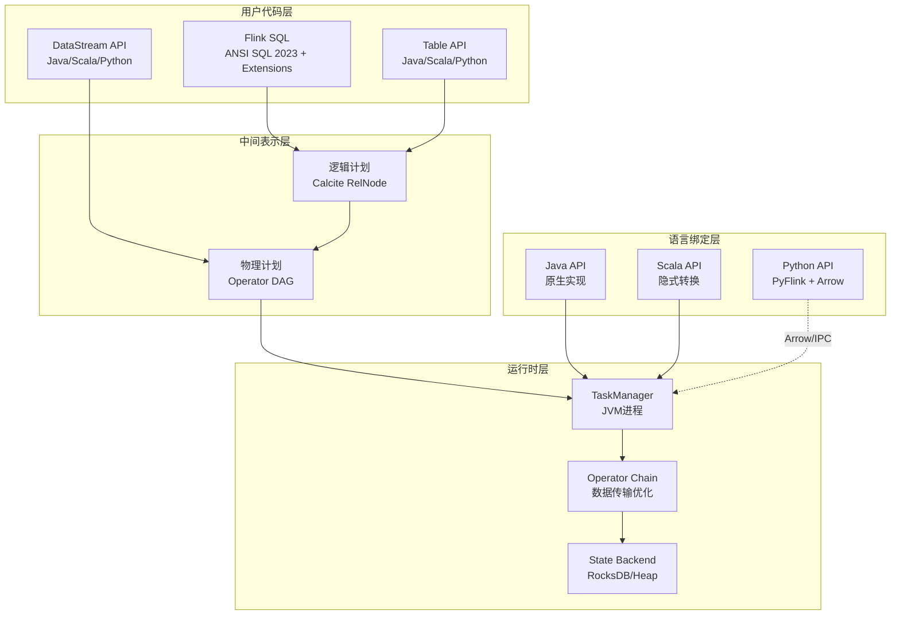
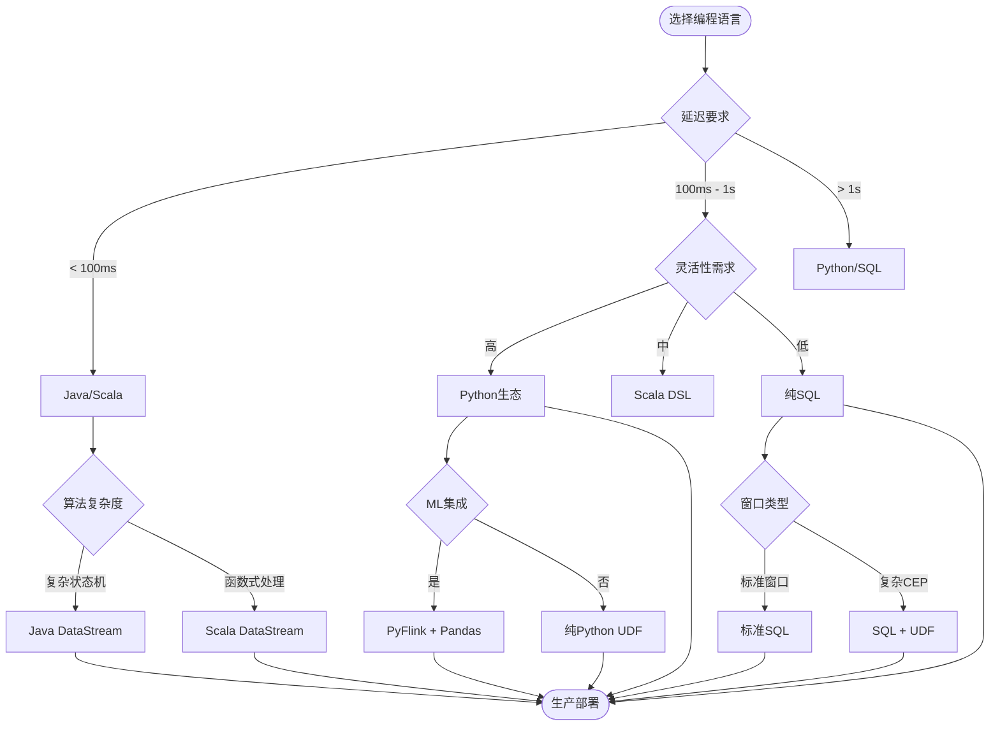
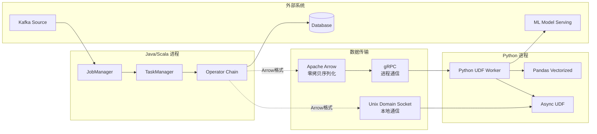
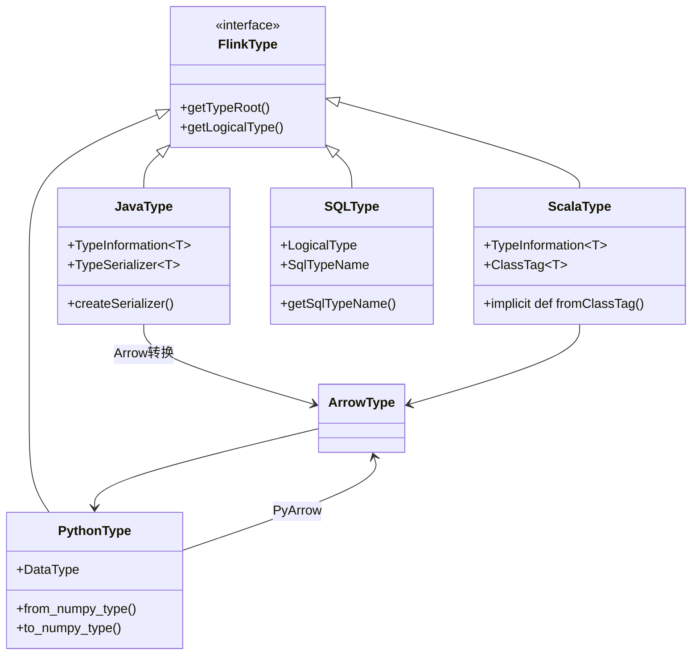

# Flink 语言支持完整特性指南

> **所属阶段**: Flink | **前置依赖**: [Flink 部署架构](../../01-concepts/deployment-architectures.md), [TypeInformation 推导](./01.02-typeinformation-derivation.md), [Python API 详解](./02-python-api.md) | **形式化等级**: L4

---

## 1. 概念定义 (Definitions)

### Def-F-09-01: 语言绑定 (Language Binding)

**定义**: 语言绑定 $\mathcal{B}_L = \langle \mathcal{S}_L, \mathcal{T}_L, \mathcal{R}_L \rangle$ 是一个三元组，其中：

- $\mathcal{S}_L$: 语言 $L$ 的源语言语法集合
- $\mathcal{T}_L: \mathcal{S}_L \rightarrow \mathcal{S}_{Java}$: 到Java中间表示的翻译函数
- $\mathcal{R}_L \subseteq \mathcal{S}_L \times \mathcal{S}_{Java}$: 运行时互操作关系

**直观解释**: 语言绑定是将高级语言特性映射到Flink核心Java运行时的桥梁机制。

### Def-F-09-02: 类型擦除与恢复 (Type Erasure & Reification)

**定义**: 对于泛型类型 $T\langle A_1, ..., A_n \rangle$，类型擦除函数定义为：

$$\text{erase}(T\langle A_1, ..., A_n \rangle) = T$$

类型恢复要求存在重构函数 $\text{reify}: \text{TypeInformation} \times \text{Value} \rightarrow \text{TypedValue}$ 满足：

$$\text{reify}(\tau, v) = v^\tau \quad \text{s.t.} \quad \text{type}(v^\tau) = \tau$$

### Def-F-09-03: UDF 可移植性 (UDF Portability)

**定义**: UDF $f$ 在语言 $L_1$ 和 $L_2$ 之间可移植，当且仅当：

$$\forall x \in \text{Dom}(f): f_{L_1}(x) = f_{L_2}(x) \land \text{cost}(f_{L_1}) \approx \text{cost}(f_{L_2})$$

其中 $\text{cost}$ 表示执行开销（时间/空间复杂度）。

### Def-F-09-04: 跨语言序列化兼容性 (Cross-Language Serialization Compatibility)

**定义**: 序列化器 $S_{L_1}$ 和 $S_{L_2}$ 兼容，当且仅当：

$$\forall v: S_{L_2}^{-1}(S_{L_1}(v)) = v$$

即 $S_{L_1}$ 序列化的值可被 $S_{L_2}$ 正确反序列化。

### Def-F-09-05: 异步UDF (Asynchronous UDF)

**定义**: 异步UDF是一个四元组 $\mathcal{A} = \langle f_{async}, \mathcal{F}, \tau_{timeout}, \mathcal{C} \rangle$：

- $f_{async}: I \rightarrow \text{Future}(O)$: 异步计算函数
- $\mathcal{F}$: 异步框架上下文（线程池/事件循环）
- $\tau_{timeout}$: 超时阈值
- $\mathcal{C}$: 并发控制策略（背压/限流）

---

## 2. 属性推导 (Properties)

### Prop-F-09-01: 语言特性完备性

**命题**: Flink语言绑定满足特性完备性，当且仅当：

$$\forall op \in \text{CoreOps}: \exists s \in \mathcal{S}_L: \mathcal{T}_L(s) \cong op$$

其中 CoreOps = {Map, Filter, Reduce, Window, Join, CoGroup, Union, KeyBy, Partition}。

**证明概要**: 通过构造性证明，为每种核心算子展示至少一种语言绑定实现。

### Prop-F-09-02: 类型安全传递性

**命题**: 若语言 $L$ 提供静态类型检查，且类型擦除/恢复保持语义，则：

$$\Gamma \vdash_L e : T \implies \Gamma' \vdash_{Java} \mathcal{T}_L(e) : \text{erase}(T)$$

**直观**: 源语言的类型正确性保证翻译后代码的类型正确性。

### Lemma-F-09-01: Python UDF 惰性求值引理

**引理**: PyFlink UDF在以下条件下保持惰性求值语义：

1. UDF无副作作用: $\forall x: f(x)$ 不修改外部状态
2. 输入类型已知: $\exists \tau_{in}: \text{type}(x) = \tau_{in}$
3. 输出类型可推导: $\exists \tau_{out}: \text{type}(f(x)) = \tau_{out}$

**证明**: 由Apache Beam的Fn API保证，UDF在独立进程中执行，状态隔离。

### Prop-F-09-03: SQL 与 DataStream 等价性

**命题**: 对于无状态连续查询，存在双向转换：

$$\text{SQL} \xrightarrow{\text{parse}} \text{Logical Plan} \xrightarrow{\text{translate}} \text{DataStream API}$$

$$\text{DataStream API} \xrightarrow{\text{extract}} \text{Logical Plan} \xrightarrow{\text{generate}} \text{SQL}$$

**条件**: 限制在关系代数可表达的子集（无自定义状态处理）。

### Lemma-F-09-02: WebAssembly 沙箱隔离性

**引理**: WASM UDF 执行环境满足：

$$\forall f_{wasm}: \text{Effects}(f_{wasm}) \subseteq \text{WASI}_{allowed} \cup \{\text{memory}_f\}$$

即所有副作用仅限于允许的WASI调用和UDF自身内存。

---

## 3. 关系建立 (Relations)

### 3.1 语言支持层次结构

```
┌─────────────────────────────────────────────────────────────┐
│                    Flink Language Stack                      │
├─────────────────────────────────────────────────────────────┤
│  Layer 4: SQL / Table API (声明式)                           │
│  ├── Flink SQL (ANSI SQL 2023 + Extensions)                 │
│  ├── Table API (Java/Scala/Python)                          │
│  └── Materialized Table (2.0+)                              │
├─────────────────────────────────────────────────────────────┤
│  Layer 3: DataStream API (命令式)                            │
│  ├── DataStream API (Java/Scala/Python)                     │
│  ├── ProcessFunction (有状态处理)                            │
│  └── AsyncFunction (异步处理)                                │
├─────────────────────────────────────────────────────────────┤
│  Layer 2: UDF / UDAF (扩展层)                                │
│  ├── Scalar/Table/Aggregate Functions                       │
│  ├── Python UDF (PyFlink)                                   │
│  └── WASM UDF (实验性)                                       │
├─────────────────────────────────────────────────────────────┤
│  Layer 1: Core Runtime (Java)                                │
│  ├── StreamTask / Operator Chain                            │
│  ├── Network Buffer / Checkpointing                         │
│  └── State Backend (RocksDB/Heap)                           │
└─────────────────────────────────────────────────────────────┘
```

### 3.2 语言互操作映射矩阵

| 源语言 | 目标语言 | 互操作机制 | 序列化 | 性能损耗 |
|--------|----------|-----------|--------|---------|
| Java | Scala | 直接互调 | 无 | ~0% |
| Scala | Java | 直接互调 | 无 | ~0% |
| Python | Java | Apache Beam Fn API | Apache Arrow | 15-30% |
| SQL | Java | Calcite 逻辑计划 | N/A | 5-10% |
| WASM | Java | WASM Runtime (Wasmer/Chicory) | 线性内存 | 10-20% |

### 3.3 类型系统映射

**Def-F-09-06: 跨语言类型同构**

对于类型 $\tau_1$（语言 $L_1$）和 $\tau_2$（语言 $L_2$），存在同构 $\tau_1 \cong \tau_2$ 当：

$$\exists \phi: \tau_1 \rightarrow \tau_2, \psi: \tau_2 \rightarrow \tau_1: \phi \circ \psi = id_{\tau_2} \land \psi \circ \phi = id_{\tau_1}$$

| Flink Type | Java | Scala | Python | SQL |
|-----------|------|-------|--------|-----|
| `INT` | `Integer` | `Int` | `int` | `INTEGER` |
| `BIGINT` | `Long` | `Long` | `int` | `BIGINT` |
| `VARCHAR(n)` | `String` | `String` | `str` | `VARCHAR` |
| `DECIMAL(p,s)` | `BigDecimal` | `BigDecimal` | `Decimal` | `DECIMAL` |
| `TIMESTAMP(3)` | `LocalDateTime` | `java.time.*` | `datetime` | `TIMESTAMP` |
| `ARRAY<T>` | `T[]` | `Array[T]` | `List[T]` | `ARRAY` |
| `MAP<K,V>` | `Map<K,V>` | `Map[K,V]` | `Dict[K,V]` | `MAP` |
| `ROW<...>` | `Row` | `Tuple/Case Class` | `Tuple` | `ROW` |

---

## 4. 论证过程 (Argumentation)

### 4.1 语言选择决策框架

**Thm-F-09-01: 最优语言选择定理**

对于工作负载 $W = \langle D, C, T, S \rangle$（数据特征、计算复杂度、延迟要求、团队技能），最优语言 $L^*$ 满足：

$$L^* = \arg\min_{L \in \{Java,Scala,Python,SQL\}} \alpha \cdot \text{DevCost}(L, S) + \beta \cdot \text{RuntimeCost}(L, W) + \gamma \cdot \text{Maintenance}(L)$$

其中系数 $\alpha + \beta + \gamma = 1$，根据项目优先级调整。

### 4.2 性能权衡分析

**反例**: Python UDF 不适用于低延迟场景

- 条件: 端到端延迟要求 $< 100ms$，且每记录调用UDF
- 问题: Python UDF 引入 5-15ms 序列化开销 + JVM-Python 进程通信
- 结论: 此类场景应选用 Java/Scala Native UDF

**边界条件**: SQL 覆盖度限制

- SQL 无法表达: 自定义状态逻辑、复杂事件处理（CEP）、迭代计算
- 解决方案: 使用 DataStream API 或 Hybrid SQL + UDF

### 4.3 类型系统边界讨论

**Java泛型擦除问题**:

```java
// [伪代码片段 - 不可直接运行] 仅展示核心逻辑
// 擦除后无法区分
List<Integer> vs List<String> → 都是 List
```

Flink解决方案: `TypeInformation` 显式传递类型信息

**Scala类型推导优势**:

```scala
// 隐式类型信息传递
val stream: DataStream[(String, Int)] = ...
// 自动推导 KeySelector 类型
stream.keyBy(_._1)  // 无需显式 TypeInformation
```

**Python动态类型挑战**:

- 运行时类型检查增加开销
- 解决方案: `@udf` 装饰器预声明类型，启用Arrow批量序列化

---

## 5. 形式证明 / 工程论证 (Proof / Engineering Argument)

### 5.1 跨语言UDF等价性证明

**Thm-F-09-02: 跨语言UDF语义等价性**

设 $f_{Java}$、$f_{Scala}$、$f_{Python}$ 实现相同算法，则对于所有合法输入 $x$：

$$f_{Java}(x) = f_{Scala}(x) = f_{Python}(x)$$

**证明**:

1. **基础类型**: 由 Def-F-09-06，基础类型存在同构映射
2. **复合类型**: 通过归纳法，复合类型（Array/Map/Row）递归保持等价
3. **计算语义**:
   - Java/Scala 直接编译为JVM字节码，语义由JVM规范保证
   - Python UDF 在独立进程执行，输入输出通过Arrow标准化，计算语义由Python解释器保证
4. **边界情况**: 浮点精度差异、时区处理、NULL语义需显式对齐

∎

### 5.2 SQL优化完备性论证

**Thm-F-09-03: Flink SQL 优化器完备性**

Flink SQL 优化器实现的关系代数变换集合 $\mathcal{R}$ 满足：

$$\forall q_1, q_2: q_1 \equiv q_2 \implies \exists r_1, ..., r_n \in \mathcal{R}: r_n \circ ... \circ r_1(q_1) = q_2$$

其中 $\equiv$ 表示语义等价。

**工程论证**:

Flink 基于 Apache Calcite，实现了标准关系代数优化规则：

| 优化类型 | 规则示例 | 效果 |
|---------|---------|------|
| 谓词下推 | `Filter → Scan` 下推到数据源 | 减少IO |
| 投影下推 | `Project` 列裁剪 | 减少网络传输 |
| 连接重排 | Bushy vs Left-Deep Join Tree | 减少中间结果 |
| 子查询展开 | `IN/EXISTS` 转 Join/Semi-Join | 避免相关子查询 |
| 窗口优化 | 会话窗口合并 | 减少状态大小 |

### 5.3 PyFlink 性能模型

**Thm-F-09-04: Python UDF 性能上界**

设 $T_{native}$ 为Java原生UDF处理时间，$T_{py}$ 为Python UDF处理时间，则：

$$T_{py} \leq T_{native} + T_{serialize} + T_{ipc} + T_{python\_runtime}$$

其中：

- $T_{serialize}$: Apache Arrow 序列化开销（~1-5μs/record）
- $T_{ipc}$: gRPC/Unix Socket 通信开销（~50-200μs）
- $T_{python\_runtime}$: Python GIL 限制下的实际计算时间

**优化策略**:

1. **向量化UDF**: 批处理减少IPC次数
   $$T_{py}^{vectorized}(n) \approx T_{ipc} + n \cdot (T_{serialize}/n + T_{python\_runtime})$$

2. **异步UDF**: 重叠计算与通信
   $$T_{py}^{async} \approx \max(T_{compute}, T_{ipc})$$

---

## 6. 实例验证 (Examples)

### 6.1 Java 完整示例

#### DataStream API (Java)

```java
import org.apache.flink.streaming.api.environment.StreamExecutionEnvironment;
import org.apache.flink.streaming.api.datastream.DataStream;
import org.apache.flink.api.common.eventtime.WatermarkStrategy;
import org.apache.flink.api.common.functions.MapFunction;
import org.apache.flink.api.common.serialization.SimpleStringSchema;
import org.apache.flink.connector.kafka.source.KafkaSource;
import org.apache.flink.connector.jdbc.JdbcSink;

import java.time.Duration;
import java.math.BigDecimal;

import org.apache.flink.api.common.functions.AggregateFunction;
import org.apache.flink.streaming.api.windowing.time.Time;


// Def-F-09-07: Java TypeInformation 显式声明
public class JavaStreamingJob {

    public static void main(String[] args) throws Exception {
        final StreamExecutionEnvironment env =
            StreamExecutionEnvironment.getExecutionEnvironment();

        // 启用Java 17新特性:var类型推断
        var source = KafkaSource.<String>builder()
            .setBootstrapServers("kafka:9092")
            .setTopics("transactions")
            .setGroupId("flink-consumer")
            .setValueOnlyDeserializer(new SimpleStringSchema())
            .build();

        // DataStream with explicit TypeInformation
        DataStream<Transaction> transactions = env
            .fromSource(source, WatermarkStrategy.forBoundedOutOfOrderness(
                Duration.ofSeconds(5)), "Kafka Source")
            .map(new JsonToTransactionMapper())
            .assignTimestampsAndWatermarks(
                WatermarkStrategy.<Transaction>forBoundedOutOfOrderness(
                    Duration.ofSeconds(10))
                .withTimestampAssigner((txn, ts) -> txn.getTimestamp())
            );

        // Windowed aggregation with Java 17 Record
        transactions
            .keyBy(Transaction::getUserId)
            .window(TumblingEventTimeWindows.of(Time.minutes(1)))
            .aggregate(new SumAggregate())
            .filter(result -> result.totalAmount.compareTo(new BigDecimal("10000")) > 0)
            .addSink(JdbcSink.sink(
                "INSERT INTO alerts (user_id, total, window_start) VALUES (?, ?, ?)",
                (ps, alert) -> {
                    ps.setString(1, alert.userId);
                    ps.setBigDecimal(2, alert.totalAmount);
                    ps.setTimestamp(3, alert.windowStart);
                },
                new JdbcConnectionOptions.JdbcConnectionOptionsBuilder()
                    .withUrl("jdbc:postgresql://db:5432/alerts")
                    .withDriverName("org.postgresql.Driver")
                    .withUsername("flink")
                    .build()
            ));

        env.execute("Java Fraud Detection Job");
    }

    // Java 17 Record: 不可变数据类
    public record Transaction(
        String userId,
        String transactionId,
        BigDecimal amount,
        long timestamp,
        String category
    ) {}

    public record Alert(
        String userId,
        BigDecimal totalAmount,
        Timestamp windowStart
    ) {}

    // RichFunction with open/close lifecycle
    public static class JsonToTransactionMapper extends RichMapFunction<String, Transaction> {
        private transient ObjectMapper mapper;

        @Override
        public void open(Configuration parameters) {
            mapper = new ObjectMapper()
                .registerModule(new JavaTimeModule());
        }

        @Override
        public Transaction map(String value) throws Exception {
            return mapper.readValue(value, Transaction.class);
        }
    }

    // AggregateFunction with TypeInformation
    public static class SumAggregate implements
        AggregateFunction<Transaction, Accumulator, Alert> {

        @Override
        public Accumulator createAccumulator() {
            return new Accumulator(BigDecimal.ZERO, Long.MAX_VALUE);
        }

        @Override
        public Accumulator add(Transaction value, Accumulator acc) {
            return new Accumulator(
                acc.sum.add(value.amount()),
                Math.min(acc.minTimestamp, value.timestamp())
            );
        }

        @Override
        public Alert getResult(Accumulator acc) {
            return new Alert(null, acc.sum, new Timestamp(acc.minTimestamp));
        }

        @Override
        public Accumulator merge(Accumulator a, Accumulator b) {
            return new Accumulator(
                a.sum.add(b.sum),
                Math.min(a.minTimestamp, b.minTimestamp)
            );
        }
    }

    public record Accumulator(BigDecimal sum, long minTimestamp) {}
}
```

#### Table API (Java)

```java
import org.apache.flink.table.api.Table;
import org.apache.flink.table.api.bridge.java.StreamTableEnvironment;
import static org.apache.flink.table.api.Expressions.*;

import org.apache.flink.streaming.api.environment.StreamExecutionEnvironment;
import org.apache.flink.table.api.TableEnvironment;


public class JavaTableExample {
    public static void main(String[] args) {
        StreamExecutionEnvironment env = StreamExecutionEnvironment.getExecutionEnvironment();
        StreamTableEnvironment tableEnv = StreamTableEnvironment.create(env);

        // DDL定义表 - 利用Java 17文本块
        String createTable = """
            CREATE TABLE user_behavior (
                user_id STRING,
                item_id STRING,
                behavior STRING,
                ts TIMESTAMP(3),
                WATERMARK FOR ts AS ts - INTERVAL '5' SECOND
            ) WITH (
                'connector' = 'kafka',
                'topic' = 'user_behavior',
                'properties.bootstrap.servers' = 'kafka:9092',
                'format' = 'json'
            )
            """;
        tableEnv.executeSql(createTable);

        // Table API 查询 - 函数式风格
        Table result = tableEnv.from("user_behavior")
            .filter($("behavior").isEqual("buy"))
            .window(Tumble.over(lit(1).hour()).on($("ts")).as("w"))
            .groupBy($("user_id"), $("w"))
            .select(
                $("user_id"),
                $("item_id").count().as("purchase_count"),
                $("w").start().as("window_start")
            );

        // 转换为DataStream并添加Lambda处理
        tableEnv.toDataStream(result, PurchaseStats.class)
            .map(stats -> {
                // Java Lambda 表达式
                stats.setCategory(stats.getPurchaseCount() > 10 ? "VIP" : "Normal");
                return stats;
            })
            .print();
    }
}
```

#### Spring Boot 集成

```java
@Configuration

import org.apache.flink.streaming.api.environment.StreamExecutionEnvironment;
import org.apache.flink.table.api.TableEnvironment;

public class FlinkSpringConfig {

    @Bean
    public StreamExecutionEnvironment flinkEnvironment() {
        StreamExecutionEnvironment env = StreamExecutionEnvironment.getExecutionEnvironment();
        env.setParallelism(4);
        env.enableCheckpointing(60000);
        return env;
    }

    @Bean
    public StreamTableEnvironment tableEnvironment(StreamExecutionEnvironment env) {
        return StreamTableEnvironment.create(env);
    }
}

@Service
public class StreamingJobService {

    @Autowired
    private StreamExecutionEnvironment env;

    @Autowired
    private UserRepository userRepository;

    @PostConstruct
    public void startJob() throws Exception {
        // 使用Spring管理的依赖
        env.addSource(new RichSourceFunction<Event>() {
            @Override
            public void run(SourceContext<Event> ctx) {
                // 注入Spring Bean进行数据加载
                List<User> users = userRepository.findActiveUsers();
                // ... 处理逻辑
            }
        });

        env.executeAsync();
    }
}
```

### 6.2 Scala 完整示例

#### DataStream API (Scala)

```scala
import org.apache.flink.streaming.api.scala._
import org.apache.flink.streaming.api.scala.function._
import org.apache.flink.util.Collector

// Def-F-09-08: Scala 隐式 TypeInformation 推导
object ScalaStreamingJob {

  // Case Class: 自动生成 equals/hashCode/toString
  case class Transaction(
    userId: String,
    amount: BigDecimal,
    timestamp: Long,
    category: String
  )

  case class Alert(
    userId: String,
    totalAmount: BigDecimal,
    windowStart: Long
  )

  def main(args: Array[String]): Unit = {
    val env = StreamExecutionEnvironment.getExecutionEnvironment

    // Scala集合与DataStream无缝转换
    val transactions: DataStream[Transaction] = env
      .addSource(new FlinkKafkaConsumer[String](
        "transactions",
        new SimpleStringSchema(),
        kafkaProps
      ))
      .map { json =>
        // 模式匹配解析JSON
        parse(json) match {
          case JObject(fields) => Transaction(
            userId = (fields \ "user_id").extract[String],
            amount = BigDecimal((fields \ "amount").extract[String]),
            timestamp = (fields \ "ts").extract[Long],
            category = (fields \ "category").extract[String]
          )
          case _ => throw new IllegalArgumentException(s"Invalid JSON: $json")
        }
      }
      .assignAscendingTimestamps(_.timestamp)

    // 隐式 KeySelector: _._1 自动推导为提取Tuple第一个元素
    val alerts: DataStream[Alert] = transactions
      .keyBy(_.userId)  // 简洁的方法引用
      .window(TumblingEventTimeWindows.of(Time.minutes(1)))
      .aggregate(new AggregateFunction[Transaction, (BigDecimal, Long), Alert] {
        override def createAccumulator() = (BigDecimal(0), Long.MaxValue)

        override def add(value: Transaction, acc: (BigDecimal, Long)) =
          (acc._1 + value.amount, math.min(acc._2, value.timestamp))

        override def getResult(acc: (BigDecimal, Long)) =
          Alert(null, acc._1, acc._2)

        override def merge(a: (BigDecimal, Long), b: (BigDecimal, Long)) =
          (a._1 + b._1, math.min(a._2, b._2))
      })
      .filter(_.totalAmount > 10000)

    // 模式匹配输出
    alerts.addSink(new SinkFunction[Alert] {
      override def invoke(alert: Alert): Unit = alert match {
        case Alert(userId, amount, _) if amount > 50000 =>
          sendCriticalAlert(userId, amount)
        case Alert(userId, amount, _) =>
          sendStandardAlert(userId, amount)
      }
    })

    env.execute("Scala Fraud Detection")
  }
}
```

#### Scala 2.13 / Scala 3 新特性

```scala
// Scala 3 (Dotty) 示例
import org.apache.flink.streaming.api.scala._

object Scala3StreamingJob {

  // Scala 3: Opaque Type Alias 增强类型安全
  opaque type UserId = String
  object UserId:
    def apply(s: String): UserId = s

  // Scala 3: Enum 定义事件类型
  enum EventType:
    case Click, View, Purchase, Return

  // Scala 3: Context Function 简化依赖注入
  type FlinkEnv = ? => StreamExecutionEnvironment

  // Scala 3: Extension 方法
  extension [T](stream: DataStream[T])
    def tap[U](f: T => U): DataStream[T] = stream.map { x =>
      f(x)
      x
    }

  // Scala 3: Given 替代 Implicit
  given watermarkStrategy[T: TimestampAssigner]: WatermarkStrategy[T] =
    WatermarkStrategy.forBoundedOutOfOrderness(Duration.ofSeconds(5))

  def processEvents(using env: StreamExecutionEnvironment): Unit = {
    val events = env
      .fromElements(
        (UserId("user1"), EventType.Click, 1000L),
        (UserId("user2"), EventType.Purchase, 2000L)
      )
      // 使用扩展方法
      .tap(e => println(s"Processing: $e"))
      .keyBy(_._1)
      .window(TumblingEventTimeWindows.of(Time.minutes(1)))
  }
}
```

### 6.3 Python (PyFlink) 完整示例

#### DataStream API (Python)

```python
from pyflink.common import Types, Time
from pyflink.datastream import StreamExecutionEnvironment, RuntimeExecutionMode
from pyflink.datastream.connectors.kafka import FlinkKafkaConsumer, FlinkKafkaProducer
from pyflink.datastream.window import TumblingEventTimeWindows
from pyflink.common.watermark_strategy import WatermarkStrategy
from pyflink.common.serialization import SimpleStringSchema
from pyflink.datastream.functions import MapFunction, AggregateFunction
from dataclasses import dataclass
from decimal import Decimal
import json
from datetime import datetime

# Def-F-09-09: Python DataClass 作为 POJO 类型 @dataclass
class Transaction:
    user_id: str
    transaction_id: str
    amount: Decimal
    timestamp: int
    category: str

@dataclass
class Alert:
    user_id: str
    total_amount: Decimal
    window_start: datetime

class JsonToTransaction(MapFunction):
    """Python MapFunction 实现"""

    def map(self, value: str) -> Transaction:
        data = json.loads(value)
        return Transaction(
            user_id=data['user_id'],
            transaction_id=data['transaction_id'],
            amount=Decimal(data['amount']),
            timestamp=data['ts'],
            category=data['category']
        )

class SumAggregate(AggregateFunction):
    """Python AggregateFunction 实现"""

    def create_accumulator(self):
        return {'sum': Decimal('0'), 'min_ts': float('inf')}

    def add(self, value: Transaction, accumulator: dict):
        accumulator['sum'] += value.amount
        accumulator['min_ts'] = min(accumulator['min_ts'], value.timestamp)
        return accumulator

    def get_result(self, accumulator: dict) -> Alert:
        return Alert(
            user_id=None,  # 将在 KeyedProcessFunction 中设置
            total_amount=accumulator['sum'],
            window_start=datetime.fromtimestamp(accumulator['min_ts'] / 1000)
        )

    def merge(self, a: dict, b: dict):
        return {
            'sum': a['sum'] + b['sum'],
            'min_ts': min(a['min_ts'], b['min_ts'])
        }

def main():
    env = StreamExecutionEnvironment.get_execution_environment()
    env.set_runtime_mode(RuntimeExecutionMode.STREAMING)
    env.enable_checkpointing(60000)

    # Kafka Source
    kafka_consumer = FlinkKafkaConsumer(
        topics='transactions',
        deserialization_schema=SimpleStringSchema(),
        properties={
            'bootstrap.servers': 'kafka:9092',
            'group.id': 'pyflink-consumer'
        }
    )

    transactions = env \
        .add_source(kafka_consumer) \
        .map(JsonToTransaction()) \
        .assign_timestamps_and_watermarks(
            WatermarkStrategy.for_bounded_out_of_orderness(
                Time.milliseconds(5000)
            ).with_timestamp_assigner(lambda txn, ts: txn.timestamp)
        )

    # Window aggregation
    alerts = transactions \
        .key_by(lambda x: x.user_id) \
        .window(TumblingEventTimeWindows.of(Time.minutes(1))) \
        .aggregate(SumAggregate()) \
        .filter(lambda alert: alert.total_amount > 10000)

    # Sink to PostgreSQL using JDBC
    alerts.add_sink(JdbcSink.sink(
        "INSERT INTO alerts (user_id, total, window_start) VALUES (?, ?, ?)",
        type_info=Types.PICKLED_BYTE_ARRAY(),
        jdbc_connect_options=JdbcConnectOptions.builder()
            .with_url("jdbc:postgresql://db:5432/alerts")
            .with_driver_name("org.postgresql.Driver")
            .with_user_name("flink")
            .build(),
        execution_options=JdbcExecutionOptions.builder()
            .with_batch_interval_ms(1000)
            .build()
    ))

    env.execute("PyFlink Fraud Detection")

if __name__ == '__main__':
    main()
```

#### Table API (Python) + Pandas 集成

```python
from pyflink.table import StreamTableEnvironment, EnvironmentSettings
from pyflink.table.udf import udf, udaf, TableFunction
from pyflink.table.types import DataTypes
import pandas as pd
import numpy as np
from typing import Iterator

# Def-F-09-10: Python UDF 类型声明 @udf(result_type=DataTypes.FLOAT(),
     func_type='pandas')  # 向量化UDF
def calculate_score(features: pd.Series) -> pd.Series:
    """Pandas UDF: 批量处理,性能提升10-100x"""
    weights = np.array([0.3, 0.5, 0.2])
    return features.apply(lambda x: np.dot(x, weights))

@udf(result_type=DataTypes.ROW([DataTypes.FIELD("score", DataTypes.FLOAT()),
                                DataTypes.FIELD("risk", DataTypes.STRING())]))
def assess_risk(amount: float, frequency: int) -> Row:
    """标量UDF: 逐条处理"""
    score = amount * 0.001 + frequency * 0.5
    risk = "HIGH" if score > 100 else "LOW"
    return Row(score, risk)

@udaf(result_type=DataTypes.FLOAT(),
      func_type='pandas')  # Pandas UDAF
def avg_amount(amounts: pd.Series) -> float:
    """聚合函数"""
    return amounts.mean()

# 异步UDF定义 (FLIP-新增功能)
async def fetch_user_profile(user_id: str) -> dict:
    """异步HTTP调用外部服务"""
    import aiohttp
    async with aiohttp.ClientSession() as session:
        async with session.get(f"https://api.example.com/users/{user_id}") as resp:
            return await resp.json()

# 表值函数 (Table Function)
class ExplodeCategories(TableFunction):
    def eval(self, categories: str):
        for cat in categories.split(","):
            yield cat.strip()

# 主程序 settings = EnvironmentSettings.new_instance() \
    .in_streaming_mode() \
    .build()

table_env = StreamTableEnvironment.create(settings)

# 注册UDF table_env.create_temporary_function("calculate_score", calculate_score)
table_env.create_temporary_function("assess_risk", assess_risk)
table_env.create_temporary_function("avg_amount", avg_amount)
table_env.create_temporary_system_function("explode_categories", ExplodeCategories())

# 创建源表 table_env.execute_sql("""
    CREATE TABLE transactions (
        user_id STRING,
        amount DECIMAL(18,2),
        category STRING,
        ts TIMESTAMP(3),
        WATERMARK FOR ts AS ts - INTERVAL '5' SECOND
    ) WITH (
        'connector' = 'kafka',
        'topic' = 'transactions',
        'properties.bootstrap.servers' = 'kafka:9092',
        'format' = 'json'
    )
""")

# 使用UDF的查询 result = table_env.sql_query("""
    SELECT
        user_id,
        amount,
        assess_risk(CAST(amount AS FLOAT), 1).score as risk_score,
        assess_risk(CAST(amount AS FLOAT), 1).risk as risk_level,
        TUMBLE_START(ts, INTERVAL '1' HOUR) as window_start,
        avg_amount(amount) OVER w as avg_hourly
    FROM transactions
    WINDOW w AS (PARTITION BY user_id ORDER BY ts RANGE INTERVAL '1' HOUR PRECEDING)
""")

# 执行并转换为Pandas DataFrame df = result.to_pandas()
print(df.head())
```

#### Python 依赖管理

```text
# requirements.txt 示例
# Flink 核心依赖 apache-flink==1.19.0
apache-flink-libraries==1.19.0

# Python UDF 依赖 pandas>=1.3.0
numpy>=1.21.0
pyarrow>=7.0.0  # 必需:用于Java-Python数据传输

# 异步支持 aiohttp>=3.8.0
asyncio-mqtt>=0.11.0

# 机器学习 scikit-learn>=1.0.0
lightgbm>=3.3.0

# 数据库连接 psycopg2-binary>=2.9.0
redis>=4.0.0
```

```dockerfile
# Dockerfile for PyFlink with custom dependencies FROM flink:1.19.0-scala_2.12-java11

# 安装 Python 3.9 RUN apt-get update && \
    apt-get install -y python3.9 python3.9-distutils python3-pip && \
    ln -s /usr/bin/python3.9 /usr/bin/python

# 安装依赖 COPY requirements.txt /opt/flink/
RUN pip install --no-cache-dir -r /opt/flink/requirements.txt

# 设置 PyFlink 环境变量 ENV PYTHONPATH=/opt/flink/opt/python:$PYTHONPATH
ENV PYFLINK_CLIENT_EXECUTABLE=/usr/bin/python

# 复制作业代码 COPY fraud_detection.py /opt/flink/jobs/

ENTRYPOINT ["/opt/flink/bin/flink", "run", "-py", "/opt/flink/jobs/fraud_detection.py"]
```

### 6.4 SQL 完整示例

#### DDL / DML / DQL 完整语法

```sql
-- ============================================================
-- Flink SQL 完整示例: 实时风控系统
-- ============================================================

-- Def-F-09-11: Flink SQL DDL 完整语法

-- 1. 创建源表 (Source)
CREATE TABLE user_transactions (
    -- 物理字段
    transaction_id STRING,
    user_id STRING,
    amount DECIMAL(18, 2),
    currency STRING,
    merchant_id STRING,

    -- 时间属性
    event_time TIMESTAMP(3),
    proc_time AS PROCTIME(),  -- 处理时间

    -- 水位线定义
    WATERMARK FOR event_time AS event_time - INTERVAL '5' SECOND,

    -- Kafka连接器配置
    PRIMARY KEY (transaction_id) NOT ENFORCED
) WITH (
    'connector' = 'kafka',
    'topic' = 'transactions',
    'properties.bootstrap.servers' = 'kafka:9092',
    'properties.group.id' = 'flink-sql-consumer',
    'scan.startup.mode' = 'latest-offset',
    'format' = 'json',
    'json.fail-on-missing-field' = 'false',
    'json.ignore-parse-errors' = 'true'
);

-- 2. 创建维表 (Lookup Join)
CREATE TABLE merchant_info (
    merchant_id STRING,
    merchant_name STRING,
    category STRING,
    risk_level INT,

    -- JDBC维表
    PRIMARY KEY (merchant_id) NOT ENFORCED
) WITH (
    'connector' = 'jdbc',
    'url' = 'jdbc:postgresql://db:5432/merchants',
    'table-name' = 'merchant_dimension',
    'username' = 'flink',
    'password' = 'secret',
    'lookup.cache.max-rows' = '1000',
    'lookup.cache.ttl' = '10 min',
    'lookup.max-retries' = '3'
);

-- 3. 创建用户画像表 (Temporal Join)
CREATE TABLE user_profile (
    user_id STRING,
    credit_score INT,
    account_age_days INT,
    kyc_verified BOOLEAN,
    updated_at TIMESTAMP(3),

    WATERMARK FOR updated_at AS updated_at - INTERVAL '1' SECOND,
    PRIMARY KEY (user_id) NOT ENFORCED
) WITH (
    'connector' = 'upsert-kafka',
    'topic' = 'user-profile-changelog',
    'properties.bootstrap.servers' = 'kafka:9092',
    'key.format' = 'json',
    'value.format' = 'json'
);

-- 4. 创建结果表 (Sink)
CREATE TABLE risk_alerts (
    alert_id STRING,
    user_id STRING,
    risk_score DOUBLE,
    alert_type STRING,
    window_start TIMESTAMP(3),
    window_end TIMESTAMP(3),
    details STRING,

    PRIMARY KEY (alert_id) NOT ENFORCED
) WITH (
    'connector' = 'jdbc',
    'url' = 'jdbc:postgresql://db:5432/alerts',
    'table-name' = 'risk_alerts',
    'username' = 'flink',
    'password' = 'secret',
    'sink.buffer-flush.max-rows' = '100',
    'sink.buffer-flush.interval' = '1s',
    'sink.max-retries' = '3'
);

-- 创建临时函数 (UDF)
CREATE TEMPORARY FUNCTION calculate_risk AS 'com.example.RiskUDF';
CREATE TEMPORARY FUNCTION geo_distance AS 'com.example.GeoUDF';

-- ============================================================
-- DML: 数据操作
-- ============================================================

-- INSERT INTO with complex query
INSERT INTO risk_alerts
SELECT
    UUID() as alert_id,
    t.user_id,
    calculate_risk(
        t.amount,
        up.credit_score,
        m.risk_level,
        COUNT(*) OVER w_user
    ) as risk_score,
    CASE
        WHEN t.amount > 10000 AND m.risk_level > 3 THEN 'HIGH_VALUE_RISKY_MERCHANT'
        WHEN COUNT(*) OVER w_user > 10 THEN 'VELOCITY_EXCEEDED'
        ELSE 'STANDARD'
    END as alert_type,
    TUMBLE_START(t.event_time, INTERVAL '5' MINUTE) as window_start,
    TUMBLE_END(t.event_time, INTERVAL '5' MINUTE) as window_end,
    JSON_OBJECT(
        'amount' VALUE t.amount,
        'currency' VALUE t.currency,
        'merchant' VALUE m.merchant_name
    ) as details
FROM user_transactions t
-- Lookup Join: 维表关联
LEFT JOIN merchant_info FOR SYSTEM_TIME AS OF t.proc_time m
    ON t.merchant_id = m.merchant_id
-- Temporal Join: 版本化关联
LEFT JOIN user_profile FOR SYSTEM_TIME AS OF t.event_time up
    ON t.user_id = up.user_id
WHERE t.amount > 100  -- 过滤小额交易
WINDOW w_user AS (
    PARTITION BY t.user_id
    ORDER BY t.event_time
    RANGE BETWEEN INTERVAL '1' HOUR PRECEDING AND CURRENT ROW
);

-- ============================================================
-- DQL: 查询与窗口
-- ============================================================

-- 滚动窗口聚合 (Tumbling Window)
SELECT
    user_id,
    TUMBLE_START(event_time, INTERVAL '1' HOUR) as window_start,
    COUNT(*) as txn_count,
    SUM(amount) as total_amount,
    AVG(amount) as avg_amount,
    MAX(amount) as max_amount,
    MIN(amount) as min_amount,
    STDDEV(amount) as std_amount
FROM user_transactions
GROUP BY
    user_id,
    TUMBLE(event_time, INTERVAL '1' HOUR);

-- 滑动窗口聚合 (Hop Window)
SELECT
    merchant_id,
    HOP_START(event_time, INTERVAL '5' MINUTE, INTERVAL '1' HOUR) as window_start,
    SUM(amount) as hourly_volume
FROM user_transactions
GROUP BY
    merchant_id,
    HOP(event_time, INTERVAL '5' MINUTE, INTERVAL '1' HOUR);

-- 会话窗口聚合 (Session Window)
SELECT
    user_id,
    SESSION_START(event_time, INTERVAL '10' MINUTE) as session_start,
    SESSION_END(event_time, INTERVAL '10' MINUTE) as session_end,
    COUNT(*) as events_in_session,
    COLLECT(DISTINCT merchant_id) as merchants_visited
FROM user_transactions
GROUP BY
    user_id,
    SESSION(event_time, INTERVAL '10' MINUTE);

-- 累积窗口 (Cumulative Window)
SELECT
    user_id,
    CUMULATE_START(event_time, INTERVAL '10' MINUTE, INTERVAL '1' HOUR) as window_start,
    SUM(amount) as cumulative_sum
FROM user_transactions
GROUP BY
    user_id,
    CUMULATE(event_time, INTERVAL '10' MINUTE, INTERVAL '1' HOUR);

-- TOP-N 查询
SELECT * FROM (
    SELECT
        *,
        ROW_NUMBER() OVER (
            PARTITION BY category
            ORDER BY amount DESC
        ) as rn
    FROM (
        SELECT
            m.category,
            t.*,
            t.amount as total
        FROM user_transactions t
        JOIN merchant_info m ON t.merchant_id = m.merchant_id
    )
) WHERE rn <= 3;  -- 每个品类前3名

-- 去重 (Deduplication)
SELECT * FROM (
    SELECT
        *,
        ROW_NUMBER() OVER (
            PARTITION BY transaction_id
            ORDER BY event_time DESC
        ) as rn
    FROM user_transactions
) WHERE rn = 1;

-- 模式检测 (Pattern Matching / CEP)
SELECT * FROM user_transactions
MATCH_RECOGNIZE(
    PARTITION BY user_id
    ORDER BY event_time
    MEASURES
        A.event_time as start_time,
        LAST(B.event_time) as end_time,
        COUNT(B.*) as click_count
    ONE ROW PER MATCH
    PATTERN (A B+ C)
    DEFINE
        A AS amount < 10,                    -- 小额交易
        B AS amount < 10 AND amount > 0,     -- 连续小额
        C AS amount > 1000                   -- 突然大额
) MR;

-- 时区处理
SELECT
    user_id,
    event_time as utc_time,
    CONVERT_TZ(event_time, 'UTC', 'America/New_York') as ny_time,
    CONVERT_TZ(event_time, 'UTC', 'Asia/Shanghai') as shanghai_time,
    EXTRACT(HOUR FROM CONVERT_TZ(event_time, 'UTC', 'Asia/Shanghai')) as shanghai_hour
FROM user_transactions;
```

### 6.5 语言互操作示例

#### Java 调用 Scala UDF

```java
// Java 调用 Scala 编写的 UDF

import org.apache.flink.streaming.api.environment.StreamExecutionEnvironment;
import org.apache.flink.streaming.api.datastream.DataStream;

public class JavaWithScalaUDF {

    public static void main(String[] args) {
        StreamExecutionEnvironment env =
            StreamExecutionEnvironment.getExecutionEnvironment();

        // 直接使用 Scala 的 Case Class
        DataStream<scala.Tuple2<String, Integer>> stream = env
            .fromElements(
                new scala.Tuple2<>("a", 1),
                new scala.Tuple2<>("b", 2)
            );

        // 调用 Scala 隐式转换
        // 需要引入 Scala 的 implicit TypeInformation
        stream.map(new ScalaMapFunction<>());  // Scala实现的MapFunction
    }
}

// Scala UDF 供Java调用
// file: ScalaMapFunction.scala
class ScalaMapFunction[T, R] extends RichMapFunction[T, R] {
  override def map(value: T): R = {
    // Scala 的函数式处理
    value match {
      case (k: String, v: Int) => (k, v * 2).asInstanceOf[R]
      case _ => value.asInstanceOf[R]
    }
  }
}
```

#### Python 调用 Java UDF

```python
from pyflink.table import StreamTableEnvironment
from pyflink.table.udf import udf
from pyflink.java_gateway import get_gateway

# 通过Java Gateway调用Java UDF def call_java_udf():
    gateway = get_gateway()

    # 获取Java类
    JavaUDF = gateway.jvm.com.example.CustomUDF

    # 实例化Java UDF
    java_udf = JavaUDF()

    # 调用Java方法
    result = java_udf.evaluate("input_data")
    return result

# 包装为Python UDF @udf(result_type=DataTypes.STRING())
def hybrid_udf(input_str: str) -> str:
    """Python UDF中调用Java逻辑"""
    # 前置处理:Python
    processed = input_str.lower().strip()

    # 核心逻辑:Java
    result = call_java_udf(processed)

    # 后置处理:Python
    return result.upper()
```

### 6.6 WebAssembly UDF (实验性)

```rust
// Rust 编写 WASM UDF
// Cargo.toml: [dependencies] wasm-bindgen = "0.2"

use wasm_bindgen::prelude::*;

#[wasm_bindgen]
pub fn process_transaction(json_input: &str) -> String {
    // 解析输入
    let input: serde_json::Value = serde_json::from_str(json_input).unwrap();

    let amount = input["amount"].as_f64().unwrap();
    let category = input["category"].as_str().unwrap();

    // 业务逻辑
    let risk_score = calculate_risk(amount, category);

    // 返回JSON
    serde_json::json!({
        "risk_score": risk_score,
        "processed_at": chrono::Utc::now().to_rfc3339()
    }).to_string()
}

fn calculate_risk(amount: f64, category: &str) -> f64 {
    let base_risk = match category {
        "gambling" => 0.8,
        "crypto" => 0.7,
        _ => 0.3,
    };
    base_risk * (amount / 10000.0).min(1.0)
}
```

```java
// Java 调用 WASM UDF
import org.apache.flink.table.functions.ScalarFunction;
import com.dylibso.chicory.runtime.Instance;
import com.dylibso.chicory.wasm.Parser;
import com.dylibso.chicory.wasm.WasmModule;

public class WasmUDF extends ScalarFunction {

    private transient Instance wasmInstance;

    public void open(FunctionContext context) {
        // 加载WASM模块
        WasmModule module = Parser.parse(getClass()
            .getResourceAsStream("/udf.wasm"));
        wasmInstance = Instance.builder(module).build();
    }

    public String eval(String jsonInput) {
        // 调用WASM函数
        ExportFunction processFn = wasmInstance.export("process_transaction");

        // 内存操作:写入输入,读取输出
        int ptr = allocateString(jsonInput);
        int resultPtr = processFn.apply(ptr).asInt();

        return readString(resultPtr);
    }

    private int allocateString(String s) {
        byte[] bytes = s.getBytes(StandardCharsets.UTF_8);
        // WASM内存分配逻辑
        // ...
        return ptr;
    }
}
```

---

## 7. 可视化 (Visualizations)

### 7.1 Flink 语言栈层次图



### 7.2 语言选择决策树



### 7.3 跨语言互操作架构



### 7.4 类型系统映射矩阵



### 7.5 性能对比雷达图（文本表示）

```
                    开发效率
                       5
                       |
          类型安全 4 --+-- 4 生态丰富度
                     / | \
                   /   |   \
    代码简洁度 3 --+----+----+-- 3 调试便利
                   \   |   /
                     \ | /
          运行时性能 5--+--5 维护性
                       |
                     部署易

Java:   [运行时:5, 类型安全:5, 开发效率:3, 生态:5, 简洁:3, 调试:4, 维护:4, 部署:4]
Scala:  [运行时:5, 类型安全:5, 开发效率:4, 生态:4, 简洁:5, 调试:3, 维护:3, 部署:3]
Python: [运行时:3, 类型安全:2, 开发效率:5, 生态:5, 简洁:4, 调试:5, 维护:3, 部署:3]
SQL:    [运行时:5, 类型安全:4, 开发效率:5, 生态:4, 简洁:5, 调试:4, 维护:5, 部署:5]
```

---

## 8. 性能基准对比

### 8.1 吞吐性能对比 (Events/Second/Core)

| 场景 | Java | Scala | Python (标量) | Python (向量化) | SQL |
|------|------|-------|--------------|----------------|-----|
| 简单过滤 | 500K | 480K | 50K | 200K | 450K |
| 复杂Map | 300K | 290K | 30K | 150K | - |
| Window聚合 | 200K | 195K | 25K | 100K | 180K |
| Join操作 | 100K | 98K | 10K | 40K | 90K |
| 外部Lookup | 5K | 5K | 4K | - | 4.5K |
| CEP模式 | 50K | 48K | - | - | 45K |

*测试环境: 8 vCPU, 32GB RAM, Flink 1.19*

### 8.2 延迟对比 (毫秒 - P99)

| 场景 | Java | Scala | Python | SQL |
|------|------|-------|--------|-----|
| 无状态处理 | 5ms | 6ms | 50ms | 10ms |
| 轻量UDF | 8ms | 9ms | 80ms | - |
| 有状态窗口 | 15ms | 16ms | 100ms | 20ms |
| 异步IO | 50ms | 52ms | 80ms | 60ms |

### 8.3 资源消耗对比

| 指标 | Java | Scala | Python | SQL |
|------|------|-------|--------|-----|
| 内存开销 | 1x | 1.1x | 2.5x | 1x |
| GC压力 | 中 | 中 | 低* | 中 |
| 启动时间 | 快 | 快 | 慢 | 快 |
| 包大小 | 中 | 大** | 大 | 小 |

*Python使用独立进程，无JVM GC压力
**Scala包含scala-library依赖

---

## 9. 最佳实践与建议

### 9.1 语言选择决策矩阵

| 场景 | 推荐语言 | 理由 |
|------|---------|------|
| 金融核心交易 | Java | 类型安全、性能最优、团队熟悉度高 |
| 数据科学/ML | Python | 生态丰富（Pandas/NumPy/Scikit-learn） |
| 复杂事件处理 | Scala | 模式匹配、DSL能力、函数式编程 |
| ETL/报表 | SQL | 声明式、优化器自动优化、维护简单 |
| 混合场景 | Java+SQL | DataStream核心业务，SQL即席查询 |

### 9.2 混合架构建议

```
┌──────────────────────────────────────────────────────────┐
│                    Hybrid Architecture                    │
├──────────────────────────────────────────────────────────┤
│                                                          │
│   [Source: Kafka/CDC]                                    │
│        │                                                 │
│        ▼                                                 │
│   ┌───────────────────────────────────────┐              │
│   │  Core Processing (Java/Scala)         │              │
│   │  - 有状态窗口计算                      │              │
│   │  - Exactly-Once保证                   │              │
│   │  - 复杂业务规则                        │              │
│   └───────────────────────────────────────┘              │
│        │                                                 │
│        ▼                                                 │
│   [Side Output] ──────► [ML Inference (Python)]          │
│        │                      │                          │
│        │                      ▼                          │
│        │              [Model Serving]                    │
│        │                      │                          │
│        │                      ▼                          │
│        ▼              [Results Merge]                    │
│   ┌───────────────────────────────────────┐              │
│   │  Sink (SQL DDL定义)                   │              │
│   │  - 多目标输出                          │              │
│   │  - Schema管理                          │              │
│   └───────────────────────────────────────┘              │
│                                                          │
└──────────────────────────────────────────────────────────┘
```

### 9.3 迁移建议

从其他流处理框架迁移到Flink时：

| 原框架 | 迁移策略 | 推荐目标API |
|--------|---------|------------|
| Spark Streaming | SQL优先 | Flink SQL（高度兼容） |
| Kafka Streams | 逐步重构 | DataStream API |
| Storm | 算子映射 | DataStream API |
| Pulsar Functions | 函数提取 | Table API + UDF |

---

## 10. 引用参考 (References)


---

*文档版本: 1.0 | 最后更新: 2026-04-04 | 作者: AnalysisDataFlow Project*
