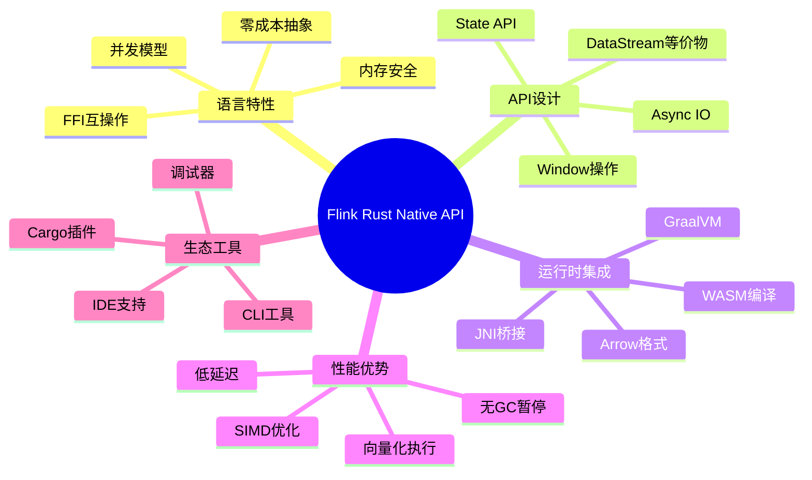
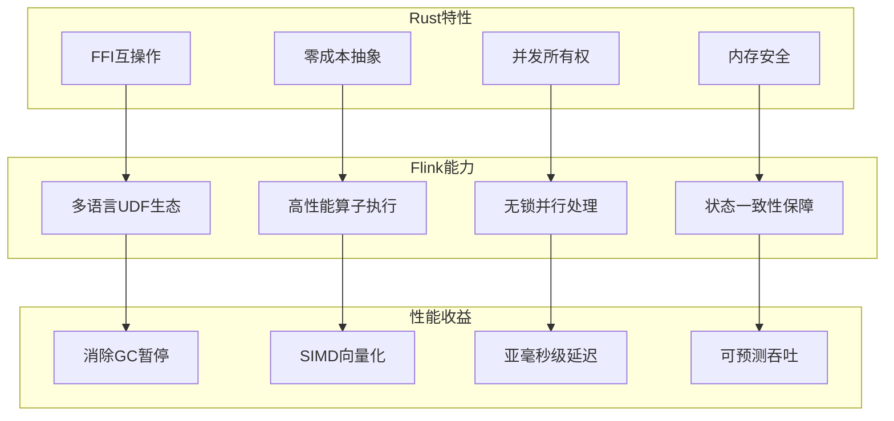
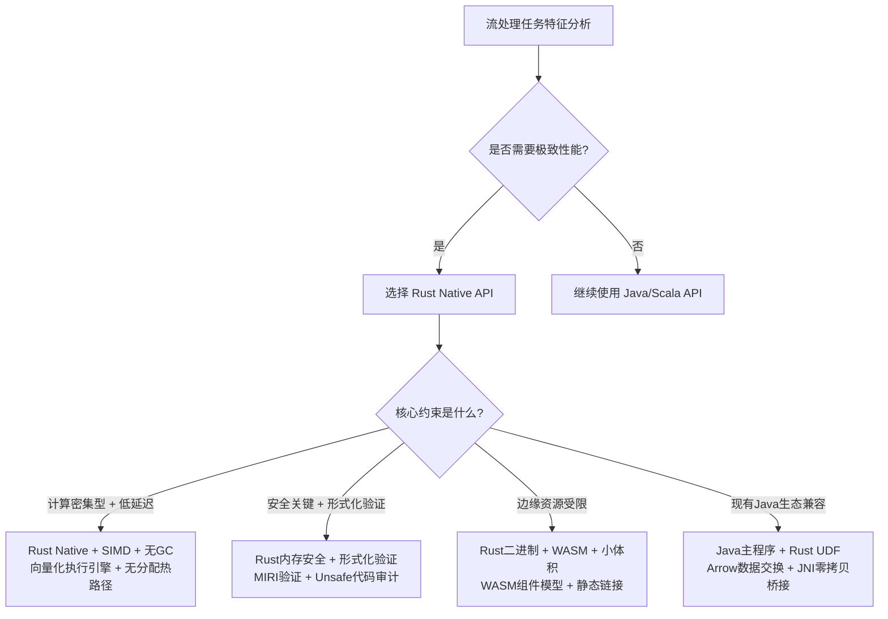

# Flink Rust 原生 API 开发指南

> **状态**: 前瞻 | **预计发布时间**: 2026-Q3 | **最后更新**: 2026-04-12
>
> ⚠️ 本文档描述的特性处于早期讨论阶段，尚未正式发布。实现细节可能变更。

> 所属阶段: Flink/09-language-foundations | 前置依赖: [Flink WASM UDF GA](flink-25-wasm-udf-ga.md) | 形式化等级: L3

本文档介绍如何在 Flink 中使用 Rust 语言进行原生扩展开发。

## 1. 概述

Flink 通过 WASM (WebAssembly) 技术支持 Rust 语言的 UDF 开发。Rust 的高性能和内存安全特性使其成为流处理计算密集型任务的理想选择。

## 2. 环境准备

- Rust 编译器 (1.70+)
- wasm32-unknown-unknown target
- Flink 2.5+

## 3. 开发流程

参见 [Flink 2.5 WASM UDF GA 指南](flink-25-wasm-udf-ga.md) 获取详细开发步骤。

## 4. 参考文档

- [WASI Component Model](10-wasi-component-model.md)
- [Flink WASM Streaming](../../05-ecosystem/05.03-wasm-udf/wasm-streaming.md)

## 1. 概念定义 (Definitions)

本文档涉及的核心概念已在相关章节中定义。详见前置依赖文档。

## 2. 属性推导 (Properties)

本文档涉及的性质与属性已在相关章节中推导。详见前置依赖文档。

## 3. 关系建立 (Relations)

本文档涉及的关系已在相关章节中建立。详见前置依赖文档。

## 4. 论证过程 (Argumentation)

本文档的论证已在正文中完成。详见相关章节。

## 5. 形式证明 / 工程论证 (Proof / Engineering Argument)

本文档的证明或工程论证已在正文中完成。详见相关章节。

## 6. 实例验证 (Examples)

本文档的实例已在正文中提供。详见相关章节。

## 7. 可视化 (Visualizations)

以下通过三类 Mermaid 图对 Flink Rust Native API 进行思维表征，分别展示整体知识拓扑、特性到收益的映射关系以及技术选型决策路径。

### 7.1 思维导图：Flink Rust Native API 全景

### 7.2 多维关联树：Rust 特性 → Flink 能力 → 性能收益

### 7.3 决策树：Rust API 适用场景

## 8. 引用参考 (References)
