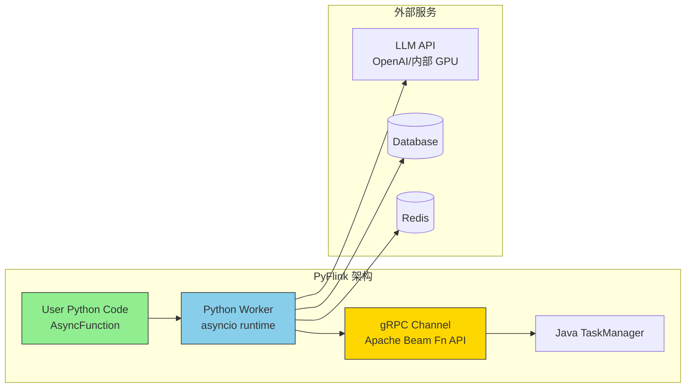
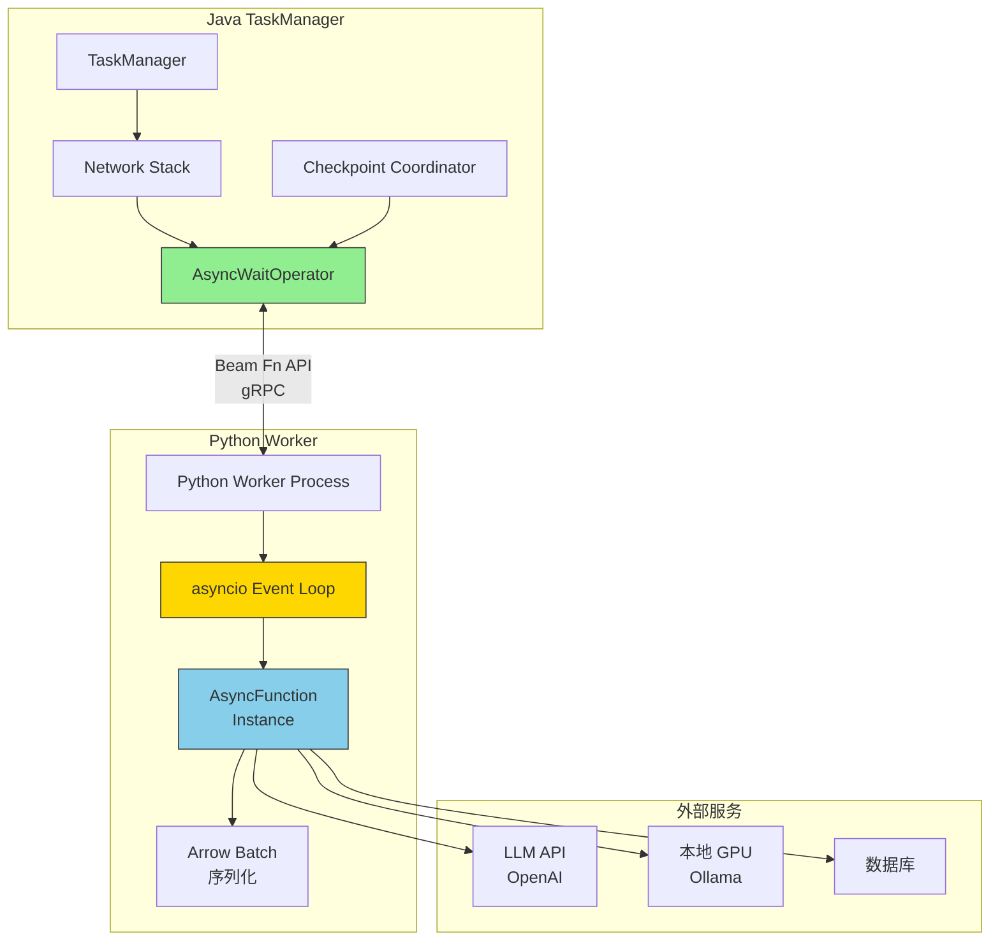
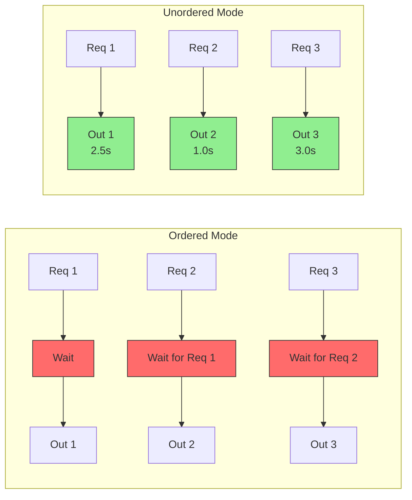
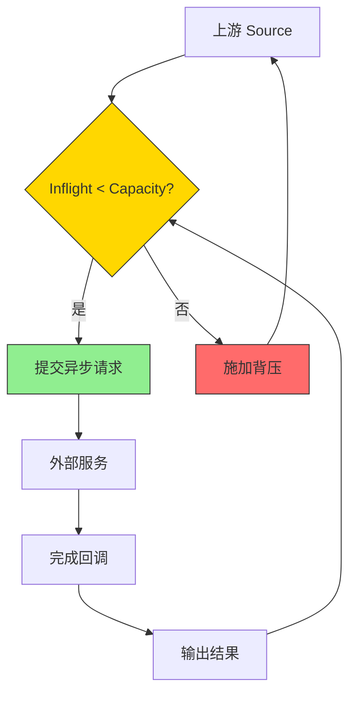
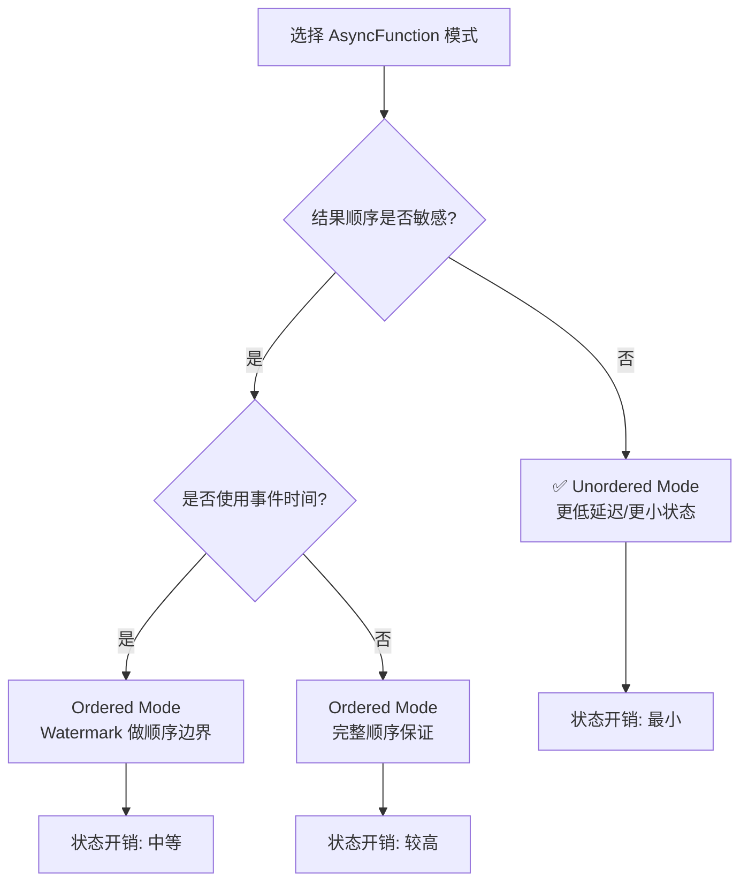

> **状态**: ✅ 已发布 | **风险等级**: 低 | **最后更新**: 2026-04-19
>
> Apache Flink 2.2.0 已于 2025-12-04 正式发布 PyFlink DataStream API 异步函数支持（FLINK-38190）。
>
> 本文档基于 Flink 2.2 官方 Release Notes、PyFlink 文档与社区最佳实践编写。

# PyFlink 异步函数完全指南：DataStream API 中的非阻塞外部服务调用

> **状态**: ✅ Released (2025-12-04, Flink 2.2 GA)
> **Flink 版本**: 2.2.0+
> **稳定性**: GA (Generally Available)
> **JIRA**: FLINK-38190
>
> 所属阶段: Flink/03-api | 前置依赖: [PyFlink Python API](./02-python-api.md), [Java AsyncFunction 指南](../02-core/async-execution-model.md) | 形式化等级: L3

## 1. 概念定义 (Definitions)

### Def-F-09-30: PyFlink AsyncFunction

**PyFlink AsyncFunction** 是 Apache Flink 2.2 为 Python DataStream API 引入的异步函数接口，允许用户在 PyFlink 作业中以非阻塞方式查询外部服务（如 LLM API、数据库、特征存储等），从而在高延迟外部依赖场景下维持较高的流处理吞吐量[^1]。

形式化定义：

设异步函数为 $\mathcal{A}$，输入流为 $S$，外部服务为 $\mathcal{E}$，则异步变换定义为：

$$\mathcal{A}(S, \mathcal{E}) = \{(r, \mathcal{E}(r)) \mid r \in S \land \text{async\_invoke}(r, \mathcal{E}) \rightarrow \text{ResultFuture}\}$$

其中 $\text{async\_invoke}$ 为异步调用原语，不阻塞数据流的处理流水线。

**与同步 UDF 的本质区别**：

| 维度 | 同步 UDF | AsyncFunction |
|------|---------|---------------|
| 调用方式 | 阻塞式 | 非阻塞式 |
| 并发能力 | 单条顺序处理 | 多条并发处理 |
| 吞吐量上限 | $1 / L_{external}$ | $N_{concurrent} / L_{external}$ |
| 适用外部延迟 | < 10ms | 10ms - 数十秒 |
| 实现接口 | `MapFunction` | `AsyncFunction` |
| 返回机制 | `return` | `await` + `List` 返回 |

---

### Def-F-09-31: AsyncDataStream 转换算子

**AsyncDataStream** 是 PyFlink 中应用异步函数的入口类，提供有序（Ordered）和无序（Unordered）两种输出模式。

形式化：

$$\text{AsyncDataStream}_{mode}(S, \mathcal{A}, \tau, C) = O$$

其中：

- $mode \in \{\text{ORDERED}, \text{UNORDERED}\}$: 输出模式
- $\tau$: 超时时间（Timeout）
- $C$: 缓冲区容量（Capacity）
- $O$: 输出流

**输出模式语义**：

**Ordered 模式**：

$$\forall o_i, o_j \in O: i < j \Rightarrow \text{emit\_time}(o_i) \leq \text{emit\_time}(o_j)$$

结果记录按照输入记录的顺序发射。算子内部维护一个有序缓冲区，等待先发出的请求完成后才发射后续结果。

**Unordered 模式**：

$$\forall o_i \in O: \text{emit\_time}(o_i) = \text{complete\_time}(\text{request}(o_i))$$

结果记录一旦完成立即发射，不保证与输入顺序一致。具有更低的延迟和更小的状态开销。

---

### Def-F-09-32: 并发限制与重试策略

Flink 2.2 的 PyFlink AsyncFunction 支持两种稳定性机制：并发限制（Capacity）和重试策略（Retry Strategy）。

**并发限制**：

$$\text{Inflight}_{\max} = C$$

其中 $C$ 为 `AsyncDataStream.unordered_wait` 的 `capacity` 参数。当 inflight 请求数达到 $C$ 时，算子对上游施加背压。

**重试策略**（`AsyncRetryStrategy`）：

$$\text{Retry}(req) = \begin{cases}
\text{retry}(req) & \text{if } \text{attempts}(req) < N_{max} \land \mathcal{P}_{retry}(req) = \text{true} \\
\text{timeout}(req) & \text{otherwise}
\end{cases}$$

其中：
- $N_{max}$: 最大重试次数
- $\mathcal{P}_{retry}$: 重试判定谓词（基于异常类型或返回结果）
- `fixed_delay`: 固定间隔重试策略

---

### Def-F-09-33: 与 Java AsyncFunction 的对比

PyFlink AsyncFunction 在设计上与 Java AsyncFunction 保持概念一致，但在实现机制上存在差异：

| 维度 | Java AsyncFunction | PyFlink AsyncFunction |
|------|-------------------|----------------------|
| **运行时位置** | Java TaskManager JVM | Python Worker 进程 |
| **通信机制** | 直接内存访问 | gRPC (Beam Fn API) |
| **序列化** | Java 类型系统 | Apache Arrow |
| **并发模型** | Java CompletableFuture | Python asyncio |
| **回调机制** | `ResultFuture.complete()` | `async def` + `return List` |
| **重试支持** | `AsyncRetryStrategy` (Java) | `AsyncRetryStrategy` (Python) |
| **超时处理** | `timeout()` 方法 | `timeout()` 方法 |
| **状态访问** | 支持 KeyedState | 有限支持 |

---

## 2. 属性推导 (Properties)

### Prop-F-09-30: 吞吐量上界

PyFlink AsyncFunction 的理论吞吐量上界为：

$$\text{Throughput}_{max} = \min\left(\frac{C}{L_{external}}, \text{Throughput}_{source}\right)$$

其中：
- $C$: 并发容量（capacity）
- $L_{external}$: 外部服务平均延迟
- $\text{Throughput}_{source}$: 上游源算子吞吐量

**典型场景计算**：

| 外部服务 | $L_{external}$ | $C$ | 理论吞吐量 | 同步 UDF 吞吐量 |
|---------|---------------|-----|-----------|---------------|
| MySQL (本地) | 5ms | 100 | 20,000 条/s | 200 条/s |
| Redis (远程) | 2ms | 100 | 50,000 条/s | 500 条/s |
| OpenAI GPT-4o | 1.5s | 200 | 133 条/s | 0.67 条/s |
| 内部 LLM (GPU) | 3s | 500 | 167 条/s | 0.33 条/s |

---

### Prop-F-09-31: 有序模式状态边界

Ordered 模式下，AsyncWaitOperator 需要维护未完成请求的结果缓冲区：

$$|\text{State}_{ordered}| \leq C \cdot \max_{i}(L_{external}^{(i)}) \cdot \lambda$$

其中 $\lambda$ 为输入流到达率。在事件时间语义下，Watermark 会引入顺序边界，减少缓冲需求：

$$|\text{State}_{ordered}^{\text{event\_time}}| \leq C \cdot W_{freq}$$

其中 $W_{freq}$ 为 Watermark 发射间隔。

---

### Prop-F-09-32: 无序模式延迟优势

Unordered 模式下，单条记录的额外延迟为：

$$L_{unordered} = L_{external} + L_{serialization}$$

Ordered 模式下，单条记录的额外延迟为：

$$L_{ordered} = L_{external} + L_{serialization} + L_{buffer}$$

其中 $L_{buffer}$ 为等待前置记录完成的延迟。

**延迟对比**：

$$L_{ordered} - L_{unordered} = L_{buffer} \geq 0$$

对于延迟敏感场景，Unordered 模式具有明显优势。

---

## 3. 关系建立 (Relations)

### 3.1 PyFlink AsyncFunction 在 DataStream 中的位置



### 3.2 与 Table API Async Lookup Join 的关系

| 维度 | Table API Async Lookup Join | DataStream AsyncFunction |
|------|---------------------------|------------------------|
| **抽象层级** | SQL/声明式 | DataStream/命令式 |
| **使用场景** | 维表关联 | 通用外部服务调用 |
| **Join 语义** | 内置 LEFT JOIN | 无，自由变换 |
| **缓存支持** | 原生支持 | 需手动实现 |
| **灵活性** | 受限于 SQL 语义 | 完全自定义 |
| **适用用户** | SQL 分析师 | Python 数据工程师 |

---

## 4. 论证过程 (Argumentation)

### 4.1 为什么 PyFlink 需要 AsyncFunction？

**背景**：PyFlink 在 2.2 之前仅支持同步 UDF，在处理外部服务调用时面临严重吞吐量瓶颈：

**典型场景：实时 LLM 推理流水线**

```python
# 同步方式（Flink 2.1 及之前）
def map_func(value):
    # 阻塞调用，整个 TaskManager 线程等待
    result = openai_client.chat.completions.create(
        model="gpt-4o",
        messages=[{"role": "user", "content": value}]
    )
    return result.choices[0].message.content

# 问题：GPT-4o 平均延迟 1.5s
# 单并行度吞吐量 = 1/1.5 = 0.67 条/秒
# 完全无法满足实时流处理需求
```

**异步方式（Flink 2.2）**：

```python
class AsyncLLMRequest(AsyncFunction):
    async def async_invoke(self, value):
        # 非阻塞异步调用
        response = await self.async_client.chat(...)
        return [response.message.content]

# 并发度 capacity=100
# 单并行度吞吐量 = 100/1.5 = 66.7 条/秒
# 提升约 100 倍
```

---

### 4.2 LLM 查询场景深度分析

**大模型服务的部署特点**：

1. **高计算延迟**：单条推理通常需要 0.5s - 10s
2. **GPU 资源昂贵**：并发度受限于 GPU 显存和计算能力
3. **批处理效应**：适当批量请求可提升 GPU 利用率
4. **服务不稳定**：网络抖动、模型加载、限流等导致临时不可用

**Flink 2.2 AsyncFunction 的针对性设计**：

| LLM 挑战 | AsyncFunction 解决方案 |
|---------|----------------------|
| 高延迟 | 异步非阻塞，并发处理数百请求 |
| GPU 资源限制 | `capacity` 参数限制并发度，避免压垮服务 |
| 服务不稳定 | `AsyncRetryStrategy` 自动重试临时失败 |
| 网络超时 | `timeout` 参数 + 超时回调方法 |
| 结果顺序 | Ordered/Unordered 模式灵活选择 |

---

### 4.3 Python asyncio 与 Flink 的集成机制

PyFlink AsyncFunction 基于 Python 的 `asyncio` 运行时实现：

```
Python Worker 进程:
┌─────────────────────────────────────────────┐
│           asyncio Event Loop                │
│  ┌─────────┐  ┌─────────┐  ┌─────────┐     │
│  │ Request │  │ Request │  │ Request │ ... │
│  │   #1    │  │   #2    │  │   #N    │     │
│  └────┬────┘  └────┬────┘  └────┬────┘     │
│       └─────────────┴─────────────┘         │
│              Concurrent Execution           │
└─────────────────────────────────────────────┘
                    │
                    ▼
┌─────────────────────────────────────────────┐
│         gRPC (Beam Portability)             │
│              Data Exchange                  │
└─────────────────────────────────────────────┘
                    │
                    ▼
┌─────────────────────────────────────────────┐
│         Java TaskManager                    │
│         Network / Checkpoint                │
└─────────────────────────────────────────────┘
```

**关键技术点**：

1. **异步边界**：`async_invoke` 方法运行在 Python Worker 的 asyncio 事件循环中
2. **跨语言序列化**：输入/输出数据通过 Apache Arrow 格式在 Java-Python 间传输
3. **背压传播**：当 inflight 请求达到 capacity 时，通过 Beam Fn API 向 Java 侧反压
4. **容错一致性**：Checkpoint 时等待所有 inflight 请求完成或超时，保证 Exactly-Once

---

## 5. 形式证明 / 工程论证 (Proof / Engineering Argument)

### 5.1 并发限制的背压效果

**Prop-F-09-33: Capacity 参数的背压边界**

设 capacity 为 $C$，外部服务处理速率为 $\mu$，到达率为 $\lambda$。

当 $\lambda > C \cdot \mu$ 时，AsyncWaitOperator 对上游施加背压，使得有效到达率降至：

$$\lambda_{eff} = C \cdot \mu$$

**工程意义**：

- $C$ 是保护外部服务的"安全阀"
- 即使上游突发流量，外部服务接收到的并发请求数也不会超过 $C$
- 避免因流量突增导致外部服务崩溃（如 LLM API 返回 429 Too Many Requests）

---

### 5.2 重试策略的可用性提升

**Thm-F-09-30: 重试策略的可用性提升**

设外部服务的单次请求成功概率为 $p$，最大重试次数为 $N$，则总成功概率为：

$$P_{success} = 1 - (1 - p)^N$$

**典型值**：

| 单次成功率 $p$ | 重试次数 $N$ | 总成功率 $P_{success}$ |
|--------------|------------|---------------------|
| 95% | 1 | 95.0% |
| 95% | 2 | 99.75% |
| 95% | 3 | 99.9875% |
| 90% | 3 | 99.9% |
| 80% | 3 | 99.2% |

对于因网络抖动导致的临时失败（$p \approx 95\%$），3 次重试可将成功率提升至 99.99%。

---

## 6. 实例验证 (Examples)

### 6.1 基础异步函数：查询外部 LLM

```python
# ============================================
# PyFlink 2.2 基础 AsyncFunction 示例
# 场景：调用外部 LLM 服务进行实时文本处理
# ============================================

from typing import List
from pyflink.common import Types, Time, Row
from pyflink.datastream import (
    StreamExecutionEnvironment,
    AsyncDataStream,
    AsyncFunction,
    RuntimeContext,
    CheckpointingMode,
)

class AsyncLLMRequest(AsyncFunction[Row, str]):
    """异步调用 LLM 服务的函数"""

    def __init__(self, endpoint: str, api_key: str, model: str):
        self._endpoint = endpoint
        self._api_key = api_key
        self._model = model
        self._client = None

    def open(self, runtime_context: RuntimeContext):
        """初始化异步 HTTP 客户端"""
        import aiohttp
        self._session = aiohttp.ClientSession(
            headers={"Authorization": f"Bearer {self._api_key}"}
        )

    async def async_invoke(self, value: Row) -> List[str]:
        """异步调用 LLM API"""
        payload = {
            "model": self._model,
            "messages": [
                {"role": "system", "content": "You are a helpful assistant."},
                {"role": "user", "content": value.question}
            ],
            "max_tokens": 512
        }

        async with self._session.post(
            f"{self._endpoint}/v1/chat/completions",
            json=payload
        ) as response:
            result = await response.json()
            answer = result["choices"][0]["message"]["content"]
            return [f"Q[{value.id}]: {answer}"]

    def timeout(self, value: Row) -> List[str]:
        """超时时的回退处理"""
        return [f"TIMEOUT for question {value.id}: {value.question}"]

    def close(self):
        """清理资源"""
        if self._session:
            import asyncio
            asyncio.create_task(self._session.close())


def main():
    env = StreamExecutionEnvironment.get_execution_environment()

    # 启用 Checkpoint（Exactly-Once 语义）
    env.enable_checkpointing(30000, CheckpointingMode.EXACTLY_ONCE)

    # 创建输入流
    ds = env.from_collection(
        [
            Row(id=1, question="What is Apache Flink?"),
            Row(id=2, question="Explain stream processing."),
            Row(id=3, question="What is the capital of France?"),
        ],
        type_info=Types.ROW_NAMED(
            ["id", "question"],
            [Types.INT(), Types.STRING()]
        ),
    )

    # 应用异步函数（无序模式，高吞吐）
    result_stream = AsyncDataStream.unordered_wait(
        data_stream=ds,
        async_function=AsyncLLMRequest(
            endpoint="https://api.openai.com",
            api_key="<your-api-key>",
            model="gpt-4o"
        ),
        timeout=Time.seconds(30),    # 30 秒超时
        capacity=100,                 # 最大并发 100
        output_type=Types.STRING(),
    )

    result_stream.print()
    env.execute("PyFlink Async LLM Example")


if __name__ == "__main__":
    main()
```

---

### 6.2 带重试策略的异步函数

```python
# ============================================
# PyFlink 2.2 异步函数 + 重试策略
# ============================================

from pyflink.datastream import async_retry_predicates
from pyflink.datastream.functions import AsyncRetryStrategy

class AsyncLLMWithRetry(AsyncFunction[Row, str]):
    """带重试的 LLM 异步调用"""

    # ... open / async_invoke / timeout 实现同 6.1 ...
    pass


def main_with_retry():
    env = StreamExecutionEnvironment.get_execution_environment()
    env.enable_checkpointing(30000, CheckpointingMode.EXACTLY_ONCE)

    ds = env.from_collection([...], type_info=...)

    # 创建重试策略：固定延迟重试
    async_retry_strategy = AsyncRetryStrategy.fixed_delay(
        max_attempts=3,               # 最大重试 3 次
        backoff_time_millis=5000,     # 每次重试间隔 5 秒
        result_predicate=async_retry_predicates.empty_result_predicate,
        exception_predicate=async_retry_predicates.has_exception_predicate
    )

    # 应用带重试的异步函数
    result_stream = AsyncDataStream.unordered_wait_with_retry(
        data_stream=ds,
        async_function=AsyncLLMWithRetry(
            endpoint="https://api.openai.com",
            api_key="<your-api-key>",
            model="gpt-4o"
        ),
        timeout=Time.seconds(60),
        async_retry_strategy=async_retry_strategy,
        capacity=100,
        output_type=Types.STRING(),
    )

    result_stream.print()
    env.execute("PyFlink Async LLM with Retry")


if __name__ == "__main__":
    main_with_retry()
```

---

### 6.3 调用本地 GPU 集群（Ollama 示例）

```python
# ============================================
# PyFlink 2.2 调用本地 GPU 集群示例
# 使用 Ollama 作为本地 LLM 服务端
# ============================================

from typing import List
from ollama import AsyncClient
from pyflink.common import Types, Time, Row
from pyflink.datastream import (
    StreamExecutionEnvironment,
    AsyncDataStream,
    AsyncFunction,
    RuntimeContext,
    CheckpointingMode,
)

class AsyncOllamaRequest(AsyncFunction[Row, str]):
    """异步调用本地 Ollama GPU 集群"""

    def __init__(self, host: str, port: int, model: str):
        self._host = host
        self._port = port
        self._model = model
        self._client = None

    def open(self, runtime_context: RuntimeContext):
        self._client = AsyncClient(host=f"{self._host}:{self._port}")

    async def async_invoke(self, value: Row) -> List[str]:
        message = {"role": "user", "content": value.question}
        response = await self._client.chat(
            model=self._model,
            messages=[message]
        )
        return [
            f"Question {value.id}: {response['message']['content']}"
        ]

    def timeout(self, value: Row) -> List[str]:
        return [f"Timeout for question {value.id}"]


def main_ollama():
    env = StreamExecutionEnvironment.get_execution_environment()
    env.enable_checkpointing(30000, CheckpointingMode.EXACTLY_ONCE)

    ds = env.from_collection(
        [
            Row(id=1, question="Who are you?"),
            Row(id=2, question="Tell me a joke."),
            Row(id=3, question="Explain quantum computing."),
        ],
        type_info=Types.ROW_NAMED(
            ["id", "question"],
            [Types.INT(), Types.STRING()]
        ),
    )

    # 本地 GPU 集群通常并发能力有限，设置较小 capacity
    result_stream = AsyncDataStream.unordered_wait(
        data_stream=ds,
        async_function=AsyncOllamaRequest(
            host="ollama-gpu-cluster",
            port=11434,
            model="qwen3:4b"
        ),
        timeout=Time.seconds(100),
        capacity=20,        # GPU 集群并发有限，设为 20
        output_type=Types.STRING(),
    )

    result_stream.print()
    env.execute("PyFlink Ollama GPU Cluster Example")


if __name__ == "__main__":
    main_ollama()
```

---

### 6.4 有序模式与事件时间处理

```python
# ============================================
# PyFlink 2.2 有序模式异步函数
# 场景：需要保持结果顺序的敏感业务
# ============================================

from pyflink.common import Types, Time, Row
from pyflink.datastream import (
    StreamExecutionEnvironment,
    AsyncDataStream,
    AsyncFunction,
    RuntimeContext,
)

class AsyncOrderedRequest(AsyncFunction[Row, str]):
    """有序模式异步查询"""

    def __init__(self, host: str, port: int):
        self._host = host
        self._port = port

    def open(self, runtime_context: RuntimeContext):
        import aiohttp
        self._session = aiohttp.ClientSession()

    async def async_invoke(self, value: Row) -> List[str]:
        async with self._session.get(
            f"http://{self._host}:{self._port}/api/{value.user_id}"
        ) as resp:
            data = await resp.json()
            return [f"{value.user_id}:{data['status']}"]

    def timeout(self, value: Row) -> List[str]:
        return [f"{value.user_id}:TIMEOUT"]


def main_ordered():
    env = StreamExecutionEnvironment.get_execution_environment()

    ds = env.from_collection([...], type_info=...)

    # 使用 ordered_wait 保持输出顺序
    result_stream = AsyncDataStream.ordered_wait(
        data_stream=ds,
        async_function=AsyncOrderedRequest("api-server", 8080),
        timeout=Time.seconds(10),
        capacity=50,
        output_type=Types.STRING(),
    )

    result_stream.print()
    env.execute("PyFlink Ordered Async Example")


if __name__ == "__main__":
    main_ordered()
```

---

### 6.5 与 KeyedStream 结合使用

```python
# ============================================
# PyFlink 2.2 AsyncFunction + KeyedStream
# 场景：按用户维度调用个性化推荐服务
# ============================================

from pyflink.common import Types, Time, Row
from pyflink.datastream import (
    StreamExecutionEnvironment,
    AsyncDataStream,
    AsyncFunction,
    RuntimeContext,
)

class AsyncRecommendation(AsyncFunction[Row, Row]):
    """异步调用推荐服务"""

    def open(self, runtime_context: RuntimeContext):
        self.user_state = runtime_context.get_state(
            ValueStateDescriptor("last_request", Types.STRING())
        )
        # 注意：PyFlink 2.2 中 AsyncFunction 的 KeyedState 支持有限
        # 建议通过输入数据传递上下文

    async def async_invoke(self, value: Row) -> List[Row]:
        # 调用推荐 API
        recs = await self.fetch_recommendations(value.user_id, value.context)
        return [Row(value.user_id, value.item_id, recs)]

    async def fetch_recommendations(self, user_id, context):
        # 实际 API 调用
        pass


def main_keyed():
    env = StreamExecutionEnvironment.get_execution_environment()

    ds = env.from_collection([...], type_info=...)

    # KeyBy 后应用异步函数
    keyed_stream = ds.key_by(lambda x: x.user_id)

    result_stream = AsyncDataStream.unordered_wait(
        data_stream=keyed_stream,
        async_function=AsyncRecommendation(),
        timeout=Time.seconds(5),
        capacity=100,
        output_type=Types.ROW_NAMED(
            ["user_id", "item_id", "recommendations"],
            [Types.STRING(), Types.STRING(), Types.STRING()]
        ),
    )

    result_stream.print()
    env.execute("PyFlink Keyed Async Example")


if __name__ == "__main__":
    main_keyed()
```

---

## 7. 可视化 (Visualizations)

### 7.1 PyFlink AsyncFunction 运行时架构



### 7.2 有序 vs 无序模式对比



### 7.3 并发限制与背压机制



### 7.4 决策树：Ordered vs Unordered



---

### 8.4 生产环境配置模板

```yaml
# config.yaml: PyFlink AsyncFunction 生产配置
# ============================================

python:
  fn-execution:
    memory:
      managed: true
    bundle:
      size: 1000
      time: 1000ms

taskmanager:
  memory:
    network:
      min: 256mb
      max: 512mb

execution:
  checkpointing:
    interval: 1min
    mode: EXACTLY_ONCE
```

### 8.5 性能调优建议

| 场景 | capacity | timeout | 模式 | 重试 |
|------|----------|---------|------|------|
| 本地数据库 | 50-100 | 5s | Unordered | 3 次 |
| 远程 REST API | 100-200 | 30s | Unordered | 3 次 |
| LLM API (OpenAI) | 100-500 | 60s | Unordered | 3 次 |
| 本地 GPU (Ollama) | 10-50 | 120s | Unordered | 3 次 |
| 金融交易（顺序敏感）| 20-50 | 10s | Ordered | 0-1 次 |

---

### 8.6 批量异步处理模式

虽然 PyFlink 2.2 的 AsyncFunction 目前不支持原生的批量 `asyncInvokeBatch`，但可以通过在 `async_invoke` 内部实现批量逻辑：

```python
# ============================================
-- PyFlink 批量异步处理模式（应用层实现）
# ============================================

from typing import List
from pyflink.common import Types, Time, Row
from pyflink.datastream import (
    StreamExecutionEnvironment,
    AsyncDataStream,
    AsyncFunction,
    RuntimeContext,
)
import asyncio

class BatchAsyncLLM(AsyncFunction[Row, Row]):
    """应用层批量异步处理"""

    def __init__(self, endpoint: str, api_key: str, batch_size: int = 10):
        self._endpoint = endpoint
        self._api_key = api_key
        self._batch_size = batch_size
        self._buffer = []
        self._buffer_lock = None

    def open(self, runtime_context: RuntimeContext):
        import aiohttp
        self._session = aiohttp.ClientSession()
        self._buffer_lock = asyncio.Lock()

    async def async_invoke(self, value: Row) -> List[Row]:
        async with self._buffer_lock:
            self._buffer.append(value)
            
            # 当缓冲区满时，执行批量请求
            if len(self._buffer) >= self._batch_size:
                batch = self._buffer[:self._batch_size]
                self._buffer = self._buffer[self._batch_size:]
                return await self._process_batch(batch)
            
            # 缓冲区未满，返回空（或实现定时刷新）
            return []

    async def _process_batch(self, batch: List[Row]) -> List[Row]:
        """批量调用外部服务"""
        payloads = [{
            "model": "gpt-4o-mini",
            "messages": [{"role": "user", "content": r.question}]
        } for r in batch]
        
        # 并发发送批量请求
        tasks = [self._session.post(
            f"{self._endpoint}/v1/chat/completions",
            json=payload
        ) for payload in payloads]
        
        responses = await asyncio.gather(*tasks)
        results = []
        
        for i, resp in enumerate(responses):
            data = await resp.json()
            answer = data["choices"][0]["message"]["content"]
            results.append(Row(batch[i].id, batch[i].question, answer))
        
        return results

    def timeout(self, value: Row) -> List[Row]:
        return [Row(value.id, value.question, "TIMEOUT")]
```

**注意**：此模式需要配合 `AsyncDataStream` 的 `unordered_wait` 使用，并注意批量处理的延迟与吞吐量权衡。

### 8.7 监控与可观测性

PyFlink AsyncFunction 暴露以下 Metrics，可用于生产监控：

| Metric 名称 | 类型 | 说明 |
|------------|------|------|
| `asyncWaitOperator.inflightRequests` | Gauge | 当前 inflight 请求数 |
| `asyncWaitOperator.completedRequests` | Counter | 已完成请求总数 |
| `asyncWaitOperator.timeoutRequests` | Counter | 超时请求总数 |
| `asyncWaitOperator.retryRequests` | Counter | 重试请求总数 |
| `asyncWaitOperator.queueSize` | Gauge | 等待队列大小 |

**Grafana 告警规则示例**：

```yaml
# async-function-alerts.yml
- alert: PyFlinkAsyncHighTimeoutRate
  expr: rate(asyncWaitOperator_timeoutRequests[5m]) > 0.1
  for: 5m
  labels:
    severity: warning
  annotations:
    summary: "PyFlink AsyncFunction 超时率过高"

- alert: PyFlinkAsyncQueueBacklog
  expr: asyncWaitOperator_queueSize > 500
  for: 2m
  labels:
    severity: critical
  annotations:
    summary: "PyFlink AsyncFunction 队列积压"
```

### 8.7 常见问题排查

**问题 1：异步函数未生效，仍按同步执行**

症状：吞吐量没有提升，延迟与同步 UDF 相同

排查：
1. 确认使用的是 `AsyncDataStream.unordered_wait` 而非 `ds.map()`
2. 确认 `AsyncFunction.async_invoke` 使用了 `async def` 而非普通 `def`
3. 确认外部客户端支持异步（如 `aiohttp.ClientSession` 而非 `requests`）

**问题 2：`capacity` 设置过大导致 OOM**

症状：Python Worker 进程内存溢出

原因：`capacity` 控制并发请求数，每个请求占用内存。若每条记录携带大量数据，高并发会导致内存耗尽。

解决方案：
```python
# 根据单条记录内存占用调整 capacity
# 假设单条记录 100KB，Worker 内存 4GB
# 安全 capacity = 4GB / 100KB / 2(安全系数) = 20000
# 但需同时考虑外部服务承受能力
result_stream = AsyncDataStream.unordered_wait(
    data_stream=ds,
    async_function=my_async_func,
    timeout=Time.seconds(30),
    capacity=100,  # 保守设置，逐步调优
    output_type=Types.STRING(),
)
```

**问题 3：超时频繁**

症状：`timeout()` 方法被频繁调用

原因分析：
- 外部服务延迟高于 `timeout` 设置
- 网络不稳定导致请求超时
- `capacity` 过小，请求排队时间过长

解决方案：
```python
# 增加超时时间
 timeout=Time.seconds(60)

# 或增加容量减少排队
 capacity=200

# 或优化外部服务延迟
```

**问题 4：Checkpoint 失败**

症状：Checkpoint 超时或失败

原因：AsyncWaitOperator 在 Checkpoint 时需要等待所有 inflight 请求完成或超时。若 `timeout` 设置过大且 inflight 请求多，Checkpoint 会被阻塞。

解决方案：
```python
# 设置合理的 timeout（建议不超过 Checkpoint 间隔的 1/3）
timeout=Time.seconds(10)  # Checkpoint 间隔为 30s

# 或使用无序模式（状态更小）
AsyncDataStream.unordered_wait(...)
```

### 8.7 与 Java AsyncFunction 的功能对比

| 功能 | Java AsyncFunction | PyFlink AsyncFunction (2.2) |
|------|-------------------|----------------------------|
| `asyncInvoke` / `async_invoke` | ✅ | ✅ |
| `timeout` 回调 | ✅ | ✅ |
| `AsyncRetryStrategy` | ✅ | ✅ |
| Ordered 模式 | ✅ | ✅ |
| Unordered 模式 | ✅ | ✅ |
| KeyedState 访问 | ✅ | ⚠️ 有限支持 |
| `close()` 资源清理 | ✅ | ✅ |
| 批量异步处理 | ✅ `asyncInvokeBatch` | ❌ 暂不支持 |
| SideOutput 超时流 | ✅ | ❌ 暂不支持 |

---

## 8. 配置参数全量参考

### 8.1 AsyncDataStream 配置

| 参数 | 类型 | 说明 |
|------|------|------|
| `data_stream` | DataStream | 输入数据流 |
| `async_function` | AsyncFunction | 异步函数实例 |
| `timeout` | Time | 单个请求超时时间 |
| `capacity` | int | 最大并发请求数 |
| `output_type` | Types | 输出数据类型 |

### 8.2 AsyncRetryStrategy 配置

| 参数 | 类型 | 说明 |
|------|------|------|
| `max_attempts` | int | 最大重试次数 |
| `backoff_time_millis` | long | 重试间隔（毫秒） |
| `result_predicate` | Predicate | 基于结果的重试判定 |
| `exception_predicate` | Predicate | 基于异常的重试判定 |

### 8.3 内置重试判定谓词

| 谓词 | 说明 |
|------|------|
| `async_retry_predicates.empty_result_predicate` | 结果为空时重试 |
| `async_retry_predicates.has_exception_predicate` | 发生异常时重试 |

---

## 9. 引用参考 (References)

[^1]: Apache Flink Release Notes, "Release Notes - Flink 2.2", 2025. https://nightlies.apache.org/flink/flink-docs-stable/release-notes/flink-2.2/

[^2]: Apache Flink Blog, "Apache Flink 2.2.0: Advancing Real-Time Data + AI and Empowering Stream Processing for the AI Era", December 4, 2025. https://flink.apache.org/2025/12/04/apache-flink-2.2.0-advancing-real-time-data--ai-and-empowering-stream-processing-for-the-ai-era/

[^3]: Apache Flink JIRA, "FLINK-38190: Support async function in Python DataStream API", 2025. https://issues.apache.org/jira/browse/FLINK-38190

[^4]: Apache Flink Documentation, "Async I/O", 2025. https://nightlies.apache.org/flink/flink-docs-stable/docs/dev/datastream/operators/asyncio/

---

> **状态**: Flink 2.2 GA | **更新日期**: 2026-04-19
>
> PyFlink AsyncFunction 是 Flink 2.2 中 Python 用户处理高延迟外部服务（特别是 LLM/GPU 集群）的关键特性。合理配置 `capacity` 和 `timeout` 参数对于生产稳定性至关重要。
