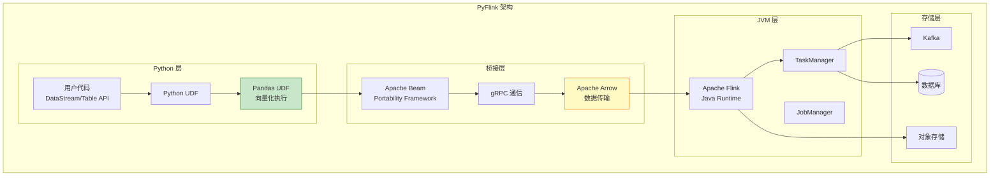
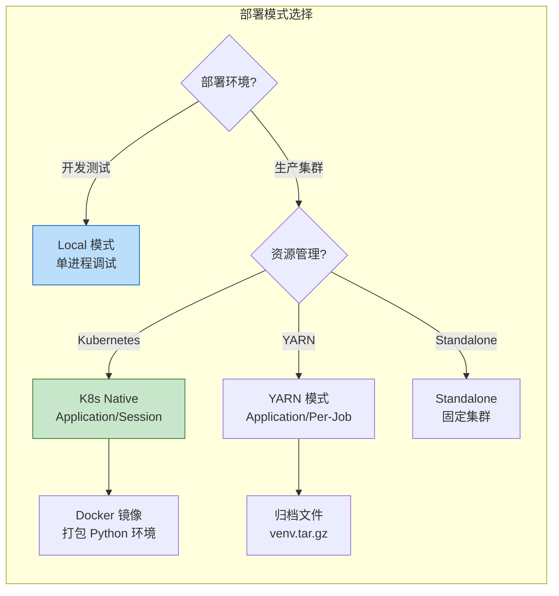

# PyFlink 深度完整指南

> **所属阶段**: Flink/09-language-foundations | **前置依赖**: [02-python-api.md](./02-python-api.md), [Flink/03-sql-table-api/flink-table-sql-complete-guide.md](../03-sql-table-api/flink-table-sql-complete-guide.md) | **形式化等级**: L2-L3 | **版本**: Flink 1.18+ / 2.0+ / Python 3.9+

---

## 目录

- [PyFlink 深度完整指南](#pyflink-深度完整指南)
  - [目录](#目录)
  - [1. 环境配置](#1-环境配置)
    - [Def-F-09-22: PyFlink 环境配置](#def-f-09-22-pyflink-环境配置)
    - [1.1 Python 版本要求](#11-python-版本要求)
    - [1.2 PyFlink 安装](#12-pyflink-安装)
    - [1.3 虚拟环境配置](#13-虚拟环境配置)
    - [1.4 IDE 配置](#14-ide-配置)
  - [2. Table API 基础](#2-table-api-基础)
    - [Def-F-09-23: Table API 执行模型](#def-f-09-23-table-api-执行模型)
    - [2.1 Environment 创建](#21-environment-创建)
    - [2.2 Source/Sink 定义](#22-sourcesink-定义)
    - [2.3 基本查询操作](#23-基本查询操作)
    - [2.4 DataStream 集成](#24-datastream-集成)
  - [3. UDF 开发](#3-udf-开发)
    - [Def-F-09-24: PyFlink UDF 分类](#def-f-09-24-pyflink-udf-分类)
    - [3.1 标量函数 (ScalarFunction)](#31-标量函数-scalarfunction)
    - [3.2 表函数 (TableFunction)](#32-表函数-tablefunction)
    - [3.3 聚合函数 (AggregateFunction)](#33-聚合函数-aggregatefunction)
    - [3.4 表值聚合函数](#34-表值聚合函数)
  - [4. 与 Pandas 集成](#4-与-pandas-集成)
    - [Def-F-09-25: PyFlink-Pandas 集成模型](#def-f-09-25-pyflink-pandas-集成模型)
    - [4.1 to\_pandas / from\_pandas](#41-to_pandas--from_pandas)
    - [4.2 Pandas UDF](#42-pandas-udf)
    - [4.3 向量化执行](#43-向量化执行)
  - [5. 机器学习](#5-机器学习)
    - [Def-F-09-26: PyFlink ML 集成架构](#def-f-09-26-pyflink-ml-集成架构)
    - [5.1 与 scikit-learn 集成](#51-与-scikit-learn-集成)
    - [5.2 在线学习](#52-在线学习)
    - [5.3 模型预测](#53-模型预测)
  - [6. 部署模式](#6-部署模式)
    - [Def-F-09-27: PyFlink 部署拓扑](#def-f-09-27-pyflink-部署拓扑)
    - [6.1 Local 模式](#61-local-模式)
    - [6.2 集群模式](#62-集群模式)
    - [6.3 Kubernetes 部署](#63-kubernetes-部署)
  - [7. 性能优化](#7-性能优化)
    - [Def-F-09-28: PyFlink 性能优化策略](#def-f-09-28-pyflink-性能优化策略)
    - [7.1 向量化执行](#71-向量化执行)
    - [7.2 Cython 加速](#72-cython-加速)
    - [7.3 内存管理](#73-内存管理)
  - [8. 常见问题](#8-常见问题)
    - [8.1 Python 依赖冲突](#81-python-依赖冲突)
    - [8.2 性能调试](#82-性能调试)
    - [8.3 版本兼容性](#83-版本兼容性)
  - [9. 示例项目](#9-示例项目)
    - [9.1 实时 ETL](#91-实时-etl)
    - [9.2 实时推荐](#92-实时推荐)
    - [9.3 异常检测](#93-异常检测)
  - [7. 可视化](#7-可视化)
    - [PyFlink 架构与数据流](#pyflink-架构与数据流)
    - [部署模式对比](#部署模式对比)
  - [8. 引用参考](#8-引用参考)

---

## 1. 环境配置

### Def-F-09-22: PyFlink 环境配置

**形式化定义**

PyFlink 环境配置定义为五元组 $\mathcal{E}_{py} = (P_{ver}, F_{ver}, V_{env}, I_{ide}, D_{dep})$：

- $P_{ver}$: Python 版本约束
- $F_{ver}$: Flink/PyFlink 版本
- $V_{env}$: 虚拟环境配置
- $I_{ide}$: IDE 与调试配置
- $D_{dep}$: 依赖管理系统

### 1.1 Python 版本要求

**支持的 Python 版本矩阵**

| Flink 版本 | Python 版本 | JDK 版本 | 状态 |
|-----------|------------|---------|------|
| 1.18.x | 3.8 - 3.11 | 11+ | ✅ Active |
| 1.19.x | 3.9 - 3.11 | 11+ | ✅ Active |
| 2.0.x | 3.9 - 3.12 | 17+ | 🆕 Recommended |
| 2.1.x | 3.9 - 3.12 | 17+ | 🆕 Latest |

**版本检查命令**

```bash
# 检查 Python 版本
python --version  # 要求 3.9+

# 检查 Java 版本 (PyFlink 依赖 Java 运行时)
java -version     # 要求 11+ for Flink 1.x, 17+ for Flink 2.x

# 检查系统架构 (影响某些依赖的安装)
python -c "import platform; print(platform.machine())"
```

### 1.2 PyFlink 安装

**标准安装方式**

```bash
# 基础安装 (包含 Table API 和 DataStream API)
pip install apache-flink

# 指定版本安装
pip install apache-flink==1.20.0

# 安装 SQL Kafka 连接器支持
pip install apache-flink-libraries

# 完整安装 (包含所有可选依赖)
pip install apache-flink[all]
```

**依赖验证**

```python
# 验证安装
def verify_pyflink_installation():
    """验证 PyFlink 安装完整性"""
    import pyflink
    from pyflink.version import __version__

    print(f"PyFlink 版本: {__version__}")

    # 检查核心模块
    try:
        from pyflink.table import EnvironmentSettings, TableEnvironment
        print("✓ Table API 可用")
    except ImportError as e:
        print(f"✗ Table API 不可用: {e}")

    try:
        from pyflink.datastream import StreamExecutionEnvironment
        print("✓ DataStream API 可用")
    except ImportError as e:
        print(f"✗ DataStream API 不可用: {e}")

    # 检查 Java 桥接
    try:
        from pyflink.java_gateway import get_gateway
        gateway = get_gateway()
        print(f"✓ Java Gateway 连接正常")
    except Exception as e:
        print(f"✗ Java Gateway 连接失败: {e}")

# 执行验证
verify_pyflink_installation()
```

### 1.3 虚拟环境配置

**venv 配置 (推荐)**

```bash
# 创建虚拟环境
python -m venv pyflink-env

# 激活虚拟环境
# Linux/macOS
source pyflink-env/bin/activate
# Windows
pyflink-env\Scripts\activate

# 升级基础工具
pip install --upgrade pip setuptools wheel

# 安装 PyFlink
pip install apache-flink==1.20.0
```

**Conda 配置 (数据科学习惯)**

```bash
# 创建 Conda 环境
conda create -n pyflink python=3.11
conda activate pyflink

# 安装 PyFlink (从 conda-forge)
conda install -c conda-forge pyflink

# 或混合使用 pip
pip install apache-flink
```

**Poetry 配置 (现代 Python 项目)**

```toml
# pyproject.toml
[tool.poetry]
name = "pyflink-project"
version = "0.1.0"
description = "PyFlink Streaming Application"

[tool.poetry.dependencies]
python = "^3.11"
apache-flink = "^1.20.0"
pandas = "^2.0.0"
numpy = "^1.24.0"

[tool.poetry.group.dev.dependencies]
pytest = "^7.0"
black = "^23.0"
mypy = "^1.0"

[build-system]
requires = ["poetry-core"]
build-backend = "poetry.core.masonry.api"
```

**Jupyter Notebook 环境**

```bash
# 安装 Jupyter 支持
pip install jupyter ipykernel

# 注册 PyFlink 内核
python -m ipykernel install --user --name pyflink --display-name "PyFlink"

# 启动 Jupyter
jupyter notebook
```

### 1.4 IDE 配置

**VS Code 配置**

```json
// .vscode/settings.json
{
    "python.defaultInterpreterPath": "${workspaceFolder}/pyflink-env/bin/python",
    "python.analysis.extraPaths": ["${workspaceFolder}/src"],
    "python.linting.enabled": true,
    "python.linting.mypyEnabled": true,
    "python.formatting.provider": "black",
    "java.home": "/usr/lib/jvm/java-17-openjdk",
    "terminal.integrated.env.linux": {
        "PYFLINK_PYTHON": "${workspaceFolder}/pyflink-env/bin/python"
    }
}
```

```json
// .vscode/launch.json
{
    "version": "0.2.0",
    "configurations": [
        {
            "name": "PyFlink: Debug Current File",
            "type": "python",
            "request": "launch",
            "program": "${file}",
            "console": "integratedTerminal",
            "env": {
                "PYFLINK_PYTHON": "${workspaceFolder}/pyflink-env/bin/python",
                "FLINK_HOME": "${workspaceFolder}/flink-1.20.0"
            }
        }
    ]
}
```

**PyCharm 配置**

1. **项目解释器**: Settings → Project → Python Interpreter → 选择虚拟环境
2. **环境变量**: Run → Edit Configurations → Environment variables:
   - `PYFLINK_PYTHON=/path/to/venv/bin/python`
   - `FLINK_HOME=/path/to/flink`
3. **远程调试**: 配置远程 Python 解释器 (用于集群调试)

---

## 2. Table API 基础

### Def-F-09-23: Table API 执行模型

**形式化定义**

Table API 执行模型定义为 $\mathcal{T} = (E_{tbl}, S_{catalog}, O_{plan}, R_{exec})$：

- $E_{tbl}$: TableEnvironment 执行上下文
- $S_{catalog}$: Catalog 元数据存储
- $O_{plan}$: 优化器生成的物理执行计划
- $R_{exec}$: 运行时执行引擎

### 2.1 Environment 创建

**本地执行环境**

```python
from pyflink.table import EnvironmentSettings, TableEnvironment

# 流处理模式 (推荐)
def create_streaming_environment():
    """创建流处理 Table Environment"""
    settings = EnvironmentSettings.new_instance() \
        .in_streaming_mode() \
        .build()

    t_env = TableEnvironment.create(settings)

    # 配置并行度
    t_env.get_config().set("parallelism.default", "4")

    # 配置检查点
    t_env.get_config().set("execution.checkpointing.interval", "10s")

    return t_env

# 批处理模式
def create_batch_environment():
    """创建批处理 Table Environment"""
    settings = EnvironmentSettings.new_instance() \
        .in_batch_mode() \
        .build()

    return TableEnvironment.create(settings)

# 使用 (Blink Planner 为默认)
t_env = create_streaming_environment()
```

**高级配置选项**

```python
from pyflink.table import EnvironmentSettings, TableEnvironment

def create_custom_environment():
    """创建自定义配置的 Table Environment"""
    settings = EnvironmentSettings.new_instance() \
        .in_streaming_mode() \
        .with_configuration({
            # 并行度配置
            "parallelism.default": "4",

            # 时间语义
            "table.local-time-zone": "Asia/Shanghai",

            # 状态后端
            "state.backend": "rocksdb",
            "state.backend.incremental": "true",

            # 检查点配置
            "execution.checkpointing.interval": "10s",
            "execution.checkpointing.timeout": "5min",
            "execution.checkpointing.max-concurrent-checkpoints": "1",

            # 重启策略
            "restart-strategy": "fixed-delay",
            "restart-strategy.fixed-delay.attempts": "3",
            "restart-strategy.fixed-delay.delay": "10s",

            # 网络缓冲区
            "taskmanager.memory.network.fraction": "0.15",
            "taskmanager.memory.network.max": "256mb",

            # Python UDF 配置
            "python.fn-execution.bundle.size": "1000",
            "python.fn-execution.bundle.time": "1000",
            "python.fn-execution.memory.managed": "true",
        }) \
        .build()

    return TableEnvironment.create(settings)
```

### 2.2 Source/Sink 定义

**DataGen Source (测试用)**

```python
from pyflink.table import DataTypes
from pyflink.table.expressions import lit, rand

def create_datagen_source(t_env):
    """创建数据生成源表 (用于测试)"""
    t_env.execute_sql("""
        CREATE TABLE datagen_source (
            id INT,
            name STRING,
            age INT,
            score DOUBLE,
            event_time TIMESTAMP_LTZ(3),
            WATERMARK FOR event_time AS event_time - INTERVAL '5' SECOND
        ) WITH (
            'connector' = 'datagen',
            'rows-per-second' = '100',
            'fields.id.kind' = 'sequence',
            'fields.id.start' = '1',
            'fields.id.end' = '1000000',
            'fields.name.length' = '10',
            'fields.age.min' = '18',
            'fields.age.max' = '60',
            'fields.score.min' = '0.0',
            'fields.score.max' = '100.0'
        )
    """)
    return t_env.from_path("datagen_source")
```

**Kafka Source/Sink**

```python
def create_kafka_source(t_env, topic: str, group_id: str):
    """创建 Kafka 源表"""
    ddl = f"""
        CREATE TABLE kafka_source (
            user_id STRING,
            event_type STRING,
            event_data STRING,
            event_time TIMESTAMP_LTZ(3),
            WATERMARK FOR event_time AS event_time - INTERVAL '5' SECOND
        ) WITH (
            'connector' = 'kafka',
            'topic' = '{topic}',
            'properties.bootstrap.servers' = 'localhost:9092',
            'properties.group.id' = '{group_id}',
            'scan.startup.mode' = 'latest-offset',
            'format' = 'json',
            'json.fail-on-missing-field' = 'false',
            'json.ignore-parse-errors' = 'true'
        )
    """
    t_env.execute_sql(ddl)
    return t_env.from_path("kafka_source")

def create_kafka_sink(t_env, topic: str):
    """创建 Kafka 目标表"""
    ddl = f"""
        CREATE TABLE kafka_sink (
            user_id STRING,
            event_type STRING,
            processed_data STRING,
            window_start TIMESTAMP_LTZ(3),
            window_end TIMESTAMP_LTZ(3)
        ) WITH (
            'connector' = 'kafka',
            'topic' = '{topic}',
            'properties.bootstrap.servers' = 'localhost:9092',
            'format' = 'json',
            'sink.delivery-guarantee' = 'at-least-once'
        )
    """
    t_env.execute_sql(ddl)
```

**JDBC Source/Sink (PostgreSQL)**

```python
def create_jdbc_source(t_env, table_name: str):
    """创建 JDBC 源表"""
    ddl = f"""
        CREATE TABLE jdbc_source (
            id INT,
            name STRING,
            created_at TIMESTAMP(3)
        ) WITH (
            'connector' = 'jdbc',
            'url' = 'jdbc:postgresql://localhost:5432/mydb',
            'table-name' = '{table_name}',
            'username' = 'postgres',
            'password' = 'password',
            'driver' = 'org.postgresql.Driver'
        )
    """
    t_env.execute_sql(ddl)
    return t_env.from_path("jdbc_source")

def create_jdbc_sink(t_env, table_name: str):
    """创建 JDBC 目标表"""
    ddl = f"""
        CREATE TABLE jdbc_sink (
            user_id STRING,
            total_amount DECIMAL(10, 2),
            update_time TIMESTAMP(3),
            PRIMARY KEY (user_id) NOT ENFORCED
        ) WITH (
            'connector' = 'jdbc',
            'url' = 'jdbc:postgresql://localhost:5432/mydb',
            'table-name' = '{table_name}',
            'username' = 'postgres',
            'password' = 'password',
            'driver' = 'org.postgresql.Driver'
        )
    """
    t_env.execute_sql(ddl)
```

**FileSystem (Parquet/ORC) Sink**

```python
def create_filesystem_sink(t_env, path: str):
    """创建文件系统目标表 (Parquet 格式)"""
    ddl = f"""
        CREATE TABLE filesystem_sink (
            user_id STRING,
            event_count BIGINT,
            total_value DECIMAL(10, 2),
            dt STRING,
            hr STRING
        ) PARTITIONED BY (dt, hr) WITH (
            'connector' = 'filesystem',
            'path' = '{path}',
            'format' = 'parquet',
            'sink.rolling-policy.rollover-interval' = '10 min',
            'sink.rolling-policy.check-interval' = '1 min',
            'sink.partition-commit.trigger' = 'process-time',
            'sink.partition-commit.delay' = '1 min',
            'sink.partition-commit.policy.kind' = 'success-file'
        )
    """
    t_env.execute_sql(ddl)
```

### 2.3 基本查询操作

**SELECT 与过滤**

```python
from pyflink.table.expressions import col, lit

def basic_queries(t_env):
    """基础查询操作示例"""
    # 假设已有 source 表
    source = t_env.from_path("kafka_source")

    # 1. 简单选择
    result1 = source.select(col("user_id"), col("event_type"), col("event_time"))

    # 2. 条件过滤
    result2 = source.filter(col("event_type") == "purchase") \
                    .select(col("user_id"), col("event_data"))

    # 3. 多条件过滤
    result3 = source.filter(
        (col("event_type").is_in("purchase", "refund")) &
        (col("event_time") > lit("2024-01-01").to_date)
    )

    # 4. 列重命名与计算
    result4 = source.select(
        col("user_id").alias("uid"),
        (col("event_data").json_value("$.amount", DataTypes.DOUBLE())).alias("amount"),
        col("event_time")
    )

    return result1, result2, result3, result4
```

**聚合操作**

```python
from pyflink.table.expressions import col, lit, count, sum, avg, max, min
from pyflink.table.window import Tumble

def aggregation_queries(t_env):
    """聚合查询操作"""
    source = t_env.from_path("kafka_source")

    # 1. 简单分组聚合
    agg1 = source.group_by(col("event_type")) \
                 .select(
                     col("event_type"),
                     count.col("*").alias("event_count")
                 )

    # 2. 多度量聚合
    agg2 = source.group_by(col("user_id")) \
                 .select(
                     col("user_id"),
                     count.col("*").alias("total_events"),
                     sum.col("amount").alias("total_amount"),
                     avg.col("amount").alias("avg_amount"),
                     max.col("event_time").alias("last_event_time")
                 )

    # 3. 窗口聚合 (滚动窗口)
    agg3 = source.window(Tumble.over(lit(5).minutes).on(col("event_time")).alias("w")) \
                 .group_by(col("w"), col("event_type")) \
                 .select(
                     col("event_type"),
                     col("w").start.alias("window_start"),
                     col("w").end.alias("window_end"),
                     count.col("*").alias("event_count")
                 )

    # 4. 多维聚合 (GROUPING SETS)
    agg4_sql = t_env.execute_sql("""
        SELECT
            event_type,
            user_id,
            COUNT(*) as cnt
        FROM kafka_source
        GROUP BY GROUPING SETS (
            (event_type),
            (user_id),
            (event_type, user_id),
            ()
        )
    """)

    return agg1, agg2, agg3
```

**窗口操作完整示例**

```python
from pyflink.table.window import Tumble, Slide, Session, Over

def window_operations(t_env):
    """窗口操作完整示例"""
    source = t_env.from_path("kafka_source")

    # 1. 滚动窗口 (Tumbling Window)
    tumble_result = source \
        .window(Tumble.over(lit(10).minutes).on(col("event_time")).alias("w")) \
        .group_by(col("w"), col("user_id")) \
        .select(
            col("user_id"),
            col("w").start.alias("window_start"),
            col("w").end.alias("window_end"),
            count.col("*").alias("event_count"),
            sum.col("amount").alias("total_amount")
        )

    # 2. 滑动窗口 (Sliding Window)
    slide_result = source \
        .window(Slide.over(lit(10).minutes).every(lit(2).minutes).on(col("event_time")).alias("w")) \
        .group_by(col("w"), col("user_id")) \
        .select(
            col("user_id"),
            col("w").start.alias("window_start"),
            count.col("*").alias("event_count")
        )

    # 3. 会话窗口 (Session Window)
    session_result = source \
        .window(Session.with_gap(lit(5).minutes).on(col("event_time")).alias("w")) \
        .group_by(col("w"), col("user_id")) \
        .select(
            col("user_id"),
            col("w").start.alias("session_start"),
            col("w").end.alias("session_end"),
            col("w").rowtime.alias("session_time"),
            count.col("*").alias("event_count")
        )

    # 4. OVER 窗口 (分析函数)
    over_result = source \
        .window(Over.partition_by(col("user_id"))
                     .order_by(col("event_time"))
                     .preceding(lit(2).rows)
                     .following(lit(0).rows)
                     .alias("w")) \
        .select(
            col("user_id"),
            col("event_time"),
            col("amount"),
            col("amount").sum.over(col("w")).alias("running_sum"),
            col("amount").avg.over(col("w")).alias("moving_avg")
        )

    return tumble_result, slide_result, session_result, over_result
```

**Join 操作**

```python
def join_operations(t_env):
    """Join 操作示例"""
    orders = t_env.from_path("orders")
    customers = t_env.from_path("customers")
    products = t_env.from_path("products")

    # 1. 内连接
    inner_join = orders \
        .join(customers, col("orders.customer_id") == col("customers.id")) \
        .select(
            col("orders.order_id"),
            col("customers.name").alias("customer_name"),
            col("orders.total_amount")
        )

    # 2. 左外连接
    left_join = orders \
        .left_outer_join(customers, col("orders.customer_id") == col("customers.id")) \
        .select(col("orders.*"), col("customers.name"))

    # 3. 间隔 Join (Interval Join) - 流处理特有
    interval_join = t_env.execute_sql("""
        SELECT
            o.order_id,
            o.order_time,
            s.shipment_id,
            s.shipment_time
        FROM orders o
        JOIN shipments s ON o.order_id = s.order_id
        AND o.order_time BETWEEN s.shipment_time - INTERVAL '1' HOUR
                             AND s.shipment_time + INTERVAL '1' HOUR
    """)

    # 4. 时态 Join (Temporal Join) - 维度表关联
    temporal_join = t_env.execute_sql("""
        SELECT
            o.order_id,
            o.currency,
            r.rate,
            o.amount * r.rate as amount_usd
        FROM orders o
        LEFT JOIN currency_rates FOR SYSTEM_TIME AS OF o.order_time r
        ON o.currency = r.currency
    """)

    return inner_join, left_join
```

### 2.4 DataStream 集成

**Table 转 DataStream**

```python
from pyflink.datastream import StreamExecutionEnvironment
from pyflink.table import StreamTableEnvironment

def table_to_datastream():
    """Table API 与 DataStream API 互操作"""
    # 创建环境
    env = StreamExecutionEnvironment.get_execution_environment()
    t_env = StreamTableEnvironment.create(env)

    # 创建表
    t_env.execute_sql("""
        CREATE TABLE sensor_data (
            sensor_id STRING,
            temperature DOUBLE,
            event_time TIMESTAMP_LTZ(3),
            WATERMARK FOR event_time AS event_time - INTERVAL '5' SECOND
        ) WITH (
            'connector' = 'kafka',
            'topic' = 'sensor-topic',
            'properties.bootstrap.servers' = 'localhost:9092',
            'format' = 'json'
        )
    """)

    # Table 转 DataStream
    table = t_env.from_path("sensor_data")

    # 转换为 RetractStream (带增删标记)
    ds_retract = t_env.to_retract_stream(table, Types.ROW([
        Types.STRING(),
        Types.DOUBLE(),
        Types.SQL_TIMESTAMP()
    ]))

    # 转换为 AppendStream (仅追加)
    ds_append = t_env.to_append_stream(table, Types.ROW([
        Types.STRING(),
        Types.DOUBLE(),
        Types.SQL_TIMESTAMP()
    ]))

    # 在 DataStream 上处理
    def process_sensor(value):
        sensor_id, temp, timestamp = value
        if temp > 80:
            return (sensor_id, temp, "HIGH", timestamp)
        elif temp < 10:
            return (sensor_id, temp, "LOW", timestamp)
        return (sensor_id, temp, "NORMAL", timestamp)

    processed_ds = ds_append.map(process_sensor)

    # DataStream 转回 Table
    result_table = t_env.from_data_stream(
        processed_ds,
        col("sensor_id"),
        col("temperature"),
        col("alert_level"),
        col("event_time")
    )

    return result_table
```

**DataStream 转 Table**

```python
from pyflink.datastream import StreamExecutionEnvironment
from pyflink.table import StreamTableEnvironment, DataTypes
from pyflink.common.typeinfo import Types

def datastream_to_table():
    """DataStream 转 Table 完整示例"""
    env = StreamExecutionEnvironment.get_execution_environment()
    t_env = StreamTableEnvironment.create(env)

    # 从 DataStream 源创建
    ds = env.from_collection([
        ("sensor_1", 25.5, 1704067200000),
        ("sensor_2", 85.2, 1704067260000),
        ("sensor_3", 15.3, 1704067320000),
    ], type_info=Types.TUPLE([
        Types.STRING(),
        Types.DOUBLE(),
        Types.LONG()
    ]))

    # 方式1: 自动推断 schema
    table1 = t_env.from_data_stream(ds)

    # 方式2: 指定列名和类型
    from pyflink.table.expressions import col
    table2 = t_env.from_data_stream(
        ds,
        col("sensor_id"),
        col("temperature"),
        col("timestamp").cast(DataTypes.TIMESTAMP_LTZ(3))
    )

    # 方式3: 使用 Row 类型和自定义字段
    from pyflink.common import Row

    ds_rows = ds.map(lambda x: Row(sensor_id=x[0], temp=x[1], ts=x[2]))

    table3 = t_env.from_data_stream(
        ds_rows,
        DataTypes.ROW([
            DataTypes.FIELD("device_id", DataTypes.STRING()),
            DataTypes.FIELD("value", DataTypes.DOUBLE()),
            DataTypes.FIELD("event_time", DataTypes.TIMESTAMP_LTZ(3))
        ])
    )

    # 注册为临时视图
    t_env.create_temporary_view("sensor_view", table3)

    # 使用 SQL 查询
    result = t_env.execute_sql("""
        SELECT
            device_id,
            AVG(value) as avg_temp,
            COUNT(*) as reading_count
        FROM sensor_view
        GROUP BY device_id
    """)

    return result
```

---

## 3. UDF 开发

### Def-F-09-24: PyFlink UDF 分类

**形式化定义**

PyFlink UDF 按输入输出形式分类为 $\mathcal{U}_{py} = \{U_{scalar}, U_{table}, U_{agg}, U_{table\_agg}\}$：

- $U_{scalar}$: 标量函数 (1:1 映射)
- $U_{table}$: 表函数 (1:N 映射)
- $U_{agg}$: 聚合函数 (N:1 映射)
- $U_{table\_agg}$: 表值聚合函数 (N:M 映射)

### 3.1 标量函数 (ScalarFunction)

**基础标量函数**

```python
from pyflink.table import ScalarFunction, DataTypes
from pyflink.table.udf import udf

class ParseJsonFunction(ScalarFunction):
    """解析 JSON 字段的标量函数"""

    def eval(self, json_str: str, field: str) -> str:
        """从 JSON 字符串中提取指定字段"""
        import json
        try:
            data = json.loads(json_str)
            return str(data.get(field, ""))
        except (json.JSONDecodeError, TypeError):
            return None

# 注册函数
parse_json = udf(
    ParseJsonFunction(),
    result_type=DataTypes.STRING()
)

# 使用装饰器方式
@udf(result_type=DataTypes.DOUBLE())
def calculate_discount(price: float, discount_rate: float) -> float:
    """计算折扣后价格"""
    if price is None or discount_rate is None:
        return None
    return price * (1 - discount_rate)

# 在 SQL 中使用
def use_scalar_functions(t_env):
    """使用标量函数"""
    t_env.create_temporary_function("parse_json", parse_json)
    t_env.create_temporary_function("calc_discount", calculate_discount)

    result = t_env.execute_sql("""
        SELECT
            user_id,
            parse_json(metadata, 'category') as category,
            calc_discount(price, 0.15) as discounted_price
        FROM orders
    """)
    return result
```

**带状态的标量函数**

```python
from pyflink.table import ScalarFunction
from pyflink.table.udf import udf

class RateLimiterFunction(ScalarFunction):
    """带状态的速率限制函数"""

    def __init__(self, max_requests: int = 100):
        self.max_requests = max_requests
        # 注意：实际状态管理需要使用 State API
        self.request_count = {}

    def eval(self, user_id: str) -> bool:
        """检查用户是否超过速率限制"""
        import time
        current_minute = int(time.time()) // 60
        key = f"{user_id}:{current_minute}"

        count = self.request_count.get(key, 0)
        if count >= self.max_requests:
            return False

        self.request_count[key] = count + 1
        return True

# 注册带参数的函数
rate_limiter = udf(
    RateLimiterFunction(max_requests=1000),
    result_type=DataTypes.BOOLEAN()
)
```

**向量化标量函数 (Pandas UDF)**

```python
import pandas as pd
from pyflink.table.udf import udf
from pyflink.table import DataTypes

@udf(result_type=DataTypes.DOUBLE(), udf_type="pandas")
def batch_normalize(values: pd.Series) -> pd.Series:
    """批量归一化 (向量化执行)"""
    min_val = values.min()
    max_val = values.max()
    if max_val == min_val:
        return pd.Series([0.0] * len(values))
    return (values - min_val) / (max_val - min_val)

@udf(result_type=DataTypes.STRING(), udf_type="pandas")
def batch_categorize(scores: pd.Series) -> pd.Series:
    """批量分类"""
    def categorize(score):
        if score >= 90:
            return "A"
        elif score >= 80:
            return "B"
        elif score >= 70:
            return "C"
        elif score >= 60:
            return "D"
        return "F"

    return scores.apply(categorize)
```

### 3.2 表函数 (TableFunction)

**基础表函数**

```python
from pyflink.table import TableFunction, DataTypes
from pyflink.table.udf import udtf
from pyflink.table.types import Row

class SplitFunction(TableFunction):
    """字符串分割表函数"""

    def eval(self, text: str, delimiter: str = ","):
        """分割字符串，每行返回一个结果"""
        if text is None:
            return
        for word in text.split(delimiter):
            yield Row(word.strip(), len(word.strip()))

# 注册表函数
split_words = udtf(
    SplitFunction(),
    result_types=[DataTypes.STRING(), DataTypes.INT()]
)

# 装饰器方式
@udtf(result_types=[DataTypes.STRING(), DataTypes.STRING()])
def parse_key_value_pairs(properties: str):
    """解析 key=value 格式字符串"""
    if not properties:
        return
    for pair in properties.split(";"):
        if "=" in pair:
            key, value = pair.split("=", 1)
            yield key.strip(), value.strip()

# 使用表函数
def use_table_functions(t_env):
    """使用表函数"""
    t_env.create_temporary_function("split_words", split_words)
    t_env.create_temporary_function("parse_props", parse_key_value_pairs)

    # 使用 LATERAL TABLE
    result = t_env.execute_sql("""
        SELECT
            user_id,
            word,
            word_len
        FROM user_tags,
        LATERAL TABLE(split_words(tags, ',')) AS T(word, word_len)
        WHERE word_len > 3
    """)

    # 使用 CROSS JOIN
    result2 = t_env.execute_sql("""
        SELECT
            c.customer_id,
            p.key,
            p.value
        FROM customers c
        CROSS JOIN LATERAL TABLE(parse_props(c.properties)) AS p(key, value)
    """)

    return result
```

**展开嵌套数据**

```python
import json
from pyflink.table import TableFunction, DataTypes
from pyflink.table.udf import udtf
from pyflink.table.types import Row

class ExplodeJsonArrayFunction(TableFunction):
    """展开 JSON 数组"""

    def eval(self, json_array: str):
        """将 JSON 数组展开为多行"""
        try:
            items = json.loads(json_array)
            if isinstance(items, list):
                for idx, item in enumerate(items):
                    yield Row(idx, json.dumps(item) if isinstance(item, dict) else str(item))
        except json.JSONDecodeError:
            pass

class ExplodeNestedObjectFunction(TableFunction):
    """展开嵌套对象"""

    def eval(self, json_object: str, prefix: str = ""):
        """将嵌套 JSON 对象扁平化为键值对"""
        def flatten(obj, parent_key=""):
            items = []
            if isinstance(obj, dict):
                for k, v in obj.items():
                    new_key = f"{parent_key}.{k}" if parent_key else k
                    if isinstance(v, dict):
                        items.extend(flatten(v, new_key))
                    elif isinstance(v, list):
                        for i, item in enumerate(v):
                            items.extend(flatten(item, f"{new_key}[{i}]"))
                    else:
                        items.append((new_key, str(v)))
            return items

        try:
            data = json.loads(json_object)
            for key, value in flatten(data, prefix):
                yield Row(key, value)
        except json.JSONDecodeError:
            pass

explode_array = udtf(
    ExplodeJsonArrayFunction(),
    result_types=[DataTypes.INT(), DataTypes.STRING()]
)

flatten_json = udtf(
    ExplodeNestedObjectFunction(),
    result_types=[DataTypes.STRING(), DataTypes.STRING()]
)
```

### 3.3 聚合函数 (AggregateFunction)

**基础聚合函数**

```python
from pyflink.table import AggregateFunction, DataTypes, Accumulator
from pyflink.table.udf import udaf

class WeightedAverageFunction(AggregateFunction):
    """加权平均值聚合函数"""

    def create_accumulator(self):
        """创建累加器 (sum, count)"""
        return [0.0, 0]  # [weighted_sum, total_weight]

    def accumulate(self, accumulator, value, weight):
        """累积值"""
        if value is not None and weight is not None:
            accumulator[0] += value * weight
            accumulator[1] += weight

    def retract(self, accumulator, value, weight):
        """撤销值 (用于流处理中的回撤)"""
        if value is not None and weight is not None:
            accumulator[0] -= value * weight
            accumulator[1] -= weight

    def merge(self, accumulator, accumulators):
        """合并多个累加器"""
        for acc in accumulators:
            accumulator[0] += acc[0]
            accumulator[1] += acc[1]

    def get_value(self, accumulator):
        """获取最终结果"""
        if accumulator[1] == 0:
            return None
        return accumulator[0] / accumulator[1]

# 注册聚合函数
weighted_avg = udaf(
    WeightedAverageFunction(),
    result_type=DataTypes.DOUBLE(),
    accumulator_type=DataTypes.ARRAY(DataTypes.DOUBLE())
)

# 使用聚合函数
def use_aggregate_functions(t_env):
    """使用聚合函数"""
    t_env.create_temporary_function("weighted_avg", weighted_avg)

    result = t_env.execute_sql("""
        SELECT
            category,
            weighted_avg(price, quantity) as weighted_avg_price,
            AVG(price) as simple_avg_price
        FROM orders
        GROUP BY category
    """)
    return result
```

**复杂聚合：百分位数**

```python
from pyflink.table import AggregateFunction, DataTypes
from pyflink.table.udf import udaf

class PercentileFunction(AggregateFunction):
    """计算百分位数 (使用 T-Digest 近似算法)"""

    def __init__(self, percentile: float = 0.5):
        if not 0 <= percentile <= 1:
            raise ValueError("Percentile must be between 0 and 1")
        self.percentile = percentile

    def create_accumulator(self):
        """创建累加器：存储所有值用于精确计算"""
        return []

    def accumulate(self, accumulator, value):
        if value is not None:
            accumulator.append(value)

    def retract(self, accumulator, value):
        if value is not None and value in accumulator:
            accumulator.remove(value)

    def merge(self, accumulator, accumulators):
        for acc in accumulators:
            accumulator.extend(acc)

    def get_value(self, accumulator):
        if not accumulator:
            return None
        sorted_values = sorted(accumulator)
        idx = int(len(sorted_values) * self.percentile)
        return sorted_values[min(idx, len(sorted_values) - 1)]

# 创建不同百分位数的函数
median = udaf(
    PercentileFunction(0.5),
    result_type=DataTypes.DOUBLE(),
    accumulator_type=DataTypes.ARRAY(DataTypes.DOUBLE())
)

p95 = udaf(
    PercentileFunction(0.95),
    result_type=DataTypes.DOUBLE(),
    accumulator_type=DataTypes.ARRAY(DataTypes.DOUBLE())
)
```

**向量化聚合函数**

```python
import pandas as pd
from pyflink.table.udf import udaf
from pyflink.table import DataTypes

@udaf(result_type=DataTypes.DOUBLE(), func_type="pandas")
def pandas_stddev(values: pd.Series) -> float:
    """使用 Pandas 计算标准差 (向量化)"""
    return values.std()

@udaf(result_type=DataTypes.MAP(DataTypes.STRING(), DataTypes.DOUBLE()), func_type="pandas")
def pandas_describe(values: pd.Series) -> dict:
    """生成描述性统计"""
    stats = values.describe()
    return {
        "count": float(stats["count"]),
        "mean": float(stats["mean"]),
        "std": float(stats["std"]),
        "min": float(stats["min"]),
        "25%": float(stats["25%"]),
        "50%": float(stats["50%"]),
        "75%": float(stats["75%"]),
        "max": float(stats["max"])
    }
```

### 3.4 表值聚合函数

```python
from pyflink.table import TableAggregateFunction, DataTypes
from pyflink.table.udf import udtaf
from pyflink.table.types import Row

class TopNFunction(TableAggregateFunction):
    """计算 Top N 值的表值聚合函数"""

    def __init__(self, n: int = 3):
        self.n = n

    def create_accumulator(self):
        return []  # 存储 (value, other_data) 元组列表

    def accumulate(self, accumulator, value, *other_fields):
        if value is not None:
            accumulator.append((value, other_fields))

    def merge(self, accumulator, accumulators):
        for acc in accumulators:
            accumulator.extend(acc)

    def emit_value(self, accumulator):
        """输出 Top N 结果"""
        # 按值排序，取 Top N
        sorted_items = sorted(accumulator, key=lambda x: x[0], reverse=True)[:self.n]

        for rank, (value, others) in enumerate(sorted_items, 1):
            yield Row(rank, value, *others)

# 注册表值聚合函数
top3 = udtaf(
    TopNFunction(n=3),
    result_types=[DataTypes.INT(), DataTypes.DOUBLE(), DataTypes.STRING()]
)

# 使用表值聚合函数
def use_table_aggregate_functions(t_env):
    """使用表值聚合函数"""
    t_env.create_temporary_function("top3", top3)

    result = t_env.execute_sql("""
        SELECT
            category,
            rank,
            amount,
            order_id
        FROM orders
        GROUP BY category
        EMIT TABLE(top3(amount, order_id))
    """)
    return result
```

---

## 4. 与 Pandas 集成

### Def-F-09-25: PyFlink-Pandas 集成模型

**形式化定义**

PyFlink-Pandas 集成定义为转换函数对 $\mathcal{P}_{int} = (T_{to}, T_{from}, M_{udf})$：

- $T_{to}$: Flink Table → Pandas DataFrame
- $T_{from}$: Pandas DataFrame → Flink Table
- $M_{udf}$: Pandas UDF 执行模式

### 4.1 to_pandas / from_pandas

**Table 转 Pandas DataFrame**

```python
import pandas as pd

def table_to_pandas_examples(t_env):
    """Table 转换为 Pandas DataFrame"""
    # 创建示例表
    t_env.execute_sql("""
        CREATE TABLE sales (
            product_id STRING,
            quantity INT,
            price DECIMAL(10, 2),
            sale_date DATE
        ) WITH (
            'connector' = 'datagen',
            'rows-per-second' = '10'
        )
    """)

    table = t_env.from_path("sales")

    # 方式1: 直接转换 (适合小数据量)
    df = table.to_pandas()
    print(f"转换为 DataFrame，行数: {len(df)}")
    print(df.head())

    # 方式2: 先执行 SQL 再转换
    result_table = t_env.execute_sql("""
        SELECT
            product_id,
            SUM(quantity) as total_quantity,
            AVG(price) as avg_price
        FROM sales
        GROUP BY product_id
    """)

    df_aggregated = result_table.to_pandas()

    # 使用 Pandas 进行进一步分析
    df_aggregated["revenue_estimate"] = (
        df_aggregated["total_quantity"] * df_aggregated["avg_price"]
    )

    return df_aggregated
```

**Pandas DataFrame 转 Table**

```python
def pandas_to_table_examples(t_env):
    """Pandas DataFrame 转换为 Table"""
    # 创建 Pandas DataFrame
    df = pd.DataFrame({
        "user_id": ["u001", "u002", "u003", "u004"],
        "age": [25, 30, 35, 40],
        "city": ["Beijing", "Shanghai", "Guangzhou", "Shenzhen"],
        "score": [85.5, 92.0, 78.5, 88.0]
    })

    # 方式1: 直接从 DataFrame 创建 Table
    table1 = t_env.from_pandas(df)

    # 方式2: 指定列名和类型
    from pyflink.table import DataTypes

    table2 = t_env.from_pandas(
        df,
        schema=DataTypes.ROW([
            DataTypes.FIELD("user_id", DataTypes.STRING()),
            DataTypes.FIELD("age", DataTypes.INT()),
            DataTypes.FIELD("city", DataTypes.STRING()),
            DataTypes.FIELD("score", DataTypes.DOUBLE())
        ])
    )

    # 方式3: 使用现有 DataFrame 创建临时视图
    t_env.create_temporary_view("user_data", df)

    # 在 SQL 中使用
    result = t_env.execute_sql("""
        SELECT
            city,
            AVG(score) as avg_score,
            COUNT(*) as user_count
        FROM user_data
        GROUP BY city
    """)

    return result
```

**批量数据交换**

```python
def batch_data_exchange(t_env):
    """批量数据交换模式"""
    from pyflink.table import DataTypes

    # 从 Flink 读取批量数据到 Pandas
    def extract_batch(table, batch_size=10000):
        """分批次提取数据"""
        all_data = []
        # 使用 LIMIT 和 OFFSET 分页
        offset = 0
        while True:
            batch_table = t_env.execute_sql(f"""
                SELECT * FROM source_table
                LIMIT {batch_size} OFFSET {offset}
            """)
            batch_df = batch_table.to_pandas()

            if len(batch_df) == 0:
                break

            all_data.append(batch_df)
            offset += batch_size

            if len(batch_df) < batch_size:
                break

        return pd.concat(all_data, ignore_index=True) if all_data else pd.DataFrame()

    # 使用 Pandas 处理后写回 Flink
    def process_and_load(df: pd.DataFrame, target_table: str):
        """处理 Pandas DataFrame 并加载到 Flink"""
        # Pandas 处理
        df["processed"] = True
        df["processed_at"] = pd.Timestamp.now()

        # 转换回 Flink Table
        result_table = t_env.from_pandas(df)

        # 写入目标表
        result_table.execute_insert(target_table)

    return extract_batch, process_and_load
```

### 4.2 Pandas UDF

**标量 Pandas UDF**

```python
import pandas as pd
from pyflink.table.udf import udf
from pyflink.table import DataTypes

@udf(result_type=DataTypes.STRING(), udf_type="pandas")
def pandas_normalize_name(names: pd.Series) -> pd.Series:
    """批量标准化姓名 (向量化处理)"""
    return names.str.title().str.strip()

@udf(result_type=DataTypes.DOUBLE(), udf_type="pandas")
def pandas_calculate_bmi(weights: pd.Series, heights: pd.Series) -> pd.Series:
    """批量计算 BMI"""
    # heights 单位为 cm，转换为 m
    heights_m = heights / 100
    return weights / (heights_m ** 2)

@udf(result_type=DataTypes.STRING(), udf_type="pandas")
def pandas_categorize_risk(scores: pd.Series) -> pd.Series:
    """批量风险分类"""
    def get_risk_level(score):
        if score >= 80:
            return "HIGH"
        elif score >= 50:
            return "MEDIUM"
        return "LOW"

    return scores.apply(get_risk_level)

# 在 Flink SQL 中使用
def use_pandas_udfs(t_env):
    """使用 Pandas UDF"""
    t_env.create_temporary_function("normalize_name", pandas_normalize_name)
    t_env.create_temporary_function("calc_bmi", pandas_calculate_bmi)
    t_env.create_temporary_function("risk_level", pandas_categorize_risk)

    result = t_env.execute_sql("""
        SELECT
            normalize_name(full_name) as clean_name,
            calc_bmi(weight_kg, height_cm) as bmi,
            risk_level(credit_score) as risk_category
        FROM customer_profiles
    """)
    return result
```

**聚合 Pandas UDF**

```python
import pandas as pd
import numpy as np
from pyflink.table.udf import udaf
from pyflink.table import DataTypes

@udaf(result_type=DataTypes.DOUBLE(), func_type="pandas")
def pandas_median(values: pd.Series) -> float:
    """计算中位数 (向量化)"""
    return float(values.median())

@udaf(result_type=DataTypes.STRING(), func_type="pandas")
def pandas_mode_string(values: pd.Series) -> str:
    """计算众数 (字符串类型)"""
    mode_result = values.mode()
    return str(mode_result[0]) if len(mode_result) > 0 else None

@udaf(result_type=DataTypes.DOUBLE(), func_type="pandas")
def pandas_correlation(x: pd.Series, y: pd.Series) -> float:
    """计算相关系数"""
    return float(x.corr(y))
```

### 4.3 向量化执行

**向量化执行原理**

```python
"""
向量化执行 vs 逐行执行对比：

逐行执行 (常规 UDF):
  每行调用一次 Python 函数
  函数调用开销: O(n) * function_call_overhead

向量化执行 (Pandas UDF):
  一批次调用一次 Python 函数 (默认 batch size: 1000)
  函数调用开销: O(n/batch_size) * function_call_overhead
  NumPy/Pandas 内部使用 C 优化循环

性能提升: 通常 10x - 100x
"""

# 配置向量化执行参数
def configure_vectorized_execution(t_env):
    """配置向量化执行参数"""
    configuration = t_env.get_config()

    # Pandas UDF 批处理大小
    configuration.set("python.fn-execution.bundle.size", "1000")

    # 批处理超时 (毫秒)
    configuration.set("python.fn-execution.bundle.time", "1000")

    # 启用 Arrow 格式数据传输 (更高效)
    configuration.set("python.fn-execution.arrow.batch.size", "10000")

    # 内存配置
    configuration.set("python.fn-execution.memory.managed", "true")
    configuration.set("python.fn-execution.memory.managed.fraction", "0.3")

    return t_env
```

**Arrow 优化**

```python
from pyflink.table import DataTypes
from pyflink.table.udf import udf
import pyarrow as pa

# 使用 Arrow 类型的 UDF
@udf(result_type=DataTypes.ARRAY(DataTypes.DOUBLE()), udf_type="pandas")
def arrow_process_batch(data: pd.Series) -> pd.Series:
    """使用 Arrow 后端进行批量处理"""
    # PyArrow 加速数据处理
    arrow_array = pa.array(data)

    # 使用 Arrow 计算
    result = pc.multiply(arrow_array, 2)  # 示例：乘以 2

    return pd.Series(result.to_pylist())
```

---

## 5. 机器学习

### Def-F-09-26: PyFlink ML 集成架构

**形式化定义**

PyFlink ML 集成定义为 $\mathcal{M}_{flink} = (I_{data}, T_{transform}, M_{train}, P_{predict})$：

- $I_{data}$: 数据摄取与特征工程
- $T_{transform}$: 数据转换管道
- $M_{train}$: 模型训练 (在线/离线)
- $P_{predict}$: 实时预测服务

### 5.1 与 scikit-learn 集成

**批量训练与预测**

```python
def sklearn_integration_batch(t_env):
    """scikit-learn 批量集成"""
    from sklearn.ensemble import RandomForestClassifier
    from sklearn.model_selection import train_test_split
    from sklearn.preprocessing import StandardScaler
    import pickle
    import base64

    # 1. 从 Flink 加载训练数据
    train_table = t_env.execute_sql("""
        SELECT
            feature1, feature2, feature3, feature4,
            label
        FROM ml_training_data
    """)

    train_df = train_table.to_pandas()

    # 2. 训练模型
    X = train_df[["feature1", "feature2", "feature3", "feature4"]]
    y = train_df["label"]

    X_train, X_test, y_train, y_test = train_test_split(
        X, y, test_size=0.2, random_state=42
    )

    # 特征缩放
    scaler = StandardScaler()
    X_train_scaled = scaler.fit_transform(X_train)

    # 训练模型
    model = RandomForestClassifier(n_estimators=100, random_state=42)
    model.fit(X_train_scaled, y_train)

    # 3. 序列化模型
    model_bytes = pickle.dumps({"model": model, "scaler": scaler})
    model_base64 = base64.b64encode(model_bytes).decode("utf-8")

    # 4. 广播模型用于预测
    from pyflink.table.udf import udf

    @udf(result_type=DataTypes.DOUBLE())
    def predict_with_model(f1, f2, f3, f4):
        """使用训练好的模型进行预测"""
        if any(v is None for v in [f1, f2, f3, f4]):
            return None

        # 反序列化模型 (实际应用中应缓存)
        model_data = pickle.loads(base64.b64decode(model_base64))
        model = model_data["model"]
        scaler = model_data["scaler"]

        # 预测
        features = scaler.transform([[f1, f2, f3, f4]])
        prediction = model.predict_proba(features)[0][1]  # 正类概率

        return float(prediction)

    # 5. 在流数据上应用预测
    t_env.create_temporary_function("predict", predict_with_model)

    result = t_env.execute_sql("""
        SELECT
            user_id,
            feature1, feature2, feature3, feature4,
            predict(feature1, feature2, feature3, feature4) as fraud_probability
        FROM real_time_transactions
    """)

    return result
```

**实时特征工程**

```python
from pyflink.table import DataTypes
from pyflink.table.udf import udf
import numpy as np

@udf(result_type=DataTypes.ARRAY(DataTypes.DOUBLE()), udf_type="pandas")
def extract_features_pandas(amounts: pd.Series,
                            timestamps: pd.Series) -> pd.Series:
    """批量提取交易特征"""
    features_list = []

    for amount, ts in zip(amounts, timestamps):
        # 金额特征
        amount_log = np.log1p(abs(amount))
        amount_sign = 1 if amount > 0 else -1

        # 时间特征
        hour = ts.hour
        is_weekend = ts.weekday() >= 5
        is_night = hour < 6 or hour > 22

        features_list.append([
            amount_log,
            amount_sign,
            hour,
            float(is_weekend),
            float(is_night)
        ])

    return pd.Series(features_list)
```

### 5.2 在线学习

**增量学习模式**

```python
from pyflink.table import ScalarFunction, DataTypes
from pyflink.table.udf import udf
import pickle
import base64

class OnlineLearnerFunction(ScalarFunction):
    """在线学习函数 - 增量更新模型"""

    def __init__(self, model_path: str = None):
        self.model_path = model_path
        self.model = None
        self.partial_fit_count = 0
        self.partial_fit_threshold = 100  # 每 100 条更新一次

        # 加载初始模型
        if model_path:
            with open(model_path, 'rb') as f:
                self.model = pickle.load(f)

    def eval(self, features_str: str, label: int, update: bool = False):
        """
        参数:
            features_str: JSON 格式的特征向量
            label: 标签
            update: 是否更新模型
        """
        import json
        from sklearn.linear_model import SGDClassifier

        features = json.loads(features_str)
        X = [features]
        y = [label]

        if self.model is None:
            # 初始化模型
            self.model = SGDClassifier(
                loss='log_loss',
                learning_rate='optimal',
                random_state=42
            )
            # 首次拟合需要至少两个类别
            return 0.5

        # 预测
        try:
            prob = self.model.predict_proba(X)[0][1]
        except:
            prob = 0.5

        # 增量更新
        if update:
            self.model.partial_fit(X, y, classes=[0, 1])
            self.partial_fit_count += 1

            # 定期保存模型
            if self.partial_fit_count % self.partial_fit_threshold == 0:
                self._save_model()

        return float(prob)

    def _save_model(self):
        """保存模型到存储"""
        if self.model_path:
            with open(self.model_path, 'wb') as f:
                pickle.dump(self.model, f)

# 注册在线学习函数
online_predictor = udf(
    OnlineLearnerFunction("/models/current_model.pkl"),
    result_type=DataTypes.DOUBLE()
)
```

**Flink ML 库集成**

```python
def flink_ml_integration(t_env):
    """使用 Flink ML 库进行机器学习"""
    # Flink ML 提供标准的机器学习算子

    # 1. 特征标准化
    t_env.execute_sql("""
        CREATE TABLE feature_input (
            id INT,
            feature_vec ARRAY<FLOAT>,
            label INT
        ) WITH (...)
    """)

    # 2. 使用 Flink ML 的在线算法
    # 注意：Flink ML 目前主要支持 Java/Scala
    # Python 集成通过 SQL 或 UDF 方式

    # 方式：使用 SQL 进行特征工程
    result = t_env.execute_sql("""
        SELECT
            id,
            feature_vec,
            label,
            -- 使用 SQL 进行特征变换
            (feature_vec[1] - AVG(feature_vec[1]) OVER ()) /
            STDDEV(feature_vec[1]) OVER () as normalized_f1
        FROM feature_input
    """)

    return result
```

### 5.3 模型预测

**模型服务化**

```python
import pickle
import base64
from pyflink.table import ScalarFunction, DataTypes
from pyflink.table.udf import udf

class ModelServingFunction(ScalarFunction):
    """模型服务化函数 - 支持多模型切换"""

    def __init__(self, model_version: str = "v1"):
        self.model_version = model_version
        self.models = {}
        self.load_model(model_version)

    def load_model(self, version: str):
        """加载指定版本模型"""
        if version not in self.models:
            # 从模型仓库加载
            model_path = f"/models/{version}/model.pkl"
            with open(model_path, 'rb') as f:
                self.models[version] = pickle.load(f)

    def eval(self, features_str: str, requested_version: str = None) -> dict:
        """执行预测"""
        import json

        version = requested_version or self.model_version
        if version not in self.models:
            self.load_model(version)

        model = self.models[version]
        features = json.loads(features_str)

        # 预测
        prediction = model.predict([features])[0]
        probability = model.predict_proba([features])[0].tolist()

        return {
            "prediction": int(prediction),
            "probability": probability,
            "version": version
        }

# 注册模型服务函数
model_server = udf(
    ModelServingFunction("v1"),
    result_type=DataTypes.MAP(DataTypes.STRING(), DataTypes.STRING())
)

# 使用模型服务
def use_model_serving(t_env):
    """使用模型服务进行预测"""
    t_env.create_temporary_function("model_predict", model_server)

    result = t_env.execute_sql("""
        SELECT
            user_id,
            model_predict(
                TO_JSON_STRING(features),
                model_version
            ) as prediction_result
        FROM prediction_requests
    """)
    return result
```

---

## 6. 部署模式

### Def-F-09-27: PyFlink 部署拓扑

**形式化定义**

PyFlink 部署模式定义为 $\mathcal{D}_{py} = (M_{local}, M_{standalone}, M_{cluster}, M_{k8s})$：

- $M_{local}$: 本地执行模式
- $M_{standalone}$: Standalone 集群
- $M_{cluster}$: YARN/K8s 集群模式
- $M_{k8s}$: Kubernetes Native 部署

### 6.1 Local 模式

**本地开发模式**

```python
def local_mode_execution():
    """本地模式执行 - 开发调试"""
    from pyflink.table import EnvironmentSettings, TableEnvironment

    # 创建本地环境
    settings = EnvironmentSettings.new_instance() \
        .in_streaming_mode() \
        .build()

    t_env = TableEnvironment.create(settings)

    # 配置本地执行参数
    t_env.get_config().set("parallelism.default", "2")
    t_env.get_config().set("taskmanager.memory.process.size", "2g")

    # 创建测试数据
    t_env.execute_sql("""
        CREATE TABLE test_source (
            id INT,
            name STRING,
            value DOUBLE
        ) WITH (
            'connector' = 'datagen',
            'rows-per-second' = '10'
        )
    """)

    t_env.execute_sql("""
        CREATE TABLE print_sink (
            id INT,
            name STRING,
            value DOUBLE
        ) WITH (
            'connector' = 'print'
        )
    """)

    # 执行作业
    t_env.execute_sql("""
        INSERT INTO print_sink
        SELECT * FROM test_source
    """)
```

**本地调试技巧**

```python
def local_debugging_techniques():
    """本地调试技巧"""

    # 1. 使用 Collect Sink 收集结果
    def use_collect_sink(t_env):
        """使用 Collect Sink 获取结果"""
        table = t_env.from_path("source_table")

        # 执行并收集结果
        result_table = table.select(col("*")).limit(100)

        # 转换为 DataStream 收集
        from pyflink.datastream import StreamExecutionEnvironment
        env = StreamExecutionEnvironment.get_execution_environment()

        ds = t_env.to_append_stream(result_table, Types.ROW([
            Types.INT(), Types.STRING(), Types.DOUBLE()
        ]))

        collected = ds.execute_and_collect()
        results = list(collected)

        print(f"Collected {len(results)} records")
        for r in results[:10]:
            print(r)

        return results

    # 2. 使用 MiniCluster
    def use_minicluster():
        """使用 MiniCluster 进行单元测试"""
        from pyflink.table import EnvironmentSettings, TableEnvironment

        settings = EnvironmentSettings.new_instance() \
            .in_streaming_mode() \
            .build()

        t_env = TableEnvironment.create(settings)

        # MiniCluster 自动管理资源
        # 适合单元测试和 CI/CD

        return t_env

    return use_collect_sink, use_minicluster
```

### 6.2 集群模式

**Standalone 集群部署**

```bash
# 1. 下载并解压 Flink
wget https://archive.apache.org/dist/flink/flink-1.20.0/flink-1.20.0-bin-scala_2.12.tgz
tar -xzf flink-1.20.0-bin-scala_2.12.tgz
cd flink-1.20.0

# 2. 配置 Python 环境
echo "python.executable: /path/to/pyflink-env/bin/python" >> conf/flink-conf.yaml

# 3. 启动 Standalone 集群
./bin/start-cluster.sh

# 4. 提交 PyFlink 作业
./bin/flink run -py /path/to/your_job.py \
    -pyexec /path/to/pyflink-env/bin/python \
    -pyrequirements /path/to/requirements.txt

# 5. 停止集群
./bin/stop-cluster.sh
```

**YARN 部署**

```bash
# YARN Per-Job 模式 (已废弃，但仍可用)
./bin/flink run -t yarn-per-job \
    -py /path/to/job.py \
    -pyexec /path/to/python \
    -Dyarn.application.name=pyflink-job \
    -Dtaskmanager.memory.process.size=4096m \
    -Dparallelism.default=4

# YARN Application 模式 (推荐)
./bin/flink run-application -t yarn-application \
    -pyarch /path/to/venv.zip \
    -pyexec venv.zip/pyflink-env/bin/python \
    -py /path/to/job.py \
    -Dyarn.application.name=pyflink-app \
    -Dtaskmanager.memory.process.size=4096m
```

**Python 环境打包**

```bash
# 1. 创建虚拟环境
python -m venv pyflink-env
source pyflink-env/bin/activate

# 2. 安装依赖
pip install apache-flink==1.20.0 pandas numpy scikit-learn

# 3. 打包虚拟环境
# 方式1: 使用 venv-pack
pip install venv-pack
venv-pack -o pyflink-env.tar.gz

# 方式2: 手动打包
cd pyflink-env
zip -r ../pyflink-env.zip .

# 4. 提交时引用
# -pyarch pyflink-env.tar.gz
# -pyexec pyflink-env.tar.gz/bin/python
```

### 6.3 Kubernetes 部署

**Application 模式部署**

```bash
# Kubernetes Application 模式 (推荐)
./bin/flink run-application \
    --target kubernetes-application \
    -Dkubernetes.cluster-id=pyflink-application \
    -Dkubernetes.container.image=pyflink-job-image:latest \
    -Dkubernetes.namespace=flink \
    -Dkubernetes.jobmanager.cpu=1 \
    -Dkubernetes.taskmanager.cpu=2 \
    -Dtaskmanager.memory.process.size=4096m \
    -Dparallelism.default=4 \
    -py /opt/flink/job/main.py \
    -pyexec /opt/flink/venv/bin/python
```

**Session 模式部署**

```bash
# 1. 启动 Flink Session
./bin/kubernetes-session.sh \
    -Dkubernetes.cluster-id=pyflink-session \
    -Dkubernetes.container.image=flink:1.20.0-scala_2.12-java11 \
    -Dkubernetes.namespace=flink \
    -Dkubernetes.taskmanager.cpu=2 \
    -Dtaskmanager.memory.process.size=4096m

# 2. 提交作业到 Session
./bin/flink run \
    --target kubernetes-session \
    -Dkubernetes.cluster-id=pyflink-session \
    -py /path/to/job.py \
    -pyarch /path/to/pyflink-env.tar.gz \
    -pyexec pyflink-env.tar.gz/bin/python
```

**Docker 镜像构建**

```dockerfile
# Dockerfile
FROM flink:1.20.0-scala_2.12-java11

# 安装 Python
RUN apt-get update && apt-get install -y \
    python3.11 \
    python3-pip \
    python3.11-venv \
    && rm -rf /var/lib/apt/lists/*

# 创建虚拟环境并安装依赖
RUN python3.11 -m venv /opt/flink/venv
ENV PATH="/opt/flink/venv/bin:$PATH"

# 安装 PyFlink 和依赖
COPY requirements.txt /tmp/
RUN pip install --no-cache-dir -r /tmp/requirements.txt

# 复制作业代码
COPY job/ /opt/flink/job/

# 设置环境变量
ENV PYFLINK_PYTHON=/opt/flink/venv/bin/python

# 入口点
ENTRYPOINT ["/docker-entrypoint.sh"]
```

```yaml
# requirements.txt
apache-flink==1.20.0
pandas>=2.0.0
numpy>=1.24.0
scikit-learn>=1.3.0
requests>=2.31.0
```

**Kubernetes Job 定义**

```yaml
# flink-job.yaml
apiVersion: flink.apache.org/v1beta1
kind: FlinkDeployment
metadata:
  name: pyflink-application
  namespace: flink
spec:
  image: your-registry/pyflink-job:latest
  flinkVersion: v1.20
  mode: application
  job:
    jarURI: local:///opt/flink/examples/streaming/StateMachineExample.jar
    parallelism: 4
    upgradeMode: stateful
    state: running
  jobManager:
    resource:
      memory: "2Gi"
      cpu: 1
  taskManager:
    resource:
      memory: "4Gi"
      cpu: 2
    replicas: 2
  podTemplate:
    spec:
      containers:
        - name: flink-main-container
          env:
            - name: PYFLINK_PYTHON
              value: "/opt/flink/venv/bin/python"
            - name: PYTHONPATH
              value: "/opt/flink/job"
```

---

## 7. 性能优化

### Def-F-09-28: PyFlink 性能优化策略

**形式化定义**

性能优化策略定义为 $\mathcal{O}_{perf} = (V_{vec}, C_{cython}, M_{mem}, P_{parallel})$：

- $V_{vec}$: 向量化执行优化
- $C_{cython}$: Cython 加速
- $M_{mem}$: 内存管理优化
- $P_{parallel}$: 并行度调优

### 7.1 向量化执行

**批处理大小调优**

```python
def configure_batch_processing(t_env):
    """配置批处理参数以优化性能"""
    config = t_env.get_config()

    # Bundle 处理大小 - 影响吞吐量和延迟的权衡
    # 较大的值提高吞吐量，但增加延迟
    config.set("python.fn-execution.bundle.size", "1000")

    # Bundle 超时 - 控制最大等待时间
    config.set("python.fn-execution.bundle.time", "1000")  # 毫秒

    # Arrow 批处理大小 - 用于 Arrow 格式数据传输
    config.set("python.fn-execution.arrow.batch.size", "10000")

    # 启用 Arrow 优化 (如果可用)
    config.set("python.fn-execution.arrow.enabled", "true")

    return t_env

# 不同场景的推荐配置
BATCH_CONFIGS = {
    "high_throughput": {
        "python.fn-execution.bundle.size": "10000",
        "python.fn-execution.bundle.time": "5000",
    },
    "low_latency": {
        "python.fn-execution.bundle.size": "100",
        "python.fn-execution.bundle.time": "100",
    },
    "balanced": {
        "python.fn-execution.bundle.size": "1000",
        "python.fn-execution.bundle.time": "1000",
    }
}
```

**Pandas UDF 最佳实践**

```python
from pyflink.table.udf import udf
from pyflink.table import DataTypes
import pandas as pd
import numpy as np

# ✅ 推荐：使用内置向量化操作
@udf(result_type=DataTypes.DOUBLE(), udf_type="pandas")
def optimized_calculation(values: pd.Series) -> pd.Series:
    """使用 NumPy/Pandas 向量化操作"""
    # 快：向量化操作
    return np.where(values > 0, np.log(values), 0)

# ❌ 避免：逐行循环
@udf(result_type=DataTypes.DOUBLE(), udf_type="pandas")
def slow_calculation(values: pd.Series) -> pd.Series:
    """避免使用 apply 进行逐行处理"""
    # 慢：逐行处理
    return values.apply(lambda x: np.log(x) if x > 0 else 0)

# ✅ 推荐：批量处理字符串
@udf(result_type=DataTypes.STRING(), udf_type="pandas")
def optimized_string_process(texts: pd.Series) -> pd.Series:
    """批量字符串处理"""
    # 快：使用 Pandas 字符串方法
    return texts.str.lower().str.strip().str.replace("old", "new")

# ✅ 推荐：批量日期处理
@udf(result_type=DataTypes.TIMESTAMP_LTZ(3), udf_type="pandas")
def optimized_date_process(dates: pd.Series) -> pd.Series:
    """批量日期处理"""
    # 使用 Pandas datetime 方法
    return pd.to_datetime(dates).dt.floor("H")  # 按小时截断
```

### 7.2 Cython 加速

**Cython UDF 开发**

```python
# 创建 Cython 扩展加速关键计算
# setup.py
from setuptools import setup, Extension
from Cython.Build import cythonize
import numpy as np

extensions = [
    Extension(
        "fast_compute",
        ["fast_compute.pyx"],
        include_dirs=[np.get_include()],
        extra_compile_args=["-O3", "-ffast-math"]
    )
]

setup(
    ext_modules=cythonize(extensions),
    zip_safe=False,
)
```

```cython
# fast_compute.pyx
cimport numpy as np
import numpy as np
from libc.math cimport log, exp, sqrt

def batch_logistic_transform(double[:] input_array):
    """Cython 加速的批量逻辑变换"""
    cdef int n = input_array.shape[0]
    cdef double[:] result = np.empty(n, dtype=np.float64)
    cdef int i
    cdef double x

    for i in range(n):
        x = input_array[i]
        result[i] = 1.0 / (1.0 + exp(-x))

    return np.array(result)

def batch_distance_matrix(double[:, :] points):
    """计算批量距离矩阵"""
    cdef int n = points.shape[0]
    cdef double[:, :] distances = np.zeros((n, n), dtype=np.float64)
    cdef int i, j, k
    cdef double dist

    for i in range(n):
        for j in range(i + 1, n):
            dist = 0.0
            for k in range(points.shape[1]):
                dist += (points[i, k] - points[j, k]) ** 2
            dist = sqrt(dist)
            distances[i, j] = dist
            distances[j, i] = dist

    return np.array(distances)
```

**在 PyFlink 中使用 Cython**

```python
from pyflink.table.udf import udf
from pyflink.table import DataTypes
import numpy as np

# 导入编译后的 Cython 模块
try:
    import fast_compute
    CYTHON_AVAILABLE = True
except ImportError:
    CYTHON_AVAILABLE = False

@udf(result_type=DataTypes.ARRAY(DataTypes.DOUBLE()), udf_type="pandas")
def fast_batch_transform(values: pd.Series) -> pd.Series:
    """使用 Cython 加速批量变换"""
    if CYTHON_AVAILABLE:
        # 使用 Cython 加速版本
        input_array = values.to_numpy(dtype=np.float64)
        result = fast_compute.batch_logistic_transform(input_array)
        return pd.Series(list(result))
    else:
        # 回退到 NumPy
        return values.apply(lambda x: 1 / (1 + np.exp(-x)))
```

### 7.3 内存管理

**内存配置优化**

```python
def configure_memory(t_env):
    """配置内存参数"""
    config = t_env.get_config()

    # Python UDF 内存配置
    config.set("python.fn-execution.memory.managed", "true")
    config.set("python.fn-execution.memory.managed.fraction", "0.3")

    # TaskManager 内存配置
    config.set("taskmanager.memory.process.size", "4096m")
    config.set("taskmanager.memory.flink.size", "2560m")
    config.set("taskmanager.memory.managed.size", "1024m")

    # 网络内存
    config.set("taskmanager.memory.network.fraction", "0.15")
    config.set("taskmanager.memory.network.max", "256mb")

    # JVM 堆内存 (PyFlink 依赖 Java 运行时)
    config.set("taskmanager.memory.framework.heap.size", "128mb")
    config.set("taskmanager.memory.task.heap.size", "512mb")

    return t_env
```

**对象序列化优化**

```python
from pyflink.table import DataTypes
from pyflink.table.udf import udf

# 使用简单类型而非复杂对象
# ✅ 推荐：使用原生类型
@udf(result_type=DataTypes.ROW([
    DataTypes.FIELD("id", DataTypes.STRING()),
    DataTypes.FIELD("score", DataTypes.DOUBLE())
]))
def optimized_return(user_id: str, score: float):
    return {"id": user_id, "score": score}

# ❌ 避免：返回复杂对象
@udf(result_type=DataTypes.STRING())
def avoid_complex_return(user_data: dict):
    import json
    return json.dumps(user_data)  # 需要序列化/反序列化
```

**资源清理**

```python
from pyflink.table import ScalarFunction

class ResourceManagedFunction(ScalarFunction):
    """资源管理优化的 UDF"""

    def __init__(self):
        self._model = None
        self._cache = {}
        self._max_cache_size = 1000

    def open(self, runtime_context):
        """初始化资源"""
        # 加载模型 (每个 Task 只执行一次)
        self._model = self._load_model()

    def eval(self, input_data):
        """评估函数"""
        # 使用缓存避免重复计算
        cache_key = hash(input_data)
        if cache_key in self._cache:
            return self._cache[cache_key]

        result = self._model.predict(input_data)

        # 管理缓存大小
        if len(self._cache) < self._max_cache_size:
            self._cache[cache_key] = result

        return result

    def close(self):
        """清理资源"""
        if self._model:
            self._model.release()
        self._cache.clear()

    def _load_model(self):
        """加载模型"""
        # 实际模型加载逻辑
        pass
```

---

## 8. 常见问题

### 8.1 Python 依赖冲突

**问题诊断**

```python
def diagnose_dependency_issues():
    """诊断依赖问题"""
    import sys
    import subprocess

    # 1. 检查 PyFlink 版本
    import pyflink
    print(f"PyFlink version: {pyflink.__version__}")

    # 2. 检查 Java 版本
    result = subprocess.run(["java", "-version"], capture_output=True, text=True)
    print(f"Java version: {result.stderr}")

    # 3. 检查 Py4J
    try:
        import py4j
        print(f"Py4J version: {py4j.__version__}")
    except ImportError:
        print("Py4J not found!")

    # 4. 检查 Arrow
    try:
        import pyarrow as pa
        print(f"PyArrow version: {pa.__version__}")
    except ImportError:
        print("PyArrow not found!")

    # 5. 检查 Pandas
    try:
        import pandas as pd
        print(f"Pandas version: {pd.__version__}")
    except ImportError:
        print("Pandas not found!")

    # 6. 检查 Python 路径
    print(f"Python executable: {sys.executable}")
    print(f"Python path: {sys.path}")
```

**依赖冲突解决**

```bash
# 1. 使用独立的虚拟环境
python -m venv pyflink-isolated
cd pyflink-isolated
source bin/activate  # Windows: Scripts\activate

# 2. 安装特定兼容版本的依赖
pip install apache-flink==1.20.0
pip install pandas==2.0.3
pip install numpy==1.24.3

# 3. 导出精确依赖
pip freeze > requirements-frozen.txt

# 4. 使用约束文件安装
pip install -c constraints.txt apache-flink
```

```
# constraints.txt 示例
# PyFlink 1.20 兼容依赖
pandas>=1.3.0,<2.1.0
numpy>=1.21.0,<1.25.0
pyarrow>=5.0.0,<13.0.0
py4j==0.10.9.7
```

### 8.2 性能调试

**监控与指标**

```python
def setup_monitoring(t_env):
    """设置监控和指标收集"""
    config = t_env.get_config()

    # 启用指标报告
    config.set("metrics.reporters", "prometheus")
    config.set("metrics.reporter.prometheus.port", "9249")

    # 启用背压监控
    config.set("web.backpressure.refresh-interval", "60000")

    return t_env

# 自定义指标
from pyflink.table import ScalarFunction
from pyflink.metrics import Counter, Histogram

class MonitoredFunction(ScalarFunction):
    """带监控的 UDF"""

    def open(self, runtime_context):
        self.process_counter = runtime_context.get_metric_group().counter("records_processed")
        self.process_time = runtime_context.get_metric_group().histogram("process_time_ms")

    def eval(self, value):
        import time
        start = time.time()

        result = self._process(value)

        elapsed_ms = (time.time() - start) * 1000
        self.process_counter.inc()
        self.process_time.update(int(elapsed_ms))

        return result
```

**性能分析**

```python
def profile_udf_performance():
    """UDF 性能分析"""
    import cProfile
    import pstats
    from io import StringIO

    def udf_to_profile(input_data):
        # 待分析的 UDF 逻辑
        return sum(x ** 2 for x in input_data)

    # 性能分析
    profiler = cProfile.Profile()
    profiler.enable()

    # 执行多次
    for _ in range(1000):
        udf_to_profile([1, 2, 3, 4, 5])

    profiler.disable()

    # 输出结果
    s = StringIO()
    stats = pstats.Stats(profiler, stream=s)
    stats.sort_stats("cumulative")
    stats.print_stats(20)

    print(s.getvalue())
```

### 8.3 版本兼容性

**Flink 版本兼容矩阵**

| PyFlink | Flink | Python | JDK | 状态 |
|---------|-------|--------|-----|------|
| 1.18.x | 1.18.x | 3.8-3.11 | 11+ | Maintenance |
| 1.19.x | 1.19.x | 3.9-3.11 | 11+ | Active |
| 1.20.x | 1.20.x | 3.9-3.11 | 11+ | Active |
| 2.0.x | 2.0.x | 3.9-3.12 | 17+ | Recommended |

**迁移检查清单**

```python
def migration_checklist():
    """版本迁移检查清单"""
    checks = {
        "python_version": "3.9+",
        "java_version": "17+ (for Flink 2.0+)",
        "api_changes": [
            "检查弃用的 API",
            "更新 EnvironmentSettings 创建方式",
            "检查 UDF 注册 API 变化",
        ],
        "dependency_updates": [
            "更新 pyflink 版本",
            "检查 pandas/numpy 兼容性",
            "更新 protobuf 版本",
        ],
        "configuration_changes": [
            "检查配置键名变化",
            "更新状态后端配置",
            "检查检查点配置",
        ],
        "test_coverage": [
            "运行单元测试",
            "执行集成测试",
            "验证生产作业",
        ]
    }
    return checks
```

---

## 9. 示例项目

### 9.1 实时 ETL

**完整实时 ETL 管道**

```python
#!/usr/bin/env python
"""
实时 ETL 管道示例
- 从 Kafka 读取原始日志
- 数据清洗和转换
- 写入数据湖 (Parquet 格式)
"""

from pyflink.table import EnvironmentSettings, TableEnvironment
from pyflink.table.expressions import col, lit

def create_realtime_etl():
    """创建实时 ETL 作业"""

    # 创建环境
    settings = EnvironmentSettings.new_instance() \
        .in_streaming_mode() \
        .build()

    t_env = TableEnvironment.create(settings)

    # 配置
    t_env.get_config().set("parallelism.default", "4")
    t_env.get_config().set("execution.checkpointing.interval", "60s")

    # 1. 创建源表 (Kafka)
    t_env.execute_sql("""
        CREATE TABLE raw_events (
            event_id STRING,
            user_id STRING,
            event_type STRING,
            properties STRING,
            event_time TIMESTAMP_LTZ(3),
            WATERMARK FOR event_time AS event_time - INTERVAL '5' SECOND
        ) WITH (
            'connector' = 'kafka',
            'topic' = 'raw-events',
            'properties.bootstrap.servers' = 'kafka:9092',
            'properties.group.id' = 'etl-processor',
            'scan.startup.mode' = 'latest-offset',
            'format' = 'json',
            'json.fail-on-missing-field' = 'false',
            'json.ignore-parse-errors' = 'true'
        )
    """)

    # 2. 创建目标表 (S3/MinIO 上的 Parquet)
    t_env.execute_sql("""
        CREATE TABLE cleaned_events (
            event_id STRING,
            user_id STRING,
            event_type STRING,
            category STRING,
            amount DECIMAL(10, 2),
            event_date STRING,
            event_hour STRING,
            processed_time TIMESTAMP_LTZ(3)
        ) PARTITIONED BY (event_date, event_hour) WITH (
            'connector' = 'filesystem',
            'path' = 's3://data-lake/events/',
            'format' = 'parquet',
            'sink.rolling-policy.rollover-interval' = '15 min',
            'sink.rolling-policy.check-interval' = '5 min',
            'sink.partition-commit.trigger' = 'process-time',
            'sink.partition-commit.delay' = '10 min',
            'sink.partition-commit.policy.kind' = 'success-file'
        )
    """)

    # 3. 创建临时视图进行转换
    t_env.execute_sql("""
        CREATE TEMPORARY VIEW transformed_events AS
        SELECT
            event_id,
            user_id,
            event_type,
            JSON_VALUE(properties, '$.category') as category,
            CAST(JSON_VALUE(properties, '$.amount') as DECIMAL(10, 2)) as amount,
            DATE_FORMAT(event_time, 'yyyy-MM-dd') as event_date,
            DATE_FORMAT(event_time, 'HH') as event_hour,
            PROCTIME() as processed_time
        FROM raw_events
        WHERE event_id IS NOT NULL
          AND user_id IS NOT NULL
          AND event_type IS NOT NULL
    """)

    # 4. 执行 ETL
    statement_set = t_env.create_statement_set()

    # 写入清洗后的数据
    statement_set.add_insert_sql("""
        INSERT INTO cleaned_events
        SELECT * FROM transformed_events
    """)

    # 可以添加多个 sink (数据分发)
    # statement_set.add_insert_sql("INSERT INTO another_sink SELECT ...")

    # 执行
    job_client = statement_set.execute()
    print(f"ETL Job started: {job_client.get_job_id()}")

    return job_client

if __name__ == "__main__":
    create_realtime_etl()
```

### 9.2 实时推荐

**实时推荐系统**

```python
#!/usr/bin/env python
"""
实时推荐系统示例
- 用户行为实时分析
- 协同过滤推荐
- 实时推送推荐结果
"""

from pyflink.table import EnvironmentSettings, TableEnvironment, DataTypes
from pyflink.table.udf import udf
import json

class RealtimeRecommendationEngine:
    """实时推荐引擎"""

    def __init__(self):
        settings = EnvironmentSettings.new_instance() \
            .in_streaming_mode() \
            .build()
        self.t_env = TableEnvironment.create(settings)

        # 配置
        self.t_env.get_config().set("parallelism.default", "8")
        self.t_env.get_config().set("table.exec.state.ttl", "24h")

    def setup_sources(self):
        """设置数据源"""
        # 用户行为流
        self.t_env.execute_sql("""
            CREATE TABLE user_behaviors (
                user_id STRING,
                item_id STRING,
                behavior_type STRING,
                rating DOUBLE,
                event_time TIMESTAMP_LTZ(3),
                WATERMARK FOR event_time AS event_time - INTERVAL '10' SECOND
            ) WITH (
                'connector' = 'kafka',
                'topic' = 'user-behaviors',
                'properties.bootstrap.servers' = 'kafka:9092',
                'format' = 'json'
            )
        """)

        # 物品信息表 (时态表)
        self.t_env.execute_sql("""
            CREATE TABLE item_info (
                item_id STRING,
                category STRING,
                tags ARRAY<STRING>,
                update_time TIMESTAMP_LTZ(3),
                PRIMARY KEY (item_id) NOT ENFORCED,
                WATERMARK FOR update_time AS update_time
            ) WITH (
                'connector' = 'upsert-kafka',
                'topic' = 'item-info',
                'properties.bootstrap.servers' = 'kafka:9092',
                'key.format' = 'json',
                'value.format' = 'json'
            )
        """)

    def setup_sinks(self):
        """设置数据输出"""
        # 推荐结果输出
        self.t_env.execute_sql("""
            CREATE TABLE recommendations (
                user_id STRING,
                recommended_items ARRAY<STRING>,
                scores ARRAY<DOUBLE>,
                algorithm STRING,
                generated_at TIMESTAMP_LTZ(3)
            ) WITH (
                'connector' = 'kafka',
                'topic' = 'recommendations',
                'properties.bootstrap.servers' = 'kafka:9092',
                'format' = 'json'
            )
        """)

    def create_recommendation_udf(self):
        """创建推荐算法 UDF"""

        @udf(result_type=DataTypes.STRING())
        def collaborative_filter(user_id: str,
                                 recent_items: str,
                                 user_history: str) -> str:
            """
            协同过滤推荐
            简化示例：基于最近浏览推荐相似物品
            """
            import json

            if not recent_items:
                return json.dumps([])

            recent = json.loads(recent_items)
            history = json.loads(user_history) if user_history else []

            # 简化的推荐逻辑
            # 实际应用中应使用预训练的嵌入向量
            recommended = []

            # 基于共现推荐
            for item in recent[-5:]:  # 最近 5 个物品
                # 查找共同出现的物品 (模拟)
                similar_items = get_similar_items(item)
                recommended.extend(similar_items)

            # 去重和排序
            seen = set()
            unique_recommended = []
            for item in recommended:
                if item not in seen and item not in history:
                    seen.add(item)
                    unique_recommended.append(item)

            return json.dumps(unique_recommended[:10])  # Top 10

        self.t_env.create_temporary_function("cf_recommend", collaborative_filter)

    def build_pipeline(self):
        """构建推荐管道"""

        # 1. 聚合用户最近行为
        recent_behaviors = self.t_env.execute_sql("""
            CREATE TEMPORARY VIEW user_recent_items AS
            SELECT
                user_id,
                COLLECT_LIST(item_id) as recent_items,
                COLLECT_LIST(behavior_type) as recent_behaviors
            FROM (
                SELECT * FROM user_behaviors
                ORDER BY event_time DESC
                LIMIT 50
            )
            GROUP BY user_id
        """)

        # 2. 生成推荐
        recommendations = self.t_env.execute_sql("""
            INSERT INTO recommendations
            SELECT
                u.user_id,
                STRING_TO_ARRAY(
                    JSON_QUERY(
                        cf_recommend(
                            u.user_id,
                            TO_JSON_STRING(u.recent_items),
                            ''
                        ),
                        '$'
                    ),
                    ','
                ) as recommended_items,
                ARRAY[0.9, 0.85, 0.8, 0.75, 0.7] as scores,
                'collaborative_filtering' as algorithm,
                PROCTIME() as generated_at
            FROM user_recent_items u
            WHERE CARDINALITY(u.recent_items) >= 3
        """)

        return recommendations

    def run(self):
        """运行推荐引擎"""
        self.setup_sources()
        self.setup_sinks()
        self.create_recommendation_udf()
        return self.build_pipeline()

def get_similar_items(item_id: str) -> list:
    """获取相似物品 (模拟)"""
    # 实际应用中应从模型服务或 Redis 获取
    similar_map = {
        "item_1": ["item_2", "item_3", "item_4"],
        "item_2": ["item_1", "item_5", "item_6"],
    }
    return similar_map.get(item_id, [])

if __name__ == "__main__":
    engine = RealtimeRecommendationEngine()
    engine.run()
```

### 9.3 异常检测

**实时异常检测系统**

```python
#!/usr/bin/env python
"""
实时异常检测系统
- 统计异常检测 (3-sigma 法则)
- 机器学习异常检测
- 实时告警
"""

from pyflink.table import EnvironmentSettings, TableEnvironment, DataTypes
from pyflink.table.udf import udf, udaf
from pyflink.table import AggregateFunction
import pandas as pd
import numpy as np

class AnomalyDetectionSystem:
    """实时异常检测系统"""

    def __init__(self):
        settings = EnvironmentSettings.new_instance() \
            .in_streaming_mode() \
            .build()
        self.t_env = TableEnvironment.create(settings)

        self.t_env.get_config().set("parallelism.default", "4")
        self.t_env.get_config().set("execution.checkpointing.interval", "30s")

    def setup_metrics_source(self):
        """设置指标数据源"""
        self.t_env.execute_sql("""
            CREATE TABLE system_metrics (
                host STRING,
                metric_name STRING,
                metric_value DOUBLE,
                tags MAP<STRING, STRING>,
                event_time TIMESTAMP_LTZ(3),
                WATERMARK FOR event_time AS event_time - INTERVAL '5' SECOND
            ) WITH (
                'connector' = 'kafka',
                'topic' = 'system-metrics',
                'properties.bootstrap.servers' = 'kafka:9092',
                'format' = 'json'
            )
        """)

    def setup_anomaly_sink(self):
        """设置异常告警输出"""
        self.t_env.execute_sql("""
            CREATE TABLE anomaly_alerts (
                host STRING,
                metric_name STRING,
                metric_value DOUBLE,
                anomaly_type STRING,
                anomaly_score DOUBLE,
                expected_range STRING,
                alert_time TIMESTAMP_LTZ(3),
                severity STRING
            ) WITH (
                'connector' = 'kafka',
                'topic' = 'anomaly-alerts',
                'properties.bootstrap.servers' = 'kafka:9092',
                'format' = 'json'
            )
        """)

    def create_statistical_udfs(self):
        """创建统计异常检测 UDF"""

        @udaf(result_type=DataTypes.ROW([
            DataTypes.FIELD("mean", DataTypes.DOUBLE()),
            DataTypes.FIELD("std", DataTypes.DOUBLE()),
            DataTypes.FIELD("count", DataTypes.BIGINT())
        ]))
        class StatsAggregate(AggregateFunction):
            """统计聚合函数"""

            def create_accumulator(self):
                return {"sum": 0.0, "sum_sq": 0.0, "count": 0}

            def accumulate(self, accumulator, value):
                if value is not None:
                    accumulator["sum"] += value
                    accumulator["sum_sq"] += value * value
                    accumulator["count"] += 1

            def retract(self, accumulator, value):
                if value is not None:
                    accumulator["sum"] -= value
                    accumulator["sum_sq"] -= value * value
                    accumulator["count"] -= 1

            def merge(self, accumulator, accumulators):
                for acc in accumulators:
                    accumulator["sum"] += acc["sum"]
                    accumulator["sum_sq"] += acc["sum_sq"]
                    accumulator["count"] += acc["count"]

            def get_value(self, accumulator):
                count = accumulator["count"]
                if count == 0:
                    return {"mean": 0.0, "std": 0.0, "count": 0}

                mean = accumulator["sum"] / count
                variance = (accumulator["sum_sq"] / count) - (mean * mean)
                std = np.sqrt(max(0, variance))

                return {"mean": mean, "std": std, "count": count}

        self.t_env.create_temporary_function("rolling_stats", StatsAggregate())

    def create_ml_udf(self):
        """创建机器学习异常检测 UDF"""

        @udf(result_type=DataTypes.ROW([
            DataTypes.FIELD("is_anomaly", DataTypes.BOOLEAN()),
            DataTypes.FIELD("anomaly_score", DataTypes.DOUBLE()),
            DataTypes.FIELD("threshold", DataTypes.DOUBLE())
        ]), udf_type="pandas")
        def isolation_forest_detect(values: pd.Series,
                                     timestamps: pd.Series) -> pd.Series:
            """
            使用隔离森林检测异常
            简化版本：使用统计方法模拟
            """
            from sklearn.ensemble import IsolationForest

            # 准备特征
            features = pd.DataFrame({
                'value': values,
                'hour': pd.to_datetime(timestamps).dt.hour,
                'minute': pd.to_datetime(timestamps).dt.minute,
            })

            # 训练隔离森林 (简化的在线版本)
            clf = IsolationForest(
                contamination=0.05,  # 假设 5% 异常率
                random_state=42
            )

            predictions = clf.fit_predict(features)
            scores = -clf.score_samples(features)  # 异常分数

            result = pd.Series([
                {"is_anomaly": pred == -1,
                 "anomaly_score": float(score),
                 "threshold": 0.0}
                for pred, score in zip(predictions, scores)
            ])

            return result

        self.t_env.create_temporary_function("ml_detect", isolation_forest_detect)

    def build_detection_pipeline(self):
        """构建异常检测管道"""

        # 1. 滚动窗口统计
        stats_view = self.t_env.execute_sql("""
            CREATE TEMPORARY VIEW metric_stats AS
            SELECT
                host,
                metric_name,
                rolling_stats(metric_value) as stats,
                TUMBLE_START(event_time, INTERVAL '5' MINUTE) as window_start,
                TUMBLE_END(event_time, INTERVAL '5' MINUTE) as window_end
            FROM system_metrics
            GROUP BY
                host,
                metric_name,
                TUMBLE(event_time, INTERVAL '5' MINUTE)
        """)

        # 2. 3-sigma 异常检测
        anomaly_detection = self.t_env.execute_sql("""
            INSERT INTO anomaly_alerts
            SELECT
                m.host,
                m.metric_name,
                m.metric_value,
                '3_sigma_rule' as anomaly_type,
                ABS(m.metric_value - s.stats.mean) / NULLIF(s.stats.std, 0) as anomaly_score,
                CONCAT(
                    '[',
                    CAST(s.stats.mean - 3 * s.stats.std as STRING),
                    ', ',
                    CAST(s.stats.mean + 3 * s.stats.std as STRING),
                    ']'
                ) as expected_range,
                m.event_time as alert_time,
                CASE
                    WHEN ABS(m.metric_value - s.stats.mean) > 3 * s.stats.std THEN 'HIGH'
                    WHEN ABS(m.metric_value - s.stats.mean) > 2 * s.stats.std THEN 'MEDIUM'
                    ELSE 'LOW'
                END as severity
            FROM system_metrics m
            JOIN metric_stats s
                ON m.host = s.host
                AND m.metric_name = s.metric_name
                AND m.event_time BETWEEN s.window_start AND s.window_end
            WHERE ABS(m.metric_value - s.stats.mean) > 2 * s.stats.std
        """)

        return anomaly_detection

    def run(self):
        """运行异常检测系统"""
        self.setup_metrics_source()
        self.setup_anomaly_sink()
        self.create_statistical_udfs()
        # self.create_ml_udf()  # 可选：启用 ML 检测
        return self.build_detection_pipeline()

if __name__ == "__main__":
    system = AnomalyDetectionSystem()
    system.run()
```

---

## 7. 可视化

### PyFlink 架构与数据流



### 部署模式对比



---

## 8. 引用参考


---

*文档版本: v1.0 | 更新日期: 2026-04-04 | 适用版本: Flink 1.18+ / 2.0+ | Python 3.9+*
