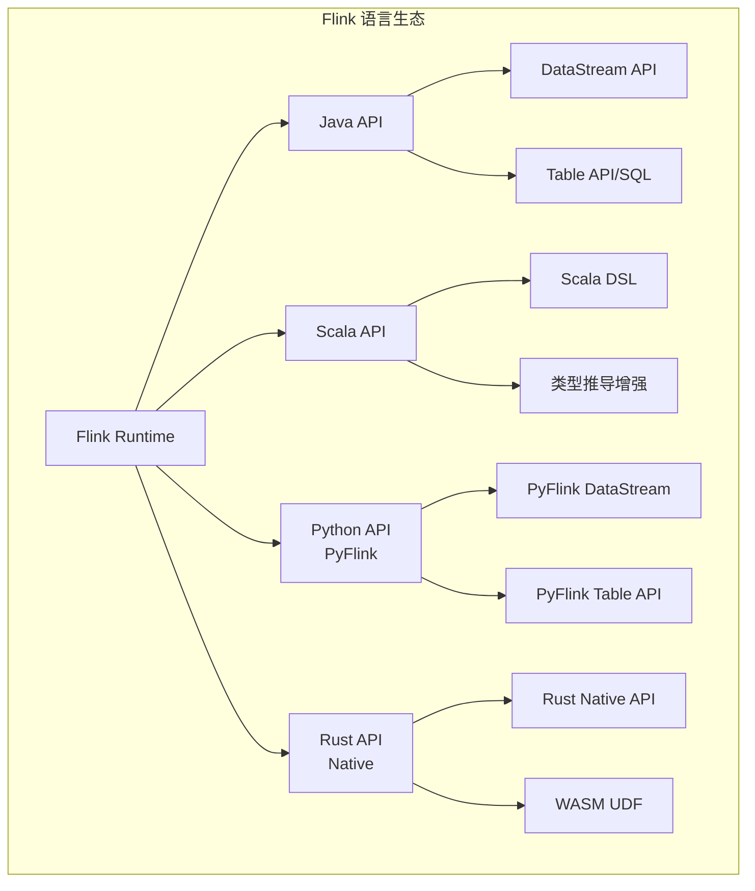
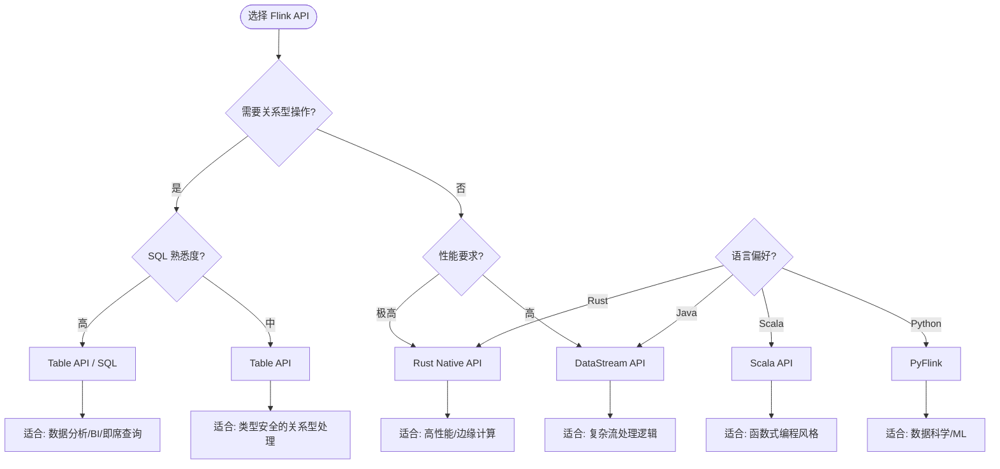
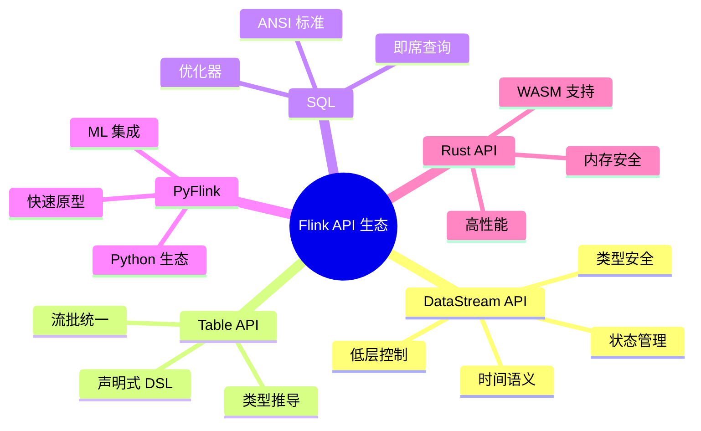

# Flink API 生态概览

> **状态**: 前瞻 | **预计发布时间**: 2026-Q3 起 | **最后更新**: 2026-04-12
>
> ⚠️ 本文档描述的特性处于早期讨论阶段，尚未正式发布。实现细节可能变更。

> 所属阶段: Flink | 前置依赖: [Flink/01-concepts/](../01-concepts/) | 形式化等级: L3

本文档是 Flink API 层级的权威导航中心，系统性地整理了 Flink 提供的所有编程接口与查询语言。从底层的 DataStream API 到声明式的 Table API & SQL，再到多语言支持体系（Java、Scala、Python、Rust），本目录为流处理开发者提供完整的技术选型和实现参考。

---

## 目录结构导航

```
# 伪代码示意，非完整可编译代码 03-api/
├── README.md                          # 本文件 - API 生态概览
├── 03.02-table-sql-api/               # Table API & SQL 完整指南
│   ├── flink-table-sql-complete-guide.md
│   ├── flink-sql-window-functions-deep-dive.md
│   ├── flink-sql-calcite-optimizer-deep-dive.md
│   ├── flink-cep-complete-guide.md
│   └── ...
└── 09-language-foundations/             # 语言基础与多语言支持
    ├── flink-datastream-api-complete-guide.md
    ├── flink-language-support-complete-guide.md
    ├── pyflink-complete-guide.md
    ├── flink-rust-native-api-guide.md
    └── ...
```

---

## 1. 概念定义 (Definitions)

### Def-F-03-01: Flink API 分层架构

Flink 的 API 设计遵循**分层抽象原则**，从底层到高层依次为：

| 层级 | API 类型 | 抽象程度 | 适用场景 |
|------|----------|----------|----------|
| L1 | ProcessFunction | 最低 | 细粒度状态控制、复杂事件处理 |
| L2 | DataStream API | 低 | 流处理逻辑编程、精确控制 |
| L3 | Table API | 中 | 关系型数据处理、类型安全 |
| L4 | SQL | 最高 | 声明式查询、快速分析 |

**核心特性**: 各层级 API 可以**无缝混合使用**（如 SQL 结果转为 DataStream），形成统一的编程体验。

---

## 2. DataStream API 详解

### 2.1 架构定位

DataStream API 是 Flink 的**核心编程接口**，为无界和有界数据流提供类型安全的编程模型。

**核心抽象**:

- **DataStream<T>**: 不可变数据流，支持转换操作
- **KeyedStream<K, T>**: 按键分区流，支持状态化操作
- **WindowedStream<T, K, W>**: 窗口化流，支持时间窗口计算
- **ConnectedStreams<T1, T2>**: 连接流，支持多流关联

### 2.2 关键特性

| 特性 | 说明 | 文档链接 |
|------|------|----------|
| 类型系统 | 基于 TypeInformation 的强类型支持 | [类型推导机制](./09-language-foundations/01.02-typeinformation-derivation.md) |
| 时间语义 | Event Time / Processing Time / Ingestion Time | [Flink/01-concepts/](../01-concepts/) |
| 状态管理 | Keyed State、Operator State 完整支持 | [Flink/02-core/](../02-core/) |
| 容错机制 | 基于 Checkpoint 的 Exactly-Once 语义 | [Flink/01-concepts/](../01-concepts/) |

### 2.3 快速入门文档

- 📘 [DataStream API 完全指南](./09-language-foundations/flink-datastream-api-complete-guide.md) - 从基础到高级的完整教程
- 📋 [DataStream API 速查表](./09-language-foundations/datastream-api-cheatsheet.md) - 常用操作快速参考
- 🆕 [DataStream V2 API](./09-language-foundations/05-datastream-v2-api.md) - Flink 2.x 新一代 API 预览

---

## 3. Table API & SQL 详解

### 3.1 架构定位

Table API 和 SQL 是 Flink 提供的**统一关系型 API**，基于 Apache Calcite 优化器，支持批流一体查询。

**核心组件**:

```
┌─────────────────────────────────────────┐
│           SQL / Table API               │
├─────────────────────────────────────────┤
│         Apache Calcite 优化器           │
├─────────────────────────────────────────┤
│      Table API Core (声明式 DSL)        │
├─────────────────────────────────────────┤
│        Table & SQL 运行时               │
├─────────────────────────────────────────┤
│    DataStream API / Batch API (底层)    │
└─────────────────────────────────────────┘
```

### 3.2 SQL 能力矩阵

| 功能类别 | 支持状态 | 关键文档 |
|----------|----------|----------|
| ANSI SQL 2023 | 部分实现 | [ANSI SQL 2023 合规指南](./03.02-table-sql-api/ansi-sql-2023-compliance-guide.md) |
| 窗口函数 | ✅ 完整 | [SQL 窗口函数深度解析](./03.02-table-sql-api/flink-sql-window-functions-deep-dive.md) |
| 复杂事件处理 (CEP) | ✅ 完整 | [Flink CEP 完全指南](./03.02-table-sql-api/flink-cep-complete-guide.md) |
| 向量搜索 | ✅ 实验 | [向量搜索与 RAG](./03.02-table-sql-api/flink-vector-search-rag.md) |
| 物化表 | ✅ 2.0+ | [物化表深度解析](./03.02-table-sql-api/flink-materialized-table-deep-dive.md) |
| UDF/UDTF/UDAF | ✅ 完整 | [Python UDF 开发](./03.02-table-sql-api/flink-python-udf.md) |

### 3.3 Table API 核心文档

- 📘 [Table API & SQL 完全指南](./03.02-table-sql-api/flink-table-sql-complete-guide.md) - 从入门到精通的完整教程
- 📊 [数据类型完整参考](./03.02-table-sql-api/data-types-complete-reference.md) - 类型系统详解
- 🔧 [内置函数完整列表](./03.02-table-sql-api/built-in-functions-complete-list.md) - 200+ 函数速查
- ⚡ [SQL 优化与 Hint 指南](./03.02-table-sql-api/flink-sql-hints-optimization.md) - 查询性能调优
- 🔄 [SQL vs DataStream 对比](./03.02-table-sql-api/sql-vs-datastream-comparison.md) - 选型参考

---

## 4. 语言支持体系

### 4.1 语言支持概览

Flink 提供**官方多语言支持**，满足不同技术栈团队的需求：



### 4.2 Java API

**定位**: Flink 的原生语言，功能最完整、性能最优。

**核心文档**:

- [从 Scala 视角看 Java API](./09-language-foundations/02.01-java-api-from-scala.md)
- [Java API 类型系统](./09-language-foundations/01.02-typeinformation-derivation.md)

**适用场景**: 生产环境首选，企业级应用开发。

### 4.3 Scala API

**定位**: 函数式编程友好的流处理接口。

**核心特性**:

- 隐式类型推导，减少样板代码
- 模式匹配支持，优雅处理复杂事件
- Case Class 自动序列化

**核心文档**:

- [Scala 流处理类型系统](./09-language-foundations/01.01-scala-types-for-streaming.md)
- [Scala 3 类型系统形式化](./09-language-foundations/01.03-scala3-type-system-formalization.md)
- [Flink Scala API 社区指南](./09-language-foundations/02.02-flink-scala-api-community.md)

**版本状态**: Flink 1.18+ 后社区维护，2.x 持续支持。

### 4.4 Python API (PyFlink)

**定位**: 数据科学和机器学习场景的首选接口。

**核心特性**:

- 与 Pandas、NumPy 生态无缝集成
- 支持 Python UDF 和 UDTF
- 异步 I/O 支持外部服务调用

**核心文档**:

- 📘 [PyFlink 完全指南](./09-language-foundations/pyflink-complete-guide.md)
- ⚡ [Python 异步 API](./09-language-foundations/02.03-python-async-api.md)
- 🔧 [Python UDF 开发实践](./03.02-table-sql-api/flink-python-udf.md)

**适用场景**: 数据科学、ML 特征工程、快速原型开发。

### 4.5 Rust API (Native)

**定位**: 高性能、内存安全的新型流处理接口。

**核心特性**:

- 零成本抽象，接近 C++ 的性能
- 编译时内存安全保证
- WASM 编译目标支持

**核心文档**:

- 📘 [Rust Native API 指南](./09-language-foundations/flink-rust-native-api-guide.md)
- 🦀 [Rust 流处理生态分析](./09-language-foundations/07-rust-streaming-landscape.md)
- 🔌 [Rust Connector 开发](./09-language-foundations/08-flink-rust-connector-dev.md)
- 📦 [迁移指南](./09-language-foundations/03.01-migration-guide.md)

**状态**: Flink 2.5+ 实验性支持，面向未来高性能场景。

---

## 5. API 选型决策指南

### 5.1 决策树



### 5.2 场景对照表

| 应用场景 | 推荐 API | 理由 |
|----------|----------|------|
| 实时 ETL 管道 | DataStream API | 精确控制转换逻辑 |
| 实时数仓查询 | SQL / Table API | 声明式、优化器自动优化 |
| 复杂事件处理 (CEP) | SQL CEP / DataStream CEP | 模式匹配语义支持 |
| ML 特征工程 | PyFlink | Python 生态集成 |
| 高频交易/风控 | Rust API | 极致延迟要求 |
| 流批一体作业 | Table API | 统一批流语义 |
| 快速原型验证 | SQL | 低门槛、快速迭代 |

---

## 6. 子目录导航

### 6.1 03.02-table-sql-api/ - Table API & SQL 深度专题

该目录包含 Table API 和 SQL 的高级特性与深度解析：

| 文档 | 内容概要 | 难度 |
|------|----------|------|
| [Table API & SQL 完全指南](./03.02-table-sql-api/flink-table-sql-complete-guide.md) | 全面教程，涵盖基础到高级 | ⭐⭐⭐ |
| [SQL 窗口函数深度解析](./03.02-table-sql-api/flink-sql-window-functions-deep-dive.md) | TUMBLE/SESSION/HOP/CUMULATE | ⭐⭐⭐⭐ |
| [Flink CEP 完全指南](./03.02-table-sql-api/flink-cep-complete-guide.md) | 复杂事件处理模式定义 | ⭐⭐⭐⭐ |
| [Calcite 优化器深度解析](./03.02-table-sql-api/flink-sql-calcite-optimizer-deep-dive.md) | 查询计划生成与优化 | ⭐⭐⭐⭐⭐ |
| [物化表深度解析](./03.02-table-sql-api/flink-materialized-table-deep-dive.md) | 增量计算与物化视图 | ⭐⭐⭐⭐ |
| [向量搜索与 RAG](./03.02-table-sql-api/flink-vector-search-rag.md) | AI 时代的流式向量检索 | ⭐⭐⭐⭐ |
| [内置函数完整列表](./03.02-table-sql-api/built-in-functions-complete-list.md) | 200+ 函数参考手册 | ⭐⭐ |

### 6.2 09-language-foundations/ - 语言基础与前沿探索

该目录涵盖多语言支持与未来技术探索：

| 分类 | 关键文档 | 价值 |
|------|----------|------|
| **语言支持总览** | [Flink 语言支持完全指南](./09-language-foundations/flink-language-support-complete-guide.md) | 多语言选型权威参考 |
| **Java/Scala** | [DataStream API 完全指南](./09-language-foundations/flink-datastream-api-complete-guide.md) | 核心 API 完整教程 |
| **Python** | [PyFlink 完全指南](./09-language-foundations/pyflink-complete-guide.md) | 数据科学场景首选 |
| **Rust** | [Rust Native API 指南](./09-language-foundations/flink-rust-native-api-guide.md) | 高性能场景探索 |
| **前沿探索** | [Timely Dataflow 优化](./09-language-foundations/07.01-timely-dataflow-optimization.md) | 差异化流计算研究 |
| **WASM 集成** | [WASM UDF 框架](./09-language-foundations/09-wasm-udf-frameworks.md) | 多语言 UDF 统一方案 |

---

## 7. 快速开始路径

### 7.1 新手入门路径

```
Week 1: 基础概念
├── 阅读: Flink 核心概念 (../01-core-concepts/)
└── 实践: 官方 WordCount 示例

Week 2: DataStream API
├── 阅读: [DataStream API 完全指南](./09-language-foundations/flink-datastream-api-complete-guide.md)
└── 实践: 实现一个实时 ETL 作业

Week 3: Table API & SQL
├── 阅读: [Table API & SQL 完全指南](./03.02-table-sql-api/flink-table-sql-complete-guide.md)
└── 实践: 构建实时数仓查询

Week 4: 进阶专题
├── 选择: CEP / 窗口函数 / 状态管理
└── 实践: 完成一个生产级项目
```

### 7.2 按角色学习路径

| 角色 | 推荐路径 | 预期时间 |
|------|----------|----------|
| **数据工程师** | DataStream API → SQL → Connectors | 4-6 周 |
| **数据分析师** | SQL → Table API → 窗口函数 | 2-3 周 |
| **数据科学家** | PyFlink → ML 集成 → 特征工程 | 3-4 周 |
| **平台工程师** | 运行时 → 部署 → 可观测性 | 4-6 周 |
| **研究员** | 理论基础 → Rust API → 形式化验证 | 6-8 周 |

---

## 8. 最佳实践与资源

### 8.1 API 使用准则

1. **从高层开始**: 优先尝试 SQL/Table API，仅在必要时下沉到 DataStream
2. **类型安全**: 始终使用泛型类型，避免 RawType
3. **状态显式化**: 明确定义状态 TTL，防止无限增长
4. **测试驱动**: 利用 Flink 的测试工具进行单元和集成测试

### 8.2 相关资源

- 🔗 [Flink 官方文档](https://nightlies.apache.org/flink/flink-docs-stable/)
- 🔗 [Flink Forward 大会视频](https://www.youtube.com/@FlinkForward)
- 🔗 [Stack Overflow - Flink 标签](https://stackoverflow.com/questions/tagged/apache-flink)
- 🔗 [Flink 用户邮件列表](https://flink.apache.org/community.html#mailing-lists)

---

## 9. 版本兼容性说明

| API | Flink 1.18 | Flink 1.19 | Flink 2.0 | Flink 2.1+ |
|-----|------------|------------|-----------|------------|
| DataStream API | ✅ | ✅ | ✅ | ✅ |
| Table API/SQL | ✅ | ✅ | ✅ | ✅ |
| PyFlink | ✅ | ✅ | ✅ | ✅ |
| Scala API | ⚠️ 社区维护 | ⚠️ 社区维护 | ⚠️ 社区维护 | ⚠️ 社区维护 |
| Rust API | ❌ | ❌ | ⚠️ 实验 | ✅ |

> **注**: ⚠️ 表示社区维护，❌ 表示不支持，✅ 表示官方完整支持

---

## 10. 可视化总结



---

## 引用参考
