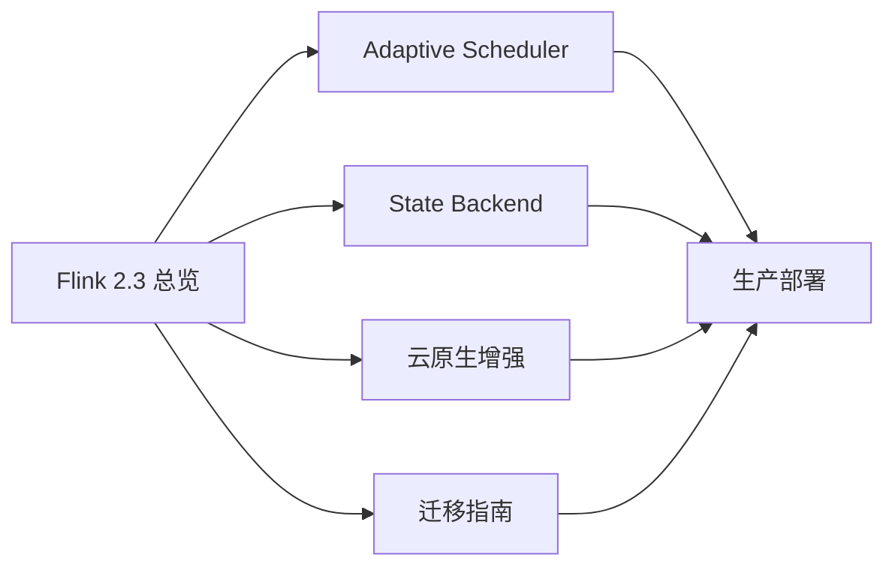

# Flink 2.3 特性深度解析 — 目录导航

> **状态**: ✅ 已发布 | **风险等级**: 低 | **最后更新**: 2026-04-20
>
> 此目录基于 Apache Flink 2.3 官方发布说明整理。内容反映官方发布状态，生产环境选型请以 Apache Flink 官方文档为准。

---

## 文档列表

| 编号 | 文档 | 描述 | 状态 |
|------|------|------|------|
| 03.01 | [Flink 2.3 新特性总览](./flink-23-overview.md) | 版本定位、核心增强、迁移策略概览 | ✅ 完成 |
| 03.02 | [Adaptive Scheduler 2.0](./flink-23-adaptive-scheduler.md) | 动态并行度调整、弹性伸缩、调度正确性 | ✅ 完成 |
| 03.03 | [新的 State Backend 解析](./flink-23-state-backend.md) | ForStStateBackend、RocksDB 对比、迁移路径 | ✅ 完成 |
| 03.04 | [云原生增强实战](./flink-23-cloud-native.md) | K8s Operator 协同、Sidecar、Pod 模板注入 | 📝 待补充 |
| 03.05 | [2.2→2.3 迁移指南](./flink-22-to-23-migration.md) | 兼容性矩阵、配置变更、回退方案 | 📝 待补充 |

---

## 快速导航

---

*Flink 2.3 Feature Deep Dive Index*
