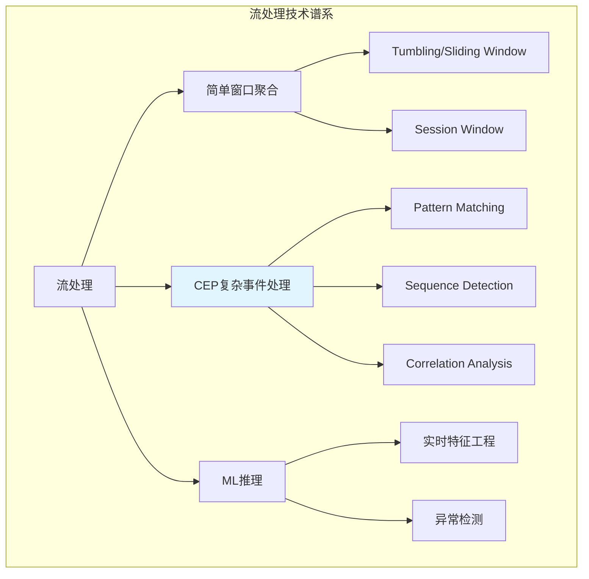
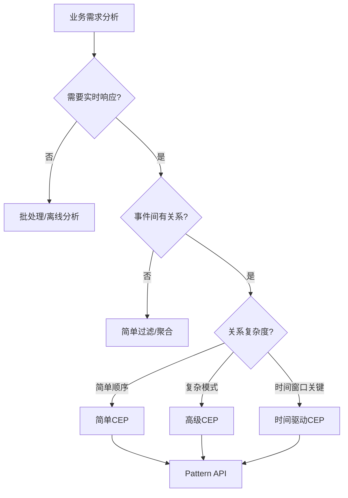
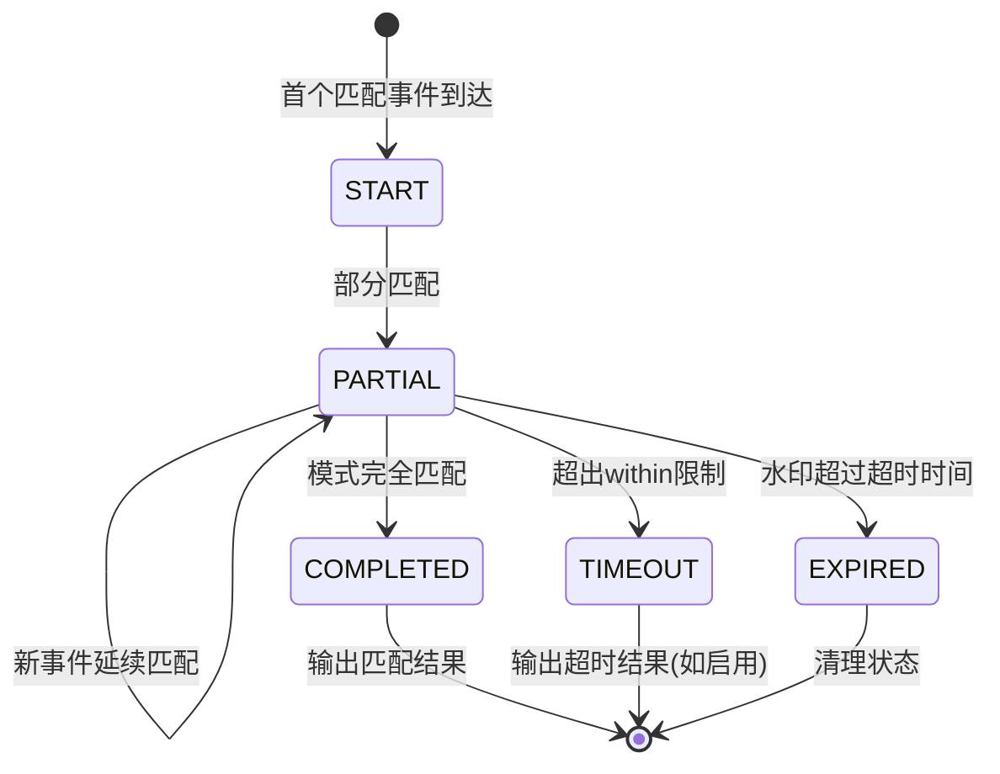
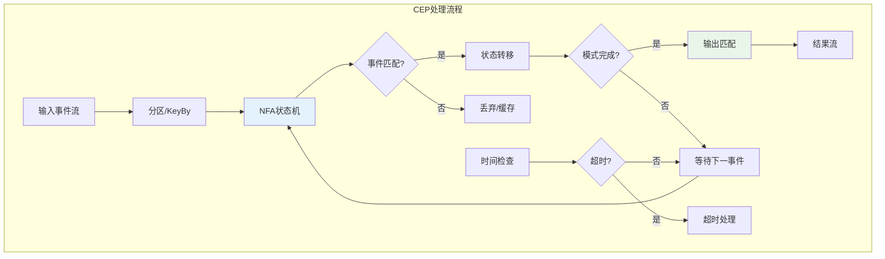
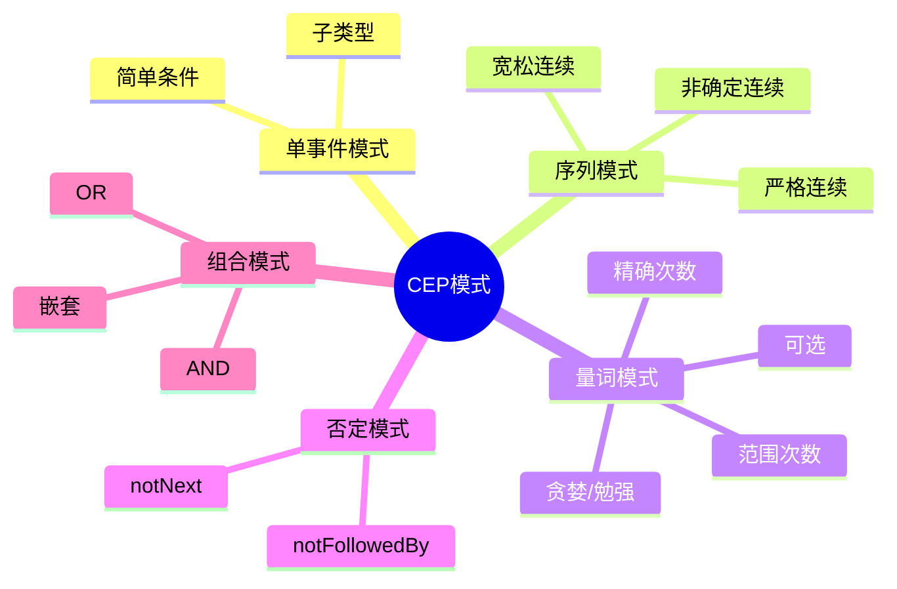
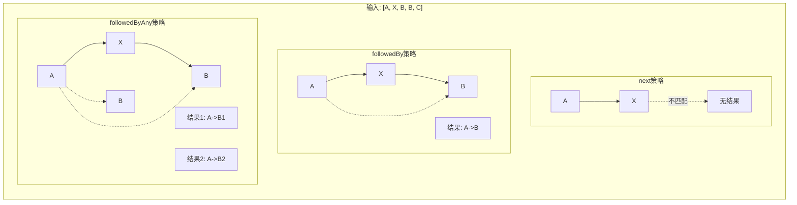
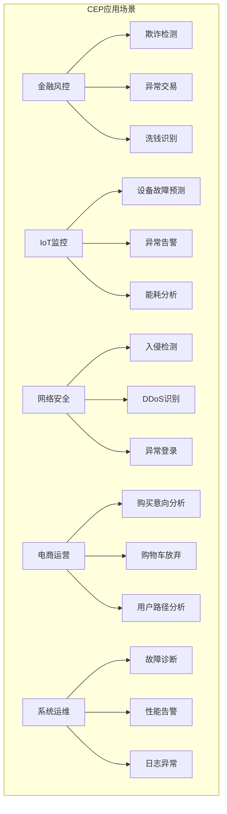

# Flink CEP (Complex Event Processing) 完整教程

> **所属阶段**: Flink Stage 3 | **前置依赖**: [Flink Table API & SQL 完整特性指南](./flink-table-sql-complete-guide.md), [Flink SQL窗口函数深度指南](./flink-sql-window-functions-deep-dive.md) | **形式化等级**: L3-L5
>
> **版本**: Flink 1.13-2.2+ | **状态**: 生产就绪 | **最后更新**: 2026-04-04

---

## 1. 概念定义 (Definitions)

### Def-F-CEP-01: CEP (Complex Event Processing) 定义

**定义**: 复杂事件处理(CEP)是一种从**事件流**中检测**复杂模式**的技术，通过识别低层事件之间的关联关系，推导出更高层次的业务事件。

形式化表述：
$$
\text{CEP} = (E, P, M, A)
$$

其中：

| 组件 | 符号 | 说明 |
|------|------|------|
| **事件流** | $E$ | 时序化的无序或有序事件序列 $E = \{e_1, e_2, ..., e_n\}$ |
| **模式** | $P$ | 定义目标事件序列的结构约束 $P = (S, C, T)$ |
| **匹配函数** | $M$ | $M: E \times P \rightarrow \{0, 1\}$，判断事件序列是否匹配模式 |
| **动作** | $A$ | 匹配成功时执行的回调或转换 $A: \text{Match} \rightarrow \text{Output}$ |

**CEP的核心能力**：

```
低层事件 → [CEP引擎] → 复杂模式识别 → 高层业务事件
├── 登录事件         ├── 异常登录序列      └── 账户被盗告警
├── 交易事件         ├── 欺诈交易模式      └── 欺诈交易告警
└── 设备事件         └── 设备故障序列      └── 设备故障预测
```

### Def-F-CEP-02: 模式 (Pattern) 概念

**定义**: 模式是对目标事件序列的抽象描述，包含**结构约束**、**属性条件**和**时间约束**三部分。

形式化：
$$
\text{Pattern} = (N, R, C, T)
$$

- $N$: 模式名称集合 $\{n_1, n_2, ..., n_k\}$
- $R$: 连续性策略 (Next, FollowedBy, etc.)
- $C$: 个体事件条件集合
- $T$: 全局时间窗口约束

**模式类型层次**：

| 类型 | 说明 | 示例 |
|------|------|------|
| **单事件模式** | 匹配单个事件 | `temperature > 100°C` |
| **序列模式** | 匹配有序事件序列 | `A → B → C` |
| **循环模式** | 匹配重复事件 | `A{3,5}` (出现3-5次) |
| **否定模式** | 匹配不包含某事件 | `A → !B → C` |
| **组合模式** | 子模式的逻辑组合 | `(A → B) OR (C → D)` |

### Def-F-CEP-03: 事件序列匹配

**定义**: 事件序列匹配是将输入事件流与预定义模式进行对齐，找出所有满足模式约束的事件子序列的过程。

形式化定义：
$$
\text{Match}(S, P) = \{(e_{i_1}, e_{i_2}, ..., e_{i_n}) \mid S = \langle e_1, e_2, ... \rangle \land P(e_{i_1}, ..., e_{i_n}) = \text{true} \}
$$

**匹配的关键维度**：

**Def-F-CEP-03a: 连续性 (Contiguity)**

| 策略 | 符号 | 语义 |
|------|------|------|
| **严格连续** | $\xrightarrow{\text{next}}$ | 事件必须紧邻，中间不能有任何事件 |
| **宽松连续** | $\xrightarrow{\text{followedBy}}$ | 事件按顺序，中间可有其他事件 |
| **非确定性宽松** | $\xrightarrow{\text{followedByAny}}$ | 每个事件可匹配多个后续 |

**Def-F-CEP-03b: 时间约束 (Temporal Constraint)**

$$
\text{Within}(P, \Delta t) \iff \text{timestamp}(e_{\text{last}}) - \text{timestamp}(e_{\text{first}}) \leq \Delta t
$$

**Def-F-CEP-03c: 消耗策略 (Consuming Strategy)**

| 策略 | 说明 |
|------|------|
| **NO_SKIP** | 不跳过，所有可能匹配都输出 |
| **SKIP_TO_NEXT** | 跳转到下一个起始事件 |
| **SKIP_PAST_LAST_EVENT** | 跳转到匹配结束后的下一个事件 |
| **SKIP_TO_FIRST** | 跳转到指定模式的第一个事件 |

---

## 2. 属性推导 (Properties)

### Lemma-F-CEP-01: CEP模式匹配的完备性

**引理**: 对于任意有限事件流 $S$ 和任意良构模式 $P$，CEP引擎能在有限时间内判定所有匹配。

**证明概要**：

1. **状态有限性**: 模式 $P$ 包含有限个状态节点
2. **转移确定性**: 每个事件触发确定性状态转移
3. **时间边界**: `within`约束确保部分匹配会超时清理

$$
\forall S, P: |S| < \infty \land |P| < \infty \Rightarrow \text{Matches}(S, P) \text{ is computable in finite time}
$$

### Lemma-F-CEP-02: 连续策略的偏序关系

**引理**: 三种连续策略之间存在匹配集合的包含关系：

$$
\text{Matches}_{\text{next}} \subseteq \text{Matches}_{\text{followedBy}} \subseteq \text{Matches}_{\text{followedByAny}}
$$

**直观解释**：

```
输入序列: [A, X, B, B]

Pattern<A, B>:
├── next()              → 无匹配 (A后紧邻X，不是B)
├── followedBy()        → 匹配 [A(位置1), B(位置3)]
└── followedByAny()     → 匹配 [A(位置1), B(位置3)] 和 [A(位置1), B(位置4)]
```

### Prop-F-CEP-01: 时间窗口的剪枝效果

**命题**: 引入时间窗口约束后，CEP引擎的空间复杂度从 $O(|S| \cdot |P|)$ 降为 $O(\frac{\Delta t}{\bar{\delta}} \cdot |P|)$，其中 $\bar{\delta}$ 为平均事件间隔。

**推导**：

```
无窗口约束:
  每个事件可能启动新匹配 → 需存储所有未完成的匹配
  空间复杂度: O(|S| × |P|)

有窗口约束 Δt:
  只需存储窗口内的事件
  最大并发匹配数: Δt / δ̄
  空间复杂度: O((Δt/δ̄) × |P|)
```

### Prop-F-CEP-02: 模式匹配的输出特性

**命题**: CEP匹配的输出具有以下性质：

| 性质 | 说明 |
|------|------|
| **无序性** | 匹配输出顺序可能与事件时间顺序不一致 |
| **延迟性** | 匹配结果在最后一个事件到达后才输出 |
| **完整性** | 若启用超时检测，可获取不完整匹配 |
| **去重性** | 通过消耗策略可控制匹配去重 |

---

## 3. 关系建立 (Relations)

### CEP与其他流处理技术的关系



### CEP与正则表达式的类比

| 维度 | 正则表达式 | CEP模式 |
|------|-----------|---------|
| **输入** | 字符序列 | 事件序列 |
| **原子** | 字符 | 事件条件 |
| **连接** | `abc` | `a.next(b).next(c)` |
| **选择** | `a\|b` | `a.or(b)` |
| **重复** | `a+`, `a*` | `oneOrMore(a)`, `times(3,5)` |
| **否定** | `[^a]` | `notNext(a)` |
| **锚定** | `^`, `$` | `within(time)` |

### CEP与SQL MATCH_RECOGNIZE的映射

```
Pattern API                          MATCH_RECOGNIZE
────────────────────────────────────────────────────────────
Pattern.<Event> begin("a")           PARTITION BY key
  .where(evt -> ...)                 ORDER BY event_time
  .next("b")                         MEASURES
  .where(...)                            A.event AS a_event,
  .within(Time.seconds(10))              B.event AS b_event
                                     PATTERN (A B)
                                     DEFINE
                                       A AS condition_a,
                                       B AS condition_b
```

---

## 4. 论证过程 (Argumentation)

### 4.1 CEP适用场景决策树



### 4.2 CEP vs 其他方案对比

| 场景 | 方案A: 纯代码 | 方案B: 窗口聚合 | 方案C: CEP |
|------|-------------|---------------|-----------|
| **简单计数** | ✓✓✓ 简单直接 | ✓✓✓ 最优 | ✓ 过度设计 |
| **顺序检测** | ✓✓ 状态机复杂 | ✗ 无法表达 | ✓✓✓ 原生支持 |
| **循环模式** | ✓ 需自定义逻辑 | ✗ 无法表达 | ✓✓✓ times(), oneOrMore() |
| **否定模式** | ✓✓ 可实现但复杂 | ✗ 无法表达 | ✓✓✓ notFollowedBy() |
| **时间约束** | ✓ 需手动管理 | ✓✓ 窗口支持 | ✓✓✓ within()精确控制 |
| **可维护性** | ✗ 代码晦涩 | ✓✓ 清晰 | ✓✓✓ 声明式 |

### 4.3 常见陷阱与规避策略

| 陷阱 | 问题描述 | 规避策略 |
|------|---------|---------|
| **状态爆炸** | 复杂模式导致状态过大 | 使用严格时间窗口、及时清理状态 |
| **匹配延迟** | 等待最终匹配导致输出延迟 | 启用超时处理、合理设置within |
| **事件乱序** | 水印延迟影响模式匹配 | 使用事件时间、调整水印策略 |
| **内存溢出** | 大量未完成匹配占用内存 | 限制循环模式上限、使用SKIP策略 |
| **逻辑错误** | 连续性策略选择错误 | 严格测试、理解next/followedBy区别 |

---

## 5. 形式证明 / 工程论证 (Proof / Engineering Argument)

### 5.1 CEP匹配算法的正确性论证

**定理 (CEP Matching Correctness)**: 对于任意模式 $P$ 和事件流 $S$，CEP引擎输出的匹配集合 $M$ 满足：

$$
M = \{m \mid m \subseteq S \land \text{satisfies}(m, P) \land \text{maximal}(m, S, P)\}
$$

其中 `maximal` 表示该匹配在消耗策略下是极大的。

**工程论证**：

1. **完备性**: NFA (Non-deterministic Finite Automaton) 状态机遍历所有可能转移
2. **一致性**: 每个匹配经过完整的条件验证
3. **终止性**: 时间窗口和事件时间水印确保过期状态被清理

### 5.2 状态管理机制



---

## 6. 实例验证 (Examples)

### 6.1 基础API入门

#### 6.1.1 添加依赖

```xml
<!-- Maven -->
<dependency>
    <groupId>org.apache.flink</groupId>
    <artifactId>flink-cep_2.12</artifactId>
    <version>1.18.0</version>
</dependency>

<!-- Gradle -->
implementation 'org.apache.flink:flink-cep_2.12:1.18.0'
```

#### 6.1.2 简单模式定义

```java
import org.apache.flink.cep.pattern.Pattern;
import org.apache.flink.cep.pattern.conditions.SimpleCondition;
import org.apache.flink.streaming.api.windowing.time.Time;

// 定义事件类
public class LoginEvent {
    public String userId;
    public String ip;
    public String eventType;  // "success" or "fail"
    public long timestamp;
    
    // constructor, getters...
}

// 创建简单模式: 连续两次登录失败
Pattern<LoginEvent, ?> pattern = Pattern
    .<LoginEvent>begin("first")
    .where(new SimpleCondition<LoginEvent>() {
        @Override
        public boolean filter(LoginEvent event) {
            return event.eventType.equals("fail");
        }
    })
    .next("second")  // 严格连续
    .where(new SimpleCondition<LoginEvent>() {
        @Override
        public boolean filter(LoginEvent event) {
            return event.eventType.equals("fail");
        }
    })
    .within(Time.seconds(10));  // 10秒内完成
```

### 6.2 连续策略详解

```java
import org.apache.flink.cep.pattern.Pattern;
import static org.apache.flink.cep.pattern.Quantifiers.*;

// 输入序列: [A, X, B, B, C]

// 1. next() - 严格连续
Pattern.begin("a").where(evt -> evt.type.equals("A"))
    .next("b").where(evt -> evt.type.equals("B"));
// 结果: 无匹配 (A后紧邻X)

// 2. followedBy() - 宽松连续
Pattern.begin("a").where(evt -> evt.type.equals("A"))
    .followedBy("b").where(evt -> evt.type.equals("B"));
// 结果: 匹配 [A(位置1), B(位置3)]

// 3. followedByAny() - 非确定性宽松
Pattern.begin("a").where(evt -> evt.type.equals("A"))
    .followedByAny("b").where(evt -> evt.type.equals("B"));
// 结果: [A(1), B(3)], [A(1), B(4)] - 两个匹配

// 4. notNext() - 严格否定
Pattern.begin("a").where(evt -> evt.type.equals("A"))
    .notNext("b").where(evt -> evt.type.equals("X"));
// 结果: 无匹配 (A后紧邻X)

// 5. notFollowedBy() - 宽松否定
Pattern.begin("a").where(evt -> evt.type.equals("A"))
    .notFollowedBy("b").where(evt -> evt.type.equals("Z"))
    .followedBy("c").where(evt -> evt.type.equals("C"));
// 结果: 匹配 [A, C] (A和C之间没有Z)
```

### 6.3 量词使用

```java
// 1. times(n) - 精确重复n次
Pattern.<Event>begin("login").where(evt -> evt.type.equals("LOGIN"))
    .times(3);  // 恰好3次登录

// 2. timesOrMore(n) - 至少n次
Pattern.<Event>begin("alert").where(evt -> evt.severity.equals("HIGH"))
    .timesOrMore(2);  // 至少2次高危告警

// 3. times(min, max) - 范围重复
Pattern.<Event>begin("retry").where(evt -> evt.action.equals("RETRY"))
    .times(2, 5);  // 2到5次重试

// 4. optional() - 可选
Pattern.<Event>begin("start").where(evt -> evt.type.equals("START"))
    .next("middle").where(evt -> evt.type.equals("MIDDLE"))
    .optional()  // 中间步骤可选
    .next("end").where(evt -> evt.type.equals("END"));

// 5. oneOrMore() - 一次或多次
Pattern.<Event>begin("tick").where(evt -> evt.priceChange > 0)
    .oneOrMore()  // 连续上涨
    .greedy()     // 贪婪匹配
    .next("drop").where(evt -> evt.priceChange < 0);

// 6. consecutive() - 严格连续的重复
Pattern.<Event>begin("beat").where(evt -> evt.type.equals("HEARTBEAT"))
    .times(3).consecutive();  // 3个连续心跳，中间不能有其他事件

// 7. allowCombinations() - 允许组合
Pattern.<Event>begin("a").where(evt -> evt.value > 10)
    .times(2)
    .allowCombinations();  // 同一事件可参与多个匹配
```

### 6.4 条件定义

```java
import org.apache.flink.cep.pattern.conditions.IterativeCondition;
import org.apache.flink.cep.pattern.conditions.SimpleCondition;

// 1. SimpleCondition - 简单条件
Pattern.<Event>begin("high").where(
    new SimpleCondition<Event>() {
        @Override
        public boolean filter(Event event) {
            return event.temperature > 100;
        }
    }
);

// 2. 子类型条件
Pattern.<Event>begin("sub").subtype(TemperatureEvent.class)
    .where(evt -> evt.value > 50);

// 3. 迭代条件 - 可访问之前匹配的事件
Pattern.<LoginEvent>begin("first").where(evt -> evt.status.equals("FAIL"))
    .next("second").where(
        new IterativeCondition<LoginEvent>() {
            @Override
            public boolean filter(LoginEvent event, Context<LoginEvent> ctx) {
                // 获取之前匹配的事件
                for (LoginEvent first : ctx.getEventsForPattern("first")) {
                    // 相同用户，不同IP
                    if (first.userId.equals(event.userId) && 
                        !first.ip.equals(event.ip)) {
                        return true;
                    }
                }
                return false;
            }
        }
    );

// 4. 组合条件
Pattern.<Event>begin("e")
    .where(evt -> evt.temperature > 100)
    .or(evt -> evt.pressure > 200)      // OR条件
    .until(evt -> evt.temperature < 50); // 终止条件 (用于oneOrMore)

// 5. 否定条件
Pattern.<Event>begin("start")
    .notFollowedBy("error").where(evt -> evt.type.equals("ERROR"))
    .followedBy("end").where(evt -> evt.type.equals("END"));
```

### 6.5 结果处理

```java
import org.apache.flink.cep.CEP;
import org.apache.flink.cep.PatternStream;
import org.apache.flink.cep.PatternSelectFunction;
import org.apache.flink.cep.PatternFlatSelectFunction;
import org.apache.flink.cep.PatternTimeoutFunction;
import org.apache.flink.util.Collector;

import java.util.List;
import java.util.Map;

// 应用模式到数据流
PatternStream<LoginEvent> patternStream = CEP.pattern(
    loginStream.keyBy(LoginEvent::getUserId),  // 按用户分组
    pattern
);

// 1. select - 简单选择
DataStream<Alert> alerts = patternStream.select(
    new PatternSelectFunction<LoginEvent, Alert>() {
        @Override
        public Alert select(Map<String, List<LoginEvent>> pattern) {
            LoginEvent first = pattern.get("first").get(0);
            LoginEvent second = pattern.get("second").get(0);
            return new Alert(
                first.userId,
                "连续登录失败: " + first.ip + " -> " + second.ip,
                second.timestamp
            );
        }
    }
);

// 2. flatSelect - 可输出多条结果
DataStream<Alert> flatAlerts = patternStream.flatSelect(
    new PatternFlatSelectFunction<LoginEvent, Alert>() {
        @Override
        public void flatSelect(
                Map<String, List<LoginEvent>> pattern,
                Collector<Alert> out) {
            // 可能输出多个告警
            for (LoginEvent event : pattern.get("events")) {
                out.collect(new Alert(event.userId, "异常活动", event.timestamp));
            }
        }
    }
);

// 3. 处理超时 (不完整匹配)
OutputTag<TimeoutEvent> timeoutTag = new OutputTag<TimeoutEvent>("timeout") {};

DataStream<ComplexEvent> result = patternStream.select(
    new PatternSelectFunction<LoginEvent, ComplexEvent>() {
        @Override
        public ComplexEvent select(Map<String, List<LoginEvent>> pattern) {
            // 完整匹配处理
            return new ComplexEvent(pattern, false);
        }
    },
    new PatternTimeoutFunction<LoginEvent, TimeoutEvent>() {
        @Override
        public TimeoutEvent timeout(
                Map<String, List<LoginEvent>> partialPattern,
                long timeoutTimestamp) {
            // 超时处理 - 模式在within时间内未完成
            return new TimeoutEvent(partialPattern, timeoutTimestamp);
        }
    }
);

// 获取超时流
DataStream<TimeoutEvent> timeoutStream = result.getSideOutput(timeoutTag);

// 4. 处理多个模式
Pattern<LoginEvent, ?> pattern1 = ...;
Pattern<LoginEvent, ?> pattern2 = ...;

PatternStream<LoginEvent> multiPatternStream = CEP.pattern(
    loginStream.keyBy(LoginEvent::getUserId),
    Pattern.begin(pattern1).or(Pattern.begin(pattern2))
);
```

### 6.6 完整案例：欺诈检测

```java
import org.apache.flink.streaming.api.datastream.DataStream;
import org.apache.flink.streaming.api.environment.StreamExecutionEnvironment;
import org.apache.flink.streaming.api.windowing.time.Time;
import org.apache.flink.cep.CEP;
import org.apache.flink.cep.PatternStream;
import org.apache.flink.cep.pattern.Pattern;
import org.apache.flink.cep.pattern.conditions.IterativeCondition;

/**
 * 场景: 检测可疑交易模式
 * 模式: 大额交易后短时间内多笔小额交易 (洗钱特征)
 */
public class FraudDetectionCEP {
    
    public static void main(String[] args) throws Exception {
        StreamExecutionEnvironment env = 
            StreamExecutionEnvironment.getExecutionEnvironment();
        env.setParallelism(1);
        
        // 交易事件流
        DataStream<Transaction> transactions = env
            .addSource(new TransactionSource())
            .assignTimestampsAndWatermarks(
                WatermarkStrategy.<Transaction>forBoundedOutOfOrderness(
                    Duration.ofSeconds(5)
                ).withIdleness(Duration.ofMinutes(1))
            );
        
        // 定义欺诈模式
        Pattern<Transaction, ?> fraudPattern = Pattern
            .<Transaction>begin("large-tx")
            .where(new SimpleCondition<Transaction>() {
                @Override
                public boolean filter(Transaction tx) {
                    return tx.amount > 10000;  // 大额交易
                }
            })
            .followedBy("small-txs")
            .where(new IterativeCondition<Transaction>() {
                @Override
                public boolean filter(Transaction tx, Context<Transaction> ctx) {
                    // 小额交易 (< 1000)
                    return tx.amount < 1000;
                }
            })
            .timesOrMore(3)  // 至少3笔
            .within(Time.minutes(10));  // 10分钟内
        
        // 应用模式
        PatternStream<Transaction> patternStream = CEP.pattern(
            transactions.keyBy(Transaction::getAccountId),
            fraudPattern
        );
        
        // 处理匹配结果
        DataStream<FraudAlert> alerts = patternStream.select(
            new PatternSelectFunction<Transaction, FraudAlert>() {
                @Override
                public FraudAlert select(Map<String, List<Transaction>> pattern) {
                    Transaction largeTx = pattern.get("large-tx").get(0);
                    List<Transaction> smallTxs = pattern.get("small-txs");
                    
                    double totalSmall = smallTxs.stream()
                        .mapToDouble(t -> t.amount)
                        .sum();
                    
                    return new FraudAlert(
                        largeTx.accountId,
                        String.format(
                            "可疑交易: 大额 %.2f 后 %d 笔小额共 %.2f",
                            largeTx.amount,
                            smallTxs.size(),
                            totalSmall
                        ),
                        largeTx.timestamp,
                        smallTxs.get(smallTxs.size() - 1).timestamp
                    );
                }
            }
        );
        
        // 输出告警
        alerts.addSink(new AlertSink());
        
        env.execute("Fraud Detection with CEP");
    }
}

// 事件类
public class Transaction {
    public String accountId;
    public double amount;
    public String merchant;
    public long timestamp;
    
    public Transaction(String accountId, double amount, 
                       String merchant, long timestamp) {
        this.accountId = accountId;
        this.amount = amount;
        this.merchant = merchant;
        this.timestamp = timestamp;
    }
    
    public String getAccountId() { return accountId; }
}

// 告警类
public class FraudAlert {
    public String accountId;
    public String message;
    public long patternStart;
    public long patternEnd;
    
    public FraudAlert(String accountId, String message, 
                      long patternStart, long patternEnd) {
        this.accountId = accountId;
        this.message = message;
        this.patternStart = patternStart;
        this.patternEnd = patternEnd;
    }
}
```

### 6.7 完整案例：交易系统价格突变

```java
/**
 * 场景: 检测价格突变模式
 * 模式1: 价格连续上涨后突然下跌 (可能的顶部信号)
 * 模式2: 价格连续下跌后突然上涨 (可能的底部信号)
 */
public class PriceSurgeDetection {
    
    public static void main(String[] args) throws Exception {
        StreamExecutionEnvironment env = 
            StreamExecutionEnvironment.getExecutionEnvironment();
        
        DataStream<StockPrice> prices = env
            .addSource(new StockPriceSource())
            .keyBy(StockPrice::getSymbol);
        
        // 模式1: 连续上涨后下跌
        Pattern<StockPrice, ?> surgePattern = Pattern
            .<StockPrice>begin("rising")
            .where(new SimpleCondition<StockPrice>() {
                @Override
                public boolean filter(StockPrice price) {
                    return price.changePercent > 0;
                }
            })
            .oneOrMore().greedy()  // 贪婪匹配连续上涨
            .next("drop")
            .where(new IterativeCondition<StockPrice>() {
                @Override
                public boolean filter(StockPrice price, Context<StockPrice> ctx) {
                    // 下跌超过2%
                    return price.changePercent < -2;
                }
            })
            .within(Time.minutes(5));
        
        // 应用模式
        PatternStream<StockPrice> patternStream = CEP.pattern(prices, surgePattern);
        
        // 处理结果
        DataStream<TradingSignal> signals = patternStream.process(
            new PatternProcessFunction<StockPrice, TradingSignal>() {
                @Override
                public void processMatch(
                        Map<String, List<StockPrice>> match,
                        Context ctx,
                        Collector<TradingSignal> out) {
                    
                    List<StockPrice> rising = match.get("rising");
                    StockPrice drop = match.get("drop").get(0);
                    
                    double totalRise = rising.stream()
                        .mapToDouble(p -> p.changePercent)
                        .sum();
                    
                    // 生成交易信号
                    out.collect(new TradingSignal(
                        drop.symbol,
                        "SURGE_TOP",
                        String.format(
                            "连续上涨 %.2f%% 后下跌 %.2f%%",
                            totalRise,
                            drop.changePercent
                        ),
                        drop.timestamp
                    ));
                }
            }
        );
        
        signals.print();
        env.execute();
    }
}
```

### 6.8 完整案例：IoT告警

```java
/**
 * 场景: 设备故障预测
 * 模式: 温度升高 → 振动异常 → (可选)噪音增加 → 故障
 */
public class DeviceFailurePrediction {
    
    public static void main(String[] args) throws Exception {
        StreamExecutionEnvironment env = 
            StreamExecutionEnvironment.getExecutionEnvironment();
        
        DataStream<SensorReading> sensors = env
            .addSource(new SensorSource())
            .keyBy(SensorReading::getDeviceId);
        
        Pattern<SensorReading, ?> failurePattern = Pattern
            .<SensorReading>begin("temp-rise")
            .where(new IterativeCondition<SensorReading>() {
                @Override
                public boolean filter(SensorReading reading, 
                                      Context<SensorReading> ctx) {
                    return reading.temperature > 80;
                }
            })
            .next("vibration-anomaly")
            .where(new SimpleCondition<SensorReading>() {
                @Override
                public boolean filter(SensorReading reading) {
                    return reading.vibration > 100;
                }
            })
            .next("noise")
            .where(new SimpleCondition<SensorReading>() {
                @Override
                public boolean filter(SensorReading reading) {
                    return reading.noiseLevel > 70;
                }
            })
            .optional()  // 噪音增加是可选指标
            .next("failure")
            .where(new SimpleCondition<SensorReading>() {
                @Override
                public boolean filter(SensorReading reading) {
                    return reading.status.equals("ERROR") ||
                           reading.temperature > 120;
                }
            })
            .within(Time.seconds(30));
        
        PatternStream<SensorReading> patternStream = CEP.pattern(sensors, failurePattern);
        
        DataStream<MaintenanceAlert> alerts = patternStream.select(
            new PatternSelectFunction<SensorReading, MaintenanceAlert>() {
                @Override
                public MaintenanceAlert select(
                        Map<String, List<SensorReading>> pattern) {
                    
                    SensorReading temp = pattern.get("temp-rise").get(0);
                    SensorReading failure = pattern.get("failure").get(0);
                    
                    return new MaintenanceAlert(
                        temp.deviceId,
                        "PREDICTIVE_FAILURE",
                        "设备即将故障，建议立即维护",
                        temp.timestamp,
                        failure.timestamp
                    );
                }
            }
        );
        
        alerts.addSink(new MaintenanceNotificationSink());
        env.execute();
    }
}
```

### 6.9 完整案例：用户行为分析

```java
/**
 * 场景: 用户购买意向分析
 * 模式: 浏览商品 → 加入购物车 → (可选)查看详情 → 结算
 */
public class PurchaseIntentAnalysis {
    
    public static void main(String[] args) throws Exception {
        StreamExecutionEnvironment env = 
            StreamExecutionEnvironment.getExecutionEnvironment();
        
        DataStream<UserAction> actions = env
            .addSource(new UserActionSource())
            .keyBy(UserAction::getUserId);
        
        // 高意向购买模式
        Pattern<UserAction, ?> highIntentPattern = Pattern
            .<UserAction>begin("view")
            .where(new SimpleCondition<UserAction>() {
                @Override
                public boolean filter(UserAction action) {
                    return action.type.equals("VIEW_PRODUCT") &&
                           action.duration > 10;  // 浏览超过10秒
                }
            })
            .followedBy("cart")
            .where(new IterativeCondition<UserAction>() {
                @Override
                public boolean filter(UserAction action, Context<UserAction> ctx) {
                    return action.type.equals("ADD_TO_CART");
                }
            })
            .followedBy("detail")
            .where(new SimpleCondition<UserAction>() {
                @Override
                public boolean filter(UserAction action) {
                    return action.type.equals("VIEW_DETAIL");
                }
            })
            .optional()
            .followedBy("checkout")
            .where(new SimpleCondition<UserAction>() {
                @Override
                public boolean filter(UserAction action) {
                    return action.type.equals("CHECKOUT");
                }
            })
            .within(Time.minutes(30));
        
        // 放弃购物车模式
        Pattern<UserAction, ?> cartAbandonPattern = Pattern
            .<UserAction>begin("cart")
            .where(new SimpleCondition<UserAction>() {
                @Override
                public boolean filter(UserAction action) {
                    return action.type.equals("ADD_TO_CART");
                }
            })
            .notFollowedBy("checkout")
            .where(new SimpleCondition<UserAction>() {
                @Override
                public boolean filter(UserAction action) {
                    return action.type.equals("CHECKOUT");
                }
            })
            .within(Time.hours(24));
        
        // 应用两个模式
        PatternStream<UserAction> highIntentStream = CEP.pattern(actions, highIntentPattern);
        PatternStream<UserAction> abandonStream = CEP.pattern(actions, cartAbandonPattern);
        
        // 处理高意向
        DataStream<MarketingEvent> highIntentEvents = highIntentStream.select(
            new PatternSelectFunction<UserAction, MarketingEvent>() {
                @Override
                public MarketingEvent select(Map<String, List<UserAction>> pattern) {
                    UserAction view = pattern.get("view").get(0);
                    UserAction checkout = pattern.get("checkout").get(0);
                    
                    return new MarketingEvent(
                        view.userId,
                        "HIGH_INTENT",
                        view.productId,
                        "用户表现出强购买意向，可推送优惠券"
                    );
                }
            }
        );
        
        // 处理购物车放弃
        DataStream<MarketingEvent> abandonEvents = abandonStream.select(
            new PatternSelectFunction<UserAction, MarketingEvent>() {
                @Override
                public MarketingEvent select(Map<String, List<UserAction>> pattern) {
                    UserAction cart = pattern.get("cart").get(0);
                    
                    return new MarketingEvent(
                        cart.userId,
                        "CART_ABANDON",
                        cart.productId,
                        "用户放弃购物车，可发送提醒邮件"
                    );
                }
            }
        );
        
        // 合并两个流
        highIntentEvents.union(abandonEvents)
            .addSink(new MarketingSink());
        
        env.execute();
    }
}
```

---

## 7. 性能优化

### 7.1 状态清理策略

```java
import org.apache.flink.cep.nfa.aftermatch.AfterMatchSkipStrategy;

// 1. 选择合适的消耗策略
Pattern<Event, ?> pattern = Pattern
    .<Event>begin("start", AfterMatchSkipStrategy.skipPastLastEvent())
    // skipPastLastEvent: 匹配完成后跳到结束事件之后，减少重复匹配
    .where(...)
    .next("middle")
    .where(...)
    .followedBy("end")
    .where(...);

// 消耗策略对比
AfterMatchSkipStrategy.noSkip();           // 不跳过，所有匹配都输出
AfterMatchSkipStrategy.skipToNext();       // 跳到下一个起始事件
AfterMatchSkipStrategy.skipPastLastEvent(); // 跳到结束事件后 (推荐)
AfterMatchSkipStrategy.skipToFirst("start"); // 跳到指定模式的第一个
AfterMatchSkipStrategy.skipToLast("start");  // 跳到指定模式的最后一个
```

### 7.2 时间窗口优化

```java
// 1. 使用严格的时间窗口限制状态增长
Pattern<Event, ?> pattern = Pattern
    .<Event>begin("start")
    .where(...)
    .within(Time.seconds(10));  // 严格限制10秒

// 2. 使用事件时间而非处理时间
env.setStreamTimeCharacteristic(TimeCharacteristic.EventTime);

// 3. 合理设置水印延迟
stream.assignTimestampsAndWatermarks(
    WatermarkStrategy
        .<Event>forBoundedOutOfOrderness(Duration.ofSeconds(5))
        .withIdleness(Duration.ofMinutes(1))  // 空闲超时清理
);
```

### 7.3 序列化优化

```java
// 1. 使用高效的序列化器
env.getConfig().registerTypeWithKryoSerializer(
    MyEvent.class, 
    new MyEventSerializer()
);

// 2. 禁用自动类型注册(如果类型已知)
env.getConfig().disableAutoTypeRegistration();

// 3. 使用Avro/Protobuf序列化
env.getConfig().enableForceAvro();
```

### 7.4 模式设计最佳实践

```java
// 1. 尽早过滤减少状态
Pattern.<Event>begin("start")
    .where(evt -> evt.type.equals("IMPORTANT"))  // 先过滤类型
    .where(evt -> evt.value > 100)               // 再过滤值
    .within(Time.seconds(5));

// 2. 避免过于宽泛的模式
// ❌ 不好: 过于宽泛，匹配过多
Pattern.begin("a").where(evt -> true).times(1000);

// ✅ 好: 精确限制
Pattern.begin("a")
    .where(evt -> evt.type.equals("SPECIFIC"))
    .times(5, 10)
    .within(Time.seconds(10));

// 3. 使用greedy()减少NFA分支
Pattern.begin("a")
    .where(evt -> evt.value > 10)
    .oneOrMore()
    .greedy()  // 贪婪匹配，优先最长序列
    .next("b");
```

---

## 8. 与SQL集成 (MATCH_RECOGNIZE)

### 8.1 MATCH_RECOGNIZE介绍

Flink SQL 提供了 `MATCH_RECOGNIZE` 子句，使用类正则表达式语法实现CEP，无需编写Java代码。

**基本语法结构**：

```sql
SELECT *
FROM table_name
MATCH_RECOGNIZE (
    PARTITION BY partition_key     -- 分组键
    ORDER BY event_time            -- 时间排序
    MEASURES                       -- 输出字段
        pattern_variable.column AS alias
    [ONE ROW PER MATCH | ALL ROWS PER MATCH]  -- 输出行数
    [AFTER MATCH SKIP strategy]    -- 匹配后跳过策略
    PATTERN (pattern_definition)   -- 模式定义
    DEFINE                         -- 变量定义
        pattern_variable AS condition
) AS alias
```

### 8.2 SQL模式匹配语法详解

```sql
-- 示例表
CREATE TABLE transactions (
    account_id STRING,
    amount DECIMAL(10,2),
    tx_type STRING,  -- 'DEBIT' or 'CREDIT'
    event_time TIMESTAMP(3),
    WATERMARK FOR event_time AS event_time - INTERVAL '5' SECOND
) WITH (...);

-- 1. 简单顺序模式: 连续两次大额支出
SELECT *
FROM transactions
MATCH_RECOGNIZE (
    PARTITION BY account_id
    ORDER BY event_time
    MEASURES
        A.amount AS first_amount,
        B.amount AS second_amount,
        A.event_time AS first_time,
        B.event_time AS second_time
    ONE ROW PER MATCH
    AFTER MATCH SKIP PAST LAST ROW
    PATTERN (A B)
    DEFINE
        A AS A.tx_type = 'DEBIT' AND A.amount > 1000,
        B AS B.tx_type = 'DEBIT' AND B.amount > 1000
);

-- 2. 量词使用
SELECT *
FROM transactions
MATCH_RECOGNIZE (
    PARTITION BY account_id
    ORDER BY event_time
    MEASURES
        FIRST(A.event_time) AS start_time,
        LAST(B.event_time) AS end_time,
        COUNT(*) AS tx_count
    ONE ROW PER MATCH
    PATTERN (A B{3,5})  -- B出现3到5次
    DEFINE
        A AS A.amount > 5000,
        B AS B.amount < 100
);

-- 3. 可选元素
SELECT *
FROM transactions
MATCH_RECOGNIZE (
    PARTITION BY account_id
    ORDER BY event_time
    MEASURES
        A.amount AS initial_amount,
        B.amount AS middle_amount,
        C.amount AS final_amount
    ONE ROW PER MATCH
    PATTERN (A B? C)  -- B是可选的
    DEFINE
        A AS A.tx_type = 'DEBIT',
        B AS B.tx_type = 'CHECK',
        C AS C.tx_type = 'CREDIT'
);

-- 4. 交替模式
SELECT *
FROM transactions
MATCH_RECOGNIZE (
    PARTITION BY account_id
    ORDER BY event_time
    MEASURES
        COALESCE(A.amount, C.amount) AS amount
    ONE ROW PER MATCH
    PATTERN ((A B) | (C D))  -- 匹配AB或CD
    DEFINE
        A AS A.amount > 1000,
        B AS B.amount < 100,
        C AS C.amount > 500,
        D AS D.amount > 500
);

-- 5. 否定匹配
SELECT *
FROM transactions
MATCH_RECOGNIZE (
    PARTITION BY account_id
    ORDER BY event_time
    MEASURES
        A.event_time AS login_time,
        C.event_time AS action_time
    ONE ROW PER MATCH
    PATTERN (A !B C)  -- A和C之间没有B
    DEFINE
        A AS A.tx_type = 'LOGIN',
        B AS B.tx_type = 'LOGOUT',
        C AS C.tx_type = 'PURCHASE'
);
```

### 8.3 时间约束

```sql
-- 使用WITHIN子句
SELECT *
FROM transactions
MATCH_RECOGNIZE (
    PARTITION BY account_id
    ORDER BY event_time
    MEASURES ...
    PATTERN (A B C)
    WITHIN INTERVAL '10' MINUTE  -- 整个模式在10分钟内完成
    DEFINE
        A AS ...,
        B AS ...,
        C AS ...
);
```

### 8.4 输出模式

```sql
-- ONE ROW PER MATCH: 每匹配输出一行(默认)
SELECT *
FROM events
MATCH_RECOGNIZE (
    ...
    ONE ROW PER MATCH
    ...
);

-- ALL ROWS PER MATCH: 输出匹配中的所有行
SELECT *
FROM events
MATCH_RECOGNIZE (
    ...
    ALL ROWS PER MATCH
    ...
);

-- ALL ROWS PER MATCH WITH ROW NUMBERING
SELECT *
FROM events
MATCH_RECOGNIZE (
    ...
    ALL ROWS PER MATCH WITH ROW NUMBERING
    ...
);
```

### 8.5 跳过策略

```sql
-- AFTER MATCH SKIP子句
AFTER MATCH SKIP PAST LAST ROW      -- 默认: 跳过到最后一行之后
AFTER MATCH SKIP TO NEXT ROW        -- 跳到下一行
AFTER MATCH SKIP TO FIRST pattern_var   -- 跳到第一个pattern_var
AFTER MATCH SKIP TO LAST pattern_var    -- 跳到最后一个pattern_var
```

### 8.6 Pattern API vs SQL对比

| 特性 | Pattern API | MATCH_RECOGNIZE |
|------|-------------|-----------------|
| **表达能力** | 完整，支持复杂迭代条件 | 较完整，简单迭代条件 |
| **灵活性** | 高，可自定义代码 | 中，纯声明式 |
| **开发效率** | 需编译部署 | SQL即写即用 |
| **维护性** | 代码版本控制 | 配置管理 |
| **性能调优** | 细粒度控制 | 依赖优化器 |
| **适用场景** | 复杂业务逻辑 | 标准模式识别 |

---

## 9. 可视化

### 9.1 CEP架构图



### 9.2 模式类型层次图



### 9.3 连续策略对比图



### 9.4 实际应用场景图



---

## 10. 引用参考 (References)

[^1]: Apache Flink Documentation, "FlinkCEP - Complex event processing for Flink", 2025. https://nightlies.apache.org/flink/flink-docs-stable/docs/libs/cep/

[^2]: Apache Flink Documentation, "MATCH_RECOGNIZE", 2025. https://nightlies.apache.org/flink/flink-docs-stable/docs/dev/table/sql/queries/match_recognize/

[^3]: G. Cugola and A. Margara, "Complex Event Processing: A Survey", Technical Report, Politecnico di Milano, 2010.

[^4]: D. Luckham, "The Power of Events: An Introduction to Complex Event Processing in Distributed Enterprise Systems", Addison-Wesley, 2002.

[^5]: A. Demers et al., "Cayuga: A General Purpose Event Monitoring System", CIDR 2007.

[^6]: E. Wu, Y. Diao, and S. Rizvi, "High-Performance Complex Event Processing over Streams", SIGMOD 2006.

[^7]: Apache Flink CEP Source Code, https://github.com/apache/flink/tree/master/flink-libraries/flink-cep

[^8]: "Streaming Systems", T. Akidau et al., O'Reilly Media, 2018.

[^9]: SQL:2016 Standard, "Row Pattern Recognition", ISO/IEC 9075-2:2016.

[^10]: Oracle Documentation, "Pattern Recognition in SQL", https://docs.oracle.com/en/database/
