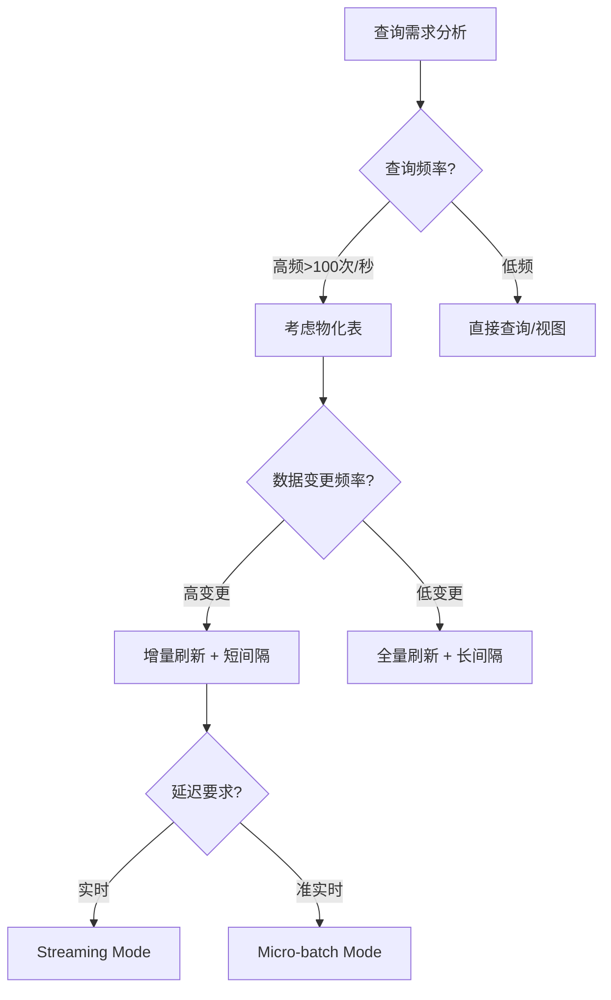
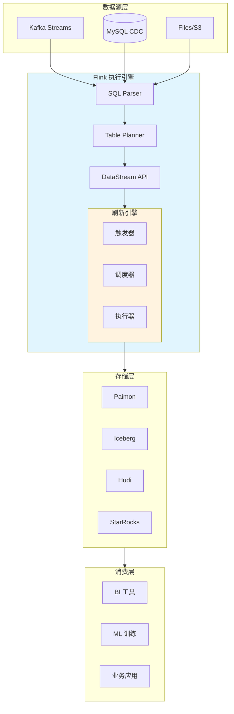
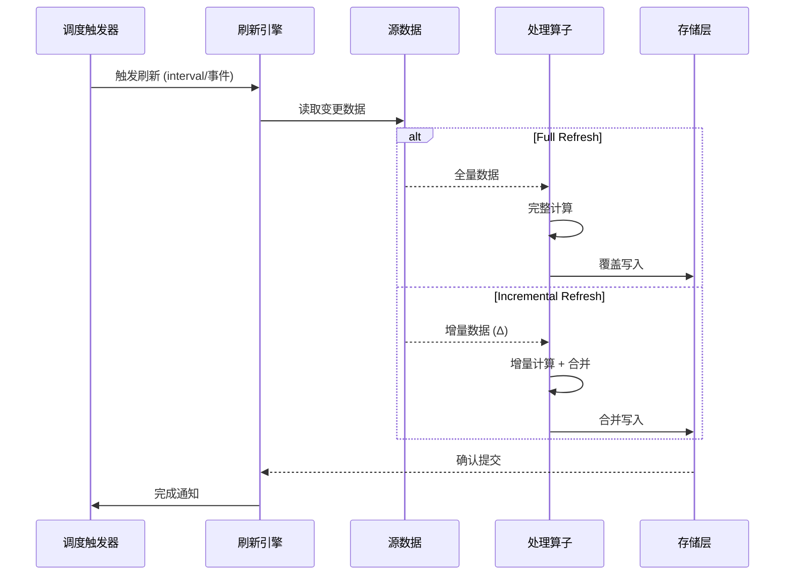
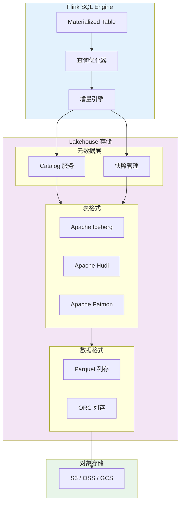

# Materialized Tables - Flink 2.0 的统一批流开发体验

> **所属阶段**: Flink | **前置依赖**: [Flink SQL 基础](./01-flink-sql-fundamentals.md), [Table API 架构](./02-table-api-architecture.md) | **形式化等级**: L3

## 1. 概念定义 (Definitions)

### Def-F-03-03: 物化表 (Materialized Table)

**定义**: 物化表是一种**预计算并持久化存储**的表结构，它在数据变更时自动刷新，为查询提供低延迟的读取性能。

形式化表述：
$$
MT = (S, Q, R, D, C)
$$

其中：

- $S$: Source 数据源集合
- $Q$: 物化查询（Materialized Query）
- $R$: 刷新模式（Refresh Mode）
- $D$: 存储描述符（Storage Descriptor）
- $C$: 一致性配置（Consistency Configuration）

```
┌─────────────────────────────────────────────────────────┐
│                    Materialized Table                    │
├─────────────────────────────────────────────────────────┤
│  Source → [Query] → [Materialized Result] → Storage     │
│            ↑                    ↓                       │
│         Refresh              Query Engine               │
│          Trigger                                         │
└─────────────────────────────────────────────────────────┘
```

### Def-F-03-04: 刷新模式 (Refresh Mode)

**定义**: 刷新模式定义了物化表如何与源数据同步的语义。

| 模式 | 语义 | 适用场景 |
|------|------|----------|
| **Full** | 重新执行完整查询，替换全部结果 | 数据量小、计算简单、源数据频繁变更 |
| **Incremental** | 仅处理变更增量，合并到现有结果 | 数据量大、变更局部、需要低延迟 |

形式化：
$$
Refresh(MT, t) = \begin{cases}
Q(S_t) & \text{if mode = Full} \\
\Delta^{-1}(Q(\Delta S)) \circ MT_{t-1} & \text{if mode = Incremental}
\end{cases}
$$

### Def-F-03-05: 调度策略 (Scheduling Policy)

**定义**: 调度策略控制物化表刷新作业的执行时机、资源分配和并发控制。

核心参数：

- **refresh-interval**: 定时触发间隔
- **refresh-trigger**: 触发条件（时间/事件/混合）
- **resource-allocation**: 资源配额（slot/memory）
- **max-concurrent-refresh**: 最大并发刷新数

### Def-F-03-06: 一致性级别 (Consistency Level)

**定义**: 物化表查询结果与源数据状态的一致性保证程度。

| 级别 | 定义 | 保证 |
|------|------|------|
| **强一致性** | 读取结果反映所有已提交的源数据变更 | 线性一致性 (Linearizability) |
| **最终一致性** | 在无新变更的情况下，结果最终收敛 | 无保证读取最新 |
| **会话一致性** | 同一会话内保证单调读 | 跨会话可能不一致 |

---

## 2. 属性推导 (Properties)

### Prop-F-03-01: 物化表与视图的语义差异

**命题**: 物化表是**存储**抽象，视图是**查询**抽象。

| 特性 | Materialized Table | View |
|------|-------------------|------|
| 数据存储 | 物理存储 | 虚拟，无存储 |
| 查询性能 | O(1) 读取 | O(n) 计算 |
| 数据新鲜度 | 取决于刷新策略 | 实时 |
| 资源消耗 | 存储+计算 | 仅计算 |
| 适用场景 | 频繁查询、大数据量 | 动态查询、数据探索 |

### Prop-F-03-02: 增量刷新的可推导性

**命题**: 当查询 $Q$ 满足**单调性**（Monotonicity）和**可逆性**（Invertibility）时，增量刷新可保证最终一致性。

证明概要：

1. 单调性确保新数据不会使旧结果失效
2. 可逆性确保 $\Delta^{-1}$ 操作存在
3. 结合可构成完整的增量更新流

### Prop-F-03-03: 调度延迟下界

**命题**: 在资源受限环境下，物化表刷新延迟 $L$ 满足：
$$
L \geq \max(T_{proc}, T_{sched})
$$
其中 $T_{proc}$ 为处理时间，$T_{sched}$ 为调度间隔。

---

## 3. 关系建立 (Relations)

### 3.1 与 DataStream API 的映射

物化表在 Flink 内部转换为标准的 DataStream 作业：

```
┌─────────────────────────────────────────────────────────────┐
│                    物化表 SQL 定义                           │
│  CREATE MATERIALIZED TABLE user_stats AS SELECT ...         │
└──────────────────────┬──────────────────────────────────────┘
                       │ Planner 转换
                       ↓
┌─────────────────────────────────────────────────────────────┐
│                Flink DataStream Job                          │
│  ┌─────────┐    ┌─────────┐    ┌─────────┐    ┌─────────┐  │
│  │ Source  │ →  │ Process │ →  │  Sink   │ →  │Storage  │  │
│  │ (Kafka) │    │ (Query) │    │(Refresh)│    │(Lake)   │  │
│  └─────────┘    └─────────┘    └─────────┘    └─────────┘  │
└─────────────────────────────────────────────────────────────┘
```

### 3.2 与 Lakehouse 格式的集成

```
┌─────────────────────────────────────────────────────────────┐
│              Flink Materialized Table                        │
├─────────────────────────────────────────────────────────────┤
│  ┌─────────────┐  ┌─────────────┐  ┌─────────────────────┐ │
│  │ Apache      │  │ Apache      │  │ Delta Lake /        │ │
│  │ Iceberg     │  │ Hudi        │  │ Apache Paimon       │ │
│  │ Connector   │  │ Connector   │  │ (Streaming Lake)    │ │
│  └──────┬──────┘  └──────┬──────┘  └──────────┬──────────┘ │
│         │                │                    │            │
│         └────────────────┴────────────────────┘            │
│                          │                                 │
│                    ┌─────┴─────┐                          │
│                    │ Object    │                          │
│                    │ Storage   │                          │
│                    │ (S3/OSS)  │                          │
│                    └───────────┘                          │
└─────────────────────────────────────────────────────────────┘
```

---

## 4. 论证过程 (Argumentation)

### 4.1 为什么选择物化表而非直接查询？

**场景分析**:

- 数据湖查询延迟：秒级 ~ 分钟级
- 物化表查询延迟：毫秒级

**权衡决策树**:



### 4.2 刷新模式选择矩阵

| 源数据规模 | 变更频率 | 推荐模式 | 理由 |
|-----------|---------|---------|------|
| 小 (<1GB) | 任意 | Full | 全量计算成本低 |
| 大 (>1TB) | 低 | Incremental | 避免全表扫描 |
| 大 (>1TB) | 高 | Incremental | 必需，Full 不可行 |
| 中 (1-100GB) | 中 | Incremental | 平衡成本与延迟 |

### 4.3 反例：不适合物化表的场景

1. **强实时性要求**: 需要毫秒级数据新鲜的场景（如高频交易）
2. **极高基数维度**: GROUP BY 字段基数过高导致状态爆炸
3. **非确定性查询**: 包含 RAND()、NOW() 等函数的查询

---

## 5. 工程论证 (Engineering Argument)

### 5.1 生产级物化表设计原则

**原则 1: 渐进式刷新策略**

```sql
-- 初始：保守策略
CREATE MATERIALIZED TABLE sales_summary
WITH (
  'refresh-interval' = '1h',
  'refresh-mode' = 'full'
)
AS SELECT * FROM sales;

-- 稳定后：优化为增量
ALTER MATERIALIZED TABLE sales_summary
SET (
  'refresh-mode' = 'incremental',
  'refresh-interval' = '15min'
);
```

**原则 2: 分层物化架构**

```
Raw Data → Bronze MT → Silver MT → Gold MT → BI/ML
     ↓          ↓           ↓          ↓
  原始数据   清洗数据    聚合数据   业务指标
  (Kafka)   (Parquet)  (Iceberg)  (StarRocks)
```

### 5.2 一致性级别的工程选择

| 业务场景 | 推荐级别 | 实现方式 |
|---------|---------|---------|
| 财务报表 | 强一致性 | 同步刷新 + 事务提交 |
| 实时大屏 | 最终一致性 | 异步刷新 + 低延迟优先 |
| 用户分析 | 会话一致性 | 版本控制 + 读时合并 |

---

## 6. 实例验证 (Examples)

### 6.1 基础物化表示例

```sql
-- 用户行为统计物化表
CREATE MATERIALIZED TABLE user_stats
WITH (
  'format' = 'parquet',
  'refresh-interval' = '1h',
  'refresh-mode' = 'incremental',
  'sink.parallelism' = '4'
)
AS SELECT
  user_id,
  COUNT(*) as event_count,
  MAX(event_time) as last_active
FROM events
GROUP BY user_id;
```

### 6.2 增量刷新配置

```sql
-- 电商订单实时统计（增量模式）
CREATE MATERIALIZED TABLE order_summary
WITH (
  'connector' = 'paimon',
  'path' = 's3://warehouse/order_summary',
  'format' = 'parquet',
  'refresh-mode' = 'incremental',
  'refresh-interval' = '5min',
  'changelog-producer' = 'input',
  'compaction.interval' = '1h'
)
AS SELECT
  DATE_FORMAT(order_time, 'yyyy-MM-dd') as order_date,
  region,
  COUNT(*) as order_count,
  SUM(amount) as total_amount
FROM orders
GROUP BY DATE_FORMAT(order_time, 'yyyy-MM-dd'), region;
```

### 6.3 与 Iceberg 集成

```sql
-- 使用 Iceberg 作为物化存储
CREATE MATERIALIZED TABLE iceberg_metrics
WITH (
  'connector' = 'iceberg',
  'catalog' = 'hive_catalog',
  'database' = 'analytics',
  'table' = 'metrics',
  'write.format.default' = 'parquet',
  'write.metadata.compression-codec' = 'gzip',
  'refresh-interval' = '30min'
)
AS SELECT
  service_name,
  metric_name,
  AVG(value) as avg_value,
  MAX(value) as max_value,
  window_start,
  window_end
FROM TABLE(TUMBLE(TABLE metrics_stream, DESCRIPTOR(event_time), INTERVAL '5' MINUTES))
GROUP BY service_name, metric_name, window_start, window_end;
```

### 6.4 DataStream 集成示例

```java
// 物化表转换为 DataStream 作业
StreamTableEnvironment tableEnv = StreamTableEnvironment.create(env);

// 注册物化表
tableEnv.executeSql("""
    CREATE MATERIALIZED TABLE page_view_stats
    WITH ('refresh-interval' = '10min')
    AS SELECT page_id, COUNT(*) FROM page_views GROUP BY page_id
""");

// 获取底层的 DataStream 进行自定义处理
DataStream<Row> materializedStream = tableEnv
    .toDataStream(tableEnv.from("page_view_stats"));

// 添加监控或二次处理
materializedStream
    .map(row -> {
        // 自定义监控逻辑
        MetricsCollector.record("mt.refresh", row);
        return row;
    })
    .sinkTo(customSink);
```

---

## 7. 可视化 (Visualizations)

### 7.1 物化表架构全景图



### 7.2 刷新流程时序图



### 7.3 Lakehouse 集成架构



---

## 8. 引用参考 (References)


---

## 附录: 快速参考卡

### 语法速查

```sql
-- 创建
CREATE MATERIALIZED TABLE <name>
WITH (<properties>)
AS <query>;

-- 暂停/恢复
ALTER MATERIALIZED TABLE <name> SUSPEND;
ALTER MATERIALIZED TABLE <name> RESUME;

-- 修改配置
ALTER MATERIALIZED TABLE <name> SET (<properties>);

-- 删除
DROP MATERIALIZED TABLE <name>;
```

### 常用配置参数

| 参数 | 默认值 | 说明 |
|------|--------|------|
| `refresh-mode` | `incremental` | 刷新模式: full/incremental |
| `refresh-interval` | `1h` | 刷新间隔 |
| `format` | `parquet` | 存储格式 |
| `sink.parallelism` | `-1` | 写入并行度 |
| `changelog-producer` | `none` | 变更日志生成策略 |
