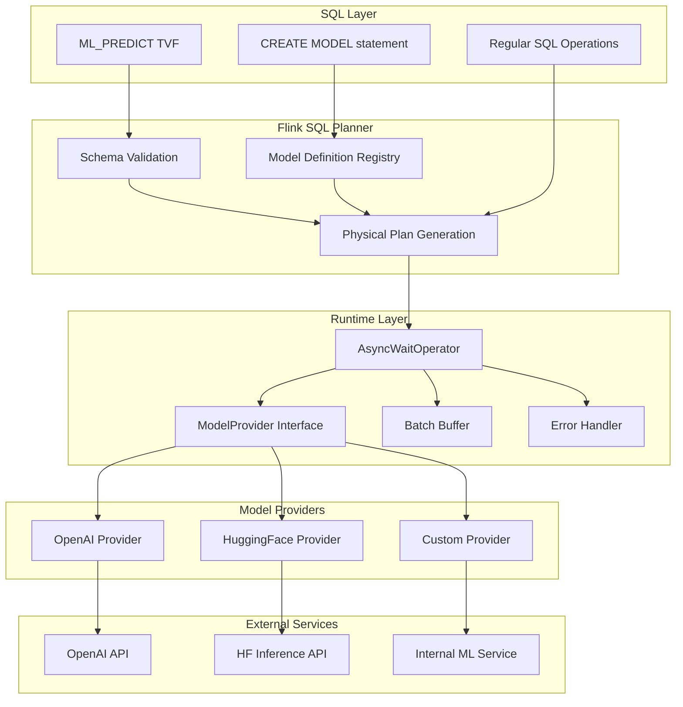
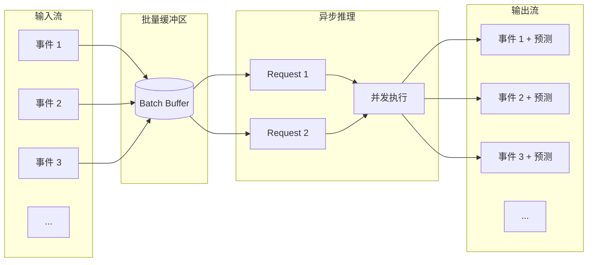
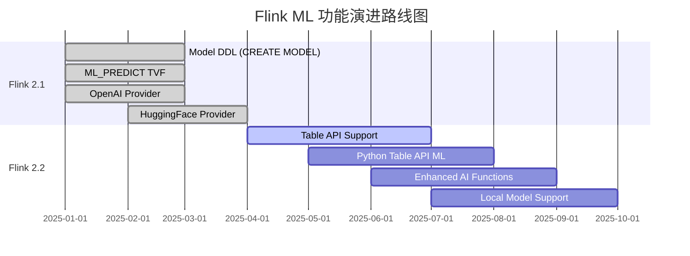
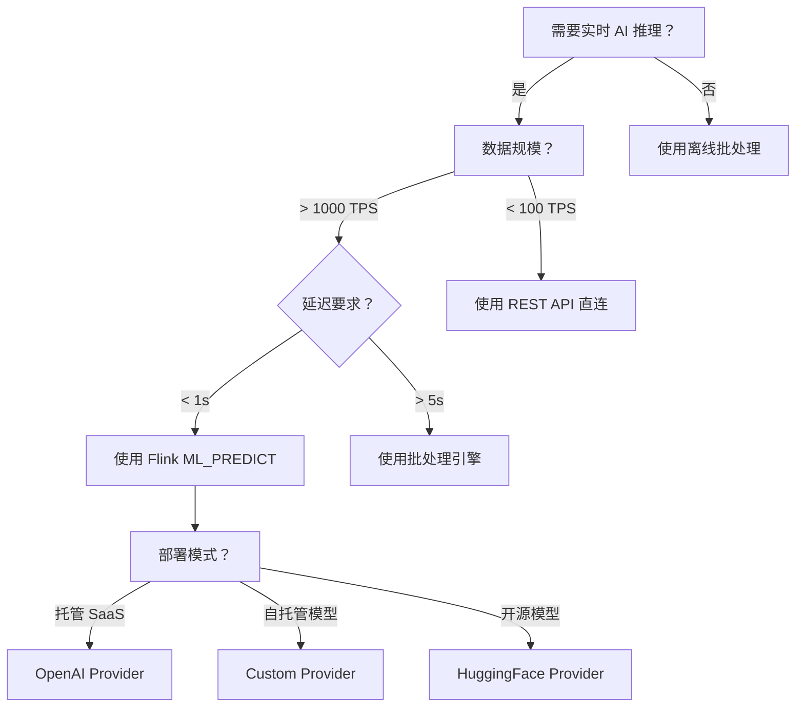

# Flink 2.1 Model DDL 与实时 AI 推理

> 所属阶段: Flink/ | 前置依赖: [02-execution-and-extension.md](./02-execution-and-extension.md) | 形式化等级: L3-L4

## 1. 概念定义 (Definitions)

### Def-F-03-15: Model DDL 语法

**Model DDL** 是 Flink SQL 的扩展语法，用于声明式地定义机器学习模型及其推理接口。

```sql
CREATE MODEL <model_name>
  [ WITH (
    'provider' = '<provider_type>',
    '<provider_key>' = '<provider_value>',
    ...
  ) ]
  [ INPUT ( <column_definition> [, ...] ) ]
  [ OUTPUT ( <column_definition> [, ...] ) ]
```

**语法要素说明：**

| 子句 | 必需性 | 语义 |
|------|--------|------|
| `CREATE MODEL` | 必需 | 声明模型定义语句 |
| `<model_name>` | 必需 | 模型在 catalog 中的唯一标识符 |
| `WITH` 子句 | 条件必需 | 模型提供者配置参数（内置 provider 可省略） |
| `INPUT` 子句 | 可选 | 定义模型输入 schema |
| `OUTPUT` 子句 | 可选 | 定义模型输出 schema |

**内置 Provider 类型：**

```
┌─────────────────┬─────────────────────────────────────────┐
│ Provider Type   │ Description                             │
├─────────────────┼─────────────────────────────────────────┤
│ 'openai'        │ OpenAI API 集成（GPT-4, GPT-3.5 等）    │
│ 'huggingface'   │ Hugging Face Inference API              │
│ 'custom'        │ 用户自定义模型提供者实现                │
└─────────────────┴─────────────────────────────────────────┘
```

---

### Def-F-03-16: ML_PREDICT 表值函数

**ML_PREDICT** 是 Flink SQL 的内置表值函数（Table-Valued Function, TVF），用于对 Model DDL 定义的模型执行实时推理。

**语法形式：**

```sql
-- 形式 1: 基本调用
SELECT * FROM ML_PREDICT(
  TABLE <input_table>,
  MODEL <model_name>,
  PASSING (<input_column_list>)
)

-- 形式 2: 带超时配置
SELECT * FROM ML_PREDICT(
  TABLE <input_table>,
  MODEL <model_name>,
  PASSING (<input_column_list>),
  TIMEOUT <timeout_interval>
)
```

**形式化语义：**

设输入表为 $T_{in}$，模型为 $M$，则 ML_PREDICT 定义了一个关系变换：

$$\text{ML_PREDICT}(T_{in}, M) = T_{in} \bowtie_{model\_inference} M(T_{in}.\text{input_cols})$$

其中 $\bowtie$ 表示左外连接语义：即使推理失败，输入行也会被保留。

**输出列结构：**

```
┌─────────────────────┬──────────────────────────────────────────┐
│ 列名                 │ 描述                                     │
├─────────────────────┼──────────────────────────────────────────┤
│ <input_columns>     │ 输入表的所有原始列（保持原 schema）      │
│ prediction          │ 模型推理结果（JSON 或结构化类型）        │
│ prediction_metadata │ 推理元数据（延迟、token 用量等）         │
│ prediction_error    │ 错误信息（推理失败时非 NULL）            │
└─────────────────────┴──────────────────────────────────────────┘
```

---

### Def-F-03-17: 模型提供者与自定义接口

**模型提供者（Model Provider）** 是 Flink 运行时与外部 ML 服务之间的桥接层。

**内置提供者架构：**

```
┌─────────────────────────────────────────────────────────────┐
│                     Model Provider Interface                │
├─────────────────────────────────────────────────────────────┤
│                                                             │
│  ┌─────────────┐    ┌─────────────┐    ┌─────────────┐     │
│  │   OpenAI    │    │ HuggingFace │    │   Custom    │     │
│  │  Provider   │    │  Provider   │    │  Provider   │     │
│  └──────┬──────┘    └──────┬──────┘    └──────┬──────┘     │
│         │                  │                  │            │
│         └──────────────────┼──────────────────┘            │
│                            ▼                                │
│              ┌─────────────────────────┐                    │
│              │  ModelInferenceClient   │                    │
│              │  - infer(batch)         │                    │
│              │  - getSchema()          │                    │
│              │  - validateConfig()     │                    │
│              └─────────────────────────┘                    │
└─────────────────────────────────────────────────────────────┘
```

**自定义提供者接口（Java）：**

```java
public interface ModelProviderFactory {
    String getProviderType();
    ModelProvider createProvider(Map<String, String> config);
}

public interface ModelProvider {
    // 初始化模型连接
    void open(Configuration config);
    
    // 批量推理（Flink 自动批处理）
    List<RowData> inferBatch(List<RowData> inputs);
    
    // 获取输入/输出 schema
    ResolvedSchema getInputSchema();
    ResolvedSchema getOutputSchema();
    
    // 关闭资源
    void close();
}
```

---

### Def-F-03-18: 实时推理管道

**实时推理管道（Real-time Inference Pipeline）** 是 Flink 中将流数据处理与 ML 推理集成的完整数据流。

**管道拓扑：**

```
┌─────────────┐    ┌──────────────┐    ┌─────────────────┐    ┌─────────────┐
│  Source     │───▶│  Preprocess  │───▶│  AsyncWait      │───▶│  Sink       │
│  (Kafka)    │    │  (SQL/Table) │    │  + ML_PREDICT   │    │  (Kafka)    │
└─────────────┘    └──────────────┘    └─────────────────┘    └─────────────┘
                                              │
                                              ▼
                                       ┌─────────────┐
                                       │ Model       │
                                       │ Provider    │
                                       │ (REST API)  │
                                       └─────────────┘
```

**关键特性：**

| 特性 | 实现机制 | 配置参数 |
|------|----------|----------|
| 异步推理 | AsyncFunction 模式 | `inference.async.timeout` |
| 批量请求 | 自动微批聚合 | `inference.batch.size`, `inference.batch.timeout` |
| 错误处理 | SideOutput + 默认值 | `inference.error.handling` |
| 背压控制 | 动态并发度调整 | `inference.max.concurrent.requests` |

---

## 2. 属性推导 (Properties)

### Prop-F-03-04: ML_PREDICT 的惰性求值性质

**命题：** ML_PREDICT 采用惰性求值策略，仅在实际消费时触发推理请求。

**证明概要：**

1. 设查询计划节点 $N_{predict}$ 为 ML_PREDICT TVF 对应的逻辑节点
2. Flink SQL 优化器将 $N_{predict}$ 转换为物理算子 $P_{async}$
3. $P_{async}$ 继承 AsyncWaitOperator 行为，仅在 `processElement` 被调用时触发 `asyncInvoke`
4. 下游算子反压时，`ResultFuture` 保持未满足状态，推理请求不会发出

$$\text{惰性求值} \iff \forall e \in \text{input}, \text{request}(e) \text{ only when } \neg\text{backpressure}$$

---

### Prop-F-03-05: 批量推理的聚合边界

**命题：** 在批量推理模式下，Flink 保证批次大小 $B$ 满足 $1 \leq |B| \leq B_{max}$，且批次超时 $T_{batch}$ 内必定触发。

**引理-F-03-03:** 批量缓冲区的单调性

设缓冲区 $buf(t)$ 为时间 $t$ 时的待推理记录集合，则：

$$\frac{d|buf|}{dt} \geq 0 \quad \text{(仅当批次触发时重置为 0)}$$

---

### Prop-F-03-06: Schema 兼容性验证

**命题：** 在查询编译期，Flink 验证 ML_PREDICT 的输入 schema 与 MODEL 定义的 INPUT schema 之间的兼容性。

**验证规则：**

```
相容性(INPUT_model, PASSING_actual) = 
    ∀col ∈ INPUT_model, ∃col' ∈ PASSING_actual :
        col.name = col'.name ∧ 
        col.type ⊑ col'.type  (子类型关系)
```

---

## 3. 关系建立 (Relations)

### 与 DataStream API 的关系

**映射：** SQL ML_PREDICT ↔ DataStream AsyncFunction

```
┌─────────────────────────────────────────────────────────────┐
│                    抽象层级映射                              │
├─────────────────────────────────────────────────────────────┤
│                                                             │
│  SQL Layer:                  DataStream Layer:              │
│  ┌─────────────────┐         ┌─────────────────────────┐    │
│  │ CREATE MODEL    │────────▶│ ModelInferenceConfig    │    │
│  └─────────────────┘         └─────────────────────────┘    │
│                                                             │
│  ┌─────────────────┐         ┌─────────────────────────┐    │
│  │ ML_PREDICT TVF  │────────▶│ AsyncWaitOperator       │    │
│  └─────────────────┘         │ + ModelInferenceFunction│    │
│                              └─────────────────────────┘    │
│                                                             │
└─────────────────────────────────────────────────────────────┘
```

**DataStream 等效代码：**

```java
// SQL: SELECT * FROM ML_PREDICT(TABLE events, MODEL gpt4, PASSING (message))

DataStream<Row> result = events
    .map(new PreprocessMapFunction())
    .keyBy(row -> row.getField("user_id"))
    .process(new KeyedProcessFunction<..., Row, Row>() {
        private transient ModelInferenceClient client;
        
        @Override
        public void open(Configuration parameters) {
            client = ModelProviderRegistry
                .getProvider("openai")
                .createClient(config);
        }
        
        @Override
        public void processElement(Row input, Context ctx, Collector<Row> out) {
            // 异步调用
            client.inferAsync(input)
                .thenAccept(result -> out.collect(Row.join(input, result)));
        }
    });
```

---

### 与 Table API 的关系

**等价转换：**

| Table API (Java/Scala) | SQL |
|------------------------|-----|
| `table.mlPredict("modelName", "col1, col2")` | `ML_PREDICT(TABLE t, MODEL modelName, PASSING (col1, col2))` |
| `table.mlPredict(ModelDescriptor)` | `WITH` 配置的复杂 MODEL |

---

## 4. 论证过程 (Argumentation)

### 4.1 为什么选择 TVF 而非 UDF

**设计决策对比：**

| 方案 | 优点 | 缺点 |
|------|------|------|
| **TVF (选定)** | 自然返回多列；支持异步；流批统一 | 语法稍复杂 |
| Scalar UDF | 简单直观 | 无法返回结构化数据；同步阻塞 |
| Table UDF | 可返回多行 | 语义不匹配（1 输入对 1 输出） |

**TVF 的正确性论证：**

ML 推理本质上是表到表的变换（增加预测列），而非逐行标量计算。TVF 的语义恰好描述这种关系变换：

$$\text{TVF}: \text{Table} \rightarrow \text{Table}$$

---

### 4.2 异步推理的必要性

**同步推理的延迟问题：**

设外部 API 平均延迟为 $L_{api}$，吞吐量为 $T$：

$$T_{sync} = \frac{1}{L_{api}} \quad \text{(records/second)}$$

当 $L_{api} = 500\text{ms}$ 时，$T_{sync} = 2$ rps，无法接受。

**异步并发模型：**

$$T_{async} = \frac{C_{max}}{L_{api}} \quad \text{其中 } C_{max} \text{ 为最大并发请求数}$$

当 $C_{max} = 100$ 时，$T_{async} = 200$ rps。

---

### 4.3 批量推理 vs 逐行推理

**成本分析（以 OpenAI API 为例）：**

| 模式 | 单次请求成本 | 总请求数/1M 条 | 总成本 |
|------|-------------|----------------|--------|
| 逐行 | $0.002$ | 1,000,000 | $2000$ |
| 批量(100) | $0.002$ | 10,000 | $20$ |

**延迟-吞吐量权衡：**

```
吞吐量 ↑
       │
       │     ╱ 批量模式
       │    ╱
       │   ╱
       │  ╱ 逐行模式
       │ ╱
       └──────────────▶ 延迟
```

---

## 5. 工程论证 (Engineering Argument)

### 5.1 Model DDL 的声明式优势

**论证：** Model DDL 将模型配置与业务逻辑解耦，带来以下工程收益：

1. **关注点分离：** 数据工程师关注 SQL 查询，ML 工程师关注模型配置
2. **环境可移植：** 不同环境（dev/staging/prod）使用相同的 MODEL 名称，不同的 `WITH` 配置
3. **版本管理：** 模型定义可纳入版本控制，支持 A/B 测试

---

### 5.2 与 LangChain/LlamaIndex 的对比

| 维度 | Flink ML_PREDICT | LangChain | LlamaIndex |
|------|------------------|-----------|------------|
| 数据规模 | 无限（分布式流批） | 单进程 | 单进程 |
| 延迟要求 | 亚秒级实时 | 交互式 | 交互式 |
| 与数据管道集成 | 原生 SQL | 需要桥接 | 需要桥接 |
| 容错保障 | Checkpoint 精确一次 | 应用层处理 | 应用层处理 |

**Flink 的适用场景：**
- 大规模实时日志分类
- 流式内容审核
- 实时推荐特征生成

---

### 5.3 错误处理策略

**分级错误处理：**

```
Level 1: API 超时
  └── 策略: 重试 3 次，指数退避
  
Level 2: 速率限制 (429)
  └── 策略: 动态背压，降低并发度
  
Level 3: 模型错误 (5xx)
  └── 策略: 发送到 Side Output，人工审查
  
Level 4: Schema 不匹配
  └── 策略: 编译期报错，拒绝提交
```

---

## 6. 实例验证 (Examples)

### 6.1 实时日志分类（OpenAI 集成）

**场景：** 对用户行为日志进行实时分类，识别异常模式。

```sql
-- 步骤 1: 创建 OpenAI 模型定义
CREATE MODEL log_classifier
WITH (
  'provider' = 'openai',
  'openai.model' = 'gpt-4o-mini',
  'openai.api_key' = '${OPENAI_API_KEY}',
  'openai.temperature' = '0.1',
  'openai.timeout' = '30s'
)
INPUT (
  log_message STRING
)
OUTPUT (
  category STRING,
  confidence DOUBLE,
  reasoning STRING
);

-- 步骤 2: 创建源表
CREATE TABLE user_logs (
  user_id STRING,
  log_time TIMESTAMP(3),
  log_message STRING,
  ip_address STRING,
  WATERMARK FOR log_time AS log_time - INTERVAL '5' SECOND
) WITH (
  'connector' = 'kafka',
  'topic' = 'user-logs',
  'properties.bootstrap.servers' = 'kafka:9092',
  'format' = 'json'
);

-- 步骤 3: 使用 ML_PREDICT 进行实时分类
CREATE TABLE classified_logs AS
SELECT 
  user_id,
  log_time,
  log_message,
  ip_address,
  prediction.category AS log_category,
  prediction.confidence AS confidence_score,
  prediction.reasoning AS classification_reason
FROM ML_PREDICT(
  TABLE user_logs,
  MODEL log_classifier,
  PASSING (log_message)
);

-- 步骤 4: 过滤高风险日志到告警主题
CREATE TABLE security_alerts (
  user_id STRING,
  alert_type STRING,
  risk_score DOUBLE,
  details STRING
) WITH (
  'connector' = 'kafka',
  'topic' = 'security-alerts',
  'format' = 'json'
);

INSERT INTO security_alerts
SELECT 
  user_id,
  log_category AS alert_type,
  confidence_score AS risk_score,
  classification_reason AS details
FROM classified_logs
WHERE log_category IN ('SUSPICIOUS_LOGIN', 'DATA_EXFILTRATION', 'PRIVILEGE_ESCALATION')
  AND confidence_score > 0.8;
```

---

### 6.2 实时问答系统

**场景：** 基于知识库的实时问答，结合 RAG 模式。

```sql
-- 步骤 1: 创建嵌入模型（用于文档向量化）
CREATE MODEL text_embedder
WITH (
  'provider' = 'openai',
  'openai.model' = 'text-embedding-3-small'
)
INPUT (text STRING)
OUTPUT (embedding ARRAY<FLOAT>);

-- 步骤 2: 创建 LLM 模型
CREATE MODEL qa_model
WITH (
  'provider' = 'openai',
  'openai.model' = 'gpt-4-turbo'
)
INPUT (question STRING, context STRING)
OUTPUT (answer STRING, sources ARRAY<STRING>);

-- 步骤 3: 用户问题流
CREATE TABLE user_questions (
  question_id STRING,
  user_id STRING,
  question_text STRING,
  question_time TIMESTAMP(3)
) WITH ('connector' = 'kafka', ...);

-- 步骤 4: 向量化问题并检索相关文档
CREATE VIEW question_with_context AS
SELECT 
  q.question_id,
  q.user_id,
  q.question_text,
  e.prediction.embedding AS question_embedding
FROM user_questions q
JOIN ML_PREDICT(
  TABLE (SELECT question_text FROM user_questions),
  MODEL text_embedder,
  PASSING (question_text)
) e ON TRUE;

-- 步骤 5: 执行问答（简化示例，实际需要向量检索 JOIN）
CREATE TABLE qa_results AS
SELECT 
  question_id,
  user_id,
  question_text,
  prediction.answer AS answer,
  prediction.sources AS reference_sources
FROM ML_PREDICT(
  TABLE question_with_context,
  MODEL qa_model,
  PASSING (question_text, 'Retrieved context from vector store...')
);
```

---

### 6.3 自定义模型提供者实现

**场景：** 集成内部部署的 ML 服务。

```java
// 步骤 1: 实现 ModelProviderFactory
public class InternalMLProviderFactory implements ModelProviderFactory {
    @Override
    public String getProviderType() {
        return "internal-ml";
    }
    
    @Override
    public ModelProvider createProvider(Map<String, String> config) {
        return new InternalMLProvider(config);
    }
}

// 步骤 2: 实现 ModelProvider
public class InternalMLProvider implements ModelProvider {
    private HttpClient httpClient;
    private String endpoint;
    private ObjectMapper mapper;
    
    @Override
    public void open(Configuration config) {
        this.httpClient = HttpClient.newBuilder()
            .connectTimeout(Duration.ofSeconds(10))
            .build();
        this.endpoint = config.getString("internal.endpoint");
        this.mapper = new ObjectMapper();
    }
    
    @Override
    public List<RowData> inferBatch(List<RowData> inputs) {
        // 构建批量请求
        BatchRequest request = new BatchRequest(
            inputs.stream()
                .map(row -> row.getString(0))
                .collect(Collectors.toList())
        );
        
        // 发送 HTTP 请求
        HttpRequest httpRequest = HttpRequest.newBuilder()
            .uri(URI.create(endpoint + "/batch-infer"))
            .header("Content-Type", "application/json")
            .POST(HttpRequest.BodyPublishers.ofString(
                mapper.writeValueAsString(request)
            ))
            .build();
            
        HttpResponse<String> response = httpClient.send(
            httpRequest, HttpResponse.BodyHandlers.ofString()
        );
        
        // 解析响应
        BatchResponse batchResponse = mapper.readValue(
            response.body(), BatchResponse.class
        );
        
        // 转换为 RowData
        return batchResponse.getResults().stream()
            .map(result -> GenericRowData.of(
                StringData.fromString(result.getLabel()),
                result.getConfidence()
            ))
            .collect(Collectors.toList());
    }
    
    @Override
    public ResolvedSchema getInputSchema() {
        return ResolvedSchema.of(
            Column.physical("input_text", DataTypes.STRING())
        );
    }
    
    @Override
    public ResolvedSchema getOutputSchema() {
        return ResolvedSchema.of(
            Column.physical("prediction", DataTypes.STRING()),
            Column.physical("confidence", DataTypes.DOUBLE())
        );
    }
    
    @Override
    public void close() {
        // 清理资源
    }
}

// 步骤 3: 注册提供者（通过 SPI）
// META-INF/services/org.apache.flink.ml.provider.ModelProviderFactory
// 内容: com.example.InternalMLProviderFactory
```

**SQL 使用：**

```sql
CREATE MODEL internal_classifier
WITH (
  'provider' = 'internal-ml',
  'internal.endpoint' = 'http://ml-service:8080'
);

SELECT * FROM ML_PREDICT(
  TABLE events,
  MODEL internal_classifier,
  PASSING (event_description)
);
```

---

## 7. 可视化 (Visualizations)

### 7.1 Model DDL 与 ML_PREDICT 架构图

以下图表展示了 Flink 2.1 AI 集成的整体架构：



### 7.2 实时推理管道数据流



### 7.3 Flink ML 演进路线图



### 7.4 决策树：选择合适的 AI 集成方案



---

## 8. 引用参考 (References)

[^1]: Apache Flink 2.1 Release Notes, "Model DDL and ML_PREDICT Support", 2025. https://nightlies.apache.org/flink/flink-docs-release-2.1/release-notes/flink-2.1/

[^2]: Apache Flink FLIP-375: "Model DDL for ML Inference in Flink SQL", 2024. https://cwiki.apache.org/confluence/display/FLINK/FLIP-375

[^3]: OpenAI API Documentation, "Batch API", 2025. https://platform.openai.com/docs/guides/batch

[^4]: Hugging Face Inference API Documentation, 2025. https://huggingface.co/docs/api-inference/index

[^5]: Apache Flink JIRA, FLINK-37548: "Implement ML_PREDICT table-valued function", https://issues.apache.org/jira/browse/FLINK-37548

[^6]: Apache Flink JIRA, FLINK-34992: "Add Model DDL syntax support", https://issues.apache.org/jira/browse/FLINK-34992

[^7]: Apache Flink 2.2 Roadmap, "Enhanced ML Integration", 2025. https://cwiki.apache.org/confluence/display/FLINK/2.2+Release

[^8]: Akidau et al., "The Dataflow Model: A Practical Approach to Balancing Correctness, Latency, and Cost in Massive-Scale, Unbounded, Out-of-Order Data Processing", PVLDB, 8(12), 2015.

---

> **状态**: Flink 2.1 核心功能已发布 | **更新日期**: 2025-04
