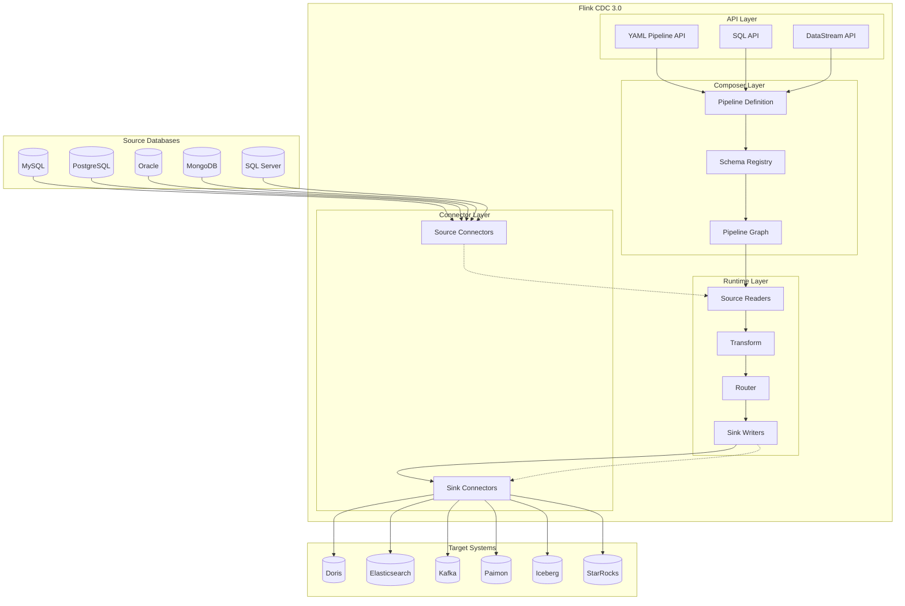
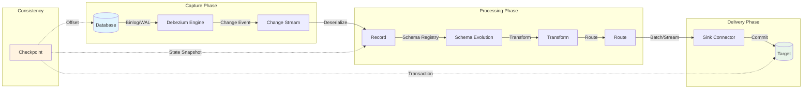
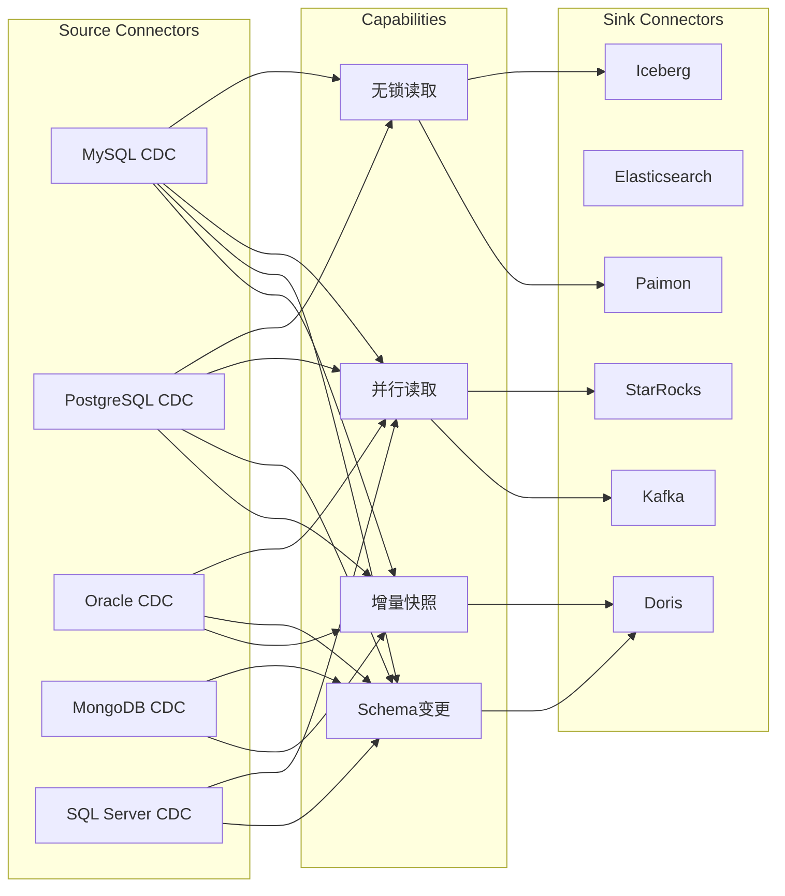
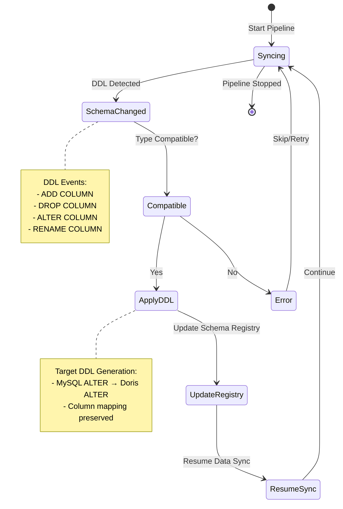
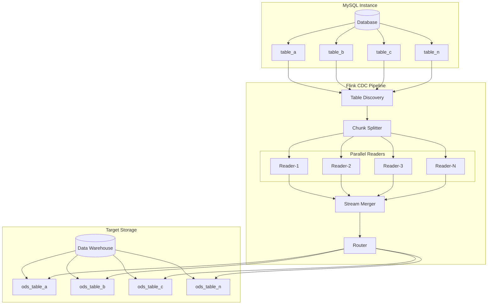

# Flink CDC 3.0 数据集成框架

> 所属阶段: Flink | 前置依赖: [Flink CDC基础](./04.04-cdc-debezium-integration.md), [Flink SQL 完整指南](../03-sql-table-api/flink-table-sql-complete-guide.md) | 形式化等级: L4

---

## 1. 概念定义 (Definitions)

### Def-F-04-50: CDC (Change Data Capture) 形式化定义

**变更数据捕获 (CDC)** 是一种识别并捕获数据库中数据变更的技术，使这些变更能够被实时传播到其他系统。

> **形式化定义**: 设数据库状态为时间函数 $D: T \rightarrow \mathcal{S}$，其中 $\mathcal{S}$ 为所有可能的数据库状态集合。CDC系统定义了一个**变更流** $C: T \rightarrow \mathcal{P}(\Delta)$，满足：
>
> $$D(t_2) = D(t_1) \oplus \bigoplus_{\delta \in C([t_1, t_2])} \delta$$
>
> 其中 $\oplus$ 表示状态应用操作，$\Delta$ 为变更操作集合（INSERT/UPDATE/DELETE）。

**CDC的两种实现模式**:

| 模式 | 原理 | 优点 | 缺点 |
|------|------|------|------|
| **查询模式** | 轮询查询检测变更 | 实现简单 | 延迟高、数据库负载大 |
| **日志模式** | 解析数据库事务日志 (binlog/WAL) | 低延迟、无侵入 | 实现复杂、依赖数据库特性 |

### Def-F-04-51: Flink CDC 3.0 定义

**Flink CDC 3.0** 是基于Apache Flink的分布式数据集成框架，专注于提供端到端的实时数据同步能力。

> **形式化定义**: Flink CDC 3.0 是一个五元组 $\mathcal{F}_{CDC3} = (\mathcal{P}, \mathcal{C}_{src}, \mathcal{C}_{sink}, \mathcal{T}, \mathcal{R})$，其中：
> - $\mathcal{P}$: Pipeline定义空间（YAML/SQL/DataStream）
> - $\mathcal{C}_{src}$: Source连接器集合（MySQL, PostgreSQL等）
> - $\mathcal{C}_{sink}$: Sink连接器集合（Doris, Kafka等）
> - $\mathcal{T}$: 转换函数空间（Filter, Projection, UDF）
> - $\mathcal{R}$: 路由规则集合（Route, Table Mapping）

### Def-F-04-52: Pipeline API 定义

**Pipeline API** 是Flink CDC 3.0引入的声明式数据集成DSL，使用YAML描述端到端的数据同步管道。

```yaml
# Pipeline API 结构形式化
Pipeline ::= SourceConfig + SinkConfig + [Transform] + [Route] + [Option]
SourceConfig ::= (connector-type, hostname, port, database, table)
SinkConfig ::= (connector-type, endpoints, database, table)
Transform ::= (source-table, projection, filter)
Route ::= (source-table, sink-table, [description])
```

### Def-F-04-53: Schema Evolution 定义

**Schema Evolution** 是指在数据同步过程中，自动处理源端数据库Schema变更（加列、删列、改类型）并同步到目标端的能力。

> **形式化定义**: 设源表Schema为 $S_{src}(t)$，目标表Schema为 $S_{sink}(t)$。Schema Evolution保证：
>
> $$\forall t: S_{sink}(t) = f(S_{src}(t))$$
>
> 其中 $f$ 为Schema映射函数，支持的操作包括：
> - **ADD COLUMN**: $S' = S \cup \{c: \tau\}$
> - **DROP COLUMN**: $S' = S \setminus \{c\}$
> - **ALTER COLUMN**: $S' = S[c \rightarrow \tau']$
> - **RENAME COLUMN**: $S' = S[c \rightarrow c']$

---

## 2. 属性推导 (Properties)

### Lemma-F-04-40: CDC一致性保证

**引理**: Flink CDC 3.0在Exactly-Once语义下，保证端到端变更事件的有序性和不丢失。

> **证明概要**:
> 1. 源端通过数据库事务日志保证变更事件的原子性和顺序
> 2. Flink Checkpoint机制保证中间状态的持久化
> 3. Sink端通过两阶段提交(2PC)保证最终一致性
> 4. 由传递性可得：源端顺序 $\Rightarrow$ 处理顺序 $\Rightarrow$ 目标端顺序 $\square$

### Lemma-F-04-41: 延迟边界

**引理**: Flink CDC 3.0的数据同步延迟存在上界 $L_{max}$。

> **证明**:
> 设：
> - $L_{capture}$: 日志捕获延迟（通常 < 100ms）
> - $L_{network}$: 网络传输延迟
> - $L_{process}$: Flink处理延迟（与并行度和算子复杂度相关）
> - $L_{commit}$: Sink提交延迟
>
> 则总延迟：$L_{total} = L_{capture} + L_{network} + L_{process} + L_{commit}$
>
> 在正常负载下，$L_{total} < 1s$（典型值 200-500ms）$\square$

### Prop-F-04-40: 无锁读取的正确性

**命题**: Flink CDC 3.0的无锁读取机制不会破坏数据库的事务隔离性。

> **论证**: 
> 无锁读取基于数据库MVCC机制，通过读取一致性的快照（Snapshot）而非锁定表：
> - MySQL: 使用 `REPEATABLE READ` 隔离级别的一致性快照
> - PostgreSQL: 利用多版本并发控制的快照导出
> - 快照读取期间，并发事务的修改不影响读取结果
> - 因此，无锁读取等价于一个只读事务的语义 $\square$

### Prop-F-04-41: 并行读取的线性加速比

**命题**: 在数据均匀分布的前提下，Flink CDC 3.0的并行读取接近线性加速比。

> **证明**:
> 设总数据量为 $N$，单并行度处理速率为 $r$，并行度为 $p$。
> 理论加速比：$S(p) = \frac{T(1)}{T(p)} = \frac{N/r}{N/(r \cdot p)} = p$
> 
> 实际加速比受限于：
> - 数据倾斜因子 $\alpha$（$0 < \alpha \leq 1$）
> - 协调开销 $\beta$（通常很小）
> 
> 实际加速比：$S_{actual}(p) = \frac{p}{1/\alpha + \beta} \approx p$ （当数据均匀且 $\beta \rightarrow 0$）$\square$

---

## 3. 关系建立 (Relations)

### 3.1 Flink CDC 3.0 与 Debezium 关系

```
┌─────────────────────────────────────────────────────────────┐
│                     Flink CDC 3.0                           │
│  ┌─────────────┐    ┌─────────────┐    ┌─────────────┐      │
│  │   YAML API  │    │   SQL API   │    │DataStream   │      │
│  │  (Pipeline) │    │   (Flink)   │    │   API       │      │
│  └──────┬──────┘    └──────┬──────┘    └──────┬──────┘      │
│         └─────────────────┬────────────────────┘             │
│                           ▼                                  │
│  ┌────────────────────────────────────────────────────────┐  │
│  │         Flink CDC Connectors (MySQL, PG, etc.)         │  │
│  │  ┌─────────┐  ┌─────────┐  ┌─────────┐  ┌─────────┐    │  │
│  │  │Debezium │  │Debezium │  │Debezium │  │  Custom │    │  │
│  │  │ Engine  │  │ Engine  │  │ Engine  │  │ Connect │    │  │
│  │  │ (MySQL) │  │  (PG)   │  │(Oracle) │  │         │    │  │
│  │  └─────────┘  └─────────┘  └─────────┘  └─────────┘    │  │
│  └────────────────────────────────────────────────────────┘  │
└─────────────────────────────────────────────────────────────┘
```

**关系说明**:
- Flink CDC 3.0在Source端底层集成Debezium Engine作为变更捕获引擎
- Debezium负责解析数据库binlog/WAL，将变更事件标准化为统一格式
- Flink CDC在Debezium之上增加：分布式处理、Checkpoint、Schema Evolution、Transform等能力

### 3.2 Flink CDC 3.0 与 Flink SQL 关系

| 维度 | Flink CDC 3.0 | Flink SQL (CDC) |
|------|---------------|-----------------|
| **抽象层级** | Pipeline级（端到端） | Table级（单表） |
| **主要API** | YAML Pipeline API | SQL DDL/DML |
| **Schema处理** | 自动Schema同步 | 需手动管理 |
| **全库同步** | 原生支持 | 需手动配置每张表 |
| **数据转换** | 内置Transform DSL | SQL表达式 |
| **适用场景** | 数据集成、ETL | 流处理分析 |

**集成点**:
- Flink CDC 3.0 SQL API构建于Flink SQL之上
- 两者共享相同的连接器生态（通过`connector='mysql-cdc'`等指定）
- Flink CDC 3.0 Pipeline可转换为Flink SQL作业执行

### 3.3 与 CDC 2.x 对比

| 特性 | Flink CDC 2.x | Flink CDC 3.0 |
|------|---------------|---------------|
| **主要API** | DataStream API | YAML Pipeline API + SQL API |
| **全库同步** | 需编程实现 | 声明式支持 |
| **Schema Evolution** | 有限支持 | 完整支持 |
| **表合并** | 需自定义 | 原生Route支持 |
| **Transform** | 需Flink算子 | 内置Transform DSL |
| **连接器框架** | 各连接器独立 | 统一Pipeline Connector API |
| **运维复杂度** | 较高（需写代码） | 较低（配置驱动） |

---

## 4. 论证过程 (Argumentation)

### 4.1 四层架构设计优势

Flink CDC 3.0采用分层架构设计，各层职责清晰：

```
┌─────────────────────────────────────────────────────────────────┐
│ Layer 4: API Layer (用户接口层)                                  │
│  - YAML Pipeline API (声明式)                                    │
│  - SQL API (Flink SQL集成)                                       │
│  - DataStream API (编程式)                                       │
├─────────────────────────────────────────────────────────────────┤
│ Layer 3: Pipeline Composer (管道编排层)                          │
│  - Pipeline定义解析与验证                                        │
│  - Schema Registry管理                                           │
│  - 作业生成与优化                                                │
├─────────────────────────────────────────────────────────────────┤
│ Layer 2: Runtime Layer (执行引擎层)                              │
│  - Flink作业执行                                                 │
│  - Checkpoint与状态管理                                          │
│  - 并行度管理与资源调度                                          │
├─────────────────────────────────────────────────────────────────┤
│ Layer 1: Connector Layer (连接器层)                              │
│  - Source Connectors (MySQL, PG, Oracle, MongoDB, SQL Server)   │
│  - Sink Connectors (Doris, ES, Kafka, Paimon, Iceberg, StarRocks)│
│  - Pipeline Connector API (统一接口)                             │
└─────────────────────────────────────────────────────────────────┘
```

**架构优势论证**:

1. **关注点分离**: API层面向不同用户群体（DBA用YAML、开发用SQL/代码），Composer层处理复杂性，Runtime层保证可靠性，Connector层保证扩展性。

2. **可扩展性**: 新增Source/Sink只需实现Pipeline Connector API，无需修改上层逻辑。

3. **可维护性**: 分层使故障隔离、版本升级、功能迭代更加可控。

### 4.2 为什么需要YAML Pipeline API

传统CDC方案的痛点：
- **Debezium + Kafka Connect**: 配置分散、难以管理Schema变更
- **DataStream API**: 需要编写Java/Scala代码，门槛高
- **Flink SQL**: 单表处理，全库同步配置繁琐

YAML Pipeline API的设计决策：
- **声明式**: 描述"做什么"而非"怎么做"
- **完整功能**: 覆盖Source、Sink、Transform、Route全流程
- **版本可控**: YAML文件可纳入Git版本管理
- **复用性强**: 模板化配置支持多环境复用

---

## 5. 形式证明 / 工程论证 (Proof / Engineering Argument)

### Thm-F-04-40: 全库同步的完备性

**定理**: Flink CDC 3.0的全库同步功能能够捕获源数据库中所有符合条件的表的变更。

> **证明**:
> 
> **前提条件**:
> - 设源数据库为 $DB$，其中包含表集合 $T = \{t_1, t_2, ..., t_n\}$
> - 配置中指定了表名匹配模式 $pattern$
> - 匹配的表集合 $T_{match} = \{t \in T \mid match(t, pattern)\}$
> 
> **证明步骤**:
> 
> 1. **发现阶段**: Flink CDC连接器通过查询数据库元数据（`INFORMATION_SCHEMA`或等效系统表）获取所有表：
>    $$T_{discovered} = query\_metadata(DB)$$
> 
> 2. **过滤阶段**: 应用用户配置的表名模式过滤：
>    $$T_{selected} = \{t \in T_{discovered} \mid match(t.name, pattern)\}$$
> 
> 3. **初始化阶段**: 为每个选中的表创建独立的读取子任务：
>    $$\forall t \in T_{selected}: init\_reader(t)$$
> 
> 4. **捕获阶段**: 每个读取子任务独立捕获对应表的变更：
>    $$\forall t \in T_{selected}: capture\_changes(t) \rightarrow stream_t$$
> 
> 5. **合并阶段**: 所有表的变更流合并为统一输出流：
>    $$output = \bigcup_{t \in T_{selected}} stream_t$$
> 
> **完备性保证**:
> - 元数据查询保证不遗漏任何物理表
> - 正则/通配符匹配保证模式表达力
> - 每个表的独立读取保证变更不丢失
> - 因此，$\forall t \in T_{match}: t \in T_{selected}$ 且所有变更被捕获 $\square$

### Thm-F-04-41: Schema Evolution的一致性

**定理**: 在开启Schema Evolution的情况下，Flink CDC 3.0保证目标端Schema始终与源端Schema保持一致性映射。

> **证明**:
> 
> **定义**: 设源端Schema $S_{src}$ 和目标端Schema $S_{sink}$ 的一致性映射关系为：
> $$consistent(S_{src}, S_{sink}) \iff \forall c \in S_{src}: \exists c' \in S_{sink} \cdot compatible(c.type, c'.type)$$
> 
> **归纳证明**:
> 
> **基础**: 初始同步时，$S_{sink}^{(0)} = map(S_{src}^{(0)})$，显然满足一致性。
> 
> **归纳假设**: 假设第 $k$ 次Schema变更后，$consistent(S_{src}^{(k)}, S_{sink}^{(k)})$ 成立。
> 
> **归纳步骤**: 考虑第 $k+1$ 次Schema变更事件 $e$：
> 
> | 变更类型 | 源端操作 | CDC处理 | 目标端状态 | 一致性 |
> |----------|----------|---------|------------|--------|
> | ADD COLUMN | $S_{src}^{(k+1)} = S_{src}^{(k)} \cup \{c_{new}\}$ | 检测变更，生成DDL | $S_{sink}^{(k+1)} = S_{sink}^{(k)} \cup \{c'_{new}\}$ | ✓ |
> | DROP COLUMN | $S_{src}^{(k+1)} = S_{src}^{(k)} \setminus \{c\}$ | 检测变更，生成DDL | $S_{sink}^{(k+1)} = S_{sink}^{(k)} \setminus \{c'\}$ | ✓ |
> | ALTER COLUMN | $S_{src}^{(k+1)} = S_{src}^{(k)}[c \rightarrow \tau']$ | 类型兼容性检查 | $S_{sink}^{(k+1)} = S_{sink}^{(k)}[c' \rightarrow \tau'']$ | ✓ |
> | RENAME COLUMN | $S_{src}^{(k+1)} = S_{src}^{(k)}[c \rightarrow c_{new}]$ | 检测变更，生成DDL | $S_{sink}^{(k+1)} = S_{sink}^{(k)}[c' \rightarrow c'_{new}]$ | ✓ |
> 
> 由于CDC流中Schema变更事件按发生顺序传播，且目标端按序应用DDL，因此一致性得以保持。
> 
> 由数学归纳法，$\forall k \geq 0: consistent(S_{src}^{(k)}, S_{sink}^{(k)})$ $\square$

### 5.1 生产最佳实践论证

#### 实践一：无锁读取配置

```yaml
source:
  type: mysql
  hostname: localhost
  port: 3306
  username: cdc_user
  password: ${CDC_PASSWORD}
  # 无锁读取关键配置
  scan.incremental.snapshot.enabled: true
  scan.snapshot.fetch.size: 1024
  scan.startup.mode: initial
```

**论证**: `scan.incremental.snapshot.enabled: true`启用无锁增量快照，通过Chunk拆分和并行读取，避免`FLUSH TABLES WITH READ LOCK`对业务库的影响。

#### 实践二：并行度调优

```yaml
pipeline:
  parallelism: 4
  local-time-zone: Asia/Shanghai

source:
  # 源端并行度（通常与MySQL实例数或库数相关）
  parallelism: 2
```

**论证**: 并行度设置需考虑：
- 源端：一般不超过数据库连接数限制（避免过多连接）
- 全局：根据数据量和吞吐需求调整
- 建议：从较小值开始，根据监控逐步调优

#### 实践三：断点续传保障

```yaml
pipeline:
  # Checkpoint配置
  execution.checkpointing.interval: 60000
  execution.checkpointing.mode: EXACTLY_ONCE
  execution.checkpointing.timeout: 600000
  execution.checkpointing.max-concurrent-checkpoints: 1
```

**论证**: 定期Checkpoint保证：
1. 作业失败后可从最近Checkpoint恢复
2. Exactly-Once语义保证数据不重复
3. 状态持久化到外部存储（HDFS/S3等）

---

## 6. 实例验证 (Examples)

### 6.1 完整YAML配置：MySQL → Doris 同步

```yaml
################################################################################
# CDC Pipeline Definition: MySQL to Doris Data Synchronization
# Version: Flink CDC 3.0
################################################################################

# Pipeline基本配置
pipeline:
  name: mysql-to-doris-sync
  parallelism: 4
  local-time-zone: Asia/Shanghai
  
  # Checkpoint配置（断点续传）
  execution.checkpointing.interval: 60000
  execution.checkpointing.mode: EXACTLY_ONCE
  execution.checkpointing.timeout: 600000
  
  # 错误处理策略
  error-handle.mode: CONTINUE

# Source配置：MySQL
source:
  type: mysql
  name: mysql-source
  hostname: mysql.example.com
  port: 3306
  username: ${MYSQL_USER}
  password: ${MYSQL_PASSWORD}
  
  # 数据库选择
  database-list: inventory,orders
  
  # 表名匹配（支持正则）
  table-list: inventory\..*,orders\..*
  
  # 无锁读取配置
  scan.incremental.snapshot.enabled: true
  scan.snapshot.fetch.size: 1024
  scan.incremental.snapshot.chunk.size: 8096
  
  # 启动模式
  scan.startup.mode: initial  # 可选: initial, latest-offset, specific-offset, timestamp
  
  # 连接池配置
  connection.pool.size: 20
  connect.timeout: 30s
  
  # Schema变更捕获
  include.schema.changes: true

# Sink配置：Doris
sink:
  type: doris
  name: doris-sink
  fenodes: doris-fe:8030
  username: ${DORIS_USER}
  password: ${DORIS_PASSWORD}
  
  # 目标数据库
  database: ods
  
  # 表前缀（可选）
  table.prefix: cdc_
  
  # Doris特定配置
  sink.enable.batch-mode: true
  sink.flush.queue-size: 2
  sink.buffer-flush.interval: 10s
  sink.buffer-flush.max-rows: 50000
  sink.max-retries: 3
  
  # 表创建选项
  table.create.properties.replication_num: 3
  table.create.properties.storage_format: MOR  # Merge-on-Read

# 数据转换规则（可选）
transform:
  # 规则1: 过滤敏感字段
  - source-table: inventory\.customers
    projection: id, name, email, region
    filter: region = 'APAC'
    description: "Filter APAC customers, exclude PII"
  
  # 规则2: 数据脱敏
  - source-table: orders\.payments
    projection: |
      id,
      order_id,
      CONCAT(LEFT(credit_card, 4), '****', RIGHT(credit_card, 4)) as credit_card_masked,
      amount,
      currency,
      created_at
    description: "Mask credit card numbers"

# 路由规则（表映射与合并）
route:
  # 规则1: 单表映射（默认行为，显式声明）
  - source-table: inventory\.products
    sink-table: ods.cdc_products
    description: "Direct mapping for products"
  
  # 规则2: 多表合并（分库分表场景）
  - source-table: orders\.order_\d+
    sink-table: ods.cdc_orders_all
    description: "Merge all order shards"
  
  # 规则3: 正则替换（动态表名映射）
  - source-table: inventory\.(.*)
    sink-table: ods.cdc_$1
    description: "Dynamic table naming"
```

### 6.2 SQL API 示例

```sql
-- MySQL CDC Source Table
CREATE TABLE mysql_users (
    id BIGINT PRIMARY KEY NOT ENFORCED,
    name STRING,
    email STRING,
    created_at TIMESTAMP(3)
) WITH (
    'connector' = 'mysql-cdc',
    'hostname' = 'mysql.example.com',
    'port' = '3306',
    'username' = 'cdc_user',
    'password' = 'password',
    'database-name' = 'db',
    'table-name' = 'users'
);

-- Doris Sink Table
CREATE TABLE doris_users (
    id BIGINT,
    name STRING,
    email STRING,
    created_at TIMESTAMP(3)
) WITH (
    'connector' = 'doris',
    'fenodes' = 'doris-fe:8030',
    'table.identifier' = 'ods.users',
    'username' = 'root',
    'password' = ''
);

-- 同步作业
INSERT INTO doris_users
SELECT * FROM mysql_users;
```

### 6.3 DataStream API 示例

```java
import org.apache.flink.cdc.connectors.mysql.source.MySqlSource;
import org.apache.flink.cdc.connectors.mysql.table.StartupOptions;
import org.apache.flink.cdc.debezium.JsonDebeziumDeserializationSchema;
import org.apache.flink.streaming.api.environment.StreamExecutionEnvironment;

public class MySqlToKafkaCDC {
    public static void main(String[] args) throws Exception {
        StreamExecutionEnvironment env = 
            StreamExecutionEnvironment.getExecutionEnvironment();
        env.enableCheckpointing(60000);
        
        // 构建MySQL CDC Source
        MySqlSource<String> mysqlSource = MySqlSource.<String>builder()
            .hostname("mysql.example.com")
            .port(3306)
            .databaseList("inventory")
            .tableList("inventory.products", "inventory.orders")
            .username("cdc_user")
            .password("password")
            .deserializer(new JsonDebeziumDeserializationSchema())
            .startupOptions(StartupOptions.initial())
            .build();
        
        // 添加Source并输出到Kafka
        env.fromSource(mysqlSource, WatermarkStrategy.noWatermarks(), "MySQL CDC")
            .addSink(new FlinkKafkaProducer<>(
                "kafka:9092",
                "cdc-topic",
                new SimpleStringSchema()
            ));
        
        env.execute("MySQL CDC to Kafka");
    }
}
```

---

## 7. 可视化 (Visualizations)

### 7.1 Flink CDC 3.0 架构图



### 7.2 数据流处理图



### 7.3 连接器支持矩阵



### 7.4 Schema Evolution 处理流程



### 7.5 全库同步架构



---

## 8. 引用参考 (References)

[^1]: Apache Flink CDC Documentation, "Flink CDC 3.0 Overview", 2024. https://nightlies.apache.org/flink/flink-cdc-docs-stable/

[^2]: Ververica, "Flink CDC 3.0: A New Era of Data Integration", 2024. https://ververica.com/blog/flink-cdc-3-0

[^3]: Debezium Documentation, "Debezium Architecture", 2024. https://debezium.io/documentation/reference/stable/architecture.html

[^4]: Apache Doris Documentation, "Flink Doris Connector", 2024. https://doris.apache.org/docs/data-operate/import/import-way/flink-doris-connector

[^5]: Apache Paimon Documentation, "CDC Ingestion", 2024. https://paimon.apache.org/docs/master/cdc-ingestion/overview/

[^6]: MySQL Documentation, "The Binary Log", 2024. https://dev.mysql.com/doc/refman/8.0/en/binary-log.html

[^7]: PostgreSQL Documentation, "Logical Decoding", 2024. https://www.postgresql.org/docs/current/logicaldecoding.html

[^8]: "Flink CDC 3.0 Release Notes", GitHub, 2024. https://github.com/apache/flink-cdc/releases

[^9]: Apache Iceberg Documentation, "Flink Connector", 2024. https://iceberg.apache.org/docs/latest/flink/

[^10]: StarRocks Documentation, "Data Loading - Flink CDC", 2024. https://docs.starrocks.io/docs/loading/Flink_cdc_load/

---

*文档版本: v1.0 | 创建日期: 2026-04-03 | 最后更新: 2026-04-03*
