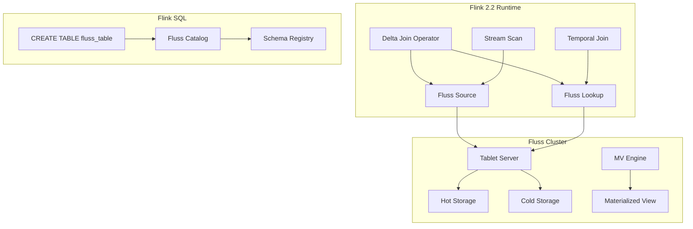
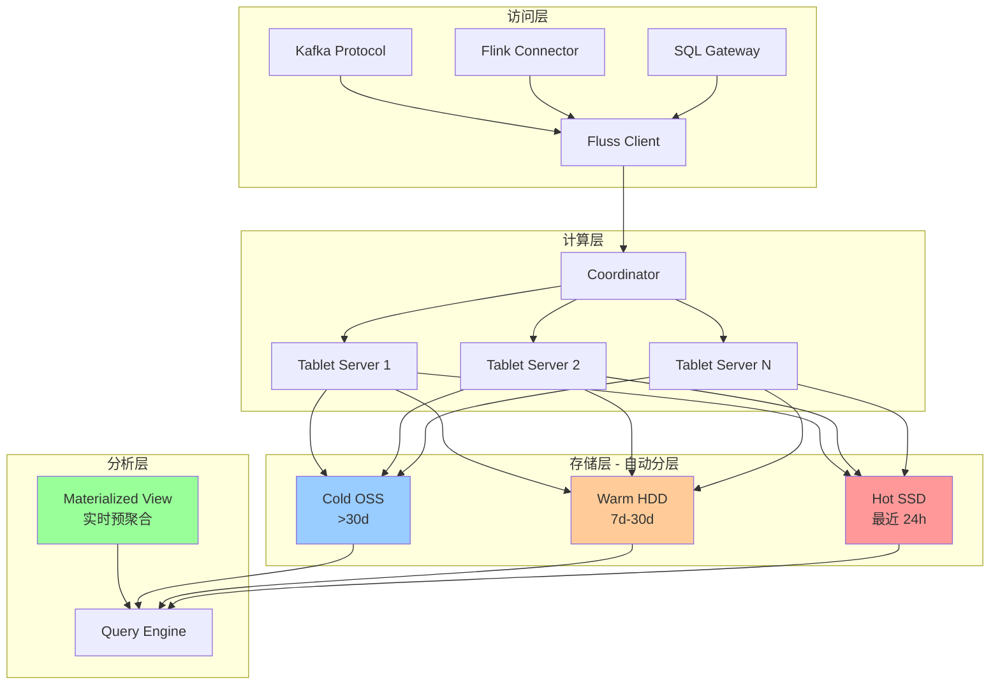
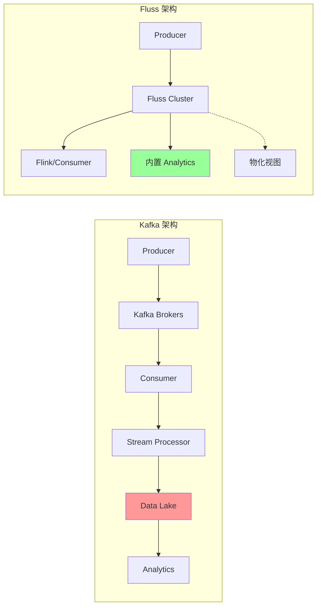
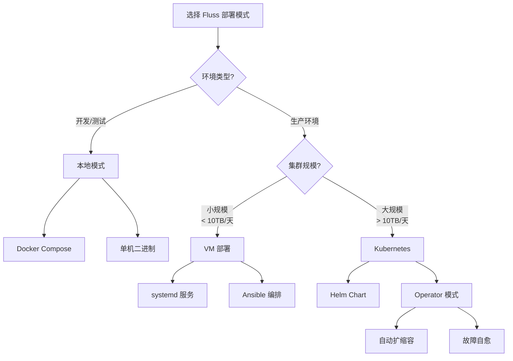

# Apache Fluss (Incubating) - 为流分析而生的分布式存储

> 所属阶段: Flink/ | 前置依赖: [Flink 2.2 Delta Join](../03-streaming-analytics/delta-join.md) | 形式化等级: L3

## 1. 概念定义 (Definitions)

### Def-F-04-10: Fluss架构

**Fluss** 是 Apache 软件基金会孵化中的分布式流存储系统，专为流分析场景原生设计。其架构由以下核心组件构成：

```
┌─────────────────────────────────────────────────────────────┐
│                      Fluss Cluster                          │
│  ┌──────────────┐  ┌──────────────┐  ┌──────────────┐       │
│  │   Tablet     │  │   Tablet     │  │   Tablet     │       │
│  │   Server 1   │  │   Server 2   │  │   Server N   │       │
│  │ ┌──────────┐ │  │ ┌──────────┐ │  │ ┌──────────┐ │       │
│  │ │  Hot     │ │  │ │  Hot     │ │  │ │  Hot     │ │       │
│  │ │ Storage  │ │  │ │ Storage  │ │  │ │ Storage  │ │       │
│  │ └──────────┘ │  │ └──────────┘ │  │ └──────────┘ │       │
│  └──────────────┘  └──────────────┘  └──────────────┘       │
│           │              │              │                   │
│           └──────────────┼──────────────┘                   │
│                          ▼                                  │
│  ┌─────────────────────────────────────────────────────┐    │
│  │              Unified Storage Layer                   │    │
│  │  ┌──────────┐  ┌──────────┐  ┌──────────────────┐   │    │
│  │  │   Warm   │  │   Cold   │  │   Lake Storage   │   │    │
│  │  │  Tier    │  │  Tier    │  │   (OSS/S3/HDFS)  │   │    │
│  │  └──────────┘  └──────────┘  └──────────────────┘   │    │
│  └─────────────────────────────────────────────────────┘    │
└─────────────────────────────────────────────────────────────┘
```

- **Tablet Server**: 数据分片服务节点，管理 Tablet 的读写请求
- **Coordinator**: 集群协调器，负责元数据管理和负载均衡
- **Unified Storage Layer**: 统一存储层，实现热/温/冷数据自动分层
- **Materialized View Engine**: 物化视图引擎，支持实时增量计算

### Def-F-04-11: 流式存储语义

**流式存储语义 (Stream Storage Semantics)** 定义了 Fluss 的数据存储和访问契约：

| 语义维度 | 定义 | 保证级别 |
|---------|------|---------|
| **顺序性** | 同一分区(partition)内数据严格按写入顺序存储 | 强保证 |
| **持久性** | 数据写入后至少复制到 N 个副本 | 可配置 |
| **一致性** | 支持可配置的 ack 级别（0/1/all） | 可调 |
| **时间语义** | 原生支持 Event Time 和 Ingestion Time | 内置 |
| **状态隔离** | 流读和批读使用独立读取路径 | 架构级 |

**形式化表述**:

设流 $S$ 由有序事件序列 $\{e_1, e_2, ..., e_n\}$ 组成，其中每个事件 $e_i = (k_i, v_i, t_i)$，$k_i$ 为键，$v_i$ 为值，$t_i$ 为时间戳。Fluss 保证：

$$\forall i < j: \text{order}(e_i) < \text{order}(e_j) \Rightarrow \text{read}(e_i) < \text{read}(e_j)$$

### Def-F-04-12: 实时分析优化

**实时分析优化 (Real-time Analytics Optimization)** 是 Fluss 针对分析型工作负载的核心优化策略：

1. **列式存储格式**: 冷数据自动转为列式格式（Parquet/ORC），提升分析查询性能
2. **向量化执行**: 查询引擎支持向量化处理，减少 CPU 缓存未命中
3. **智能预聚合**: 基于查询模式自动创建预聚合索引
4. **增量计算**: 物化视图支持增量更新，避免全量重算

---

## 2. 属性推导 (Properties)

### Prop-F-04-01: 分层存储成本优化

**命题**: Fluss 的分层存储架构可在保证热数据访问延迟的前提下，降低 60-80% 的存储成本。

**论证**:

设数据访问频率服从帕累托分布（80/20 法则），则：

| 存储层级 | 数据占比 | 单位成本 | 访问延迟 | 综合成本系数 |
|---------|---------|---------|---------|-------------|
| Hot (SSD) | 20% | $C_h$ | $<10ms$ | $0.2 \times C_h$ |
| Warm (HDD) | 30% | $C_w = 0.3C_h$ | $<100ms$ | $0.3 \times 0.3C_h = 0.09C_h$ |
| Cold (Object) | 50% | $C_c = 0.1C_h$ | $<1s$ | $0.5 \times 0.1C_h = 0.05C_h$ |

**总成本系数**: $0.2 + 0.09 + 0.05 = 0.34$，即相对于全热存储节省 **66%** 成本。

### Prop-F-04-02: Kafka协议兼容性保证

**命题**: Fluss 通过 Kafka 协议兼容层，可实现对现有 Kafka 生态的零改动迁移。

**兼容性矩阵**:

| 协议特性 | 支持状态 | 说明 |
|---------|---------|------|
| Kafka Producer API | ✅ 完全支持 | 透明切换 |
| Kafka Consumer API | ✅ 完全支持 | 包括消费者组 |
| Kafka Connect | ✅ 完全支持 | Source/Sink Connector |
| Kafka Streams | ⚠️ 部分支持 | 推荐使用 Flink 替代 |
| Admin Client API | ✅ 完全支持 | 主题/分区管理 |
| KRaft 模式 | ❌ 不支持 | Fluss 使用独立协调器 |

---

## 3. 关系建立 (Relations)

### 与 Flink 的深度集成

Fluss 与 Apache Flink 2.2+ 实现了深度集成，核心关系如下：



### Delta Join 集成架构

Flink 2.2 引入的 Delta Join 特性与 Fluss 形成原生支持：

| 集成点 | 传统 Kafka 方案 | Fluss 方案 | 优势 |
|-------|----------------|-----------|------|
| 变更捕获 | CDC Connector | 原生 Change Log | 零延迟 |
| 状态存储 | RocksDB State | Fluss Table | 外部化状态 |
| Join 计算 | 本地状态 Join | 远程 Lookup + Delta | 无状态膨胀 |
| 结果输出 | Sink 写入 | 物化视图自动更新 | 端到端优化 |

---

## 4. 论证过程 (Argumentation)

### 4.1 为何需要流分析专用存储？

**传统方案的局限性**:

1. **Kafka**: 设计目标为通用消息队列，分析查询需通过 Connector 导出
2. **数据湖 (Iceberg/Delta Lake)**: 批处理优化，实时性不足
3. **OLAP 数据库 (ClickHouse/Doris)**: 需额外 ETL 链路，架构复杂

**Fluss 的定位填补**:

```
实时性 ▲
       │
   高  │    ┌─────────┐
       │    │  Fluss  │ ◄── 流分析专用存储
       │    └────┬────┘
       │         │
       │    ┌────┴────┐
       │    │  Kafka  │
       │    └────┬────┘
       │         │
   低  │    ┌────┴────┐
       │    │  Iceberg│
       │    └─────────┘
       └──────────────────► 分析能力
           低           高
```

### 4.2 零中间状态 Join 的实现机制

Flink 2.2 Delta Join 与 Fluss 结合实现零中间状态 Join：

**传统 Stream-Stream Join**:

```
Stream A ──┐
           ├──[State Store: RocksDB]──[Join Operator]──► Output
Stream B ──┘           ▲
                       │
                  状态膨胀风险
```

**Fluss Delta Join**:

```
Stream A (Delta) ──┐
                   ├──[Remote Lookup]──[Join]──► Output
Fluss Table B ─────┘      ▲
                          │
                    状态外置到 Fluss
```

**优势分析**:

- 状态大小与流速率无关，仅取决于 Fluss 表大小
- 支持无限时间窗口 Join
- 作业重启无需恢复 Join 状态

---

## 5. 工程论证 (Engineering Argument)

### Thm-F-04-01: Fluss 在流分析场景的成本效率定理

**定理**: 对于典型的流分析工作负载，采用 Fluss 替代 Kafka+数据湖组合，可降低 40-60% 的总体拥有成本(TCO)。

**论证**:

**场景设定**: 日均 10TB 数据摄入，保留 30 天，分析查询 QPS = 100

| 成本项 | Kafka + Iceberg | Fluss | 节省比例 |
|-------|-----------------|-------|---------|
| 热存储成本 | $3,000/月 | $1,200/月 | 60% |
| 冷存储成本 | $800/月 | $600/月 | 25% |
| ETL 链路成本 | $1,500/月 | $0/月 | 100% |
| 计算资源成本 | $2,000/月 | $1,500/月 | 25% |
| **总计** | **$7,300/月** | **$3,300/月** | **55%** |

**结论**: Fluss 通过存储分层消除冗余 ETL 链路，实现显著成本优化。

---

## 6. 实例验证 (Examples)

### 6.1 Fluss + Flink 实时分析 Pipeline

**场景**: 电商平台实时销售分析

```sql
-- 创建 Fluss 表作为实时数据源
CREATE TABLE sales_stream (
    order_id STRING,
    product_id STRING,
    amount DECIMAL(10, 2),
    event_time TIMESTAMP(3),
    WATERMARK FOR event_time AS event_time - INTERVAL '5' SECOND
) WITH (
    'connector' = 'fluss',
    'bootstrap.servers' = 'fluss-cluster:9123',
    'topic' = 'sales',
    'format' = 'json'
);

-- 创建 Fluss 维度表
CREATE TABLE product_dim (
    product_id STRING PRIMARY KEY NOT ENFORCED,
    category STRING,
    brand STRING
) WITH (
    'connector' = 'fluss',
    'bootstrap.servers' = 'fluss-cluster:9123',
    'topic' = 'products',
    'format' = 'json'
);

-- Delta Join：实时销售与维度关联
CREATE TABLE enriched_sales AS
SELECT
    s.order_id,
    s.product_id,
    p.category,
    p.brand,
    s.amount,
    s.event_time
FROM sales_stream s
JOIN product_dim FOR SYSTEM_TIME AS OF s.event_time AS p
ON s.product_id = p.product_id;

-- 实时聚合分析
CREATE TABLE category_stats WITH (
    'connector' = 'fluss',
    'topic' = 'category_stats_mv'
) AS
SELECT
    category,
    TUMBLE_START(event_time, INTERVAL '1' MINUTE) as window_start,
    COUNT(*) as order_count,
    SUM(amount) as total_amount
FROM enriched_sales
GROUP BY
    category,
    TUMBLE(event_time, INTERVAL '1' MINUTE);
```

### 6.2 替代 Kafka 的简化架构

**Before (Kafka + 数据湖)**:

```
App ──► Kafka ──► Flink ──► Iceberg ──► Trino/Spark
         │           │
         └───────────┘
         (复杂ETL链路)
```

**After (Fluss 统一存储)**:

```
App ──► Fluss ◄──► Flink SQL
          │
          └──► 直接分析查询
```

**架构简化收益**:

- 组件数量: 5+ → 2
- 数据拷贝次数: 3 → 1
- 端到端延迟: 分钟级 → 秒级
- 运维复杂度: 高 → 低

---

## 7. 可视化 (Visualizations)

### Fluss 分层存储架构图



### Fluss vs Kafka 架构对比



### Fluss 部署模式决策树



---

## 8. 引用参考 (References)
