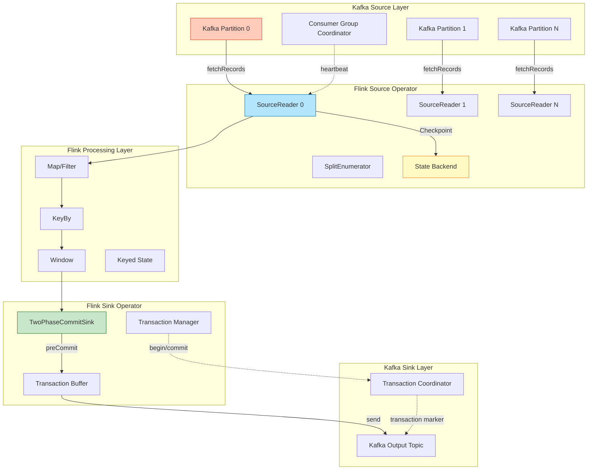
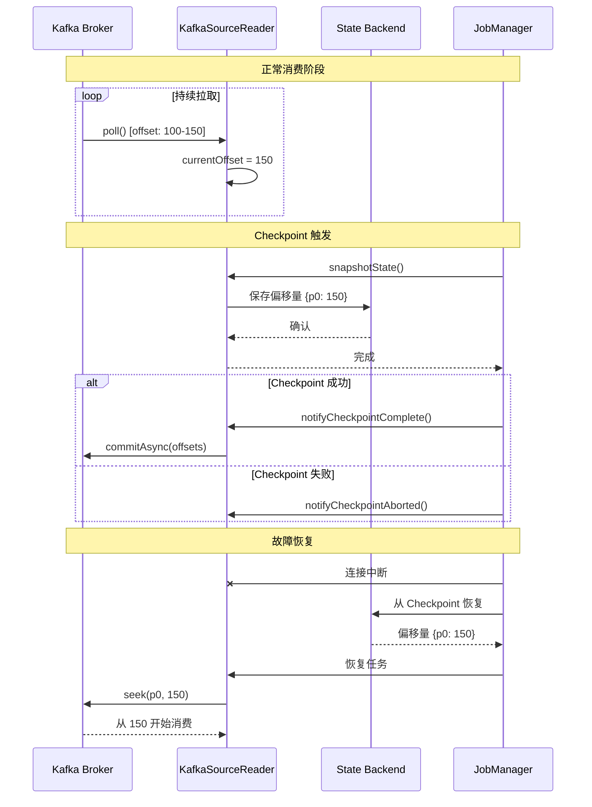
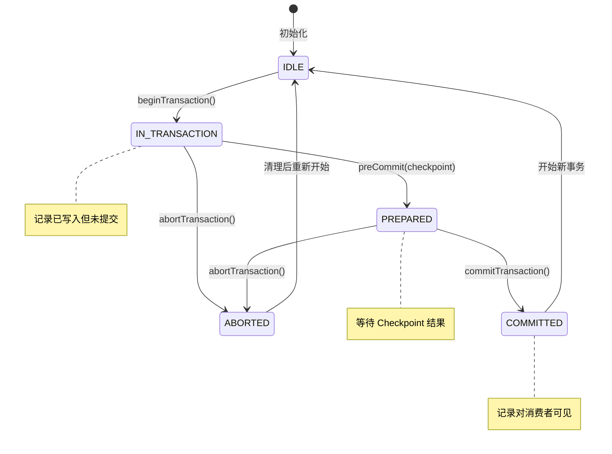
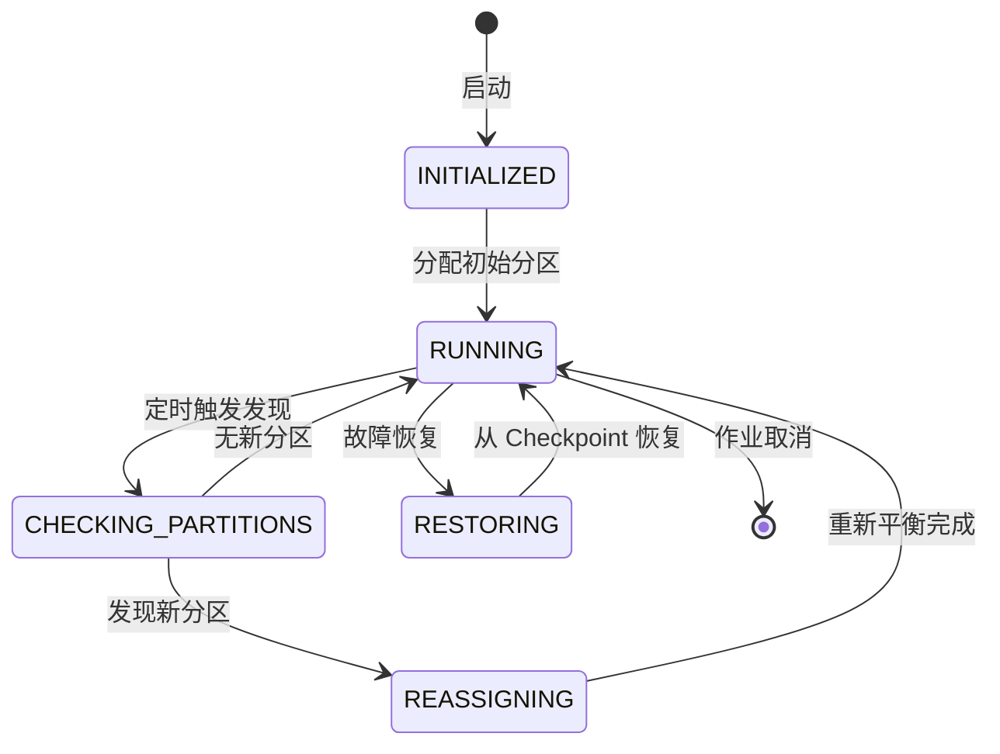

# Flink Kafka 集成模式 (Flink Kafka Integration Patterns)

> **所属阶段**: Flink/04-connectors | **前置依赖**: [../../Struct/02-properties/02.02-consistency-hierarchy.md](../../Struct/02-properties/02.02-consistency-hierarchy.md), [../../Flink/02-core-mechanisms/exactly-once-end-to-end.md](../../Flink/02-core-mechanisms/exactly-once-end-to-end.md) | **形式化等级**: L4

---

## 1. 概念定义 (Definitions)

### Def-F-04-01 (Kafka Source 可重放性)

设 $K = (T, P, O, C)$ 为一个 Kafka 集群，其中 $T$ 为 Topic 集合，$P_t$ 为 Topic $t$ 的分区集合，$O_{t,p}$ 为分区 $p$ 的偏移量空间。Kafka Source 可重放性定义为：对于任意 $t \in T$、$p \in P_t$ 和 $o \in O_{t,p}$，存在确定性的记录序列 $S(t, p, o)$：

$$\text{Replayable}(K) \iff \forall t, p, o. \; \exists! S(t, p, o)$$

**直观解释**：Kafka 的仅追加日志保证每个分区内的记录具有全序性。这是实现 Source 层 Exactly-Once 的基础——故障恢复后可以精确地"倒带"到已知位置重新读取[^1][^3]。根据 [Struct/02-properties/02.02-consistency-hierarchy.md](../../Struct/02-properties/02.02-consistency-hierarchy.md) 中 Def-S-08-05，可重放 Source 是端到端 Exactly-Once 的必要条件之一。

### Def-F-04-02 (事务性生产者语义)

设 $\mathcal{T}$ 为事务标识符，$\mathcal{B}$ 为事务中的消息批次集合：

$$\text{TransactionalWrite}(\mathcal{T}, \mathcal{B}) = \begin{cases}
\text{AllCommitted} & \text{if } \forall b \in \mathcal{B}. \; \text{committed}(b) \\
\text{AllAborted} & \text{if } \forall b \in \mathcal{B}. \; \text{aborted}(b)
\end{cases}$$

**事务的 ACID 属性**：

| 属性 | 定义 | Kafka 实现 |
|------|------|-----------|
| 原子性 | 事务内操作全成功或全失败 | Transaction Marker |
| 隔离性 | 并发事务互不干扰 | `read_committed` 隔离级别 |
| 持久性 | 已提交结果永久保存 | 复制因子 + acks=all |

### Def-F-04-03 (事务围栏)

事务围栏是 Kafka 防止"僵尸任务"写入的安全机制。设 $P_{old}$ 和 $P_{new}$ 为新旧生产者实例，$E$ 为 Producer Epoch：

$$\text{Fence}(P_{old}, P_{new}) \iff \text{epoch}(P_{new}) > \text{epoch}(P_{old}) \Rightarrow \forall T \in \text{Txns}(P_{old}). \; \text{abort}(T)$$

### Def-F-04-04 (Schema 兼容性契约)

设 $S$ 为 Schema，$D$ 为数据，$E$ 为编码函数，$D$ 为解码函数：

$$\text{SchemaContract}(S) \iff \forall D. \; D_S(D(E_S(D))) = D$$

**兼容性级别**：BACKWARD（新可读旧）、FORWARD（旧可读新）、FULL（双向兼容）、NONE（无保证）。

---

## 2. 属性推导 (Properties)

### Lemma-F-04-01 (Kafka Source 偏移量绑定保证)

**陈述**：当 `setCommitOffsetsOnCheckpoints(true)` 启用时，Flink Kafka Source 保证 Kafka 偏移量的提交与 Flink Checkpoint 的成功原子绑定。

**证明**：
1. `snapshotState()` 将偏移量保存到状态后端
2. 偏移量提交在 `notifyCheckpointComplete()` 中执行，仅在 Checkpoint 成功后触发
3. 故障恢复时，Source 从 StateBackend 恢复的偏移量优先于 Kafka 已提交的偏移量

因此，偏移量提交与 Checkpoint 成功事件严格同步。∎

### Lemma-F-04-02 (事务性 Sink 的原子性边界)

**陈述**：Flink Kafka 事务性 Sink 将每个 Checkpoint 周期内的所有输出作为原子单元提交或回滚。

**证明**：设 $W_k$ 为 Checkpoint $k$ 周期内写入的记录集合，$T_k$ 为对应事务：
- `preCommit()`: 事务置为 PREPARED 状态
- `commit()`: Checkpoint 成功，记录可见
- `abort()`: Checkpoint 失败，记录不可见

根据 2PC 协议的原子性，事务内所有记录具有相同的可见性状态。∎

### Prop-F-04-01 (端到端 Exactly-Once 的三元组条件)

**陈述**：Flink Kafka 端到端 Exactly-Once 成立当且仅当：

$$\text{EO}(J) \iff \text{Replayable}(Src) \land \text{Transactional2PC}(Sink)$$

根据 [Struct/02-properties/02.02-consistency-hierarchy.md](../../Struct/02-properties/02.02-consistency-hierarchy.md) 中的 Prop-S-08-01，需要 Source 可重放、引擎内部一致性（参见 [Flink/02-core-mechanisms/exactly-once-end-to-end.md](../../Flink/02-core-mechanisms/exactly-once-end-to-end.md)）和 Sink 原子性同时满足。

---

## 3. 关系建立 (Relations)

### 关系 1: Kafka 事务与 Flink Checkpoint 的映射

| Flink 概念 | Kafka 事务概念 | 映射关系 |
|-----------|---------------|----------|
| CheckpointCoordinator | TransactionCoordinator | 协调者角色 |
| snapshotState() | preCommit() | 准备阶段 |
| notifyCheckpointComplete() | commitTransaction() | 提交阶段 |
| StateBackend 偏移量 | __consumer_offsets | 恢复优先使用 StateBackend |

### 关系 2: Kafka Partition 与 Flink Parallelism 的对应

| 场景 | 约束 | 行为特征 |
|------|------|----------|
| $P_F = P_K$ | 理想对应 | 无数据倾斜 |
| $P_F < P_K$ | 多对一映射 | 可能负载不均 |
| $P_F > P_K$ | 一对多空闲 | 资源浪费 |

**最佳实践**：$\text{OptimalParallelism} = P_K \times n$

### 关系 3: Schema Registry 与类型系统的编码关系

Flink Type $\leftrightarrow$ Schema Registry Schema $\leftrightarrow$ Kafka Message Bytes

| Flink 类型 | Avro | Protobuf | JSON |
|-----------|------|----------|------|
| `String` | `string` | `string` | `{"type": "string"}` |
| `Row` | `record` | `message` | `object` |

---

## 4. 论证过程 (Argumentation)

### 4.1 消费者组重平衡的影响分析

**重平衡触发条件**：

| 触发事件 | 影响范围 | 恢复时间 |
|----------|----------|----------|
| 新消费者加入 | 全组重新分配 | 数秒至数十秒 |
| 心跳超时 | 分区迁移 | 取决于 `session.timeout.ms` |
| 分区数量变化 | 全组重新分配 | 与发现间隔相关 |

**Flink 应对策略**：静态成员资格 (`group.instance.id`)、协作重平衡 (Kafka 2.4+)、取消自动提交。

### 4.2 事务超时与故障恢复边界

关键约束：$\text{CheckpointInterval} + \text{CheckpointTimeout} < \text{transaction.timeout.ms}$

若故障持续时间 $D > \text{transaction.timeout.ms}$，事务会被 Broker 强制中止，Flink 从上次成功 Checkpoint 恢复。

### 4.3 幂等性 vs 事务性的工程权衡

| 维度 | 幂等性方案 | 事务性方案 |
|------|-----------|-----------|
| 延迟 | 低 | 较高（两阶段提交） |
| 吞吐 | 高 | 中等 |
| 跨分区原子性 | 不支持 | 支持 |
| 消费者隔离 | 弱 | 强（read_committed） |

---

## 5. 形式证明 / 工程论证 (Proof / Engineering Argument)

### Thm-F-04-01 (Kafka Source Exactly-Once 正确性)

**陈述**：在启用 `setCommitOffsetsOnCheckpoints(true)` 且使用可重放 Source 的条件下，Flink Kafka Source 保证 At-Least-Once 语义；结合幂等/事务性 Sink 可实现端到端 Exactly-Once。

**证明**：设 $C_n$ 为最后一个成功 Checkpoint，其保存的偏移量为 $o_n$：
1. Source 从状态恢复，获取 $o_n$
2. Source 向 Kafka 定位到 $o_n$
3. 从 $o_n$ 开始消费，所有 $C_n$ 之后的数据被重新处理

因此，不存在数据丢失。与幂等/事务性 Sink 配合，可实现端到端 Exactly-Once。∎

### Thm-F-04-02 (Kafka Sink 事务原子性保证)

**陈述**：Flink Kafka 事务性 Sink 使用两阶段提交协议，保证每个 Checkpoint 周期的输出要么全部可见，要么全部不可见。

**证明**：设 $W$ 为某 Checkpoint 周期内的记录集合，$T$ 为对应事务：
- `preCommit`：$W$ 已发送但标记为未提交
- Checkpoint 成功：发送 COMMIT Marker，$W$ 可见
- Checkpoint 失败：发送 ABORT Marker，$W$ 不可见

使用 `isolation.level=read_committed` 的消费者不会读取未提交记录。∎

---

## 6. 实例验证 (Examples)

### 6.1 Kafka Source 基础配置

```java
KafkaSource<Event> source = KafkaSource.<Event>builder()
    .setBootstrapServers("kafka-1:9092,kafka-2:9092")
    .setTopics("input-topic")
    .setGroupId("flink-consumer-group")
    .setStartingOffsets(OffsetsInitializer.earliest())
    .setDeserializer(KafkaRecordDeserializationSchema.of(
        new EventDeserializationSchema()))
    .setProperty("partition.discovery.interval.ms", "10000")
    .setProperty("isolation.level", "read_committed")
    .build();

DataStream<Event> stream = env.fromSource(
    source,
    WatermarkStrategy.forBoundedOutOfOrderness(Duration.ofSeconds(5)),
    "Kafka Source");
```

### 6.2 Kafka Sink 事务性配置

```java
KafkaSink<Result> sink = KafkaSink.<Result>builder()
    .setBootstrapServers("kafka-1:9092,kafka-2:9092")
    .setRecordSerializer(KafkaRecordSerializationSchema.builder()
        .setTopic("output-topic")
        .setValueSerializationSchema(new ResultSerializationSchema())
        .build())
    .setDeliveryGuarantee(DeliveryGuarantee.EXACTLY_ONCE)
    .setProperty("transaction.timeout.ms", "900000")
    .setProperty("enable.idempotence", "true")
    .setProperty("acks", "all")
    .setTransactionalIdPrefix("flink-job-" + subtaskIndex)
    .build();

stream.sinkTo(sink);
```

### 6.3 Schema Registry 集成配置

```java
// Confluent Schema Registry
KafkaSource<UserEvent> source = KafkaSource.<UserEvent>builder()
    .setBootstrapServers("kafka:9092")
    .setTopics("user-events")
    .setGroupId("flink-avro-consumer")
    .setDeserializer(new AvroDeserializationSchema())
    .setProperty("schema.registry.url", "http://schema-registry:8081")
    .build();
```

### 6.4 端到端 Exactly-Once 完整配置

```java
// Checkpoint 配置
env.enableCheckpointing(60000, CheckpointingMode.EXACTLY_ONCE);
env.getCheckpointConfig().setCheckpointTimeout(600000);
env.setStateBackend(new EmbeddedRocksDBStateBackend(true));

// Kafka Source
KafkaSource<Event> source = KafkaSource.<Event>builder()
    .setBootstrapServers("kafka-1:9092,kafka-2:9092,kafka-3:9092")
    .setTopicsPattern("input-topic-.*")
    .setGroupId("exactly-once-consumer-group")
    .setProperty("isolation.level", "read_committed")
    .setProperty("enable.auto.commit", "false")
    .setProperty("partition.discovery.interval.ms", "30000")
    .build();

// 处理逻辑
DataStream<Result> processed = env
    .fromSource(source, WatermarkStrategy.forBoundedOutOfOrderness(
        Duration.ofSeconds(30)), "Kafka Source")
    .keyBy(Event::getUserId)
    .window(TumblingEventTimeWindows.of(Time.minutes(1)))
    .aggregate(new EventAggregator());

// Kafka Sink
KafkaSink<Result> sink = KafkaSink.<Result>builder()
    .setBootstrapServers("kafka-1:9092,kafka-2:9092,kafka-3:9092")
    .setDeliveryGuarantee(DeliveryGuarantee.EXACTLY_ONCE)
    .setProperty("transaction.timeout.ms", "900000")
    .setTransactionalIdPrefix("exactly-once-job-" + jobId)
    .build();

processed.sinkTo(sink);
env.execute("Exactly-Once Kafka Pipeline");
```

---

## 7. 可视化 (Visualizations)

### 7.1 Kafka-Flink 数据流架构图



**图说明**：橙色为 Kafka 层，蓝色为 Flink Source，绿色为 Sink，黄色为状态后端。

### 7.2 Offset 提交序列图



**图说明**：偏移量提交到 Kafka 是尽力而为的优化，真正的容错依赖 State Backend 中的偏移量。

### 7.3 事务提交流程图



### 7.4 分区发现状态机



---

## 8. 配置参考 (Configuration Reference)

### 8.1 Kafka Source 配置选项

| 配置项 | 类型 | 默认值 | 描述 | 推荐值 |
|--------|------|--------|------|--------|
| `bootstrap.servers` | String | 必填 | Kafka Broker 地址 | `kafka-1:9092,kafka-2:9092` |
| `topics` / `topicsPattern` | String | 必填 | 订阅的 Topic | 根据业务指定 |
| `group.id` | String | 必填 | 消费者组 ID | `flink-consumer-${job}` |
| `startingOffsets` | Enum | `COMMITTED` | 起始偏移量策略 | `COMMITTED` |
| `partition.discovery.interval.ms` | Long | `-1` | 分区发现间隔 | `30000` |
| `isolation.level` | String | `read_uncommitted` | 消费者隔离级别 | `read_committed` |
| `enable.auto.commit` | Boolean | `true` | 自动提交偏移量 | `false` |
| `auto.offset.reset` | String | `latest` | 无偏移量时重置 | `earliest` |
| `group.instance.id` | String | null | 静态成员资格 ID | `flink-${taskId}` |
| `session.timeout.ms` | Integer | `10000` | 会话超时 | `45000` |
| `heartbeat.interval.ms` | Integer | `3000` | 心跳间隔 | `15000` |

**Exactly-Once 必需配置**：
```properties
isolation.level=read_committed
enable.auto.commit=false
enable.idempotence=true
acks=all
transactional.id=${uniquePrefix}-${subtaskIndex}
transaction.timeout.ms=${>checkpointInterval + checkpointTimeout}
```

### 8.2 Kafka Sink 配置选项

| 配置项 | 类型 | 默认值 | 描述 | 推荐值 |
|--------|------|--------|------|--------|
| `bootstrap.servers` | String | 必填 | Kafka Broker 地址 | 同 Source |
| `delivery.guarantee` | Enum | `AT_LEAST_ONCE` | 交付保证 | `EXACTLY_ONCE` |
| `transactionalIdPrefix` | String | 自动生成 | 事务 ID 前缀 | 显式指定唯一值 |
| `transaction.timeout.ms` | Integer | `60000` | 事务超时 | `900000` |
| `enable.idempotence` | Boolean | `true` | 启用幂等性 | `true` |
| `acks` | String | `1` | 确认级别 | `all` |
| `retries` | Integer | `2147483647` | 重试次数 | `MAX_VALUE` |
| `max.in.flight.requests.per.connection` | Integer | `5` | 最大在途请求 | `5` |
| `compression.type` | String | `none` | 压缩算法 | `lz4` |

### 8.3 Exactly-Once 策略按 Kafka 版本

| 特性 | Kafka 0.10 | Kafka 0.11 | Kafka 2.0 | Kafka 2.4+ | Kafka 3.0+ |
|------|-----------|-----------|-----------|-----------|-----------|
| 幂等生产者 | ❌ | ✅ | ✅ | ✅ | ✅ |
| 事务 API | ❌ | ✅ | ✅ | ✅ | ✅ |
| 事务围栏 | ❌ | ✅ 基础 | ✅ 改进 | ✅ 改进 | ✅ 改进 |
| 协作重平衡 | ❌ | ❌ | ❌ | ✅ | ✅ |
| Exactly-Once 策略 | At-Least-Once + 去重 | 2PC | 2PC | 2PC + 协作重平衡 | 2PC + 改进围栏 |

**按版本配置**：

| 版本 | 配置要求 | 推荐策略 |
|------|----------|----------|
| Kafka < 0.11 | 无事务支持 | At-Least-Once + 应用层去重 |
| Kafka 0.11-1.x | `transactional.id` | 2PC 事务 |
| Kafka 2.0-2.3 | 同上 | 2PC + 改进围栏 |
| Kafka 2.4+ | `partition.assignment.strategy=CooperativeStickyAssignor` | 2PC + 协作重平衡 |
| Kafka 3.0+ | 同上 | 改进的事务围栏 |

---

## 9. 引用参考 (References)

[^1]: Apache Flink Documentation, "Kafka Connector", 2025. <https://nightlies.apache.org/flink/flink-docs-stable/docs/connectors/datastream/kafka/>

[^2]: Apache Flink Documentation, "Kafka Source", 2025. <https://nightlies.apache.org/flink/flink-docs-stable/docs/connectors/datastream/kafka/#kafka-source>

[^3]: Apache Kafka Documentation, "Transactions in Kafka", 2025. <https://kafka.apache.org/documentation/transactions>

[^4]: Apache Kafka Documentation, "Consumer Group Protocol", 2025. <https://kafka.apache.org/documentation/consumer-group>

[^5]: P. Carbone et al., "State Management in Apache Flink", *PVLDB*, 10(12), 2017.

[^6]: J. Kreps, "Exactly-Once Semantics with Kafka", Confluent Blog, 2017. <https://www.confluent.io/blog/exactly-once-semantics-are-possible-heres-how-apache-kafka-does-it/>

[^7]: J. Kreps, "Improving Apache Kafka's Reliability with Idempotent and Transactional Capabilities", Confluent Blog, 2018. <https://www.confluent.io/blog/transactions-apache-kafka/>

[^8]: Confluent Documentation, "Schema Registry Overview", 2025. <https://docs.confluent.io/platform/current/schema-registry/index.html>

[^9]: Apache Kafka Documentation, "Producer Configs", 2025. <https://kafka.apache.org/documentation/producer-configs>

[^10]: K. M. Chandy and L. Lamport, "Distributed Snapshots: Determining Global States of Distributed Systems", *ACM Trans. Comput. Syst.*, 3(1), 1985.

---

*文档版本: v1.0 | 更新日期: 2026-04-02 | 状态: 已完成*
