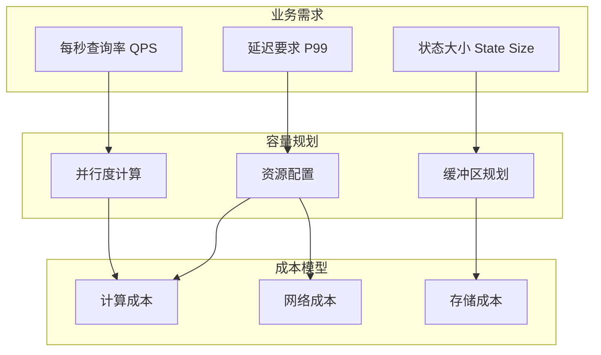
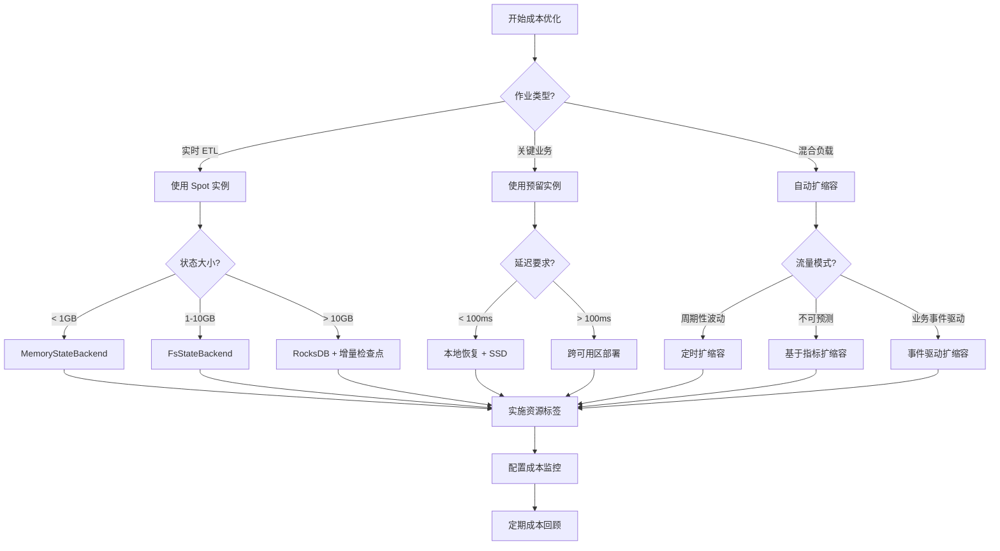
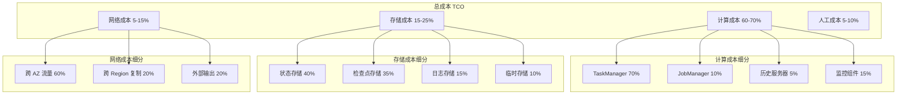
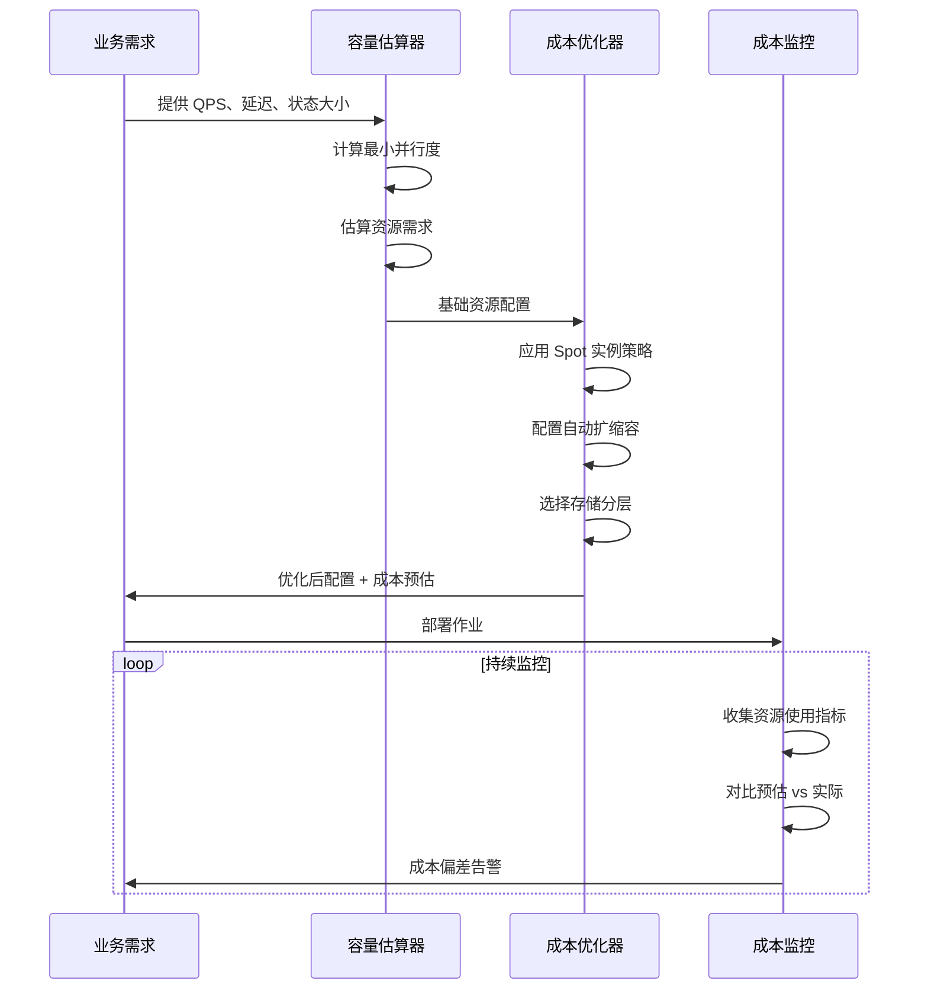
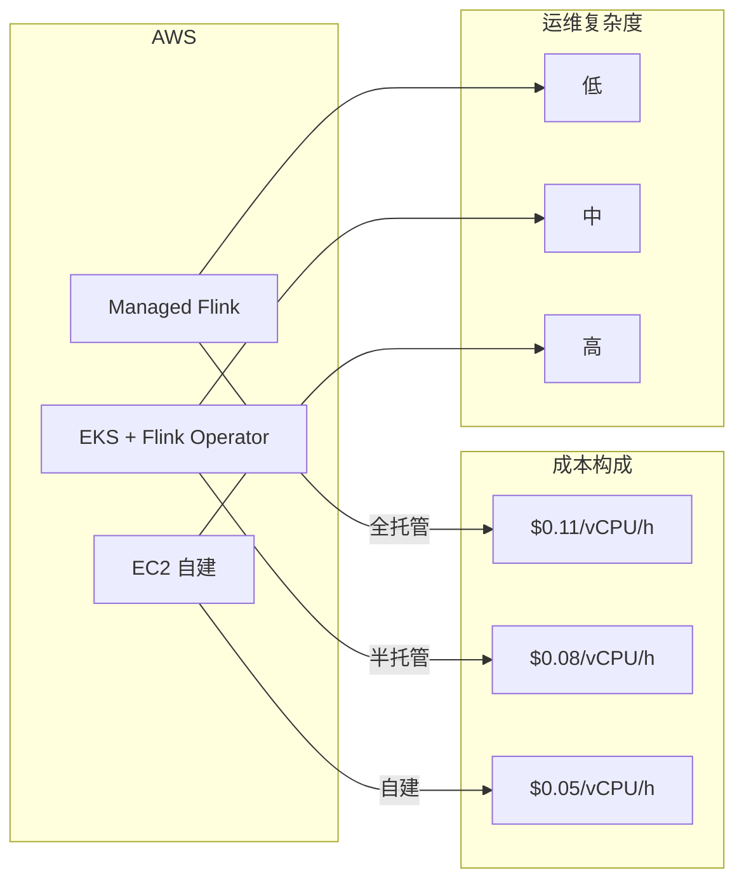

# Flink 成本优化计算器指南

> 所属阶段: Flink/10-deployment | 前置依赖: [Flink部署运维完整指南](./flink-deployment-ops-complete-guide.md), [性能调优指南](../06-engineering/performance-tuning-guide.md) | 形式化等级: L3

---

## 1. 概念定义 (Definitions)

### Def-F-10-01: 流计算总拥有成本 (TCO)

流计算作业的总拥有成本 $\text{TCO}$ 定义为四个维度的成本之和：

$$
\text{TCO} = C_{\text{compute}} + C_{\text{storage}} + C_{\text{network}} + C_{\text{human}}
$$

其中：

- $C_{\text{compute}}$: 计算资源成本（vCPU、内存）
- $C_{\text{storage}}$: 存储资源成本（状态后端、检查点）
- $C_{\text{network}}$: 网络传输成本（跨可用区、跨地域）
- $C_{\text{human}}$: 人工运维成本

### Def-F-10-02: 计算资源单位成本

定义计算资源的单位小时成本函数：

$$
\text{UnitCost}_{\text{compute}}(r) = p_{\text{vCPU}} \cdot r_{\text{vCPU}} + p_{\text{mem}} \cdot r_{\text{mem}} + p_{\text{gpu}} \cdot r_{\text{gpu}}
$$

其中：

- $p_{\text{vCPU}}$: 每vCPU每小时单价（USD）
- $p_{\text{mem}}$: 每GB内存每小时单价（USD）
- $p_{\text{gpu}}$: 每GPU每小时单价（USD）
- $r$: 资源配置向量

### Def-F-10-03: 状态存储成本模型

状态存储成本由活跃状态和检查点两部分组成：

$$
C_{\text{storage}} = c_{\text{active}} \cdot S_{\text{active}} + c_{\text{checkpoint}} \cdot S_{\text{checkpoint}} \cdot N_{\text{retain}}
$$

其中：

- $S_{\text{active}}$: 活跃状态大小（GB）
- $S_{\text{checkpoint}}$: 单个检查点大小（GB）
- $N_{\text{retain}}$: 保留的检查点数量
- $c_{\text{active}}, c_{\text{checkpoint}}$: 对应存储单价（USD/GB/月）

### Def-F-10-04: 成本效率指标

定义流处理作业的成本效率指标：

$$
\eta_{\text{cost}} = \frac{T_{\text{throughput}}}{C_{\text{hourly}}} = \frac{\text{events/second}}{\text{USD/hour}}
$$

其中 $T_{\text{throughput}}$ 为作业处理的峰值吞吐量。

### Def-F-10-05: 容量规划基线

容量规划基线定义为确保作业 SLA 满足的最小资源配置：

$$
R_{\text{baseline}} = \{(r_{\text{vCPU}}, r_{\text{mem}}, r_{\text{disk}}) \mid \forall t: \text{Latency}(t) \leq \text{SLA}_{\text{latency}} \land \text{Availability}(t) \geq \text{SLA}_{\text{availability}}\}
$$

---

## 2. 属性推导 (Properties)

### Prop-F-10-01: 成本与吞吐量的次线性关系

在满足资源约束条件下，Flink 作业的计算成本与吞吐量呈次线性关系：

$$
C_{\text{compute}}(\lambda) = O(\lambda^{\alpha}), \quad \alpha \in [0.7, 0.9]
$$

其中 $\lambda$ 为事件到达率。这是由于并行度的扩展收益递减效应导致的。

**证明概要**: 随着并行度增加，任务间协调开销（网络传输、检查点协调）呈超线性增长，导致单位吞吐量的边际成本递增。

### Prop-F-10-02: 检查点频率的成本拐点

存在最优检查点频率 $f^{*}$ 使得总存储成本最小：

$$
f^{*} = \arg\min_{f} \left[ \frac{c_{\text{compute}} \cdot T_{\text{checkpoint}}(f)}{3600} + c_{\text{storage}} \cdot S_{\text{checkpoint}}(f) \cdot f \cdot T_{\text{retention}} \right]
$$

其中：

- $T_{\text{checkpoint}}(f)$: 单次检查点时间（与 $f$ 正相关）
- $S_{\text{checkpoint}}(f)$: 检查点大小（增量检查点时与 $f$ 负相关）

### Prop-F-10-03: Spot 实例的成本节约上界

使用 Spot/Preemptible 实例的最大成本节约率受限于中断概率：

$$
\text{Savings}_{\text{max}} = 1 - \frac{1}{1 + \frac{p_{\text{interrupt}}}{1 - p_{\text{interrupt}}} \cdot \frac{C_{\text{restart}}}{C_{\text{ondemand}}}}
$$

其中：

- $p_{\text{interrupt}}$: Spot 实例中断概率
- $C_{\text{restart}}$: 作业重启成本（状态恢复、数据重放）

### Lemma-F-10-01: 状态大小与计算成本的正相关性

对于使用 RocksDB 状态后端的作业，计算成本与状态大小存在正相关：

$$
\frac{\partial C_{\text{compute}}}{\partial S_{\text{state}}} > 0
$$

这是由于更大的状态导致更高的序列化/反序列化开销和更大的检查点开销。

---

## 3. 关系建立 (Relations)

### 3.1 成本维度关联矩阵

| 优化策略 | 计算成本 | 存储成本 | 网络成本 | 人工成本 | 适用场景 |
|---------|---------|---------|---------|---------|---------|
| Spot 实例 | ↓↓↓ | → | → | ↑ | 容错性高的批处理 |
| 自动扩缩容 | ↓↓ | → | ↓ | ↓ | 流量波动大的场景 |
| 存储分层 | → | ↓↓↓ | ↑ | → | 冷热数据分离 |
| 增量检查点 | ↑ | ↓↓ | ↓ | → | 大状态作业 |
| 本地恢复 | ↓ | → | ↓↓ | → | 可用区故障容忍 |
| 资源 Right-sizing | ↓↓ | → | → | ↓ | 稳定负载场景 |

### 3.2 容量规划与成本的关系



### 3.3 云厂商定价模型映射

| 云厂商 | 计算定价模式 | 存储定价模式 | 网络定价模式 | 特色服务 |
|-------|-------------|-------------|-------------|---------|
| AWS | On-Demand / Spot / Savings Plans | S3 分层 / EBS gp3 | 跨 AZ 免费 / 跨 Region 收费 | Managed Flink |
| Azure | Pay-as-you-go / Spot / Reserved | Blob 分层 / Managed Disk | VNet 对等 / 出站流量 | HDInsight on AKS |
| GCP | On-Demand / Spot / Committed Use | Cloud Storage 层级 / PD | 内部流量免费 / 出口收费 | Dataproc Serverless |
| 阿里云 | 按量付费 / 抢占式 / 包年包月 | OSS 标准/低频/归档 / ESSD | 内网免费 / 公网收费 | 实时计算 Flink 版 |

---

## 4. 论证过程 (Argumentation)

### 4.1 成本模型构建方法论

构建 Flink 作业成本模型需要遵循以下步骤：

1. **基线测量**: 在标准负载下运行作业，收集资源使用指标
2. **成本分解**: 将总成本归因到各个维度（计算、存储、网络）
3. **敏感度分析**: 分析各参数变化对成本的影响
4. **模型验证**: 通过实际账单数据校准模型参数

### 4.2 容量规划中的关键决策点

**决策点 1: 并行度确定**

并行度 $P$ 的选择需要平衡吞吐量和成本：

$$
P = \max\left(P_{\min}, \min\left(P_{\max}, \left\lceil\frac{\lambda}{\mu_{\text{task}}}\right\rceil\right)\right)
$$

其中 $\mu_{\text{task}}$ 为单任务处理能力。

**决策点 2: 状态后端选择**

| 状态后端 | 适用状态大小 | 成本特征 | 恢复时间 |
|---------|-------------|---------|---------|
| MemoryStateBackend | < 100MB | 计算成本低，风险高 | 快 |
| FsStateBackend | 100MB - 1GB | 平衡 | 中等 |
| RocksDBStateBackend | > 1GB | 存储成本低，计算开销高 | 较慢 |
| Incremental RocksDB | > 10GB | 存储优化，网络成本低 | 中等 |

**决策点 3: 检查点配置**

检查点配置需要在故障恢复时间和存储成本之间权衡：

```
检查点间隔 ↓ → 故障恢复时间 ↓ → 存储成本 ↑ → 计算开销 ↑
```

### 4.3 成本优化的边界条件

成本优化策略存在以下边界约束：

1. **延迟约束**: $\text{Latency} \leq \text{SLA}_{\text{latency}}$
2. **可用性约束**: $\text{Availability} \geq \text{SLA}_{\text{availability}}$
3. **数据完整性约束**: $\text{DataLoss} = 0$（Exactly-Once 语义）
4. **合规性约束**: 数据驻留、加密要求

---

## 5. 形式证明 / 工程论证 (Proof / Engineering Argument)

### Thm-F-10-01: 最优资源配置定理

**定理**: 在给定吞吐量 $\lambda$ 和延迟约束 $L_{\max}$ 条件下，存在唯一的最优资源配置 $R^{*}$ 使得成本最小化。

**证明**:

定义优化问题：

$$
\begin{aligned}
\min_{R} \quad & C(R) = c_{\text{vCPU}} \cdot R_{\text{vCPU}} + c_{\text{mem}} \cdot R_{\text{mem}} \\
\text{s.t.} \quad & T(R, \lambda) \leq L_{\max} \\
& R_{\text{vCPU}} \geq R_{\min} \\
& R_{\text{mem}} \geq S_{\text{state}} \cdot \beta
\end{aligned}
$$

其中 $T(R, \lambda)$ 为处理延迟函数。

1. **可行性**: 当 $R \to \infty$ 时，$T(R, \lambda) \to T_{\min}$，约束可满足
2. **凸性**: $C(R)$ 是线性函数（凸），$T(R, \lambda)$ 关于 $R$ 递减（反凸约束）
3. **最优性**: 最优解位于约束边界 $T(R, \lambda) = L_{\max}$

由凸优化理论，存在唯一最优解。∎

### Thm-F-10-02: Spot 实例的成本效益条件

**定理**: 使用 Spot 实例具有成本效益当且仅当：

$$
p_{\text{spot}} < p_{\text{ondemand}} \cdot \left(1 - \frac{p_{\text{interrupt}} \cdot t_{\text{recovery}}}{t_{\text{checkpoint}} + t_{\text{recovery}}}\right)
$$

其中：

- $p_{\text{spot}}$: Spot 实例单价
- $p_{\text{ondemand}}$: On-Demand 实例单价
- $t_{\text{recovery}}$: 从中断恢复的平均时间
- $t_{\text{checkpoint}}$: 检查点间隔

**工程论证**:

1. **有效利用率**: Spot 实例的有效利用率为 $1 - p_{\text{interrupt}}$
2. **恢复成本**: 每次中断需要支付恢复成本 $C_{\text{recovery}}$
3. **盈亏平衡**: 当累计节省成本大于恢复成本时，Spot 实例具有成本优势

### Thm-F-10-03: 自动扩缩容的成本节约上界

**定理**: 自动扩缩容的最大成本节约率由负载变异系数决定：

$$
\text{Savings}_{\text{autoscaling}} \leq 1 - \frac{\mathbb{E}[\lambda]}{\lambda_{\max}} = 1 - \frac{1}{1 + CV_{\lambda}}
$$

其中 $CV_{\lambda} = \frac{\sigma_{\lambda}}{\mathbb{E}[\lambda]}$ 为负载变异系数。

**工程论证**:

1. 固定资源配置需要按峰值负载配置：$R_{\text{fixed}} = R(\lambda_{\max})$
2. 自动扩缩容按实际负载配置：$R_{\text{autoscaling}} = R(\lambda(t))$
3. 平均节省率取决于负载分布的集中程度

---

## 6. 实例验证 (Examples)

### 6.1 成本计算器输入参数

```yaml
# cost-calculator-input.yaml
workload:
  qps_peak: 100000           # 峰值 QPS
  qps_average: 50000         # 平均 QPS
  event_size_bytes: 1024     # 平均事件大小
  state_size_gb: 500         # 状态大小
  state_growth_rate: 0.1     # 日增长率
  latency_sla_ms: 200        # P99 延迟要求
  availability_sla: 0.999    # 可用性要求

infrastructure:
  cloud_provider: aws        # aws | azure | gcp | aliyun
  deployment_mode: managed   # managed | self-hosted | kubernetes
  region: us-east-1
  zones: 3                   # 可用区数量

optimization:
  use_spot_instances: true
  spot_ratio: 0.5            # Spot 实例占比
  autoscaling_enabled: true
  storage_tiering: true
  checkpoint_interval_sec: 300
  checkpoint_retention_count: 10

cost_factors:
  vcpu_hourly_usd: 0.05
  memory_gb_hourly_usd: 0.006
  storage_ssd_gb_monthly_usd: 0.10
  storage_s3_gb_monthly_usd: 0.023
  network_gb_usd: 0.02
```

### 6.2 成本计算公式实现

```python
# flink_cost_calculator.py
from dataclasses import dataclass
from typing import Optional

@dataclass
class FlinkCostEstimator:
    """Flink 成本估算器"""

    # 输入参数
    qps_peak: int                    # 峰值 QPS
    qps_avg: int                     # 平均 QPS
    event_size_bytes: int            # 事件大小
    state_size_gb: float             # 状态大小
    latency_sla_ms: float            # 延迟要求

    # 云厂商定价（AWS 示例）
    vcpu_hourly: float = 0.05
    memory_gb_hourly: float = 0.006
    ebs_gp3_gb_monthly: float = 0.08
    s3_standard_gb_monthly: float = 0.023
    cross_az_gb_cost: float = 0.01

    # Flink 配置参数
    checkpoint_interval_sec: int = 300
    checkpoint_retention: int = 10
    parallelism_per_vcpu: int = 2

    def estimate_compute_cost(self) -> dict:
        """估算计算成本"""
        # 基于 QPS 计算所需并行度
        events_per_sec_per_task = 5000  # 假设单任务处理能力
        required_parallelism = max(4,
            int(self.qps_peak / events_per_sec_per_task) + 1)

        # 计算资源需求
        vcpus = required_parallelism * 2  # 每并行度 2 vCPU
        memory_gb = required_parallelism * 4  # 每并行度 4GB

        # 计算月度成本
        hours_per_month = 730

        # On-Demand 成本
        ondemand_cost = (vcpus * self.vcpu_hourly +
                        memory_gb * self.memory_gb_hourly) * hours_per_month

        # Spot 实例成本（假设 60% 折扣）
        spot_vcpu_hourly = self.vcpu_hourly * 0.4
        spot_memory_hourly = self.memory_gb_hourly * 0.4
        spot_cost = (vcpus * spot_vcpu_hourly +
                    memory_gb * spot_memory_hourly) * hours_per_month

        return {
            "parallelism": required_parallelism,
            "vcpus": vcpus,
            "memory_gb": memory_gb,
            "ondemand_monthly": round(ondemand_cost, 2),
            "spot_monthly": round(spot_cost, 2),
            "spot_savings_pct": round((1 - spot_cost/ondemand_cost) * 100, 1)
        }

    def estimate_storage_cost(self) -> dict:
        """估算存储成本"""
        # 活跃状态存储（RocksDB on EBS）
        active_state_cost = self.state_size_gb * self.ebs_gp3_gb_monthly

        # 检查点存储（S3）
        # 假设增量检查点，平均每天变化 10%
        daily_change_gb = self.state_size_gb * 0.1
        checkpoint_size_gb = self.state_size_gb + daily_change_gb * 30
        checkpoint_storage_cost = (checkpoint_size_gb *
                                   self.s3_standard_gb_monthly *
                                   self.checkpoint_retention)

        # 日志存储
        log_gb_per_month = self.qps_avg * self.event_size_bytes * 86400 * 30 / 1e9
        log_retention_days = 7
        log_storage_cost = log_gb_per_month * log_retention_days / 30 * self.s3_standard_gb_monthly

        total_monthly = active_state_cost + checkpoint_storage_cost + log_storage_cost

        return {
            "active_state_gb": round(self.state_size_gb, 2),
            "active_state_cost": round(active_state_cost, 2),
            "checkpoint_storage_gb": round(checkpoint_size_gb * self.checkpoint_retention, 2),
            "checkpoint_storage_cost": round(checkpoint_storage_cost, 2),
            "log_storage_gb": round(log_gb_per_month * log_retention_days / 30, 2),
            "log_storage_cost": round(log_storage_cost, 2),
            "total_monthly": round(total_monthly, 2)
        }

    def estimate_network_cost(self) -> dict:
        """估算网络成本"""
        # 跨可用区流量
        # 假设 50% 的 shuffle 流量跨 AZ
        shuffle_bytes_per_sec = (self.qps_avg * self.event_size_bytes * 2)  # 输入+输出
        cross_az_bytes_per_month = shuffle_bytes_per_sec * 0.5 * 86400 * 30
        cross_az_cost = cross_az_bytes_per_month / 1e9 * self.cross_az_gb_cost

        return {
            "cross_az_gb_monthly": round(cross_az_bytes_per_month / 1e9, 2),
            "cross_az_cost": round(cross_az_cost, 2),
            "total_monthly": round(cross_az_cost, 2)
        }

    def generate_report(self) -> dict:
        """生成完整成本报告"""
        compute = self.estimate_compute_cost()
        storage = self.estimate_storage_cost()
        network = self.estimate_network_cost()

        total_ondemand = compute["ondemand_monthly"] + storage["total_monthly"] + network["total_monthly"]
        total_spot = compute["spot_monthly"] + storage["total_monthly"] + network["total_monthly"]

        return {
            "summary": {
                "ondemand_monthly_usd": round(total_ondemand, 2),
                "spot_monthly_usd": round(total_spot, 2),
                "annual_ondemand_usd": round(total_ondemand * 12, 2),
                "annual_spot_usd": round(total_spot * 12, 2),
                "spot_savings_annual_usd": round((total_ondemand - total_spot) * 12, 2)
            },
            "compute": compute,
            "storage": storage,
            "network": network
        }

# 使用示例
if __name__ == "__main__":
    estimator = FlinkCostEstimator(
        qps_peak=100000,
        qps_avg=50000,
        event_size_bytes=1024,
        state_size_gb=500,
        latency_sla_ms=200
    )

    report = estimator.generate_report()
    print(f"月度 On-Demand 成本: ${report['summary']['ondemand_monthly_usd']}")
    print(f"月度 Spot 成本: ${report['summary']['spot_monthly_usd']}")
    print(f"年度节省: ${report['summary']['spot_savings_annual_usd']}")
```

### 6.3 电商场景成本分析

**场景**: 实时订单处理系统

| 指标 | 数值 |
|-----|-----|
| 峰值 QPS | 50,000 |
| 平均 QPS | 15,000 |
| 事件大小 | 2KB（订单事件）|
| 状态大小 | 200GB（用户购物车、库存）|
| 延迟要求 | P99 < 100ms |
| 可用性要求 | 99.99% |

**成本计算**:

```
计算资源配置:
- 并行度: 16 (基于 50k/3k 单任务处理能力)
- vCPU: 32
- 内存: 128GB
- 计算月度成本 (On-Demand): $1,168
- 计算月度成本 (50% Spot): $818

存储成本:
- 活跃状态 (EBS gp3): 200GB × $0.08 = $16/月
- 检查点 (S3): 50GB × $0.023 × 10 = $11.5/月
- 日志存储: $5/月
- 存储总成本: $32.5/月

网络成本:
- 跨 AZ 流量: ~2TB/月 × $0.01 = $20/月

总成本:
- On-Demand: $1,220/月
- 优化后 (50% Spot): $870/月
- 年度节省: $4,200
```

### 6.4 金融场景成本分析

**场景**: 实时风控系统

| 指标 | 数值 |
|-----|-----|
| 峰值 QPS | 10,000 |
| 平均 QPS | 5,000 |
| 事件大小 | 5KB（交易事件）|
| 状态大小 | 1TB（用户画像、规则库）|
| 延迟要求 | P99 < 50ms |
| 可用性要求 | 99.999% |
| 合规要求 | 数据加密、审计日志 |

**特殊考虑**:

- 不能使用 Spot 实例（高可用性要求）
- 需要预留实例或 Savings Plans
- 多可用区部署增加网络成本
- 合规性增加存储成本（审计日志保留 7 年）

**成本计算**:

```
计算资源配置:
- 并行度: 8
- vCPU: 24 (预留实例, 40% 折扣)
- 内存: 96GB
- 计算月度成本 (Savings Plan): $630

存储成本:
- 活跃状态 (加密 EBS): 1TB × $0.10 = $100/月
- 检查点 (加密 S3): 200GB × $0.023 × 20 = $92/月
- 审计日志 (Glacier): 10TB × $0.004 = $40/月
- 存储总成本: $232/月

网络成本:
- 跨 AZ 流量: ~5TB/月 × $0.01 = $50/月
- 专线连接 (合规): $300/月
- 网络总成本: $350/月

合规成本:
- KMS 加密: $50/月
- CloudTrail: $30/月

总成本: $1,292/月 ($15,504/年)
```

### 6.5 IoT 场景成本分析

**场景**: 大规模物联网数据处理

| 指标 | 数值 |
|-----|-----|
| 峰值 QPS | 1,000,000（设备上报）|
| 平均 QPS | 300,000 |
| 事件大小 | 200B（传感器数据）|
| 状态大小 | 50GB（设备状态、聚合窗口）|
| 延迟要求 | P99 < 500ms |
| 数据保留 | 热数据 7 天，冷数据 1 年 |

**优化策略**:

- 使用 Spot 实例处理非关键数据清洗
- 热数据存储在 SSD，冷数据自动迁移到 S3
- 利用跨可用区网络免费政策
- 按设备 ID 分区减少 shuffle

**成本计算**:

```
计算资源配置:
- 并行度: 128
- vCPU: 256
- 内存: 512GB
- On-Demand 计算月度: $9,344
- 优化后 (70% Spot): $5,138

存储成本:
- 热数据 (EBS): 50GB × $0.08 = $4/月
- 冷数据 (S3 标准-IA): 500GB × $0.0125 = $6.25/月
- 归档数据 (Glacier): 3TB × $0.004 = $12/月
- 检查点: 10GB × $0.023 × 5 = $1.15/月
- 存储总成本: $23.4/月

网络成本:
- 入站流量免费
- 内部 shuffle: 通过分区优化最小化
- 输出到数据湖: ~1TB/月 × $0.09 = $90/月
- 网络总成本: $90/月

总成本:
- On-Demand: $9,457/月
- 优化后: $5,251/月
- 年度节省: $50,472
```

---

## 7. 可视化 (Visualizations)

### 7.1 成本优化决策树



### 7.2 成本结构层次图



### 7.3 容量规划时序图



### 7.4 成本对比矩阵



---

## 8. 成本监控与治理

### 8.1 资源标签策略

```yaml
# 强制标签规范
tags:
  # 业务维度
  BusinessUnit: "电商事业部"        # 业务单元
  Project: "实时推荐系统"           # 项目名称
  Environment: "production"         # 环境: dev | staging | production

  # 技术维度
  Component: "flink-job"            # 组件类型
  FlinkVersion: "1.18"              # Flink 版本
  StateBackend: "rocksdb"           # 状态后端

  # 成本维度
  CostCenter: "CC-12345"            # 成本中心
  Owner: "data-platform-team"       # 负责人
  AutoShutdown: "false"             # 是否自动关机

  # 优化维度
  SpotEnabled: "true"               # 是否使用 Spot
  AutoscalingEnabled: "true"        # 是否自动扩缩容
```

### 8.2 成本分摊模型

| 分摊维度 | 方法 | 适用场景 |
|---------|-----|---------|
| 按业务线 | 标签关联 | 多业务共享集群 |
| 按作业 | Job ID 追踪 | 精细化成本归因 |
| 按资源类型 | 分类汇总 | 容量规划决策 |
| 按环境 | 环境标签 | Dev/Prod 成本分离 |

### 8.3 异常检测规则

```yaml
# cost-anomaly-detection.yaml
rules:
  - name: 日成本突增
    condition: daily_cost > avg(daily_cost, 7d) * 1.5
    severity: warning
    action: notify

  - name: 计算成本占比异常
    condition: compute_cost_ratio > 0.8
    severity: info
    action: suggest_optimization

  - name: 存储成本增长
    condition: storage_cost_growth_rate > 0.2
    severity: warning
    action: review_retention_policy

  - name: 网络成本异常
    condition: network_cost > $500/day
    severity: critical
    action: investigate_traffic_pattern
```

---

## 9. 云厂商定价对比

### 9.1 AWS 定价参考（us-east-1, 2025）

| 资源类型 | On-Demand | Spot | 预留实例 (1年) |
|---------|-----------|------|---------------|
| m6i.xlarge (4 vCPU, 16GB) | $0.192/小时 | $0.076/小时 | $0.120/小时 |
| EBS gp3 (GB/月) | $0.08 | - | - |
| S3 Standard (GB/月) | $0.023 | - | - |
| 跨 AZ 数据传输 | $0.01/GB | - | - |
| Managed Flink (KPU/小时) | $0.11 | - | - |

### 9.2 Azure 定价参考（East US, 2025）

| 资源类型 | 按量付费 | Spot | 预留 (1年) |
|---------|---------|------|-----------|
| D4s_v5 (4 vCPU, 16GB) | $0.192/小时 | $0.057/小时 | $0.115/小时 |
| 托管磁盘 P10 (GB/月) | $0.132 | - | - |
| Blob 热层 (GB/月) | $0.0184 | - | - |
| VNet 对等 | $0.01/GB | - | - |
| HDInsight Flink | 按需询价 | - | - |

### 9.3 GCP 定价参考（us-central1, 2025）

| 资源类型 | 按量付费 | Spot | 承诺使用 (1年) |
|---------|---------|------|---------------|
| n2-standard-4 (4 vCPU, 16GB) | $0.194/小时 | $0.058/小时 | $0.136/小时 |
| 持久化磁盘 (GB/月) | $0.04 | - | - |
| Cloud Storage 标准 (GB/月) | $0.020 | - | - |
| 内部出口流量 | 免费 | - | - |
| Dataproc Serverless | 按处理单元计费 | - | - |

### 9.4 阿里云定价参考（华东1, 2025）

| 资源类型 | 按量付费 | 抢占式 | 包年包月 |
|---------|---------|-------|---------|
| ecs.g7.xlarge (4 vCPU, 16GB) | ¥1.08/小时 | ¥0.32/小时 | ¥520/月 |
| ESSD PL1 (GB/月) | ¥0.5 | - | - |
| OSS 标准 (GB/月) | ¥0.12 | - | - |
| 内网流量 | 免费 | - | - |
| 实时计算 Flink 版 | 按 CU 计费 | - | - |

---

## 10. 最佳实践总结

### 10.1 成本优化检查清单

- [ ] 已评估使用 Spot/抢占式实例的可行性
- [ ] 已配置自动扩缩容策略
- [ ] 已实施存储分层（热/温/冷）
- [ ] 已优化检查点频率和保留策略
- [ ] 已配置资源标签以便成本分摊
- [ ] 已设置成本异常告警
- [ ] 已定期审查资源利用率
- [ ] 已评估预留实例/包年包月的适用性

### 10.2 常见成本陷阱

| 陷阱 | 表现 | 解决方案 |
|-----|-----|---------|
| 过度配置 | 资源利用率 < 30% | 使用自动扩缩容 |
| 检查点过大 | 存储成本激增 | 启用增量检查点 |
| 跨 AZ 流量失控 | 网络成本异常 | 优化分区策略 |
| 日志保留过长 | 存储持续增长 | 配置自动清理策略 |
| Spot 实例频繁中断 | 恢复成本抵消节省 | 调整中断容忍度 |

### 10.3 成本优化路线图

```
第1阶段（1-2周）: 基线建立
├── 启用资源标签
├── 配置成本监控
└── 建立成本报告

第2阶段（2-4周）: 快速收益
├── 实施 Spot 实例（适用于非关键作业）
├── 优化检查点配置
└── 清理未使用资源

第3阶段（1-3月）: 深度优化
├── 部署自动扩缩容
├── 实施存储分层
└── 购买预留实例

第4阶段（持续）: 成本治理
├── 定期成本回顾会议
├── 成本优化培训
└── 自动化成本优化策略
```

---

## 11. 引用参考 (References)


---

*文档版本: v1.0 | 最后更新: 2026-04-04 | 维护者: AnalysisDataFlow 项目*
