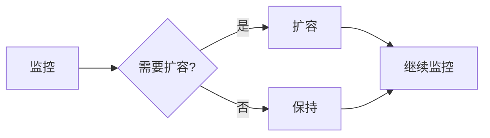

# 自动扩缩容演进 特性跟踪

> 所属阶段: Flink/deployment/evolution | 前置依赖: [Auto Scaling][^1] | 形式化等级: L3

## 1. 概念定义 (Definitions)

### Def-F-Autoscale-01: Auto Scaling

自动扩缩容：
$$
\text{Scale} = f(\text{Load}, \text{Latency}, \text{Cost})
$$

## 2. 属性推导 (Properties)

### Prop-F-Autoscale-01: Scaling Speed

扩缩容速度：
$$
T_{\text{scale}} < 60s
$$

## 3. 关系建立 (Relations)

### 扩缩容演进

| 版本 | 特性 | 状态 |
|------|------|------|
| 2.4 | 基于背压 | GA |
| 2.5 | 预测性扩缩容 | GA |
| 3.0 | 智能扩缩容 | 设计中 |

## 4. 论证过程 (Argumentation)

### 4.1 触发条件

| 指标 | 阈值 |
|------|------|
| CPU | >80% |
| 背压 | >5s |
| 延迟 | >SLA |

## 5. 形式证明 / 工程论证

### 5.1 扩缩容算法

```java
public class AdaptiveScaler {
    public int calculateTargetParallelism(Metrics metrics) {
        double load = metrics.getLoad();
        return (int) Math.ceil(currentParallelism * load / targetUtilization);
    }
}
```

## 6. 实例验证 (Examples)

### 6.1 配置

```yaml
autoscaling.enabled: true
autoscaling.min-parallelism: 2
autoscaling.max-parallelism: 100
```

## 7. 可视化 (Visualizations)



## 8. 引用参考 (References)

[^1]: Flink Auto Scaling Documentation

---

## 跟踪信息

| 属性 | 值 |
|------|-----|
| 版本 | 2.4-3.0 |
| 当前状态 | 演进中 |

---

*文档版本: v1.0 | 创建日期: 2026-04-13*
