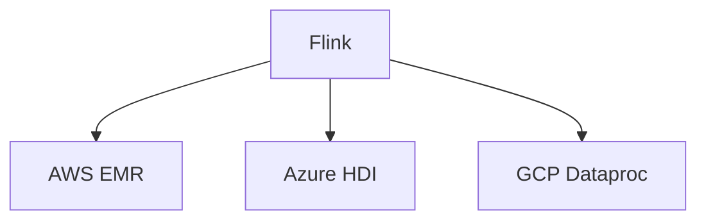

# 云部署演进 特性跟踪

> 所属阶段: Flink/deployment/evolution | 前置依赖: [云部署][^1] | 形式化等级: L3

## 1. 概念定义 (Definitions)

### Def-F-Deploy-Cloud-01: Managed Service

托管服务：
$$
\text{Managed} = \text{Provisioning} + \text{Maintenance} + \text{Monitoring}
$$

## 2. 属性推导 (Properties)

### Prop-F-Deploy-Cloud-01: Auto Provisioning

自动配置：
$$
\text{Resources} \to \text{AutoProvision}
$$

## 3. 关系建立 (Relations)

### 云部署演进

| 版本 | 特性 | 状态 |
|------|------|------|
| 2.4 | EMR集成 | GA |
| 2.5 | Ververica | GA |
| 3.0 | 多云原生 | 设计中 |

## 4. 论证过程 (Argumentation)

### 4.1 云服务

| 厂商 | 服务 |
|------|------|
| AWS | EMR, KDA |
| Azure | HDInsight |
| GCP | Dataproc |
| 阿里云 | Ververica |

## 5. 形式证明 / 工程论证

### 5.1 Terraform部署

```hcl
resource "aws_kinesisanalyticsv2_application" "flink" {
  name = "flink-app"
  runtime_environment = "FLINK-1_18"
}
```

## 6. 实例验证 (Examples)

### 6.1 AWS EMR

```bash
aws emr create-cluster \
  --name "Flink Cluster" \
  --release-label emr-6.15.0 \
  --applications Name=Flink
```

## 7. 可视化 (Visualizations)



## 8. 引用参考 (References)

[^1]: Cloud Deployment Documentation

---

## 跟踪信息

| 属性 | 值 |
|------|-----|
| 版本 | 2.4-3.0 |
| 当前状态 | 演进中 |
