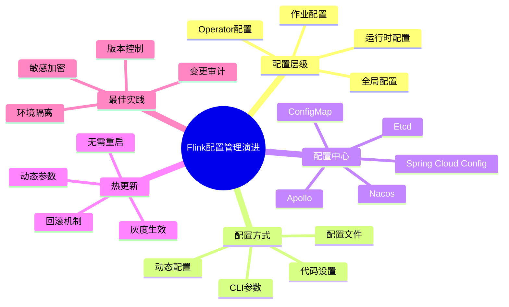
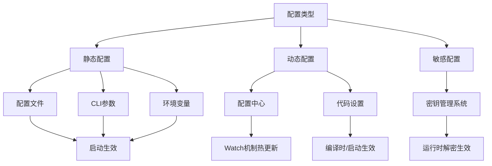
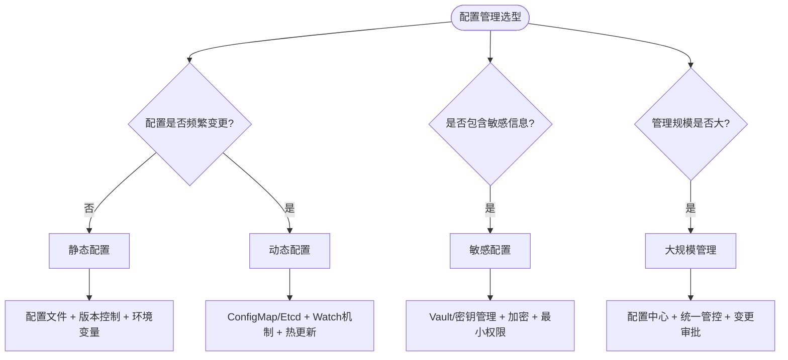

# 配置管理演进 特性跟踪

> 所属阶段: Flink/deployment/evolution | 前置依赖: [Configuration][^1] | 形式化等级: L3

## 1. 概念定义 (Definitions)

### Def-F-Config-01: Dynamic Config

动态配置：
$$
\text{Config}_{\text{runtime}} \neq \text{Config}_{\text{startup}}
$$

## 2. 属性推导 (Properties)

### Prop-F-Config-01: Hot Reload

热重载：
$$
\Delta\text{Config} \to \text{ApplyWithoutRestart}
$$

## 3. 关系建立 (Relations)

### 配置演进

| 版本 | 特性 | 状态 |
|------|------|------|
| 2.4 | 配置中心 | GA |
| 2.5 | 动态更新 | GA |
| 3.0 | GitOps配置 | 设计中 |

## 4. 论证过程 (Argumentation)

### 4.1 配置来源

| 来源 | 优先级 |
|------|--------|
| 代码 | 低 |
| 文件 | 中 |
| 环境变量 | 高 |
| 配置中心 | 最高 |

## 5. 形式证明 / 工程论证

### 5.1 动态配置

```java
import org.apache.flink.streaming.api.environment.StreamExecutionEnvironment;
public class Example {
    public static void main(String[] args) throws Exception {
        StreamExecutionEnvironment env = StreamExecutionEnvironment.getExecutionEnvironment();
        ConfigManager cm = ConfigManager.getInstance();
        cm.addListener("parallelism", newValue -> {
            env.setParallelism(Integer.parseInt(newValue));
        });

    }
}

```

## 6. 实例验证 (Examples)

### 6.1 K8s ConfigMap

```yaml
apiVersion: v1
kind: ConfigMap
metadata:
  name: flink-config
data:
  flink-conf.yaml: |
    parallelism.default: 4
```

## 7. 可视化 (Visualizations)


### 思维导图：Flink配置管理演进全景



### 多维关联树：配置类型→管理方式→生效机制



### 决策树：配置管理选型指南



## 8. 引用参考 (References)

[^1]: Flink Configuration Documentation

---

## 跟踪信息

| 属性 | 值 |
|------|-----|
| 版本 | 2.4-3.0 |
| 当前状态 | 演进中 |

---

*文档版本: v1.0 | 创建日期: 2026-04-19*
