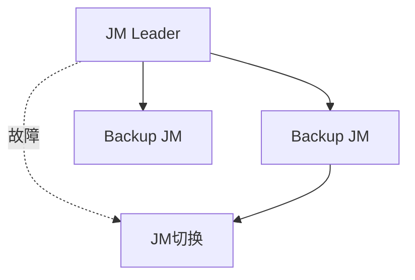

# 高可用性演进 特性跟踪

> 所属阶段: Flink/deployment/evolution | 前置依赖: [HA][^1] | 形式化等级: L3

## 1. 概念定义 (Definitions)

### Def-F-Deploy-HA-01: High Availability

高可用性：
$$
\text{HA} = \text{FaultTolerance} + \text{AutoRecovery}
$$

## 2. 属性推导 (Properties)

### Prop-F-Deploy-HA-01: Recovery Time

恢复时间：
$$
T_{\text{recovery}} < 3min
$$

## 3. 关系建立 (Relations)

### HA演进

| 版本 | 特性 | 状态 |
|------|------|------|
| 2.4 | ZK HA | GA |
| 2.5 | K8s原生HA | GA |
| 3.0 | 无ZK HA | 设计中 |

## 4. 论证过程 (Argumentation)

### 4.1 HA模式

| 模式 | 元数据存储 |
|------|------------|
| ZooKeeper | ZK ensemble |
| Kubernetes | K8s ConfigMap |
| Embedded | 嵌入式Raft |

## 5. 形式证明 / 工程论证

### 5.1 HA配置

```yaml
high-availability: zookeeper
high-availability.zookeeper.quorum: zk1:2181,zk2:2181
```

## 6. 实例验证 (Examples)

### 6.1 K8s HA

```yaml
spec:
  jobManager:
    replicas: 3
  flinkConfiguration:
    high-availability: kubernetes
```

## 7. 可视化 (Visualizations)



## 8. 引用参考 (References)

[^1]: Flink HA Documentation

---

## 跟踪信息

| 属性 | 值 |
|------|-----|
| 版本 | 2.4-3.0 |
| 当前状态 | 演进中 |
