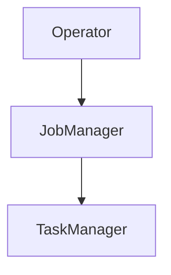

# Kubernetes部署演进 特性跟踪

> 所属阶段: Flink/deployment/evolution | 前置依赖: [K8s部署][^1] | 形式化等级: L3

## 1. 概念定义 (Definitions)

### Def-F-Deploy-K8s-01: K8s Native

K8s原生部署：
$$
\text{K8sNative} = \text{CRD} + \text{Operator} + \text{NativeAPI}
$$

## 2. 属性推导 (Properties)

### Prop-F-Deploy-K8s-01: Self-Healing

自愈能力：
$$
\text{Failure} \to \text{AutoRestart}
$$

## 3. 关系建立 (Relations)

### K8s演进

| 版本 | 特性 | 状态 |
|------|------|------|
| 2.4 | Operator增强 | GA |
| 2.5 | GitOps支持 | GA |
| 3.0 | 云原生原生 | 设计中 |

## 4. 论证过程 (Argumentation)

### 4.1 部署模式

| 模式 | 描述 |
|------|------|
| Application | 应用模式 |
| Session | 会话模式 |
| Job | 单作业模式 |

## 5. 形式证明 / 工程论证

### 5.1 FlinkDeployment CR

```yaml
apiVersion: flink.apache.org/v1beta1
kind: FlinkDeployment
metadata:
  name: example
spec:
  image: flink:2.4
  jobManager:
    resource:
      memory: 2048m
  taskManager:
    resource:
      memory: 4096m
```

## 6. 实例验证 (Examples)

### 6.1 Helm部署

```bash
helm install flink-kubernetes-operator \
  https://github.com/apache/flink-kubernetes-operator/releases/download/v1.7.0/flink-kubernetes-operator-1.7.0.tgz
```

## 7. 可视化 (Visualizations)



## 8. 引用参考 (References)

[^1]: Flink K8s Operator Documentation

---

## 跟踪信息

| 属性 | 值 |
|------|-----|
| 版本 | 2.4-3.0 |
| 当前状态 | 演进中 |

---

*文档版本: v1.0 | 创建日期: 2026-04-13*
