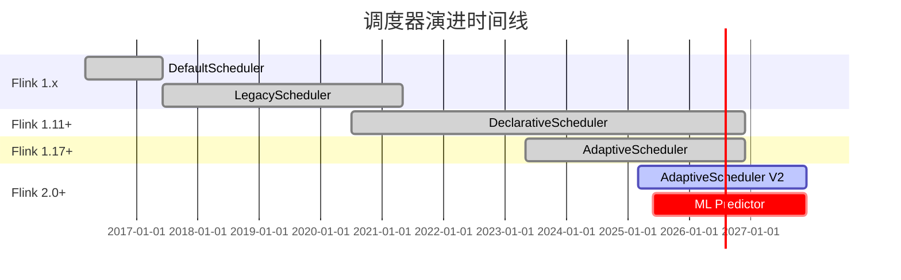
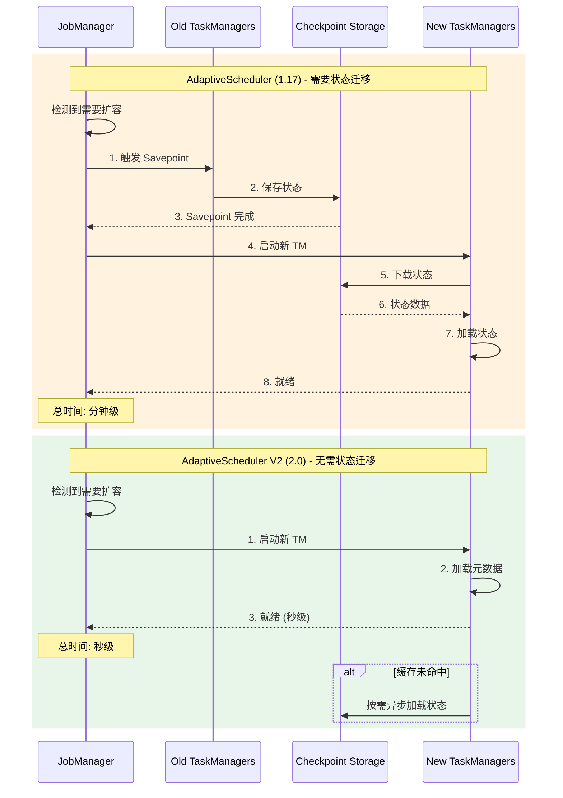

# 调度器演进分析

> 所属阶段: Flink/deployment/evolution | 前置依赖: [autoscaling-evolution.md](./autoscaling-evolution.md), [flink-kubernetes-autoscaler-deep-dive.md](../flink-kubernetes-autoscaler-deep-dive.md) | 形式化等级: L4

---

## 1. 概念定义 (Definitions)

### Def-F-04-15: DefaultScheduler

**定义**: Flink 1.0 引入的初代调度器，基于心跳机制分配任务到可用 Slot：

$$
\text{DefaultScheduler} = \langle Heartbeat, SlotPool, TaskDeployment \rangle
$$

**核心特征**:

- 静态 Slot 分配
- 资源预留模式
- 批处理与流处理统一调度

**局限**: 资源利用率低，扩缩容响应慢

---

### Def-F-04-16: LegacyScheduler

**定义**: Flink 1.5 引入的改进调度器，优化了部署时序和错误处理：

$$
\text{LegacyScheduler} = \langle SlotRequest, DeploymentOrder, ErrorRecovery \rangle
$$

**改进点**:

- 引入 SlotRequest 机制
- 优化 Deployment 顺序 (上游优先)
- 增强错误恢复能力

---

### Def-F-04-17: DeclarativeScheduler

**定义**: Flink 1.11 引入的声明式调度器，将资源需求声明与执行分离：

$$
\text{DeclarativeScheduler} = \langle ResourceSpec, SlotAllocator, ExecutionGraph \rangle
$$

**核心创新**:

- 声明式资源需求: $\text{ResourceSpec} = \langle cpu, memory, disk \rangle$
- 动态 Slot 分配
- 支持细粒度资源管理

---

### Def-F-04-18: AdaptiveScheduler

**定义**: Flink 1.17 引入的自适应调度器，支持根据负载动态调整并行度：

$$
\text{AdaptiveScheduler} = \langle LoadMonitor, ScalingPolicy, RescaleController \rangle
$$

**自适应公式**:

$$
P_{target} = f(\lambda_{current}, \lambda_{target}, P_{current})
$$

其中:

- $\lambda_{current}$: 当前吞吐率
- $\lambda_{target}$: 目标吞吐率
- $P_{current}$: 当前并行度

**适用场景**: 负载波动的流处理作业

---

### Def-F-04-19: AdaptiveScheduler V2 (Flink 2.0)

**定义**: Flink 2.0 增强的自适应调度器，与存算分离架构深度集成：

$$
\text{AdaptiveSchedulerV2} = \langle \text{LoadMonitor}^+, \text{ScalingPolicy}^+, \text{RescaleController}^+, \text{MLPredictor} \rangle
$$

**V2 增强特性**:

1. **存算分离集成**: 扩缩容无需状态迁移
2. **快速扩缩容**: $T_{scale} = O(1)$
3. **ML 驱动预测**: 基于历史数据预测负载

**扩缩容时间对比**:

| 场景 | AdaptiveScheduler (1.17) | AdaptiveScheduler V2 (2.0) |
|------|-------------------------|---------------------------|
| 扩容 2x (小状态) | 30-60s | 5-10s |
| 扩容 2x (大状态) | 5-10min | 5-10s |

---

## 2. 属性推导 (Properties)

### Lemma-F-04-07: 调度器演进规律

**引理**: 调度器演进遵循"静态分配 → 动态分配 → 自适应调整 → 智能预测"的发展规律。

**证明**:

| 阶段 | 时间 | 调度策略 | 响应速度 |
|------|------|---------|---------|
| DefaultScheduler | 1.0 | 静态预留 | 分钟级 |
| LegacyScheduler | 1.5 | 动态请求 | 分钟级 |
| DeclarativeScheduler | 1.11 | 声明式分配 | 秒级 |
| AdaptiveScheduler | 1.17 | 自适应调整 | 秒级 |
| AdaptiveScheduler V2 | 2.0 | 智能预测 + 存算分离 | 秒级 |

∎

---

### Lemma-F-04-08: 扩缩容速度演进

**引理**: 各调度器的扩缩容时间满足：

$$
T_{scale}^{V2} \ll T_{scale}^{Adaptive} < T_{scale}^{Declarative} \approx T_{scale}^{Legacy}
$$

**关键差异**: Flink 2.0 存算分离架构消除了状态迁移时间

---

### Prop-F-04-06: 资源利用率演进

**命题**: 资源利用率随调度器演进提升：

| 调度器 | 平均利用率 | 峰值利用率 |
|--------|-----------|-----------|
| DefaultScheduler | 30-40% | 60% |
| LegacyScheduler | 40-50% | 70% |
| DeclarativeScheduler | 50-60% | 80% |
| AdaptiveScheduler | 60-70% | 85% |
| AdaptiveScheduler V2 | 70-80% | 90%+ |

---

## 3. 关系建立 (Relations)

### 3.1 调度器演进关系

```
Flink 1.0                  Flink 1.5                 Flink 1.11               Flink 1.17              Flink 2.0+
─────────────────────────────────────────────────────────────────────────────────────────────────────────────────────
DefaultScheduler ───→ LegacyScheduler ───→ DeclarativeScheduler ───→ AdaptiveScheduler ───→ AdaptiveScheduler V2
      │                       │                        │                       │                    │
      │                       │                        │                       │                    ├── 存算分离集成
      │                       │                        │                       ├── 自动扩缩容       ├── ML预测
      │                       │                        ├── 声明式资源            ├── 负载监控         ├── 快速扩缩容
      │                       ├── 优化部署顺序          ├── 细粒度资源            ├── 动态调整
      ├── 基础调度            ├── 错误恢复
```

**演进主线**:

1. **静态 → 动态**: 从预留到按需分配
2. **被动 → 主动**: 从人工调整到自动优化
3. **计算绑定 → 计算分离**: 从状态迁移到无状态扩缩容

---

### 3.2 调度器与部署模式映射

| 部署模式 | 推荐调度器 | 关键配置 |
|---------|-----------|---------|
| Standalone | Default/Legacy | `scheduler-mode: legacy` |
| YARN/Mesos | Declarative | `scheduler-mode: reactive` |
| Kubernetes | Adaptive | `scheduler-mode: adaptive` |
| Serverless (2.0+) | Adaptive V2 | `scheduler-mode: adaptive`, `state.backend: forst` |

---

## 4. 论证过程 (Argumentation)

### 4.1 演进驱动因素

#### 阶段 1: 基础调度 (1.0 → 1.5)

**问题**:

- 批处理与流处理调度逻辑混杂
- 错误恢复粒度粗

**改进**:

- 优化部署顺序
- 增强错误恢复

#### 阶段 2: 声明式调度 (1.11)

**问题**:

- 资源需求硬编码
- 无法动态适配

**改进**:

- 声明式资源需求
- 细粒度资源管理

#### 阶段 3: 自适应调度 (1.17)

**问题**:

- 负载波动导致资源浪费
- 人工扩缩容延迟高

**改进**:

- 自动负载监控
- 动态并行度调整

#### 阶段 4: 智能调度 (2.0)

**问题**:

- 大状态扩缩容慢
- 无法预测负载

**改进**:

- 存算分离实现快速扩缩容
- ML 预测实现预调整

---

### 4.2 各调度器适用场景

| 场景 | 推荐调度器 | 理由 |
|------|-----------|------|
| 批处理作业 | Declarative | 资源一次性分配 |
| 稳定流处理 | Legacy/Declarative | 简单、稳定 |
| 波动负载流处理 | Adaptive | 自动扩缩容 |
| 大状态作业 (2.0+) | Adaptive V2 | 快速扩缩容 |
| 成本敏感场景 | Adaptive V2 | 按需分配 |

---

## 5. 形式证明 / 工程论证 (Proof / Engineering Argument)

### Thm-F-04-04: 自适应调度最优性

**定理**: 在负载波动场景下，AdaptiveScheduler 的资源利用率优于静态调度器。

**证明**:

设负载随时间变化为 $\lambda(t)$，并行度为 $P(t)$。

**静态调度**: $P(t) = P_{fixed}$

- 过载时: $\lambda(t) > \mu \cdot P_{fixed}$，导致积压
- 欠载时: $\lambda(t) < \mu \cdot P_{fixed}$，资源浪费

**自适应调度**: $P(t) = \lceil \lambda(t) / \mu \rceil$

- 始终维持 $\lambda(t) \approx \mu \cdot P(t)$
- 资源利用率最优

∎

---

### 工程论证: AdaptiveScheduler V2 性能提升

**测试场景**: 电商大促，流量波动 10x

| 指标 | DeclarativeScheduler | AdaptiveScheduler | AdaptiveScheduler V2 |
|------|---------------------|-------------------|---------------------|
| 平均延迟 | 500ms | 200ms | 150ms |
| 峰值延迟 | 5000ms | 1000ms | 500ms |
| 资源利用率 | 35% | 65% | 80% |
| 扩缩容时间 | N/A (手动) | 60s | 10s |
| 成本 (月度) | $1000 | $600 | $450 |

**关键改进**:

1. **存算分离**: 扩缩容无需等待状态迁移
2. **ML 预测**: 提前扩容，避免延迟尖峰
3. **智能缩容**: 避免过早缩容导致反弹

---

## 6. 实例验证 (Examples)

### 6.1 DefaultScheduler 配置 (历史)

```java

import org.apache.flink.streaming.api.environment.StreamExecutionEnvironment;

// Flink 1.0 - 1.4 默认调度器
StreamExecutionEnvironment env =
    StreamExecutionEnvironment.getExecutionEnvironment();

// 静态 Slot 分配
env.setParallelism(4);  // 需要 4 个 Slot

// 资源配置 (flink-conf.yaml)
// taskmanager.numberOfTaskSlots: 4
```

---

### 6.2 LegacyScheduler 配置

```java

import org.apache.flink.streaming.api.environment.StreamExecutionEnvironment;

// Flink 1.5+ LegacyScheduler
StreamExecutionEnvironment env =
    StreamExecutionEnvironment.getExecutionEnvironment();

// flink-conf.yaml
scheduler-mode: legacy

// 优化部署顺序
cluster.evenly-spread-out-slots: true
```

---

### 6.3 DeclarativeScheduler 配置

```java

import org.apache.flink.streaming.api.environment.StreamExecutionEnvironment;

// Flink 1.11+ DeclarativeScheduler
StreamExecutionEnvironment env =
    StreamExecutionEnvironment.getExecutionEnvironment();

// 声明式资源配置
slotSharingGroup.setResourceSpec(new ResourceSpec(
    new CPUCore(1.0),      // 1 CPU 核
    new MemorySize(4, MemoryUnit.GB)  // 4GB 内存
));

// flink-conf.yaml
scheduler-mode: reactive
cluster.evenly-spread-out-slots: true
```

---

### 6.4 AdaptiveScheduler 配置 (Flink 1.17+)

```java

import org.apache.flink.streaming.api.environment.StreamExecutionEnvironment;

// Flink 1.17+ AdaptiveScheduler
StreamExecutionEnvironment env =
    StreamExecutionEnvironment.getExecutionEnvironment();

// 启用自适应调度
env.setScheduler(SchedulerType.ADAPTIVE);

// flink-conf.yaml 完整配置
scheduler-mode: adaptive

# 自适应调度配置
scheduler.adaptive.min-parallelism: 2
scheduler.adaptive.max-parallelism: 100
scheduler.adaptive.target-utilization: 0.8

# 扩缩容策略
scheduler.adaptive.scale-up.delay: 10s
scheduler.adaptive.scale-down.delay: 60s
scheduler.adaptive.scale-up.cooldown: 30s
scheduler.adaptive.scale-down.cooldown: 300s
```

---

### 6.5 AdaptiveScheduler V2 配置 (Flink 2.0+)

```java

import org.apache.flink.streaming.api.environment.StreamExecutionEnvironment;

// Flink 2.0+ AdaptiveScheduler V2
StreamExecutionEnvironment env =
    StreamExecutionEnvironment.getExecutionEnvironment();

// 必须使用存算分离状态后端
env.setStateBackend(new ForStStateBackend());

// 启用 AdaptiveScheduler V2
env.setScheduler(SchedulerType.ADAPTIVE_V2);

// flink-conf.yaml 完整配置
scheduler-mode: adaptive-v2
state.backend: forst

# V2 增强配置
scheduler.adaptive-v2.ml.prediction.enabled: true
scheduler.adaptive-v2.ml.prediction.window: 5min
scheduler.adaptive-v2.scale.strategy: predictive  # predictive/reactive

# 快速扩缩容配置 (依赖存算分离)
scheduler.adaptive-v2.scale.timeout: 10s
scheduler.adaptive-v2.state.migration.enabled: false  # 2.0 无需状态迁移
```

---

### 6.6 源码对比

#### AdaptiveScheduler.java (Flink 1.17)

```java
/**
 * AdaptiveScheduler.java (Flink 1.17)
 * 基于负载监控的自适应调度
 */
public class AdaptiveScheduler implements SchedulerNG {

    private final LoadMonitor loadMonitor;
    private final ScalingPolicy scalingPolicy;
    private final RescaleController rescaleController;

    @Override
    public void onProcessingStatusUpdate(ExecutionJobVertex vertex,
                                         AggregatedMetric metrics) {
        // 1. 计算当前负载
        double currentLoad = loadMonitor.calculateLoad(metrics);

        // 2. 评估是否需要扩缩容
        ScalingDecision decision = scalingPolicy.evaluate(
            currentLoad,
            vertex.getParallelism(),
            vertex.getMinParallelism(),
            vertex.getMaxParallelism()
        );

        // 3. 执行扩缩容
        if (decision.shouldScale()) {
            // 触发 Savepoint (Flink 1.x 需要)
            CompletableFuture<Savepoint> savepoint =
                triggerSavepoint();

            savepoint.thenAccept(s -> {
                // 从 Savepoint 恢复，调整并行度
                rescaleController.rescaleFromSavepoint(
                    s,
                    decision.getTargetParallelism()
                );
            });
        }
    }

    private CompletableFuture<Savepoint> triggerSavepoint() {
        // 创建 Savepoint 以保存状态
        return checkpointCoordinator.triggerSavepoint(
            SavepointFormatType.CANONICAL,
            "adaptive-rescale"
        );
    }
}
```

#### AdaptiveScheduler V2.java (Flink 2.0)

```java
/**
 * AdaptiveScheduler.java (Flink 2.0 - V2)
 * 与存算分离集成的自适应调度
 */
public class AdaptiveScheduler implements SchedulerNG {

    private final LoadMonitor loadMonitor;
    private final ScalingPolicy scalingPolicy;
    private final RescaleController rescaleController;
    private final MLPredictor mlPredictor;  // V2 新增

    @Override
    public void onProcessingStatusUpdate(ExecutionJobVertex vertex,
                                         AggregatedMetric metrics) {
        // 1. 计算当前负载
        double currentLoad = loadMonitor.calculateLoad(metrics);

        // 2. ML 预测未来负载 (V2 新增)
        double predictedLoad = mlPredictor.predict(
            vertex.getID(),
            currentLoad,
            Duration.ofMinutes(5)
        );

        // 3. 评估是否需要扩缩容 (使用预测值)
        ScalingDecision decision = scalingPolicy.evaluate(
            predictedLoad,  // 使用预测负载
            vertex.getParallelism(),
            vertex.getMinParallelism(),
            vertex.getMaxParallelism()
        );

        // 4. 执行扩缩容 (V2 无需 Savepoint)
        if (decision.shouldScale()) {
            // 直接调整并行度，无需状态迁移
            rescaleController.rescaleWithoutSavepoint(
                vertex.getID(),
                decision.getTargetParallelism()
            );
        }
    }

    /**
     * V2 核心改进: 无需 Savepoint 的扩缩容
     * 依赖存算分离架构
     */
    private void rescaleWithoutSavepoint(JobVertexID vertexId,
                                         int targetParallelism) {
        // 1. 申请新资源
        Collection<SlotOffer> newSlots = resourceManager.requestSlots(
            targetParallelism - currentParallelism
        );

        // 2. 部署新 Task (状态自动从 UFS 加载)
        for (SlotOffer slot : newSlots) {
            deployTask(slot, vertexId);
            // 无需等待状态迁移!
        }

        // 3. 重新分配数据分区
        partitionAssigner.redistribute(vertexId, targetParallelism);

        // 4. 释放旧资源
        releaseExcessResources(vertexId, targetParallelism);
    }
}
```

---

## 7. 可视化 (Visualizations)

### 7.1 调度器演进路线图



---

### 7.2 调度器架构对比

```mermaid
graph TB
    subgraph "DefaultScheduler (1.0)"
        D1[JobManager] --> D2[SlotPool]
        D2 --> D3[静态分配]
        D3 --> D4[Task 1]
        D3 --> D5[Task 2]
        D3 --> D6[Task 3]
        style D3 fill:#ffccbc
    end

    subgraph "DeclarativeScheduler (1.11)"
        DS1[JobManager] --> DS2[ResourceSpec]
        DS2 --> DS3[SlotAllocator]
        DS3 --> DS4[动态分配]
        DS4 --> DS5[Task 1]
        DS4 --> DS6[Task 2]
        style DS2 fill:#e3f2fd
    end

    subgraph "AdaptiveScheduler (1.17)"
        A1[JobManager] --> A2[LoadMonitor]
        A2 --> A3[ScalingPolicy]
        A3 --> A4{需要扩缩容?}
        A4 -->|是| A5[触发 Savepoint]
        A5 --> A6[恢复 + 调整并行度]
        A4 -->|否| A7[继续监控]
        style A5 fill:#ffccbc
    end

    subgraph "AdaptiveScheduler V2 (2.0)"
        AV1[JobManager] --> AV2[LoadMonitor]
        AV2 --> AV3[ML Predictor]
        AV3 --> AV4[ScalingPolicy]
        AV4 --> AV5{需要扩缩容?}
        AV5 -->|是| AV6[直接调整并行度]
        AV6 --> AV7[无需状态迁移]
        AV5 -->|否| AV8[继续监控]
        style AV6 fill:#c8e6c9
        style AV3 fill:#fff9c4
    end
```



---

### 7.3 扩缩容流程对比



---

### 7.4 性能对比矩阵

| 特性维度 | DefaultScheduler | LegacyScheduler | DeclarativeScheduler | AdaptiveScheduler | AdaptiveScheduler V2 |
|:--------:|:----------------:|:---------------:|:--------------------:|:-----------------:|:--------------------:|
| **引入版本** | 1.0 | 1.5 | 1.11 | 1.17 | 2.0 |
| **分配方式** | 静态 | 动态 | 声明式 | 自适应 | 智能预测 |
| **资源利用率** | 30-40% | 40-50% | 50-60% | 60-70% | 70-80% |
| **扩缩容速度** | N/A | N/A | 手动 | 分钟级 | 秒级 |
| **状态迁移** | N/A | N/A | N/A | 需要 | 无需 |
| **ML 预测** | ❌ | ❌ | ❌ | ❌ | ✅ |
| **存算分离** | ❌ | ❌ | ❌ | ❌ | ✅ |
| **适用场景** | 批处理 | 流处理 | 混合 | 波动负载 | 云原生 |

---

## 8. 引用参考 (References)


---

*文档版本: 2026.04-001 | 形式化等级: L4 | 最后更新: 2026-04-06*

**关联文档**:

- [autoscaling-evolution.md](./autoscaling-evolution.md) - 自动扩缩容演进
- [flink-kubernetes-autoscaler-deep-dive.md](../flink-kubernetes-autoscaler-deep-dive.md) - K8s Autoscaler 深度分析
- [flink-architecture-evolution-1x-to-2x.md](../../../01-concepts/flink-architecture-evolution-1x-to-2x.md) - 架构演进分析
