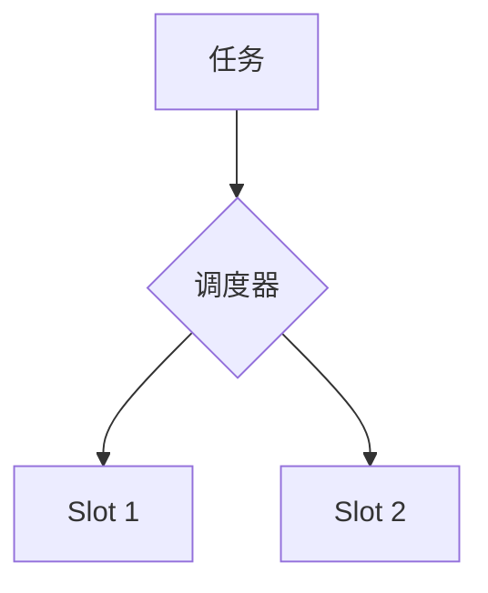

# 资源调度演进 特性跟踪

> 所属阶段: Flink/deployment/evolution | 前置依赖: [Scheduler][^1] | 形式化等级: L3

## 1. 概念定义 (Definitions)

### Def-F-Schedule-01: Task Scheduling

任务调度：
$$
\text{Schedule} : \text{Task} \to \text{Slot}
$$

## 2. 属性推导 (Properties)

### Prop-F-Schedule-01: Locality Awareness

本地性感知：
$$
\text{Prefer}(\text{DataLocality})
$$

## 3. 关系建立 (Relations)

### 调度演进

| 版本 | 特性 | 状态 |
|------|------|------|
| 2.4 | 延迟调度 | GA |
| 2.5 | 自适应调度 | GA |
| 3.0 | ML调度 | 设计中 |

## 4. 论证过程 (Argumentation)

### 4.1 调度策略

| 策略 | 描述 |
|------|------|
| FIFO | 先进先出 |
| FAIR | 公平调度 |
| PRIORITY | 优先级 |

## 5. 形式证明 / 工程论证

### 5.1 调度器配置

```yaml
scheduler-mode: reactive
cluster.evenly-spread-out-slots: true
```

## 6. 实例验证 (Examples)

### 6.1 延迟调度

```java
// 等待数据本地化
env.setBufferTimeout(100);
```

## 7. 可视化 (Visualizations)



## 8. 引用参考 (References)

[^1]: Flink Scheduler Documentation

---

## 跟踪信息

| 属性 | 值 |
|------|-----|
| 版本 | 2.4-3.0 |
| 当前状态 | 演进中 |
