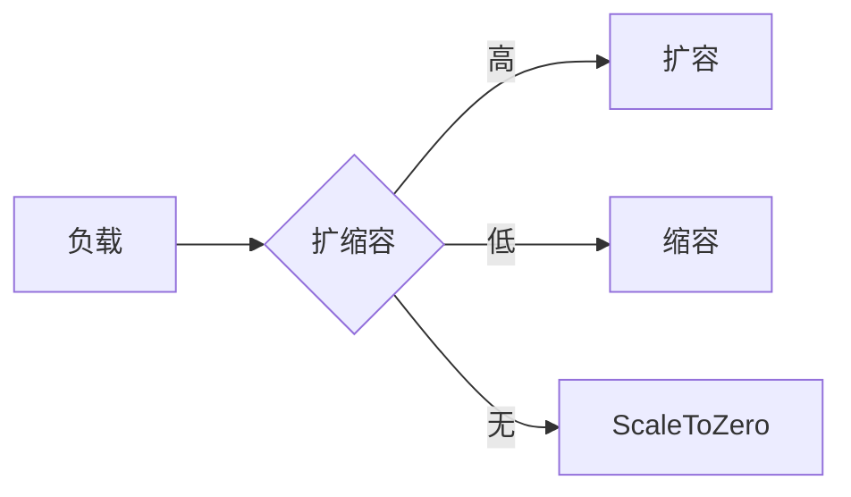

# Serverless部署演进 特性跟踪

> 所属阶段: Flink/deployment/evolution | 前置依赖: [Serverless][^1] | 形式化等级: L3

## 1. 概念定义 (Definitions)

### Def-F-Deploy-Serverless-01: Serverless Mode

无服务器模式：
$$
\text{Serverless} = \text{ScaleToZero} + \text{PayPerUse} + \text{AutoManage}
$$

## 2. 属性推导 (Properties)

### Prop-F-Deploy-Serverless-01: Cold Start

冷启动：
$$
T_{\text{cold}} < 60s
$$

## 3. 关系建立 (Relations)

### Serverless演进

| 版本 | 特性 | 状态 |
|------|------|------|
| 2.4 | Preview | GA |
| 2.5 | V2优化 | GA |
| 3.0 | 原生Serverless | 设计中 |

## 4. 论证过程 (Argumentation)

### 4.1 配置

```yaml
execution.mode: serverless
serverless.autoscaling.enabled: true
serverless.scale-to-zero: true
```

## 5. 形式证明 / 工程论证

### 5.1 自动扩缩容

```java
public class ServerlessAutoscaler {
    public void scaleOnDemand(LoadMetrics metrics) {
        if (metrics.getUtilization() > 0.8) {
            scaleUp();
        } else if (metrics.getUtilization() < 0.2) {
            scaleDown();
        }
    }
}
```

## 6. 实例验证 (Examples)

### 6.1 Serverless提交

```bash
flink run-application \
  --target kubernetes-application \
  --kubernetes-cluster-id my-job \
  ./my-job.jar
```

## 7. 可视化 (Visualizations)



## 8. 引用参考 (References)

[^1]: Flink Serverless Documentation

---

## 跟踪信息

| 属性 | 值 |
|------|-----|
| 版本 | 2.4-3.0 |
| 当前状态 | 演进中 |
