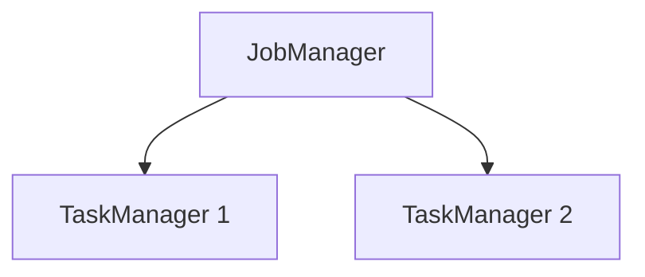
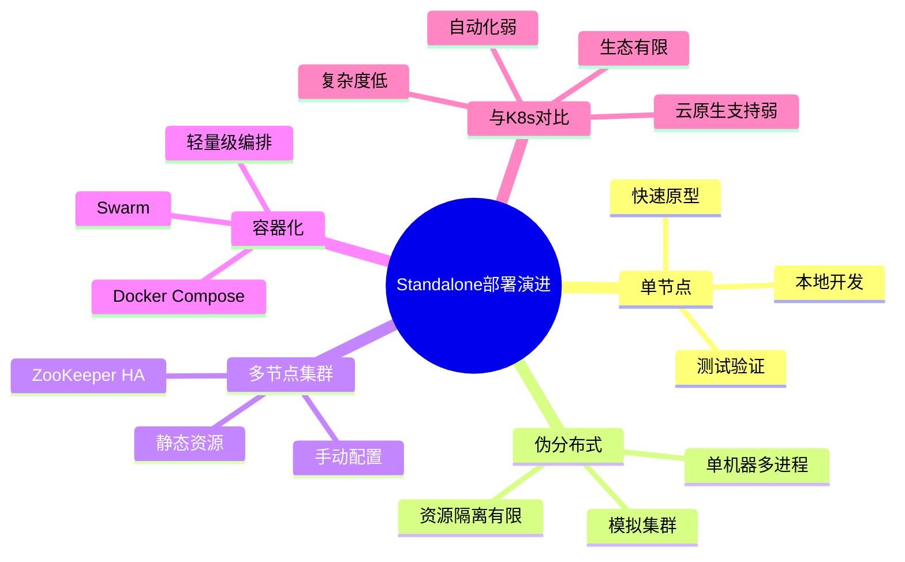
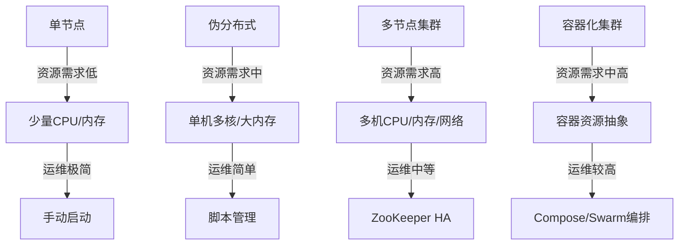
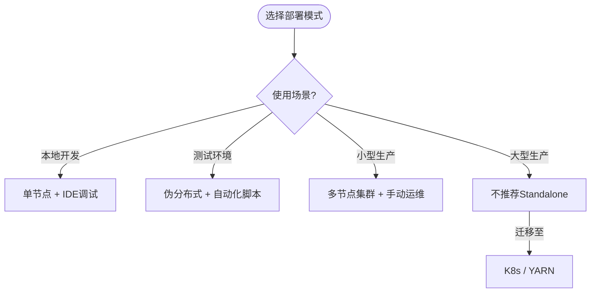

# Standalone部署演进 特性跟踪

> 所属阶段: Flink/deployment/evolution | 前置依赖: [Standalone部署][^1] | 形式化等级: L3

## 1. 概念定义 (Definitions)

### Def-F-Deploy-Standalone-01: Standalone Cluster

独立集群：
$$
\text{Standalone} = \text{FixedResources} + \text{ManualManagement}
$$

## 2. 属性推导 (Properties)

### Prop-F-Deploy-Standalone-01: Startup Speed

启动速度：
$$
T_{\text{startup}} < 30s
$$

## 3. 关系建立 (Relations)

### Standalone演进

| 版本 | 特性 | 状态 |
|------|------|------|
| 2.4 | Docker支持 | GA |
| 2.5 | Docker Compose | GA |
| 3.0 | 轻量级模式 | 设计中 |

## 4. 论证过程 (Argumentation)

### 4.1 部署模式

| 场景 | 推荐 |
|------|------|
| 开发 | Standalone |
| 测试 | Docker |
| 小生产 | HA Standalone |

## 5. 形式证明 / 工程论证

### 5.1 启动脚本

```bash
# 启动集群 ./bin/start-cluster.sh

# 提交作业 ./bin/flink run ./examples/streaming/WordCount.jar
```

## 6. 实例验证 (Examples)

### 6.1 Docker部署

```yaml
version: "3"
services:
  jobmanager:
    image: flink:2.4
    command: jobmanager
  taskmanager:
    image: flink:2.4
    command: taskmanager
```

## 7. 可视化 (Visualizations)



### 演进全景思维导图

Standalone部署从单节点到容器化的演进全景：



### 多维关联树

部署规模、资源需求与运维复杂度的映射关系：



### 使用场景决策树

Standalone部署模式选择决策树：



## 8. 引用参考 (References)

[^1]: Flink Standalone Documentation

---

## 跟踪信息

| 属性 | 值 |
|------|-----|
| 版本 | 2.4-3.0 |
| 当前状态 | 演进中 |

---

*文档版本: v1.0 | 创建日期: 2026-04-18*
