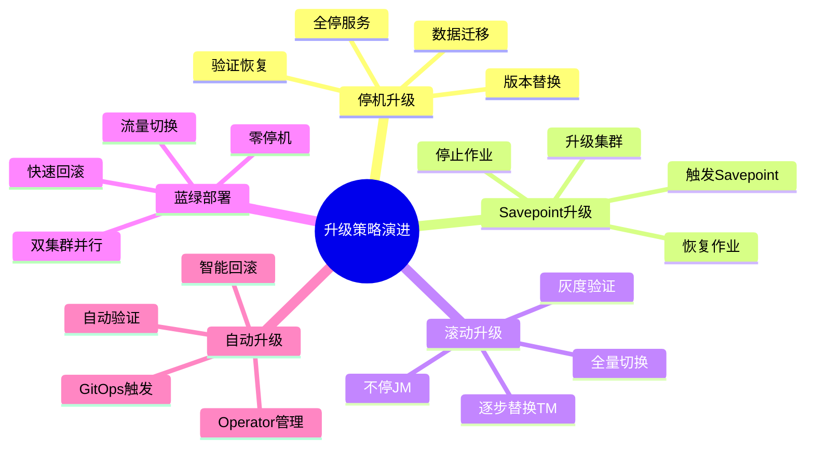
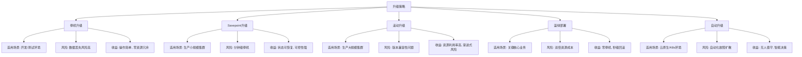
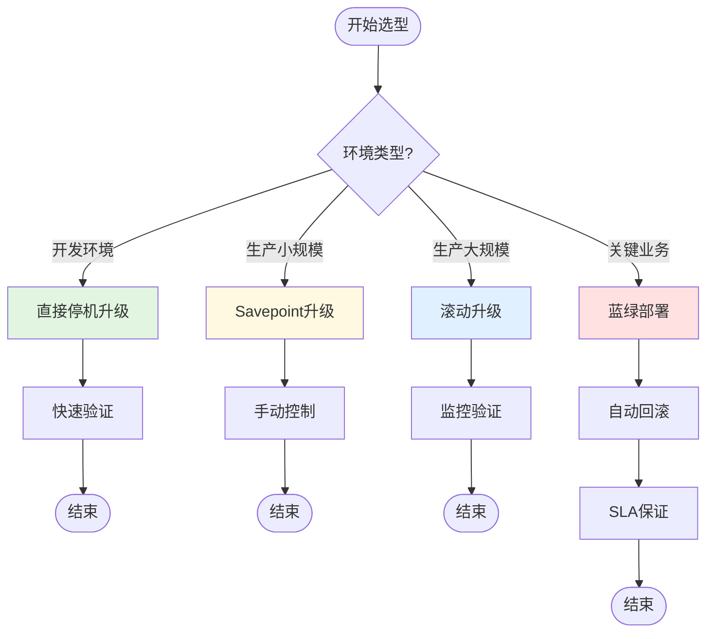

# 升级策略演进 特性跟踪

> 所属阶段: Flink/deployment/evolution | 前置依赖: [Upgrade][^1] | 形式化等级: L3

## 1. 概念定义 (Definitions)

### Def-F-Upgrade-01: State Migration

状态迁移：
$$
\text{State}_{v1} \xrightarrow{\text{transform}} \text{State}_{v2}
$$

## 2. 属性推导 (Properties)

### Prop-F-Upgrade-01: Zero Downtime

零停机：
$$
T_{\text{unavailable}} = 0
$$

## 3. 关系建立 (Relations)

### 升级演进

| 版本 | 特性 | 状态 |
|------|------|------|
| 2.4 | 保存点恢复 | GA |
| 2.5 | 滚动升级 | GA |
| 3.0 | 无缝升级 | 设计中 |

## 4. 论证过程 (Argumentation)

### 4.1 升级策略

| 策略 | 描述 |
|------|------|
| 停止-启动 | 简单但有停机 |
| 蓝绿 | 无停机需双倍资源 |
| 滚动 | 逐步替换 |
| 金丝雀 | 先验证再全量 |

## 5. 形式证明 / 工程论证

### 5.1 滚动升级

```bash
# 创建保存点 flink savepoint $JOB_ID

# 停止作业 flink cancel -s $JOB_ID

# 启动新版本 flink run -s $SAVEPOINT_PATH new-job.jar
```

## 6. 实例验证 (Examples)

### 6.1 K8s滚动升级

```yaml
spec:
  job:
    upgradeMode: savepoint
    state: running
```

## 7. 可视化 (Visualizations)


### 7.2 升级策略演进思维导图

以下思维导图以"升级策略演进"为中心，放射展开五大策略的核心步骤：



### 7.3 升级策略多维关联树

以下层次图展示升级策略到适用场景再到风险收益的映射关系：



### 7.4 升级策略选型决策树

以下决策树根据不同环境特征推荐对应的升级策略：



## 8. 引用参考 (References)

[^1]: Flink Upgrade Documentation

---

## 跟踪信息

| 属性 | 值 |
|------|-----|
| 版本 | 2.4-3.0 |
| 当前状态 | 演进中 |

---

*文档版本: v1.0 | 创建日期: 2026-04-18*
