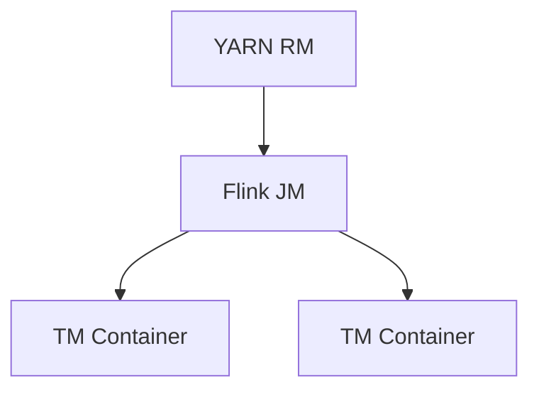
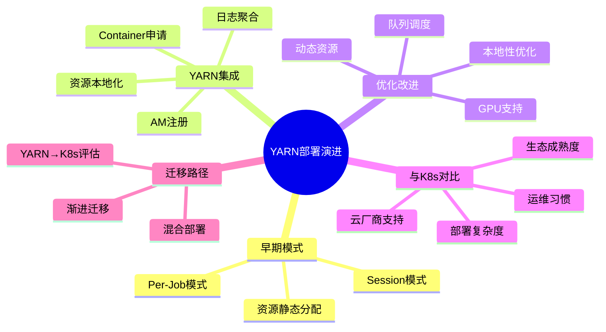
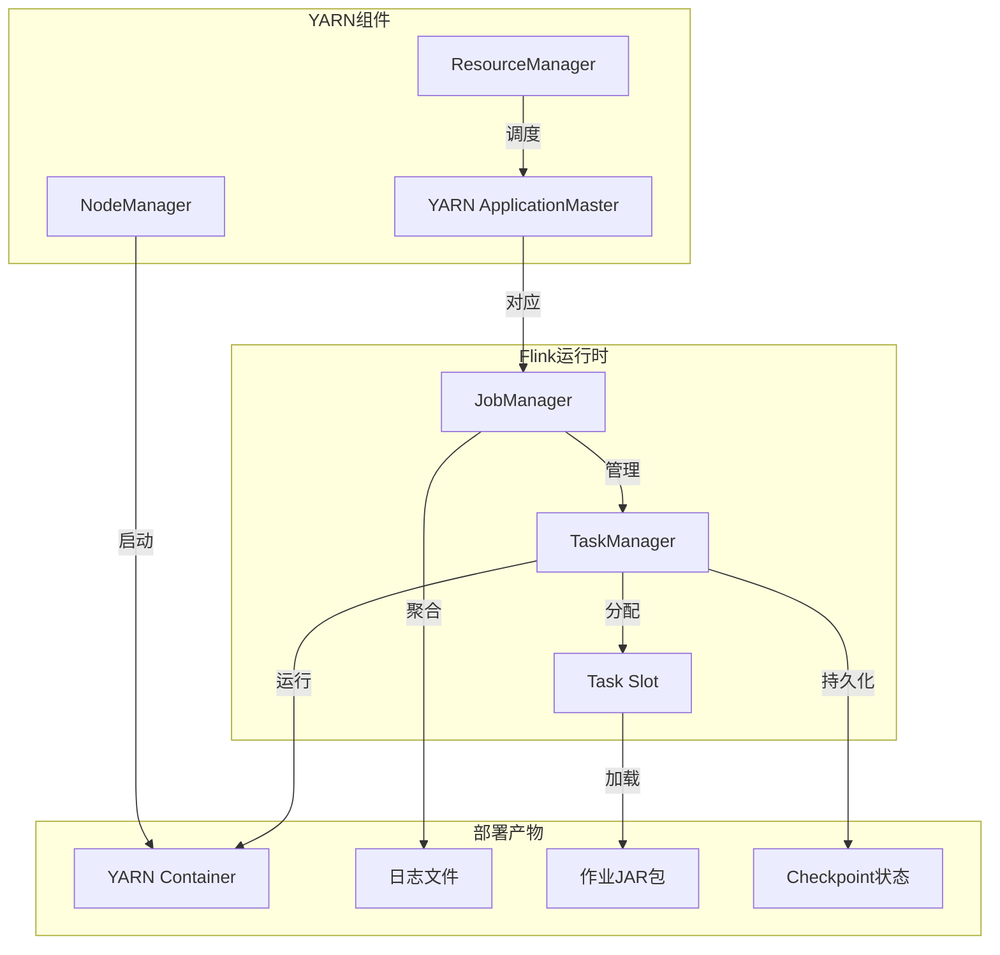
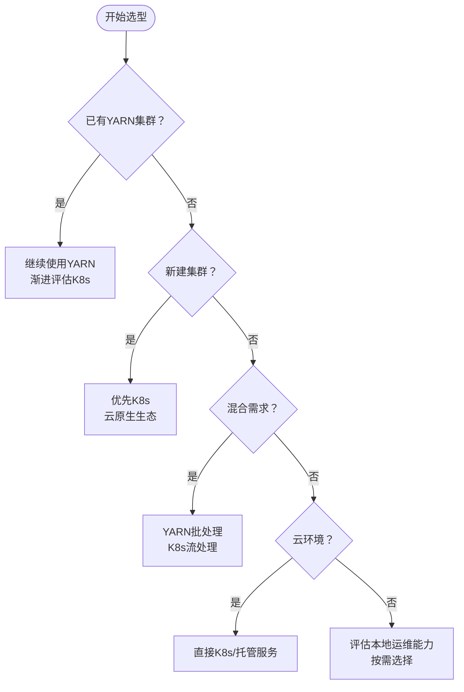

# YARN部署演进 特性跟踪

> 所属阶段: Flink/deployment/evolution | 前置依赖: [YARN部署][^1] | 形式化等级: L3

## 1. 概念定义 (Definitions)

### Def-F-Deploy-YARN-01: YARN Session

YARN会话：
$$
\text{YARNSession} = \text{SharedCluster} + \text{DynamicResource}
$$

## 2. 属性推导 (Properties)

### Prop-F-Deploy-YARN-01: Resource Elasticity

资源弹性：
$$
\text{Resources} = f(\text{Load})
$$

## 3. 关系建立 (Relations)

### YARN演进

| 版本 | 特性 | 状态 |
|------|------|------|
| 2.4 | 动态分配 | GA |
| 2.5 | GPU资源 | GA |
| 3.0 | YARN原生优化 | 设计中 |

## 4. 论证过程 (Argumentation)

### 4.1 部署命令

```bash
# 启动YARN会话 ./bin/yarn-session.sh -nm flink-session -q

# 提交作业 ./bin/flink run -t yarn-per-job ./examples/streaming/WordCount.jar
```

## 5. 形式证明 / 工程论证

### 5.1 资源配置

```yaml
yarn.application-attempts: 10
yarn.application-attempt-failures-validity-interval: 3600000
```

## 6. 实例验证 (Examples)

### 6.1 动态资源

```java
import org.apache.flink.streaming.api.environment.StreamExecutionEnvironment;
public class Example {
    public static void main(String[] args) throws Exception {
        StreamExecutionEnvironment env = StreamExecutionEnvironment.getExecutionEnvironment();
        env.getConfig().setAutoWatermarkInterval(200);

    }
}

```

## 7. 可视化 (Visualizations)



### YARN部署演进思维导图

以下思维导图以"YARN部署演进"为中心，放射展示早期模式、YARN集成、优化改进、与K8s对比及迁移路径五大维度。



### YARN组件→Flink运行时→部署产物映射

以下关联树展示YARN底层组件如何映射到Flink运行时实体，并生成最终部署产物。



### YARN vs K8s 选型决策树

以下决策树帮助根据现有集群状态、需求类型及运行环境，在YARN与K8s之间做出部署选型判断。



## 8. 引用参考 (References)

[^1]: Flink YARN Documentation

---

## 跟踪信息

| 属性 | 值 |
|------|-----|
| 版本 | 2.4-3.0 |
| 当前状态 | 演进中 |

---

*文档版本: v1.0 | 创建日期: 2026-04-19*
